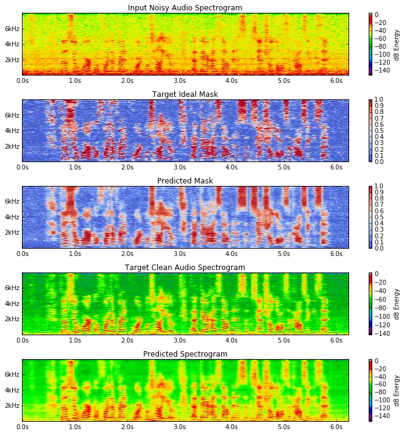
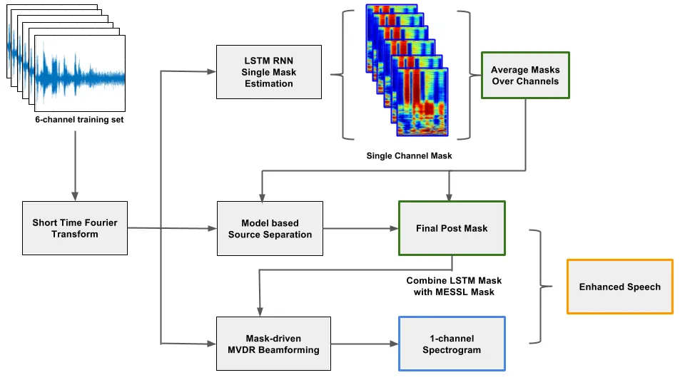

# Combining Spatial Clustering with LSTM Speech Models for Multichannel Speech Enhancement

###### Abstract

Recurrent neural networks using the LSTM architecture can achieve
significant single-channel noise reduction. It is not obvious, however,
how to apply them to multi-channel inputs in a way that can generalize
to new microphone configurations. In contrast, spatial clustering
techniques can achieve such generalization, but lack a strong signal
model.

This paper combines the two approaches to attain both the spatial
separation performance and generality of multichannel spatial clustering
and the signal modeling performance of multiple parallel single-channel
LSTM speech enhancers.

The system is compared to several baselines on the CHiME3 dataset in
terms of speech quality predicted by the PESQ algorithm and word error
rate of a recognizer trained on mis-matched conditions, in order to
focus on generalization.

Our experiments show that by combining the LSTM models with the spatial
clustering, we reduce word error rate by 4.6% absolute (17.2% relative)
on the development set and 11.2% absolute (25.5% relative) on test set
compared with spatial clustering system, and reduce by 10.75% (32.72%
relative) on development set and 6.12% absolute (15.76% relative) on
test data compared with LSTM model.

Felix Grezes¹, Zhaoheng Ni¹, Viet Anh Trinh¹, Michael Mandel¹²

¹The Graduate Center, City University of New York, USA  
²Brooklyn College, City University of New York, USA

fgrezes@gradcenter.cuny.edu, zni@gradcenter.cuny.edu,
vtrinh@gradcenter.cuny.edu, mim@mr-pc.org

Index Terms: Microphone arrays, LSTM, Speech enhancement, Robust Speech
Recognition, Spatial Clustering

## 1 Introduction

With speech recognition techniques approaching human performance on
noise-free audio with a close-talking microphone \[1\], recent research
has focused on the more difficult task of speech recognition in
far-field, noisy environments.

One solution is beamforming, which combines multiple microphone channels
in order to optimize some criterion \[2\], which is typically based on
properties of the signals or the spatial configuration of the recordings
at test time, with no training ahead of time.

Recurrent neural networks using the LSTM architecture can achieve
significant single-channel noise reduction \[3, 4\], and so there is
interest in using trainable deep-learning models to perform beamforming.
This is especially useful for optimizing beamformers directly for
performing automatic speech recognition \[5, 6\], although such
optimization must happen at training time on a corpus of training data.
Such models have difficulty generalizing across microphone arrays,
including differences in number of microphones and array geometries,
such as the AMI corpus \[7, 8\] and the CHIME challenge \[9\]. This is
similarly reflected in difficulties generalization of certain types of
beamforming across conditions \[10\].

In contrast to deep learning-based beamforming, spatial clustering is an
unsupervised method for performing source separation, so it easily
adapts across microphone arrays \[11, 12, 13\]. Such methods group
spectrogram points based on similarities in spatial properties, but are
typically not able to take advantage of signal models, such as models of
speech or noise. Developed by Mandel et al \[11\], Model-based EM Source
Separation and Localization (MESSL) is a system that computes
spectrogram masks for source separation as a byproduct of estimating the
spatial location of the sources. It does so using the EM (expectation
maximization) algorithm, iteratively refining the estimates of the
spatial parameters of the audio sources and the spectrogram regions
dominated by each source.

The goal of this paper is to augment the capabilities of MESSL using
neural network trained speech signal models.

Other recent approaches to combine beamforming with ASR to optimize the
beamformer for metrics on the ASR output \[14, 15\].

In this paper we describe several methods for incorporating
single-channel LSTM-based speech enhancement into MESSL to improve its
performance.

The first approach is a naive combination of the parallel single-channel
LSTM models \[16\] with the MESSL mask. It is able to increase PESQ
score from 1.57 to 2.49 (see Table 2), and reduce WER from 43.94% to
36.05% (See Table 3) on the CHIME3 evaluation dataset of real noisy
environmental audio. The second is to use the LSTM-based mask to
initialize MESSL. This provides a comparable PESQ score of 2.46, while
further improving the WER to 32.72% . (See Tables 2 and 3).

## 2 Related Work

Recently, Nugraha et al. \[17\] also studied multi-channel source
separation using deep feedforward neural networks, using a multi-channel
Gaussian model to combine the source spectrograms, to take advantage of
the spatial information present in the microphone array. They explore
the efficacy of different loss functions and other model
hyper-parameters. One of their findings is that the standard mean-square
error loss function performed close to the best.

Pfeifenberger et al. \[18\] proposed an optimal multi-channel filter
which relies solely on speech presence probability. This speech-noise
mask is learned using a 2-layer feedforward neural network, trained on
the simulated noisy data portion of CHIME-3. They show that this filter
improves the PESQ score of the audio.

Heymann et al \[14, 15\] also study the combination of multi-channel
beamforming with single-channel neural network model. Similar to ours,
the proposed model consists of a bidirectional LSTM layer, followed by
feedforward layers, in their case three. Of particular note is the
companion paper by Boeddeker et al. \[19\], which provides a major
theoretical breakthrough by generalizing the backpropagation algorithm
to complex values. This allows their system to run on complex
spectrograms, and not real valued approximations.

## 3 Methods

### 3.1 The CHIME-3 Corpus

The CHIME-3 corpus features both live and simulated, 6-channel single
speaker recordings from 12 different speakers (6 male, 6 female), in 4
different noisy environments: café, street junction, public transport
and pedestrian area. In our work, we used the proposed data split, with
1600 real noisy utterances in the training set for training, 1640 real
noisy utterances in the development set for validation. We did not use
the simulated data to train our models. We tested our models on the
proposed 2640 utterances in the test set, which contains audio both from
real noisy recordings and simulated noisy recordings. In order to
perform speech recognition, we used the Kaldi \[20\] toolkit trained on
the AMI corpus, which features 8 microphones, recording overlapping
speech in meeting rooms. These differences provide an additional
challenge, but are essential to training a robust model and testing it
in real-world conditions.

### 3.2 Baseline: Online Multichannel Noise Tracking and Reduction

Minima tracking and minima controlled recursive averaging (MCRA) are two
dominant approaches to estimate single channel noise power. The minima
tracking method \[21\] is used to estimate the power of the noise
signal. This technique is based on the observation that the power of a
noisy speech signal is the same as the power of only the noise signal
when speech is absent, even during an utterance. Therefore, the noise
power can be estimated by tracking the minimum of the noisy signal in a
proper number of time frames of a periodogram.

In minima controlled recursive averaging (MCRA) \[22\] and improved
minima controlled recursive averaging (IMCRA) \[23\], the noise
measurement is recursively estimated based on past and current frame
information when speech is absent, but the measurement is held when
speech is present. An estimated speech presence probability is required
to identify the absence and presence of speech.

Souden et al. \[24\] applied these single-channel noise power estimation
methods to computing multi-channel noise covariance matrix using a
multi-channel speech presence probability (MC-SPP) estimate. We
implemented this approach ourselves and use it as a baseline in our
experiments. These methods rely on purely statistical information in the
data to estimate the noise and speech probability distributions, and do
not use spatial clustering or machine learning.

### 3.3 Supervised MVDR Speech Reference

Because the real subset of the CHiME-3 recordings were spoken in a noisy
environment, it is not possible to provide a true clean reference signal
for them. Instead, an additional microphone was placed close to the
talker’s mouth to serve as a reference. While this reference has a
higher signal-to-noise ratio than the main microphones, it is not noise
free. In addition, because it is mounted close to the mouth, it contains
sounds that are not desired in a clean output and actually could hurt
ASR performance, namely pops, lip smacks, and other mouth noises.

In order to obtain a cleaner reference signal, we use the close
microphone as a frequency-dependent voice activity detector to control
mask-based MVDR beamforming \[25\] of the main six microphones. The
beamformer is adapted in a given frequency when the reference microphone
energy is greater than the 85th percentile in that frequency band over
an entire utterance. A final post-filter mask is derived in a similar
way, but using the 75th percentile, and then applied with a maximum
suppression of 15 dB. By not including the close microphone signal
directly in the estimate, we eliminate the recording artifacts that it
contains, while still taking advantage of the information on voice
activity that it contains. This is in contrast to other approaches to
estimate a reference signal \[10\], which learn a linear transformation
to project the close microphone signal onto the microphone array. Such
an approach can compensate for different filtering of the speech signal
at the close mic and the main mic, but cannot eliminate recording
artifacts.

### 3.4 Training the LSTM Speech Signal Model

Using the above reference signal for all microphone channels, we compute
ideal amplitude masks \[26\]:

```math
m_{ia}(\omega,t)=|s(\omega,t)|/|y(\omega,t)|
```

with $`s(\omega,t),y(\omega,t)`$ being the complex spectrograms of the
reference and noisy microphone channel respectively, obtained by
short-time Fourier transform. We then trained an LSTM neural network
which takes as input a time series of noisy spectrogram frames, and
outputs for each frame a $`[0,1]`$ valued mask $`\hat{m}(\omega,t)`$,
trained to minimize the mean-squared error

```math
\displaystyle\mathcal{L}(\Theta)=\sum_{\omega,t}\left(\hat{m}(\omega,t)|y(\omega,t)|-|s(\omega,t)|\right)^{2}, \tag{1}
```

where $`\Theta`$ represents the model parameters of the LSTM. Ideally
$`\hat{m}(\omega,t)`$ should closely match $`m_{ia}(\omega,t)`$,
especially in points of high-energy in the spectrogram.

We tried various sizes and numbers of LSTM layers. The spectrogram input
was converted from a linear to decibel scale, and normalized to mean 0
and variance 1 at each frequency. To perform the computation and
training of our LSTM neural network, we used the KERAS python library
\[27\], built upon the Tensorflow library \[28\].

After extensive hyper-parameter exploration, we found the following
network parameters to produces the best results:

- •
  Single bidirectional LSTM layer of size 1024, with the forward and
  backward activations being concatenated.
- •
  RMSprop for the batch gradient back-propagation optimizer, with
  default parameters.
- •
  Batch size for learning of 128 sequences of length 1600ms (50
  spectrogram frames at 1024 overlapping window size).

The model was trained until the loss on the validation set no longer
improved.

Figure 1 gives a visual example of how our model enhances specific areas
related to speech of a spectrogram. Results for this model enhancing
speech over the development set and test set are shown in Tables 1,2,
and 3.



Figure 1: An example of the input, target, and output of the LSTM model
along with the predicted spectrogram which is derived by applying the
predicted mask to the input.



Figure 2: Multi-channel Speech Enhancement System

## 4 Experiments

We report the performance of several experiments which we compare to
previous works, shown in the Tables 1,2 and 3.

- •
  LSTM: Applies the mask generated by the LSTM model described in
  section 3.4.
- •
  MESSL: Applies the mask generated by MESSL.
- •
  MESSL+LSTM: Combines the masks generated by MESSL and the LSTM model
  using different combination types (average, max, min).
- •
  LSTM-initial MESSL: Uses LSTM mask as the initial mask for MESSL’s EM
  optimization.
- •
  Channel-5, Souden et al., Erdogan et al. are described in \[9, 24,
  16\] respectively.

A flowchart illustrating the processing in our basic system is shown in
Figure 2. We extract six spectrograms from six-channel audio files using
a window size is 1024 (64ms at 16kHz). We use the LSTM model to predict
the mask for each spectrogram, and take the average of the six predicted
masks to obtain a single mask. MESSL also estimates a single mask from
multi-channel inputs. We first try to combine the two masks directly by
taking the maximum, average, and minimum of the masks at each
time-frequency point. Then we perform mask-driven MVDR beamforming using
the combined mask. We apply different combinations of masks onto the
corresponding enhanced spectrogram and get the enhance audio using the
Inversed Short-time Fourier Transform.

Since MESSL is based on the EM algorithm, it is important to initialize
it well. We use LSTM averaged mask as the initial mask for MESSL
approach, after one EM iteration, average the output with LSTM mask and
use it for next iteration, we do the same process for the first few
iterations and let MESSL finish. Then we also average the LSTM mask with
MESSL mask as the driven mask for both MVDR beamforming and the post
mask for speech enhancement. We find holding LSTM mask for 11 iterations
gets the best result. The results achieve the state-of-art on simulate
set and real set. In this system We can combine the spatial information
obtained by MESSL with single channel separation result from LSTM model
and get a cleaner mask.

We use two different metrics to compare the performance of these
systems. The first metric is the Perceptual Evaluation of Speech Quality
(PESQ) \[29\], which evaluates the speech quality relative to a
reference. We evaluate these algorithms on both the simulated and real
portions of the CHiME3 test set using the PESQ measure. The second
metric is word error rate (WER) of a mismatched recognizer, intended to
measure the ability of the model to permit generalization to new
datasets. The ASR is trained from the AMI corpus training set \[7, 8\]
processed using the BeamformIt algorithm \[30\]. The purpose of using
the AMI-trained recognizer is to measure how much we can reduce the
mismatch of training data and test data since the AMI corpus has little
noise inside while the original CHiME3 test data is recorded in noisy
environments.

### 4.1 Results

The results in Table 1 show PESQ results on the simulated data. The
baseline systems, Souden, et al.\[24\], Erdogan, et al.\[16\], MESSL,
the parallel single-channel LSTM models all perform similarly. In
Erdogan, et al.’s paper\[16\], they take the maximum of six masks
predicted by LSTM model. And they apply the mask with minimum floor as
the post mask after MVDR beamforming, while we take the average of six
masks and apply it directly as the post mask. Among the proposed
combinations of MESSL and the LSTM mask, the average of the LSTM mask
and the MESSL mask achieves the highest PESQ score, but the LSTM-initial
MESSL model outperforms all the other results on simulated set. PESQ
results on the real set are shown in Table 2, showing that real set is
more difficult to enhance. The average of the LSTM mask and the MESSL
mask outperform the baseline results, however. The LSTM-initial MESSL
model achieves better PESQ score on development set but fails to beat
MESSL+LSTM average model on evaluation set.

Models Combination dev eval Channel-5 None $`2.32`$ $`2.35`$ MESSL MESSL
$`2.47`$ $`2.44`$ LSTM LSTM $`2.51`$ $`2.34`$ Souden, et al. None
$`2.31`$ $`2.44`$ Erdogan, et al. Minfloor $`2.19`$ $`2.29`$ MESSL+LSTM
Average $`3.15`$ $`3.13`$ MESSL+LSTM Max $`3.13`$ $`3.10`$ MESSL+LSTM
Min $`2.82`$ $`2.87`$ LSTM-initial MESSL Average $`\underline{3.26}`$
$`\underline{3.24}`$

Table 1: PESQ scores for CHiME-3 simulated set

Models Combination dev eval Channel-5 None $`2.02`$ $`1.92`$ MESSL MESSL
$`1.92`$ $`1.57`$ LSTM LSTM $`2.51`$ $`2.42`$ Souden,et al. None
$`2.14`$ $`2.05`$ Erdogan, et al. Minfloor $`1.68`$ $`1.79`$ MESSL+LSTM
Average $`2.73`$ $`\underline{2.49}`$ MESSL+LSTM Max $`2.67`$ $`2.43`$
MESSL+LSTM Min $`2.38`$ $`2.10`$ LSTM-initial MESSL Average $`2.76`$
$`2.46`$

Table 2: PESQ scores for CHiME-3 real set

Table 3 shows the WER results. Since the purpose of the model is to
reduce the mismatch between training and test data, we are more
interested in the results on real data. The WER of the LSTM-enhanced
speech is higher than that of the MESSL model. The result shows spatial
clustering can get a better performance compared with using single
channel mask estimation. We find using the LSTM mask as the initial mask
for MESSL approach outperforms the baseline results and three kinds of
mask combination results. Compared with Erdogan, et al’s model \[16\],
we achieve 2.1% WER reduction on the evaluation set.

Taking the minimal of LSTM mask and MESSL mask did the worst on WER,
which means much information in speech frequency region has been
suppressed. Taking the maximum of two masks outperforms the average
mask’s model on evaluation data. It means the noise in two models has
been suppressed sort of equally, but how to enhance the speech regions
on the spectrogram is still an interesting and challenging task.

Models Combination dev eval Channel-5 None $`34.8`$ $`55.5`$ MESSL MESSL
$`26.6`$ $`43.9`$ LSTM LSTM $`32.9`$ $`38.9`$ Souden, et al None
$`37.4`$ $`52.3`$ Erdogan, et al Minfloor $`21.2`$ $`34.8`$ MESSL+LSTM
Average $`22.6`$ $`36.1`$ MESSL+LSTM Max $`22.8`$ $`33.8`$ MESSL+LSTM
Min $`54.2`$ $`66.3`$ LSTM-initial MESSL Average $`\underline{22.1}`$
$`\underline{32.7}`$

Table 3: WER (%) results on CHiME-3 real set using Kaldi ASR trained on
AMI corpus

## 5 Conclusion and Future Work

In this paper we propose a system to adapt parallel single-channel
LSTM-based enhancement to multi-channel audio, combining the
speech-signal modeling power of the LSTM neural network with spatial
clustering power of MESSL, further enhancing the audio.

Our future work will continue to explore different ways of integrating
the LSTM speech-signal model with MESSL. Preliminary results show that
the spatial information is more valuable than the single-channel
information with respect to WER, the next logical step is to integrate a
mask cleaning LSTM model in each loop of MESSL’s EM algorithm, i.e train
a mask-cleaner LSTM model which takes for input both the noisy
spectrogram and a mask produced by MESSL, produces a new mask, with the
cleaned speech as target.

We also would like to try phase-sensitive mask for the spectrogram
approximation, as \[26\] report better results using those.
Phase-sensitive masks are computed by
$`m_{ps}(w,t)=cos(\theta^{s}-\theta^{y})*|s(\omega,t)|/|y(\omega,t)|`$,
with $`\theta^{s},\theta^{y}`$ being the angles of the complex valued
clean and noisy spectrograms respectively. Another idea is to work
directly on complexed-valued spectrograms, neural networks and masks, as
in \[19\].

## References

- \[1\] W. Xiong, J. Droppo, X. Huang, F. Seide, M. Seltzer, A. Stolcke,
  D. Yu, and G. Zweig, “Achieving human parity in conversational speech
  recognition,” Tech. Rep., February 2017. \[Online\]. Available:
  https://www.microsoft.com/en-us/research/publication/achieving-human-parity-conversational-speech-recognition-2/
- \[2\] M. Brandstein and D. Ward, _Microphone arrays: signal processing
  techniques and applications_. Springer Science & Business Media, 2013.
- \[3\] A. Graves, A. r. Mohamed, and G. Hinton, “Speech recognition
  with deep recurrent neural networks,” in _2013 IEEE International
  Conference on Acoustics, Speech and Signal Processing_, May 2013, pp.
  6645–6649.
- \[4\] F. Weninger, H. Erdogan, S. Watanabe, E. Vincent, J. Le Roux,
  J. R. Hershey, and B. Schuller, “Speech enhancement with lstm
  recurrent neural networks and its application to noise-robust asr,” in
  _International Conference on Latent Variable Analysis and Signal
  Separation_. Springer, 2015, pp. 91–99.
- \[5\] X. Xiao, S. Watanabe, H. Erdogan, L. Lu, J. Hershey, M. L.
  Seltzer, G. Chen, Y. Zhang, M. Mandel, and D. Yu, “Deep beamforming
  networks for multi-channel speech recognition,” in _Proceedings of the
  IEEE International Conference on Acoustics, Speech, and Signal
  Processing_. IEEE, mar 2016, pp. 5745–5749.
- \[6\] T. N. Sainath, R. J. Weiss, A. Senior, K. W. Wilson, and
  O. Vinyals, “Learning the speech front-end with raw waveform
  cldnns,” 2015.
- \[7\] J. Carletta, “Unleashing the killer corpus: experiences in
  creating the multi-everything ami meeting corpus,” _Language Resources
  and Evaluation_, vol. 41, no. 2, pp. 181–190, 2007.
- \[8\] S. Renals, T. Hain, and H. Bourlard, “Recognition and
  understanding of meetings the ami and amida projects,” in _2007 IEEE
  Workshop on Automatic Speech Recognition Understanding (ASRU)_, Dec
  2007, pp. 238–247.
- \[9\] J. Barker, R. Marxer, E. Vincent, and S. Watanabe, “The third
  chime speech separation and recognition challenge: Dataset, task and
  baselines,” in _Automatic Speech Recognition and Understanding (ASRU),
  2015 IEEE Workshop on_. IEEE, 2015, pp. 504–511.
- \[10\] E. Vincent, S. Watanabe, A. A. Nugraha, J. Barker, and
  R. Marxer, “An analysis of environment, microphone and data simulation
  mismatches in robust speech recognition,” _Computer Speech &
  Language_, 2016.
- \[11\] M. I. Mandel, R. J. Weiss, and D. P. W. Ellis, “Model-based
  expectation-maximization source separation and localization,” _IEEE
  Transactions on Audio, Speech, and Language Processing_, vol. 18,
  no. 2, pp. 382–394, Feb 2010.
- \[12\] H. Sawada, S. Araki, and S. Makino, “Underdetermined
  convolutive blind source separation via frequency bin-wise clustering
  and permutation alignment,” _IEEE Transactions on Audio, Speech, and
  Language Processing_, vol. 19, no. 3, pp. 516–527, 2011.
- \[13\] D. Bagchi, M. I. Mandel, Z. Wang, Y. He, A. Plummer, and
  E. Fosler-Lussier, “Combining spectral feature mapping and
  multi-channel model-based source separation for noise-robust automatic
  speech recognition,” in _Proceedings of the IEEE Workshop on Automatic
  Speech Recognition and Understanding_, 2015. \[Online\]. Available:
  http://m.mr-pc.org/work/asru15.pdf
- \[14\] J. Heymann, L. Drude, and R. Haeb-Umbach, “Neural network based
  spectral mask estimation for acoustic beamforming,” in _Acoustics,
  Speech and Signal Processing (ICASSP), 2016 IEEE International
  Conference on_. IEEE, 2016, pp. 196–200.
- \[15\] J. Heymann, L. Drude, C. Boeddeker, P. Hanebrink, and
  R. Haeb-Umbach, “Beamnet: End-to-end training of a
  beamformer-supported multi-channel asr system,” in _Acoustics, Speech
  and Signal Processing (ICASSP), 2017 IEEE International Conference
  on_, 2017.
- \[16\] H. Erdogan, J. R. Hershey, S. Watanabe, M. Mandel, and
  J. Le Roux, “Improved mvdr beamforming using single-channel mask
  prediction networks,” in _Proc. INTERSPEECH_, 2016.
- \[17\] A. A. Nugraha, A. Liutkus, and E. Vincent, “Multichannel audio
  source separation with deep neural networks,” _IEEE/ACM Transactions
  on Audio, Speech, and Language Processing_, vol. 24, no. 9, pp.
  1652–1664, 2016.
- \[18\] L. Pfeifenberger, M. Zohrer, and F. Pernkopf, “Dnn-based speech
  mask estimation for eigenvector beamforming,” in _Acoustics, Speech
  and Signal Processing (ICASSP), 2017 IEEE International Conference
  on_. IEEE SigPort, 2017. \[Online\]. Available:
  http://sigport.org/1583
- \[19\] C. Boeddeker, P. Hanebrink, J. Heymann, D. Lukas, and
  R. Haeb-Umbach, “Optimizing neural-network supported acoustic
  beamforming by algorithmic differentiation,” in _Acoustics, Speech and
  Signal Processing (ICASSP), 2017 IEEE International Conference
  on_, 2017.
- \[20\] D. Povey, A. Ghoshal, G. Boulianne, L. Burget, O. Glembek,
  N. Goel, M. Hannemann, P. Motlicek, Y. Qian, P. Schwarz, J. Silovsky,
  G. Stemmer, and K. Vesely, “The kaldi speech recognition toolkit,” in
  _IEEE 2011 Workshop on Automatic Speech Recognition and
  Understanding_. IEEE Signal Processing Society, Dec. 2011, iEEE
  Catalog No.: CFP11SRW-USB.
- \[21\] R. Martin, “Noise power spectral density estimation based on
  optimal smoothing and minimum statistics,” _IEEE Transactions on
  speech and audio processing_, vol. 9, no. 5, pp. 504–512, 2001.
- \[22\] I. Cohen, “Noise spectrum estimation in adverse environments:
  Improved minima controlled recursive averaging,” _IEEE Transactions on
  speech and audio processing_, vol. 11, no. 5, pp. 466–475, 2003.
- \[23\] I. Cohen and B. Berdugo, “Noise estimation by minima controlled
  recursive averaging for robust speech enhancement,” _IEEE signal
  processing letters_, vol. 9, no. 1, pp. 12–15, 2002.
- \[24\] M. Souden, J. Chen, J. Benesty, and S. Affes, “An integrated
  solution for online multichannel noise tracking and reduction,” _IEEE
  Transactions on Audio, Speech, and Language Processing_, vol. 19,
  no. 7, pp. 2159–2169, 2011.
- \[25\] M. Souden, J. Benesty, and S. Affes, “On optimal
  frequency-domain multichannel linear filtering for noise reduction,”
  vol. 18, no. 2, pp. 260–276, 2010.
- \[26\] H. Erdogan, J. R. Hershey, S. Watanabe, and J. Le Roux,
  “Phase-sensitive and recognition-boosted speech separation using deep
  recurrent neural networks,” in _Acoustics, Speech and Signal
  Processing (ICASSP), 2015 IEEE International Conference on_. IEEE,
  2015, pp. 708–712.
- \[27\] F. Chollet, “Keras,” https://github.com/fchollet/keras, 2015.
- \[28\] M. Abadi, A. Agarwal, P. Barham, E. Brevdo, Z. Chen, C. Citro,
  G. S. Corrado, A. Davis, J. Dean, M. Devin, S. Ghemawat,
  I. Goodfellow, A. Harp, G. Irving, M. Isard, Y. Jia, R. Jozefowicz,
  L. Kaiser, M. Kudlur, J. Levenberg, D. Mané, R. Monga, S. Moore,
  D. Murray, C. Olah, M. Schuster, J. Shlens, B. Steiner, I. Sutskever,
  K. Talwar, P. Tucker, V. Vanhoucke, V. Vasudevan, F. Viégas,
  O. Vinyals, P. Warden, M. Wattenberg, M. Wicke, Y. Yu, and X. Zheng,
  “TensorFlow: Large-scale machine learning on heterogeneous systems,”
  2015, software available from tensorflow.org. \[Online\]. Available:
  http://tensorflow.org/
- \[29\] A. W. Rix, J. G. Beerends, M. P. Hollier, and A. P. Hekstra,
  “Perceptual evaluation of speech quality (pesq)-a new method for
  speech quality assessment of telephone networks and codecs,” in
  _Acoustics, Speech, and Signal Processing, 2001.
  Proceedings.(ICASSP’01). 2001 IEEE International Conference on_,
  vol. 2. IEEE, 2001, pp. 749–752.
- \[30\] X. Anguera, C. Wooters, and J. Hernando, “Acoustic beamforming
  for speaker diarization of meetings,” _IEEE Transactions on Audio,
  Speech, and Language Processing_, vol. 15, no. 7, pp. 2011–2021,
  September 2007.
