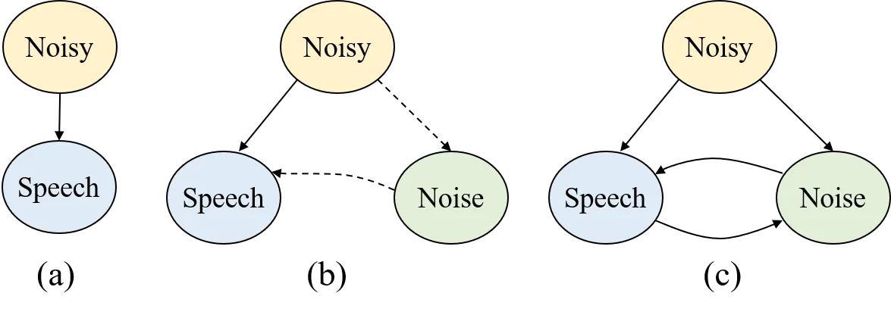
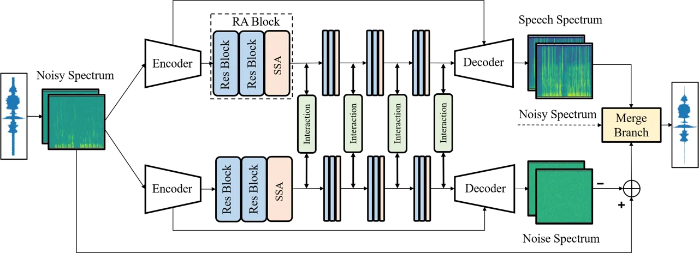
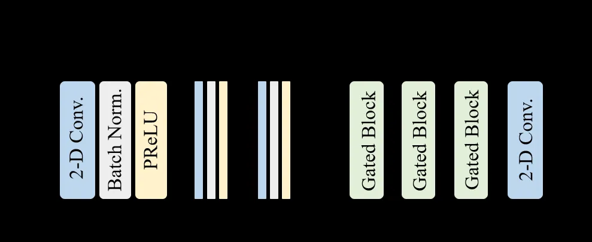
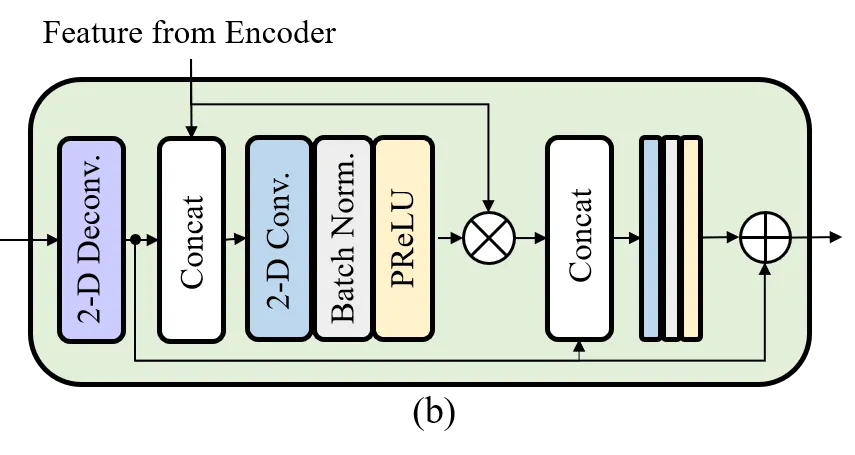
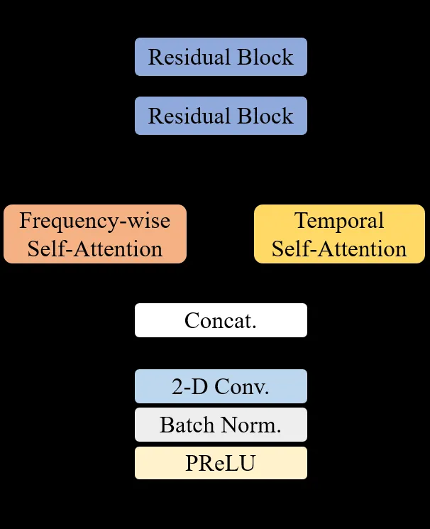
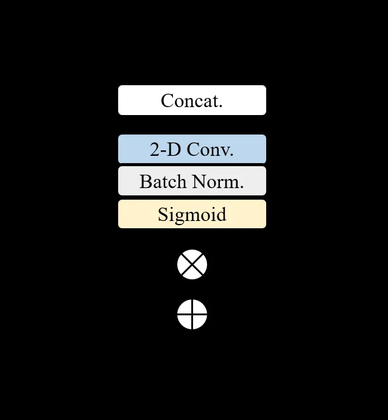
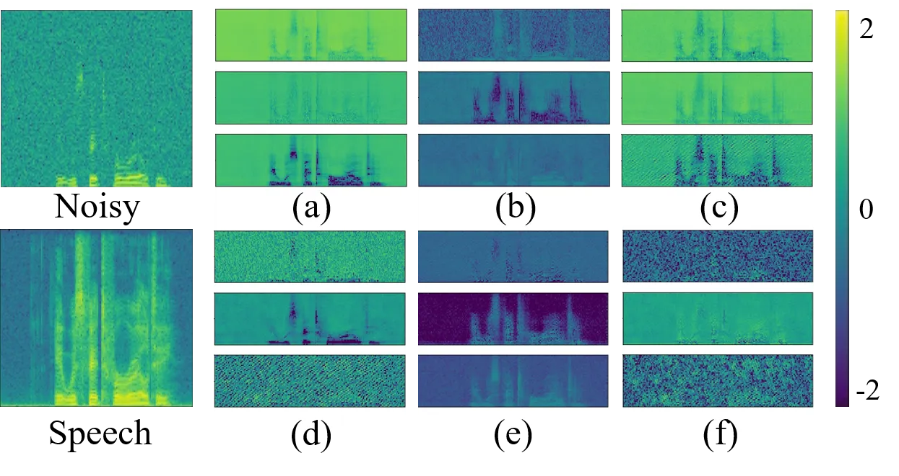
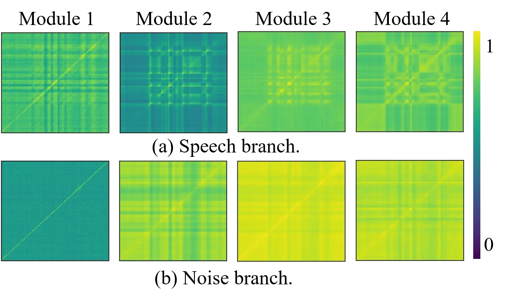
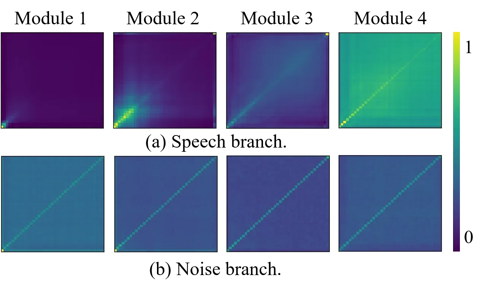

# Interactive Speech and Noise Modeling for Speech Enhancement

Chengyu Zheng ^(†)^(†)thanks: The work was done at Microsoft Research
Asia.    Xiulian Peng    Yuan Zhang    Sriram Srinivasan    Yan Lu

###### Abstract

Speech enhancement is challenging because of the diversity of background
noise types. Most of the existing methods are focused on modelling the
speech rather than the noise. In this paper, we propose a novel idea to
model speech and noise simultaneously in a two-branch convolutional
neural network, namely SN-Net. In SN-Net, the two branches predict
speech and noise, respectively. Instead of information fusion only at
the final output layer, interaction modules are introduced at several
intermediate feature domains between the two branches to benefit each
other. Such an interaction can leverage features learned from one branch
to counteract the undesired part and restore the missing component of
the other and thus enhance their discrimination capabilities. We also
design a feature extraction module, namely
residual-convolution-and-attention (RA), to capture the correlations
along temporal and frequency dimensions for both the speech and the
noises. Evaluations on public datasets show that the interaction module
plays a key role in simultaneous modeling and the SN-Net outperforms the
state-of-the-art by a large margin on various evaluation metrics. The
proposed SN-Net also shows superior performance for speaker separation.

¹ Communication University of China ² Microsoft Research Asia ³
Microsoft Corporation zhengchengyu@cuc.edu.cn, xipe@microsoft.com,
yzhang@cuc.edu.cn, Sriram.Srinivasan@microsoft.com, yanlu@microsoft.com

## 1 Introduction

Speech enhancement aims at separating speech from background
interference signals. Mainstream deep learning-based methods learn to
predict the speech signal in a supervised manner, as shown in Figure 1
(a). Most prior works operate in the time-frequency (T-F) domain by
predicting a mask between noisy and clean spectra (Wang, Narayanan, and
Wang 2014; Williamson, Wang, and Wang 2015) or directly predicting the
clean spectrum (Xu et al. 2013; Tan and Wang 2018). Some methods operate
in the time domain by estimating speech signals from raw-waveform noisy
signals in an end-to-end way (Fu et al. 2017; Pascual, Bonafonte, and
Serra 2017; Pandey and Wang 2019). These methods have considerably
improved the quality of enhanced speech compared with traditional signal
processing based schemes. However, speech distortion or residual noise
can often be observed in the enhanced speech, showing that there are
still correlations between predicted speech and the residual signal by
subtracting enhanced speech from noisy signal.



Figure 1: Illustration of different methods. (a) Most existing
deep-learning-based methods directly model speech. (b) Most traditional
methods predict speech with noise estimate. (c) Our method
simultaneously models speech and noise with information interaction.



Figure 2: Overall network structure of SN-Net.

Instead of only predicting speech and ignoring the characteristics of
background noises, traditional signal processing and modeling based
methods mostly take the other way (see Figure 1 (b)), i.e. estimating
noise or building noise models for speech enhancement (Boll 1979;
Hendriks, Heusdens, and Jensen 2010; Wang and Brookes 2017; Wilson
et al. 2008; Mohammadiha, Smaragdis, and Leijon 2013). Some model-based
methods instead model both speech and noise (Srinivasan, Samuelsson, and
Kleijn 2005b; Srinivasan, Samuelsson, and Kleijn 2005a), possibly with
alternate model update. However, they typically cannot generalize well
when prior noise assumption cannot be met or the interference signal is
not structured. In deep-learning-based methods, two recent attempts
(Odelowo and Anderson 2017; Odelowo and Anderson 2018) focus on directly
predicting noise considering that noise is dominant in low-SNR
conditions. However, the benefit is limited.

The remaining correlation between predicted speech and noise motivates
us to explore the information flow between speech and noise estimations,
as shown in Figure 1 (c). Since speech-related information exists in
predicted noise, and vice versa, adding information communication
between them may help to recover some missing components and remove
undesired information from each other. In this paper, we propose a
two-branch convolutional neural network, namely SN-Net, to
simultaneously predict speech and noise signals. Between them are
information interaction modules, by which noise or speech related
information are extracted from the noise branch and added back to speech
features to counteract the undesired noise part or recover the missing
speech, and vice versa. In this way, the discrimination capability is
largely enhanced. The two branches share the same network structure,
which is an encoder-decoder-based model with several
residual-convolution-and-attention (RA) blocks in between for
separation. Motivated by the success of self-attention technique in
machine translation and computer vision tasks (Vaswani et al. 2017; Wang
et al. 2018), we propose to combine temporal self-attention and
frequency-wise self-attention parallelly inside each RA block for
capturing global dependency along temporal and frequency dimensions in a
separable way.

Our main contributions are summarized as follows.

- •
  We propose to simultaneously model speech and noise in a two-branch
  deep neural network and introduce information flow between them. In
  this way, speech part is enhanced while residual noise is suppressed
  for speech estimation, and vice versa.
- •
  We propose a RA block for feature extraction. Separable self-attention
  is utilized in this block to globally capture the temporal and
  frequency dependencies.
- •
  We validate the superiority of proposed scheme in an ablation study
  and comparison with state-of-the-art algorithms on two public
  datasets. Moreover, we extend our method to speaker separation, which
  also shows great performance. These results demonstrate the
  superiority and potential of the proposed method.

## 2 Related Work





Figure 3: (a) Encoder-decoder structure. The dashed arrow denotes the
separation module using RA blocks. (b) Detailed structure of the gated
block inside the decoder.

### 2.1 Deep Learning-based Speech Enhancement

Deep learning-based methods mainly study how to build a speech model.
According to the adopted signal domain, these methods can be classified
into two categories. Time-Frequency (T-F) domain methods take T-F
representation, either complex or log power spectrum of the magnitude,
as input. They typically estimate a real or complex ratio mask for each
T-F bin to map noisy spectra to speech spectra (Williamson, Wang, and
Wang 2015; Wang, Narayanan, and Wang 2014; Choi et al. 2019) or directly
predict the speech representation (Xu et al. 2013; Tan and Wang 2018).
Time-domain methods take waveform as input and typically extract a
hidden representation of the raw waveform through an encoder and
reconstruct an enhanced version from that (Fu et al. 2017; Pascual,
Bonafonte, and Serra 2017; Pandey and Wang 2019). Although these methods
have shown great improvements over traditional methods, they only focus
on modeling speech and neglect the importance of understanding noise
characteristics.

### 2.2 Noise-Aware Speech Enhancement

Noise information is often considered in traditional signal processing
based methods (Boll 1979; Hendriks, Heusdens, and Jensen 2010; Wang and
Brookes 2017) with prior distribution assumptions for speech and noise.
However, it is a challenging task to estimate the noise power spectral
density for non-stationary noises and thus mostly stationary noise is
assumed. They are unsuitable in generalization to low SNR and
non-stationary noise conditions. Instead, some model-based methods build
models for speech and noise and show more promising results, e.g.,
codebook (Srinivasan, Samuelsson, and Kleijn 2005b; Srinivasan,
Samuelsson, and Kleijn 2005a) and nonnegative matrix factorization (NMF)
(Wilson et al. 2008; Mohammadiha, Smaragdis, and Leijon 2013) based
methods. However, they either need prior knowledge of the noise type
(Srinivasan, Samuelsson, and Kleijn 2005b; Srinivasan, Samuelsson, and
Kleijn 2005a) or are only effective for structured noise (Wilson et al.
2008; Mohammadiha, Smaragdis, and Leijon 2013); therefore their
generalization capability is limited.

Deep learning-based methods can better generalize to various noise
conditions. There are also some attempts on incorporating noise
information, for example, by adding constraints to loss functions (Fan
et al. 2019; Xu, Elshamy, and Fingscheidt 2020; Xia et al. 2020) or by
directly predicting noise instead of speech (Odelowo and Anderson 2017;
Odelowo and Anderson 2018). The former does not model noise at all and
the characteristics of noise are not exploited. The latter loses the
speech information and show even worse quality than corresponding speech
prediction method in low SNR and unseen noise conditions. A more
relevant work utilizes two deep auto encoders (DAEs) to estimate speech
and noise (Sun et al. 2015) . It first trains a DAE for speech spectrum
reconstruction and then introduces another DAE to model noise with the
constraint that the sum of outputs of the two DAEs is equal to the noisy
spectrum.

Different from aforementioned approaches, we proposed a two-branch CNN
to predict speech and noise simultaneously and introduce interaction
modules at several intermediate layers to make them benefit from each
other. Such a paradigm makes it suitable for speaker separation as well.

### 2.3 Two-Branch Neural Networks

Two-branch neural networks have been explored in various tasks for
capturing cross-modality information (Nam, Ha, and Kim 2017; Wang et al. 2019) or different levels of information (Simonyan and Zisserman 2014;
Wang et al. 2020). For speech enhancement, a two-branch modeling is
proposed to predict the amplitude and phase of the enhanced signal,
respectively (Yin et al. 2020). In this paper, we aim to exploit the two
correlated tasks, i.e. speech and noise estimations and explicitly
modeling them in an interactive two-branch framework for better
discrimination.

### 2.4 Self-Attention Model

Self-attention mechanism has been widely used in many tasks, e.g.,
machine translation (Vaswani et al. 2017), image generation (Zhang
et al. 2019) and video question answering (Li et al. 2019). For video,
spatio-temporal attention is also considered to exploit long-term
dependency along both spatial and temporal dimensions (Wu et al. 2019).
Recently, speech-related tasks have also benefited from self-attention,
e.g., speech recognition (Salazar, Kirchhoff, and Huang 2019) and speech
enhancement (Kim, El-Khamy, and Lee 2020; Koizumi et al. 2020). In these
works, self-attention is applied along the temporal dimension only,
neglecting the global dependency inside each frame. Motivated by the
spatio-temporal attention in video-related tasks, we propose to employ
both frequency-wise and temporal self-attention to better capture
dependencies along different dimensions. Such an attention is employed
in both speech and noise branches for simultaneous modeling the two
signals.

## 3 Proposed Method

### 3.1 Overview

Figure 2 shows the overall network structure of SN-Net. The input is the
complex T-F spectrum computed by short-time Fourier transform (STFT),
denoted as $`X^{I}\in R^{T\times F\times 2}`$, where $`T`$ is the number
of frames and $`F`$ is the number of frequency bins. There are two
branches in SN-Net, one of which predicts speech and the other predicts
noise. They share the same network structure but have separate network
parameters. Each branch is an encoder-decoder based structure, with
several RA blocks inserted inbetween them. In this way, it is capable of
simultaneously mining the potential of different components of the noisy
signal. Between the two branches are interaction modules designed to
transform and share information. After each branch gets its output, a
merge branch is employed to adaptively combine the two outputs to
generate the final enhanced speech.

### 3.2 Encoder and Decoder

As shown in Figure 3 (a), the encoder has three 2-D convolutional
layers, each with a kernel size of (3, 5). The stride is (1, 1) for the
first layer and (1, 2) for the following two. The channel numbers are
16, 32, 64, respectively. As a result, the output feature of the encoder
is $`\mathcal{F}^{E}_{k}\in\mathbb{R}^{T\times F^{\prime}\times C}`$,
where $`F^{\prime}=\frac{F}{4}`$, $`C=64`$ and
$`k\in\left\{S,N\right\}`$. $`S`$ and $`N`$ denote speech and noise
branches, respectively. For simplicity, the subscript $`k`$ will be
ignored in the following.

The decoder consists of three gated blocks followed by one 2-D
convolutional layer, which reconstructs the output
$`\mathcal{F}^{D}\in\mathbb{R}^{T\times F\times 2}`$. As shown in Figure
3 (b), the gated block learns a multiplicative mask on corresponding
feature from the encoder, aiming to suppress its undesired part. The
masked encoder feature is then concatenated with the deconvolutional
feature and fed into another 2-D convolutional layer to generate the
residual representation. After three gated blocks, the final
convolutional layer learns the amplitude gain and the phase for
reconstruction, similar to that in (Choi et al. 2019). The kernel size
for all 2-D deconvolutional layers is (3,5). The stride is (1,2) for the
first two gated blocks and (1,1) for the last one. The channel numbers
are 32, 16, 2, respectively. All the 2-D convolutional layers in the
decoder have a kernel size of (1,1), a stride of (1,1) and a channel
number the same as that of their deconv layers.

All the convolutional layers in the encoder and the decoder are followed
by a batch normalization (BN) and a parametric ReLU (PReLU). No
down-sampling is performed along the temporal dimension to preserve the
temporal resolution.

### 3.3 RA Block



Figure 4: Structure of the RA block.

The RA block is designed to extract features and perform separation for
both speech and noise branches. It is challenging because of the
diversities of noise types and the difference between speech and noises.
We employ the separable self-attention (SSA) technique to capture the
global dependencies along temporal and frequency dimensions,
respectively. It is intuitive to use attention for these two dimensions
as humans tend to put more attention to some parts of an audio signal
(e.g., speech) while less to the surrounding part (e.g., noise) and they
perceive differently on different frequencies. When it comes to the
speech-noise network in SN-Net, the SSA modules in speech and noise
branches perceive signals differently, which will be demonstrated in the
ablation study section afterwards.

In SN-Net, there are four RA blocks between the encoder and the decoder.
Each block consists of two residual blocks and a SSA module, as shown in
Figure 4, capturing both local and global dependencies inside the
signal. Each residual block has two 2-D convolutional layers with a
kernel size of (5,7), a stride of (1,1) and the same number of channels
as their inputs. The output feature of two residual blocks
$`\mathcal{F}^{Res}_{i}\in\mathbb{R}^{T\times F’\times C}`$
($`i\in\left\{1,2,3,4\right\}`$ represents the $`i^{th}`$ RA block and
will be ignored in the following) is fed parallelly into temporal
self-attention and frequency-wise self-attention blocks. These two
attention blocks produce the outputs
$`\mathcal{F}^{Temp}\in\mathbb{R}^{T\times F’\times C}`$ and
$`\mathcal{F}^{Freq}\in\mathbb{R}^{T\times F’\times C}`$. The three
features $`\mathcal{F}^{Res}`$, $`\mathcal{F}^{Temp}`$ and
$`\mathcal{F}^{Freq}`$ are then concatenated and fed into a 2-D
convolutional layer to generate the block output
$`\mathcal{F}^{RA}\in\mathbb{R}^{T\times F’\times C}`$, used in the
interaction module.

For self-attention, we employ the scaled dot-product self-attention
here. Considering the computational complexity, channels are reduced by
half inside SSA. The temporal self-attention can be represented as

```math
\displaystyle\mathcal{F}_{t}^{k} \displaystyle=Reshape^{t}(Conv(\mathcal{F}^{Res})),k\in\left\{K,Q,V\right\}, \tag{1}
```

```math
\displaystyle SA^{t} \displaystyle=Softmax(\mathcal{F}_{t}^{Q}\cdot(\mathcal{F}_{t}^{K})^{T}/\sqrt{\frac{C}{2}\times F^{\prime}})\cdot\mathcal{F}_{t}^{V},
```

```math
\displaystyle\mathcal{F}^{Temp} \displaystyle=\mathcal{F}^{Res}+Conv(Reshape^{t*}(SA^{t})),
```

where
$`\mathcal{F}_{t}^{k}\in\mathbb{R}^{T\times(\frac{C}{2}\times F^{\prime})}`$,
$`SA^{t}\in\mathbb{R}^{T\times(\frac{C}{2}\times F^{\prime})}`$ and
$`\mathcal{F}^{Temp}\in\mathbb{R}^{T\times F^{\prime}\times C}`$,
respectively. $`(\cdot)`$ denotes matrix multiplication.
$`Reshape^{t}(\cdot)`$ denotes a tensor reshape from
$`\mathbb{R}^{T\times F^{\prime}\times\frac{C}{2}}`$ to
$`\mathbb{R}^{T\times(\frac{C}{2}\times F^{\prime})}`$ and
$`Reshape^{t*}(\cdot)`$ is the opposite. The frequency-wise
self-attention is given by

```math
\displaystyle\mathcal{F}_{f}^{k} \displaystyle=Reshape^{f}(Conv(\mathcal{F}^{Res})),k\in\left\{K,Q,V\right\}, \tag{2}
```

```math
\displaystyle SA^{f} \displaystyle=Softmax(\mathcal{F}_{f}^{Q}\cdot(\mathcal{F}_{f}^{K})^{T}/\sqrt{\frac{C}{2}\times T})\cdot\mathcal{F}_{f}^{V},
```

```math
\displaystyle\mathcal{F}^{Freq} \displaystyle=\mathcal{F}^{Res}+Conv(Reshape^{f*}(SA^{f})),
```

where
$`\mathcal{F}_{f}^{k}\in\mathbb{R}^{F^{\prime}\times(\frac{C}{2}\times T)}`$,
$`SA^{f}\in\mathbb{R}^{F^{\prime}\times(\frac{C}{2}\times T)}`$ and
$`\mathcal{F}^{Freq}\in\mathbb{R}^{T\times F^{\prime}\times C}`$,
respectively. $`Reshape^{f}(\cdot)`$ reshapes a tensor from
$`\mathbb{R}^{T\times F^{\prime}\times\frac{C}{2}}`$ to
$`\mathbb{R}^{F^{\prime}\times(\frac{C}{2}\times T)}`$.



Figure 5: Structure of the interaction module.

In the above equations, $`Conv`$ denotes a convolutional layer followed
by BN and PReLU. All the convolutional layers have a kernel size of
(1,1) and a stride of (1,1).

### 3.4 Interaction Module

In SN-Net, the speech and noise branches share the same input signal,
which suggests that the internal features of two branches are
correlated. In light of this, we propose an interaction module to
exchange information between the branches. With this block, information
transformed from the noise branch is expected to enhance the speech part
and counteract the noise features inside the speech branch, and vice
versa. We will show in ablation study afterwards that this module plays
a key role in simultaneously modeling the speech and noises.

The structure of the interaction module is shown in Figure 5. Taking
speech branch as an example, feature from the noise branch
$`\mathcal{F}_{N}^{RA}`$ is first concatenated with that from the speech
branch $`\mathcal{F}_{S}^{RA}`$. They are then fed into a 2-D
convolutional layer to generate a multiplicative mask
$`\mathcal{M}^{N}`$, predicting the suppressed and preserved areas of
$`\mathcal{F}_{N}^{RA}`$. A residual representation
$`\mathcal{H}^{N2S}`$ is then obtained by multiplying
$`\mathcal{M}^{N}`$ with $`\mathcal{F}_{N}^{RA}`$ elementally. Finally,
the block adds $`\mathcal{F}_{S}^{RA}`$ and $`\mathcal{H}^{N2S}`$ to get
a “filtered” version of the speech feature, which will be fed into the
next RA block. The process is given by

```math
\displaystyle\mathcal{F}_{S_{out}}^{RA} \displaystyle=\mathcal{F}_{S}^{RA}+\mathcal{F}_{N}^{RA}*Mask(\mathcal{F}_{N}^{RA},\mathcal{F}_{S}^{RA}), \tag{3}
```

```math
\displaystyle\mathcal{F}_{N_{out}}^{RA} \displaystyle=\mathcal{F}_{N}^{RA}+\mathcal{F}_{S}^{RA}*Mask(\mathcal{F}_{S}^{RA},\mathcal{F}_{N}^{RA}),
```

where $`Mask(\cdot)`$ is short for concatenation, convolution and
sigmoid operations. $`(*)`$ denotes element-wise multiplication.

### 3.5 Merge Branch

After reconstructing the speech and noise signals in two branches, a
merge module is further employed to combine the two outputs. This is
done in the time domain to achieve the cross-domain benefit (Kim et al.
2018). The two decoder outputs are transformed to time-domain and
overlapped framed representation using the same window length as the
STFT we use, resulting in $`\tilde{s}\in\mathbb{R}^{T\times K}`$ and
$`\tilde{n}\in\mathbb{R}^{T\times K}`$, where $`K`$ is the frame size.
These two representations are stacked with the noisy waveform $`x`$ and
fed into the merge branch. The merge network uses a 2-D convolutional
layer, followed by an temporal self-attention block to capture global
temporal dependency and two other convolutional layers to learn an
element-wise mask $`m\in\mathbb{R}^{T\times K}`$. The kernel size of all
three convolutional layers is (3,7) and the channel number is 3, 3, 1,
respectively. BN and PReLU are used after each convolutional layer
except the last one. Sigmoid activation is used in the last layer.
Finally, the 2D enhanced signal is obtained by

```math
\hat{s}=m\times\tilde{s}+(1-m)\times(x-\tilde{n}). \tag{4}
```

The 1D signal is reconstructed from $`\hat{s}`$ after overlap and add.

## 4 Experiments

### 4.1 Datasets

Three public datasets are used in our experiments.

DNS Challenge The DNS challenge (Reddy et al. 2020) at Interspeech 2020
provides a large dataset for training. It includes 500 hours clean
speech across 2150 speakers collected from Librivox and 60000 noise
clips from Audioset (Gemmeke et al. 2017) and Freesound with 150
classes. For training, we synthesized 500 hours noisy samples with SNR
levels of -5dB, 0dB, 5dB, 10dB and 15dB. For evaluation, we use 150
synthetic noisy samples without reverberation inside the test set, whose
SNR levels are randomly distributed between 0 dB and 20 dB.

Voice Bank + DEMAND This is a small dataset created by
Valentini-Botinhao et al. (Valentini-Botinhao et al. 2016). Clean speech
clips are collected from the Voice Bank corpus (Veaux, Yamagishi, and
King 2013) with 28 speakers for training and another 2 unseen speakers
for test. Ten noise types with two artificially generated and eight real
recordings from DEMAND (Thiemann, Ito, and Vincent 2013) are used for
training. Five other noise types from DEMAND are chosen for the test,
without overlapping with the training set. The SNR values are 0dB, 5dB,
15dB and 20dB for training and 2.5dB, 7.5dB, 12.5dB and 17.5dB for test.

TIMIT Corpus This dataset is used for our speaker separation experiment.
It contains recordings of 630 speakers, each reading 10 sentences and
there are 462 speakers in the training set and 168 speakers in the test
set. Two sentences from different speakers are mixed with random SNRs to
generate mixture utterances. Shorter sentences are zero padded to match
the size of longer ones. In total, the training set includes 4620
sentences and the test set 1680 sentences.

|                                  |         |      |
| -------------------------------- | ------- | ---- |
| Models                           | SDR(dB) | PESQ |
| Noisy                            | 9.09    | 1.58 |
| Speech branch w/o SSA (baseline) | 18.06   | 3.05 |
| Speech branch                    | 18.75   | 3.28 |
| SN-Net w/o interaction           | 19.04   | 3.29 |
| SN-Net                           | 19.52   | 3.39 |

Table 1: Ablation study on DNS Challenge dataset

### 4.2 Evaluation Metrics

To evaluate the quality of the enhanced speech, the following objective
measures are used. Higher scores indicate better quality.

- •
  SSNR: Segmental SNR.
- •
  SDR (Vincent, Gribonval, and Févotte 2006): Signal-to-distortion
  ratio.
- •
  PESQ (Rec 2005): Perceptual evaluation of speech quality, using the
  wide-band version recommended in ITU-T P.862.2 (from -0.5 to 4.5).
- •
  CSIG (Hu and Loizou 2007): Mean opinion score (MOS) prediction of the
  signal distortion (from 1 to 5).
- •
  CBAK (Hu and Loizou 2007): MOS prediction of the intrusiveness of
  background noises (from 1 to 5).
- •
  COVL (Hu and Loizou 2007): MOS prediction of the overall effect (from
  1 to 5).

### 4.3 Implementation Details

#### Input

All signals are resampled to 16kHz and clipped to 2 seconds long. We
take the STFT complex spectrum as input, with a Hann window of length
20ms, a hop length of 10ms and a DFT length of 320.

#### Loss Function

The loss function includes three terms, i.e.
$`\mathcal{L}=\mathcal{L}_{Speech}+\alpha\mathcal{L}_{Noise}+\beta\mathcal{L}_{Merge}`$,
where $`\mathcal{L}_{Speech}`$, $`\mathcal{L}_{Noise}`$ and
$`\mathcal{L}_{Merge}`$ represent the loss of three branches,
respectively. $`\alpha`$ and $`\beta`$ are weighting factors balancing
among the three. All terms use a mean-squre-error (MSE) loss on the
power-law compressed STFT spectrum (Ephrat et al. 2018). An inverse STFT
and forward STFT are conducted on speech and noise branches before
calculating the loss to ensure STFT consistency as that in (Wisdom
et al. 2019).

#### Training

The proposed algorithm is implemented in TensorFlow. We use adam
optimizer with a learning rate of 0.0002. All the layers are initialized
with Xavier initialization. The training is conducted in two stages. The
speech and noise branches are jointly trained first with the loss weight
$`\alpha=1`$ and $`\beta=0`$. Then the merge branch is trained with the
parameters of previous two fixed, using only the loss
$`\mathcal{L}_{Merge}`$. We train both stages for 60 epochs for DNS
Challenge and 400 epochs for Voice Bank + DEMAND dataset. The batch size
for all experiments is set to 32, unless otherwise specified.



Figure 6: Log-scale feature visualization for the fourth interaction
module. (a) Input feature of speech branch. (b) Transformed feature from
noise to speech branch. (c) Output feature of speech branch. (d) Input
feature of noise branch. (e) Transformed feature from speech to noise
branch. (f) Output feature of noise branch. Three channels with the
highest activities are visualized here.

### 4.4 Ablation Study

#### Objective Quality

We first evaluate the effectiveness of different parts of the proposed
SN-Net based on the DNS Challenge dataset. As shown in Table 1, we take
the speech branch without SSA as the baseline. After adding SSA to the
single-branch model, we observe a 0.69 dB gain on SDR and 0.23 on PESQ.
By comparing “Speech branch” with “SN-Net w/o interaction”, we can see
that when no interaction is employed, adding another branch with merge
module at the output only marginally improves the SDR by 0.29 dB and no
improvement on PESQ. After introducing the information flow, it
evidently improves the SDR by 0.77 dB and PESQ by 0.11 compared to
single branch. These results verify the effectiveness of the proposed RA
and interaction modules for simultaneously modeling speech and noises.



.

Figure 7: Visualization of temporal self-attention matrices from
different RA blocks. (a) Speech branch. (b) Noise branch. Each matrix is
linearly scaled to $`[0,1]`$.



Figure 8: Visualization of frequency-wise self-attention matrices from
different RA blocks. (a) Speech branch. (b) Noise branch. Each matrix is
linearly scaled to $`[0,1]`$.

#### Visualization of Information Flow

In order to further understand how the interaction module works, we
visualize the input feature, the output and the feature transformed from
the other branch of this module in Figure 6. An audio signal corrupted
by white noises is used for illustration, whose spectrum is shown in the
first column.

The transformed feature shown in Figure 6 (b) is learned from the
feature in (d) and added to the feature in (a), resulting in the output
feature of speech branch in (c) and vice versa. Comparing (a) and (c),
we can see that the speech area is better separated with noise after
interaction. For noise branch, the speech part is mostly removed in (f)
compared with (d). These results show that the interaction module indeed
helps the simultaneous speech and noise modeling with better separation
capabilities. In terms of interchanged information, the undesired speech
part in (d) is counteracted by features learned from the speech branch
(e.g., the second channel of the noise branch) and the undesired noise
part in (a) is suppressed by features learned from the noise branch
(e.g., the third channel of the speech branch). These observations
comply with our previous analysis.

#### Visualization of Separable Self-Attention

We further visualize the attention matrix to explore what it has
learned. Figure 7 shows the temporal self-attention matrix inside
different RA blocks for the same audio signal as that in Figure 6. From
(a) and (b), we can see that besides the diagonal line, each frame shows
strong attentiveness to other frames and speech and noise branches
behave differently for each RA module. This is reasonable as the two
branches model different signals and their focus differs. For noise
branch, the attention goes from local to global as the network goes
deeper. The noise branch shows wider attentiveness than the speech
branch as white noises spread in all frames while speech signal occurs
only at some time.

Figure 8 shows the frequency-wise self-attention matrix for the same
audio signal. For speech branch, the focus goes from low-frequency area
to full frequencies and from local to global, showing that as the
network goes deeper, the frequency-wise self-attention tends to capture
global dependency along the frequency dimension. For noise branch, all
four RA blocks show a local attention as white noises have a constant
power spectral density.

### 4.5 Comparison with the State-of-the-Art

#### Speech Enhancement

| Methods        | SSNR  | PESQ | CSIG | CBAK | COVL |
| -------------- | ----- | ---- | ---- | ---- | ---- |
| Noisy          | 1.68  | 1.97 | 3.35 | 2.44 | 2.63 |
| SEGAN          | 7.73  | 2.16 | 3.48 | 2.94 | 2.80 |
| MMSE-GAN       | \-    | 2.53 | 3.80 | 3.12 | 3.14 |
| PHASEN         | 10.18 | 2.99 | 4.21 | 3.55 | 3.62 |
| Koizumi et al. | \-    | 2.99 | 4.15 | 3.42 | 3.57 |
| Ours           | 9.83  | 3.12 | 4.39 | 3.60 | 3.77 |

Table 2: Quality comparisons on Voice Bank + DEMAND

| Methods         | SDR(dB) | PESQ |
| --------------- | ------- | ---- |
| Noisy           | 9.09    | 1.58 |
| TCNN            | 16.86   | 2.34 |
| TCNN-L          | 16.58   | 2.78 |
| Conv-TasNet-SNR | \-      | 2.73 |
| DTLN            | 16.54   | 2.34 |
| MultiScale+     | \-      | 2.71 |
| PoCoNet         | \-      | 2.75 |
| Ours            | 19.52   | 3.39 |

Table 3: Quality comparisons on DNS Challenge

Table 2 shows the comparisons with state-of-the-art methods on Voice
Bank + DEMAND. SEGAN (Pascual, Bonafonte, and Serra 2017) and MMSE-GAN
(Soni, Shah, and Patil 2018) are two GAN-based methods. PHASEN (Yin
et al. 2020) is a two-branch T-F domain approach where one branch
predicts the amplitude and the other predicts the phase. Koizumi et al.
(Koizumi et al. 2020) is a multi-head self-attention based method. Our
method outperforms all of them in almost all metrics. The large
improvements on PESQ, CSIG and COVL indicate that our method preserves
better speech quality.

Table 3 shows the comparison with state-of-the-art methods on DNS
Challenge dataset. TCNN (Pandey and Wang 2019) is a time-domain
low-latency approach. We implemented two versions of it. “TCNN” is
exactly the same as described in the paper and “TCNN-L” is the
long-latency version using the same T-F domain loss function as ours.
Conv-TasNet-SNR (Koyama et al. 2020) and DTLN (Westhausen and Meyer 2020) are real-time approaches. MultiScale+ (Choi et al. 2020) and
PoCoNet (Isik et al. 2020) are non-real-time methods, among which the
PoCoNet took 1st place in the 2020 DNS challenge’s Non-Real-Time track.
Since narrow-band PESQ number was reported in the DTLN paper, we used
the released model¹¹ 1 https://github.com/breizhn/DTLN to generate the
enhanced speech and compute the metrics. For other methods, we use the
numbers reported in their papers. Our method outperforms all of them by
a large margin.

|             |          |                                                                                                                                                                                           |
| ----------- | -------- | ----------------------------------------------------------------------------------------------------------------------------------------------------------------------------------------- |
| Methods     | SDRi(dB) | PESQ²² 2 Note that Conv-TasNet outputs 8khz audios. We use narrow-band PESQ here instead of wide-band. Accordingly, we downsample audios to 8khz for our method to match this evaluation. |
| Conv-TasNet | 7.57     | 2.14                                                                                                                                                                                      |
| Ours        | 8.39     | 2.50                                                                                                                                                                                      |

Table 4: Two-speaker speech separation on TIMIT

#### Extension to Speaker Separation

As SN-Net can simultaneously model two signals, it is natural to extend
it for speaker separation task. The merge branch is removed as two
outputs are needed. Permutation invariant training (Yu et al. 2017) is
employed during training to avoid the permutation problem. We conduct
the two-speaker separation experiment based on the TIMIT corpus. The
batch size is set to 16. For comparison, we train a non-causal version
of Conv-TasNet (Luo and Mesgarani 2019), the state-of-the-art method,
using the released code³³ 3 https://github.com/kaituoxu/Conv-TasNet.

The results are shown in Table 4. We use SDR improvement (SDRi) and PESQ
for evaluation. Our method achieves a considerable gain on PESQ by 0.36
and SDRi by 0.82 dB, compared with Conv-TasNet. This suggests that our
method is not limited to specific tasks and has the potential to extract
different additive parts from a mixture signal.

## 5 Conclusion

We propose a novel two-branch convolutional neural network to
interactively modeling speech and noises for speech enhancement.
Particularly, an interaction between two branches is proposed to
leverage information learned from the other branch to enhance the target
signal modeling. This interaction makes the simultaneous modeling of two
signals feasible and effective. Moreover, we design a sophisticated RA
block for feature extraction of both branches, which can accommodate the
diversities across speech and various noise signals. Evaluations verify
the effectiveness of these modules and our method significantly
outperforms the state-of-the-art. The two-signal simultaneous modeling
paradigm makes it applicable to speaker separation as well.

## References

- Boll (1979) Boll, S. 1979. Suppression of acoustic noise in speech
  using spectral subtraction. _IEEE Transactions on acoustics, speech,
  and signal processing_ 27(2): 113–120.
- Choi et al. (2020) Choi, H.-S.; Heo, H.; Lee, J. H.; and Lee, K. 2020.
  Phase-aware Single-stage Speech Denoising and Dereverberation with
  U-Net. _arXiv preprint arXiv:2006.00687_ .
- Choi et al. (2019) Choi, H. S.; Kim, J. H.; Huh, J.; and Kim, A. 2019.
  Phase-aware speech enhancement with deep complex U-Net .
- Ephrat et al. (2018) Ephrat, A.; Mosseri, I.; Lang, O.; Dekel, T.;
  Wilson, K.; Hassidim, A.; Freeman, W. T.; and Rubinstein, M. 2018.
  Looking to listen at the cocktail party: A speaker-independent
  audio-visual model for speech separation. _arXiv preprint
  arXiv:1804.03619_ .
- Fan et al. (2019) Fan, C.; Liu, B.; Tao, J.; Yi, J.; Wen, Z.; and
  Bai, Y. 2019. Noise prior knowledge learning for speech enhancement
  via gated convolutional generative adversarial network. In _2019
  Asia-Pacific Signal and Information Processing Association Annual
  Summit and Conference (APSIPA ASC)_, 662–666. IEEE.
- Fu et al. (2017) Fu, S.-W.; Tsao, Y.; Lu, X.; and Kawai, H. 2017. Raw
  waveform-based speech enhancement by fully convolutional networks. In
  _2017 Asia-Pacific Signal and Information Processing Association
  Annual Summit and Conference (APSIPA ASC)_, 006–012. IEEE.
- Gemmeke et al. (2017) Gemmeke, J. F.; Ellis, D. P.; Freedman, D.;
  Jansen, A.; Lawrence, W.; Moore, R. C.; Plakal, M.; and
  Ritter, M. 2017. Audio set: An ontology and human-labeled dataset for
  audio events. In _2017 IEEE International Conference on Acoustics,
  Speech and Signal Processing (ICASSP)_, 776–780. IEEE.
- Hendriks, Heusdens, and Jensen (2010) Hendriks, R.; Heusdens, R.; and
  Jensen, J. 2010. MMSE based noise PSD tracking with low complexity. In
  _2010 IEEE International Conference on Acoustics, Speech and Signal
  Processing (ICASSP)_, 4266–4269. IEEE.
- Hu and Loizou (2007) Hu, Y.; and Loizou, P. C. 2007. Evaluation of
  objective quality measures for speech enhancement. _IEEE Transactions
  on audio, speech, and language processing_ 16(1): 229–238.
- Isik et al. (2020) Isik, U.; Giri, R.; Phansalkar, N.; Valin, J.-M.;
  Helwani, K.; and Krishnaswamy, A. 2020. PoCoNet: Better Speech
  Enhancement with Frequency-Positional Embeddings, Semi-Supervised
  Conversational Data, and Biased Loss. _arXiv preprint
  arXiv:2008.04470_ .
- Kim, El-Khamy, and Lee (2020) Kim, J.; El-Khamy, M.; and Lee, J. 2020.
  T-GSA: Transformer with Gaussian-Weighted Self-Attention for Speech
  Enhancement. In _ICASSP 2020-2020 IEEE International Conference on
  Acoustics, Speech and Signal Processing (ICASSP)_, 6649–6653. IEEE.
- Kim et al. (2018) Kim, J. H.; Yoo, J.; Chun, S.; Kim, A.; and Ha,
  J. W. 2018. Multi-domain processing via hybrid denoising networks for
  speech enhancement. _arXiv preprint arXiv:1812.08914_ .
- Koizumi et al. (2020) Koizumi, Y.; Yaiabe, K.; Delcroix, M.; Maxuxama,
  Y.; and Takeuchi, D. 2020. Speech enhancement using self-adaptation
  and multi-head self-attention. In _ICASSP 2020-2020 IEEE International
  Conference on Acoustics, Speech and Signal Processing (ICASSP)_,
  181–185. IEEE.
- Koyama et al. (2020) Koyama, Y.; Vuong, T.; Uhlich, S.; and
  Raj, B. 2020. Exploring the Best Loss Function for DNN-Based
  Low-latency Speech Enhancement with Temporal Convolutional Networks.
  _arXiv preprint arXiv:2005.11611_ .
- Li et al. (2019) Li, X.; Song, J.; Gao, L.; Liu, X.; Huang, W.; He,
  X.; and Gan, C. 2019. Beyond rnns: Positional self-attention with
  co-attention for video question answering. In _Proceedings of the AAAI
  Conference on Artificial Intelligence_, volume 33, 8658–8665.
- Luo and Mesgarani (2019) Luo, Y.; and Mesgarani, N. 2019. Conv-tasnet:
  Surpassing ideal time–frequency magnitude masking for speech
  separation. _IEEE/ACM transactions on audio, speech, and language
  processing_ 27(8): 1256–1266.
- Mohammadiha, Smaragdis, and Leijon (2013) Mohammadiha, N.; Smaragdis,
  P.; and Leijon, A. 2013. Supervised and unsupervised speech
  enhancement using nonnegative matrix factorization. _IEEE Transactions
  on audio, speech, and language processing_ 21(10): 2140–2151.
- Nam, Ha, and Kim (2017) Nam, H.; Ha, J.-W.; and Kim, J. 2017. Dual
  attention networks for multimodal reasoning and matching. In
  _Proceedings of the IEEE Conference on Computer Vision and Pattern
  Recognition_, 299–307.
- Odelowo and Anderson (2017) Odelowo, B. O.; and Anderson, D. V. 2017.
  A noise prediction and time-domain subtraction approach to deep neural
  network based speech enhancement. In _2017 16th IEEE International
  Conference on Machine Learning and Applications (ICMLA)_, 372–377.
  IEEE.
- Odelowo and Anderson (2018) Odelowo, B. O.; and Anderson, D. V. 2018.
  A study of training targets for deep neural network-based speech
  enhancement using noise prediction. In _2018 IEEE International
  Conference on Acoustics, Speech and Signal Processing (ICASSP)_,
  5409–5413. IEEE.
- Pandey and Wang (2019) Pandey, A.; and Wang, D. 2019. TCNN: Temporal
  convolutional neural network for real-time speech enhancement in the
  time domain. In _ICASSP 2019-2019 IEEE International Conference on
  Acoustics, Speech and Signal Processing (ICASSP)_, 6875–6879. IEEE.
- Pascual, Bonafonte, and Serra (2017) Pascual, S.; Bonafonte, A.; and
  Serra, J. 2017. SEGAN: Speech enhancement generative adversarial
  network. _arXiv preprint arXiv:1703.09452_ .
- Rec (2005) Rec, I. 2005. P. 862.2: Wideband extension to
  recommendation P. 862 for the assessment of wideband telephone
  networks and speech codecs. _International Telecommunication Union,
  CH–Geneva_ .
- Reddy et al. (2020) Reddy, C. K.; Gopal, V.; Cutler, R.; Beyrami, E.;
  Cheng, R.; Dubey, H.; Matusevych, S.; Aichner, R.; Aazami, A.; Braun,
  S.; et al. 2020. The INTERSPEECH 2020 Deep Noise Suppression
  Challenge: Datasets, Subjective Testing Framework, and Challenge
  Results. _arXiv preprint arXiv:2005.13981_ .
- Salazar, Kirchhoff, and Huang (2019) Salazar, J.; Kirchhoff, K.; and
  Huang, Z. 2019. Self-attention networks for connectionist temporal
  classification in speech recognition. In _ICASSP 2019-2019 IEEE
  International Conference on Acoustics, Speech and Signal Processing
  (ICASSP)_, 7115–7119. IEEE.
- Simonyan and Zisserman (2014) Simonyan, K.; and Zisserman, A. 2014.
  Two-stream convolutional networks for action recognition in videos.
  _Advances in neural information processing systems_ 27: 568–576.
- Soni, Shah, and Patil (2018) Soni, M. H.; Shah, N.; and Patil,
  H. A. 2018. Time-frequency masking-based speech enhancement using
  generative adversarial network. In _2018 IEEE International Conference
  on Acoustics, Speech and Signal Processing (ICASSP)_, 5039–5043. IEEE.
- Srinivasan, Samuelsson, and Kleijn (2005a) Srinivasan, S.; Samuelsson,
  J.; and Kleijn, W. B. 2005a .
- Srinivasan, Samuelsson, and Kleijn (2005b) Srinivasan, S.; Samuelsson,
  J.; and Kleijn, W. B. 2005b. Codebook driven short-term predictor
  parameter estimation for speech enhancement. _IEEE Transactions on
  audio, speech, and language processing_ 14(1): 163–176.
- Sun et al. (2015) Sun, M.; Zhang, X.; Zheng, T. F.; et al. 2015.
  Unseen noise estimation using separable deep auto encoder for speech
  enhancement. _IEEE/ACM Transactions on Audio, Speech, and Language
  Processing_ 24(1): 93–104.
- Tan and Wang (2018) Tan, K.; and Wang, D. 2018. A Convolutional
  Recurrent Neural Network for Real-Time Speech Enhancement. In
  _Interspeech_, 3229–3233.
- Thiemann, Ito, and Vincent (2013) Thiemann, J.; Ito, N.; and
  Vincent, E. 2013. The diverse environments multi-channel acoustic
  noise database: A database of multichannel environmental noise
  recordings. _The Journal of the Acoustical Society of America_ 133(5):
  3591–3591.
- Valentini-Botinhao et al. (2016) Valentini-Botinhao, C.; Wang, X.;
  Takaki, S.; and Yamagishi, J. 2016. Investigating RNN-based speech
  enhancement methods for noise-robust Text-to-Speech. In _SSW_,
  146–152.
- Vaswani et al. (2017) Vaswani, A.; Shazeer, N.; Parmar, N.; Uszkoreit,
  J.; Jones, L.; Gomez, A. N.; Kaiser, Ł.; and Polosukhin, I. 2017.
  Attention is all you need. In _Advances in neural information
  processing systems_, 5998–6008.
- Veaux, Yamagishi, and King (2013) Veaux, C.; Yamagishi, J.; and
  King, S. 2013. The voice bank corpus: Design, collection and data
  analysis of a large regional accent speech database. In _2013
  International Conference Oriental COCOSDA held jointly with 2013
  Conference on Asian Spoken Language Research and Evaluation
  (O-COCOSDA/CASLRE)_, 1–4. IEEE.
- Vincent, Gribonval, and Févotte (2006) Vincent, E.; Gribonval, R.; and
  Févotte, C. 2006. Performance measurement in blind audio source
  separation. _IEEE transactions on audio, speech, and language
  processing_ 14(4): 1462–1469.
- Wang et al. (2020) Wang, H.; Zha, Z.-J.; Chen, X.; Xiong, Z.; and
  Luo, J. 2020. Dual Path Interaction Network for Video Moment
  Localization. In _Proceedings of the 28th ACM International Conference
  on Multimedia_, 4116–4124.
- Wang et al. (2019) Wang, L.; Li, Y.; Huang, J.; and Lazebnik, S. 2019.
  Learning two-branch neural networks for image-text matching tasks.
  _IEEE transactions on pattern analysis and machine intelligence_
  41(2): 394–407.
- Wang et al. (2018) Wang, X.; Girshick, R.; Gupta, A.; and He, K. 2018.
  Non-local neural networks. In _Proceedings of the IEEE conference on
  computer vision and pattern recognition_, 7794–7803.
- Wang and Brookes (2017) Wang, Y.; and Brookes, M. 2017. Model-based
  speech enhancement in the modulation domain. _IEEE/ACM Transactions on
  Audio, Speech, and Language Processing_ 26(3): 580–594.
- Wang, Narayanan, and Wang (2014) Wang, Y.; Narayanan, A.; and
  Wang, D. 2014. On training targets for supervised speech separation.
  _IEEE/ACM Transactions on Audio, Speech, and Language Processing_
  22(12): 1849–1858.
- Westhausen and Meyer (2020) Westhausen, N. L.; and Meyer, B. T. 2020.
  Dual-Signal Transformation LSTM Network for Real-Time Noise
  Suppression. _arXiv preprint arXiv:2005.07551_ .
- Williamson, Wang, and Wang (2015) Williamson, D. S.; Wang, Y.; and
  Wang, D. 2015. Complex ratio masking for monaural speech separation.
  _IEEE/ACM transactions on audio, speech, and language processing_
  24(3): 483–492.
- Wilson et al. (2008) Wilson, K. W.; Raj, B.; Smaragdis, P.; and
  Divakaran, A. 2008. Speech denoising using nonnegative matrix
  factorization with priors. In _2008 IEEE International Conference on
  Acoustics, Speech and Signal Processing (ICASSP)_, 4029–4032. IEEE.
- Wisdom et al. (2019) Wisdom, S.; Hershey, J. R.; Wilson, K.; Thorpe,
  J.; Chinen, M.; Patton, B.; and Saurous, R. A. 2019. Differentiable
  consistency constraints for improved deep speech enhancement. In
  _ICASSP 2019-2019 IEEE International Conference on Acoustics, Speech
  and Signal Processing (ICASSP)_, 900–904. IEEE.
- Wu et al. (2019) Wu, Q.; Wang, W.; Chen, X.; and Li, W. 2019. Video
  prediction with temporal-spatial attention mechanism and deep
  perceptual similarity branch. In _2019 IEEE International Conference
  on Multimedia and Expo (ICME)_, 1594–1599. IEEE.
- Xia et al. (2020) Xia, Y.; Braun, S.; Reddy, C. K.; Dubey, H.; Cutler,
  R.; and Tashev, I. 2020. Weighted Speech Distortion Losses for
  Neural-Network-Based Real-Time Speech Enhancement. In _ICASSP
  2020-2020 IEEE International Conference on Acoustics, Speech and
  Signal Processing (ICASSP)_, 871–875. IEEE.
- Xu et al. (2013) Xu, Y.; Du, J.; Dai, L.-R.; and Lee, C.-H. 2013. An
  experimental study on speech enhancement based on deep neural
  networks. _IEEE Signal processing letters_ 21(1): 65–68.
- Xu, Elshamy, and Fingscheidt (2020) Xu, Z.; Elshamy, S.; and
  Fingscheidt, T. 2020. Using Separate Losses for Speech and Noise in
  Mask-Based Speech Enhancement. In _ICASSP 2020-2020 IEEE International
  Conference on Acoustics, Speech and Signal Processing (ICASSP)_,
  7519–7523. IEEE.
- Yin et al. (2020) Yin, D.; Luo, C.; Xiong, Z.; and Zeng, W. 2020.
  PHASEN: A Phase-and-Harmonics-Aware Speech Enhancement Network. In
  _AAAI_, 9458–9465.
- Yu et al. (2017) Yu, D.; Kolbæk, M.; Tan, Z.-H.; and Jensen, J. 2017.
  Permutation invariant training of deep models for speaker-independent
  multi-talker speech separation. In _2017 IEEE International Conference
  on Acoustics, Speech and Signal Processing (ICASSP)_, 241–245. IEEE.
- Zhang et al. (2019) Zhang, H.; Goodfellow, I.; Metaxas, D.; and
  Odena, A. 2019. Self-attention generative adversarial networks. In
  _International Conference on Machine Learning_, 7354–7363.
