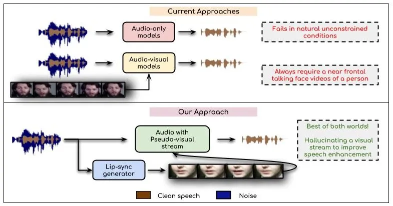
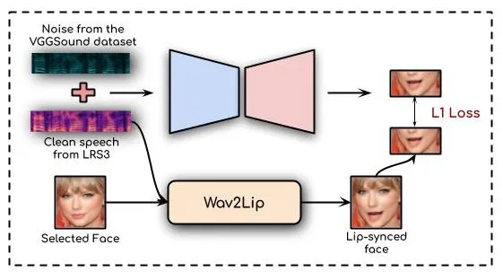
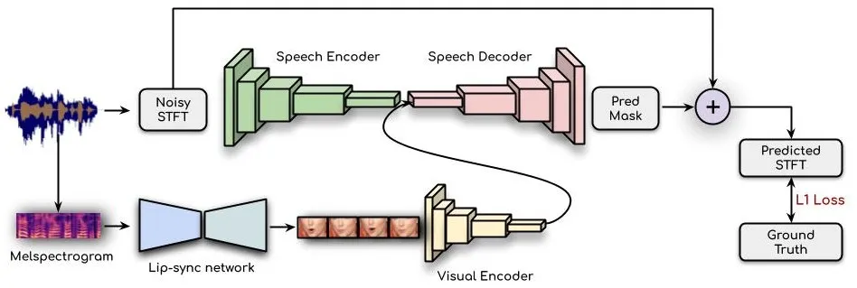
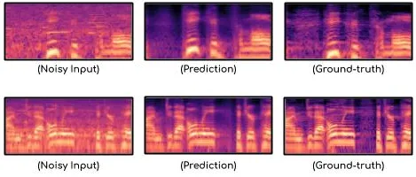

# Visual Speech Enhancement Without A Real Visual Stream

Sindhu B Hegde ^(†)^(†)thanks: The authors have contributed equally to
the work Affiliation: IIIT Hyderabad
Email: [sindhu.hegde@research.iiit.ac.in](mailto:)    K R
Prajwal¹¹footnotemark: 1 Affiliation: IIIT Hyderabad
Email: [prajwal.k@research.iiit.ac.in](mailto:)    Rudrabha
Mukhopadhyay¹¹footnotemark: 1 Affiliation: IIIT Hyderabad
Email: [radrabha.m@research.iiit.ac.in](mailto:)    Vinay Namboodiri
Affiliation: University of Bath Email: [vpn22@bath.ac.uk](mailto:)   
C.V. Jawahar Affiliation: IIIT Hyderabad
Email: [jawahar@iiit.ac.in](mailto:)

###### Abstract

In this work, we re-think the task of speech enhancement in
unconstrained real-world environments. Current state-of-the-art methods
use only the audio stream and are limited in their performance in a wide
range of real-world noises. Recent works using lip movements as
additional cues improve the quality of generated speech over
“audio-only” methods. But, these methods cannot be used for several
applications where the visual stream is unreliable or completely absent.
We propose a new paradigm for speech enhancement by exploiting recent
breakthroughs in speech-driven lip synthesis. Using one such model as a
teacher network, we train a robust student network to produce accurate
lip movements that mask away the noise, thus acting as a “visual noise
filter”. The intelligibility of the speech enhanced by our pseudo-lip
approach is comparable ($`<3\%`$ difference) to the case of using real
lips. This implies that we can exploit the advantages of using lip
movements even in the absence of a real video stream. We rigorously
evaluate our model using quantitative metrics as well as human
evaluations. Additional ablation studies and a demo video on our website
containing qualitative comparisons and results clearly illustrate the
effectiveness of our approach. We provide a demo video which clearly
illustrates the effectiveness of our proposed approach on our website:
[http://cvit.iiit.ac.in/research/projects/cvit-projects/visual-speech-enhancement-without-a-real-visual-stream](http://cvit.iiit.ac.in/research/projects/cvit-projects/visual-speech-enhancement-without-a-real-visual-stream).
The code and models are also released for future research:
[https://github.com/Sindhu-Hegde/pseudo-visual-speech-denoising](https://github.com/Sindhu-Hegde/pseudo-visual-speech-denoising).

## 1 Introduction

Imagine calling your friend from inside a crowded public bus. She is
unable to hear your plans for the evening due to the noise of the bus,
wind, and the nearby moving vehicles. We are all constantly surrounded
by noise that corrupts our speech. The problem of speech enhancement is
thus quintessential, especially at a time when several work-related
meetings are happening over a phone call from our homes. But the
applications of speech enhancement extend well beyond voice calls. For
instance, separating human speech from the background music can be
crucial for automatic subtitle/lyrics generation for movies and music.
Further, speech enhancement can help the rising number of independent
content creators filter the outdoor noises that are widely prevalent in
their vlogs and short videos. Last but not least, enhancing historically
important speeches will help us preserve our heritage for future
generations.

### 1.1 Overview of Existing Approaches

The problem of speech enhancement has been studied for a long time, and
various methods have already been proposed. Recently, several
works \[33, 19, 11\] using deep learning have become popular, where
noisy speech is enhanced using only the audio modality. However, all
these works are applicable only in mild noise conditions (high SNR) and
are known to produce artifacts in the generated speech. Most
importantly, they often do not produce satisfactory results for
unconstrained real-world applications such as those mentioned above.
This is because various types of unseen noises degrade the input audio,
the speakers and the recording systems go through unforeseen changes. A
newer trend was introduced by works \[8, 2\] where lip movements are
used as an additional modality for enhancement. These methods are more
accurate than audio-only works in unconstrained settings with large
amounts of noise levels. However, unlike audio-only works, audio-visual
methods are adversely affected by rapid head motion, occlusions, lip
going out of focus, or the audio and lips going out of sync \[2\]. This
significantly limits the applicability of these audio-visual methods,
where most of the common applications discussed above cannot be handled
due to the absence of a visual stream with clearly visible lip
movements.

Figure 1: We propose a novel approach to enhance the speech by
hallucinating the visual stream for any given noisy audio. In contrast
to the existing audio-visual methods, our approach works even in the
absence of a reliable visual stream, while also performing better than
audio-only works in unconstrained conditions due to the assistance of
generated lip movements.

### 1.2 A Visual Noise Filter

In this work, we introduce a new hybrid paradigm that brings together
the best of both these branches of speech enhancement. We want a method
that exploits the robustness and accuracy boost one can get with lip
movements but also be able to function effectively in a wide range of
applications where the visual stream is unreliable or absent. Thus,
instead of relying on an actual video stream, we propose to use a lip
synthesis model to generate a visual stream with lip movements for any
given noisy audio. Using a carefully designed student-teacher training
setup, we demonstrate that we can generate face images with lip
movements that do not meaningfully represent the noise but accurately
reflect the underlying speech component. Consequently, the generated
images act as a visual noise filter for the down-stream speech
enhancement model. In this way, unlike the existing audio-visual
enhancement works, we are not constrained by the need for a video with
clear visibility of lip movements. However, we can still utilize the
improvements these works achieve with the help of pseudo lip movements
(Figure 1). To the best of our knowledge, this is the first work to
grasp the advantages of the visual stream, even in the presence of only
audio. Our proposed approach yields significant improvements across all
speech quality and intelligibility metrics and human evaluation studies.
To summarize, the following are our major contributions:

- •
  We propose a novel pseudo-visual speech enhancement model that is
  applicable in natural and high noise conditions.
- •
  We are the first to study the use of artificial lip movements from a
  lip synthesis model for speech enhancement. Our method is the first to
  effectively use the benefits of lip movements and still be applicable
  in situations where the visual information is unavailable or is
  corrupted.
- •
  Using a novel student-teacher setup, we show that we can train a lip
  synthesis model to generate accurate lip movements corresponding to
  the underlying speech in a noisy signal. In fact, the intelligibility
  of the speech enhanced by our pseudo-lip approach is comparable
  ($`<3\%`$ difference) to the case of using real lips.
- •
  We create and release a new standard human evaluation set consisting
  of real-world videos in unconstrained conditions with several types of
  noises. Future speech enhancement works can evaluate their perceptual
  quality on this set.

We provide a demo video on our website, which clearly exhibits our
approach’s feasibility compared to the existing audio-only and
audio-visual works. The code, trained models, and the evaluation
benchmark are released publicly for future research¹¹ 1
[cvit.iiit.ac.in/research/projects/cvit-projects/visual-speech-enhancement-without-a-real-visual-stream](https://cvit.iiit.ac.in/research/projects/cvit-projects/visual-speech-enhancement-without-a-real-visual-stream).
The rest of the paper is organized as follows: In Section 2, we give an
overview of the existing works in this space. We then elaborate on the
proposed speech enhancement method in Section 3. The experimental setup,
results and analysis are discussed in Sections 4 and 5. We perform
several ablation studies in Section 6 and discuss various potential
applications of our work in Section 7. We conclude our work in
Section 8.

## 2 Related Work

### 2.1 Audio-only Speech Enhancement

We first review the works using only the audio stream with no additional
information for denoising of speech. Classical signal denoising
techniques like the Wiener filtering \[29\] became the first popular
approach for speech enhancement. However, it was often ineffective in
denoising speech in real-world situations as the wiener filter requires
an estimate of the noise a priori. Like many other problems, deep
learning models have become increasingly popular for speech enhancement
in recent times. Initial works \[30, 16\] used standard denoising
auto-encoders and LSTM based approaches \[33, 35\] for cleaning noisy
speech. Feature-based loss functions have also been proposed in \[11\],
while the most popular advancement came from models like \[19, 7, 11,
17\] using generative adversarial networks (GANs) which produce
relatively higher quality speech from noisy audio segments.

Even though there has been significant progress in the last few years,
speech enhancement models are still confined to being trained on
datasets \[35, 6, 36, 10\] that has been collected in constrained
environments recorded by a selected set of speakers. The types of
noises \[34, 24\] that are synthetically added to the clean speech while
training such models are also limited to a few types. Thus, these models
often do not perform well in unconstrained natural settings as they fail
to cope up with hundreds of speakers of different dialects and
languages, the level and type of noise varying abruptly in a speech
segment, etc. In this work, we aim to generate high-quality clean speech
from the given noisy audio in such unconstrained conditions.

### 2.2 Audio-visual Speech Enhancement

Since 2018, a new approach was introduced for denoising of speech. Works
like \[8, 2, 18\] considered an additional visual stream of information
by exploiting the lip movements of the speaker for extracting the clean
speech. These methods not only perform well in unconstrained real-world
settings, but they also show significant improvement in terms of metrics
over other audio-only methods. However, they suffer from a major
limitation that they work only on videos with a clear view of the
speaker’s lips. This requirement of a frontal, lip-synced video of the
speaker prohibits these models from being used for a wide range of
applications, where the visual stream is imperfect (profile views, lips
going out of focus, video corruption, out-of-sync speech, motion blurs)
or even completely absent.

### 2.3 Understanding Speech and Lip Movements

Jointly understanding multiple modalities together has gained
significant traction in recent times. Several recently published
works \[20, 37, 9\] involve both audio and vision as modalities.
Interpreting the spoken utterances from lip movements has attracted
special attention in different works \[26, 1, 3, 22, 21, 23\]. The
opposite task of generating lip motion for given speech segments has
also become a popular area of research. The initial works in this
space \[31, 15\] were specifically trained for a single person with
several hours of data. More recent works \[27, 14, 13\] can generate lip
movements for any identity, any voice, and any language. Specifically,
Wav2Lip \[27\] is the current state-of-the-art in “unconstrained lip
syncing” which produces accurate lip motion for any given speech, but is
inaccurate for noisy speech. In the next section, we discuss in detail
how we can distill the knowledge of this network into a student network
that learns to generate accurate lip movements for a given noisy speech
segment.

## 3 Pseudo-visual Stream for Enhancing Speech

How do we generate lip motion that is in sync with the clean speech
component in given noisy audio?

##### Can we readily use the current lip synthesis models for noisy speech inputs?

We find that the current state-of-the-art unconstrained speech-to-lip
models \[27, 14, 13\] which work for arbitrary speakers, voices, and
languages are highly inaccurate on noisy speech segments. This is
understandable as these works were never aimed to tackle such cases.
Moreover, these methods are speaker-independent and are designed to work
on unconstrained videos by training on thousands of speakers with
substantial variations in pose, expressions, backgrounds, etc. We found
that it is not ideal to naively fine-tune the pre-trained lip synthesis
model on noisy speech. This is simply because learning to lip-sync on
highly noisy speech across such extreme variations in the visual data is
a daunting task, yielding limited improvements in fine-grained lip
shapes (Table 1). But, for our task at hand, we do not need a lip
synthesis model on thousands of speakers; a single speaker is
sufficient.

Figure 2: We train a novel student-teacher network for generating
accurate lip movements for noisy speech segments. The teacher is a
pre-trained lip synthesis network \[27\] that generates accurate lip
movements on a static face using clean speech as input. The student is
trained to mimic the teacher’s lip movements, but when given noisy
speech as input.

Figure 3: Our proposed speech enhancement model. A pseudo-visual stream
is generated for the given noisy audio, which acts as a visual noise
filter. The enhancement model then ingests the noisy spectrogram along
with the generated lip movements and outputs a mask for the clean
speech.

##### A single identity is all you need.

We only need a sequence of accurate lip movements, preferably even just
on a static image of a single identity where only the lips are moving in
accordance with the speech. This is a relatively much easier task than
the one before and is also well-aligned with our needs. If the only
visual changes are in the lip shapes, the model will naturally focus on
learning more accurate, fine-grained speech-lip correspondences. Note
that we still need this identity-specific model to work for any speech
in any voice and language. How do we train a lip synthesis model that
can lip-sync just for a single identity image, but can handle any
speech?

##### Distilling lip motion knowledge for a single identity

We exploit the fact that the current state-of-the-art model,
Wav2Lip \[27\] can generate accurate lip motion for arbitrary static
face images conditioned on any clean speech. Our core idea is to achieve
this accuracy using noisy speech (harder part) as input, but on just a
single identity (easier part). To do this, we train a student network to
map the noisy speech inputs to lip motion on a single static face image.
We employ Wav2Lip as the teacher network and use its predictions on the
same identity image, but with clean speech inputs. This is illustrated
in Figure 2.

##### A Visual Noise Filter:

We hypothesize that since the only visual differences are in the lip
shapes, the student network is forced to learn a strong correspondence
between the underlying speech and the lip motion. Further, the student
network cannot meaningfully represent noise in the generated images and
is forced to represent only the speech components that the teacher
network accurately indicates. Thus the images generated by the student
network acts as a “visual noise filter” that manifests only the speech
component for the down-stream speech enhancement network.

### 3.1 Training the Student Model

As described above, we would like to train a student model $`M`$ by
learning from a pre-trained lip-synthesis network $`L`$ as a teacher.
$`M`$ is a simple encoder-decoder model that inputs a noisy speech
segment and outputs a lip-synced mouth region of a pre-determined
person. This is adapted from the Wav2Lip architecture \[27\] by
discarding the face identity branch, because we need $`M`$ to generate
lip movements only for a single identity image.

##### Noisy Speech Input to $`M`$:

We feed a $`0.2`$ second window of the noisy speech segment. We create
this noisy speech segment ($`S_{input}`$) by mixing clean speech
($`S_{clean}`$) from the LRS3 \[3\] with noise ($`S_{noise}`$) from the
VGGSound \[5\] dataset at one of the three signal-to-noise ratios (SNR)
($`0`$, $`5`$ and $`10`$ dB). As done in Wav2Lip \[27\], we use
mel-spectrograms as the input speech representation.

##### Learning from a Lip Synthesis Teacher

To train the model $`M`$, we need an accurate lip-synced ground-truth of
a single target. We obtain this from $`L`$, a pre-trained lip-synced
network, by feeding the clean speech $`S_{clean}`$ as the audio input.
We use the audios present in the LRS3 \[3\] dataset as our clean speech
data. For our lip synthesis teacher $`L`$, we use Wav2Lip \[27\], a
publicly available²² 2
[https://github.com/Rudrabha/Wav2Lip](https://github.com/Rudrabha/Wav2Lip)
state-of-the-art speech-to-lip synthesis model. As it is a
speaker-independent model, we also need to feed an identity image. We
choose a near-frontal face image of Taylor Swift on which the lips are
morphed by Wav2Lip to match the clean speech inputs. The lip-synced
output from Wav2Lip is accurate as the audio is clean. Further, the
output is always of the same face image with only the lip and jaw
regions changing while the rest of the face regions remain static. We
use the lower half of the generated face output containing the Wav2Lip’s
prediction as ground-truth for our student model $`M`$. Thus, our new
student network is trained to generate correct lip movements (matching
the clean speech) given a noise-corrupted input of the same speech.

We train the student network to minimize the $`L1`$ loss between its
predicted images and the lip-synced ground truth from Wav2Lip. We train
this network for $`150K`$ iterations with a batch size of $`64`$ on a
single NVIDIA RTX 2080Ti GPU. Other hyper-parameters are the same as
that of Wav2Lip \[27\]. For our speech enhancement model in the next
section, we use this trained student network to generate the lip motion
given a noisy speech segment.

### 3.2 Pseudo-visual Speech Enhancement

An overview of the proposed speech enhancement model is illustrated in
Figure 3. Our model takes both the pseudo-visual stream and the noisy
auditory stream as the input. For a given noisy audio, initially, we
generate the lip movements as described in Section 3.1. These, along
with the noisy input spectrograms are given to the visual encoder, and
the speech encoder respectively as shown in Figure 3. The speech decoder
outputs a residual mask, which is added to the input spectrograms to
filter the noise from the clean speech.

#### 3.2.1 Audio representation:

We consider $`1`$ second of noisy speech, $`S_{input}`$ as input to the
enhancement model and extract linear spectrogram representation using
short-time Fourier transform (STFT). Generating linear spectrograms
allows us to directly invert them back to a waveform without the need
for vocoders. To compute the STFT, we consider the window length of
$`25`$ms with a hop length of $`10`$ms sampled at $`16`$kHz. The
computed STFT from the raw audio waveforms is a complex array of
time-frequency representation, with a dimension of $`T_{s}\times 257`$.
Here, $`T_{s}`$ is the number of STFT time steps, which corresponds to
$`100`$ in our experiments ($`1`$ second audio segment). We further
decompose the complex STFT array into the magnitude and the phase
components, and normalize them between $`[0,1]`$. These components are
concatenated along the frequency axis to form a representation of
$`T_{s}\times 514`$ which acts as input to the speech encoder network.

#### 3.2.2 Visual representation:

The lip-sync student network generates $`25`$ frames for one second of
audio input. Using a visual encoder consisting of $`12`$ layers of
residual 2D-convolution blocks, we obtain a visual embedding for each
frame.

#### 3.2.3 Network architecture:

The speech enhancement model consists of the speech encoder and decoder
networks along with a visual encoder to encode the pseudo-visual stream
as illustrated in Figure 3. The input noisy spectrogram is processed by
the speech encoder which is a stack of $`7`$ 1D-convolution blocks with
residual connections. We perform the convolutions along the temporal
dimension, by considering the frequency component of the input
spectrograms as channels. The output of the visual encoder module is
up-sampled $`4\times`$ using nearest-neighbor interpolation to match the
spectrogram temporal dimension. We then combine the audio and the visual
streams by concatenating the learned features of each stream along the
channel dimension. This fused representation is then given to the speech
decoder which is a stack of $`14`$ 1D convolution layers with residual
connections. The decoder outputs a mask that is added to the input noisy
spectrogram followed by a sigmoid activation to generate the enhanced
speech spectrogram output. We minimize the $`L1`$ distance between the
predicted spectrogram and the ground truth. Finally, the enhanced clean
waveform is obtained by using inverse-STFT (ISTFT).

## 4 Experiments

### 4.1 Dataset

We use the publicly available LRS3 dataset \[3\] which consists of
thousands of spoken sentences from TED videos. For training, we use the
“pre-train” and “train-val” sets from the dataset which has around
$`430`$ hours of video data with $`150K`$ utterances. This is a
challenging dataset that covers a large number of speakers ($`9K`$),
thus encouraging the trained model to be speaker-independent.

### 4.2 Experimental setup

For evaluating in unconstrained settings, we create the following three
synthetic test sets, each having three noise levels of 0db, 5db and
10db: (i) Test split of LRS3 \[3\] + Noise from VGGSound \[5\], (ii)
Test split of LRS3 \[3\] + Noise from QUT-NOISE-TIMIT \[6\] (unseen
noise), (iii) Test split of LRS2 \[1\] + Noise from VGGSound \[5\]
(unseen speakers).

### 4.3 Evaluation

We use the following standard speech enhancement evaluation metrics
(higher is better) to evaluate our method. We compute Perceptual
Evaluation of Speech Quality (PESQ) \[28\] ($`-0.5`$ to $`4.5`$), which
measures the overall perceptual quality and short-time objective
intelligibility measure (STOI) \[32\] ($`0`$ to $`1`$), which correlates
with the intelligibility of speech. We also use objective measures such
as the mean opinion score (MOS) prediction of the signal distortion
(CSIG) ($`1`$ to $`5`$), the MOS prediction of background noise (CBAK)
($`1`$ to $`5`$), and the overall MOS prediction score (COVL) ($`1`$ to
$`5`$). In addition to evaluation based on these metrics, we also
perform human evaluations on a newly curated real-world test set and
report the MOS (range: $`1`$ to $`5`$) to analyze the real-world
applicability of our model.

## 5 Results

### 5.1 Evaluating the Lip-sync Network

We start by evaluating our lip-sync network that generates lip movements
for a given noisy speech segment. It should be noted that this network
is specifically designed for our speech enhancement task and not for the
purpose of talking face generation. For comparison, we also fine-tune
Wav2Lip \[27\] with the same noisy speech samples used for training the
student network. For evaluation, we use the synthetic test set
consisting of speech from LRS3 data and noise from VGGSound as described
in Section 4.2.

We then use this test set to benchmark (a) pre-trained Wav2Lip, (b)
Wav2Lip trained on noisy data, and (c) Our student lip-sync network.
Note that there are no original ground truth videos available for the
kind of talking face videos our lip-sync model generates from a single
face image. Thus, we use the LSE-D and LSE-C metrics used to evaluate
lip-sync in Wav2Lip \[27\]. A higher LSE-C indicates better overall
audio-visual correlation. As we can see from Table 1, our approach to
train a lip-sync network specifically for this task with one face using
Wav2Lip as a teacher outperforms other methods in terms of LSE-C,
indicating a better overall audio-visual correspondence. The LSE-D of
the student is close to the pre-trained Wav2Lip, but the confidence
score, LSE-C of the pre-trained Wav2Lip is quite low. In Section 6.2, we
also show the performance of our speech enhancement model when using
other networks to generate the pseudo-visual stream. We now move on to
evaluating our main pipeline for speech enhancement.

| Model                         | LSE-C$`\uparrow`$ | LSE-D$`\downarrow`$ |
| ----------------------------- | ----------------- | ------------------- |
| Wav2Lip trained on noisy data | 1.181             | 10.35               |
| Pre-trained Wav2Lip           | 1.330             | 8.933               |
| Lip-sync student (ours)       | 4.572             | 9.743               |

Table 1: Quantitative Evaluation of the lip sync model. Directly using
the pre-trained Wav2Lip model or fine-tuning it on noisy audios leads to
poor results on noisy speech. Our student network leads to more clear
audio-visual correspondence as denoted by LSE-C.

### 5.2 Quantitative Evaluation

| SNR    | 0db   |        |        |      |      |       | 5db   |        |        |      |      |       | 10db  |        |        |      |      |       |
| ------ | ----- | ------ | ------ | ---- | ---- | ----- | ----- | ------ | ------ | ---- | ---- | ----- | ----- | ------ | ------ | ---- | ---- | ----- |
| Method | Noisy | \[19\] | \[11\] | AO   | Ours | \[2\] | Noisy | \[19\] | \[11\] | AO   | Ours | \[2\] | Noisy | \[19\] | \[11\] | AO   | Ours | \[2\] |
| PESQ   | 1.93  | 1.84   | 2.17   | 2.62 | 2.72 | 2.80  | 2.29  | 2.24   | 2.52   | 2.93 | 2.99 | 3.05  | 2.66  | 2.65   | 2.95   | 3.12 | 3.19 | 3.25  |
| CSIG   | 2.31  | 2.10   | 2.82   | 3.02 | 3.18 | 3.25  | 2.79  | 2.67   | 3.22   | 3.26 | 3.32 | 3.39  | 3.15  | 3.17   | 3.36   | 3.45 | 3.51 | 3.56  |
| CBAK   | 1.83  | 1.87   | 2.30   | 2.36 | 2.47 | 2.51  | 2.23  | 2.30   | 2.46   | 2.54 | 2.65 | 2.71  | 2.40  | 2.55   | 2.63   | 2.70 | 2.81 | 2.84  |
| COVL   | 1.68  | 1.53   | 2.02   | 2.14 | 2.25 | 2.29  | 2.04  | 2.00   | 2.21   | 2.29 | 2.37 | 2.41  | 2.16  | 2.26   | 2.31   | 2.46 | 2.52 | 2.58  |
| STOI   | 0.76  | 0.75   | 0.83   | 0.87 | 0.88 | 0.90  | 0.85  | 0.86   | 0.88   | 0.90 | 0.92 | 0.94  | 0.88  | 0.88   | 0.90   | 0.92 | 0.95 | 0.95  |
| PESQ   | 1.86  | 1.77   | 2.14   | 2.54 | 2.65 | 2.73  | 2.26  | 2.14   | 2.54   | 2.83 | 2.92 | 3.01  | 2.67  | 2.61   | 2.90   | 3.05 | 3.12 | 3.21  |
| CSIG   | 2.46  | 2.37   | 2.78   | 2.93 | 3.02 | 3.10  | 2.90  | 2.86   | 3.18   | 3.15 | 3.24 | 3.33  | 3.30  | 3.30   | 3.38   | 3.35 | 3.42 | 3.48  |
| CBAK   | 1.55  | 1.89   | 2.10   | 2.31 | 2.43 | 2.46  | 1.94  | 2.23   | 2.30   | 2.49 | 2.59 | 2.63  | 2.42  | 2.53   | 2.59   | 2.62 | 2.73 | 2.77  |
| COVL   | 1.69  | 1.68   | 1.95   | 2.04 | 2.12 | 2.20  | 2.02  | 1.99   | 2.06   | 2.20 | 2.29 | 2.34  | 2.14  | 2.20   | 2.30   | 2.35 | 2.41 | 2.45  |
| STOI   | 0.75  | 0.77   | 0.80   | 0.84 | 0.87 | 0.89  | 0.85  | 0.86   | 0.87   | 0.89 | 0.91 | 0.93  | 0.87  | 0.90   | 0.91   | 0.91 | 0.94 | 0.95  |
| PESQ   | 1.94  | 1.82   | 2.10   | 2.58 | 2.71 | 2.79  | 2.32  | 1.87   | 2.55   | 2.87 | 2.98 | 3.04  | 2.69  | 2.41   | 2.79   | 3.10 | 3.19 | 3.22  |
| CSIG   | 2.55  | 2.29   | 2.80   | 3.07 | 3.16 | 3.23  | 3.01  | 2.85   | 3.16   | 3.21 | 3.32 | 3.38  | 3.23  | 3.13   | 3.33   | 3.36 | 3.44 | 3.49  |
| CBAK   | 1.86  | 1.82   | 2.22   | 2.31 | 2.41 | 2.47  | 2.28  | 2.12   | 2.42   | 2.48 | 2.57 | 2.63  | 2.58  | 2.59   | 2.57   | 2.63 | 2.71 | 2.73  |
| COVL   | 1.81  | 1.59   | 1.93   | 2.07 | 2.15 | 2.20  | 2.16  | 2.03   | 2.14   | 2.17 | 2.26 | 2.31  | 2.20  | 2.11   | 2.23   | 2.27 | 2.35 | 2.39  |
| STOI   | 0.75  | 0.73   | 0.80   | 0.84 | 0.87 | 0.89  | 0.84  | 0.83   | 0.85   | 0.88 | 0.90 | 0.90  | 0.85  | 0.86   | 0.89   | 0.89 | 0.92 | 0.93  |

Table 2: Quantitative comparison of different approaches. The first
section contains clean speech from LRS3 \[3\] test set mixed with
VGGSound \[5\] noises at different SNR levels. In the second section, we
specifically evaluate the performance on “unseen noises” by mixing the
LRS3 \[3\] test set audios with the QUT \[5\] city-street noises at
different noise levels. Finally, in the third section, we evaluate
specifically on “unseen speakers” by mixing the speeches of the unseen
LRS2 \[1\] test set speakers with VGGSound \[5\] noises. Our method
outperforms the audio-only approaches in all three sections and is
comparable ($`<3\%`$ difference) to the real visual-stream method.

We start by evaluating our method using the synthetic test sets created
as described in Section 4.2. We present the metric scores of the input
noisy data (without any denoising and enhancement) along with other
speech enhancement methods. For fair comparison, we fine-tune the
audio-only models, SEGAN \[19\] and DFL \[11\] on the same LRS3 training
data. To further highlight the importance of our pseudo-visual stream,
we implemented our own audio-only (AO) baseline, which is very similar
to our model but without the visual encoder. Also, we compare our
results with our implementation of the real-visual stream
state-of-the-art audio-visual method \[2\] to see how close our
pseudo-visual approach is to the real visual-stream method.

#### 5.2.1 Our model is robust to various noise levels

The results on LRS3 test set mixed with noise from VGGSound data at
different noise levels is summarized in the first section of Table 2. As
we can observe, our pseudo-visual model outperforms the audio-only
approaches as well as our AO-baseline by a significant margin at all
three noise levels. Also, it is very close to the real-visual stream
method, which indicates that our model is effective in generating
accurate lip movements. It is interesting to note that our model
performs comparable to the real-visual stream approach even at higher
noise level of 0db. This validates our claim that the generated
pseudo-visual stream reflects the clean speech segment and thus is able
to suppress the noise. Moreover, another important point to note is that
our AO-baseline performs comparably to the existing audio-only methods.

#### 5.2.2 Our model is robust to unseen noises

To further illustrate the generalization of our approach, we present the
results on new, unseen noise type from QUT (city-street noise)
dataset \[6\] in the second section of Table 2. We can observe the
robustness and the superior performance of our model even on unseen
noise types.

#### 5.2.3 Our model is robust to unseen speakers

We also perform an additional comparative study on unseen speakers from
LRS2 test set as shown in the third section of Table 2. In-line with the
previous results on LRS3 test set, our method performs remarkably well
in comparison with the audio-only approaches. The results clearly
indicate that our method is robust to unseen speakers, which is also
validated using our collected real-world test set. A sample spectrogram
predicted by our model, along with the ground truth and the noisy input
spectrograms are shown in Figure 4. We observe that our model is able to
reconstruct accurate speech even from a highly noisy input.

Figure 4: We can clearly see that our network is able to reconstruct
clean speech (center spectrogram) which is very close to the
ground-truth (right).

### 5.3 Human Evaluations

To evaluate the effectiveness of our work in real-world situations, we
perform a rigorous human evaluation on a newly collected real-world
evaluation set. This set comprises $`50`$ real-world videos in
unconstrained environments, which are originally degraded by different
kinds of noises. The test set contains a wide variety of videos/audios
such as people vlogging while riding a motorbike or sailing in rough
oceans, interaction on camera in crowded airports and railway stations,
and old heritage recordings. To the best of our knowledge, such an
evaluation set is the first of its kind and can be used for perceptually
evaluating the performance of future works on real-world examples.

As these samples are naturally corrupted by noise, and we do not have
the ground truth clean speech, we depend on human evaluations for this
dataset. For comparison, we also conduct a human evaluation on the
subset containing $`25`$ samples each from LRS2 and LRS3 datasets when
mixed with noise from the VGGSound corpus. In Table 3, we report the
mean scores of $`15`$ participants for different approaches on a scale
of $`1`$-$`5`$ based on: (A) Quality, and (B) Intelligibility. The
participant group consists of almost equal male-female members spanning
an age group of 22 - 49 years. Table 3 shows that the speech generated
by our model is preferred over the other methods, even in real-world
conditions.

| Data          | Metric | Noisy |  \[19\] |  \[11\] | AO   | Ours |
| ------------- | ------ | ----- | ------- | ------- | ---- | ---- |
| LRS2          | \(A\)  | 1.23  | 2.02    | 2.38    | 3.45 | 3.73 |
|               | \(B\)  | 2.81  | 3.05    | 3.27    | 3.96 | 4.12 |
| LRS3          | \(A\)  | 1.25  | 2.14    | 2.49    | 3.52 | 3.84 |
|               | \(B\)  | 2.85  | 3.12    | 3.36    | 3.98 | 4.25 |
| Curated real  | \(A\)  | 1.49  | 1.92    | 2.27    | 3.31 | 3.83 |
| world samples | \(B\)  | 2.66  | 2.91    | 3.08    | 4.01 | 4.31 |

Table 3: Human evaluation of our model based on: (A) Quality and (B)
Intelligibility.

## 6 Ablation Studies

In order to understand our design choices in our approach, we conduct
ablation experiments. Unless specified, all the results are reported on
the test set of LRS3 \[3\] dataset when mixed with VGGSound \[5\] at a
noise level of 0db.

### 6.1 Model is invariant to the pseudo-lip identity

In Table 4, we report the performance when different identities are used
for the generation of lip movements. Our model is consistent across
multiple pseudo-lip identities varied based on gender, age, ethnicity,
etc.

| Identity       | PESQ | CSIG | CBAK | COVL | STOI |
| -------------- | ---- | ---- | ---- | ---- | ---- |
| Taylor Swift   | 2.72 | 3.18 | 2.47 | 2.25 | 0.88 |
| Paul McCartney | 2.70 | 3.19 | 2.45 | 2.24 | 0.88 |
| Morgan Freeman | 2.71 | 3.16 | 2.42 | 2.21 | 0.87 |
| Andrew Ng      | 2.72 | 3.18 | 2.46 | 2.23 | 0.88 |

Table 4: The performance of our model is consistent if the age/ethnicity
of the pseudo-lip identity is varied.

### 6.2 Comparison of visual stream generators

Although Wav2Lip \[27\] is the state-of-the-art in “unconstrained
lip-syncing”, we also compare other lip-sync models for the generation
of pseudo-visual stream in Table 5. All the methods other than our
trained student lip-sync model result in an inferior performance due to
the inaccurate lip-shape generation. The main reason is that other
methods are constrained and/or sensitive to noise in the speech, and
generate wide open mouth shapes in the presence of noise.

| Lipsync models    | PESQ | CSIG | CBAK | COVL | STOI |
| ----------------- | ---- | ---- | ---- | ---- | ---- |
| Speech2Vid \[13\] | 2.42 | 2.85 | 2.17 | 2.01 | 0.82 |
| LipGAN \[14\]     | 2.54 | 2.98 | 2.21 | 2.05 | 0.85 |
| Wav2Lip \[27\]    | 2.64 | 3.05 | 2.28 | 2.12 | 0.86 |
| Ours              | 2.72 | 3.18 | 2.47 | 2.25 | 0.88 |

Table 5: Comparison of different methods for generation of pseudo-visual
stream. Our student lipsync network generates accurate lip movements,
thus effectively enhances the noisy speech.

### 6.3 Model’s variation to speaker attributes

To evaluate the effect of speaker attributes such as gender, language,
and accent on speech enhancement, we test our approach on diverse unseen
clean speech sources mixed with VGGSound noises. For gender evaluation,
we automatically classify the LRS3 test set into male and female
speakers using a gender detection tool \[25\]. We also test our model
across different languages and accents using clean speech sourced from
TTS datasets \[12, 4\]. The results (Table 6) clearly demonstrate that
there is no distinctive variation in performance across gender of the
speakers, but scores do vary across languages and accents, as the
training data is mainly comprised of western-accented English.

| Attr.  | Class    | PESQ | CSIG | CBAK | COVL | STOI |
| ------ | -------- | ---- | ---- | ---- | ---- | ---- |
| Gender | Female   | 2.75 | 3.29 | 2.42 | 2.35 | 0.89 |
|        | Male     | 2.80 | 3.15 | 2.43 | 2.24 | 0.89 |
| Lang.  | Hindi    | 2.46 | 2.45 | 2.41 | 1.94 | 0.89 |
|        | Bengali  | 2.39 | 2.86 | 2.45 | 2.14 | 0.86 |
| Accent | Indian   | 2.57 | 2.75 | 2.38 | 2.10 | 0.87 |
|        | American | 2.60 | 2.89 | 2.49 | 2.16 | 0.89 |

Table 6: Effect of speaker attributes such as gender, language and
accent on model performance.

## 7 Applications

Pseudo-visual speech enhancement opens up multiple application areas
that were only being dominated by audio-only methods. The lack of
clearly visible real lip movements is very common. For instance, in
dynamic scenes like vlogs or press conferences, the camera constantly
pans to other elements of the scene. This is even more common in the
case of movies, and here, additional downstream applications such as
automatic subtitle generation can benefit from speech enhancement.
Recently, there is also an increased interest in improving the video
call experience in works such as lip to speech synthesis \[26\] and
talking face generation \[27\]. Psuedo-visual methods are very apt for
this application, as it is not possible to expect a high-quality visual
stream consistently during video calls due to frequent network slowdowns
and interruptions. As lip synthesis methods become more robust and
realistic, we expect that pseudo-visual methods can improve further.

## 8 Conclusion

In this work, we proposed a novel speech enhancement method that
combines the diversity of applications of audio-only works while also
exploiting the benefits of lip motion. We do this by generating a
pseudo-visual stream for any given noisy input audio. We showed that it
is possible to generate accurate and reliable lip motion that reflects
the speech component in noisy audios. The generated lip movements serve
as a visual noise filter, which assists the downstream enhancement
model. Consequently, we showed significant gains over traditional
audio-only speech enhancement works. Our approach adds a new dimension
to the space of face and speech. With suitable modifications, a plethora
of other audio-only algorithms like ASR can now be supplemented with
additional generated visual information that was not available
originally. We believe, exploring various problems with a similar
approach could lead to further useful insights into this new space.

## References

- \[1\] Triantafyllos Afouras, Joon Son Chung, Andrew Senior, Oriol
  Vinyals, and Andrew Zisserman. Deep audio-visual speech recognition.
  IEEE transactions on pattern analysis and machine intelligence, 2018.
- \[2\] T. Afouras, J. S. Chung, and A. Zisserman. The conversation:
  Deep audio-visual speech enhancement. In INTERSPEECH, 2018.
- \[3\] T. Afouras, J. S. Chung, and A. Zisserman. Lrs3-ted: a
  large-scale dataset for visual speech recognition. In arXiv preprint
  arXiv:1809.00496, 2018.
- \[4\] Arun Baby, Anju Leela Thomas, NL Nishanthi, TTS Consortium,
  et al. Resources for indian languages. In Proceedings of Text, Speech
  and Dialogue, 2016.
- \[5\] H. Chen, W. Xie, A. Vedaldi, and A. Zisserman. Vggsound: A
  large-scale audio-visual dataset. In ICASSP 2020 - 2020 IEEE
  International Conference on Acoustics, Speech and Signal Processing
  (ICASSP), pages 721–725, 2020.
- \[6\] David Dean, Sridha Sridharan, Robbie Vogt, and Michael Mason.
  The qut-noise-timit corpus for the evaluation of voice activity
  detection algorithms. In INTERSPEECH, 2010.
- \[7\] Chris Donahue, Bo Li, and Rohit Prabhavalkar. Exploring speech
  enhancement with generative adversarial networks for robust speech
  recognition. 2018 IEEE International Conference on Acoustics, Speech
  and Signal Processing (ICASSP), pages 5024–5028, 2018.
- \[8\] Ariel Ephrat, Inbar Mosseri, Oran Lang, Tali Dekel, Kevin
  Wilson, Avinatan Hassidim, William T. Freeman, and Michael Rubinstein.
  Looking to listen at the cocktail party: A speaker-independent
  audio-visual model for speech separation. ACM Trans. Graph., 37, 2018.
- \[9\] Ruohan Gao, Rogerio S. Feris, and Kristen Grauman. Learning to
  separate object sounds by watching unlabeled video. In The IEEE
  Conference on Computer Vision and Pattern Recognition (CVPR)
  Workshops, June 2018.
- \[10\] J. Garofolo, Lori Lamel, W. Fisher, Jonathan Fiscus, D.
  Pallett, N. Dahlgren, and V. Zue. Timit acoustic-phonetic continuous
  speech corpus. Linguistic Data Consortium, 11 1992.
- \[11\] François G. Germain, Qifeng Chen, and Vladlen Koltun. Speech
  denoising with deep feature losses. In INTERSPEECH, 2019.
- \[12\] Keith Ito et al. The lj speech dataset, 2017.
- \[13\] Amir Jamaludin, Joon Son Chung, and Andrew Zisserman. You said
  that? : Synthesising talking faces from audio. International Journal
  of Computer Vision, 2019.
- \[14\] Prajwal K R, Rudrabha Mukhopadhyay, Jerin Philip, Abhishek Jha,
  Vinay Namboodiri, and C V Jawahar. Towards automatic face-to-face
  translation. In Proceedings of the 27th ACM International Conference
  on Multimedia, MM ’19, pages 1428–1436. ACM, 2019.
- \[15\] Rithesh Kumar, Jose Sotelo, Kundan Kumar, Alexandre de
  Brébisson, and Yoshua Bengio. Obamanet: Photo-realistic lip-sync from
  text. CoRR, abs/1801.01442, 2018.
- \[16\] Xugang Lu, Yu Tsao, Shigeki Matsuda, and Chiori Hori. Speech
  enhancement based on deep denoising autoencoder. In INTERSPEECH, 2013.
- \[17\] Daniel Michelsanti and Z. Tan. Conditional generative
  adversarial networks for speech enhancement and noise-robust speaker
  verification. In INTERSPEECH, 2017.
- \[18\] Andrew Owens and Alexei A. Efros. Audio-visual scene analysis
  with self-supervised multisensory features. In The European Conference
  on Computer Vision (ECCV), September 2018.
- \[19\] Santiago Pascual, Antonio Bonafonte, and Joan Serrà. Segan:
  Speech enhancement generative adversarial network. In Proc.
  Interspeech 2017, pages 3642–3646, 2017.
- \[20\] Andres Perez, Valentina Sanguineti, Pietro Morerio, and
  Vittorio Murino. Audio-visual model distillation using acoustic
  images. In The IEEE Winter Conference on Applications of Computer
  Vision (WACV), March 2020.
- \[21\] Stavros Petridis, Yujiang Wang, Zuwei Li, and Maja Pantic.
  End-to-end audiovisual fusion with lstms. arXiv preprint
  arXiv:1709.04343, 2017.
- \[22\] Stavros Petridis, Yujiang Wang, Zuwei Li, and Maja Pantic.
  End-to-end multi-view lipreading. arXiv preprint
  arXiv:1709.00443, 2017.
- \[23\] Stavros Petridis, Yujiang Wang, Pingchuan Ma, Zuwei Li, and
  Maja Pantic. End-to-end visual speech recognition for small-scale
  datasets. Pattern Recognition Letters, 131:421–427, 2020.
- \[24\] Karol J. Piczak. ESC: Dataset for Environmental Sound
  Classification. In Proceedings of the 23rd Annual ACM Conference on
  Multimedia, pages 1015–1018. ACM Press, 2015.
- \[25\] Arun Ponnusamy. cvlib - high level computer vision library for
  python.
  [https://github.com/arunponnusamy/cvlib](https://github.com/arunponnusamy/cvlib), 2018.
- \[26\] K R Prajwal, Rudrabha Mukhopadhyay, Vinay P. Namboodiri, and
  C.V. Jawahar. Learning individual speaking styles for accurate lip to
  speech synthesis. In The IEEE/CVF Conference on Computer Vision and
  Pattern Recognition (CVPR), June 2020.
- \[27\] K R Prajwal, Rudrabha Mukhopadhyay, Vinay P. Namboodiri, and
  C.V. Jawahar. A lip sync expert is all you need for speech to lip
  generation in the wild. In Proceedings of the 28th ACM International
  Conference on Multimedia, MM ’20, page 484–492, New York, NY,
  USA, 2020. Association for Computing Machinery.
- \[28\] Antony W Rix, John G Beerends, Michael P Hollier, and Andries P
  Hekstra. Perceptual evaluation of speech quality (pesq)-a new method
  for speech quality assessment of telephone networks and codecs. In
  IEEE International Conference on Acoustics, Speech, and Signal
  Processing. Proceedings, volume 2, pages 749–752, 2001.
- \[29\] P. Scalart and J. V. Filho. Speech enhancement based on a
  priori signal to noise estimation. ICASSP ’96, page 629–632. IEEE
  Computer Society, 1996.
- \[30\] Chao Sui, Mohammed Bennamoun, and Roberto Togneri. Listening
  with your eyes: Towards a practical visual speech recognition system
  using deep boltzmann machines. In Proceedings of the IEEE
  International Conference on Computer Vision (ICCV), pages
  154–162, 2015.
- \[31\] Supasorn Suwajanakorn, Steven M. Seitz, and Ira
  Kemelmacher-Shlizerman. Synthesizing obama: learning lip sync from
  audio. ACM Trans. Graph., 36:95:1–95:13, 2017.
- \[32\] Cees H Taal, Richard C Hendriks, Richard Heusdens, and Jesper
  Jensen. A short-time objective intelligibility measure for
  time-frequency weighted noisy speech. In IEEE international conference
  on acoustics, speech and signal processing, pages 4214–4217.
  IEEE, 2010.
- \[33\] Y. Tu, I. Tashev, S. Zarar, and C. Lee. A hybrid approach to
  combining conventional and deep learning techniques for single-channel
  speech enhancement and recognition. In 2018 IEEE International
  Conference on Acoustics, Speech and Signal Processing (ICASSP), pages
  2531–2535, 2018.
- \[34\] Cassia Valentini-Botinhao. Noisy speech database for training
  speech enhancement algorithms and tts models. 2017.
- \[35\] Cassia Valentini-Botinhao, Xiaohua Wang, Shinji Takaki, and
  Junichi Yamagishi. Investigating rnn-based speech enhancement methods
  for noise-robust text-to-speech. In SSW, 2016.
- \[36\] C. Veaux, J. Yamagishi, and S. King. The voice bank corpus:
  Design, collection and data analysis of a large regional accent speech
  database. In 2013 International Conference Oriental COCOSDA held
  jointly with 2013 Conference on Asian Spoken Language Research and
  Evaluation (O-COCOSDA/CASLRE), pages 1–4, 2013.
- \[37\] Jianren Wang, Zhaoyuan Fang, and Hang Zhao. Alignnet: A
  unifying approach to audio-visual alignment. In The IEEE Winter
  Conference on Applications of Computer Vision (WACV), March 2020.
