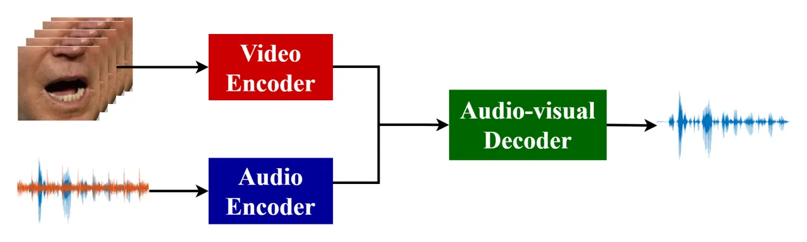
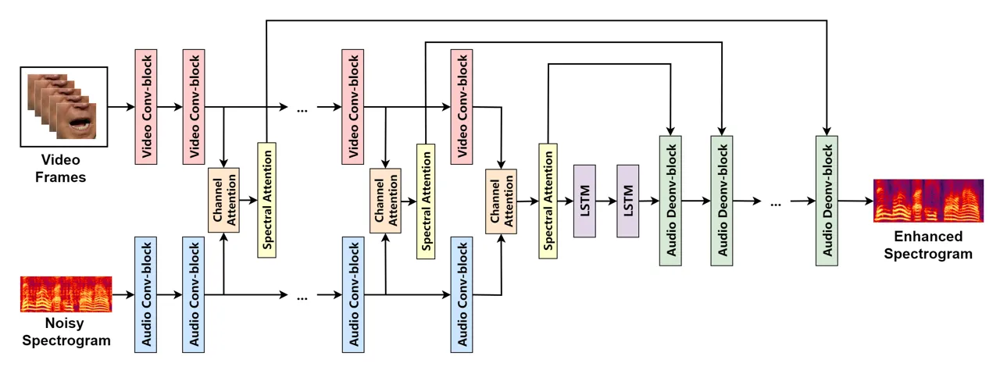
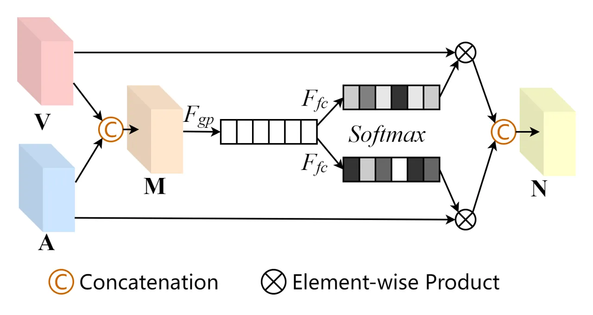
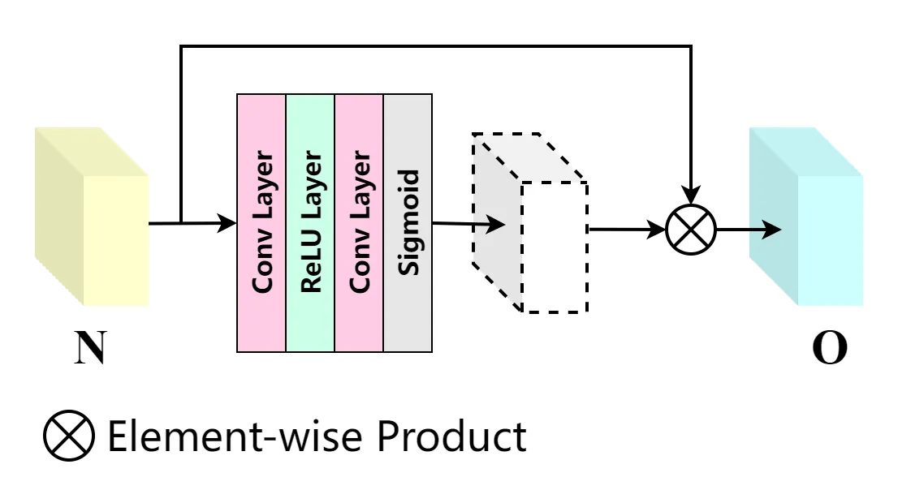
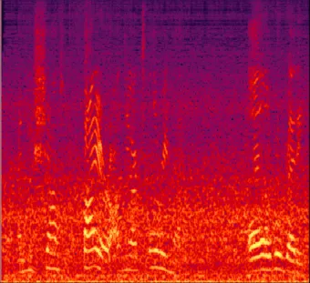
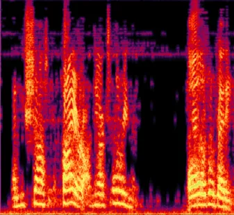
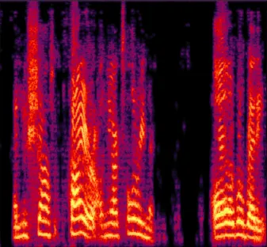
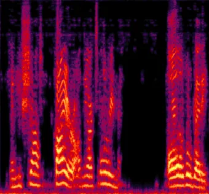
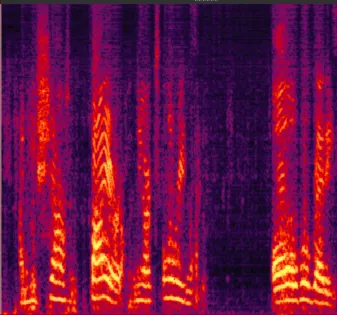
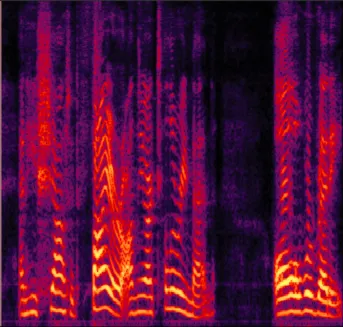

# Multi-layer Feature Fusion Convolutional Network for Audio-visual Speech Enhancement

Xinmeng Xu    Jianjun Hao ^(†)^(†)thanks: (Corresponding author: Jianjun
Hao) ^(†)^(†)thanks: Xinmeng Xu is with the Electronic \$&\$ Elect.
Engineering, School of Engineering, Trinity College Dublin, Dublin,
Ireland (e-mail: xux3@tcd.ie).^(†)^(†)thanks: Jianjun Hao is with School
of Foreign languages, HBUCM, Wuhan, China (e-mail: loyalcolin@163.com).

###### Abstract

Speech enhancement can potentially benefit from the visual information
from the target speaker, such as lip movement and facial expressions,
because the visual aspect of speech is essentially unaffected by
acoustic environment. In this paper, we address the problem of enhancing
corrupted speech signal from videos by using audio-visual (AV) neural
processing. Most of recent AV speech enhancement approaches separately
process the acoustic and visual features and fuse them via a simple
concatenation operation. Although this strategy is convenient and easy
to implement, it comes with two major drawbacks: 1) evidence in speech
perception suggests that in humans the AV integration occurs at a very
early stage, in contrast to previous models that process the two
modalities separately at early stage and combine them only at a later
stage, thus making the system less robust, and 2) a simple concatenation
does not allow to control how the information from the acoustic and the
visual modalities is treated. To overcome these drawbacks, we propose a
multi-layer feature fusion convolution network (MFFCN), which separately
process acoustic and visual modalities for preserving each modality
features while fusing both modalities features layer by layer in
encoding phase for enjoying the human AV speech perception. In addition,
considering the balance between the two modalities, we design channel
and spectral attention mechanisms to provide additional flexibility in
dealing with different types of information expanding the
representational ability of the convolution neural network. Experimental
results show that the proposed MFFCN demonstrates the performance of the
network superior to the state-of-the-art models.

###### Index Terms: 

Speech enhancement, audio-visual, multi-layer feature fusion convolution
network (MFFCN), channel attention, spectral attention

## I Introduction

Background noises greatly reduce the quality and intelligibility of the
speech signal, limiting the performance of speech-related applications,
such as speech recognition \[1, 2\], speaker verification \[3, 4\], and
speech conversion \[5, 6\], in real-world conditions. Consequently,
there is the need for the development of speech enhancement (SE) to
generate enhanced speech with better speech quality and clarity by
suppressing background noise components in noisy speech.



Fig. 1: The general deep-learning-based audio-visual speech enhancement
system.

Conventional SE approaches, such as spectral subtraction \[7\], minimum
mean squared error (MMSE) estimation \[8\], Wiener filtering \[9\],
Kalman filter \[10\], and subspace methods \[11\], have been extensively
studied in the past. Recently, deep learning technologies have been
successfully used for SE owing to their superior capability to model
complex non-linearity \[12\]. Although these deep learning-based
approaches are effective compared to conventional SE approaches, they
are prone to a label permutation (or ambiguity) error due to their
frame-by-frame or short segment-based processing paradigm \[13, 14\]. To
address this issue, the permutation invariant training using permutation
loss criterion is proposed \[15, 16\], but the label ambiguity problem
still appears in the inference stage, especially for unseen speakers.

Leveraging the visual streams of target speech signals is one of the
effective alternatives. Many researchers \[17, 18, 19\] have proved that
visual cues such as facial/lip movements can supplement acoustic
information of the corresponding speaker, helping speech perception,
especially in noisy environments. In audio-visual speech enhancement
(AVSE) systems, acoustic and visual features are integrated to derive
unique characteristics \[20, 21, 22\]. In recent AVSE systems, the
actual data processing is obtained with deep-learning-based techniques.
Generally, acoustic and visual features are processed separately through
using two neural network models. After that, the output vectors of these
models are fused, often by concatenation, which then is used as input to
another deep learning model (as shown in Fig 1). This strategy is
convenient and easy to be implemented.



Fig. 2: Schematic diagram of the proposed multi-layer feature fusion
convolutional network (MFFCN).

In real-world scenarios, however, this strategy comes with two
significant drawbacks, (1) evidence in speech perception suggests that
in humans the AV integration occurs at a very early stage \[23\], the
one that processes the two modalities separately and combines them only
at a later stage is failed to exploit the the correlation between audio
and video at a very early stage, but the disadvantage of early fusion in
AVSE systems is that usually the features between the two modalities are
inherently different, (2) a simple concatenation does not allow to
control how the information from the acoustic and the visual modalities
is treated, in consequence, the two modalities may dominate each other,
determining a decrease in the system’s performance.

In this letter, we highlight those limitations and tackle the
appropriate fusion strategy designing and unbalance between acoustic and
visual modalities problems, in AVSE processing. We propose a novel
multi-layer feature fusion convolutional network for robust speech
enhancement, dubbed as MFFCN, by designing a multi-layer fusion strategy
to integrate early fusion and later fusion with a single model, and by
designing the channel and spectral attention mechanisms to provide
additional flexibility in dealing with different types of information.
In particular, the MFFCN separately processes acoustic and visual
modalities and fuses audio-visual modalities at each encoder layer to
extract AV features, which enjoys the benefit of human auditory
perception while avoiding the problem of inherent difference of acoustic
and visual modalities during early fusion. The channel and spectral
attention mechanisms are inserted in concatenated operation to give the
weight to the channels of concatenated features while paying more
attention to informative regions of each concatenated feature map. We
demonstrate the effectiveness of the proposed network with extensive
experiments, achieving large improvements in unconditioned scenarios on
GRID \[24\] and TCD-TIMIT \[25\] datasets.

## II Model Architecture

### II-A Overview

The diagram of proposed MFFCN is illustrated in Fig 2, where its inputs
are noisy speech Mel-spectrogram $`Y`$, and video frames $`V`$, and it’s
output is the enhanced speech Mel-spectrogram $`S`$. The MFFCN follows
an encoder-decoder architecture, and consists of encoder part, fusion
part, embedding part, and decoder part.

The encoder part of MFFCN is comprised of audio encoder and video
encoder. The audio encoder is designed as a CNN taking spectrogram as
input, and each layer of an audio encoder is followed by strided
convolutional layer, batch normalization, and Leaky-ReLU for
non-linearity. The video encoder is used to process the input face
embedding through a number of max-pooling convolutional layers followed
by batch normalization, and Leaky-ReLU. Note that the dimension of
visual feature vector after convolutional layer has to be the same as
the corresponding audio feature vector. In addition, the audio decoder
is reversed in the audio encoder part by deconvolutions, followed again
by batch normalization and Leaky-ReLU.

Fusion part designates a merged dimension to implement fusion, and the
audio and video streams take the concatenation operation by channel
attention for giving the weight to each channel of audio and video
feature vectors and are through spectral attention to underscore the
informative region of each concatenated feature map. The embedding part
is the bottleneck of the encoder-decoder architecture, in which the
channel and spectral attention mechanisms are used to process the
encoded features and its output is then fed into two LSTM blocks for
aggregating temporal contexts. The MFFCN fuse acoustic and visual
modalities at early and later stages while separately processing both of
modalities, which not only enjoys the benefits of human auditory system
but also avoid the the features inherent difference of two modalities.

### II-B Channel and Spectral Attention Mechanisms



(a) Channel attention mechanism



(b) Spectral attention mechanism

Fig. 3: Schematic diagram of channel and spectral attention mechanisms.

|                | Conv1  | Conv2  | Conv3  | Conv4  | Conv5  | Conv6  | Conv7  | Conv8  | Conv9  | Conv10 |
| -------------- | ------ | ------ | ------ | ------ | ------ | ------ | ------ | ------ | ------ | ------ |
| Num Filters    | 64     | 64     | 128    | 128    | 256    | 256    | 512    | 512    | 1024   | 1024   |
| Filter Size    | (5, 5) | (4, 4) | (4, 4) | (4, 4) | (2, 2) | (2, 2) | (2, 2) | (2, 2) | (2, 2) | (2, 2) |
| Stride(audio)  | (2, 2) | (1, 1) | (2, 2) | (1, 1) | (2, 1) | (1, 1) | (2, 1) | (1, 1) | (1, 5) | (1, 1) |
| MaxPool(video) | (2, 4) | (1, 2) | (2, 2) | (1, 1) | (2, 1) | (1, 1) | (2, 1) | (1, 1) | (1, 5) | (1, 1) |

TABLE I: Detailed architecture of the MFFCN encoder. Conv1 denotes the
first convolution layer of the MFFCN encoder part.

Convolutional operation treats the channel-wise and spectral unit-wise
feature equally, therefore, extracting AV features by the concatenation
operation with convolutional layers is unable to control how the
information from the acoustic and the visual modalities is treated. To
address this issue, we propose the channel and spectral attention to
provide additional flexibility in dealing with different types of
information and expand the representational ability of convolution
operation.

#### II-B1 Channel Attention Mechanism

The channel attention mainly concerns that different channel feature
have totally different weighted information. Inspired by \[26, 27\], we
employ the channel-wise selective operation to design channel attention
mechanism to perform weighting for different channels with different
type of features.

As illustrated in Fig 3(a), given acoustic feature A and visual feature
V the output of channel attention N is obtained by fusing sub-module in
the following four steps:

```math
\displaystyle=\text{Conv}(\text{Concat}([\textbf{V},\textbf{A}])), \tag{1}
```

```math
\displaystyle=\text{GlobalPooling}(\textbf{M}), \tag{2}
```

```math
\displaystyle\textbf{w}_{V},\textbf{w}_{A} \displaystyle=\text{softmax}([F_{FC}^{1}(\textbf{g}),F_{FC}^{2}(\textbf{g})]), \tag{3}
```

```math
\displaystyle\textbf{N}= \displaystyle\text{Conv}(\text{Concat}([\textbf{V}\cdot\textbf{w}_{V},\textbf{A}\cdot\textbf{w}_{A}])), \tag{4}
```

where $`F_{FC}^{1}(\cdot)`$ and $`F_{FC}^{2}(\cdot)`$ refer to two
independent fully-connected layers, “Conv” and “Concate” represent
convolution and concatenation operation, respectively.

To be concrete, we first concatenate the encoded acoustic and visual
features from two branches of MFFCN encoder part and apply a convolution
block to make the size of concatenation the same as the acoustic or
visual features. Then, we adopt a global pooling to produce a global
vector g which is used as the guidance of adaptive and accurate channel
weighting operation between two modalities. Next, we apply two fully
connected layers $`F_{FC}^{1}(\cdot)`$ and $`F_{FC}^{2}(\cdot)`$ to
generate two weight vectors ($`\textbf{w}_{V}`$ and $`\textbf{w}_{A}`$)
to assign the weight for each channel. In this way, acoustic and visual
features can be processed selectively based on their characteristics.

#### II-B2 Spectral Attention Mechanism

Considering the informative feature distribution is uneven on different
feature maps of different modalities, we propose a spectral attention
mechanism to make the network pay more attention to informative
features, such as lip shape on video modality and speech presence
regions on audio modality.

As illustrated in Fig 3(b), we directly feed the input N (the output of
the channel attention mechanism) into two convolution layers with ReLU
and sigmoid activation function to generate the weighting map:

```math
\textbf{w}_{N}=\sigma(\text{Conv}(\delta(\text{Conv}(\textbf{N})))), \tag{5}
```

where $`\sigma`$ is sigmoid function, and $`\delta`$ is the ReLU
function.

Finally, the input N is element-wise multiplied with the weighting map
$`\textbf{w}_{N}`$ to obtain the output of spectral attention O.

|                                |         |         |        |         |        |         |        |         |
| ------------------------------ | ------- | ------- | ------ | ------- | ------ | ------- | ------ | ------- |
| Evaluation metrics             | STOI(%) |         |        |         | PESQ   |         |        |         |
| Test SNR                       | -5 dB   |         | 0 dB   |         | -5 dB  |         | 0 dB   |         |
| Interference                   | Speech  | Ambient | Speech | Ambient | Speech | Ambient | Speech | Ambient |
| Unprocessed                    | 57.82   | 51.44   | 64.74  | 62.59   | 1.59   | 1.03    | 1.66   | 1.24    |
| Audio-only CRN \[31\]          | 78.26   | 78.67   | 80.82  | 83.35   | 2.01   | 2.19    | 2.47   | 2.58    |
| VSE \[32\]                     | 79.94   | 83.33   | 84.61  | 87.90   | 2.36   | 2.41    | 2.77   | 2.94    |
| AV(SE)² \[33\]                 | 81.06   | 85.41   | 86.17  | 89.44   | 2.42   | 2.49    | 2.81   | 2.99    |
| Deep U-Net Early Fusion \[34\] | 81.23   | 85.34   | 87.86  | 90.23   | 2.47   | 2.53    | 2.79   | 3.01    |
| MFFCN (Proposed)               | 83.24   | 87.82   | 90.21  | 91.46   | 2.71   | 2.80    | 2.97   | 3.09    |
| MFFCN-w/o channel attention    | 81.36   | 86.23   | 88.69  | 89.31   | 2.63   | 2.75    | 2.91   | 3.04    |
| MFFCN-w/o spectral attention   | 80.59   | 85.14   | 86.36  | 89.23   | 2.56   | 2.47    | 2.76   | 3.02    |
| MFFCN-w/o attention mechanisms | 80.47   | 82.71   | 85.02  | 88.94   | 2.39   | 2.47    | 2.83   | 2.96    |

TABLE II: Performance of trained networks

## III Experimental Setup

### III-A Dataset

We use two public AV datasets to train our model: the first is GRID
\[24\] that consist of video recording where 18 male speakers and 16
female speakers pronounce 1000 sentences each, the second is TCD-TIMIT
\[25\], which comprise 32 male speakers and 30 female speakers around
200 videos each.

We shuffle and split the datasets to training set, validation set, and
test set to 24300, 4400, and 1200 utterances, respectively. The noise
dataset is self-collected set, containing 25.3 hours ambient noise
categorized into 12 types: room, car, instrument, engine, train, human
chatting, air-brake, water, street, mic-noise, ring-bell, and music. The
speech-noise mixtures in training and validation are generated by
randomly selecting utterances from speech dataset and noise dataset and
then mixing them up at random SNR between -10dB and 10dB. The evaluation
set is generated SNR at 0dB and -5 dB.

### III-B Training and Network Parameters

The audio representation is extracted from raw audio waveforms by using
Short Time Fourier Transform (STFT) with Hanning window function after
resampling the audio signal to 16 kHz. Each frame contains a window of
40 milliseconds, and the frame shift is 160 samples (10 milliseconds).
For each speech frame, a log Mel-scale spectrogram is extracted by
multiplying the spectrogram via a Mel-scale filter bank, resulting in
spectrograms of size 80$`\times`$20. Visual feature is extracted from
the input videos that is re-sampled to 25 frames per second. The video
segment processed as input is the sizeof 128$`\times`$128$`\times`$5
using the 20 mouth landmarks from 68 facial landmarks suggested by
Kazemi et al.\[28\]. For convenience, the processed video segment is
zoomed to 80$`\times`$80$`\times`$5 by bilinear interpolation
algorithm\[29\]. The proposed MFFCN has 10 convolutional layers for each
encoder, as shown in Table I and 10 deconvolutional layers for each
decoder. The models are trained with the Adam optimizer \[30\] with the
learning rate of 0.0002 , and batch size of 8. The mean squared error
(MSE) serves as the objective function.

|                               |          |      |          |      |
| ----------------------------- | -------- | ---- | -------- | ---- |
| Fusion Strategy               | -5 dB    |      | 0 dB     |      |
|                               | STOI (%) | PESQ | STOI (%) | PESQ |
| Early Fusion                  | 75.23    | 2.24 | 81.41    | 2.66 |
| Late Fusion                   | 75.01    | 2.21 | 81.54    | 2.59 |
| Intermediate Fusion (VSE)     | 76.68    | 2.28 | 83.54    | 2.71 |
| Intermediate Fusion (AV(SE)²) | 79.31    | 2.37 | 84.88    | 2.79 |
| Multi-layer Feature Fusion    | 80.47    | 2.39 | 85.02    | 2.83 |

TABLE III: Comparison with different fusion strategies

## IV Results and Analysis

### IV-A Overall Performance

The performance of MFFCN is evaluated with the following metrics:
Perceptual evaluation of speech quality (PESQ) (from -0.5 to 4.5)
\[35\], and short-time objective intelligibility measure (from 0 to
100($`\%`$)) \[36\]. Table II presents comprehensive evaluations for
four baseline models on untrained noises and untrained speakers, in
which “Speech” denotes the noise from human speech and “Ambient” denotes
the ambient noise. In addition, the four elected baseline models are:
Audio-only CRN: an audio-only speech enhancement model based on
convolutional recurrent network \[31\].VSE: a middle fusion audio-visual
neural network for visual speech enhancement \[32\]. AV(SE)²: an
intermediate fusion audio-visual speech enhancement model with several
cross-modal squeeze-excitation \[33\]. Deep U-Net: a early fusion
audio-visual speech enhancement model with RNN attention blocks \[34\].

According to Table II, the proposed MFFCN yields the best results in all
conditions. Firstly, we compare the audio-only CRN with other 4 models.
We observe that even audio-only CRN achieves about 20.44$`\%`$ to
27.33$`\%`$ STOI improvement and 0.42 to 1.64 PESQ improvement over
unprocessed mixtures, the audio-only CRN is unable to outperform
audio-visual SE methods. Secondly, the AV(SE)² and Deep U-net improves
the network performance by adopting different attention mechanisms, and
these two models performs better than VSE that is not applying attention
operation. This demonstrates the necessity of balancing between acoustic
and visual modalities. Finally, our proposed MFFCN consistently
outperforms VSE, AV(SE)², and Deep U-net in all conditions.

To verify the effect of proposed multi-layer feature fusion strategy, we
show the comparison in Table III to investigate the effect of different
fusion strategies. Note that (1) early fusion which fuses acoustic and
visual modalities at first network layer, late fusion fuse the two
modalities at last network layer, (2) intermediate fusion (VSE) that is
used in VSE approach and fuse the two modalities at bottleneck, (3)
intermediate fusion (AV(SE)²) that is used in AV(SE)² approach and fuse
the two modalities at every decoder layers, (4) multi-layer feature
fusion is the proposed fusion strategy. According to Table III, we
observe that multi-layer feature fusion significantly performs better
than the other 4 fusion strategies, which fully demonstrates the
superiority of our proposed fusion strategy.

### IV-B Ablation Study

In this study, we evaluate variants of proposed MFFCN when removing
channel attention mechanism, spectral attention mechanism, and two
attention mechanisms, respectively. From Table II, we can conclude that
the existence of the channel and spectral attention mechanisms does
promote the network performance. The channel and spectral attention
mechanisms improve 5.11$`\%`$ and 0.33 on STOI and PESQ, respectively,
under the condition of ambient noise at -5 dB. In addition, a single
spectral attention mechanism performs better than a single channel
attention mechanism. Fig 4 shows the visualization of noisy speech,
MFFCN without channel and spectral attention mechanisms enhanced speech,
MFFCN without spectral attention enhanced speech, MFFCN without channel
attention enhanced speech, complete MFFCN enhanced speech, and clean
speech, respectively.



(a) Noisy



(b) w/o C $`\&`$ S



(c) w/o S



(d) w/o C



(e) Complete



(f) Clean

Fig. 4: Example of input and enhanced spectra from an example speech
utterance. (a) Noisy speech input from test data under the condition of
ambient noise at -5 dB. (b) Speech enhanced by MFFCN-w/o channel and
spectral attention. (c) Speech enhanced by MFFCN-w/o channel attention.
(d) Speech enhanced by proposed MFFCN-w/o spectral attention. (e) Speech
enhanced by MFFCN. (f) Clean speech.

## V Conclusion

This letter proposes a MFFCN model for AVSE. In particular, the MFFCN
adopts multi-layer fusion strategy to fuse AV features layer by layer at
encoder phase while separately processing them. In addition, the channel
and spectral attention mechanisms are introduced to assign the weight to
the channels while paying more attention to informative regions of the
fused AV feature maps to avoid the unbalancing between the two
modalities. Results show that the proposed model has better performance
than recent models on the GRID and TCD-TIMIT datasets.

## References

- \[1\] Hinton, Geoffrey, et al., “Deep neural networks for acoustic
  modeling in speech recognition: The shared views of four research
  groups,” IEEE Signal processing magazine, vol. 29, no. 6, pp.
  82-97, 2012.
- \[2\] Baevski A., Hsu W.N., Conneau A. and Auli M, “Unsupervised
  speech recognition,” Advances in Neural Information Processing
  Systems, vol. 34, 2021.
- \[3\] Wu, Haibin, et al., “Improving the adversarial robustness for
  speaker verification by self-supervised learning,” IEEE/ACM
  Transactions on Audio, Speech, and Language Processing, vol. 30, pp.
  202-217, 2021.
- \[4\] Liu T., Das R. K., Lee K. A. and Li H. “Neural acoustic-phonetic
  approach for speaker verification with phonetic attention mask,” IEEE
  Signal Processing Letters, vol. 29, pp. 782-786, 2022.
- \[5\] Zhou K., Sisman B., Liu R. and Li H., “Emotional voice
  conversion: Theory, databases and esd,” Speech Communication, vol.
  137, pp. 1-18, 2022.
- \[6\] Zhang M., Zhou Y., Zhao L. and Li H., “Transfer learning from
  speech synthesis to voice conversion with non-parallel training data,”
  IEEE/ACM Transactions on Audio, Speech, and Language Processing, vol.
  29, pp. 1290-1302, 2021.
- \[7\] S. Boll, “Suppression of acoustic noise in speech using
  spectral subtraction,” IEEE Transactions on Acoustics, Speech, and
  Signal Processing, vol. 27, no. 2, pp. 113–120, 1979.
- \[8\] Y. Ephraim and D. Malah, “Speech enhancement using a
  minimum-mean square error short-time spectral amplitude estimator,”
  IEEE Transactions on Acoustics, Speech, and Signal Processing, vol.
  32, no. 6, pp. 1109–1121, 1984.
- \[9\] Jae Lim and A. Oppenheim, “All-pole modeling of degraded
  speech,”IEEE Transactions on Acoustics, Speech, and Signal Processing,
  vol. 26, no. 3, pp. 197–210, 1978.
- \[10\] K. Paliwal and A. Basu, “A speech enhancement method based on
  Kalman filtering,” ICASSP ’87. IEEE International Conference on
  Acoustics, Speech, and Signal Processing, vol. 12, pp. 177–180, 1987.
- \[11\] Y. Ephraim and H. L. Van Trees, “A signal subspace approach
  for speech enhancement,” IEEE Transactions on Speech and Audio
  Processing, vol. 3, no. 4, pp. 251–266, 1995.
- \[12\] D. Wang and J. Chen, “Supervised speech separation based on
  deep learning: An overview,” IEEE/ACM Transactions on Audio, Speech,
  and Language Processing, vol. 26, no. 10, pp. 1702– 1726, 2018.
- \[13\] Hershey J R, Chen Z, Le Roux J and Watanabe S, “Deep
  clustering: Discriminative embeddings for segmentation and
  separation”, in 2016 IEEE International Conference on Acoustics,
  Speech and Signal Processing (ICASSP), pp. 31-35, 2016.
- \[14\] Zhuo Chen, Yi Luo, and Nima Mesgarani, “Deep attractor network
  for single-microphone speaker separation”, in 2017 IEEE International
  Conference on Acoustics, Speech and Signal Processing (ICASSP), pp.
  246-250, 2017.
- \[15\] Yu D, Kolbæk M, Tan ZH, Jensen J., “Permutation invariant
  training of deep models for speaker-independent multi-talker speech
  separation”, in 2017 IEEE International Conference on Acoustics,
  Speech and Signal Processing (ICASSP), pp. 241-245, 2017.
- \[16\] Kolbæk M, Yu D, Tan ZH, Jensen J., “Multitalker speech
  separation with utterance-level permutation invariant training of deep
  recurrent neural networks,” IEEE/ACM Transactions on Audio, Speech,
  and Language Processing, vol. 25, no. 10, pp. 1901-1913, 2017.
- \[17\] McGurk H and MacDonald J, “Hearing lips and seeing voices,”
  Nature, vol.264, no. 5588, pp. 746-748, 1976.
- \[18\] Massaro DW and Simpson JA, “Speech perception by ear and eye: A
  paradigm for psychological inquiry,” Psychology Press, 2014.
- \[19\] Rosenblum LD, “Speech perception as a multimodal phenomenon”,
  Current Directions in Psychological Science, vol. 17, no. 6, pp.
  405-409, 2008.
- \[20\] Afouras T, Chung JS, Zisserman A, “The Conversation: Deep
  Audio-Visual Speech Enhancement”, Proc. Interspeech, pp.
  3244-3248, 2018.
- \[21\] Xu X, Wang Y, Xu D, Peng Y, Zhang C, Jia J, Chen B. “VSEGAN:
  Visual speech enhancement generative adversarial network”, in ICASSP
  2022-2022 IEEE International Conference on Acoustics, Speech and
  Signal Processing (ICASSP) pp. 7308-7311, 2022.
- \[22\] Adeel A, Gogate M, Hussain A, “Contextual deep learning-based
  audio-visual switching for speech enhancement in real-world
  environments,” Information Fusion, vol 29, pp. 163-170, 2022.
- \[23\] Schwartz JL, Berthommier F, Savariaux C, “Audio-visual scene
  analysis: evidence for a “very-early” integration process in
  audio-visual speech perception,” In Seventh International Conference
  on Spoken Language Processing, 2002.
- \[24\] M. Cooke, J. Barker, S. Cunningham, and X. Shao, “An
  audio-visual corpus for speech perception and automatic speech
  recognition,” The Journal of the Acoustical Society of America, vol.
  120, no. 5, pp. 2421–2424, 2006.
- \[25\] N. Harte and E. Gillen, “TCD-TIMIT: An audio-visual corpus of
  continuous speech,” IEEE Transactions on Multimedia, vol. 17, no. 5,
  pp. 603–615, 2015.
- \[26\] J. Hu, L. Shen, and G. Sun, “Squeeze-and-excitation networks,”
  in Proceedings of the IEEE Conference on Computer Vision and Pattern
  Recognition (CVPR), pp. 7132–7141, 2018.
- \[27\] X. Li, W. Wang, X. Hu, and J. Yang, “Selective kernel
  networks,” in Proceedings of the IEEE Conference on Computer Vision
  and Pattern Recognition (CVPR), pp. 510–519, 2019.
- \[28\] Kazemi V, Sullivan J, “One millisecond face alignment with an
  ensemble of regression trees,” In Proceedings of the IEEE conference
  on computer vision and pattern recognition (CVPR), pp.
  1867-1874, 2014.
- \[29\] K. T. Gribbon and D. G. Bailey, “A novel approach to real-time
  bi-linear interpolation,” in Proceedings. DELTA 2004. Second IEEE
  International Workshop on Electronic Design, Test and Applications.
  IEEE, pp. 126–131, 2004.
- \[30\] Kingma D P. and Jimmy B. “Adam: A Method for Stochastic
  Optimization,” In The International Conference on Learning
  Representations (ICLR), 2015.
- \[31\] K. Tan and D. Wang, “A convolutional recurrent neural network
  for real-time speech enhancement,” in Proc. Interspeech, pp.
  3229–3233, 2018.
- \[32\] A. Gabbay, A. Shamir, and S. Peleg, “Visual speech
  enhancement,” in Proc. Interspeech, pp. 1170–1174, 2018.
- \[33\] M. L. Iuzzolino and K. Koishida, “AV(SE)²: Audio-visual
  squeeze-excite speech enhancement,” in ICASSP 2020-2020 IEEE
  international conference on acoustics, speech and signal processing
  (ICASSP), IEEE, pp. 7539–7543, 2020.
- \[34\] Hwang, J.W., Park, R.H. and Park, H.M., “Efficient Audio-Visual
  Speech Enhancement Using Deep U-Net With Early Fusion of Audio and
  Video Information and RNN Attention Blocks,” IEEE Access, vol. 9,
  pp.137584-137598, 2021.
- \[35\] A . W. Rix, J. G. Beerends, M. P. Hollier, and A. P. Hekstra,
  “Perceptual evaluation of speech quality (PESQ)-a new method for
  speech quality assessment of telephone networks and codecs,” in IEEE
  International Conference on Acoustics, Speech, and Signal Processing
  (ICASSP), IEEE, pp. 749–752, 2001.
- \[36\] Taal CH, Hendriks RC, Heusdens R, Jensen J, “An algorithm for
  intelligibility prediction of time–frequency weighted noisy speech”,
  IEEE Transactions on Audio, Speech, and Language Processing, vol. 19,
  no.7, pp. 2125-2136, 2011.
