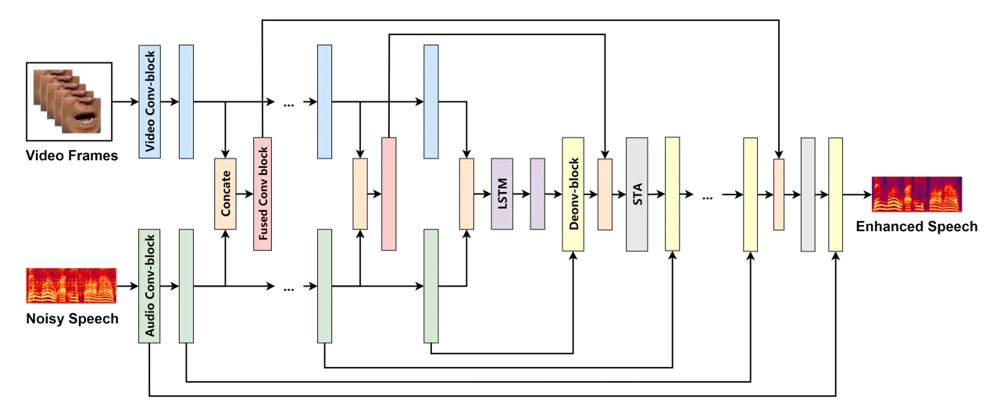
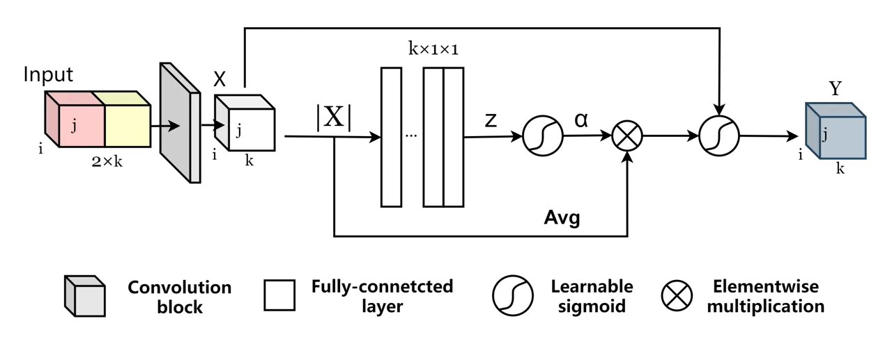

# soft-threshold attention based audio-visual speech enhancement network

Xinmeng Xu    Jianjun Hao ^(†)^(†)thanks: ^(\*)Corresponding author

###### Abstract

Audio-visual speech enhancement system is regarded to be one of the
promising solutions for isolating and enhancing the speech of the
desired speaker. Conventional methods focus on predicting clean speech
spectrum via a naive convolution neural network based encoder-decoder
architecture, and these methods a) are not adequate to use data fully
and effectively, b) cannot process features selectively. To tackle these
problems, this paper proposes a soft-threshold attention based
convolution recurrent network for audio-visual speech enhancement, which
a) applies a novel audio-visual fusion strategy that fuses audio and
visual features layer by layer in encoding stage, and that feeds fused
audio-visual features to each corresponding decoder layer, and more
importantly, b) which introduces a soft-threshold attention applied on
every decoder layers to select the informative modality softly.
Experimental results illustrate that the proposed architecture obtains
consistently better performance than recent models of both PESQ and STOI
scores.

###### Index Terms: 

speech enhancement, audio-visual, soft-threshold attention, multi-layer
feature fusion model

^(†)^(†)address: ¹Electronic & Elect. Engineering, Trinity College
Dublin, Ireland  
²School of Foreign Languages, Hubei University of Chinese Medicine, P.R.
China

## 1 Introduction

Speech processing systems are commonly used in a variety of applications
such as automatic speech recognition, speech synthesis, and speaker
verification. Numerous speech processing devices (e.g. mobile
communication systems and digital hearing aids systems) are often used
in environments with high levels of ambient noise such as public places
and cars in our daily life. Generally speaking, the presence of
high-level noise interference, severely decrease perceptual quality and
intelligibility of speech signal. Therefore, there is an urgent need for
the development of speech enhancement algorithms which can automatically
filter out noise signal and improve the effectiveness of speech
processing systems.

Recently, many approaches are proposed to recover the clean speech of
target speaker immersed in noisy environment, which can be roughly
divided into two categories, i.e., audio-only speech enhancement
(AO-SE)\[1, 2\] and audio-visual speech enhancement (AV-SE)\[3, 4\].
AO-SE approaches make assumptions on statistical properties of the
involved signals\[5\], and aim to estimate target speech signals
according to mathematically tractable criteria\[6\]. Advanced AO-SE
methods based on deep learning can predict target speech signal
directly, but they tend to depart from the knowledge-based modelling.
Compared with AO-SE approaches, AV-SE methods have achieved an
improvement in the performance of intelligibility of speech enhancement
due to the visual aspect which can recover some of the suppressed
linguistic features when target speech is corrupted by noise
interference\[7\]. However, AV-SE model should be trained using data
that are representative of settings in which they are deployed. In order
to have robust performance in a wide variety of settings, very large AV
datasets for training and testing need to be collected. Furthermore,
AV-SE is inherently a multi-modal process, and it focuses not only on
determining the parameters of a model, but also on the possible fusion
architectures\[8\]. Generally, a naive fusion strategy does not allow to
control how the information from audio and the visual modalities is
fused, as a consequence, one of the two modalities dominate the other.



Figure 1: Schematic diagram of the proposed soft-threshold attention
based CRN model. The STA denotes the soft-threshold attention unit.

To overcome the aforementioned limitations, this paper proposes a
Soft-threshold attention (STA) based Audio-visual Convolution Recurrent
Neural Networks (AVCRN) for speech enhancement, which integrates the
selected audio and visual cues into a unified network using multi-layer
audio-visual fusion strategy. The proposed framework applies a STA
inspired by soft thresholding algorithm \[9\], which has often been used
as a key step in many signal denoising methods \[10\], and eliminates
unimportant features \[11\]. Moreover, the proposed model adopts the
multi-layer audio and visual fusion strategy. in which the extracted
audio and visual features are concatenated in every encoding layer. When
two modalities in each layer are concatenated, the system applies them
as an additional input via STA to feed the corresponding decoding layer.

The rest of this paper is organized as follows: In Section 2, the
proposed method is presented in detail. Section 3 is the dataset and
experimental settings. Section 4 demonstrates the results and analysis,
and a conclusion is shown in Section 5.

## 2 Model Architecture

### 2.1 Audio-visual CRN

The diagram of proposed audio-visual CRN is demonstrated in Figure 1.
This model following an encoder-decoder scheme, uses a series of
downsampling and upsampling blocks to make its predictions, and consists
of the encoder component, fusion component, and decoder component.

The encoder component involves audio encoder and video encoder. As
previous approaches in several CNNs based audio encoding models\[12, 13,
14\], the audio encoder is thus designed as a CNNs using the spectrogram
as input. The video encoder part is used to process the input face
embedding. In our approach, the video feature vectors and audio feature
vectors take concatenation access at every step in the encoding stage,
and the size of visual feature vectors after convolution layer has to be
the same as the corresponding audio feature vectors, as is shown in
Figure 1.

Fusion component consists of audio-visual fusion process and
audio-visual embedding process. Audio-visual fusion process usually
designates a consolidated dimension to implement fusion, which combines
the audio and visual streams in each layer directly and feeds the
combination into several convolution layers. Audio-visual embedding
which flattens audio and visual streams from 3D to 1D, then concatenates
both flattened streams together, and finally feed the concatenated feature
vector into two LSTM layers. Audio-visual embedding is a feature deeper
fusion strategy, and the resulting vector is then to build decoder
component.

The decoder component, or named audio decoder, is made of
deconvolutional layers. Because of the downsampling blocks, the model
computes a number of higher level features on coarser time scales, and
generates the audio-visual features by audio-visual fusion process in
each level, which are concatenated with the local, high resolution
features computed from the same level upsampling block. This
concatenation results into multi-scale features for predictions.

### 2.2 Soft-threshold attention

In the proposed architecture, the potential unbalance caused by
concatenation-based fusion easily happened on decoder blocks, when the
concatenating features directly computed during contracting path with
the same hierarchical level among the decoder blocks. Consequently, the
proposed model use attention gates, as is shown in Figure 2, to
selectively filter out unimportant information using soft-thresholding
algorithms.

Soft-thresholding is a kind of filter that can transform useful
information to very positive or negative features and noise information
to near-zero features. Deep learning enables the soft thresholding
algorithm to be learned automatically by using a gradient decent
algorithm , which is a promising way to eliminate noise-related
information and construct highly discriminative features. The function
of soft-thresholding can be expressed by

```math
Y=\begin{cases}X-\tau,&X>\tau\\
0,&-\tau\leq X\leq\tau\\
X+\tau,&X<-\tau\\
\end{cases} \tag{1}
```

where $`X`$ is the input feature, $`Y`$ is the output feature, and
$`\tau`$ is the threshold. In addition, $`X`$ and $`\tau`$ are not
independent variables where $`\tau`$ is non-negative, and their relation
is expressed in Eq 3.



Figure 2: The soft-threshold attention, where the $`X_{i,j,k}`$ is the
feature map which generated by a convolution block with a concatenation
input, $`i`$, $`j`$, and $`k`$ are the index of width, height and
channel of the feature map $`X`$, $`Y`$ is output feature, which size is
the same as $`x`$, and $`z`$, $`\alpha`$ are the indicators of the
features maps to be used when determining threshold.

The estimation of threshold is a set of deep learning blocks as is shown
in Figure 2. In the threshold estimating module, the feature map
$`X_{i,j,k}`$, where $`i`$, $`j`$, and $`k`$ are the index of width,
height and channel, is taken absolute value, and its dimension is
reduced to 1D. The function of the following several fully-connected
layers generates the attention mask\[15\], where the sigmoid function at
the last layers scaled the attention mask from 0 to 1, which can be
expressed by

```math
\alpha=\frac{1}{1+e^{-z}} \tag{2}
```

where $`z`$ is the output of fully-connected layers, and $`\alpha`$ is
the attention mask. Finally, the threshold parameter $`\tau`$ can be
used to determine the value of feature vectors, which are obtained by
multiplying between the average value of $`|X_{i,j,k}|`$ and attention
mask $`\alpha`$. The function of threshold parameter can be expressed by

```math
\tau=\alpha\times{\rm Avg}(|X_{i,j,k}|) \tag{3}
```

where $`{\rm Avg}(.)`$ denotes the average pooling. Substitute Eq 2 and
Eq 3 into Eq 1, the output feature $`Y_{i,j,k}`$ can be obtained.

There are two advantages of STA: Firstly, it removes noise-related
features from higher-level audio-visual fusion vectors. Secondly, it
balances audio and visual modalities in the audio-visual fusion vector,
and selectively take audio-visual features.

## 3 Experimental setup

### 3.1 Datasets

The dataset used in the proposed model involves two publicly available
audio-visual datasets: GRID\[16\] and TCD-TIMIT\[17\], which are the two
most commonly used databases in the area of audio-visual speech
processing. GRID consists of video recordings where 18 male speakers and
16 female speakers pronounce 1000 sentences each. TCD-TIMIT consists of
32 male speakers and 30 female speakers with around 200 videos each.

The proposed model shuffles and splits the dataset to training,
validation, and evaluation sets to 24300 (15 males, 12 females, 900
utterance each), 4400 (12 males, 10 females, 200 utterance each), and
1200 utterances (4 males, 4 females, 150 utterance each), respectively.
The noise dataset contains 25.3 hours ambient noise categorized into 12
types: room, car, instrument, engine, train, human chatting, air-brake,
water, street, mic-noise, ring-bell, and music.

Part of noise signals (23.9 hours) are conducted into both training set
and validation set, but the rest are used to mix the evaluation set. The
speech-noise mixtures in training and validation are generated by
randomly selecting utterances from speech dataset and noise dataset and
mixing them at random SNR between -10dB and 10dB. The evaluation set is
generated SNR at 0dB and -5dB.

### 3.2 Audio representation

The audio representation is the transformed magnitude spectrograms in
the log Mel-domain. The input audio signals are raw waveforms, and
firstly are transformed to spectrograms using Short Time Fourier
Transform (STFT) with Hanning window function, and 16 kHz resampling
rate. Each frame contains a window of 40 milliseconds, which equals 640
samples per frame and corresponds to the duration of a single video
frame, and the frame shift is 160 samples (10 milliseconds).

The transformed spectrograms are then converted to log Mel-scale
spectrograms via Mel-scale filter banks. The resulting spectrogram have
80 Mel frequency bands from 0 to 8 kHz. The whole spectrograms are
sliced into pieces of duration of 200 milliseconds corresponding to the
length of 5 video frames, resulting in spectrograms of size
80$`\times`$20, representing 20 temporal samples, and 80 frequency bins
in each sample.

### 3.3 Video representation

Visual representation is extracted from the input videos, and is
re-sampled to 25 frames per second. Each video is divided into
non-overlapping segments of 5 frames.

## 4 Experiment Results

|                               |          |         |        |         |        |         |        |         |
| ----------------------------- | -------- | ------- | ------ | ------- | ------ | ------- | ------ | ------- |
| Evaluation metrics            | STOI (%) |         |        |         | PESQ   |         |        |         |
| Test SNR                      | -5 dB    |         | 0 dB   |         | -5 dB  |         | 0 dB   |         |
| Interference                  | Speech   | Natural | Speech | Natural | Speech | Natural | Speech | Natural |
| Unprocessed                   | 57.8     | 51.4    | 64.7   | 62.6    | 1.59   | 1.03    | 1.66   | 1.24    |
| TCNN (Audio-only)             | 73.2     | 78.7    | 80.8   | 81.3    | 2.01   | 2.19    | 2.47   | 2.58    |
| Baseline                      | 77.9     | 81.3    | 88.6   | 87.9    | 2.41   | 2.35    | 2.77   | 2.94    |
| AV-CRN(proposed)              | 80.7     | 82.7    | 88.4   | 89.3    | 2.61   | 2.72    | 2.84   | 2.92    |
|    + Soft-threshold attention | 83.2     | 84.9    | 90.1   | 92.5    | 2.81   | 2.94    | 3.04   | 3.11    |

Table 1: Models comparison in terms of STOI and PESQ scores, “Speech”
interference denotes the background speech signal from unknown
talker(s); “Natural” interference denotes the ambient non-speech noise.

### 4.1 Competing models

To evaluate the performance of the proposed approach, the comparisons
are provided with several recently proposed speech enhancement
algorithms. Specially, the evaluation methods are compared proposed
model with TCNN model (an AO-SE approach), the AV-SE baseline system.
Therefore, there are three networks have trained:

- •
  TCNN\[18\]: Temporal convolutional neural network for real-time speech
  enhancement in the time domain.
- •
  Baseline\[19\]: A baseline work of visual speech enhancement.
- •
  STA-based CRN: soft-threshold attention based convolution recurrent
  network for audio-visual speech enhancement.

### 4.2 Results

The results of the proposed network by using the following evaluation
metrics: Short Term Objective Intelligibility (STOI) and Perceptual
Evaluation of Speech Quality (PESQ). Each measurement compares the
enhanced speech with clean reference of each of the test stimuli
provided in the dataset. In addition, the proposed model has decomposed
to two groups, AV-CRN model without STA i.e. AV-CRN, and the complete
form of proposed model, i.e. AV-CRN + STA. ¹¹ 1 Speech samples are
available at: [https://XinmengXu.github.  
io/AVSE/AVCRN.html](https://XinmengXu.github.io/AVSE/AVCRN.html)

Table 1 demonstrates the improvement in the performance of network, as
new component to the speech enhancement architecture, such as visual
modality, multi-layer audio-visual feature fusion strategy, and finally
the STA. There is an observation that the AV-SE baseline work
outperforms TCNN, an end-to-end deep learning based AO-SE system, and
the performance of AV-CRN model better than the baseline system. Hence
the performance improvement from TCNN (AO-SE) to AV-CRN is primarily for
two reasons: a) the addition of the visual modality, and b) the use of
fusion technique named multi-layer audio-visual fusion strategy, instead
of concatenating audio and visual modalities only once in the whole
network. Finally, the results from Table 1 show that STA improves the
performance of AV-CRN further.

Table 2 demonstrates that our proposed approach produces
state-of-the-art results in terms of speech quality metrics as is
discussed above by comparing against the following three recently
proposed methods that use deep neural networks to perform AV-SE on GRID
dataset:

- •
  Deep-learning-based AV-SE\[20\]: Deep-learning-based audio-visual
  speech enhancement in presence of Lombard effect
- •
  OVA approach\[21\]: A LSTM based AV-SE with mask estimation
- •
  L2L model\[22\]: A speaker independent audio-visual model for speech
  separation

The results where $`\Delta`$PESQ denotes PESQ improvement with AV-CRN +
STA result in Table 1. Results for the competing methods are taken from
the corresponding papers. Although the comparison results are for
reference only, the proposed model demonstrates a robust performance in
comparison with state-of-the-art results on the GRID AV-SE tasks.

| Test SNR                  | -5 dB          | 0 dB |
| ------------------------- | -------------- | ---- |
| Evaluation Metrics        | $`\Delta`$PESQ |      |
| Deep-learning-based AV-SE | 1.09           | 0.77 |
| OVA Approach              | 0.24           | 0.13 |
| L2L Model                 | 0.28           | 0.16 |

Table 2: Performance comparison of proposed model with state-of-the-art
result on GRID

## 5 Conclusion

This paper proposed an soft-threshold attention based convolution
recurrent network for audio-visual speech enhancement. The multi-layer
feature fusion strategy process a long temporal context by repeated
downsampling and convolution of feature maps to combine both high-level
and low-level features at different layer steps. In addition, STA is
inspired by soft-thresholding algorithm, which can automatically select
informative features, transfer them to very positive or negative
features, and finally eliminate the rest of near-zero features. Results
provided an illustration that the proposed model has better performance
than some published state-of-the-art models on the GRID dataset.

## References

- \[1\] Li-Ping Yang and Qian-Jie Fu, “Spectral subtraction-based speech
  enhancement for cochlear implant patients in background noise,” The
  journal of the Acoustical Society of America, vol. 117, no. 3, pp.
  1001--1004, 2005.
- \[2\] K Paliwal and Anjan Basu, “A speech enhancement method based on
  kalman filtering,” in ICASSP’87. IEEE International Conference on
  Acoustics, Speech, and Signal Processing. IEEE, 1987, vol. 12, pp.
  177–180.
- \[3\] Jen-Cheng Hou, Syu-Siang Wang, Ying-Hui Lai, Yu Tsao, Hsiu-Wen
  Chang, and Hsin-Min Wang, “Audio-visual speech enhancement using
  multimodal deep convolutional neural networks,” IEEE Transactions on
  Emerging Topics in Computational Intelligence, vol. 2, no. 2, pp.
  117–128, 2018.
- \[4\] Ibrahim Almajai and Ben Milner, “Visually derived wiener filters
  for speech enhancement,” IEEE Transactions on Audio, Speech, and
  Language Processing, vol. 19, no. 6, pp. 1642–1651, 2010.
- \[5\] Yariv Ephraim, “Statistical-model-based speech enhancement
  systems,” Proceedings of the IEEE, vol. 80, no. 10, pp.
  1526–1555, 1992.
- \[6\] Afshin Rezayee and Saeed Gazor, “An adaptive klt approach for
  speech enhancement,” IEEE Transactions on Speech and Audio Processing,
  vol. 9, no. 2, pp. 87–95, 2001.
- \[7\] Quentin Summerfield, “Use of visual information for phonetic
  perception,” Phonetica, vol. 36, no. 4-5, pp. 314–331, 1979.
- \[8\] Dhanesh Ramachandram and Graham W Taylor, “Deep multimodal
  learning: A survey on recent advances and trends,” IEEE Signal
  Processing Magazine, vol. 34, no. 6, pp. 96–108, 2017.
- \[9\] David L Donoho, “De-noising by soft-thresholding,” IEEE
  transactions on information theory, vol. 41, no. 3, pp. 613–627, 1995.
- \[10\] Minghang Zhao, Shisheng Zhong, Xuyun Fu, Baoping Tang, and
  Michael Pecht, “Deep residual shrinkage networks for fault diagnosis,”
  IEEE Transactions on Industrial Informatics, vol. 16, no. 7, pp.
  4681–4690, 2019.
- \[11\] Minghang Zhao, Shisheng Zhong, Xuyun Fu, and Tang, “Deep
  residual shrinkage networks for fault diagnosis,” IEEE Transactions on
  Industrial Informatics, vol. 16, no. 7, pp. 4681–4690, 2019.
- \[12\] Szu-Wei Fu, Yu Tsao, and Xugang Lu, “SNR-aware convolutional
  neural network modeling for speech enhancement.,” in Interspeech,
  2016, pp. 3768–3772.
- \[13\] Tomas Kounovsky and Jiri Malek, “Single channel speech
  enhancement using convolutional neural network,” in 2017 IEEE
  International Workshop of Electronics, Control, Measurement, Signals
  and their Application to Mechatronics (ECMSM). IEEE, 2017, pp. 1–5.
- \[14\] Ke Tan and DeLiang Wang, “A convolutional recurrent neural
  network for real-time speech enhancement.,” in Interspeech, 2018, pp.
  3229–3233.
- \[15\] Jie Hu, Li Shen, and Gang Sun, “Squeeze-and-excitation
  networks,” in Proceedings of the IEEE conference on computer vision
  and pattern recognition, 2018, pp. 7132–7141.
- \[16\] Martin Cooke, Jon Barker, Stuart Cunningham, and Xu Shao, “An
  audio-visual corpus for speech perception and automatic speech
  recognition,” The Journal of the Acoustical Society of America, vol.
  120, no. 5, pp. 2421–2424, 2006.
- \[17\] Naomi Harte and Eoin Gillen, “TCD-TIMIT: An audio-visual corpus
  of continuous speech,” IEEE Transactions on Multimedia, vol. 17, no.
  5, pp. 603–615, 2015.
- \[18\] Ashutosh Pandey and DeLiang Wang, “TCNN: Temporal convolutional
  neural network for real-time speech enhancement in the time domain,”
  in ICASSP 2019-2019 IEEE International Conference on Acoustics, Speech
  and Signal Processing (ICASSP). IEEE, 2019, pp. 6875–6879.
- \[19\] Aviv Gabbay, Asaph Shamir, and Shmuel Peleg, “Visual speech
  enhancement,” Interspeech, pp. 1170–1174, 2018.
- \[20\] Daniel Michelsanti, Zheng-Hua Tan, Sigurdur Sigurdsson, and
  Jesper Jensen, “Deep-learning-based audio-visual speech enhancement in
  presence of lombard effect,” Speech Communication, vol. 115, pp.
  38–50, 2019.
- \[21\] Wupeng Wang, Chao Xing, Dong Wang, Xiao Chen, and Fengyu Sun,
  “A robust audio-visual speech enhancement model,” in ICASSP 2020-2020
  IEEE International Conference on Acoustics, Speech and Signal
  Processing (ICASSP). IEEE, 2020, pp. 7529–7533.
- \[22\] Ariel Ephrat, Inbar Mosseri, Oran Lang, Tali Dekel, Kevin
  Wilson, Avinatan Hassidim, William T Freeman, and Michael Rubinstein,
  “Looking to listen at the cocktail party: A speaker-independent
  audio-visual model for speech separation,” ACM Transactions on
  Graphics, 2018.
