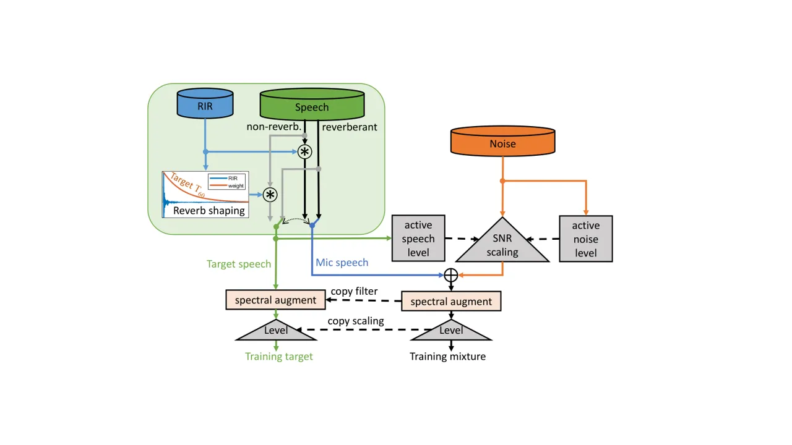
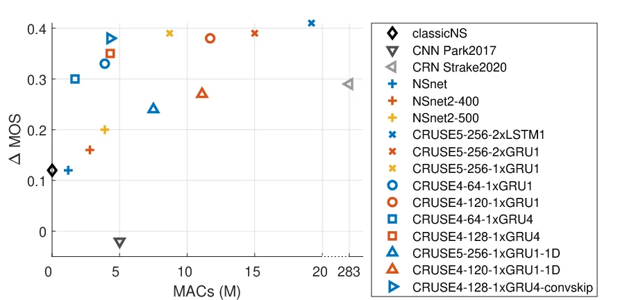
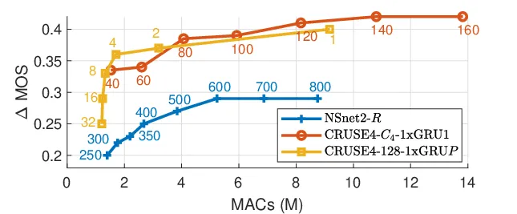

# Towards efficient models for real-time deep noise suppression

Sebastian Braun    Hannes Gamper    Chandan K.A. Reddy    Ivan Tashev

###### Abstract

With recent research advancements, deep learning models are becoming
attractive and powerful choices for speech enhancement in real-time
applications. While state-of-the-art models can achieve outstanding
results in terms of speech quality and background noise reduction, the
main challenge is to obtain compact enough models, which are resource
efficient during inference time. An important but often neglected aspect
for data-driven methods is that results can be only convincing when
tested on real-world data and evaluated with useful metrics. In this
work, we investigate reasonably small recurrent and
convolutional-recurrent network architectures for speech enhancement,
trained on a large dataset considering also reverberation. We show
interesting tradeoffs between computational complexity and the
achievable speech quality, measured on real recordings using a highly
accurate MOS estimator. It is shown that the achievable speech quality
is a function of network complexity, and show which models have better
tradeoffs.

###### Index Terms: 

speech enhancement, noise reduction, convolutional recurrent neural
network, efficient neural networks

^(†)^(†)address: Microsoft Research, Redmond, WA, USA  
sebastian.braun@microsoft.com

## 1 Introduction

Speech enhancement using neural networks has seen large attention in
research in the recent years \[1\] and is starting to be deployed in
commercial human-to-human communication applications. While the trend in
research still majorly follows the trajectory of developing larger
networks to further improve the performance and quality, for real-world
applications following the opposite trend is of much higher interest:
_How to obtain the best speech quality given a maximum computational
budget?_ Running current state-of-the-art noise suppression neural
networks is still challenging on resource limited devices, where noise
suppression is often only a small fraction among several other tasks
running on the devices, such as other audio processing tasks, video,
encoding, transmission, etc.

Earlier network architectures were mainly RNN (RNN) structures, which
were believed promising in terms of efficiency due to its efficient
temporal modeling capabilities \[2, 3, 4\]. While such models seem to
hit a performance saturation, the use of CRN and CNN raised the
performance, but resulted in development of enormously large
architectures \[5, 6, 7, 8\] that are impractical to run on typical edge
devices like consumer laptops, mobile phones, or even less powerful
devices like wearables or hearing aids. Efficient models are also
obtained by building as much prior knowledge into the models as
possible, rather than trying to learn well-understood blocks such as
time-frequency transforms from scratch. While time-domain networks such
as \[9\] could in theory yield superior performance than FD (FD)
networks, proof of generalization on real data in reverberant
environments and real recordings has not yet been shown \[10\].
Therefore, we stick in this work to FD implementations.

To draw valid and general conclusions from our experiments, we train on
large scale data simulating the most important aspects of real-world
data such as reverberation, many different speakers, a vast amount of
noise types, and varying microphone signal levels. We propose a powerful
data generation and augmentation pipeline that deals with reverberant
and non-reverberant speech to reduce heavy reverberation, using
signal-based estimates of reverberation parameters. Results are shown on
real recordings of a public dataset using a DNN (DNN) based MOS
predictor that has shown high correlation to subjective ratings in
practice.

In this work, we compare RNN with CRN architectures and show which
network parts can be scaled, removed, or replaced by more efficient
modules, at which gains in complexity and which loss in quality.
Specifically, we investigate the influence of RNN size, type, and the
use of disconnected parallel RNN. For CRN with a symmetric convolutional
encoder/decoder structure, we investigate the convolution layers,
spectral vs. spectro-temporal convolutions, and skip connections. As a
result, we propose an efficient CRN structure with around 4-5 times less
computational operations with similar quality than previously proposed
CRN.

## 2 Enhancement system and training objective

We use spectral suppression-based enhancement systems due to their
robust generalization, logical interpretation and control, and easier
integration with existing speech processing algorithms. The input
features to the networks are log power spectra. The network predicts a
real-valued, time-varying suppression gain per time-frequency bin, that
is applied to the complex input spectrum, and transformed back to
time-domain as shown in Fig. 1 in the upper branch. To compute a single
frame, the network requires only the feature of the current frame, or
when using causal convolutions, also several past frames. Therefore, the
algorithmic delay of the systems depend only on the STFT (STFT) window
size.

Figure 1: Enhancement system and training with STFT consistency \[8\]
and level-invariant loss \[11\].

We train the networks enforcing STFT consistency \[8\] by propagating
the FD output through reconstruction and another STFT to compute a FD
loss as shown in Fig. 1. This preserves the flexibility of integrating
the network with other FD algorithms, and offloading the STFT operations
to optimized implementations. As shown in Fig. 1, each training
sequence, i. e.  predicted and target signals, are normalized by the
active target utterance level, to ensure balanced optimization for
signal-level dependent losses \[11\].

We train on the complex compressed MSE (MSE) loss \[12\], blending the
magnitude-only with a phase-aware term, which we found to be superior to
other losses for reverberant speech enhancement \[13\]. The loss
function per sequence is given by

```math
\mathcal{L}=(1\!-\!\lambda)\sum_{k,n}\left||S|^{c}\!-\!|\widehat{S}|^{c}\right|^{2}+\lambda\sum_{k,n}\left||S|^{c}e^{j\varphi_{S}}\!-\!|\widehat{S}|^{c}e^{j\varphi_{\widehat{S}}}\right|^{2}, \tag{1}
```

where $`c=0.3`$ is a compression factor, $`\lambda=0.3`$ \[13\] is a
weighting between complex and magnitude-based loss, and we omitted the
dependency of the target speech spectral bins $`S(k,n)`$ on the
frequency and time indices $`k,n`$ for brevity.

The networks are trained in batches of 10 sequences of 10 s length using
the AdamW optimizer \[14\], learning rate of $`8\cdot 10^{-5}`$, and
weight decay of 0.1. The best model is picked based on the validation
metric using a heuristic optimization criterion $`Q`$ using PESQ (PESQ)
\[15\], siSDR (siSDR) \[16\] and CD (CD) \[17\]:

```math
Q=PESQ+0.2\cdot siSDR-CD. \tag{2}
```

## 3 Network architectures

In this section, we describe RNN and CRN architectures and modify them
to improve efficiency. All models use the same features, prediction
targets, loss, and training strategy described in Section 2.

Figure 2: CRUSE network architecture with $`L`$ encoder/decoder layers
and a bottleneck with $`P`$ parallel recurrent layers.

### 3.1 NSnet2

The network proposed in \[11\], referred to as _NSnet2_, consists only
of FC (FC) and GRU (GRU) \[18\] layers in the format
FC-GRU-GRU-FC-FC-FC. All FC layers are followed by ReLU (ReLU)
activations, except the last layer has sigmoid activations to predict a
constrained suppression gain. The standard layer dimensions are 400 for
GRU, 600 for FC layers, i. e.  400-400-400-600-600-$`K`$, but we also
investigate different configurations. The input and output dimensions
are the number of frequency bins $`K`$.

### 3.2 CRUSE

The second network is a CRN U-Net structure derived from \[7\], referred
to in the remainder as _CRUSE (CRUSE)_. As shown in Fig. 2, the
structure has $`L`$ symmetric convolutional and deconvolutional encoder
and decoder layers with kernels of size $`(2,3)`$ in time and frequency
dimensions. The convolution kernels move with a stride of $`(1,2)`$,
i. e. downsample the features along the frequency axis efficiently,
while the number of channels $`C_{\ell}`$ for layer
$`\ell=\{1,\ldots,L\}`$ increase per encoder layer, and decrease
mirrored in the decoder. In this work, input and output channels
$`C_{\text{in}}=C_{\text{out}}=1`$, but they can be extended to e. g. 
take complex values or multiple features as multiple channels.
Convolutional layers are followed by leaky ReLU activations, while the
last layer uses sigmoid. Between encoder and decoder sits a recurrent
layer, which is fed with all features flattened along the channels. In
\[7\] a stack of two LSTM (LSTM) layers was proposed at this stage. As
will be shown in our experimental results in Section 5, replacement by a
single GRU layer yields very little performance loss, but huge
computational savings. A GRU saves 25% complexity compared to an LSTM
layer. Two further modifications are addressed in the following two
paragraphs.

Parallel RNN grouping As will be shown in Section 5, the performance of
both CRUSE and NSnet2 directly scales with the bottleneck size, i. e.
the width $`R`$ of the central RNN layer(s). However, the complexity of
RNN layers scales with $`R^{2}`$, making wide RNN computationally
unattractive. Therefore, we adopt the technique proposed in \[19\], to
group the wide fully connected RNN into $`P`$ disconnected parallel RNN,
still yielding the same forward information flow as shown in Fig. 2. We
denote the number of $`P`$ parallel GRU, where $`P\!=\!1`$ means the
last convolutional encoder output is flattened to a single vector and
fed to a single GRU, while with $`P\!>\!1`$, the encoder output is
reshaped to $`P`$ vectors of same length, being fed through $`P`$
disconnected GRU, and being reshaped again to the number of decoder
channels $`C_{L}`$. Another practical advantage is the possible parallel
execution of the disconnected RNN.

Skip connections As shown in Fig. 2, each convolutional encoder layer is
connected to its corresponding decoder layer by a skip connection. In
\[19\] skip connections between corresponding encoder and decoder layers
have been implemented by concatenating the encoder output to the
corresponding decoder input along the channel dimension as shown in
Fig. 3a).

Figure 3: Skip connections by a) doubling the decoder input channels, b)
addition. We found inserting $`1\!\!\times\!\!1`$ convolutions in the
add skips connections useful.

This doubles the number of decoder input channels, resulting in higher
complexity. More efficient skip connections are implemented by simply
adding the encoder outputs to the decoder inputs, resulting in minor
performance degradation. We found when adding a trainable channel-wise
scaling and bias in the add-skip connections, which can be implemented
as convolutions with $`C_{\ell}`$ channels and (1,1) kernels as in
Fig. 3b), therefore being very cheap, improves the performance at
negligible additional cost.

## 4 Experimental setup

### 4.1 Dataset

We a use large-scale synthetic training set and test on real recordings
to ensure generalization of our results to real-world signals. The
training set uses 544 h of high MOS (MOS) rated speech recordings from
the LibriVox corpus, 247 h noise recordings from Audioset, Freesound,
internal noise recordings and 1 h of colored stationary noise. Except
for the 65 h internal noise recordings, the data is available publicly
as part of the 2nd DNS challenge¹¹ 1
https://github.com/microsoft/DNS-Challenge/tree/icassp2021-final. We
estimated $`T_{60}`$ and $`C_{50}`$ for each speech file using \[20,
21\] and classified them as reverberant if $`T_{60}>0.22`$ s and
$`C_{50}<18`$ dB.

Our data generation pipeline, outlined in Fig. 4, is described in the
following. While already reverberant speech files are mixed with noise
as is, non-reverberant speech files were augmented with acoustic impulse
responses randomly drawn from a set of 7000 measured and simulated
responses from several public and internal databases. 20%
non-reverberant speech is not reverb augmented to represent conditions
such as close-talk microphones or professionally recorded speech. To
obtain natural sounding, low-reverberant, and time-aligned target speech
signals, the reverberant impulse responses were shaped to a maximum
decay of $`T_{60}^{\text{max}}=0.3`$ s as shown in Fig. 4. The weighting
function (shown as red line in the reverb shaping block) is an
exponential decay with the desired reverberation time \[22\], starting
at the direct sound $`t_{0}`$ of the RIR (RIR)

```math
w_{\text{RIR}}(t)=\begin{cases}\exp\left(-(t-t_{0})\frac{6\log(10)}{T_{60}^{\text{max}}}\right),&\quad t\geq t_{0}\\
1,&\quad t<t_{0}\end{cases} \tag{3}
```



Figure 4: Training data generation: Reverberant speech is used as is,
while non-reverberant speech is augmented with RIR, and the training
targets are created using shaped RIR.

To generate noisy training data, random speech and noise portions were
selected to form training clips of 10 s length. Each speech and noise
segment is level normalized and concatenated with other clips, if the
duration was too short. The reverberant speech segments are then
generated as described before, shown in the green box in Fig. 4,
providing the reverberant speech and non-reverberant target speech
signals. The reverberant speech and noise is mixed with a SNR (SNR)
drawn from a Gaussian distribution with $`\mathcal{N}(5,10)`$ dB. The
resulting mixture signals are re-scaled to levels distributed with
$`\mathcal{N}(-28,10)`$ dBFS. The speech targets are scaled accordingly
with the same factors. The optional spectral augmentation was not used
here due to the large amount of raw data. Using this pipeline, we
created an augmented dataset of roughly 1000 h.

For training monitoring and hyper-parameter tuning, we generated a
synthetic validation set in the same way as above, using speech from the
DAPS²² 2 https://ccrma.stanford.edu/ gautham/Site/daps.html dataset, and
RIR and noise from the QUT³³ 3
https://research.qut.edu.au/saivt/databases/qut-noise-databases-and-protocols/
database. The final test results are shown on the public development set
of the Interspeech 2020 DNS challenge \[23\], consisting of 300 real
recordings and 300 synthetic mixtures from unseen datasets.

### 4.2 Evaluation metrics

Evaluating speech enhancement algorithms is a complex task, which led to
the development of various objective metrics, while subjective ratings
are still the gold standard. Recently, DNN are developed to predict MOS
\[24, 25\]. While we evaluated most of the proposed models using
crowd-sourced ITU P.808 tests, we show only the predicted DNSMOS \[25\]
for consistency of presentation and space constraints here.
Nevertheless, all rankings and trends were coherent across crowd-sourced
MOS, DNSMOS and intrusive objective metrics like PESQ, CD, and siSDR on
the synthetic validation set.

For all models, we relate their audio quality to an estimate of the
computational complexity during inference in terms of MAC (MAC)
operations. Note that we count only the operations related to applying
the weights and biases, which usually contribute the major computational
burden. We do not account for applying activation functions, and also
omit feature extraction, STFT, and enhancement operations, which are
common for all models, and are both negligible compared to the burden of
the DNN models.

### 4.3 Algorithmic parameters

We use a sampling frequency of 16 kHz, an STFT with 50% overlapping
squareroot-Hann windows of 20 ms length, and a corresponding FFT size of
320 points. The inputs to the networks are 161-dimensional log power
spectra. We parameterize _NSnet2_ models denoted by NSnet2-$`R`$, where
$`R`$ denotes the number of GRU nodes per layer. We parameterize CRUSE
with different encoder/decoder sizes, starting always with
$`C_{1}\!=\!16`$ channels, and doubling the channels each layer. CRUSE
models are denoted by CRUSE$`L`$-$`C_{L}`$-$`N`$xRNN$`P`$, where $`L`$
are the number of encoder/decoder layers, the last encoder layer filters
$`C_{L}`$ can vary to scale the RNN layer width, $`N`$ are the number of
RNN layers, and $`P`$ are the number of parallel RNNs. For example,
CRUSE4-120-1xGRU4 has 4 encoder/decoder layers with filters
16-32-64-120, and 1 layer of 4 parallel GRUs. Convolution kernels are
always (2,3), unless denoted explicitly as 1D convolutions with (1,3)
kernels operating only across frequency.

## 5 Results



Figure 5: MOS improvement vs. computational complexity (MACs).

Figure 5 shows the tradeoff between computational complexity in terms of
MAC vs. the predicted overall audio quality using DNSMOS \[25\] for
several _NSnet2_ and _CRUSE_ models, and other baselines. In Fig.  5 all
CRUSE models use add skips without $`1\times 1`$ conv blocks unless
denoted explicitly. The first baseline is a classic noise suppressor
(_classicNS_) exploiting only stationarity of speech \[26\]. While this
method non-surprisingly achieves only minor MOS improvement of around
0.12 on the test set including many highly non-stationary noise types,
the achievement relative to its computational burden in the order of a
few 1000 MACs is a tiny fraction of even our smallest models. For direct
comparison of the following DNN-based baselines, we only took the
architectures, but trained them using the same features, prediction
targets, loss, and training procedure as for all other networks in this
paper: i) _NSnet_ \[4\] yields similar MOS as the _classic NS_. ii) The
fully convolutional architecture proposed in \[27\] underperforms in
this task, which we mainly suspect to the absence long-term temporal
modeling as it uses only 8 frames temporal context. iii) The _CRN-LSTM9_
architecture proposed in \[28\] yields significant MOS improvement, but
is computationally extremely inefficient with 283M MACs due to large CNN
filter kernels and wide recurrent layers.

_NSnet2_, shown with different RNN sizes denoted as NSnet2-400 and
NSnet2-500, performs better than NSnet and its quality can be improved
by increasing the RNN size to 500 units, which also scales up the MACs.
The CRUSE5 models gain largely in efficiency by replacing the 2 LSTM
layers ($`\times`$) with 2 GRUs ($`\times`$), and further by going to
only a single GRU ($`\times`$). We can observe how moving from fully
connected GRUs ($`P\!=\!1`$) to $`P\!=\!4`$ parallel GRUs for different
RNN sizes ($`\bigcirc`$$`\rightarrow`$$`\square`$ and
$`\bigcirc`$$`\rightarrow`$$`\square`$) reduces complexity with very
little performance loss. The 2D convolutional feature extraction of
_CRUSE_ is very useful and efficient as moving to 1D convolutions using
kernels of (1,3) deteriorates the tradeoff significantly for
CRUSE5-256-1GRU ($`\times`$$`\rightarrow`$$`\bigtriangleup`$) and
CRUSE4-120-1GRU ($`\bigcirc`$$`\rightarrow`$$`\bigtriangleup`$). This
seems to contradict findings in \[19\], where no performance degradation
is claimed by using 1D convolutions _on non-reverberant datasets_, which
highlights the importance of using appropriate data.

Overall, Figure 5 reveals a few very interesting trends: i) The fully
recurrent NSnet models have generally lower complexity, but also lower
quality than the _CRUSE_ models. We can conclude that the convolutional
encoder-decoder structures of _CRUSE_ are very helpful. Especially using
also temporal encoder/decoder layers boosts efficiency. ii) We can
observe a surprisingly linear correlation between MACs and MOS.
Consequently for the tested models, the average achieved quality is a
monotonically increasing function of the computational effort. The
MAC-MOS linear relation is even more clear for models within the same
class, e.g. the NSnet models, or _CRUSE_ models with different RNN
widths. The most efficient models, i. e.  the proposed _CRUSE_ models
with parallel GRU and optimized skip connections ($`\triangleright`$)
break out of the linear trend, pushing towards the desired upper left
corner.



Figure 6: Tradeoff by changing RNN width for NSnet2 and CRUSE, and
parallel RNN grouping. Colored numbers denote the variable parameter per
model, $`R`$, $`C_{4}`$, and $`P`$.

Fig. 6 illustrates scalable performance depending on the RNN width. The
blue and red lines show NSnet2-$`R`$ and CRUSE4-$`C_{4}`$-1xGRU1 models,
where the width of the RNN was scaled by changing the RNN width $`R`$
for NSnet2, or changing the last encoder layer’s filters $`C_{4}`$ and
therefore also the RNN width for CRUSE4, respectively. We can observe a
clear monotonic relationship between RNN throughput or memory and the
obtained quality. Obviously, the complexity vs. quality tradeoff
deteriorates for too large models. It is a useful property that the
performance of these networks can be scaled given a certain
computational budget. The yellow line in Fig. 6 shows the effect of
grouping the fully connected RNN for a CRUSE4-128-1xGRU$`P`$ model into
$`P`$ disconnected RNNs while keeping the RNN feedforward flow fixed.
Significantly better tradeoffs can be achieved with $`P=2`$ and $`P=4`$.

| model                               | MACs (M) | $`\Delta`$MOS |
| ----------------------------------- | -------- | ------------- |
| no skips                            | 4.3      | 0.32          |
| add skips                           | 4.3      | 0.35          |
| add conv $`1\!\!\times\!\!1`$ skips | 4.3      | 0.38          |
| concat skips                        | 4.8      | 0.38          |

Table 1: Effect of skip connection type for CRUSE4-128-1GRU4.

Table 1 shows further ablations on the skip connections using the
CRUSE4-128-1xGRU4P architecture. Addition skips are better than no skip
connections. While concat skips improve the MOS, the same MOS can be
achieved by inserting cheap $`1\times 1`$ convolutions as shown in
Fig. 3 by the orange block.

While the execution time of the models is subject to optimization for
the targeted hardware platform, we provide a sense of relating the MAC
to the actual execution time of the efficient CRUSE4-128-1xGRU4 model
measured on a Intel^(©) Core™i7 QuadCore at 3.5 GHz: Without further
optimization, the ONNX model processes one audio frame on average in
0.3 ms, resulting in a reasonable CPU utilization of less than 3% within
the hop size budget of 10 ms. NSnet2-500 runs in 0.15 ms.

## 6 Conclusions

We proposed a flexible and scalable CRN for speech enhancement, trained
on large data and tested on real recordings. We show that using simple
spectral suppression based networks of comparatively small size can
achieve substantial quality improvement when trained on a representative
dataset with a suitable loss taking the time domain reconstruction into
account. We show that the obtained speech quality is a function of
network size, especially depending on the recurrent layer width. We show
gains on the speech quality vs. computational complexity tradeoff by
modified skip connections and a disconnected parallel RNN structure.
While the proposed models use only a fraction of the computational
budget of standard CPUs in real-time, the quality gain per computational
burden compared to a traditional speech enhancement method is still less
efficient and can hopefully be further improved in the future.

## References

- \[1\] D. Wang and J. Chen, “Supervised speech separation based on deep
  learning: An overview,” IEEE/ACM Trans. Audio, Speech, Lang. Process.,
  vol. 26, no. 10, pp. 1702–1726, Oct 2018.
- \[2\] F. Weninger, H. Erdogan, S. Watanabe, E. Vincent, J. Le Roux,
  J. R. Hershey, and B. Schuller, “Speech enhancement with LSTM
  recurrent neural networks and its application to noise-robust ASR,” in
  Proc. Latent Variable Analysis and Signal Separation, 2015, pp. 91–99.
- \[3\] D. S. Williamson and D. Wang, “Time-frequency masking in the
  complex domain for speech dereverberation and denoising,” IEEE/ACM
  Trans. Audio, Speech, Lang. Process., vol. 25, no. 7, pp. 1492–1501,
  July 2017.
- \[4\] R. Xia, S. Braun, C. Reddy, H. Dubey, R. Cutler, and I. Tashev,
  “Weighted speech distortion losses for neural-network-based real-time
  speech enhancement,” in Proc. IEEE Intl. Conf. on Acoustics, Speech
  and Signal Processing (ICASSP), 2020.
- \[5\] G. Wichern and A. Lukin, “Low-latency approximation of
  bidirectional recurrent networks for speech denoising,” in Proc. IEEE
  Workshop on Applications of Signal Processing to Audio and Acoustics
  (WASPAA), Oct 2017, pp. 66–70.
- \[6\] M. Strake, B. Defraene, K. Fluyt, W. Tirry, and T. Fingscheidt,
  “Separated noise suppression and speech restoration: LSTM-based speech
  enhancement in two stages,” in Proc. IEEE Workshop on Applications of
  Signal Processing to Audio and Acoustics (WASPAA), Oct 2019, pp.
  239–243.
- \[7\] K. Tan and D. Wang, “A convolutional recurrent neural network
  for real-time speech enhancement,” in Proc. Interspeech, 2018, pp.
  3229–3233.
- \[8\] S. Wisdom, J. R. Hershey, K. Wilson, J. Thorpe, M. Chinen,
  B. Patton, and R. A. Saurous, “Differentiable consistency constraints
  for improved deep speech enhancement,” in Proc. IEEE Intl. Conf. on
  Acoustics, Speech and Signal Processing (ICASSP), May 2019, pp.
  900–904.
- \[9\] Y. Luo and N. Mesgarani, “Conv-TasNet: Surpassing ideal
  time–frequency magnitude masking for speech separation,” IEEE/ACM
  Trans. Audio, Speech, Lang. Process., vol. 27, no. 8, pp. 1256–1266,
  Aug 2019.
- \[10\] M. Maciejewski, G. Wichern, E. McQuinn, and J. L. Roux,
  “WHAMR!: Noisy and reverberant single-channel speech separation,” in
  Proc. IEEE Intl. Conf. on Acoustics, Speech and Signal Processing
  (ICASSP), 2020, pp. 696–700.
- \[11\] S. Braun and I. Tashev, “Data augmentation and loss
  normalization for deep noise suppression,” in Proc. Speech and
  Computers, 2020.
- \[12\] A. Ephrat, I. Mosseri, O. Lang, T. Dekel, K. Wilson,
  A. Hassidim, W. T. Freeman, and M. Rubinstein, “Looking to listen at
  the cocktail party: A speaker-independent audio-visual model for
  speech separation,” ACM Trans. Graph., vol. 37, no. 4, July 2018.
- \[13\] S. Braun and I. Tashev, “A consolidated view of loss functions
  for supervised deep learning-based speech enhancement,”
  arXiv:2009.12286, 2020.
- \[14\] I. Loshchilov and F. Hutter, “Decoupled weight decay
  regularization,” in International Conference on Learning
  Representations, 2019.
- \[15\] ITU-T, “Perceptual evaluation of speech quality (PESQ), an
  objective method for end-to-end speech quality assessment of
  narrowband telephone networks and speech codecs,” Feb. 2001.
- \[16\] J. L. Roux, S. Wisdom, H. Erdogan, and J. R. Hershey, “SDR -
  half-baked or well done?,” in Proc. IEEE Intl. Conf. on Acoustics,
  Speech and Signal Processing (ICASSP), May 2019, pp. 626–630.
- \[17\] N. Kitawaki, H. Nagabuchi, and K. Itoh, “Objective quality
  evaluation for low bit-rate speech coding systems,” IEEE J. Sel. Areas
  Commun., vol. 6, no. 2, pp. 262–273, 1988.
- \[18\] K. Cho, B. Van Merriënboer, D. Bahdanau, and Y. Bengio, “On the
  properties of neural machine translation: Encoder-decoder approaches,”
  in Proc. 8th Workshop on Syntax, Semantics and Structure in
  Statistical Translation (SSST-8), 2014.
- \[19\] K. Tan and D. Wang, “Learning complex spectral mapping with
  gated convolutional recurrent networks for monaural speech
  enhancement,” vol. 28, pp. 380–390, 2020.
- \[20\] H. Gamper and I. J. Tashev, “Blind reverberation time
  estimation using a convolutional neural network,” in Proc. Intl.
  Workshop Acoust. Signal Enhancement (IWAENC), 2018, pp. 136–140.
- \[21\] H. Gamper, “Blind C50 estimation from single-channel speech
  using a convolutional neural network,” in Intl. Workshop on Multimedia
  Signal Processing (MMSP).
- \[22\] J. D. Polack, La transmission de l’énergie sonore dans les
  salles, Ph.D. thesis, Université du Maine, Le Mans, France, 1988.
- \[23\] C. K. A. Reddy, E. Beyrami, H. Dubey, Gopal V., R. Cheng,
  R. Cutler, S. Matusevych, R. Aichner, A. Aazami, S. Braun, Rana P.,
  S. Srinivasan, and J. Gehrke, “The INTERSPEECH 2020 deep noise
  suppression challenge: Datasets, subjective speech quality and testing
  framework,” in Proc. Interspeech, 2020.
- \[24\] A. R. Avila, H. Gamper, C. Reddy, R. Cutler, I. Tashev, and
  J. Gehrke, “Non-intrusive speech quality assessment using neural
  networks,” in Proc. IEEE Intl. Conf. on Acoustics, Speech and Signal
  Processing (ICASSP), 2019, pp. 631–635.
- \[25\] C. K. A. Reddy, H. Dubey, V. Gopal, R. Cutler, S. Braun,
  H. Gamper, R. Aichner, and S. Srinivasan, “ICASSP 2021 deep noise
  suppression challenge,” in Proc. IEEE Intl. Conf. on Acoustics, Speech
  and Signal Processing (ICASSP), 2021.
- \[26\] Ivan Tashev, Sound Capture and Processing: Practical
  Approaches, Wiley, July 2009.
- \[27\] S. R. Park and J. W. Lee, “A fully convolutional neural network
  for speech enhancement,” in Proc. Interspeech, 2017.
- \[28\] M. Strake, B. Defraene, K. Fluyt, W. Tirry, and T. Fingscheidt,
  “Fully convolutional recurrent networks for speech enhancement,” in
  Proc. IEEE Intl. Conf. on Acoustics, Speech and Signal Processing
  (ICASSP), 2020, pp. 6674–6678.
