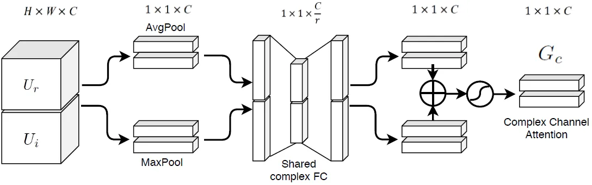
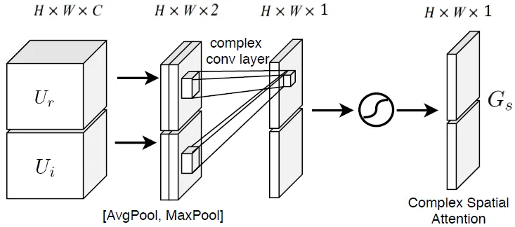
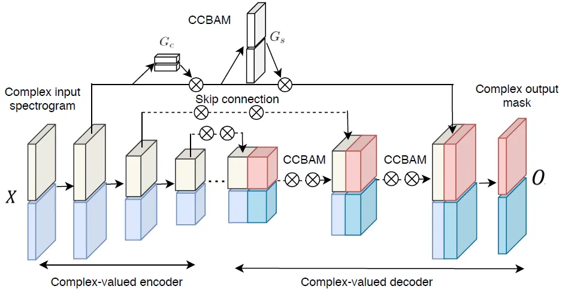
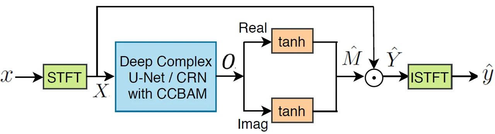

# MONAURAL SPEECH ENHANCEMENT WITH Complex convolutional block attention module and joint time frequency losses

Shengkui Zhao    Trung Hieu Nguyen    Bin Ma

###### Abstract

Deep complex U-Net structure and convolutional recurrent network (CRN)
structure achieve state-of-the-art performance for monaural speech
enhancement. Both deep complex U-Net and CRN are encoder and decoder
structures with skip connections, which heavily rely on the
representation power of the complex-valued convolutional layers. In this
paper, we propose a complex convolutional block attention module (CCBAM)
to boost the representation power of the complex-valued convolutional
layers by constructing more informative features. The CCBAM is a
lightweight and general module which can be easily integrated into any
complex-valued convolutional layers. We integrate CCBAM with the deep
complex U-Net and CRN to enhance their performance for speech
enhancement. We further propose a mixed loss function to jointly
optimize the complex models in both time-frequency (TF) domain and time
domain. By integrating CCBAM and the mixed loss, we form a new
end-to-end (E2E) complex speech enhancement framework. Ablation
experiments and objective evaluations show the superior performance of
the proposed approaches.

###### Index Terms: 

speech enhancement, attention mechanism, complex network, deep learning

^(†)^(†)address: Speech Lab, Alibaba Group

## 1 Introduction

Speech enhancement is a highly desired task in speech communication
applications where the perceptual quality and intelligibility can be
severely decreased by the additive background noise. The goal of speech
enhancement is to extract the signal of interest from the corrupted
noisy speech for better perceptual quality and intelligibility.

For decades, monaural speech enhancement has been a challenging problem.
Recently, deep learning methods have made significant performance
improvement over conventional signal processing based methods. Given
clean speech and background noise, the speech enhancement task can be
formulated as a supervised learning problem with the simulated noisy
speech as input and the clean speech as target. Although researchers
have tried to build deep learning models directly on time-domain speech
signals \[1, 2, 3\], it is more common to work on time-frequency (TF)
representations via short-time-Fourier-transform (STFT). Comparing to
the spectral mapping approach \[4\], the TF mask-based approach has been
more popular \[5, 6, 7\]. Early studies usually focus on enhancing the
magnitude spectrum while reusing the noisy phase spectrum. Recent
studies show the phase and magnitude components are relative important
in terms of speech perceptual quality and intelligibility, leading
researchers to consider both magnitude and phase estimation. The
phase-sensitive mask (PSM) \[8\] was one of the first attempts to
incorporate phase information into mask estimation. However, it still
estimates a real component. Subsequently, the ideal complex ratio mask
(CRM) \[9\] was proposed to estimate both the real and the complex
components and it theoretically achieves the best oracle speech
enhancement performance. The pioneer work \[9\] attempts to estimate CRM
via real-valued network operations, which are not coincided well with
the complex-valued masks. More recently, deep complex networks \[10\]
were developed and the complex-valued models \[11, 12, 13\] achieve
state-of-the-art (SOTA) performance for speech enhancement. We found
that the SOTA models \[11, 12, 13\] are built on either the U-Net
structure \[4\] or the convolutional recurrent network (CRN) structure
\[14\], which heavily rely on the representation power of the
convolutional layers. The attention mechanisms \[15, 16\] proposed for
image processing that fuse both spatial and channel-wise information to
boost the representation power of the convolutional layers have not been
exploited in the SOTA complex models for speech enhancement.

In this paper, we present a lightweight and general complex-valued
channel-spatial attention mechanism, built upon previous studies \[16\]
to boost the representation power of the complex-valued convolutional
layers, therefore enhance capabilities of the complex-valued SOTA
models, e.g., U-Net and CRN, for speech enhancement. Our attention
mechanism is formed as an individual module called complex convolutional
block attention module (CCBAM) which can be easily integrated into any
complex-valued convolutional layers with negligible overheads and is
end-to-end trainable along with base network. The CCBAM can be
interpreted as a means of biasing the allocation of available
computational resources towards the most informative features for
optimizing representation power. Our experiments suggest adding CCBAM to
both the decoder layers and the skip connections provide better results
and achieve superior performance. Besides the proposed attention
mechanism, we also add mean-squared error (MSE) loss of the real and the
complex components of CRM to the scale-invariant source-to-noise ratio
(SI-SNR) loss \[11, 13\] to jointly optimize the CRM estimation in the
TF domain and the time domain. Our experiments will demonstrate the
effectiveness of the proposed joint loss functions for speech
enhancement.

The related works are described as follows. The attention blocks named
self-attention were applied for speech enhancement \[12, 17\]. The
self-attention focused on the response of positions in a sequence while
CCBAM focuses on cross-channel and spatial information of feature maps.
Another related work is the spatial-channel gating scheme proposed for
the U-Net structure \[18\], which addressed medical image segmentation
problem. \[19\] also applied a concurrent space-channel-wise attention
to the redundant convolutional encoder-decoder (RCED) for speech
enhancement. However, their work was based on magnitude spectrum
mapping. The above mentioned works were based on real-valued networks
and we focus on complex-valued networks.

## 2 The Complex Convolutional Block Attention Module

Our proposed CCBAM is a refined complex-valued attention mechanism
applied in STFT-domain based on the work described in \[16\]. It is
composed of a complex channel-attention module and a complex
spatial-attention module as shown in Fig. 1 and Fig. 2. Both modules
consist of a squeeze operation and an excitation operation. The squeeze
operation involves pooling process to aggregate information. The
excitation process applies the aggregated information to generate
recalibration weights.



Figure 1: Diagram of complex channel attention module.



Figure 2: Diagram of complex spatial attention module.

### 2.1 Complex channel-attention module

Let the output complex feature map be $`U=U_{r}+jU_{i}`$ where
$`U\in\mathbb{C}^{H\times W\times C}`$ from the complex-valued
convolutional filter $`W=W_{r}+jW_{i}`$ with complex input matrix
$`V=V_{r}+jV_{i}`$. The complex convolution operation can be formulated
as:

```math
\displaystyle U_{r}=V_{r}\ast W_{r}-V_{i}\ast W_{i}
```

```math
\displaystyle U_{i}=V_{r}\ast W_{i}+V_{i}\ast W_{r} \tag{1}
```

where $`\ast`$ stands for real-valued convolutional filtering. Applying
global average pooling to $`U_{r}`$ and $`U_{i}`$ to aggregate spatial
information of the feature map, respectively, we obtain
$`U_{r}^{\mathrm{avg}}=\mathrm{AvgPool}(U_{r})`$,
$`U_{i}^{\mathrm{avg}}=\mathrm{AvgPool}(U_{i})`$. Similarly, applying
max pooling we obtain $`U_{r}^{\mathrm{max}}=\mathrm{MaxPool}(U_{r})`$,
$`U_{i}^{\mathrm{max}}=\mathrm{MaxPool}(U_{i})`$. Then, we apply two
complex-valued FC layers to
$`U^{\mathrm{avg}}=U_{r}^{\mathrm{avg}}+jU_{i}^{\mathrm{avg}}`$ and
$`U^{\mathrm{max}}=U_{r}^{\mathrm{max}}+jU_{i}^{\mathrm{max}}`$,
respectively. Let the complex weights of the two FC layers be
$`W^{\mathrm{FC}}_{1}=W^{\mathrm{FC}}_{1r}+jW^{\mathrm{FC}}_{1i}`$ and
$`W^{\mathrm{FC}}_{2}=W^{\mathrm{FC}}_{2r}+jW^{\mathrm{FC}}_{2i}`$,
where $`W^{\mathrm{FC}}_{1}\in\mathbb{C}^{\frac{C}{r}\times C}`$ and
$`W^{\mathrm{FC}}_{2}\in\mathbb{C}^{C\times\frac{C}{r}}`$, with $`r`$
standing for a reduction ratio. The complex-valued channel-attention
gate $`G_{c}\in\mathbb{R}^{1\times 1\times C}`$ is then computed as:

```math
G_{c}=\sigma(W^{\mathrm{FC}}_{2}\delta(W^{\mathrm{FC}}_{1}U^{\mathrm{avg}}))+\sigma(W^{\mathrm{FC}}_{2}\delta(W^{\mathrm{FC}}_{1}U^{\mathrm{max}})) \tag{2}
```

where $`\delta`$ refers to complex-valued ReLU function and $`\sigma`$
refers to complex-valued sigmoid function \[10\], and both ReLU and
sigmoid apply on real and imaginary values, respectively. In Eq. (2),
the weights $`W^{\mathrm{FC}}_{1}`$ and $`W^{\mathrm{FC}}_{2}`$ are
shared between $`U^{\mathrm{avg}}`$ and $`U^{\mathrm{max}}`$. The
complex FC operations can be performed in a similar way as the complex
convolution in Eq. (1).

### 2.2 Complex spatial-attention module

Applying average-pooling and max-pooling operations to $`U_{r}`$ and
$`U_{i}`$ to aggregate channel information of the feature map $`U`$,
respectively, and then applying a complex-valued two-dimensional (2D)
convolutional filter $`F=F_{r}+jF_{i}`$ to the concatenated pooling
ouput, we obtain the complex spatial-attention gate
$`G_{s}\in\mathbb{R}^{H\times W\times 1}`$ as:

```math
G_{s}=\sigma(F[\mathrm{AvgPool}(U);\mathrm{MaxPool}(U)]) \tag{3}
```

where $`\sigma`$ denotes the complex-valued sigmoid function and
$`[\mathrm{AvgPool}(U);\mathrm{MaxPool}(U)]`$ represents the
concatenation operation along the channel axis. The pooling operations
are performed on $`U_{r}`$ and $`U_{i}`$ separately. The complex
convolution operation works similarly as defined in Eq. (1). The
convolution filter size is a hyperparameter and we set to $`7\times 7`$
for better performance in our experiments.



Figure 3: Illustration of CCBAM integrated with convolutional
encoder-decoder structure with skip connections. The symbol $`\otimes`$
stands for element multiplication.



Figure 4: Illustration of the proposed end-to-end speech enhancement
method.

## 3 Integration of CCBAM with Deep Complex U-Net and CRN Architectures

### 3.1 Integration of CCBAM

The deep complex U-Net (DCUnet) \[11\] is a complex-valued network
design of the real-valued U-Net structure proposed in \[4\] for image
segmentation. The DCUnet is composed of a complex-valued convolutional
encoder and a decoder with skip-connections as shown in Fig. 3. The
encoder gradually extracts high-lever features with a down-sampling
process and the decoder reconstructs the target map with an up-sampling
process. The encoder and the decoder use complex 2D convolutional and
deconvolutional layers, respectively. Each complex
convolutional/deconvolutional operation is followed by complex batch
normalization and leaky ReLU activation. The skip-connections connect
the convolutional layers from the encoder to the corresponding
deconvolutional layers of the decoder. The deep complex CRN (DCCRN)
\[13\] is a complex-valued network design of the real-valued CRN
structure proposed in \[14\]. Comparing to the DCUnet, the DCCRN is also
composed of a complex-valued convolutional encoder and a decoder with
skip-connections. The essential difference is that the DCCRN added LSTM
layers between the encoder and the decoder aiming to model the temporal
dependencies. Since the DCUnet and DCCRN share equivalent encoder and
decoder structure, we integrate CCBAM into DCUnet and DCCRN similarly.
Fig. 3 shows the overall integrated architecture of the convolutional
encoder-decoder network with our proposed CCBAM. We insert the two
complex channel and spatial attention modules of CCBAM into the decoder
paths and the skip connection paths in a sequential manner. The CCBAM
performs as self-gating mechanism to recalibrate the TF feature maps
adaptively in consideration of the global information. It can help the
skip connections to by-pass meaningful information that are beneficial
for CRM estimation. Meanwhile, the CCBAM is also expected to help the
decoder to concentrate on ’what’ and ’where’ of feature maps when
performing target reconstruction.

### 3.2 The end-to-end speech enhancement method

The proposed end-to-end speech enhancement method is illustrated in Fig. 4. Assuming the noisy speech signal is denoted as
$`x(n)=y(n)+z(n)\in\mathbb{R}`$ where $`y(n)`$ is the clean speech
signal and $`z(n)`$ the background noise, the speech enhancement task is
to estimate $`y(n)`$ from $`x(n)`$. Let $`X=X_{r}+jX_{i}\in\mathbb{C}`$,
$`Y=Y_{r}+jY_{i}\in\mathbb{C}`$ denote the STFT representations of
$`x(n)`$ and $`y(n)`$, respectively. The CRM method \[9\] is to estimate
the complex-valued mask $`M=Mr+jM_{i}\in\mathbb{C}`$ such that
$`Y=M\odot X`$, where $`\odot`$ indicates complex multiplication. The
ground-truth CRM can be computed as:

```math
M=\frac{X_{r}\cdot Y_{r}+X_{i}\cdot Y_{i}}{X^{2}_{r}+X^{2}_{i}}+j\frac{X_{r}\cdot Y_{i}-X_{i}\cdot Y_{r}}{X^{2}_{r}+X^{2}_{i}}. \tag{4}
```

Estimating the unbounded components $`M_{r}`$ and $`M_{i}`$ is very
challenging. In our speech enhancement model, we propose to add tanh
function to bound the estimated real and imaginary components,
$`\hat{M}_{r}`$ and $`\hat{M}_{i}`$, of $`\hat{M}\in\mathbb{C}`$. The
estimated clean speech spectrogram $`\hat{Y}`$ is then obtained as

```math
\hat{Y}=(X_{r}\cdot\hat{M}_{r}-X_{i}\cdot\hat{M}_{i})+j(X_{r}\cdot\hat{M}_{i}+X_{i}\cdot\hat{M}_{r}). \tag{5}
```

The estimated time domain clean speech $`\hat{y}(n)`$ is obtained by
applying ISTFT on $`\hat{Y}`$.

In the SOTA frameworks \[11, 13\], the neural models are optimized based
only on the time domain loss function SI-SNR or weighted SI-SNR. The
SI-SNR loss may not be fully correlated with the CRM estimation. We
propose an improved mixed loss function by integrating SI-SNR loss with
mean squared error (MSE) losses of the real and the imaginary CRM
estimates. Specifically, we optimize the neural model by the following
loss function

```math
\mathcal{L}(y,\hat{y})=\lambda_{\mathrm{SI-SNR}}\mathcal{L}_{\mathrm{SI-SNR}}(y,\hat{y})+\lambda_{\mathrm{Mask}}\mathcal{L}_{\mathrm{Mask}}(M,\hat{M}), \tag{6}
```

where the time domain SI-SNR loss
$`\mathcal{L}_{\mathrm{SI-SNR}}(y,\hat{y})`$ is defined as \[13\]:

```math
\mathcal{L}_{\mathrm{SI-SNR}}(y,\hat{y})=\mathrm{10log10}\bigg(\frac{||y_{\mathrm{target}}||^{2}_{2}}{||e_{\mathrm{noise}}||^{2}_{2}}\bigg) \tag{7}
```

where $`y_{\mathrm{target}}`$ is given as:
$`y_{\mathrm{target}}=(<\hat{y},y>\cdot y)/||y||^{2}_{2}`$ and the
residual noise $`e_{\mathrm{noise}}`$ is
$`e_{\mathrm{noise}}=\hat{y}-y_{\mathrm{target}}`$. Here,
$`<\cdot,\cdot>`$ denotes dot product and $`||\cdot||_{2}`$ is L2 norm.
The mask loss function is defined as

```math
\mathcal{L}_{\mathrm{Mask}}(M,\hat{M})=\sum_{t,f}[(\hat{M}_{r}-M_{r})^{2}+(\hat{M}_{i}-M_{i})^{2}] \tag{8}
```

where $`t,f`$ are omitted for simplicity. The STFT and ISTFT operations
are implemented as 1-D convolutional and deconvolutional layers to
facilitate the end-to-end training.

## 4 Experiments

### 4.1 Datasets

We evaluated and compared the proposed methods on two datasets. The
dataset-1 is a relative small set where we selected about 50 hours clean
speech from WSJ0 \[20\] and about 50 hours noise from DEMAND \[21\] and
RNNoise ¹¹ 1 https://media.xiph.org/rnnoise. The clean speech includes
131 speakers and the noise includes various types of computer fans,
office, crowd, airplane, car, train, construction, etc. We used 40 hours
of clean speech and 40 hours of noise for training and validation, and
the rest for test. The noisy speech mixture was obtained by randomly
mixing speech utterances with noise segments. The noise segments were
split or concatenated to meet the length of speech utterances. A wide
range of SNRs between 0 dB and 20 dB were randomly generated for both
training and evaluation. The total training data was about 100 hours and
the total evaluation data was about 30 minutes.

The dataset-2 is a relative big set provided by the DNS challenge
\[22\]. It contains over 500 hours clean speech and 180 hours noise
selected from various public resources. For the noisy speech mixture, we
used the SNR range between -5 dB to 20 dB. The clean speech and the
noise were randomly mixed and we generated a total of 2000 hours
training data. Note that we targeted only clean speech and background
noise in this work and leave the reverberant case for future work. We
evaluated on the official synthetic test set of the DNS challenge. All
waveforms were resampled at 16k Hz.

### 4.2 Training setup

For the DCUnet model, we used the same model configuration as the
DCUnet-20 shown in Fig. 7 in \[11\]. The DCUnet-20 has 20 convolutional
layers and the total number parameters are 3.5M. We replaced the
original SI-SNR loss of the DCUnet-20 with our proposed mixed loss and
adopted the model into our end-to-end method as shown in Fig. 4. The
resulted model was denoted as DCUnet-M. We further applied our proposed
CCBAM into DCUnet-M and denoted the model as DCUnet-MC. We also followed
the same pre-processing in \[11\] to apply STFT with a 64ms sized Hann
window and 16ms hop length. For the DCCRN model, we used the real-time
CRN model configuration as described in \[14\]. The original CRN model
was proposed for magnitude spectrum mapping. We extended it to
complex-valued network as described in \[13\] with 20M trainable
parameters. Similar to DCUNet, we integrated DCCRN with our proposed
mixed loss and CCBAM. The resulted models were denoted as DCCRN-M and
DCCRN-MC, respectively. For DCCRN, the window length and hop size were
20 ms and 10 ms. For all model training, we used Pytorch platform and
Adam optimizer. We set learning rate to 0.001 and decay it by 0.5 when
the validation score increases. For the loss parameters, we set
$`\lambda_{\mathrm{SI-SNR}}=0.5`$ and $`\lambda_{\mathrm{Mask}}=0.5`$.

|           |                    |       |        |          |
| --------- | ------------------ | ----- | ------ | -------- |
| Model     | Evaluation Metrics |       |        |          |
|           | PESQ               | STOI  | SI-SNR | FwSegSNR |
| Noisy     | 1.97               | 87.83 | 6.28   | 10.64    |
| DCCRN     | 3.17               | 95.80 | 17.71  | 21.35    |
| DCCRN-M   | 3.28               | 96.30 | 18.03  | 23.06    |
| DCCRN-MC  | 3.34               | 96.76 | 18.42  | 24.18    |
| DCUnet    | 3.25               | 96.26 | 18.31  | 20.16    |
| DCUnet-M  | 3.38               | 96.85 | 18.59  | 22.10    |
| DCUnet-MC | 3.44               | 97.10 | 19.33  | 23.81    |

Table 1: Average performance evaluation results for different models on
dataset-1.

|              |                    |       |        |          |
| ------------ | ------------------ | ----- | ------ | -------- |
| Model        | Evaluation Metrics |       |        |          |
|              | PESQ               | STOI  | SI-SNR | FwSegSNR |
| Noisy        | 2.45               | 91.52 | 9.17   | 13.55    |
| DNS Baseline | 2.68               | 77.62 | -26.63 | 7.39     |
| DCCRN        | 3.04               | 93.95 | 15.70  | 19.77    |
| DCCRN-M      | 3.15               | 94.87 | 16.03  | 19.92    |
| DCCRN-MC     | 3.21               | 95.10 | 16.50  | 20.65    |
| DCUnet       | 3.20               | 94.80 | 16.48  | 19.53    |
| DCUnet-M     | 3.24               | 95.88 | 16.92  | 19.63    |
| DCUnet-MC    | 3.30               | 96.11 | 17.46  | 20.31    |

Table 2: Average performance evaluation results for different models on
dataset-2.

### 4.3 Results

For the objective evaluation, we used 4 evaluation metrics: PESQ, STOI,
SI-SNR, and FwSegSNR \[23\]. Table 1 and 2 show objective metric
evaluation results on dataset-1 and dataset-2, respectively. From the
results, we can see that the DCUnet-M and DCCRN-M outperform the
original baseline DCUnet and DCCRN. This shows the proposed mixed loss
is beneficial to the CRM estimation. Moreover, we can see that DCUnet-MC
and DCCRN-MC outperforms their corresponding models without attention
mechanism. This shows the benefits of our proposed CCBAM for model
optimization.

## 5 Conclusions

In this paper, we presented a complex convolutional block attention
module (CCBAM) and a mixed loss function to improve the deep complex
U-Net and CRN models for monaural speech enhancement. The integrated
end-to-end complex speech enhancement framework with the deep complex
U-Net and CRN models achieve better performance compared to their
original models. We conducted experimental studies and demonstrated the
superior performance of the proposed methods on two different datasets.

## References

- \[1\] S. Pascual, A. Bonafonte, and J. Serra, “Segan: Speech
  enhancement generative adversarial network,” in Proc. Interspeech,
  2017, p. 3642–3646.
- \[2\] D. Rethage, J. Pons, and X. Serra, “A wavenet for speech
  denoising,” in Proc. ICASSP, 2018.
- \[3\] Y. Luo and N. Mesgarani, “Conv-tasnet: Surpassing ideal
  time–frequency magnitude masking for speech separation,” IEEE/ACM
  transactions on audio, speech, and language processing, vol. 27, no.
  8, pp. 1256–1266, 2019.
- \[4\] O. Ronneberger, P. Fischer, and T. Brox, “U-net: Convolutional
  networks for biomedical image segmentation,” in International
  Conference on Medical Image Computing and Computerassisted
  Intervention, 2015, p. 234–241.
- \[5\] S. Srinivasan, N. Roman, and D. Wang, “Binary and ratio
  time-frequency masks for robust speech recognition,” Speech
  Communication, vol. 48, no. 11, pp. 1486–1501, 2006.
- \[6\] A. Narayanan and D. Wang, “Ideal ratio mask estimation using
  deep neural networks for robust speech recognition,” in Proc. ICASSP,
  2013, p. 7092–7096.
- \[7\] Y. Wang, A. Narayanan, and D. Wang, “On training targets for
  supervised speech separation,” IEEE/ACM transactions on audio, speech,
  and language processing, vol. 22, no. 12, pp. 1849–1858, 2014.
- \[8\] H. Erdogan, J. R. Hershey, S. Watanabe, and J. Le Roux, “Phase
  sensitive and recognition-boosted speech separation using deep
  recurrent neural networks,” in Proc. ICASSP, 2015, p. 708–712.
- \[9\] D. S. Williamson, Y. Wang, and D. Wang, “Complex ratio masking
  for monaural speech separation,” IEEE/ACM transactions on audio,
  speech, and language processing, vol. 24, no. 3, pp. 483– 492, 2015.
- \[10\] C. Trabelsi, O. Bilaniuk, Y. Zhang, D. Serdyuk, S. Subramanian,
  J. F. Santos, S. Mehri, N. Rostamzadeh, Y. Bengio, and C. J. Pal.,
  “Deep complex networks,” in International Conference on Learning
  Representations, 2018.
- \[11\] H.-S. Choi, J.-H. Kim, J. Huh, A. Kim, J.-W. Ha, and K. Lee,
  “Phase-aware speech enhancement with deep complex u-net,” arXiv
  preprint arXiv:1903.03107, 2019.
- \[12\] U. Isik, R. Giri, N. Phansalkar, J.-M. Valin, K. Helwani, and
  A. Krishnaswamy, “PoCoNet: Better speech enhancement with
  frequency-positional embeddings, semi-supervised conversational data,
  and biased loss,” in Proc. Interspeech, 2020.
- \[13\] Y. Hu, Y. Liu, S. Lv, M. Xing, S. Zhang, Y. Fu, J. Wu,
  B. Zhang, and L. Xie, “DCCRN: Deep complex convolution recurrent
  network for phase-aware speech enhancement,” in Proc.
  Interspeech, 2020.
- \[14\] K. Tan and D. Wang, “A convolutional recurrent neural network
  for real-time speech enhancement,” in Proc. Interspeech, 2018.
- \[15\] J. Hu, L. Shen, and G. Sun, “Squeeze-and-excitation networks,”
  in Proc. CVPR, 2018.
- \[16\] S. Woo, J. Park, J.-Y. Lee, and I. S. Kweon, “CBAM:
  Convolutional block attention module,” in Proc. ECCV, 2018.
- \[17\] Y. Koizumi, K. Yatabe, M. Delcroix, Y. Masuyama, and
  D. Takeuchi, “Speech enhancement using self-adaptation and multi-head
  self-attention,” in Proc. ICASSP, 2020.
- \[18\] T.L.B. Khanh, D.-P. Dao amd N.-H. Ho, H.-J. Yang, E.-T. Baek,
  G. Lee, S.-H. Kim, and S.B. Yoo, “Enhancing u-net with spatial-channel
  attention gate for abnormal tissue segmentation in medical imaging,”
  Appl. Sci., 2020.
- \[19\] T. Lan, Y. Lyu, W. Ye, G. Hui, Z. Xu, and Q. Liu, “Combining
  multi-perspective attention mechanism with convolutional networks for
  monaural speech enhancement,” IEEE Access, doi:
  10.1109/ACCESS.2020.2989861, vol. 8, pp. 78979–78991, 2020.
- \[20\] J. Garofolo, D. Graff, D. Paul, and D. Pallett, “Csr-i (wsj0)
  complete ldc93s6a,” Web Download. Philadelphia: Linguistic Data
  Consortium, vol. 83, 1993.
- \[21\] J. Thiemann, N. Ito, and E. Vincent, “DEMAND: a collection of
  multi-channel recordings of acoustic noise in diverse environments,”
  in Meetings Acoust., 2013, pp. 1–6.
- \[22\] C. K. Reddy, V. Gopal, R. Cutler, E. Beyrami, R. Cheng,
  H. Dubey, S. Matusevych, R. Aichner, A. Aazami, and S. Braun et al.,
  “The interspeech 2020 deep noise suppression challenge: Datasets,
  subjective testing framework, and challenge results,” arXiv preprint
  arXiv:2005.13981, 2020.
- \[23\] Y. Hu and P. C. Loizou, “Evaluation of objective quality
  measures for speech enhancement,” IEEE/ACM transactions on audio,
  speech, and language processing, 2008.
