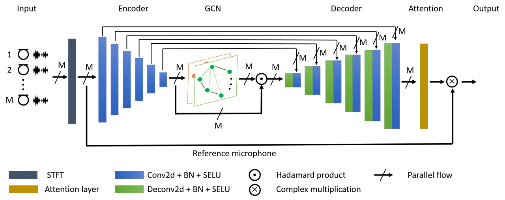
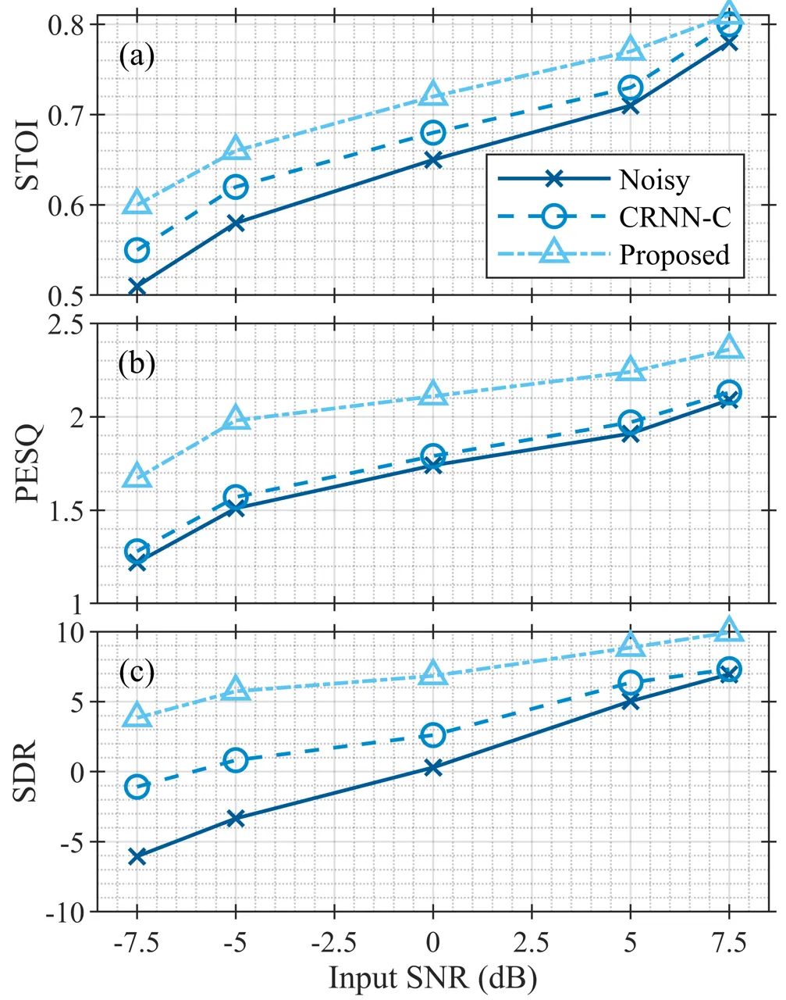

# Multi-Channel Speech Enhancement using Graph Neural Networks

Panagiotis Tzirakis    Anurag Kumar and Jacob Donley

###### Abstract

Multi-channel speech enhancement aims to extract clean speech from a
noisy mixture using signals captured from multiple microphones. Recently
proposed methods tackle this problem by incorporating deep neural
network models with spatial filtering techniques such as the minimum
variance distortionless response (MVDR) beamformer. In this paper, we
introduce a different research direction by viewing each audio channel
as a node lying in a non-Euclidean space and, specifically, a graph.
This formulation allows us to apply graph neural networks (GNN) to find
spatial correlations among the different channels (nodes). We utilize
graph convolution networks (GCN) by incorporating them in the embedding
space of a U-Net architecture. We use LibriSpeech dataset and simulate
room acoustics data to extensively experiment with our approach using
different array types, and number of microphones. Results indicate the
superiority of our approach when compared to prior state-of-the-art
method.

###### keywords

Speech enhancement, deep learning, multi-channel processing, graph
neural networks

^(†)^(†)address: Facebook Reality Labs Research, USA  
panagiotis.tzirakis12@imperial.ac.uk, {anuragkr, jdonley}@fb.com

## 1 Introduction

Humans can naturally focus their auditory system to attend on a single
sound source while cognitively ignoring other sounds. The exact
mechanism that the brain employs to perform such task in difficult noisy
scenarios, often termed the cocktail party problem \[1\], is still not
completely understood. However, studies have shown that binaural
processing can help alleviate this problem \[2\]. Spatial information
helps the auditory system group sounds from specific directions and
segregate them from other directional interfering sounds.

Multi-channel speech enhancement is the process of enhancing a target’s
speech corrupted by background interference using multiple microphones.
It is very crucial to many applications including, but not limited to,
human-machine interfaces \[3\], mobile communication \[4\], and hearing
aid \[5, 6\].

While the problem has been studied for a long time, it remains a
challenging one. The target’s speech signal can be corrupted by not only
other sound sources but also by reverberation from surface reflections.
Traditional approaches include spatial filtering methods \[7, 8\] that
often make use of the spatial information from the sound scene, such as
angular position of the target’s speech and the microphone array
configuration. These approaches are regularly termed _beamforming_, a
linear processing model that weights (“masks”) different microphone
channels in the time-frequency domain in order to suppress source signal
components that are not the target sound source. In the case of the
minimum variance distortion-less response (MVDR) \[9\] beamformer, first
the desired source transfer function and noise covariance matrices are
estimated, often via power spectral density (PSD) matrices, then
beamforming weights are computed and applied to the signals. Although
these approaches can perform well, their performance depends on reliable
estimation of spatial information, which can be challenging to
accurately estimate in noisy conditions.

Deep neural networks (DNN) have been widely used in variety of audio
tasks, such as emotion recognition \[10\], automatic speech
recognition \[11\], and speech enhancement and separation  \[12\]. For
multi-channel processing, they have been incorporated with traditional
spatial filtering methods, such as the conventional filter-and-sum
beamformer. This has mainly been accomplished in two ways, both of which
are applied in the frequency domain. In one approach, a DNN is used to
predict directly the beamforming weights \[13\]. In a second approach, a
DNN is used to estimate a mask which is applied to the short-time
Fourier transform (STFT) of the signal such that the PSD matrices are
computed \[14\]. Then, a beamforming method is applied, such as MVDR,
that computes the filter coefficients using the PSD matrices \[15, 16,
14\]. These methods use DNN’s in different ways, however, the end goal
for each of them is the same, which is to predict the filter
coefficients. Recently, however, a shift in the audio community has
emerged towards incorporating attention mechanisms in the deep neural
network architectures \[17\] to implicitly perform spatial filtering.

In this paper, rather than using traditional beamforming method with a
DNN or attention mechanism, we propose a novel approach for
multi-channel speech enhancement and de-reverberation. In particular, we
view each audio channel as lying in a non-Euclidean space, more
specifically, a graph, which is learned from the observations.
Formulating the problem in such a manner allows us to exploit methods
from the graph neural network’s (GNN) domain \[18\], and perform our
training in an end-to-end manner. In addition, learning a graph
structure allows the network to adapt its structure according to the
dynamic sound scene. To the best of our knowledge, this is the first
method which formulates multi-channel speech enhancement and
de-reverberation through a graph and uses graph neural networks to solve
it.

Our approach relies on both real and imaginary parts of the complex
mixture in the short-time Fourier transform (STFT) domain and estimates
a complex ratio mask (CRM) for a reference microphone. The CRM is then
applied to the mixture STFT to obtain the clean speech. We apply our
proposed method for simultaneous speech enhancement and de-reverberation
tasks. To this end, we simulate data leveraging the LibriSpeech \[19\]
dataset. In particular, we simulate data for different microphone array
configurations - _linear, circular, and distributed_ while varying the
number of microphones. We use Short-Time Objective Intelligibility
(STOI) \[20\], Perceptual Evaluation of Speech Quality (PESQ) \[21\] and
Signal to Distortion Ratio (SDR) \[22\] as evaluation metrics in our
experiments. We also show that our approach outperforms a recently
proposed neural network based multi-channel speech enhancement method.



Figure 1: The proposed model to multi-channel speech enhancement using
graph neural networks. The complex spectrogram of each microphone signal
is computed and passed to the encoder. The extracted representations of
each channel are passed to a graph convolution network for spatial
feature learning. The extracted features of each channel are passed to a
decoder, and a weighted sum of the decoder output is performed. The
output is (complex) multiplied with a reference microphone complex
spectrogram to produce the clean spectrogram.

## 2 Graph neural networks

Graph neural networks (GNN) \[18\] are a generalization of conventional
neural networks, designed to operate on non-Euclidean data in forms of
graph. Graphs provide considerable flexibility in how the data can be
represented and structured and GNNs allow one to operate and generalize
neural network methods to graph structured data . A particular type of
GNN is the convolutional GNNs which is based on the principles of
learning through shared-weights, similar to convolutional neural
networks (CNNs) \[23\]. Broadly, there are two approaches for building
graph convolutional neural networks, _Spectral_ GCNs and _Spatial_
GCNs \[24, 25, 26\]. Spectral GCNs are based on principles of spectral
graph theory. More specifically, the graph processing is based on
Eigen-decomposition of graph Laplacian, which are used to compute the
Fourier transform of a graph signal, through which graph filtering
operations are defined. Spatial GCNs define convolutions directly on
graph data and tries to capture information by aggregating information
from neighboring nodes through shared weights. Spatial GCNs are
computationally less complex as well as generalize better to different
graphs. While Spectral GCNs operate on fixed graph Spatial GCNs have the
flexibility of working locally on each node without taking into account
the full fixed graph. They do however require node ordering.

A key aspect of our proposed method is that we construct the graph
dynamically conditioned on the task at hand. This dynamic graph
construction approach enables the framework to capture multi-channel
information for each audio in a sample specific manner.

## 3 Multi-channel graph processing

Our proposed framework is schematically illustrated in Fig. 1. The audio
signal from each channel is transformed to a time-frequency (T-F)
representation which are fed to the neural network framework. The inputs
are first passed through an encoder network which tries to learn higher
level features from the inputs (Sec 3.1). These feature representations
for the audio channels are then used to construct a graph which captures
the multi-channel information through its nodes and edges. At this
point, we use GCNs (Sec 3.3) to aggregate information from each
microphone. The output representation of each node in the graph is
passed as input to the decoder, which then transform the signals back to
their original dimensions. Finally, a weighted sum of the decoder
outputs is computed, and it is (complex) multiplied with the STFT of a
reference microphone to compute the clean STFT.

### 3.1 Audio Representations Learning

The first major step in our proposed framework is to learn
representations for audio signals from each microphone. To do this, the
audio signals are first converted to a time-frequency representation
through Short-Time Fourier transform (STFT). The real and imaginary
parts of this complex are stacked together to obtain a 2 channel tensor
of size $`2\times T\times F`$, where where $`T`$ represents the total
number of time segments, and $`F`$ represents the total number of
frequency bins. Considering all $`M`$ channels, it leads to a
$`M\times 2\times T\times F`$ dimensional input to the framework.

We utilize a U-Net architecture  \[27\] to learn representations for the
inputs. U-Net based architectures has been shown to work well for speech
enhancement \[28\]. Complex spectrograms from each channel are passed to
the encoder. The representations produced by from the encoder are used
to obtain the multi-channel graph. The decoder outputs $`M`$ tensors of
the same dimension as the input. We combine these tensors in a unified
representation using attention layer, i. e., a weighted sum of them.

### 3.2 Graph Construction

Traditionally, signal processing based methods have been used to extract
information from audio signals captured by multiple microphone. Here, we
propose a _novel_ approach which extracts multi-channel information
through graph processing. The first step in this process is to construct
a graph using the audio representations for different channels obtained
in the previous step.

We construct an undirected graph,
$`\mathcal{G}=(\mathcal{V},\mathcal{E})`$, where $`\mathcal{V}`$
represents the set of nodes, $`v_{i}`$ (i. e. microphones), of the
graph. $`\mathcal{E}`$ represents the edges, $`(v_{i},v_{j})`$, of the
graph between two nodes. In graph theory, the graph is characterized by
an adjacency matrix
$`\mathcal{A}\in\mathbb{R}^{|\mathcal{V}|\times|\mathcal{V}|}`$, where
$`|\cdot|`$ indicates the cardinality and a degree matrix
$`\mathcal{D}`$ \[29\]. We consider _weighted_ adjacency matrix, where
the entries of $`\mathcal{A}`$ correspond to a weighted edge
$`(v_{i},v_{j})\in\mathcal{E}`$ between two nodes of the graph.
Intuitively, each weight represents a similarity between the feature
vectors of two nodes in the graph. In our approach here, these weights,
$`w_{ij},\,\,\{i,j\in|V|\}`$, of the adjacency matrix $`\mathcal{A}`$
are learned during the training process. For two nodes $`v_{i}`$ and
$`v_{j}`$, we first concatenate their representations,
$`\mathbf{f_{v_{i}}},\mathbf{f_{v_{j}}}\in\mathbb{R}^{N}`$ as
$`[\mathbf{f_{v_{i}}}||\mathbf{f_{v_{i}}}]`$ and then pass them through
a non-linear function $`F([\mathbf{f_{v_{i}}}||\mathbf{f_{v_{j}}}])`$.
We construct our adjacency matrix by normalizing the weights of each
node to sum to one. The node degree matrix $`\mathcal{D}`$ is a diagonal
matrix $`\mathcal{D}_{ii}=\sum_{j}\mathcal{A}_{ij}`$.

### 3.3 Graph Convolution Network

The graph, $`\mathcal{G}`$ constructed in the previous section, provides
a structured way to capture the information from all microphones. We can
now exploit GCNs to learn spatial relations from this graph. We apply
GCN to learn higher abstraction levels for the node features by learning
representations for each node with respect to its neighbors. Given a
graph $`\mathcal{G}=(\mathcal{V},\mathcal{E})`$, the GCN applies
non-linear transformation on the input feature matrix
$`\mathcal{X}\in\mathbb{R}^{|\mathcal{V}|\times N}`$ with $`N`$
features. Mathematically, GCN can be represented as follows

```math
\mathcal{H}^{(l)}=g(\mathcal{D}^{-1/2}\mathcal{A}\mathcal{D}^{-1/2}\mathcal{H}^{(l-1)}\mathcal{W}^{(l-1)}). \tag{1}
```

$`\mathcal{H}^{(l)}\in\mathbb{R}^{|\mathcal{V}|\times K}`$ is the
$`l^{th}`$ layer with $`K`$ features with
$`\mathcal{H}^{(0)}=\mathcal{X}`$. $`\mathcal{D}`$ is a diagonal node
degree matrix, $`\mathcal{W}^{(l-1)}`$ is the trainable weight matrix at
the $`l-1^{th}`$ layer, and $`g`$ is an activation function.

### 3.4 Loss Functions

To train the overall framework, we consider loss computation in
different forms. We consider loss computation through magnitude
spectrogram, complex spectrogram and in raw signal domain. More
specifically, following four losses are considered,

```math
\mathcal{L}_{Mag}=\left\lVert\hat{M}-M\right\rVert_{1},\mathcal{L}_{spec}=\left\lVert\hat{S}-S\right\rVert_{1} \tag{2}
```

```math
\mathcal{L}_{Mag+Spec}=\mathcal{L}_{Mag}+\mathcal{L}_{spec} \tag{3}
```

```math
\mathcal{L}_{Mag+raw}=\mathcal{L}_{Mag}+\left\lVert\hat{s}-s\right\rVert_{1} \tag{4}
```

$`\left\lVert\cdot\right\rVert_{1}`$ indicates the L1 norm, $`M`$, $`S`$
and $`s`$ indicate the magnitude spectrogram, complex spectrogram and
clean signal, respectively, and $`\hat{}`$ indicates the corresponding
predicted entities.

|                         |            |             |          |             |           |          |             |             |          |          |
| ----------------------- | ---------- | ----------- | -------- | ----------- | --------- | -------- | ----------- | ----------- | -------- | -------- |
| Method                  | \# Mics    | Circular    |          |             | Linear    |          |             | Distributed |          |          |
|                         |            | STOI        | PESQ     | SDR         | STOI      | PESQ     | SDR         | STOI        | PESQ     | SDR      |
| Noisy                   | 2          | $`0.67`$    | $`1.73`$ | $`0.51`$    | $`0.68`$  | $`1.75`$ | $`0.23`$    | $`0.66`$    | $`1.70`$ | $`0.35`$ |
|                         | 4          | $`0.66`$    | $`1.62`$ | $`0.22`$    | $`0.65`$  | $`1.69`$ | $`0.59`$    | $`0.66`$    | $`1.64`$ | $`0.24`$ |
| CRNN-C \[14\]           | 2          | $`0.68`$    | $`1.75`$ | $`2.29`$    | $`0.68`$  | $`1.72`$ | $`2.17`$    | $`0.67`$    | $`1.73`$ | $`2.33`$ |
|                         | 4          | $`0.70`$    | $`1.88`$ | $`4.89`$    | $`0.68`$  | $`1.75`$ | $`3.17`$    | $`0.67`$    | $`1.71`$ | $`2.25`$ |
| Proposed Single-Channel | –          | $`0.69`$    | $`1.98`$ | $`6.38`$    | $`0.69`$  | $`1.96`$ | $`6.48`$    | $`0.68`$    | $`1.94`$ | $`5.77`$ |
| Proposed                | 2          | $`0.72`$    | $`2.20`$ | $`6.40`$    | $`0.72`$  | $`2.10`$ | $`7.03`$    | $`0.71`$    | $`2.04`$ | $`6.40`$ |
|                         | 4          | $`0.73`$    | $`2.21`$ | $`8.53`$    | $`0.71`$  | $`2.10`$ | $`7.04`$    | $`0.71`$    | $`2.02`$ | $`6.72`$ |

Table 1: Results (STOI, PESQ, SDR) of the enhanced signal for three
array types, namely, circular, linear, and distributed configurations.

## 4 Experiments

### 4.1 Dataset

We utilize LibriSpeech dataset, which is a corpus of approximately
$`1000`$ h of English speech, captured in an anechoic chamber, with
$`16`$ kHz sampling rate. For our purposes, we use the dataset’s
sentences to simulate room acoustic data of three array types: linear,
circular, and distributed. With the distributed array, we randomly place
the microphones in the room. In addition, we experiment with
$`M\in\{2,4\}`$ microphones in the array. The simulated observations
consist of one speech signal mixed with $`M-1`$ noise signals, selected
randomly from AudioSet \[30\] and located randomly in the room. The SNR
levels of the mixed signals are from the set $`\{-7.5,-5,0,5,7.5\}`$ dB.
The training set is comprised of 3 rooms with dimensions
($`\mathrm{width}\times\mathrm{depth}\times\mathrm{height}`$) from the
set
$`\{3\times 3\times 2,~5\times 4\times 6,~8\times 9\times 10\}`$ meters,
the development set of 2 rooms with dimensions from
$`\{5\times 8\times 3,~4\times 7\times 8\}`$ meters, and the test set of
2 rooms with dimensions from
$`\{4\times 5\times 3,~6\times 8\times 5\}`$ meters. All rooms have
$`RT_{60}=0.5`$ sec. The training set is comprised of $`6`$ h, and the
development and test sets of $`5`$ h.

### 4.2 Experimental Setup

We used the Adam optimization algorithm \[31\] to train the models with
a fixed learning rate of $`10^{-5}`$, and a mini-batch of size $`20`$
frames. The input representation is the complex STFT computed with a
Hanning window of length $`1024`$, and frequency bins $`513`$, with a
hop size of $`512`$. The number of channels of the convolution layers in
the encoder are $`64,128,128,256,256,256`$, respectively. The number of
channels of the decoder are the same as the encoder in reverse order.
All (de-)convolution of the encoder (decoder) use $`3\times 3`$ kernel
size, with stride $`2\times 2`$, and no padding. Encoder (decoder)
layers are comprised of the (de-)convolution, with batch normalization,
and a SELU activation function. For our GCN we use two layers with
number of hidden units to be the same as the dimension of the embedding
space.

|                   |               |         |          |               |         |          |               |         |         |               |         |         |           |         |      |
| ----------------- | ------------- | ------- | -------- | ------------- | ------- | -------- | ------------- | ------- | ------- | ------------- | ------- | ------- | --------- | ------- | ---- |
| Method            | Input SNR     |         |          | Input SNR     |         |          | Input SNR     |         |         | Input SNR     |         |         | Input SNR |         |      |
|                   | -7.5 dB       |         |          | -5.0 dB       |         |          | 0 dB          |         |         | 5.0 dB        |         |         | 7.5 dB    |         |      |
|                   | STOI          | PESQ    | SDR      | STOI          | PESQ    | SDR      | STOI          | PESQ    | SDR     | STOI          | PESQ    | SDR     | STOI      | PESQ    | SDR  |
| Noisy             | 0.51          | 1.22    | -6.05    | 0.58          | 1.51    | -3.34    | 0.65          | 1.74    | 0.30    | 0.71          | 1.91    | 5.03    | 0.78      | 2.09    | 6.96 |
| CRNN-C \[14\]     | 0.55          | 1.28    | -1.08    | 0.62          | 1.57    | 0.82     | 0.68          | 1.79    | 2.61    | 0.73          | 1.97    | 6.36    | 0.80      | 2.13    | 7.32 |
| Proposed          | 0.60          | 1.67    | 3.84     | 0.66          | 1.98    | 5.74     | 0.72          | 2.11    | 6.84    | 0.77          | 2.24    | 8.86    | 0.81      | 2.36    | 9.94 |

Table 2: Results (STOI, PESQ and SDR) for different SNR levels using a
4-microphone linear array.



Figure 2: STOI, PESQ, and SDR trends for different SNR levels.

### 4.3 Enhancement Results

We compare our approach, with Chakrabarty’s et al. (CRNN-C) \[14\], a
recently proposed multi-channel deep learning based enhancement model.
Their approach uses as input the phase and magnitude of the raw signal
for each channel and performs convolution across the channels to predict
the ideal ratio mask (IRM) to compute the clean magnitude. We also show
results of the U-Net architecture without utilizing the spatial
information, i. e., using a single-channel for the enhancement. Table 1
shows results for different array configurations.

Our method outperforms, the single-channel approach with high margins on
all metrics. In addition, our model also surpasses the CRNN-C method.
Surprisingly, we observe that CRNN-C approach is the worst performing,
with values marginally above the noisy signal, even when comparing with
the single channel method. In addition, our approach is robust against
different microphone geometries in contrast with conventional methods
where human a-priori knowledge is essential to achieve high-performing
models.

Finally, in Table 2 and Fig. 2, we analyze results at different SNR
levels. Results are shown for a linear array with $`4`$ microphones at 5
different SNR levels, $`[-7.5,-5,`$ $`0,5,7.5]`$ (dB). In general higher
performance gains are obtained for negative SNR values compared to the
positive ones. For -7.5 dB input SNR, we see that the proposed GCN-based
method leads to more than 9 dB improvement in SDR over the noisy case.
For the highest input SNR, we observe only 2.98 dB improvement in SDR.
In addition, we observe that our model outperforms CRNN-C on all SNR
values. This is again more clear in very low SNR values such as
$`-7.5`$ dB, where our model has $`0.5`$, $`0.39`$, $`4.92`$ improvement
on STOI, PESQ, and SDR, respectively.

| Method                         | PESQ     | STOI     | SDR  |
| ------------------------------ | -------- | -------- | ---- |
| Noisy                          | 1.72     | 0.66     | 0.19 |
| $`\mathcal{L}_{Mag}`$          | 2.03     | 0.70     | 6.22 |
| $`\mathcal{L}_{Spec}`$         | 1.88     | 0.69     | 6.28 |
| $`\mathcal{L}_{Mag+Spec}`$     | 2.02     | 0.70     | 7.40 |
| $`\mathcal{L}_{Mag+raw}`$      | 2.13     | 0.73     | 7.73 |

Table 3: Results on the development set for different loss functions.

| Method      | PESQ     | STOI     | SDR  |
| ----------- | -------- | -------- | ---- |
| Noisy       | 1.72     | 0.66     | 0.19 |
| w/o GCN     | 2.08     | 0.71     | 7.05 |
| w/ GCN      | 2.13     | 0.73     | 7.73 |

Table 4: Proposed model with and without the graph representation.

### 4.4 Ablation Study

We perform an ablation study using a 4-microphone linear array to find
an appropriate loss function, and to verify that the GCN improves the
model’s performance. Experiments in this section use an 8 microphone
circular array and results are shown with STOI, PESQ, and SDR. Table 3
shows the results on the development set of our simulated dataset. The
results indicate that the loss that combines the magnitude and the raw
signal have the overall best performance.

To verify the utility of the GCN in the embedding space of the U-Net, we
perform two experiments where we: (i) discard the GCN, and (ii) include
GCN, from the embedding space of U-Net. Table 4 depicts the results.
Including GCNs the performance of the model is better on all the metrics
than without using GCN. We should note that when we do not use GCN we
still use all channels as we combine the extracted U-Net representations
with the attention layer.

## 5 Conclusions

In this paper, we propose to utilize graph neural networks to exploit
the spatial correlations in the multi-channel speech enhancement
problem. We use a U-Net type architecture where the encoder learns
representations for each channel separately, and a graph is constructed
using these representations. Graph convolution networks are used to
propagate messages in the graph, and hence learn spatial features. The
features of each node are passed to the decoder to reconstruct the
spectrogram of each channel. We combine these using attention weights
for the final prediction of a reference microphone. An analysis of the
proposed method is provided with different array geometries and
microphone counts in reverberant and noisy environments. This is the
first study that utilizes GCN for speech enhancement. Results show the
superiority of the proposed approach compared to the prior
state-of-the-art method.

Future work could look at performing a quantitative evaluation of the
trained model by inspecting the most important nodes and edges in the
graph. Also, performing speech enhancement by using the raw waveform
(i. e., end-to-end approach) instead of the complex spectrograms is
another possible direction.

## References

- \[1\] E. C. Cherry, “Some experiments on the recognition of speech,
  with one and with two ears,” The Journal of the acoustical society of
  America, pp. 975–979, 1953.
- \[2\] M. L. Hawley, R. Y. Litovsky, and J. F. Culling, “The benefit of
  binaural hearing in a cocktail party: Effect of location and type of
  interferer,” The Journal of the Acoustical Society of America, pp.
  833–843, 2004.
- \[3\] M. R Bai, J. Ih, and J. Benesty, Acoustic array systems: theory,
  implementation, and application, John Wiley & Sons, 2013.
- \[4\] K. Tan, X. Zhang, and D. Wang, “Real-time speech enhancement
  using an efficient convolutional recurrent network for dual-microphone
  mobile phones in close-talk scenarios,” in Proc. IEEE ICASSP, 2019,
  pp. 5751–5755.
- \[5\] Soha A Nossier, MRM Rizk, Nancy Diaa Moussa, and Saleh
  el Shehaby, “Enhanced smart hearing aid using deep neural networks,”
  Alexandria Engineering Journal, vol. 58, no. 2, pp. 539–550, 2019.
- \[6\] A. A. Nugraha, A. Liutkus, and E. Vincent, “Multichannel audio
  source separation with deep neural networks,” IEEE/ACM Transactions on
  Audio, Speech, and Language Processing, pp. 1652–1664, 2016.
- \[7\] J. Benesty, J. Chen, and Y. Huang, Microphone array signal
  processing, vol. 1, Springer Science & Business Media, 2008.
- \[8\] S. Gannot, E. Vincent, S. Markovich-Golan, and A. Ozerov, “A
  Consolidated Perspective on Multimicrophone Speech Enhancement and
  Source Separation,” IEEE/ACM Transactions on Audio, Speech, and
  Language Processing, pp. 692–730, 2017.
- \[9\] M. Souden, J. Benesty, and S. Affes, “On optimal
  frequency-domain multichannel linear filtering for noise reduction,”
  Transactions on audio, speech, and language processing, pp.
  260–276, 2009.
- \[10\] P. Tzirakis, G. Trigeorgis, M. Nicolaou, B. Schuller, and
  S. Zafeiriou, “End-to-end multimodal emotion recognition using deep
  neural networks,” IEEE Journal of Selected Topics in Signal
  Processing, 2017.
- \[11\] L. Besacier, E. Barnard, A. Karpov, and T. Schultz, “Automatic
  speech recognition for under-resourced languages: A survey,” Speech
  Communication, 2014.
- \[12\] D. Wang and J. Chen, “Supervised speech separation based on
  deep learning: An overview,” IEEE/ACM Transactions on Audio, Speech,
  and Language Processing, pp. 1702–1726, 2018.
- \[13\] T. N Sainath, R. J Weiss, K. W Wilson, B. Li, A. Narayanan,
  E. Variani, M. Bacchiani, I. Shafran, A. Senior, K. Chin, et al.,
  “Multichannel signal processing with deep neural networks for
  automatic speech recognition,” IEEE/ACM Transactions on Audio, Speech,
  and Language Processing, 2017.
- \[14\] S. Chakrabarty and E. Habets, “Time-Frequency Masking Based
  Online Multi-Channel Speech Enhancement With Convolutional Recurrent
  Neural Networks,” IEEE Journal of Selected Topics in Signal
  Processing, 2019.
- \[15\] T. Higuchi, K. Kinoshita, N. Ito, S. Karita, and T. Nakatani,
  “Frame-by-frame closed-form update for mask-based adaptive mvdr
  beamforming,” in Proc. IEEE ICASSP, 2018, pp. 531–535.
- \[16\] Z.-Q. Wang and D. Wang, “All-neural multi-channel speech
  enhancement,” in Proc. Interspeech, 2018, pp. 3234–3238.
- \[17\] B. Tolooshams, R. Giri, A H Song, U. Isik, and A. Krishnaswamy,
  “Channel-attention dense u-net for multichannel speech enhancement,”
  in Proc. IEEE ICASSP, 2020.
- \[18\] M. M Bronstein, J. Bruna, Y. LeCun, A. Szlam, and
  P. Vandergheynst, “Geometric deep learning: going beyond euclidean
  data,” IEEE Signal Processing Magazine, 2017.
- \[19\] V. Panayotov, G. Chen, D. Povey, and S. Khudanpur,
  “Librispeech: an asr corpus based on public domain audio books,” in
  Proc. IEEE ICASSP, 2015.
- \[20\] C. H. Taal, R. C. Hendriks, R. Heusdens, and J. Jensen, “An
  algorithm for intelligibility prediction of time–frequency weighted
  noisy speech,” IEEE Transactions on Audio, Speech, and Language
  Processing, pp. 2125–2136, 2011.
- \[21\] A. W. Rix, J. G. Beerends, M. P. Hollier, and A. P. Hekstra,
  “Perceptual evaluation of speech quality (PESQ)-a new method for
  speech quality assessment of telephone networks and codecs,” in Proc.
  IEEE ICASSP, 2001, pp. 749–752.
- \[22\] E. Vincent, R. Gribonval, and C. Févotte, “Performance
  measurement in blind audio source separation,” IEEE Transactions on
  Audio, Speech, and Language Processing, 2006.
- \[23\] T. N. Kipf and M. Welling, “Semi-supervised classification with
  graph convolutional networks,” arXiv preprint arXiv:1609.02907, 2016.
- \[24\] Z. Wu, S. Pan, F. Chen, G. Long, C. Zhang, and Y. Philip, “A
  comprehensive survey on graph neural networks,” IEEE Transactions on
  Neural Networks and Learning Systems, 2020.
- \[25\] P. Veličković, G. Cucurull, A. Casanova, A. Romero, P. Lio, and
  Y. Bengio, “Graph attention networks,” arXiv preprint
  arXiv:1710.10903, 2017.
- \[26\] M. Balcilar, G. Renton, P. Héroux, B. Gauzere, S. Adam, and
  P. Honeine, “Bridging the Gap Between Spectral and Spatial Domains in
  Graph Neural Networks,” arXiv preprint arXiv:2003.11702, 2020.
- \[27\] V. Badrinarayanan, A. Kendall, and R. Cipolla, “Segnet: A deep
  convolutional encoder-decoder architecture for image segmentation,”
  IEEE transactions on pattern analysis and machine intelligence, pp.
  2481–2495, 2017.
- \[28\] K. Tan and D. Wang, “A convolutional recurrent neural network
  for real-time speech enhancement,” .
- \[29\] X. J. Zhu, “Semi-supervised learning literature survey,” Tech.
  Rep., University of Wisconsin-Madison Department of Computer
  Sciences, 2005.
- \[30\] J. F. Gemmeke, D. Ellis, D. Freedman, A. Jansen, W. Lawrence,
  C. Moore, M. Plakal, and M. Ritter, “Audio set: An ontology and
  human-labeled dataset for audio events,” in Proc. ICASSP, 2017, pp.
  776–780.
- \[31\] D. Kingma and J. Ba, “Adam: A method for stochastic
  optimization,” arXiv preprint arXiv:1412.6980, 2014.
