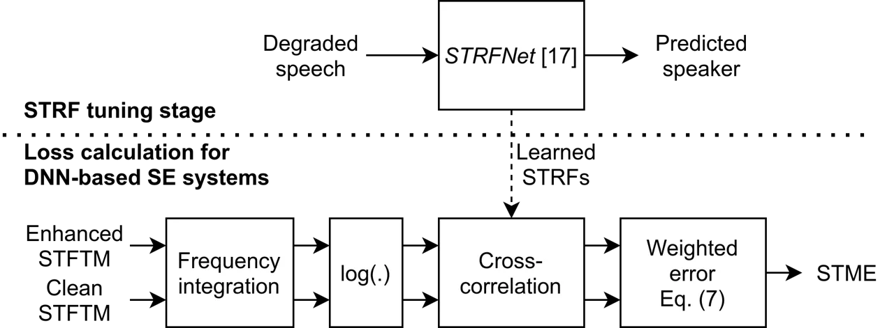

©2021 IEEE. Personal use of this material is permitted. Permission from
IEEE must be obtained for all other uses, in any current or future
media, including reprinting/republishing this material for advertising
or promotional purposes, creating new collective works, for resale or
redistribution to servers or lists, or reuse of any copyrighted
component of this work in other works

# A Modulation-Domain Loss for Neural-Network-based Real-time Speech Enhancement

Tyler Vuong    Yangyang Xia    Richard M. Stern

###### Abstract

We describe a modulation-domain loss function for deep-learning-based
speech enhancement systems. Learnable spectro-temporal receptive fields
(STRFs) were adapted to optimize for a speaker identification task. The
learned STRFs were then used to calculate a weighted mean-squared error
(MSE) in the modulation domain for training a speech enhancement system.
Experiments showed that adding the modulation-domain MSE to the MSE in
the spectro-temporal domain substantially improved the objective
prediction of speech quality and intelligibility for real-time speech
enhancement systems without incurring additional computation during
inference.

###### Index Terms: 

Real-time speech enhancement, spectro-temporal receptive field, loss
functions

^(†)^(†)address: ¹ Department of Electrical and Computer Engineering,
Carnegie Mellon University  
² Language Technologies Institute, Carnegie Mellon University  
tvuong@andrew.cmu.edu, raymondxia@cmu.edu, rms@cs.cmu.edu

## 1 Introduction

Supervised speech enhancement (SE) using deep neural networks (DNNs) has
received tremendous attention in recent years. The availability of
abundant amounts of training data and advancements in DNN architectures
have resulted in systems that provide better performance than the ideal
binary mask \[1\] – a target that highly correlates with speech
intelligibility \[2, 3\]. The core design of a DNN-based SE system
involves decisions that perform compensation in one feature domain and
calculate the loss function in another. Despite the emerging time-domain
compensation methods (_e.g.,_ \[1\]), predicting a time-varying gain
function, or a time-frequency (TF) mask \[4\], has been the most popular
and reliable approach.

Loss functions for supervised SE in the TF domain have historically been
calculated in the time or frequency domain. However, most existing loss
functions \[5\] were motivated by statistically-optimal solutions \[6,
7, 8\] and do not necessarily correlate with perceptual quality or
intelligibility of speech \[9\]. More recently, perceptually-motivated
loss functions have been proposed to optimize modified predictors of
speech quality \[10\] and intelligibility \[11\]. Interestingly, these
methods did not show improvement over objective metrics for which the
loss functions did not directly optimize, suggesting that there is room
for improving their generalization ability.

Modulation is closely related to speech intelligibility. The speech
transmission index (STI) measures the extent to which amplitude
modulation of speech is preserved in degraded environments and is highly
correlated with speech intelligibility \[12, 13\]. The spectro-temporal
modulation index (STMI) was subsequently proposed to account for joint
spectro-temporal modulation \[14\]. SE in the modulation domain has also
been explored \[15, 16\]. However, these methods assume that speech and
noise are separable in the modulation domain. Moreover, they typically
require a complete set of spectro-temporal receptive fields (STRFs) in
order to invert the processed modulation spectra back to the TF domain.
This may be computationally infeasible for real-time applications.

In this paper, we propose a simple mean-squared error (MSE)-based loss
function in the spectro-temporal modulation domain for supervised SE. We
call the loss spectro-temporal modulation error (STME) because of its
close relation to template-based STMI \[14\], which correlates well with
speech intelligibility. The calculation of the STME is based on a set of
pre-selected modulation kernels, which had been shown to be critical for
the accuracy of predicted speech intelligibility using speech stimuli
\[13\]. Following our recent success in discriminating live speech from
synthetic or broadcast speech using learnable spectro-temporal receptive
field (STRF) kernels \[17\], we develop an automatic way to determine
these kernels through an auxiliary speaker identification (SID) task.
STME is applicable to any deep neural network (DNN) system as long as
the short-time Fourier transform magnitude (STFTM) of the target and
degraded speech are accessible when training the DNN. Our proposed
system’s loss is easy to compute, does not incur additional computation
during inference, and avoids lossy inversion, which is a problem with
conventional modulation-domain SE approaches \[15\].

Organization of this paper. In the next section, we introduce related
work in supervised SE and the background of STMI. We then describe our
selection procedure for the STRF s and the loss function. Finally, we
describe the evaluation procedure and discuss the experimental results.

## 2 BACKGROUND

In this section we briefly review supervised speech enhancement and the
spectro-temporal modulation index.

Supervised DNN-based speech enhancement. We assume that the observed
noisy speech contains clean speech corrupted by additive noise. This
relationship in the short-time Fourier transform (STFT) domain is
described by

```math
X[t,k]=S[t,k]+N[t,k] \tag{1}
```

where $`X[t,k],S[t,k],`$ and $`N[t,k]`$ represent the STFT at time frame
$`t`$ and frequency bin $`k`$ of the observed noisy speech, clean speech
and noise, respectively. Without loss of generality, we assume that a
DNN is trained to predict a magnitude gain, $`G[t,k]`$, from past and
current information of degraded speech. The enhanced STFTM is obtained
by element-wise multiplication of the predicted gain by the noisy STFTM,

```math
\left|\widehat{S}[t,k]\right|=G[t,k]\left|X[t,k]\right|. \tag{2}
```

A popular loss function that drives the learning for this DNN is the MSE
between the enhanced STFTM and the clean STFTM, or the time-frequency
error (TFE),

```math
\text{TFE}=||(\vec{S}-\vec{\widehat{S}})||^{2} \tag{3}
```

where $`\vec{S}`$ and $`\vec{\widehat{S}}`$ denote the vector
representations of the clean STFTM and enhanced STFTM, respectively.

Spectro-temporal modulation index. The spectro-temporal modulation index
(STMI) is a measure of speech integrity in the modulation domain as
viewed by a model of the auditory system \[14\]. At the core of this
model is a bank of STRF s that are believed to exist in the central
auditory system and respond to a range of patterns of temporal and
spectral modulation \[18\]. Each STRF is a TF template in which two seed
functions control the temporal modulation (rate) and spectral modulation
(scale) selectivity, respectively. The spectro-temporal modulation
response (STMR) of a spectrographic representation of speech to a STRF
is defined by the convolution of the two,

```math
\text{STMR}_{S}[t,k]=\text{STRF}[t,k]*f(|S[t,k]|^{2}) \tag{4}
```

where $`f`$ is a frequency-integration function followed by a
logarithmic compression that mimics the function of the early auditory
system. Finally, the template-based STMI \[14\] is defined as

```math
\text{STMI}^{\text{T}}=1-\frac{||\overrightarrow{\text{STMR}}_{S}-\overrightarrow{\text{STMR}}_{X}||^{2}}{||\overrightarrow{\text{STMR}}_{S}||^{2}}, \tag{5}
```

where $`\text{STMR}[t,k]`$ is typically integrated over time before
being converted to the vector form. In previous implementations of
modulation-domain SE, compensation was performed directly on
$`\text{STMR}_{X}[t,k]`$ \[15, 16\]. In our method, we perform
enhancement in the TF domain and use a loss function in the modulation
domain that is closely related to $`\text{STMI}^{\text{T}}`$ for
training the DNN.

It should be noted that the selection of meaningful modulation frequency
becomes an issue when speech signals (instead of modulated noise) are
used to calculate an estimate of speech intelligibility \[13\]. Previous
work using STRF s typically performed dimensionality reduction on
features extracted from densely-sampled STRF s \[19, 20, 21\]. We learn
the parameters of the STRF s through an auxiliary SID task. We describe
our own method next.

## 3 Method

In this section, we present the DNN system we used for speech
enhancement and the calculation of our spectral-temporal modulation
error loss.

Speech enhancement system. We used the normalized log power spectra
(LPS) as the input feature. The STFT is first obtained using a
20-millisecond Hamming window with 50% overlap and a 512-point discrete
Fourier transform. Then we take the natural logarithm of the power of
the STFT and normalize the LPS with frequency-dependent online
normalization following \[22\].

To estimate the magnitude gain for each frame, we used a similar
real-time network architecture to the one described in \[5\]. The
network consists of a single fully connected (FC) layer followed by two
stacked unidirectional Gated Recurrent Units (GRUs) and three more FC
layers. Rectified linear unit (ReLU) activation is used after each of
the FC layers except the very last one where a sigmoid activation is
used to bound the output magnitude gain to be between zero and one. We
obtain the enhanced waveform by multiplying the magnitude gain
element-wise with the noisy STFTM and using the original noisy phase for
reconstruction. In total, the network contained roughly 2.8 million
learnable parameters.

Tuning learnable STRF s on speaker identification. One central problem
involving the construction of the loss function is the selection of
modulation parameters that are relevant to speech intelligibility
\[13\]. Previous work has shown that the STMR is redundant \[19\] and
the possible values for those modulation parameters span a wide range
\[20, 21\]. Following the success of our previous work on discriminating
live speech from synthetic speech using learnable STRF s \[17\], we
trained the _STRFNet_ system on SID using the Librispeech \[23\] dataset
with artificially-added noise from Sound Bible¹¹ 1
https://www.openslr.org/17/ to learn the parameters of each Gabor-based
STRF \[20\] automatically. The SID system was able to achieve an average
of 95% accuracy with 2484 speakers and signal-to-noise ratios (SNRs)
ranging from 0 to 30 dB. We then keep the learned STRF s fixed and
utilize them for our loss. We use 60 STRF kernels, each with a time
support of 300 milliseconds and a span of 20 channels on the Mel scale.
This pipeline is depicted in the upper panel of Figure 1.



Figure 1: Flow diagrams of the STRF tuning stage (top) and the STME loss
calculation stage (bottom).

Loss function. Given $`N`$ STRF s, we define the response of the speech
STFTM to the $`i^{th}`$ STRF to be

```math
\text{STMR}^{(i)}_{S}[t,k]=\text{STRF}^{(i)}[t,k]\star\log(m(|S[t,k]|^2)), \tag{6}
```

where $`m`$ is a frequency integration function using the Mel weighting
and $`\star`$ denotes cross-correlation. The loss function is then

```math
\text{STME}=\frac{\sum_{i=1}^{N}||\overrightarrow{\text{STMR}}^{(i)}_{S}-\overrightarrow{\text{STMR}}^{(i)}_{\widehat{S}}||^{2}}{\sum_{i=1}^{N}||\overrightarrow{\text{STMR}}^{(i)}_{S}||^{2}}, \tag{7}
```

where no time integration is applied to obtain the vector form of STMR.
In general, the STME is strongly motivated by STMI and is in fact very
similar to the weighted distance term in the definition of
$`\text{STMI}^{\text{T}}`$ with a few differences. First, the STME uses
learned STRF kernels that are discriminatively trained to optimize for a
SID task. Second, the STMR is calculated using cross-correlation instead
of convolution. Third, the original auditory spectrogram \[18\] is
approximated by the Mel-spectrogram and logarithmic compression.
Finally, the STME calculates a weighted MSE using instantaneous
response.

To train our enhancement system, we use the STME loss in addition to the
standard TFE in Eq. (3). This is motivated by the observation that the
STMR is smooth and omits spectral details that are available in the TF
domain. We believe that the medium-time STME loss complements the
short-time TFE for supervised SE.

A block diagram of the STME calculation is shown in the bottom panel of
Figure 1. In the next section, we will describe the experimental setup
used to evaluate the benefits of including the STME in the training
loss. We also assess the value of using automatically-learned
Gabor-based STRF kernels compared to randomly-selected kernels.

## 4 Experimental Setup

Datasets. We used a small-scale and a large-scale dataset for evaluating
the SE system. The small-scale dataset by Valentini _et al._  \[24\]
(VBD henceforth) contains 9.4 hours and 35 minutes of noisy speech in
the training and test set, respectively. We downsampled the entire
dataset to 16 kHz. For the large-scale dataset, we used the Interspeech
2020 Deep Noise Suppression (DNS) dataset \[25\] with RIR responses
provided by \[26\]. The DNS training set contains a total of 500 hours
of noisy speech. For evaluation, the DNS dataset has two test sets named
$`no\_reverb`$ and $`with\_reverb`$, which both contain 25 minutes of
noisy speech. In both datasets, we are also provided with the original
clean speech that was used to artificially generate the noisy speech.

We evaluated our system’s capabilities to improve speaker verification
performance in noisy conditions by using a modified version of the
VoxCeleb1 test set \[27\]. The original test set contained 4874 speech
pairs spoken by 40 unseen speakers. We modified the VoxCeleb1 test set
by randomly adding noise from the DNS test set at SNRs ranging from -6
to 6 dB.

Training and evaluation procedure. To train our SE systems on the VBD
dataset and DNS dataset, we randomly sampled 1-second noisy speech
segments from the training data and 5-second noisy speech segments from
the training data, respectively. All the SE systems were trained using
the Adam optimizer with a learning rate of $`5e^{-4}`$ and a batch size
of 64 in PyTorch. For evaluation, we used the perceptual evaluation of
speech quality (PESQ) \[28\], scale-invariant signal-to-distortion ratio
\[29\], and short-time objective intelligibility (STOI) \[30\] metrics.

To evaluate our SE systems on speaker verification, we used a DNN-based
speaker verification system \[31\] pretrained on VoxCeleb2 \[32\], a
dataset that contains over 1 million utterances and 6112 speakers. The
verification system obtained an equal error rate (EER) of 2.2% on the
VoxCeleb1 test set, which is one of the lowest reported EER compared to
any other method with a similar number of parameters \[31\]. Although
the system was not trained with artificial degradation, all the audio
clips were extracted from YouTube which will naturally contain different
acoustical conditions. To test if our SE system improves the performance
of this strong speaker verification system in noisy conditions, we added
noise from the DNS test set to the original VoxCeleb1 test set at SNRs
ranging from -6 to 6 dB. We evaluated the EER of the speaker
verification system on clips enhanced by the SE system.

Baseline systems. We evaluated three different baseline systems to
illustrate the benefits of the additional STME loss. Each of the
baseline systems have the exact same network architecture, but they were
each trained with different loss functions. Our first baseline system,
GRU(TFE), was trained only with the TFE loss. To evaluate the benefits
of the STME loss by itself, we trained a second baseline system,
GRU(STME), using only the STME loss. Our third baseline system,
GRU(TFE+$`\text{STME}^{R}`$), was trained with both loss terms, although
the parameters of the Gabor-based STRF kernels that were used to
calculate the STME were randomly selected. Specifically, the temporal
and spectral modulation frequencies are uniformly sampled over
$`[0,50)`$ Hz and $`[0,0.5)`$ cycles per channel, respectively. This
comparison allows us to assess the benefits of using
automatically-learned Gabor-based STRF kernels to train the system,
GRU(TFE+STME).

## 5 Experimental Results and Discussion

In this section, we present and discuss results of our STME loss on
speech enhancement and speaker verification.

|                   |       |        |      |
| ----------------- | ----- | ------ | ---- |
| Methods           | PESQ  | SI-SDR | STOI |
|                   | (MOS) | (dB)   | (%)  |
| Noisy             | 1.97  | 8.5    | 92.1 |
| ERNN \[33\]       | 2.54  | —      | —    |
| GRU(TFE)          | 2.68  | 17.0   | 93.3 |
| GRU(STME)         | 2.78  | 14.4   | 93.1 |
| GRU(TFE+STME^(R)) | 2.76  | 16.9   | 93.2 |
| GRU(TFE+STME)     | 2.82  | 17.0   | 93.8 |

Table 1: Table summarizing the objective speech quality evaluation on
the VBD test set

|                     |             |             |             |
| ------------------- | ----------- | ----------- | ----------- |
| Method              | PESQ        | SI-SDR      | STOI        |
|                     | (MOS)       | (dB)        | (%)         |
| Noisy               | 1.58 (1.82) | 9.1 (9.0)   | 91.5 (86.6) |
| DNS Baseline \[22\] | 1.83 (1.52) | 12.5 (9.2)  | 90.6 (82.1) |
| GRU(TFE)            | 2.27 (2.36) | 14.9 (13.2) | 94.2 (89.4) |
| GRU(STME)           | 2.59 (2.64) | 12.4 (12.0) | 94.2 (90.1) |
| GRU(TFE+STME^(R))   | 2.57 (2.63) | 15.9 (14.5) | 95.2 (90.6) |
| GRU(TFE+STME)       | 2.71 (2.75) | 15.9 (14.5) | 95.5 (91.2) |

Table 2: Table summarizing the objective speech quality evaluation on
the DNS $`no\_reverb`$ ($`with\_reverb`$) test set

VBD results. In Table 1, we show the objective evaluation of each SE
system trained with different losses using the VBD dataset. On a small
dataset, our GRU(TFE+STME) outperformed the GRU(TFE) baseline in all the
objective metrics. Interestingly, different initialization of the STRF
kernels in GRU(TFE+STME^(R)) resulted in similar improvements over the
baseline TFE loss, but roughly 20% of the time the random parameter
selection resulted in a much worse performance. This highlights the
benefits of using automatically-learned Gabor-based STRF kernels over
randomly-selected Gabor-based STRF kernels.

DNS results. The objective evaluation of our SE systems trained with
different losses using the DNS $`no\_reverb`$ and $`with\_reverb`$ test
set is summarized in Table 2. Even with a large amount of training data,
our GRU(TFE+STME) loss function outperformed both the GRU(TFE) baseline
and the provided challenge baseline \[22\] in all the objective metrics.
Most notably, there is a significant improvement in PESQ which results
in our system having a similar PESQ to the top system in the official
DNS challenge \[34\]. We also evaluated the benefits of the STME loss by
itself, GRU(STME). Curiously, training with only our the STME loss
provides a higher PESQ but much lower SI-SDR compared to training with
only the TFE loss. Nevertheless, optimizing the combination of both
losses during training caused both the PESQ and SI-SDR scores to
increase compared to training on each loss individually. This confirms
our belief that the medium-time STME loss is complemented by the
short-time TFE loss. As in the VBD experiments, the use of
automatically-learned Gabor-based STRF kernels provides a greater
increase of PESQ scores compared to the use of randomly-selected
Gabor-based STRF kernels.

Figure 2: Equal error rates on the VoxCeleb1 Test Set.

Speaker verification results. The performance of the speaker
verification system with noise added at low SNRs is shown in Figure 2.
At low SNRs, the speaker verification system’s performance starts to
substantially degrade. Our system GRU(TFE+STME) improved the EER by an
average of 15.4% relative and outperformed our baseline GRU(TFE) by an
average of 5.5% relative. At higher SNRs, the verification system’s
performance quickly approached the state-of-the-art performance of 2.2%
and our enhancement systems did not provide any additional benefits.

## 6 Conclusions

In this paper, we introduced a novel modulation-domain loss for training
neural-network-based speech enhancement systems. We showed that by
adding spectro-temporal modulation error to the standard time-frequency
error during training, all three common objective speech quality metrics
substantially improved on two different datasets. Additionally, we
demonstrated the value of utilizing automatically-learned Gabor-based
STRF kernels over randomly-selected kernels. We also showed that our
speech enhancement system can improve a strong speaker verification
system at low SNRs. In the future, we plan on exploring
deep-learning-based techniques to perform SE directly in the modulation
domain. We will also explore ways of directly optimizing the STRF
parameters for speech enhancement.

## References

- \[1\] Y. Luo and N. Mesgarani, “Conv-TasNet: Surpassing ideal
  time-frequency magnitude masking for speech separation,” _IEEE/ACM
  Transactions on Audio, Speech, and Language Processing_, vol. 27,
  no. 8, pp. 1256–1266, Aug. 2019.
- \[2\] P. C. Loizou and G. Kim, “Reasons why current speech-enhancement
  algorithms do not improve speech intelligibility and suggested
  solutions,” _IEEE/ACM Transactions on Audio, Speech, and Language
  Processing_, vol. 19, no. 1, pp. 47–56, Jan. 2011.
- \[3\] K. D. Kryter, “Validation of the articulation index,” _The
  Journal of the Acoustical Society of America_, vol. 34, no. 11, pp.
  1698–1702, Nov. 1962.
- \[4\] Y. Wang, A. Narayanan, and DeLiang Wang, “On training targets
  for supervised speech separation,” _IEEE/ACM Transactions on Audio,
  Speech, and Language Processing_, vol. 22, no. 12, pp. 1849–1858,
  Dec. 2014.
- \[5\] S. Braun and I. Tashev, “A consolidated view of loss functions
  for supervised deep learning-based speech enhancement,” Sep. 2020.
- \[6\] Y. Ephraim and D. Malah, “Speech enhancement using a
  minimum-mean square error short-time spectral amplitude estimator,”
  _IEEE Transactions on Acoustics, Speech, and Signal Processing_,
  vol. 32, no. 6, pp. 1109–1121, Dec. 1984.
- \[7\] ——, “Speech enhancement using a minimum mean-square error
  log-spectral amplitude estimator,” _IEEE Transactions on Acoustics,
  Speech, and Signal Processing_, vol. 33, no. 2, pp. 443–445,
  Apr. 1985.
- \[8\] J. S. Lim and A. V. Oppenheim, “Enhancement and bandwidth
  compression of noisy speech,” _Proceedings of the IEEE_, vol. 67,
  no. 12, pp. 1586–1604, Dec. 1979.
- \[9\] P. C. Loizou, _Speech Enhancement : Theory and Practice, Second
  Edition_. CRC Press, Feb. 2013.
- \[10\] J. M. Martin-Donas, A. M. Gomez, J. A. Gonzalez, and A. M.
  Peinado, “A deep learning loss function based on the perceptual
  evaluation of the speech quality,” _IEEE Signal Processing Letters_,
  vol. 25, no. 11, pp. 1680–1684, Nov. 2018.
- \[11\] Y. Zhao, B. Xu, R. Giri, and T. Zhang, “Perceptually guided
  speech enhancement using deep neural networks,” in _2018 IEEE
  International Conference on Acoustics, Speech and Signal Processing
  (ICASSP)_. Calgary, AB: IEEE, Apr. 2018, pp. 5074–5078.
- \[12\] H. J. Steeneken and T. Houtgast, “A physical method for
  measuring speech-transmission quality,” _The Journal of the Acoustical
  Society of America_, vol. 67, no. 1, pp. 318–326, 1980.
- \[13\] K. L. Payton and L. D. Braida, “A method to determine the
  speech transmission index from speech waveforms,” _The Journal of the
  Acoustical Society of America_, vol. 106, no. 6, pp. 3637–3648,
  Nov. 1999.
- \[14\] M. Elhilali, T. Chi, and S. A. Shamma, “A spectro-temporal
  modulation index (STMI) for assessment of speech intelligibility,”
  _Speech Communication_, vol. 41, no. 2-3, pp. 331–348, Oct. 2003.
- \[15\] N. Mesgarani and S. Shamma, “Denoising in the domain of
  spectrotemporal modulations,” _EURASIP Journal on Audio, Speech, and
  Music Processing_, vol. 2007, pp. 1–8, 2007.
- \[16\] M. Mirbagheri, N. Mesgarani, and S. Shamma, “Nonlinear
  filtering of spectrotemporal modulations in speech enhancement,” in
  _2010 IEEE International Conference on Acoustics, Speech and Signal
  Processing (ICASSP)_. Dallas, TX, USA: IEEE, Mar. 2010, pp. 5478–5481.
- \[17\] T. Vuong, Y. Xia, and R. M. Stern, “Learnable spectro-temporal
  receptive fields for robust voice type discrimination,” in
  _Interspeech 2020_. ISCA, Oct. 2020, pp. 1957–1961.
- \[18\] T. Chi, P. Ru, and S. A. Shamma, “Multiresolution
  spectrotemporal analysis of complex sounds,” _The Journal of the
  Acoustical Society of America_, vol. 118, no. 2, pp. 887–906,
  Aug. 2005.
- \[19\] N. Mesgarani, M. Slaney, and S. Shamma, “Discrimination of
  speech from nonspeech based on multiscale spectro-temporal
  modulations,” _IEEE/ACM Transactions on Audio, Speech and Language
  Processing_, vol. 14, no. 3, pp. 920–930, May 2006.
- \[20\] B. T. Meyer and B. Kollmeier, “Robustness of spectro-temporal
  features against intrinsic and extrinsic variations in automatic
  speech recognition,” _Speech Communication_, vol. 53, no. 5, pp.
  753–767, May 2011.
- \[21\] S. V. Ravuri and N. Morgan, “Easy does it: Robust
  spectro-temporal many-stream ASR without fine tuning streams,” in
  _2012 IEEE International Conference on Acoustics, Speech and Signal
  Processing (ICASSP)_. Kyoto, Japan: IEEE, Mar. 2012, pp. 4309–4312.
- \[22\] Y. Xia, S. Braun, C. K. A. Reddy, H. Dubey, R. Cutler, and
  I. Tashev, “Weighted speech distortion losses for neural-network-based
  real-time speech enhancement,” in _2020 IEEE International Conference
  on Acoustics, Speech and Signal Processing (ICASSP)_. IEEE, May 2020,
  pp. 871–875.
- \[23\] V. Panayotov, G. Chen, D. Povey, and S. Khudanpur,
  “Librispeech: An ASR corpus based on public domain audio books,” in
  _2015 IEEE International Conference on Acoustics, Speech and Signal
  Processing (ICASSP)_. IEEE, Apr. 2015, pp. 5206–5210.
- \[24\] C. Valentini-Botinhao, X. Wang, S. Takaki, and J. Yamagishi,
  “Investigating RNN-based speech enhancement methods for noise-robust
  text-to-speech.” in _SSW_, 2016, pp. 146–152.
- \[25\] C. K. A. Reddy, E. Beyrami, H. Dubey, V. Gopal, R. Cheng,
  R. Cutler, S. Matusevych, R. Aichner, A. Aazami, S. Braun, P. Rana,
  S. Srinivasan, and J. Gehrke, “The INTERSPEECH 2020 deep noise
  suppression challenge: Datasets, subjective speech quality and testing
  framework,” _arXiv:2001.08662 \[cs, eess\]_, Apr. 2020.
- \[26\] C. K. A. Reddy, H. Dubey, V. Gopal, R. Cutler, S. Braun,
  H. Gamper, R. Aichner, and S. Srinivasan, “ICASSP 2021 deep noise
  suppression challenge,” 2020.
- \[27\] A. Nagrani, J. S. Chung, and A. Zisserman, “VoxCeleb: A
  large-scale speaker identification dataset,” in _Interspeech
  2017_. ISCA, Aug. 2017, pp. 2616–2620.
- \[28\] A. Rix, J. Beerends, M. Hollier, and A. Hekstra, “Perceptual
  evaluation of speech quality (PESQ)-a new method for speech quality
  assessment of telephone networks and codecs,” in _2001 IEEE
  International Conference on Acoustics, Speech, and Signal Processing
  (ICASSP)_, vol. 2. Salt Lake City, UT, USA: IEEE, 2001, pp. 749–752.
- \[29\] J. Le Roux, S. Wisdom, H. Erdogan, and J. R. Hershey,
  “SDR–half-baked or well done?” in _2019 IEEE International Conference
  on Acoustics, Speech and Signal Processing (ICASSP)_. IEEE, 2019, pp.
  626–630.
- \[30\] C. H. Taal, R. C. Hendriks, R. Heusdens, and J. Jensen, “A
  short-time objective intelligibility measure for time-frequency
  weighted noisy speech,” in _2010 IEEE International Conference on
  Acoustics, Speech and Signal Processing (ICASSP)_. Dallas, TX, USA:
  IEEE, 2010, pp. 4214–4217.
- \[31\] J. S. Chung, J. Huh, S. Mun, M. Lee, H. S. Heo, S. Choe,
  C. Ham, S. Jung, B.-J. Lee, and I. Han, “In defence of metric learning
  for speaker recognition,” _arXiv:2003.11982 \[cs, eess\]_, Apr. 2020.
- \[32\] J. S. Chung, A. Nagrani, and A. Zisserman, “VoxCeleb2: Deep
  speaker recognition,” in _Interspeech 2018_. ISCA, Sep. 2018, pp.
  1086–1090.
- \[33\] D. Takeuchi, K. Yatabe, Y. Koizumi, Y. Oikawa, and N. Harada,
  “Real-time speech enhancement using equilibriated RNN,” in _2020 IEEE
  International Conference on Acoustics, Speech and Signal Processing
  (ICASSP)_. IEEE, 2020, pp. 851–855.
- \[34\] U. Isik, R. Giri, N. Phansalkar, J.-M. Valin, K. Helwani, and
  A. Krishnaswamy, “Poconet: Better speech enhancement with
  frequency-positional embeddings, semi-supervised conversational data,
  and biased loss,” _arXiv preprint arXiv:2008.04470_, 2020.
