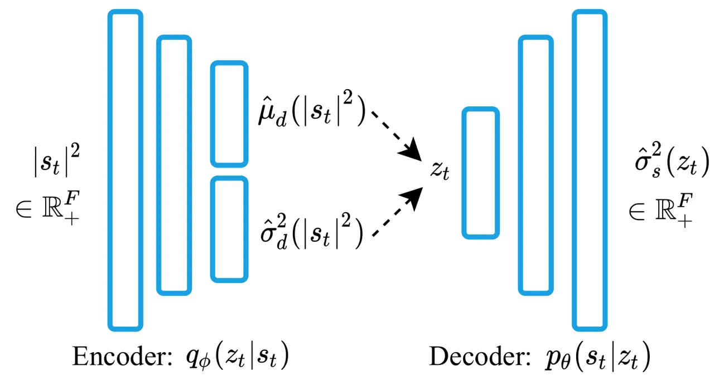
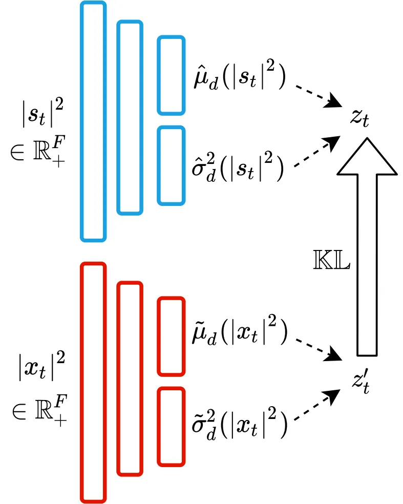
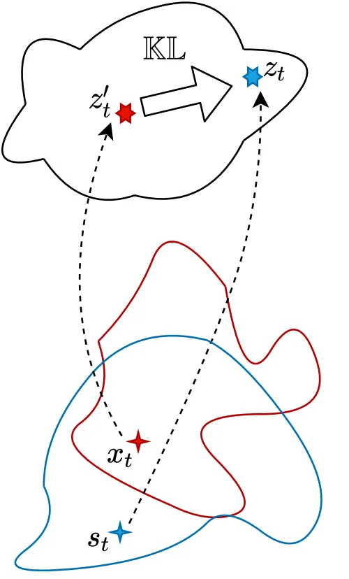

# Variational autoencoder for speech enhancement with a noise-aware encoder

Huajian Fang    Guillaume Carbajal    Stefan Wermter    Timo Gerkmann

###### Abstract

Recently, a generative variational autoencoder (VAE) has been proposed
for speech enhancement to model speech statistics. However, this
approach only uses clean speech in the training phase, making the
estimation particularly sensitive to noise presence, especially in low
signal-to-noise ratios (SNRs). To increase the robustness of the VAE, we
propose to include noise information in the training phase by using a
_noise-aware encoder_ trained on noisy-clean speech pairs. We evaluate
our approach on real recordings of different noisy environments and
acoustic conditions using two different noise datasets. We show that our
proposed noise-aware VAE outperforms the standard VAE in terms of
overall distortion without increasing the number of model parameters. At
the same time, we demonstrate that our model is capable of generalizing
to unseen noise conditions better than a supervised feedforward deep
neural network (DNN). Furthermore, we demonstrate the robustness of the
model performance to a reduction of the noisy-clean speech training data
size.

###### Index Terms: 

speech enhancement, generative model, variational autoencoder,
semi-supervised learning.

^(†)^(†)address: ¹Signal Processing (SP), Universität Hamburg, Germany  
²Knowledge Technology (WTM), Universität Hamburg, Germany  
{fang, carbajal, wermter, gerkmann}@informatik.uni-hamburg.de

## 1 Introduction

Speech enhancement refers to the problem of extracting a target speech
signal from a noisy mixture in order to enhance the quality and
intelligibility of the speech. This task is of particular interest for
applications like speech recognition and hearing aids. Single-channel
speech enhancement is a challenging task, especially at low
signal-to-noise ratios (SNRs).

Speech enhancement typically requires the statistical estimation of the
noise and speech power spectral densities (PSDs) \[1, 2\]. Non-negative
matrix factorization (NMF) is a popular choice for PSD estimation \[3,
4, 5, 6\]. However, underlying linearity assumptions limit the
performance when modeling complex high-dimensional data. In contrast,
speech enhancement based on non-linear deep neural networks (DNNs) has
shown better modeling capacity. Common approaches focus on inferring a
time-frequency mask in a supervised manner \[7\]. However, to generalize
to unseen noise conditions, DNNs require a large number of pairs of
noisy and clean speech in various acoustic conditions \[8\].

Recently, there has been an increasing interest in generative models,
such as generative adversarial networks (GANs) \[9\] and variational
autoencoders (VAEs) \[10, 11\]. The generative VAE is a probabilistic
model widely used for learning latent representations of a probabilistic
distribution. The VAE features a similar architecture as a classical
autoencoder with an encoder and a decoder, but its latent space differs
by being regularized to follow a standard Gaussian distribution.
Moreover, the VAE has been extended to deep conditional generative
models for effectively performing probabilistic inference \[12, 13\].
VAEs have been applied to speech enhancement in both single-channel and
multi-channel scenarios \[14, 15, 16\]. They have been used to model the
speech statistics by training on clean speech spectra only. However,
because no noise information is involved in its training phase, the
encoder of the standard VAE is sensitive to noise. In low SNRs, this
noise-sensitivity results in the erroneous estimation of latent
variables and thus in inappropriately generated speech coefficients and
a reduced performance.

In this work, inspired by conditional VAEs and its application to image
segmentation \[12, 13, 17\], to increase noise robustness, we propose to
replace the encoder of the VAE by a _noise-aware encoder_. To learn this
encoder, the VAE is first trained on clean speech spectra only, and
then, given noisy speech, the proposed noise-aware encoder is trained in
a supervised fashion to make its latent space as close as possible to
that of the first speech-only trained encoder. For our analyses we rely
on the VAE-NMF speech enhancement framework \[14, 15\], which uses NMF
to model the noise PSD. We show that the proposed encoder is more robust
to noise presence and improves speech estimation without increasing the
number of model parameters. The method also shows robustness to unseen
noise conditions by evaluating on real recordings from different noise
datasets. Finally, we illustrate that already a small amount of
noisy-clean speech data can lead to improvements in overall distortion.

In section 2, we introduce problem settings and notations, as well as
the framework of the VAE-based speech model and the noise model
developed on the NMF. In section 3, we introduce details about the
proposed noise-aware VAE. After showing the experiment settings in
section 4, we present experimental evaluation results and conclusions in
section 5 and section 6.

## 2 Problem formulation

### 2.1 Mixture model

In our work, we employ an additive signal model, where a noisy mixture
is seen as a superposition of clean speech and additive noise. In the
short-time Fourier transform (STFT) domain, it shows as

```math
x_{ft}=s_{ft}+n_{ft}, \tag{1}
```

where $`x_{ft}`$, $`s_{ft}`$, and $`n_{ft}`$ represent each
time-frequency coefficient in spectra of noisy mixture
$`X\in\mathbb{C}^{F\times T}`$, speech $`S\in\mathbb{C}^{F\times T}`$,
and noise $`N\in\mathbb{C}^{F\times T}`$ respectively. $`F`$ denotes the
number of frequency bins, $`T`$ represents the number of time frames,
which are indexed by $`f`$ and $`t`$, respectively. The speech and noise
spectra are assumed to be mutually independent complex Gaussian
distributions with zero-mean, i.e.,
$`s_{ft}\sim\mathcal{N}_{\mathbb{C}}(0,\,\sigma^{2}_{s,ft}),n_{ft}\sim\mathcal{N}_{\mathbb{C}}(0,\,\sigma^{2}_{n,ft})`$
where $`\sigma^{2}_{s,ft}`$, $`\sigma^{2}_{n,ft}`$ represent the
variances of speech and noise. The PSD of signals is characterized by
the parameter variance under the local stationary assumption \[18\].

Furthermore, to provide an increased robustness to the loudness of the
audio utterances, a time-dependent and frequency-independent gain
$`g_{t}`$ is introduced \[15\]. Eventually, this modifies the additive
mixture model in (1) to

```math
x_{ft}=\sqrt{g_{t}}s_{ft}+n_{ft}. \tag{2}
```

Given the observed noisy mixture which follows a complex Gaussian
distribution as
$`x_{ft}\sim\mathcal{N}_{\mathbb{C}}(0,\,g_{t}\sigma^{2}_{s,ft}+\sigma^{2}_{n,ft})`$,
the desired speech can be extracted by separately modeling the speech
and noise variances.

### 2.2 Speech model

For the VAE-based speech model, a frame-wise $`D`$-dimensional latent
variable $`z_{t}\in\mathbb{R}^{D}`$ is defined, and an $`F`$-dimensional
speech frame $`s_{t}`$ is assumed to be sampled from the conditional
likelihood distribution $`p_{\theta}(s_{t}|z_{t})`$. This is achieved by
the decoder of VAE, also called the generative model. The variable
$`\theta`$ here indicates the parameters of the decoder network.
$`\hat{\sigma}^{2}_{s}:\mathbb{R}^{D}\to\mathbb{R}_{+}^{F}`$ denotes the
nonlinear function from the latent space to the reconstructed signal
given by the generative model of the VAE.

The VAE provides a principled method to jointly learn latent variables
and the inference model \[10\]. Following a Bayesian framework, this
requires to approximate the intractable true posterior distribution
$`p(z_{t}|s_{t})`$. In the VAE, the encoder, also called the inference
model, is used to approximate the true posterior, denoted as
$`q_{\phi}(z_{t}|s_{t})`$. The variable $`\phi`$ here indicates the
parameters of the encoder network.
$`\hat{\mu}_{d}:\mathbb{R}^{F}_{+}\to\mathbb{R}^{D}`$,
$`\hat{\sigma}_{d}^{2}:\mathbb{R}^{F}_{+}\to\mathbb{R}^{D}_{+}`$
indicate the nonlinear mapping of the neural network given by the
inference model of the VAE. Under stochastic gradient descent, the
generative model’s parameters $`\theta`$ and the inference model’s
parameters $`\phi`$ are jointly optimized by maximizing variational
lower bound, given by

```math
\begin{split}\log p(S)\geq&-\sum_{t}\mathbb{KL}[q_{\phi}(z_{t}|s_{t})||p(z_{t}))]\\
&+\sum_{t}\mathbb{E}_{q_{\phi}(z_{t}|s_{t})}[\log p_{\theta}(s_{t}|z_{t})].\end{split} \tag{3}
```

The quantity $`p(z_{t})`$ represents the prior distribution of the
$`D`$-dimensional variable $`z_{t}`$, and $`\mathbb{KL}`$ indicates
Kullback-Leibler divergence. The prior of the latent variables is
defined as a zero-mean isotropic multivariate Gaussian
$`z_{t}\sim\mathcal{N}(\mathbf{0},\,\mathbf{I})`$ as in \[10\]. The
first term in the objective function (3) refers to the regularization
error in the latent space to ensure meaningful latent variables, and the
second term is the reconstruction error.

As shown in Fig. 1, the VAE is trained on the periodograms of clean
speech $`\lvert s_{t}\rvert^{2}`$ \[14, 15\]. During testing, the
estimates of the clean speech power spectra
$`\hat{\sigma}^{2}_{s}(z_{t})`$ are expected to be generated from latent
variables learnt from the noisy periodograms
$`\lvert x_{t}\rvert^{2}\in\mathbb{R}^{F}_{+}`$. Note that a robust
estimation of latent variables that represents the clean speech
statistics plays a crucial role in the generative process.



Figure 1: The generative model and inference model of the adopted VAE.
The dashed line here indicates the sampling process.

### 2.3 Noise model

NMF tries to find an optimal approximation to an input matrix by a
dictionary matrix containing basis functions weighted by a coefficients
matrix \[3\]. Here NMF is used to model the noise variance \[14, 15\].
The variance of noise $`\sigma^{2}_{n}`$ is approximated by a
multiplication of the dictionary matrix
$`W\in\mathbb{R}_{+}^{F\times K}`$ and the coefficients matrix
$`H\in\mathbb{R}_{+}^{K\times T}`$, computed as

```math
\sigma^{2}_{n}=WH=\sum_{ft}\sum_{k}w_{fk}h_{kt}, \tag{4}
```

where $`K`$ indicates the rank of the noise model indexed by $`k`$.
$`w_{fk}`$ and $`h_{kt}`$ are elements from $`W`$ and $`H`$ respectively
at the corresponding row and column indexed by $`f`$, $`k`$, and $`t`$.

### 2.4 Clean speech inference

By modeling speech and noise with VAE and NMF respectively, the
distribution of the noisy mixture can be represented as

```math
x_{ft}\sim\mathcal{N}_{\mathbb{C}}(0,g_{t}\hat{\sigma}^{2}_{s,f}(z_{t})+\sum_{k}w_{fk}h_{kt}), \tag{5}
```

where $`\hat{\sigma}^{2}_{s,f}:\mathbb{R}^{D}\to\mathbb{R}_{+}`$ denotes
the nonlinear function $`\hat{\sigma}^{2}_{s}`$ for $`f`$-th frequency
bin. Given the noisy mixture as an observation, the Monte Carlo
expectation-maximization (MCEM) algorithm is utilized to estimate the
NMF parameters and the gain factor \[19, 15\]. The sampling strategy is
based on the Metropolis-Hastings algorithm \[20\]. The clean speech can
be extracted from a noisy mixture in the time-frequency domain by
constructing a Wiener filter denoted by $`\hat{m}_{ft}`$, given as

```math
\hat{m}_{ft}=\frac{\hat{\sigma}^{2}_{s,f}(z_{t})}{g_{t}\hat{\sigma}^{2}_{s,f}(z_{t})+\sum_{k}w_{fk}h_{kt}}. \tag{6}
```

Although modeling speech with a VAE can be achieved by training solely
on clean speech data, using it for speech enhancement is another matter
since gaining robustness to noise is difficult without including noise
samples in the training data and the model. However, the standard VAE
does not allow for including noise at the training phase.

## 3 Noise-aware VAE

Instead of using the encoder trained on the clean speech signals, we
propose a noise-aware VAE that can improve the robustness of the encoder
against noise presence. For a generative process, it is difficult or
even impossible to derive the optimal mapping between latent variables
and targets. However, we argue that it might be relevant to make latent
variables estimated from noisy mixtures as close as possible to the ones
inferred from the corresponding clean speech.

To obtain the noise-aware VAE based on this assumption, we propose a
two-step learning algorithm, which learns a non-linear mapping from the
noisy signals to latent variables that represent the clean speech
statistics. We first train a VAE using Equation (3) to learn a
regularized latent space over the clean speech signals. The noise-aware
encoder is then proposed to approximate the probability
$`q_{\gamma}(z^{\prime}_{t}|x_{t})`$ to output D-dimensional latent
variables $`z^{\prime}_{t}\in\mathbb{R}^{D}`$ conditioned on the noisy
mixture $`x_{t}`$. It is also assumed that the conditional probability
$`q_{\gamma}(z^{\prime}_{t}|x_{t})`$ follows a standard Gaussian
distribution. The variable $`\gamma`$ indicates the parameters of the
new encoder. Finally, the distance of $`z^{\prime}_{t}`$ obtained from
noisy speech to the latent variables $`z_{t}`$ inferred form the
corresponding clean speech is minimized based on the Kullback–Leibler
divergence as shown in Fig. 2 (a), given by

```math
\displaystyle\mathcal{L}(\gamma) \displaystyle=\sum_{t}\mathbb{KL}(q_{\phi}(z_{t}|s_{t})||q_{\gamma}^{\prime}(z_{t}^{\prime}|x_{t})) \tag{7}
```

```math
\displaystyle\begin{split}&=\sum_{t,d}\Big\{\,\frac{1}{2}\log\frac{{\widetilde{\sigma}_{d}^{2}(|x_{t}|^{2})}}{{\hat{\sigma}^{2}_{d}(|s_{t}|^{2})}}-\frac{1}{2}\\
&\qquad+\frac{\hat{\sigma}^{2}_{d}(|s_{t}|^{2})+(\hat{\mu}_{d}(|s_{t}|^{2})-\widetilde{\mu}_{d}(|x_{t}|^{2}))^{2}}{2\widetilde{\sigma}_{d}^{2}(|x_{t}|^{2})}\,\Big\}\end{split} \tag{8}
```

where $`\widetilde{\mu}_{d}:\mathbb{R}^{F}_{+}\to\mathbb{R}^{D}`$ and
$`\widetilde{\sigma}_{d}^{2}:\mathbb{R}^{F}_{+}\to\mathbb{R}_{+}^{D}`$
represents the nonlinear mapping of the neural networks for the mean and
variance of the posterior Gaussian distribution for the variable
$`z^{\prime}_{t}`$. The parameters of the new inference model $`\gamma`$
are optimized by minimizing the cost function using stochastic gradient
descent algorithms. In this way, we combine unsupervised learning of the
speech characteristics by the VAE and supervised learning using the
pairs of noisy-clean speech signals.

Eventually, as graphically shown in Fig. 2 (b), by introducing this cost
function in the latent space, the latent variables $`z^{\prime}_{t}`$
estimated from the noisy mixture $`x_{t}`$ is pulled towards $`z_{t}`$
estimated from the corresponding clean speech $`s_{t}`$. The dashed
lines here indicate the nonlinear mapping from the signal space to the
latent space, and different colors indicate two mapping pairs. At the
inference stage, the noise-aware inference model is used to replace the
standard speech-based encoder. The decoder of the VAE remains unchanged.



(a)



(b)

Figure 2: The proposed architecture for minimizing divergence between
latent variables. The constraint in the latent space is shown in (a),
and its graphic explanation given in (b).

|                 |                    |                     |                    |                    |                    |                    |
| --------------- | ------------------ | ------------------- | ------------------ | ------------------ | ------------------ | ------------------ |
| SNR             | Average            | -10 dB              | -5 dB              | 0 dB               | 5 dB               | 10 dB              |
| Unprocessed     | -0.04 $`\pm`$ 0.44 | -10.02 $`\pm`$ 0.03 | -5.03 $`\pm`$ 0.01 | -0.03 $`\pm`$ 0.01 | 4.95 $`\pm`$ 0.01  | 9.90 $`\pm`$ 0.02  |
| DNN-WF          | 6.92 $`\pm`$ 0.42  | -1.96 $`\pm`$ 0.66  | 3.43 $`\pm`$ 0.53  | 7.25 $`\pm`$ 0.42  | 11.58 $`\pm`$ 0.38 | 14.25 $`\pm`$ 0.34 |
| VAE             | 6.72 $`\pm`$ 0.43  | -1.92 $`\pm`$ 0.75  | 2.99 $`\pm`$ 0.59  | 6.89 $`\pm`$ 0.49  | 11.43 $`\pm`$ 0.42 | 14.14 $`\pm`$ 0.37 |
| proposed NA-VAE | 7.29 $`\pm`$ 0.43  | -1.00 $`\pm`$ 0.78  | 3.64 $`\pm`$ 0.59  | 7.30 $`\pm`$ 0.50  | 11.85 $`\pm`$ 0.42 | 14.57 $`\pm`$ 0.39 |

Table 1: Performance comparison in SI-SDR on 5 different SNR conditions
trained and evaluated on different subsets of the QUT-NOISE dataset (4
noise types). Values of SI-SDR are given in mean $`\pm`$ confidence
interval (95% confidence) over all utterances of the evaluation dataset
with unit dB. NA-VAE refers to the proposed noise-aware VAE.

|                 |                    |                     |                    |                    |                    |                    |
| --------------- | ------------------ | ------------------- | ------------------ | ------------------ | ------------------ | ------------------ |
| SNR             | Average            | -10 dB              | -5 dB              | 0 dB               | 5 dB               | 10 dB              |
| Unprocessed     | -0.04 $`\pm`$ 0.44 | -10.01 $`\pm`$ 0.01 | -5.02 $`\pm`$ 0.01 | -0.03 $`\pm`$ 0.01 | 4.95 $`\pm`$ 0.01  | 9.90 $`\pm`$ 0.02  |
| DNN-WF          | 2.93 $`\pm`$ 0.45  | -7.38 $`\pm`$ 0.38  | -1.65 $`\pm`$ 0.26 | 3.25 $`\pm`$ 0.24  | 8.07 $`\pm`$ 0.22  | 12.34 $`\pm`$ 0.21 |
| VAE             | 11.44 $`\pm`$ 0.54 | 2.74 $`\pm`$ 1.20   | 7.90 $`\pm`$ 1.07  | 12.27 $`\pm`$ 0.90 | 15.27 $`\pm`$ 0.72 | 19.02 $`\pm`$ 0.68 |
| proposed NA-VAE | 11.88 $`\pm`$ 0.52 | 3.45 $`\pm`$ 1.10   | 8.60 $`\pm`$ 1.03  | 12.70 $`\pm`$ 0.89 | 15.63 $`\pm`$ 0.71 | 19.06 $`\pm`$ 0.67 |

Table 2: Performance comparison in SI-SDR on 5 different SNR conditions
trained on the QUT-NOISE dataset and evaluated on the DEMAND dataset (12
noise types, completely unseen noise conditions). Values of SI-SDR are
given in mean $`\pm`$ confidence interval (95% confidence) over all
utterances of the evaluation dataset with unit dB.

## 4 Experimental settings

### 4.1 Datasets

We evaluate the performance of the proposed model by using signals from
the speech dataset Wall Street Journal (WSJ0)\[21\], and the noise
databases QUT-NOISE \[22\] and DEMAND \[23\]. QUT-NOISE is used in
constructing datasets of both training and evaluation using 4 noise
types ”cafe”, ”car”, ”home”, and ”street” recorded in unique locations.
DEMAND is introduced as another evaluation dataset corresponding to
completely unseen noise conditions in the training set, and the noise
signals are randomly sampled from recordings of 12 noise types in the
categories ”domestic”, ”public”, ”street”, and ”transportation”.

To train the noise-aware encoder, around 25 hours of speech samples are
chosen from WSJ0 and mixed with the sampled noise signals at a SNR
randomly chosen from the range of -5 dB to 5 dB with a gap of 1 dB. Two
speaker-independent evaluation datasets each containing around 2.3 hours
of 1000 noisy samples are created by mixing the speech and noise signals
at SNRs of -10 dB, -5 dB, 0 dB, 5 dB, and 10 dB.

### 4.2 Baselines

We show evaluation results by comparing the proposed noise-aware VAE to
the standard VAE, and a fully-connected DNN model. The DNN model outputs
a Wiener filter based on a mean square error cost function \[24\],
referred to as DNN-WF. The standard VAE is trained on the same amount of
the clean speech signals that are not mixed with the noise signals,
while the supervised DNN-WF is trained on the same dataset as the
noise-aware encoder.

### 4.3 Hyperparameters

All signals are sampled at 16 kHz. The signal is transformed into the
STFT domain with a sine window of length 1024 ($`F=513`$) and a 25% hop
size. Global normalization to zero mean and unit standard deviation is
employed for training the noise-aware encoder, since Kullback–Leibler
divergence is scale-dependent. The rank of NMF is chosen to be $`K=8`$
when modeling noise, and its composing matrices $`W`$ and $`H`$ are
randomly initialized. The parameters of MCEM algorithm follow the
setting in \[15\].

The VAE is comprised of an encoder and a decoder both with two
feedforward hidden layers of 128 units. The hyperbolic tangent
activation function is applied to all hidden layers, except the output
layer. The dimension of the latent space $`L`$ is fixed at 16. The
noise-aware encoder has the same structure as the speech-based encoder
of the standard VAE. The fully supervised DNN-WF contains 5 hidden
layers, each with 128 units, and its architecture is built to contain a
similar number of parameters as our VAE model. No temporal information
is considered in DNN-WF, which is consistent with the non-sequential
characteristic of the VAE. We apply the ReLU activation function to all
hidden layers, and the sigmoid function is put on the output layer to
ensure the estimate of the Wiener filter mask lies in the range
$`[0,1]`$. The parameters $`\theta`$ and $`\phi`$ of the VAE are
optimized by Adam \[25\] with a learning rate of 1e-3, and the
parameters $`\gamma`$ of the noise-aware encoder with a learning rate of
1e-4.

### 4.4 Evaluation metrics

To show the enhancement performance, we employ scale-invariant
signal-to-distortion ratio (SI-SDR) in decibel (dB) \[26\] to measure
the overall distortion, which takes both noise reduction and artifacts
into account.

## 5 Results and discussions

Figure 3: Influence of the amount of noisy-clean speech training data on
SI-SDR improvements for both VAE models, averaged over all noise
conditions.

### 5.1 Performance evaluation

As can be seen from the results in Table 1 which presents results
trained and evaluated on different subsets of QUT-NOISE, the proposed
noise-aware VAE outperforms the standard VAE in terms of overall
distortion in all SNR scenarios, and the SI-SDR improvements are more
evident at low SNR conditions. For example, the noise-aware VAE
outperforms the baseline VAE by nearly 1 dB at an input SNR of -10 dB.
Table 1 also shows that the DNN-WF performs better than the plain VAE,
which implies that appropriate prior noise information is beneficial. In
Table 2, which shows the evaluation performed on the DEMAND database
while training is still conducted on QUT-NOISE, we see that the fully
connected DNN-WF performs significantly worse than the other models.
This was expected as we now test on a different more diverse dataset
with 12 noise types instead of only 4. The supervised DNN-WF can not
transfer the denoising capability to unseen noise types implying that
inappropriate prior noise information may even deteriorate performance
\[14, 8\]. However, the proposed noise-aware VAE can still outperform
VAE in all SNR conditions, which suggests that the proposed method of
improving latent variables in the latent space under this configuration
is more capable of generalizing to unseen noise scenarios. Informal
listening confirms the SI-SDR results especially for Table 1, while the
improvements reported in Table 2 are relatively subtle. Audio examples
are available online ¹¹ 1
[https://uhh.de/inf-sp-navae2021](https://uhh.de/inf-sp-navae2021).

### 5.2 Analysis of the amount of training data

We then look at the influence of the amount of noisy-clean speech
training data for estimating the speech latent variable. To achieve
this, we initialize the noise-aware encoder with the encoder parameters
of the pre-trained standard VAE and then train the new encoder by
randomly selecting 1%, 3%, 5%, 10%, 25%, 50% of the noisy-clean speech
pairs constructed with the QUT-NOISE dataset. In Fig. 3, it is shown
that the performance can already be improved by using only a small
percentage of the paired noisy-clean speech data. A value of more than
0.2 dB SI-SDR improvement can be observed with just 1% of the total
paired data. It can also be observed that increasing the number of data
in the later stage leads to gradual improvements, which may be due to
the noise diversity already being largely represented in the small
fraction of data used. The research can be extended by increasing the
diversity of the noise types in the training phase. This ability of
improving performance with only few labeled data shows potential in
alleviating overfitting issues in supervised training strategies.

## 6 CONCLUSION

In this paper, we proposed a noise-aware encoding scheme to improve the
robustness of the VAE encoder particularly in low SNRs. For this we
incorporate noise information into the VAE encoder to enable a more
accurate speech variance estimation based on improved latent variables.
By constraining the latent space, the VAE with the proposed noise-aware
encoder can learn a non-linear mapping from the noisy mixture to latent
variables that represent the clean speech statistics. Our proposed VAE
outperforms the standard VAE and a supervised DNN-based filter in
SI-SDR. Experiments also showed the generalization ability to unseen
noise scenarios by evaluating across different datasets. Moreover, we
showed that we could improve the performance even with a small amount of
noisy-clean speech data. For future work, our approach could also be
integrated with deep generative models that combine temporal
dependencies \[27\].

## References

- \[1\] T. Gerkmann and R. C. Hendriks, “Unbiased mmse-based noise power
  estimation with low complexity and low tracking delay,” IEEE
  Transactions on Audio, Speech, and Language Processing, vol. 20, no.
  4, pp. 1383–1393, 2011.
- \[2\] R. C. Hendriks, T. Gerkmann, and J. Jensen, DFT-Domain Based
  Single-Microphone Noise Reduction for Speech Enhancement: A Survey of
  the State of the Art, Morgan & Claypool Publishers, 2013.
- \[3\] D. D. Lee and H. S. Seung, “Algorithms for non-negative matrix
  factorization,” in Advances in neural information processing systems,
  2001, pp. 556–562.
- \[4\] C. Févotte, N. Bertin, and J.L. Durrieu, “Nonnegative matrix
  factorization with the itakura-saito divergence: With application to
  music analysis,” Neural computation, vol. 21, no. 3, pp.
  793–830, 2009.
- \[5\] N. Mohammadiha, T. Gerkmann, and A. Leijon, “A new linear mmse
  filter for single channel speech enhancement based on nonnegative
  matrix factorization,” in IEEE workshop on applications of signal
  processing to audio and acoustics (WASPAA). IEEE, 2011, pp. 45–48.
- \[6\] H. Sawada, H. Kameoka, S. Araki, and N. Ueda, “Multichannel
  extensions of non-negative matrix factorization with complex-valued
  data,” IEEE Transactions on Audio, Speech, and Language Processing,
  vol. 21, no. 5, pp. 971–982, 2013.
- \[7\] D. Wang and J. Chen, “Supervised speech separation based on deep
  learning: An overview,” IEEE/ACM Transactions on Audio, Speech, and
  Language Processing, vol. 26, no. 10, pp. 1702–1726, 2018.
- \[8\] R. Rehr and T. Gerkmann, “An analysis of noise-aware features in
  combination with the size and diversity of training data for dnn-based
  speech enhancement,” in IEEE International Conference on Acoustics,
  Speech and Signal Processing (ICASSP). IEEE, 2019, pp. 601–605.
- \[9\] I. Goodfellow, J. Pouget-Abadie, M. Mirza, B. Xu,
  D. Warde-Farley, S. Ozair, A. Courville, and Y. Bengio, “Generative
  adversarial nets,” in Advances in neural information processing
  systems, 2014, pp. 2672–2680.
- \[10\] D. P. Kingma and M. Welling, “Auto-encoding variational bayes,”
  in 2nd International Conference on Learning Representations, Yoshua
  Bengio and Yann LeCun, Eds., 2014.
- \[11\] D. J. Rezende, S. Mohamed, and D. Wierstra, “Stochastic
  backpropagation and approximate inference in deep generative models,”
  International Conference on Machine Learning, p. 1278–1286, 2014.
- \[12\] D. P. Kingma, S. Mohamed, D. J. Rezende, and M. Welling,
  “Semi-supervised learning with deep generative models,” in Advances in
  neural information processing systems, 2014, pp. 3581–3589.
- \[13\] K. Sohn, H. Lee, and X. Yan, “Learning structured output
  representation using deep conditional generative models,” in Advances
  in neural information processing systems, 2015, pp. 3483–3491.
- \[14\] Y. Bando, M. Mimura, K. Itoyama, K. Yoshii, and T. Kawahara,
  “Statistical speech enhancement based on probabilistic integration of
  variational autoencoder and non-negative matrix factorization,” in
  IEEE International Conference on Acoustics, Speech and Signal
  Processing (ICASSP), 2018, pp. 716–720.
- \[15\] S. Leglaive, L. Girin, and R. Horaud, “A variance modeling
  framework based on variational autoencoders for speech enhancement,”
  in International Workshop on Machine Learning for Signal Processing
  (MLSP), 2018, pp. 1–6.
- \[16\] S. Leglaive, L. Girin, and R. Horaud, “Semi-supervised
  multichannel speech enhancement with variational autoencoders and
  non-negative matrix factorization,” in IEEE International Conference
  on Acoustics, Speech and Signal Processing (ICASSP), May 2019, pp.
  101–105.
- \[17\] S. Kohl, B. Romera-Paredes, C. Meyer, J. De Fauw, J. R. Ledsam,
  K. Maier-Hein, SM. A. Eslami, D. J. Rezende, and O. Ronneberger, “A
  probabilistic u-net for segmentation of ambiguous images,” in Advances
  in Neural Information Processing Systems, 2018, pp. 6965–6975.
- \[18\] A. Liutkus, R. Badeau, and G. Richard, “Gaussian processes for
  underdetermined source separation,” IEEE Transactions on Signal
  Processing, vol. 59, no. 7, pp. 3155–3167, 2011.
- \[19\] G. C. Wei and M. A. Tanner, “A monte carlo implementation of
  the em algorithm and the poor man’s data augmentation algorithms,”
  Journal of the American statistical Association, vol. 85, no. 411, pp.
  699–704, 1990.
- \[20\] C. Robert and G. Casella, Monte Carlo statistical methods,
  Springer Science & Business Media, 2013.
- \[21\] J. Garofolo, D. Graff, D. Paul, and D. Pallett, “Csr-i (wsj0)
  sennheiser ldc93s6b,” Web Download. Philadelphia: Linguistic Data
  Consortium, 1993.
- \[22\] D. B. Dean, S. Sridharan, R. J. Vogt, and M. W. Mason, “The
  qut-noise-timit corpus for the evaluation of voice activity detection
  algorithms,” Proceedings Interspeech, 2010.
- \[23\] J. Thiemann, N. Ito and E. Vincent, “DEMAND: Diverse
  Environments Multichannel Acoustic Noise Database,”
  http://parole.loria.fr/DEMAND/, 2013.
- \[24\] F. Weninger, J. R. Hershey, J. Le Roux, and B. Schuller,
  “Discriminatively trained recurrent neural networks for single-channel
  speech separation,” in IEEE Global Conference on Signal and
  Information Processing (GlobalSIP), 2014, pp. 577–581.
- \[25\] D. P. Kingma and J. Ba, “Adam: A method for stochastic
  optimization,” International Conference on Learning Representations,
  12 2014.
- \[26\] J. L. Roux, S. Wisdom, H. Erdogan, and J. R. Hershey, “Sdr –
  half-baked or well done?,” in IEEE International Conference on
  Acoustics, Speech and Signal Processing (ICASSP), 2019, pp. 626–630.
- \[27\] J. Richter, G. Carbajal, and T. Gerkmann, “Speech Enhancement
  with Stochastic Temporal Convolutional Networks,” in Proceedings
  Interspeech, 2020.
