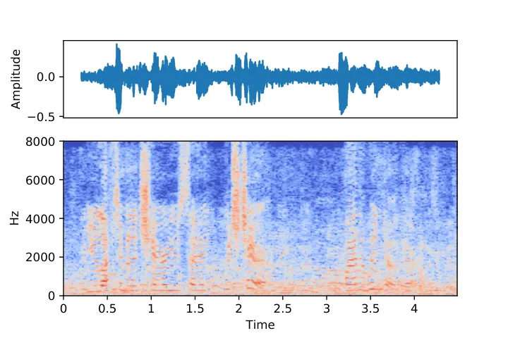
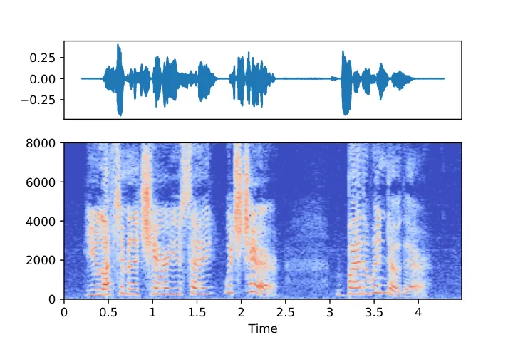
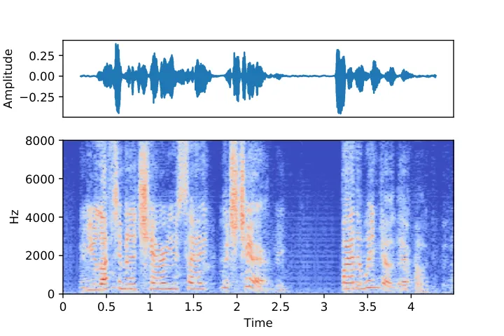
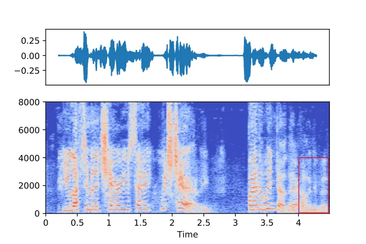
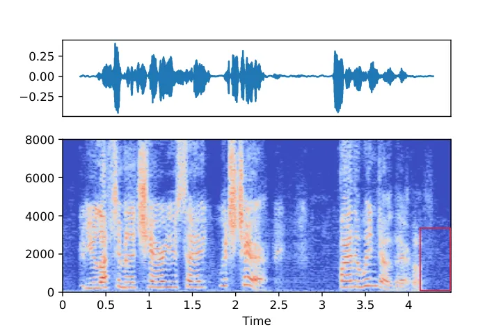

# Speech Enhancement Using Multi-Stage Self-Attentive Temporal Convolutional Networks

Ju Lin    Adriaan J. van Wijngaarden    Kuang-Ching Wang,    Melissa C.
Smith ^(†)^(†)thanks: The site
https://linjucs.github.io/demo/ms_sa_tcn.html contains audio samples
that demonstrate the effectiveness of the proposed multi-stage SA-TCN
speech enhancement systems.^(†)^(†)thanks: This work is supported by the
US Army Medical Research and Materiel Command under Contract No.
W81XWH-17-C-0238.^(†)^(†)thanks: Ju Lin, Kuang-Ching Wang and Melissa C.
Smith are with the Department of Electrical and Computer Engineering,
Clemson University, Clemson, SC 29634, USA (e-mail: {jul, kwang,
smithmc}@clemson.edu).^(†)^(†)thanks: Adriaan J. de Lind van Wijngaarden
is with Nokia Bell Labs, Murray Hill, NJ 07974, USA (e-mail:
adriaan.de_lind_van_wijngaarden@nokia-bell-labs.com).

###### Abstract

Multi-stage learning is an effective technique to invoke multiple
deep-learning modules sequentially. This paper applies multi-stage
learning to speech enhancement by using a multi-stage structure, where
each stage comprises a self-attention (SA) block followed by stacks of
temporal convolutional network (TCN) blocks with doubling dilation
factors. Each stage generates a prediction that is refined in a
subsequent stage. A fusion block is inserted at the input of later
stages to re-inject original information. The resulting multi-stage
speech enhancement system, in short, multi-stage SA-TCN, is compared
with state-of-the-art deep-learning speech enhancement methods using the
LibriSpeech and VCTK data sets. The multi-stage SA-TCN system’s
hyper-parameters are fine-tuned, and the impact of the SA block, the
fusion block and the number of stages are determined. The use of a
multi-stage SA-TCN system as a front-end for automatic speech
recognition systems is investigated as well. It is shown that the
multi-stage SA-TCN systems perform well relative to other
state-of-the-art systems in terms of speech enhancement and speech
recognition scores.

###### Index Terms: 

Speech enhancement, speech recognition, neural networks, self-attention,
temporal convolutional networks, multi-stage architectures.

^(†)^(†)aftertitle:

## I Introduction

Speech enhancement is a basic function that is used to improve the
quality and the intelligibility of a speech signal that is degraded by
ambient noise. Speech enhancement algorithms are used extensively in
many audio- and communication systems, including mobile handsets,
speaker verification systems and hearing aids. Popular classic
techniques include spectral-subtraction algorithms, statistical
model-based methods that use maximum-likelihood (ML) estimators,
Bayesian estimators, minimum mean squared error (MMSE) methods, subspace
algorithms based on single value decomposition and noise-estimation
algorithms (see \[1\] and references therein). Modern techniques often
use deep learning. Early examples include a recurrent neural network
(RNN) to model long-term acoustic characteristics \[2\], and a deep
auto-encoder that denoises speech signals with greedy layer-oriented
pre-training \[3\]. In \[4\], a deep neural network (DNN) was used as a
non-linear regression function. In \[5\], a convolutional recurrent
neural network (CRN) was used, consisting of a convolutional
encoder-decoder architecture and multiple long short-term memory (LSTM)
layers that aim to capture long-context information. Other speech
enhancement systems use a generative adversarial network (GAN), which is
known for its ability to generate natural-looking signals in the time or
frequency domain \[6, 7, 8, 9, 10\]. Recent studies consider the use of
an attention mechanism \[11, 12, 13, 14, 15, 16\]. Self-attention \[17\]
is an efficient context information aggregation mechanism that operates
on the input sequence itself and that can be utilized for any task that
has a sequential input and output. In \[15\], self-attention is combined
with a dense convolutional neural network. A time-frequency (T-F)
attention method, proposed in \[16\], combines time-domain and
frequency-domain attention to perform denoising and dereverberation at
the same time.

A temporal convolutional network (TCN) consists of dilated 1-D
convolutions that create a large temporal receptive field with fewer
parameters than other models. Recent research shows that TCN-based
models achieve excellent performance for text-to-speech \[18\], speech
enhancement \[19, 20, 21, 22, 23\], and speech separation \[24\].
In \[20\], a speech enhancement system was proposed that uses a
multi-branch TCN, in short MB-TCN, which effectively performs a
split-transform-aggregate operation and enables the model to learn and
determine an accurate representation by aggregating the information from
each branch. In \[22\], the TCN used in \[24\] for speech separation was
adapted for speech enhancement and integrated in a multi-layer
encoder-decoder architecture. The use of a complex Short-Time Fourier
transform (STFT) for TCN-based speech enhancement rather than magnitude
or time-domain features was investigated in \[21\].

The above-mentioned methods can generally be classified as
feature-mapping and mask-learning methods, which are two commonly used
deep-learning approaches for single-channel speech enhancement methods
for stereo data. Feature mapping approaches enhance the noisy features
using a mapping network that minimizes the mean square error between the
enhanced and clean features. Mask-learning approaches estimate the ideal
ratio mask, the ideal binary mask or the complex ratio mask, and then
use this mask to filter noisy speech signals and reconstruct the clean
speech signals. Mask-learning methods usually perform better than
feature mapping methods in terms of speech quality metrics \[25, 26,
27\].

Recently, multi-stage learning has been successfully applied for a wide
variety of tasks, including human pose estimation \[28\], action
segmentation \[29\], speech enhancement \[30, 31, 32\] and speech
separation \[33\]. A multi-stage architecture consists of stages that
sequentially use the same model or a combination of different models,
and each model operates directly on the output of the previous stage.
The effect of such an arrangement is that the model used in a given
stage takes the predictions from prior stages as input and incrementally
refines these predictions.

Multi-stage learning systems that perform the same task in each stage
typically use the same supervision principles in each intermediate
stage \[28, 29, 32\]. In \[29\], multiple stacked TCN networks are
proposed for action segmentation. In \[32\], a multi-stage network with
dynamic attention is introduced, where the intermediate output in each
stage is corrected with a memory mechanism. To reduce the model
parameters, each stage uses a shared network. It is shown that this
multi-stage approach typically performs better than systems with a
larger and deeper network.

Multi-stage learning systems where each stage performs a different task
are considered in \[30, 31, 33\]. Here, each stage has a different task
and a different target. The performance can be improved by aggregating
different stages if the nature of each stage is complementary. For
instance, a two-stage speech enhancement approach is presented
in \[30\], where the first stage uses a model to predict a binary mask
to remove frequency bins that are dominated by severe noise, and where
the second stage performs in-painting of the masked spectrogram from the
first stage to recover the speech spectrogram that was removed in the
first stage. In \[31\], a two-stage algorithm is proposed to optimize
the magnitude and phase separately. The magnitude is optimized in the
first stage and the enhanced magnitude and phase are then further
refined jointly.

This paper details a novel multi-stage speech enhancement system, where
each stage comprises a self-attention (SA) block \[17\] followed by
stacks of dilated temporal convolutional network (TCN) blocks. The
system is referred to as a multi-stage SA-TCN speech enhancement system.
Each stage generates a prediction in the form of a soft mask that is
refined in each subsequent stage. Each self-attention block produces a
dynamic representation for different noise environments and their
relevance across frequency bins, as such enhancing the features, and the
stacks of TCN blocks perform sequential refinement processing. A fusion
block is inserted at the input of later stages to re-inject original
speech information to mitigate possible speech information loss in
earlier stages.

This paper is organized as follows. Section II details the proposed
multi-stage SA-TCN speech enhancement system and the underlying SA, TCN,
and fusion blocks. Section III details the comprehensive experiments
using the LibriSpeech \[34\] and VCTK \[35\] corpus. Section IV first
presents the experiments that were performed to fine-tune the
multi-stage SA-TCN system’s hyper-parameters, to determine the optimum
number of stages, and to quantify the impact of the SA block and the
fusion block on the performance. The use of the proposed multi-stage
SA-TCN system as a front-end for automatic speech recognition (ASR)
systems is investigated as well. Extensive experiments with the
LibriSpeech \[34\] and VCTK \[35\] corpus show that multi-stage SA-TCN
systems achieve significantly better speech enhancement and speech
recognition scores than other state-of-the-art speech enhancement
systems. Section V concludes the paper and discusses further research
directions.

## II Multi-Stage SA-TCN Systems

Speech enhancement systems take a sampled received noisy speech signal
as input and aim to reconstruct the speech signal. Let
$`\left\{{x(t)|t\in{\mathbb{Z}}}\right\}`$ denote a deterministic
discrete-time data sequence that is obtained by sampling a received
continuous-time noisy speech signal $`x_{c}(\cdot)`$ at time interval
$`T_{s}`$, i.e., $`x(t)=x_{c}(t\cdot T_{s})\in{\mathbb{R}}`$, and let
the total number of samples be denoted by $`T_{\ell}`$. The short-time
Fourier transform (STFT) of length $`N`$ of $`\left\{{x(t)}\right\}`$
with window function $`w(t)`$ of length $`N`$ and hop-length $`T_{h}`$
is given by

```math
X_{\tau,\omega}=\sum_{n=0}^{N-1}w(n)x(\tau{T_{h}}+n)\exp\left({-j\frac{2\pi\omega{n}}{N}}\right), \tag{1}
```

where $`\tau`$ is the index of the sliding window and $`0\leq\omega<N`$
is the frequency index. In this paper, a Hanning window is used, where

```math
w(t)=\sin^{2}\left({\frac{\pi{t}}{N-1}}\right). \tag{2}
```

Let $`\boldsymbol{{\mathrm{X}}}`$ and $`\boldsymbol{{\mathrm{\Omega}}}`$
denote the STFT magnitude and phase, i.e.,
$`\boldsymbol{{\mathrm{X}}}=\left\{{|X_{\tau,\omega}|}\right\}\in{\mathbb{R}}^{F{\times}T}`$
and $`\boldsymbol{{\mathrm{\Omega}}}\in{\mathbb{R}}^{F{\times}T}`$,
where $`F=N/2+1`$ denotes the number of frequency bins and
$`T=T_{\ell}/{T_{h}}+1`$.

The proposed multi-stage SA-TCN speech enhancement system consists of
$`K`$ stages. Fig. 1 illustrates a 4-stage SA-TCN system. Each stage
comprises a self-attention (SA) block followed by $`R`$ stacks of $`L`$
TCN blocks. For $`K`$-stage SA-TCN systems where $`K\geq 3`$, a feature
fusion block is inserted prior to each stage $`k`$, where
$`3\leq k\leq K`$.

Fig. 1: Block diagram of a multi-stage SA-TCN speech enhancement system
with $`K=4`$ stages, where each stage consists of a self-attention (SA)
block, followed by $`R=3`$ stacks of $`L=8`$ TCN blocks, where the
dilation factor of the $`\ell`$-th TCN block in the stack equals
$`\Delta_{\ell}=2^{\ell-1}`$, i.e., the dilation doubles for each next
TCN block in the stack. A fusion block is used as of Stage 3 to
re-inject the original STFT magnitude. The figure also shows the
detailed structure of the self-attention module, with frequency and time
dimensions $`F`$ and $`T`$, a single TCN block with hyper-parameters
$`B`$ and $`H`$ and $`P`$, and the proposed fusion block.

Each of the blocks have special features that are particularly suited
for speech enhancement. The self-attention mechanism aggregates context
information across channels, which is particularly helpful in obtaining
a dynamic representation when the noise is non-stationary, and this is
the case for many speech enhancement scenarios.

The TCN consists of $`R`$ stacks of $`L`$ non-causal TCN blocks, where
the dilation factor of the $`\ell`$-th TCN block in the stack is given
by $`\Delta_{\ell}=2^{\ell}`$. As such, each stack has a large receptive
field, which makes it particularly suited for temporal sequence
modeling. Each TCN block has a skip connection between the input and
output to reduce the loss of low-level details and to provide hooks for
optimization.

The multi-stage architecture iteratively refines the initial
predictions. It should be noted that the prediction of a previous stage
may include some errors. For instance, the frequency bins dominated by
speech may be masked and the resulting magnitude spectrogram may have
lost some of the speech information. A fusion block block is inserted
prior to each stage $`k`$, where $`3\leq k\leq K`$, that combines the
predicted magnitude $`\boldsymbol{{\mathrm{\hat{X}}}}{}^{(k-1)}`$ at the
output of stage $`k-1`$ and the original magnitude
$`\boldsymbol{{\mathrm{X}}}`$ as input, in order to re-inject the
original speech information.

The first stage consists of a self-attention (SA) block that takes
$`\boldsymbol{{\mathrm{X}}}`$ as input and that uses three
$`{\text{1}}\hskip-1.0pt{\times}\hskip-1.0pt{\text{1}}`$-convolutions to
form the query $`\boldsymbol{{\mathrm{Q}}}`$ and the key-value pair
$`(\boldsymbol{{\mathrm{K}}},\boldsymbol{{\mathrm{V}}})`$, where
$`\boldsymbol{{\mathrm{Q}}},\boldsymbol{{\mathrm{K}}},\boldsymbol{{\mathrm{V}}}\in{\mathbb{R}}^{F\times T}`$.
In order to compute the attention component
$`\boldsymbol{{\mathrm{A}}}`$, we first compute the weight
$`\boldsymbol{{\mathrm{W}}}`$, given by

```math
\boldsymbol{{\mathrm{W}}}=\frac{\boldsymbol{{\mathrm{Q}}}{\boldsymbol{{\mathrm{K}}}}^{\kern-1.5pt{\mathsf{T}}}}{\sqrt{F}}, \tag{3}
```

and then use the soft-max function $`\sigma(\cdot)`$ to obtain
$`\boldsymbol{{\mathrm{\widehat{W}}}}=\{\widehat{W}_{i,j}\}=\sigma\left({\boldsymbol{{\mathrm{W}}}}\right)`$,
i.e.,

```math
\widehat{W}_{i,j}=\frac{\exp\left({W_{i,j}}\right)}{w_{j}},\text{\ where \ }w_{j}=\sum_{i=1}^{F}\exp\left({W_{i,j}}\right). \tag{4}
```

The attention component
$`\boldsymbol{{\mathrm{A}}}\in{\mathbb{R}}^{F\times T}`$ is now
determined using

```math
\boldsymbol{{\mathrm{A}}}=\boldsymbol{{\mathrm{\widehat{W}}}}\boldsymbol{{\mathrm{V}}}, \tag{5}
```

The SA block outputs
$`\boldsymbol{{\mathrm{\widehat{X}}}}=\boldsymbol{{\mathrm{X}}}+\delta\boldsymbol{{\mathrm{A}}}`$,
where $`\delta`$ is a scalar with initial value zero that is used to
allow the network to first rely on the cues in the local channels
$`\boldsymbol{{\mathrm{X}}}`$ and then gradually assign more weight to
the non-local channels using back-propagation to reach its optimal
value.

The output
$`\boldsymbol{{\mathrm{\widehat{X}}}}\in{\mathbb{R}}^{F\times T}`$ is
fed into a TCN with input feature dimension $`B`$ and network feature
map dimension $`H`$ by using a bottleneck layer to reduce the number of
channels from $`F`$ to $`B`$. The TCN consists of $`R`$ identical stacks
of $`L`$ TCN blocks. Each TCN block comprises an
$`{\text{1}}\hskip-1.0pt{\times}\hskip-1.0pt{\text{1}}`$ convolution at
its input to match the input feature dimension $`B`$ to the TCN block’s
internal feature map dimension $`H`$, a dilated depth-wise convolution
(D-conv) layer with kernel size $`P`$ and dilation factor
$`\Delta_{\ell}=2^{\ell-1}`$, where $`\ell`$ denotes the order of the
TCN block in the stack of $`L`$ TCN blocks, and a
$`{\text{1}}\hskip-1.0pt{\times}\hskip-1.0pt{\text{1}}`$ convolution
layer to reduce the number of channels at the output from $`H`$ to
$`B`$. This output is then recombined with the input using a skip
connection to avoid losing low-level details. A parametric rectified
linear unit (PReLU) activation layer \[36\] and a batch normalization
layer \[37\] are inserted prior to and after the depth-wise convolution
layer to accelerate training and improve performance. A sigmoid function
is applied at the output of the last TCN block of the last stack to
obtain a \[0-1\] mask $`\boldsymbol{{\mathrm{M}}}^{(1)}`$ that minimizes
the mean absolute error loss

```math
{\mathcal{L}}^{(1)}=\lVert{\boldsymbol{{\mathrm{M}}}^{(1)}}\raisebox{1.29167pt}{\scriptsize$\odot$}{\boldsymbol{{\mathrm{X}}}}-\boldsymbol{{\mathrm{S}}}\rVert, \tag{6}
```

where the operator $`\odot`$ denotes the Hadamard product and
$`\boldsymbol{{\mathrm{S}}}`$ denotes the STFT magnitude of the clean
speech signal $`s(t)`$.

The stack of $`L`$ TCN blocks with kernel $`P`$ and dilation factor
$`\Delta_{\ell}=2^{\ell-1}`$ create a receptive field of size
$`R^{(P,L)}`$, given by

```math
R^{(P,L)}=1+\sum_{\ell=1}^{L}(P-1)\cdot 2^{\ell-1}. \tag{7}
```

As such, a stack of $`L`$ TCN blocks creates a large temporal receptive
field with fewer parameters than other models.

This paper considers multi-stage SA-TCN systems with kernel size
$`P=3`$. An illustration of the receptive field for a stack of $`L=5`$
TCN blocks with kernel size $`P=3`$ is shown in Fig. 2.

|     |
| --- |
|     |

Fig. 2: Example of the connections formed by a non-causal D-convolution
for a stack of $`L=5`$ TCN blocks, each with kernel $`P=3`$ and dilation
$`\Delta_{\ell}=2^{\ell-1}`$, where $`1\leq\ell\leq L`$.

The multi-stage SA-TCN system’s hyper-parameters $`(B,H,R,L)`$ will be
optimized using experiments.

As indicated, the same SA-TCN structure is used for subsequent stages,
and an additional element, a fusion block, is inserted prior to each
stage if there are three or more stages.

For notational convenience, let
$`\boldsymbol{{\mathrm{\Psi}}}_{k}^{(R,L)}(\cdot)`$ denote the mapping
performed by the $`R`$ stacks of $`L`$ TCN blocks in stage $`k`$, and
let $`\boldsymbol{{\mathrm{\Upsilon}}}_{k}(\cdot)`$ denote the
self-attention operation at stage $`k`$. It follows that
$`\boldsymbol{{\mathrm{M}}}^{(1)}`$ can now be expressed as

```math
\boldsymbol{{\mathrm{M}}}^{(1)}=S(\boldsymbol{{\mathrm{\Psi}}}_{1}^{(R,L)}(\boldsymbol{{\mathrm{\Upsilon}}}_{1}(\boldsymbol{{\mathrm{X}}}))), \tag{8}
```

where $`S(\cdot)`$ denotes the sigmoid function. As such,
$`\boldsymbol{{\mathrm{M}}}^{(1)}`$ is the predicted mask at the output
of the first stage. The enhanced speech STFT magnitude
$`\boldsymbol{{\mathrm{\hat{X}}}}{}^{(1)}`$ at the output of stage 1 is
given by
$`\boldsymbol{{\mathrm{\hat{X}}}}{}^{(1)}={\boldsymbol{{\mathrm{M}}}^{(1)}}\raisebox{1.29167pt}{\scriptsize$\odot$}{\boldsymbol{{\mathrm{X}}}}`$.

In a similar fashion, the predicted mask
$`\boldsymbol{{\mathrm{M}}}^{(2)}`$ at the output of the second stage
can be obtained by evaluating

```math
\boldsymbol{{\mathrm{M}}}^{(2)}=S(\boldsymbol{{\mathrm{\Psi}}}_{2}^{(R,L)}(\boldsymbol{{\mathrm{\Upsilon}}}_{2}({\boldsymbol{{\mathrm{\hat{X}}}}{}^{(1)}}))) \tag{9}
```

and the estimated STFT magnitude
$`\boldsymbol{{\mathrm{\hat{X}}}}{}^{(2)}={\boldsymbol{{\mathrm{M}}}^{(2)}}\raisebox{1.29167pt}{\scriptsize$\odot$}{\boldsymbol{{\mathrm{\hat{X}}}}{}^{(1)}}`$.

A multi-stage SA-TCN speech enhancement system with three or more stages
($`K\geq 3`$) is constructed by inserting a fusion block that performs
operation $`\boldsymbol{{\mathrm{\Phi}}}(\cdot)`$ prior to each stage
$`k`$, where $`3\leq k\leq K`$, taking the masked STFT magnitude
$`\boldsymbol{{\mathrm{\hat{X}}}}{}^{(k-1)}`$ and STFT magnitude
$`\boldsymbol{{\mathrm{X}}}`$ as inputs. Each input is passed through a
$`{\text{1}}\hskip-1.0pt{\times}\hskip-1.0pt{\text{1}}`$-convolution and
a PReLU operation, after which a global layer normalization (gLN) is
performed \[24\]. The operation
$`\textsc{gLN}(\boldsymbol{{\mathrm{Y}}})`$ is given by

```math
\textsc{gLN}(\boldsymbol{{\mathrm{Y}}})=\frac{\boldsymbol{{\mathrm{Y}}}-E\left[{\boldsymbol{{\mathrm{Y}}}}\right]}{\sqrt{\text{var}(\boldsymbol{{\mathrm{Y}}})+\epsilon}}\odot\mbox{\boldmath$\gamma$}+\mbox{\boldmath$\beta$}, \tag{10}
```

where $`\boldsymbol{{\mathrm{Y}}}\in{\mathbb{R}}^{{F}\times{T}}`$ is the
input feature with mean $`E\left[{\boldsymbol{{\mathrm{Y}}}}\right]`$
and variance $`\text{var}(\boldsymbol{{\mathrm{Y}}})`$,
$`\mbox{\boldmath$\gamma$},\mbox{\boldmath$\beta$}\in{\mathbb{R}}^{{F}\times{1}}`$
are trainable parameters, and $`\epsilon`$ is a small constant for
numerical stability.

The outputs of the two gLN are added, and the result is again sent
through a
$`{\text{1}}\hskip-1.0pt{\times}\hskip-1.0pt{\text{1}}`$-convolution, a
PReLU, another gLN, another
$`{\text{1}}\hskip-1.0pt{\times}\hskip-1.0pt{\text{1}}`$-convolution and
another PReLU. The output, denoted as
$`\boldsymbol{{\mathrm{\breve{X}}}}{}^{(k-1)}`$, is given by

```math
\boldsymbol{{\mathrm{\breve{X}}}}{}_{k-1}=\boldsymbol{{\mathrm{\Phi}}}_{k}\left({\boldsymbol{{\mathrm{M}}}^{(k-1)}}\raisebox{1.29167pt}{\scriptsize$\odot$}{\boldsymbol{{\mathrm{X}}}},{\boldsymbol{{\mathrm{\hat{X}}}}{}^{(k-1)}}\right). \tag{11}
```

The output $`\boldsymbol{{\mathrm{\breve{X}}}}{}_{k-1}`$ is then used as
an input to the next stage, and the expression for the mask
$`\boldsymbol{{\mathrm{M}}}^{(k)}`$ at the output of the $`k`$-th stage
is now given by

```math
\boldsymbol{{\mathrm{M}}}^{(k)}=S\bigl(\boldsymbol{{\mathrm{\Psi_{k}}}}^{(R,L)}\bigl(\boldsymbol{{\mathrm{\Upsilon_{k}}}}\bigl(\boldsymbol{{\mathrm{\breve{X}}}}{}_{k}\bigr)\bigr)\bigr). \tag{12}
```

The enhanced magnitude $`\boldsymbol{{\mathrm{\hat{X}}}}{}^{(k)}`$ at
stage $`k`$ is given by

```math
\boldsymbol{{\mathrm{\hat{X}}}}^{(k)}={\boldsymbol{{\mathrm{M}}}^{(k)}}\raisebox{1.29167pt}{\scriptsize$\odot$}{\boldsymbol{{\mathrm{\hat{X}}}}{}^{(k-1)}}. \tag{13}
```

Each next stage $`k`$, where $`k>1`$, computes mask
$`\boldsymbol{{\mathrm{M}}}^{(k)}`$ that minimizes the mask-based signal
approximation mean absolute error loss $`{\mathcal{L}}^{(k)}`$ using

```math
{\mathcal{L}}^{(k)}=\big\lVert{\boldsymbol{{\mathrm{M}}}^{(k)}}\raisebox{1.29167pt}{\scriptsize$\odot$}{\boldsymbol{{\mathrm{\hat{X}}}}{}^{(k-1)}}-\boldsymbol{{\mathrm{S}}}\big\rVert, \tag{14}
```

where $`\boldsymbol{{\mathrm{\hat{X}}}}{}^{(k-1)}`$ denotes the
estimated STFT magnitude at stage $`k-1`$.

At the output of the last stage of the multi-stage SA-TCN system, the
time-domain waveform $`\boldsymbol{{\hat{s}}}`$ is computed using the
processed STFT magnitude $`\boldsymbol{{\mathrm{\hat{X}}}}{}^{(k)}`$ and
the original STFT phase $`\Omega`$ by applying the inverse STFT, in
short ISTFT, denoted as

```math
\boldsymbol{{\hat{s}}}=\text{ISTFT}(\boldsymbol{{\mathrm{\hat{X}}}}{}^{(K)},\boldsymbol{{\mathrm{\Omega}}}). \tag{15}
```

The proposed multi-stage SA-TCN system provides a mean absolute error
loss $`{\mathcal{L}}^{(k)}`$ at the output of each stage. Since each
stage provides an equal contribution during the training process, we use
the accumulated mask-based signal approximation training objective
function

```math
{\mathcal{L}}=\sum_{k=1}^{K}{\mathcal{L}}^{(k)}. \tag{16}
```

The use of the mean absolute error loss is motivated by recent
observations that it achieves better objective quality scores when using
spectral mapping techniques \[38, 39\].

## III Experimental Setup

In the following, the data set, model set up and the evaluation metrics
are detailed.

### III-A Data Set

To verify the effectiveness of the proposed multi-stage SA-TCN system,
we conduct experiments using the LibriSpeech and VCTK data sets. The
detailed set-up for each data set is detailed below.

LibriSpeech is an open-source corpus that contains 960 hours of speech
derived from audio books in the LibriVox project. The sampling frequency
is 16 kHz. The clean source is trained using 100 hours of speech data
from the “train-clean” data set. The validation set uses 800 sentences
from the “dev-clean” data set, and the test set uses 500 sentences from
the “test-clean” data set. The training set uses 10,000 randomly
selected noise sample sequences from the DNS Challenge \[40\]. The
training clean speech has been cut to 75,206 4-second segments. The
training and validation sets distort the clean segments with a
randomly-selected noise sound from the DNS Challenge noise set with an
SNR in the set $`\{-5,-4,\cdots,9,10\}`$ (in dB), The test set uses
three distinct noise types: “babble noise” from the NOISEX-92
corpus \[41\], and “office noise” and “kitchen noise” from the DEMAND
noise corpus \[42\]. The first channel signal of the corpus is used for
data generation. Each clean utterance is distorted by a randomly
selected noise type at a randomly selected SNR from the set
$`\{-5,0,5,10,15\}`$ (in dB).

The VCTK database used here is derived from the Valentini-Botinhao
corpus \[35\]. Each speaker fragment contains about 10 different
sentences. The training set uses 28 speakers, and the test set uses two
speakers. The training set used here uses 40 noise conditions: eight
noise types and two artificial noise types from the Demand
database \[42\]) are used at a randomly selected SNR from the set
$`\{0,5,10,5\}`$ (in dB). The test set uses 20 noise conditions: five
noise types from the Demand database at a randomly selected SNR from the
set $`\{2.5,7.5,12.5,17.5\}`$ (in dB). There are about 20 different
sentences in each condition for each test speaker. The test set
conditions are different from the training set, as the test set uses
different speakers and noise conditions.

### III-B Model Setup

The baseline systems used for performance comparison are a CRN
system \[5\], a complex-CNN system that is based on concepts proposed
in \[43\] and that was adapted for speech enhancement, and a multi-stage
system DARCN \[32\]. The setup of the baseline systems and the proposed
multi-stage SA-TCN systems are detailed below.

CRN: The CRN-based approach takes the magnitude as input. Instead of
directly mapping the noisy magnitude to the clean magnitude, we adapted
the CRN to predict the ratio mask and as such improve its performance.
The CRN-based method consists of five 2D convolution layers with filters
of size $`{{3}}\hskip 0.2pt{\times}\hskip 0.2pt{{2}}`$ each and \[16,
32, 64, 128, 256\] output channels, respectively. This output is
post-processed by two LSTM layers with 1024 nodes each, and five 2D
deconvolution layers with filter size
$`{{3}}\hskip 0.2pt{\times}\hskip 0.2pt{{2}}`$ each and output channels
\[128, 64, 32, 16, 1\], respectively.

Complex-CNN. The complex-CNN performs a complex spectral mapping \[44,
45\], where the real and imaginary spectrograms of the noisy speech
signal are treated as two different input channels. An STFT is used with
a 20 ms Hanning window, a 20 ms filter length and a 10 ms hop size. The
architecture uses eight convolutional layers, one LSTM layer and two
fully-connected layers, each with ReLU activations except for the last
layer, which has a sigmoid activation. The parameters used here are
similar to the ones used in \[43\], but now both the input and the
output have two channels with real and imaginary components,
respectively. The prediction serves as a complex mask, consisting of a
real and imaginary mask. The training stage uses a multi-resolution STFT
loss function \[46\], which is the sum of all STFT loss functions using
different STFT parameters.

DARCN. DARCN \[32\] is a recently proposed monaural speech enhancement
technique that uses multiple stages and that combines dynamic attention
and recursive learning. Experiments are conducted with the open-source
code¹¹ 1 https://github.com/Andong-Li-speech/DARCN using a non-causal,
3-stage configuration.

Proposed multi-stage SA-TCN Systems. The proposed multi-stage SA-TCN
systems are characterized by the number of stages $`K`$ and the
hyper-parameters $`(H,B,R,L)`$. Each $`K`$-stage SA-TCN system uses an
STFT with a 32 ms Hanning-window, a 32 ms filter length and a 16 ms hop
size. As such, $`F=257`$. The multi-stage SA-TCN systems are trained
using 80 epochs of 4-second utterances from the LibriSpeech corpus and
using 100 epochs of variable-length utterances from the VCTK corpus. The
proposed multi-stage SA-TCN systems are trained using the Adam
optimizer \[47\] with an initial learning rate of 0.0002. All models use
a mini-batch of 16 utterances. For each mini-batch of 16 utterances from
the VCTK corpus, the longest utterance is determined and the other
utterances are zero-padded to obtain equal-length utterances.

### III-C ASR Setup.

The automatic speech recognition (ASR) experiments use a time-delay
neural network-hidden Markov model (TDNN-HMM) hybrid chain model \[48\].
The TDNN models long-term temporal dependencies with training times that
are comparable to standard feed-forward DNNs. The data is represented at
different time points by adding a set of delays to the input, which
allows the TDNN to have a finite dynamic response to the time series
input data. This acoustic model is trained using the Kaldi
toolkit \[49\] with the standard recipe²² 2
https://github.com/kaldi-asr/kaldi/tree/master/egs/librispeech/s5. The
ASR acoustic models were trained using 960 hours from the LibriSpeech
training set. The word error rate (WER) was measured using the
LibriSpeech “test-clean” set.

### III-D Evaluation Metrics

The speech enhancement systems are evaluated using the commonly used
wide-band perceptual evaluation of speech quality (PESQ) score \[50, 51,
52\], the short-time objective intelligibility (STOI) score \[53\], the
scale-invariant signal-to-distortion ratio (SI-SDR) \[54\], and the
CSIG, CBAK and COVL scores. The CSIG score is a signal distortion mean
opinion score, the CBAK score measures background intrusiveness, and the
COVL score measures the speech quality. The automatic speech recognition
performance is measured by determining the word error rate (WER).

## IV Experimental Performance Results

Extensive experiments have been performed to determine the performance
of the proposed multi-stage SA-TCN speech enhancement systems, This
section first details the findings of the ablation studies, and then
presents the performance results for the multi-stage SA-TCN systems.

### IV-A Ablation Studies

Ablation studies were performed to fine-tune the multi-stage SA-TCN
system’s hyper-parameters $`(H,B,R,L)`$, and to analyze the
effectiveness of the self-attention and fusion blocks.

The performance of 5-stage SA-TCN systems is measured in terms of PESQ
and STOI scores for several hyper-parameter configurations. The results
are listed in Table I. We observe that it is more effective to increase
the number of channels (hyper-parameters $`B`$ and $`H`$) in each TCN
block than to increase the number of TCN blocks per stack ($`L`$). For
instance, when $`R=2`$ and $`H`$ and $`B`$ are doubled, the PESQ score
improves from 2.59 to 2.65 and the STOI score improves from 92.36 to
93.02. At the same time, using $`L=8`$ instead of $`L=5`$ causes a
slight degradation of the PESQ score. The performance can also be
improved significantly by increasing the number of stacks $`R`$. We
determined the model size for the larger TCN with $`R=3`$ stacks and
$`L=8`$ TCN blocks per stack, which accounts for about 1.68 M
parameters. Each SA block has about 0.2 M parameters and each fusion
block has about 1.7 M parameters. If we only consider models with less
than 10 million parameters, the model where $`(H,B,R,L)=(256,128,3,8)`$
performs best. We should also note that there is a trade-off between the
performance and the model size.

|                                                           |       |       |       |       |            |      |       |
| --------------------------------------------------------- | ----- | ----- | ----- | ----- | ---------- | ---- | ----- |
| $`R`$                                                     | $`L`$ | $`H`$ | $`B`$ | $`P`$ | model size | PESQ | STOI  |
| 2                                                         | 5     | 128   | 64    | 3     | 2.38 M     | 2.59 | 92.36 |
| 2                                                         | 5     | 256   | 128   | 3     | 5.19 M     | 2.65 | 93.02 |
| 2                                                         | 8     | 128   | 64    | 3     | 2.90 M     | 2.53 | 92.32 |
| 2                                                         | 8     | 256   | 128   | 3     | 7.21 M     | 2.64 | 93.05 |
| 3                                                         | 5     | 128   | 64    | 3     | 2.81 M     | 2.61 | 92.67 |
| 3                                                         | 5     | 256   | 128   | 3     | 6.88 M     | 2.71 | 93.40 |
| 3                                                         | 8     | 128   | 64    | 3     | 3.59 M     | 2.60 | 92.20 |
| 3                                                         | 8     | 256   | 128   | 3     | 9.91 M     | 2.73 | 93.37 |
| The best score in a column is bold-faced, the second best |       |       |       |       |            |      |       |
| is navy blue and the third best is dark pink.             |       |       |       |       |            |      |       |

TABLE I: Performance for Several 5-stage SA-TCN Configurations

Next, we investigate the impact of the number of stages $`K`$ on the
performance of a multi-stage SA-TCN speech enhancement system. The
motivation for employing multi-stage learning is that the initial
prediction is refined by the next stage. The results in Table II show
that the performance improves step-wise after each stage. For instance,
when comparing the first and the fifth stage, it shows that the PESQ
score improves from 2.60 to 2.73, and the STOI score improves from
93.08 % to 93.37 %. We also observe that the PESQ score’s rate of
improvement gradually decreases from 0.5 to 0.1, which suggests that
adding further stages has diminishing returns in terms of performance
and that a 5-stage SA-TCN system is likely close to the upper bound on
performance for this multi-stage TCN-based approach.

| Stage   | PESQ | STOI  |
| ------- | ---- | ----- |
| stage 1 | 2.60 | 93.08 |
| stage 2 | 2.65 | 93.10 |
| stage 3 | 2.70 | 93.22 |
| stage 4 | 2.72 | 93.33 |
| stage 5 | 2.73 | 93.37 |

TABLE II: Per-Stage PESQ and STOI Scores for a 5-Stage SA-TCN System

The performance impact of using self-attention was determined using PESQ
and STOI scores. The results are shown in Fig. 3. On average, a 5-stage
SA-TCN system provides a STOI score improvement of 3.5 % and a PESQ
score improvement of 1.05 relative to unprocessed noisy speech. The
insertion of the SA block prior to the stacked layers of TCN blocks
consistently improves PESQ and STOI scores for all SNR conditions: the
average PESQ score improves from 2.68 to 2.73 and the average STOI score
improves from 93.16 % to 93.37 %. This indicates that the SA block is
able to aggregate the frequency context, which is helpful for TCN-based
speech enhancement. We also observe that the use of SA blocks show more
significant performance gains at low SNR, e.g., at -5 dB, the PESQ score
improves from 2.04 to 2.14 and the STOI score improves from 86.57 % to
87.05 %. This also indicates that multi-stage SA-TCN systems are more
robust for lower SNR.

a. PESQ score

b. STOI score \[%\]

Fig. 3: Impact of using a self-attention module in a 5-stage SA-TCN
system, where $`(H,B,R,L)=(256,128,3,8)`$.

The effectiveness of the proposed fusion block, which re-injects
original information in stages 3–5 in a 5-stage SA-TCN system to
alleviate any speech signal loss, is considered next. The PESQ and STOI
scores are shown in Fig. 4. It shows that both scores improve for all
SNR scenarios. The average PESQ score improves from 2.65 to 2.73, and
the average STOI score improves from 93.08 % to 93.37 %. The impact of
the fusion block is, as expected, more prominent at lower SNR, when the
model not only removes the noise, but can also easily partly remove the
speech signal itself.

a. PESQ score

b. STOI score \[%\]

Fig. 4: Impact of using a fusion block in a 5-stage SA-TCN system, where
$`(H,B,R,L)=(256,128,3,8)`$.

### IV-B Baseline System Comparison

Extensive experiments with the proposed multi-stage SA-TCN system and
the CRN-based, complex-CNN and DARCN systems were conducted using the
LibriSpeech data set. All multi-stage SA-TCN systems use
hyper-parameters $`(H,B,R,L)=(256,128,3,8)`$. Table III shows that all
multi-stage SA-TCN systems outperform the baseline systems in terms of
the PESQ score for the different noise types and SNR conditions. The
results also show that multi-stage SA-TCN systems with more stages have
a better PESQ score. Similarly, Table IV shows that the STOI scores of
the multi-stage SA-TCN systems are generally better than the baseline
systems, and that the best STOI scores are generally obtained for
4-stage and 5-stage SA-TCN systems. Interestingly, even the single-stage
SA-TCN system outperforms all baseline systems in terms of PESQ score.
Adding more stages improves the overall performance significantly. For
instance, the single-stage SA-TCN and the 2-stage SA-TCN have average
PESQ scores of 2.47 and 2.67, respectively, and average STOI scores of
92.52% and 92.88%. The best performance is achieved with $`K=5`$ stages,
with an average PESQ score of 2.73 and an average STOI score of 93.37 %.
The proposed 5-stage SA-TCN system has much better PESQ and STOI scores
than the baseline systems, which demonstrates the effectiveness of the
proposed approach. We also observe that multi-stage learning is more
effective at a low SNR. For example, the 5-stage SA-TCN system achieves
much better performance for Office and Kitchen Noise at -5 dB, and it
also performs well for Babble Noise at low SNR.

Finally, we determined the SI-SDR metrics that quantify speech
distortion. Table V shows that the proposed multi-stage SA-TCN sytems
generally outperform the baseline systems. We also observe that the
SI-SDR performance for multi-stage SA-TCN systems with $`K>3`$ stages
decreases slightly, which indicates that the additional stages not only
mask the noise, but also distort the speech signal. However, it will be
shown next that these speech distortions do not impact the ASR
performance.

|                                                                                                                                           |              |      |      |      |      |              |      |      |      |      |               |      |      |      |      |         |
| ----------------------------------------------------------------------------------------------------------------------------------------- | ------------ | ---- | ---- | ---- | ---- | ------------ | ---- | ---- | ---- | ---- | ------------- | ---- | ---- | ---- | ---- | ------- |
| Noise type                                                                                                                                | Office Noise |      |      |      |      | Babble Noise |      |      |      |      | Kitchen Noise |      |      |      |      | Average |
| SNR                                                                                                                                       | -5           | 0    | 5    | 10   | 15   | -5           | 0    | 5    | 10   | 15   | -5            | 0    | 5    | 10   | 15   |         |
| Noisy speech                                                                                                                              | 1.30         | 1.68 | 2.01 | 2.60 | 3.39 | 1.06         | 1.09 | 1.22 | 1.37 | 1.80 | 1.07          | 1.18 | 1.30 | 1.62 | 2.10 | 1.63    |
| CRN                                                                                                                                       | 1.90         | 2.16 | 2.58 | 3.07 | 3.45 | 1.08         | 1.20 | 1.46 | 1.75 | 2.24 | 1.43          | 1.81 | 2.19 | 2.44 | 2.78 | 2.09    |
| Complex-CNN                                                                                                                               | 2.14         | 2.40 | 2.84 | 3.01 | 3.24 | 1.13         | 1.30 | 1.70 | 2.06 | 2.54 | 1.77          | 2.20 | 2.46 | 2.67 | 2.95 | 2.30    |
| DARCN                                                                                                                                     | 2.23         | 2.48 | 3.02 | 3.35 | 3.62 | 1.14         | 1.33 | 1.72 | 1.97 | 2.52 | 1.80          | 2.16 | 2.45 | 2.64 | 2.82 | 2.35    |
| 1-stage SA-TCN                                                                                                                            | 2.29         | 2.60 | 3.11 | 3.38 | 3.64 | 1.15         | 1.38 | 1.85 | 2.28 | 2.81 | 1.83          | 2.27 | 2.69 | 2.84 | 2.87 | 2.47    |
| 2-stage SA-TCN                                                                                                                            | 2.55         | 2.85 | 3.46 | 3.65 | 3.84 | 1.17         | 1.44 | 1.94 | 2.37 | 2.89 | 1.93          | 2.47 | 2.94 | 3.09 | 3.39 | 2.67    |
| 3-stage SA-TCN                                                                                                                            | 2.67         | 2.93 | 3.43 | 3.58 | 3.83 | 1.17         | 1.42 | 1.97 | 2.39 | 2.92 | 1.95          | 2.47 | 2.94 | 3.18 | 3.30 | 2.69    |
| 4-stage SA-TCN                                                                                                                            | 2.61         | 2.90 | 3.42 | 3.56 | 3.81 | 1.19         | 1.46 | 2.03 | 2.48 | 2.95 | 1.97          | 2.49 | 2.98 | 3.11 | 3.35 | 2.70    |
| 5-stage SA-TCN                                                                                                                            | 2.74         | 2.90 | 3.38 | 3.57 | 3.82 | 1.18         | 1.47 | 2.05 | 2.51 | 3.02 | 2.10          | 2.53 | 2.94 | 3.19 | 3.30 | 2.73    |
| All multi-stage SA-TCN models use hyper-parameters $`(H,B,R,L)=(256,128,3,8)`$. The best score in a column is bold-faced, the second best |              |      |      |      |      |              |      |      |      |      |               |      |      |      |      |         |
| is navy blue and the third best is dark pink.                                                                                             |              |      |      |      |      |              |      |      |      |      |               |      |      |      |      |         |

TABLE III: PESQ Scores for Multi-Stage SA-TCN and Baseline Systems Using
Samples from the LibriSpeech Corpus

|                                                                                                                                           |        |       |       |       |       |        |       |       |       |       |         |       |       |       |       |         |
| ----------------------------------------------------------------------------------------------------------------------------------------- | ------ | ----- | ----- | ----- | ----- | ------ | ----- | ----- | ----- | ----- | ------- | ----- | ----- | ----- | ----- | ------- |
| Noise type                                                                                                                                | Office |       |       |       |       | Babble |       |       |       |       | Kitchen |       |       |       |       | Average |
| SNR \[dB\]                                                                                                                                | -5     | 0     | 5     | 10    | 15    | -5     | 0     | 5     | 10    | 15    | -5      | 0     | 5     | 10    | 15    |         |
| Noisy speech                                                                                                                              | 92.91  | 96.81 | 98.50 | 98.62 | 99.25 | 54.94  | 64.93 | 80.04 | 87.10 | 91.08 | 84.59   | 91.75 | 95.40 | 98.21 | 98.86 | 89.66   |
| CRN                                                                                                                                       | 93.02  | 96.15 | 97.29 | 97.55 | 98.07 | 54.44  | 68.15 | 83.75 | 90.04 | 91.98 | 87.14   | 92.60 | 95.57 | 97.15 | 97.23 | 90.23   |
| Complex-CNN                                                                                                                               | 93.23  | 95.78 | 97.25 | 96.91 | 97.01 | 60.70  | 72.92 | 87.01 | 91.85 | 93.26 | 87.38   | 92.63 | 95.11 | 96.83 | 96.83 | 91.09   |
| DARCN                                                                                                                                     | 95.08  | 97.04 | 98.46 | 98.44 | 98.82 | 62.60  | 75.20 | 88.90 | 91.72 | 94.41 | 90.31   | 93.71 | 96.60 | 98.31 | 98.31 | 92.64   |
| 1-stage SA-TCN                                                                                                                            | 94.81  | 97.09 | 98.55 | 98.52 | 98.76 | 61.51  | 74.96 | 88.62 | 92.89 | 94.26 | 89.37   | 94.11 | 96.37 | 98.08 | 98.27 | 92.52   |
| 2-stage SA-TCN                                                                                                                            | 94.85  | 96.98 | 98.35 | 98.24 | 98.89 | 64.91  | 76.59 | 89.89 | 93.29 | 94.47 | 89.45   | 93.72 | 96.76 | 97.67 | 98.65 | 92.88   |
| 3-stage SA-TCN                                                                                                                            | 95.02  | 97.23 | 98.48 | 98.32 | 98.92 | 63.30  | 75.75 | 89.92 | 93.63 | 94.64 | 88.71   | 93.68 | 96.79 | 98.12 | 98.60 | 92.82   |
| 4-stage SA-TCN                                                                                                                            | 94.93  | 97.14 | 98.52 | 98.22 | 98.75 | 65.47  | 76.94 | 90.33 | 93.70 | 94.73 | 89.41   | 94.47 | 96.74 | 98.10 | 98.62 | 93.10   |
| 5-stage SA-TCN                                                                                                                            | 95.43  | 97.24 | 98.62 | 98.60 | 98.96 | 64.26  | 77.57 | 90.33 | 93.94 | 94.94 | 90.82   | 94.84 | 96.88 | 98.22 | 98.78 | 93.37   |
| All multi-stage SA-TCN models use hyper-parameters $`(H,B,R,L)=(256,128,3,8)`$. The best score in a column is bold-faced, the second best |        |       |       |       |       |        |       |       |       |       |         |       |       |       |       |         |
| is navy blue and the third best is dark pink.                                                                                             |        |       |       |       |       |        |       |       |       |       |         |       |       |       |       |         |

TABLE IV: STOI Scores for Multi-Stage SA-TCN and Baseline Systems Using
Samples from the LibriSpeech Corpus

|                                                           |       |       |       |       |       |         |
| --------------------------------------------------------- | ----- | ----- | ----- | ----- | ----- | ------- |
| SNR \[dB\]                                                | -5    | 0     | 5     | 10    | 15    | Average |
| CRN                                                       | 1.43  | 5.72  | 9.63  | 13.07 | 16.39 | 9.28    |
| Complex-CNN                                               | 9.66  | 11.32 | 13.35 | 14.49 | 16.86 | 13.15   |
| DARCN                                                     | 11.00 | 12.65 | 15.84 | 17.60 | 19.87 | 15.41   |
| 1-stage SA-TCN                                            | 11.13 | 13.40 | 16.77 | 18.05 | 19.77 | 15.84   |
| 2-stage SA-TCN                                            | 10.80 | 12.71 | 16.60 | 17.42 | 19.44 | 15.42   |
| 3-stage SA-TCN                                            | 11.41 | 13.03 | 17.01 | 18.34 | 20.33 | 16.04   |
| 4-stage SA-TCN                                            | 10.48 | 12.69 | 16.25 | 17.10 | 19.51 | 15.23   |
| 5-stage SA-TCN                                            | 11.43 | 12.82 | 16.29 | 17.41 | 19.67 | 15.55   |
| The best score in a column is bold-faced, the second best |       |       |       |       |       |         |
| is navy blue and the third best is dark pink.             |       |       |       |       |       |         |

TABLE V: SI-SDR scores for Multi-Stage SA-TCN and Baseline Systems Using
Samples from the LibriSpeech Corpus

### IV-C Automatic Speech Recognition

We conducted automatic speech recognition (ASR) experiments using
LibriSpeech to assess the performance of multi-stage SA-TCN systems with
up to five stages and determined the word error rate (WER) as well as
the WER reduction. The baseline systems are the CRN-based method, and
the complex-CNN and DARCN methods. The results are shown in Table VI.
Our 1-stage SA-TCN system performs slightly worse than the best baseline
systems, but the multi-stage SA-TCN methods perform better, and the the
proposed 5-stage SA-TCN achieves an absolute improvement of 18.8 %,
8.4 % and 4.6 % relative to CRN, complex-CNN and the DARCN methods,
respectively. The ASR results are similar to the STOI performance.

|                                                           |           |                     |
| --------------------------------------------------------- | --------- | ------------------- |
| Method                                                    | WER \[%\] | WER reduction \[%\] |
| Noisy Speech                                              | 32.94     | –                   |
| CRN                                                       | 30.86     | 6.3                 |
| Complex-CNN                                               | 27.44     | 16.7                |
| DARCN                                                     | 26.18     | 20.5                |
| 1-stage SA-TCN                                            | 27.86     | 15.4                |
| 2-stage SA-TCN                                            | 25.32     | 23.1                |
| 3-stage SA-TCN                                            | 26.11     | 20.7                |
| 4-stage SA-TCN                                            | 25.27     | 23.3                |
| 5-stage SA-TCN                                            | 24.67     | 25.1                |
| The best score in a column is bold-faced, the second best |           |                     |
| is navy blue and the third best is dark pink.             |           |                     |

TABLE VI: Speech Recognition Performance of Multi-Stage SA-TCN and
Baseline Systems

### IV-D Spectrogram-Based Visualization

Speech enhancement performance can be assessed using spectrograms.
Consider the situation where clean speech is perturbed by Babble noise
at an SNR of 5 dB. Fig. 5 shows spectrograms of the noisy speech signal,
the clean speech target, as well as the CRN-based and complex CNN-based
systems, the DARCN system, and the proposed 5-stage SA-TCN enhanced
speech system. The spectrograms clearly show that the proposed system is
best at suppressing residual noise while preserving the speech patterns.



a. Noisy Speech



b. Clean Target


c. CRN-based System



d. Complex-CNN System



e. DARCN System



f. 5-Stage SA-TCN System

Fig. 5: Spectrograms of a sample input mixed with Babble Noise at an SNR
of 5 dB and the speech-enhanced signals at the output of SA-TCN and
baseline systems.

### IV-E Speech-Enhancement Benchmark Results

The proposed multi-stage SA-TCN speech enhancement systems are compared
with state-of-the-art methods using the publicly available benchmark
data set VCTK. As shown in Table VII, the proposed multi-stage SA-TCN
systems outperform methods that use T-F frequency features, including
magnitude, gamma-tone spectral and complex STFT in terms of all the
speech enhancement metrics used in this paper. Compared with the
recently proposed time-domain method DEMUCS, our proposed method uses
fewer parameters and achieves better performance in terms of CBAK and
COVL metrics, while the PESQ, STOI and CSIG are slightly worse. The
experiments with the VCTK corpus show that adding more stages still
provides some incremental performance improvements.

|                                                                                                         |            |                     |      |        |      |      |      |        |
| ------------------------------------------------------------------------------------------------------- | ---------- | ------------------- | ---- | ------ | ---- | ---- | ---- | ------ |
|                                                                                                         | model size | feature type        | PESQ | STOI   | CSIG | CBAK | COVL | SI-SDR |
| noisy speech                                                                                            | –          | –                   | 1.97 | 0.921  | 3.35 | 2.44 | 2.63 | 8.45   |
| SEGAN \[6\] (2017)                                                                                      | 43.2 M     | Waveform            | 2.16 | 0.93   | 3.48 | 2.94 | 2.80 | –      |
| Wave-U-Net \[55\] (2018)                                                                                | 10.2 M     | Waveform            | 2.40 | –      | 3.52 | 3.24 | 2.96 | –      |
| DFL \[56\] (2018)                                                                                       | 0.64 M     | Waveform            | –    | –      | 3.86 | 3.33 | 3.22 | –      |
| MMSE-GAN \[57\] (2018)                                                                                  | 0.79 M     | Gamma-tone spectral | 2.53 | 0.93   | 3.80 | 3.12 | 3.14 | –      |
| MetricGAN \[7\] (2019)                                                                                  | 1.89 M     | Magnitude           | 2.86 |        | 3.99 | 3.18 | 3.42 | –      |
| MB-TCN \[20\] (2019)                                                                                    | 1.66 M     | Magnitude           | 2.94 | 0.9364 | 4.21 | 3.41 | 3.59 | –      |
| DeepMMSE \[58\] (2020)                                                                                  | –          | Magnitude           | 2.95 | 0.94   | 4.28 | 3.46 | 3.64 | –      |
| MHSA-SPK \[14\] (2020)                                                                                  | –          | STFT                | 2.99 | –      | 4.15 | 3.42 | 3.57 | –      |
| STFT-TCN \[21\] (2020)                                                                                  | –          | STFT                | 2.89 | –      | 4.24 | 3.40 | 3.56 | –      |
| DEMUCS \[46\] (2020)                                                                                    | 127.9 M    | Waveform            | 3.07 | 0.95   | 4.31 | 3.40 | 3.63 | –      |
| 1-stage SA-TCN                                                                                          | 1.88 M     | Magnitude           | 2.84 | 0.9402 | 4.16 | 3.37 | 3.50 | 17.98  |
| 2-stage SA-TCN                                                                                          | 3.76 M     | Magnitude           | 2.96 | 0.9422 | 4.25 | 3.45 | 3.62 | 18.19  |
| 3-stage SA-TCN                                                                                          | 5.81 M     | Magnitude           | 2.99 | 0.9423 | 4.27 | 3.48 | 3.64 | 18.38  |
| 4-stage SA-TCN                                                                                          | 7.86 M     | Magnitude           | 3.01 | 0.9428 | 4.27 | 3.49 | 3.66 | 18.40  |
| 5-stage SA-TCN                                                                                          | 9.91 M     | Magnitude           | 3.02 | 0.9439 | 4.29 | 3.50 | 3.67 | 18.48  |
| The best score in a column is bold-faced, the second best is navy blue and the third best is dark pink. |            |                     |      |        |      |      |      |        |

TABLE VII: Performance Evaluation Scores of Multi-Stage SA-TCN and
Baseline Systems Using Samples from the VCTK Corpus

## V Discussion and Conclusions

In this paper, we have presented novel multi-stage SA-TCN speech
enhancement systems, where each stage consists of a self-attention block
followed by $`R`$ stacks of $`L`$ temporal convolutional network blocks
with doubling dilation factors. The stacks of $`L`$ TCN blocks
effectively perform sequential refinement processing. Multi-stage SA-TCN
systems with three or more stages use a fusion block as of the third
stage to mitigate any possible loss of the original speech information
loss in later stages. The proposed self-attention module is used to
provide a dynamic representation by aggregating the frequency context.
Extensive experiments were used to fine-tune the hyper-parameters. It
was shown that both the addition of the self-attention modules and the
fusion blocks resulted in better performance. We noted that even the
basic 1-stage SA-TCN system performs well and that adding stages
improves the speech enhancement scores. The model size increases almost
linearly with the number of stages. The relative improvement when adding
an additional stage reduces when more stages are added and as such one
approaches an implicit upper bound for this approach. The best overall
performance with a reasonable model size was obtained with a 5-stage
SA-TCN system.

Extensive experiments were conducted using the LibriSpeech and VCTK data
sets to determine the performance of the multi-stage SA-TCN speech
enhancement systems and to compare the proposed system with other
state-of-the-art deep-learning speech enhancement systems. It was shown
that the proposed multi-stage SA-TCN methods achieve better performance
in terms of widely used objective metrics while having fewer parameters.
Speech enhancement, especially in mobile applications, requires
computational- and parameter-efficient models. The proposed methods meet
this requirement and at the same time provide excellent performance.
Spectrograms were used to visualize that the proposed 5-stage SA-TCN
systems can remove noise effectively while preserving the speech
patterns. The proposed multi-stage SA-TCN systems predict a soft mask at
each stage, which can be viewed as an implicit ideal ratio mask (IRM).
For speech signals that are dominated by noise, the noise is suppressed
gradually in each stage, which is a main reason for the excellent
performance. The proposed multi-stage SA-TCN systems are also shown to
have excellent ASR performance.

The focus of this paper is to process and enhance the spectrum
magnitude, and the unaltered noisy phase is used when reconstructing the
waveforms in the time domain. Recently, several studies have shown that
phase information is also important for improving the perceptual
quality \[59, 31\]. Thus, incorporating phase information into the
proposed approach may lead to further improvements. This is currently
being investigated.

## Acknowledgments

The authors thank Clemson University for the generous allotment of
compute time on its Palmetto cluster.

## References

- \[1\] P. C. Loizou, _Speech Enhancement_, 2nd ed. Boca Raton, FL: CRC
  Press, 2013.
- \[2\] A. L. Maas, Q. V. Le, T. M. O’Neil, O. Vinyals, P. Nguyen, and
  A. Y. Ng, “Recurrent neural networks for noise reduction in robust
  ASR,” in _Proc. Interspeech_, Portland, OR, Sep. 2012, pp. 22–25.
- \[3\] X. Lu, Y. Tsao, S. Matsuda, and C. Hori, “Speech enhancement
  based on deep denoising autoencoder,” in _Proc. Interspeech_, Lyon,
  France, Aug. 2013, pp. 436–440.
- \[4\] Y. Xu, J. Du, L.-R. Dai, and C.-H. Lee, “A regression approach
  to speech enhancement based on deep neural networks,” _IEEE/ACM Trans.
  Audio, Speech, Language Process._, vol. 23, no. 1, pp. 7–19,
  Jan. 2015.
- \[5\] K. Tan and D. Wang, “A convolutional recurrent neural network
  for real-time speech enhancement,” in _Proc. Interspeech_, Hyderabad,
  India, Sep. 2018, pp. 3229–3233.
- \[6\] S. Pascual, A. Bonafonte, and J. Serrà, “SEGAN: Speech
  enhancement generative adversarial network,” in _Proc. Interspeech_,
  Stockholm, Sweden, Aug. 2017, pp. 3642–3646.
- \[7\] S.-W. Fu, C.-F. Liao, Y. Tsao, and S.-D. Lin, “MetricGAN:
  Generative adversarial networks based black-box metric scores
  optimization for speech enhancement,” in _Proc. Int’l Conf. on Machine
  Learning_, Long Beach, CA, Jun. 2019, pp. 2031–2041.
- \[8\] J. Lin, S. Niu, Z. Wei, X. Lan, A. J. van Wijngaarden, M. C.
  Smith, and K.-C. Wang, “Speech enhancement using forked generative
  adversarial networks with spectral subtraction,” in _Proc.
  Interspeech_, Graz, Austria, Sep. 2019, pp. 3163–3167.
- \[9\] D. Baby and S. Verhulst, “SERGAN: Speech enhancement using
  relativistic generative adversarial networks with gradient penalty,”
  in _Proc. IEEE Int’l Conf. Acoustics, Speech and Signal Proc._,
  Brighton, United Kingdom, May 2019, pp. 106–110.
- \[10\] J. Lin, S. Niu, A. J. van Wijngaarden, J. L. McClendon, M. C.
  Smith, and K.-C. Wang, “Improved speech enhancement using a
  time-domain GAN with mask learning,” in _Proc. Interspeech_, Shanghai,
  China, Oct. 2020, pp. 3286–3290.
- \[11\] R. Giri, U. Isik, and A. Krishnaswamy, “Attention Wave-U-Net
  for speech enhancement,” in _Proc. IEEE Workshop on Appl. of Signal
  Proc. to Audio and Acoustics_, New Paltz, NY, Oct. 2019, pp. 249–253.
- \[12\] J. Kim, M. El-Khamy, and J. Lee, “T-GSA: Transformer with
  Gaussian-weighted self-attention for speech enhancement,” in _Proc.
  IEEE Int’l Conf. Acoustics, Speech and Signal Proc._, Barcelona,
  Spain, May 2020, pp. 6649–6653.
- \[13\] Y. Zhao, D. Wang, B. Xu, and T. Zhang, “Monaural speech
  dereverberation using temporal convolutional networks with self
  attention,” _IEEE/ACM Trans. Audio, Speech, Language Process._,
  vol. 28, p. 1598–1607, May 2020.
- \[14\] Y. Koizumi, K. Yatabe, M. Delcroix, Y. Maxuxama, and
  D. Takeuchi, “Speech enhancement using self-adaptation and multi-head
  self-attention,” in _Proc. IEEE Int’l Conf. Acoustics, Speech and
  Signal Proc._, Barcelona, Spain, May 2020, pp. 181–185.
- \[15\] A. Pandey and D. Wang, “Dense CNN with self-attention for
  time-domain speech enhancement,” _arXiv:2009.01941_, Sep. 2020.
- \[16\] Y. Zhao and D. Wang, “Noisy-reverberant speech enhancement
  using DenseUNet with time-frequency attention,” in _Proc.
  Interspeech_, Shanghai, China, Oct. 2020, pp. 3261–3265.
- \[17\] A. Vaswani, N. Shazeer, N. Parmar, J. Uszkoreit, L. Jones,
  A. N. Gomez, Ł. Kaiser, and I. Polosukhin, “Attention is all you
  need,” in _Proc. Advances in Neural Information Proc. Sys._, Long
  Beach, CA, Dec. 2017, pp. 5998–6008.
- \[18\] A. van den Oord, S. Dieleman, H. Zen, K. Simonyan, O. Vinyals,
  A. Graves, N. Kalchbrenner, A. Senior, and K. Kavukcuoglu, “WaveNet: A
  generative model for raw audio,” in _Proc. ISCA Speech Synthesis
  Workshop_, Sunnyvale, CA, Sep. 2016, p. 125.
- \[19\] A. Pandey and D. Wang, “TCNN: Temporal convolutional neural
  network for real-time speech enhancement in the time domain,” in
  _Proc. IEEE Int’l Conf. Acoustics, Speech and Signal Proc._, Brighton,
  United Kingdom, May 2019, pp. 6875–6879.
- \[20\] Q. Zhang, A. Nicolson, M. Wang, K. K. Paliwal, and C. Wang,
  “Monaural speech enhancement using a multi-branch temporal
  convolutional network,” _arXiv:1912.12023_, Dec. 2019.
- \[21\] Y. Koyama, T. Vuong, S. Uhlich, and B. Raj, “Exploring the best
  loss function for DNN-based low-latency speech enhancement with
  temporal convolutional networks,” _arXiv:2005.11611_, May 2020.
- \[22\] V. Kishore, N. Tiwari, and P. Paramasivam, “Improved speech
  enhancement using TCN with multiple encoder-decoder layers,” in _Proc.
  Interspeech_, Shanghai, China, Oct. 2020.
- \[23\] C.-L. Liu, S.-W. Fu, Y.-J. Li, J.-W. Huang, H.-M. Wang, and
  Y. Tsao, “Multichannel speech enhancement by raw waveform-mapping
  using fully convolutional networks,” _IEEE/ACM Trans. Audio, Speech,
  Language Process._, vol. 28, pp. 1888–1900, 2020.
- \[24\] Y. Luo and N. Mesgarani, “Conv-TasNet: Surpassing ideal
  time-frequency magnitude masking for speech separation,” _IEEE/ACM
  Trans. Audio, Speech, Language Process._, vol. 27, no. 8, pp.
  1256–1266, Aug. 2019.
- \[25\] Y. Wang, A. Narayanan, and D. Wang, “On training targets for
  supervised speech separation,” _IEEE/ACM Trans. Audio, Speech,
  Language Process._, vol. 22, no. 12, pp. 1849–1858, Dec. 2014.
- \[26\] Z. Chen, Y. Huang, J. Li, and Y. Gong, “Improving mask learning
  based speech enhancement system with restoration layers and residual
  connection,” in _Proc. Interspeech_, Stockholm, Sweden, Aug. 2017, pp.
  3632–3636.
- \[27\] A. Narayanan and D. Wang, “Investigation of speech separation
  as a front-end for noise robust speech recognition,” _IEEE/ACM Trans.
  Audio, Speech, Language Process._, vol. 22, no. 4, pp. 826–835,
  Apr. 2014.
- \[28\] A. Newell, K. Yang, and J. Deng, “Stacked hourglass networks
  for human pose estimation,” in _Proc. European Conf. on Computer
  Vision_, Amsterdam, The Netherlands, Oct. 2016, pp. 483–499.
- \[29\] Y. A. Farha and J. Gall, “MS-TCN: Multi-stage temporal
  convolutional network for action segmentation,” in _Proc. IEEE/CVF
  Conf. Comput. Vision and Pattern Recognition_, Long Beach, CA, Jun.
  2019, pp. 3575–3584.
- \[30\] X. Hao, X. Su, S. Wen, Z. Wang, Y. Pan, F. Bao, and W. Chen,
  “Masking and inpainting: A two-stage speech enhancement approach for
  low SNR and non-stationary noise,” in _Proc. IEEE Int’l Conf.
  Acoustics, Speech and Signal Proc._, Barcelona, Spain, May 2020, pp.
  6959–6963.
- \[31\] A. Li, C. Zheng, R. Peng, and X. Li, “Two heads are better than
  one: A two-stage approach for monaural noise reduction in the complex
  domain,” _arXiv:2011.01561_, Nov. 2020.
- \[32\] A. Li, C. Zheng, C. Fan, R. Peng, and X. Li, “A recursive
  network with dynamic attention for monaural speech enhancement,”
  _arXiv:2003.12973_, Mar. 2020.
- \[33\] C. Fan, J. Tao, B. Liu, J. Yi, Z. Wen, and X. Liu, “Deep
  attention fusion feature for speech separation with end-to-end
  post-filter method,” _arXiv:2003.07544_, Mar. 2020.
- \[34\] V. Panayotov, G. Chen, D. Povey, and S. Khudanpur,
  “LibriSpeech: an ASR corpus based on public domain audio books,” in
  _Proc. IEEE Int’l Conf. Acoustics, Speech and Signal Proc._, Brisbane,
  Australia, Apr. 2015, pp. 5206–5210.
- \[35\] C. Valentini-Botinhao, X. Wang, S. Takaki, and J. Yamagishi,
  “Investigating RNN-based speech enhancement methods for noise-robust
  Text-to-Speech,” in _Proc. ISCA Speech Synthesis Workshop_, Sunnyvale,
  CA, Sep. 2016, pp. 146–152.
- \[36\] K. He, X. Zhang, S. Ren, and J. Sun, “Delving deep into
  rectifiers: Surpassing human-level performance on ImageNet
  classification,” in _Proc. IEEE Int’l Conf. Comput. Vision_, Santiago,
  Chile, Dec. 2015, pp. 1026–1034.
- \[37\] S. Ioffe and C. Szegedy, “Batch normalization: Accelerating
  deep network training by reducing internal covariate shift,” in _Proc.
  Int’l Conf. on Machine Learning_, Lille, France, Jul. 2015, pp.
  448–456.
- \[38\] A. Pandey and D. Wang, “On adversarial training and loss
  functions for speech enhancement,” in _Proc. IEEE Int’l Conf.
  Acoustics, Speech and Signal Proc._, Calgary, AB, Apr. 2018, pp.
  5414–5418.
- \[39\] ——, “A new framework for CNN-based speech enhancement in the
  time domain,” _IEEE/ACM Trans. Audio, Speech, Language Process._,
  vol. 27, no. 7, pp. 1179–1188, Jul. 2019.
- \[40\] C. K. A. Reddy, H. Dubey, V. Gopal, R. Cutler, S. Braun,
  H. Gamper, R. Aichner, and S. Srinivasan, “ICASSP 2021 deep noise
  suppression challenge,” _arXiv:2009.06122_, Sep. 2020.
- \[41\] A. Varga and H. J. Steeneken, “Assessment for automatic speech
  recognition: II. NOISEX-92: A database and an experiment to study the
  effect of additive noise on speech recognition systems,” _Speech
  Commun._, vol. 12, no. 3, pp. 247–251, Jul. 1993.
- \[42\] J. Thiemann, N. Ito, and E. Vincent, “The diverse environments
  multi-channel acoustic noise database (DEMAND): A database of
  multichannel environmental noise recordings,” in _Proc. Int’l Conf. on
  Acoustics_, Montréal, Canada, Jun. 2013, pp. 1–6.
- \[43\] Q. Wang, H. Muckenhirn, K. Wilson, P. Sridhar, Z. Wu,
  J. Hershey, R. A. Saurous, R. J. Weiss, Y. Jia, and I. Lopez Moreno,
  “Voicefilter: Targeted voice separation by speaker-conditioned
  spectrogram masking,” in _Proc. Interspeech_, Graz, Austria, Sep.
  2019, pp. 2728–2732.
- \[44\] S.-W. Fu, T.-Y. Hu, Y. Tsao, and X. Lu, “Complex spectrogram
  enhancement by convolutional neural network with multi-metrics
  learning,” in _Proc. IEEE Int’l Workshop on Machine Learning for
  Signal Proc._, Tokyo, Japan, Sep. 2017, pp. 1–6.
- \[45\] K. Tan and D. Wang, “Complex spectral mapping with a
  convolutional recurrent network for monaural speech enhancement,” in
  _Proc. IEEE Int’l Conf. Acoustics, Speech and Signal Proc._, Brighton,
  United Kingdom, May 2019, pp. 6865–6869.
- \[46\] A. Défossez, G. Synnaeve, and Y. Adi, “Real time speech
  enhancement in the waveform domain,” _arXiv:2006.12847_, Sep. 2020.
- \[47\] D. P. Kingma and J. L. Ba, “Adam: A method for stochastic
  optimization,” in _Proc. Int’l Conf. on Learning Representations_, San
  Diego, CA, May 2015, pp. 1–15.
- \[48\] V. Peddinti, D. Povey, and S. Khudanpur, “A time delay neural
  network architecture for efficient modeling of long temporal
  contexts,” in _Proc. Interspeech_, Dresden, Germany, Sep. 2015, pp.
  3214–3218.
- \[49\] D. Povey, A. Ghoshal, G. Boulianne, L. Burget, O. Glembek,
  N. Goel, M. Hannemann, P. Motlicek, Y. Qian, P. Schwarz, J. Silovsky,
  G. Stemmer, and K. Vesely, “The Kaldi speech recognition toolkit,” in
  _Proc. IEEE Workshop on Autom. Speech Recognition and Understanding_,
  Waikoloa, HI, Dec. 2011.
- \[50\] A. W. Rix, J. G. Beerends, M. P. Hollier, and A. P. Hekstra,
  “Perceptual evaluation of speech quality (PESQ) – a new method for
  speech quality assessment of telephone networks and codecs,” in _Proc.
  IEEE Int’l Conf. Acoustics, Speech and Signal Proc._, Salt Lake City,
  UT, May 2001, pp. 749–752.
- \[51\] _Perceptual evaluation of speech quality (PESQ): An objective
  method for end-to-end speech quality assessment of narrow-band
  telephone networks and speech codecs_, ITU-P recommendation P.862,
  Feb. 2001.
- \[52\] _Perceptual objective listening quality prediction_, ITU-P
  recommendation P.863, Mar. 2018.
- \[53\] C. H. Taal, R. C. Hendriks, R. Heusdens, and J. Jensen, “An
  algorithm for intelligibility prediction of time–frequency weighted
  noisy speech,” _IEEE/ACM Trans. Audio, Speech, Language Process._,
  vol. 19, no. 7, pp. 2125–2136, Sep. 2011.
- \[54\] J. Le Roux, S. Wisdom, H. Erdogan, and J. R. Hershey, “SDR –
  half-baked or well done?” in _Proc. IEEE Int’l Conf. Acoustics, Speech
  and Signal Proc._, Brighton, United Kingdom, May 2019, pp. 626–630.
- \[55\] C. Macartney and T. Weyde, “Improved speech enhancement with
  the Wave-U-Net,” _arXiv:1811.11307_, Nov. 2018.
- \[56\] F. G. Germain, Q. Chen, and V. Koltun, “Speech denoising with
  deep feature losses,” _arXiv:1806.10522_, Jun. 2018.
- \[57\] M. H. Soni, N. Shah, and H. A. Patil, “Time-frequency
  masking-based speech enhancement using generative adversarial
  network,” in _Proc. IEEE Int’l Conf. on Acoustics, Speech and Signal
  Proc._, Calgary, AB, Apr. 2018, pp. 5039–5043.
- \[58\] Q. Zhang, A. Nicolson, M. Wang, K. K. Paliwal, and C. Wang,
  “DeepMMSE: A deep learning approach to MMSE-based noise power spectral
  density estimation,” _IEEE/ACM Trans. Audio, Speech, Language
  Process._, vol. 28, pp. 1404–1415, Apr. 2020.
- \[59\] K. Paliwal, K. Wójcicki, and B. Shannon, “The importance of
  phase in speech enhancement,” _Speech Commun._, vol. 53, no. 4, pp.
  465–494, Apr. 2011.
