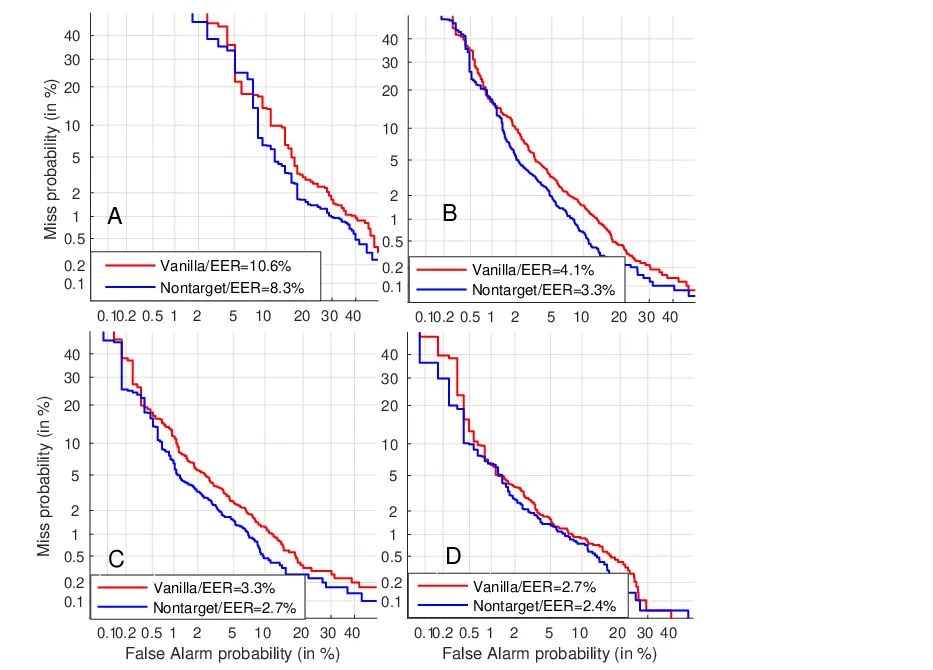

# Towards Robust Speaker Verification with Target Speaker Enhancement

Chunlei Zhang    Meng Yu    Chao Weng    Dong Yu

###### Abstract

This paper proposes the target speaker enhancement based speaker
verification network (TASE-SVNet), an all neural model that couples
target speaker enhancement and speaker embedding extraction for robust
speaker verification (SV). Specifically, an enrollment speaker
conditioned speech enhancement module is employed as the front-end for
extracting target speaker from its mixture with interfering speakers and
environmental noises. Compared with the conventional target speaker
enhancement models, nontarget speaker/interference suppression should
draw additional attention for SV. Therefore, an effective nontarget
speaker sampling strategy is explored. To improve speaker embedding
extraction with a light-weighted model, a teacher-student (T/S) training
is proposed to distill speaker discriminative information from large
models to small models. Iterative inference is investigated to address
the noisy speaker enrollment problem. We evaluate the proposed method on
two SV tasks, i.e., one heavily overlapped speech and the other one with
comprehensive noise types in vehicle environments. Experiments show
significant and consistent improvements in Equal Error Rate (EER) over
the state-of-the-art baselines.

^(†)^(†)address: Tencent AI Lab, Bellevue, WA, USA  
{cleizhang, raymondmyu, cweng, dyu}@tencent.com

Index Terms: robust speaker verification, target speaker enhancement,
speaker embedding, deep learning, overlapped speech

## 1 Introduction

Deep neural network (DNN) based speaker embedding models outperform the
conventional models (e.g., i-vector) in many speaker verification (SV)
tasks \[1, 2, 3, 4, 5, 6, 7\], becoming the state-of-the-art paradigms
of speaker recognition technology. The improved performance can be
attributed to three major reasons: a) deep (sometimes very deep) neural
network architectures that can effectively model speaker discriminative
information from utterances \[2, 5, 7, 8\]; b) novel neural network
training objectives (e.g., large margin softmax losses, contrastive
learning based losses or end-to-end losses etc.) and the corresponding
training strategies \[6, 8, 5, 9, 10\]; c) sufficient training data
distributed across diverse acoustic conditions \[2\].

Despite the success achieved, current SV systems still suffer evident
performance degradation in the presence of severe background noise with
interfering speakers \[11, 12, 13, 14, 15\]. Therefore, the SV system is
at increased risk of failure when exposed to unconstrained conditions.
Front-end techniques to tackle against such adverse environments include
speaker diarization, noise suppression, and speech separation. In
\[16\], it is suggested that speaker diarization works well for the
multi-speaker scenario where overlapped speech is not the main focus.
However, such system fails when highly overlapped speech exists. In
addition, the system performance heavily relies on speaker diarization
accuracy, which remains to be challenging at high noise levels. On the
contrary, a noise suppression model might perform well for general noise
reduction, however, the speaker of interest from multi-speaker
utterances could not be easily extracted through such models. The speech
separation technologies also provide a potential solution for extracting
target speaker from the mixture. The major drawback lies in the model
inference, where the number of speakers has to be known in advance. In
practice, such information is usually unknown from a test utterance. Due
to those constraints, successful adoption of the aforementioned
front-end techniques are rarely seen in generic SV systems.

In this study, we propose the target speaker enhancement based speaker
verification network (TASE-SVNet), a SV framework that is robust against
background noise and interfering speakers. For speech recognition models
with target speaker enhancement \[17, 18, 19\], speaker profile
utterances require additional cost to collect. While in SV tasks,
enrollment utterance of a speaker is naturally given, which could be
utilized as the anchor/profile signal for target speaker enhancement.
Specifically, following our previously formulated time-domain target
speaker enhancement model \[20\], the joint training strategy of target
speaker embedding extraction and speech enhancement is expected to offer
well-performed target speaker extraction for ‘‘target” test utterance ¹¹
1 “Target” test utterance refers to the test utterance of a target
trial, where speaker of interest is included in the test utterance.
“Nontarget” test utterance refers to the test utterance of a nontarget
trial, where the speakers in the test utterance are not the enrolled
speaker.. Furthermore, to encourage the speech enhancement module to
suppress noise and nontarget speakers for ”nontarget” test utterance, a
novel nontarget sample training strategy is introduced as an additional
constraint to the target speaker enhancement training, which effectively
prevents the increase of False Alarm Rate (FAR) in the SV phase.
Regarding the SV model in the TASE-SVNet framework, a teacher-student
(T/S) training scheme is investigated to improve the overall SV
performance with a light-weighted model. To put it together, the target
speaker enhancement module and the SV model of TASE-SVnet are unified in
a multi-stage training procedure.

Integrating target speaker enhancement to robust SV is still at its
early stage. The most relevant work to us is \[15\], where speaker-beam
based target speaker enhancement is evaluated \[19\], and an i-vector
model is employed as the SV model. In contrast with the pipeline system
\[15\], we expect an all-neural network solution with joint training
leads to improved SV performance.

The paper is structured as follows. Sec.2 describes the overall
TASE-SVnet framework with a time-domain target speaker enhancement
module, a speaker embedding module, and the improved training for each
module. Sec.3 details the experimental setup and the corpora. Sec.4
presents experimental results and analysis. Finally, we conclude the
paper in Sec.5.

## 2 Speaker verification with target speaker enhancement

In this section, we firstly introduce the overall framework of
TASE-SVNet. Then, we provide our improved training strategies of the
target speaker enhancement module and the speaker embedding module in
the following subsections. Lastly, we summarise the multi-stage training
procedure of TASE-SVNet.

Figure 1: The flow diagram of TASE-SVNet framework.

### 2.1 The TASE-SVNet framework

The overall TASE-SVNet framework consists of a target speaker
enhancement module and a speaker verification module. Fig.1 illustrates
the base framework of the proposed TASE-SVNet. The target speaker
enhancement module in the left part of Fig.1 is inherited from one of
our recently developed models, which gives the best speech enhancement
performance in \[20\]. Scale-invariant signal-to-noise ratio (SI-SNR)
\[20, 21\] is used as the target speaker enhancement objective function,
which is defined as:

```math
\text{SI-SNR}=20\log_{10}\frac{\|\alpha\cdot\mathbf{s}_{e}\|}{\|\mathbf{s}_{t}-\alpha\cdot\mathbf{s}_{e}\|}, \tag{1}
```

where $`\mathbf{s}_{e},\mathbf{s}_{t}`$ are estimated signal and target
signal, respectively, for which zero-mean normalization is applied.
$`\alpha`$ is an optimal scaling factor computed via
$`\alpha=\mathbf{s}_{e}^{T}\mathbf{s}_{t}/\mathbf{s}_{t}^{T}\mathbf{s}_{t}`$.

Fig.2 depicts the detailed implementation of joint learning
architecture, where a modified time-domain Conv-TasNet structure is
employed as the speaker enhancement network and a TDNN architecture
(i.e., spk embd net 1) is utilized to provide the bias information from
speaker of interest (i.e., meaning pooling over enrollment speaker
embeddings), respectively. To jointly learn speaker embedding and target
speaker enhancement, a multi-task loss $`\mathcal{L}_{TASE}`$ is
formulated with equal weight combination of the target speaker
enhancement loss $`\mathcal{L}_{SI-SNR}`$ and the speaker verification
loss $`\mathcal{L}_{SV}`$. Furthermore, $`\mathcal{L}_{SV}`$ is also a
multi-task objective which consists of a large margin cosine loss
$`\mathcal{L}_{lmc}`$ (LMCL) \[22\] and a triplet loss
$`\mathcal{L}_{triplet}`$ \[3\] with a tuned weight. The total loss is
defined as follows:

```math
\mathcal{L}_{SV}=\mathcal{L}_{triplet}+\omega_{1}\mathcal{L}_{lmc}+\omega_{2}\mathcal{L}_{r}, \tag{2}
```

where $`L_{r}`$ is a $`L_{2}`$-regularization term which alleviates
over-fitting during training, $`\omega_{1}`$ and $`\omega_{2}`$ are the
weights determined in the experiments. We refer the readers to \[20\]
for more detailed network configuration and training procedures.

For the SV model in the right part of Fig.1 (i.e., spk embd net 2), two
network architectures are introduced as the benchmarks for evaluating SV
performance. Specifically, a TDNN model (the same as spk embd net 1) and
a more heavy-weighted Resnet-50 are investigated \[23, 24\] as
contrastive systems. Both speaker embedding networks (i.e., spk embd net
1 & 2) in Fig.1 are pre-trained on a fairly large data set particularly
for the task of SV. More details about the experimental setups can be
found in Sec. 3.

Figure 2: Joint learning for target speaker enhancement.

### 2.2 Nontarget sample training in TASE-SVNet

To the best of our knowledge, all enrollment speaker informed target
speaker enhancement models \[18, 19, 17, 20\] are only evaluated on one
condition, which assumes target speaker is $`always`$ presented in the
test utterance. This is a strong prior that does not hold for SV tasks.
We argue that the current target speaker enhancement training criterion
is inclined to make the network output of nontarget test utterance more
biased to enrolled speaker, leading to an increased FAR in terms of SV
performance. Practically, we find our proposed base target speaker
enhancement models occasionally fail to suppress interference speakers
in the nontarget test utterance.

To address this issue, we propose to add nontarget samples to the target
speaker enhancement training. Specifically, a triplet consisting of
enrollment speaker utterances, a nontarget test utterance and a NULL
reference signal, is defined as the nontarget sample in our study. With
the negative samples randomly added in model training, the target
speaker embedding module is expected to have better performance in
interference speaker suppression. To unify the nontarget sample training
with the conventional ones (only with target samples), we update the
SI-SNR loss in Eq.(1) as a new training objective for the wohle
TASE-SVnet:

```math
\text{SI-SNR}=20\log_{10}\frac{\|\alpha\cdot\mathbf{s}_{e}\|}{\|\mathbf{s}_{t}-\alpha\cdot\mathbf{s}_{e}\|},\left\{\begin{aligned} \mathbf{s}_{t}&=\mathbf{x}_{t}&tar\\
\mathbf{s}_{t}&\sim N(0,\sigma^{2})&non\end{aligned}\right. \tag{3}
```

where $`\mathbf{x}_{t}`$ is the zero-mean normalized target reference
signal, and the NULL reference signal in nontarget triple is set to
follow a zero-mean normal distribution, with $`\sigma`$=1e-6 as the
stand deviation. Ideally, the NULL reference signal should be an all
zero sequence. However, $`\mathbf{s}_{t}=\mathbf{0}`$ will lead to zero
loss, the gradient from nontarget sample will not apply to model update.
Therefore, our solution is to provide a small-valued Gaussian
disturbance.

### 2.3 T/S training for speaker embedding training

T/S learning has been proved to be effective for domain adaptation in
speech processing \[25, 26\]. By T/S training, it is expected to learn a
student model that can perform well in target domain with domain
specific knowledge distillation from a well-trained source-domain
teacher model.

In this study, we aim to further improve the small TDNN model with the
large Resnet-50 model with T/S training. The T/S training objective is
fairly simple. The pre-trained Resnet-50 model will act as the teacher
model, the output of student TDNN model (i.e., speaker embedding) is
forced to be close to that from the teacher model. To achieve this, we
propose to use mean squared error (MSE) as the T/S training objective:

```math
\mathcal{L}_{MSE}=\frac{1}{N}\frac{1}{D}\sum_{i=1}^{N}\sum_{j=1}^{D}(Y_{t}(i,j)-Y_{s}(i,j))^{2}, \tag{4}
```

where $`D`$ is the dimension of speaker embedding, $`N`$ is the number
of speaker embeddings in one training batch, $`Y_{t}`$ and $`Y_{s}`$
represent the speaker embeddings from the teacher model and the student
model, respectively. Theoretically, T/S learning can be performed in an
unsupervised manner. In our experiments, we find that convergence of the
student TDNN model can be achieved much faster with a joint SV loss
described in Eq.2, which requires labeled training data. The overall
training loss $`\mathcal{L}_{S}`$ for the student model is as follows:

```math
\mathcal{L}_{S}=\mathcal{L}_{SV}+\mathcal{L}_{MSE}, \tag{5}
```

### 2.4 A multi-stage training procedure in TASE-SVNet

Although all the modules of the TASE-SVNet framework can be jointly
optimized from scratch. However, not much benefits have been seen with
the end to end training. In this section, a road map to develop the
final system is presented, where different modules are unified with a
multi-stage training strategy, resulting in consistent system
performances with less data constraints. More specifically, the
multi-stage training procedure is summarized as:

- 1.  Pre-train speaker embedding models (“spk embd net” 1 & 2) with a large
      scale general domain speaker recognition corpus. Apply T/S training to
      the TDNN model, employ the T/S learned TDNN model as the
      initialization of “spk embd net”.
- 2.  Jointly train spk embd net 1 (i.e., initialized with T/S trained TDNN)
      and target speaker enhancement network (from scratch) with a target
      speaker enhancement corpus.
- 3.  Fix the target speaker enhancement module when training has converged.
      Fine tune the spk embd net 2 using the triplet loss with the enhanced
      and raw speech data.

## 3 Corpora and experimental setup

### 3.1 Speech corpora

#### 3.1.1 SV corpora

Two datasets are utilized to examine our base SV models. The first one
is a Mandarin language corpus. The training set contains of 8800 speaker
drawn from two gender-balanced public speech recognition datasets²² 2
http://en.speechocean.com/datacenter/details/254.htm. The training data
is then augmented 2 folds to incorporate variabilities from distance
(reverberation), channel or background noise, resulting in a training
pool with 2.8M utterances. The duration ranges from 0.5s to 13.2s, with
the average duration of 3.8s. Two real SV test sets are examined. Test
set 1 is a 44-speaker corpus specifically for multi-speaker SV
evaluation (noted as “multi-spk”), each utterance may include 1-3
speakers with or without overlapping. We generate 10K trials from the
“multi-spk” test set, among which 1K trails are target trials. For
speaker enrollment, 3 utterances are randomly selected, where only
single-speaker utterance is used for enrollment. Test set 2 is a
365-speaker dataset collected under the unconstrained vehicle
environments (noted as “vehicle-spk”). It is a much larger dataset that
covers most of the noise types (i.e., wind noise, mechanical noise,
background music/noise, and interference speakers etc.). Similar as the
“multi-spk” for trial generation, we randomly select 3 utterances for
speaker enrollment, and sample the rest for test. 100K trials are
produced in the end, among which 10K trials are target trials. For
system comparisons, we also report our SV baselines on the Voxceleb task
\[23, 8\]. The performance is reported on Voxceleb1 test trials.

#### 3.1.2 Target speaker enhancement corpus

For training the target speaker enhancement model, we use the same
corpus as \[20\], which is simulated from AISHELL-2 \[27\]. The whole
dataset is split to a 1900-speaker training set, a 60-speaker validation
set and a 30-speaker test set. For each speaker (as a target speaker),
we randomly select 50 utterances of this speaker and mix each of them
with utterances from other speakers. As a result, we generate 95K, 3K,
and 1.5K mixed utterances for training, validation and test,
respectively. The signal-to-interference ratio (SIR) is equally
distributed in \[0dB, 6dB, 12dB, inf\]. The number of speakers in the
mixed signal ranges from 1 to 3 evenly. And the environmental noises are
added to the speech mixture with signal-to-noise ratio (SNR) randomly
sampled from \[6dB, 12dB, 18dB, 24dB, 30dB\].

### 3.2 System setups

For speaker embedding models, 257-d raw short time fourier transform
(STFT) features are extracted with a 32ms window and the time shift of
feature frames is 16ms. The non-speech part is removed by a
critical-band power spectrum variance based voice activity detector
(VAD), which provides better speech detection than the energy based VAD.
The voiced part is randomly segmented into 100-200 frames for network
training. A linear projection layer of 128-d is added to the TDNN and
Resnet architecture for speaker embedding extraction, where $`L_{2}`$
norm is applied as an unit energy constraint. $`\omega_{1}`$=0.2 and
$`\omega_{2}`$=0.001 in Eq.(2) are determined in the experiments.

We retain most of the hyper-parameters same with the target speaker
enhancement model presented in \[20\], except for the nontarget sample
training. In our experiments, we find that the ratio 11:1 between target
and nontarget samples are empirically good, which provides a balanced
performance of target speaker extraction and interference speaker
suppression. In the SV part of TASE-SVNet, we fine tune the SV model
with enhanced speech. To prevent the fine-tuned “spk embd net 2” from
being over-fitted on the training data, we use a small learning rate of
1e-6 with just one epoch of fine-tuing.

## 4 Results

### 4.1 Baseline SV results

We first evaluate the baseline SV systems with the test corpora, i.e.,
Voxceleb, overlap-spk and vehicle-spk. We also reference the
state-of-the-art Voxceleb benchmark results for fair comparison.

| model            | Voxceleb | overlap-spk | vehicle-spk |
| ---------------- | -------- | ----------- | ----------- |
| x-vector \[2\]   | 3.14%    | /           | /           |
| TDNN \[20\]      | 2.10%    | /           | /           |
| TDNN \[6\]       | 2.00%    | /           | /           |
| TDNN (ours)      | 1.95%    | 16.32%      | 4.15%       |
| Resnet-50 (ours) | 1.67%    | 15.45%      | 3.72%       |
| TDNN (ours T/S)  | 1.76%    | 15.91%      | 3.93%       |

Table 1: SV baseline results (EER).

As illustrated on Table 1, our proposed TDNN (6.5M) baseline could
achieve comparable result as \[6\] on Voxceleb. The large Resnet-50
model (31.4M) is able to approach the state-of-the-art single system
performance reported in \[28\], where deeper Resnet models are used for
speaker embedding training. For the “overlap-spk” dataset, where only
utterances with overlapped speakers are used for test, superb
performance is no longer hold as the Voxceleb test set. For a more
general purpose “vehicle-spk” corpus, although performance degradation
is not as big as the overlapping corpus, there still exists a big
performance drop, showing the difficulties for SV in unconstrained
environments. It is also noted that, the T/S trained TDNN model achieves
consitently better performances across all tasks without any additional
cost during inference. For the next experiments, the T/S trained TDNN
model is therefore utilized in the TASE-SVNet framework.



Figure 3: System performance comparison between the Vanilla TASE-SVNet
and the nontarget sample TASE-SVNet on “vehicle-spk“ test set, DET Curve
is split based on 4 SNR conditions of the test utterances. The SNR
condition in dB is: A=\[-inf,3\] B=\[3,15\], C=\[15,20\],D=\[20, inf\].

### 4.2 Impact of nontarget sample training for TASE-SVNet

In Sec.2.2, we argue that conventional target speaker enhancement (i.e.,
the vanilla TASE-SVNet) models are trained with target samples and do
not specifically address for nontarget speaker suppression. Therefore, a
nontarget sample training constraint is added in TASE-SVNet. A
comparison between the vanilla method and the nontarget sample version
is given in Fig.3. As illustrated in the DET curves, the nontarget
sample based TASE-SVNet consistently outperforms the vanilla version.
And the performance gain is from a lower FAR. We observe a lower FAR
when the miss probability is fixed, which eventually achieves a lower
EER. Table 2 presents the overall SV performance across two test sets,
as indicated in the table, the proposed nontarget sample based
TASE-SVNet framework is robust in both highly overlapped condition and
the general condition. The nontarget sample training strategy provides a
+15.2% relative improvement over the vanilla TASE-SVNet system in
“vehicle-spk” data.

| model                  | overlap-spk | vehicle-spk |
| ---------------------- | ----------- | ----------- |
| TDNN (ours T/S)        | 15.91%      | 3.93%       |
| TASE-SVNet (vanilla)   | 6.83%       | 3.72%       |
| TASE-SVNet (nontarget) | 6.02%       | 3.15%       |

Table 2: SV results with nontarget sample TASE-SVnet.

### 4.3 Iterative inference

One common issue remains for SV systems when the enrollment utterances
are noisy, which impairs the system robustness in a long run. Since the
TASE-SVNet framework is equipped with a target speaker enhancement
module, it is feasible to speech enhancement for enrollment utterances
as well. In fact, with the enhanced enrollment utterances, we can
further perform target speaker extraction for test utterance
iteratively.

The iterative inference that we conducted in our experiments stops after
the second pass, for the consideration of performance and computational
cost. The first pass is just directly inference with raw enrollment
utterances. For the second pass, all 3 raw enrollment utterances are
enhanced one by one, then the 3 enhanced enrollment utterances are
employed as the anchor information for processing the test utterance. In
our experiments, we find that combining the two passes will provide
consistent performance gain.

### 4.4 Progressive system improvements

We have presented the techniques that result in the improved SV
performance. Table 3 demonstrates the system improvements w.r.t
different components. The best system achieves +63.8 and +30.3 relative
improvements over a strong TDNN baseline, for overlap-spk and
vehicle-spk test sets, respectively. Even compared with the TDNN fusion
system, where similar computational consumption required for inference,
the performance gain is considered significant. The improvement suggests
that building the TASE-SVNet framework is essential generalization
ability for SV systems in adverse acoustic environments.

|                               |             |             |
| ----------------------------- | ----------- | ----------- |
| model                         | overlap-spk | vehicle-spk |
| TDNN (ours T/S)               | 15.91%      | 3.93%       |
| TASE-SVNet (vanilla)          | 6.83%       | 3.72%       |
| TASE-SVNet (+nontarget)       | 6.02%       | 3.15%       |
| TASE-SVNet (+iterative)       | 5.89%       | 3.01%       |
| TASE-SVNet (+two pass fusion) | 5.75%       | 2.74%       |
| TDNN fusion (w/ + w/o T/S )   | 13.72%      | 3.65%       |

Table 3: Progressive system improvements with the proposed techniques
(EER).

## 5 Conclusions

In this study, we presented the TASE-SVNet for robust speaker
verification. The main contributions of this study can be summarised as
follows. We proposed to improve speaker embedding network with T/S
training. State-of-the-art SV benchmark results were achieved with our
proposed models. For speech enhancement front-end to SV models, we
achieved balanced target speaker enhancement and nontarget speaker
suppression. Our nontarget sample training strategy prevents the output
of target speaker enhancement network from biasing to enrolled speaker
for nontarget test utterance, which is essential in reducing FAR for SV.
We implemented a flexible TASE-SVNet framework with multi-stage
training. Iterative speaker enhancement is investigated to address noisy
speaker enrollment, which relaxes the limitation of requiring clean
speaker enrollment in conventional SV systems. Finally, significant
performance gain on real SV corpora with noise and overlapped speech
justified the effectiveness of our proposed framework.

## References

- \[1\] N. Dehak, P. J. Kenny, R. Dehak, P. Dumouchel, and P. Ouellet,
  “Front-end factor analysis for speaker verification,” IEEE
  Transactions on Audio, Speech, and Language Processing, vol. 19, no.
  4, pp. 788–798, 2010.
- \[2\] D. Snyder, D. Garcia-Romero, G. Sell, D. Povey, and
  S. Khudanpur, “X-vectors: Robust dnn embeddings for speaker
  recognition,” in 2018 IEEE International Conference on Acoustics,
  Speech and Signal Processing (ICASSP). IEEE, 2018, pp. 5329–5333.
- \[3\] C. Zhang and K. Koishida, “End-to-end text-independent speaker
  verification with triplet loss on short utterances,” in Proc.
  Interspeech 2017, 2017, pp. 1487–1491.
- \[4\] C. Li, X. Ma, B. Jiang, X. Li, X. Zhang, X. Liu, Y. Cao,
  A. Kannan, and Z. Zhu, “Deep speaker: an end-to-end neural speaker
  embedding system,” arXiv preprint arXiv:1705.02304, 2017.
- \[5\] C. Zhang, K. Koishida, and J. H.L. Hansen, “Text-independent
  speaker verification based on triplet convolutional neural network
  embeddings,” IEEE/ACM Transactions on Audio, Speech, and Language
  Processing, vol. 26, no. 9, pp. 1633–1644, 2018.
- \[6\] Y. Liu, L. He, and J. Liu, “Large margin softmax loss for
  speaker verification,” in Proc. Interspeech 2019.
- \[7\] J. Villalba, N. Chen, D. Snyder, D. Garcia-Romero, A. McCree,
  G. Sell, J. Borgstrom, F. Richardson, S. Shon, F. Grondin, et al.,
  “State-of-the-art speaker recognition for telephone and video speech:
  the jhu-mit submission for nist sre18,” in Proc. Interspeech 2019,
  2019, pp. 1488–1492.
- \[8\] J. Chung, A. Nagrani, E. Coto, W. Xie, M. McLaren, D. A
  Reynolds, and A. Zisserman, “Voxsrc 2019: The first voxceleb speaker
  recognition challenge,” arXiv preprint arXiv:1912.02522, 2019.
- \[9\] G. Heigold, I. Moreno, S. Bengio, and N. Shazeer, “End-to-end
  text-dependent speaker verification,” in 2016 IEEE International
  Conference on Acoustics, Speech and Signal Processing (ICASSP). IEEE,
  2016, pp. 5115–5119.
- \[10\] L. Wan, Q. Wang, A. Papir, and I. L. Moreno, “Generalized
  end-to-end loss for speaker verification,” in 2018 IEEE International
  Conference on Acoustics, Speech and Signal Processing (ICASSP). IEEE,
  2018, pp. 4879–4883.
- \[11\] C. Zhang, F. Bahmaninezhad, S. Ranjan, H. Dubey, W. Xia, and
  J. H.L Hansen, “Utd-crss systems for 2018 nist speaker recognition
  evaluation,” in ICASSP 2019-2019 IEEE International Conference on
  Acoustics, Speech and Signal Processing (ICASSP). IEEE, 2019, pp.
  5776–5780.
- \[12\] S. O. Sadjadi, C. Greenberg, E. Singer, D. Reynolds, L. Mason,
  and J. Hernandez-Cordero, “The 2018 NIST Speaker Recognition
  Evaluation,” in Proc. Interspeech 2019, 2019, pp. 1483–1487.
- \[13\] K. A. Lee, V. Hautamäki, T. H. Kinnunen, H. Yamamoto, K. Okabe,
  V. Vestman, J. Huang, G. Ding, H. Sun, A. Larcher, R. Kumar Das,
  H. Li, M. Rouvier, P.-M. Bousquet, W. Rao, Q. Wang, C. Zhang,
  F. Bahmaninezhad, H. Delgado, and M. Todisco, “I4U Submission to NIST
  SRE 2018: Leveraging from a Decade of Shared Experiences,” in Proc.
  Interspeech 2019, 2019, pp. 1497–1501.
- \[14\] S. Shon, H. Tang, and J. Glass, “VoiceID Loss: Speech
  Enhancement for Speaker Verification,” in Proc. Interspeech 2019,
  2019, pp. 2888–2892.
- \[15\] W. Rao, C. Xu, E. S. Chng, and H. Li, “Target Speaker
  Extraction for Multi-Talker Speaker Verification,” in Proc.
  Interspeech 2019, 2019, pp. 1273–1277.
- \[16\] D Snyder, D Garcia-Romero, G. Sell, A. McCree, D. Povey, and
  S. Khudanpur, “Speaker recognition for multi-speaker conversations
  using x-vectors,” in ICASSP 2019-2019 IEEE International Conference on
  Acoustics, Speech and Signal Processing (ICASSP). IEEE, 2019, pp.
  5796–5800.
- \[17\] Q. Wang, H. Muckenhirn, K. Wilson, P. Sridhar, Z. Wu, J. R.
  Hershey, R. A. Saurous, R. J. Weiss, Y. Jia, and I. L. Moreno,
  “VoiceFilter: Targeted Voice Separation by Speaker-Conditioned
  Spectrogram Masking,” in Proc. Interspeech 2019, 2019, pp. 2728–2732.
- \[18\] J. Wang, J. Chen, D. Su, L. Chen, M. Yu, Y. Qian, and D. Yu,
  “Deep extractor network for target speaker recovery from single
  channel speech mixtures,” in Proc. Interspeech 2018.
- \[19\] M. Delcroix, K. Zmolikova, K. Kinoshita, A. Ogawa, and
  T. Nakatani, “Single channel target speaker extraction and recognition
  with speaker beam,” in ICASSP, 2018.
- \[20\] X. Ji, M. Yu, C. Zhang, D. Su, T. Yu, X. Liu, and D. Yu,
  “Speaker-aware target speaker enhancement by jointly learning with
  speaker embedding extraction,” in ICASSP 2020 - 2020 IEEE
  International Conference on Acoustics, Speech and Signal Processing
  (ICASSP), 2020, pp. 7294–7298.
- \[21\] Y. Luo and N. Mesgarani, “Tasnet: time-domain audio separation
  network for real-time, single-channel speech separation,” in the
  Proceedings of ICASSP, 2018.
- \[22\] H. Wang, Y. Wang, Z. Zhou, X. Ji, D. Gong, J. Zhou, Z. Li, and
  W. Liu, “Cosface: Large margin cosine loss for deep face recognition,”
  in Proceedings of CVPR, 2018, pp. 5265–5274.
- \[23\] J. S. Chung, A. Nagrani, and A. Zisserman, “Voxceleb2: Deep
  speaker recognition,” in Proc. Interspeech 2018, 2018, pp. 1086–1090.
- \[24\] K. He, X. Zhang, S. Ren, and J. Sun, “Deep residual learning
  for image recognition,” in Proceedings of the IEEE conference on
  computer vision and pattern recognition, 2016, pp. 770–778.
- \[25\] J. Li, R. Zhao, Z. Chen, C. Liu, X. Xiao, G. Ye, and Y. Gong,
  “Developing far-field speaker system via teacher-student learning,” in
  2018 IEEE International Conference on Acoustics, Speech and Signal
  Processing (ICASSP). IEEE, 2018, pp. 5699–5703.
- \[26\] J. Jung, H. Heo, H. Shim, and H. Yu, “Short utterance
  compensation in speaker verification via cosine-based teacher-student
  learning of speaker embeddings,” in 2019 IEEE Automatic Speech
  Recognition and Understanding Workshop (ASRU). IEEE, 2019, pp.
  335–341.
- \[27\] J. Du, X. Na, X. Liu, and H. Bu, “Aishell-2: Transforming
  mandarin asr research into industrial scale,” arXiv:1808.10583, 2018.
- \[28\] H. Zeinali, S. Wang, A. Silnova, P. Matějka, and O. Plchot,
  “But system description to voxceleb speaker recognition challenge
  2019,” arXiv preprint arXiv:1910.12592, 2019.
