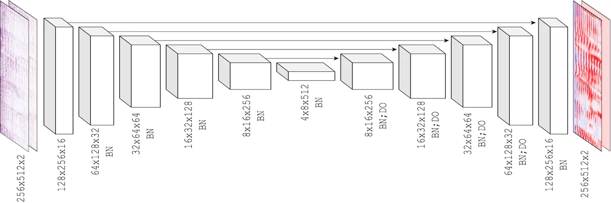
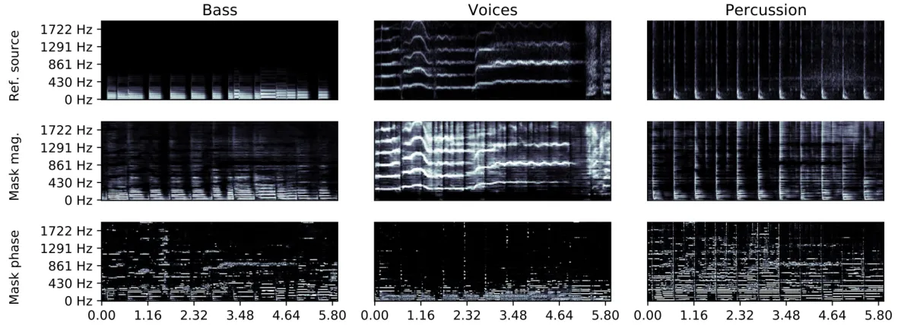
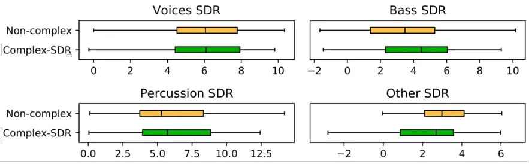

# Learned Complex Masks for Multi-Instrument Source Separation

Andreas Jansson    Rachel M. Bittner    Nicola Montecchio    Tillman
Weyde

###### Abstract

Music source separation in the time-frequency domain is commonly
achieved by applying a soft or binary mask to the magnitude component of
(complex) spectrograms. The phase component is usually not estimated,
but instead copied from the mixture and applied to the magnitudes of the
estimated isolated sources. While this method has several practical
advantages, it imposes an upper bound on the performance of the system,
where the estimated isolated sources inherently exhibit audible “phase
artifacts”. In this paper we address these shortcomings by directly
estimating masks in the complex domain, extending recent work from the
speech enhancement literature. The method is particularly well suited
for multi-instrument musical source separation since residual phase
artifacts are more pronounced for spectrally overlapping instrument
sources, a common scenario in music. We show that complex masks result
in better separation than masks that operate solely on the magnitude
component.

###### Index Terms: 

source separation, music, complex mask

^(†)^(†)address: ¹ Spotify, ² City University of London

## 1 Introduction

Musical audio mixtures can be modeled as a sum of individual sources,
and musical audio source separation aims to estimate these individual
sources given the mixture. A common way to frame this problem is to
separate a music recording into percussion, bass, guitar, voice, and
“other” signals. _Spectral masking_ is a common technique used in this
context: a “mask” of the signal’s spectrogram is estimated, whose aim is
to selectively “let through” only the components of the input signal
corresponding to the particular source \[1\].

Typically, masks (both binary and soft) are only applied to the
magnitude component of the input (complex) spectrogram, and the phase
from the mixture is reused for each of the sources. This results in
significant phase artifacts: sources that overlap in time and frequency
with the target source leave audible traces in the masked signal. This
effect is more pronounced the greater the spectral overlap between
sources is, and is especially problematic in the music domain: due to
the very nature of music, musical instruments and voices are often
synchronous in time by following a shared meter (unlike speech), and
their spectral components tend to occupy the same frequency ranges.

In this paper we present an approach that uses _complex-valued_ masks as
a drop-in replacement for magnitude-domain masks.



Figure 1: Architecture diagram of the proposed model.

## 2 Related Work

Neural network-based approaches have been applied to the problem of
audio source separation for over a decade. For a review of such
techniques in the speech domain, see \[2\].

In the music domain, the majority of Neural network-based models
operates on time-frequency representations (spectrograms) of both the
input and output signals; usually separation is achieved using masks in
the magnitude domain. Different network architectures – both
convolutional \[3, 4\] and recurrent \[5\] – have been used to separate
vocals from accompaniment, as well as for multi-instrument separation.
Skip connections, introduced in \[6\], have emerged as a common feature
of source separation networks, because of their ability to carry
fine-grained details from the input mixture representation to the layers
closer to the final output representation.as it makes the training
procedure more efficient. The U-Net \[7\] is a relatively simple
application of skip connections: an hourglass-shaped convolutional
encoder-decoder pair is augmented with connections between earlier
layers of the encoder to later layers in the decoder. U-Nets have been
applied to musical source separation in \[4, 8\].

A number of recent systems propose alternative models that avoid dealing
with phase information altogether, by operating directly in the time
domain: in \[9\], the authors construct a non-causal WaveNet \[10\] for
speech enhancement entirely in the time domain; Wave-U-Net \[11\] is an
extension of WaveNet that adds skip connections in the time domain,
analogous to the U-Net in the frequency domain.

Other approaches attempt to explicitly make use of phase in the
time-frequency domain: in \[12\] incorporating phase information in the
mask function results in more accurate source estimation, even though
the mask itself is real-valued. Predicting phase directly appears to be
intractable \[13\], presumably because of the lack of inherent structure
due to the wrap-around nature of phase; proposed solutions make use of
_phase unwrapping_ \[14, 15\] or discretization of phase \[16\].

In the speech domain, the complex Ideal Ratio Mask (cIRM) was introduced
in \[13\] as the real and imaginary ratios between complex source and
mixture spectrograms. The Phase-U-Net \[17\] estimates complex masks,
either using a real-valued internal representation or introducing the
complex-valued equivalent of the traditional neural network building
blocks such as matrix multiplication and convolution; the paper also
deals with masking using a complex representation based on polar
coordinates, and constraining the magnitude component.

Typically, methods based on a time-frequency representation are trained
using a loss function which measures the distance (in L1 or L2 norm)
between a target spectrogram (coming from an individually-recorded
instrument, subsequently mixed to create the input signal) and the input
spectrogram after the application of the predicted mask. More
sophisticated designs allow a more direct optimization of evaluation
measures, such as source-to-distortion ratio (SDR) \[18, 17\].

## 3 Model

### 3.1 Datasets

The proposed model is trained on a dataset of about 2000
professional-quality recordings. For each recording, five _stems_ are
available, grouped by instrument: “Vocals”, “Guitar”, “Bass”,
“Percussion”, and “Other”. Each recording is, by design, the
(unweighted) sum of its five stems.

To increase the size of the training set, a series of augmentation steps
is performed on the stems. The augmentations include global, track-level
changes – such as a time stretching, pitch shifting, or resampling –
applied across all stems, and individual, stem-level changes, such as
volume adjustments, equalization/filtering, effects such as phasers and
flangers, and reverb. For each example in the training set, 10 random
augmentations are generated.

For validation and testing, the MUSDB 2018 dataset \[19\] is used. MUSDB
contains only 4 instrument types, namely “Vocals”, “Bass”, “Percussion”,
and “Other”. When running validation and test results, we group our
model’s outputs for “Guitar” into the “Other” category.

### 3.2 Architecture

The proposed model extends the U-Net source separation model detailed in
\[4\], which in turn extends \[20\]; pictured in Figure 1, it consists
of 6 downsampling “encoder” layers, 6 upsampling “decoder” layers, and
skip connections between corresponding encoder and decoder layers. The
network operates on spectrograms extracted from 22050 Hz mono audio
signals, with overlapping windows of size 1024, and hop size 256. Each
encoder layer comprises a strided convolution (with kernel size
$`5\times 5`$ and stride $`2\times 2`$) followed by batch normalization
(except in the first layer), and a leaky ReLU activation function. In
the decoder, each layer consists of a strided transpose convolution
(with kernel size $`5\times 5`$ and stride $`2\times 2`$, as in the
encoder); batch normalization is applied to all decoder layers except
the last, as well as 50% dropout in the first five layers, and a ReLU
activation function in all layers except the last.

### 3.3 Input and Output Representation

For multi-source separation, independent models are trained for vocals,
drums, guitar, and bass. The “Other” source is estimated as the residual
difference between mixture and the sum of the four estimated sources.
Each source-specific network is presented with mixture spectrograms,
which during training are sliced into patches of 256 frames, and fed in
batches of 16 patches. This is not necessary during inference, since the
network is fully convolutional and can be applied to the spectrogram of
the full length of the signal.

The network is trained to output a mask that is then applied to the
mixture spectrogram to produce the source spectrogram estimate. We
evaluate two variations of this architecture: non-complex, where the
input is a single mono channel representing the magnitude of the mixture
spectrogram; and complex, where the input is the complex spectrogram,
represented as independent real and imaginary channels. In the
non-complex case, the mask is only applied to the magnitude component of
the mixture, whereas in the complex case the mask is applied in the
complex domain. After mask application, we synthesize the estimated
source signal by means of the Inverse Short-Time Fourier Transform
(ISTFT).

It should be noted that in the complex case, although the input and
output representations are both complex, the network itself is
internally real-valued.

### 3.4 Masking

In the remainder of this section, $`\mathbf{O}^{\mathbb{C}}`$ and
$`\mathbf{O}^{\mathbb{R}}`$ denotes the outputs by the complex and
non-complex networks; $`\mathbf{M}^{\mathbb{C}}`$ and
$`\mathbf{M}^{\mathbb{R}}`$ denotes complex and non-complex masks;
$`\mathbf{X}`$ denotes the spectrogram of the input mixture to be
separated by the model; for individual stems (individual instruments or
voice), $`\mathbf{Y}`$ and $`\hat{\mathbf{Y}}`$ denote the spectrograms
of the recorded and estimated stems, respectively, while $`\mathbf{y}`$
and $`\hat{\mathbf{y}}`$ denote their time-domain equivalents.

#### 3.4.1 Non-complex masking

The non-complex mask is computed as
$`\mathbf{M}^{\mathbb{R}}=\sigma\left(\mathbf{O}^{\mathbb{R}}\right)`$
where $`\sigma`$ is the sigmoid function, constraining the (real-valued)
network output to the $`(0,1)`$ range. It is multiplied element-wise
(denoted by $`\otimes`$) with the mixture spectrogram magnitude to
obtain the estimated source spectrogram magnitude. The phase is copied
from the mixture spectrogram into the spectrogram of the estimated stem,
unaltered.

```math
\hat{\mathbf{Y}}=\mathbf{M}^{\mathbb{R}}\otimes\lvert\mathbf{X}\rvert\otimes e^{i\angle\mathbf{X}} \tag{1}
```



Figure 2: Magnitude and phase of learned complex masks (Complex-SDR) for
Bass, Voices, and Percussion on a test example from MUSDB18, and the
reference STFTs for each source. Top Row: Magnitude (dB) of the ideal
STFTs. Middle Row: Magnitude of the learned complex masks. Bottom Row:
Absolute value of the phase of the learned complex masks.

#### 3.4.2 Complex masking

In the complex case we estimate a complex-domain mask as in \[17\],
constrained in magnitude but not in phase:

```math
\displaystyle|\mathbf{M}^{\mathbb{C}}| \displaystyle=\tanh(|\mathbf{O}^{\mathbb{C}}|) \tag{2}
```

```math
\displaystyle\angle\mathbf{M}^{\mathbb{C}} \displaystyle=\mathbf{O}^{\mathbb{C}}\oslash|\mathbf{O}^{\mathbb{C}}| \tag{3}
```

where $`\oslash`$ denotes element-wise division. The complex mask is
then applied element-wise, as:

```math
\hat{\mathbf{Y}}=\lvert\mathbf{M}^{\mathbb{C}}\lvert\otimes\lvert\mathbf{X}\rvert\otimes e^{i(\angle\mathbf{M}^{\mathbb{C}}+\angle\mathbf{X})} \tag{4}
```

The mask applied determines a magnitude rescaling of the mixture STFT
and a rotation (addition) in phase. This allows the model not only to
remove interfering frequency bins, but also to cancel the phase from
other sources.

### 3.5 Loss

We evaluate three different loss functions: _Magnitude loss_, _SDR
loss_, and the combination _SDR + Magnitude loss_.

The _Magnitude loss_ is optimized by minimizing the L1 distance between
the spectrogram magnitudes of the estimated and target components:

```math
\mathcal{L}_{\textrm{Mag}}=\lvert\mathbf{Y}-\hat{\mathbf{Y}}\rvert_{1} \tag{5}
```

The time-domain _SDR loss_ \[17\] is defined as:

```math
\mathcal{L}_{\textrm{SDR}}=-\frac{\mathbf{y}\cdot\hat{\mathbf{y}}}{\|\mathbf{y}\rVert\|\hat{\mathbf{y}}\rVert} \tag{6}
```

which smoothly upper bounds the SDR metric we are interested in
optimizing.

The hybrid time-domain and frequency-domain _SDR + Magnitude loss_ is
defined as:

```math
\mathcal{L}_{\textrm{SDR+Mag}}=\mathcal{L}_{\textrm{SDR}}+\mathcal{L}_{\textrm{Mag}} \tag{7}
```

## 4 Results

Two configurations of the system (“Non-complex”, “Complex-SDR”) are
evaluated on the MUSDB 18 dataset, using the museval toolkit \[21\];
results are shown in Figure 3.

There are slight differences between the results of the different models
when considering different metrics, however the complex model achieves
higher Signal to Distortion Ratio (commonly considered the most
important metric) than the non-complex model for most sources. Although
these results do not compare favorably to State-of-the-Art approaches,
such as those reported in the yearly SiSEC evaluation campaign \[21\],
they do yield insights into the design of such systems, by providing a
unified comparison not only in terms of dataset, but also through the
use of a single model in which individual aspects (masking, loss
function) are controlled.



Figure 3: Signal to Distortion Ratio across experiments.

We also collected subjective judgments from a number of individuals,
using a methodology similar to that of \[22\]. A questionnaire was
prepared, in which subjects were prompted to compare audio recordings in
pairs, each pair presenting the outputs of two different model
configurations applied the same short audio excerpt. As a reference,
evaluators were given both the original mixture and the target single
source signal.

Two questions were asked per pair of audio excerpts: “Quality: Which one
has better sound quality?”, and “Separation: Which one has better
isolation from the other instruments in the original mix?”. We collected
210 judgements from 8 individuals trained in audio engineering.

We found that in 58% of the “Separation” questions, SDR loss was
preferred to non-complex loss. The effect was stronger for the “Quality”
question, where 65% of judgments preferred SDR loss. The preference for
SDR loss was most pronounced on bass, followed by percussion and vocals.

### 4.1 Qualitative Analysis

A website with audio examples of the complex and non-complex masks can
be found online ¹¹ 1 http://bit.ly/lcmmiss. The biggest audible
difference between the audio output by the complex masking model and the
non-complex masking model is the amount of phase distortion, in
particular for bass and percussion. When using real masks, both bass and
percussion tend to sound very tinny, and the phase of other sources is
often captured in the sound of the reconstructed source, such as hearing
faint voices in a percussion signal. The predicted vocals sound similar
in both models, and the overall quality is rather good.

### 4.2 Analysis of learned masks

Figure 2 displays the learned masks from the Complex-SDR model on a
recording, and the STFTs of the clean reference sources; the middle and
bottom rows show the magnitude and (absolute) phase of the learned masks
respectively. As expected, the magnitude of the learned masks looks like
that of a typical soft mask, where the time frequency bins of the target
source have values close to 1 and other bins have values close to 0. For
bass, harmonic patterns with few transients in the low frequency range
are noticeable; for voice, harmonic patterns tend to inhabit a higher
frequency range and exhibit stronger transients, e.g., at the starts of
words; percussion exhibits more regular transients.

The phase of the mask determines how much the phase of the mixture
should be rotated: higher values indicate places where the phase of the
mixture is substantially different from the phase of the source (e.g.,
because it overlaps with another source). In this example, we see that
for percussion there are large phase corrections being made for
horizontal patterns, likely canceling the phase from harmonic sources in
the mixture. Additionally, the phase is corrected the instant before an
onset, which makes the onset sound more crisp than if it were smeared
with phase from other sources. For the vocal signal, most of the phase
corrections are made where the bass and percussion masks are active,
indicating that the phase of the bass and percussion is being canceled
out for the vocal mask. Close inspection of the phase of the bass mask
reveals that lower frequency bands that have large values from the mask
and for the phase are interleaved, implying that the phase of closely
overlapping low frequency sources is being canceled.

## 5 Conclusions

The use of complex masks for multi-instrument source separation is
explored using a U-Net architecture. It was found that learned complex
masks perform better than non-complex masks perceptually, and marginally
better in terms of SDR. Analysis of the learned masks highlights a
particularly strong effect on percussion and bass. As a result, the
constrained complex mask is a practical, low effort, drop-in replacement
for common magnitude-domain masks.

## References

- \[1\] DeLiang Wang, “On ideal binary mask as the computational goal of
  auditory scene analysis,” in Speech separation by humans and machines,
  pp. 181–197. Springer, 2005.
- \[2\] DeLiang Wang and Jitong Chen, “Supervised speech separation
  based on deep learning: An overview,” IEEE/ACM Trans. Audio, Speech &
  Language Processing, vol. 26, no. 10, pp. 1702–1726, 2018.
- \[3\] Andrew JR Simpson, Gerard Roma, and Mark D Plumbley, “Deep
  karaoke: Extracting vocals from musical mixtures using a convolutional
  deep neural network,” in Latent Variable Analysis and Signal
  Separation, Emmanuel Vincent, Arie Yeredor, Zbyněk Koldovský, and Petr
  Tichavský, Eds. 8 2015, Lecture Notes in Computer Science, pp.
  429–436, Springer, Cham.
- \[4\] A Jansson, E Humphrey, N Montecchio, R Bittner, A Kumar, and
  T Weyde, “Singing voice separation with deep u-net convolutional
  networks,” in 18th International Society for Music Information
  Retrieval Conference, 2017, pp. 23–27.
- \[5\] Po-Sen Huang, Minje Kim, Mark Hasegawa-Johnson, and Paris
  Smaragdis, “Deep learning for monaural speech separation.,” in ICASSP.
  2014, pp. 1562–1566, IEEE.
- \[6\] Kaiming He, Xiangyu Zhang, Shaoqing Ren, and Jian Sun, “Deep
  residual learning for image recognition,” in Proceedings of the IEEE
  conference on computer vision and pattern recognition, 2016, pp.
  770–778.
- \[7\] Olaf Ronneberger, Philipp Fischer, and Thomas Brox, “U-net:
  Convolutional networks for biomedical image segmentation,” in
  International Conference on Medical image computing and
  computer-assisted intervention. Springer, 2015, pp. 234–241.
- \[8\] Sungheon Park, Taehoon Kim, Kyogu Lee, and Nojun Kwak, “Music
  source separation using stacked hourglass networks.,” in ISMIR, Emilia
  Gómez, Xiao Hu, Eric Humphrey, and Emmanouil Benetos, Eds., 2018, pp.
  289–296.
- \[9\] Dario Rethage, Jordi Pons, and Xavier Serra, “A wavenet for
  speech denoising.,” in ICASSP. 2018, pp. 5069–5073, IEEE.
- \[10\] Aaron van den Oord, Sander Dieleman, Heiga Zen, Karen Simonyan,
  Oriol Vinyals, Alex Graves, Nal Kalchbrenner, Andrew Senior, and Koray
  Kavukcuoglu, “Wavenet: A generative model for raw audio,” 2016, cite
  arxiv:1609.03499.
- \[11\] Daniel Stoller, Sebastian Ewert, and Simon Dixon, “Wave-u-net:
  A multi-scale neural network for end-to-end audio source separation,”
  arXiv preprint arXiv:1806.03185, 2018.
- \[12\] Hakan Erdogan, John R. Hershey, Shinji Watanabe, and
  Jonathan Le Roux, “Phase-sensitive and recognition-boosted speech
  separation using deep recurrent neural networks.,” in ICASSP. 2015,
  pp. 708–712, IEEE.
- \[13\] Donald S. Williamson, Yuxuan Wang, and DeLiang Wang, “Complex
  ratio masking for monaural speech separation.,” IEEE/ACM Trans. Audio,
  Speech & Language Processing, vol. 24, no. 3, pp. 483–492, 2016.
- \[14\] Florian Mayer, Donald S Williamson, Pejman Mowlaee, and DeLiang
  Wang, “Impact of phase estimation on single-channel speech separation
  based on time-frequency masking,” The Journal of the Acoustical
  Society of America, vol. 141, no. 6, pp. 4668–4679, 2017.
- \[15\] G. E. Spoorthi, Subrahmanyam Gorthi, and Rama Krishna
  Sai Subrahmanyam Gorthi, “Phasenet: A deep convolutional neural
  network for two-dimensional phase unwrapping.,” IEEE Signal Process.
  Lett., vol. 26, no. 1, pp. 54–58, 2019.
- \[16\] Naoya Takahashi and Yuki Mitsufuji, “Multi-scale multi-band
  densenets for audio source separation.,” CoRR, vol.
  abs/1706.09588, 2017.
- \[17\] Hyeong-Seok Choi, Jang-Hyun Kim, Jaesung Huh, Adrian Kim,
  Jung-Woo Ha, and Kyogu Lee, “Phase-aware speech enhancement with deep
  complex u-net.,” CoRR, vol. abs/1903.03107, 2019.
- \[18\] Shrikant Venkataramani, Jonah Casebeer, and Paris Smaragdis,
  “End-to-end source separation with adaptive front-ends,” in 2018 52nd
  Asilomar Conference on Signals, Systems, and Computers. IEEE, 2018,
  pp. 684–688.
- \[19\] Fabian-Robert Stöter, Antoine Liutkus, and Nobutaka Ito, “The
  2018 signal separation evaluation campaign,” in International
  Conference on Latent Variable Analysis and Signal Separation.
  Springer, 2018, pp. 293–305.
- \[20\] Phillip Isola, Jun-Yan Zhu, Tinghui Zhou, and Alexei A. Efros,
  “Image-to-image translation with conditional adversarial networks,”
  2017 IEEE Conference on Computer Vision and Pattern Recognition
  (CVPR), Jul 2017.
- \[21\] Fabian-Robert Stöter, Antoine Liutkus, and Nobutaka Ito, “The
  2018 signal separation evaluation campaign,” in Latent Variable
  Analysis and Signal Separation: 14th International Conference, LVA/ICA
  2018, Surrey, UK, 2018, pp. 293–305.
- \[22\] Mark Cartwright, Bryan Pardo, and Gautham J Mysore,
  “Crowdsourced pairwise-comparison for source separation evaluation,”
  in 2018 IEEE International Conference on Acoustics, Speech and Signal
  Processing (ICASSP). IEEE, 2018, pp. 606–610.
