# Blind Speech Separation and Dereverberation using Neural Beamforming

Lukas Pfeifenberger    Franz Pernkopf ^(†)^(†)thanks:
Lukas˜Pfeifenberger and Franz Pernkopf are with the Intelligent Systems
Group at the Signal Processing and Speech Communication Laboratory, Graz
University of Technology, Graz, Austria.^(†)^(†)thanks: This work was
supported by the Austrian Science Fund (FWF) under the project number
P27803-N15. Furthermore, we acknowledge NVIDIA for providing GPU
computing resources.

###### Abstract

In this paper, we present the _Blind Speech Separation and
Dereverberation_ (BSSD) network, which performs simultaneous _speaker
separation_, _dereverberation_ and _speaker identification_ in a single
neural network. Speaker separation is guided by a set of predefined
spatial cues. Dereverberation is performed by using neural beamforming,
and speaker identification is aided by embedding vectors and triplet
mining. We introduce a _frequency-domain_ model which uses
complex-valued neural networks, and a _time-domain_ variant which
performs beamforming in latent space. Further, we propose a
_block-online_ mode to process longer audio recordings, as they occur in
meeting scenarios. We evaluate our system in terms of _Scale Independent
Signal to Distortion Ratio_ (SI-SDR), _Word Error Rate_ (WER) and _Equal
Error Rate_ (EER).

###### Index Terms: 

Multi-channel speech separation, beamforming, dereverberation, speaker
identification, triplet mining

## I Introduction

Speaker separation and speech enhancement is of paramount significance
in many voice applications, such as hands-free teleconferencing or
meeting scenarios. Especially in human-machine interfaces, where
high-performance Automatic Speech Recognition (ASR) systems are
essential, both speech intelligibility and quality play an important
role. Fueled by the success of deep learning, both speaker separation
and speech enhancement have made major advances over the last years
\[1\].

When multiple microphones are available, spatial information can be
exploited as speaker sources are directional. Mask-based beamforming has
been shown to be advantageous for this task \[2, 3\]. In particular, a
neural network is leveraged to estimate a time-frequency mask of the
desired signal \[4, 5, 6, 7\]. This mask is then used to compute the
spatial covariance matrices required to construct a frequency-domain
beamformer \[8\]. This approach has been further extended into the
domain of complex numbers, where complex-valued neural networks \[9\]
are used to directly estimate complex beamforming weights from noisy
observations \[10, 11\].

Simultaneously to the success of neural beamforming, single-channel
speaker separation techniques have also progressed dramatically.
Frequency-domain algorithms such as _Deep Clustering_ (DC) \[12\],
_Permutation Invariant Training_ (PIT) \[13\] and _Deep Attractor
Network_ (DAN) \[14\] rely solely on spectral features. Time-domain
algorithms such as _Wave-U-Net_ \[15\], _TasNet_ \[16\] and
_Conv-TasNet_ \[17\] delivered promising results.

Recently, some of these single-channel algorithms have been combined
with a mask-based beamformer. In particular, a neural network estimates
a gain mask of the desired signal, which is then used to construct a
frequency-domain beamformer, i.e.: _Beam-TasNet_ \[18\], _SpeakerBeam_
\[19, 20\], _Neural Speech Separation_ \[21\], _Multi-Channel Deep
Clustering_ \[22, 23\], and _Convolutional Beamforming_ \[24\]. More
recently, end-to-end multi-channel speech separation has been done
entirely in time domain. By leveraging spatial cues among the
multi-channel signals such as the Inter-channel Time Difference (ITD) or
Inter-channel Phase Difference (IPD), the desired signal is estimated
directly in time domain \[25\]. We further extend this approach by
addressing the following three issues:

### I-A Open number of sources

Many source separation algorithms are limited to a pre-defined number of
sources which they can separate \[13, 14, 16, 17, 15, 18, 26, 27\].
Exceptions are k-means clustering \[12\] and _Recurrent Selective
Attention Network_ (RSAN) \[28\]. We propose an iterative approach to
separate an unknown number of sources, by leveraging the spatial
information encoded within the data. As shown in the experiments
section, we tested our system with up to four overlapping speakers.

### I-B Distant speaker separation

While close-talk speech separation models yield impressive performance,
far-field speech separation is still a challenging task \[29, 30\].
Especially in real-world scenarios, reverberation and echoes cannot be
ignored, as they severely degrade speech intelligibility and ASR
performance \[31\]. Various deep learning based methods have been
proposed for dereverberation \[32, 33, 34\], most of which are based on
the Weighted Prediction Error (WPE) algorithm \[35\]. As this algorithm
is restricted to the frequency domain, we chose a more general approach
which learns to separate overlapping speakers from a reverberated
mixture in both time- and frequency-domain.

### I-C Speaker Identification

To be useful in real-world applications, a speaker separation algorithm
has to be at least _block-online_ capable, i.e.; a short block of audio
is processed at a time. This implies a permutation problem at block
level, requiring _speaker diarization_ \[36, 37\]. Therefore,
identifying the separated speakers in each block of audio is necessary.
A speaker identification algorithm is agnostic to the spoken text, and
only relies on the speaker characteristics embedded in the waveform.
Embedding vectors are used to map utterances into a feature space where
distances correspond to speaker similarity \[38\]. Typically, i-Vectors
\[39\] or x-Vectors \[40\] are used for this task. Algorithms such as
_Deep Speaker_ \[41\] rely on contrastive loss or triplet loss to learn
embeddings on a very large set of speakers \[42, 43, 44, 45\]. We chose
the triplet loss as its performance on small batch sizes is advantageous
\[46\].

In this paper, we introduce our _Blind Speech Separation and
Dereverberation_ (BSSD) network, which performs _separation_,
_dereverberation_ and _speaker identification_ in a single neural
network. The only knowledge required is that of the microphone array
geometry. We propose a frequency-domain variant (BSSD-FD), and
time-domain variant (BSSD-TD). Our contributions are: Unsupervised
speaker localization; separation of each speaker using adaptive
beamforming; dereverberation of each source; and speaker diarization
using embedding vectors. We evaluate our system in both _offline_ and
_block-online_ mode. Further, we report the performance in terms of
SI-SDR, WER and EER against similar state-of-the art algorithms for
speaker separation.

## II System Model

We assume a standard meeting scenario, where multiple speakers may talk
simultaneously in an arbitrary room, i.e. an office. The position and
number $`C`$ of the concurrent speakers is unknown. We place a circular
microphone array with $`M`$ microphones in the center of the room, i.e.
on a table. Figure 1 provides an example with three speakers. We assume
that each speaker has a direct line of sight to the microphone array,
i.e. the speaker is not obscured by a corner, or standing in the next
room. Each speaker is assumed to be stationary, except for minor
movements. Further, the room may have a significant amount of
reverberation. Note that we do not assume any diffuse or directional
noise sources in this paper. For speech separation in the presence of
ambient noise, we refer the interested reader to \[7\].

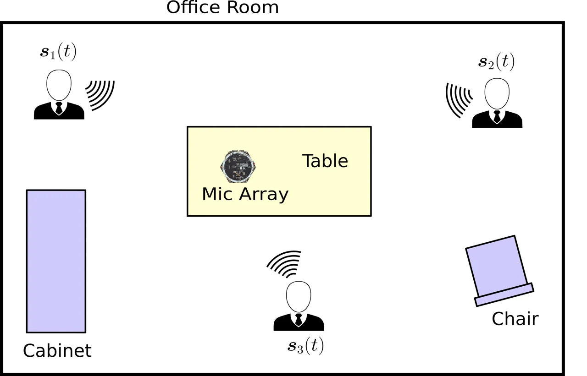

Fig. 1: Meeting room scenario with three independent speakers.

The signal arriving at the microphone array is composed of an additive
mixture of $`C`$ independent sound sources $`\bm{s}_{c}(t)`$. In time
domain, the samples of all $`M`$ microphones at sampling time $`t`$ can
be stacked into a single $`M\times 1`$ vector, i.e.

```math
\bm{z}(t)=\sum_{c=1}^{C}\bm{s}_{c}(t), \tag{1}
```

where $`\bm{z}(t)=\big[z(t,1),\ldots,z(t,M)\big]^{T}`$. We use bold
symbols for vectors, i.e. $`\bm{z}(t)`$, and plain symbols for scalars,
i.e. $`z(t,m)`$. The vector $`\bm{s}_{c}(t)`$ represents the $`c^{th}`$
sound source at sample time $`t`$. Each sound source is composed of a
monaural recording $`s_{c}(t)`$ convolved with a _Room Impulse Response_
(RIR) denoted by $`\bm{h}_{c}(t)`$, i.e.

```math
\bm{s}_{c}(t)=\bm{h}_{c}(t)\circledast s_{c}(t), \tag{2}
```

where $`\circledast`$ denotes the convolution operator. The RIR models
the acoustic path from a sound source to each microphone as a set of
$`M`$ FIR filters, which includes all reverberations and reflections
caused by the room acoustics \[47\]. Modern office rooms are made of
laminate flooring and concrete walls, which have a low acoustic
absorption coefficient. Consequently, the reverberation time $`RT_{60}`$
may be very large, which significantly affects the performance of speech
separation and speech recognition algorithms \[29, 30, 31\].

To cope with this environment, we propose the BSSD network, which
iteratively extracts an unknown number of speakers from a multi-channel
input mixture $`\bm{z}(t)`$. During each iteration, the Direction Of
Arrival (DOA) of the loudest speech source is estimated by a
_localization_ module, which correlates the input mixture against a
pre-defined set of DOA bases. The DOA is subtracted from a spatial
speech presence probability map, so that the second-loudest source is
extracted during the subsequent iteration. The DOA information is then
fed into a Neural Network (NN), which extracts and dereverberates the
corresponding speech source. The network also predicts a speaker
embedding vector for each extracted speech source, which is used to
assign the utterance to a speaker for block-online processing. This
iterative process is repeated until no new speaker embedding is found.
Figure 2 illustrates two iterations of the BSSD network, which consists
of the following modules: _DOA bases_, _localization_, _beamforming and
dereverberation_, and _speaker identification_. In the following
chapters, we will introduce each module in detail.

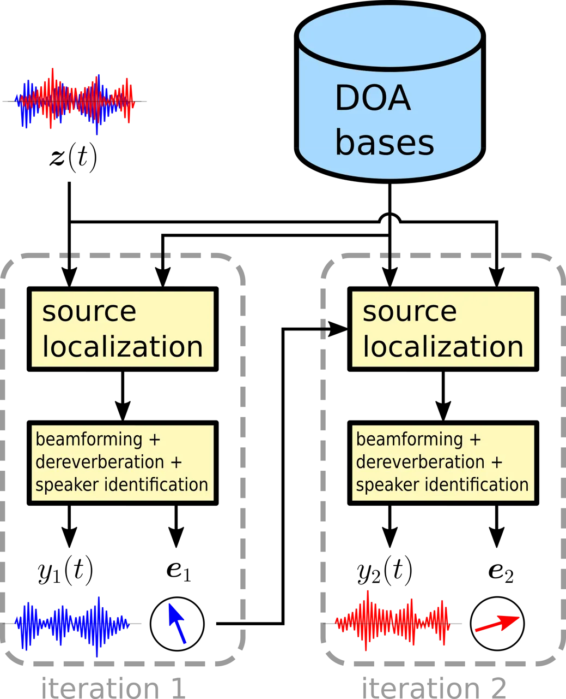

Fig. 2: Overview of the BSSD system, showing two iterations. During each
iteration, the _localization_ module estimates the DOA of a source from
a set of pre-defined DOA bases. The DOA is then used to extract and
dereverberate the corresponding speech source from the multi-channel
input mixture $`\bm{z}(t)`$. The neural network also assigns a speaker
embedding vector $`\bm{e}_{i}`$ to each enhanced source $`i`$.

## III DOA Bases

As each source in Figure 1 has a direct line of sight towards the
microphone array, it is possible to assign a unique DOA to each
individual source in the mixture. Even if there is a significant amount
of reverberation, there will always be an anechoic component in the RIR
(i.e. the earliest peak) that corresponds to the DOA \[47\]. We
therefore define a set of $`D`$ unique DOA vectors on a unit sphere
around the microphone array, where each impinging sound wave is modeled
as plane wave, i.e.

```math
V(d,k,m)=\text{e}^{-i2\pi f_{k}\tau_{d,m}}, \tag{3}
```

where $`f_{k}`$ is the frequency for index $`k`$ and $`\tau_{d,m}`$ is
the time delay from a point on the sphere to the $`m`$^(th) microphone,
i.e.

```math
\tau_{d,m}=\frac{\sqrt{(x_{m}-x_{d})^{2}+(y_{m}-y_{d})^{2}+(z_{m}-z_{d})^{2}}}{c}, \tag{4}
```

where $`c`$ is the speed of sound. The cartesian coordinates of the
$`m`$^(th) microphone are denoted by $`x_{m},y_{m},z_{m}`$, and
$`x_{d},y_{d},z_{d}`$ are the coordinates of the $`d`$^(th) point on the
sphere. We define these points to be equally distributed on the surface
of the sphere using a fibonacci spiral \[48\], i.e.

```math
\displaystyle\phi_{d} \displaystyle=g\cdot d, \tag{5}
```

```math
\displaystyle\theta_{d} \displaystyle=\arcsin{\frac{d}{D-1}},
```

```math
\displaystyle x_{d} \displaystyle=\cos{\theta_{d}}\cos{\phi_{d}},
```

```math
\displaystyle y_{d} \displaystyle=\cos{\theta_{d}}\sin{\phi_{d}},
```

```math
\displaystyle z_{d} \displaystyle=\sin{\theta_{d}},
```

where $`g=\pi(3-\sqrt{5})`$ is known as the golden angle \[48\], and
$`d=1\ldots D`$ is the DOA index. We use a circular microphone array
with $`M`$ channels. Hence, the array is flat and we cannot distinguish
between positive and negative $`z`$ coordinates. It is therefore
sufficient to only use half a sphere for the DOA bases. To assign a DOA
index $`\hat{d}`$ to a given RIR $`\bm{h}(t)`$, we utilize GCC-PHAT
\[49\], i.e.

```math
\hat{d}=\underset{d}{\text{argmax}}\sum_{k=1}^{K}\frac{|\bm{H}^{H}(k)\cdot\bm{V}(d,k)|^{2}}{|\bm{H}(k)|_{2}^{2}}, \tag{6}
```

where $`\bm{H}`$ represents the FFT of the RIR $`\bm{h}(t)`$. Note that
the amplitude of the DOA vector $`\bm{V}(d,k)`$ is defined as $`1`$ in
Eq. (3).

## IV Source Localization

To estimate the direction of a speech source relative to the microphone
array, we again use GCC-PHAT to obtain a spatial speech presence
probability map for the input mixture $`\bm{z}(t)`$ and the DOAs
$`\bm{V}(d,k)`$. First, we transform the input mixture to the frequency
domain using the Short-Time Fourier Transform (STFT), i.e.

```math
\bm{z}(t)\rightarrow\bm{Z}(l,k), \tag{7}
```

where $`\bm{Z}(l,k)`$ contains $`M`$ samples of frequency bin $`k`$ and
STFT frame index $`l`$. Next, we compute the spatial speech presence
probability map $`\gamma\in[0\ldots 1]`$ as:

```math
\gamma(l,k,d)=\frac{|\bm{Z}^{H}(l,k)\cdot\bm{V}(d,k)|^{2}}{|\bm{Z}(l,k)|_{2}^{2}}. \tag{8}
```

### IV-A Spatial Whitening

To separate speakers based on their location, Eq. (8) utilizes the IPDs,
which are encoded in the phase of the complex-valued input mixture
$`\bm{Z}(l,k)`$. However, it is well known that microphone array
recordings are strongly correlated towards low frequencies \[49, 8, 50,
51\]. This is due to the fact that the wavelength of low frequencies is
large compared to the aperture of the microphone array. As a
consequence, the IPDs will be small, and the overall separation
performance is degraded. To mitigate this effect, we decorrelate the
noisy inputs $`\bm{Z}(l,k)`$ using _Zero-phase Component Analysis_ (ZCA)
whitening \[52\] from our previous works \[10, 7\]. In particular, we
use the whitening matrix

```math
\bm{U}(k)=\bm{E}_{\Gamma}(k)\bm{D}_{\Gamma}^{-\frac{1}{2}}(k)\bm{E}_{\Gamma}^{H}(k), \tag{9}
```

where $`\bm{E}_{\Gamma}`$ and $`\bm{D}_{\Gamma}`$ are $`M\times M`$
sized eigenvector and eigenvalue matrices of the real-valued spatial
coherence matrix of the ideal isotropic sound field $`\bm{\Gamma}(k)`$
\[47\]. Its elements are given as
$`\Gamma_{i,j}(k)=\frac{sin(2\pi f_{k}x_{i,j}/c)}{2\pi f_{k}x_{i,j}/c}`$,
and $`x_{i,j}`$ is the distance between the $`i^{th}`$ and the
$`j^{th}`$ microphone. To avoid a division by zero, the diagonal
elements of $`\bm{D}_{\Gamma}`$ are loaded with a small constant
$`\epsilon=10^{-3}`$. We prefer ZCA whitening over PCA whitening, as the
ZCA preserves the orientation of the distribution of the data \[52\].
Using the whitening matrix $`\bm{U}(k)`$, we rewrite Eq. (8) as

```math
\gamma_{U}(l,k,d)=\frac{|\bm{Z}^{H}(l,k)\bm{U}^{H}(k)\cdot\bm{U}(k)\bm{V}(d,k)|^{2}}{|\bm{U}(k)\bm{Z}(l,k)|_{2}^{2}\cdot|\bm{U}(k)\bm{V}(d,k)|_{2}^{2}}, \tag{10}
```

where $`\bm{U}(k)\bm{Z}(l,k)`$ can be recognized as the whitened input
mixture, and $`\bm{U}(k)\bm{V}(d,k)`$ as whitened DOA vector. Figure 3
demonstrates the effect of spatial whitening. Panel (a) shows
$`\gamma(l,k)`$ for a single speaker and a matching DOA vector. Panel
(b) shows $`\gamma_{U}(l,k)`$ with whitening. It can be seen that the
separation performance is greatly increased for low frequencies.

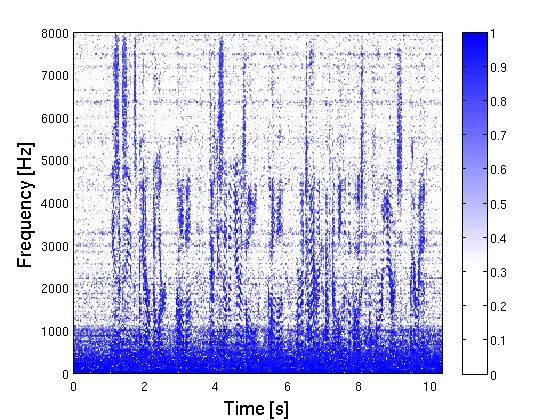

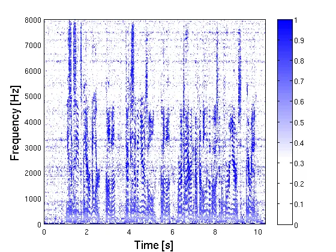

Fig. 3: Effectiveness of spatial whitening at low frequencies. (a)
$`\gamma(l,k)`$ from Eq. (8) for a single speaker. (b)
$`\gamma_{U}(l,k)`$ from Eq. (10) with whitening.

### IV-B Speaker Separation and Diarization

To iteratively estimate the DOA index $`\hat{d}`$ of all speech sources
in the mixture $`\bm{Z}(l,k)`$, we use the pseudo code in Algorithm 1.
First, we create a weighted spatial speech presence probability map
$`\gamma_{W}(l,k,d)`$, using the energy $`P_{Z}(l,k)`$ in each
time-frequency bin of the input mixture $`\bm{Z}(l,k)`$. Next, we copy
that map into $`\gamma_{W}^{\prime}(l,k,d)`$. Then, we initialize an
empty list of speaker embeddings $`\mathcal{E}`$. During each iteration,
we average over the frame and frequency axes of
$`\gamma_{W}^{\prime}(l,k,d)`$ to determine its global maximum over the
$`D`$ possible DOAs. The index of the maximum is denoted as $`\hat{d}`$,
which is used as input for the BSSD network, which outputs an estimate
of the desired signal $`y(t)`$ at the direction of the DOA index
$`\hat{d}`$, and a speaker embedding vector $`\bm{e}`$ for that output.
Then, we compare this newly found embedding against the previously
stored ones in the list $`\mathcal{E}`$, using the distance function
$`\texttt{distance}(\mathcal{E},\bm{e})`$. If the distance is greater
than a threshold $`\delta`$, we append the embedding to the list, and
subtract $`\gamma_{W}(l,k,\hat{d})`$ from all DOA indices of the
weighted spatial speech presence probability map
$`\gamma_{W}^{\prime}(l,k,:)`$. This ensures that each speech source is
only extracted once ¹¹ 1 Note that this algorithm is different to just
sorting the DOA indices by energy, as multiple DOA indices may share the
energy from the same speaker, due to the limited spatial resolution of
the beamformer array.. If the threshold $`\delta`$ is not met, the same
embedding is already a member of the list $`\mathcal{E}`$. This may
happen due to reflections or sidelobes \[49\] of the beamformer in the
BSSD module. In this case, we stop the iterations and consider all
speech sources within the mixture $`\bm{z}(t)`$ to be extracted. We will
discuss the BSSD architecture and the distance function in the following
chapters.

1: $`P_{Z}(l,k)\leftarrow\frac{1}{M}\sum_{m=1}^{M}|\bm{Z}(l,k,m)|^{2}`$

2: $`\gamma_{W}(l,k,d)\leftarrow\gamma_{U}(l,k,d)\cdot P_{Z}(l,k)`$

3: $`\gamma_{W}^{\prime}(l,k,d)\leftarrow\gamma_{W}(l,k,d)`$

4: $`\mathcal{E}\leftarrow[]`$

5: $`\mathcal{Y}\leftarrow[]`$

6: while true do

7:
  $`\hat{d}\leftarrow\underset{d}{\texttt{argmax}}\Big(\sum_{l=1}^{L}\sum_{k=1}^{K}\gamma_{W}^{\prime}(l,k,d)\Big)`$

8:   $`y(t),\bm{e}\leftarrow\texttt{BSSD}(\bm{z}(t),\hat{d})`$

9:   $`\mathcal{Y}\texttt{.append}(y(t))`$

10:   if $`\texttt{distance}(\mathcal{E},\bm{e})>\hat{\delta}`$ then

11:    $`\mathcal{E}\texttt{.append}(\bm{e})`$

12:
   $`\gamma_{W}^{\prime}(l,k,:)\leftarrow\texttt{max}\Big(\gamma_{W}^{\prime}(l,k,:)-\gamma_{W}(l,k,\hat{d}),0\Big)`$

13:   else

14:    break

15:   end if

16: end while

Algorithm 1 Source localization

## V BSSD Network - Frequency Domain

Well-established beamformers such as the _Minimum Variance
Distortionless Response_ (MVDR) beamformer \[53\] or the _Generalized
Eigenvalue_ (GEV) beamformer \[54\] use the signal statistics (i.e., the
power spectral density matrices) to derive a set of beamforming weights
$`\bm{W}(k)\in\mathbb{C}`$ in frequency domain. As those weights are
static over time, the signal separation performance is limited
especially in reverberant conditions \[49\]. Therefore, a beamformer is
often used in conjunction with a _post-filter_ \[8\]. The post-filter
acts as a single-channel gain mask on the output of the beamformer.

In \[10\], we proposed the _Complex-valued Neural Beamformer_ (CNBF),
which combines the properties of a beamformer and a post-filter using a
neural network. Unlike a statistical beamformer, the CNBF estimates a
set of individual beamforming weights $`\bm{W}(l,k)\in\mathbb{C}`$ for
each time-frequency bin. Those weights act as a spatio-temporal,
complex-valued gain mask, which allows for a higher flexibility in the
design of the beamformer, i.e. higher suppression rates or
dereverberation. The CNBF uses complex-valued, non-holomorphic
activation functions like vector normalization, phase normalization or
conjugation. To back-propagate the complex-valued gradient, Wirtinger
calculus is used \[55, 56, 57\]. A Tensorflow implementation of the CNBF
network can be found at²² 2 https://github.com/rrbluke/CNBF.

We extend the CNBF to include dereverberation and a speaker embedding
vector. Figure 4 shows the architecture of the BSSD-FD network. The left
branch performs beamforming and dereverberation, and the right branch
outputs an embedding vector per utterance.

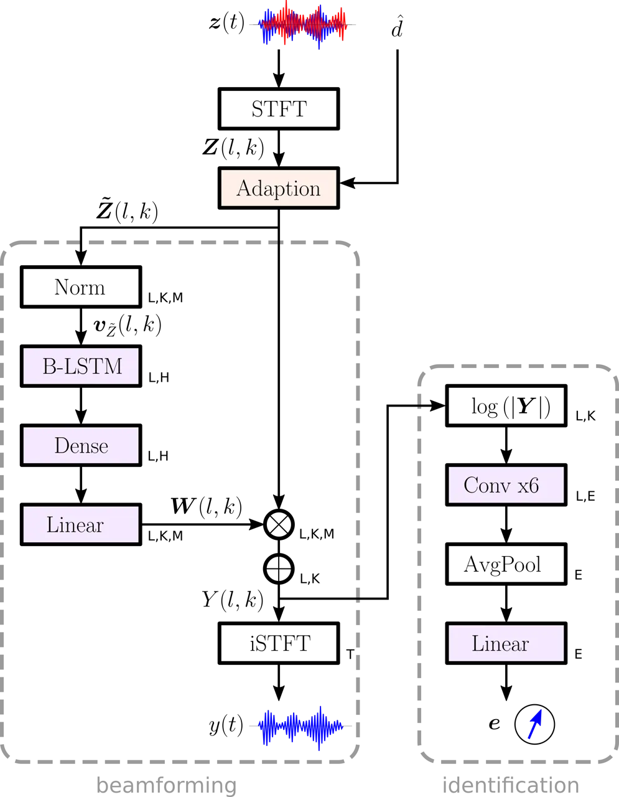

Fig. 4: Layers of the frequency-domain BSSD-FD network. The left branch
performs beamforming and dereverberation, the right branch assigns an
embedding vector to the enhanced output signal $`y(t)`$. The symbols
next to each layer denote the dimensionality of the respective output
tensor.

### V-A Speaker Separation

The STFT layer transforms the multi-channel input mixture to the
frequency domain using Eq. (7). The STFT produces $`L`$ time frames and
$`K`$ frequency bins per frame. Source separation is based on the DOA
index $`\hat{d}`$ from Algorithm 1, which is a scalar. The _Adaption_
layer uses this input to modify the IPDs of the multi-channel input
mixture in frequency domain, i.e.

```math
\bm{\tilde{Z}}(l,k)=\Big(\bm{U}(k)\bm{V}(\hat{d},k)\Big)^{*}\odot\Big(\bm{U}(k)\bm{Z}(l,k)\Big), \tag{11}
```

where ^(∗) denotes complex conjugation, and $`\odot`$ element-wise
multiplication. The adaption layer performs two tasks: (i) It whitens
the input signal $`\bm{Z}(l,k)`$ as shown in Eq. (10). (ii) It subtracts
the phase of the whitened DOA vector $`\bm{V}(\hat{d},k)`$ from the
phase of the whitened input signal. This operation will align the phase
of $`\bm{\tilde{Z}}(l,k)`$ such that the IPDs for the direction of
$`\bm{V}(\hat{d})`$ are zero. Consequently, signals originating from
this direction (i.e. the desired signal) can be identified by a small
IPD, whereas all other signal components (i.e. interfering speakers)
will have large IPDs. Hence, the NN sees the desired signal always at
the same spatial location, enabling it to distinguish between the
desired and unwanted signal components. Consequently, the NN extracts
the speaker towards the direction of $`\bm{V}(\hat{d})`$. We refer to
Eq. (11) as the _Analytic Adaption_ (AA). Hence, this system is
abbreviated as BSSD-FD-AA.

Instead of modifying the phase of the input with the DOA vector, it is
also possible to modify the input directly with a set of trainable
weights, i.e.

```math
\bm{\tilde{Z}}(l,k)=\bm{A}(\hat{d},k)\bm{Z}(l,k), \tag{12}
```

where $`\bm{A}(\hat{d},k)`$ is a complex-valued matrix of shape
$`M\times M`$. It allows to scale, shift and mix the $`M`$ channels of
the complex-valued inputs $`\bm{Z}(l,k)`$ freely. Note that the DOA
index $`\hat{d}`$ selects the location from which we want to extract the
desired speech signal. Hence, during training, all possible $`D`$ DOA
locations must be presented to the NN to train all complex-valued
weights in the tensor $`\bm{A}`$. Eq. (12) can be implemented as a
complex-valued linear layer \[10\]. We refer to Eq. (12) as _Statistic
Adaption_ (SA). Hence, this system is abbreviated as BSSD-FD-SA.

### V-B Beamforming and Dereverberation

The structure of the left branch of the NN in Figure 4 resembles a
traditional _filter-and-sum_ beamformer, which can be written as:

```math
Y(l,k)=\bm{W}^{T}(l,k)\bm{\tilde{Z}}(l,k), \tag{13}
```

where $`Y(l,k)`$ denotes the beamformed output in frequency domain, and
$`\bm{W}(l,k)`$ are the beamforming filters. The inner vector product of
Eq. (13) is computed before the inverse STFT layer in Figure 4. The NN
estimates the weights $`\bm{W}(l,k)`$ solely from the spatial
information in $`\bm{\tilde{Z}}(l,k)`$, which is obtained by the _Norm_
layer. In particular, this layer normalizes the magnitude of the $`M`$
dimensional input vector $`\bm{\tilde{Z}}(l,k)`$ to 1, and aligns its
phase to the first microphone, i.e.

```math
\bm{v}_{\tilde{Z}}(l,k)=\frac{\bm{\tilde{Z}}(l,k)\cdot\tilde{Z}^{*}(l,k,m=1)}{|\bm{\tilde{Z}}(l,k)\cdot\tilde{Z}^{*}(l,k,m=1)|}. \tag{14}
```

Then, a bidirectional LSTM layer creates a latent space of $`H`$
neurons, followed by a dense layer with a complex-valued tanh activation
function \[10\]. A linear layer outputs a set of unconstrained filter
weights $`\bm{W}(l,k)\in\mathbb{C}`$ to calculate the enhanced output
$`Y(l,k)`$ as shown in Eq. (13). After the inverse STFT layer, we obtain
the enhanced time-domain signal $`y(t)`$.

By using a neural beamformer, the design goal is not limited to MVDR
constraints or similar concepts \[10\]. In fact, we can also include a
dereverberation objective by using an appropriate loss function for the
NN. In particular, we use the negative SI-SDR \[58\] between the output
$`y(t)`$, and a clean anechoic reference utterance $`r(t)`$, i.e.

```math
\mathcal{L}_{\text{SI-SDR}}=-10log_{10}\Big(\frac{|\alpha r(t)|_{2}^{2}}{|\alpha r(t)-y(t)|_{2}^{2}}\Big), \tag{15}
```

where $`\alpha=\frac{y(t)^{T}r(t)}{r(t)^{T}r(t)}`$. We use
$`r(t)=s_{c}(t)`$ from Eq. (2) as anechoic reference signal.

### V-C Speaker Identification

The right branch of the NN in Figure 4 extracts an embedding vector
$`\bm{e}`$ to identify the speaker in the enhanced output signal
$`Y(l,k)`$. The embedding vector maps the utterance into a feature space
where distances correspond to speaker similarity \[38\]. Therefore, the
NN must be agnostic to the spoken text, and only rely on the speaker
characteristics embedded in the waveform. We use the log-power spectral
density $`\text{log}\!\left(|Y(l,k)|^{2}\right)`$ as input features.
Then, a series of 6 convolutional layers with a filter length of 10, and
increasing dilation factors of (1,2,4,8,16,32) frames create a latent
space of $`L\times E`$ dimensional embeddings. We use a softplus³³ 3 The
softplus activation function is defined as
$`f(z)=\text{log}\!\left(1+\text{e}^{z}\right)`$. activation function
and layer normalization after each convolutional layer. A skip
connection is added between every two convolutional layers. The $`L`$
time frames are averaged to obtain a single, $`E`$ dimensional embedding
for the whole utterance (AvgPool layer). The linear layer at the end of
the stack outputs the unconstrained embedding vector $`\bm{e}`$.

We want to identify an open set of speakers, i.e. we need to be able to
compare two utterances and determine whether they belong to the same
speaker. Therefore we employ the triplet loss \[42\], which has been
successfully used for speaker identification and diarization tasks \[41,
43, 44, 45\]. The goal of the triplet loss is to ensure that two
utterances from the same speaker have their embeddings close together in
the embedding space, and two examples from different speakers have their
embeddings farther away by some margin $`\beta`$. In other words, we
want the embeddings of the same speaker to form clusters, and these
clusters must be separated by the margin, i.e.

```math
\mathcal{L}_{\text{TL}}=\sum_{B^{3}}\Big[|\bm{e}_{a}-\bm{e}_{p}|_{2}-|\bm{e}_{a}-\bm{e}_{n}|_{2}+\beta\Big]_{+}, \tag{16}
```

where the embedding $`\bm{e}_{a}`$ denotes an _anchor_, $`\bm{e}_{p}`$
is an embedding from the same speaker as the anchor (positive example),
and $`\bm{e}_{n}`$ is an embedding from a different speaker (negative
example). In a batch of $`B`$ utterances, there can be as many as
$`B^{3}`$ triplets. It is therefore crucial to only select a subset of
valid triplets, where the positive example is from the same speaker as
the anchor, and the negative example belongs to a different speaker.
Further, we only need to consider triplets where the loss
$`\mathcal{L}_{\text{TL}}`$ is actually greater than zero. To select
relevant triplets, we utilize _Hard Triplet Mining_ \[59\], where we
select the hardest positive and negative example per anchor. In
particular, we randomly select $`P`$ utterances from $`B`$ speakers,
where we determine the largest distance $`|\bm{e}_{a}-\bm{e}_{p}|_{2}`$
between an anchor and a positive example within the $`P`$ utterances per
speaker, and the smallest distance $`|\bm{e}_{a}-\bm{e}_{n}|_{2}`$
between an anchor and a negative example from the $`P(B-1)`$ remaining
utterances. More formally, this procedure can be written as:

```math
\displaystyle\mathcal{L}_{\text{TL-HTM}}=\frac{1}{B\cdot P}\sum_{i=1}^{B}\sum_{a=1}^{P}\Big[\beta \displaystyle+\underset{p=1\ldots P}{\text{max}}\Big(|\bm{e}_{a}^{i}-\bm{e}_{p}^{i}|_{2}\Big) \tag{17}
```

```math
\displaystyle-\underset{\begin{subarray}{c}j=1\ldots B\\
n=1\ldots P\\
i\neq j\end{subarray}}{\text{min}}\Big(|\bm{e}_{a}^{i}-\bm{e}_{n}^{j}|_{2}\Big)\Big]_{+}.
```

When the batch size $`P\cdot B`$ is small, the embeddings may collapse
into a single point during training \[60\]. To avoid this, we propose to
minimize the cross-entropy between embeddings of different speakers as
follows:

```math
\mathcal{L}_{\text{TL-CE}}=\frac{-1}{(B^{2}-B)P^{2}}\sum_{a=1}^{B}\sum_{\begin{subarray}{c}n=1\\
n\neq a\end{subarray}}^{B}\sum_{i=1}^{P}\sum_{j=1}^{P}\text{log}\!\left(|(\tilde{\bm{e}}_{a}^{i})^{T}\tilde{\bm{e}}_{n}^{j}|^{2}\right), \tag{18}
```

where $`\tilde{\bm{e}}=\frac{\bm{e}}{|\bm{e}|_{2}}`$ is the
magnitude-normalized embedding vector $`\bm{e}`$. This regularization
ensures that the embeddings $`\bm{e}_{a}`$ and $`\bm{e}_{n}`$ will be
different. The overall cost function for the entire BSSD-FD architecture
is then defined as:

```math
\mathcal{L}_{\text{BSSD-FD}}=\mathcal{L}_{\text{SI-SDR}}+\lambda_{1}\mathcal{L}_{\text{TL-HTM}}+\lambda_{2}\mathcal{L}_{\text{TL-CE}}, \tag{19}
```

where $`\lambda_{1}`$ and $`\lambda_{2}`$ are weights for the individual
terms.

### V-D Distance Measure

In order to determine whether two embeddings $`\bm{e}_{1}`$ and
$`\bm{e}_{2}`$ belong to the same speaker, we use the euclidian distance
$`|\bm{e}_{1}-\bm{e}_{2}|_{2}`$. If the distance falls below a certain
threshold $`\delta`$, we consider the two embeddings to belong to the
same speaker. If it exceeds the threshold, the speakers are considered
different. Hence, two types of errors exist: (i) A false positive is
triggered when two embeddings from two different speakers are
incorrectly classified as belonging to the same speaker, which we
measure using the False Acceptance Rate (FAR), i.e.

```math
\text{FAR}(\delta)=\frac{1}{(B^{2}-B)P^{2}}\sum_{a=1}^{B}\sum_{\begin{subarray}{c}n=1\\
n\neq a\end{subarray}}^{B}\sum_{i=1}^{P}\sum_{j=1}^{P}\mathds{1}\Big(|\bm{e}_{a}^{i}-\bm{e}_{n}^{j}|_{2}<\delta\Big), \tag{20}
```

where $`\mathds{1}(x)`$ denotes an indicator function, i.e.

```math
\mathds{1}(x)=\begin{cases}1,&\text{if condition }$x$\text{ is true}.\\
0,&\text{otherwise}.\end{cases} \tag{21}
```

\(ii\) A false negative is triggered when two embeddings from the same
speaker are classified as belonging to different speakers, which we
measure using the False Rejection Rate (FRR), i.e.

```math
\text{FRR}(\delta)=\frac{1}{B(P^{2}-P)}\sum_{\begin{subarray}{c}a=1\\
p=a\end{subarray}}^{B}\sum_{i=1}^{P}\sum_{\begin{subarray}{c}j=1\\
j\neq i\end{subarray}}^{P}\mathds{1}\Big(|\bm{e}_{a}^{i}-\bm{e}_{p}^{j}|_{2}>\delta\Big). \tag{22}
```

The FAR is positively correlated to the decision threshold $`\delta`$,
and the FRR is correlated negatively. The value at which the FAR and FRR
are equal, is known as the Equal Error Rate (EER). It is determined by:

```math
\displaystyle\hat{\delta} \displaystyle=\underset{\delta}{\text{argmin}}|\text{FAR}(\delta)-\text{FRR}(\delta)| \tag{23}
```

```math
\displaystyle\text{EER} \displaystyle=\text{FAR}(\hat{\delta})=\text{FRR}(\hat{\delta}),
```

where $`\hat{\delta}`$ is considered the optimal threshold belonging to
the EER.

## VI BSSD Network - Time Domain

With the recent success of time-domain speech separation algorithms
\[15, 16, 17, 25\], we also formulate a time-domain variant of our BSSD
network. The beamforming and dereverberation operations can be
formulated analogously to the frequency domain, but the NN will train
faster when using real-valued data. Figure 5 shows the architecture of
the BSSD-TD network. Similar to the frequency-domain variant, the left
branch performs beamforming and dereverberation, and the right branch
outputs an embedding vector per utterance.

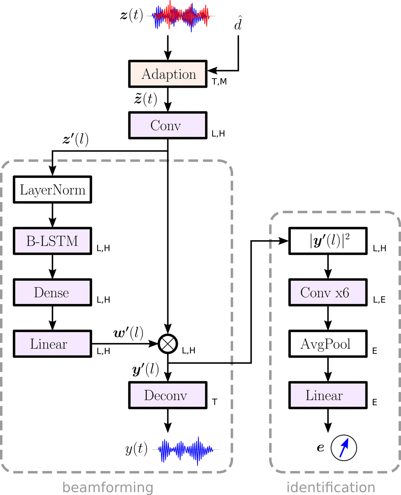

Fig. 5: Layers of the time-domain BSSD-TD network. The left branch
performs beamforming and dereverberation, the right branch assigns an
embedding vector to the enhanced output signal $`y(t)`$.

### VI-A Speaker Separation

Analogous to the frequency-domain network, source separation is based on
the _Adaption_ layer, which uses the DOA index $`\hat{d}`$ from
Algorithm 1 to modify the ITD of the input signal $`\bm{z}(t)`$. By
rearranging Eq. (11), we can formulate an identical operation in
time-domain, i.e.

```math
\displaystyle\tilde{Z}(l,k,m) \displaystyle=\big(\bm{U}^{T}(k,m)\bm{V}(\hat{d},k)\big)^{*}\cdot\big(\bm{U}^{T}(k,m)\bm{Z}(l,k)\big), \tag{24}
```

```math
\displaystyle=\sum_{i=1}^{M}\bm{U}^{H}(k,m)\bm{V}^{*}(\hat{d},k)U(k,m,i)\cdot Z(l,k,i),
```

```math
\displaystyle=\sum_{i=1}^{M}V^{\prime}(\hat{d},k,m,i)\cdot Z(l,k,i),
```

where we can identify the convolutional kernel
$`V^{\prime}(\hat{d},k,m,i)`$ in frequency domain. We can see from Eq.
(3), that the DOA $`\bm{V}(\hat{d},k)`$ resembles $`M`$ sinc pulses with
a positive time-delay $`\tau_{d,m}`$, and Eq. (9) shows that the
elements of the whitening matrix $`U(k,m,i)`$ are real-valued.
Therefore, $`V^{\prime}(\hat{d},k,m,i)`$ will be a causal IIR filter in
time domain \[61\], which we truncate to $`T_{A}`$ samples to obtain the
FIR filter $`v^{\prime}(\hat{d},t_{A},m,i)`$ by using the inverse FFT.
This allows to formulate the time-domain adaption layer as:

```math
\tilde{z}(t,m)=\sum_{i=1}^{M}z(t,i)\circledast v^{\prime}(\hat{d},t_{A},m,i), \tag{25}
```

which can be implemented using a single convolution layer. Similar to
the frequency-domain adaption layer, Eq. (25) synchronizes the ITD to be
zero for signals originating from the direction of $`\bm{V}(\hat{d})`$,
i.e. the desired signal. The subsequent NN sees the desired signal
always at the same spatial location, which makes it easier to
distinguish between the desired and unwanted signal components.
Consequently, the NN extracts the speaker towards the direction of
$`\bm{V}(\hat{d})`$. We refer to Eq. (25) as _Analytic Adaption_ (AA).
Hence, this system is abbreviated as BSSD-TD-AA.

Instead of modifying the ITDs of the input signal with the DOA vector,
it is also possible to replace the fixed convolutional kernels
$`\tilde{v}(\hat{d},t_{A},m,i)`$ with a set of trainable weights, i.e.

```math
\tilde{z}(t,m)=\sum_{i=1}^{M}z(t,i)\circledast a(\hat{d},t_{A},m,i), \tag{26}
```

where $`\bm{a}`$ is a tensor of shape $`(D,T_{A},M,M)`$, and $`T_{A}`$
is the filter length of the learnable convolution kernels. This allows
to scale, shift and mix the $`M`$ channels of the input signal
$`\bm{z}(t)`$ freely. Note that the DOA index $`\hat{d}`$ provides the
location from which we want to extract the desired speech signal. Hence,
during training, all $`D`$ possible DOA locations must be presented to
the NN to train the weights $`\bm{a}`$. Note that Eq. (26) can be
implemented as a convolution layer. We refer to Eq. (26) as _Statistic
Adaption_ (SA). Hence, this system is abbreviated as BSSD-TD-SA.

### VI-B Beamforming and Dereverberation

The structure of the left branch of the NN in Figure 5 resembles a
time-domain beamformer \[49\], where the first convolution layer right
after the adaption layer transforms the time-domain input
$`\bm{\tilde{z}(t)}`$ into a latent space $`z^{\prime}(l,h)`$ with $`L`$
frames and $`H`$ filters. The stride of this convolution layer is set to
$`\frac{H}{4}`$, and the activation function is linear.

Similar to the frequency-domain beamformer, filtering is performed in
latent space. The beamforming weights $`w^{\prime}(l,h)`$ are estimated
from the spatial information embedded in $`z^{\prime}(l,h)`$, using
layer normalization, followed by a bidirectional LSTM layer, a dense
layer with tanh activation, and a linear layer. The linear layer allows
the NN to freely choose the amplitude and phase of the beamforming
weights. The enhanced output $`y^{\prime}(l,h)`$ is obtained by

```math
y^{\prime}(l,h)=w^{\prime}(l,h)\odot z^{\prime}(l,h), \tag{27}
```

where all variables are of shape $`L\times H`$. Finally, a deconvolution
layer with a linear activation function produces the enhanced
time-domain signal $`y(t)`$. Analogous to the BSSD-FD architecture, we
use the negative SI-SDR from Eq. (15) between the output $`y(t)`$, and a
clean anechoic reference utterance $`r(t)`$.

### VI-C Speaker Identification

The right branch of the NN in Figure 5 extracts an embedding vector
$`\bm{e}`$ to identify the speaker in the enhanced output signal
$`y(t)`$. The NN is identical to the BSSD-FD architecture, except for
the input layer which uses the enhanced signal $`y^{\prime}(l,h)`$ as
input features. Identically to Eq. (19), the overall cost function for
the entire BSSD-TD architecture is defined analogously to the BSSD-FD
architecture given in Eq. 19.

## VII Block Online Processing

For realtime applications, it is possible to use the BSSD system in
block-online mode. We split the input mixture $`\bm{z}(t)`$ into blocks
of equal length. Each block $`b`$ is iteratively processed using
Algorithm 1. It returns the DOA index $`\hat{d}`$, a list
$`\mathcal{Y}_{b}`$ of extracted speakers $`y(t)`$, and a list
$`\mathcal{E}_{b}`$ of speaker embeddings $`\bm{e}`$. Figure 6
illustrates the block-online processing scheme of the BSSD system for
$`C=2`$ speakers and 4 blocks. Note that the speakers may change their
position from block to block, i.e. they may walk around, switch places,
etc. Therefore, both the DOA and speaker embedding are extracted for
each source in each block. The process of assigning each extracted
source block to the same speaker identity is referred to as
_diarization_ \[36, 37\], by using Algorithm 2.

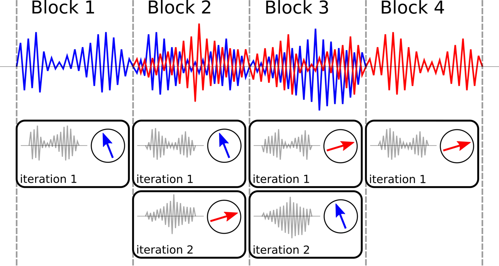

Fig. 6: Block-online processing mode of the BSSD system, showing a
mixture of $`C=2`$ speakers being split into 4 blocks. Each block is
processed separately using Algorithm 1.

1: $`\mathcal{Y}\leftarrow[]`$

2: $`\mathcal{E}\leftarrow[]`$

3: for $`\textbf{all blocks }b`$ do

4:   for $`c=1:\textbf{length}(\mathcal{E}_{b})`$ do

5:    if
$`\texttt{min}(|\mathcal{E}-\mathcal{E}_{b}(c)|_{2})>\hat{\delta}`$ then

6:      $`\mathcal{E}\texttt{.append}(\mathcal{E}_{b}(c))`$

7:    else

8:
     $`i\leftarrow\texttt{argmin}(|\mathcal{E}-\mathcal{E}_{b}(c)|_{2}))`$

9:      $`\mathcal{Y}(i)\texttt{.append}(\mathcal{Y}_{b}(c))`$

10:    end if

11:   end for

12: end for

Algorithm 2 Diarization in block-online mode.

First, we initialize empty lists for all speakers $`\mathcal{Y}`$ and
all embeddings $`\mathcal{E}`$. Then, we iterate over all blocks $`b`$,
where Algorithm 1 is executed for each block. It returns a list
$`\mathcal{Y}_{b}`$ of extracted speakers and a list $`\mathcal{E}_{b}`$
of speaker embeddings for that block. Next, we iterate over each
extracted source $`c`$ within that block, and we compare the distance of
the embedding $`\mathcal{E}_{b}(c)`$ against all embeddings
$`\mathcal{E}`$. If the threshold $`\hat{\delta}`$ (see Eq. 23) is
exceeded, we have found a new speaker. In that case, this speaker is
added to the list of known embeddings $`\mathcal{E}`$. Otherwise, we
have found an utterance belonging to a known embedding. In that case, we
determine the index $`i`$ of that embedding, and append the source
$`\mathcal{Y}_{b}(c)`$ to the speaker at position $`\mathcal{Y}(i)`$. To
preserve the time alignment of each extracted speaker, we append a block
of silence to each source in $`\mathcal{Y}`$ that did not receive an
update. This may happen if a speaker is silent during block $`b`$.

A trade-off has to be made when choosing the block length $`T_{B}`$. If
it is too large, short utterances followed by periods of silence might
not get detected. If it is too small, the predicted embeddings may be
inaccurate, causing Algorithm 2 to assign the sources
$`\mathcal{Y}_{b}(c)`$ to the wrong speaker. We examine this behavior in
our experiments.

## VIII RIR Recordings

We use both recorded and simulated RIRs to generate spatialized
recordings with Eq. (2). Real RIRs are obtained through multi-channel
room impulse response measurements, and simulated RIRs are obtained by
the Image Source Method (ISM) \[23, 62\].

### VIII-A Real RIRs

To obtain realistic RIRs, we use a circular microphone array with
$`M=6`$ channels and a diameter of $`92.6mm`$ \[63\], and a 5W
measurement loudspeaker. To drive the loudspeaker from a Linux-based PC
with ALSA \[64\], we use the PlayRec Python module \[65\], which
simultaneously plays and records audio from a sound card. We use an
exponential chirp with a duration of 5s sweeping from $`24kHz`$ down to
$`20Hz`$ as excitation signal \[47\]. However, we only use a bandwidth
of $`8kHz`$ for our experiments. We recorded 120 6-channel RIRs in 24
different, fully furnished office rooms with a reverberation time
$`RT_{60}\in[200\ldots 900]ms`$. The distance from the loudspeaker to
the microphone array was varied from $`1m\ldots 3m`$, and the direction
was chosen randomly. Figure 7 shows the recording setup. We augmented
the number of RIR recordings to 720 by virtually rotating the array by
$`6\times 60^{\circ}`$, i.e. shifting the microphone channels.

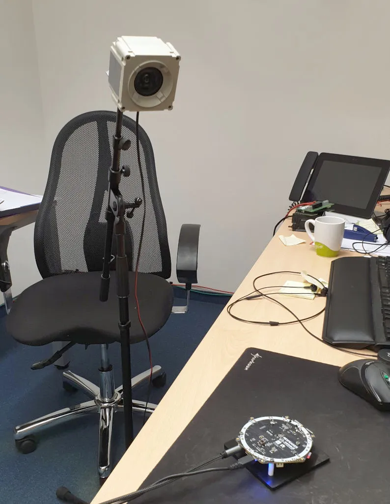

Fig. 7: RIR recording setup using a 5W measurement loudspeaker and a
6-channel microphone array \[63\].

### VIII-B Simulated RIRs

To obtain simulated RIRs, we further generated 720 artificial RIRs for
the same array geometry with 6 channels, but with a shorter
reverberation time $`RT_{60}\in[200\ldots 400]ms`$, which is randomly
chosen. The room is modeled as a simple rectangular shoebox with random
dimensions ranging from $`3m\ldots 6m`$, where the microphone array and
the sound sources are placed randomly. RIR generation was done using the
Image Source Method \[23, 62\] using _Pyroomacoustics_ \[66\].

## IX Experiments

### IX-A Experimental Setup

#### IX-A1 Speech mixtures

We use the WSJ0 speech database which contains 12776 utterances from 101
different speakers for training, and 5895 utterances from 18 different
speakers for testing. To generate mixtures, we use the wsj0-2mix from
\[12\], which we extended to 3 and 4 speakers. To generate reverberated,
multi-channel mixtures from Eq. (2), we convolve the monaural signals
with both the _real_ and _simulated_ RIRs, as described in Section VIII.
All recordings use a sample rate of $`f_{s}=16kHz`$.

#### IX-A2 DOA bases

We use $`D=100`$ DOA bases, which are equally distributed on a sphere,
as shown in Figure 8. This provides an average spatial resolution of
about $`13.82^{\circ}`$, which equates to two persons standing right
next to each other at a distance of 1m. Note that the number of DOA
vectors $`D`$ can be changed without re-training the NN. Clearly, we
want to use a different DOA index $`d_{c}\in[1\ldots D]`$ for each
source $`s_{c}`$ in the input mixture $`\bm{z}(t)`$. To achieve this, we
randomly select a RIR $`\bm{h}_{c}(t)`$ belonging to a the DOA index
$`d_{c}`$ using Eq. (6). From the 720 _real_ and _simulated_ RIRs
available, 640 are used for training, and 80 for testing.

#### IX-A3 BSSD-FD system

For the BSSD-FD network in Figure 4, we use a FFT length of 1024
samples, and an overlap of 75%. This results in $`K=513`$ frequency
bins. Further, we have $`M=6`$ microphones as determined by the RIR
recordings. The _beamforming_ branch uses $`H=500`$ neurons to create
the beamforming weights $`\bm{W}(l,k)`$, and to predict the enhanced
signal $`Y(l,k)`$. The _identification_ branch uses an embedding
dimension of $`E=100`$ to predict the speaker embeddings $`\bm{e}`$.

#### IX-A4 BSSD-TD system

For the BSSD-TD network in Figure 5, we use a filter length of
$`T_{A}=100`$ samples for the filter kernels in the adaption layer in
Eq. (25) and (26). The first convolutional layer uses a filter length of
200 samples and a stride of 50 samples to create a latent space of
$`H=500`$ neurons. The _beamforming_ branch predicts the beamforming
weights $`\bm{w^{\prime}}(l)`$ and the enhanced signal
$`\bm{y^{\prime}}(l)`$ in latent space. This signal is transformed back
to time domain using the deconvolution layer, which uses a filter length
of 200 samples, a stride of 50 samples, and overlap-add to produce the
enhanced signal $`y(t)`$. The _identification_ branch uses an embedding
dimension of $`E=100`$ to predict the speaker embeddings $`\bm{e}`$.

### IX-B Related Systems

To compare our BSSD system against other state-of-the art speech
separation algorithms, we evaluate Conv-TasNet \[17\] and PIT with
spatial features \[23\]. To account for dereverberation, we apply the
WPE algorithm from \[35\] prior to Conv-TasNet.

#### IX-B1 Conv-TasNet

Conv-TasNet separates 2 speakers in time domain. It operates on chunks
of 4s of audio, where it separates the two speakers in a latent space by
using a speech mask $`\in[0\ldots 1]`$. The mask is obtained from a
series of convolutions. The system operates on single-channel inputs,
therefore we only use one output of the WPE algorithm. We use the
implementation of \[17\].

#### IX-B2 Spatial PIT

Spatial PIT separates 2 speakers in frequency domain. It uses
log-spectrograms and the sine and cosine of the IPDs of
frequency-domain, multi-channel mixtures to predict a speech mask for
each speaker \[13, 23\]. This mask is used to construct a
frequency-domain beamformer \[7\]. Note that there is no explicit
dereverberation constraint, but the target speech mask is obtained from
the anechoic reference signal $`r(t)`$. Hence, the beamformer will
remove late echoes.

### IX-C Training

All four variants of the BSSD network are trained on mixtures of $`C=2`$
sources, where each mixture $`\bm{z}(t)`$ is truncated to 5s length. The
location (i.e. the DOA index $`d`$) of each source is chosen randomly
for each example. We use a batch size of 60 mixtures from the 101
speakers of the WSJ0 training set. To enable efficient triplet mining
with Eq. (17), we use $`P=3`$ different utterances from $`B=20`$
speakers for the first source $`s_{c=1}(t)`$ of each mixture. The second
source $`s_{c=2}(t)`$ is chosen randomly from the remaining 100 speakers
from the WSJ0 training set. We use the clean first source as as
reference utterance, i.e. $`r(t)=s_{c=1}(t)`$. The ground truth DOA
index $`\hat{d}`$ is used to train the network. We use
$`\lambda_{1}=10^{-2}`$ and $`\lambda_{2}=10^{-4}`$ for the cost
function in Eq. (19). This ensures that the _beamforming_ path is
trained faster than the _identification_ path, as the latter depends on
the former. As the combination of the different RIRs and WSJ0 utterances
allows for billions of combinations, we randomly create new batches for
training and validation for each epoch. Adam is used as optimizer
\[67\], with a learning rate of $`10^{-3}`$. A Tensorflow implementation
of the BSSD network can be found at⁴⁴ 4 https://github.com/rrbluke/BSSD.

### IX-D Testing

We compare the frequency-domain (FD) and time-domain (TD) variants of
our BSSD system, as well as the analytic adaption (AA) and statistic
adaption (SA) layers introduced in Section V and VI. Further, we use the
Conv-TasNet and spatial PIT as baseline systems. We test the BSSD
network both in _offline_ mode in _block-online_ mode.

#### IX-D1 Offline Mode

In offline mode, we use 5s long mixtures of $`C=\{1,2,3,4\}`$ speakers
from the test set. To be able to test the performance of the _speaker
separation_ and _speaker identification_ modules separately, we use the
ground truth DOA index $`\hat{d}`$ as input to the BSSD network. We
report the separation and dereverberation performance in terms of SI-SDR
using Eq. (15). Further, we report the WER using the Google
Speech-to-Text API \[68\] to perform ASR. Speaker identification
performance is reported in terms of EER on the enhanced output, using
Eq. (23).

#### IX-D2 Block-online Mode

In block-online mode, we use 20s long mixtures from the test set, which
we divide into $`N_{b}`$ blocks of $`T_{B}=\{1,2.5,5\}s`$ length. Each
block is processed by Algorithm 1, which outputs the DOA index
$`\hat{d}`$, a list of extracted signals $`\mathcal{Y}_{b}`$, and a list
of speaker embeddings $`\mathcal{E}_{b}`$ for each block $`b`$. Then,
Algorithm 2 is used to assign the extracted utterances of each block to
the same speaker. This solves the speaker permutation problem. We report
the SI-SDR, WER and the Block Error Rate (BER) for the extracted
speakers. The BER indicates the percentage of falsely assigned blocks
due to erroneous embeddings. It is determined by comparing the speaker
embedding of the reference utterance $`r_{c}(t)`$ against the extracted
chunks $`y_{b,c}(t)`$ for each speaker $`c`$, i.e.

```math
\text{BER}=\frac{1}{C\cdot N_{b}}\sum_{c=1}^{C}\sum_{b=1}^{N_{b}}\mathds{1}\Big(|\bm{e}_{r,c}-\bm{e}_{b,c}|_{2}>\hat{\delta}\Big) \tag{28}
```

## X Results

### X-A Source Localization

First, we report the performance of the localization stage, i.e.
Algorithm 1, using a mixture with $`C=3`$ speakers and _real_ RIRs.
Figure 8 illustrates the $`D=100`$ DOA positions, arranged on a unit
sphere according to Eq. (5). The color gradient indicates the spatial
speech presence probability map $`\gamma_{W}^{\prime}(d)`$, which is
obtained by summing Eq. (10) over all frequencies $`K`$ and time frames
$`L`$. The markers $`X_{1}`$, $`X_{2}`$ and $`X_{3}`$ indicate the
positions of the three speakers. Panel (a) illustrates $`\gamma_{U}(d)`$
for the first iteration of Algorithm 1, panel (b) for the second
iteration, panel (c) for the third iteration, and panel (d) for the
fourth iteration. All three sources are localized during the first three
iterations, while the fourth iteration only sees a faint reflection of
one of the three sources. Therefore, the speaker embedding for this
reflection will already be known, which serves as the stopping criterion
of Algorithm 2.

\(a\) 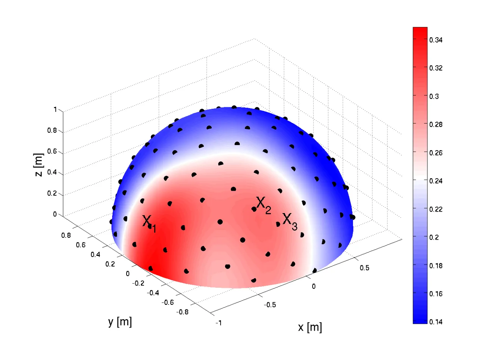

\(b\) 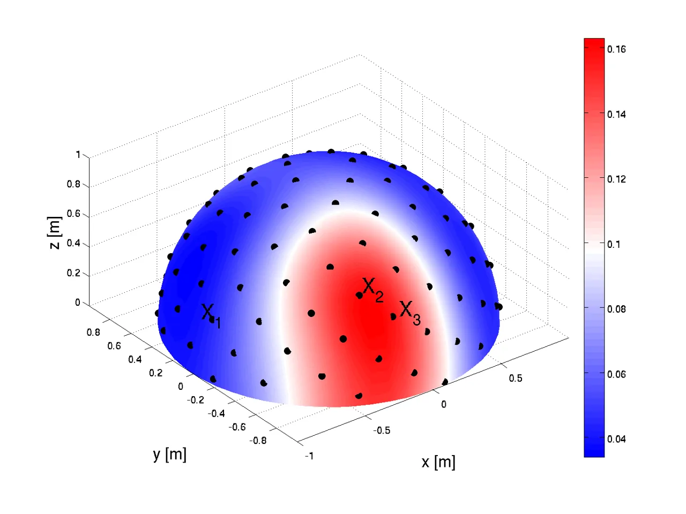

\(c\) 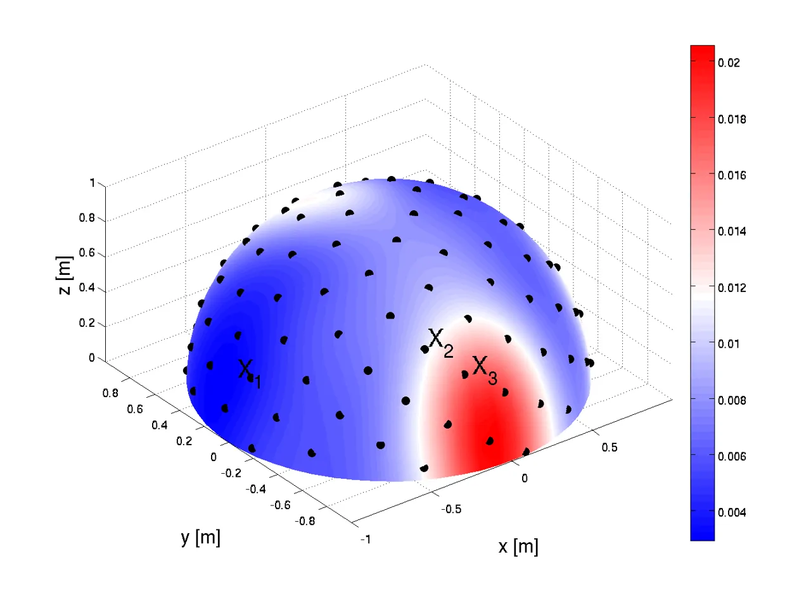

\(d\) 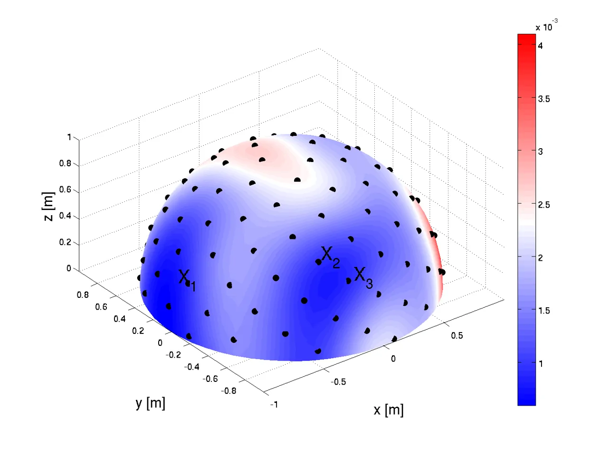

Fig. 8: Unit sphere with $`D=100`$ equidistant DOA points and a circular
microphone array with $`M=6`$ channels. Panel (a) - (d) show the spatial
speech presence probability map $`\gamma_{W}^{\prime}`$ during
consecutive iterations of Algorithm 1.

### X-B Separation Performance

Figure 9 shows the performance of the BSSD-TD-SA model with the same
three speakers as in Figure 8. From panel (a) it can be seen that there
is a significant amount of reverberation in the input mixture
$`\bm{z}(t)`$. Panel (b) and (d) show the extracted and dereverberated
signals of two male speakers. Panel (c) shows the extracted and
dereverberated signal of a female speaker. Even though speaker 2 and 3
are located very close to each other, they can still be separated. Note
that the spatial resolution is only determined by the number of DOA
vectors $`D`$, and the BSSD model is trained independently of the
localization stage in Algorithm 1.

\(a\) 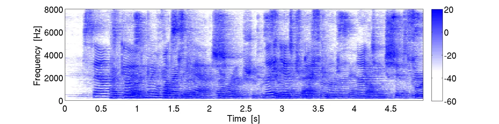

\(b\) 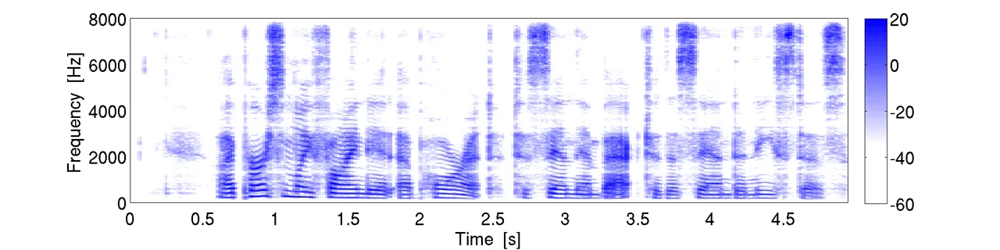

\(c\) 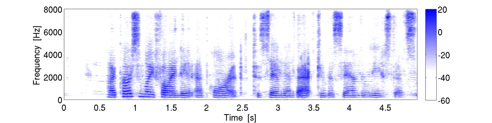

\(d\) 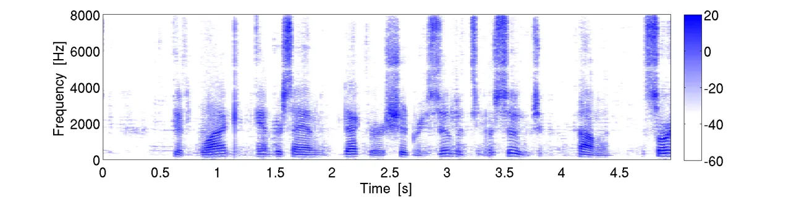

\(e\) 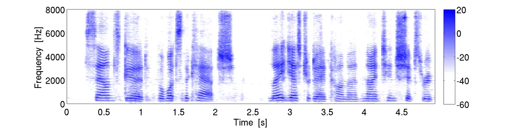

Fig. 9: Performance plot of the BSSD-TD-SA model with $`C=3`$ speakers
and _real_ RIRs. (a) STFT plot of the first microphone of the input
mixture $`\bm{z}(t)`$. The $`T_{60}`$ of the reverb is approximately
650ms. (b) STFT plot of the clean first source signal $`r_{1}(t)`$.
(c-e) STFT plots of the extracted and dereverberated sources
$`y_{c}(t)`$.

### X-C Speaker Identification

Figure 10 illustrates a 2D projection of the embeddings for each of the
101 WSJ0 speaker identities, which were obtained using BSSD-TD-SA model.
For each speaker, 20 random utterances have been used, which have been
reverberated and spatialized using both the _real_ and _simulated_ RIRs.
It can be seen that each speaker identity can be distinguished.

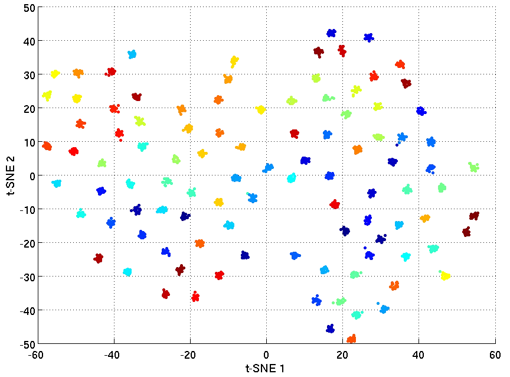

Fig. 10: t-SNE plot of the extracted speaker embeddings, using the 101
identities of the WSJ0 corpus.

### X-D Offline mode

Table I reports SI-SDR, WER and EER for the _real_ RIRs. For $`C=1`$
speaker, the BSSD models only perform dereverberation. Hence, the SI-SDR
is the highest for this case. The low WER of $`9.65\%`$ indicates that
Google-ASR recognizes reverberant audio quite well. However, all BSSD
models could lower the WER even further. Also, the EER is lowest for one
speaker. This is to be expected, as no interfering components of other
speakers reduce the quality of the speaker embeddings $`\bm{e}`$. For
$`C=2`$ speakers, it can be seen that all BSSD models outperform
Conv-TasNet and spatial PIT, even though Conv-TasNet is aided by WPE,
and spatial PIT has explicitly been trained to perform dereverberation
as well. Conv-TasNet could only achieve a WER of $`48.71\%`$. Spatial
PIT only achieves a WER of $`42.27\%`$. It uses a static beamformer,
which performs poorly in reverberant environments \[7\].

For $`C=3`$ and $`4`$ speakers, performance of the BSSD architecture
drops, as expected. I.e.: the SI-SDR gets lower, and both the WER and
EER rise. The statistic adaption (SA) outperforms the analytic adaption
(AA) variants for all number of speakers. This is also expected, as the
SA variant allows the network to find an optimal transformation to
separate the speakers both in time- and frequency domain, while the AA
enforces a fixed scheme for spatial whitening and source localization.
When comparing the time-domain (TD) to the frequency-domain (FD)
variants, it can be seen that the FD models perform slightly better in
terms of EER. This indicates that the speaker embeddings are easier to
estimate in frequency domain, as they are calculated from the enhanced
spectrograms (see Figure 4).

|                |       |          |         |         |
| -------------- | ----- | -------- | ------- | ------- |
| model          | $`C`$ | SI-SDR   | WER     | EER     |
| no enhancement | 1     | \-       | 9.65 %  | \-      |
| Conv-TasNet    | 2     | 6.92 dB  | 48.71 % | \-      |
| spatial PIT    | 2     | 2.26 dB  | 42.27 % | \-      |
| BSSD-FD-AA     | 1     | 16.91 dB | 5.09 %  | 2.87 %  |
|                | 2     | 8.65 dB  | 28.74 % | 5.92 %  |
|                | 3     | 6.75 dB  | 51.90 % | 8.94 %  |
|                | 4     | 5.61 dB  | 66.20 % | 11.32 % |
| BSSD-FD-SA     | 1     | 14.92 dB | 6.10 %  | 3.02 %  |
|                | 2     | 10.23 dB | 23.70 % | 4.22 %  |
|                | 3     | 8.34 dB  | 42.49 % | 6.20 %  |
|                | 4     | 7.17 dB  | 56.43 % | 7.22 %  |
| BSSD-TD-AA     | 1     | 10.07 dB | 9.81 %  | 4.18 %  |
|                | 2     | 6.74 dB  | 45.79 % | 9.94 %  |
|                | 3     | 5.22 dB  | 71.63 % | 15.68 % |
|                | 4     | 4.31 dB  | 84.39 % | 21.65 % |
| BSSD-TD-SA     | 1     | 14.40 dB | 5.72 %  | 2.89 %  |
|                | 2     | 9.33 dB  | 26.19 % | 5.75 %  |
|                | 3     | 7.92 dB  | 42.32 % | 7.28 %  |
|                | 4     | 6.84 dB  | 56.57 % | 9.39 %  |

TABLE I: Speech separation, dereverberation and speaker identification
performance for the _real_ RIRs in _offline_ mode.

Table II reports SI-SDR, WER and EER for the significantly shorter
_simulated_ RIRs. Consequently, all systems perform better in all
scores. In these almost ideal conditions, Google-ASR achieved a WER of
$`3.04\%`$ for a single speaker without any enhancement. However, all
BSSD variants also achieved a lower WER as well. Also, Conv-TasNet and
spatial PIT perform better compared to the _real_ RIRs. However,
Conv-TasNet still could not separate the speakers perfectly. The static
beamformer of spatial PIT performs quite well for the short _simulated_
RIRs, achieving a WER of $`17.1\%`$. However, all BSSD variants achieved
a lower WER for $`C=2`$ speakers. Again, the FD variants perform
slightly better than the TD models, and the SA layer outperforms the AA
layer.

|                |       |          |         |         |
| -------------- | ----- | -------- | ------- | ------- |
| model          | $`C`$ | SI-SDR   | WER     | EER     |
| no enhancement | 1     | \-       | 3.04 %  | \-      |
| Conv-TasNet    | 2     | 8.78 dB  | 25.34 % | \-      |
| spatial PIT    | 2     | 3.06 dB  | 17.10 % | \-      |
| BSSD-FD-AA     | 1     | 22.72 dB | 1.72 %  | 2.89 %  |
|                | 2     | 10.93 dB | 14.71 % | 6.11 %  |
|                | 3     | 8.62 dB  | 27.82 % | 8.27 %  |
|                | 4     | 7.25 dB  | 37.58 % | 9.65 %  |
| BSSD-FD-SA     | 1     | 22.02 dB | 2.72 %  | 3.07 %  |
|                | 2     | 12.06 dB | 12.80 % | 5.25 %  |
|                | 3     | 9.06 dB  | 25.39 % | 7.37 %  |
|                | 4     | 7.40 dB  | 40.36 % | 8.99 %  |
| BSSD-TD-AA     | 1     | 16.87 dB | 2.71 %  | 3.44 %  |
|                | 2     | 10.62 dB | 15.55 % | 7.23 %  |
|                | 3     | 8.31 dB  | 30.86 % | 10.05 % |
|                | 4     | 6.75 dB  | 46.48 % | 14.52 % |
| BSSD-TD-SA     | 1     | 22.75 dB | 2.02 %  | 2.84 %  |
|                | 2     | 12.82 dB | 9.84 %  | 5.56 %  |
|                | 3     | 10.23 dB | 20.92 % | 7.77 %  |
|                | 4     | 8.57 dB  | 34.45 % | 9.23 %  |

TABLE II: Speech separation, dereverberation and speaker identification
performance for the _simulated_ RIRs in _offline_ mode.

### X-E Block-online mode

Table III reports SI-SDR, WER and BER for the _real_ RIRs, for block
lengths of $`T_{B}=1s`$, $`2.5s`$ and $`5s`$. We only performed these
experiments on the SA variants of the BSSD network, as the SA layer
consistently outperforms the AA layer. The SI-SDR and WER are worse
compared to _offline_ mode, as many sources of errors cumulate
throughout the processing chain. I.e.: Algorithm 1 may produce wrong DOA
indices for short blocks and many speakers. Consequently, speaker
separation is poor, resulting in erroneous speaker embeddings. Further,
both the speaker separation and speaker identification modules introduce
errors on their own. For the shortest block length of $`T_{B}=1s`$,
there are 20 blocks for $`20s`$ of audio. In order to achieve a perfect
BER score, the embeddings for the same speaker in all 20 blocks must be
identical (see Eq. (28)). If the speaker is silent in one or more
blocks, a perfect BER score cannot be achieved. Clearly, performance is
better for larger block lengths and fewer speakers. For $`C=2`$ speakers
and a block length of $`T_{B}=5s`$, the WER is $`34.79\%`$ for the FD
variant, and $`28.51\%`$ for the TD variant. The BER is $`10\%`$ for the
FD variant, and $`4.5\%`$ for the TD variant. In contrast to the
experiments in _offline_ mode, all scores are slightly better for the TD
models.

|            |       |           |         |         |         |
| ---------- | ----- | --------- | ------- | ------- | ------- |
| model      | $`C`$ | $`T_{B}`$ | SI-SDR  | WER     | BER     |
| BSSD-FD-SA | 2     | 1.0s      | 3.80 dB | 66.94 % | 37.40 % |
|            |       | 2.5s      | 7.05 dB | 44.22 % | 15.88 % |
|            |       | 5.0s      | 8.64 dB | 34.79 % | 10.00 % |
|            | 3     | 1.0s      | 3.00 dB | 75.68 % | 48.90 % |
|            |       | 2.5s      | 5.19 dB | 59.94 % | 27.13 % |
|            |       | 5.0s      | 6.73 dB | 52.98 % | 14.75 % |
|            | 4     | 1.0s      | 2.49 dB | 78.21 % | 64.40 % |
|            |       | 2.5s      | 3.71 dB | 71.96 % | 43.75 % |
|            |       | 5.0s      | 4.76 dB | 68.07 % | 35.00 % |
| BSSD-TD-SA | 2     | 1.0s      | 4.49 dB | 60.67 % | 25.30 % |
|            |       | 2.5s      | 7.04 dB | 36.24 % | 10.75 % |
|            |       | 5.0s      | 8.47 dB | 28.51 % | 4.50 %  |
|            | 3     | 1.0s      | 3.30 dB | 74.11 % | 39.70 % |
|            |       | 2.5s      | 4.81 dB | 63.82 % | 23.88 % |
|            |       | 5.0s      | 6.31 dB | 48.68 % | 22.50 % |
|            | 4     | 1.0s      | 2.70 dB | 76.32 % | 47.85 % |
|            |       | 2.5s      | 3.93 dB | 70.83 % | 32.25 % |
|            |       | 5.0s      | 4.86 dB | 65.14 % | 32.50 % |

TABLE III: Speech separation and dereverberation performance for the
_real_ RIRs in _block-online_ mode.

Table IV reports SI-SDR, WER and BER for the _simulated_ RIRs, for block
lengths of $`T_{B}=1s`$, $`2.5s`$ and $`5s`$. All scores are better
compared to the significantly longer _real_ RIRs. For $`C=2`$ speakers
and a block length of $`T_{B}=5s`$, the WER is $`19.80\%`$ for the FD
variant, and $`16.75\%`$ for the TD variant. The BER is $`3.25\%`$ for
the FD variant, and $`1.25\%`$ for the TD variant. Again, In contrast to
the experiments in _offline_ mode, all scores are slightly better for
the TD models.

|            |       |           |          |         |         |
| ---------- | ----- | --------- | -------- | ------- | ------- |
| model      | $`C`$ | $`T_{B}`$ | SI-SDR   | WER     | BER     |
| BSSD-FD-SA | 2     | 1.0s      | 4.24 dB  | 58.08 % | 27.55 % |
|            |       | 2.5s      | 8.13 dB  | 27.70 % | 7.88 %  |
|            |       | 5.0s      | 10.67 dB | 19.80 % | 3.25 %  |
|            | 3     | 1.0s      | 3.49 dB  | 75.03 % | 40.00 % |
|            |       | 2.5s      | 6.46 dB  | 46.98 % | 17.50 % |
|            |       | 5.0s      | 7.91 dB  | 35.83 % | 11.75 % |
|            | 4     | 1.0s      | 2.89 dB  | 81.74 % | 49.40 % |
|            |       | 2.5s      | 5.25 dB  | 52.42 % | 24.63 % |
|            |       | 5.0s      | 6.05 dB  | 49.52 % | 23.75 % |
| BSSD-TD-SA | 2     | 1.0s      | 5.82 dB  | 51.17 % | 18.55 % |
|            |       | 2.5s      | 10.94 dB | 18.21 % | 3.63 %  |
|            |       | 5.0s      | 11.91 dB | 16.75 % | 1.25 %  |
|            | 3     | 1.0s      | 4.40 dB  | 73.55 % | 30.50 % |
|            |       | 2.5s      | 7.75 dB  | 47.37 % | 15.25 % |
|            |       | 5.0s      | 9.66 dB  | 39.12 % | 9.75 %  |
|            | 4     | 1.0s      | 3.10 dB  | 81.24 % | 37.65 % |
|            |       | 2.5s      | 5.11 dB  | 60.12 % | 26.00 % |
|            |       | 5.0s      | 7.80 dB  | 52.99 % | 10.75 % |

TABLE IV: Speech separation and dereverberation performance for the
_simulated_ RIRs in _block-online_ mode.

### X-F Model complexity

Table V reports the number of trainable parameters per variant of the
BSSD network. The frequency domain (FD) variants use mostly
complex-valued weights, which are counted as 2 real-valued weights.
Hence, these models are significantly larger than the time domain (TD)
variants. The size of the statistic adaption (SA) layer in the time
domain network is comparatively small with 720,000 parameters. However,
the analytic adaption (AA) layer requires additional convolutions from
Eq. (25). Similar to Conv-TasNet, the time domain variant also has the
advantage of a small step size of 50 samples. The number of parameters
for speaker identification is almost the same for all variants.

|            |                       |                           |
| ---------- | --------------------- | ------------------------- |
| model      | parameters beamformer | parameters identification |
| BSSD-FD-AA | 11,064,384            | 2,664,100                 |
| BSSD-FD-SA | 14,757,984            | 2,664,100                 |
| BSSD-TD-AA | 5,456,700             | 2,526,500                 |
| BSSD-TD-SA | 6,176,700             | 2,526,500                 |

TABLE V: Number of parameters for the _beamforming_ and _identification_
branches of the BSSD network.

## XI Conclusion

In this paper, we introduced the _Blind Speech Separation and
Dereverberation_ (BSSD) network, which performs simultaneous _speaker
separation_, _dereverberation_ and _speaker identification_ in a single
neural network. We proposed four variants of our system, which operate
in frequency-domain and time-domain, and use analytic adaption and
statistic adaption layers to perform blind speaker separation. We have
shown that 100 DOA bases provide enough spatial resolution to separate
up to four speakers. Further, we proposed the _block-online_ mode to
process longer audio recordings, as they occur in meeting scenarios. In
our experiments, we could show that the BSSD network outperforms similar
state-of-the art algorithms for speaker separation in terms of SI-SDR
and WER.

## References

- \[1\] D. Wang and J. Chen, “Supervised speech separation based on deep
  learning: An overview,” _IEEE/ACM Transactions on Audio, Speech, and
  Language Processing_, vol. 26, no. 10, pp. 1702–1726, 2018.
- \[2\] J. Barker, R. Marxer, E. Vincent, and S. Watanabe, “The third
  CHiME speech separation and recognition challenge: Dataset, task and
  baselines,” in _IEEE 2015 Automatic Speech Recognition and
  Understanding Workshop (ASRU)_, 2015.
- \[3\] E. Vincent, S. Watanabe, J. Barker, and R. Marxer, “The fourth
  CHiME speech separation and recognition challenge: Dataset, task and
  baselines,” in _Proc. of the 4th Intl. Workshop on Speech Processing
  in Everyday Environments (CHiME 2016)_, 2016.
- \[4\] H. Erdogan, J. Hershey, S. Watanabe, M. Mandel, and J. L. Roux,
  “Improved MVDR beamforming using single-channel mask prediction
  networks,” in _Interspeech_, Sep. 2016.
- \[5\] J. Heymann, L. Drude, and R. Haeb-Umbach, “Neural network based
  spectral mask estimation for acoustic beamforming,” in _2016 IEEE
  International Conference on Acoustics, Speech and Signal Processing
  (ICASSP)_, March 2016, pp. 196–200.
- \[6\] L. Pfeifenberger, M. Zöhrer, and F. Pernkopf, “Eigenvector-based
  speech mask estimation using logistic regression,” in _Interspeech
  2017, 18th Annual Conference of the International Speech Communication
  Association, 2017_, Aug. 2017, pp. 2660–2664.
- \[7\] L. Pfeifenberger, M. Zöhrer, and F. Pernkopf, “Eigenvector-based
  speech mask estimation for multi-channel speech enhancement,”
  _IEEE/ACM Transactions on Audio, Speech, and Language Processing_,
  vol. 27, no. 12, pp. 2162–2172, 2019.
- \[8\] J. Benesty, M. M. Sondhi, and Y. Huang, _Springer Handbook of
  Speech Processing_. Berlin–Heidelberg–New York: Springer, 2008.
- \[9\] C. Trabelsi, O. Bilaniuk, Y. Zhang, D. Serdyuk, S. Subramanian,
  J. Santos, S. Mehri, N. Rostamzadeh, Y. Bengio, and C. Pal, “Deep
  complex networks,” in _International Conference for Learning
  Representations (ICLR)_, 05 2017.
- \[10\] L. Pfeifenberger, M. Zöhrer, and F. Pernkopf, “Deep
  complex-valued neural beamformers,” in _ICASSP 2019 - 2019 IEEE
  International Conference on Acoustics, Speech and Signal Processing
  (ICASSP)_, 2019, pp. 2902–2906.
- \[11\] Y. Koyama and B. Raj, “W-net BF: dnn-based beamformer using
  joint training approach,” _CoRR_, vol. abs/1910.14262, 2019.
  \[Online\]. Available: http://arxiv.org/abs/1910.14262
- \[12\] J. R. Hershey, Z. Chen, J. Le Roux, and S. Watanabe, “Deep
  clustering: Discriminative embeddings for segmentation and
  separation,” in _2016 IEEE International Conference on Acoustics,
  Speech and Signal Processing (ICASSP)_, 2016, pp. 31–35.
- \[13\] D. Yu, M. Kolbæk, Z. Tan, and J. Jensen, “Permutation invariant
  training of deep models for speaker-independent multi-talker speech
  separation,” in _2017 IEEE International Conference on Acoustics,
  Speech and Signal Processing (ICASSP)_, 2017, pp. 241–245.
- \[14\] Z. Chen, Y. Luo, and N. Mesgarani, “Deep attractor network for
  single-microphone speaker separation,” in _2017 IEEE International
  Conference on Acoustics, Speech and Signal Processing (ICASSP)_, 2017,
  pp. 246–250.
- \[15\] D. Stoller, S. Ewert, and S. Dixon, “Wave-u-net: A multi-scale
  neural network for end-to-end audio source separation,” _CoRR_, vol.
  abs/1806.03185, 2018. \[Online\]. Available:
  http://arxiv.org/abs/1806.03185
- \[16\] Y. Luo and N. Mesgarani, “Tasnet: Time-domain audio separation
  network for real-time, single-channel speech separation,” in _2018
  IEEE International Conference on Acoustics, Speech and Signal
  Processing (ICASSP)_, 2018, pp. 696–700.
- \[17\] ——, “Conv-tasnet: Surpassing ideal time–frequency magnitude
  masking for speech separation,” _IEEE/ACM Transactions on Audio,
  Speech, and Language Processing_, vol. 27, no. 8, pp. 1256–1266, 2019.
- \[18\] T. Ochiai, M. Delcroix, R. Ikeshita, K. Kinoshita, T. Nakatani,
  and S. Araki, “Beam-tasnet: Time-domain audio separation network meets
  frequency-domain beamformer,” in _ICASSP 2020 - 2020 IEEE
  International Conference on Acoustics, Speech and Signal Processing
  (ICASSP)_, 2020, pp. 6384–6388.
- \[19\] K. Žmolíková, M. Delcroix, K. Kinoshita, T. Higuchi, A. Ogawa,
  and T. Nakatani, “Speaker-aware neural network based beamformer for
  speaker extraction in speech mixtures,” in _Interspeech 2017, 18th
  Annual Conference of the International Speech Communication
  Association, 2017_, 08 2017, pp. 2655–2659.
- \[20\] K. Žmolíková, M. Delcroix, K. Kinoshita, T. Ochiai,
  T. Nakatani, L. Burget, and J. Černocký, “Speakerbeam: Speaker aware
  neural network for target speaker extraction in speech mixtures,”
  _IEEE Journal of Selected Topics in Signal Processing_, vol. 13,
  no. 4, pp. 800–814, 2019.
- \[21\] T. Yoshioka, H. Erdogan, Z. Chen, and F. Alleva,
  “Multi-microphone neural speech separation for far-field multi-talker
  speech recognition,” in _2018 IEEE International Conference on
  Acoustics, Speech and Signal Processing (ICASSP)_, 2018, pp.
  5739–5743.
- \[22\] Z.-Q. Wang and D. Wang, “Integrating spectral and spatial
  features for multi-channel speaker separation,” in _Interspeech 2018 -
  19th Annual Conferenceof the International Speech Communication
  Association, Sep 2018, Hyderabad, India_, 09 2018, pp. 2718–2722.
- \[23\] Z. Wang, J. Le Roux, and J. R. Hershey, “Multi-channel deep
  clustering: Discriminative spectral and spatial embeddings for
  speaker-independent speech separation,” in _2018 IEEE International
  Conference on Acoustics, Speech and Signal Processing (ICASSP)_, 2018,
  pp. 1–5.
- \[24\] T. Nakatani, R. Takahashi, T. Ochiai, K. Kinoshita,
  R. Ikeshita, M. Delcroix, and S. Araki, “Dnn-supported mask-based
  convolutional beamforming for simultaneous denoising, dereverberation,
  and source separation,” in _ICASSP 2020 - 2020 IEEE International
  Conference on Acoustics, Speech and Signal Processing (ICASSP)_, 2020,
  pp. 6399–6403.
- \[25\] X. Chang, W. Zhang, Y. Qian, J. L. Roux, and S. Watanabe,
  “Mimo-speech: End-to-end multi-channel multi-speaker speech
  recognition,” in _2019 IEEE Automatic Speech Recognition and
  Understanding Workshop (ASRU)_, 2019, pp. 237–244.
- \[26\] T. Yoshioka, H. Erdogan, Z. Chen, X. Xiao, and F. Alleva,
  “Recognizing overlapped speech in meetings: A multichannel separation
  approach using neural networks,” 09 2018, pp. 3038–3042.
- \[27\] T. Yoshioka, Z. Chen, C. Liu, X. Xiao, H. Erdogan, and
  D. Dimitriadis, “Low-latency speaker-independent continuous speech
  separation,” 2019.
- \[28\] T. von Neumann, K. Kinoshita, M. Delcroix, S. Araki,
  T. Nakatani, and R. Haeb-Umbach, “All-neural online source separation,
  counting, and diarization for meeting analysis,” in _ICASSP 2019 -
  2019 IEEE International Conference on Acoustics, Speech and Signal
  Processing (ICASSP)_, 02 2019, pp. 91–95.
- \[29\] J. Barker, S. Watanabe, E. Vincent, and J. Trmal, “The fifth
  ’chime’ speech separation and recognition challenge: Dataset, task and
  baselines,” in _Interspeech 2018 - 19th Annual Conferenceof the
  International Speech Communication Association, Sep 2018, Hyderabad,
  India_, 03 2018.
- \[30\] S. Watanabe, M. Mandel, J. Barker, E. Vincent, A. Arora,
  X. Chang, S. Khudanpur, V. Manohar, D. Povey, D. Raj, D. Snyder, A. S.
  Subramanian, J. Trmal, B. B. Yair, C. Boeddeker, Z. Ni, Y. Fujita,
  S. Horiguchi, N. Kanda, T. Yoshioka, and N. Ryant, “Chime-6
  challenge:tackling multispeaker speech recognition for unsegmented
  recordings,” 2020.
- \[31\] T. Yoshioka, A. Sehr, M. Delcroix, K. Kinoshita, R. Maas,
  T. Nakatani, and W. Kellermann, “Making machines understand us in
  reverberant rooms: Robustness against reverberation for automatic
  speech recognition,” _IEEE Signal Processing Magazine_, vol. 29,
  no. 6, pp. 114–126, 2012.
- \[32\] K. Kinoshita, M. Delcroix, H. Kwon, T. Mori, and T. Nakatani,
  “Neural network-based spectrum estimation for online wpe
  dereverberation,” in _Interspeech 2017, 18th Annual Conference of the
  International Speech Communication Association, 2017_, 08 2017, pp.
  384–388.
- \[33\] D. Williamson and D. Wang, “Time-frequency masking in the
  complex domain for speech dereverberation and denoising,” _IEEE/ACM
  Transactions on Audio, Speech, and Language Processing_, vol. PP, pp.
  1–1, 04 2017.
- \[34\] T. Nakatani and K. Kinoshita, “A unified convolutional
  beamformer for simultaneous denoising and dereverberation,” _IEEE
  Signal Processing Letters_, vol. 26, no. 6, pp. 903–907, 2019.
- \[35\] T. Yoshioka, T. Nakatani, K. Kinoshita, and M. Miyoshi, _Cohen
  I., Benesty J., Gannot S. (eds) Speech Processing in Modern
  Communication. Springer Topics in Signal Processing_. Springer,
  Berlin, Heidelberg, 12 2009, vol. 3, ch. Speech Dereverberation and
  Denoising Based on Time Varying Speech Model and Autoregressive
  Reverberation Model, pp. 151–182.
- \[36\] G. Sell, D. Snyder, A. McCree, D. Garcia-Romero, J. Villalba,
  M. Maciejewski, V. Manohar, N. Dehak, D. Povey, S. Watanabe, and
  S. Khudanpur, “Diarization is hard: Some experiences and lessons
  learned for the jhu team in the inaugural dihard challenge,” in
  _Interspeech 2018 - 19th Annual Conferenceof the International Speech
  Communication Association, Sep 2018, Hyderabad, India_, 09 2018, pp.
  2808–2812.
- \[37\] M. Kolbæk, D. Yu, Z. Tan, and J. Jensen, “Multitalker speech
  separation with utterance-level permutation invariant training of deep
  recurrent neural networks,” _IEEE/ACM Transactions on Audio, Speech,
  and Language Processing_, vol. 25, no. 10, pp. 1901–1913, 2017.
- \[38\] D. Snyder, P. Ghahremani, D. Povey, D. Garcia-Romero,
  Y. Carmiel, and S. Khudanpur, “Deep neural network-based speaker
  embeddings for end-to-end speaker verification,” in _2016 IEEE Spoken
  Language Technology Workshop (SLT)_, 2016, pp. 165–170.
- \[39\] N. Dehak, P. Kenny, R. Dehak, P. Dumouchel, and P. Ouellet,
  “Front-end factor analysis for speaker verification,” _Audio, Speech,
  and Language Processing, IEEE Transactions on_, vol. 19, pp. 788 –
  798, 06 2011.
- \[40\] D. Snyder, D. Garcia-Romero, G. Sell, D. Povey, and
  S. Khudanpur, “X-vectors: Robust dnn embeddings for speaker
  recognition,” in _2018 IEEE International Conference on Acoustics,
  Speech and Signal Processing (ICASSP)_, 04 2018, pp. 5329–5333.
- \[41\] C. Li, X. Ma, B. Jiang, X. Li, X. Zhang, X. Liu, Y. Cao,
  A. Kannan, and Z. Zhu, “Deep speaker: an end-to-end neural speaker
  embedding system,” _CoRR_, vol. abs/1705.02304, 05 2017. \[Online\].
  Available: http://arxiv.org/abs/1705.02304
- \[42\] F. Schroff, D. Kalenichenko, and J. Philbin, “Facenet: A
  unified embedding for face recognition and clustering,” in _2015 IEEE
  Conference on Computer Vision and Pattern Recognition (CVPR)_, 2015,
  pp. 815–823.
- \[43\] C. Wang, X. Lan, and X. Zhang, “How to train triplet networks
  with 100k identities?” in _2017 IEEE International Conference on
  Computer Vision Workshops (ICCVW)_, 2017, pp. 1907–1915.
- \[44\] H. Song, M. Willi, J. J. Thiagarajan, V. Berisha, and
  A. Spanias, “Triplet network with attention for speaker diarization,”
  in _Interspeech 2018 - 19th Annual Conferenceof the International
  Speech Communication Association, Sep 2018, Hyderabad, India_,
  08 2018.
- \[45\] C. Zhang, K. Koishida, and J. Hansen, “Text-independent speaker
  verification based on triplet convolutional neural network
  embeddings,” _IEEE/ACM Transactions on Audio, Speech, and Language
  Processing_, vol. 26, pp. 1–1, 04 2018.
- \[46\] C. Wu, R. Manmatha, A. J. Smola, and P. Krähenbühl, “Sampling
  matters in deep embedding learning,” in _2017 IEEE International
  Conference on Computer Vision (ICCV)_, 2017, pp. 2859–2867.
- \[47\] H. Kuttruff, _Room Acoustics_, 5th ed. London–New York: Spoon
  Press, 2009.
- \[48\] B. Duvenhage, K. Bouatouch, and D. Kourie, “Numerical
  verification of bidirectional reflectance distribution functions for
  physical plausibility,” in _SAICSIT ’13: Proceedings of the South
  African Institute for Computer Scientists and Information
  Technologists Conference_, 10 2013, pp. 200–208.
- \[49\] J. Benesty, J. Chen, and Y. Huang, _Microphone Array Signal
  Processing_. Berlin–Heidelberg–New York: Springer, 2008.
- \[50\] Y. Huang, J. Benesty, and J. Chen, _Acoustic MIMO Signal
  Processing_. Berlin–Heidelberg–New York: Springer, 2006.
- \[51\] M. Brandstein and D. Ward, _Microphone
  Arrays_. Berlin–Heidelberg–New York: Springer, 2001.
- \[52\] A. J. Bell and T. J. Sejnowski, “The ‘independent components’
  of natural scenes are edge filters.” _VISION RESEARCH_, vol. 37, pp.
  3327–3338, 1997.
- \[53\] B. D. V. Veen and K. M. Buckley, “Beamforming: a versatile
  approach to spatial filtering,” _IEEE International Conference on
  Acoustics, Speech, and Signal Processing_, vol. 5, no. 5, pp. 4–24,
  Apr. 1988.
- \[54\] E. Warsitz and R. Haeb-Umbach, “Blind acoustic beamforming
  based on generalized eigenvalue decomposition,” _IEEE Transactions on
  audio, speech, and language processing_, vol. 15, no. 5, Jul. 2007.
- \[55\] M. F. Amin, M. I. Amin, A. Y. H. Al-Nuaimi, and K. Murase,
  “Wirtinger calculus based gradient descent and levenberg-marquardt
  learning algorithms in complex-valued neural networks,” in _Neural
  Information Processing_. Springer Berlin Heidelberg, 2011, pp.
  550–559.
- \[56\] P. Bouboulis, “Wirtinger’s calculus in general hilbert spaces,”
  _CoRR_, vol. abs/1005.5170, 2010. \[Online\]. Available:
  http://arxiv.org/abs/1005.5170
- \[57\] R. F. H. Fischer, “Appendix A: Wirtinger calculus,” in
  _Precoding and Signal Shaping for Digital
  Transmission_. Wiley-Blackwell, 2005, pp. 405–413.
- \[58\] J. L. Roux, S. Wisdom, H. Erdogan, and J. R. Hershey, “Sdr –
  half-baked or well done?” in _ICASSP 2019 - 2019 IEEE International
  Conference on Acoustics, Speech and Signal Processing (ICASSP)_, 2019,
  pp. 626–630.
- \[59\] A. Hermans, L. Beyer, and B. Leibe, “In defense of the triplet
  loss for person re-identification,” _CoRR_, vol. abs/1703.07737,
  03 2017. \[Online\]. Available: http://arxiv.org/abs/1703.07737
- \[60\] X. Zhang, F. X. Yu, S. Kumar, and S. Chang, “Learning
  spread-out local feature descriptors,” in _2017 IEEE International
  Conference on Computer Vision (ICCV)_, 2017, pp. 4605–4613.
- \[61\] S. Haykin, _Adaptive Filter Theory_, 4th ed. New Jersey:
  Prentice Hall, 2002.
- \[62\] E. A. P. Habets and S. Gannot, “Generating sensor signals in
  isotropic noise fields,” _The Journal of the Acoustical Society of
  America_, vol. 122, no. 6, pp. 3464–3470, 2007.
- \[63\] S. Studio, “Respeaker core v2.0,” Website, 2020, visited on
  September 24th 2020. \[Online\]. Available:
  https://www.seeedstudio.com/ReSpeaker-Core-v2-0.html
- \[64\] J. Kysela, T. Iwai, C. Ladisch, J. Courtier-Dutton,
  L. Girdwood, and M. Brown, “Alsa-project,” Website, 2020, visited on
  February 19th 2020. \[Online\]. Available:
  https://alsa-project.org/wiki/Main_Page
- \[65\] M. Geier, “python-sounddevice,” Website, 2020, visited on
  February 19th 2020. \[Online\]. Available:
  https://python-sounddevice.readthedocs.io/en/0.3.15/
- \[66\] R. Scheibler, E. Bezzam, and I. Dokmanic, “Pyroomacoustics: A
  python package for audio room simulations and array processing
  algorithms,” _CoRR_, vol. abs/1710.04196, 2017.
- \[67\] D. Kingma and J. Ba, “Adam: A method for stochastic
  optimization,” in _3rd International Conference for Learning
  Representations, San Diego, 2015_, Jul. 2015.
- \[68\] A. Zhang, “SpeechRecognition – a library for performing speech
  recognition, with support for several engines and apis, online and
  offline.” Website, 2020, visited on March 25th 2020. \[Online\].
  Available: https://pypi.org/project/SpeechRecognition/

|                                                                                 |                                                                                                                                                                                                                                                                                                                                                                                                                                                                                                                                                                                                                                                                                                                                                                                                                                                                                                                                                                                                                                                                                                                                                                                                                                                                                                                                                            |
| ------------------------------------------------------------------------------- | ---------------------------------------------------------------------------------------------------------------------------------------------------------------------------------------------------------------------------------------------------------------------------------------------------------------------------------------------------------------------------------------------------------------------------------------------------------------------------------------------------------------------------------------------------------------------------------------------------------------------------------------------------------------------------------------------------------------------------------------------------------------------------------------------------------------------------------------------------------------------------------------------------------------------------------------------------------------------------------------------------------------------------------------------------------------------------------------------------------------------------------------------------------------------------------------------------------------------------------------------------------------------------------------------------------------------------------------------------------- |
| ![[Uncaptioned image]](arxiv-2103-13443v2--10f44a8a23c9.figures/figure-19.webp) | Lukas Pfeifenberger received the M.Sc. (Dipl. Ing.FH) degree in computer science from the University of Applied Sciences, Salzburg, Austria, in 2004. His master’s thesis promotes the use of closed control systems in earth fault detection appliances. Since 2005 he has been working in the electronics industry on projects pertaining to FPGA design, DSP programming and communication acoustics, including algorithms for echo and noise cancellation. In 2013, he received the M.Sc. degree in Telematics at Graz University of Technology, Austria. His master’s thesis decuments the implementation of an acoustic beamformer on an embedded device with limited resources. Since 2015 he has been a Research Associate at the Laboratory of Signal Processing and Speech Communication, Graz University of Technology, Austria. In 2021, he received his Ph.D. degree in computer science with honors from Graz University of Technology, Austria. His doctoral thesis explores the evolution of neural acoustic beamformers ranging from mask-based beamforming to blind speaker separation. His research interests include signal processing, machine learning, artificial intelligence, pattern recognition, computer vision, speech enhancement, acoustic echo control, speaker separation, and data analysis for industrial applications. |

|                                                                                 |                                                                                                                                                                                                                                                                                                                                                                                                                                                                                                                                                                                                                                                                                                                                                                                                                                                                                     |
| ------------------------------------------------------------------------------- | ----------------------------------------------------------------------------------------------------------------------------------------------------------------------------------------------------------------------------------------------------------------------------------------------------------------------------------------------------------------------------------------------------------------------------------------------------------------------------------------------------------------------------------------------------------------------------------------------------------------------------------------------------------------------------------------------------------------------------------------------------------------------------------------------------------------------------------------------------------------------------------- |
| ![[Uncaptioned image]](arxiv-2103-13443v2--10f44a8a23c9.figures/figure-20.webp) | Franz Pernkopf received his MSc (Dipl. Ing.) degree in Electrical Engineering at Graz University of Technology, Austria, in summer 1999. He earned a PhD degree from the University of Leoben, Austria, in 2002. In 2002 he was awarded the Erwin Schrödinger Fellowship. He was a Research Associate in the Department of Electrical Engineering at the University of Washington, Seattle, from 2004 to 2006. From 2010-2019 he was Associate Professor at the Laboratory of Signal Processing and Speech Communication, Graz University of Technology, Austria. Since 2019, he is Professor for Intelligent Systems at the Signal Processing and Speech Communication Laboratory at Graz University of Technology, Austria. His research is focused on pattern recognition, machine learning, and computational data analytics with applications in signal and speech processing. |
