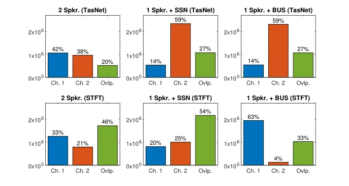

# On TasNet for Low-Latency Single-Speaker Speech Enhancement

Morten Kolbæk    Zheng-Hua Tan    Søren Holdt Jensen    Jesper Jensen

###### Abstract

In recent years, speech processing algorithms have seen tremendous
progress primarily due to the deep learning renaissance. This is
especially true for speech separation where the time-domain audio
separation network (TasNet) has led to significant improvements.
However, for the related task of single-speaker speech enhancement,
which is of obvious importance, it is yet unknown, if the TasNet
architecture is equally successful. In this paper, we show that TasNet
improves state-of-the-art also for speech enhancement, and that the
largest gains are achieved for modulated noise sources such as speech.
Furthermore, we show that TasNet learns an efficient inner-domain
representation, where target and noise signal components are highly
separable. This is especially true for noise in terms of interfering
speech signals, which might explain why TasNet performs so well on the
separation task. Additionally, we show that TasNet performs poorly for
large frame hops and conjecture that aliasing might be the main cause of
this performance drop. Finally, we show that TasNet consistently
outperforms a state-of-the-art single-speaker speech enhancement system.

^(†)^(†)address: ¹Department of Electronic Systems, Aalborg University,
Denmark  
²Oticon A/S, Denmark^(†)^(†)email: kolbek@hotmail.com,
{zt,shj,jje}@es.aau.dk, jesj@demant.com

Index Terms: speech enhancement, time-domain, convolutional neural
networks.

## 1 Introduction

Algorithms capable of extracting a desired signal from a mixture of
signals are useful for a large range of applications. For example, for
mobile communication devices or hearing aids, it is desirable to extract
or enhance the speech signal of interest in order to limit the impact of
background noise. Similarly, in applications involving videoconferencing
and machine transcription of audio recordings it is useful to be able to
separate the recorded speech signals such that intelligibility can be
improved or preserved for both humans and machine receivers.

In recent years, following the advent of the deep learning renaissance,
tremendous progress has been made within the speech processing field, as
a large range of fairly successful speech enhancement and separation
algorithms have been proposed (see, e.g., \[1, 2\] and references
therein). However, despite the fact that overlapping and concurrent
speech rarely occurs in natural conversations \[3, 4\], algorithms
designed to separate multiple speech signals have received a lot of
recent attention. On the other hand, less attention has been devoted to
algorithms designed to solve the, perhaps, more often encountered
problem of enhancing a single-speaker speech signal corrupted by noise.

In particular, the time-domain audio separation network (TasNet) \[5,
6\] has drawn a lot of attention \[7, 8\] especially after it was shown
\[6\] that TasNet could separate speech signals with higher fidelity
than what was possible using the ideal ratio magnitude mask – this was
previously considered an ambitious goal for speech enhancement and
separation algorithms \[9, 10, 11\]. Indeed, TasNet does perform
significantly better than previous techniques, when evaluated on a
classical speaker-independent multi-speaker speech separation task
(e.g., \[12, 13, 14\]). However, it is still unclear (e.g., \[7, 8\]),
why this particular architecture performs so well on this task.
Recently, the TasNet architecture has formed the basis for other
algorithms improving the speech separation performance even further
(e.g., \[15, 16\]).

Despite the obvious importance of the single-speaker in noise task, as
motivated above, the performance of TasNet for such speech enhancement
task is yet unknown. It is therefore of significant importance to
establish, if TasNet also outperforms recent state-of-the-art
single-speaker speech enhancement architectures \[17, 18\]. To do so, we
perform simulation experiments to compare TasNet with a state-of-the-art
speech enhancement system based on the uNET architecture \[18\]. We also
study the inner-domain representation learnt by TasNet and demonstrate
that speech and noise signals are more separable with this
representation than with a traditional Short-Time Fourier Transform
(STFT) representation. Finally, we demonstrate that TasNet performance
drops significantly for large input frame hops - we conjecture that
aliasing could play a role in this performance decrease.

## 2 Single-Channel Speech Enhancement and Separation

Single-channel speech separation aims to separate a mixture of signals
into its constituent parts with access only to a single-microphone
recording of the mixture. Let
$`\hbox{\hskip 2.85764pt\hskip-2.85764pt\hbox{$x$}\hskip-2.85764pt\hskip 0.0pt\raisebox{-1.2pt}{\hbox{\rule{3.44444pt}{0.32289pt}}}\hskip 0.0pt\hskip 2.85764pt}_{i}\in\mathbb{R}^{L}`$
be $`L`$ samples of the $`i^{th}`$ noise-free time-domain speech signal
and let
$`\hbox{\hskip 2.603pt\hskip-2.603pt\hbox{$v$}\hskip-2.603pt\hskip 0.0pt\raisebox{-1.2pt}{\hbox{\rule{3.44444pt}{0.32289pt}}}\hskip 0.0pt\hskip 2.603pt}\in\mathbb{R}^{L}`$
be an additive noise signal. The noisy mixture signal
$`\hbox{\hskip 2.6308pt\hskip-2.6308pt\hbox{$y$}\hskip-2.6308pt\hskip 0.0pt\raisebox{-3.14444pt}{\hbox{\rule{3.44444pt}{0.32289pt}}}\hskip 0.0pt\hskip 2.6308pt}\in\mathbb{R}^{L}`$
is then defined as
$`\hbox{\hskip 2.6308pt\hskip-2.6308pt\hbox{$y$}\hskip-2.6308pt\hskip 0.0pt\raisebox{-3.14444pt}{\hbox{\rule{3.44444pt}{0.32289pt}}}\hskip 0.0pt\hskip 2.6308pt}=\sum_{i}^{I}\hbox{\hskip 2.85764pt\hskip-2.85764pt\hbox{$x$}\hskip-2.85764pt\hskip 0.0pt\raisebox{-1.2pt}{\hbox{\rule{3.44444pt}{0.32289pt}}}\hskip 0.0pt\hskip 2.85764pt}_{i}+\hbox{\hskip 2.603pt\hskip-2.603pt\hbox{$v$}\hskip-2.603pt\hskip 0.0pt\raisebox{-1.2pt}{\hbox{\rule{3.44444pt}{0.32289pt}}}\hskip 0.0pt\hskip 2.603pt}.`$
The general objective in deep-learning based speech separation is to
find estimates
$`\hat{\hbox{\hskip 2.85764pt\hskip-2.85764pt\hbox{$x$}\hskip-2.85764pt\hskip 0.0pt\raisebox{-1.2pt}{\hbox{\rule{3.44444pt}{0.32289pt}}}\hskip 0.0pt\hskip 2.85764pt}}_{i}`$
of
$`\hbox{\hskip 2.85764pt\hskip-2.85764pt\hbox{$x$}\hskip-2.85764pt\hskip 0.0pt\raisebox{-1.2pt}{\hbox{\rule{3.44444pt}{0.32289pt}}}\hskip 0.0pt\hskip 2.85764pt}_{i}`$
from  $`y`$   using a deep neural network (DNN),
$`f_{DNN}(\hbox{\hskip 2.6308pt\hskip-2.6308pt\hbox{$y$}\hskip-2.6308pt\hskip 0.0pt\raisebox{-3.14444pt}{\hbox{\rule{3.44444pt}{0.32289pt}}}\hskip 0.0pt\hskip 2.6308pt},\mathbf{\hbox{\hskip 2.34721pt\hskip-2.34721pt\hbox{$\theta$}\hskip-2.34721pt\hskip 0.0pt\raisebox{-1.2pt}{\hbox{\rule{3.44444pt}{0.32289pt}}}\hskip 0.0pt\hskip 2.34721pt}})`$,
parameterized with  $`\theta`$  . Choosing $`I=1`$, the separation task
boils down to the special case of a speech enhancement task.

In this study two deep-learning architectures are considered which are
illustrated in Figure 1; The TasNet architecture and the uNet
architecture. Common to both architectures is that they are end-to-end
time-domain models, which means that they both estimate
$`\hat{\hbox{\hskip 2.85764pt\hskip-2.85764pt\hbox{$x$}\hskip-2.85764pt\hskip 0.0pt\raisebox{-1.2pt}{\hbox{\rule{3.44444pt}{0.32289pt}}}\hskip 0.0pt\hskip 2.85764pt}}_{i}`$
directly from the noisy time-domain observation  $`y`$  . The main
difference is that TasNet is a speech separation model capable of
separating multiple mixtures, i.e., $`i=1,2,\dots,I`$, whereas uNet is
specifically designed for the speech enhancement task with only a single
target speech signal, i.e., $`I=1`$. One goal of this study is to
establish performance differences between $`f_{TasNet}(\cdot,\cdot)`$
and $`f_{uNet}(\cdot,\cdot)`$, respectively, for the speech enhancement
(i.e., $`I=1`$) task.

Figure 1: TasNet (left) and uNet (right) architectures.

### 2.1 TasNet Architecture

Figure 1 (left) shows the top-level TasNet architecture. The ”Encoder”
is a fixed (learnt) linear map, that maps successive noisy time-domain
input frames to an inner-domain. Based on this inner-domain
representation, the ”Separator” estimates scalar weight values, which
are applied point-wise to the inner-domain representation. Finally, the
”Decoder”, which is another fixed (learnt) linear map, transforms the
weighted inner-domain representation to an enhanced time-domain output
waveform
$`\hat{\hbox{\hskip 2.85764pt\hskip-2.85764pt\hbox{$x$}\hskip-2.85764pt\hskip 0.0pt\raisebox{-1.2pt}{\hbox{\rule{3.44444pt}{0.32289pt}}}\hskip 0.0pt\hskip 2.85764pt}}`$.

The TasNet architecture shows a strong resemblance to a traditional
transform-based enhancement system. In particular, in traditional speech
enhancement algorithms, the inner-domain would often be the STFT domain,
i.e., the ”Encoder” would be a fixed, linear transform, namely the
Discrete Fourier Transform, applied to successive frames of the input
waveform. Denoising is achieved by point-wise multiplication of the
inner-domain representation (the STFT coefficients) with scalar weights,
estimated via a parametric statistical model (e.g., \[19\]) or a DNN
(e.g., \[2, 1\]). Finally, the enhanced signal would be constructed via
another fixed linear transform, namely the inverse STFT.

In TasNet, on the other hand, the ”Encoder” and ”Decoder” are learnt in
an end-to-end fashion, jointly with the separator. The encoder and
decoder are based on one-dimensional convolutions (”Conv” and ”Trans.
Conv” in Fig. 1) and the separator network is based on a chain of
multiple blocks of temporal convolutional networks (”TCN”) with
increasing dilation \[6\].

The TasNet implementation used in this work (adapted from \[20\]) has
three main configurations: 1) one with non-causal convolutions and with
global layer normalization (gLN), 2) one with non-causal convolutions
and cumulative layer normalization (cLN), and 3) one with causal
convolutions and cLN. The first configuration is non-causal as the
entire signal is used for gLN. The second configuration introduces a
fixed system latency, because the non-causal convolutions require a
signal look-ahead, which is dependent on kernel lengths. The latency of
the third configuration is determined by the frame hop, which for most
experiments is 1 ms. Adopting the notation introduced in \[6\], we use
the following configuration of TasNet: L16, K8, N512, X8, R3, B128,
H512, P3, except where otherwise explicitly stated. With this
configuration the TasNet model has 3.5 million parameters and a
receptive field of 15,310 samples. For implementation and further
details, we refer to \[6, 20\].

### 2.2 uNET Architecture

Figure 1 (right) shows the top-level uNet architecture. uNet follows an
autoencoder architecture with multiple strided convolutions and
corresponding skip-connections. The uNet architecture was initially
proposed for image processing \[21\], but the architecture was later
shown to be successful in the speech domain and achieved
state-of-the-art performance on time-domain speech enhancement (e.g.,
\[17, 22\]). In (inChannel, outChannel, stride) format, uNet has one
(1,48,1), two (48,48,2), one (48,96,2), two (96,96,2), one (96,180,2),
two (180,180,2), two (180,180,1), one (180,96,1), two (96,96,1), one
(96,48,1), two (48,48,1), and one (48,1,1) convolutional layers with a
filter size of 11 samples. In this configuration uNet has 3.5 million
parameters, which is similar to the chosen TasNet configuration. The
receptive field is 2,561 samples. Finally, all layers apply a
parameterized ReLU activation function and dropout after every third
layers in the encoder. For more details, we refer to \[18\].

## 3 Experimental Design

In our simulation experiments, we mainly train and evaluate TasNet as an
enhancement system, i.e., $`I=1`$, cf. Sec. 2. In this case, TasNet is
trained and evaluated using speech signals contaminated by additive
noise. Network performance is evaluated in terms of STOI \[23\], PESQ
\[24\], and Scale-Invariant SDR \[25\]. In some experiments, we also
train and evaluate TasNet as a 2-speaker speech separation system
($`I=2`$) using a speech separation dataset. We do this to validate our
TasNet implementation by comparing to results reported in literature. In
this situation, the true source signals are used to determine the
correct permutation of the TasNet output signals before performance is
quantified in terms of mean STOI, PESQ, and SI-SDR.

### 3.1 Speech Data

The speech data used for all experiments is based on the WSJ0 speech
corpus \[26\]. Specifically, the speech data used for training is the
_si_tr_s_ subset of WSJ0, which consists of 11,613 utterances,
approximately equally divided among 44 male speakers and 47 female
speakers. For validation the _si_tr_s_ subset is used, which consists of
1,163 utterances, divided among five male speakers and five female
speakers, which are not present in the training set. For testing, the
subsets _si_et_05_ and _si_dt_05_ are used, which consist of 1,857
utterances divided among ten males and six females. Furthermore, as we
are primarily interested in speech active regions during training, we
apply a voice activity detector that analyzes the clean waveform in 25
ms segments and removes the segments, where the signal energy is more
than 40 dB below the energy of the segment with the maximum energy.
Finally, all signals are concatenated or truncated to a length of 4
seconds and downsampled to 8 kHz. Datasets used for training contain
20,000 signals, whereas 2,000 signals are used for validation (wsj0-2mix
is designed with 5,000 \[12\]) and 3,000 signals are used for testing.

### 3.2 Speech Mixtures for TasNet 2-Speaker Separation

We have adopted the wsj0-2mix dataset \[12\] as this is an often used
dataset based on WSJ0 used for two-speaker speech separation. However,
since the distribution of mixtures in wsj0-2mix is given as 17.7% (530
mixtures) female-female mixtures, 28.9% (867 mixtures) male-male
mixtures, and 53.4% (1603 mixtures) female-male mixtures it is not an
accurate representation for the distribution of mixtures one would on
average meet in real-life, which is $`2\times 25\%`$ same-gender
mixtures and 50 % opposite-gender mixtures. To study the performance on
a balanced dataset, we introduce the wsj0-2bal dataset (denoted $`2bal`$
in Table 1), which has 50 % same-gender mixtures (25 % for males and
25 % for females) and 50 % opposite-gender mixtures to more accurately
reflect a real-life scenario. For wsj0-2mix and wsj0-2bal, no noise is
added to be comparable to most existing literature (see, e.g., \[27\]
for noisy wsj0-2mix separation). For wsj0-2mix and wsj0-2bal, the two
speech signals are mixed at a random power ratio, selected uniformly
from $`[-2.5,2.5]`$ dB.

### 3.3 Noisy Speech for TasNet and uNET Enhancement

The noisy speech signals are constructed by adding a noise-free
utterance  $`x`$   with an equal length and randomly selected noise
sequence  $`v`$  . The noise sequence is selected from one of the
following noise types: stationary speech shaped noise ($`ssn`$),
competing female speaker ($`wsjf`$), or the $`mix`$ noise, which is a
concatenation of ssn, non-stationary 6-speaker babble and street,
cafeteria, bus, and pedestrian noise signals from the CHiME3 dataset.
For further information about the noise signals we refer to \[28, 29,
30\]. Note that when $`wsjf`$ is used, the corresponding clean speech
data consists of male speakers only. This is to avoid the label
permutation problem otherwise inhibiting training of uNet, see \[13\]
for details. For training the single-speaker speech enhancement systems,
the SNR is chosen uniformly at random from $`[-10,10]`$ dB. For testing,
an SNR of 0 dB is used.

### 3.4 Network Training

TasNet and uNet are trained using the ADAM optimizer \[31\] with a
learning rate schedule that reduces the learning rate with a factor of
two, if the validation loss has not decreased for two epochs. TasNet
uses a learning rate of $`0.001`$ and uNet uses a learning rate of
$`0.0001`$. A batch size of eight is used for both TasNet and uNet, and
training is stopped, if the validation loss has not decreased for five
epochs or a maximum of 100 epochs has elapsed for TasNet and 200 epochs
has elapsed for uNet.

## 4 Experimental Results

\toprule \#Target speakers Receptive field (s) STOI PESQ SI-SDR Test set
Model Norm Causal Noisy Processed Noisy Processed Noisy Processed
\midrule2mix TasNet 2 1.53 gLN N 0.74 0.94 1.68 2.96 0.0 14.1 2mix
TasNet 2 1.53 cLN N 0.74 0.93 1.68 2.93 0.0 13.0 2mix TasNet 2 1.53 cLN
Y 0.74 0.90 1.68 2.52 0.0 10.2 2bal TasNet 2 1.53 gLN N 0.70 0.94 1.50
2.84 0.0 13.4 2bal TasNet 2 1.53 cLN N 0.70 0.91 1.50 2.69 0.0 11.9 2bal
TasNet 2 1.53 cLN Y 0.70 0.89 1.50 2.29 0.0 9.4 \toprulemix TasNet 1
1.53 gLN N 0.76 0.93 1.56 2.64 0.0 12.2 mix TasNet 1 1.53 cLN N 0.76
0.93 1.56 2.63 0.0 12.3 mix TasNet 1 1.53 cLN Y 0.76 0.89 1.56 2.17 0.0
9.7 mix uNet 1 0.32 n/a N 0.76 0.91 1.56 2.41 0.0 11.1 ssn TasNet 1 1.53
gLN N 0.73 0.93 1.42 2.56 0.0 11.4 ssn TasNet 1 1.53 cLN N 0.73 0.93
1.42 2.57 0.0 11.4 ssn TasNet 1 1.53 cLN Y 0.73 0.89 1.42 2.11 0.0 9.1
ssn uNet 1 0.32 n/a N 0.73 0.91 1.42 2.34 0.0 10.2 wsjf TasNet 1 1.53
gLN N 0.71 0.96 1.53 3.19 0.1 15.2 wsjf TasNet 1 1.53 cLN N 0.71 0.97
1.53 3.33 0.1 16.0 wsjf TasNet 1 1.53 cLN Y 0.71 0.95 1.53 2.74 0.1 12.4
wsjf uNet 1 0.32 n/a N 0.71 0.95 1.53 2.81 0.1 13.4

Table 1: STOI, PESQ, and SI-SDR scores for TasNet and uNet trained and
tested with various datasets.

\toprule \#Target speakers Window/ hop \[ms\] STOI PESQ SI-SDR Test set
Model Norm Causal Noisy Processed Noisy Processed Noisy Processed
\midrule2bal TasNet 2 2/1 gLN N 0.70 0.93 1.50 2.66 0.0 12.4 2bal TasNet
2 64/32 gLN N 0.70 0.79 1.50 1.71 0.0 4.8 2bal TasNet 2 64/1 gLN N 0.70
0.93 1.50 2.78 0.0 12.5 \toprulessn TasNet 1 2/1 gLN N 0.73 0.93 1.42
2.60 0.0 11.4 ssn TasNet 1 64/32 gLN N 0.73 0.87 1.42 2.07 0.0 8.2 ssn
TasNet 1 64/1 gLN N 0.73 0.93 1.42 2.60 0.0 11.0 \toprule

Table 2: STOI, PESQ, and SI-SDR scores for TasNet with varying window
and hop sizes.

Figure 2: Signal overlap in STFT domain and TasNet domain.

Table 1 shows STOI, PESQ, and SI-SDR scores for signals processed by
different TasNet systems.

### 4.1 TasNet 2-Speaker Separation Performance

First, in order to validate our implementation of TasNet, we focus on
the 2-speaker separation task, see Table 1 (rows with test sets $`2mix`$
and $`2bal`$). When TasNet is trained and tested on $`2mix`$ and with
gLN normalization and non-causal convolutions, a STOI score of 0.94,
PESQ of 2.96 and SI-SDR of 14.1 dB are achieved. This corresponds well
with the reported SI-SDR score of a similar system in \[6\], validating
the trained TasNet model. Next, a TasNet separation network, trained and
tested on $`2bal`$ and with gLN normalization and non-causal
convolutions, achieves a STOI of 0.94, PESQ of 2.84 and SI-SDR of 13.4
dB, which for PESQ and SI-SDR is considerably less than with $`2mix`$.
We argue, that the results with $`2bal`$ better reflect the performance
to be expected in a gender-balanced real-life situation, whereas
evaluation results with the $`2mix`$ test set are biased, and generally
over-optimistic, wrt. real-life performance. The reason for this is that
opposite-gender mixtures, which are over-represented in $`2mix`$, are
easier to separate than same-gender mixtures and that male-male mixtures
in general are easier to separate than female-female mixtures \[32,
13\].

### 4.2 TasNet Speech Enhancement Performance

Next, we consider TasNet for single-talker enhancement (i.e., rows in
Table 1 with Test sets $`mix`$, $`ssn`$, and $`wsjf`$). Using cLN
instead of gLN as normalization in TasNet generally results in a small
performance drop, whereas also using causal convolutions – and, hence,
implementing an essentially causal system – leads to a much larger drop.
Also, the drop is largest for non-stationary noise sources, such as the
competing female speaker in test set $`wsjf`$. This could suggest that
access to future information is particularly advantageous, when noise
sources are non-stationary (such as a competing speaker), whereas the
advantage is smaller for stationary noise types such as $`ssn`$.

Table 1 also shows that TasNet with cLN normalization and causal
convolution in general performs slightly better in terms of STOI, PESQ,
and SI-SDR compared to uNet, which also uses non-causal convolutions.
Since the models have the same number of parameters, this suggests that
TasNet is a more efficient architecture, potentially due to the larger
receptive field, see Sec. 2.

### 4.3 TasNet Inner Domain Analysis

In order to explore reasons for TasNets superior performance, we study
the signal representation in the TasNet inner domain (cf. Sec. 2.1).
Specifically, we compute the inner domain overlap, i.e., the number of
inner domain coefficients, where both target and noise signals
contribute significantly, relative to the total number of coefficients.
A low inner domain overlap indicates that signal and noise inner domain
representations are disjoint and, hence, that noise may be eliminated
without harming the target speech signal. Figure 2 shows examples of
inner domain overlaps for a competing speaker, ssn, and bus noise for
TasNet (top row) and for an STFT filterbank (bottom row). From Figure 2
(bottom row) it is clear bus noise has little overlap with the target
speech - this is because the bus noise is dominated by low frequency
content. The competing speaker and ssn has significantly larger overlap
with the target speech in the STFT domain. From Figure 2 (top row), the
inner domain overlap with TasNet is reduced compared to the STFT
representation. In particular, the overlap is significantly reduced for
a target speech signal contaminated by a competing speaker, but also for
ssn. For bus, the overlap reduction is smaller, presumably because of
the lowpass nature of the bus noise, which makes the STFT representation
quite efficient in the first place. We hypothesize that the ability of
TasNets ”Encoder” to represent input signals with small overlap in the
inner-domain could be a key reason for TasNets success.

### 4.4 TasNet - Impact of Window and Hop Sizes

Table 2 shows STOI, PESQ, and SI-SDR scores for signals processed by
TasNet systems configured with varying window- and hop sizes and tested
with $`2bal`$ and $`ssn`$. Clearly, short windows (2ms) and short hops
(1ms) lead to good performance, while performance drops for long windows
(64ms) and hops (32ms). However, with a hop size of 1 ms and a 64ms
window, the performance is regained. This latter result might be
expected as the 64/1 system is a generalization of the 2/1 system -
however, the result clearly emphasizes that hop size and not window
length is the critical hyperparameter. These results could be explained
by the fact that aliasing is introduced, when the hop size is larger
than one sample. To see this, recall that the ”Separator” in TasNet is
implemented using convolutions, which operate independently on separate
rows of the inner domain representation (a row being defined as a
particular inner domain coefficient, as a function of time) \[6\]. These
rows are effectively decimated versions of the time-domain input signal
with a decimation factor equal to the hop size in samples. However, as
no anti-aliasing filters are applied, these inner domain rows contain
aliasing components \[33\]. Hence, a larger hop size might lead to
larger aliasing. For $`2bal`$, the aliasing components would consist of
high frequency harmonics of the competing speaker and of the target
speaker, whereas for $`ssn`$, they consist of mirrored high-frequency
ssn and harmonics of the target speaker. Table 2 suggests that a large
hop size is much more harmful for a competing speaker situation
($`2bal`$) than for the $`ssn`$ situation. We hypothesize that this is
so, because the aliasing components introduced with $`ssn`$ are
broadband and more disperse and hence more similar to the noise seen
during system training. The presented aliasing hypothesis is supported
by recent works (e.g. \[15, 16\]) which show that TasNet can be
significantly improved if the ”Separator” is allowed to operate across
rows in the inner-domain. Operating across rows could allow the
”Separator” to correct for the aliasing as it gets access to the entire
signal, and could, hence, explain why these new architectures outperform
the original TasNet architecture.

## 5 Conclusion

In this paper we study aspects of TasNet for single-channel speech
enhancement. We demonstrate that TasNet consistently outperforms a
state-of-the-art uNET-based speech enhancement system of similar
complexity. Hence, the excellent performance of TasNet on speech
separation tasks is maintained for speech enhancement tasks. We also
show that TasNet learns an efficient inner domain signal representation,
where speech and noise components are highly separable - this is
particularly so, for competing speech signals, explaining the excellent
speaker separation performance of TasNet. Finally, we show that hop
size, but not window size, is crucial for good Tasnet performance. We
conjecture that large hop sizes introduce aliasing, which leads to
deriorated TasNet performance.

## References

- \[1\] D. Wang and J. Chen, “Supervised Speech Separation Based on Deep
  Learning: An Overview,” _IEEE/ACM Transactions on Audio, Speech, and
  Language Processing_, vol. 26, no. 10, pp. 1702–1726, 2018.
- \[2\] M. Kolbæk, “Single-Microphone Speech Enhancement and Separation
  Using Deep Learning,” Ph.D. dissertation, 2018. \[Online\]. Available:
  [kolbaek-phd.aau.dk](https://kolbaek-phd.aau.dk)
- \[3\] E. Shriberg, A. Stolcke, and D. Baron, “Observations on Overlap:
  Findings and Implications for Automatic Processing of Multi-Party
  Conversation,” in _Proc. EUROSPEECH_, 2001, pp. 1359–1362.
- \[4\] K. Hilton, “The Perception of Overlapping Speech: Effects of
  Speaker Prosody and Listener Attitudes,” in _Proc. INTERSPEECH_, 2016,
  pp. 1260–1264.
- \[5\] Y. Luo and N. Mesgarani, “TaSNet: Time-Domain Audio Separation
  Network for Real-Time, Single-Channel Speech Separation,” in _Proc.
  ICASSP_, 2018, pp. 696–700.
- \[6\] ——, “Conv-TasNet: Surpassing Ideal Time–Frequency Magnitude
  Masking for Speech Separation,” _IEEE/ACM Transactions on Audio,
  Speech, and Language Processing_, vol. 27, no. 8, pp. 1256–1266,
  May 2019.
- \[7\] J. Heitkaemper, D. Jakobeit, C. Boeddeker, L. Drude, and
  R. Haeb-Umbach, “Demystifying TasNet: A Dissecting Approach,” in
  _ICASSP_, May 2020, pp. 6359–6363.
- \[8\] B. Kadıoğlu, M. Horgan, X. Liu, J. Pons, D. Darcy, and V. Kumar,
  “An empirical study of conv-tasnet,” in _ICASSP_, 2020, pp. 7264–7268.
- \[9\] D. Wang, “On Ideal Binary Mask As the Computational Goal of
  Auditory Scene Analysis,” in _Speech Separation by Humans and
  Machines_, P. Divenyi, Ed. Springer, 2005, pp. 181–197.
- \[10\] C. Hummersone, T. Stokes, and T. Brookes, “On the Ideal Ratio
  Mask as the Goal of Computational Auditory Scene Analysis,” in _Blind
  Source Separation_, ser. Signals and Communication
  Technology. Springer, 2014, pp. 349–368.
- \[11\] Y. Wang, A. Narayanan, and D. Wang, “On Training Targets for
  Supervised Speech Separation,” _IEEE/ACM Transactions on Audio,
  Speech, and Language Processing_, vol. 22, no. 12, pp.
  1849–1858, 2014.
- \[12\] J. R. Hershey, Z. Chen, J. L. Roux, and S. Watanabe, “Deep
  clustering: Discriminative embeddings for segmentation and
  separation,” in _Proc. ICASSP_, 2016, pp. 31–35. \[Online\].
  Available:
  [https://www.merl.com/demos/deep-clustering](https://www.merl.com/demos/deep-clustering)
- \[13\] M. Kolbæk, D. Yu, Z. H. Tan, and J. Jensen, “Multi-talker
  Speech Separation With Utterance-Level Permutation Invariant Training
  of Deep Recurrent Neural Networks,” _IEEE/ACM Transactions on Audio,
  Speech, and Language Processing_, vol. 25, no. 10, pp. 1901–1913,
  Jul. 2017.
- \[14\] Z. Chen, Y. Luo, and N. Mesgarani, “Deep attractor network for
  single-microphone speaker separation,” in _Proc. ICASSP_, 2017, pp.
  246–250.
- \[15\] Y. Luo, Z. Chen, and T. Yoshioka, “Dual-Path RNN: Efficient
  Long Sequence Modeling for Time-Domain Single-Channel Speech
  Separation,” in _Proc. ICASSP_, 2020, pp. 46–50.
- \[16\] E. Nachmani, Y. Adi, and L. Wolf, “Voice Separation with an
  Unknown Number of Multiple Speakers,” in _Proc. ICML_. PMLR, 2020, pp.
  7164–7175.
- \[17\] A. Pandey and D. Wang, “A New Framework for Supervised Speech
  Enhancement in the Time Domain,” in _Proc. Interspeech_, 2018, pp.
  1136–1140.
- \[18\] M. Kolbæk, Z.-H. Tan, S. H. Jensen, and J. Jensen, “On Loss
  Functions for Supervised Monaural Time-Domain Speech Enhancement,”
  _IEEE/ACM Transactions on Audio, Speech, and Language Processing_,
  vol. 28, no. 1, pp. 825–838, 2020.
- \[19\] R. C. Hendriks, T. Gerkmann, and J. Jensen, “DFT-Domain Based
  Single-Microphone Noise Reduction for Speech Enhancement: A Survey of
  the State of the Art,” _Synthesis Lectures on Speech and Audio
  Processing_, vol. 9, no. 1, pp. 1–80, 2013.
- \[20\] J. Wu, “funcwj/conv-tasnet,” Jan. 2021, original-date:
  2018-12-27T13:24:39Z. \[Online\]. Available:
  [https://github.com/funcwj/conv-tasnet](https://github.com/funcwj/conv-tasnet)
- \[21\] O. Ronneberger, P. Fischer, and T. Brox, “U-Net: Convolutional
  Networks for Biomedical Image Segmentation,” in _Proc. MICCAI_,
  N. Navab, J. Hornegger, W. M. Wells, and A. F. Frangi, Eds., 2015, pp.
  234–241.
- \[22\] S. R. Park and J. Lee, “A Fully Convolutional Neural Network
  for Speech Enhancement,” in _Proc. Interspeech_, 2017, pp. 1993–1997.
- \[23\] C. H. Taal, R. C. Hendriks, R. Heusdens, and J. Jensen, “An
  Algorithm for Intelligibility Prediction of Time-Frequency Weighted
  Noisy Speech,” _IEEE/ACM Transactions on Audio, Speech, and Language
  Processing_, vol. 19, no. 7, pp. 2125–2136, 2011.
- \[24\] A. W. Rix, J. G. Beerends, M. P. Hollier, and A. P. Hekstra,
  “Perceptual evaluation of speech quality (PESQ)-a new method for
  speech quality assessment of telephone networks and codecs,” in _Proc.
  ICASSP_, vol. 2, 2001, pp. 749–752.
- \[25\] J. L. Roux, S. Wisdom, H. Erdogan, and J. R. Hershey, “Sdr –
  half-baked or well done?” in _ICASSP_, 2019, pp. 626–630.
- \[26\] J. S. Garofolo, D. Graff, P. Doug, and D. Pallett, “CSR-I
  (WSJ0) Complete LDC93S6A,” 1993, philadelphia: Linguistic Data
  Consortium.
- \[27\] M. Kolbæk, D. Yu, Z. Tan, and J. Jensen, “Joint separation and
  denoising of noisy multi-talker speech using recurrent neural networks
  and permutation invariant training,” in _MLSP_, 2017, pp. 1–6.
- \[28\] J. S. Garofolo, L. F. Lamel, W. M. Fisher, J. G. Fiscus, D. S.
  Pallett, and N. L. Dahlgren, “TIMIT Acoustic-Phonetic Continuous
  Speech Corpus LDC93S1,” 1993, linguistic Data Consortium.
- \[29\] J. Barker, R. Marxer, E. Vincent, and S. Watanabe, “The third
  ‘CHiME’ speech separation and recognition challenge: Dataset, task and
  baselines,” in _Proc. ASRU_, 2015, pp. 504–511.
- \[30\] M. Kolbæk, Z. H. Tan, and J. Jensen, “Speech Intelligibility
  Potential of General and Specialized Deep Neural Network Based Speech
  Enhancement Systems,” _IEEE/ACM Transactions on Audio, Speech, and
  Language Processing_, vol. 25, no. 1, pp. 153–167, 2017.
- \[31\] D. P. Kingma and J. Ba, “Adam: A Method for Stochastic
  Optimization,” in _Proc. ICLR (arXiv:1412.6980)_, 2015.
- \[32\] K. Wang, F. Soong, and L. Xie, “A Pitch-aware Approach to
  Single-channel Speech Separation,” in _ICASSP_, May 2019, pp. 296–300.
- \[33\] Y. Gong and C. Poellabauer, “Impact of Aliasing on Deep
  CNN-Based End-to-End Acoustic Models,” in _Proc. INTERSPEECH_. ISCA,
  2018, pp. 2698–2702.
