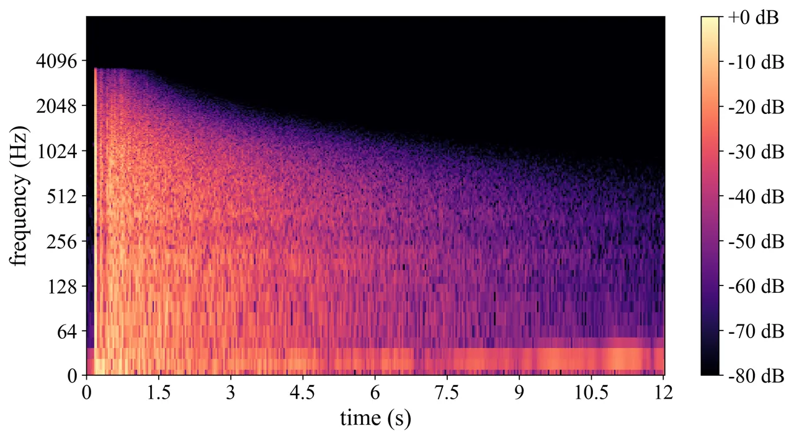

# TeCANet: Temporal-Contextual Attention Network for Environment-Aware Speech Dereverberation

Helin Wang    Bo Wu    Lianwu Chen    Meng Yu    Jianwei Yu    Yong Xu
   Shi-Xiong Zhang    Chao Weng    Dan Su    Dong Yu ^(†)^(†)thanks:
Part of this work performed when Helin Wang was interning at Tencent AI
Lab.

###### Abstract

In this paper, we exploit the effective way to leverage contextual
information to improve the speech dereverberation performance in
real-world reverberant environments. We propose a temporal-contextual
attention approach on the deep neural network (DNN) for
environment-aware speech dereverberation, which can adaptively attend to
the contextual information. More specifically, a FullBand based Temporal
Attention approach (FTA) is proposed, which models the correlations
between the fullband information of the context frames. In addition,
considering the difference between the attenuation of high frequency
bands and low frequency bands (high frequency bands attenuate faster
than low frequency bands) in the room impulse response (RIR), we also
propose a SubBand based Temporal Attention approach (STA). In order to
guide the network to be more aware of the reverberant environments, we
jointly optimize the dereverberation network and the reverberation time
(RT60) estimator in a multi-task manner. Our experimental results
indicate that the proposed method outperforms our previously proposed
reverberation-time-aware DNN and the learned attention weights are fully
physical consistent. We also report a preliminary yet promising
dereverberation and recognition experiment on real test data.

^(†)^(†)address: ¹Peking University, Shenzhen, China  
²Tencent AI Lab, Shenzhen, China  
³Tencent AI Lab, Bellevue, WA, USA^(†)^(†)email: wanghl15@pku.edu.cn,
{lambowu, lianwuchen, raymondmyu, tomasyu, lucayongxu, auszhang, cweng,
dansu, dyu}@tencent.com

Index Terms: speech dereverberation, reverberant environment, contextual
information, temporal attention

## 1 Introduction

When speech signals are obtained in an enclosed space by one or more
microphones positioned at a distance from the talker, the observed
signal consists of a superposition of many delayed and attenuated copies
of the speech signal due to multiple reflections from the surrounding
walls, ceilings, and floors \[1\]. As a result, intelligibility and
quality of speech is degraded especially when the reverberation effects
are severe \[2\]. The performances for automatic speech recognition
(ASR) \[3\], hearing aids and source localization are also severely
affected. Therefore, reducing the effect of reverberation is beneficial
for the speech applications.



Figure 1: The spectrum of a real RIR.

To deal with the reverberation, many dereverberation techniques have
been developed in the past decades, such as estimating an inverse filter
of the room impulse response (RIR) \[4, 5\], and separating speech and
reverberation via homomorphic transformation \[6, 7\]. In recent years,
deep neural networks (DNNs) \[8\] have been utilized in speech
enhancement \[9\] and source separation \[10\], and substantially
outperformed conventional methods. For speech dereverberation, Han et
al. \[11\] firstly proposed to learn a spectral mapping from reverberant
speech to anechoic speech with DNN. Considering the importance of
reverberation dependent parameters in supervised training, Wu et al.
\[12\] developed a reverberation-time-aware DNN approach to suppress
reverberation, which investigated the effect of different contexts in a
wide range of reverberation times (RT60s). However, the RT60-dependent
context is manually chosen and a RT60 estimator is needed during the
inference, which are quite unpractical in speech applications. In order
to capture long-term contextual information, Santos and Falk \[13\]
proposed a context-aware recurrent neural network (RNN) method, and Zhao
et al. \[14\] proposed a dereverberation algorithm using temporal
convolutional networks. Compared with speech denoising \[15, 16\] which
often benefits from incorporating long range contexts, the correlations
between the context frames are more crucial for speech dereverberation.
In a strong reverberant environment, the correlations between adjacent
frames tend to be strong and a long context is needed to capture
adequate contextual information. On the other hand, the long context may
bring out redundant information in a weak reverberant environment where
the correlations between neighboring frames are weak. In addition, as
shown in Figure 1, different frequency bands attenuate diversely in a
real RIR, where the attenuation of high frequency bands is faster than
that of low frequency bands \[1\]. Although several approaches had
applied self attention networks \[14, 17, 18\] to explore the relevance
among features at different time steps and frequency bands, they ignored
the physical relationships between the contextual information and
reverberant environments and the different attenuation between the
frequency bands, which could be exploited to realize the better
potential of neural networks.

In this paper, we propose a novel attention-based approach for speech
dereverberation, which can adaptively attend to the contextual
information by perceiving the reverberant environments. More
specifically, a temporal attention module is first applied to the input
features (i.e. the log-power spectrum of reverberant speech) to generate
dynamic representations according to the correlations between frames,
and a dereveration network is then employed to learn the nonlinear
mapping from the representations to the log-power spectrum of anechoic
speech. We use a small-footprint DNN model as the dereveration network
due to its adaptation to practical applications. Inspired by the
distinct attenuation between the frequency bands in the RIR, two types
of approaches are proposed to obtain the attention weights, including a
FullBand based Temporal Attention approach (FTA) and a SubBand based
Temporal Attention approach (STA). The whole system is trained with the
goal of both the dereverberation and the RT60 estimation, so that it
could be more aware of the reverberant conditions. Our experiments are
conducted on a public AISHELL-1 corpus \[19\], and the results show that
our proposed method can significantly outperform our previous
reverberation-time-aware methods \[12\] and generalize well to the real
RIRs.

Figure 2: Diagram of the DNN-based dereverberation system.

(a) FTA

(b) STA

Figure 3: The illustration of FTA and STA.

## 2 Proposed method

In this section, we first describe the baseline DNN system. We refer the
readers to \[12\] for details about the implementation of our previous
work on reverberation-time-aware (RTA). Then the proposed FullBand based
Temporal Attention approach (FTA) and SubBand based Temporal Attention
approach (STA) are detailed. After that, we present our
reverberation-environment-aware attention-based system, which implements
both the dereverberation and the estimation of RT60s in the training
stage.

### 2.1 DNN-Based Speech Dereverberation System

A block diagram of the DNN-based speech dereverberation system is
illustrated in Figure 2, which consists of a feature extraction module,
a dereverberation network and a waveform reconstruction module. Given
the clean speech $`s\left(t\right)`$ and room impulse response function
$`h\left(t\right)`$, the reverberant speech $`y\left(t\right)`$ can be
written as

```math
y\left(t\right)=s\left(t\right)*h\left(t\right)=x\left(t\right)+r\left(t\right) \tag{1}
```

where $`*`$ stands for the convolution operator, $`x\left(t\right)`$ and
$`r\left(t\right)`$ denote the anechoic speech (direct sound) and its
reverberation, respectively. Here, $`x\left(t\right)`$ is slightly
different from $`s\left(t\right)`$ by a time shift and an energy decay
caused by sound propagation through the direct path. Our objective is to
recover $`x\left(t\right)`$ from the corresponding reverberant
observation $`y\left(t\right)`$.

Following \[12\], the dereverberation task is to map the normalized
log-power spectrum (LPS) of the reverberant speech to the normalized LPS
anechoic speech. Supposing the number of frames in the utterance is
$`T`$ and the number of frequency channels is $`F`$, we use
$`\boldsymbol{Y}\in\mathbb{R}^{T\times F}`$ to denote the extracted LPS
features of the reverberant speech. Similarly, the LPS of the anechoic
speech can be denoted as $`\boldsymbol{X}`$, where
$`\boldsymbol{X}\in\mathbb{R}^{T\times F}`$. The dereverberation task is
now formulated to be a sequence-to-sequence mapping problem, i.e.,
$`\{\boldsymbol{Y}(i)\}\rightarrow\{\boldsymbol{X}(i)\},i=1,2,\ldots,T`$.
Finally, the dereverberated waveform is reconstructed from the estimated
LPS and the reverberant speech phase with an overlap-add method \[20\].

Figure 4: Diagram of the attention-based system.

Figure 5: Diagram of the reverberation-environment-aware attention-based
system.

### 2.2 FullBand based Temporal Attention Approach

In an enclosed space, the received signal will be a collection of many
delayed and attenuated copies of the original speech signal, resulting
in strong feature correlations at different time steps of the input
sequence. Reverberation information like reverberation time is embedded
in these correlations, and the correlations tend to be strong in a
severe reverberant environment while weak in a weak reverberant
situation. In order to explore the input sequence to adapt to various
reverberant environments, we introduce the attention mechanism, which
can dynamically attend to the relevant features. Different from the self
attention \[21\] that inputs the whole sequence, our method utilizes the
frames within a context window for each frame to calculate the dynamic
features, which greatly reduce the computational complexity.

|                            |                            |                |                |                |                |                |                |                |                |                |      |      |           |          |      |      |
| -------------------------- | -------------------------- | -------------- | -------------- | -------------- | -------------- | -------------- | -------------- | -------------- | -------------- | -------------- | ---- | ---- | --------- | -------- | ---- | ---- |
| Model                      | RT60 of simulated RIRs (s) |                |                |                |                |                |                |                |                |                |      |      | Real RIRs |          |      |      |
|                            | 0$`\sim`$0.1               | 0.1$`\sim`$0.2 | 0.2$`\sim`$0.3 | 0.3$`\sim`$0.4 | 0.4$`\sim`$0.5 | 0.5$`\sim`$0.6 | 0.6$`\sim`$0.7 | 0.7$`\sim`$0.8 | 0.8$`\sim`$0.9 | 0.9$`\sim`$1.0 | Avg. | WER  | PESQ      | fwSegSNR | STOI | WER  |
| Rev                        | 3.56                       | 3.45           | 3.10           | 2.83           | 2.65           | 2.52           | 2.40           | 2.28           | 2.20           | 2.10           | 2.67 | 33.8 | 3.05      | 8.92     | 0.82 | 33.2 |
| DNN-base-01                | 3.44                       | 3.39           | 3.18           | 2.97           | 2.82           | 2.70           | 2.60           | 2.48           | 2.40           | 2.29           | 2.80 | -    | -         | -        | -    | -    |
| DNN-base-03                | 3.39                       | 3.35           | 3.25           | 3.09           | 2.97           | 2.88           | 2.80           | 2.70           | 2.63           | 2.54           | 2.94 | -    | -         | -        | -    | -    |
| DNN-base-05                | 3.38                       | 3.35           | 3.25           | 3.13           | 3.02           | 2.94           | 2.87           | 2.77           | 2.73           | 2.64           | 2.99 | -    | -         | -        | -    | -    |
| DNN-base-07                | 3.37                       | 3.34           | 3.24           | 3.11           | 3.04           | 2.96           | 2.89           | 2.81           | 2.76           | 2.68           | 3.00 | -    | -         | -        | -    | -    |
| DNN-base-09                | 3.37                       | 3.34           | 3.24           | 3.13           | 3.03           | 2.97           | 2.91           | 2.83           | 2.79           | 2.70           | 3.02 | 30.1 | 3.10      | 9.40     | 0.82 | 30.1 |
| DNN-base-11                | 3.35                       | 3.32           | 3.22           | 3.11           | 3.02           | 2.95           | 2.89           | 2.82           | 2.78           | 2.70           | 3.00 | -    | -         | -        | -    | -    |
| DNN-base-13                | 3.34                       | 3.31           | 3.21           | 3.10           | 3.01           | 2.94           | 2.88           | 2.80           | 2.76           | 2.69           | 2.99 | -    | -         | -        | -    | -    |
| DNN-RTA-EstRT60 \[12\]     | 3.44                       | 3.39           | 3.26           | 3.13           | 3.04           | 2.97           | 2.92           | 2.83           | 2.80           | 2.71           | 3.04 | 28.6 | 3.08      | 9.39     | 0.82 | 32.1 |
| DNN-RTA-KnownRT60 \[12\]   | 3.45                       | 3.39           | 3.29           | 3.14           | 3.04           | 2.99           | 2.95           | 2.87           | 2.82           | 2.78           | 3.06 | -    | -         | -        | -    | -    |
| TeCANet-FTA (ours)         | 3.40                       | 3.37           | 3.27           | 3.15           | 3.06           | 2.99           | 2.93           | 2.86           | 2.82           | 2.74           | 3.04 | 27.7 | 3.14      | 9.56     | 0.83 | 28.1 |
| TeCANet-STA (ours)         | 3.47                       | 3.44           | 3.32           | 3.19           | 3.09           | 3.02           | 2.97           | 2.89           | 2.85           | 2.78           | 3.09 | 25.7 | 3.18      | 9.88     | 0.84 | 28.1 |
| TeCANet-FTA-EstRT60 (ours) | 3.46                       | 3.43           | 3.30           | 3.17           | 3.07           | 3.00           | 2.94           | 2.86           | 2.83           | 2.75           | 3.06 | 25.3 | 3.17      | 9.73     | 0.83 | 27.4 |
| TeCANet-STA-EstRT60 (ours) | 3.50                       | 3.47           | 3.35           | 3.21           | 3.12           | 3.05           | 2.99           | 2.92           | 2.88           | 2.81           | 3.11 | 23.7 | 3.22      | 9.98     | 0.84 | 28.4 |

Table 1: PESQ, fwSegSNR, STOI and WER of different models. Note that
DNN-based models use {1,3,5,7,9,11,13}-frame expansion.

Figure 3(a) shows the illustration of the proposed FullBand based
Temporal Attention approach (FTA). For the input feature of each time
step $`\boldsymbol{Y}\left(i\right)\in\mathbb{R}^{F}`$, a $`c`$-frame
expansion is firstly applied \[12\] to obtain the context feature
$`\boldsymbol{C}\left(i\right)\in\mathbb{R}^{F\times c}`$, which is then
passed to three parallel layers: query, key, and value. These layers map
the input feature to a query
$`\boldsymbol{Q}\left(i\right)\in\mathbb{R}^{d_{q}\times c}`$, a key
$`\boldsymbol{K}\left(i\right)\in\mathbb{R}^{d_{q}}`$, and a value
$`\boldsymbol{V}\left(i\right)\in\mathbb{R}^{d_{v}\times c}`$, where
$`d_{q}`$ and $`d_{v}`$ denote the dimension of the query and value,
respectively.

```math
\displaystyle\boldsymbol{Q}\left(i\right)=W_{Q}\boldsymbol{C}\left(i\right) \tag{2}
```

```math
\displaystyle\boldsymbol{K}\left(i\right)=W_{K}\boldsymbol{Y}\left(i\right) \tag{3}
```

```math
\displaystyle\boldsymbol{V}\left(i\right)=W_{V}\boldsymbol{C}\left(i\right) \tag{4}
```

where $`W_{Q}`$, $`W_{K}`$ and $`W_{V}`$ denote the respective weight
matrices. The weight distribution on the context frames is computed
based on the similarities between the query
$`\boldsymbol{Q}\left(i\right)`$ and key
$`\boldsymbol{K}\left(i\right)`$ by the scaled dot product.

```math
\boldsymbol{A}\left(i\right)=\operatorname{softmax}\left(\frac{\boldsymbol{Q}\left(i\right)^{T}\boldsymbol{K}\left(i\right)}{\sqrt{d_{\mathrm{q}}}}\right) \tag{5}
```

Multiplying the attention weights
$`\boldsymbol{A}\left(i\right)\in\mathbb{R}^{1\times c}`$ by the value
$`\boldsymbol{V}\left(i\right)`$, we get a weighted feature
$`\boldsymbol{Y^{\prime}}\left(i\right)\in\mathbb{R}^{d_{v}\times c}`$.

```math
\boldsymbol{Y^{\prime}}\left(i\right)=\boldsymbol{V}\left(i\right)\odot\boldsymbol{A}\left(i\right) \tag{6}
```

where $`\odot`$ denotes the element-wise multiplication.

### 2.3 SubBand based Temporal Attention Approach

FTA uses the fullband information of each frame to obtain the attention
weights. However, as shown in Figure 1, the attenuation of a RIR is
quite different between the frequency bands physically. Thus, we should
pay different attention to the contextual information in different
frequency bands. Figure 3(b) shows our proposed SubBand based Temporal
Attention approach (STA), where we separate the fullband spectrum
feature into a series of continuous subband spectrum features and apply
the FTA to each subband. Let
$`\left\{\boldsymbol{Y}^{1}\left(i\right),\boldsymbol{Y}^{2}\left(i\right),\ldots,\boldsymbol{Y}^{N}\left(i\right)\right\}`$
be the subband spectrum features of the $`i`$-th time step, where $`N`$
denotes the number of subbands. We can obtain the weighted features
$`\left\{\boldsymbol{Y}^{\prime^{1}}\left(i\right),\boldsymbol{Y}^{\prime^{2}}\left(i\right),\ldots,\boldsymbol{Y}^{\prime^{N}}\left(i\right)\right\}`$
and the attention weights
$`\left\{\boldsymbol{A}^{1}\left(i\right),\boldsymbol{A}^{2}\left(i\right),\ldots,\boldsymbol{A}^{N}\left(i\right)\right\}`$
with (2)-(6). Finally, we merge the weighted features and the attention
weights by concatenating them, respectively.

### 2.4 The Reverberation-Environment-Aware System

Figure 4 shows the attention-based system, where FTA or STA is employed
after the feature extraction module. The weighted feature
$`\boldsymbol{Y^{\prime}}`$ is concatenated and then fed to the
dereverberation network. In this case, the attention weights are
obtained by the similarity between the contexts. In order to let the
network be more aware of the reverberant environments, we propose to
jointly optimize the dereverberation and the estimation of RT60s, which
is shown in Figure 5. More specifically, the attention weights
$`\boldsymbol{A}`$ are passed to another network to estimate the RT60 of
each frame. In the training stage, the system implements both branches.
While in the inference stage, only the dereverberation branch is used so
that there are no extra parameters applied. Let
$`\boldsymbol{\hat{X}}\in\mathbb{R}^{T\times F}`$ and
$`\boldsymbol{\hat{Z}}\in\mathbb{R}^{T}`$ be the output of the
dereverberation network and the RT60 estimation network, respectively.
The mean squared error (MSE) is used as the loss function.

```math
\mathcal{L}(\boldsymbol{X},\boldsymbol{\hat{X}},\boldsymbol{Z},\boldsymbol{\hat{Z}};\Theta)=\frac{1}{T\times F}\|\boldsymbol{X}-\boldsymbol{\hat{X}}\|_{2}^{2}+\frac{1}{T}\|\boldsymbol{Z}-\boldsymbol{\hat{Z}}\|_{2}^{2} \tag{7}
```

where $`\|\bullet\|_{2}`$ denotes the $`l_{2}`$ norm and $`\Theta`$
denotes the learnable parameters of the networks.
$`\boldsymbol{X}\in\mathbb{R}^{T\times F}`$ denotes the LPS of the
anechoic speech and $`\boldsymbol{Z}\in\mathbb{R}^{T}`$ denotes the
ground truth of RT60 of the reverberant speech.

## 3 Experiments

### 3.1 Datasets

We simulated a reverberant version of public AISHELL-1 Mandarin corpus
\[19\]. There are $`120,098`$, $`14,326`$ and $`7,176`$ clean utterances
to generate training data, validation data and test data, respectively.
The classic image method \[22\] is used to generate room impulse
response (RIR) and reverberation time (RT60) ranges from $`0.01`$ to
$`1.0`$ s. The room configuration (length-width-height) is randomly
sampled from $`3`$-$`3`$-$`2.5`$ m to $`10`$-$`8`$-$`6`$ m. The
microphone and speakers are at least $`0.3`$ m away from the wall. The
distance between microphone array and speakers ranges from $`0.5`$ m to
$`10`$ m. All data is sampled at $`16`$ kHz. In addition, we used real
recored RIRs from the INTERSPEECH 2020 DNS Challenge¹¹ 1
https://github.com/microsoft/DNS-Challenge \[23\], and applied it to the
test set. Perceptual evaluation of speech quality (PESQ)\[24\],
frequency-weighted segmental signal-to-noise ratio (fwSegSNR) \[25\] and
short-time objective intelligibility (STOI) \[26\] were used to evaluate
the dereverberation results. In addition, we fed the dereverberated
speech to an ASR system \[27\], and tested the word error rate (WER).

Figure 6: Comparison of different context sizes.

### 3.2 Setups

For the input time-domain signal, a $`512`$-point short-time Fourier
transform (STFT) with a window size of $`32`$ ms and a window shift of
$`16`$ ms is applied to each frame, followed by the logarithmic
function, which results in $`257`$ frequency bins. Unless otherwise
stated, the number of the expansion frames is $`9`$. The dereverberation
network is a feedforward neural network with $`4`$ hidden layers with
$`2048`$, $`2048`$, $`2048`$ and $`257`$ hidden units. The RT60
estimation network is a feedforward neural network with $`3`$ hidden
layers with $`64`$, $`64`$ and $`1`$ hidden units, followed by a sigmoid
function. For STA, the number of subbands is set to $`8`$. The Adam
algorithm \[28\] is employed as the optimizer. The initial learning rate
is $`1\times 10^{-4}`$, and decayed by $`1\times 10^{-5}`$ if the loss
does not reduce for continuous three epochs. The mini-batch size is set
to $`16`$, and training is terminated after $`100`$ epochs.

Figure 7: Learned attention weights of FTA with/without RT60 Estimator.
We calculated the mean of all the weights on the test set and normalized
them by scaling the weight of current frame to $`1`$. Here, the context
index $`0`$,$`-n`$ and $`n`$ stand for the current frame, the past
$`n`$-th frame, and the future $`n`$-th frame, respectively.

Figure 8: Learned attention weights of STA. We reported four of the
frequency bands, including $`0`$-$`1`$ kHz, $`1`$-$`2`$ kHz, $`3`$-$`4`$
kHz and $`6`$-$`7`$ kHz.

### 3.3 Results

Table 1 shows the results of our proposed models and comparison models,
where we trained them on the training data with the simulated RIRs and
tested them on the test data with the simulated RIRs and real RIRs.
DNN-based models with different frame expansions got different
performances with the variation of the RT60s. From DNN-base-01 to
DNN-base-11, we can see that the longer the RT60 was, the higher PESQ
could be achieved with more context information. But for a short RT60,
more context information could not improve performance, and DNN-base-01
performed well, especially when the RT60 is in the range of
$`0`$$`\sim`$$`0.2`$ s. DNN-base-13 could not beat others under all the
RT60s because too much redundant information was introduced. Our
previously proposed DNN-RTA-EstRT60 and DNN-RTA-KnownRT60 in \[12\]
manually choose an optimal frame expansion according to the estimated
and oracle RT60s during the inference stage, respectively, which show
better performance than the DNN-based models. Thus, the main factor that
influences the quality of enhanced speech is not a long context but an
appropriate context that is relevant to the reverberant environments. It
should be noted that the RT60-dependent optimal context in
DNN-RTA-EstRT60 is extracted from lots of DNN-based experiments and a
high complexity RT60 estimator is needed in the inference stage. Our
proposed TeCANet-FTA obtained a comparable performance as
DNN-RTA-KnownRT60, owing to the FTA which models the correlations
between the context frames. Instead of manually choosing an optimal
frame expansion, our method works by adaptively attending to the
relevant contexts, which adjusts to the real applications better. As
shown in Figure 6, as the value of context size increases, the average
PESQ on the test set of DNN-based model is firstly boosted, then
achieves the peek when the context size is $`9`$, and finally
dramatically drops because of lacking a mechanism that suppress
redundant information. However, for TeCANet-FTA, too much context
information can hardly introduce the interference and the performance
tends to be stable when the context size is $`9`$ or more.

In addition, according to objective measures in both simulated and real
data, TeCANet-STA outperforms TeCANet-FTA, which shows the effectiveness
of paying different attention to different frequency bands. In order to
guide the networks to be more aware of the reverberant environments,
TeCANet-FTA-EstRT60 and TeCANet-STA-EstRT60 jointly optimize the
dereverberation and the RT60 estimation in the training stage. The
results demonstrate that TeCANet-FTA-EstRT60 and TeCANet-STA-EstRT60
beat TeCANet-FTA and TeCANet-STA, respectively. TeCANet-STA-EstRT60
achieves the highest PESQ ,STOI, and fwSegSNR among the models. As for
the ASR experiments, the only difference is that TeCANet-FTA-EstRT60
obtains the lowest WER in real RIRs, which may be caused by the gap
between the dereverberation and recognition. Although the subband
information and the RT60 estimation seems to be less effective in this
situation, all our proposed attention-based models still outperform
DNN-base-09, which shows good generalization to the real RIRs.

### 3.4 Visualization Analysis

In order to analyze the impacts of the attention module, the learned
attention weights are visualized. Figure 7 shows the mean of attention
weights of FTA on the test set. It can be found out that the network
learns to pay different attention to different context frames. The
weights of the frames near the current frame are larger than the weights
of the frames far from the current frame, and the current frame has the
largest weight. Meanwhile, for different RT60s, different attention
weights are obtained for the same context index. The longer the RT60 is,
the stronger the correlations between the contexts are, so that the
attention weights of the frames far from the current frame are larger.
In addition, by jointly predicting RT60 value, which is also related to
correlations between frames, the network can be more aware of the
reverberant environments. We can see that the learned attention weights
with RT60 estimator are more discriminative against the RT60s than the
learned attention weights without RT60 estimator.

Furthermore, we visualized the learned attention weights of STA which
takes into account the difference between the frequency bands. As shown
in Figure 8, the attention weights of the context frames for low
frequency bands (e.g. $`0`$-$`1`$ kHz) are quite larger than the ones
for high frequency bands (e.g. $`6`$-$`7`$ kHz), which means that the
network utilizes more contextual information for the low frequency
bands. This is exactly in accordance with the physical phenomena that
the attenuation of high frequency bands is quite faster than low
frequency bands.

## 4 Conclusions

In this paper, we have presented a reverberation-environment-aware
attention-based approach for speech dereverberation, which can
adaptively attend to the contextual information. We exploited the
correlations between the context frames and the different attenuation
between the frequency bands, and jointly optimized the RT60 estimation
to let the network be more aware of the reverberant environments.
Experimental results and visualization analysis validated the advantages
of our method.

## References

- \[1\] P. A. Naylor and N. D. Gaubitch, _Speech
  dereverberation_. Springer Science & Business Media, 2010.
- \[2\] A. C. Neuman, M. Wroblewski, J. Hajicek, and A. Rubinstein,
  “Combined effects of noise and reverberation on speech recognition
  performance of normal-hearing children and adults,” _Ear and Hearing_,
  vol. 31, no. 3, pp. 336–344, 2010.
- \[3\] T. Yoshioka, A. Sehr, M. Delcroix, K. Kinoshita, R. Maas,
  T. Nakatani, and W. Kellermann, “Making machines understand us in
  reverberant rooms: Robustness against reverberation for automatic
  speech recognition,” _IEEE Signal Processing Magazine_, vol. 29,
  no. 6, pp. 114–126, 2012.
- \[4\] M. Wu and D. Wang, “A two-stage algorithm for one-microphone
  reverberant speech enhancement,” _IEEE Transactions on Audio, Speech,
  and Language Processing_, vol. 14, no. 3, pp. 774–784, 2006.
- \[5\] S. T. Neely and J. B. Allen, “Invertibility of a room impulse
  response,” _The Journal of the Acoustical Society of America_,
  vol. 66, no. 1, pp. 165–169, 1979.
- \[6\] B. S. Atal, “Effectiveness of linear prediction characteristics
  of the speech wave for automatic speaker identification and
  verification,” _the Journal of the Acoustical Society of America_,
  vol. 55, no. 6, pp. 1304–1312, 1974.
- \[7\] H. Hermansky and N. Morgan, “Rasta processing of speech,” _IEEE
  Transactions on Speech and Audio Processing_, vol. 2, no. 4, pp.
  578–589, 1994.
- \[8\] G. E. Hinton and R. R. Salakhutdinov, “Reducing the
  dimensionality of data with neural networks,” _Science_, vol. 313, no.
  5786, pp. 504–507, 2006.
- \[9\] Y. Xu, J. Du, L.-R. Dai, and C.-H. Lee, “A regression approach
  to speech enhancement based on deep neural networks,” _IEEE/ACM
  Transactions on Audio, Speech, and Language Processing_, vol. 23,
  no. 1, pp. 7–19, 2014.
- \[10\] P.-S. Huang, M. Kim, M. Hasegawa-Johnson, and P. Smaragdis,
  “Deep learning for monaural speech separation,” in _IEEE International
  Conference on Acoustics, Speech and Signal Processing (ICASSP)_. IEEE,
  2014, pp. 1562–1566.
- \[11\] K. Han, Y. Wang, and D. Wang, “Learning spectral mapping for
  speech dereverberation,” in _IEEE International Conference on
  Acoustics, Speech and Signal Processing (ICASSP)_. IEEE, 2014, pp.
  4628–4632.
- \[12\] B. Wu, K. Li, M. Yang, and C.-H. Lee, “A
  reverberation-time-aware approach to speech dereverberation based on
  deep neural networks,” _IEEE/ACM Transactions on Audio, Speech, and
  Language Processing_, vol. 25, no. 1, pp. 102–111, 2016.
- \[13\] J. F. Santos and T. H. Falk, “Speech dereverberation with
  context-aware recurrent neural networks,” _IEEE/ACM Transactions on
  Audio, Speech, and Language Processing_, vol. 26, no. 7, pp.
  1236–1246, 2018.
- \[14\] Y. Zhao, D. Wang, B. Xu, and T. Zhang, “Monaural speech
  dereverberation using temporal convolutional networks with self
  attention,” _IEEE/ACM Transactions on Audio, Speech, and Language
  Processing_, vol. 28, pp. 1598–1607, 2020.
- \[15\] X. Lu, Y. Tsao, S. Matsuda, and C. Hori, “Speech enhancement
  based on deep denoising autoencoder.” in _Proc. Interspeech_, vol.
  2013, 2013, pp. 436–440.
- \[16\] K. Tan, X. Zhang, and D. Wang, “Real-time speech enhancement
  using an efficient convolutional recurrent network for dual-microphone
  mobile phones in close-talk scenarios,” in _IEEE International
  Conference on Acoustics, Speech and Signal Processing (ICASSP)_. IEEE,
  2019, pp. 5751–5755.
- \[17\] C. Liu and Y. Sato, “Self-attention for multi-channel speech
  separation in noisy and reverberant environments,” in _2020
  Asia-Pacific Signal and Information Processing Association Annual
  Summit and Conference (APSIPA ASC)_. IEEE, 2020, pp. 794–799.
- \[18\] K. Tan, B. Xu, A. Kumar, E. Nachmani, and Y. Adi, “SAGRNN:
  Self-attentive gated rnn for binaural speaker separation with
  interaural cue preservation,” _IEEE Signal Processing Letters_, 2020.
- \[19\] H. Bu, J. Du, X. Na, B. Wu, and H. Zheng, “Aishell-1: An
  open-source mandarin speech corpus and a speech recognition baseline,”
  in _20th Conference of the Oriental Chapter of the International
  Coordinating Committee on Speech Databases and Speech I/O Systems and
  Assessment (O-COCOSDA)_. IEEE, 2017, pp. 1–5.
- \[20\] J. Du and Q. Huo, “A speech enhancement approach using
  piecewise linear approximation of an explicit model of environmental
  distortions,” in _Ninth Annual Conference of the International Speech
  Communication Association_, 2008.
- \[21\] A. Vaswani, N. Shazeer, N. Parmar, J. Uszkoreit, L. Jones,
  A. N. Gomez, Ł. Kaiser, and I. Polosukhin, “Attention is all you
  need,” in _Proceedings of the 31st International Conference on Neural
  Information Processing Systems_, 2017, pp. 6000–6010.
- \[22\] E. A. Lehmann and A. M. Johansson, “Prediction of energy decay
  in room impulse responses simulated with an image-source model,” _The
  Journal of the Acoustical Society of America_, vol. 124, no. 1, pp.
  269–277, 2008.
- \[23\] C. K. Reddy, V. Gopal, R. Cutler, E. Beyrami, R. Cheng,
  H. Dubey, S. Matusevych, R. Aichner, A. Aazami, S. Braun _et al._,
  “The INTERSPEECH 2020 Deep Noise Suppression Challenge: Datasets,
  Subjective Testing Framework, and Challenge Results,” _Proc.
  Interspeech_, pp. 2492–2496, 2020.
- \[24\] I.-T. Recommendation, “Perceptual evaluation of speech quality
  (PESQ): An objective method for end-to-end speech quality assessment
  of narrow-band telephone networks and speech codecs,” _Rec. ITU-T P.
  862_, 2001.
- \[25\] Y. Hu and P. C. Loizou, “Evaluation of objective quality
  measures for speech enhancement,” _IEEE Transactions on audio, speech,
  and language processing_, vol. 16, no. 1, pp. 229–238, 2007.
- \[26\] C. H. Taal, R. C. Hendriks, R. Heusdens, and J. Jensen, “An
  algorithm for intelligibility prediction of time–frequency weighted
  noisy speech,” _IEEE Transactions on Audio, Speech, and Language
  Processing_, vol. 19, no. 7, pp. 2125–2136, 2011.
- \[27\] J. Yu, X. Xie, S. Liu, S. Hu, M. W. Lam, X. Wu, K. H. Wong,
  X. Liu, and H. Meng, “Development of the CUHK Dysarthric Speech
  Recognition System for the UA Speech Corpus,” _Proc. Interspeech_, pp.
  2938–2942, 2018.
- \[28\] D. P. Kingma and J. Ba, “Adam: A method for stochastic
  optimization,” in _3rd International Conference on Learning
  Representations (ICLR)_, 2015.
