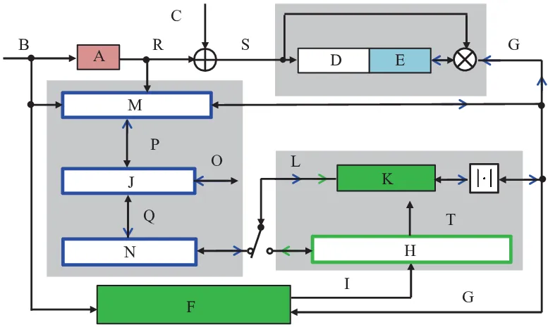

# Deep Noise Suppression With Non-Intrusive PESQNet Supervision Enabling the Use of Real Training Data

Ziyi Xu    Maximilian Strake    Tim Fingscheidt

###### Abstract

Data-driven speech enhancement employing deep neural networks (DNNs) can
provide state-of-the-art performance even in the presence of
non-stationary noise. During the training process, most of the speech
enhancement neural networks are trained in a fully supervised way with
losses requiring noisy speech to be synthesized by clean speech and
additive noise. However, in a real implementation, only the noisy speech
mixture is available, which leads to the question, how such data could
be advantageously employed in training. In this work, we propose an
end-to-end non-intrusive PESQNet DNN which estimates perceptual
evaluation of speech quality (PESQ) scores, allowing a reference-free
loss for real data. As a further novelty, we combine the PESQNet loss
with denoising and dereverberation loss terms, and train a complex
mask-based fully convolutional recurrent neural network (FCRN) in a
“weakly” supervised way, each training cycle employing some synthetic
data, some real data, and again synthetic data to keep the PESQNet
up-to-date. In a subjective listening test, our proposed framework
outperforms the Interspeech 2021 Deep Noise Suppression (DNS) Challenge
baseline overall by $`0.09`$ MOS points and in particular by $`0.45`$
background noise MOS points.

^(†)^(†)address: Institute for Communications Technology, Technische
Universität Braunschweig, Germany^(†)^(†)email:
$`\left\{\text{ziyi.xu, m.strake, t.fingscheidt}\right\}`$@tu-bs.de

Index Terms: speech enhancement, denoising, dereverberation, PESQ,
weakly supervised, real training data

## 1 Introduction

Speech enhancement aims at improving intelligibility and perceived
quality of a speech signal degraded by disturbances, which can include
both additive noise and reverberation. The classical solution for
single-channel denoising is to estimate a time-frequency (TF) domain
mask for spectral weighting \[1, 2, 3, 4, 5, 6\].

Data-driven approaches (e.g., deep learning) have facilitated the direct
estimation of TF-domain masks or the desired clean speech spectrum,
which provide state-of-the-art performance, even in the presence of
non-stationary noise \[7, 8, 9, 10, 11, 12, 13, 14, 15, 16\].
Convolutional neural networks (CNNs) are well-suited to preserve the
harmonic structures of the speech spectrum in denoising tasks \[12, 13,
14, 15, 16\]. Integrating long short-term memory (LSTM) into CNNs can
further improve the denoising performance as shown in recent studies
\[13, 14, 15, 16, 17\]. Strake et al. \[16\] proposed a fully
convolutional recurrent neural network (FCRN), combining CNNs with
convolutional LSTM (ConvLSTM) layers, which inherits the weight-sharing
property of the CNN, thereby improving performance over standard LSTM.

The Deep Noise Suppression (DNS) Challenge for Interspeech 2020 (DNS1)
\[18\], ICASSP 2021 (DNS2) \[19\], and Interspeech 2021 (DNS3) \[20\]
addressed a challenging task for joint dereverberation and denoising.
Strake et al. \[21\] achieved a second rank in the DNS1 non-realtime
track by training an actually realtime-capable FCRN for complex spectral
masking-based denoising and dereverberation, which we build upon. All of
the abovementioned works apply supervised training using synthetic data,
where clean speech and noise are prepared separately and are mixed by
addition, while reverberation (if considered) is applied by convolution
with simulated or recorded room impulse responses (RIRs). However, in a
real-world implementation, only the noisy speech mixture is available,
leading to the question, how such real data could be advantageously
employed in training. A semi-supervised training for speech enhancement
deep neural networks (DNNs) is proposed in \[22, 23, 24\], which utilize
both synthetic and real data. All of these works employ generative
adversarial networks (GANs), using a generator to separate the target
signal from the mixture, while a discriminator distinguishes between the
true clean speech signal and the enhanced signals. Thus, real data can
be used for training the generator, while synthetic data, where clean
speech must be available, is used for training the discriminator.
Furthermore, well-performing speech enhancement GANs usually still use
an additional discriminative loss term such as an L1 loss to stabilize
generator training \[22, 23\], which can only be employed for synthetic
data. Beyond GAN-type losses, to the best of our knowledge, it has not
yet been shown how real data can be used to train a speech enhancement
DNN.

To allow real data for non-GAN losses, a possible way is to train a
network which predicts absolute category rating (ACR) listener scores,
as, e.g., perceptual evaluation of speech quality (PESQ) \[25\] does it.
However, the original PESQ is a non-differentiable function, which
cannot be used as an optimization criterion for gradient-based learning.
Zhang et al. \[26\] implemented an approximated gradient descent for the
original PESQ, while Martín-Doñas et al. \[27\] proposed an approximated
PESQ formulation, which is differentiable. Zhao et al. \[28\] proposed a
supervised psychoacoustic loss, which outperforms the approximated PESQ
\[27\]. Fu et al. \[29\] trained an end-to-end DNN approximating the
PESQ function (so-called Quality-Net) without having to know any
computation details of the original PESQ formulation. The trained
Quality-Net is used to provide a differentiable PESQ loss for the
training of speech enhancement DNNs. However, as the original PESQ
\[25\], both \[27, 29\] require a clean reference signal, which makes
them only suitable for a fully supervised training approach.
Furthermore, the Quality-Net is fixed during the enhancement model
training, which strongly limits the performance, since the Quality-Net
can be fooled by the speech enhancement model (estimated PESQ scores
increase while true PESQ scores decrease) after training for several
minibatches, as reported by the authors of \[29\].

In our work, we propose an end-to-end non-intrusive PESQNet modeling the
PESQ function, and subsequently we employ it to train a speech
enhancement DNN. Our proposed PESQNet can estimate the PESQ score of the
enhanced signals without knowing the corresponding clean speech (just
like human raters in ACR listening tests), thus, it can serve to provide
a reference-free perceptual loss for training with real data.
Furthermore, we solved the problems addressed in \[29\] by training the
FCRN and the PESQNet alternatingly, similar to alternating training
schemes used in adversarial trainings \[22, 23, 24\]. We combine the
loss provided by the PESQNet and the successful FCRN loss from \[21\],
thereby training a complex mask-based FCRN in a “weakly” supervised way,
employing both synthetic and real data in training.

The rest of the paper is structured as follows: Section 2 introduces the
notations, the speech enhancement system, and our novel weakly
supervised training scheme with PESQNet. The experimental setup as well
as the results and discussion are presented in Section 3. We conclude
the work in Section 4.

## 2 Speech Enhancement With PESQNet

### 2.1 Deep Noise Suppression (DNS) by an FCRN

We assume the microphone mixture $`y(n)`$ to be composed of the clean
speech signal $`s(n)`$ reverberated by the room impulse response (RIR)
$`h(n)`$, and disturbed by additive noise $`d(n)`$ as

```math
\vskip-2.84526pty(n)=s(n)*h(n)+d(n)=s^{\text{rev}}(n)+d(n), \tag{1}
```

with $`s^{\text{rev}}(n)`$ and $`n`$ being the reverberated clean speech
component and the discrete-time sample index, respectively, and $`*`$
denoting a convolution operation. Since we perform a spectrum
enhancement, we transfer all the signals to the discrete Fourier
transform (DFT) domain (see Fig. 1):

```math
Y_{\ell}(k)=S^{\text{rev}}_{\ell}(k)+D_{\ell}(k),\vskip-2.84526pt \tag{2}
```

with frame index $`\ell`$ and frequency bin index
$`k\!\in\!\mathcal{K}\!=\!\left\{0,1,\ldots,K\!-\!1\right\}`$, and $`K`$
being the DFT size. Following \[21\], we use an FCRN structure
delivering a magnitude-bounded complex mask
$`M_{\ell}\left(k\right)\in\mathbb{C}`$, with
$`\left|M_{\ell}\left(k\right)\right|\in\left[0,1\right]`$ to obtain the
enhanced speech spectrum:

```math
\hat{S}_{\ell}\left(k\right)=Y_{\ell}(k)\cdot M_{\ell}\left(k\right).\vskip-2.84526pt \tag{3}
```

Finally, the enhanced speech spectrum $`\hat{S}_{\ell}\left(k\right)`$
is subject to an inverse DFT (IDFT), followed by overlap add (OLA) to
reconstruct the estimated signal $`\hat{s}(n)`$.

We adopt the fully-supervised loss function operating in the complex
spectrum domain proposed in \[21\], which consists of two loss terms.
The utterance-wise joint loss term aims at joint dereverberation and
denoising by utilizing the clean speech spectrum $`S_{\ell}(k)`$ as
target, and is defined as

```math
J^{\text{joint}}_{u}\!=\!\frac{1}{L\!\cdot\!K}\!\sum_{\ell\in\mathcal{L}_{u}}\sum_{k\in\mathcal{K}}\!\bigl|\hat{S}_{\ell}(k)\!-\!S_{\ell}(k)\bigr|^{2},\vskip-2.84526pt \tag{4}
```

with $`\mathcal{L}_{u}`$ being the set of frames belonging to the
utterance indexed with $`u`$, and
$`L\!=\!\bigl|\!\mathcal{L}_{u}\!\bigr|`$ being the number of frames. A
second loss term only focuses on denoising by employing the reverberated
clean speech spectrum $`S^{\text{rev}}_{\ell}(k)`$ as target in

```math
J^{\text{noise}}_{u}\!=\!\frac{1}{L\!\cdot\!K}\!\sum_{\ell\in\mathcal{L}_{u}}\sum_{k\in\mathcal{K}}\!\bigl|\hat{S}_{\ell}(k)\!-\!S^{\text{rev}}_{\ell}(k)\bigr|^{2}\!.\vskip-5.69054pt \tag{5}
```

Finally, the two loss terms (4) and (5) are weighted by $`\beta`$, and
combined in the final loss for synthetic data shown in Fig. 1:

```math
J^{\text{synth}}_{u}\!=\beta\cdot J^{\text{joint}}_{u}+(1-\beta)\cdot J^{\text{noise}}_{u},\vskip-5.69054pt \tag{6}
```

with $`\beta=0.9`$, as used in \[21\].

|                                  |                                                                                          |                |        |      |                                         |             |        |      |      |
| -------------------------------- | ---------------------------------------------------------------------------------------- | -------------- | ------ | ---- | --------------------------------------- | ----------- | ------ | ---- | ---- |
|                                  | Methods                                                                                  | Without reverb |        |      |                                         | With reverb |        |      |      |
| \cmidrule(r)3-6 \cmidrule(r)7-10 |                                                                                          | PESQ           | DNSMOS | STOI | $`\Delta\text{SNR}_{\text{seg}}`$\[dB\] | PESQ        | DNSMOS | STOI | SRMR |
| REF                              | Noisy                                                                                    | 2.21           | 3.15   | 0.91 | -                                       | 1.57        | 2.73   | 0.56 | -    |
|                                  | DNS3 Baseline \[17\], trained with synthetic data only                                   | 3.15           | 3.64   | 0.94 | 6.30                                    | 1.68        | 3.18   | 0.62 | 6.33 |
|                                  | FCRN, with loss (6) \[21\], trained with synthetic data only                             | 3.37           | 3.82   | 0.96 | 8.35                                    | 1.95        | 3.08   | 0.63 | 7.25 |
| New                              | FCRN/PESQNet, losses (9) and (7), $`\langle 0\!-\!2\!-\!50\rangle`$ (synth. data only)   | 3.35           | 3.88   | 0.95 | 8.40                                    | 1.92        | 3.11   | 0.61 | 7.41 |
|                                  | FCRN/PESQNet, losses (9) and (7), $`\langle 1\!-\!1\!-\!50\rangle`$ , $`\alpha\!=\!0.8`$ | 3.22           | 3.85   | 0.95 | 8.30                                    | 1.87        | 3.11   | 0.61 | 7.00 |
|                                  | FCRN/PESQNet, losses (9) and (7), $`\langle 1\!-\!1\!-\!50\rangle`$, $`\alpha\!=\!0.9`$  | 3.29           | 3.88   | 0.95 | 8.52                                    | 1.92        | 3.14   | 0.62 | 6.85 |

Table 1: Instrumental quality results on the DNS1 Challenge preliminary
test set $`\mathcal{D}^{\mathrm{synth,dev}}_{\mathrm{DNS1}}`$, evaluated
separately on synthetic data without and with reverberation. DNSMOS is
adopted from \[30\]. Best results are in bold font, and the second best
are underlined.

### 2.2 Novel PESQNet

Furthermore, we propose an end-to-end non-intrusive PESQNet to estimate
the PESQ score of an enhanced speech utterance in the DFT domain. This
network shall allow the use of real data to train the FCRN by providing
learning guidance without requiring a clean reference signal. Perceptual
speech quality estimation delivers a single value (label) for an entire
utterance, just as speech emotion recognition (SER) does. Furthermore,
models used for SER are always non-intrusive, which is suitable for our
reference-free PESQ estimation. So we adapted the SER model proposed in
\[31\], which shows state-of-the-art performance in emotion recognition,
to construct our PESQNet. The only difference to the original SER model
in \[31\] is that we change the input to the network from log-mel
spectrum to the amplitude spectrum, and the last output layer is changed
from four output nodes with softmax activation function to a single
output node with a gate function, which limits the estimated PESQ
between $`1.04`$ and $`4.64`$, as it is done in \[25\]. All other
settings can be taken from \[31\]. Note that any other SER model could
be used alternatively.

The output of the PESQNet should be as close as possible to its ground
truth measured by the original PESQ function \[25\]. Thus, the loss
function for PESQNet training is defined as

```math
J^{\text{PESQNet}}_{u}\!=\left(\widehat{\text{PESQ}}(u)-\text{PESQ}(u)\right)^{2},\vskip-2.84526pt \tag{7}
```

with $`\text{PESQ}(u)`$ being the true PESQ score of the utterance
indexed with $`u`$, measured by ITU-T P. 862 \[25\], see Fig. 1. Note
that $`J^{\text{PESQNet}}_{u}`$ (7) can only be employed with synthetic
data.



Figure 1: PESQNet and FCRN training setup. The switch is used to
alternately control the training of the FCRN (left switch position) or
the PESQNet (right switch position).

### 2.3 Novel Weakly Supervised Training with PESQNet

The pre-trained PESQNet is employed at the output of the FCRN estimating
the PESQ scores of the enhanced speech, which should be maximized.
Therefore, we can define a loss function

```math
J^{\text{real}}_{u}\!=\left(\widehat{\text{PESQ}}(u)-4.64\right)^{2} \tag{8}
```

for utterance $`u`$, which is minimized during FCRN training as shown in
Fig. 1. Please note that $`J^{\text{real}}_{u}`$ (8) is a speech
enhancement loss, which for the first time, allows the use of real data
beyond GAN-type losses. Furthermore, for synthetic data only, we can
explicitly consider joint dereverberation and denoising by combining the
synthetic loss (6) with the novel reference-free psychoacoustic loss
(8). Thus, our proposed final loss function for utterance $`u`$ in the
weakly supervised training employing both real and synthetic data is

```math
J^{\text{total}}_{u}=\begin{cases}J^{\text{real}}_{u},\ &\text{for real data}\ \mathcal{D}^{\text{real}}\\
\alpha\cdot J^{\text{synth}}_{u}\!+\!(1\!-\!\alpha)\!\cdot\!J^{\text{real}}_{u},\ &\text{for synthetic data}\ \mathcal{D}^{\text{synth}},\end{cases}\vskip-2.84526pt \tag{9}
```

with $`\alpha\in\left[0,1\right]`$ being the weighting factor.

To prevent a fixed PESQNet from being fooled by the updated FCRN
(estimated PESQ scores increase while true PESQ scores decrease \[29\]),
we use an alternating training protocol for adapting the FCRN with (9)
and the PESQNet with (7). The FCRN and PESQNet training is illustrated
in Fig. 1. A zero-mean and unit-variance normalization based on the
statistics collected on the training set is represented by the NORM box
in Fig. 1. The FCRN and the PESQNet are trained alternately, controlled
by the switch in left and right position, respectively. The left grey
box containing the total loss $`J^{\text{total}}_{u}`$ (9) is used for
FCRN training with a fixed PESQNet. The lower-right grey box shows the
PESQNet training adapting it to the current fixed FCRN, employing
$`J^{\text{PESQNet}}_{u}`$ (7). The blue and green arrows indicate the
gradient flow back-propagated for FCRN and PESQNet training,
respectively.

## 3 Experimental Evaluation

### 3.1 Datasets, Methods, Training, and Metrics

In this work, signals have a sampling rate of $`16\,\text{kHz}`$ and we
apply a periodic Hann window with frame length of $`384`$ with $`50\%`$
overlap, followed by an FFT with $`K=512`$. We directly adopted the FCRN
from \[21, Fig. 2\] as our DNS model, with exactly the same settings, as
we do not focus on network topologies here. Note that the number of
input and output frequency bins is $`K_{\rm in}=257+3=260`$. The last 3
frequency bins are redundant and only used for compatibility with the
two maxpooling and upsampling operations, and are dropped for subsequent
processing. With these settings (24 ms frame size and 12 ms frame
shift), we measured a real-time factor of $`r=0.95`$ on an Intel Core i5
quad core machine (3.4 GHz clock), meeting both real-time and the
algorithmic delay restrictions
($`24\,\text{ms}\!+\!12\,\text{ms}\!=\!36\,\text{ms}`$ $`\leq`$ 40 ms)
of the Interspeech 2021 DNS Challenge \[20\].

First, we pre-train the FCRN model using the WSJ0 speech corpus \[32\]
(dubbed $`\mathcal{D}^{\text{synth}}_{\text{WSJ0}}`$) and loss (6).
Secondly, the PESQNet is pre-trained on the same dataset with the
enhanced speech spectrum $`\hat{S}_{\ell}(k)`$ generated by the
pre-trained and fixed FCRN, using loss (7). After the pre-trainings, we
propose a two-stage fine-tuning with subsets of the data from DNS3
(denoted as $`\mathcal{D}^{\text{synth}}_{\text{DNS3}}`$). In a first
stage, we fine-tune the pre-trained FCRN with the synthetic loss (6) on
the $`\mathcal{D}^{\text{synth}}_{\text{DNS3}}`$ dataset and
subsequently, we fine-tune the PESQNet on the same dataset with the
enhanced speech spectrum generated by the fixed fine-tuned FCRN, again
with loss (7).

The second-stage (final) fine-tuning is used to advantageously employ
real data for a weakly supervised training. Thus, besides the synthetic
dataset $`\mathcal{D}^{\text{synth}}_{\text{DNS3}}`$, we also
constructed a real dataset $`\mathcal{D}^{\text{real}}_{\text{DNS1+2}}`$
comprising the real recordings from both preliminary and blind test
datasets from DNS1 and DNS2, in total $`4`$ hours of training material
and $`0.4`$ hours of validation material. Only for the model which is
used to process the final blind test data
$`\mathcal{D}^{\mathrm{test}}_{\mathrm{DNS3}}`$ for a subjective
listening test, we employ a real dataset with additional real data from
the DNS3 development set (not blind test set of course), denoted as
$`\mathcal{D}^{\text{real}}_{\text{DNS1+2+3}}`$. A cycle of our novel
training protocol (second stage) is as follows: We first train the FCRN
with a fixed PESQNet, employing one minibatch (3 utterances) of real
data followed by one minibatch of synthetic data using loss (9). The
minibatch with synthetic data not only explicitly considers denoising
and dereverberation, but also prevents the FCRN from generating
additional artifacts in the enhanced speech spectrum. Then, we fix the
FCRN, and train the PESQNet with $`50`$ consecutive minibatches of
synthetic data using (7), with the enhanced speech obtained from the
current FCRN as shown in Fig. 1. This training protocol is dubbed
$`\langle 1\!-\!1\!-\!50\rangle`$. We further explore performance when
replacing the real minibatch data by an additional synthetic minibatch,
which is dubbed $`\langle 0\!-\!2\!-\!50\rangle`$. The weighting factor
$`\alpha`$ in $`J^{\text{total}}_{u}`$ (9) is set to $`0.9`$ for all
trainings, only for the novel training protocol
$`\langle 1\!-\!1\!-\!50\rangle`$ we perform an extra experiment with
$`\alpha=0.8`$. During second-stage fine-tuning, for either the proposed
protocol $`\langle 1\!-\!1\!-\!50\rangle`$ or for the purely synthetic
reference protocol $`\langle 0\!-\!2\!-\!50\rangle`$, the FCRN model and
the corresponding PESQNet are saved after every $`39`$ protocol runs.
Among all the saved FCRN models, we select the one which provides the
lowest loss (9) on the respective validation sets of real or synthetic
data. In our case, measurements on both real and synthetic validation
sets lead to the same finally chosen model.

The pre-training dataset $`\mathcal{D}^{\text{synth}}_{\text{WSJ0}}`$ is
exactly the same as used in \[21\], which is synthesized with clean
speech from the WSJ0 corpus \[32\] and noise from DEMAND \[33\] and QUT
\[34\]. We simulate SNR conditions of $`0`$, $`5`$, and $`10`$ dB
according to ITU-T P.56 \[35\]. No reverberation effects are considered
in preparation of the pre-training dataset.

The fine-tuning dataset $`\mathcal{D}^{\text{synth}}_{\text{DNS3}}`$
contains $`100`$ hours of training material and $`10`$ hours of
validation material with a uniformly sampled SNR between $`0`$ and
$`40`$ dB. We reverberate $`50\%`$ of the files in
$`\mathcal{D}^{\text{synth}}_{\text{DNS3}}`$ by convolving the clean
speech component with simulated RIRs following \[21\].

We use the preliminary synthetic test set from DNS1 \[18\] (dubbed
$`\mathcal{D}^{\text{synth, dev}}_{\text{DNS1}}`$), which contains
synthetic noisy speech mixtures with and without reverberation for
instrumental performance measurement. For the noisy mixtures without
reverberation, we measured the segmental SNR improvement
$`\Delta\text{SNR}_{\text{seg}}`$ \[36\]. To evaluate the
dereverberation effects, we measured the speech-to-reverberation
modulation energy ratio (SRMR) \[37\] under reverberated conditions. For
both conditions, we measure PESQ \[25\], short-term objective
intelligibility (STOI)\[38\], and the DNSMOS \[30\] on the enhanced
speech. We furthermore measure the performance on real data using DNSMOS
on real recordings of the preliminary test set
$`\mathcal{D}^{\mathrm{real,dev}}_{\mathrm{DNS3}}`$ from DNS3 \[20\].

The final evaluation using a subjective listening test following the
P.835 framework \[39\] is carried out by the DNS Challenge organizers
based on a blind test set $`\mathcal{D}^{\text{test}}_{\text{DNS3}}`$,
which has not been seen in any training, development, or optimization
process.

### 3.2 Results and Discussion

|     |                                                                                                  |        |
| --- | ------------------------------------------------------------------------------------------------ | ------ |
|     | Methods                                                                                          | DNSMOS |
| REF | Noisy                                                                                            | 2.90   |
|     | DNS3 Baseline \[17\], trained with synthetic data only                                           | 3.24   |
|     | FCRN, with loss (6) \[21\], trained with synthetic data only                                     | 3.30   |
| New | FCRN/PESQNet, losses (9) and (7), $`\langle 0\!-\!2\!-\!50\rangle`$ (synth. data only)           | 3.31   |
|     | FCRN/PESQNet, losses (9) and (7), $`\langle 1\!-\!1\!-\!50\rangle`$ , $`\alpha\!=\!0.8`$         | 3.31   |
|     | FCRN/PESQNet, losses (9) and (7), $`\langle 1\!-\!1\!-\!50\rangle`$, $`\alpha\!=\!0.9`$          | 3.33   |
|     | FCRN/PESQNet, losses (9) and (7), $`\langle 1\!-\!1\!-\!50\rangle`$, $`\alpha\!=\!0.9`$ (oracle) | 3.36   |

Table 2: Perceptual quality measure DNSMOS \[30\] on the current DNS
Challenge preliminary test set
$`\mathcal{D}^{\mathrm{real,dev}}_{\mathrm{DNS3}}`$, evaluated on real
recordings. Best results are in bold font, and the second best are
underlined (oracle experiment excluded).

In Table 1 we evaluate the performance of our novel weakly supervised
training by performing an instrumental measurement on the synthetic test
set $`\mathcal{D}^{\text{synth, dev}}_{\text{DNS1}}`$. As references, we
report the performance of the DNS3 baseline \[17\] and of the FCRN
employing only the synthetic loss (6) \[21\], both being trained with
the synthetic dataset $`\mathcal{D}^{\text{synth}}_{\text{DNS3}}`$.
Finally, the performance is measured for the FCRN trained with our novel
loss $`J^{\text{total}}_{u}`$ (9), employing either synthetic data only,
or both synthetic and real data. Please note that the results in Table 1
are measured on synthetic data
$`\mathcal{D}^{\text{synth, dev}}_{\text{DNS1}}`$, and therefore only
serve to prove that our novel proposed framework using synthetic and
real data does not deteriorate under synthetic data. We observe that the
DNS baseline offers the worst perceptual quality (PESQ, DNSMOS) for the
conditions without reverberation. This can be attributed to an
insufficient SNR improvement, reflected by an about $`2`$ dB lower
$`\Delta\text{SNR}_{\text{seg}}`$ compared to other methods. Under
reverberated conditions, the baseline offers the worst dereverberation
performance reflected by the lowest SRMR score, but is good in DNSMOS.
The FCRN trained with synthetic loss (6) offers the highest perceptual
quality and intelligibility reflected by PESQ and STOI scores,
respectively, under both reverberation conditions. Our proposed
FCRN/PESQNet trained with losses (9) and (7), but only using synthetic
data ($`\langle 0\!-\!2\!-\!50\rangle`$ protocol) shows good balanced
performance with six out of eight 1^(st) and 2^(nd) ranked metrics. When
including real training data as well (proposed
$`\langle 1\!-\!1\!-\!50\rangle`$ protocol, with $`\alpha\!=\!0.9`$),
still six 1^(st) and 2^(nd) ranks are obtained, which shows that
including real data in training doesn’t considerably harm performance on
synthetic dataset $`\mathcal{D}^{\text{synth, dev}}_{\text{DNS1}}`$.
Further decreasing $`\alpha`$ in (9) to $`0.8`$ degrades the performance
to only three 2^(nd) ranked metrics.

To evaluate the performance on real data, our actual goal, we measured
the DNSMOS score on the real recordings from
$`\mathcal{D}^{\mathrm{real,dev}}_{\mathrm{DNS3}}`$ as shown in Table 2.
Even though only a small amount of real data (4 hours) was added to the
training material, our novel loss $`J^{\text{total}}_{u}`$ (9) with
$`\alpha\!=\!0.9`$ employing both real and synthetic data offers the
highest DNSMOS score $`(3.33)`$ among all methods (except for the oracle
experiment). This indicates that by training our FCRN with the help of
the non-intrusive PESQNet and the novel $`J^{\text{total}}_{u}`$ (9),
real data can be advantageously employed during training, which can
improve the DNS performance in a real test environment. The setting with
$`\alpha\!=\!0.8`$ shows that, for such a benefit, a high weight on the
original synthetic loss $`J^{\text{synth}}_{u}`$ (6) is still needed.
With $`\alpha=0.9`$, however, we are able to prove that our
$`\langle 1\!-\!1\!-\!50\rangle`$ protocol with the reference-free
PESQNet indeed solves the earlier observed issues reported by Fu et al.
\[29\] with their proposed Quality-Net. Accordingly, at this point we
already can conclude that with our proposed
$`\langle 1\!-\!1\!-\!50\rangle`$ protocol and the reference-free
PESQNet indeed is able to make use of real data. As an oracle
experiment, we trained our FCRN/PESQNet using the novel training
protocol $`\langle 1\!-\!1\!-\!50\rangle`$ with $`\alpha\!=\!0.9`$,
employing the data from
$`\mathcal{D}^{\mathrm{real,dev}}_{\mathrm{DNS3}}`$ not only for
evaluation, but also as the real data part during training. The further
increased DNSMOS of $`3.36`$ shows that the additional information from
real data can be advantageously used by employing the proposed training
protocol.

Comparing to the reference training protocol
$`\langle 0\!-\!2\!-\!50\rangle`$ employing only synthetic data, the
performance improvements of our proposed training protocol
$`\langle 1\!-\!1\!-\!50\rangle`$ with $`\alpha\!=\!0.9`$, reflected by
a $`0.02`$ points higher DNSMOS, are only sight. In this work, however,
we are limited to a very small amount of real data (4 hours) used in
training, when compared to the amount of synthetic data (100 hours).
Accordingly, during training, all the real data has to be repeatedly
used for several times even during one epoch of synthetic data, which
may limit the performance, and especially the generalization capability,
on real data. In turn, we believe that the use of much more real data
will provide an even more significant performance gain.

|                                                                                         |             |
| --------------------------------------------------------------------------------------- | ----------- |
| Submissions                                                                             | Overall MOS |
| Noisy                                                                                   | 2.77        |
| DNS3 Baseline \[17\], trained with synthetic data only                                  | 3.07        |
| FCRN/PESQNet, losses (9) and (7), $`\langle 1\!-\!1\!-\!50\rangle`$, $`\alpha\!=\!0.9`$ | 3.16        |

Table 3: Subjective quality results in terms of MOS scores according to
ITU-T P.835 on the blind test set
$`\mathcal{D}^{\mathrm{test}}_{\mathrm{DNS3}}`$. Extracted from the DNS
Challenge’s Track 1 (real-time track for wideband signal). Best results
are marked in bold.

Table 3 presents the overall MOS scores from the subjective listening
test carried out by the DNS3 organizers based on the blind test set
$`\mathcal{D}^{\text{test}}_{\text{DNS3}}`$, which contains both
synthetic and real data. Our proposed framework outperforms the DNS3
baseline \[17\], which is trained only with synthetic data, by $`0.09`$
MOS points. To some extent, this also confirms the DNSMOS results shown
in Table 2, where our proposed framework also outperforms the DNS3
baseline by $`0.09`$ DNSMOS points. Furthermore, our proposed framework
delivers a natural-sounding background noise reflected by the reported
background noise MOS of $`4.33`$, leading to an improvement of $`0.45`$
MOS points over the DNS3 baseline.

## 4 Conclusions

In this paper we illustrate the benefits obtained form training a
complex mask-based FCRN for speech enhancement in a “weakly” supervised
way employing both synthetic and real data. We propose a non-intrusive
PESQNet, providing a reference-free perceptual loss for the training of
speech enhancement neural networks using real data. Furthermore, the
PESQNet and the FCRN are trained alternately to keep the PESQNet
up-to-date. Our proposed framework can offer good performance on
synthetic data and improves over the reference methods on real data. In
the subjective listening test of the Interspeech 2021 DNS Challenge, our
proposed framework shows a $`0.09`$ points higher overall MOS score
compared to the challenge baseline. Furthermore, our framework also
improves over the baseline by $`0.45`$ background noise MOS points. Even
more importantly, however, we are the first to show how real noisy data
can be used to train a noise suppression DNN without the use of a
generative adversarial network (GAN).

## References

- \[1\] Y. Ephraim and D. Malah, “Speech Enhancement Using a Minimum
  Mean-Square Error Short-Time Spectral Amplitude Estimator,” _IEEE
  T-ASSP_, vol. 32, no. 6, pp. 1109–1121, Dec. 1984.
- \[2\] P. Scalart and J. V. Filho, “Speech Enhancement Based on A
  Priori Signal to Noise Estimation,” in _Proc. of ICASSP_, Atlanta, GA,
  USA, May 1996, pp. 629–632.
- \[3\] I. Cohen, “Speech Enhancement Using Super-Gaussian Speech Models
  and Noncausal A Priori SNR Estimation,” _Speech Commun._, vol. 47,
  no. 3, pp. 336–350, Nov. 2005.
- \[4\] T. Gerkmann, C. Breithaupt, and R. Martin, “Improved A
  Posteriori Speech Presence Probability Estimation Based on a
  Likelihood Ratio with Fixed Priors,” _IEEE T-ASLP_, vol. 16, no. 5,
  pp. 910–919, Jul. 2008.
- \[5\] B. Fodor and T. Fingscheidt, “MMSE Speech Enhancement Under
  Speech Presence Uncertainty Assuming (Generalized) Gamma Speech Priors
  Throughout,” in _Proc. of ICASSP_, Kyoto, Japan, Mar. 2012, pp.
  4033–4036.
- \[6\] S. Elshamy, N. Madhu, W. Tirry, and T. Fingscheidt,
  “Instantaneous A Priori SNR Estimation by Cepstral Excitation
  Manipulation,” _IEEE/ACM T-ASLP_, vol. 25, no. 8, pp. 1592–1605,
  Aug. 2017.
- \[7\] T. Fingscheidt and S. Suhadi, “Data-Driven Speech Enhancement,”
  in _Proc. of ITG Conf. on Speech Communication_, Kiel, Germany, Apr.
  2006, pp. 1–4.
- \[8\] T. Fingscheidt, S. Suhadi, and S. Stan, “Environment-Optimized
  Speech Enhancement,” _IEEE T-ASLP_, vol. 16, no. 4, pp. 825–834,
  May 2008.
- \[9\] Y. Wang, A. Narayanan, and D. L. Wang, “On Training Targets for
  Supervised Speech Separation,” _IEEE/ACM T-ASLP_, vol. 22, no. 12, pp.
  1849–1858, Dec. 2014.
- \[10\] F. Weninger, J. R. Hershey, J. Le Roux, and B. Schuller,
  “Discriminatively Trained Recurrent Neural Networks for Single-Channel
  Speech Separation,” in _Proc. of 2nd IEEE GlobalSIP_, Atlanta, GA,
  USA, May 2014, pp. 577–581.
- \[11\] Y. Wang and D. L. Wang, “A Deep Neural Network for Time-Domain
  Signal Reconstruction,” in _Proc. of ICASSP_, Brisbane, QLD,
  Australia, Aug. 2015, pp. 4390–4394.
- \[12\] S. Park and J. Lee, “A Fully Convolutional Neural Network for
  Speech Enhancement,” in _Proc. of INTERSPEECH_, Stockholm, Sweden,
  Aug. 2017, pp. 1993–1997.
- \[13\] H. Zhao, S. Zarar, I. Tashev, and C. Lee,
  “Convolutional-Recurrent Neural Networks for Speech Enhancement,” in
  _Proc. of ICASSP_, Calgary, AB, Canada, Apr. 2018, pp. 2401–2405.
- \[14\] K. Tan and D. Wang, “Complex Spectral Mapping with a
  Convolutional Recurrent Network for Monaural Speech Enhancement,” in
  _Proc. of ICASSP_, Brighton, UK, May 2019, pp. 6865–6869.
- \[15\] M. Strake, B. Defraene, K. Fluyt, W. Tirry, and T. Fingscheidt,
  “Separated Noise Suppression and Speech Restoration: LSTM-Based Speech
  Enhancement in Two Stages,” in _Proc. of WASPAA_, New Paltz, NY, USA,
  Oct. 2019, pp. 239–243.
- \[16\] ——, “Fully Convolutional Recurrent Networks for Speech
  Enhancement,” in _Proc. of ICASSP_, Barcelona, Spain, May 2020, pp.
  6674–6678.
- \[17\] S. Braun and I. Tashev, “Data Augmentation and Loss
  Normalization for Deep Noise Suppression,” _arXiv preprint
  arXiv:2008.06412_, Sep. 2020.
- \[18\] C. K. A. Reddy, H. Dubey, V. Gopal, R. Cheng, R. Cutler,
  S. Matusevych, R. Aichner, A. Aazami, S. Braun, P. Rana,
  S. Srinivasan, and J. Gehrke, “The Interspeech 2020 Deep Noise
  Suppression Challenge: Datasets, Subjective Speech Quality and Testing
  Framework,” _arXiv preprint arXiv:2001.08662_, Apr. 2020.
- \[19\] C. K. A. Reddy, H. Dubey, V. Gopal, R. Cutler, S. Braun,
  H. Gamper, R. Aichner, and S. Srinivasan, “ICASSP 2021 Deep Noise
  Suppression Challenge,” _arXiv preprint arXiv:2009.06122_, Sep. 2020.
- \[20\] C. K. A. Reddy, H. Dubey, K. Koishida, A. Nair, V. Gopal,
  R. Cutler, S. Braun, H. Gamper, R. Aichner, and S. Srinivasan, “The
  Interspeech 2021 Deep Noise Suppression Challenge,” _arXiv preprint
  arXiv:2101.01902_, Jan. 2021.
- \[21\] M. Strake, B. Defraene, K. Fluyt, W. Tirry, and T. Fingscheidt,
  “INTERSPEECH 2020 Deep Noise Supression Challenge: A Fully
  Convolutional Recurrent Network (FCRN) for Joint Dereverberation and
  Denoising,” in _Proc. of INTERSPEECH_, Shanghai, China, Sept. 2020,
  pp. 2467–2471.
- \[22\] S. Pascual, A. Bonafonte, and J. Serra, “SEGAN: Speech
  Enhancement Generative Adversarial Network,” _arXiv preprint
  arXiv:1703.09452_, Jun. 2017.
- \[23\] A. Pandey and D. L. Wang, “On Adversarial Training and Loss
  Functions for Speech Enhancement,” in _Proc. of ICASSP_, Calgary, AB,
  Canada, Apr. 2018, pp. 5414–5418.
- \[24\] Z. Meng, J. Li, Y. Gong, and B. H. Juang, “Cycle-Consistent
  Speech Enhancement,” _arXiv preprint arXiv:1809.02253_, Sep. 2018.
- \[25\] ITU, _Rec. P.862.2: Corrigendum 1, Wideband Extension to
  Recommendation P.862 for the Assessment of Wideband Telephone Networks
  and Speech Codecs_, International Telecommunication Standardization
  Sector (ITU-T), Oct. 2017.
- \[26\] H. Zhang, X. L. Zhang, and G. L. Gao, “Training Supervised
  Speech Separation System to Improve STOI and PESQ Directly,” in _Proc.
  of ICASSP_, Calgary, AB, Canada, Apr. 2018, pp. 5374–5378.
- \[27\] J. M. Martín Doñas, A. M. Gomez, J. A. Gonzalez, and A. M.
  Peinado, “A Deep Learning Loss Function Based on the Perceptual
  Evaluation of the Speech Quality,” _IEEE SPL_, vol. 25, no. 11, pp.
  1680–1684, Nov. 2018.
- \[28\] Z. Zhao, S. Elshamy, and T. Fingscheidt, “A Perceptual
  Weighting Filter Loss for DNN Training in Speech Enhancement,” in
  _Proc. of WASPAA_, New Paltz, NY, USA, Oct. 2019, pp. 229–233.
- \[29\] S. W. Fu, C. F. Liao, and Y. Tsao, “Learning with Learned Loss
  Function: Speech Enhancement with Quality-Net to Improve Perceptual
  Evaluation of Speech Quality,” _IEEE SPL_, vol. 27, no. 11, pp. 26–30,
  Nov. 2019.
- \[30\] C. K. A. Reddy, V. Gopal, and R. Cutler, “DNSMOS: A
  Non-Intrusive Perceptual Objective Speech Quality Metric to Evaluate
  Noise Suppressors,” _arXiv preprint arXiv:2010.15258_, Feb. 2021.
- \[31\] P. Meyer, Z. Xu, and T. Fingscheidt, “Improving Convolutional
  Recurrent Nerual Networks for Speech Emotion Recognition,” in _Proc.
  of SLT_, Shenzhen, China, Jan. 2021, pp. 1–8.
- \[32\] J. Garofolo, D. Graff, D. Paul, and D. Pallett, “CSR-I (WSJ0)
  Complete,” _Linguistic Data Consortium, Philadelphia_, 2007.
- \[33\] J. Thiemann, N. Ito, and E. Vincent, “The Diverse Environments
  Multi-Channel Acoustic Noise Database: A Database of Multichannel
  Environmental Noise Recordings,” _J. Acoustic. Soc. Am._, vol. 133,
  no. 5, pp. 3591–3591, 2013.
- \[34\] D. B. David, S. Sridharan, R. J. Vogt, and M. W. Mason, “The
  QUT-NOISE-TIMIT Corpus for the Evaluation of Voice Activity Detection
  Algorithms,” in _Proc. of INTERSPEECH_, Makuhari, Japan, Sept. 2010,
  pp. 3110–3113.
- \[35\] ITU, _Rec. P.56: Objective Measurement of Active Speech Level_,
  International Telecommunication Standardization Sector (ITU-T),
  Dec. 2011.
- \[36\] P. C. Loizou, _Speech Enhancement: Theory and Practice_. CRC
  press, 2013.
- \[37\] T. H. Falk, C. Zheng, and W. Y. Chan, “A Non-Intrusive Quality
  and Intelligibility Measure of Reverberant and Dereverberated Speech,”
  _IEEE T-ASLP_, vol. 18, no. 7, pp. 1766–1774, Aug. 2010.
- \[38\] C. H. Taal, R. C. Hendriks, R. Heusdens, and J. Jensen, “A
  Short-Time Objective Intelligibility Measure for Time-Frequency
  Weighted Noisy Speech,” in _Proc. of ICASSP_, Dallas, TX, USA, Jun.
  2010, pp. 4214–4217.
- \[39\] ITU, _Rec. P.835: Corrigendum 1, Subjective Test Methodology
  for Evaluating Speech Communication Systems that Include Noise
  Suppression Algorithm_, International Telecommunication
  Standardization Sector (ITU-T), Jan. 2011.
