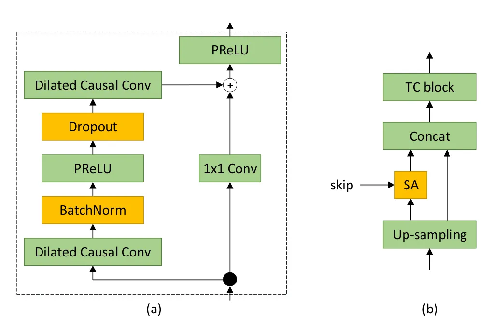
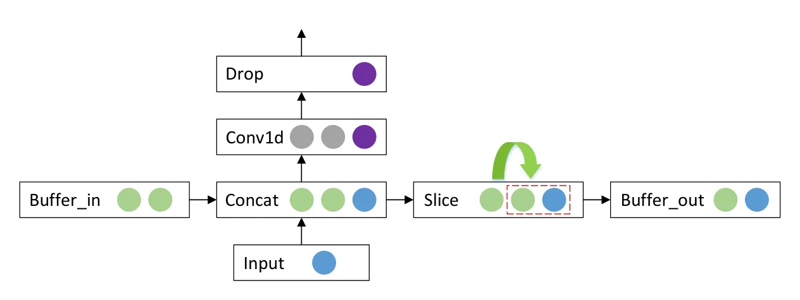

# Real-time Streaming Wave-U-Net with Temporal Convolutions for Multichannel Speech Enhancement

Vasiliy Kuzmin    Fyodor Kravchenko    Artem Sokolov    Jie Geng

###### Abstract

In this paper we describe our work that we have done to participate in
Task1 of ConferencingSpeech2021 challenge. This task set a goal to
develop the solution for multi-channel speech enhancement in a real-time
manner. We propose a novel system for streaming speech enhancement. We
employ Wave-U-Net architecture with temporal convolutions in encoder and
decoder. We incorporate self-attention in decoder to apply attention
mask retrieved from skip-connection on features from down-blocks. We
explore history cache mechanisms that work like hidden states in
recurrent networks and implemented them in proposal solution. It helps
us to run inference with chunks length 40 ms and Real-Time Factor  0.4
with the same precision.

^(†)^(†)address: ¹Huawei Russia Research Institute  
²Huawei Nanjing Research Institute, China  
³HSE University, Nizhniy Novgorod, Russia ^(†)^(†)email:
kuzmin.vasiliy@huawei.com, kravchenko.fyodor@huawei.com,
sokolov.artem@huawei.com, gengjie3@huawei.com

Index Terms: Multi-channel speech enhancement, speech enhancement,
wave-u-net, self-attention, deep learning

## 1 Introduction

Speech enhancement (SE) tries to separate out individual audio sources
from an input mixture of clean audio and noise. Multi-channel
approaches, generally, do it better than single-channel ones considering
that they could process spatial information taken from time differences
between signal reach separate items of microphone arrays (MA).
Conventional approaches like multi-channel Wiener filter  \[1\] or
beamforming  \[2\] are progressively displaced by deep learning (DL)
based techniques  \[3\] or by mixture with them  \[4\]. Deep learning
approaches with U-Net  \[5\] based architectures was very successfully
on various computer vision tasks connected to image and video processing
where we need to transform one image to another or extract topological
information that we need. Furthermore, this architecture was transferred
to speech related tasks close to SE as voice separation  \[6\] and
speech enhancement itself  \[7\]. This architecture works well as with
signal waveform as with its Short Time Fourier Transform (STFT)  \[8\].

The version adopted for processing time domain signal called Wave-U-Net
is also actively exploited nowadays for the same tasks  \[9\]. To obtain
real-time streaming speech enhancement the network should ignore the
future frames and provide the Real Time Factor (RTF) \< 1. Recurrent
networks like unidirectional Long-Short Time Memory  \[10\] (LSTM) and
Temporal Convolution Networks (TCN) could satisfy the first restrictions
as they are based on casual convolutions which have zero look ahead
 \[11\]. Moreover, convolutions are very fast and allow to build
real-time systems. LSTM mechanisms provide hidden states retrieving and
sequences could be handled step-by-step by passing previous states for
new iteration. But for convolution this trick is not supported
from-the-box. In  \[12\] the authors showed that history cache with
hidden states could be saved and reused. Thus, it is also possible to
fulfill inference with small pieces of stream, but it requires to
"manually" fed on hidden states from previous iteration with the input.
This paper proposes a neural network architecture based on Wave-U-Net
with temporal convolutions (TC Wave-U-Net) which uses cache with hidden
states for the inference.

To make prediction more precise various self-attention mechanisms are
incorporated in Wave-U-Net systems  \[13\]. We also do it in the paper
as casual convolution gives in to convolution with future context and
extra elements are required to yield acceptable precise.

This method was submitted to the ConferencingSpeech 2021 challenge¹¹ 1
[https://tea-lab.qq.com/conferencingspeech-2021](https://tea-lab.qq.com/conferencingspeech-2021)
in INTERSPEECH 2021 conference. Summarily, our primary contributions are
the follows:

- •
  We developed the novel model for the multi-channel speech enhancement
  task that can be inferences real-time manner, have zero look ahead and
  based on successful U-Net architecture. This model have only 8.31
  millions parameters and can be run on any device.
- •
  We applied historical context cache which allowed us to decrease
  receptive field during inference as well as decrease total number of
  float points operation.

The rest of the paper is organised as follows. First, in the following
section, we briefly review the background of the problem. In Section 3
we describe our Wave-U-Net based Temporal Convolution network with
attentions. The details of of our experiments and training procedure are
then presented in Section 4. We present the results and comparison with
the baseline system in Section 5. Finally, in Section 6 we provide some
conjectures as why and how to configure historical cache, further
research in this direction followed by conclusion.

## 2 Background

During participating ConferencingSpeech 2021 challenge we aimed to solve
Task1 which is Multi-channel speech enhancement with single microphone
array. This task expects the noisy audio processing from single linear
array with non-uniform distributed microphones. Real time factor
considering less than 1.0 while running on device as well as participant
should use frame of length 40 ms.

A multi-channel speech enhancement problem could be described the
following way:

Let take $`C`$ - channel signal on the $`t`$ time step as
$`Y_{t}=[y_{t}^{1},...,y_{t}^{c}]`$

We assume that $`y_{t}^{c}`$ is given as the following mathematical
expression:

```math
y_{t}^{c}=\overline{x_{t}^{c}}+n_{t}^{c}=h^{c}\circledast x_{t}^{c}+n_{t}^{c} \tag{1}
```

where $`x_{t}^{c}`$ the clean signal recorded by the $`C`$-th
microphone, $`n_{t}^{c}`$ is the additive noise signal and $`h^{c}`$ is
room impulse response (RIR). The convolution of RIR and dry signal
$`x_{t}^{c}`$ called reverberant signal $`\overline{x_{t}^{c}}`$. The
aim of Task1 is to estimate signal $`x_{t}^{orig}`$, where
$`orig\in\{1,...,C\}`$, by removing additive noise and by
dereverberation for whole utterance $`t=1,...,T`$. The $`x_{t}^{orig}`$
represents the original mono channel audio from multi-channel mixture
$`Y_{t}`$.

## 3 Architecture: Wave-U-Net with temporal convolutions

In this section, we explain the TC Wave-U-Net architecture with
attentions and history cache we implemented for streaming inference.

### 3.1 Structure of TC Wave-U-Net

Figure 1: Schematic view of TC Wave-U-Net.

We follow the Wave-U-Net structure for our multi-channel speech
enhancement solution. Our framework consists of an encoder, middle part
(bottleneck) and decoder. We use history padding to avoid the non
zero-look ahead. Schematically system is depicted on Figure 1. We note
that our model takes C-channel waveform as its input and predicts an
cleaned audio.

Encoder and decoder consist of TC blocks. The block internals are
visualised on Figure 2 (a). The block is a sequence of dilated casual 1d
convolution, batch normalization, parametric non-linearity, dropout and
one more convolution. A final Parametric Rectified Linear Unit  \[14\]
(PReLU) is applied after additive operation of result with residual
connection. We experimentally established that such architecture
provides better convergence. We keep the SAME padding everywhere and
after each TC block fulfill down-operation - reducing the time dimension
on half just by removing of each second element. Our experiments showed
that this kind of down sampling is more effective for our architecture
than, for example, stride 2 in the convolution. The decoder is organized
symmetrically but it composed a bit more complicated as comprises
attention mechanism (Figure 2(b)). We use linear interpolation for
$`2\times`$ up-sampling. Skip connection between encoder and decoder
blocks is organized as usual $`1D`$ convolution.

The papers  \[13\],  \[15\],  \[16\] inspired us to integrate a
self-attention to our architecture. We fed on self-attention an up block
and skip connection tensors from the same hierarchical level.
Afterwards, we concatenate Up Block output with self-attention output
and result goes to TC block.

Self-attention mechanism is intended to capture the global dependencies.
It is successfully exploit, for instance, in such fields of deep
learning as speech recognition  \[17\] and machine translation  \[18\].
In our architecture we employed attention by the similar way with
 \[13\] to find out relevant features came with skip connections by
multiplying it with attention mask. The same approach is applied before
the output of the network when original noisy signal and output from
up-block are passed to attention. Visual explanation of proposed
self-attention is shown Figure 3.

Let’s give $`l`$ the number of TC blocks in encoder/decoder. When
$`D_{i},i=1,...l`$ be output of down-blocks came as skip-connection and
$`U_{l-i}`$ be the output of linear interpolation. Attention uses
$`\bf{k}`$, $`\bf{q}`$ and $`\bf{v}`$ as $`1D`$ convolution operations
for the representation of input to embedding space. The products $`key`$
and $`query`$ are then summarised and, after parametric linearity, as
product $`P_{i}`$ follows to attention mask calculation $`A(P_{i})`$
which is a convolution with kernel size 1. The output of attention is a
term-wise product of $`W_{i}=A(P_{i})D_{i}`$. In our experiments,
attention block helps the network to converge deeper, while without it,
a model converges faster, however it gets stuck in some space.



Figure 2: (a) TC Block, (b) Up Block. The skip connection is the output
from the corresponding down-block.

Figure 3: Proposed Self-Attention

### 3.2 Streaming Inference

For streaming inference we employed idea from  \[12\]. Paper represents
how to extend the history context length which taken by a network into
account if the network was being trained on fixed-size segments of data.
The authors applied the mechanisms of hidden states reusing on the
Transformer architecture and achieved considerable gain in the length of
context remembered by the model. Intuitively it emulates the behavior of
recurrent networks that save information between time steps. We tested
this idea for TC Wave-U-Net in such a way that we do not try to extend,
we try to keep the context size for inference as network used for
training but for smaller chunk of data. It provokes the involved in
processing the only part of the receptive field. Moreover, it leads to
speed up of inference as calculations with floats should be dropped. In
the order to keep the accuracy the same as for inference with whole
shape we should "manually" reuse hidden states of each layer. As
mentioned before, the proposed method try to align conditions between
training and inference modes. For training we use padding for each
temporal convolution which could be calculated as
$`(kernel\_size-1)*dilation`$. This situation is depicted on
Figure 4(a). The network goes through a fixed chunk of data passed by
training framework, the size of which is bigger than the receptive field
of the network and all layers are correctly trained. Hidden states here
are passed in usual conditions from layer to layer automatically. For
inference we are going to engage just a part of receptive field
(Figure 4(b)). If we pass cropped inputs with padding it will most
likely lead to dramatic accuracy reduction, as weights did not learned
to handle such situation. Instead of that we enable cache mechanism. For
the first step we pass initiated by zeroes caches with the input. Cache
size for each convolution layer is equal padding we used for training.
It is concatenated with input and buffer for next iteration copied.
Afterwards the whole tensor included input and history cache is
convolved. Visual explanation of this sequence is presented on Figure 5.
At the end of the network we will have a stack of buffers with the
length equal to the total number of convolution layers in encoder,
bottleneck and decoder. Down and up blocks provoke shifting of starting
point for the next layer where new cache history is captured.

Figure 4: (a) Historical padding for training stage. (b) Historical
context cache for inference stage.



Figure 5: Context cache processing on inference time.

As mentioned previously, the down-sampling mechanism is equal to the
convolution with stride 2 and we have to take it into account when
calculate the position for copy beginning. This leads to shape
reduction.

## 4 Experiments

We conducted various experiments with our streaming TC Wave-U-Net model
to challenge its speech enhancement quality and demonstrate efficiency
of cache mechanism.

### 4.1 Datasets

The for training clean data we used audio speech datasets of Chineese
language AISHELL-1, AISHELL-3, sets Librispeech (train-clean-360) and
VCTK for the English language. The organizers were provided the lists
permitted audio files from that datasets with loudness larger than 15dB
that could be used for training procedure. The total duration of clean
training speech was around 550 hours. The noise set was composed from
two parts. Part 1 is selected from public noise datasets MUSAN and
Audioset with total duration about 120 hours. The Part 2 was a real
meeting room noise recordings. The total amount of provided clips was 98
items. Also we got simulated Room Impulse Responses (RIR) for the
reverberation affect obtaining. Provided framework allowed to augment
data on-the-fly during training. It considerably slow-down the training
procedure. We generated and saved data locally.

### 4.2 Evaluation Items

Thus, the following denoising systems were taken to evaluate the
efficacy of our proposed approach:

- •
  Baseline. LSTM-based solution, that was provided by organizers itself.
  Basically the model process audio in time and frequency domains. The
  baseline has 8 channels raw audio input. It calculates inter-channel
  phase difference between pairs of microphone channels, complex STFT
  for input signal and pass he concatenated tensor through 3 LSTMs. Each
  recurrent layer has 512 hidden states and, finally, they followed by a
  projection layer. Resulted mask is applied on channel 1 of original
  signal and inverse STFT returns the output of baseline solution.
- •
  Wave-U-Net. The implementation which we took from open GitHub
  repository²² 2
  [https://github.com/haoxiangsnr/Wave-U-Net-for-Speech-Enhancement](https://github.com/haoxiangsnr/Wave-U-Net-for-Speech-Enhancement).
  It exploits 12 convolution layers in encoder and decoder. We just made
  changes in code to establish the ability of C-channel raw waveform
  processing instead of original mono channel input.
- •
  TC Wave-U-Net. Our proposed model with time domain input, casual
  convolutions in encoder decoder and bottle-neck and self-attentions in
  decoder.

### 4.3 Experimental Setup

We fed to network multi-channel audio recordings with additive random
noise and convoluted with random RIRs. For training we capture random
piece with 16384 samples from 16 kHz raw waveforms and used that data
for input. Our network is constructed from 9 TC blocks in encoder and
decoder, 1 casual convolution layer in bottleneck. Filter size for
convolutions in encoder is 15 and 5 in decoder accordingly, as mentioned
in paper  \[19\]. All channel sizes for encoder are 8, 24, 48, 72, 96,
120, 144, 168, 192, 216 (and 240 in bottleneck). For decoder they are
repeated in reverse order. Dilation parameter for a each block is
changed by the following way 1, 1, 1, 2, 4, 5, 16, 32, 64. The receptive
field of the encoder is 1807 samples or  112 ms.

### 4.4 Learning Target

For the learning objective we used weighted signal-to-distortion loss
(wSDR)  \[20\]. This is a time-domain loss function that could be
defined by the following formula:

```math
L_{wSDR}(x,y,\overline{y}):=\alpha L_{SDR}(y,\overline{y})+(1-\alpha)L_{SDR}(z,\overline{z}) \tag{2}
```

where $`L_{SDR}`$ is a conventional signal-to-distortion (SDR) loss,
$`x`$ is a mixture signal is assumed as linear sum of clean speech
signal $`y`$ and original noise $`z`$. Estimated noise $`\overline{z}`$
given as $`\overline{z}=x-\overline{y}`$. The $`\overline{y}`$ is an
enhanced audio. Taken this into account the energy ratio $`\alpha`$
between dry speech $`y`$ and noise $`z`$ is defined as
$`\alpha=\parallel{y}\parallel^{2}/(\parallel{y}\parallel^{2}+\parallel{z}\parallel^{2})`$.

For the baseline system, we trained mean square error (MSE),
signal-to-distortion and wSDR. Our experiments show that SDR performed
better that MSE and wSDR was slightly better than SDR. In long training
scenarios with SDR loss the model wasn’t able to continue to converge
while with wSDR loss even after 300 epoch the model steadily improved.
We train all our models using $`6\times`$Tesla V100.

For the final training we choose wSDR loss and Adam optimizer with
starting learning rate = $`10^{-3}`$. The decayed learning scheduler was
applied with minimum value $`10^{-8}`$ after 250 epochs. Batch size is
equal 1000.

The baseline was trained using default configuration parameters, SDR
objective loss, Adam optimizer with learning rate = $`10^{-4}`$ and with
reduce on plateau scheduler. Chunks of 4 seconds was chooses by default
as well. The dataset was identical to primary experiment.

### 4.5 Streaming Measurements Setup

We evaluated the performance of Baseline, Wave-U-Net and our TC
Wave-U-Net in streaming mode. Wave-U-Net consist of simple convolution
layers and does not satisfy the requirement of challenge for zero-look
ahead. We changed code to conduct pseudo stream tensor processing. The
chunk with 16384 samples ($`\sim`$1 sec) is fed to the model with shift
640 samples (40 ms) and 40 ms of predicted audio was taken from output.
For the first times we provide chunk 40 ms, 80 ms, 120 ms etc. with
zero-padded left part till it reached full size 16384. For TC Wave-U-Net
with cache we pass chunk window with 1024 samples (64 ms), and move the
window on 640 samples (40 ms).

## 5 Results

### 5.1 Signal Quality

According to the conference rules, we push test dataset enhanced by our
system to organizers that evaluate our resulting audio. Moreover, they
provide mean opinion score (MOS) - measure of the human-judged overall
quality of an audio. Each rater determines MOS, subjective speech MOS
(S-MOS) and subjective noise MOS (N-MOS) for each cleaned recording.
Next, confidence interval (CI) of MOS score is calculated. Each file is
listened by more that 20 raters. In Table 5.2 we denoted the result of
comparing of our enhanced audio with noised raw waveforms.

### 5.2 Real Time Factor

In Table 5.2, we report Real Time Factor (RTF) (processing time divided
by audio duration) in relative scale where lower values indicate faster
processing and lower user-perceived latency.

We can see that the network with cache enabled outperforms the models
working with whole receptive field. It a bit slower than other networks
but it compensated by better precise. In the addition to mentioned
above, in Table 5.2 we demonstrate the evaluation results of our model
in streaming and non streaming modes. Baseline and vanilla Wave-U-Net
with pseudo streaming (see 4.5) are inferring close to the speed of TC
Wave-U-Net with cache but with the lower quality than these models for
non-streaming mode. PESQ for Baseline and Wave-U-Net with streaming 12%
and 8% less, respectively, than non-streaming. Also Wave-U-Net in
streaming mode don’t meet the requirement of challenge for zero-look
ahead.

Finally we converted TC Wave-U-Net to ONNX format to speed up the
solution. It gave us 0.37 RTF on Intel Core i5 clocked at 2.4GHz.

| Audio    | Metrics |       |       |      |
| -------- | ------- | ----- | ----- | ---- |
|          | MOS     | S-MOS | N-MOS | CI   |
| Noisy    | 2.56    | 2.93  | 3.03  | 0.02 |
| Enhanced | 2.90    | 3.05  | 3.05  | 0.04 |

| SetUp                                   | Audio    | Metrics |       |        |        |
| --------------------------------------- | -------- | ------- | ----- | ------ | ------ |
|                                         |          | PESQ    | STOI  | E-STOI | SI-SNR |
| Baseline                                | Noisy    | 1.515   | 0.823 | 0.690  | 4.474  |
| Baseline                                | Enhanced | 1.999   | 0.888 | 0.783  | 9.248  |
| Wave-U-Net                              | Enhanced | 2.132   | 0.888 | 0.797  | 9.528  |
| TC Wave-U-Net                           | Enhanced | 2.181   | 0.892 | 0.799  | 9.61   |
| TC Wave-U-Net cache enabled (Streaming) | Enhanced | 2.192   | 0.895 | 0.802  | 9.64   |

|                                         |      |      |       |
| --------------------------------------- | ---- | ---- | ----- |
| Model                                   | RTF  | PESQ | Size  |
| Baseline (Streaming)                    | 0.7X | 1.76 | 8.68  |
| Wave-U-Net (Streaming)                  | 0.9X | 1.93 | 10.14 |
| TC Wave-U-Net (Streaming)               | 3.3X | 2.18 | 8.31  |
| TC Wave-U-Net Cache enabled (Streaming) | X    | 2.19 | 8.31  |

## 6 Conclusions

This paper proposed our speech enhancement solution for Task1 on
ConferencingChallenge2021. We provided the Wave-U-Net based network that
outputs cleaned audio for passed raw waveform with reverberations and
additive noise. Our system employed casual dilated convolutions for
encoder, decoder and a bottleneck parts. It also involved
self-attentions in decoder for better precise. We implemented historical
cache and obtain fast streaming inference.

Our evaluation showed that adding cache mechanism for the model with
large receptive field not only can reduce it for the expected one, but
also reduce floating-point calculations, thereby improving the inference
speed. Even more we have shown that compared to pure pseudo streaming,
our proposed method provides the same quality as non-streaming model or
does it a bit better. Due to the low time constraints, we aren’t able to
do the full research of the evaluation of calculation of the beginning
of the cache, and have leaved it for the further research. Moreover, our
final model is still training and we are waiting for final metrics.

Future directions of this work could include experiments with deeper
versions of this architecture, new versions of TC blocks, incorporation
of Channel Attention and using complex ratio masking for signal
enhancement.

## 7 Acknowledgements

The work of Artem Sokolov is partially supported by RSF (Russian Science
Foundation) grant 20-71-10010.

## References

- \[1\] M. C. Simmer KU, Bitzer J, “Post-filtering techniques. in
  microphone arrays.” _Springer, Berlin, Heidelberg_, pp. 39–60, 2001.
- \[2\] M. Brandstein, “Arrays, microphone. signal processing techniques
  and applications.” _Springer Science & Business Media_, 2001.
- \[3\] Wang, DeLiang, and Jitong Chen., “Supervised speech separation
  based on deep learning: An overview.” _IEEE/ACM Transactions on Audio,
  Speech, and Language Processing_, pp. 1702–1726, May 2018.
- \[4\] Erdogan, Hakan, John R. Hershey, Shinji Watanabe, Michael I.
  Mandel, and Jonathan Le Roux., “Improved mvdr beamforming using
  single-channel mask prediction networks.” _Interspeech_, pp.
  1981–1985, Sep. 2016.
- \[5\] Ronneberger, O., Fischer, P. and Brox, T, “U-net: Convolutional
  networks for biomedical image segmentation,” _International Conference
  on Medical image computing and computer-assisted intervention_, pp.
  234–241, Oct. 2015.
- \[6\] Jansson, Andreas, Eric Humphrey, Nicola Montecchio, Rachel
  Bittner, Aparna Kumar, and Tillman Weyde, “Singing voice separation
  with deep u-net convolutional networks,” _18th International Society
  for Music Information Retrieval Conference_, pp. 23–27, 2017.
- \[7\] Ernst, O., Chazan, S.E., Gannot, S. and Goldberger, J.,
  “Improved speech enhancement with the wave-u-net.” _26th European
  Signal Processing Conference (EUSIPCO)_, pp. 390–394, Sep. 2018.
- \[8\] Soni, Meet H., Neil Shah, and Hemant A. Patil., “Time-frequency
  masking-based speech enhancement using generative adversarial
  network.” _IEEE international conference on acoustics, speech and
  signal processing (ICASSP)_, pp. 5039–5043, 2018.
- \[9\] Macartney, C. and Weyde, T., “Speech dereverberation using fully
  convolutional networks.” _arXiv preprint arXiv:1811.11307_, 2018.
- \[10\] Hochreiter, Sepp, and Jürgen Schmidhuber., “Long short-term
  memory.” _Neural computation_, pp. 1735–1780, Nov. 1997.
- \[11\] Tawara, N., Kobayashi, T. and Ogawa, T., “Multi-channel speech
  enhancement using time-domain convolutional denoising autoencoder.”
  _Interspeech_, pp. 86–90, 2019.
- \[12\] Dai, Z., Yang, Z., Yang, Y., Carbonell, J., Le, Q.V. and
  Salakhutdinov, R., “Transformer-xl: Attentive language models beyond a
  fixed-length context,” _arXiv preprint arXiv:1901.02860_, 2019.
- \[13\] Giri, R., Isik, U., Krishnaswamy, A., “Attention wave-u-net for
  speech enhancement,” _IEEE Transactions on Acoustics, Speech and
  Signal Processing_, vol. 28, pp. 249–253, Oct. 2019.
- \[14\] He K, Zhang X, Ren S, Sun J., “Delving deep into rectifiers:
  Surpassing human-level performance on imagenet classification.” _IEEE
  international conference on computer vision_, pp. 1026–1034, 2015.
- \[15\] Jansson, Andreas, Eric Humphrey, Nicola Montecchio, Rachel
  Bittner, Aparna Kumar, and Tillman Weyde, “Channel-attention dense
  u-net for multichannel speech enhancement.” _International Conference
  on Acoustics, Speech and Signal Processing_, pp. 836–840, 2020.
- \[16\] Ho, M.T., Lee, J., Lee, B.K., Yi, D.H. and Kang, H.G, “A
  cross-channel attention-based wave-u-net for multi-channel speech
  enhancement.” _Proceedings of Interspeech_, pp. 4049–4053, 2020.
- \[17\] Kriman, Samuel, Stanislav Beliaev, Boris Ginsburg, Jocelyn
  Huang, Oleksii Kuchaiev, Vitaly Lavrukhin, Ryan Leary, Jason Li, and
  Yang Zhang, “Quartznet: Deep automatic speech recognition with 1d
  time-channel separable convolutions.” _International Conference on
  Acoustics, Speech and Signal Processing (ICASSP)_, pp.
  6124–6128, 2020.
- \[18\] Bahdanau, D., Cho, K., Bengio, Y., “Neural machine translation
  by jointly learning to align and translate.” _arXiv preprint
  arXiv:1409.0473_, 2014.
- \[19\] D. Stoller, S. Ewert, and S. Dixon, “Wave-u-net: A multi-scale
  neural network for end-to-end audio source separation,” _arXiv
  preprint arXiv:1806.03185_, 2019.
- \[20\] H.-S. Choi, J.-H. Kim, J. Huh, A. Kim, J.-W. Ha, and K. Lee,
  “Phase-aware speech enhancement with deep complex u-net,” _arXiv
  preprint arXiv:1912.09582_, 2019.

Table 3: Real Time Factor for Streaming mode and Model sizes. Number of
parameters (Millions).

Table 2: Evaluation results of multichannel speech enhancement on Single
Linear Nonuniform MA.

Table 1: Results of evaluation test set enhanced with TC Wave-U-Net.
