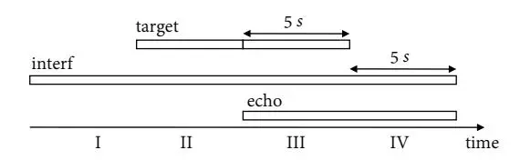

# Joint Online Multichannel Acoustic Echo Cancellation, Speech Dereverberation and Source Separation

Yueyue Na, Ziteng Wang, Zhang Liu, Biao Tian, Qiang Fu

## Alibaba Group

yueyue.nyy, ziteng.wzt@alibaba-inc.com

## Abstract

This paper presents a joint source separation algorithm that simultaneously reduces acoustic echo, reverberation and interfering sources. Target speeches are separated from the mixture by maximizing independence with respect to the other sources. It is shown that the separation process can be decomposed into cascading sub-processes that separately relate to acoustic echo cancellation, speech dereverberation and source separation, all of which are solved using the auxiliary function based independent component/vector analysis techniques, and their solving orders are exchangeable. The cascaded solution not only leads to lower computational complexity but also better separation performance than the vanilla joint algorithm.

**Index Terms**: echo cancellation, dereverberation, source separation, independent component analysis

## 1. Introduction

Smart devices that work in full-duplex speech interaction mode need to handle playback echos, room reverberation and interfering sources simultaneously. The three types of distortions are widely investigated in the literature and many classical algorithm have been developed separately, such as the normalized least mean square (NLMS) algorithm [1, 2] for acoustic echo cancellation (AEC), the weighted prediction error (WPE) algorithm [3, 4] for speech dereverberation (DR) and the auxiliary-function based independent component/vector analysis (Aux-ICA/IVA) algorithm [5, 6] for blind source separation (BSS). Joint solutions that consider two or three types of distortions are appealing, especially for real world applications, and could bring performance improvements over separate algorithms [7, 8, 9, 10, 11, 12, 13, 14, 15, 16, 17, 18].

Takeda et al. [7, 8] achieve both blind dereverberation and echo cancellation by applying a separation model of frequency domain ICA, which uses observed signal independence that holds under multiple input/output inverse filtering theorem (MINT) conditions. The authors also develop techniques to reduce the computational cost for their barge-in-able robot application.

Yoshioka et al. [9] propose a conditional separation and dereverberation (CSD) method, in which the separation and prediction matrices are alternately optimized with each depending on the other. Boeddeker et al. [11] propose a weighted power minimization distortionless response (WPD) beamformer that can perform simultaneous denoising and dereverberation. The beamformer is optimized under a single likelihood maximization criterion and shows superiority over the conventional cascade of WPE and a minimum-power distortionless response (MPDR) beamformer.

Several joint approaches have been proposed to perform AEC, DR and BSS at the same time [16, 17]. Togami and Kawaguchi [16] combine speech dereverberation, noise reduc-

tion and acoustic echo reduction in a unified framework by assuming a time-varying local Gaussian model of the microphone input signal. The algorithm parameters are iteratively optimized based on the expectation-maximization approach to calculate a minimum mean squared error estimate of a desired signal. Carbajal et al. [17] further introduce a neural network to model the short term spectra of the target and residual signals after echo cancellation and dereverberation.

Our previous work [19, 20] revisits the problem of DR and AEC, respectively, and proposes Aux-ICA based source separation approaches to each. This paper further proposes to jointly perform AEC, DR and BSS from a unified source separation perspective, assuming mutual independence of the mixing sources. A joint source separation algorithm is first presented, which however comes at a high computational cost. We then decompose the separation matrix heuristically, and divides the joint optimization problem into sub-problems that can be tackled sequentially. The sequential cascaded solution not only leads to lower computational complexity but also better separation performance, due to relaxation of the assumptions made in the joint algorithm.

The rest of this paper is organized as follows. In Section 2, we formulate the problem using a convolutive signal model. The joint source separation algorithm and cascaded solutions are presented in Section 3. Experiments and concluding remarks are respectively given in Section 4 and Section 5.

## 2. Problem formulation

We consider a multi-channel convolutive mixture in the short-time Fourier transform (STFT) domain. An array of M sensors captures signals from N near-end sources $\mathbf{s} = [s_1, s_2, ..., s_N]^T$ and R far-end sources $\mathbf{r} = [r_1, r_2, ..., r_R]^T$ , where $(\cdot)^T$ denotes transpose. The sensor signals $\mathbf{x} = [x_1, x_2, ..., x_M]^T$ are given by:

$$\mathbf{x}(t,f) = \sum_{l=0}^{\infty} \mathbf{A}_{l} \mathbf{s}(t-l,f) + \sum_{l=0}^{\infty} \mathbf{B}_{l} \mathbf{r}(t-l,f)$$
(1)

where $\mathbf{A}_l \in \mathbb{C}^{M \times N}$ and $\mathbf{B}_l \in \mathbb{C}^{M \times R}$ are the convolutive transfer functions (CTFs) at the lth frame step, t is the frame index and f is the frequency bin index. Since the proposed algorithm is frequency-wise, f is omitted in the following for brevity.

To extract the direct path and early reflections of the nearend sources, the signal model (1) can be approximately transformed into an auto-regressive model [8, 16] as follows:

$$\mathbf{x}(t) = \mathbf{A}_0 \mathbf{s}(t) + \bar{\mathbf{B}} \bar{\mathbf{r}}(t) + \bar{\mathbf{C}} \bar{\mathbf{x}}(t - \Delta)$$
(2)

where the delay $\Delta$ marks the boundary between early reflec-

tions and late reverberation, and

$$\bar{\mathbf{B}} = [\mathbf{B}_0, \mathbf{B}_1, ..., \mathbf{B}_{L_1-1}],$$

$$\bar{\mathbf{r}}(t) = [\mathbf{r}(t), \mathbf{r}(t-1), ..., \mathbf{r}(t-L_1+1)]^T,$$

$$\bar{\mathbf{C}} = [\mathbf{C}_0, \mathbf{C}_1, ..., \mathbf{C}_{L_2-1}],$$

$$\bar{\mathbf{x}}(t-\Delta) = [\mathbf{x}(t-\Delta), ..., \mathbf{x}(t-\Delta-L_2+1)]^T, \quad (3)$$

with L1, L2 the orders of transfer functions. The matrix notation of [\(2\)](#page-0-1) is given by:

$$\begin{bmatrix} \mathbf{x}(t) \\ \bar{\mathbf{r}}(t) \\ \bar{\mathbf{x}}(t-\Delta) \end{bmatrix} = \begin{bmatrix} \mathbf{A}_0 & \bar{\mathbf{B}} & \bar{\mathbf{C}} \\ \mathbf{0} & \mathbf{I}_1 & \mathbf{0} \\ \mathbf{0} & \mathbf{0} & \mathbf{I}_2 \end{bmatrix} \begin{bmatrix} \mathbf{s}(t) \\ \bar{\mathbf{r}}(t) \\ \bar{\mathbf{x}}(t-\Delta) \end{bmatrix}$$
(4)

where I1 and I2 are corresponding proper-sized unit matrices. The upper triangular block mixing matrix in [\(4\)](#page-1-0) is invertible if A0, the direct path and early reflections transfer function matrix relating the near-end sources and the sensors, is invertible, which is generally true in determined source separation. Hence we assume M = N in the following, and represent the source separation process as:

$$\begin{bmatrix} \mathbf{s}(t) \\ \bar{\mathbf{r}}(t) \\ \bar{\mathbf{x}}(t-\Delta) \end{bmatrix} = \underbrace{\begin{bmatrix} \mathbf{D} & \mathbf{E} & \mathbf{F} \\ \mathbf{0} & \mathbf{I}_1 & \mathbf{0} \\ \mathbf{0} & \mathbf{0} & \mathbf{I}_2 \end{bmatrix}}_{\mathbf{W}} \begin{bmatrix} \mathbf{x}(t) \\ \bar{\mathbf{r}}(t) \\ \bar{\mathbf{x}}(t-\Delta) \end{bmatrix}$$
(5)

Further assuming the time-independence of the source signals, as has been discussed in [\[4,](#page-3-3) [7,](#page-3-6) [8\]](#page-4-0), we can use the condition that {s(t), ¯r(t), x¯(t − ∆)} are mutually independent. The separation matrix W can thus be estimated semi-blindly by minimizing Kullback-Leibler Divergence (KLD)

$$J(\mathbf{W}) = \int p(\mathbf{s}, \bar{\mathbf{r}}, \bar{\mathbf{x}}) \log \frac{p(\mathbf{s}, \bar{\mathbf{r}}, \bar{\mathbf{x}})}{q(\mathbf{s})q(\bar{\mathbf{r}})q(\bar{\mathbf{x}}))} d\mathbf{s} d\bar{\mathbf{r}} d\bar{\mathbf{x}}$$
(6)

where p(·) is the joint probability density function (PDF) and q(·) the marginal PDFs of the sources.

## 3. The proposed algorithm

## 3.1. Joint source separation

Minimizing [\(6\)](#page-1-1) is a non-convex optimization problem, to which the auxiliary-function based techniques can be applied instead of the most standard natural gradient approaches [\[5,](#page-3-4) [6\]](#page-3-5). The following joint source separation algorithm is a straightforward extension of the previous work solely on BSS, yet not investigated before. The joint algorithm requires that the mixing sources follow a super-Gaussian or generalized Gaussian PDF, which is a valid assumption for speech sources, and the source PDF is represented as:

$$p(s) \propto \exp[-(\frac{|s|}{\lambda})^{\gamma}]$$
(7)

where λ > 0 and 0 < γ ≤ 2 denote, respectively, the scaling and shape parameters [\[21,](#page-4-13) [22\]](#page-4-14). γ = 1 corresponds to a Laplacian distribution and smaller value yields a more sparse PDF.

Based on [\(7\)](#page-1-2), an auxiliary function J(W, V) is designed as

$$J(\mathbf{W}, \mathbf{V}) = \sum_{m=1}^{M} \mathbf{w}_{m}^{H} \mathbf{V}_{m} \mathbf{w}_{m} - \log|\det \mathbf{W}|$$
(8)

such that

$$J(\mathbf{W}) = \min_{\mathbf{V}} \mathbf{J}(\mathbf{W}, \mathbf{V}) \tag{9}$$

(·) H denotes Hermitian transpose. wH m is the mth row vector of W, and the introduced auxiliary variable

$$\mathbf{V}_{m} = \mathbb{E}[\beta_{m}(t)\mathbf{u}(t)\mathbf{u}^{H}(t)]$$
(10)

with E the expectation operator, u(t) = [s(t), ¯r(t), x¯(t−∆)]T , the source PDF related weighting factor

$$\beta_m(t) = \left(\sum_f |\hat{s}_m(t)|^2\right)^{\frac{\gamma-2}{2}},$$
(11)

and the estimate of separated source

$$\hat{s}_m(t) = \mathbf{w}_m^H \mathbf{u}(t). \tag{12}$$

The update rule of the separation matrix is given by:

$$\mathbf{w}_{m} = (\mathbf{W}\mathbf{V}_{m})^{-1}\mathbf{i}_{m},$$

$$\mathbf{w}_{m} = \frac{\mathbf{w}_{m}}{\sqrt{\mathbf{w}_{m}^{H}\mathbf{V}_{m}\mathbf{w}_{m}}}$$
(13)

where im is a one-hot unit vector. The algorithm is then summarized as updating Vm and W iteratively.

### 3.2. Cascaded solutions

There has always been concern about the computational complexity of the joint algorithms [\[7,](#page-3-6) [12,](#page-4-4) [14\]](#page-4-6). The calculations in [\(13\)](#page-1-3) involve matrix multiplication and matrix inversion of order O(L 3 ) with L = M + L1R + L2M, which can be rather computationally expensive for practical applications. An intuitive approach is to decompose the large separation matrix W into smaller parts that can be solved more efficiently.

An equivalent form of W is given by:

$$\mathbf{W}_{1} = \underbrace{\begin{bmatrix} \mathbf{D} & \mathbf{0} & \mathbf{0} \\ \mathbf{0} & \mathbf{I}_{1} & \mathbf{0} \\ \mathbf{0} & \mathbf{0} & \mathbf{I}_{2} \end{bmatrix}}_{\mathbf{W}_{\text{BSS}}} \underbrace{\begin{bmatrix} \mathbf{I}_{3} & \bar{\mathbf{E}} & \bar{\mathbf{F}} \\ \mathbf{0} & \mathbf{I}_{1} & \mathbf{0} \\ \mathbf{0} & \mathbf{0} & \mathbf{I}_{2} \end{bmatrix}}_{\mathbf{W}_{\text{DRAEC}}}$$
(14)

where E = DE¯ and F = DF¯. [\(14\)](#page-1-4) can be interpreted as performing AEC and DR jointly, and then performing BSS. The corresponding algorithm is denoted as DRAEC-BSS. Taking one step further, we have

$$\mathbf{W}_{2} = \underbrace{\begin{bmatrix} \mathbf{D} & \mathbf{0} & \mathbf{0} \\ \mathbf{0} & \mathbf{I}_{1} & \mathbf{0} \\ \mathbf{0} & \mathbf{0} & \mathbf{I}_{2} \end{bmatrix}}_{\mathbf{W}_{BSS}} \underbrace{\begin{bmatrix} \mathbf{I}_{3} & \bar{\mathbf{E}} & \mathbf{0} \\ \mathbf{0} & \mathbf{I}_{1} & \mathbf{0} \\ \mathbf{0} & \mathbf{0} & \mathbf{I}_{2} \end{bmatrix}}_{\mathbf{W}_{AEC}} \underbrace{\begin{bmatrix} \mathbf{I}_{3} & \mathbf{0} & \bar{\mathbf{F}} \\ \mathbf{0} & \mathbf{I}_{1} & \mathbf{0} \\ \mathbf{0} & \mathbf{0} & \mathbf{I}_{2} \end{bmatrix}}_{\mathbf{W}_{DR}} \tag{15}$$

which is denoted as DR-AEC-BSS, and

$$\mathbf{W}_{3} = \underbrace{\begin{bmatrix} \mathbf{D} & \mathbf{0} & \mathbf{0} \\ \mathbf{0} & \mathbf{I}_{1} & \mathbf{0} \\ \mathbf{0} & \mathbf{0} & \mathbf{I}_{2} \end{bmatrix}}_{\mathbf{W}_{BSS}} \underbrace{\begin{bmatrix} \mathbf{I}_{3} & \mathbf{0} & \mathbf{\bar{F}} \\ \mathbf{0} & \mathbf{I}_{1} & \mathbf{0} \\ \mathbf{0} & \mathbf{0} & \mathbf{I}_{2} \end{bmatrix}}_{\mathbf{W}_{DR}} \underbrace{\begin{bmatrix} \mathbf{I}_{3} & \mathbf{\bar{E}} & \mathbf{0} \\ \mathbf{0} & \mathbf{I}_{1} & \mathbf{0} \\ \mathbf{0} & \mathbf{0} & \mathbf{I}_{2} \end{bmatrix}}_{\mathbf{W}_{AEC}} \tag{16}$$

which is denoted as AEC-DR-BSS.

The above matrix decomposition transforms the separation process in [\(5\)](#page-1-5) into sub-processes that naturally relate to AEC, DR and BSS, which can be solved sequentially instead of jointly. Note that the solving order of BSS is not put first, because it would result in a under-determined source separation sub-problem.

#### 3.3. Sequential update techniques

Focusing on the separation matrix (16) in the AEC-DR-BSS algorithm, we first take $\mathbf{W}_{AEC}$ into (5) and there is

$$\begin{bmatrix} \mathbf{y}(t) \\ \bar{\mathbf{r}}(t) \end{bmatrix} = \begin{bmatrix} \mathbf{I}_3 & \bar{\mathbf{E}} \\ \mathbf{0} & \mathbf{I}_1 \end{bmatrix} \begin{bmatrix} \mathbf{x}(t) \\ \bar{\mathbf{r}}(t) \end{bmatrix}$$
(17)

where $\mathbf{y}(t)$ denotes the reverberant near-end sources, uncontaminated by echo. (17) defines a semi-blind source separation problem, the solution to which has already been provided in our previous work [19, 20]. The matrix coefficients are directly given here by:

$$\bar{\mathbf{E}} = -\mathbf{Q}_{AEC}\mathbf{V}_{AEC}^{-1} \tag{18}$$

where

$$\mathbf{Q}_{AEC} = \mathbb{E}[\beta_{AEC}(t)\mathbf{x}(t)\bar{\mathbf{r}}^{H}(t)],$$

$$\mathbf{V}_{AEC} = \mathbb{E}[\beta_{AEC}(t)\bar{\mathbf{r}}(t)\bar{\mathbf{r}}^{H}(t)],$$
(19)

with

$$\beta_{AEC}(t) = |\hat{\mathbf{y}}(t)|^{\gamma - 2},\tag{20}$$

and the estimate of echo canceled source

$$\hat{\mathbf{y}}(t) = \mathbf{x}(t) + \bar{\mathbf{E}}\bar{\mathbf{r}}(t). \tag{21}$$

Similarly, there is

$$\begin{bmatrix} \mathbf{z}(t) \\ \bar{\mathbf{y}}(t-\Delta) \end{bmatrix} = \begin{bmatrix} \mathbf{I}_3 & \bar{\mathbf{F}} \\ \mathbf{0} & \mathbf{I}_2 \end{bmatrix} \begin{bmatrix} \mathbf{y}(t) \\ \bar{\mathbf{y}}(t-\Delta) \end{bmatrix}$$
(22)

where $\bar{\mathbf{y}}(t - \Delta) = [\mathbf{y}(t - \Delta), ..., \mathbf{y}(t - \Delta - L_2 + 1)]^T$ and $\mathbf{z}(t)$ denotes the un-reverberant near-end sources. The matrix coefficients are given by:

$$\bar{\mathbf{F}} = -\mathbf{Q}_{DR}\mathbf{V}_{DR}^{-1} \tag{23}$$

where

$$\mathbf{Q}_{\mathrm{DR}} = \mathbb{E}[\beta_{\mathrm{DR}}(t)\mathbf{y}(t)\bar{\mathbf{y}}^{H}(t-\Delta)],$$

$$\mathbf{V}_{\mathrm{DR}} = \mathbb{E}[\beta_{\mathrm{DR}}(t)\bar{\mathbf{y}}(t-\Delta)\bar{\mathbf{y}}^{H}(t-\Delta)],$$
(24)

with

$$\beta_{\rm DR}(t) = |\hat{\mathbf{z}}(t)|^{\gamma - 2},\tag{25}$$

and the estimate of the dereverberated source

$$\hat{\mathbf{z}}(t) = \hat{\mathbf{y}}(t) + \bar{\mathbf{F}}\bar{\mathbf{y}}(t - \Delta). \tag{26}$$

Lastly, the demixing coefficients of **D** are obtained by applying Aux-IVA to the following problem

$$\mathbf{s}(t) = \mathbf{D}\mathbf{z}(t),\tag{27}$$

and there is the estimate of the desired sources.

Now the DRAEC-BSS and DR-AEC-BSS algorithms can be derived likewise. Note that when solving $\bar{\mathbf{E}}$ using (17), $\bar{\mathbf{F}}$ using (22), and $\mathbf{D}$ using (27), the previous mutual independence assumption of the acoustic echo, late reverberation and clean sources is relaxed to pair-wise independence.

Given the above description, our online implementation of the algorithms involves recursive estimate of the autocorrelation matrix $\mathbf{V}$ , the cross-correlation matrix $\mathbf{Q}$ and the weighting factor $\beta$ , using a smoothing coefficient $\alpha$ of 0.999. For the sake of clarity, the source code is available at https://github.com/nay0648/unified2021

Table 1: The order of computational complexity of the proposed algorithms.

| Algorithm  | Complexity                                                    |
| ---------- | ------------------------------------------------------------- |
| Joint-SS   | $\mathcal{O}(2ML^3)$                                          |
| DRAEC-BSS  | $\mathcal{O}(L(L_1R + L_2M)^2 + M^3)$                         |
| DR-AEC-BSS | $\frac{\mathcal{O}((M+L_2M)(L_2M)^2+}{(M+L_1R)(L_1R)^2+M^3)}$ |
| AEC-DR-BSS | $O((M + L_1 R)(L_1 R)^2 + (M + L_2 M)(L_2 M)^2 + M^3)$        |

#### 3.4. Complexity analysis

The cascaded solutions clearly reduce the overall computational cost than the naive joint source separation (Joint-SS) algorithm. A comparison of the order of complexity of the proposed algorithms is shown in Table 1.

## 4. Experiments

#### 4.1. Setup

We consider a scenario where one user interacts with a smart speaker in living room environments. The room size is randomly sampled with length in [4.0, 8.0] meters, width in [3.0, 6.0] meters and height in [2.5, 4.0] meters. A microphone array of M=2 microphones spacing at 10 cm is placed in the room while keeping a minimum distance of 50 cm to the walls. The R=1 loudspeaker playing echo is put 15 cm under the sensor array. The user and one interfering source (N=2) are randomly positioned in the room. Corresponding room impulse responses are generated using the Image method [23].

The test utterances are prepared following the setup in [17]. Specifically, each utterance has four 5-s segments, with the user's speech, interference and echo overlapping as depicted in Figure 1. The input signal-to-interference ratio (SIR) is set at 0 dB, and signal-to-echo ratio (SER) is set at $\{0, -10\}$ dB. The overall quality of the separated user's speech is measured by signal-to-distortion ratio (SDR) [24, 25] in segment III. Two non-instructive metrics, namely signal-plus-interference-plusecho to interference-plus-echo ratio (SIER) and signal-plusinterference to interference ratio (SIIR), are introduced to measure the non-target reduction performance. SIER is roughly estimated as the ratio of signal energy in segment III to that in segment IV. SIIR is estimated as the ratio of signal energy in segment II to that in segment I. The dereverberation performance is not separately evaluated. Instead, the experiments are repeated under different reverberation time (RT60) of 0.3 s, 0.5 s and 0.8 s. When calculating the metrics, the direct path and early reflections (50 ms) of the user's speech in the first channel is used as the desired target.

Figure 1: Source overlapping in the test utterances.

Two classical methods, namely the NLMS algorithm [2] for AEC1 and the WPE algorithm [9] for DR2 are included using their publicly available implementations and cascaded with the BSS algorithm in Section 3.3 for benchmarking. They are denoted as NLMS-WPE-BSS and WPE-NLMS-BSS. The test utterances are sampled at 16 kHz. STFT frame size is 1024 and frame shift is 512. The AEC filter tap is set $L_1=5$ . The DR filter tap is set $L_2=5$ with a frame delay $\Delta=2$ . A sparse source PDF with shape parameter of $\lambda=0.2$ is adopted.

#### 4.2. Results and analysis

The SDR, SIER and SIIR improvements with reference to the input mixture are respectively shown in Table 2, Table 3 and Table 4. The scores are averaged on 20 independent experiments.

Table 2: SDR (dB) improvements with reference to the input mixture in different reverberation time.

| Algorithm    | SER=0 dB |      |      | SER=-10 dB |       |       |     |
| ------------ | -------- | ---- | ---- | ---------- | ----- | ----- | --- |
|              | 0.3s     | 0.6s | 0.8s | 0.3s       | 0.6s  | 0.8s  |     |
| WPE-NLMS-BSS | 8.56     | 6.75 | 5.45 | 13.74      | 11.62 | 10.29 |     |
| NLMS-WPE-BSS | 8.76     | 6.63 | 5.51 | 14.73      | 12.24 | 10.79 |     |
| Joint-SS     | 8.76     | 6.84 | 5.64 | 11.86      | 9.66  | 8.13  |     |
| DRAEC-BSS    | 9.69     | 7.50 | 6.05 | 16.82      | 13.54 | 12.41 |     |
| DR-AEC-BSS   | 9.51     | 7.32 | 5.87 | 16.05      | 12.74 | 11.73 |     |
| AEC-DR-BSS   | 9.63     | 7.43 | 5.97 | 16.76      | 13.40 | 12.32 |     |

Table 3: SIER (dB) improvements with reference to the input mixture in different reverberation time.

|              | SER= 0 dB |      |      | SER= -10 dB |      |      |     |
| ------------ | --------- | ---- | ---- | ----------- | ---- | ---- | --- |
| Algorithm    | 0.3s      | 0.6s | 0.8s | 0.3s        | 0.6s | 0.8s |     |
| WPE-NLMS-BSS | 9.34      | 7.25 | 5.50 | 7.29        | 5.42 | 5.04 |     |
| NLMS-WPE-BSS | 9.94      | 7.64 | 5.82 | 8.57        | 6.62 | 5.24 |     |
| Joint-SS     | 10.35     | 8.16 | 6.58 | 7.29        | 5.55 | 4.56 |     |
| DRAEC-BSS    | 11.12     | 9.25 | 7.15 | 12.09       | 8.93 | 7.82 |     |
| DR-AEC-BSS   | 10.71     | 8.71 | 6.67 | 10.40       | 6.87 | 6.07 |     |
| AEC-DR-BSS   | 10.95     | 9.04 | 6.82 | 11.90       | 8.35 | 7.21 |     |

There are clear drops in performance as the reverberation time is larger, where longer filter taps are required for the algorithms. The overall higher scores in SER=-10 dB compared with that in SER= 0dB are due to the baseline scores of the input mixtures, for example, the averaged input SDR is -12.15 dB versus -4.61 dB with RT60=0.3 s.

Based on the results here, solving AEC first is better than putting DR first. The conclusion applies both to AEC-DR-BSS and NLMS-WPE-BSS. From the source separation view, the signal independence assumption holds better between echo and near-end sources than that between early reflections and late reverberation. The DRAEC-BSS algorithm performs better than either AEC-DR-BSS or DR-AEC-BSS. There could be two reasons. The delayed observed signal used in DR could help with

Table 4: SIIR (dB) improvements with reference to the input mixture in different reverberation time.

| Algorithm    | S    | ER= 0d | В    | SER= -10dB |      |      |     |
| ------------ | ---- | ------ | ---- | ---------- | ---- | ---- | --- |
|              | 0.3s | 0.6s   | 0.8s | 0.3s       | 0.6s | 0.8s |     |
| WPE-NLMS-BSS | 8.80 | 6.35   | 5.43 | 8.08       | 5.72 | 4.67 |     |
| NLMS-WPE-BSS | 8.94 | 6.56   | 5.70 | 8.25       | 6.00 | 4.97 |     |
| Joint-SS     | 8.27 | 6.52   | 5.78 | 7.49       | 5.75 | 4.66 |     |
| DRAEC-BSS    | 9.58 | 7.89   | 6.58 | 9.27       | 6.97 | 6.35 |     |
| DR-AEC-BSS   | 9.33 | 7.47   | 6.14 | 8.62       | 6.19 | 5.50 |     |
| AEC-DR-BSS   | 9.36 | 7.62   | 6.24 | 9.08       | 6.64 | 6.05 |     |

more echo reduction. And the scaling factor $\beta$ , related to spectra of the underlying target source, could be better estimated in DRAEC. Joint-SS scores lowest among the proposed algorithms, although it has the highest complexity. This could be due to the poor conditioning of the large covariance matrix as defined in equation (10).

Given the setup used here, the computation cost of DRAEC-BSS is 20% and AEC-DR-BSS 7% compared to the Joint-SS baseline.

#### 5. Conclusion

This paper considers the tasks of echo cancellation, speech dereverberation and interference suppression from a unified source separation perspective. The Joint-SS algorithm naturally transforms into cascades of the separate AEC, DR and BSS algorithms, and their solving orders impact the final performance. The proposed DRAEC-BSS solution not only reduces largely the computational cost but also shows better capability than the other setups.

### 6. References

-  J. J. Shynk et al., "Frequency-domain and multirate adaptive filtering," _IEEE Signal processing magazine_, vol. 9, no. 1, pp. 14–37, 1992.
- [2] J.-M. Valin, "On adjusting the learning rate in frequency domain echo cancellation with double-talk," _IEEE Transactions on Audio, Speech, and Language Processing_, vol. 15, no. 3, pp. 1030–1034, 2007.
- [3] T. Nakatani, T. Yoshioka, K. Kinoshita, M. Miyoshi, and B.-H. Juang, "Speech dereverberation based on variance-normalized delayed linear prediction," _IEEE Transactions on Audio, Speech, and Language Processing_, vol. 18, no. 7, pp. 1717–1731, 2010.
- [4] T. Yoshioka and T. Nakatani, "Generalization of multi-channel linear prediction methods for blind mimo impulse response shortening," *IEEE Transactions on Audio, Speech, and Language Pro*cessing, vol. 20, no. 10, pp. 2707–2720, 2012.
- [5] N. Ono and S. Miyabe, "Auxiliary-function-based independent component analysis for super-gaussian sources," in _International Conference on Latent Variable Analysis and Signal Separation_. Springer, 2010, pp. 165–172.
- [6] N. Ono, "Stable and fast update rules for independent vector analysis based on auxiliary function technique," in 2011 IEEE Workshop on Applications of Signal Processing to Audio and Acoustics (WASPAA). IEEE, 2011, pp. 189–192.
- [7] R. Takeda, K. Nakadai, T. Takahashi, K. Komatani, T. Ogata, and H. G. Okuno, "Ica-based efficient blind dereverberation and echo

&lt;sup>1https://github.com/wavesaudio/Speex-AEC-matlab

&lt;sup>2http://www.kecl.ntt.co.jp/icl/signal/wpe/index.html

- cancellation method for barge-in-able robot audition," in _IEEE International Conference on Acoustics, Speech and Signal Processing_. IEEE, 2009, pp. 3677–3680.
- [8] ——, "Efficient blind dereverberation and echo cancellation based on independent component analysis for actual acoustic signals," _Neural computation_, vol. 24, no. 1, pp. 234–272, 2012.
- [9] T. Yoshioka, T. Nakatani, M. Miyoshi, and H. G. Okuno, "Blind separation and dereverberation of speech mixtures by joint optimization," _IEEE Transactions on Audio, Speech, and Language Processing_, vol. 19, no. 1, pp. 69–84, 2010.
- [10] H. Kagami, H. Kameoka, and M. Yukawa, "Joint separation and dereverberation of reverberant mixtures with determined multichannel non-negative matrix factorization," in _IEEE International Conference on Acoustics, Speech and Signal Processing (ICASSP)_. IEEE, 2018, pp. 31–35.
- [11] C. Boeddeker, T. Nakatani, K. Kinoshita, and R. Haeb-Umbach, "Jointly optimal dereverberation and beamforming," _IEEE International Conference on Acoustics, Speech and Signal Processing (ICASSP)_, 2020.
- [12] T. Nakatani, R. Ikeshita, K. Kinoshita, H. Sawada, and S. Araki, "Computationally efficient and versatile framework for joint optimization of blind speech separation and dereverberation," in _Proc. Interspeech_, 2020.
- [13] T. Nakatani, C. Boeddeker, K. Kinoshita, R. Ikeshita, M. Delcroix, and R. Haeb-Umbach, "Jointly optimal denoising, dereverberation, and source separation," _IEEE/ACM Transactions on Audio, Speech, and Language Processing_, vol. 28, pp. 2267–2282, 2020.
- [14] R. Ikeshita and T. Nakatani, "Independent vector extraction for joint blind source separation and dereverberation," _arXiv preprint arXiv:2102.04696_, 2021.
- [15] A. Cohen, A. Barnov, S. Markovich-Golan, and P. Kroon, "Joint beamforming and echo cancellation combining qrd based multichannel aec and mvdr for reducing noise and non-linear echo," in _26th European Signal Processing Conference (EUSIPCO)_. IEEE, 2018, pp. 6–10.
- [16] M. Togami and Y. Kawaguchi, "Simultaneous optimization of acoustic echo reduction, speech dereverberation, and noise reduction against mutual interference," _IEEE/ACM Transactions on Audio, Speech, and Language Processing_, vol. 22, no. 11, pp. 1612– 1623, 2014.
- [17] G. Carbajal, R. Serizel, E. Vincent, and E. Humbert, "Joint nnsupported multichannel reduction of acoustic echo, reverberation and noise," _IEEE/ACM Transactions on Audio, Speech, and Language Processing_, vol. 28, pp. 2158–2173, 2020.
- [18] J. Liu, M. Yu, Y. Xu, C. Weng, S.-X. Zhang, L. Chen, and D. Yu, "Neural mask based multi-channel convolutional beamforming for joint dereverberation, echo cancellation and denoising," in _IEEE Spoken Language Technology Workshop (SLT)_. IEEE, 2021, pp. 766–770.
- [19] Z. Wang, Y. Na, Z. Liu, Y. Li, B. Tian, and Q. Fu, "A semi-blind source separation approach for speech dereverberation," _INTER-SPEECH_, pp. 3925–3929, 2021.
- [20] Z. Wang, Y. Na, Z. Liu, B. Tian, and Q. Fu, "Weighted recursive least square filter and neural network based residual echo suppression for the aec-challenge," _ICASSP_, 2021.
- [21] N. Ono, "Auxiliary-function-based independent vector analysis with power of vector-norm type weighting functions," in _Proceedings of The 2012 Asia Pacific Signal and Information Processing Association Annual Summit and Conference_. IEEE, 2012, pp. 1–4.
- [22] T. Taniguchi, A. S. Subramanian, X. Wang, D. Tran, Y. Fujita, and S. Watanabe, "Generalized weighted-prediction-error dereverberation with varying source priors for reverberant speech recognition," in _IEEE Workshop on Applications of Signal Processing to Audio and Acoustics (WASPAA)_. IEEE, 2019, pp. 293–297.

- [23] J. B. Allen and D. A. Berkley, "Image method for efficiently simulating small-room acoustics," _The Journal of the Acoustical Society of America_, vol. 65, no. 4, pp. 943–950, 1979.
- [24] E. Vincent, R. Gribonval, and C. Fevotte, "Performance measure- ´ ment in blind audio source separation," _IEEE transactions on audio, speech, and language processing_, vol. 14, no. 4, pp. 1462– 1469, 2006.
- [25] J. Le Roux, S. Wisdom, H. Erdogan, and J. R. Hershey, "Sdr– half-baked or well done?" in _IEEE International Conference on Acoustics, Speech and Signal Processing (ICASSP)_. IEEE, 2019, pp. 626–630.
