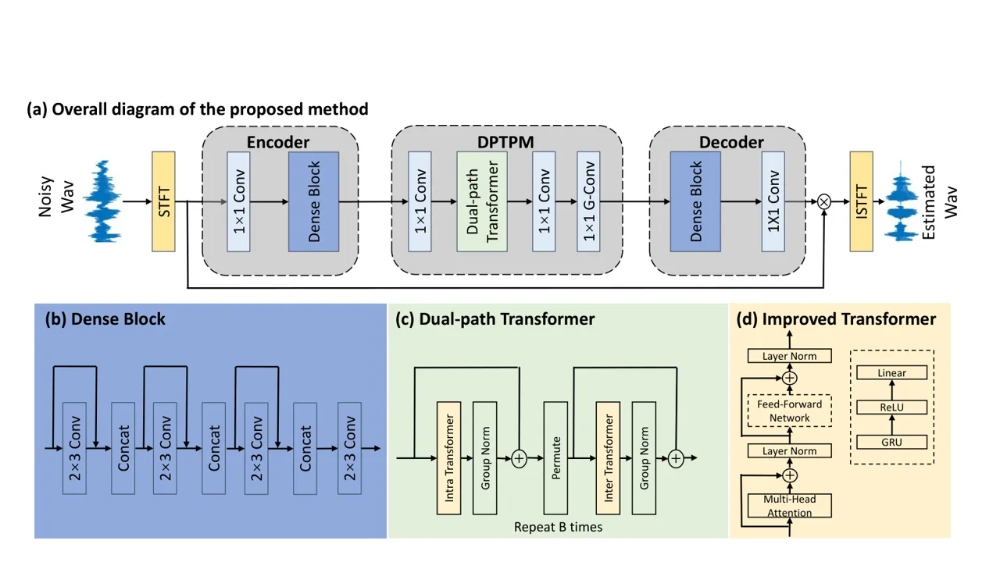

# DPT-FSNET: DUAL-PATH TRANSFORMER BASED FULL-BAND AND SUB-BAND FUSION NETWORK FOR SPEECH ENHANCEMENT

Feng Dang^(⋆†)    Hangting Chen^(⋆†)    Pengyuan Zhang^(⋆†)

###### Abstract

Sub-band models have achieved promising results due to their ability to
model local patterns in the spectrogram. Some studies further improve
the performance by fusing sub-band and full-band information. However,
the structure for the full-band and sub-band fusion model was not fully
explored. This paper proposes a dual-path transformer-based full-band
and sub-band fusion network (DPT-FSNet) for speech enhancement in the
frequency domain. The intra and inter parts of the dual-path transformer
model sub-band and full-band information, respectively. The features
utilized by our proposed method are more interpretable than those
utilized by the time-domain dual-path transformer. We conducted
experiments on the Voice Bank + DEMAND and Interspeech 2020 Deep Noise
Suppression (DNS) datasets to evaluate the proposed method. Experimental
results show that the proposed method outperforms the current
state-of-the-art.

###### Index Terms: 

speech enhancement, frequency domain, dual-path transformer, full-band
and sub-band fusion

^(†)^(†)address: ^(⋆) Key Laboratory of Speech Acoustics & Content
Understanding, Institute of Acoustics, CAS, China  
^(†) University of Chinese Academy of Sciences, Beijing, China



Figure 1: Architecture of the proposed DPT-FSNet. a) The overall diagram
of the proposed method b) The detail of the dense block. c) The detail
of the dual-path transformer. d) The detail of the improved transformer.

## 1 Introduction

Speech enhancement (SE) is a speech processing method that aims to
improve the quality and intelligibility of noisy speech by removing
noise \[1\]. It is commonly used as a front-end task for automatic
speech recognition, hearing aids, and telecommunications. In recent
years, the application of deep neural networks (DNNs) in SE research has
received increasing interest.

In general, DNN-based methods can be divided into two major categories:
time-domain methods \[2, 3, 4\] and time-frequency domain (T-F) methods
\[5, 6, 7, 8\]. Time-domain methods estimate clean waveforms directly
from the noisy raw data in the time domain. Traditional T-F domain
methods usually transform the noisy input waveform into a Fourier
magnitude spectrum by short-time Fourier transform, modify the spectrum
by T-F mask, and reconstruct the enhanced spectrum into enhanced
waveform by inverse short-time Fourier transform. They usually use the
phase of the noisy mixture, which limits the upper bound of the
denoising performance. Recent T-F domain methods using complex spectra
as features can preserve phase information and have achieved promising
performance \[8\].

Sub-band processing is a common method in audio processing \[9, 10,
11\], which takes sub-band spectral features as input and output.
Previous work \[12\] pointed out that the local patterns in the spectrum
tend to be different in each frequency band. The sub-band model handles
each frequency independently, which allows the sub-band model to focus
on the local patterns in the spectrum and therefore achieve good results
in SE tasks. In \[7\] further improves the performance by fusing
sub-band and full-band information.

Recently, dual-path networks \[13, 14, 15, 16\] have achieved
exceptional performance due to their ability to model local and global
features of the input sequence. Some studies \[14, 15\] have introduced
transformer structures \[17\] into dual-path networks, where input
elements can interact directly based on self-attention mechanism, to
further improve the performance of dual-path networks. However, these
studies were based on simple time-domain features and did not further
investigate the effect of the input of the dual-path network on the
enhancement performance. \[16\] did try to change the structure of
encoder and decoder to extract more effective inputs for the dual-path
network, but still limited to time-domain features.

Inspired by the above problems, we propose a dual-path transformer based
full-band and sub-band fusion network (DPT-FSNet) for speech
enhancement. Specifically, our proposed model consists of an encoder,
decoder, and dual-path transformer. We utilize a convolutional
encoder-decoder (CED) structure to extract an efficient latent feature
space for the dual-path transformer. Both the encoder and decoder
consist of a 1x1 convolutional layer and a dense block \[18\], where
dilated convolutions are utilized inside the dense block for context
aggregation. The dual-path transformer is composed of two parts,
intra-transformers and inter-transformers. The intra-transformer models
sub-band information and the inter-transformer merges the sub-band
information from the intra-transformer to model the full-band
information. We evaluated our model on the VoiceBank+DEMAND
(VCTK+DEMAND) dataset \[19\] and Interspeech 2020 Deep Noise Suppression
(DNS) dataset \[20\]. The experimental results show that the proposed
model achieves better results than other speech enhancement models.

## 2 Improved transformer

Generally speaking, a transformer consists of an encoder and a decoder
\[17\]. In this paper, we choose the transformer encoder as our basic
block. To avoid confusion, the reference to the transformer in this
paper refers to the encoder part of the transformer. The original
transformer encoder usually contains three modules: positional encoding,
multi-head self-attention, and position-wise feed-forward network. In
this paper, our transformer consists of two modules as in \[14\]:
multi-head self-attention and modified position-wise feed-forward
network.

### 2.1 Multi-head self-attention

We used the multi-headed self-attention from \[17\]. The multi-headed
self-attention module can be formulated as:

```math
\begin{split}Q_{i}=ZW_{i}^{Q},K_{i}=ZW_{i}^{K},V_{i}=ZW_{i}^{V}i\in[1,h]\end{split} \tag{1}
```

```math
\begin{split}head_{i}&=Attention(Q_{i},K_{i},V_{i})=SoftMax(\frac{Q_{i}K_{i}}{\sqrt{d}})V_{i}\end{split} \tag{2}
```

```math
\begin{split}MultiHead=Concat(head_{1},\cdots,head_{h})W^{O}\end{split} \tag{3}
```

```math
\begin{split}Mid=LayerNorm(Z+MultiHead)\end{split} \tag{4}
```

where $`Z\in\mathbb{R}^{l\times d}`$ is the input sequences with length
$`l`$ and dimension $`d`$, and
$`Q_{i},K_{i},V_{i}\in\mathbb{R}^{l\times d/h}`$ are the mapped queries,
keys and values, respectively.
$`W^{Q}_{i},W^{K}_{i},W^{V}_{i}\in\mathbb{R}^{d\times d/h}`$ and
$`W^{O}\in\mathbb{R}^{d\times d}`$ are linear transformation matrices.

### 2.2 Modified position-wise feed-forward network

A key issue for the transformer is how to exploit the order information
in the speech sequence. Previous studies \[14, 21\] have found that the
positional encoding utilized in the original transformer is not suitable
for dual-path networks. Inspired by the effectiveness of recurrent
neural networks in tracking order information, a GRU layer is used as
the replacement of the first fully connected layer in the feed-forward
network to learn the location information \[21\]. The output of the
multi-head self-attention is passed through the feed-forward network
followed by residual and normalization layers to obtain the final output
of the transformer.

```math
\begin{split}FFN(Mid)=ReLU(GRU(Mid))W_{1}+b_{1}\end{split} \tag{5}
```

```math
\begin{split}Output=LayerNorm(Mid+FFN)\end{split} \tag{6}
```

where $`FFN(\cdot)`$ denotes the output of the position-wise
feed-forward network, $`W_{1}\in\mathbb{R}^{d_{ff}\times d}`$,
$`b_{1}\in\mathbb{R}^{d}`$, and $`d_{ff}=4\times d`$.

## 3 Proposed DPT-FSNet

In this section, we propose a frequency-domain dual-path transformer
network for the SE task. As shown in Fig.1, our proposed model consists
of an encoder, a dual-path transformer processing module (DPTPM), and a
decoder.

### 3.1 Encoder

The encoder consists of a 1x1 convolutional layer and a dilated-dense
block, where the dilated-dense block consists of four dilated
convolutional layers. The input to the encoder is the complex spectrum
$`X\in\mathbb{R}^{2\times T\times F}`$ resulted from short-time Fourier
transform (STFT), and the output is a high-dimensional representation
$`U\in\mathbb{R}^{C\times T\times F}`$ with $`C`$ T-F spectral feature
maps.

### 3.2 Dual-path transformer processing module

The DPTPM consists of two 1x1 convolutional layers, $`B`$ dual-path
transformers (DPTs), and a gated 1x1 convolutional layer. Before the
DPTs, we use a 1x1 convolutional layer to halve the channel dimension of
the encoder output features to form a new 3-D tensor
$`D\in\mathbb{R}^{C^{{}^{\prime}}\times T\times F}`$
($`C^{\prime}=C/2`$), and use $`D`$ as the input to the DPTs, as
presented in Fig.1. Each DPT consists of an intra-transformer and an
inter-transformer, where the intra-transformer models sub-band
information and the inter-transformer models full-band information.
Different from \[22\], the DPT handles time and frequency paths
alternatively instead of parallelly.

The intra-transformer processing block models the sub-band of the input
features, which acts on the second dimension of $`D`$

```math
\begin{split}D^{intra}_{b}&={IntraTransformer_{b}}[D^{inter}_{b-1}]\\
&=[f^{intra}_{b}(D_{b-1}^{inter}[:,:,i],i=1,…,F)]\end{split} \tag{7}
```

where $`D^{intra}_{b}`$ is the output of $`IntraTransformer_{b}`$,
$`f^{intra}_{b}`$ is the mapping function defined by the transformer,
$`b=1,2...,B`$ and $`D^{inter}_{0}=D`$ ,
$`D_{b-1}^{inter}[:,:,i]\in\mathbb{R}^{C^{{}^{\prime}}\times T}`$ is the
sequence defined by all the $`T`$ time step in the $`i`$-th sub-band.
That is, the intra-transformer models the information of all time steps
in each sub-band of the speech signal.

The inter-transformer processing block is used to summarize the
information from each sub-band of the intra-transformer output to learn
the global information of the speech signal, which acts on the last
dimension of $`D`$

```math
\begin{split}D^{inter}_{b}&={InterTransformer_{b}}[D^{intra}_{b}]\\
&=[f^{inter}_{b}(D_{b}^{intra}[:,j,:],j=1,…,T)]\end{split} \tag{8}
```

where $`D^{inter}_{b}`$ is the output of $`InterTransformer_{b}`$,
$`f^{inter}_{b}`$ is the mapping function defined by the transformer,
and $`D_{b}^{intra}[:,j,:]\in\mathbb{R}^{C^{{}^{\prime}}\times F}`$ is
the sequence defined by the $`j`$-th time step in all $`F`$ sub-band.
That is, the inter-transformer models the information of all sub-bands
of the speech signal at each time step. With the intra-transformer, each
time step in $`D_{b}^{intra}`$ contains all the information of the
corresponding sub-band, which allows the inter-transformer to model the
global (i.e., full-band) information of the speech signal.

The final output of the transformer $`D^{inter}_{B}`$ is passed through
a 1x1 convolutional layer to double the channel dimension of the output
feature and then through a gated convolutional layer to smooth the
output value of the DPTPM.

### 3.3 Decoder

The decoder consists of a 1x1 convolutional layer and a dilated-dense
block, where the dilated-dense block is the same as in the encoder. The
feature from the DPTPM output is passed through the decoder to obtain
the estimated complex ratio mask \[23\]. The enhanced complex spectrum
is obtained by the element-wise multiplication between encoder’s input
and the mask, which is passed through the ISTFT to obtain the enhanced
speech waveform.

| Method                      | Domain | WB-PESQ | STOI | CSIG | CBAK | COVL | Para. (M) |
| --------------------------- | ------ | ------- | ---- | ---- | ---- | ---- | --------- |
| Noisy                       | \-     | 1.97    | 0.91 | 3.34 | 2.44 | 2.63 | \-        |
| MetricGAN \[5\]             | F      | 2.86    | \-   | 3.99 | 3.18 | 3.42 | 1.90      |
| TSTNN \[16\]                | T      | 2.96    | 0.95 | 4.33 | 3.53 | 3.67 | 0.92      |
| T-GSA \[6\]                 | F      | 3.06    | \-   | 4.18 | 3.59 | 3.62 | \-        |
| DEMUCS \[3\]                | T      | 3.07    | 0.95 | 4.31 | 3.40 | 3.63 | 33.5      |
| SE-Conformer \[4\]          | T      | 3.13    | 0.95 | 4.45 | 3.55 | 3.82 | \-        |
| Learnable Loss Mixup \[24\] | F      | 3.26    | \-   | 4.49 | 3.27 | 3.91 | 20.32     |
| DPT-FSNet (Proposed)        | F      | 3.33    | 0.96 | 4.58 | 3.72 | 4.00 | 0.88      |

Table 1: Comparison with other state-of-the-art systems on the
VCTK+DEMAND dataset.

### 3.4 Loss fuction

In order to make full use of the time-domain waveform-level features and
the T-F domain spectrum features, our loss function combines both
time-domain and T-F domain losses. The loss function is as follows:

```math
\begin{split}L=\alpha_{1}\times L_{audio}+\alpha_{2}\times L_{spectral}\end{split} \tag{9}
```

$`L_{audio}`$ is mean square error (MSE) loss:

```math
\begin{split}L_{audio}=\frac{1}{N}\sum_{i=0}^{N-1}(y_{i}-\tilde{y_{i}})^{2}\end{split} \tag{10}
```

where $`y`$ and $`\tilde{y}`$ are the sample of the clean speech and the
enhanced speech, respectively. and $`N`$ denotes the number of samples
in the waveform. $`L_{spectral}`$ is L1 loss, which is defined as:

```math
\begin{split}L_{spectral}=&\frac{1}{TF}\sum_{t=0}^{T-1}\sum_{f=0}^{F-1}|(|Y_{r}(t,f)|-|\tilde{Y}_{r}(t,f)|)\\
&+(|Y_{i}(t,f)|-|\tilde{Y}_{i}(t,f)|)|\end{split} \tag{11}
```

where $`Y`$ and $`\tilde{Y}`$ denote the spectrum of the clean speech
and the spectrum of the enhanced speech, respectively. $`r`$ and $`i`$
are the real and imaginary parts of the complex spectrogram. $`T`$ and
$`F`$ are the number of frames and the number of frequency bins,
respectively

## 4 Experiments

### 4.1 Dataset

We use a small-scale and a large-scale dataset to evaluate the proposed
model. For the small-scale dataset, we use the VCTK+ DEMAND dataset,
which is widely used in SE research. This dataset contains pre-mixed
noisy speech and its paired clean speech. The clean sets are selected
from the VoiceBank corpus \[25\], where the training set contains 11,572
utterances from 28 speakers, and the test set contains 872 utterances
from 2 speakers. For the noise set, the training set contains 40
different noise conditions with 10 types of noises (8 from DEMAND \[26\]
and 2 artificially generated) at SNRs of 0, 5, 10, and 15 dB. The test
set contains 20 different noise conditions with 5 types of unseen noise
from the DEMAND database at SNRs of 2.5, 7.5, 12.5, and 17.5 dB. All the
utterances are downsampled to 16kHz. We use 4-second long segments. If
an utterance is longer than 4 seconds, a random 4-second slice will be
selected from that utterance.

For the large-scale dataset, we use the DNS dataset. The DNS dataset
contains over 500 hours of clean clips from 2150 speakers and over 180
hours of noise clips from 150 classes. We simulate the noisy-clean pairs
with dynamic mixing during training stage. Specifically, before the
start of each training epoch, $`75\%`$ of the clean speeches are mixed
with randomly selected room impulse responses (RIR) provided by \[27\].
By mixing the clean speech ($`75\%`$ of them are reverberant) and noise
with a random SNR in between -5 and 20 dB, we generate the speech-noise
mixtures. For evaluation, the DNS dataset has two non-blind test sets
named $`with\_reverb`$ and $`no\_reverb`$, both of which contain 150
noisy-clean pairs.

### 4.2 Experimental setup

The window length and frame shift of STFT and ISTFT are 25ms and 6.25ms,
respectively, and the FFT length is 512. The number of feature maps
$`C`$ of the T-F spectrum is set to 64. All convolutional layers in the
encoder and the decode are followed by layer normalization and
parametric ReLU nonlinearity. Convolutional layers in the DPTPM are
followed by parametric ReLU nonlinearity. The dense block consists of
four dilated convolutional layers with dilated rate $`d=2`$. The number
of input channels in the successive layers of the dense block increases
linearly as $`C`$, $`2C`$, $`3C`$, $`4C`$, and the output after each
convolution has $`C`$ channels. We use 4 stacked dual-path transformers,
i.e., $`B=4`$ and $`h=4`$ parallel attention layers are employed. The
hyperparameters $`\alpha_{1}`$, $`\alpha_{2}`$ in the Eq.(9) are set to
0.4 and 0.6, respectively. In the training stage, we train the proposed
model for 100 epochs. We use Adam \[28\] as the optimizer and a gradient
clipping with maximum L2-norm of 5 to avoid gradient explosion. A
dynamic strategy \[17\] is used to adjust the learning rate during the
training stage.

```math
lr=\left\{\begin{aligned} &k_{1}\cdot d_{model}^{-0.5}\cdot n\cdot warmup^{-1.5},&n\leq warmup,\\
&k_{2}\cdot 0.98^{[epoch/2]},&n>warmup.\end{aligned}\right. \tag{12}
```

where $`n`$ is the number of steps, $`d_{model}`$ denotes the feature
size of the input of the transformer, and $`k_{1}`$, $`k_{2}`$ are
tunable scalars. In this paper, $`k_{1}`$, $`k_{2}`$, $`d_{model}`$, and
$`warmup`$ are set to 0.2, $`4e^{-4}`$, 32, 4000, respectively.

### 4.3 Evaluation metrics

On both datasets, we use wide-band PESQ (dubbed WB-PESQ) \[29\] and STOI
\[30\] as evaluation metrics. WB-PESQ and STOI quantify the perceptual
quality and the intelligibility of a speech signal, respectively. For
the VCTK+DEMAND dataset, we also employ the three most commonly used
metrics in the VCTK+DEMAND dataset, which are CSIG for signal
distortion, CBAK for noise distortion evaluation, and COVL for overall
quality evaluation \[31\]. CSIG, CBAK, and COVL are mean opinion score
(MOS) predictors, with a score range from 1 to 5. For the DNS dataset,
we also employ SI-SDR as evaluation metrics. Higher scores indicate
better performance for all metrics.

## 5 Experimental Results

### 5.1 Results on the VCTK+DEMAND dataset

The proposed method is compared with other methods which also employ the
same VCTK dataset. As shown in Table 1, our proposed model outperforms
other transformer-based models such as TSTNN, T-GSA, SE-Conformer, and
achieves state-of-the-art performance in terms of WB-PESQ, STOI, CSIG,
CBAK, COVL with the least parameters.

### 5.2 Ablation analysis

The experimental results in the previous subsection demonstrate that our
method improves the SE performance. To further validate the
effectiveness of our method, we performed an ablation analysis. We
designed four experiments labeled CED+Dual-path former, STFT+CED+BLSTM,
STFT+CED+Sub-band former, STFT+CED+Full-sub former, which are
abbreviated as _exp.1_, _exp.2_, _exp.3_, _exp.4_ in the following.
_Exp.4_ is our proposed method. The difference between _exp.1_ and
_exp.4_ is that _exp.1_ take time-domain features as input, which
replaces STFT/ISTFT with segmentation and overlap-add stage as in
\[16\]. The difference between _exp.3_ and _exp.4_ is that the intra
part and inter part of the dual-path transformer in _exp.3_ both model
sub-band information as in Eq.7 while the inter part of the dual-path
transformer in _exp.4_ model full-band information as in Eq.8. Same as
_exp.3_, the BLSTM in _exp.2_ only models sub-band information. For a
fair comparison, the number of parameters and computational complexity
of the models in the four experiments was essentially the same, and all
use a window length of 25 ms and a frame shift of 6.25 ms to extract
frames. Therefore, the system latency is also essentially the same for
all four experiments.

| Method                       | WB-PESQ | STOI |
| ---------------------------- | ------- | ---- |
| CED + Dual-path former       | 2.97    | 0.95 |
| STFT + CED + BLSTM           | 3.05    | 0.95 |
| STFT + CED + Sub-band former | 3.20    | 0.95 |
| STFT + CED + Full-sub former | 3.33    | 0.96 |

Table 2: Ablation analysis results on the VCTK+DEMAND dataset

By comparing _exp.2_ and _exp.3_, we can see that the improved
transformer performs better than BLTSM, which demonstrates the
effectiveness of the improved transformer. Furthermore, _exp.4_
outperforms _exp.3_, proving the advantages of fusing sub-band
information and full-band information. In both _exp.1_ and _exp.4_, the
intra transformer and inter transformer in the dual-path transformer
model local and global information, respectively. However, the
evaluation results of _exp.4_ is much better than those of _exp.1_,
which proves that the frequency domain feature is more effective than
the time domain feature for the dual-path transformer.

### 5.3 Results on the DNS dataset

Table 3 compares the metric scores of the proposed model with those of
other architectures on the DNS dataset. We can see that our method
outperforms the baseline. We noticed that compared with the full-band
model, the proposed model has a more significant performance improvement
on the reverberation data. We also see a similar trend in FullSubNet.
The possible reason is that the full-band and sub-band fusion models
include a sub-band model, and the sub-band model helps to model
reverberation effects by focusing on the temporal evolution of the
narrow-band spectrum.

|                 |             |               |                |
| --------------- | ----------- | ------------- | -------------- |
| Method          | WB-PESQ     | STOI (%)      | SI-SDR (dB)    |
| Noisy           | 1.82 (1.58) | 86.62 (91.52) | 9.03 (9.07)    |
| NSNet \[20\]    | 2.37 (2.15) | 90.43 (94.47) | 14.72 (15.61)  |
| DTLN \[32\]     | \- (-)      | 84.68 (94.76) | 10.53 (16.34 ) |
| PoCoNet \[33\]  | 2.83 (2.75) | \- (-)        | \- (-)         |
| FullSubNet\[7\] | 2.97 (2.78) | 92.62 (96.11) | 15.75 (17.29)  |
| CTS-Net\[8\]    | 3.02 (2.94) | 92.70 (96.66) | 15.58 (17.99)  |
| GaGNet\[34\]    | \- (3.17)   | \- (97.13)    | \- (18.91)     |
| DPT-FSNet       | 3.53 (3.26) | 95.23 (97.68) | 18.14 (20.36)  |

Table 3: Comparison with other state-of-the-art systems on the DNS
$`with\_reverb`$ ($`no\_reverb`$) test sets.

## 6 Conclusions

In this paper, we propose a dual-path transformer-based full-band and
sub-band fusion network for speech enhancement in the frequency domain.
Inspired by the full-band and sub-band fusion models, we explore
features that are more efficient for dual-path structures with the intra
part in the dual-path transformer models the sub-band information, and
the inter part models the full-band information. Experimental results on
the Voice Bank + DEMAND dataset and DNS dataset show that the proposed
method outperforms the current state of the art at a relatively small
model size.

## References

- \[1\] Philipos C Loizou, Speech enhancement: theory and practice, CRC
  press, 2013.
- \[2\] Ashutosh Pandey and DeLiang Wang, “A new framework for cnn-based
  speech enhancement in the time domain,” IEEE/ACM Transactions on
  Audio, Speech, and Language Processing, vol. 27, no. 7, pp.
  1179–1188, 2019.
- \[3\] Alexandre Défossez, Gabriel Synnaeve, and Yossi Adi, “Real Time
  Speech Enhancement in the Waveform Domain,” in Proc. Interspeech 2020,
  2020, pp. 3291–3295.
- \[4\] Eesung Kim and Hyeji Seo, “Se-conformer: Time-domain speech
  enhancement using conformer,” Proc. Interspeech 2021, pp.
  2736–2740, 2021.
- \[5\] Szu-Wei Fu, Chien-Feng Liao, Yu Tsao, and Shou-De Lin,
  “Metricgan: Generative adversarial networks based black-box metric
  scores optimization for speech enhancement,” in International
  Conference on Machine Learning. PMLR, 2019, pp. 2031–2041.
- \[6\] Jaeyoung Kim, Mostafa El-Khamy, and Jungwon Lee, “T-gsa:
  Transformer with gaussian-weighted self-attention for speech
  enhancement,” in ICASSP 2020-2020 IEEE International Conference on
  Acoustics, Speech and Signal Processing (ICASSP). IEEE, 2020, pp.
  6649–6653.
- \[7\] Xiang Hao, Xiangdong Su, Radu Horaud, and Xiaofei Li,
  “Fullsubnet: A full-band and sub-band fusion model for real-time
  single-channel speech enhancement,” in ICASSP 2021-2021 IEEE
  International Conference on Acoustics, Speech and Signal Processing
  (ICASSP). IEEE, 2021, pp. 6633–6637.
- \[8\] Andong Li, Wenzhe Liu, Chengshi Zheng, Cunhang Fan, and Xiaodong
  Li, “Two heads are better than one: A two-stage complex spectral
  mapping approach for monaural speech enhancement,” IEEE/ACM
  Transactions on Audio, Speech, and Language Processing, vol. 29, pp.
  1829–1843, 2021.
- \[9\] Haohe Liu, Lei Xie, Jian Wu, and Geng Yang, “Channel-Wise
  Subband Input for Better Voice and Accompaniment Separation on High
  Resolution Music,” in Proc. Interspeech 2020, 2020, pp. 1241–1245.
- \[10\] Geng Yang, Shan Yang, Kai Liu, Peng Fang, Wei Chen, and Lei
  Xie, “Multi-band melgan: Faster waveform generation for high-quality
  text-to-speech,” in 2021 IEEE Spoken Language Technology Workshop
  (SLT). IEEE, 2021, pp. 492–498.
- \[11\] Shubo Lv, Yanxin Hu, Shimin Zhang, and Lei Xie, “DCCRN+:
  Channel-Wise Subband DCCRN with SNR Estimation for Speech
  Enhancement,” in Proc. Interspeech 2021, 2021, pp. 2816–2820.
- \[12\] Naoya Takahashi and Yuki Mitsufuji, “Multi-scale multi-band
  densenets for audio source separation,” in 2017 IEEE Workshop on
  Applications of Signal Processing to Audio and Acoustics (WASPAA).
  IEEE, 2017, pp. 21–25.
- \[13\] Yi Luo, Zhuo Chen, and Takuya Yoshioka, “Dual-path rnn:
  efficient long sequence modeling for time-domain single-channel speech
  separation,” in ICASSP 2020-2020 IEEE International Conference on
  Acoustics, Speech and Signal Processing (ICASSP). IEEE, 2020, pp.
  46–50.
- \[14\] Jingjing Chen, Qirong Mao, and Dong Liu, “Dual-Path Transformer
  Network: Direct Context-Aware Modeling for End-to-End Monaural Speech
  Separation,” in Proc. Interspeech 2020, 2020, pp. 2642–2646.
- \[15\] Zining Zhang, Bingsheng He, and Zhenjie Zhang, “Transmask: A
  compact and fast speech separation model based on transformer,” in
  ICASSP 2021-2021 IEEE International Conference on Acoustics, Speech
  and Signal Processing (ICASSP). IEEE, 2021, pp. 5764–5768.
- \[16\] Kai Wang, Bengbeng He, and Wei-Ping Zhu, “Tstnn: Two-stage
  transformer based neural network for speech enhancement in the time
  domain,” in ICASSP 2021-2021 IEEE International Conference on
  Acoustics, Speech and Signal Processing (ICASSP). IEEE, 2021, pp.
  7098–7102.
- \[17\] Ashish Vaswani, Noam Shazeer, Niki Parmar, Jakob Uszkoreit,
  Llion Jones, Aidan N Gomez, Lukasz Kaiser, and Illia Polosukhin,
  “Attention is all you need,” in Advances in neural information
  processing systems, 2017, pp. 5998–6008.
- \[18\] Gao Huang, Zhuang Liu, Laurens Van Der Maaten, and Kilian Q
  Weinberger, “Densely connected convolutional networks,” in Proceedings
  of the IEEE conference on computer vision and pattern recognition,
  2017, pp. 4700–4708.
- \[19\] Cassia Valentini-Botinhao, Xin Wang, Shinji Takaki, and Junichi
  Yamagishi, “Investigating rnn-based speech enhancement methods for
  noise-robust text-to-speech.,” in SSW, 2016, pp. 146–152.
- \[20\] Chandan KA Reddy, Ebrahim Beyrami, Harishchandra Dubey, Vishak
  Gopal, Roger Cheng, Ross Cutler, Sergiy Matusevych, Robert Aichner,
  Ashkan Aazami, Sebastian Braun, et al., “The interspeech 2020 deep
  noise suppression challenge: Datasets, subjective speech quality and
  testing framework,” arXiv preprint arXiv:2001.08662, 2020.
- \[21\] Matthias Sperber, Jan Niehues, Graham Neubig, Sebastian Stüker,
  and Alex Waibel, “Self-attentional acoustic models,” arXiv preprint
  arXiv:1803.09519, 2018.
- \[22\] Chuanxin Tang, Chong Luo, Zhiyuan Zhao, Wenxuan Xie, and Wenjun
  Zeng, “Joint time-frequency and time domain learning for speech
  enhancement,” in Proceedings of the Twenty-Ninth International
  Conference on International Joint Conferences on Artificial
  Intelligence, 2021, pp. 3816–3822.
- \[23\] Donald S Williamson, Yuxuan Wang, and DeLiang Wang, “Complex
  ratio masking for monaural speech separation,” IEEE/ACM transactions
  on audio, speech, and language processing, vol. 24, no. 3, pp.
  483–492, 2015.
- \[24\] Oscar Chang, Dung N Tran, and Kazuhito Koishida,
  “Single-channel speech enhancement using learnable loss mixup,” Proc.
  Interspeech 2021, pp. 2696–2700, 2021.
- \[25\] Christophe Veaux, Junichi Yamagishi, and Simon King, “The voice
  bank corpus: Design, collection and data analysis of a large regional
  accent speech database,” in 2013 international conference oriental
  COCOSDA held jointly with 2013 conference on Asian spoken language
  research and evaluation (O-COCOSDA/CASLRE). IEEE, 2013, pp. 1–4.
- \[26\] Joachim Thiemann, Nobutaka Ito, and Emmanuel Vincent, “The
  diverse environments multi-channel acoustic noise database (demand): A
  database of multichannel environmental noise recordings,” in
  Proceedings of Meetings on Acoustics ICA2013. Acoustical Society of
  America, 2013, vol. 19, p. 035081.
- \[27\] Chandan KA Reddy, Harishchandra Dubey, Vishak Gopal, Ross
  Cutler, Sebastian Braun, Hannes Gamper, Robert Aichner, and Sriram
  Srinivasan, “Icassp 2021 deep noise suppression challenge,” in ICASSP
  2021-2021 IEEE International Conference on Acoustics, Speech and
  Signal Processing (ICASSP). IEEE, 2021, pp. 6623–6627.
- \[28\] Diederik P Kingma and Jimmy Ba, “Adam: A method for stochastic
  optimization,” arXiv preprint arXiv:1412.6980, 2014.
- \[29\] ITUT Rec, “P. 862.2: Wideband extension to recommendation p.
  862 for the assessment of wideband telephone networks and speech
  codecs,” International Telecommunication Union, CH–Geneva, 2005.
- \[30\] Cees H Taal, Richard C Hendriks, Richard Heusdens, and Jesper
  Jensen, “An algorithm for intelligibility prediction of time–frequency
  weighted noisy speech,” IEEE Transactions on Audio, Speech, and
  Language Processing, vol. 19, no. 7, pp. 2125–2136, 2011.
- \[31\] Yi Hu and Philipos C Loizou, “Evaluation of objective quality
  measures for speech enhancement,” IEEE Transactions on audio, speech,
  and language processing, vol. 16, no. 1, pp. 229–238, 2007.
- \[32\] Nils L. Westhausen and Bernd T. Meyer, “Dual-Signal
  Transformation LSTM Network for Real-Time Noise Suppression,” in Proc.
  Interspeech 2020, 2020, pp. 2477–2481.
- \[33\] Umut Isik, Ritwik Giri, Neerad Phansalkar, Jean-Marc Valin,
  Karim Helwani, and Arvindh Krishnaswamy, “PoCoNet: Better Speech
  Enhancement with Frequency-Positional Embeddings, Semi-Supervised
  Conversational Data, and Biased Loss,” in Proc. Interspeech 2020,
  2020, pp. 2487–2491.
- \[34\] Andong Li, Chengshi Zheng, Lu Zhang, and Xiaodong Li, “Glance
  and gaze: A collaborative learning framework for single-channel speech
  enhancement,” arXiv preprint arXiv:2106.11789, 2021.
