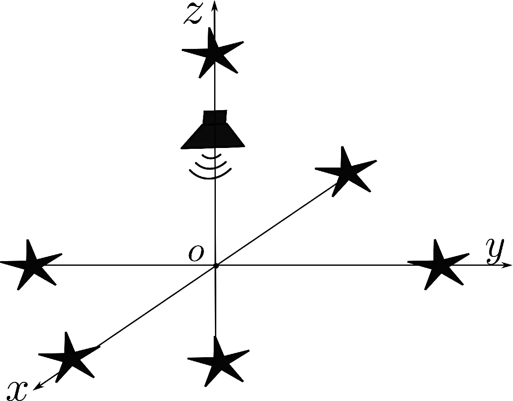
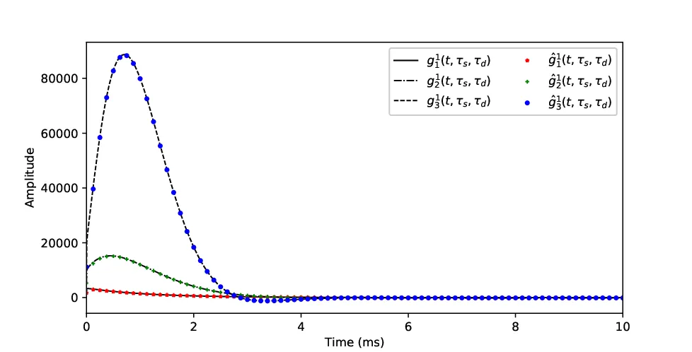
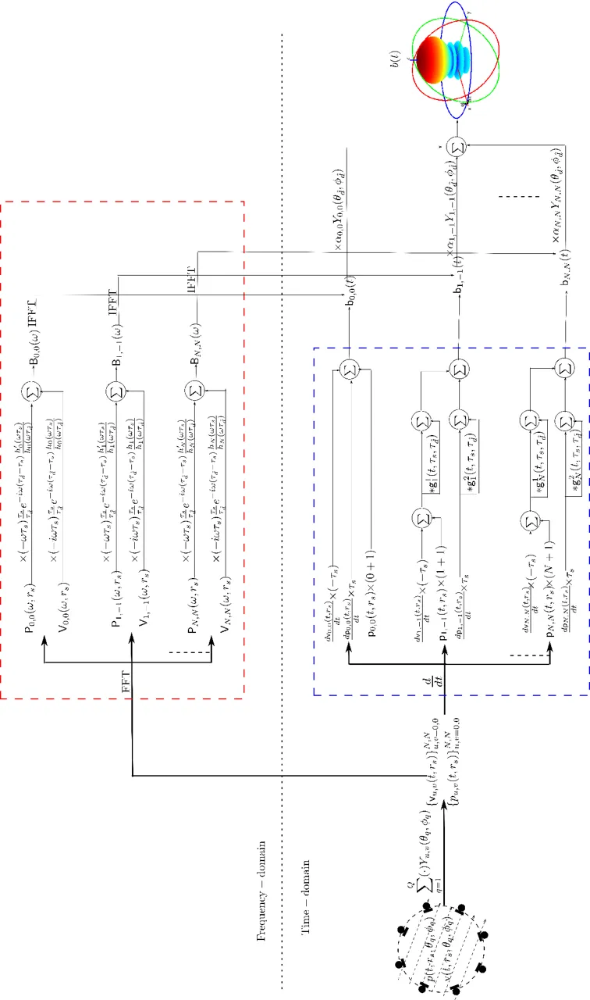
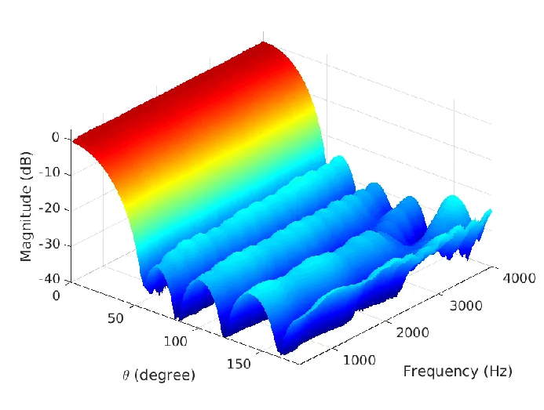
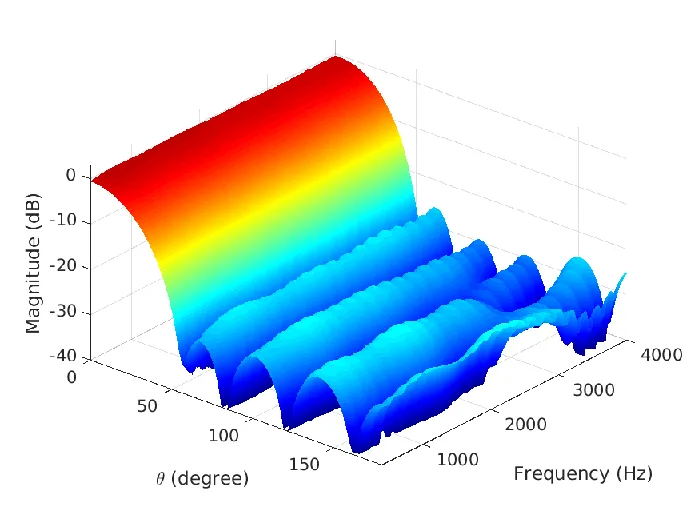
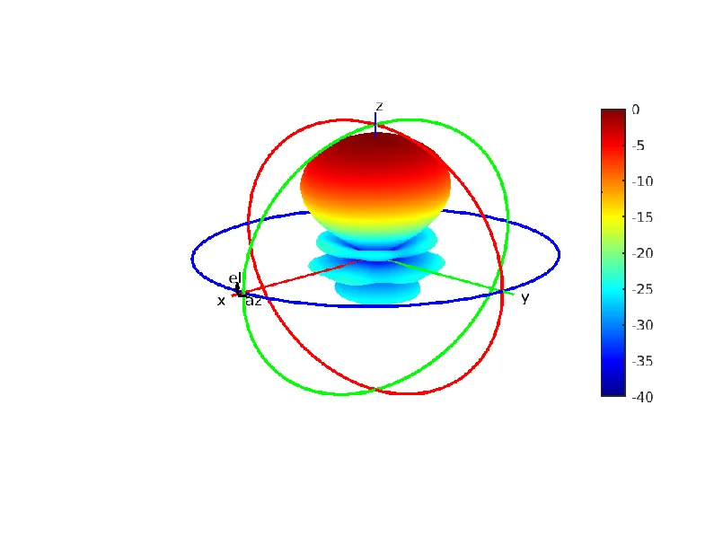
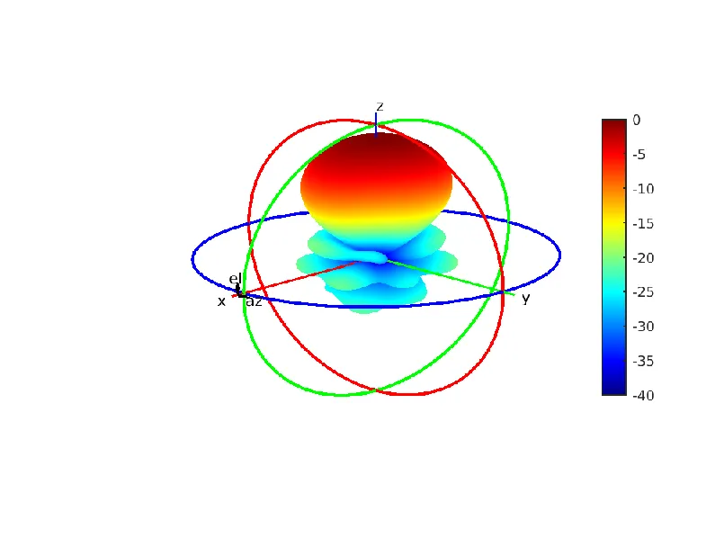
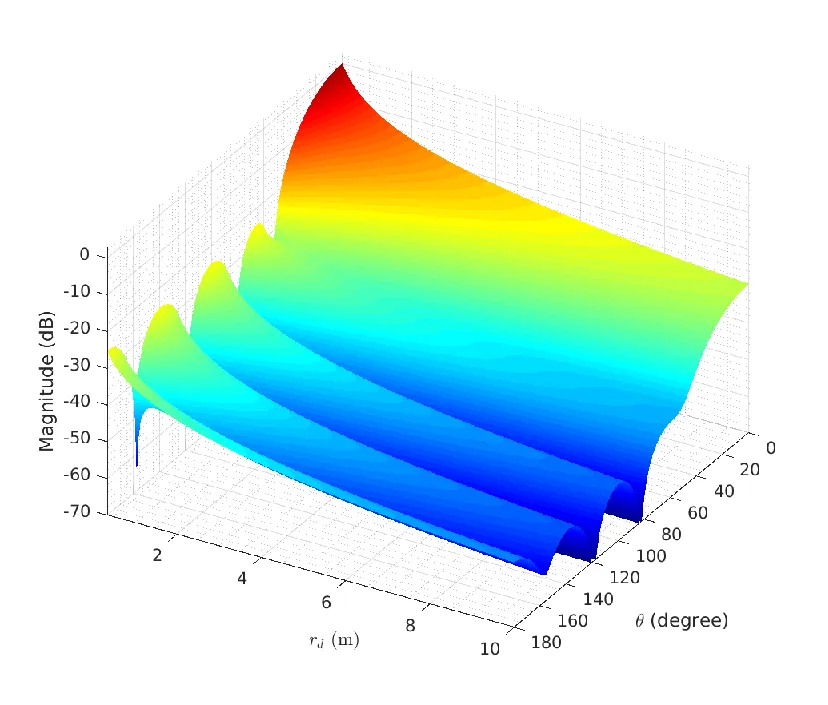
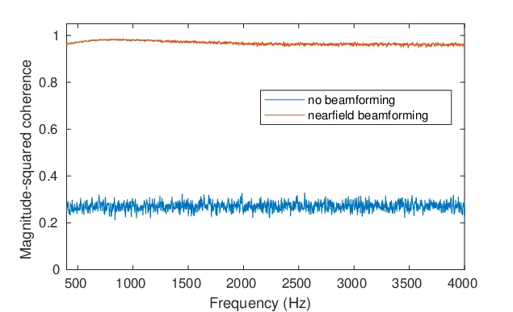

# A time-domain nearfield frequency-invariant beamforming methodThanks: This work is sponsored by the Australian Research Council (ARC) Discovery Projects funding schemes with project numbers DP200100693.Thanks: Fei Ma, Thushara D. Abhayapala, and Prasanga N. Samarasinghe are all with the Research School of Engineering, College of Engineering and Computer Science, The Australian National University, Canberra, ACT 2601, Australia (e-mail: fei.ma, Thushara.Abhayapala, prasanga.samarasinghe@anu.edu.au).Thanks: Manuscript received xxx xxx, xxx; revised xxx xx, xxx.

Fei Ma    Thushara D. Abhayapala Affiliation: and Prasanga N.
Samarasinghe, 

###### Abstract

Most existing beamforming methods are frequency-domain methods, and are
designed for enhancing a farfield target source over a narrow frequency
band. They have found diverse applications and are still under active
development. However, they struggle to achieve desired performance if
the target source is in the nearfield with a broadband output. This
paper proposes a time-domain nearfield frequency-invariant beamforming
method. The time-domain implementation makes the beamformer output
suitable for further use by real-time applications, the nearfield
focusing enables the beamforming method to suppress an interference even
if it is in the same direction as the target source, and the
frequency-invariant beampattern makes the beamforming method suitable
for enhancing the target source over a broad frequency band. These three
features together make the beamforming method suitable for real-time
broadband nearfield source enhancement, such as speech enhancement in
room environments. The beamformer design process is separated from the
sound field measurement process, and such that a designed beamformer
applies to sensor arrays with various structures. The beamformer design
process is further simplified by decomposing it into several independent
parts. Simulation results confirm the performance of the proposed
beamforming method.

###### Index Terms: 

Array signal processing, beamforming, real-time signal processing,
speech enhancement.

## I Introduction

Beamforming is a method that spatially filters the measurements of a
number of sensors to form a response \[1\]. Thanks to its capability to
suppress the interference and preserve (or enhance) the target
source \[2\], beamforming has found applications in diverse areas, such
as wireless communication \[1\], medical imaging \[3\], speech
dereverberation \[4\] and recognition \[5\].

The hundreds of beamforming methods reported in literature \[2\] can be
broadly classified into five categories: (1) frequency-domain or
time-domain implementation; (2) farfield or nearfield focusing; (3)
frequency-variant or frequency-invariant beampattern; (4) robust or
non-robust design; (5) data-independent or data-dependent spatial
filtering. Hereafter we introduce these five categories of beamforming
methods.

The majority of existing beamforming methods implement the spatial
filtering process in the frequency-domain. They use the discrete Fourier
transform (DFT) (or specifically the fast Fourier transform (FFT)) to
transform a frame of time-domain measurements into the time-frequency
domain \[6\], which allows better control of the beampattern within a
narrow frequency band \[2\]. The time-domain methods, on the other hand,
process the measurements in the time-domain directly and are inherently
broadband \[7\]. Without resorting to the FFT, the time-domain filtering
process can be computationally intensive. Nonetheless, the
sample-by-sample filtering process makes the time-domain beamforming
methods are of low latency (or zero latency).

Depending on the location of the target source, a beamforming method may
focus on the farfield or the nearfield. The wavefronts of a farfield
source only differ by the relative phase. This fact simplifies the
design of the spatial filters for a farfield beamforming method. The
wavefronts of a nearfield source, on the other hand, undergo both
amplitude decay and phase shift. This fact makes it difficult to design
the spatial filter for a nearfield beamforming method. Thus, most of the
existing beamforming methods presume the farfield scenarios.
Nonetheless, as one would expect, a farfield beamforming method not
necessarily achieve the desired beampattern if the target source is in
the nearfield \[8\].

For a typically beamformer, the spectral response and spatial response
are determined by a single set of filter coefficients, and thus are
coupled with each other \[9\]. The coupling leads to a beampattern
varying with the frequency, which is undesirable for a given
interference and target source layout. A frequency-invariant beamformer,
on the other hand, decouples the filter coefficients that are
responsible for the spatial response from the filter coefficients that
are responsible for the spectral response, and achieves a desired
beampattern irrespective to the frequency \[10, 11, 12\].

In real world implementation of a beamforming method, there are always
some imperfections, such as the imprecise knowledge of the target source
location, sensor array design defects, and thermal noises \[13\]. These
imperfections can impair a beamforming method, making it unable to
achieve the desired performance. A robust design is to make the
beamforming method invulnerable to such imperfections at the expense of
reduced performance such as the mainlobe width or the sidelobe
level \[14, 15\].

Depending on whether the statistics of the interference are taken into
consideration, a beamforming method is classified as data-dependent or
data-independent \[2\]. A data-dependent beamforming method, such as the
minimum variance distortionless response, the linearly constrained
minimum variance, and the multichannel Wiener filter, explicitly adapt
the spatial filter according to the interference statistics, and tends
to yield better performance \[2\]. The data-independent beamforming
method with its fixed spatial filter design tends to achieve inferior
performance but is easier to implement \[2\].

We regard the time-domain implementation, nearfield focusing,
frequency-invariant beampattern, robust design, and data-dependent
spatial filters as desirable features. These features provide
beamforming methods with additional capabilities or better performance,
but can be at odds with each other. Thus, a specific beamforming method
maybe designed to possess one or two features only.

In this paper, we take advantage of the separable expression of the
beamformer response in the spherical coordinates to separate the
beamformer design process from the sound field measurement process. We
further decompose the beamformer design process into several independent
parts with each part being responsible for one feature. We design a
time-domain beamforming method with a frequency-invariant beampattern
while focusing on a nearfield point. This beamforming method is
advantageous over the conventional frequency-domain farfield narrowband
beamforming method by allowing the enhancement of a broadband nearfield
source in real-time. The performance of the beamforming method is
confirmed by simulation results.

The rest of this paper is organized as follows. We introduce the problem
formulation in Sec. II. We derive the beamforming method in Sec. III and
IV. The effectiveness of the beamforming method is confirmed by
simulation in Sec. V, and Sec. VI concludes this paper.

## II Problem formulation



Fig. 1: System setup: In the nearfield with respect to the origin $`O`$,
there is a target source ( ) at $`(r_{d},\theta_{d},\phi_{d})`$ and a
number of interfering sources ($`\star`$). We aim to design a
time-domain frequency-invariant beamformer which focuses on the target
nearfield source.

We denote the Cartesian coordinates and the spherical coordinates of a
point with respect to an origin $`O`$ as $`(x,y,z)`$ and
$`(r,\theta,\phi)`$, respectively. As shown in Fig. 1, in the nearfield
with respect to the origin, there is a target source ( ) at
$`(r_{d},\theta_{d},\phi_{d})`$ and a number of interfering sources
($`\star`$).

In the spherical coordinates, the response of a beamformer to a sound
field can be written in the frequency-domain as \[13\]

```math
\displaystyle B(\omega) \displaystyle= \displaystyle\sum_{u=0}^{\infty}\sum_{v=-u}^{u}\mathsf{W}_{u,v}(\omega)\mathsf{K}_{u,v}(\omega), \tag{1}
```

where

```math
\displaystyle\mathsf{W}_{u,v}(\omega)=\int_{\Omega}W(\omega,\theta,\phi)Y_{u,v}(\theta,\phi)d\Omega, \tag{2}
```

```math
\displaystyle\mathsf{K}_{u,v}(\omega)=\int_{\Omega}K(\omega,\theta,\phi)Y_{u,v}(\theta,\phi)d\Omega, \tag{3}
```

$`\int_{\Omega}(\cdot)Y_{u,v}(\theta,\phi)d\Omega=\int_{0}^{2\pi}\int_{0}^{\pi}(\cdot)Y_{u,v}(\theta,\phi)\sin\theta{}d\theta{d}\phi`$,
$`\omega=2\pi{f}`$ is the angular frequency ($`f`$ is the frequency),
$`Y_{u,v}(\theta,\phi)`$ is the spherical harmonic of order $`u`$ and
degree $`v`$, $`W(\omega,\theta,\phi)`$ is the beamformer sensitivity
function, $`K(\omega,\theta,\phi)`$ characterizes the sound field,
$`\mathsf{W}_{u,v}(\omega)`$ are beamforming coefficients, and
$`\mathsf{K}_{u,v}(\omega)`$ are sound field coefficients. The
beamformer (coefficients) filters the sound field (coefficients) and
thus that the beamformer response $`B(\omega)`$ meet some targets such
as the directivity index, nearfield focusing, or frequency-invariant
\[13\]. Note that we have to truncate the summation over $`u`$ in (1) up
to some order $`N`$ for practical implementations \[16, 17, 18\].

As shown by (1), in the spherical coordinates, the beamformer response
is the summation of the product between of two independent quantities,
the sound field (coefficients) and the beamformer (coefficients).

In this work, we aim to design a time-domain frequency-invariant
beamforming method, which focus on the target nearfield source. We first
present a method to measure the sound field, and then derive a nearfield
frequency-invariant beamforming method in the frequency-domain, and at
last derive the corresponding time-domain method.

## III Sound field measurement

In this section, we present a method to measure the sound field
(coefficients). In the frequency-domain, the sound pressure and the
radial particle velocity at $`(r,\theta,\phi)`$ can be expressed
as \[19\]

```math
\displaystyle P(\omega,r,\theta,\phi) \displaystyle= \displaystyle\sum_{u=0}^{\infty}\sum_{v=-u}^{u}\mathsf{P}_{u,v}(\omega,r)Y_{u,v}(\theta,\phi) \tag{4}
```

```math
\displaystyle= \displaystyle\sum_{u=0}^{\infty}\sum_{v=-u}^{u}\mathsf{K}_{u,v}(\omega){j}_{u}(\omega{}\tau)Y_{u,v}(\theta,\phi),
```

and

```math
\displaystyle V(\omega,r,\theta,\phi) \displaystyle= \displaystyle\frac{i}{\rho{}\omega}\frac{\partial{P(\omega,r,\theta,\phi)}}{\partial{r}} \tag{5}
```

```math
\displaystyle= \displaystyle\frac{1}{\rho{c}}\sum_{u=0}^{\infty}\sum_{v=-u}^{u}{i}\mathsf{K}_{u,v}(\omega)j_{u}^{\prime}(\omega\tau)Y_{u,v}(\theta,\phi)
```

```math
\displaystyle= \displaystyle\frac{1}{\rho{}c}\sum_{u=0}^{\infty}\sum_{v=-u}^{u}\mathsf{V}_{u,v}(\omega,r)Y_{u,v}(\theta,\phi),
```

respectively, where $`\tau=r/c`$, $`c`$ is the speed of sound
propagation, $`i=\sqrt{-1}`$ is the unit-imaginary number, $`\rho{}`$ is
the ambient density, $`\mathsf{P}_{u,v}(\omega,r)`$ and
$`\mathsf{V}_{u,v}(\omega,r)`$ are the pressure field coefficients and
velocity field coefficients, respectively, $`j_{u}(\cdot)`$ and
$`j_{u}^{\prime}(\cdot)`$ are the spherical Bessel function of order
$`u`$ and its derivative with respect to the argument, respectively.

We obtain the radial-dependent pressure field coefficients
$`\mathsf{P}_{u,v}(\omega,r_{s})`$ and velocity field coefficients
$`\mathsf{V}_{u,v}(\omega,r_{s})`$ through

```math
\displaystyle\mathsf{P}_{u,v}(\omega,r_{s}) \displaystyle\approx \displaystyle\sum_{q=1}^{Q}\gamma_{q}{}P(\omega,r_{s},\theta_{q},\phi_{q})Y_{u,v}(\theta_{q},\phi_{q}), \tag{6}
```

```math
\displaystyle\mathsf{V}_{u,v}(\omega,r_{s}) \displaystyle\approx \displaystyle\rho{c}\sum_{q=1}^{Q}\gamma_{q}{}V(\omega,r_{s},\theta_{q},\phi_{q})Y_{u,v}(\theta_{q},\phi_{q}), \tag{7}
```

where $`\{r_{s},\theta_{q},\phi_{q}\}_{q=1}^{Q}`$ are the spherical
coordinates of $`Q`$ vector sensors \[20\], which are arranged on a
sphere of radius $`r_{s}`$ \[13\], and $`\{\gamma_{q}\}_{q=1}^{Q}`$ are
the sampling weights. Hereafter we use the nearly uniform sampling
scheme only, and $`\gamma_{q}=4\pi/Q`$ for $`q\in[1,Q]`$ \[13\].

We further obtain the radial-independent sound field coefficients
$`\mathsf{K}_{u,v}(\omega)`$ as (please refer \[21\] for the details)

```math
\displaystyle\mathsf{K}_{u,v}(\omega) \displaystyle= \displaystyle(i\omega\tau_{s})^{2}\mathsf{V}_{u,v}(\omega,r_{s})h_{u}(\omega\tau_{s}) \tag{8}
```

```math
\displaystyle+i(\omega\tau_{s})^{2}\mathsf{P}_{u,v}(\omega,r_{s})h^{\prime}_{u}(\omega\tau_{s}),
```

where $`\tau_{s}=r_{s}/c`$, $`h_{u}(\cdot)`$ and
$`h^{\prime}_{u}(\cdot)`$ are the spherical hankel function of order
$`u`$ and its derivative with respect to the argument, respectively.

We have the following comments on the sound field measurement process:

- •
  We use vector sensors for sound field measurement, and this makes (8)
  do not contain the division of the spherical Bessel function \[21\],
  and facilitates the development of a time-domain beamforming method.
- •
  The vector sensors are not necessary for implementing the beamforming
  method.

  By exploiting the scattering effect, we can use ordinary microphones
  mounted on a rigid surface for beamforming. The experimental
  validation of the proposed beamforming method using an Eigenmike, a
  rigid spherical array with 32 microphones, will be reported in a
  future publication \[22\].



Fig. 2: The theoretical derived
$`\mathsf{g}_{u}^{1}(t,\tau_{s},\tau_{\hat{d}})`$ and its estimation
$`\hat{\mathsf{g}}_{u}^{1}(t,\tau_{s},\tau_{\hat{d}})`$ obtained through
direct inverse Fourier transform, for $`u=1,2,3`$, $`\tau_{s}=0.23`$ ms,
and $`\tau_{\hat{d}}=1.17`$ ms.



Fig. 3: Signal flow of the frequency-domain beamforming method and the
time-domain beamforming method. The frequency-domain beamforming method
uses the FFT and the inverse FFT to transfer the signals between the
time-domain and the time-frequency-domain. The dashed-line boxes
indicate the key differences of the two beamformers.
$`\{\cdot\}_{u,v=0,0}^{N,N}`$ means $`u\in[0,N]`$, $`v\in[-u,u]`$.

## IV Beamforming

With the sound field measurements available, in this section we develop
nearfield frequency-invariant beamforming methods.

### IV-A Frequency-domain

In this section, we present a frequency-domain nearfield
frequency-invariant beamforming method.

Denote an estimation of the target source position as
$`(r_{\hat{{d}}},\theta_{\hat{{d}}},\phi_{\hat{{d}}})`$ and define
$`\tau_{\hat{{d}}}=r_{\hat{{d}}}/c`$, we design the beamforming
coefficients to be

```math
\displaystyle\mathsf{W}_{u,v}(\omega) \displaystyle= \displaystyle\alpha_{u,v}\frac{1}{i\omega\tau_{s}}\frac{-\tau_{s}}{\tau_{\hat{{d}}}}e^{-i\omega(\tau_{\hat{d}}-\tau_{s})} \tag{9}
```

```math
\displaystyle\times\frac{1}{h_{u}(\omega\tau_{\hat{d}})}Y_{u,v}(\theta_{\hat{d}},\phi_{\hat{d}}),
```

where

1.  1.  $`\alpha_{u,v}`$ are beampattern coefficients, which determine the
        beam shape \[8\]; ¹¹ 1 Note that for farfield beamforming the
        beampattern coefficients $`\alpha_{u,v}`$ are the same as the
        beamforming coefficients $`\mathsf{W}_{u,v}(\omega)`$. In this paper
        of nearfield beamforming, we incorporate the radial-focusing terms
        $`1/h_{u}(\omega{\tau}_{\hat{d}})`$ and the spectral filtering term
        $`1/(i\omega\tau_{s})`$ into the beamforming coefficients
        $`\mathsf{W}_{u,v}(\omega)`$. Thus, we distinguish the beamforming
        coefficients $`\mathsf{W}_{u,v}(\omega)`$ from the beampattern
        coefficients $`\alpha_{u,v}`$.
2.  2.  $`{1}/({i\omega\tau_{s}})`$ provides spectral filtering, making the
        beampattern frequency-invariant \[10\];
3.  3.  $`({-\tau_{s}}/{\tau_{\hat{d}}})e^{-i\omega(\tau_{\hat{d}}-\tau_{s})}`$
        provides gain scale and phase shift, making the time-domain spatial
        functions derived in the next section to be causal \[7\];
4.  4.  $`{1}/{h_{u}(k\tau_{\hat{d}})}`$ and
        $`Y_{u,v}(\theta_{\hat{d}},\phi_{\hat{d}})`$ provide radial
        filtering \[8, 23\] and angular filtering, respectively, making the
        beamformer to focus on the nearfield point
        $`(r_{\hat{d}},\theta_{\hat{d}},\phi_{\hat{d}})`$.

Bringing (9) and (8) into (1), we have the frequency-domain beamformer
response

```math
\displaystyle B(\omega) \displaystyle= \displaystyle\sum_{u=0}^{\infty}\sum_{v=-u}^{u}\alpha_{u,v}\mathsf{B}_{u,v}(\omega)Y_{u,v}(\theta_{\hat{d}},\phi_{\hat{d}}), \tag{10}
```

where

```math
\displaystyle\mathsf{B}_{u,v}(\omega) \displaystyle= \displaystyle\mathsf{V}_{u,v}(\omega,r_{s})(-i\omega\tau_{s})\frac{\tau_{s}}{\tau_{\hat{d}}}e^{-i\omega(\tau_{\hat{d}}-\tau_{s})}\frac{h_{u}(\omega\tau_{s})}{h_{u}(\omega\tau_{\hat{d}})} \tag{11}
```

```math
\displaystyle+\mathsf{P}_{u,v}(\omega,r_{s})(-\omega\tau_{s})\frac{\tau_{s}}{\tau_{\hat{d}}}e^{-i\omega(\tau_{\hat{d}}-\tau_{s})}\frac{h^{\prime}_{u}(\omega\tau_{s})}{h_{u}(\omega\tau_{\hat{d}})}.
```

We provide additional details for the beamforming coefficient design in
the appendix.

### IV-B Time-domain

The frequency-domain beamforming method can be effectively implemented
based on the FFT. Nonetheless the FFT unavoidably introduces latency
(the frame-delay) to the beamformer output, and thus that the beamformer
output may not be suitable for further use by time-critical
applications, such as active noise control \[24, 25\]. In this section,
we present a time-domain nearfield frequency-invariant beamforming
method, which processes the signals sample-by-sample and thus can
achieve the lowest latency between the sensor array input and the
beamformer output.

We write the time-domain beamformer response as

```math
\displaystyle b(t) \displaystyle= \displaystyle\sum_{u=0}^{N}\sum_{v=-u}^{u}\alpha_{u,v}\mathsf{b}_{u,v}(t)Y_{u,v}(\theta_{\hat{d}},\phi_{\hat{d}}), \tag{12}
```

where

```math
\displaystyle\mathsf{b}_{u,v}(t) \displaystyle= \displaystyle\Big[\frac{d\mathsf{v}_{u,v}(t,r_{s})}{dt}+\frac{d\mathsf{v}_{u,v}(t,r_{s})}{dt}\ast\mathsf{g}_{u}^{1}(t,\tau_{s},\tau_{\hat{d}})\big]\times(-\tau_{s})
```

```math
\displaystyle+\Big[\frac{d\mathsf{p}_{u,v}(t,r_{s})}{dt}+\frac{d\mathsf{p}_{u,v}(t,r_{s})}{dt}\ast\mathsf{g}_{u}^{2}(t,\tau_{s},\tau_{\hat{d}})\Big]\times\tau_{s}
```

```math
\displaystyle+\Big[\mathsf{p}_{u,v}(t,r_{s})+\mathsf{p}_{u,v}(t,r_{s})\ast\mathsf{g}_{u}^{1}(t,\tau_{s},\tau_{\hat{d}})\Big]\times(u+1),
```

$`\mathsf{p}_{u,v}(t,r_{s})`$ and $`{d\mathsf{p}_{u,v}(t,r_{s})}/{dt}`$
are the time-domain pressure field coefficients and their derivation
with respect to time $`t`$, respectively,
$`\mathsf{g}_{u}^{1}(t,\tau_{s},\tau_{\hat{d}})`$ and
$`\mathsf{g}_{u}^{2}(t,\tau_{s},\tau_{\hat{d}})`$ are spatial functions,
which realize the spectral filtering and the radial filtering as
time-domain filters. The detailed derivations of above equation and the
explicit expressions of
$`\mathsf{g}_{u}^{1}(t,\tau_{s},\tau_{\hat{d}})`$ and
$`\mathsf{g}_{u}^{2}(t,\tau_{s},\tau_{\hat{d}})`$ are in the appendix.

The time-domain pressure field coefficients
$`\mathsf{p}_{u,v}(t,r_{s})`$ are obtained through

```math
\displaystyle\mathsf{p}_{u,v}(t,r_{s}) \displaystyle= \displaystyle\int_{\Omega}p(t,r_{s},\theta,\phi)Y_{u,v}(\theta,\phi)d\Omega \tag{14}
```

```math
\displaystyle\approx \displaystyle\sum_{q=1}^{Q}\gamma_{q}{}p(t,r_{s},\theta_{q},\phi_{q})Y_{u,v}(\theta_{q},\phi_{q}),
```

where $`p(t,r_{s},\theta_{q},\phi_{q})`$ is the time-domain pressure at
the sampling point $`(r_{s},\theta_{q},\phi_{q})`$, and the sampling
process is similar to (6). We further obtain
$`{d\mathsf{p}_{u,v}(t,r_{s})}/{dt}`$, the time-derivative of
$`\mathsf{p}_{u,v}(t,r_{s})`$, through the following approximation

```math
\displaystyle\frac{d\mathsf{p}_{u,v}(t,r_{s})}{dt} \displaystyle= \displaystyle\lim_{\delta_{t}\to 0}\frac{\mathsf{p}_{u,v}(t+\delta_{t},r_{s})-\mathsf{p}_{u,v}(t-\delta_{t},r_{s})}{2\delta_{t}} \tag{15}
```

```math
\displaystyle\approx \displaystyle\frac{\mathsf{p}_{u,v}(t+\delta_{f_{\mathrm{s}}},r_{s})-\mathsf{p}_{u,v}(t-\delta_{f_{\mathrm{s}}},r_{s})}{2\delta_{f_{\mathrm{s}}}},
```

where $`\delta_{f_{\mathrm{s}}}=1/f_{\mathrm{s}}`$ and
$`f_{\mathrm{s}}`$ is the sampling frequency. To minimize the
approximation error of (15), we need to choose an appropriate sampling
frequency based on the frequency-component of the target source \[21\].
We can obtain the time-domain velocity field coefficients and the
corresponding time-derivative similarly.

We have the following comments on the beamforming methods:

1.  1.  In (9), we decompose the beamforming coefficients into several
        independent parts, and each part is responsible for one feature of
        the proposed beamforming method.
2.  2.  We can approximate the time-derivative of the particle velocity by
        the pressure gradient \[21\] as follows

    ```math
    \displaystyle\frac{d{v_{x}(t,x,y,z)}}{dt}\approx{}\frac{1}{\rho}\frac{p(t,x+\delta_{x},y,z)-p(t,x-\delta_{x},y,z)}{2\delta_{x}},
    ```

    where $`v_{x}(t,x,y,z)`$ denotes the particle velocity at
    $`(x,y,z)`$ along the positive $`x`$-axis direction,
    $`p(t,x+\delta-x,y,z)`$ and $`p(t,x-\delta_{x},y,z)`$ are the
    pressures at $`(x+\delta_{x},y,z)`$ and $`(x-\delta_{x},y,z)`$,
    respectively, and $`\delta_{x}`$ is a small positive value.

    That is, we can use two closely spaced pressure microphones in place
    of a velocity sensor.

3.  3.  For a rotation symmetric beampattern, the beampattern coefficients
        $`\alpha_{u,v}=\alpha_{u,0}`$ for $`v\in[-u,u]`$. This simplifies
        the computation of the beamformer response \[13\].
4.  4.  Equation (IV-B) is derived such that the spatial functions
        $`\mathsf{g}_{u}^{1}(t,\tau_{s},\tau_{\hat{d}})`$ and
        $`\mathsf{g}_{u}^{2}(t,\tau_{s},\tau_{\hat{d}})`$ do not contain the
        impulsive function $`\delta(t)`$ \[26\], which is difficult to
        implement as a digital filter.
5.  5.  In Fig. 2, we present the theoretical derived
        $`\mathsf{g}_{u}^{1}(t,\tau_{s},\tau_{\hat{d}})`$ and its estimation
        $`\hat{\mathsf{g}}_{u}^{1}(t,\tau_{s},\tau_{\hat{d}})`$ obtained
        through direct inverse Fourier transform of (30), for $`u=1,2,3`$,
        $`\tau_{s}=0.23`$ ms, and $`\tau_{\hat{d}}=1.17`$ ms. As shown in
        Fig. 2, the theoretical derived
        $`\mathsf{g}_{u}^{1}(t,\tau_{s},\tau_{\hat{d}})`$ agrees well with
        its estimation. The theoretical derived
        $`\mathsf{g}_{u}^{2}(t,\tau_{s},\tau_{\hat{d}})`$ also agrees with
        its estimation and is not shown for brevity.
6.  6.  As shown by Fig. 2,
        $`\mathsf{g}_{u}^{1}(t,\tau_{s},\tau_{\hat{d}})\approx 0`$ for
        $`t>4`$ ms, and thus when we implement
        $`\mathsf{g}_{u}^{1}(t,\tau_{s},\tau_{\hat{d}})`$ and
        $`\mathsf{g}_{u}^{2}(t,\tau_{s},\tau_{\hat{d}})`$ as digital filters
        we can truncate them to be of finite length \[7\].

    Based on (15), and the truncation of
    $`\mathsf{g}_{u}^{1}(t,\tau_{s},\tau_{\hat{d}})`$ and
    $`\mathsf{g}_{u}^{2}(t,\tau_{s},\tau_{\hat{d}})`$ to a finite length
    $`T_{n}`$, we express (IV-B) using discrete time-index $`n`$ and
    $`n^{\prime}`$ as

    ```math
    \displaystyle\mathsf{b}_{u,v}(n)\approx(-\tau_{s})\frac{\mathsf{v}_{u,v}(n+1,r_{s})-\mathsf{v}_{u,v}(n-1,r_{s})}{2\delta_{n}}
    ```

    ```math
    \displaystyle+(u+1)\mathsf{p}_{u,v}(n,r_{s})
    ```

    ```math
    \displaystyle+\tau_{s}\frac{\mathsf{p}_{u,v}(n+1,r_{s})-\mathsf{p}_{u,v}(n-1,r_{s})}{2\delta_{n}}
    ```

    ```math
    \displaystyle+\sum_{n^{\prime}=0}^{T_{n}}\Big[(-\tau_{s})\frac{\mathsf{v}_{u,v}(n+1-n^{\prime},r_{s})-\mathsf{v}_{u,v}(n-1-n^{\prime},r_{s})}{2\delta_{n}}
    ```

    ```math
    \displaystyle+(u+1)\mathsf{p}_{u,v}(n-n^{\prime},r_{s})\Big]\mathsf{g}_{u}^{1}(n^{\prime},\tau_{s},\tau_{\hat{d}})\delta_{n}
    ```

    ```math
    \displaystyle+\tau_{s}\sum_{n^{\prime}=0}^{T_{n}}\frac{\mathsf{p}_{u,v}(n+1-n^{\prime},r_{s})-\mathsf{p}_{u,v}(n-1-n^{\prime},r_{s})}{2\delta_{n}}
    ```

    ```math
    \displaystyle\quad\times\mathsf{g}_{u}^{2}(n^{\prime},\tau_{s},\tau_{\hat{d}})\delta_{n}, \tag{17}
    ```

    where $`\delta_{n}=1/f_{\mathrm{s}}`$. Bringing (17) back into (12),
    we obtain the beamformer response $`b(n)`$ at each discrete time.

7.  7.  To facilitate their implementations, we present the signal flow of
        the frequency-domain beamforming method and the time-domain
        beamforming method in Fig. 3.

## V Simulation results

In this section, we design near-field beamformers, demonstrate and
compare their performance through simulations.

Here are the basic simulation settings. The speed of sound is $`c=343`$
m/s and the ambient density of air is $`\rho=1.225`$ kg/m³. The source
outputs are unit-variance Gaussian white noises filtered by a 64 tap
Butterworth bandpass filter of frequency range
$`[f_{\mathrm{l}}=400,f_{\mathrm{h}}=4000]`$ Hz. The sampling frequency
is $`f_{\mathrm{s}}=48`$ kHz. We simulate the impulse response including
the particle velocity response between the sources and the sensors using
the free space Green’s function and the Euler’s equation \[19\]. We add
Gaussian white noises to the sensor measurements such that the signal to
noise power ratio is 30 dB. We normalize the maximum beamformer response
to be unity (or 0 dB). The simulation results are from an average of 100
independent runs. These settings are used in all simulations unless
otherwise stated.



(a)



(b)

Fig. 4: Beamformer response (in dB) to a nearfield point at
$`(0.4\;\mathrm{m},\theta,0^{\circ})`$ as a function of frequency and
angle $`\theta`$: (a) frequency-domain and (b) time-domain.


(a)


(b)



(c)



(d)

Fig. 5: Beamformer response (in dB) to a nearfield point at
$`(0.4\;\mathrm{m},\theta,\phi)`$ at (a) 500, (b) 1500, (c) 2500, and
(d) 3500 Hz.

### V-A Beamformer response

In this section, we simulate the beamformer response to nearfield and
farfield points.

Let there be a sphere of radius $`r_{s}=0.08`$ m
($`\tau_{s}=r_{s}/c\approx 0.23`$ ms) centered at the origin. We arrange
36 vector sensors on the sphere according to the nearly uniform sampling
scheme \[13\]. We design the beampattern coefficients $`\alpha_{u,v}`$
up to fourth order according to the Dolph-Chebyshev beampattern with a
-25 dB sidelobe level \[23, 27\]. We design the beamformer to focus at a
nearfield point
$`(r_{d},\theta_{d},\phi_{d})=(0.4\;\mathrm{m},0^{\circ},0^{\circ})`$
($`\tau_{d}=r_{d}/c\approx 1.17`$ ms).

For the frequency-domain beamforming method, we use FFT with a block
size of 1024 and half overlapping to transfer the signals between
time-domain and the time-frequency-domain \[28\]. To implement the
time-domain beamforming method, based on Fig. 2, we truncate
$`\mathsf{g}_{u}^{1}(t,\tau_{s},\tau_{\hat{d}})`$ and
$`\mathsf{g}_{u}^{2}(t,\tau_{s},\tau_{\hat{d}})`$ to be
$`L=0.005*f_{\mathrm{s}}=240`$ taps.

We present the frequency-domain beamformer response to a nearfield point
at $`(0.4\;\mathrm{m},\theta,0^{\circ})`$ as a function of frequency and
angle in Fig. 4 (a), which shows a constant mainlobe width of
\[-$`50^{\circ}`$, $`50^{\circ}`$\] over \[400, 4000\] Hz. (The
beamformer response is symmetric with respect to $`\theta=90^{\circ}`$,
and thus in the figure the other half is not shown for brevity.) The
sidelobe level is less than -25 dB between \[400, 4000\] Hz except that
at $`\theta=65^{\circ},160^{\circ}`$ the sidelobe level is about $`-24`$
dB for frequency close to 4000 Hz. We present the time-domain beamformer
response to the same near field point in Fig. 4 (b), which is similar to
the frequency-domain beamformer response in Fig. 4 (a).

We present the beamformer response to a nearfield point at
$`(0.4\;\mathrm{m},\theta,\phi)`$ at 500, 1500, 2500, and 3500 Hz in
Fig. 5 (a), (b), (c), and (d), respectively. Figure 5 shows that the
sidelobe levels at the high frequency of $`3500`$ Hz can be larger than
the designed -25 dB. Nonetheless, the overall beamformer responses,
especially the mainlobe, are similar across all these four frequencies.
This simulation result together with Fig. 4 demonstrate that the
designed beamformer has a nearly invariant beam response (beampattern)
over a wide frequency band.

Next we present the response of the designed nearfield beamformer to a
point at $`(r_{d},\theta,0^{\circ})`$ and at $`f=1000`$ Hz in Fig. 6. As
shown in the figure, unless the point is close to the designed focusing
point $`(0.4\;\mathrm{m},0^{\circ},0^{\circ})`$, the beamformer response
will be significantly attenuated. This demonstrates the superior
far-field and off-axis suppression capability of the nearfield
beamformer, which will be useful for speech acquisition applications in
a room environment. (The beamformer response to a point at
$`(r_{d},\theta,0^{\circ})`$ and at other frequency $`f\in[400,4000]`$
Hz is similar to Fig. 6, and is not shown for brevity.)



Fig. 6: Beamformer response (in dB) to a point at
$`(r_{d},\theta,0^{\circ})`$ at $`f=1000`$ Hz as a function of $`r_{d}`$
and angle $`\theta`$.

### V-B Comparison

In this section, we compare the computation complexity and the latency
of the frequency-domain method and the time-domain method.

In Fig. 3, the dashed-line boxes indicate the key differences between
the two methods, and thus we focus on the computations inside of the
boxes, specifically the number of multiplication operations. The
time-domain beamforming method mainly involves the convolution between
the decomposition coefficients with two filters. We denote the filter
length as $`L`$, then the time-domain beamforming method requires about
$`2L`$ real-value multiplication operations to obtain one sample of the
coefficient $`\mathsf{b}_{u,v}(t)`$. For the frequency-domain
beamforming method, we first transform
$`\{\mathsf{p}_{u,v}(t,r_{s}),\mathsf{v}_{u,v}(t,r_{s})\}`$ to be
$`\{\mathsf{P}_{u,v}(\omega,r_{s}),\mathsf{V}_{u,v}(\omega,r_{s})\}`$
using the FFT, and then obtain the coefficients
$`\mathsf{B}_{u,v}(\omega)`$ through (11), and at last transfer
$`\mathsf{B}_{u,v}(\omega)`$ into $`\mathsf{b}_{u,v}(t)`$. Using the
radix-2 FFT algorithm with half overlapping and block size $`M`$ \[28\],
it takes
$`[(2\times 2+1\times 4)M\log_{2}{M}+2\times{}4M\times(f_{\mathrm{h}}-f_{\mathrm{l}})/f_{\mathrm{s}}]/(M/2)\approx(16\log_{2}M+4)`$
real-value multiplication operations to obtain one sample of the
coefficient $`\mathsf{b}_{u,v}(t)`$.

| Time- domain              | $`L=240`$ | $`L=360`$ | $`L=480`$  | $`L=960`$  |
| ------------------------- | --------- | --------- | ---------- | ---------- |
| Multiplication operations | 480       | 720       | 960        | 1920       |
| Latency (samples)         | 0         | 0         | 0          | 0          |
| Frequency- domain         | $`M=256`$ | $`M=512`$ | $`M=1024`$ | $`M=2048`$ |
| Multiplication operations | 132       | 148       | 164        | 180        |
| Latency (samples)         | 128       | 256       | 512        | 1024       |

TABLE I: The computational complexity and the latency of the beamforming
methods

Based on above calculations, we list the computational complexity and
the latency of two methods in Table I. As shown in Table I, the
computational complexity of the time-domain beamforming method is higher
than that of the frequency-domain beamforming method. However, the
latency of the time-domain beamforming method is always zero, and this
makes the time-domain beamforming method attractive for time-critical
applications, such as active noise control \[21, 24, 25\].

### V-C Application simulation

In this section, we use the nearfield beamformer for a nearfield source
detection application.

The system setup is as shown in Fig. 1, where we have a target point
source at $`(0.4\;\mathrm{m},0^{\circ},0^{\circ})`$ and six interfering
point sources at $`(0.4\;\mathrm{m},90^{\circ},0^{\circ})`$,
$`(0.5\;\mathrm{m},90^{\circ},90^{\circ})`$,
$`(0.6\;\mathrm{m},90^{\circ},180^{\circ})`$,
$`(0.7\;\mathrm{m},90^{\circ},270^{\circ})`$,
$`(0.8\;\mathrm{m},90^{\circ},0^{\circ})`$, and
$`(2.0\;\mathrm{m},0^{\circ},0^{\circ})`$, respectively. Note that one
of the interfering source is in the same direction as the target source.
We use the time-domain beamforming method designed in Sec. V-A to detect
the target source output and to suppress the interference. We denote the
target source output and the beamformer response as $`p(t)`$ and
$`b(t)`$, respectively. We perform the simulation over $`T=100`$ s, and
plot the magnitude-square coherence $`C_{pb}(f)`$ between the target
source output $`p(t)`$ and the beamformer response $`b(t)`$ in Fig. 7

```math
\displaystyle C_{pb}(f) \displaystyle= \displaystyle\frac{||P_{pb}(f)||_{2}^{2}}{P_{pp}(f)P_{bb}(f)}, \tag{18}
```

where $`||P_{pb}(f)||_{2}^{2}`$ is the cross power spectral density,
$`P_{pp}(f)`$ and $`P_{bb}(f)`$ are the auto power spectral densities of
$`p(t)`$ and $`b(t)`$, respectively \[24\].



Fig. 7: The magnitude-squared coherence between the target source output
and the beamformer response.

As shown in Fig. 7, the magnitude-squared coherence between the target
source output and the beamformer response is close to unity over \[400,
4000\] Hz, which means the beamformer response is highly coherent with
the target source output, or the beamformer response is mainly
contributed by the target source. We also plot the coherence between the
target source output and the measurement of an omni-directional
microphone at the origin, which is equivalent to no beamforming process
is conducted. As shown in the figure, without beamforming the
magnitude-squared coherence is lower than 0.3, which means the
beamformer response is seriously contaminated by the interference. This
simulation result demonstrates the nearfield and on-axis suppression
capability of the beamformer.

## VI Conclusion

This paper proposed a time-domain beamforming method, whose response is
invariant with respect to frequency and focuses on a near field points.
The authors took inspiration from the expression of the beamformer
response in the spherical coordinates, and theoretically derived the
beamformer filter (coefficients) with separable terms, which simplify
the design of a beamformer. The theoretical derivation can serve as a
foundation for future development of robust and data-dependent
beamforming methods.

An extension to this paper would be designing similar beamforming
methods for two dimensional space. In this case, we can use vector
sensors arranged on multiple circles \[29\] or on a line \[30, 31\] for
sound field (coefficients) measurement.

## References

- \[1\] B. D. V. Veen, and K. M. Buckley, “ Beamforming: a versatile
  approach to spatial filtering,” IEEE ASSP Mag., vol. 5, no. 2, pp.
  4-24, Apr. 1988.
- \[2\] S. Gannot, E. Vincent, S. Markovich-Golan, and A. Ozerov, “A
  consolidated perspective on multimicrophone speech enhancement and
  source separation,” IEEE/ACM Trans. Audio Speech Lang. Process., vol.
  25, no. 4, pp. 692-730, Apr. 2017.
- \[3\] B. D. Van Veen, W. van Drongelen, M. Yuchtman, and A. Suzuki,
  ”Localization of brain electrical activity via linearly constrained
  minimum variance spatial filtering,” IEEE Trans. Biomed. Eng., vol.
  44, no. 9, pp. 867-880, Sep. 1997.
- \[4\] E. A. P. Habets and J. Benesty, “A two-stage beamforming
  approach for noise reduction and dereverberation,” IEEE Trans. Audio,
  Speech Lang. Process., vol. 21, no. 5, pp. 945–958, May 2013.
- \[5\] X. Xiao, S. Watanabe, H. Erdogan, L. Lu, J. Hershey, M. L.
  Seltzer et al. ”Deep beamforming networks for multi-channel speech
  recognition,” 2016 IEEE International Conference on Acoustics Speech
  and Signal Processing (ICASSP), pp. 5745-5749, Mar. 2016.
- \[6\] A. V. Oppenheim, A. S. Willsky, and S. H. Nawab, _Signals and
  systems 2nd ed_ (Prentice Hall, New Jersey, 1997), Chap. 3-5,
  pp. 177–400.
- \[7\] S. Yan, H. Sun, X. Ma, U. P. Svensson, and C. Hou, “Time-Domain
  Implementation of Broadband Beamformer in Spherical Harmonics Domain,”
  IEEE Trans. Audio Speech Lang. Process., vol. 19, no. 5, pp.
  1221–1230, Jul. 2011.
- \[8\] T. D. Abhayapala, R. A. Kennedy, and R. C. Williamson,
  “Nearfield broadband array design using a radially invariant modal
  expansion,” J. Acoust. Soc. Am., vol. 107, no. 1, pp. 392–403, 2000.
- \[9\] L. C. Parra, “Steerable frequency-invariant beamforming for
  arbitrary arrays,” J. Acoust. Soc. Am., vol. 119, no. 6, pp.
  3839–3847, 2006.
- \[10\] D. B. Ward, R. A. Kennedy, and R. C. Williamson, “Theory and
  design of broadband sensor arrays with frequency invariant far-field
  beam patterns,” J. Acoust. Soc. Am., vol. 97, no. 2, pp. 1023–1034,
  Feb. 1995.
- \[11\] W. Liu S. Weiss J. G. McWhirter and I. K. Proudler, ”Frequency
  invariant beamforming for two-dimensional and three-dimensional
  arrays,” Signal Process. vol. 87, pp. 2535-2543, Nov. 2007.
- \[12\] G. Huang, J. Chen, and J. Benesty, “Insights into
  frequency-invariant beamforming with concentric circular microphone
  arrays,” IEEE/ACM Trans. Audio Speech Lang. Process., vol. 26, no. 12,
  pp. 2305–2318, Dec. 2018.
- \[13\] B. Rafaely, Fundamentals of Spherical Array Processing, (New
  York NY USA:Springer, 2015), vol. 8.
- \[14\] R. G. Lorenz and S. P. Boyd, “Robust minimum variance
  beamforming,” IEEE Trans. Signal Process., vol. 53, no. 5, pp.
  1684–1696, May 2005.
- \[15\] S. E. Nai, W. Ser, Z. L. Yu, and H. Chen, “Iterative robust
  minimum variance beamforming,” IEEE Trans. Signal Process., vol. 59,
  no. 4, pp. 1601–1611, Apr. 2011.
- \[16\] D. B. Ward and T. D. Abhayapala, “Reproduction of a plane-wave
  sound field using an array of loudspeakers,” IEEE Trans. Speech Audio
  Process., vol. 9, no. 66, pp. 697–707, 2001.
- \[17\] N. A. Gumerov and R. Duraiswami, _Fast multipole methods for
  the Helmholtz equation in three dimensions_ (Elsevier, 2005).
- \[18\] R. A. Kennedy, and P. Sadeghi, and T. D. Abhayapala, and H. M.
  Jones, “Intrinsic limits of dimensionality and richness in random
  multipath fields,” IEEE Trans. Signal Process., vol. 55, no.
  6, pp. 2542–2556, 2007.
- \[19\] E. G. Williams, Fourier Acoustics: Sound Radiation and
  Nearfield Acoustical Holography, (Academic Press, 1999).
- \[20\] H. E. De Bree, “The Microflown: An Acoustic Particle Velocity
  Sensor,” Acoust. Aust., vol. 31, no. 3, pp. 91–94, Dec. 2003.
- \[21\] F. Ma, W. Zhang, and T. D. Abhayapala, “Real-time separation
  of non-stationary sound fields on spheres,” J. Acoust. Soc. Am., vol.
  146, no. 1, p. 11, Jul. 2019.
- \[22\] F. Ma, T. D. Abhayapala, and Prasanga N. Samarasinghe,
  “Time-domain nearfield frequency-invariant beamforming with a rigid
  spherical array,” 2021 IEEE Workshop on Applications of Signal
  Processing to Audio and Acoustics (WASPAA), to be submitted.
- \[23\] E. Fisher and B. Rafaely, “Near-Field Spherical Microphone
  Array Processing With Radial Filtering,” IEEE Trans. Audio Speech
  Lang. Process., vol. 19, no. 2, pp. 256–265, Feb. 2011.
- \[24\] S. M. Kuo, and D. R. Morgan, _Active noise control systems:
  algorithms and DSP implementations_ (John Wiley & Sons, Inc., New
  York, 1995).
- \[25\] S. Liebich, J. Fabry, P. Jax, and P. Vary, “Signal Processing
  Challenges for Active Noise Cancellation Headphones,” Speech
  Communication; 13th ITG-Symposium, pp. 1–5, 2018.
- \[26\] T. B. Hansen, “Spherical expansions of time‐domain acoustic
  fields: Application to near‐field scanning,” J. Acoust. Soc. Am., vol.
  98, no. 2, pp. 1204-1215, 1995.
- \[27\] A. Koretz, and , “Dolph-Chebyshev beampattern design for
  spherical arrays,” IEEE Trans. Signal Process., vol. 57, no.
  6, pp. 2417–2420, 2009.
- \[28\] Shynk, John J, “Frequency-domain and multirate adaptive
  filtering,” IEEE Signal Process. Mag., vol. 9 no. 1, pp. 14–37, 1992.
- \[29\] H. Chen, T. D. Abhayapala, and W. Zhang, ”Theory and design of
  compact hybrid microphone arrays on two-dimensional planes for
  three-dimensional soundfield analysis,” J. Acoust. Soc. Am., vol. 138,
  no. 5, pp. 3081–3092, Nov. 2015.
- \[30\] T. D. Abhayapala and A. Gupta, “Higher order
  differential-integral microphone arrays,” J. Acoust. Soc. Am., vol.
  127, no. 5, pp. 227–233, May 2010.
- \[31\] D. B. Ward, R. A. Kennedy, and R. C. Williamson, “Theory and
  design of broadband sensor arrays with frequency invariant far-field
  beam patterns,” J. Acoust. Soc. Am., vol. 97, no. 2, pp. 1023–1034,
  Feb. 1995.
- \[32\] NIST Digital Library of Mathematical Functions.
  http://dlmf.nist.gov/, Release 1.0.28 of 2020-09-15. F. W. J.
  Olver, A. B. Olde Daalhuis, D. W. Lozier, B. I. Schneider, R. F.
  Boisvert, C. W. Clark, B. R. Miller, B. V. Saunders, H. S. Cohl,
  and M. A. McClain, eds.
- \[33\] N. Hahn, F. Winter, and , “Synthesis of a spatially
  band-limited plane wave in the time-domain using wave field
  synthesis,” 25th Eur. Signal Process. Conf. EUSIPCO
  2017, pp. 673–677, 2017.

## Appendix A Frequency-domain

The beamforming coefficients (9) are designed such that the beamformer
response (beampattern) is frequency-invariant and focuses on a nearfield
point. Suppose that there is a unit-output desired point source at
$`(r_{d},\theta_{d},\phi_{d})`$, then we have the corresponding sound
field coefficients \[19\]

```math
\displaystyle\mathsf{K}_{u,v}(\omega) \displaystyle= \displaystyle(-i\omega/c)h_{u}(\omega\tau_{d})Y_{u,v}(\theta_{d},\phi_{d}). \tag{19}
```

Bringing (19) and (9) into (1), we have the beamformer response to the
point source as

```math
\displaystyle B(\omega) \displaystyle= \displaystyle\frac{-1}{i\omega\tau_{s}}\frac{\tau_{s}}{\tau_{\hat{{d}}}}e^{-i\omega(\tau_{\hat{d}}-\tau_{s})}\frac{-i\omega}{c} \tag{20}
```

```math
\displaystyle\times\sum_{u=0}^{\infty}\frac{h_{u}(\omega\tau_{d})}{h_{u}(\omega\tau_{\hat{d}})}\sum_{v=-u}^{u}\alpha_{u,v}Y_{u,v}(\theta_{d},\phi_{d})Y_{u,v}(\theta_{\hat{d}},\phi_{\hat{d}})
```

```math
\displaystyle= \displaystyle\frac{e^{-i\omega(\tau_{{d}}-\tau_{s})}}{r_{d}}\delta(\cos\theta_{d}-\cos\theta_{\hat{d}})\delta(\phi_{d}-\phi_{\hat{d}}),
```

where $`\delta(\cdot)`$ is the delta function, and the last line is
obtained based on the followings \[19, 32\]

```math
\displaystyle\frac{h_{u}(\omega\tau_{d})}{h_{u}(\omega\tau_{\hat{d}})} \displaystyle= \displaystyle 1, \tag{21}
```

```math
\displaystyle\sum_{u=0}^{\infty}\sum_{v=-u}^{u}\alpha_{u,v}Y_{u,v}(\theta_{d},\phi_{d})Y_{u,v}(\theta_{\hat{d}},\phi_{\hat{d}}) \displaystyle= \displaystyle\delta(\cos\theta_{d}-\cos\theta_{\hat{d}}) \tag{22}
```

```math
\displaystyle\times\delta(\phi_{d}-\phi_{\hat{d}}),
```

given that

```math
\displaystyle(r_{d},\theta_{d},\phi_{d})=(r_{\hat{d}},\theta_{\hat{d}},\phi_{\hat{d}}),
```

```math
\displaystyle\alpha_{u,v}=1,\;u\in[0,\infty),v\in[-u,u].
```

That is, the beamforming coefficients $`\mathsf{W}_{u,v}(\omega)`$ are
designed such that the beamformer response to a point source at
$`(r_{d},\theta_{d},\phi_{d})`$ reduces to the delta function \[23\].

## Appendix B Time-domain

We express the frequency-domain expression (11) as

```math
\displaystyle\mathsf{B}_{u,v}(\omega) \displaystyle= \displaystyle-(i\omega\tau_{s})\mathsf{V}_{u,v}(\omega,r_{s})\frac{\tau_{s}}{\tau_{\hat{d}}}e^{-i\omega(\tau_{\hat{d}}-\tau_{s})}\frac{h_{u}(\omega\tau_{s})}{h_{u}(\omega\tau_{\hat{d}})} \tag{23}
```

```math
\displaystyle-\omega\tau_{s}\mathsf{P}_{u,v}(\omega,r_{s})\frac{\tau_{s}}{\tau_{\hat{d}}}e^{-i\omega(\tau_{\hat{d}}-\tau_{s})}\frac{h_{u-1}(\omega\tau_{s})}{h_{u}(\omega\tau_{\hat{d}})}
```

```math
\displaystyle+(u+1)\mathsf{P}_{u,v}(\omega,r_{s})\frac{\tau_{s}}{\tau_{\hat{d}}}e^{-i\omega(\tau_{\hat{d}}-\tau_{s})}\frac{h_{u}(\omega\tau_{s})}{h_{u}(\omega\tau_{\hat{d}})}
```

```math
\displaystyle= \displaystyle-(i\omega\tau_{s})\mathsf{V}_{u,v}(\omega,r_{s})\Big[\mathsf{G}_{u}^{1}(\omega,\tau_{s},\tau_{\hat{d}})+1\Big]
```

```math
\displaystyle+(i\omega\tau_{s})\mathsf{P}_{u,v}(\omega,r_{s})\Big[\mathsf{G}_{u}^{2}(\omega,\tau_{s},\tau_{\hat{d}})+1\Big]
```

```math
\displaystyle+(u+1)\mathsf{P}_{u,v}(\omega,r_{s})\Big[\mathsf{G}_{u}^{1}(\omega,\tau_{s},\tau_{\hat{d}})+1\Big],
```

where

```math
\displaystyle\mathsf{G}_{u}^{1}(\omega,\tau_{s},\tau_{\hat{d}}) \displaystyle= \displaystyle\frac{\tau_{s}}{\tau_{\hat{d}}}e^{-i\omega(\tau_{\hat{d}}-\tau_{s})}\frac{h_{u}(\omega\tau_{s})}{h_{u}(\omega\tau_{\hat{d}})}-1, \tag{24}
```

```math
\displaystyle= \displaystyle\frac{\sum_{v=1}^{u}\varphi_{v}(u)[\frac{1}{(i\omega\tau_{s})^{v}}-\frac{1}{(i\omega\tau_{\hat{d}})^{v}}]}{\sum_{v=0}^{u}\frac{\varphi_{v}(u)}{(i\omega\tau_{\hat{d}})^{v}}},
```

and

```math
\displaystyle\mathsf{G}_{u}^{2}(\omega,\tau_{s},\tau_{\hat{d}}) \displaystyle= \displaystyle i\frac{\tau_{s}}{\tau_{\hat{d}}}e^{-i\omega(\tau_{\hat{d}}-\tau_{s})}\frac{h_{u-1}(\omega\tau_{s})}{h_{u}(\omega\tau_{\hat{d}})}-1 \tag{25}
```

```math
\displaystyle= \displaystyle\frac{\sum_{v=0}^{u-1}\frac{\varphi_{v}(u-1)}{(i\omega\tau_{s})^{v}}-\sum_{v=0}^{u}\frac{\varphi_{v}(u)}{(i\omega\tau_{\hat{d}})^{v}}}{\sum_{v=0}^{u}\frac{\varphi_{v}(u)}{(i\omega\tau_{\hat{d}})^{v}}}.
```

Here, we introduce
$`\mathsf{G}_{u}^{1}(\omega,\tau_{s},\tau_{\hat{d}})`$ and
$`\mathsf{G}_{u}^{2}(\omega,\tau_{s},\tau_{\hat{d}})`$ to simplify the
expressions. They are are obtained based on the following properties of
the spherical Hankel function \[32\]

```math
\displaystyle h_{u}(\omega\tau) \displaystyle= \displaystyle{-i^{u}}{e^{-i\omega\tau}}\sum_{v=0}^{u}\frac{\varphi_{v}(u)}{(i\omega\tau)^{v+1}}, \tag{26}
```

```math
\displaystyle h_{u}^{\prime}(\omega\tau) \displaystyle= \displaystyle h_{u-1}(\omega\tau)-\frac{u+1}{\omega\tau}h_{u}(\omega\tau),\quad u>0, \tag{27}
```

```math
\displaystyle\frac{h_{u}(\omega\tau_{s})}{h_{u}(\omega\tau_{\hat{d}})} \displaystyle= \displaystyle\frac{\tau_{\hat{d}}}{\tau_{s}}e^{-i\omega(\tau_{s}-\tau_{\hat{d}})},\qquad\omega\to\infty, \tag{28}
```

```math
\displaystyle\frac{h_{u-1}(\omega\tau_{s})}{h_{u}(\omega\tau_{\hat{d}})} \displaystyle= \displaystyle\frac{\tau_{\hat{d}}}{\tau_{s}}(-i)e^{-i\omega(\tau_{s}-\tau_{\hat{d}})},\qquad\omega\to\infty. \tag{29}
```

Based on (26), we expand
$`\mathsf{G}_{u}^{1}(\omega,\tau_{s},\tau_{\hat{d}})`$ as

```math
\displaystyle\mathsf{G}_{u}^{1}(\omega,\tau_{s},\tau_{\hat{d}}) \displaystyle= \displaystyle\frac{\mathsf{G}_{u}^{1,1}(\omega,\tau_{s},\tau_{\hat{d}})}{\mathsf{G}_{u}^{1,2}(\omega,\tau_{s},\tau_{\hat{d}})}, \tag{30}
```

where

```math
\displaystyle\mathsf{G}_{u}^{1,1}(\omega,\tau_{s},\tau_{\hat{d}}) \displaystyle= \displaystyle\sum_{v=1}^{u}\varphi_{v}(u)[\frac{1}{(i\omega\tau_{s})^{v}}-\frac{1}{(i\omega\tau_{\hat{d}})^{v}}], \tag{31}
```

```math
\displaystyle\mathsf{G}_{u}^{1,2}(\omega,\tau_{s},\tau_{\hat{d}}) \displaystyle= \displaystyle\sum_{v=0}^{u}\frac{\varphi_{v}(u)}{(i\omega\tau_{\hat{d}})^{v}}, \tag{32}
```

and

```math
\displaystyle\mathsf{G}_{u}^{1,2,\prime}(\omega,\tau_{s},\tau_{\hat{d}}) \displaystyle= \displaystyle-(i\tau_{\hat{d}})\sum_{v=1}^{u}\frac{v\varphi_{v}(u)}{(i\omega\tau_{\hat{d}})^{v+1}}, \tag{33}
```

is the derivative of
$`\mathsf{G}_{u}^{1,2}(\omega,\tau_{s},\tau_{\hat{d}})`$ with respect to
$`\omega`$. Based on the Fourier transform property and the residual
theorem \[26\], we have

```math
\displaystyle\mathsf{g}_{u}^{1}(t,\tau_{s},\tau_{\hat{d}}) \displaystyle= \displaystyle\frac{1}{2\pi}\int_{-\infty}^{\infty}\mathsf{G}_{u}^{1}(\omega,\tau_{s},\tau_{\hat{d}})e^{i\omega{t}}d\omega \tag{34}
```

```math
\displaystyle= \displaystyle\mathrm{U}(t)i\sum_{m=1}^{u}\frac{\mathsf{G}_{u}^{1,1}(\omega_{u,m},\tau_{s},\tau_{\hat{d}})}{\mathsf{G}_{u}^{1,2,\prime}(\omega_{u,m},\tau_{s},\tau_{\hat{d}})}e^{i\omega_{u,m}t},
```

where where $`{\omega_{u,m}}`$ is the $`m`$-th zero of
$`\mathsf{G}_{u}^{1,2}(\omega,\tau_{s},\tau_{\hat{d}})`$, and
$`\mathrm{U}(\cdot)`$ is the step function \[33\].

In a similar way, we expand
$`\mathsf{G}_{u}^{2}(\omega,\tau_{s},\tau_{\hat{d}})`$ as

```math
\displaystyle\mathsf{G}_{u}^{2}(\omega,\tau_{s},\tau_{\hat{d}}) \displaystyle= \displaystyle\frac{\mathsf{G}_{u}^{2,1}(\omega,\tau_{s},\tau_{\hat{d}})}{\mathsf{G}_{u}^{1,2}(\omega,\tau_{s},\tau_{\hat{d}})}, \tag{35}
```

where

```math
\displaystyle\mathsf{G}_{u}^{2,1}(\omega,\tau_{s},\tau_{\hat{d}}) \displaystyle= \displaystyle\sum_{v=1}^{u-1}\frac{\varphi_{v}(u-1)}{(i\omega\tau_{s})^{v}}-\sum_{v=1}^{u}\frac{\varphi_{v}(u)}{(i\omega\tau_{\hat{d}})^{v}}, \tag{36}
```

and obtain

```math
\displaystyle\mathsf{g}_{u}^{2}(t,\tau_{s},\tau_{\hat{d}}) \displaystyle= \displaystyle\frac{1}{2\pi}\int_{-\infty}^{\infty}\mathsf{G}_{u}^{2}(\omega,\tau_{s},\tau_{\hat{d}})e^{i\omega{t}}d\omega \tag{37}
```

```math
\displaystyle= \displaystyle\mathrm{U}(t)i\sum_{m=1}^{u}\frac{\mathsf{G}_{u}^{2,1}(\omega_{u,m},\tau_{s},\tau_{\hat{d}})}{\mathsf{G}_{u}^{1,2,\prime}(\omega_{u,m},\tau_{s},\tau_{\hat{d}})}e^{i\omega_{u,m}t}.
```

Based on (10), (23), and the following

```math
\displaystyle\mathsf{p}_{u,v}(t,r_{s}) \displaystyle= \displaystyle\mathcal{F}^{-1}[\mathsf{P}_{u,v}(\omega,r_{s})], \tag{38}
```

```math
\displaystyle\frac{d\mathsf{p}_{u,v}(t,r_{s})}{dt} \displaystyle= \displaystyle\mathcal{F}^{-1}[(i\omega)\mathsf{P}_{u,v}(\omega,r_{s})], \tag{39}
```

```math
\displaystyle\frac{d\mathsf{v}_{u,v}(t,r_{s})}{dt} \displaystyle= \displaystyle\mathcal{F}^{-1}[(i\omega)\mathsf{V}_{u,v}(\omega,r_{s})], \tag{40}
```

```math
\displaystyle\mathsf{g}_{u}^{1}(t,\tau_{s},\tau_{\hat{d}}) \displaystyle= \displaystyle\mathcal{F}^{-1}[\mathsf{G}_{u}^{1}(\omega,\tau_{s},\tau_{\hat{d}})], \tag{41}
```

```math
\displaystyle\mathsf{g}_{u}^{2}(t,\tau_{s},\tau_{\hat{d}}) \displaystyle= \displaystyle\mathcal{F}^{-1}[\mathsf{G}_{u}^{2}(\omega,\tau_{s},\tau_{\hat{d}})]. \tag{42}
```

where $`\mathcal{F}`$ and $`\mathcal{F}^{-1}`$ stand for the forward and
the inverse Fourier transform, respectively, we can arrive at (12).
