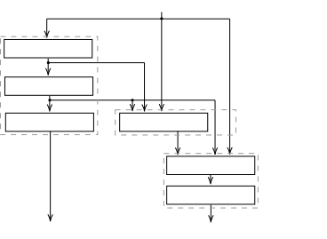
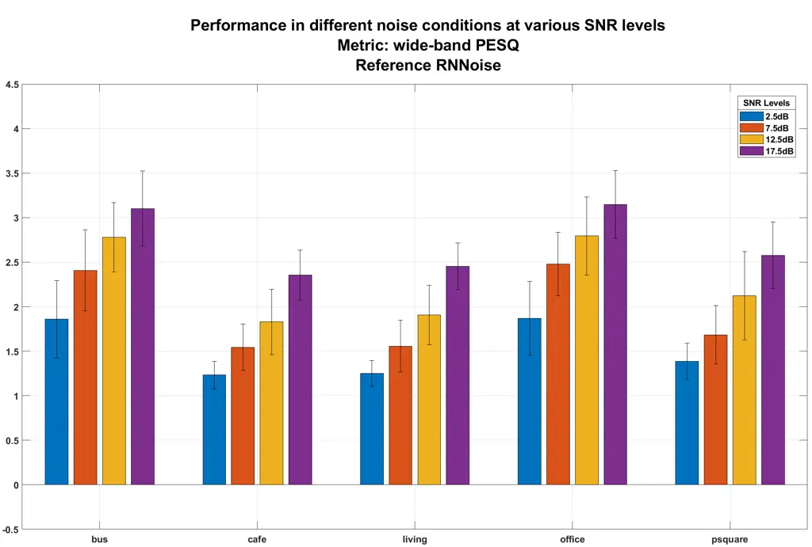
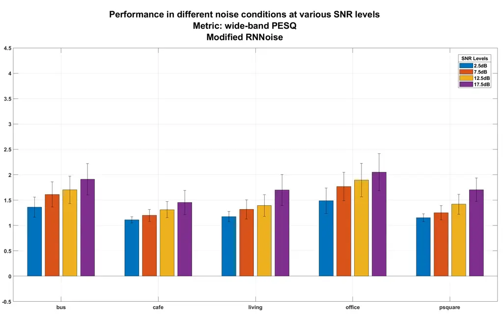
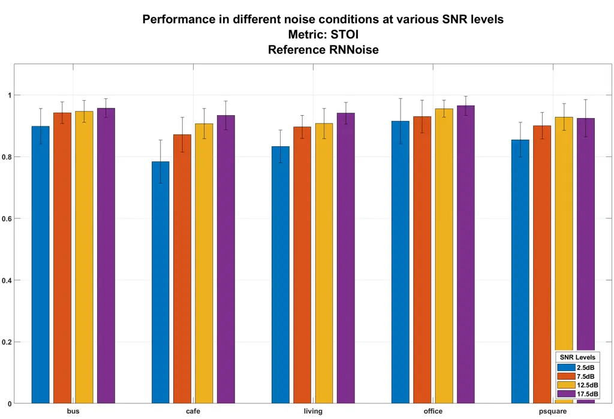
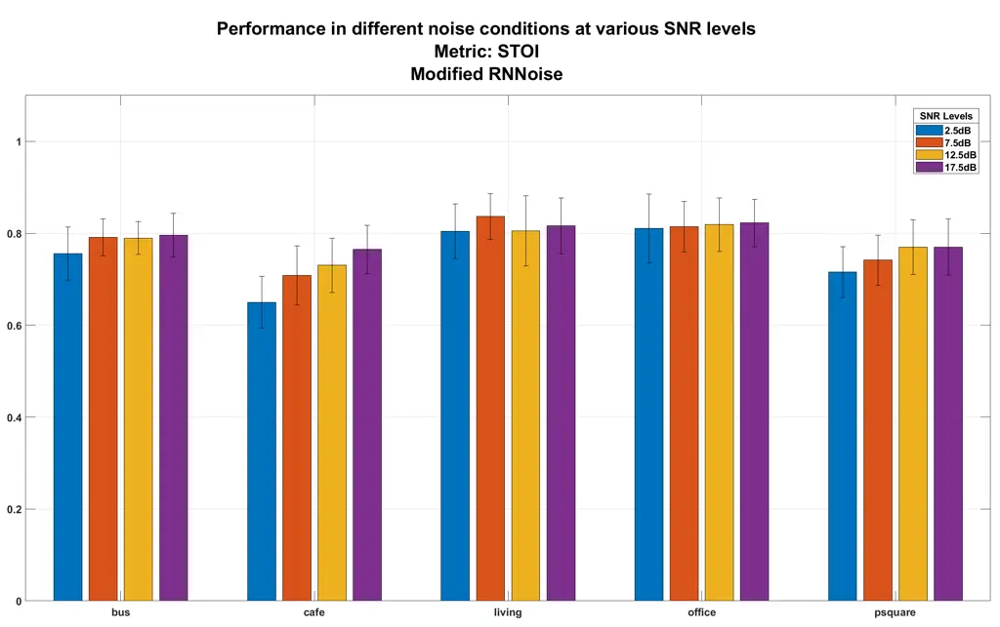

# RNNoise-Ex: Hybrid Speech Enhancement System based on RNN and Spectral Features

Constantine C. Doumanidis Affiliation: School of Electrical and Computer
Engineering  
Aristotle University of Thessaloniki  
Thessaloniki, Greece  
kdoumani@ece.auth.gr    Christina Anagnostou Affiliation: School of
Electrical and Computer Engineering  
Aristotle University of Thessaloniki  
Thessaloniki, Greece  
cdanagnos@ece.auth.gr Affiliation:     Evangelia-Sofia Arvaniti
Affiliation: School of Electrical and Computer Engineering  
Aristotle University of Thessaloniki  
Thessaloniki, Greece  
earvaniti@ece.auth.gr    Anthi Papadopoulou Affiliation: School of
Electrical and Computer Engineering  
Aristotle University of Thessaloniki  
Thessaloniki, Greece  
anthipapado@ece.auth.gr Affiliation: ^(\*)Note: Author name order was
decided arbitrarily.

###### Abstract

Recent interest in exploiting Deep Learning techniques for Noise
Suppression, has led to the creation of Hybrid Denoising Systems that
combine classic Signal Processing with Deep Learning. In this paper, we
concentrated our efforts on extending the RNNoise denoising system with
the inclusion of complementary features during the training phase. We
present a comprehensive explanation of the set-up process of a modified
system and present the comparative results derived from a performance
evaluation analysis, using a reference version of RNNoise as control.

###### Index Terms: 

noise suppression, recurrent neural network, speech enhancement

## I Introduction

Signal Processing has undoubtedly a wide range of useful applications in
the modern world. Narrowing our focus on the domain of Audio Signal
Processing, Speech Enhancement is an especially interesting subfield,
due to the number of its applications, such as telecommunication
networks, online video conferencing \[1\], cochlear implants \[2\],
speech-to-text systems \[3\], etc. Speech Enhancement is heavily
dependent on the concept of denoising; that is the removal of undesired
audio signals that degrade the speech signal which may result in
reduction of quality and intelligibility.

Noise Suppression is by no means a new field of study among scientists
and engineers. The application, however, of modern techniques, ideas and
innovations has enabled the field to grow and include some very
promising denoising algorithms and systems. Such approaches can be
divided to causal (e.g: \[1\]) and non-causal \[7\], depending on
whether they exploit information in future signal frames to process the
current. They can also be categorized in real time or non real time
systems depending on their ability to process signal frames within a
predefined time constraint.

In the past, the focus of Noise Suppression was on the utilization of
conventional signal processing techniques (filtering), which operate by
estimating the statistical characteristics of the noise signal to be
removed. Some commonly used such methods include Wiener \[4\] and Kalman
\[5\] filters.

Following the increase of interest for machine learning shown in recent
years by the scientific community, a new realm of possibility was now
available to researchers in the vein of Noise Suppression. In the last
decade especially, no small number of works have been published that
approach the denoising problem by employing neural network architectures
and innovative deep learning (DL) techniques to counteract
non-stationary noise signals \[6\]. A yet more recent trend among
researchers is the development of hybrid systems that combine both
conventional and ML techniques. The motivations and advantages of such
an approach appear to be:

- •
  the exploitation of existing knowledge on the problem nature, leading
  to the design of concept-aware systems
- •
  engagement of data-driven approaches with large models that give the
  flexibility to better model the complex acoustic patterns of speech
- •
  an increase of system performance by balancing/counteracting each
  method’s weaknesses with the strengths of the other
- •
  a decrease in unnecessary complexity as compared to purely ML
  techniques
- •
  the better handling of auditory artifacts, which constitute one of the
  greatest hindrances in Speech Enhancement to date.

Elaborating on hybrid systems, in \[8\] the noisy audio signal of the
current time frame is first processed using a suppression rule computed
as a geometric mean of the clean speech estimation of the current frame
using a conventional denoising technique and the result of the
suppression rule of the previous frame which was determined by an LSTM
deep-learning technique. This first step is used to remove
quasi-stationary noise components. The intermediate enhanced signal that
results from the previously described process is then used to estimate
the clean speech signal and the current frame suppression rule, using an
LSTM-based approach. The aim of the second step is to efficiently remove
non-stationary noise signals. The approach taken in \[9\] follows a
similar structure to that of \[8\]. Namely, first the noisy signal is
enhanced using the well-known Wiener filter. Afterwards, the resulting
signal is further processed by a multi stream approach, which includes a
number of denoising autoencoders and auto-associative memories, based on
LSTM networks.

### I-A Related Work: The RNNoise Implementation

Another example of a system that combines both conventional and deep
learning techniques, and the base of our work, is RNNoise \[1\],
implemented by Jean Marc Vallin with the support of Mozilla. RNNoise is
a real-time system designed to run on simple hardware (e.g. Raspberry
Pi). To achieve lower complexity, a Recurrent Neural Network (RNN) was
employed for the portion of the spectral mask estimation process that
was hard to tune and a conventional signal processing technique for the
rest of it. In the following subsection we review some details of the
RNNoise implementation that will better help the understanding of the
work presented afterwards.

In RNNoise, the denoising process is applied to 20 ms windows,
overlapped by 50% and windowed by a Vorbis window. For each window,
follows the extraction of certain features that will be analyzed in
Section II that are afterwards used as an input for the RNN. RNNoise
operates on 48kHz full-band audio input. The network computes an ideal
ratio mask (IRM)
$`m=[m_{1},m_{2},...,m_{22}]^{T}\in\mathbb{R}^{22}:m_{i}\in[0,1]`$, for
22 triangular bands derived from a modified version of the Bark scale
that is similar to the Opus scale \[10\]. The 22 gains in
$`[\sqrt{m_{1}},\sqrt{m_{2}},...,\sqrt{m_{22}}]^{T}`$, after an
interpolation, can be applied to the Discrete Fourier Transform (DFT)
magnitudes of each window.

Before that, a pitch filter, namely a comb filter defined at the pitch
period, is applied to each window. What this filter essentially
implements is the addition of the original signal to its scaled and
delayed by the pitch period version. The role of the pitch filter is to
suppress noise between pitch harmonics of voiced speech, which is not
feasible by the coarse 22-band gains mask produced by the neural
network.

After the application of both the gains and the pitch filter, the
waveform of the processed DFT is calculated and the overlap-add method
is used to produce the final denoised signal. Practically, the
overlap-add method is applied gradually, after each new 10 ms samples
arrive, to achieve better response time. For a more detailed analysis of
the RNNoise system see \[1\].


Fig. 1: RNNoise system architecture overview \[1\].

Now that the basics of RNNoise and similar systems have been covered,
what ensues is the presentation of our modifications to the system. In
Section II, the input features –new and old- are described, as well as
the training and evaluation datasets and toolchains. The assessment of
the results of the new system, as well as a comparison with a retrained,
reference version of the original RNNoise system, along with some
comments, comprise Section III of the paper. Finally, in Section IV we
conclude and summarize everything discussed in the previous sections.

## II Methodology

The main objective in this study is to explore possible performance
gains over the original RNNoise system \[1\] by modifying it so that it
utilizes extended information regarding its input. We first review the
input features, then train a reference RNNoise system and our extended
system using our selected datasets, so that we can later evaluate them
and make a fair comparison between the two, and finally present the
toolchain we developed to aid us in this process.

The original system by Valin (2018) uses 42 input features to perform
speech enhancement \[1\]. The first 22 are Bark Frequency Cepstral
Coefficients (BFCCs) as derived from applying the Discreet Cosine
Transformation (DCT) on the log spectrum of the previously mentioned
modified Bark scale. The next 12 features are the first and second order
temporal derivatives of the first 6 BFCCs. The following 6 features are
calculated by applying the DCT on the pitch correlation across frequency
bands and selecting the first 6 coefficients. The final two features are
the pitch period and a spectral non-stationary metric that assists in
speech detection.

Given that the original system generally relies upon features related to
pitch and BFCCs, we decided to explore the potential of combining them
with characteristics of a different nature. Reviewing commonly used
features in the literature \[11\] \[12\] \[13\] \[14\] \[15\], we chose
to use the following, standardized to zero mean and unit variance, for
the full spectral and temporal range of each 20 ms frame processed by
the extended system:

- •
  Spectral Centroid: Signal’s spectral “center of mass”
- •
  Spectral Bandwidth: Signal’s highest minus lowest frequency
- •
  Spectral Roll-Off: Threshold frequency over which 90% of the signal’s
  energy is situated

To calculate Spectral Centroid, first the Discrete Fourier Transform
(DFT) for each frame is calculated using (1), where $`k`$ is the
$`k`$-th frequency for the $`n`$-th frame, $`x(m)`$ is the input signal,
$`w(m)`$ is a window function and $`L`$ is the window’s length. Spectral
Centroid is then calculated using (2) with $`K`$ being the DFT’s order.

```math
A(n,k)=|\sum_{m=-\infty}^{\infty}x(m)w(nL-M)e^{-j(\frac{2\pi}{L}km)}| \tag{1}
```

```math
SC(n)=\frac{\sum_{k=0}^{K-1}k\cdot|A(n,k)|^{2}}{\sum_{k=0}^{K-1}|A(n,k)|^{2}} \tag{2}
```

Spectral Roll-Off is calculated using (3) where $`N`$ is the total
number of frames, $`K`$ is the order of the DFT, $`TH`$ is a threshold
(usually $`\approx 0.9`$) and $`A(n,k)`$ is calculated using (1).

```math
SRF(n)=max(h|\sum_{k=0}^{h}A(n,k)<TH\cdot\sum_{k=0}^{K-1}|A(n,k)|^{2}) \tag{3}
```

To train and evaluate our extended system we implemented a modified
toolchain which reuses modified parts of \[1\]. In the following
paragraphs we present the components of our toolchain for feature
extraction, training and evaluation. The full training and evaluation
toolchain is visualized in Fig. 2. Our source code is publicly available
¹¹ 1 Source Code:
[https://github.com/CedArctic/rnnoise-ex](https://github.com/CedArctic/rnnoise-ex).


Fig. 2: Training and Evaluation toolchain overview.

For feature extraction we first use Sound eXchange (SoX) \[16\] to
concatenate and convert the input clean speech and noise to RAW format
files which we then process using the appropriate tool from \[1\] to
generate the training samples, by mixing clean speech and noise tracks
as shown in \[1\], and extract the original 42 features as well as
additional features used for training. After, we process the training
samples using a feature extraction tool to extract the additional
features.

We train the extended system using Keras with Tensorflow \[17\] through
the training tool which we modified according to the extended system’s
parameters. Both reference and extended system are trained through the
course of 120 epochs with 8 steps each using the Adam optimizer with the
learning rate set to 0.001. We use the loss function (4) (as proposed in
\[1\]), where $`m`$ is the ground truth IRM mask, $`\hat{m}`$ is the
mask calculated by the RNN, $`\gamma=\frac{1}{2}`$ is a parameter that
tunes the suppression’s aggressiveness and $`N`$ is the number of bands,
which in our case is l to 22. During training, both systems process 3
600 000 audio frames, each with a non-overlapping 10 ms duration.

```math
L(m,\hat{m})=\\
\frac{1}{N}\cdot\bigg(10\cdot\sum_{i=1}^{N}\Big(min(m_{i}+1,1)\cdot(10\cdot(m_{i}-\hat{m_{i}})^{4}{\\
}+(\sqrt{\hat{m_{i}}}-\sqrt{m_{i}})^{\gamma}-0.01\cdot m_{i}\cdot log(\hat{m_{i}}))\Big)\\
-\frac{1}{2}\cdot\sum_{i=1}^{N}\Big(2\cdot|m_{i}-0.5|\cdot m_{i}\cdot log(\hat{m_{i}})\Big)\bigg) \tag{4}
```

To evaluate inputs to our trained extended system, we first extract the
42 features presented in \[1\] using the original feature extraction
tool and then merge them with the additional features extracted using
the tools previously described. We pass this data along with the input
audio file to the evaluation tool which calculates, interpolates and
applies the modified Bark scale gains along with a pitch filter to the
audio file as described in \[1\].

The architecture of the neural network used follows that of the original
RNNoise system with the difference that the input layer creates a tensor
whose size is modified to fit that of the increased number of features.
The topology is presented in detail in Fig. 3 and the system contains
215 units and 4 hidden layers.



Fig. 3: Deep Recurrent Neural Network Topology.

As described in the original paper \[1\], the network is so designed
that it follows the usual structure of many conventional noise
suppression algorithms. The basic idea behind the design of the system
is that it can be divided into three subsystems: a Voice Activity
Detector (VAD), a noise spectral estimation and a spectral subtraction
block. Each subsystem includes a recurrent layer and specifically a
gated recurrent unit (GRU).

Concerning VAD, it contributes significantly to the training process by
helping the system differentiate noise from speech. It also outputs a
voice activity probability even though it is not actively used in the
inference process.

To train our RNNoise and feature-extended systems we utilize the clean
speech dataset included in the Edinburgh Dataset \[20\] which is
comprised of audio recordings, sampled at 48 kHz, of 28 English speakers
(14 men and 14 women) with similar pronunciation. For noise recordings,
we used a subset of the acoustical environments available in the DEMAND
dataset \[21\]. These environments were then excluded from those used as
the test set. The DEMAND dataset includes noise recordings corresponding
to six distinct acoustic scenes (Domestic, Nature, Office, Public,
Street and Transportation), which are further subdivided in multiple
more specific noise sources \[21\]. Note that while we used clean speech
and noise included in the Edinburgh Dataset, the samples used for
training the systems are not the noisy samples found in the noisy speech
subset of the Edinburgh Dataset, but rather samples mixed using the
method described in \[1\].

The test set used is the one provided in the Edinburgh Dataset \[20\],
which has been specifically created for speech enhancement applications
and consists of wide-band (48kHz) clean and noisy speech audio tracks.
The noisy speech in the set included four different SNR levels (2.5dB,
7.5dB, 12.5dB, 17.5dB). The clean speech tracks included in the set are
recordings of two english language speakers, a male and a female. As for
the noise recordings that were used in the mixing of the noisy speech
tracks, those were derived from the DEMAND database \[21\] \[22\]. More
specifically, the noise profiles found in the testing set are:

- •
  Living: noise inside a living room (Domestic)
- •
  Office: noise from a small office with three people using computers
  (Office)
- •
  Psquare: noise from a public town square with many tourists (Street)
- •
  Cafe: noise from the terrace of a cafe at a public square (Street)
- •
  Bus: noise a public transit bus (Transportation)

The selection of the appropriate evaluation metrics is of great
importance in the effort of regular evaluation of any system. In order
to evaluate our system we used a metric that focuses on the sound
quality (PESQ) and a metric that focuses on the intelligibility of the
voice signal (STOI).

The wide-band Perceptual Evaluation of Speech Quality (PESQ) \[18\] is
an objective and generally used standard for measuring sound quality. It
takes account of features such as sound sharpness, speech volume,
ambient noise, interruptions and interferences \[35\]. The PESQ scale
calibration ranges from -0.5 to 4.5, with higher values corresponding to
better quality.

The Short-Time Objective Intelligibility (STOI) \[19\] is a metric that
increases according to the average intelligibility of the processed
signal, given the original signal. Average intelligibility (or
comprehensibility) is the percentage of words that are properly
understood by a group of users. This metric ranges from 0 to 1.

## III Results and Discussion

It was deemed appropriate to present our results in a comparison between
the reference RNNoise system and the modified version that makes use of
the additional features. By comparing the two systems with regards to
the PESQ quality metric, as seen in Fig. 4, it becomes apparent that the
modified version falls short by significant margin in all acoustic
environment settings and in all SNR levels, but especially in higher
SNRs. Similarly, examining the STOI intelligibility measure, as depicted
in Fig. 5, it is deduced that the modified version again falls severely
short, but this time it is especially so for higher values of SNR. An
exception to this appears to be the case of the ”Living” audio scene,
where, especially for low SNRs the performance of the two systems seems
to be similar.



(a)



(b)

Fig. 4: Extended and Reference System PESQ performance in different
acoustical environments under various SNR levels:  
a. Reference system and b. Extended system



(a)



(b)

Fig. 5: Extended and Reference System STOI performance in different
acoustical environments under various SNR levels:  
a. Reference system and b. Extended system

Overall, the modified system appears to have a generally worse
performance than the reference version of RNNoise. Having also compared
several pairs of spectrograms of both denoising system cases, it was
observed that in general the modified version does indeed subtract less
noise components.

Having taken these results into consideration, we now discuss some
avenues for further future development that will hopefully yield better
performance results.

Firstly, while for the base system \[1\] Valin notes that adding more
hidden layers does not improve performance significantly, we believe
that it might indeed be beneficial for our extended system. Given that
we provide the system with more and diverse input information, the RNN
might be able to better exploit the proposed features with additional
hidden layers.

Currently our extended system utilizes the additional features as
calculated on the full spectrum of each window processed by the RNN. We
believe that the system’s performance can potentially be improved by
calculating these features for each individual subband of the modified
Bark scale or for a small selection of them. This will subsequently lead
to an increase of the RNN’s input features and as such the network’s
hidden layers will have to be adapted to properly accommodate this
change.

Studying samples processed by our extended system, we speculate that the
system could benefit from changing how aggressively the noise
suppression occurs. This can be achieved by fine-tuning the value of the
$`\gamma`$ parameter in the loss function (4), keeping in mind that
smaller $`\gamma`$ values lead to more aggressive suppression. According
to \[1\], setting $`\gamma=\frac{1}{2}`$ is an optimal balance.

We initially considered also using Root Mean Square (RMS), which is
related to the signal’s energy and its change over time, and Spectral
Flatness which is used to discern tone-like from noise-like signals.
However, when we calculated and visualized these features for our
dataset, we discovered that they offered limited variance and had many
outliers. This led us to omit them from our feature set as we believed
that they would increase input dimensionality more than would benefit
performance. Revisiting these features under the subbanding context
described above might prove to improve the system.

Finally, we believe that further research can be done regarding the
performance of the base and extended systems as the training dataset
increases in size and diversity.

## IV Conclusion

In this paper we have presented our efforts to extend and improve a
hybrid speech enhancement system. We proposed features which we believed
would further assist the denoising process and assessed them as inputs
to the recurrent neural network. We illustrated our toolchain for
training the system with extended input features and compared the system
against a reference RNNoise instance trained using the same training
parameters. We discussed our findings from this process, concluding that
the extra features have no obvious positive effect on the system’s
performance for the training test size used. Finally, we laid out our
thoughts on future avenues to be explored for further improvement of the
base system using spectral features.

## Acknowledgment

We would like to thank our teachers, Dr. Charalampos A. Dimoulas
(Associate Professor) and Dipl. Iordanis Thoidis (PhD candidate)
(Laboratory of Electroacoustics and TV Systems, School of Electrical and
Computer Engineering, Aristotle Univeristy of Thessaloniki) for their
enthusiastic guidance and support throughout the research process and
writing of this paper.

## References

- \[1\] J.-M. Valin, “A Hybrid DSP/Deep Learning Approach to Real-Time
  Full-Band Speech Enhancement,” International Workshop on Multimedia
  Signal Processing, 2018.
- \[2\] Y.-H. Lai et al. “Deep Learning-Based Noise Reduction Approach
  to Improve Speech Intelligibility for Cochlear Implant Recipients,”
  Ear and hearing vol. 39,4 (2018): 795-809.
- \[3\] C. Donahue, B. Li and R. Prabhavalkar, “Exploring Speech
  Enhancement with Generative Adversarial Networks for Robust Speech
  Recognition,” 2018 IEEE International Conference on Acoustics, Speech
  and Signal Processing (ICASSP), Calgary, AB, Canada, 2018, pp.
  5024-5028.
- \[4\] J. S. Lim and A. V. Oppenheim, “Enhancement and bandwidth
  compression of noisy speech,” in Proceedings of the IEEE, vol. 67, no.
  12, pp. 1586-1604, Dec. 1979.
- \[5\] G. Welch et al. “An Introduction to the Kalman Filter,” Proc.
  Siggraph Course 8, 2006.
  [https://www.researchgate.net/publication/200045331_An_Introduction_to_the_Kalman_Filter](https://www.researchgate.net/publication/200045331_An_Introduction_to_the_Kalman_Filter)
- \[6\] D. Wang, J. Chen, “Supervised Speech Separation Based on Deep
  Learning: An Overview,” in IEEE/ACM Transactions on Audio, Speech, and
  Language Processing, vol. 26, no. 10, pp. 1702-1726, Oct. 2018
- \[7\] M. Shifas, N. Adiga, V. Tsiaras, Y. Stylianou, “A non-causal
  FFTNet architecture for speech enhancement,” Interspeech, 2019.
- \[8\] Y.-H. Tu, I. Tashev, S. Zarar, C.-H. Lee, “A Hybrid Approach to
  Combining Conventional and Deep Learning Techniques for Single-Channel
  Speech Enhancement and Recognition,” 2531-2535,
  10.1109/ICASSP.2018.8461944, Apr. 2018.
- \[9\] M. J. Coto, J. C. Goddard, L. Di Persia, H. L. Rufiner, “Hybrid
  Speech Enhancement with Wiener Filters and Deep LSTM Denoising
  Autoencoders,” 1-8, 10.1109/IWOBI.2018.8464132.
- \[10\] J.-M. Valin, G. Maxwell, T. B. Terriberry, and K. Vos,
  “High-quality, low-delay music coding in the Opus codec,” in Proc.
  135th AES Convention, 2013.
- \[11\] T. Giannakopoulos and A. Pikrakis, ”Introduction to Audio
  Analysis: a MATLAB Approach,” Academic Press Is an Imprint of
  Elsevier, 2014.
- \[12\] T. Andersson, ”Audio Classification and Content Description,”
  MS Thesis, Luleå University of Technology, 2004.
- \[13\] E. Maningo, “Understanding What Does RMS Stands for in Audio:
  Definition & Details,” Audio Recording, 2012.
- \[14\] G. Peeters, “A large set of audio features for sound
  description (similarity and classification) in the Cuidado Project,”
  Institut de Recherche et Coordination Acoustique/Musique
  (IRCAM), 2004.
- \[15\] S. Dubnov, “Generalization of Spectral Flatness Measure for
  Non-Gaussian Linear Processes,” IEEE Signal Processing Letters, vol.
  11, no. 8, 2004.
- \[16\] C. Bagwell, “SoX - Sound eXchange,”
  [http://sox.sourceforge.net/Main/HomePage](http://sox.sourceforge.net/Main/HomePage), 2015.
- \[17\] M. Abadi, A. Agarwal, P. Barham, E. Brevdo, Z. Chen, C. Citro
  et al., “Tensorflow: A system for large-scale machine learning,”
  [https://www.tensorflow.org](https://www.tensorflow.org), 2015.
- \[18\] J. O’Farrell, “What Is: PESQ?” \[Blog\] Transforming global
  communications, 2020.
  [https://www.spearline.com/blog/post/what-is--pesq-/](https://www.spearline.com/blog/post/what-is--pesq-/)
  (Accessed: 04 June 2020)
- \[19\] C. H. Taal et al. “A short-time objective intelligibility
  measure for time-frequency weighted noisy speech,” 2010 IEEE
  International Conference on Acoustics, Speech and Signal Processing,
  Dallas, TX, USA, 14-19 March 2010. IEEE, 2010, pp. 4214-4217. IEEE
  Xplore,
  [https://ieeexplore.ieee.org/abstract/document/5495701](https://ieeexplore.ieee.org/abstract/document/5495701)
- \[20\] C. Valentini-Botinhao, “Noisy speech database for training
  speech enhancement algorithms and TTS model,” University of Edinburgh,
  School of Informatics, Centre for Speech Technology Research (CSTR),
  2017, 2016 \[sound\].
  [https://doi.org/10.7488/ds/2117](https://doi.org/10.7488/ds/2117)
- \[21\] J. Thiemann, N. Ito and E. Vincent, “DEMAND: a collection of
  multi-channel recordings of acoustic noise in diverse environments,”
  (Version 1.0) \[Data set\], Presented at the 21st International
  Congress on Acoustics (ICA 2013), Montreal, Canada: Zenodo, 2013.
  [http://doi.org/10.5281/zenodo.1227121](http://doi.org/10.5281/zenodo.1227121)
- \[22\] C. Valentini-Botinhao, X. Wang, S. Takaki, J. Yamagishi,
  “Speech Enhancement for a Noise-Robust Text-to-Speech Synthesis System
  Using Deep Recurrent Neural Networks,” INTERSPEECH, 2016.
