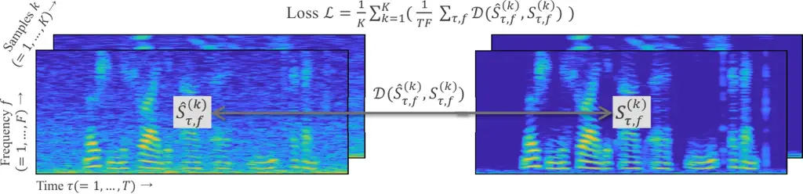

# Training Speech Enhancement Systems with Noisy Speech Datasets

###### Abstract

Recently, deep neural network (DNN)-based speech enhancement (SE)
systems have been used with great success. During training, such systems
require clean speech data – ideally, in large quantity with a variety of
acoustic conditions, many different speaker characteristics and for a
given sampling rate (e.g., 48kHz for fullband SE). However, obtaining
such clean speech data is not straightforward – especially, if only
considering publicly available datasets. At the same time, a lot of
material for automatic speech recognition (ASR) with the desired
acoustic/speaker/sampling rate characteristics is publicly available
except being clean, i.e., it also contains background noise as this is
even often desired in order to have ASR systems that are noise-robust.
Hence, using such data to train SE systems is not straightforward. In
this paper, we propose two improvements to train SE systems on noisy
speech data. First, we propose several modifications of the loss
functions, which make them robust against noisy speech targets. In
particular, computing the median over the sample axis before averaging
over time-frequency bins allows to use such data. Furthermore, we
propose a noise augmentation scheme for mixture-invariant training
(MixIT), which allows using it also in such scenarios. For our
experiments, we use the Mozilla Common Voice dataset and we show that
using our robust loss function improves PESQ by up to $`0.19`$ compared
to a system trained in the traditional way. Similarly, for MixIT we can
see an improvement of up to $`0.27`$ in PESQ when using our proposed
noise augmentation.

|                                                                                    |
| ---------------------------------------------------------------------------------- |
| Koichi Saito¹, Stefan Uhlich², Giorgio Fabbro², Yuki Mitsufuji²                    |
| ¹ The University of Tokyo, Japan     ² Sony Corporation, R&D Center, Germany/Japan |

Index Terms—  Speech enhancement, Mozilla Common Voice,
mixture-invariant training, deep neural networks

## 1 Introduction

Speech enhancement (SE) is a technique for extracting a clean speech
signal from an observed signal containing speech and noise. It is a
fundamental technique for various audio applications including automatic
speech recognition or voice calls. The recent development of SE has been
built upon machine learning techniques using deep neural networks
(DNNs)\[1, 2, 3, 4, 5\].

In supervised learning, a large amount of training data is required to
obtain a well-performing system. Most of the DNN-based SE systems
require clean speech data for training. Collecting such data is quite
expensive as it requires recordings with well-controlled conditions.
Even if we can get clean speech data, the quantity and variety of
acoustic conditions, and the speaker characteristics are often limited,
especially given some constraints on the sampling rate (e.g., 48kHz for
a fullband system).

To overcome such problems, researchers have tried to train DNN-based SE
systems without clean speech data\[6, 7, 8, 9\]. The training strategy
used in \[6\] was originally proposed in Noise2Noise \[10\]: it requires
pairs of noisy signals consisting of the same speech data but different
noise samples. In image processing applications, we can obtain images of
exactly the same target with different noise patterns using multiple
exposures. However, this is not the case for audio applications as it is
in general impossible to observe multiple noisy signals with exactly the
same speech signal and, hence, the multi-microphone approach of \[6\]
has its limitations. In \[9, 7\], the training strategy is the same as
if clean speech data would be used, i.e., the training targets are the
noisy speech. However, the experimental results in \[9, 7\] showed that
their proposed method could not achieve a better performance than a DNN
trained with a smaller dataset of clean speech. Finally, another
approach is mixture-invariant training (MixIT) from \[8\]. It proposes a
loss function to train from a dataset of mixtures that can also be
applied to SE with noisy targets. We performed some preliminary
experiments which showed that the performance of an SE system trained
with MixIT is poor as the noise in the speech target and the
artificially added noise stem from different distributions: this
conflicts with the “independent mixture” assumption of MixIT, causing a
poor performance. In summary, no satisfactory solution for training with
noisy speech data exists yet.

Hence, in this paper, we propose two improvements to train SE systems on
noisy speech data. First, we propose several modifications of the loss
function, which make it robust against noisy speech by exploiting
characteristics of time-frequency (T-F) bins. In particular, computing
the median over the sample axis before averaging over the T-F bins
allows to train from noisy speech data. Second, we propose a noise
augmentation scheme for MixIT, which allows using it also in such
scenarios.

The main contributions of this paper are as follows. First, we analyze
noise artefacts in the Mozilla Common Voice \[11\] dataset, which is a
large, open-sourced and multi-lingual but noisy speech dataset. Second,
we study several loss functions for SE systems with noisy speech data
and propose a loss function which computes the median over the sample
axis before averaging over the T-F bins. Finally, we propose a noise
augmentation scheme for MixIT and confirm that this scheme allows to
train with noisy speech data.

## 2 Problem Definition and Related Work



Figure 1: Visualization of loss computation, the errors of individual
T-F bins are averaged over time, frequency and sample dimension.

### 2.1 Problem settings of speech enhancement

Let $`\mathbf{x}\in\mathbb{R}^{T^{\prime}}`$ denote an observed mixture
of target speech $`\mathbf{s}\in\mathbb{R}^{T^{\prime}}`$ and noise
$`\mathbf{n}\in\mathbb{R}^{T^{\prime}}`$, i.e.,
$`\mathbf{x}=\mathbf{s}+\mathbf{n}`$ in the time domain. The goal of SE
is to reconstruct the speech signal $`\mathbf{s}`$ from $`\mathbf{x}`$.

Over the last years, numerous DNN-based SE systems have been proposed.
Many of those systems are based on T-F masking in the short-time Fourier
transform (STFT) domain \[12, 13, 14, 15, 16\]. Using T-F masking, the
enhanced speech $`\hat{\mathbf{s}}`$ can be obtained by
$`\hat{\mathbf{s}}=\mathcal{F}^{-1}(\hat{\mathbf{S}})=\mathcal{F}^{-1}(\mathcal{M}_{\theta}\odot\mathbf{X}))`$,
where $`\mathcal{F}^{-1}`$ is the inverse STFT, $`\mathcal{M}_{\theta}`$
is a T-F mask, $`\odot`$ is the element-wise product, $`\mathbf{X}`$ is
the T-F representation of $`\mathbf{x}`$ and $`\hat{\mathbf{S}}`$ is the
T-F representation of $`\hat{\mathbf{s}}`$, respectively. During
training, the loss

```math
\vskip-2.39996pt\mathcal{L}=\frac{1}{K}\sum^{K}_{k=1}\left(\frac{1}{TF}\sum_{\tau,f}\mathcal{D}(\hat{S}^{(k)}_{\tau,f},S^{(k)}_{\tau,f})\right),\vskip-2.39996pt \tag{1}
```

between the enhanced signal $`\hat{S}^{(k)}_{\tau,f}`$ and target signal
$`S^{(k)}_{\tau,f}`$ is minimized where $`k=1,\dots,K`$ denotes the
(minibatch) sample index, $`f=1,\dots,F`$ and $`\tau=1,\dots,T`$ denote
frequency and time indices, respectively. The difference between
$`\hat{S}^{(k)}_{\tau,f}`$ and $`S^{(k)}_{\tau,f}`$ is measured by the
distance $`\mathcal{D}(.,.)`$. Please see Fig. 1 for a visual depiction
of the loss computation.

Most of the DNN-based systems require clean speech as targets
$`S_{\tau,f}^{(k)}`$ during training. However, as described in Sec. 1,
such data is often not available and also not straight-forward to
generate. At the same time, noisy speech data can be obtained more
easily than clean data in a large amount and variety by using
crowdsourcing. For example, Mozilla Common Voice \[11\] is an
open-source dataset that contains a large amount of speech data, variety
of speakers and acoustic conditions (see Sec. 3). Therefore, if we can
train SE systems using noisy speech data which show a higher enhancement
performance than using a small amount of clean speech data, we can
expect further improvements for DNN-based SE systems.

### 2.2 Mixture-invariant training (MixIT)

MixIT\[8\] is an unsupervised sound separation method, which requires
only mixtures during training. This method was proposed as a
generalization of the permutation invariant training framework \[17\] to
train directly from unsupervised mixtures. MixIT can also be applied to
SE as shown in the original paper and described in Fig. 2. When MixIT is
applied in the T-F domain for SE, we input the mixture of two audio
signals, noisy speech data and noise-only data, and we train by
minimizing

```math
\mathcal{L}_{\rm{MixIT}}(\hat{\mathcal{X}},\mathbf{X},\mathbf{N})\\
=\min(\mathcal{L}(\hat{\mathbf{X}}_{1}+\hat{\mathbf{X}}_{2},\mathbf{X})+\mathcal{L}(\hat{\mathbf{X}}_{3},\mathbf{N}),\\
\mathcal{L}(\hat{\mathbf{X}}_{1}+\hat{\mathbf{X}}_{3},\mathbf{X})+\mathcal{L}(\hat{\mathbf{X}}_{2},\mathbf{N})), \tag{2}
```

where
$`\hat{\mathcal{X}}=\{\hat{\mathbf{X}}_{1},\hat{\mathbf{X}}_{2},\hat{\mathbf{X}}_{3}\}`$
denotes the three outputs of the DNN in the T-F domain, $`\mathbf{X}`$
the input noisy speech data in the T-F domain, $`\mathbf{N}`$ the
noise-only data in the T-F domain, respectively. By minimizing the loss
(2), we find the best mixture permutation and we can expect that
$`\hat{\mathbf{X}}_{1}`$ will contain enhanced speech data, while
$`\hat{\mathbf{X}}_{2}`$ and $`\hat{\mathbf{X}}_{3}`$ will contain the
noise. This scheme was used in \[8\] for mixtures of speech with
artificial noise. However, in \[9\] it has been reported that an SE
system does not work well when using noisy speech data and noise signals
as input and we will give an explanation of this phenomenon in Sec. 4.2.

## 3 Mozilla Common Voice

|              |       |               |        |         |
| ------------ | ----- | ------------- | ------ | ------- |
|              |       |               |        |         |
| Data         | Click | Reverberation | valid  | invalid |
| attribution  | noise |               | (/300) | (/300)  |
|              |       |               |        |         |
| Clean speech | w/o   | w/o           | 60     | 37      |
|              |       | w/            | 10     | 3       |
|              | w/    | w/o           | 82     | 32      |
|              |       | w/            | 12     | 16      |
| Noisy speech | w/o   | w/o           | 64     | 83      |
|              |       | w/            | 11     | 44      |
|              | w/    | w/o           | 52     | 27      |
|              |       | w/            | 9      | 27      |
| Pure noise   | -     | -             | 0      | 10      |
| Silence      | -     | -             | 0      | 21      |
|              |       |               |        |         |

Table 1: Manual analysis of MCV valid and invalid for English.
Classification is based on speech, noise and reverberation.

In this work, we used the Mozilla Common Voice (MCV) dataset for the
training of our SE systems. In the following, we will describe this
dataset in more detail. MCV is an open-source, multi-lingual speech
dataset. The current release “2020-12-11” consists of $`9,283`$ recorded
hours in $`60`$ languages, but the project is constantly growing, so
more speakers and languages will be added in the future. It is a
crowd-sourced collection of voice clips featuring a wide variety of
real-world recording environments and speaker characteristics. However,
due to the fact that the data collection is crowd-sourced, many of the
recorded voice clips contain noise.

Submitted clips are sorted into two groups, MCV valid and invalid,
according to certain rules.¹¹ 1
https://commonvoice.mozilla.org/en/about#how-it-works. Valid means that
the speech samples can be used for automatic speech recognition (ASR)
and invalid means that the samples are not appropriate for ASR. The MCV
valid subset contains only speech data and some of them contain
background noises, reverberations and other sound. MCV invalid contains
in addition silent data or noise-only data due to errors made by the
contributors.

In order to get a better understanding of the data that is present in
both subsets, we did a manual analysis where we used 300 randomly chosen
samples from MCV valid and invalid in English. The results are
summarized in Table 1. “Click noise” in Table 1 refers to mouse/keyboard
click sounds that are generated when contributors finish their recording
of a sample. “Reverberation” refers to the reverberation caused by the
recording environment. MCV is expected to ease the problem of limited
data as mentioned above, except containing noisy speech. In this paper,
we will use MCV valid and invalid as training targets to show the
benefit of our methods.

## 4 Proposed Method

Figure 2: Scheme of MixIT for SE and proposed noise augmentation.
$`\mathbf{S}`$ denotes the clean speech signal,
$`\mathbf{N}_{\rm{recording}}`$ the background noise signal during
recording and $`\mathbf{N}_{\rm{artificial}}`$ is the noise signal which
is added by our proposed augmentation, respectively.

Figure 3: Network architecture of Open-Unmix (UMX) and modified UMX for
MixIT scheme.

In order to train SE systems using noisy speech data, we propose two new
methods. First, we present in Sec. 4.1 several modifications of the loss
(1) with the aim of making it robust against noisy speech targets.
Second, we propose in Sec. 4.2 a noise augmentation scheme for MixIT,
allowing to use it for our problem setting.

### 4.1 Making the loss function robust

To improve the SE performance when training with noisy speech data, we
study the characteristics of noisy speech signals in the STFT domain and
propose modifications to the mean squared error (MSE) loss. The MSE is
given by

```math
\mathcal{L}_{\rm{MSE}}=\frac{1}{K}\sum_{k=1}^{K}\left(\frac{1}{TF}\sum_{\tau,f}(\hat{S}^{(k)}_{\tau,f}-S^{(k)}_{\tau,f})^{2}\right)\\
=\rm{MEAN}_{\textrm{Samples}}(\rm{MEAN}_{\textrm{T-Fbins}}\mathcal{D}(\bf{\hat{S}}-\bf{S})), \tag{3}
```

where $`K`$ is the minibatch-size, $`T`$ is the number of time frames
and $`F`$ is the number of frequency bins in the T-F domain. We will
refer in the following to the standard MSE as “sample T-F bin mean”.
Similarly, the signal-to-distortion ratio (SDR) loss is given by

```math
\mathcal{L}_{\rm{SDR}}=-\frac{1}{K}\sum_{k=1}^{K}\left(\frac{1}{TF}\sum_{\tau,f}10\log_{10}\frac{(S^{(k)}_{\tau,f})^{2}}{(\hat{S}^{(k)}_{\tau,f}-S^{(k)}_{\tau,f})^{2}}\right). \tag{4}
```

Table 2 lists our proposed loss functions. We will now discuss each
proposal and give the rationale behind it:

- •
  “Sample median, T-F bin mean”: Compute mean over T-F bins and then
  median over samples. This is expected to train without using difficult
  samples for denoising (i.e., very noisy targets).
- •
  “Sample mean, T-F bin median”: Compute median over T-F bins and then
  mean over sample. This is expected to train without using difficult
  T-F bins.
- •
  “Sample mean, T-bin median, F-bin mean”: Compute mean over F-bins,
  median over T-bins and then mean over samples. This is expected to
  train without using difficult time frames which, e.g., contain click
  noise.
- •
  “T-F bin mean, sample median”: Compute median over samples and then
  mean over T-F bins. This loss is expected to train using only samples
  appropriate for enhancement and all T-F bins.
- •
  “T-F bin mean, sample trimmed mean”: Compute mean over 25% of samples
  from the minibatch with the smallest loss (for each T-F bin) and then
  mean over T-F bins. Instead of “T-F bin mean, sample median”, this
  loss can use more samples and thus, if there are more samples in the
  minibatch which we can trust, can yield better performance.

We will compare these loss functions in Sec. 5.2.

|                                       |                                                                                                                             |
| ------------------------------------- | --------------------------------------------------------------------------------------------------------------------------- |
| Loss name                             | Loss computation                                                                                                            |
|                                       |                                                                                                                             |
| Sample median, T-F bin mean           | $`\rm{MEDIAN}_{\textrm{Samples}}(\rm{MEAN}_{\textrm{T-Fbins}}\mathcal{D}(\bf{\hat{S}}-\bf{S}))`$                            |
| Sample mean, T-F bin median           | $`\rm{MEAN}_{\textrm{Samples}}(\rm{MEDIAN}_{\textrm{T-Fbins}}\mathcal{D}(\bf{\hat{S}}-\bf{S}))`$                            |
| Sample mean, T-bin median, F-bin mean | $`\rm{MEAN}_{\textrm{Samples}}(\rm{MEDIAN}_{\textrm{T-bins}}(\rm{MEAN}_{\textrm{F-bins}}\mathcal{D}(\bf{\hat{S}}-\bf{S}))`$ |
| T-F bin mean, sample median           | $`\rm{MEAN}_{\textrm{T-Fbins}}(\rm{MEDIAN}_{\textrm{Samples}}\mathcal{D}(\bf{\hat{S}}-\bf{S}))`$                            |
| T-F bin mean, sample trimmed mean     | $`\rm{MEAN}_{\textrm{T-Fbins}}(\rm{TrimmedMEAN}_{\textrm{Samples}}\mathcal{D}(\bf{\hat{S}}-\bf{S}))`$                       |
|                                       |                                                                                                                             |

Table 2: Proposed loss functions. Subscripts F-bins denote operation
along $`f`$ axis, T-bins denote operation along $`\tau`$ axis, and
Samples denote operation along sample axis $`k`$ in (3).

|                                         |                |               |                |                      |               |                |                        |               |                |
| --------------------------------------- | -------------- | ------------- | -------------- | -------------------- | ------------- | -------------- | ---------------------- | ------------- | -------------- |
| Training dataset $`\rightarrow`$        | Trained w/ VBD |               |                | Trained w/ MCV valid |               |                | Trained w/ MCV invalid |               |                |
| Test dataset $`\rightarrow`$            | VBD            | DNS (w/ rev.) | DNS (w/o rev.) | VBD                  | DNS (w/ rev.) | DNS (w/o rev.) | VBD                    | DNS (w/ rev.) | DNS (w/o rev.) |
|                                         |                |               |                |                      |               |                |                        |               |                |
| Noisy (Raw)                             | 1.97           | 1.82          | 1.58           | 1.97                 | 1.82          | 1.58           | 1.97                   | 1.82          | 1.58           |
|                                         |                |               |                |                      |               |                |                        |               |                |
| “Sample T-F bin mean” (traditional MSE) | 2.26           | 1.52          | 1.87           | 2.11                 | 1.91          | 1.62           | 2.07                   | 1.89          | 1.56           |
| “Sample median, T-F bin mean”           | 2.24           | 1.61          | 1.73           | 2.15                 | 1.84          | 1.55           | 2.26                   | 1.90          | 1.57           |
| “Sample mean, T-F bin median”           | 1.54           | 1.59          | 1.39           | 1.39                 | 1.43          | 1.29           | 1.49                   | 1.48          | 1.33           |
| “Sample mean, T-bin median, F-bin mean” | 2.05           | 1.84          | 1.63           | 1.94                 | 1.70          | 1.40           | 1.95                   | 1.79          | 1.39           |
| “T-F bin mean, sample median”           | 2.19           | 1.40          | 1.66           | 2.09                 | 1.83          | 1.56           | 2.16                   | 1.94          | 1.73           |
| “T-F bin mean, sample trimmed mean”     | 2.35           | 1.45          | 1.94           | 2.15                 | 1.90          | 1.60           | 2.14                   | 1.89          | 1.57           |
| SDR                                     | 2.53           | 1.42          | 2.01           | 2.11                 | 1.89          | 1.63           | 2.17                   | 1.90          | 1.65           |
|                                         |                |               |                |                      |               |                |                        |               |                |

Table 3: PESQ scores of proposed loss functions on VBD and DNS test
dataset.

|                                  |                      |               |                |                        |               |                |
| -------------------------------- | -------------------- | ------------- | -------------- | ---------------------- | ------------- | -------------- |
| Training dataset $`\rightarrow`$ | Trained w/ MCV valid |               |                | Trained w/ MCV invalid |               |                |
| Test dataset $`\rightarrow`$     | VBD                  | DNS (w/ rev.) | DNS (w/o rev.) | VBD                    | DNS (w/ rev.) | DNS (w/o rev.) |
|                                  |                      |               |                |                        |               |                |
| Traditional training scheme      | 2.11                 | 1.89          | 1.63           | 2.17                   | 1.90          | 1.65           |
| MixIT (w/o augmentation)         | 2.00                 | 1.85          | 1.49           | 1.99                   | 1.85          | 1.46           |
| MixIT (w/ augmentation)          | 2.27                 | 1.89          | 1.64           | 2.26                   | 1.90          | 1.66           |
|                                  |                      |               |                |                        |               |                |

Table 4: PESQ scores for different training schemes (traditional SE,
MixIT, MixIT with proposed augmentation) on VBD and DNS test dataset.
All schemes used the SDR loss (4).

### 4.2 Noise augmentation scheme for MixIT

As mentioned in Sec. 2.2, our preliminary experiments with MixIT failed
to produce good results. In the experiment, we used speech from the MCV
dataset as input target signal $`\mathbf{X}`$ and noise from the
DEMAND\[18\] dataset as noise signal $`\mathbf{N}`$ in (2) and Fig. 2.
We assume that the reason for the failure of the experiment is that the
characteristics of background noises $`{\mathbf{N}_{\rm{recording}}}`$
from the MCV dataset are different than those $`{\mathbf{N}}`$ from the
DEMAND dataset. This mismatch led the SE systems to minimize the
loss (2) without forcing it to separate the clean speech signal
$`\mathbf{S}`$ from $`\mathbf{N}_{\rm{recording}}`$. More precisely,
without using noise augmentation, the DNN has no incentive to put speech
into $`\hat{\mathbf{X}}_{1}`$ but could put it always into one of the
other estimates $`\hat{\mathbf{X}}_{2}`$ or $`\hat{\mathbf{X}}_{3}`$.

To solve this problem, we propose a new noise augmentation scheme for
MixIT, shown in Fig. 2. MixIT is trained by inputing $`\mathbf{X}`$ as
$`{\mathbf{S}}+{\mathbf{N}_{\rm{recording}}}+{\mathbf{N}_{\rm{artificial}}}`$
signals, which are created by sampling a noise signal
$`{\mathbf{N}_{\rm{artificial}}}`$ from the same dataset as
$`{\mathbf{N}}`$. Augmenting with noise from the same distribution as
$`\mathbf{N}`$, the DNN sees two kinds of noise with speech in the
mixture and it will put the two noises into $`\hat{\mathbf{X}}_{2}`$ and
$`\hat{\mathbf{X}}_{3}`$ and only $`\hat{\mathbf{X}}_{1}`$ is left for
the speech. We will see the effectiveness of this augmentation in
Sec. 5.2.

## 5 Experiments

### 5.1 Experimental Settings

In the experiments, we compared models trained separately with three
datasets: Voice-Bank + DEMAND (VBD) dataset \[19, 18\], MCV valid, and
MCV invalid. As test data, we used two different datasets: VBD and the
dataset from the DNS challenge \[20\]. In the VBD dataset, $`11,572`$
noisy/clean speech pairs are provided. We randomly extracted $`300`$
pairs from the training set and use them as validation set. To match the
number of training samples in VBD, we randomly extracted $`11,572`$
samples from both MCV valid and MCV invalid, respectively, and used
$`11,272`$ of them for training and the remaining $`300`$ for
validation. For testing, VBD provides 824 noisy/clean speech pairs,
while the DNS challenge dataset provides 300. The DNS challenge provides
both samples with and without reverberation. We used both for
evaluation. In order to use the VBD and DNS datasets for evaluation, we
downsampled the MCV samples from $`48`$kHz to $`16`$kHz. As evaluation
metric we used the perceptual evaluation of speech quality (PESQ)
measure \[21\], as it is considered to be highly correlated with
subjective quality \[22\].

We experimented with the proposed loss functions and noise augmentation
scheme using Open-Unmix (UMX) \[23, 24, 25\]. Fig. 3 shows the
architecture of UMX. For the MixIT experiments, we modified UMX and
added two more output branches to obtain $`\hat{\mathbf{X}}_{1}`$,
$`\hat{\mathbf{X}}_{2}`$, and $`\hat{\mathbf{X}}_{3}`$ which are needed
for (2) as shown in Fig. 3. Augmentation noise
$`{\mathbf{N}_{\rm{artificial}}}`$ was taken from the DEMAND dataset. We
trained MixIT using the SDR loss (4).

Each model was trained with a batch size $`16`$ for $`1,000`$ epochs and
we applied early stopping with a patience of $`140`$. The sequence
length of a minibatch (over time) was $`1.0`$ second. The hidden size of
the dense bottleneck layers was set to $`512`$. We used spectrograms as
input, where the FFT size was $`1,024`$ samples with $`1/4`$ (= $`256`$
samples) overlap. All trainings were conducted with the Adam
optimizer \[26\] and an initial learning rate of $`0.001`$.

### 5.2 Results

Table 3 shows the PESQ scores obtained with our proposed loss functions.
The results on the VBD test set show that the “sample median, T-F bin
mean” loss function led to the highest score for both networks trained
with MCV valid and invalid. Each of them improved the scores by $`0.04`$
and $`0.19`$ points compared to the traditional “sample T-F bin mean”
MSE. In particular, the score of the model trained on MCV invalid was
comparable to that of the model trained on VBD using the standard
“sample T-F bin mean” MSE and evaluated on the VBD test set. When
evaluating with DNS dry speech, “sample median, T-F bin mean” did not
give comparable results. This is probably due to the fact that DEMAND
was used in training, and the DNN overfitted it. On the other hand, when
we consider the mean scores of models trained on MCV valid and invalid
and evaluated on DNS dry speech, both “T-F bin mean, sample median” and
SDR show better performance than all the other losses. This indicates
that these loss functions are less likely to overfit the training data.
The evaluation on DNS (reverberant speech) shows that most of the scores
when MCV valid or MCV invalid was used for training were higher when VBD
was used. This is because MCV valid and invalid include data with
reverberation.

Table 4 shows PESQ scores of our proposed noise augmentation for MixIT,
compared to the traditional training scheme and the original MixIT
approach. Using our noise augmentation improves the scores by $`0.27`$
when training with MCV valid and invalid and evaluating on VBD, compared
to the original MixIT. Manual inspection of the output of the models
(for all training datasets) showed that $`\hat{\mathbf{X}}_{1}`$,
$`\hat{\mathbf{X}}_{2}`$, and $`\hat{\mathbf{X}}_{3}`$ all contained
speech components, up to a certain extent. As expected, only
$`\hat{\mathbf{X}}_{2}`$ and $`\hat{\mathbf{X}}_{3}`$ contain noise (see
(2)). On the other hand, when training without our augmentation
strategy, $`\hat{\mathbf{X}}_{1}`$ and $`\hat{\mathbf{X}}_{3}`$
contained speech, while $`\hat{\mathbf{X}}_{2}`$ had almost no speech.
This suggests that $`\hat{\mathbf{X}}_{1}+\hat{\mathbf{X}}_{3}`$ was
optimized to be close to $`\hat{\mathbf{X}}`$, without any guarantee on
$`\hat{\mathbf{X}}_{1}`$ having only speech. These results match to our
conjecture in Sec. 4.2.

The scores of MixIT with our augmentation were equal to or better than
those of the traditional training scheme. In particular, when performing
the evaluation on VBD and training on MCV valid or MCV invalid, the
score improved by $`0.16`$ and $`0.09`$, respectively. This result shows
the effectiveness of MixIT with our noise augmentation as we improved
over the traditional training scheme. The small improvements we see when
evaluating on the DNS challenge dataset, compared to VBD, is possibly
due to the fact that we used VBD as source for both $`\mathbf{N}`$ and
$`{\mathbf{N}_{\rm{artificial}}}`$ when training. We want to address
this in our future work.

## 6 Conclusion

In this paper, we tackled the problem of training DNN-based SE systems
from noisy speech datasets. We proposed two improvements. First, we
proposed several modifications of the loss function, which make it
robust against noisy speech samples. Second, we proposed a noise
augmentation scheme for MixIT. Through an extensive experimental
evaluation, we showed that the proposed “sample median, T-F bin mean”
loss function led to higher PESQ scores than traditional “sample T-F bin
mean” MSE loss, because the latter ignores the noise in the speech
targets. Furthermore, for MixIT, we could see an improvement in the
scores when using our proposed noise augmentation.

## References

- \[1\] A. Defossez, G. Synnaeve, and Y. Adi, “Real time speech
  enhancement in the waveform domain,” in _Interspeech_, 2020.
- \[2\] Y. Koyama, T. Vuong, S. Uhlich, and B. Raj, “Exploring the best
  loss function for dnn-based low-latency speech enhancement with
  temporal convolutional networks,” 2020.
- \[3\] H.-S. Choi, H. Heo, J. H. Lee, and K. Lee, “Phase-aware
  single-stage speech denoising and dereverberation with u-net,” 2020.
- \[4\] H.-S. Choi, S. Park, J. H. Lee, H. Heo, D. Jeon, and K. Lee,
  “Real-time denoising and dereverberation with tiny recurrent
  u-net,” 2021.
- \[5\] U. Isik, R. Giri, N. Phansalkar, J.-M. Valin, K. Helwani, and
  A. Krishnaswamy, “Poconet: Better speech enhancement with
  frequency-positional embeddings, semi-supervised conversational data,
  and biased loss,” 2020.
- \[6\] N. Alamdari, A. Azarang, and N. Kehtarnavaz, “Improving deep
  speech denoising by noisy2noisy signal mapping,” 2020.
- \[7\] T. Fujimura, Y. Koizumi, K. Yatabe, and R. Miyazaki,
  “Noisy-target training: A training strategy for dnn-based speech
  enhancement without clean speech,” 2021.
- \[8\] S. Wisdom, E. Tzinis, H. Erdogan, R. J. Weiss, K. Wilson, and
  J. R. Hershey, “Unsupervised sound separation using mixtures of
  mixtures,” _arXiv preprint arXiv:2006.12701_, 2020.
- \[9\] M. Maciejewski, J. Shi, S. Watanabe, and S. Khudanpur, “Training
  noisy single-channel speech separation with noisy oracle sources: A
  large gap and a small step,” 2021.
- \[10\] J. Lehtinen, J. Munkberg, J. Hasselgren, S. Laine, T. Karras,
  M. Aittala, and T. Aila, “Noise2Noise: Learning image restoration
  without clean data,” in _Proceedings of the 35th International
  Conference on Machine Learning_, ser. Proceedings of Machine Learning
  Research, J. Dy and A. Krause, Eds., vol. 80. PMLR, 10–15 Jul 2018,
  pp. 2965–2974.
- \[11\] R. Ardila, M. Branson, K. Davis, M. Henretty, M. Kohler,
  J. Meyer, R. Morais, L. Saunders, F. M. Tyers, and G. Weber, “Common
  voice: A massively-multilingual speech corpus,” in _Proceedings of the
  12th Conference on Language Resources and Evaluation (LREC 2020)_,
  2020, pp. 4211–4215.
- \[12\] Y. Xia, S. Braun, C. K. Reddy, H. Dubey, R. Cutler, and
  I. Tashev, “Weighted speech distortion losses for neural-network-based
  real-time speech enhancement,” in _Proc. ICASSP_. IEEE, 2020, pp.
  871–875.
- \[13\] A. Narayanan and D. Wang, “Ideal ratio mask estimation using
  deep neural networks for robust speech recognition,” in _2013 IEEE
  International Conference on Acoustics, Speech and Signal Processing_,
  2013, pp. 7092–7096.
- \[14\] Y. Wang and D. Wang, “A structure-preserving training target
  for supervised speech separation,” in _2014 IEEE International
  Conference on Acoustics, Speech and Signal Processing (ICASSP)_, 2014,
  pp. 6107–6111.
- \[15\] Y. Wang, A. Narayanan, and D. Wang, “On training targets for
  supervised speech separation,” _IEEE/ACM Transactions on Audio,
  Speech, and Language Processing_, vol. 22, no. 12, pp.
  1849–1858, 2014.
- \[16\] N. Shah, H. A. Patil, and M. H. Soni, “Time-frequency
  mask-based speech enhancement using convolutional generative
  adversarial network,” in _2018 Asia-Pacific Signal and Information
  Processing Association Annual Summit and Conference (APSIPA ASC)_,
  2018, pp. 1246–1251.
- \[17\] D. Yu, M. Kolbæk, Z.-H. Tan, and J. Jensen, “Permutation
  invariant training of deep models for speaker-independent multi-talker
  speech separation,” in _2017 IEEE International Conference on
  Acoustics, Speech and Signal Processing (ICASSP)_, 2017, pp. 241–245.
- \[18\] J. Thiemann, N. Ito, and E. Vincent, “The diverse environments
  multi-channel acoustic noise database (DEMAND): A database of
  multichannel environmental noise recordings,” _The Journal of the
  Acoustical Society of America_, vol. 133, p. 3591, 05 2013.
- \[19\] C. Veaux, J. Yamagishi, and S. King, “The voice bank corpus:
  Design, collection and data analysis of a large regional accent speech
  database,” in _International Conference Oriental COCOSDA, Conference
  on Asian Spoken Language Research and Evaluation (O-COCOSDA/CASLRE)_,
  2013, pp. 1–4.
- \[20\] C. K. Reddy, V. Gopal, R. Cutler, E. Beyrami, R. Cheng,
  H. Dubey, S. Matusevych, R. Aichner, A. Aazami, S. Braun, _et al._,
  “The INTERSPEECH 2020 deep noise suppression challenge: Datasets,
  subjective testing framework, and challenge results,” _Proc.
  INTERSPEECH_, pp. 2492–2496, 2020.
- \[21\] A. W. Rix, J. G. Beerends, M. P. Hollier, and A. P. Hekstra,
  “Perceptual evaluation of speech quality (pesq)-a new method for
  speech quality assessment of telephone networks and codecs,” in _Proc.
  ICASSP_, vol. 2, 2001, pp. 749–752 vol.2.
- \[22\] Y. Hu and P. C. Loizou, “Evaluation of objective quality
  measures for speech enhancement,” _IEEE Transactions on Audio, Speech,
  and Language Processing_, vol. 16, no. 1, pp. 229–238, 2008.
- \[23\] F.-R. Stöter, S. Uhlich, A. Liutkus, and Y. Mitsufuji,
  “Open-unmix - a reference implementation for music source separation,”
  _Journal of Open Source Software_, vol. 4, p. 1667, 09 2019.
- \[24\] S. Uhlich and Y. Mitsufuji, “Open-Unmix for Speech Enhancement
  (UMX SE),” May 2020. \[Online\]. Available:
  https://doi.org/10.5281/zenodo.3786908
- \[25\] S. Uhlich, M. Porcu, F. Giron, M. Enenkl, T. Kemp,
  N. Takahashi, and Y. Mitsufuji, “Improving music source separation
  based on deep neural networks through data augmentation and network
  blending,” in _Proc. ICASSP_. IEEE, 2017, pp. 261–265.
- \[26\] D. P. Kingma and J. Ba, “Adam: A method for stochastic
  optimization,” _arXiv preprint arXiv:1412.6980_, 2014.
