# Self-attending RNN for Speech Enhancement to Improve Cross-corpus Generalization

Ashutosh Pandey    and DeLiang Wang ^(†)^(†)thanks: This research was
supported in part by two NIDCD grants (R01DC012048 and R02DC015521) and
the Ohio Supercomputer Center.^(†)^(†)thanks: A. Pandey is with the
Department of Computer Science and Engineering, The Ohio State
University, Columbus, OH 43210 USA (e-mail:
pandey.99@osu.edu).^(†)^(†)thanks: D. L. Wang is with the Department of
Computer Science and Engineering and the Center for Cognitive and Brain
Sciences, The Ohio State University, Columbus, OH 43210 USA (e-mail:
dwang@cse.ohio-state.edu)

###### Abstract

Deep neural networks (DNNs) represent the mainstream methodology for
supervised speech enhancement, primarily due to their capability to
model complex functions using hierarchical representations. However, a
recent study revealed that DNNs trained on a single corpus fail to
generalize to untrained corpora, especially in low signal-to-noise ratio
(SNR) conditions. Developing a noise, speaker, and corpus independent
speech enhancement algorithm is essential for real-world applications.
In this study, we propose a self-attending recurrent neural network, or
attentive recurrent network (ARN), for time-domain speech enhancement to
improve cross-corpus generalization. ARN comprises of recurrent neural
networks (RNNs) augmented with self-attention blocks and feedforward
blocks. We evaluate ARN on different corpora with nonstationary noises
in low SNR conditions. Experimental results demonstrate that ARN
substantially outperforms competitive approaches to time-domain speech
enhancement, such as RNNs and dual-path ARNs. Additionally, we report an
important finding that the two popular approaches to speech enhancement:
complex spectral mapping and time-domain enhancement, obtain similar
results for RNN and ARN with large-scale training. We also provide a
challenging subset of the test set used in this study for evaluating
future algorithms and facilitating direct comparisons.

###### Index Terms: 

Speech enhancement, cross-corpus generalization, self-attention,
recurrent neural network, time-domain enhancement

## I Introduction

Background noise is unavoidable in the real world. It reduces the
intelligibility and quality of a speech signal for human listeners.
Additionally, it can severely degrade the performance of speech-based
applications, such as automatic speech recognition, speaker
identification, and hearing aids. Speech enhancement aims at removing or
attenuating background noise from a noisy speech signal. It is used as a
preprocessor in speech-based applications to improve their performance
in noisy environments. Monaural speech enhancement, which is the task of
speech enhancement from single microphone recordings, is considered an
extremely challenging problem, especially in the presence of
nonstationary noises in low signal-to-noise ratio (SNR) conditions. This
study focuses on monaural speech enhancement in the time domain.

Traditional approaches to monaural speech enhancement include spectral
subtraction, Wiener filtering and statistical model-based methods \[1\].
In recent years, supervised approaches to speech enhancement using deep
neural networks (DNNs) have become the mainstream methodology for speech
enhancement \[2\], primarily due to their capability to learn complex
relations from supervised data by using hierarchical representations.

Speech enhancement mainly uses time-frequency representations, such as
short-time Fourier transform (STFT), for extracting input features and
training targets. Training targets play an important role in DNN
performance and can be either masking based or mapping based. Masking
based targets, such as ideal ratio mask \[3\] and phase sensitive mask
\[4\], are based on time-frequency (T-F) relations between the noisy and
the clean speech, whereas mapping based targets, such as spectral
magnitude and log-spectral magnitude are based on clean speech \[5, 6\].
DNN is trained in a supervised way to estimate training targets from
input features. During evaluation, the enhanced waveform is obtained by
reconstructing a signal from the estimated training target.

Most of the popular approaches to speech enhancement aim at enhancing
only the spectral magnitude and use unaltered noisy phase for
time-domain reconstruction \[5, 6, 7, 8, 9, 10, 11, 12, 13\]. This is
primarily due to a belief that spectral phase is unimportant for speech
enhancement, and it exhibits no T-F structure amenable to supervised
learning \[14\]. However, a relatively recent study has demonstrated
that phase can play an important role in the quality of enhanced speech,
especially in low SNR conditions \[15\]. As a result, researchers have
started exploring ways to enhance both the spectral magnitude and the
spectral phase. The first study in this regard was done by Williamson et
al. \[14\], where the Cartesian representation of STFT in terms of real
and imaginary parts was used instead of the widely used polar
representation to propose complex ratio masking due to the T-F structure
in the Cartesian representation. Complex ratio masking was further
utilized in many studies, such as \[16, 17, 18\]. Complex spectral
mapping, a related approach for jointly enhancing the magnitude and the
phase, aims at directly predicting the real and the imaginary part of
the clean spectrogram from the noisy spectrogram \[19, 20, 21, 22\].

On the other hand, time-domain speech enhancement aims at directly
predicting the clean speech samples from the noisy speech samples, and
in the process, magnitude and phase are jointly enhanced \[23\], \[24,
25, 26, 27, 28, 29\]. It does not require computations associated with
the conversion of a signal to and from the frequency domain, and feature
extraction becomes an implicit part of supervised learning.

The study in \[23\] proposed a fully convolutional neural network (CNN)
for time-domain speech enhancement. Time-domain speech enhancement was
further improved by using better processing blocks, such as dilated
convolutions \[25\], \[26\], \[29\], dense connections \[30\],
self-attention \[31\], \[32\], and dual-path recurrent neural networks
(RNNs) \[33\], \[34\].

Additionally, time-domain speech enhancement has benefited from better
optimization methods, such as adversarial training \[24\] and better
loss functions, such as a loss incorporating the objective metric of
short-time objective intelligibility (STOI) \[35\], \[27\] or spectral
magnitudes \[36\], \[28\]. The STOI-based loss in \[27\] was able to
improve STOI but was found to be suboptimal for objective quality
metric, perceptual evaluation of speech quality (PESQ) \[24\], and
segmental SNR. The spectral magnitude based loss \[36\], \[28\], on the
other hand, was able to improve both STOI and PESQ but was suboptimal
for scale-invariant SNR. In \[32\], the spectral magnitude based loss
was found to exhibit an artifact in the enhanced audio, which was
subsequently removed by using an improved loss called phase constrained
magnitude (PCM). The PCM loss not only removed the artifact but also
obtained consistent improvement for different metrics, such as STOI,
PESQ, and SNR.

Recently, it has been revealed that DNNs trained for speech enhancement
do not generalize to untrained corpora, especially in low SNR conditions
\[37\]. Even time-domain enhancement networks, such as auto-encoder
convolutional neural network (AECNN) \[28\] and temporal convolutional
neural network (TCNN) \[29\], that exhibit strong performance for
untrained speakers from the training corpus, fail to generalize to
speakers from untrained corpora. It is revealed that the corpus channel
unwillingly acquired due to recording conditions is one of the main
culprits for performance degradation from trained to untrained corpora.
Several techniques were proposed to improve cross-corpus generalization,
such as channel normalization, a better training corpus, and a smaller
frame shift \[37\]. The proposed techniques obtain significant
improvements on untrained corpora for an IRM-based long short-term
memory (LSTM) recurrent neural network (RNN). This work was further
extended to complex spectral mapping with improved cross-corpus
generalization \[22\]. An interesting finding in \[22\] is that a
sophisticated architecture for complex spectral mapping, gated
convolutional neural network (GCRN), which obtains impressive
performance on trained corpora, fails to generalize to untrained
corpora. Further, simple LSTM RNNs with a smaller frame shift are found
to be very helpful for cross-corpus generalization.

Self-attention is a widely utilized mechanism for sequence-to-sequence
tasks, such as machine translation \[38\], image generation \[39\] and
ASR \[40\]. It was first introduced in \[38\], which obtained
start-of-the-art performance for sequence-to-sequence tasks by using
networks comprising self-attention blocks only. In self-attention, a
given output in a sequence is computed using a subset of the input
sequence that is helpful for the output prediction. In other words, an
output is predicted by attending to a subset of the input for improving
output prediction. Many recent studies \[31, 41, 42, 43\], \[44\], \[34,
32\], \[45\], \[18\] have employed self-attention for speech enhancement
and reported significant improvements.

Nicolson et al. \[44\] developed a network similar to the encoder of the
transformer network \[38\] for a priori SNR estimation. The estimated
SNR was used with a minimum-mean square error (MMSE) log-spectral
amplitude estimator for magnitude enhancement. In a subsequent study
\[45\], a similar network was employed for predicting linear predictive
coding (LPC) power spectra, which was utilized with an augmented Kalman
filter for time-domain speech enhancement. Zhao et al. \[41\] used
self-attention within a CNN for spectral mapping based magnitude
enhancement for speech dereverberation.

Self-attention for complex ratio masking and complex spectral mapping
has been studied for speech enhancement. A complex-valued transformer
with Gaussian-weighted self-attention mechanism was proposed in \[42\].
A speaker-aware network using self-attention was investigated in \[43\],
and a self-attention mechanism within a convolutional recurrent network
was utilized in \[18\].

The first study to use self-attention for time-domain speech enhancement
was reported in \[31\], which proposed a self-attention mechanism within
a 1-dimensional UNet \[46\]. Pandey et al. proposed to use
self-attention within layers of a dense UNet, which comprised dense
blocks within encoder and decoder layers. A recent study \[34\] also
investigated self-attention with a dual-path RNN for time-domain speech
enhancement. However, we find that time-domain self-attending networks,
such as the ones in \[32\] and \[34\], obtain subpar performance on
untrained corpora.

In this work, we propose a self-attending RNN, or attentive recurrent
network (ARN), for time-domain speech enhancement to improve
cross-corpus generalization. ARN comprises RNN augmented with a
self-attention block and a feedforward block. The proposed ARN is
motivated by observations such as RNNs with a smaller frame shift are
helpful for cross-corpus generalization \[37, 22\], and self-attention
is a general mechanism effective for speech enhancement \[31, 41, 42,
43\], \[44\], \[34, 32\], \[45\], \[18\]. We employ an efficient
attention mechanism proposed specifically for RNN \[47\], which results
in reduced memory consumption, faster training, and similar or better
performance than the widely used attention mechanism in \[38\].

We find that self-attention mechanism in ARN leads to substantial
improvement on untrained corpora. Further, ARN outperforms existing
approaches to speech enhancement in terms of cross-corpus
generalization. Additionally, we compare complex spectral mapping and
time-domain enhancement for RNN and ARN and find that complex spectral
mapping and time-domain enhancement obtain statistically similar results
when trained on a large corpus.

We find a subset of our test set to be particularly challenging for
improving objective intelligibility and quality scores. To stimulate
progress, we make this test set available online for evaluating future
algorithms and facilitating direct comparisons.

The rest of the paper is organized as follows. Section II describes
time-domain speech enhancement. Section III presents the details of ARN
building blocks and Section IV describes ARN architecture for
time-domain speech enhancement. Experimental settings are given in
Section IV, and results and comparisons are presented in Section V.
Concluding remarks are given in Section VI.

## II Time-domain speech enhancement

A noisy speech signal $`\bm{x}`$ is defined as the sum of a clean speech
signal $`\bm{s}`$ and a noise signal $`\bm{n}`$

```math
\bm{x}=\bm{s}+\bm{n} \tag{1}
```

$`\{\bm{x},\bm{s},\bm{n}\}\in\mathbb{R}^{M\times 1}`$, and $`M`$ is the
number of samples in the speech signal. A speech enhancement algorithm
aims at obtaining a close estimate, $`\bm{\hat{s}}`$, of $`\bm{s}`$
given $`\bm{x}`$.

The goal of a time-domain speech enhancement algorithm is to compute
$`\bm{\hat{s}}`$ directly from $`\bm{x}`$ instead of using a T-F
representation of $`\bm{x}`$. Time-domain speech enhancement using a DNN
can be formulated as

```math
\bm{\hat{s}}=f_{\theta}(\bm{x}) \tag{2}
```

where $`f_{\theta}`$ denotes a function represented by a DNN
parametrized by $`\theta`$.

### II-A Frame-Level Processing

Generally, a speech enhancement algorithm is designed to process frames
of a speech signal. Given a noisy signal $`\bm{x}`$, it is first chunked
into overlapping frames which is then processed at frame-level by a
speech enhancement model. Let $`\bm{X}\in\mathbb{R}^{T\times L}`$ denote
the matrix containing frames of signal $`\bm{x}`$ and
$`\bm{x}_{t}\in\mathbb{R}^{L\times 1}`$ the $`t^{th}`$ frame.
$`\bm{x}_{t}`$ is defined as

```math
x_{t}[k]=x[(t-1)\cdot J+k],\ k=0,\cdots,L-1 \tag{3}
```

where $`T`$ is the number of frames, $`L`$ is the frame length, and
$`J`$ is the frame shift. $`T`$ is given by
$`\left\lceil\frac{M}{J}\right\rceil`$, where
$`\left\lceil\ \right\rceil`$ denotes the ceiling function. $`\bm{x}`$
is padded with zeros if $`M`$ is not divisible by $`J`$. Frame-level
processing using a DNN can be defined as

```math
\widehat{\bm{s}}_{t}=f_{\bm{\theta}}(\bm{x}_{t-T_{1}},\cdots,\bm{x}_{t-1},\bm{x}_{t},\bm{x}_{t+1},\cdots,\bm{x}_{t+T_{2}}) \tag{4}
```

where $`\widehat{\bm{s}}_{t}`$ is computed using $`\bm{x}_{t}`$,
$`T_{1}`$ past frames, and $`T_{2}`$ future frames.

### II-B Causal Speech Enhancement

A frame-level speech enhancement algorithm is considered causal if the
estimation of a given frame $`\bm{\hat{s}}_{t}`$ is computed using noisy
frames at time instances less than or equal to $`t`$. For causal speech
enhancement Eq. (4) is modified as

```math
\widehat{\bm{s}}_{t}=f_{\bm{\theta}}(\bm{x}_{t-T_{1}},\cdots,\bm{x}_{t-1},\bm{x}_{t}) \tag{5}
```

where $`\widehat{\bm{s}}_{t}`$ is computed using $`\bm{x}_{t}`$ and
$`T_{1}`$ past frames.

Causality is a necessary requirement for real-time speech enhancement.
Further, we observe that a causal algorithm exhibits greater degradation
on untrained corpora compared to a corresponding non-causal algorithm.
Therefore, we also develop and compare causal algorithms.

## III Attentive Recurrent Network

A block diagram of ARN is given in Fig. 1. The building blocks of ARN
are layer normalization, RNN, self-attention block, and feedforward
block. Next, we describe these building blocks one by one.

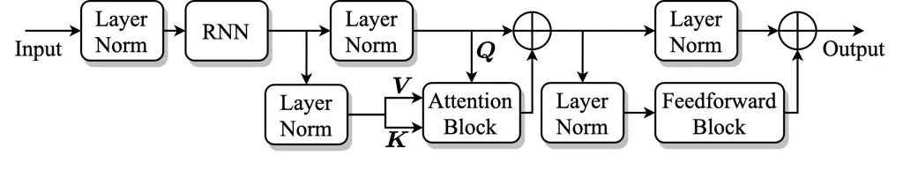

Fig. 1: A diagram of ARN. Layer Norm denotes a layer-normalization layer
and $`\bigoplus`$ is an elementwise addition operator.

### III-A Layer Normalization

Layer normalization is a popular normalization technique used within
DNNs to improve generalization and facilitate faster training \[48\]. It
was proposed as an alternative to batch normalization \[49\], which is
found to be sensitive to training batch size.

Let $`\bm{X}\in\mathbb{R}^{T\times N}`$ be a matrix and $`\bm{x}_{t}`$
be its $`t^{th}`$ row. We use the layer normalization defined as

```math
\bm{x}_{t}^{norm}=\frac{\bm{x}_{t}-\mu_{x_{t}}}{\sqrt{\sigma^{2}_{x_{t}}+\epsilon}}\odot\bm{\gamma}+\bm{\beta},\quad t=1,\cdots,T \tag{6}
```

where $`\mu_{x_{t}}`$ and $`\sigma_{x_{t}}^{2}`$, respectively, are mean
and variance of $`\bm{x}_{t}`$. Symbols $`\bm{\gamma}`$ and
$`\bm{\beta}`$ are trainable parameters of the same size as
$`\bm{x}_{t}`$, $`\odot`$ denotes elementwise multiplication, and
$`\epsilon`$ is a small positive constant used to avoid division by
zero.

### III-B Recurrent Neural Network

We use LSTM RNN in ARN. An illustrative diagram of an LSTM is shown in
Fig. 2. Given an input vector sequence
$`\{\bm{x}_{1},\cdots,\bm{x}_{t-1},\bm{x}_{t},\bm{x}_{t+1},\cdots,\bm{x}_{T}\}`$,
the hidden state at time $`t`$, $`\bm{h}_{t}`$, is computed as

```math
\displaystyle\bm{i}_{t} \displaystyle=\sigma(\bm{W}_{ix}\bm{x}_{t}+\bm{W}_{ih}\bm{h}_{t-1}+\bm{b}_{i}) \tag{7}
```

```math
\displaystyle\bm{f}_{t} \displaystyle=\sigma(\bm{W}_{fx}\bm{x}_{t}+\bm{W}_{fh}\bm{h}_{t-1}+\bm{b}_{f}) \tag{8}
```

```math
\displaystyle\bm{g}_{t} \displaystyle=\text{Tanh}(\bm{W}_{gx}\bm{x}_{t}+\bm{W}_{gh}\bm{h}_{t-1}+\bm{b}_{g}) \tag{9}
```

```math
\displaystyle\bm{o}_{t} \displaystyle=\sigma(\bm{W}_{ox}\bm{x}_{t}+\bm{W}_{oh}\bm{h}_{t-1}+\bm{b}_{o}) \tag{10}
```

```math
\displaystyle\bm{c}_{t} \displaystyle=\bm{f}_{t}\odot\bm{c}_{t-1}+\bm{i}_{t}\odot\bm{g}_{t} \tag{11}
```

```math
\displaystyle\bm{h}_{t} \displaystyle=\bm{o}_{t}\odot\text{Tanh}(\bm{c}_{t}) \tag{12}
```

```math
\displaystyle\sigma(s) \displaystyle=\frac{1}{1+e^{-s}} \tag{13}
```

```math
\displaystyle\text{Tanh}(s) \displaystyle=\frac{e^{s}-e^{-s}}{e^{s}+e^{-s}} \tag{14}
```

where $`\bm{x}_{t}`$, $`\bm{g}_{t}`$, and $`\bm{c}_{t}`$ respectively
represent input, block input, and memory (cell) state at time $`t`$. In
additions $`\bm{i}_{t}`$, $`\bm{f}_{t}`$, and $`\bm{o}_{t}`$ are gates
known as input gate, forget gate and output gate, respectively.
$`\bm{W}`$’s and $`\bm{b}`$’s denote trainable weights and biases.

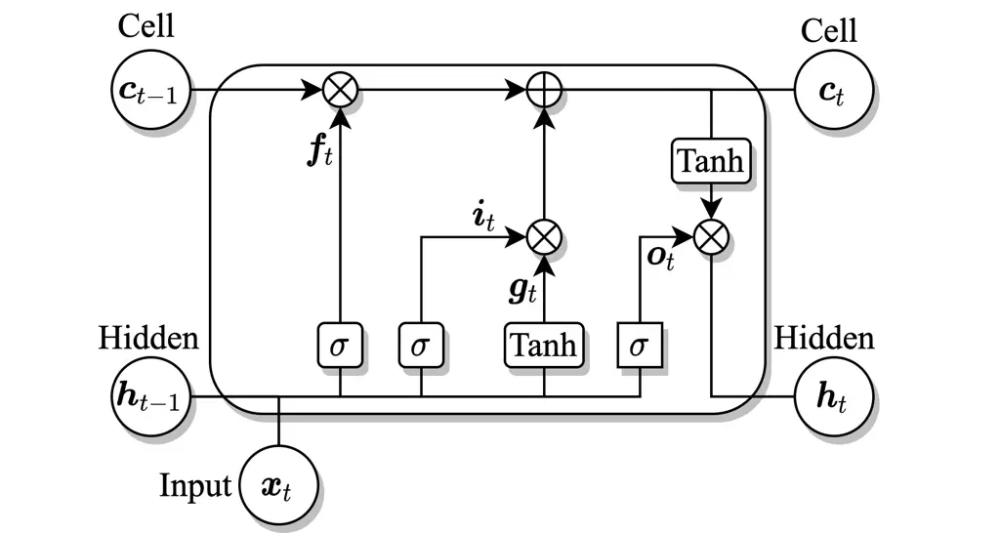

Fig. 2: A diagram of an LSTM with three gates. Symbol $`\bigotimes`$
denotes elementwise multiplication.

### III-C Self-attention Block

A general attention mechanism is defined using three components: key
$`\bm{K}\in\mathbb{R}^{T\times R}`$, value
$`\bm{V}\in\mathbb{R}^{T\times S}`$, and query $`\bm{Q}`$
$`\in\mathbb{R}^{T\times R}`$. First, correlation scores between pairs
of rows from $`\bm{Q}`$ and $`\bm{K}`$, $`\{\bm{Q}_{i},\bm{K}_{j}\}`$,
where $`i,j\in\{1,\cdots,T\}`$, are computed using the following
equation.

```math
\bm{W}=\bm{Q}\bm{K}^{\mathbb{T}} \tag{15}
```

where $`\bm{W}\in\mathbb{R}^{T\times T}`$ and $`\bm{K}^{\mathbb{T}}`$
denotes the transpose of $`\bm{K}`$. The similarity scores in $`\bm{W}`$
are converted to probability values using the Softmax operation defined
as

```math
\text{Softmax}(\bm{W})(i,j)=\frac{\exp^{W(i,j)}}{\sum_{j=0}^{T-1}\exp^{W(i,j)}} \tag{16}
```

The final attention output is defined as the linear combination of the
rows of $`\bm{V}`$ with weights in $`\text{Softmax}(\bm{W})`$.

```math
\bm{A}=\text{Softmax}(\bm{W})\bm{V} \tag{17}
```

In self-attention, $`\bm{K},\bm{V}`$, and $`\bm{Q}`$ are computed from
the same sequence. One of the approaches to self-attention is to use
three linear projections of a given input,
$`\bm{X}\in\mathbb{R}^{T\times N}`$, to obtain $`\bm{K},\bm{V}`$, and
$`\bm{Q}`$, and then applying Eqs. (15)-(17) to obtain the attention
output.

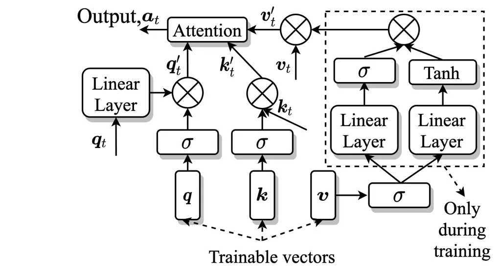

Fig. 3: Attention block in ARN. The inputs to the block are
$`\bm{q}_{t},\bm{k}_{t}`$, and $`\bm{v}_{t}`$ and the output from the
block is $`\bm{a}_{t}`$.

A block diagram of the attention block in ARN is shown in Fig. 3. It
comprises three trainable vectors $`\{\bm{q},\bm{k}`$,
$`\bm{v}\}\in\mathbb{R}^{N\times 1}`$ and its inputs are
$`\{\bm{Q},\bm{V}`$, $`\bm{K}\}\in\mathbb{R}^{T\times N}`$. Let
$`\bm{q}_{t},\bm{v}_{t}`$, and $`\bm{k}_{t}`$ denote the $`t^{th}`$ row
in $`\bm{Q},\bm{V}`$, and $`\bm{K}`$ respectively, and they are refined
using gating mechanisms in the following equations.

```math
\displaystyle\bm{k}_{t}^{\prime} \displaystyle=\bm{k}_{t}\odot\sigma(\bm{k}) \tag{18}
```

```math
\displaystyle\bm{q}_{t}^{\prime} \displaystyle=\text{Lin}(\bm{q}_{t})\odot\sigma(\bm{q}) \tag{19}
```

```math
\displaystyle\bm{v}_{t}^{\prime} \displaystyle=\bm{v}_{t}\odot[\sigma(\text{Lin}(\bm{v}))\odot\text{Tanh}(\text{Lin}(\bm{v}))] \tag{20}
```

where $`\sigma`$ is sigmoidal nonlinearity, and Lin() is a linear layer.
Note that
$`\sigma(\text{Lin}(\bm{v}))\odot\text{Tanh}(\text{Lin}(\bm{v}))`$
represents a constant vector computed from $`\bm{v}`$. This operation is
used during training only for better optimization of $`\bm{v}`$. For
evaluation, we use its value from the best model at training completion.

The final output of the attention block is computed as

```math
\displaystyle\bm{W}^{\prime} \displaystyle=\frac{\bm{Q}^{\prime}\bm{K}^{\prime\mathbb{T}}}{\sqrt{N}} \tag{21}
```

```math
\displaystyle\bm{A} \displaystyle=\text{Softmax}(\bm{W}^{\prime})\bm{V}^{\prime} \tag{22}
```

### III-D Feedforward Block

The feedforward block in ARN is shown in Fig. 4. A given input of size
$`N`$ is projected to size $`4N`$ using a linear layer, which is
followed by Gaussian error linear unit (GELU) \[50\] and a dropout layer
\[51\]. Finally, the output of size $`4N`$ is split into four vectors of
size $`N`$, which are added together to get the final output.

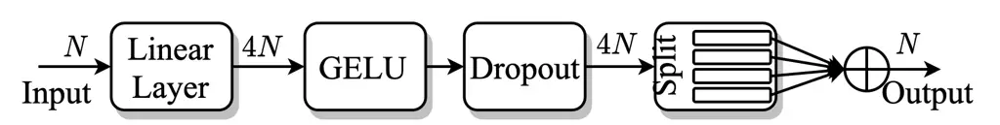

Fig. 4: Feedforward block in ARN.

With the building blocks described, we now present the processing flow
of ARN shown in Fig. 1. The input to ARN is first normalized and then
processed using an RNN. The output of the RNN is normalized using two
parallel layer normalizations. The first stream is used as $`\bm{Q}`$
and the second stream is used as $`\bm{K}`$ and $`\bm{V}`$ for the
following attention block. The output of the attention block is added to
$`\bm{Q}`$ to form a residual connection. Again, the output is
normalized using two parallel layer normalizations. The first stream is
processed using a feedforward block and the second stream is added to
the output of the feedforward block to form a residual connection.

## IV ARN for Time-Domain Speech Enhancement

The proposed ARN for time-domain speech enhancement is shown in Fig. 5.
Given an input signal $`\bm{x}`$ with $`M`$ samples, it is first chunked
into overlapping frames with a frame size of $`L`$ and frame shift of
$`J`$ to obtain $`T`$ frames. Next, all the frames are projected to a
representation of size $`N`$ using a linear layer, which is then
processed using four ARNs. We use four-layered ARN as a simple extension
of the four-layered RNN for complex spectral mapping in \[22\]. A linear
layer at the output projects the output of the last ARN to size $`L`$.
Finally, overlap-and-add (OLA) is used to obtain the enhanced waveform.

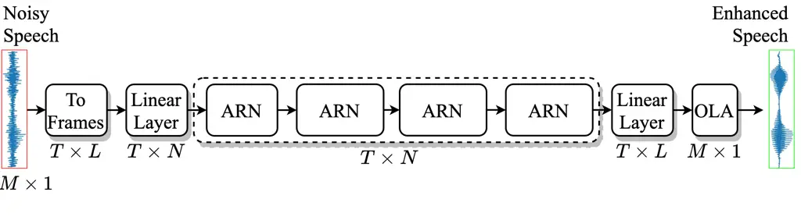

Fig. 5: The proposed ARN for time-domain speech enhancement.

### IV-A Non-causal Speech Enhancement

For non-causal speech enhancement, we use BLSTM RNN inside ARN. A BLSTM
comprises two LSTMs; a forward and a backward LSTM. The forward LSTM
operates over the sequence in the original order, whereas the backward
LSTM operates over the sequence in the reverse order. Let
$`\overrightarrow{\bm{X}}`$ and $`\overleftarrow{\bm{X}}`$ denote the
sequence in the original and reverse order respectively. Then, we have

```math
\displaystyle\overrightarrow{\bm{x}}_{t} \displaystyle=\bm{x}_{t} \tag{23}
```

```math
\displaystyle\overleftarrow{\bm{x}}_{t} \displaystyle=\bm{x}_{T-t} \tag{24}
```

The hidden state at time $`t`$ for a BLSTM is given as

```math
\bm{h}_{t}=[\overrightarrow{\bm{h}}_{t},\overleftarrow{\bm{h}}_{t}]=[\text{LSTM}_{f}(\overrightarrow{\bm{X}})_{t},\text{LSTM}_{b}(\overleftarrow{\bm{X}})_{t}] \tag{25}
```

where $`[\bm{a},\bm{b}]`$ denotes a concatenation of vectors $`\bm{a}`$
and $`\bm{b}`$, and $`\text{LSTM}_{f}`$ and $`\text{LSTM}_{b}`$
represent the forward and the backward LSTM.

### IV-B Causal Speech Enhancement

For causal speech enhancement, we use LSTM RNN and causal attention
inside ARN. Causal attention is implemented by applying a mask to
$`\bm{W}^{\prime}`$ where entries above the main diagonal are set to
negative infinity so that the contribution from future frames in Eq.
(22) becomes zero. The causal attention is defines as

```math
\bm{A}_{causal}=\text{Softmax}(\text{Mask}(\bm{W}^{\prime}))\bm{V}^{\prime} \tag{26}
```

where

```math
\text{Mask}(W^{\prime})(i,j)=\begin{cases}W^{\prime}(i,j),&\text{if}\ i\leq j\\
-\infty,&\text{otherwise}\end{cases} \tag{27}
```

## V Experimental Settings

### V-A Datasets

We evaluate all the models in a speaker, noise, and corpus independent
way. We use all utterances from the training set of LibriSpeech corpus
\[52\] to generate training mixtures. It consists of around $`280`$K
speech utterances of more than $`2000`$ speakers. LibriSpeech has been
shown to be an effective corpus for cross-corpus generalization because
it is recorded by many volunteers across the globe, and hence consists
of utterances recorded in different acoustic conditions. Noisy training
utterances are generated in an online fashion during training in the
following way. For each sample in a given batch, we randomly sample a
speech utterance, extract a random chunk of $`4`$ seconds from it, and
add a random chunk of noise to it at a random SNR from
$`\{-5,-4,-3,-2,-1,0\}`$ dB. The sampled speech is used unaltered if its
duration is smaller than $`4`$ seconds. A set of $`10000`$ non-speech
sounds from a sound effect library
([www.sound-ideas.com](https://www.sound-ideas.com)) are used as the
training noises.

All the models are evaluated on three different corpora: WSJ-SI-$`84`$
(WSJ) \[53\], TIMIT \[54\], and IEEE \[55\], which are not used during
training. We use utterances of one male speaker and one female speaker
from IEEE to further categorize IEEE as IEEE Male and IEEE Female to
show potential gender effects. The WSJ test set consists of $`150`$
utterances of $`6`$ different speakers. The TIMIT test set consists of
$`192`$ utterances in the core test set. IEEE Male and IEEE Female each
consists of $`144`$ randomly selected utterances. We generate noisy
utterances using four different types of noises: babble, cafeteria,
factory, and engine, none of which are used during training. Test
utterances are generated at $`6`$ different SNRs of $`-5`$, $`-2`$,
$`0`$, $`2`$, and $`5`$ dB. We find corpus fitting to be a severe issue
for the difficult noises of babble and cafeteria, and at low SNRs of
$`-5`$ dB and $`-2`$ dB. Therefore, for the sake of the brevity, we
report results only for babble and cafeteria noises at SNRs of $`-5`$ dB
and $`-2`$ dB. We observe similar performance trends for the other
noises and SNR conditions. Note that our test set is the same as the one
previously used in \[37\] and \[22\]. Babble and cafeteria noises are
taken from an Auditec CD (available at
[http://www.auditec.com](http://www.auditec.com)). Factory and engine
noises are taken from the Noisex dataset \[56\]. We use WSJ test
utterances mixed with babble noise at the SNR of $`-5`$ dB as the
validation set.

We find our IEEE Male and IEEE Female test set to be relatively
challenging in terms of improving the intelligibility and quality of
unprocessed mixtures. In particular, IEEE utterances mixed with babble
and cafeteria noises at SNRs of $`-5`$ dB and $`-2`$ dB are very
difficult. Therefore, we provide online IEEE Male and IEEE Female
utterances mixed with babble and cafeteria noises at SNRs of $`-5`$ dB
and $`-2`$ dB as a useful test set for evaluating future algorithms and
facilitating direct comparisons. It can be downloaded at
[https://web.cse.ohio-state.edu/~wang.77/pnl/corpus/Pandey/NoisyIEEE.html](https://web.cse.ohio-state.edu/~wang.77/pnl/corpus/Pandey/NoisyIEEE.html).

In addition we investigate the proposed model for speech quality
improvement in relatively high SNR conditions. We train ARN on the VCTK
dataset \[57\] and compare it with a number of existing models evaluated
on this task. The VCTK training set consists of utterances from $`28`$
speakers mixed with different noises at SNRs of $`0`$, $`5`$, $`10`$ and
$`15`$ dB. We exclude two speakers (p274 and p282) from the training set
to create a validation set. The test set comprises utterances from two
unseen speakers (not in the training set) mixed with different noises at
$`2.5`$, $`7.5`$, $`12.5`$, and $`17.5`$ dB. We store training speech
and noises separately and dynamically mix them during training using
random SNRs from $`\{0,5,10,15\}`$ dB. The same SNR values are used as
in the original training set. The dynamic mixing provides a measure of
data augmentation, as similarly done in \[58\].

We also evaluate our model on real recordings. We utilize the blind test
set from the second deep noise suppression (DNS) challenge \[59\], which
consists of $`650`$ real recordings and $`50`$ synthetic mixtures. This
test set is divided into five classes of English, non-English, tonal,
singing, and emotional speech. To create a training set, we use speech
and noises from the third DNS challenge \[60\]. We remove low quality
utterances from all classes using appropriate thresholds on provided
parameter $`T60\_WB`$. We use room impulse responses (RIRs) with
$`T60\_WB`$ between $`0.3`$ and $`0.9`$. The final training set consists
of $`347`$K speech utterances, $`65`$K noises, and $`47`$K RIRs. We
generate training mixtures dynamically by convolving a speech signal
with a random RIR and adding a random noise segment. We add room
reverberation with a probability of $`0.5`$. When using an RIR, the
training target is set to be the clean speech convolved with the first
$`50`$ ms of the RIR. We sample a SNR value uniformly from either
$`\{-5,-4,\cdots,-1,0\}`$ dB or from $`\{1,2,\cdots,19,20\}`$ dB with a
probability of $`0.5`$.

### V-B System Setup

All the utterances are resampled to $`16`$ kHz, and leading and trailing
silences are removed from training utterances. Each noisy mixture is
normalized using root mean square (RMS) normalization and the
corresponding clean utterance is scaled accordingly to maintain an SNR.

Parameter $`N`$ is set to $`1024`$, input frame size is set to $`32`$ ms
for causal system and $`16`$ ms for non-causal system, and output frame
size is set to $`16`$ ms. For ARN with BLSTM, $`N=1024`$ results in a
hidden state size of $`512`$ in both forward and backward LSTM. A
dropout rate of $`5\%`$ is used in the feedforward block of ARN. We use
the utterance level MSE (mean squared error) loss in the time domain for
training on Librispeech and the PCM (phase constrained magnitude) loss
\[32\] for training on VCTK and DNS. The MSE loss is defined in the time
domain as follows

```math
L_{MSE}(\bm{s},\bm{\hat{s}})=\frac{1}{M}\sum_{k=0}^{M-1}(s[k]-\hat{s}[k])^{2} \tag{28}
```

The PCM loss is defined in the T-F domain that measures the distance
between clean and estimated magnitude spectrum of both speech and noise.
It is defined using the following set of equations.

```math
\bm{\widehat{n}}=\bm{x}-\bm{\widehat{s}} \tag{29}
```

```math
\displaystyle L_{SM}(\bm{s},\bm{\widehat{s}})=\frac{1}{T\cdot F}\sum_{t=0}^{T-1}\sum_{f=0}^{F-1} \displaystyle|(|S_{r}(t,f)|+|S_{i}(t,f)|) \tag{30}
```

```math
\displaystyle- \displaystyle(|\widehat{S}_{r}(t,f)|+|\widehat{S}_{i}(t,f)|)|
```

```math
\displaystyle L_{PCM}(\bm{s},\bm{\widehat{s}}) \displaystyle=\frac{1}{2}\cdot L_{SM}(\bm{s},\bm{\widehat{s}})+\frac{1}{2}\cdot L_{SM}(\bm{n},\bm{\widehat{n}}) \tag{31}
```

where $`\bm{S}`$ and $`\bm{\widehat{S}}`$ respectively denote STFTs of
$`\bm{s}`$ and $`\bm{\widehat{s}}`$, $`T`$ is the number of time frames,
and $`F`$ is the number of frequency bins.

The Adam optimizer \[61\] is used for training. A batch size of $`32`$
utterances is used on Librispeech and DNS and that of $`8`$ on VCTK.
Models are trained for $`100`$ epochs on Librispeech, $`84`$ epochs on
DNS, and $`200`$ epochs on VCTK. A constant learning rate of $`0.0002`$
is used for the first $`33`$ ($`28`$ for DNS) epochs, after which it is
exponentially decayed using a scale that results in a learning rate of
$`0.00002`$ in the final epoch. During training, we evaluate a given
model on the validation set every two epochs, and the model parameters
corresponding to the best SNR are chosen for evaluation.

We develop all the models in PyTorch \[62\] and exploit automatic mixed
precision training to expedite training \[63\]. Two NVIDIA Volta
V$`100`$ $`32`$GB GPUs are required to train ARN with a batch size of
$`32`$ utterances. A given batch is equally distributed to two GPUs
using PyTorch’s DataParallel module.

### V-C Baseline Models

We train five different models as the baselines for comparing
corpus-independent models trained on Librispeech. First, we train a
recently proposed deep complex convolutional recurrent network (DCCRN)
\[17\], which respectively won the first and the second place in
real-time and non-real-time track of the first DNS challenge \[64\].
DCCRN uses noisy complex spectrum as the input and the complex ideal
ratio mask (cIRM) as the training target. Next, we train two RNN-based
models; RNN-IRM \[37\] and RNN-TCS \[22\]. RNN-IRM uses log spectral
magnitude as the input feature and the IRM as the training target.
RNN-TCS uses noisy complex spectrum as the input feature and the target
complex spectrum (TCS) as the training target. Finally, we train two
recently proposed time-domain networks; dense convolutional network with
self-attention (DCN) \[32\] and dual-path ARN (DPARN) \[34\]. Even
though DCN and DPARN obtain good enhancement in the time domain, they
have not been trained and evaluated in a corpus-independent way.

The ARN model trained on VCTK is compared with a number of existing
methods that report performance on the same dataset (see Table III). The
ARN model trained on the DNS challenge dataset is compared with a
baseline noise suppression network (NSNet) provided with the third DNS
challenge \[60\].

### V-D Evaluation Metrics

We use short-time objective intelligibility (STOI) \[35\] and
narrow-band perceptual evaluation of speech quality (PESQ) \[65\] as
evaluation metrics for comparing models trained on Librispeech. STOI has
a typical range of $`[0,1]`$, which roughly represents percent correct.
PESQ has a range of $`[-0.5,4.5]`$, where higher scores denote better
speech quality. Both metrics are commonly used for evaluating speech
enhancement algorithms. For evaluating the models trained on VCTK, we
use three metrics: composite scores \[1\], wide-band PESQ and STOI.
Composite scores include three components: CSIG, CBAK and COVL,
respectively measuring enhanced speech quality, noise removal and
overall quality. For evaluation on the blind test set, we use a recently
proposed non-intrusive quality metric, DNSMOS P.835, that highly
correlates with subjective quality scores collected with the P.835
standard \[66\]. Similar to the composite scores, it has three
components: DNSMOS-SIG, DNSMOS-BAK, and DNSMOS-OVL, respectively
measuring enhanced speech quality, noise removal and overall quality.

## VI Results and Discussions

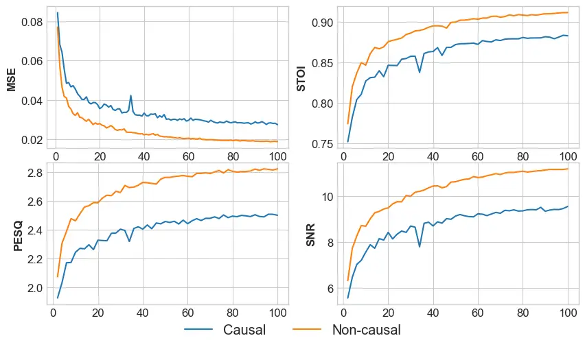

Fig. 6: Learning curves for ARN training on Librispeech with MSE Loss.
We plot MSE loss, and STOI, PESQ and SNR scores on the validation set.

### VI-A Learning Curves

First, we plot performance curves of ARN training on Librispeech with
MSE loss. Fig. 6 plots on the validation set the MSE loss every epoch,
and STOI, PESQ, and SNR scores every other epoch. We can observe that,
for both causal and non-causal models, training progresses smoothly and
converges at the end with minimal improvements in last $`10`$ epochs.

### VI-B RNN vs ARN

Now, we illustrate the effectiveness of self-attention for speech
enhancement. Fig. 7 plots average STOI and PESQ scores over babble and
cafeteria noises for the four test corpora and at $`2`$ SNR conditions.
The vertical bars at the top of the plots indicate $`95\%`$ confidence
interval. We can observe that adding the proposed attention mechanism
after each layer in RNN leads to significant improvements for all the
test conditions. This suggests that self-attention is an effective
mechanism for improving cross-corpus generalization of RNN-based speech
enhancement. Note that improvements in cross-corpus generalization due
to self-attention is not necessarily achieved in all architectures, as
we find that DCN \[32\], a dense convolutional network with
self-attention, fails to obtain similar improvements on untrained
corpora (see Table I and Table II later).

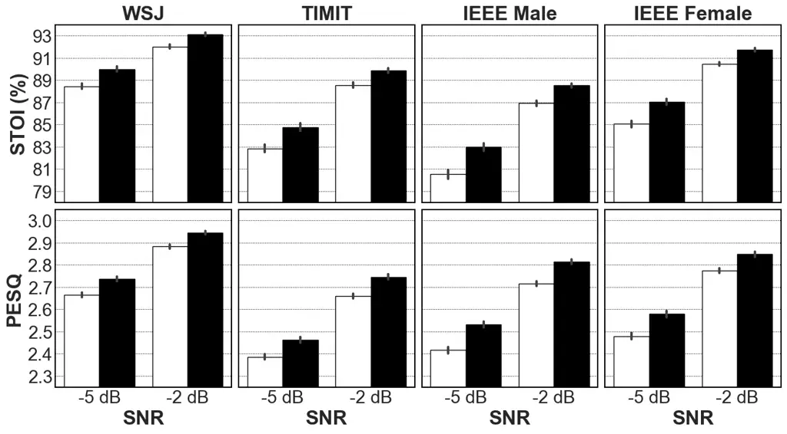

(a)

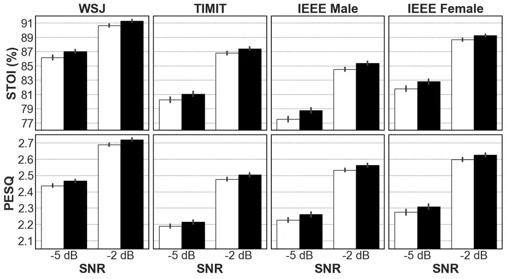

(b)

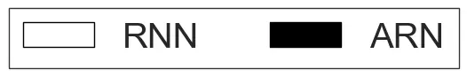

Fig. 7: RNN comparisons with and without attention. a) Non-causal, b)
causal.

### VI-C Attention Mechanisms

We compare two different attention mechanisms for ARN in causal and
non-causal settings. Comparison results are plotted in Fig. 8. The first
mechanism, denoted as A1, is the attention mechanism described in
Section III-C. The second mechanism, denoted as A2, is borrowed from
\[38\], where we use one encoder layer without positional embeddings. We
explore single-headed and 8-headed attention for this mechanism, which
are respectively denoted as A2-1 and A2-8. We can observe that all the
three attention mechanisms obtain statistically similar objective scores
for both causal and non-causal speech enhancement. This suggests that
even though self-attention is an effective technique for speech
enhancement, changing the attention mechanism in ARN does not lead to
statistically significant changes in the enhancement performance.

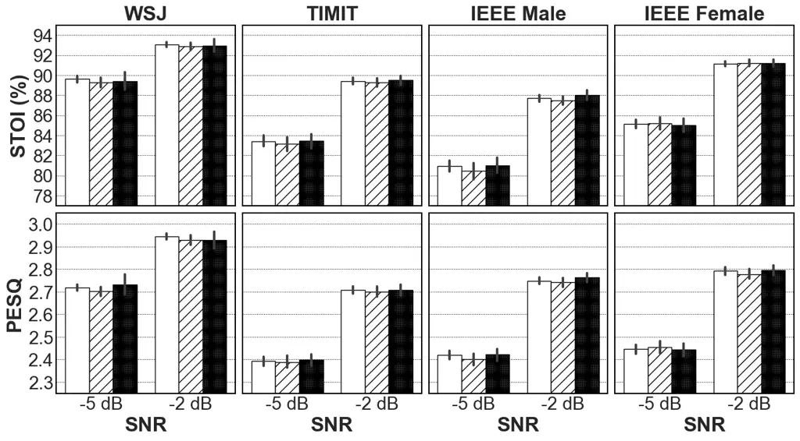

(a)

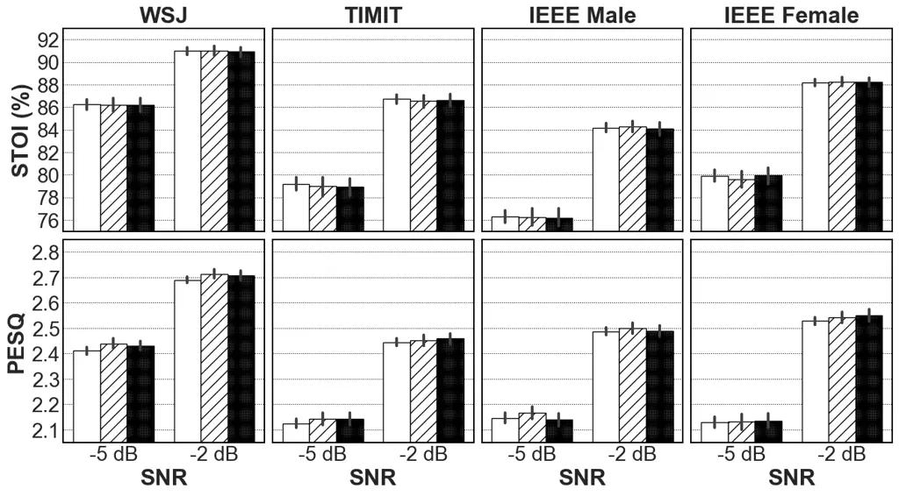

(b)

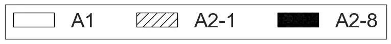

Fig. 8: Comparisons of different attention mechanisms. a) Non-causal, b)
causal.

Next, in Fig. 9, we plot the number of parameters in ARN for the two
attention mechanisms. We can see that there is a dramatic increase in
the number of parameters when adding attention to an RNN-only network.
However, the increase in the number of parameters due to A1 is roughly
half of that due to A2. Also, we find A1 to be faster than A2 in both
training and evaluation. As a result, we select A1 as the default
attention mechanism in the remaining model comparisons.

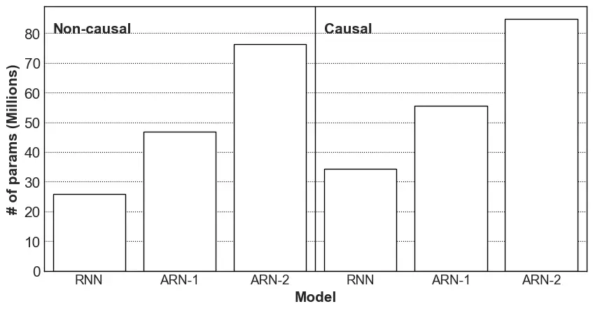

Fig. 9: Number of trainable parameters in ARN for different attention
mechanisms.

### VI-D Complex Spectral Mapping vs Time-domain Enhancement

We evaluate RNN and ARN for both complex spectral mapping and
time-domain speech enhancement. For complex spectral mapping, the input
is the noisy STFT and the output is the estimated clean STFT. The real
and the imaginary part of the STFT are concatenated together to obtain
real-valued vectors. For time-domain enhancement, the input is the
frames of the noisy speech and the output is the frames of the estimated
clean speech. Average STOI and PESQ for two test noises and at two SNRs
are plotted in Fig. 10. We can observe that time-domain enhancement is
better than complex spectral mapping for most of the test cases;
however, the performance difference is not statistically significant.
Similar trends are observed with RNN and ARN for both causal and
non-causal speech enhancement. This suggests that, with training on a
large corpus such as LibriSpeech, complex spectral mapping and
time-domain enhancement obtain similar results.

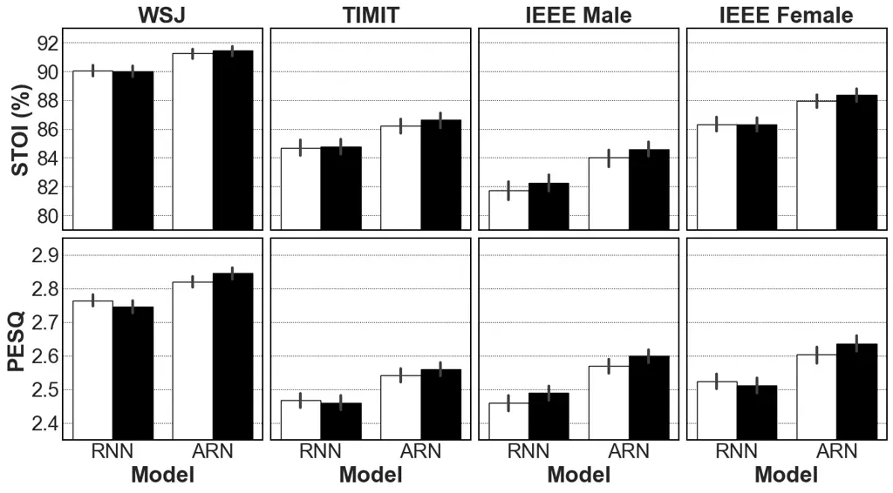

(a)

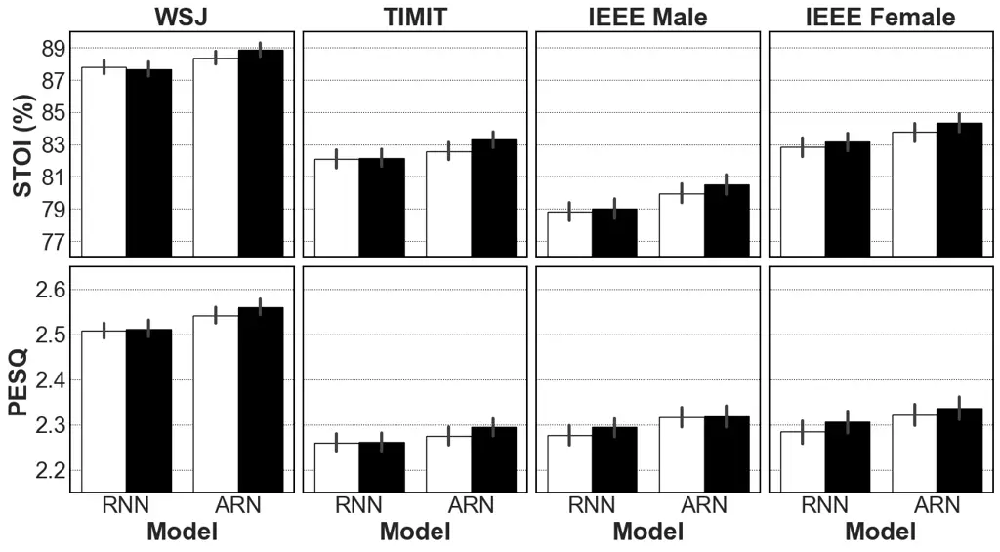

(b)

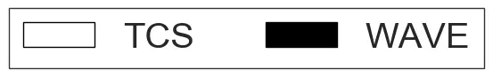

Fig. 10: Comparing complex spectral mapping and time-domain enhancement
for RNN and ARN. TCS stands for target complex spectrum and WAVE for
waveform, which are respectively used as the training targets for
complex spectral mapping and time-domain enhancement. a) Non-causal, b)
causal.

### VI-E Frame Shift

Our previous studies in \[37\] and \[22\] suggest that a smaller frame
shift leads to better speech enhancement on untrained corpora. As a
result, a frame shift of $`4`$ ms is proposed for complex spectral
mapping in \[22\]. In this work, we are able to further decrease the
frame shift from $`4`$ ms to $`2`$ ms with the help of automatic mixed
precision training, which reduces memory consumption by half and
improves training time significantly. Frame shifts of $`4`$ ms and $`2`$
ms are compared for RNN and ARN in Fig. 11. We observe that, except for
the causal ARN at WSJ, a smaller frame shift leads to significant
improvements for most of the test conditions. Similar performance trends
are observed with RNN and ARN for both causal and non-causal
enhancement. This further strengthens the argument that using a smaller
frame shift is an effective technique for improving cross-corpus
generalization. Note that it was reported in \[22\] that for a gated
convolutional recurrent network (GCRN) \[21\], a smaller frame shift
does not always lead to better cross-corpus generalization. It might be
due to the fact that the receptive field of a convolutional neural
network is constant, and as a result, reducing the frame shift leads to
a reduction in the effective receptive field.

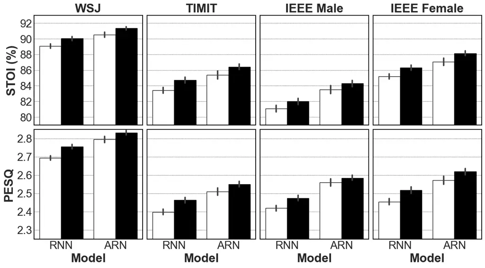

(a)


(b)

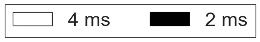

Fig. 11: Effects of frame shifts for RNN and ARN. a) Non-causal, b)
causal.

Test Noise Babble Cafeteria Test Corpus WSJ TIMIT IEEE Male IEEE Female
WSJ TIMIT IEEE Male IEEE Female Test SNR -5 dB -2 dB -5 dB -2 dB -5 dB
-2 dB -5 dB -2 dB -5 dB -2 dB -5 dB -2 dB -5 dB -2 dB -5 dB -2 dB STOI
(%) Mixture 58.6 65.5 54.0 60.9 55.0 62.3 55.5 62.9 57.4 64.5 53.1 60.1
54.8 60.9 55.1 62.0 DCCRN 82.5 89.0 73.1 82.5 68.3 81.3 72.5 84.6 81.4
87.6 74.8 82.6 72.0 80.3 77.4 86.0 RNN-IRM \[37\] 83.7 88.4 76.3 83.3
75.7 84.1 76.0 85.6 81.9 86.9 76.3 82.3 74.5 81.5 78.8 85.3 RNN-TCS
\[22\] 88.1 92.2 79.3 87.5 76.7 85.8 80.0 89.2 85.8 90.3 80.4 86.6 77.3
84.1 82.6 88.7 DCN 87.1 91.5 77.9 86.1 73.9 84.3 76.6 87.7 84.9 89.7
78.7 85.4 75.6 83.3 79.7 87.4 DPARN 90.5 93.6 82.9 89.6 78.4 87.4 84.2
91.1 87.5 91.4 81.8 88.0 78.7 85.5 83.2 89.5 ARN 91.1 94.1 84.5 90.6
82.3 88.9 85.6 92.0 88.3 92.1 82.7 88.6 80.6 86.6 85.3 90.5 PESQ Mixture
1.54 1.69 1.46 1.63 1.45 1.63 1.12 1.32 1.44 1.64 1.33 1.52 1.37 1.54
1.01 1.20 DCCRN 2.31 2.65 1.99 2.38 1.86 2.33 1.79 2.33 2.32 2.61 2.12
2.39 2.08 2.40 2.14 2.50 RNN-IRM 2.51 2.82 2.27 2.60 2.15 2.54 2.00 2.51
2.49 2.76 2.31 2.57 2.21 2.51 2.22 2.57 RNN-TCS 2.63 2.89 2.22 2.59 2.20
2.59 2.18 2.62 2.52 2.76 2.26 2.53 2.27 2.59 2.34 2.65 DCN 2.56 2.85
2.14 2.50 2.09 2.50 1.97 2.49 2.46 2.74 2.19 2.48 2.19 2.53 2.18 2.57
DPARN 2.75 2.97 2.35 2.69 2.27 2.69 2.34 2.75 2.57 2.79 2.30 2.59 2.36
2.66 2.33 2.66 ARN 2.82 3.04 2.43 2.78 2.45 2.79 2.48 2.86 2.64 2.87
2.36 2.65 2.43 2.73 2.45 2.76

TABLE I: Comparing non-causal ARN with other non-causal approaches to
speech enhancement.

Test Noise Babble Cafeteria Test Corpus WSJ TIMIT IEEE Male IEEE Female
WSJ TIMIT IEEE Male IEEE Female Test SNR -5 dB -2 dB -5 dB -2 dB -5 dB
-2 dB -5 dB -2 dB -5 dB -2 dB -5 dB -2 dB -5 dB -2 dB -5 dB -2 dB STOI
(%) Mixture 58.6 65.5 54.0 60.9 55.0 62.3 55.5 62.9 57.4 64.5 53.1 60.1
54.8 60.9 55.1 62.0 DCCRN 79.0 86.7 69.6 79.6 66.2 79.3 67.2 80.9 78.6
85.7 71.6 80.2 68.9 78.0 73.4 83.4 RNN-IRM \[37\] 80.7 86.5 72.5 80.5
72.3 81.6 70.6 82.0 77.8 84.2 71.7 79.3 69.8 77.7 72.9 81.7 RNN-TCS
\[22\] 85.1 90.4 76.1 85.3 72.8 83.0 73.5 85.3 82.2 88.2 76.2 84.0 72.4
80.5 77.4 85.8 DCN 83.7 89.2 73.0 82.3 69.6 80.7 69.6 82.7 81.3 87.3
74.5 82.6 70.5 79.3 74.6 84.1 DPARN 88.5 92.3 79.6 87.4 75.3 84.9 79.0
88.7 85.1 90.0 79.0 85.9 74.6 82.5 79.8 87.8 ARN 88.3 92.4 80.2 88.1
77.7 85.9 80.1 89.2 84.7 90.0 79.0 86.0 75.5 83.0 80.3 87.8 PESQ Mixture
1.54 1.69 1.46 1.63 1.45 1.63 1.12 1.32 1.44 1.64 1.33 1.52 1.37 1.54
1.01 1.20 DCCRN 2.14 2.47 1.82 2.21 1.74 2.19 1.56 2.11 2.19 2.50 1.99
2.27 1.94 2.28 1.98 2.36 RNN-IRM 2.31 2.62 2.08 2.42 1.99 2.38 1.74 2.27
2.26 2.55 2.10 2.36 2.00 2.31 1.95 2.34 RNN-TCS 2.32 2.63 2.00 2.36 2.00
2.39 1.83 2.34 2.22 2.50 2.03 2.30 2.04 2.36 2.06 2.42 DCN 2.32 2.61
1.94 2.28 1.85 2.27 1.67 2.18 2.24 2.52 1.99 2.28 1.94 2.26 1.92 2.34
DPARN 2.51 2.76 2.12 2.47 2.06 2.48 2.00 2.50 2.35 2.61 2.13 2.41 2.12
2.44 2.11 2.52 ARN 2.50 2.78 2.15 2.52 2.16 2.53 2.10 2.56 2.34 2.62
2.12 2.39 2.14 2.45 2.17 2.51

TABLE II: Comparing causal ARN with other causal approaches to speech
enhancement.

### VI-F Comparison with Baselines

Table I and Table II respectively report average STOI and PESQ scores
over babble and cafeteria noises for causal and non-causal speech
enhancement. First, we observe that DCCRN has the lowest objective
scores for both causal and non-causal speech enhancement. This suggests
that DCCRN is not effective in low SNR conditions, especially for the
challenging IEEE corpus. Next, we observe that RNN-TCS is better than
RNN-IRM for non-causal speech enhancement. For causal speech
enhancement, RNN-TCS is better than RNN-IRM in terms of STOI, but for
PESQ, RNN-IRM has similar or better scores for many test conditions.
Further, we notice that DCN does not obtain good scores on all the
corpora. For many cases, DCN has even worse scores than RNN-IRM,
suggesting that DCN fails to generalize to untrained corpora. Finally,
we notice that even though DPARN scores are worse than ARN, the
difference is less than $`1\%`$ for STOI and less than $`0.1`$ for PESQ
in most of the cases. For some cases, such as non-causal enhancement for
IEEE Male, DPARN is significantly worse than ARN.

In summary, using RNN with a smaller frame shift improves cross-corpus
generalization. Complex spectral mapping and time-domain enhancement are
comparable to each other but better than ratio masking. Adding
self-attention to RNN further improves cross-corpus generalization.
Although not comparable to ARN, DPARN obtains good cross-corpus
generalization.

### VI-G Comparing Loss Functions

We compare two loss functions, MSE and PCM. This comparison is to
establish the importance of the PCM loss for high SNR enhancement.
Results are given in Table III. We observe that, at $`-5`$ dB, PCM is
better than MSE for WSJ and TIMIT, but similar to or worse than MSE for
IEEE Male and Female. At $`5`$ dB PCM is better than MSE for all test
conditions. Moreover, PESQ improvements are very significant for many
cases. This suggests that, even though PCM is not consistently better in
low SNR conditions, it is clearly a better loss function for high SNR
speech enhancement. Therefore, we use the PCM loss for training models
on VCTK and DNS challenge dataset, which require evaluation in
relatively high SNR conditions.

Test Corpus WSJ TIMIT IEEE Male IEEE Female Test SNR -5 dB 5 dB -5 dB 5
dB -5 dB 5 dB -5 dB 5 dB Babble STOI (%) Noisy 58.6 81.2 54.0 77.1 55.0
79.4 55.5 80.3 (a) MSE 91.1 97.1 84.5 96.1 82.3 95.6 85.6 96.8 PCM 92.0
97.6 84.9 96.7 81.5 95.9 84.8 97.2 (b) MSE 88.3 96.6 80.2 95.3 77.7 94.6
80.1 96.1 PCM 88.8 97.1 80.4 95.9 77.7 94.9 78.4 96.5 PESQ Noisy 1.54
2.12 1.46 2.08 1.45 2.06 1.12 1.86 (a) MSE 2.82 3.36 2.43 3.31 2.45 3.31
2.48 3.36 PCM 2.98 3.57 2.52 3.48 2.41 3.40 2.47 3.57 (b) MSE 2.50 3.25
2.15 3.13 2.16 3.14 2.10 3.18 PCM 2.57 3.42 2.14 3.27 2.08 3.20 1.99
3.37 SI-SNR Noisy -5.0 5.0 -5.0 5.0 -5.0 5.0 -5.0 5.0 (a) MSE 10.9 17.2
8.9 16.3 7.5 14.6 8.1 16.0 PCM 10.9 17.2 8.8 16.3 6.7 14.6 7.5 16.1 (b)
MSE 9.1 16.6 7.2 15.5 5.3 13.9 5.8 15.3 PCM 9.1 16.6 7.2 15.6 5.3 13.8
5.1 15.3 Cafeteria STOI (%) Noisy 57.4 81.2 53.1 76.2 54.8 77.0 55.1
78.4 (a) MSE 88.3 96.4 82.7 95.1 80.6 94.0 85.3 95.9 PCM 89.0 96.9 84.0
95.8 81.0 94.4 86.1 96.4 (b) MSE 84.7 95.7 79.0 94.0 75.5 92.6 80.3 95.1
PCM 85.2 96.2 79.4 94.7 75.2 92.9 80.3 95.7 PESQ Noisy 1.44 2.12 1.33
2.02 1.37 1.98 1.01 1.79 (a) MSE 2.64 3.26 2.36 3.20 2.43 3.22 2.45 3.20
PCM 2.76 3.47 2.50 3.36 2.43 3.29 2.56 3.44 (b) MSE 2.34 3.14 2.12 2.99
2.14 3.02 2.17 3.03 PCM 2.38 3.31 2.12 3.13 2.02 3.09 2.16 3.24 SI-SNR
Noisy -5.0 5.0 -5.0 5.0 -5.0 5.0 -5.0 5.0 (a) MSE 9.6 16.2 9.0 15.9 7.2
14.2 8.4 15.9 PCM 9.5 16.1 9.0 16.0 7.1 14.3 8.4 15.9 (b) MSE 8.1 15.6
7.7 15.3 5.8 13.5 6.9 15.4 PCM 8.2 15.6 7.8 15.3 5.6 13.5 6.8 15.5

TABLE III: Comparing MSE loss and PCM loss at SNRs of $`-5`$ dB and
$`5`$ dB. a) Non-causal, b) causal.

### VI-H Evaluation on VCTK

We compare ARN trained on VCTK with baseline models in Table IV. We can
see that non-causal ARN is significantly better than existing non-causal
models. Causal ARN also obtains state-of-the-art results. However, the
difference between second-best causal model and causal ARN is not as
significant as between the second-best non-causal model and non-causal
ARN.

PESQ STOI (%) CSIG CBAK COVL Causal? Noisy 1.97 91.5 3.35 2.44 2.63 -
SEGAN \[24\] 2.16 - 3.48 2.94 2.80 ✕ Wave U-Net \[67\] 2.4 - 3.52 3.24
2.96 ✕ SEGAN-D \[68\] 2.39 - 3.46 3.11 3.50 ✕ MMSE-GAN \[69\] 2.53 93
3.80 3.12 3.14 ✕ Metric-GAN \[70\] 2.86 - 3.99 3.18 3.42 ✕ Metric-GAN+
\[71\] 3.15 - 4.14 3.16 3.64 ✕ DeepMMSE \[72\] 2.95 94 4.28 3.46 3.64 ✕
Koizumi 2020 \[43\] 2.99 - 4.15 3.42 3.57 ✕ HiFi-GAN \[73\] 2.84 - 4.18
2.55 3.51 ✕ T-GSA \[42\] 3.06 - 4.18 3.59 3.62 ✕ DEMUCS \[58\] 3.07 95
4.31 3.40 3.63 ✕ NC-ARN 3.21 96 (95.7) 4.42 3.63 3.83 ✕ Wiener 2.22 93
3.23 2.68 2.67 ✓ Deep Feature Loss \[74\] - - 3.86 3.33 3.22 ✓ DeepMMSE
\[72\] 2.77 93 4.14 3.32 3.46 ✓ MHANet \[44\] 2.88 94 (93.6) 4.17 3.37
3.53 ✓ DEMUCS \[58\] 2.93 95 4.22 3.25 3.52 ✓ ARN 2.96 95 (95.0) 4.21
3.46 3.59 ✓

TABLE IV: Comparing ARN with baseline models on the VCTK dataset.

### VI-I Evaluation on Real Recordings

Finally, we evaluate the causal ARN trained on the DNS challenge dataset
on the blind test set of the second DNS challenge, which consists of
$`650`$ real recordings and $`50`$ synthetic mixtures. Results are
compared with a baseline NSNet in Table V. We observe that ARN is
substantially better than NSNet for all the metrics and for all the
speech classes. We also observe that ARN is able to improve both
DNSMOS-SIG and DNSMOS-BAK for English, tonal, non-English and singing.
For emotional speech, however, we see a good improvement in DNSMOS-BAK
but reduction in DNSMOS-SIG. Overall, DNSMOS-OVR is substantially
improved for all speech classes except for a slight reduction in singing
and emotional speech. This may be due to very few training utterances
for these two classes. Out of $`347`$K training utterances, only $`5`$K
belong to the emotional class and only $`2`$K to the singing class.

Singing Tonal Non-English English Emotional Overall BAK Noisy 3.29 3.71
3.58 3.21 2.65 3.28 NSNet 3.53 4.33 4.32 4.23 3.45 4.10 ARN 3.70 4.39
4.45 4.46 3.54 4.27 SIG Noisy 3.45 3.98 3.99 3.98 3.46 3.87 NSNet 2.99
3.87 3.84 3.79 2.94 3.63 ARN 3.54 4.07 4.18 4.22 3.00 3.98 OVR Noisy
3.01 3.42 3.40 3.27 2.75 3.23 NSNet 2.64 3.63 3.59 3.49 2.58 3.34 ARN
2.99 3.78 3.88 3.92 2.61 3.65

TABLE V: Evaluating ARN on the blind test set of the second DNS
challenge using DNSMOS P.835.

## VII Concluding Remarks

In this study, we have proposed a novel ARN for time-domain speech
enhancement to improve cross-corpus generalization. ARN comprises of RNN
augmented with self-attention and feedforward blocks. We have trained
ARN in a noise, speaker and corpus independent way and performed
comprehensive evaluations on four untrained corpora for difficult
nonstationary noises at low SNR conditions. Experimental results have
demonstrated the superiority of ARN over competitive algorithms, such as
RNN, DCCRN, DCN and DPARN.

We have found that RNN with a smaller frame shift, such as $`4`$ ms and
$`2`$ ms, is an effective technique for speech enhancement with improved
cross-corpus generalization. Further, we have revealed that although
attention can obtain significant improvements, the types of attention
mechanism do not make a big difference. We have also evaluated RNN and
ARN for complex spectral mapping and time-domain speech enhancement. A
key finding is that complex spectral mapping and time-domain enhancement
are similar to each other, but are significantly better than ratio
masking when trained on a large corpus. Further, we have examined frame
shifts of $`4`$ ms and $`2`$ ms and reported significantly better
results with $`2`$ ms frame shift.

We have also trained ARN on the VCTK dataset for speech quality
improvement in relatively high SNR conditions and obtained
state-of-the-art results. Additionally, we have trained a causal ARN to
jointly perform dereverberation and denoising. For this training, we
utilized speech, noises, and RIRs from the DNS challenge dataset. The
evaluation on a blind test set using a non-intrusive quality metric
demonstrates that ARN obtains strong quality improvements for real
recordings. This illustrates that ARN is a highly effective and robust
model for speech enhancement.

In the future, we plan to perform listening tests of ARN on IEEE
utterances in low SNR conditions; IEEE sentences are widely used in
speech intelligibility evaluations. Additionally, we plan to further
investigate DPARN, as it is found to be effective for cross-corpus
generalization. We have observed that the architectures with larger
numbers of parameters, such as RNN and ARN, obtain better generalization
compared to architectures with fewer parameters, such as convolutional
neural networks. We plan to redesign DPARN architecture to expand its
number of parameters to be comparable to that of RNN.

Even though we have compared causal and non-causal approaches, we have
not considered parameter efficiency and computational complexity of
models, as the primary goal of this study is to improve cross-corpus
generalization. ARN has significantly larger number of parameters
compared to DPARN and DCN. A future research direction would be to
optimize ARN for real-world applications by using techniques such as
model compression and quantization \[75\]. A related research direction
is to explore DNN architectures that have fewer number of parameters but
provide good cross-corpus generalization.

## References

- \[1\] P. C. Loizou, _Speech Enhancement: Theory and Practice_,
  2nd ed. Boca Raton, FL, USA: CRC Press, 2013.
- \[2\] D. L. Wang and J. Chen, “Supervised speech separation based on
  deep learning: An overview,” _IEEE/ACM Transactions on Audio, Speech,
  and Language Processing_, vol. 26, pp. 1702–1726, 2018.
- \[3\] Y. Wang, A. Narayanan, and D. L. Wang, “On training targets for
  supervised speech separation,” _IEEE/ACM Transactions on Audio, Speech
  and Language Processing_, vol. 22, pp. 1849–1858, 2014.
- \[4\] H. Erdogan, J. R. Hershey, S. Watanabe, and J. Le Roux,
  “Phase-sensitive and recognition-boosted speech separation using deep
  recurrent neural networks,” in _ICASSP_, 2015, pp. 708–712.
- \[5\] X. Lu, Y. Tsao, S. Matsuda, and C. Hori, “Speech enhancement
  based on deep denoising autoencoder.” in _INTERSPEECH_, 2013, pp.
  436–440.
- \[6\] Y. Xu, J. Du, L.-R. Dai, and C.-H. Lee, “A regression approach
  to speech enhancement based on deep neural networks,” _IEEE/ACM
  Transactions on Audio, Speech and Language Processing_, vol. 23, pp.
  7–19, 2015.
- \[7\] F. Weninger, H. Erdogan, S. Watanabe, E. Vincent, J. Le Roux,
  J. R. Hershey, and B. Schuller, “Speech enhancement with LSTM
  recurrent neural networks and its application to noise-robust ASR,” in
  _International Conference on Latent Variable Analysis and Signal
  Separation_, 2015, pp. 91–99.
- \[8\] J. Chen, Y. Wang, S. E. Yoho, D. L. Wang, and E. W. Healy,
  “Large-scale training to increase speech intelligibility for
  hearing-impaired listeners in novel noises,” _The Journal of the
  Acoustical Society of America_, vol. 139, pp. 2604–2612, 2016.
- \[9\] S.-W. Fu, Y. Tsao, and X. Lu, “SNR-aware convolutional neural
  network modeling for speech enhancement.” in _INTERSPEECH_, 2016, pp.
  3768–3772.
- \[10\] S. R. Park and J. Lee, “A fully convolutional neural network
  for speech enhancement,” in _INTERSPEECH_, 2017, pp. 1993–1997.
- \[11\] J. Chen and D. L. Wang, “Long short-term memory for speaker
  generalization in supervised speech separation,” _The Journal of the
  Acoustical Society of America_, vol. 141.
- \[12\] K. Tan, J. Chen, and D. L. Wang, “Gated residual networks with
  dilated convolutions for supervised speech separation,” in _ICASSP_,
  2018, pp. 21–25.
- \[13\] A. Pandey and D. L. Wang, “On adversarial training and loss
  functions for speech enhancement,” in _ICASSP_, 2018, pp. 5414–5418.
- \[14\] D. S. Williamson, Y. Wang, and D. L. Wang, “Complex ratio
  masking for monaural speech separation,” _IEEE/ACM Transactions on
  Audio, Speech and Language Processing_, vol. 24, pp. 483–492, 2016.
- \[15\] K. Paliwal, K. Wójcicki, and B. Shannon, “The importance of
  phase in speech enhancement,” _Speech Communication_, vol. 53, pp.
  465–494, 2011.
- \[16\] H.-S. Choi, J.-H. Kim, J. Huh, A. Kim, J.-W. Ha, and K. Lee,
  “Phase-aware speech enhancement with deep complex U-Net,” in
  _ICLR_, 2019.
- \[17\] Y. Hu, Y. Liu, S. Lv, M. Xing, S. Zhang, Y. Fu, J. Wu,
  B. Zhang, and L. Xie, “DCCRN: Deep complex convolution recurrent
  network for phase-aware speech enhancement,” in _INTERSPEECH_, 2020,
  pp. 2472–2476.
- \[18\] L. Zhou, Y. Gao, Z. Wang, J. Li, and W. Zhang, “Complex
  spectral mapping with attention based convolution recurrent neural
  network for speech enhancement,” _arXiv preprint
  arXiv:2104.05267_, 2021.
- \[19\] S.-W. Fu, T.-y. Hu, Y. Tsao, and X. Lu, “Complex spectrogram
  enhancement by convolutional neural network with multi-metrics
  learning,” in _Workshop on Machine Learning for Signal Processing_,
  2017, pp. 1–6.
- \[20\] A. Pandey and D. L. Wang, “Exploring deep complex networks for
  complex spectrogram enhancement,” in _ICASSP_, 2019, pp. 6885–6889.
- \[21\] K. Tan and D. L. Wang, “Learning complex spectral mapping with
  gated convolutional recurrent networks for monaural speech
  enhancement,” _IEEE/ACM Transactions on Audio, Speech, and Language
  Processing_, vol. 28, pp. 380–390, 2019.
- \[22\] A. Pandey and D. L. Wang, “Learning complex spectral mapping
  for speech enhancement with improved cross-corpus generalization,” in
  _INTERSPEECH_, 2020, pp. 4511–4515.
- \[23\] S.-W. Fu, Y. Tsao, X. Lu, and H. Kawai, “Raw waveform-based
  speech enhancement by fully convolutional networks,”
  _arXiv:1703.02205_, 2017.
- \[24\] S. Pascual, A. Bonafonte, and J. Serrà, “SEGAN: Speech
  enhancement generative adversarial network,” in _INTERSPEECH_, 2017,
  pp. 3642–3646.
- \[25\] D. Rethage, J. Pons, and X. Serra, “A wavenet for speech
  denoising,” in _ICASSP_, 2018, pp. 5069–5073.
- \[26\] K. Qian, Y. Zhang, S. Chang, X. Yang, D. Florêncio, and
  M. Hasegawa-Johnson, “Speech enhancement using bayesian wavenet,” in
  _INTERSPEECH_, 2017, pp. 2013–2017.
- \[27\] S.-W. Fu, T.-W. Wang, Y. Tsao, X. Lu, and H. Kawai, “End-to-end
  waveform utterance enhancement for direct evaluation metrics
  optimization by fully convolutional neural networks,” _IEEE/ACM
  Transactions on Audio, Speech, and Language Processing_, vol. 26, pp.
  1570–1584, 2018.
- \[28\] A. Pandey and D. L. Wang, “A new framework for CNN-based speech
  enhancement in the time domain,” _IEEE/ACM Transactions on Audio,
  Speech and Language Processing_, vol. 27, pp. 1179–1188, 2019.
- \[29\] ——, “TCNN: Temporal convolutional neural network for real-time
  speech enhancement in the time domain,” in _ICASSP_, 2019, pp.
  6875–6879.
- \[30\] ——, “Densely connected neural network with dilated convolutions
  for real-time speech enhancement in the time domain,” in _ICASSP_,
  2020, pp. 6629–6633.
- \[31\] R. Giri, U. Isik, and A. Krishnaswamy, “Attention wave-U-Net
  for speech enhancement,” in _WASPAA_, 2019, pp. 249–253.
- \[32\] A. Pandey and D. L. Wang, “Dense CNN with self-attention for
  time-domain speech enhancement,” _IEEE/ACM Transactions on Audio,
  Speech, and Language Processing_, vol. 29, pp. 1270–1279, 2021.
- \[33\] Y. Luo, Z. Chen, and T. Yoshioka, “Dual-path RNN: Efficient
  long sequence modeling for time-domain single-channel speech
  separation,” in _ICASSP_, 2020, pp. 46–50.
- \[34\] A. Pandey and D. L. Wang, “Dual-path self-attention RNN for
  real-time speech enhancement,” _arXiv:2010.12713_, 2020.
- \[35\] C. H. Taal, R. C. Hendriks, R. Heusdens, and J. Jensen, “An
  algorithm for intelligibility prediction of time–frequency weighted
  noisy speech,” _IEEE Transactions on Audio, Speech, and Language
  Processing_, vol. 19, pp. 2125–2136, 2011.
- \[36\] A. Pandey and D. L. Wang, “A new framework for supervised
  speech enhancement in the time domain,” in _INTERSPEECH_, 2018, pp.
  1136–1140.
- \[37\] ——, “On cross-corpus generalization of deep learning based
  speech enhancement,” _IEEE/ACM Transactions on Audio, Speech, and
  Language Processing_, vol. 28, pp. 2489–2499, 2020.
- \[38\] A. Vaswani, N. Shazeer, N. Parmar, J. Uszkoreit, L. Jones,
  A. N. Gomez, Ł. Kaiser, and I. Polosukhin, “Attention is all you
  need,” in _NIPS_, 2017, pp. 5998–6008.
- \[39\] H. Zhang, I. Goodfellow, D. Metaxas, and A. Odena,
  “Self-attention generative adversarial networks,” in _ICML_, 2019, pp.
  7354–7363.
- \[40\] L. Dong, S. Xu, and B. Xu, “Speech-Transformer: a no-recurrence
  sequence-to-sequence model for speech recognition,” in _ICASSP_, 2018,
  pp. 5884–5888.
- \[41\] Y. Zhao, D. L. Wang, B. Xu, and T. Zhang, “Monaural speech
  dereverberation using temporal convolutional networks with self
  attention,” _IEEE/ACM Transactions on Audio, Speech, and Language
  Processing_, vol. 28, pp. 1598–1607, 2020.
- \[42\] J. Kim, M. El-Khamy, and J. Lee, “T-GSA: Transformer with
  Gaussian-weighted self-attention for speech enhancement,” in _ICASSP_,
  2020, pp. 6649–6653.
- \[43\] Y. Koizumi, K. Yaiabe, M. Delcroix, Y. Maxuxama, and
  D. Takeuchi, “Speech enhancement using self-adaptation and multi-head
  self-attention,” in _ICASSP_, 2020, pp. 181–185.
- \[44\] A. Nicolson and K. K. Paliwal, “Masked multi-head
  self-attention for causal speech enhancement,” _Speech Communication_,
  vol. 125, pp. 80–96, 2020.
- \[45\] S. K. Roy, A. Nicolson, and K. K. Paliwal, “DeepLPC-MHANet:
  Multi-head self-attention for augmented Kalman filter-based speech
  enhancement,” _IEEE Access_, vol. 9, pp. 70 516–70 530, 2021.
- \[46\] O. Ronneberger, P. Fischer, and T. Brox, “U-Net: Convolutional
  networks for biomedical image segmentation,” in _International
  Conference on Medical Image Computing and Computer-assisted
  Intervention_, 2015, pp. 234–241.
- \[47\] S. Merity, “Single headed attention RNN: Stop thinking with
  your head,” _arXiv preprint arXiv:1911.11423_, 2019.
- \[48\] J. L. Ba, J. R. Kiros, and G. E. Hinton, “Layer normalization,”
  _arXiv:1607.06450_, 2016.
- \[49\] S. Ioffe and C. Szegedy, “Batch normalization: Accelerating
  deep network training by reducing internal covariate shift,” in
  _ICML_, 2015, pp. 448–456.
- \[50\] D. Hendrycks and K. Gimpel, “Gaussian error linear units
  (GELUs),” _arXiv:1606.08415_, 2016.
- \[51\] N. Srivastava, G. Hinton, A. Krizhevsky, I. Sutskever, and
  R. Salakhutdinov, “Dropout: a simple way to prevent neural networks
  from overfitting,” _The Journal of Machine Learning Research_,
  vol. 15, no. 1, pp. 1929–1958, 2014.
- \[52\] V. Panayotov, G. Chen, D. Povey, and S. Khudanpur,
  “Librispeech: an ASR corpus based on public domain audio books,” in
  _ICASSP_, 2015, pp. 5206–5210.
- \[53\] D. B. Paul and J. M. Baker, “The design for the wall street
  journal-based CSR corpus,” in _Workshop on Speech and Natural
  Language_, 1992, pp. 357–362.
- \[54\] J. S. Garofolo, L. F. Lamel, W. M. Fisher, J. G. Fiscus, and
  D. S. Pallett, “DARPA TIMIT acoustic-phonetic continous speech corpus
  CD-ROM. NIST speech disc 1-1.1,” _NASA STI/Recon technical report n_,
  vol. 93, 1993.
- \[55\] IEEE, “IEEE recommended practice for speech quality
  measurements,” _IEEE Transactions on Audio and Electroacoustics_,
  vol. 17, pp. 225–246, 1969.
- \[56\] A. Varga and H. J. Steeneken, “Assessment for automatic speech
  recognition: II. NOISEX-92: A database and an experiment to study the
  effect of additive noise on speech recognition systems,” _Speech
  communication_, vol. 12, no. 3, pp. 247–251, 1993.
- \[57\] C. Valentini-Botinhao, X. Wang, S. Takaki, and J. Yamagishi,
  “Investigating RNN-based speech enhancement methods for noise-robust
  text-to-speech.” in _SSW_, 2016, pp. 146–152.
- \[58\] A. Defossez, G. Synnaeve, and Y. Adi, “Real time speech
  enhancement in the waveform domain,” in _INTERSPEECH_, 2020, pp.
  3291–3295.
- \[59\] C. K. Reddy, H. Dubey, V. Gopal, R. Cutler, S. Braun,
  H. Gamper, R. Aichner, and S. Srinivasan, “ICASSP 2021 deep noise
  suppression challenge,” in _ICASSP_, 2021, pp. 6623–6627.
- \[60\] C. K. Reddy, H. Dubey, K. Koishida, A. Nair, V. Gopal,
  R. Cutler, S. Braun, H. Gamper, R. Aichner, and S. Srinivasan,
  “INTERSPEECH 2021 deep noise suppression challenge,” in _INTERSPEECH_,
  pp. 2796–2800.
- \[61\] D. Kingma and J. Ba, “Adam: A method for stochastic
  optimization,” in _ICLR_, 2015.
- \[62\] A. Paszke, S. Gross, S. Chintala, G. Chanan, E. Yang,
  Z. DeVito, Z. Lin, A. Desmaison, L. Antiga, and A. Lerer, “Automatic
  differentiation in PyTorch,” 2017.
- \[63\] P. Micikevicius, S. Narang, J. Alben, G. Diamos, E. Elsen,
  D. Garcia, B. Ginsburg, M. Houston, O. Kuchaiev, G. Venkatesh, and
  H. Wu, “Mixed precision training,” in _ICLR_, 2018.
- \[64\] C. K. Reddy, E. Beyrami, H. Dubey, V. Gopal, R. Cheng,
  R. Cutler, S. Matusevych, R. Aichner, A. Aazami, S. Braun _et al._,
  “The INTERSPEECH 2020 deep noise suppression challenge: Datasets,
  subjective speech quality and testing framework,” in _INTERSPEECH_,
  2020, pp. 2492–2496.
- \[65\] A. W. Rix, J. G. Beerends, M. P. Hollier, and A. P. Hekstra,
  “Perceptual evaluation of speech quality (PESQ) - a new method for
  speech quality assessment of telephone networks and codecs,” in
  _ICASSP_, 2001, pp. 749–752.
- \[66\] C. K. Reddy, V. Gopal, and R. Cutler, “DNSMOS P. 835: A
  non-intrusive perceptual objective speech quality metric to evaluate
  noise suppressors,” _arXiv preprint arXiv:2110.01763_, 2021.
- \[67\] C. Macartney and T. Weyde, “Improved speech enhancement with
  the Wave-U-Net,” _arXiv:1811.11307_, 2018.
- \[68\] H. Phan, I. V. McLoughlin, L. Pham, O. Y. Chén, P. Koch,
  M. De Vos, and A. Mertins, “Improving GANs for speech enhancement,”
  _IEEE Signal Processing Letters_, vol. 27, pp. 1700–1704, 2020.
- \[69\] M. H. Soni, N. Shah, and H. A. Patil, “Time-frequency
  masking-based speech enhancement using generative adversarial
  network,” in _ICASSP_, 2018, pp. 5039–5043.
- \[70\] S.-W. Fu, C.-F. Liao, Y. Tsao, and S.-D. Lin, “MetricGAN:
  Generative adversarial networks based black-box metric scores
  optimization for speech enhancement,” in _ICML_, 2019, pp. 2031–2041.
- \[71\] S.-W. Fu, C. Yu, T.-A. Hsieh, P. Plantinga, M. Ravanelli,
  X. Lu, and Y. Tsao, “MetricGAN+: An improved version of metricgan for
  speech enhancement,” in _INTERSPEECH_, 2021, pp. 201–205.
- \[72\] Q. Zhang, A. Nicolson, M. Wang, K. K. Paliwal, and C. Wang,
  “DeepMMSE: A deep learning approach to MMSE-based noise power spectral
  density estimation,” _IEEE/ACM Transactions on Audio, Speech, and
  Language Processing_, vol. 28, pp. 1404–1415, 2020.
- \[73\] J. Su, Z. Jin, and A. Finkelstein, “HiFi-GAN: High-fidelity
  denoising and dereverberation based on speech deep features in
  adversarial networks,” in _INTERSPEECH_, 2020, pp. 4506–4510.
- \[74\] F. G. Germain, Q. Chen, and V. Koltun, “Speech denoising with
  deep feature losses,” in _INTERSPEECH_, 2019, pp. 2723–2727.
- \[75\] K. Tan and D. Wang, “Towards model compression for deep
  learning based speech enhancement,” _IEEE/ACM Transactions on Audio,
  Speech, and Language Processing_, vol. 29, pp. 1785–1794, 2021.
