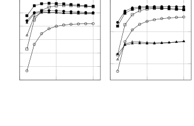

# Joint Multi-Channel Dereverberation and Noise Reduction Using a Unified Convolutional Beamformer With Sparse Priors

Henri Gode    Marvin Tammen    Simon Doclo

###### Abstract

Recently, the convolutional weighted power minimization distortionless
response (WPD) beamformer was proposed, which unifies multi-channel
weighted prediction error dereverberation and minimum power
distortionless response beamforming. To optimize the convolutional
filter, the desired speech component is modeled with a time-varying
Gaussian model, which promotes the sparsity of the desired speech
component in the short-time Fourier transform domain compared to the
noisy microphone signals. In this paper we generalize the convolutional
WPD beamformer by using an $`\ell_{p}`$-norm cost function, introducing
an adjustable shape parameter which enables to control the sparsity of
the desired speech component. Experiments based on the Reverb challenge
dataset show that the proposed method outperforms the conventional
convolutional WPD beamformer in terms of objective speech quality
metrics.

Department of Medical Physics and Acoustics and Cluster of Excellence
Hearing4all, University of Oldenburg, Germany  
Email: {henri.gode,marvin.tammen,simon.doclo}@uni-oldenburg.de

^(†)^(†) This work was funded by the Deutsche Forschungsgemeinschaft
(DFG, German Research Foundation) – Project ID 390895286 – EXC 2177/1.

## 1 Introduction

In many hands-free speech communication systems such as hearing aids,
mobile phones and smart speakers, reverberation and ambient noise may
degrade the speech quality and intelligibility of the recorded
microphone signals. Reverberation is caused by reflections of a speech
source arriving delayed and attenuated at the microphones \[1\]. Note
that early reflections, which arrive roughly in the first
$`50\text{\,}\mathrm{ms}`$ after the direct component, are usually
beneficial for human and automatic speech recognition, whereas late
reverberation can be detrimental \[1, 2, 3, 4\]. In many scenarios the
microphones also capture undesired noise, e.g., originating from
traffic, house appliances or industrial machinery.

First, to achieve noise reduction, a commonly used multi-microphone
noise reduction technique is the minimum power distortionless response
(MPDR) beamformer \[5, 6, 7, 8\], which aims at minimizing the output
power while leaving the desired speech component undistorted. To
implement the MPDR beamformer, the relative transfer function (RTF)
vector of the desired speech source is required, which can be estimated,
e.g., using the covariance whitening method, assuming that an estimate
of the noise covariance matrix is available \[9, 10, 11\].

Second, to achieve dereverberation, the so-called weighted prediction
error (WPE) technique is commonly applied in the short-time Fourier
transform (STFT) domain \[12, 13, 14\]. It uses a convolutional filter,
to estimate the late reverberation component by modeling the desired
speech component with a time-varying complex circular Gaussian (TVG)
model. The convolutional filter is applied to a number of past STFT
frames excluding a few most recent frames, with the aim of preserving
the early reflections. Since anechoic speech is sparser than reverberant
speech in the STFT domain, a variant of WPE with sparse priors has been
proposed in \[15, 16, 17\], which uses an $`\ell_{p}`$-norm cost
function to optimize the convolutional filter. Since both cost functions
do not have analytic solutions, it has been proposed to use iterative
alternating optimization schemes, such as the iteratively reweighted
least squares (IRLS) method \[18, 19, 15\].

Aiming at joint dereverberation and noise reduction, it was proposed to
perform WPE as a preprocessing stage before MPDR beamforming in a
combined cascade system \[20, 21\]. The so-called weighted power
minimization distortionless response (WPD) convolutional beamformer
proposed in \[22, 23, 24, 25\] was shown to outperform those cascade
systems by unifying the optimization of the convolutional WPE filter and
the MPDR beamformer. The unified convolutional WPD beamformer is
optimized similarly to the convolutional WPE filter by modeling the
desired speech component with a TVG model and additionally introducing a
distortionless constraint using the RTFs of the desired speech source.

In this paper we propose to optimize the convolutional beamformer
coefficients by explicitly taking into account that the desired speech
component is sparser than the noisy reverberant speech in the STFT
domain. Hence, similar to the WPE variant in \[15, 16\], we propose to
optimize the convolutional beamformer coefficients using an
$`\ell_{p}`$-norm cost function with an additional distortionless
constraint. The optimization is performed using the IRLS method. We
evaluate the influence of the shape parameter $`p`$ of the
$`\ell_{p}`$-norm cost function and the influence of initialization in
terms of perceptual evaluation of speech quality (PESQ) and
frequency-weighted segmental signal-to-noise ratio (FWSSNR) \[26, 27\].
The simulation results show that the speech enhancement performance can
be improved by setting the shape parameter $`p`$ to an appropriate
value. In addition the results show that the multi-channel
initialization approach results in a faster convergence of the iterative
optimization scheme than single-channel initialization.

## 2 Signal Model

We consider a single speech source captured by $`M`$ microphones in a
noisy and reverberant acoustic environment. The STFT coefficients of the
microphone signals at time frame $`t`$ and any frequency bin are denoted
as

```math
\displaystyle\mathbf{y}_{t}=\left[y_{1,t}\kern 5.0pt\ldots\kern 5.0pty_{M,t}\right]^{\mathrm{T}}\in\mathbb{C}^{M\times 1}, \tag{1}
```

with $`\left(\cdot\right)^{\mathrm{T}}`$ denoting the transpose
operator. The frequency index is omitted for brevity since it is assumed
that each frequency subband is independent and can hence be processed
individually. Assuming that $`T`$ time frames are available, the batch
matrix of the microphone signals is defined as

```math
\displaystyle\mathbf{Y}=\left[\mathbf{y}_{1}\kern 5.0pt\ldots\kern 5.0pt\mathbf{y}_{T}\right]\in\mathbb{C}^{M\times T}. \tag{2}
```

As in \[12, 13, 14, 15, 16\] the multi-channel microphone signal
$`\mathbf{y}_{t}`$ is modeled as the convolution of the clean speech
signal $`s_{t}`$ with the stationary multi-channel convolutive transfer
function (CTF) matrix
$`\mathbf{A}=\left[\mathbf{a}_{0}\kern 5.0pt\ldots\kern 5.0pt\mathbf{a}_{L_{a}-1}\right]\in\mathbb{C}^{M\times L_{a}}`$
plus additive noise $`\mathbf{n}_{t}\in\mathbb{C}^{M\times 1}`$, i.e.

```math
\displaystyle\mathbf{y}_{t}=\sum_{l=0}^{L_{a}-1}\mathbf{a}_{l}s_{t-l}+\mathbf{n}_{t}=\underbrace{\sum_{l=0}^{\tau-1}\mathbf{a}_{l}s_{t-l}}_{\coloneqq\mathbf{d}_{t}}+\underbrace{\sum_{l=\tau}^{L_{a}-1}\mathbf{a}_{l}s_{t-l}}_{\coloneqq\mathbf{r}_{t}}+\mathbf{n}_{t}, \tag{3}
```

where $`L_{a}`$ denotes the number of taps of the CTFs and $`\tau`$
denotes the so-called prediction delay. This delay separates the early
reflections from the late reverberation, i.e. the reverberant speech is
decomposed into the desired speech component
$`\mathbf{d}_{t}\in\mathbb{C}^{M\times 1}`$ and the late reverberation
component $`\mathbf{r}_{t}\in\mathbb{C}^{M\times 1}`$. The desired
speech component can be approximated using the stationary multiplicative
transfer function (MTF) vector $`\mathbf{v}\in\mathbb{C}^{M\times 1}`$
as \[28\]

```math
\displaystyle\mathbf{d}_{t}\approx\mathbf{v}s_{t}=\mathbf{\tilde{v}}_{m}d_{m,t}\hskip 10.00002pt\mathrm{with}\hskip 10.00002ptm\in\{1,...,M\}, \tag{4}
```

where $`d_{m,t}`$ and $`\mathbf{d}_{m}\in\mathbb{C}^{1\times T}`$ denote
the desired speech component in the reference microphone $`m`$ at time
frame $`t`$ and the full batch vector, respectively. The vector
$`\mathbf{\tilde{v}}_{m}=\mathbf{v}/v_{m}\in\mathbb{C}^{M\times 1}`$
denotes the RTF vector, where $`v_{m}`$ is the $`m`$-th entry of
$`\mathbf{v}`$.

### 2.1 Estimating RTF vector by Covariance Whitening

As proposed in \[9, 10, 11\], the RTF vector $`\mathbf{\tilde{v}}_{m}`$
can be estimated with the covariance whitening method, assuming that
$`\mathbf{d}_{t}`$ and $`\mathbf{n}_{t}`$ are uncorrelated and that
$`\mathbf{r}_{t}\approx\mathbf{0}`$. The noisy covariance matrix
$`\mathbf{R}_{y}=\nicefrac{{1}}{{T}}\sum_{t=1}^{T}\mathbf{y}_{t}\mathbf{y}_{t}^{\mathrm{H}}`$
can be decomposed into the speech covariance matrix
$`\mathbf{R}_{d}=\nicefrac{{1}}{{T}}\sum_{t=1}^{T}\mathbf{d}_{t}\mathbf{d}_{t}^{\mathrm{H}}`$
and the noise covariance matrix
$`\mathbf{R}_{n}=\nicefrac{{1}}{{T}}\sum_{t=1}^{T}\mathbf{n}_{t}\mathbf{n}_{t}^{\mathrm{H}}`$
with $`\left(\cdot\right)^{\mathrm{H}}`$ denoting the Hermitian
operator, i.e.

```math
\displaystyle\mathbf{R}_{y}=\mathbf{R}_{d}+\mathbf{R}_{n}\approx\phi_{s}\mathbf{v}\mathbf{v}^{\mathrm{H}}+\mathbf{R}_{n}, \tag{5}
```

where $`\phi_{s}`$ denotes the power spectral density (PSD) of the
speech component, and the MTF approximation in (4) has been used for the
speech covariance matrix $`\mathbf{R}_{d}`$. Assuming that the (positive
definite) noise covariance matrix is available, the noisy covariance
matrix can be whitened as

```math
\displaystyle\mathbf{R}_{n}^{\nicefrac{{-\mathrm{H}}}{{2}}}\mathbf{R}_{y}\mathbf{R}_{n}^{\nicefrac{{-1}}{{2}}} \displaystyle=\mathbf{R}_{n}^{\nicefrac{{-\mathrm{H}}}{{2}}}\mathbf{R}_{d}\mathbf{R}_{n}^{\nicefrac{{-1}}{{2}}}+\mathbf{I} \tag{6}
```

```math
\displaystyle\approx\phi_{s}\mathbf{R}_{n}^{\nicefrac{{-\mathrm{H}}}{{2}}}\mathbf{v}\mathbf{v}^{\mathrm{H}}\mathbf{R}_{n}^{\nicefrac{{-1}}{{2}}}+\mathbf{I} \tag{7}
```

where $`\mathbf{I}`$ denotes the identity matrix and
$`\mathbf{R}_{n}^{\nicefrac{{1}}{{2}}}`$ is any matrix square root of
$`\mathbf{R}_{n}`$ so that
$`\mathbf{R}_{n}^{\nicefrac{{\mathrm{H}}}{{2}}}\mathbf{R}_{n}^{\nicefrac{{1}}{{2}}}=\mathbf{R}_{n}`$.
The principal eigenvector $`\mathbf{\dot{v}}`$ of
$`\mathbf{R}_{n}^{\nicefrac{{-\mathrm{H}}}{{2}}}\mathbf{R}_{y}\mathbf{R}_{n}^{\nicefrac{{-1}}{{2}}}`$
is equal to
$`\alpha\mathbf{R}_{n}^{\nicefrac{{-\mathrm{H}}}{{2}}}\mathbf{v}`$,
where $`\alpha\neq 0`$ denotes an arbitrary scaling factor. The RTF
vector $`\mathbf{\tilde{v}}_{m}`$ can be obtained by de-whitening
$`\mathbf{\dot{v}}`$ and normalizing w.r.t its $`m`$-th entry, i.e.

```math
\displaystyle\mathbf{\tilde{v}}_{m}=\frac{\mathbf{v}}{v_{m}}=\frac{\mathbf{R}_{n}^{\nicefrac{{H}}{{2}}}\mathbf{\dot{v}}}{\mathbf{e}_{m}^{\mathrm{T}}\mathbf{R}_{n}^{\nicefrac{{H}}{{2}}}\mathbf{\dot{v}}}=\frac{\mathbf{R}_{n}^{\nicefrac{{H}}{{2}}}\mathbf{R}_{n}^{\nicefrac{{-\mathrm{H}}}{{2}}}\mathbf{v}}{\mathbf{e}_{m}^{\mathrm{T}}\mathbf{R}_{n}^{\nicefrac{{H}}{{2}}}\mathbf{R}_{n}^{\nicefrac{{-\mathrm{H}}}{{2}}}\mathbf{v}} \tag{8}
```

where $`\mathbf{e}_{m}`$ denotes a selection vector with the $`m`$-th
entry equal to one and all other entries equal to zero.

### 2.2 Convolutional Filter

To obtain an estimate $`z_{m,t}`$ of the desired speech component
$`d_{m,t}`$ in the reference microphone $`m`$ at time frame $`t`$ a
convolutional filter
$`\mathbf{\bar{h}}_{m}\in\mathbb{C}^{M\left(L_{h}-\tau+1\right)\times 1}`$,
can be applied to the noisy STFT vector, i.e. \[12, 13, 14, 15, 16, 22,
23, 24, 25\]

```math
\displaystyle z_{m,t}={\mathbf{\bar{h}}_{m}}^{\mathrm{H}}\mathbf{\bar{y}}_{t}, \tag{9}
```

where the stacked microphone signal vector $`\mathbf{\bar{y}}_{t}`$ is
defined as

```math
\displaystyle\mathbf{\bar{y}}_{t} \displaystyle=\left[\mathbf{y}^{\mathrm{T}}_{t}\kern 5.0pt\mathbf{y}^{\mathrm{T}}_{t-\tau}\kern 5.0pt\ldots\kern 5.0pt\mathbf{y}^{\mathrm{T}}_{t-L_{h}+1}\right]^{\mathrm{T}}\in\mathbb{C}^{M\left(L_{h}-\tau+1\right)\times 1}. \tag{10}
```

Note that the vector $`\mathbf{\bar{y}}_{t}`$ only includes a subset of
the $`L_{h}`$ most recent frames, i.e. it includes the current frame but
excludes $`\tau-1`$ frames, aiming at preserving the early reflections.
The batch vector $`\mathbf{z}_{m}\in\mathbb{C}^{1\times T}`$ containing
estimates of the desired speech component for all time frames can be
obtained as

```math
\displaystyle\mathbf{z}_{m}={\mathbf{\bar{h}}_{m}}^{\mathrm{H}}\mathbf{\bar{Y}}, \tag{11}
```

with

```math
\displaystyle\mathbf{\bar{Y}} \displaystyle=\left[\mathbf{\bar{y}}_{1}\kern 5.0pt\ldots\kern 5.0pt\mathbf{\bar{y}}_{T}\right]\in\mathbb{C}^{M\left(L_{h}-\tau+1\right)\times T}. \tag{12}
```

## 3 Conventional WPD using TVG model

In \[22, 24, 25\], the WPD convolutional beamformer has been proposed to
achieve joint dereverberation and noise reduction. The WPD convolutional
beamformer $`\mathbf{\bar{h}}_{m}`$ is optimized by modeling the desired
speech component $`d_{m,t}`$ in the reference microphone $`m`$ with a
TVG model similarly to WPE dereverberation \[12, 13, 15\] and
additionally introducing a distortionless constraint similarly to the
MPDR beamformer \[6\]. The corresponding negative log-likelihood
$`\mathcal{L}`$ to be minimized is given by \[24\]

```math
\displaystyle\mathcal{L}\left(\mathbf{\bar{h}}_{m},\mathbf{\Lambda}\right) \displaystyle=\frac{1}{T}\sum_{t=1}^{T}\left(\ln{\lambda_{t}}+\frac{\left\lvert z_{m,t}\right\rvert^{2}}{\lambda_{t}}\right) \tag{13}
```

```math
\displaystyle=\frac{1}{T}\left(\mathrm{tr}\left(\ln{\mathbf{\Lambda}}\right)+\mathbf{z}_{m}\mathbf{\Lambda}^{-1}\mathbf{z}_{m}^{\mathrm{H}}\right), \tag{14}
```

where $`\mathrm{tr}\left(\cdot\right)`$ denotes the trace operator,
$`\lambda_{t}=\mathbb{E}\left[\left\lvert d_{m,t}\right\rvert^{2}\right]`$
denotes the PSD of the desired speech component at frame $`t`$,
corresponding to the time-varying variance of the TVG model, and
$`\mathbf{\Lambda}\in\mathbb{R}_{+}^{T\times T}`$ denotes a diagonal
matrix containing these variances for all $`T`$ time frames. The
distortionless constraint is given by \[6\]

```math
\displaystyle\mathbf{\bar{h}}_{m}^{\mathrm{H}}\mathbf{\bar{v}}_{m}=1, \tag{15}
```

where
$`\mathbf{\bar{v}}_{m}=\begin{bmatrix}\mathbf{\tilde{v}}_{m}^{\mathrm{T}}&\mathbf{0}^{\mathrm{T}}\end{bmatrix}^{\mathrm{T}}`$
and $`\mathbf{0}`$ is a vector containing $`M\left(L_{h}-\tau\right)`$
zeros. Note that the cost function in (14) depends on the PSDs of the
desired speech component, which are obviously not available in practice.
Since the cost function is non-convex and does not have an analytic
solution it has been proposed in \[22, 24\] to use an iterative
alternating optimization scheme to approximate the optimal filter. In
the first of the two alternating optimization steps, the variances
$`\mathbf{\Lambda}`$ are fixed to optimize the convolutional filter, and
in the second step the convolutional filter is fixed to update the
variances using the estimate of the desired speech component.

#### (1) Estimating the filter by fixing the variances

By fixing the variances $`\mathbf{\Lambda}_{i}`$ in the $`i`$-th
iteration of the alternating optimization and using (11), the cost
function in (14) to be minimized reduces to

```math
\displaystyle\mathcal{L}\left(\mathbf{\bar{h}}_{m,i}\right) \displaystyle\propto\frac{1}{T}\mathbf{z}_{m,i}\mathbf{\Lambda}_{i}^{-1}\mathbf{z}_{m,i}^{\mathrm{H}} \tag{16}
```

```math
\displaystyle=\frac{1}{T}\mathbf{\bar{h}}_{m,i}^{\mathrm{H}}\mathbf{\bar{Y}}\mathbf{\Lambda}_{i}^{-1}\mathbf{\bar{Y}}^{\mathrm{H}}\mathbf{\bar{h}}_{m,i} \tag{17}
```

```math
\displaystyle=\mathbf{\bar{h}}_{m,i}^{\mathrm{H}}\mathbf{\bar{R}}_{y,i}\mathbf{\bar{h}}_{m,i}, \tag{18}
```

where
$`\mathbf{\bar{R}}_{y,i}=\nicefrac{{1}}{{T}}\mathbf{\bar{Y}}\mathbf{\Lambda}_{i}^{-1}\mathbf{\bar{Y}}^{\mathrm{H}}`$
denotes the power-weighted noisy sample covariance matrix of the stacked
microphone signals. The solution of the resulting constrained
optimization problem

```math
\displaystyle\mathbf{\bar{h}}_{m,i}^{\mathrm{opt}}=\argmin_{\mathbf{\bar{h}}_{m,i}}\left(\mathbf{\bar{h}}_{m,i}^{\mathrm{H}}\mathbf{\bar{R}}_{y,i}\mathbf{\bar{h}}_{m,i}\right)\ \ \mathrm{s.t.}\ \ \mathbf{\bar{h}}_{m,i}^{\mathrm{H}}\mathbf{\bar{v}}_{m}=1 \tag{19}
```

is given by the MPDR beamformer \[5\]:

```math
\displaystyle\mathbf{\bar{h}}_{m,i}^{\mathrm{opt}}=\frac{\mathbf{\bar{R}}_{y,i}^{-1}\mathbf{\bar{v}}_{m}}{\mathbf{\bar{v}}_{m}^{\mathrm{H}}\mathbf{\bar{R}}_{y,i}^{-1}\mathbf{\bar{v}}_{m}}. \tag{20}
```

#### (2) Estimating the variances by fixing the filter

By now fixing the convolutional filter $`\mathbf{\bar{h}}_{m,i}`$, the
variances in the $`i`$-th iteration can be updated by minimizing (13)
\[13, 15\], i.e.

```math
\displaystyle\lambda_{t,i+1}=\left\lvert z_{m,t,i}\right\rvert^{2}=\left\lvert{\mathbf{\bar{h}}_{m,i}}^{\mathrm{opt,H}}\mathbf{\bar{y}}_{t}\right\rvert^{2}. \tag{21}
```

## 4 Proposed Method using Sparse Priors

We propose to optimize the convolutional beamformer coefficients by
explicitly taking into account that the desired speech component is
sparser than the noisy reverberant speech in the STFT domain. Hence,
instead of the TVG model in (13), we propose to optimize the
convolutional filter in (11) using an $`\ell_{p}`$-norm cost function
similarly to the WPE variant in \[15, 16\], i.e.

```math
\displaystyle\mathcal{L}\left(\mathbf{\bar{h}}_{m}\right) \displaystyle\propto\left\lVert\mathbf{z}_{m}\right\rVert_{p}^{p}\propto\frac{1}{T}\sum_{t=1}^{T}\left\lvert z_{m,t}\right\rvert^{p}, \tag{22}
```

where $`p\in(0,2]`$ denotes the so-called shape parameter. The shape
parameter determines the sparsity of the cost function, where small
values of $`p`$ promote sparsity. It should be noted that for $`0<p<1`$
this cost function is non-convex. In addition, we use the same
distortionless constraint
$`\mathbf{\bar{h}}_{m}^{\mathrm{H}}\mathbf{\bar{v}}_{m}=1`$ as for the
conventional WPD beamformer in (15). Similarly as in \[19, 15\], we
propose to use an IRLS method with the basic idea to replace the
non-convex $`\ell_{p}`$-norm minimization problem with a series of
convex $`\ell_{2}`$-norm minimization subproblems. In each iteration,
the $`\ell_{2}`$-norm minimization subproblem has an analytic solution,
which modifies the optimization problem of the next iteration. This
leads to an iterative alternating optimization scheme similar to the
optimization scheme for WPD in Section 3. The two alternating steps are
described in the following paragraphs.

#### (1) Constrained $`\ell_{2}`$–Norm Subproblem Minimization

In each iteration $`i`$, the non-convex cost function in (22) is
replaced with a convex weighted $`\ell_{2}`$-norm cost function, i.e.

```math
\displaystyle\mathcal{L}\left(\mathbf{\bar{h}}_{m,i}\right) \displaystyle\propto\frac{1}{T}\mathbf{z}_{m,i}\mathbf{W}_{i}\mathbf{z}_{m,i}^{\mathrm{H}}, \tag{23}
```

where $`\mathbf{W}_{i}`$ denotes the diagonal weighting matrix, i.e.

```math
\displaystyle\mathbf{W}_{i}=\mathrm{diag}\left(\left[w_{1,i}\kern 5.0pt\ldots\kern 5.0ptw_{T,i}\right]^{\mathrm{T}}\right)\in\mathbb{R}_{+}^{T\times T}, \tag{24}
```

where the weights $`w_{t,i}`$ are real-valued and positive. It should be
noted that the cost function in (23) is similar to (16), where the
weight matrix $`\mathbf{W}_{i}`$ takes the role of
$`\mathbf{\Lambda}_{i}^{-1}`$. Hence, similarly to (20), the solution
minimizing (23) subject to the distortionless constraint in (15) is
equal to

```math
\displaystyle\mathbf{\bar{h}}_{m,i}^{\mathrm{opt}}=\frac{\left(\mathbf{\bar{R}}^{\mathbf{W}}_{y,i}\right)^{-1}\mathbf{\bar{v}}_{m}}{\mathbf{\bar{v}}_{m}^{\mathrm{H}}\left(\mathbf{\bar{R}}^{\mathbf{W}}_{y,i}\right)^{-1}\mathbf{\bar{v}}_{m}}. \tag{25}
```

where
$`\mathbf{\bar{R}}_{y,i}^{\mathbf{W}}=\nicefrac{{1}}{{T}}\mathbf{\bar{Y}}\mathbf{W}_{i}\mathbf{\bar{Y}}^{\mathrm{H}}`$
denotes the weighted noisy sample covariance matrix of the stacked
microphone signals.

#### (2) Updating the Weights

Similarly as in \[19, 15\], in each iteration the weights in (24) are
updated as

```math
\displaystyle w_{t,i+1}=\frac{1}{\left\lvert z_{m,t,i}\right\rvert^{2-p}}=\frac{1}{\left\lvert{\mathbf{\bar{h}}_{m,i}}^{\mathrm{opt,H}}\mathbf{\bar{y}}_{t}\right\rvert^{2-p}}, \tag{26}
```

so that (23) is a first-order approximation of (22). It should be noted
that for $`p=0`$, the conventional and proposed optimization schemes are
equivalent, since $`w_{t,i+1}=\lambda_{t,i+1}^{-1}`$ yielding
$`\mathbf{\bar{R}}_{y,i}^{\mathbf{W}}=\mathbf{\bar{R}}_{y,i}`$. This
means that the conventional WPD algorithm models the desired speech
component as the most sparse, while for larger values of $`p`$ the
desired speech component is modeled less sparse.

## 5 Initialization

Both the conventional WPD beamformer and the proposed $`\ell_{p}`$-norm
WPD beamformer are based on an iterative alternating optimization
scheme. In each iteration, first the convolutional filter is estimated,
based on which the variances or equivalent weights are updated. These
updates modify the estimation of the convolutional filter in the next
iteration. However, the update equations (21) and (26) depend on the
estimate of the desired speech component, which is obviously not
available in the first iteration. One option to initialize this estimate
is to simply use the noisy and reverberant reference microphone signal,
i.e.

```math
\displaystyle\lambda_{t,1}=\left\lvert y_{m,t}\right\rvert^{2}\hskip 10.00002pt\mathrm{and}\hskip 10.00002ptw_{t,1}=\frac{1}{\left\lvert y_{m,t}\right\rvert^{2-p}}. \tag{27}
```

Another option is to use all noisy and reverberant microphone signals,
similarly to \[16, 29\], i.e.

```math
\displaystyle\lambda_{t,1}=\frac{\left\lVert\mathbf{y}_{t}\right\rVert_{2}^{2}}{M},\hskip 10.00002pt\hskip 10.00002ptw_{t,1}=\frac{M}{\left\lVert\mathbf{y}_{t}\right\rVert_{2}^{2-p}}. \tag{28}
```

## 6 Experiments

In this section, we compare the performance of the conventional WPD
beamformer with the proposed beamformer. More in particular, we evaluate
the influence of the shape parameter $`p`$ and different initialization
approaches.

### 6.1 Dataset, Evaluation Metrics and Analysis Conditions

[TABLE]

Table 1: Algorithm Parameters

We used the simulated data of the development set of the Reverb
challenge \[30, 31\] with sampling frequency
$`f_{s}=$16\text{\,}\mathrm{kHz}$`$. The dataset simulates a circular
microphone array with 8 channels in six different reverberation
conditions resulting from two speaker-to-microphone distances of
$`50\text{\,}\mathrm{cm}`$ and $`200\text{\,}\mathrm{cm}`$ and three
different rooms with reverberation times of
$`T*{60}\in\{$0.3\text{\,}\mathrm{s}$,$0.6\text{\,}\mathrm{s}$,$0.7\text{\,}\mathrm{s}$\}`$.
After convolving the clean utterances with one of the six room impulse
responses, stationary diffuse background noise was added with a
signal-to-noise ratio of $`20\text{\,}\mathrm{dB}`$. As objective
measures of the speech quality we computed PESQ and FWSSNR scores \[26,
27\], where we used the clean speech signal $`s*{t}`$ as the reference
signal. The parameters of the algorithms are stated in Tab. 1. The RTF
vector $`\mathbf{\tilde{v}}_{m}`$ was estimated blindly using the
covariance whitening (CW) method \[9, 10, 11\], assuming that noise-only
frames are present in the first $`225\text{\,}\mathrm{ms}`$ and the last
$`75\text{\,}\mathrm{ms}`$ to estimate the noise covariance matrix
$`\mathbf{R}_{n}`$.

### 6.2 Results

Fig. 1 shows the average PESQ and FWSSNR improvement vs. the number of
iterations of the $`\ell_{p}`$-norm WPD algorithm for different shape
parameters $`p`$ and initializations (see Section 5). First, the results
show that for all considered parameter choices the speech quality is
improved in terms of PESQ and FWSSNR compared to the noisy reference
microphone signal. Second, the results after $`I=10`$ iterations show
that for both initializations a shape parameter of $`p=0.5`$ outperforms
the conventional method ($`p=0`$), which stronger promotes sparsity, and
its variant ($`p=1`$), which promotes sparsity less, in terms of PESQ
and FWSSNR improvement, except for the FWSSNR improvement of the
conventional method for the multi-channel initialization. Third, it can
be observed that the multi-channel initialization consistently
outperforms the single-channel initialization in terms of convergence
speed and for the conventional method ($`p=0`$) also in terms of
performance after $`I=10`$ iterations. These results show the influence
of the shape parameter $`p`$ and the initialization on the performance
of the proposed WPD beamformer with sparse priors.




Figure 1: Average PESQ and FWSSNR improvement vs. number of iterations
for different shape parameters $`p`$. Filled markers correspond to
multi-channel (MC) initialization of the weights as in (28), while empty
markers correspond to single-channel (SC) initialization of the weights
as in (27).

## 7 Conclusion

In this paper we proposed a novel convolutional beamformer for joint
dereverberation and noise reduction, based on a sparse prior for
modeling the desired speech component. The proposed $`\ell_{p}`$-norm
WPD beamformer can be interpreted as a generalization of the
conventional WPD beamformer using the TVG model. We propose to compute
the convolutional beamformer using an IRLS method, where the non-convex
constrained $`\ell_{p}`$-norm minimization problem is replaced with a
series of convex constrained $`\ell_{2}`$-norm minimization subproblems.
The experimental results show that speech enhancement performance can be
consistently improved by setting the shape parameter $`p`$ to an
appropriate value. In addition, the results show that multi-channel
initialization improves the performance and the convergence speed.

## References

- \[1\] H. Kuttruff, Room Acoustics. CRC Press, Oct. 2016.
- \[2\] J. S. Bradley, H. Sato, and M. Picard, “On the importance of
  early reflections for speech in rooms,” The Journal of the Acoustical
  Society of America, vol. 113, no. 6, p. 3233, 2003.
- \[3\] T. Yoshioka, A. Sehr, M. Delcroix, K. Kinoshita, R. Maas, T.
  Nakatani, and W. Kellermann, “Making Machines Understand Us in
  Reverberant Rooms: Robustness Against Reverberation for Automatic
  Speech Recognition,” IEEE Signal Processing Magazine, vol. 29, pp.
  114–126, Nov. 2012.
- \[4\] A. Warzybok, J. Rennies, T. Brand, S. Doclo, and B. Kollmeier,
  “Effects of spatial and temporal integration of a single early
  reflection on speech intelligibility,” The Journal of the Acoustical
  Society of America, vol. 133, pp. 269–282, Jan. 2013.
- \[5\] H. Cox, “Resolving power and sensitivity to mismatch of optimum
  array processors,” The Journal of the Acoustical Society of America,
  vol. 54, pp. 771–785, Sept. 1973.
- \[6\] B. D. Van Veen and K. M. Buckley, “Beamforming: a versatile
  approach to spatial filtering,” IEEE ASSP Magazine, vol. 5, pp. 4–24,
  Apr. 1988.
- \[7\] H. L. Van Trees, Optimum Array Processing: Part IV of
  Detection, Estimation, and Modulation Theory. John Wiley & Sons,
  Apr. 2004.
- \[8\] S. Doclo, W. Kellermann, S. Makino, and S. E. Nordholm,
  “Multichannel Signal Enhancement Algorithms for Assisted Listening
  Devices: Exploiting spatial diversity using multiple microphones,”
  IEEE Signal Processing Magazine, vol. 32, pp. 18–30, Mar. 2015.
- \[9\] S. Markovich, S. Gannot, and I. Cohen, “Multichannel Eigenspace
  Beamforming in a Reverberant Noisy Environment With Multiple
  Interfering Speech Signals,” IEEE Transactions on Audio, Speech, and
  Language Processing, vol. 17, pp. 1071–1086, Aug. 2009.
- \[10\] R. Serizel, M. Moonen, B. Van Dijk, and J. Wouters, “Low-rank
  Approximation Based Multichannel Wiener Filter Algorithms for Noise
  Reduction with Application in Cochlear Implants,” IEEE/ACM Trans. on
  Audio, Speech, and Language Processing, vol. 22, pp. 785–799,
  Apr. 2014.
- \[11\] S. Markovich-Golan, S. Gannot, and W. Kellermann, “Performance
  analysis of the covariance-whitening and the covariance-subtraction
  methods for estimating the relative transfer function,” in Proc.
  European Signal Processing Conference, (Rome, Italy), pp. 2499–2503,
  Sept. 2018.
- \[12\] T. Nakatani, T. Yoshioka, K. Kinoshita, M. Miyoshi, and B.
  Juang, “Blind speech dereverberation with multi-channel linear
  prediction based on short time fourier transform representation,” in
  Proc. IEEE International Conference on Acoustics, Speech and Signal
  Processing, (Las Vegas NV, USA), pp. 85–88, Mar. 2008.
- \[13\] T. Nakatani, T. Yoshioka, K. Kinoshita, M. Miyoshi, and B.
  Juang, “Speech Dereverberation Based on Variance-Normalized Delayed
  Linear Prediction,” IEEE Trans. on Audio, Speech, and Language
  Processing, vol. 18, pp. 1717–1731, Sept. 2010.
- \[14\] T. Yoshioka and T. Nakatani, “Generalization of Multi-Channel
  Linear Prediction Methods for Blind MIMO Impulse Response Shortening,”
  IEEE Trans. on Audio, Speech, and Language Processing, vol. 20, pp.
  2707–2720, Dec. 2012.
- \[15\] A. Jukić, T. van Waterschoot, T. Gerkmann, and S. Doclo,
  “Multi-Channel Linear Prediction-Based Speech Dereverberation With
  Sparse Priors,” IEEE/ACM Trans. on Audio, Speech, and Language
  Processing, vol. 23, pp. 1509–1520, Sept. 2015.
- \[16\] A. Jukić, T. van Waterschoot, T. Gerkmann, and S. Doclo,
  “Group sparsity for mimo speech dereverberation,” in Proc. IEEE
  Workshop on Applications of Signal Processing to Audio and Acoustics,
  (New Paltz NY, USA), pp. 1–5, Oct. 2015.
- \[17\] A. Jukić, T. van Waterschoot, and S. Doclo, “Adaptive Speech
  Dereverberation Using Constrained Sparse Multichannel Linear
  Prediction,” IEEE Signal Processing Letters, vol. 24, pp. 101–105,
  Jan. 2017.
- \[18\] R. Chartrand and W. Yin, “Iteratively reweighted algorithms
  for compressive sensing,” in Proc. IEEE International Conference on
  Acoustics, Speech and Signal Processing, (Las Vegas NV, USA), pp.
  3869–3872, Mar. 2008.
- \[19\] B. Rao and K. Kreutz-Delgado, “An affine scaling methodology
  for best basis selection,” IEEE Trans. on Signal Processing, vol. 47,
  pp. 187–200, Jan. 1999.
- \[20\] M. Delcroix, T. Yoshioka, A. Ogawa, Y. Kubo, M. Fujimoto, N.
  Ito, K. Kinoshita, M. Espi, S. Araki, T. Hori, and T. Nakatani,
  “Strategies for distant speech recognitionin reverberant
  environments,” EURASIP Journal on Advances in Signal Processing, vol.
  2015, pp. 1–15, July 2015.
- \[21\] W. Yang, G. Huang, W. Zhang, J. Chen, and J. Benesty,
  “Dereverberation with Differential Microphone Arrays and the
  Weighted-Prediction-Error Method,” in Proc. International Workshop on
  Acoustic Signal Enhancement, (Tokyo, Japan), pp. 376–380, Sept. 2018.
- \[22\] T. Nakatani and K. Kinoshita, “A Unified Convolutional
  Beamformer for Simultaneous Denoising and Dereverberation,” IEEE
  Signal Processing Letters, vol. 26, pp. 903–907, June 2019.
- \[23\] T. Nakatani and K. Kinoshita, “Simultaneous Denoising and
  Dereverberation for Low-Latency Applications Using Frame-by-Frame
  Online Unified Convolutional Beamformer,” in Proc. Interspeech, (Graz,
  Austria), pp. 111–115, Sept. 2019.
- \[24\] T. Nakatani and K. Kinoshita, “Maximum likelihood
  convolutional beamformer for simultaneous denoising and
  dereverberation,” in Proc. European Signal Processing Conference, (A
  Coruña, Spain), pp. 1–5, Sept. 2019.
- \[25\] C. Boeddeker, T. Nakatani, K. Kinoshita, and R. Haeb-Umbach,
  “Jointly Optimal Dereverberation and Beamforming,” in Proc. IEEE
  International Conference on Acoustics, Speech and Signal Processing,
  (Barcelona, Spain), pp. 216–220, May 2020.
- \[26\] A. W. Rix, J. G. Beerends, M. P. Hollier, and A. P. Hekstra,
  “Perceptual evaluation of speech quality (PESQ)-a new method for
  speech quality assessment of telephone networks and codecs,” in Proc.
  IEEE International Conference on Acoustics, Speech, and Signal
  Processing, vol. 2, (Salt Lake City, UT, USA), pp. 749–752, May 2001.
- \[27\] Y. Hu and P. C. Loizou, “Evaluation of Objective Quality
  Measures for Speech Enhancement,” IEEE Transactions on Audio, Speech,
  and Language Processing, vol. 16, pp. 229–238, Jan. 2008.
- \[28\] Y. Avargel and I. Cohen, “On Multiplicative Transfer Function
  Approximation in the Short-Time Fourier Transform Domain,” IEEE Signal
  Processing Letters, vol. 14, pp. 337–340, May 2007.
- \[29\] L. Drude, C. Boeddeker, J. Heymann, R. Haeb-Umbach, K.
  Kinoshita, M. Delcroix, and T. Nakatani, “Integrating Neural Network
  Based Beamforming and Weighted Prediction Error Dereverberation,” in
  Proc. Interspeech, (Hyderabad, India), pp. 3043–3047, 2018.
- \[30\] K. Kinoshita, M. Delcroix, T. Yoshioka, T. Nakatani, E.
  Habets, R. Haeb-Umbach, V. Leutnant, A. Sehr, W. Kellermann, R.
  Maas, S. Gannot, and B. Raj, “The reverb challenge: A common
  evaluation framework for dereverberation and recognition of
  reverberant speech,” in Proc. IEEE Workshop on Applications of Signal
  Processing to Audio and Acoustics, (New Paltz NY, USA), pp. 1–4,
  Oct. 2013.
- \[31\] K. Kinoshita, M. Delcroix, S. Gannot, E. A. P. Habets, R.
  Haeb-Umbach, W. Kellermann, V. Leutnant, R. Maas, T. Nakatani, B.
  Raj, A. Sehr, and T. Yoshioka, “A summary of the REVERB challenge:
  state-of-the-art and remaining challenges in reverberant speech
  processing research,” EURASIP Journal on Advances in Signal
  Processing, vol. 2016, pp. 1–19, Jan. 2016.
