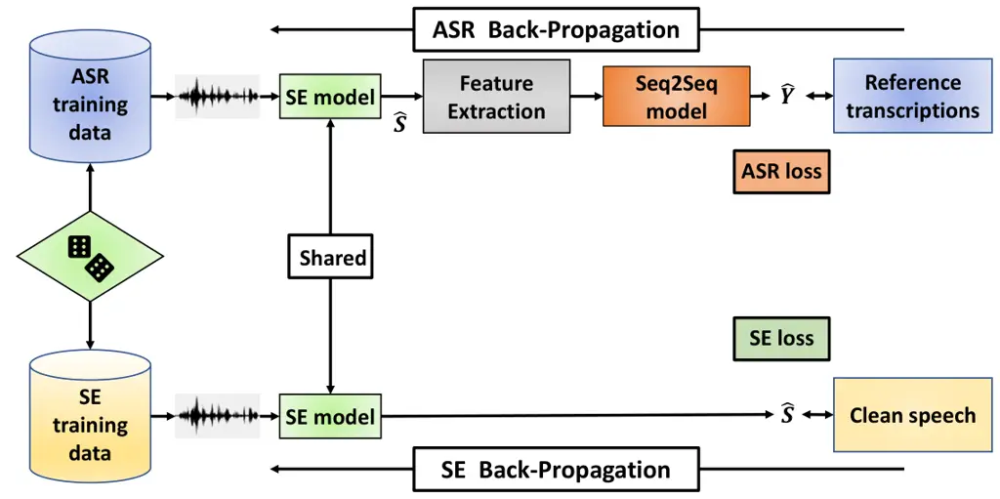
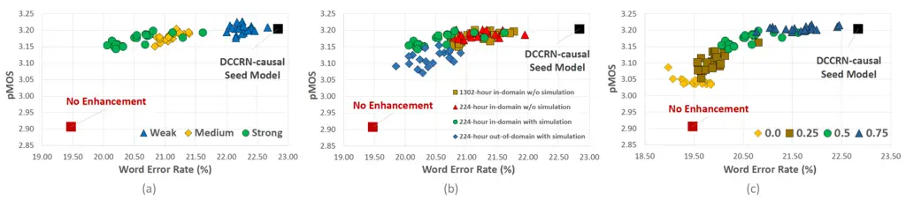

# Human Listening and Live Captioning: Multi-Task Training for Speech Enhancement

Sefik Emre Eskimez^(\*) ^(†)^(†)thanks: ^(\*)Equal contribution   
Xiaofei Wang^(\*)    Min Tang    Hemin Yang    Zirun Zhu
Affiliation: Zhuo Chen, Huaming Wang, Takuya Yoshioka

###### Abstract

With the surge of online meetings, it has become more critical than ever
to provide high-quality speech audio and live captioning under various
noise conditions. However, most monaural speech enhancement (SE) models
introduce processing artifacts and thus degrade the performance of
downstream tasks, including automatic speech recognition (ASR). This
paper proposes a multi-task training framework to make the SE models
unharmful to ASR. Because most ASR training samples do not have
corresponding clean signal references, we alternately perform two model
update steps called SE-step and ASR-step. The SE-step uses clean and
noisy signal pairs and a signal-based loss function. The ASR-step
applies a pre-trained ASR model to training signals enhanced with the SE
model. A cross-entropy loss between the ASR output and reference
transcriptions is calculated to update the SE model parameters.
Experimental results with realistic large-scale settings using ASR
models trained on 75,000-hour data show that the proposed framework
improves the word error rate for the SE output by 11.82% with little
compromise in the SE quality. Performance analysis is also carried out
by changing the ASR model, the data used for the ASR-step, and the
schedule of the two update steps.

^(†)^(†)address: Microsoft, One Microsoft Way, Redmond, WA,
USA^(†)^(†)email: {seeskime, xiaofewa, mintang, heyang, zirzhu, zhuc,
huawang, tayoshio}@microsoft.com

Index Terms: speech enhancement, noise suppression, multi-task training,
speech recognition

## 1 Introduction

Due to the need for social distancing led by the COVID-19 pandemic,
people and organizations have had to rely on digital technologies to
stay connected and work remotely \[1\]. This has resulted in a surge in
the usage of online conferencing tools. Most organizations rely on these
tools to conduct day-to-day business while people rely on them to
connect with their family members and friends in these challenging
times. As a result, it is becoming more important than ever to provide
high-quality speech audio under various household noise conditions.

In recent years, deep neural networks have shown great potential for
single-channel speech enhancement (SE) (or noise-suppression) \[2, 3, 4,
5, 6, 7, 8\]. Although these models substantially remove background
noise, most of them degrade the performance of downstream tasks such as
automatic speech recognition (ASR) performance significantly, as modern
commercial multi-condition trained ASR systems can usually recognize
original noisy speech \[5\] well and the SE models introduces unseen
distortions that are particularly harmful to ASR. When both live
captioning and high-quality audio are needed, a common solution is for
the local client to send both an enhanced signal for communication and
an unaltered signal for transcription. Clearly, there is a benefit of
creating a speech enhancement system that can improve speech quality
without compromising the ASR accuracy.

In this paper, we propose a framework for optimizing speech enhancement
models for both communication and transcription quality by leveraging
pre-trained ASR models. The framework aims to build an SE model that
achieves superior ASR performance while retaining the same speech
quality as an SE model trained solely for SE objectives.

Our training framework alternately performs two steps: SE-step and
ASR-step. In the SE-step, the model is trained with parallel data
created by artificially mixing clean speech with noise files as with
conventional supervised SE training. For the ASR-step, we use a
realistic ASR model trained on a large amount of data. The training
audio is passed through the SE network and fed to the ASR network to
calculate an ASR-based loss. In both steps, only the SE network is
updated while the ASR model parameters remain unchanged. This training
scheme allows us to leverage real noisy recordings which do not have the
corresponding clean speech signals to optimize the SE network. We
evaluate our framework by using both real and synthetic data under
various conditions with respect to signal-to-noise ratios (SNRs), types
of noise, and recording scenarios. The experimental results show that
our proposed framework improves the word error rate (WER) by 11.82% over
the state-of-the-art causal DCCRN model \[3\] for real recordings.
Besides, we conduct ablation studies by changing the ASR model, the data
for the ASR-step, and the schedule of the two training steps. We use
different ASR systems for the training and evaluation to show the
generalization capability of the proposed framework.

## 2 Related Work

Speech Enhancement: There are regression-based and masking-based
approaches for speech enhancement using neural network models \[9, 3\].
Regression-based approaches try to predict a clean speech signal or its
time-frequency representation (TF) from the noisy speech input.
Masking-based methods try to estimate a TF mask from the noisy input and
apply the predicted mask to the same input to obtain the clean signal.

Various architectures, along with many objective functions, were
proposed for solving the SE problem. We focus on the most recent and
promising work. Choi et al. \[6\] proposed a deep complex U-net (DCUNET)
that uses real-valued convolution operations on the real and imaginary
parts of the input speech STFT. They took advantages of the U-net
structure and deep complex networks \[10\], which was shown to be useful
for SE \[11\]. They employed a scale-invariant signal-to-noise ratio
(SI-SNR) calculated in the time domain to optimize their model
parameters. Hu et al. \[3\] built upon the DCUNET and introduced a deep
complex convolution recurrent network (DCCRN). They introduced complex
long-short term memory (LSTM) layers in the bottleneck layer and complex
batch normalization. The resulting model was significantly faster and
had fewer parameters than DCUNET.

Kinoshita et al. \[5\] considered using a convolutional time-domain
audio separation network (Conv-TasNet) for SE and proposed
Denoising-TasNet, which directly processes a speech waveform with 1D
convolutions. Their results show that the time-domain SE approach
achieved a relative WER improvement of more than 30% for a robust ASR
back-end. However, we could not observe WER improvements in our
preliminary evaluation with time-domain approaches using a
production-grade ASR back-end trained from both clean and noisy audio.
Hence, we do not consider this approach in this work.

ASR Multi-task Training: There are prior studies that employ joint or
multi-task training for the front-end and back-end \[12, 13, 14, 15, 16,
17, 18, 19, 20, 21, 22\]. However, they concerned only about the ASR
accuracy and did not pay close attention to the SE quality nor analyzed
the trade-off between the two tasks. In contrast, we focus on the
front-end and optimize it for both tasks.

## 3 Method

This section elaborates on our proposed framework. We first present the
proposed multi-task training framework using SE and ASR. In the
subsections that follow, we describe the pieces that constitute the
proposed framework, i.e., our SE model as well as the SE and ASR loss
functions to be used.



Figure 1: Proposed multi-task training framework. $`\hat{S}`$ and
$`\hat{Y}`$ denote enhanced signal and predicted transcription,
respectively.

### 3.1 Multi-Task Training

The idea behind the proposed method is to optimize an SE model for both
noise suppression and ASR. Multi-task training is usually performed by
using training samples that have supervision signals (i.e., reference
signals and word labels) for all the tasks to be considered.

We consider a scenario where each training sample has a supervision
signal for only either SE or ASR. This is because, in practice, most of
the ASR datasets do not contain training samples with reference clean
speech signals that could be used for supervised SE training. Also, some
SE datasets do not come with human transcriptions.

To cope with this scenario, we update the SE model parameters by
alternately performing the following two steps:

SE-step:  
We mix clean speech and noise samples on the fly and use the noisy and
clean speech pairs to evaluate a signal difference-based loss function.
The SE model parameter gradients with respect to this loss function are
computed to update the model parameters.

ASR-step:  
Noisy training samples in a mini-batch are fed to the SE network. The
generated enhanced signals are input to the ASR network. We evaluate a
loss function by comparing the ASR model output and the reference
transcriptions. The loss is back-propagated all the way down to the SE
network, and only the SE model parameters are updated. This is because
our objective is to find SE model parameter values that would work for
existing well-trained ASR systems, and therefore we do not want the ASR
network to adapt to the characteristics of the SE model.

Figure 1 shows the diagram of the proposed framework. The two-step
approach allows us to take advantage of the real noisy speech samples
that only have reference transcriptions for the SE model training. At
each training iteration, the update step to be used is chosen randomly
from a Bernoulli distribution. We refer to the probability of choosing
the SE-step as the “SE-step probability”. Before performing the
multi-task training, the SE model parameters are pre-trained on the SE
training dataset.

### 3.2 Speech Enhancement Model

We employ DCCRN \[3\] as our front-end model because it achieved the
best SE performance in our preliminary test, while we also provide
results using DCUNET to examine the generalization capability of the
proposed framework. DCCRN applies an encoder-decoder architecture with
two LSTM layers in between. Instead of using conventional 2D
convolutional/deconvolutional layers (conv2D/deconv2D), DCCRN builds on
the DCUNET \[6\] that employs complex conv2D/deconv2D followed by
complex batch normalization in the encoder and decoder blocks. Besides,
DCCRN employs complex LSTM layers instead of conventional LSTM layers.
Furthermore, it contains U-Net style skip connections (concatenation)
from the encoder to the decoder as in DCUNET.

The DCCRN model takes the real and imaginary parts of a noisy
spectrogram as input. It estimates a complex ratio mask (CRM) and
applies it to the noisy speech. The masked signal is converted back to
the time domain with ISTFT. The CRM can be defined as follows:

```math
\split CRM=\frac{Y_{r}S_{r}+Y_{i}S_{i}}{Y^{2}_{r}+Y^{2}_{i}}+j\frac{Y_{r}S_{i}-Y_{i}S_{r}}{Y^{2}_{r}+Y^{2}_{i}}, \tag{1}
```

where $`Y_{r}`$ and $`Y_{i}`$ denote the real and imaginary parts of the
noisy spectrogram, respectively while $`S_{r}`$ and $`S_{i}`$ denote the
real and imaginary parts of the clean spectrogram, respectively.

We consider both non-causal and causal DCCRN configurations. The
non-causal model can look ahead and employs bidirectional LSTM layers.
The causal model can only process the current and previous frames and
employs unidirectional LSTM layers and causal padding for
conv2D/deconv2D layers. The latter is suitable for most applications.
For further details of DCCRN, we refer the reader to \[3\].

|                                  |                 |      |      |       |      |           |      |
| -------------------------------- | --------------- | ---- | ---- | ----- | ---- | --------- | ---- |
| System                           | Simulation Data |      |      |       |      | Real Data |      |
|                                  | WER             | pMOS | PESQ | SDR   | STOI | WER       | pMOS |
| Noisy Speech (No enhancement)    | 24.02           | 2.81 | 1.42 | 5.02  | 0.82 | 19.47     | 2.91 |
| DCUNet-causal-seed               | 26.36           | 3.54 | 2.23 | 11.51 | 0.88 | 23.28     | 3.18 |
| DCUNet-causal-MT                 | 25.41           | 3.51 | 2.23 | 11.30 | 0.88 | 21.24     | 3.16 |
| DCCRN-non-causal-seed            | 22.33           | 3.74 | 2.57 | 13.02 | 0.91 | 20.63     | 3.33 |
| DCCRN-non-causal-MT              | 21.92           | 3.69 | 2.59 | 12.90 | 0.91 | 19.33     | 3.30 |
| DCCRN-causal-seed                | 25.20           | 3.58 | 2.36 | 12.07 | 0.89 | 22.84     | 3.20 |
| DCCRN-causal-MT (Best WER Model) | 22.31           | 3.19 | 1.90 | 7.82  | 0.86 | 18.98     | 3.09 |
| DCCRN-causal-MT                  | 23.34           | 3.48 | 2.31 | 11.70 | 0.89 | 20.14     | 3.17 |

Table 1: Evaluation results for seed SE models and their multi-task (MT)
trained versions. SE-step probability for MT training was set at $`0.5`$
except for the Best WER MT case, where it was set at $`0.0`$.

### 3.3 Loss Function for SE-Step

For the loss function of the SE-step and the SE model pre-training, we
use the PHASEN loss function \[4\]. It outperformed alternative loss
functions, such as SI-SNR and power-spectrogram mean squared errors, in
our preliminary tests.

The PHASEN loss comprises two parts: amplitude $`L_{a}`$ and phase-aware
$`L_{p}`$ losses. The definition is as follows:

```math
\resizebox{20348790}{}{$\mathcal{L}=\left||S|^{p}-|\hat{S}|^{p}\right|^{2}+\left||S|^{p}e^{j\varphi(S)}-|\hat{S}|^{p}e^{j\varphi(\hat{S})}\right|^{2}$}, \tag{2}
```

where $`S`$ and $`\hat{S}`$ are the estimated and reference (i.e.,
clean) spectrograms, respectively. Hyper-parameter $`p`$ is a spectral
compression factor and is set to 0.3. Operator $`\varphi`$ calculates
the argument of a complex number.

### 3.4 Loss Function for ASR-Step

Our back-end model used for the ASR-step training is based on a
sequence-to-sequence (Seq2Seq) model using an attention-based
encoder-decoder structure \[22, 23\]. We use the Seq2Seq model because
it is simpler than a hybrid ASR system and thus facilitates multi-task
training. The model estimates text sequence $`C=(c_{1},c_{2},\cdots)`$
from STFT $`X`$ that is generated by the SE model. We integrate STFT,
log-mel filterbank energy extraction, and global mean-variance
normalization into the ASR network to allow the gradients to pass
through to the SE model.

In the ASR-step, the SE model parameters are updated to minimize the
cross entropy loss between $`C`$ and reference label
$`R=\{r_{1},...,r_{N},r_{N+1}=\langle eos\rangle\}`$, where $`N`$ is the
length of the reference sequence $`R`$. Special symbol
$`\langle eos\rangle`$ indicates the sequence end. See Sections 2.3 and
4.4 of \[22\] for our Seq2Seq ASR model.

## 4 Experiments

We conducted ASR and SE experiments to evaluate the proposed multi-task
training framework under realistic settings.

### 4.1 Datasets

Training Data for SE: We utilized a large-scale and high-quality
simulated dataset described in \[24\], which includes around 1,000 hours
of paired speech samples¹¹ 1 We thank Sebastian Braun, Hannes Gamper,
Chandan K.A. Reddy, and Ivan Tashev from Microsoft Research for
providing us with the pre-mixed speech enhancement dataset and the pMOS
tool.. As a clean speech corpus, the dataset collects 544 hours of
speech recordings with high mean opinion score (MOS) values from the
LibriVox corpus \[25\]. The mixtures are created using 247 hours of
non-stationary noise recordings from the Audioset+Freesound \[26, 27\]
(187 hours), internal noise recordings (65 hours), and colored
stationary noise (1 hour) as noise sources. In addition, the clean
speech in each mixture is convolved with an acoustic room impulse
response (RIR) sampled from 7,000 measured and simulated responses. See
\[24\] for details of this dataset. The data are available publicly,
except for the 65 hours of the internal noise recordings²² 2
[https://github.com/microsoft/DNS-Challenge](https://github.com/microsoft/DNS-Challenge).

Training Data for ASR: We trained our Seq2Seq ASR model based on 64
million anonymized and transcribed English utterances, totaling 75K
hours.

Multi-task training Data: We used different training data for the SE and
ASR-steps as described earlier. For the ASR-step, we used a subset of
75K-hour transcribed data. Section 4.3.2 explores considerations for
selecting the subset, such as in-domain vs. out-of-domain, and including
vs. excluding simulated data. Note that the 75K-hour data for the
ASR-step also contained augmented/simulated data and that these
simulated data were different from the SE training data.

Evaluation Data: We used both simulated and real test data. The
simulated test set comprised 60 hours of simulated audio with SNRs
ranging from -10 dB to 30 dB. The simulation was performed as with the
training data while clean speech signals were taken from LibriSpeech
train-clean-100 \[28\] and convolved with RIRs generated by using
different configurations. We added both Gaussian and non-stationary
noise. The latter was generated by convolving noise recordings from
SoundBible+Freesound (10 hours in total) with simulated RIRs.

For the real test data, we employed two sets of noisy audio. The first
set consisted of 18 hours of data recorded in an acoustically
configurable audio lab where high-fidelity spatial noise sounds were
played back from eight loudspeakers. The second set comprised 18 hours
of meeting recordings. This test set contained various types of natural
noise sounds. Furthermore, we included a clean speech test set
consisting of 7803 words to measure the distortion introduced by the SE
model.



Figure 2: (a) Performance comparison by using different ASR back-end
models. “Strong,” “Medium,” and “Weak” in different colors represent
three Seq2Seq models that have different ASR accuracies for the
validation set. Each colored dot represents a checkpoint obtained every
5K iterations from multi-task training. (b) Impact of different ASR-step
training datasets. Note that they are subsets of the ASR back-end model
training data. “In-domain” means the training data is within a similar
application scenario with the evaluation set. (c) Impact of SE-step
probability on pMOS and WER.

### 4.2 Implementation Details

Our framework was implemented in PyTorch \[29\]. The seed (i.e.,
pre-trained) SE model was trained for 50 epochs with a batch size of 96
using 4 NVIDIA V100 GPUs.

In practice, we cannot fine-tune the SE model for every single back-end,
which varies from time to time. Therefore, we used different back-end
ASR models for training and evaluation, respectively. For ASR
evaluation, a high-performance online hybrid ASR model was employed
\[30, 31\]. For multi-task training, the input feature for the offline
Seq2Seq ASR model was 240-dimension log mel filterbanks, stacked by 3
frames with each frame having 10 msec. Global mean and variance
normalization was applied before feeding the features to the ASR model
encoder. We used 32K mixed-unit with $`\langle space\rangle`$ symbol
between words as recognition units \[32\]. Label-smoothed cross-entropy
loss \[33\] was applied for training.

### 4.3 Discussion

We evaluated our models using PESQ \[34\], STOI \[35\], SDR \[36\], and
pMOS \[37\] metrics, where pMOS is a neural-network-based non-intrusive
MOS estimator that shows high correlations with the human MOS ratings
without requiring reference signals. Table 1 shows the evaluation
results of the seed models and their multi-task trained versions for
both the simulation and real recordings. Except for the non-causal DCCRN
model for the simulated test set, the seed SE models degraded the ASR
performance compared with the original noisy signals. Applying the
multi-task training to the seed models consistently improved the WER to
a varying but significant degree. The real recording results show that
the multi-task training improved the WER by 8.76% (23.28 to 21.24),
6.30% (20.63 to 19.33), and 11.82 % (22.84 to 20.14) for DCUNet,
DCCRN-non-causal, and DCCRN-causal, respectively.

These WER improvements were obtained with little SE quality degradation.
For the real recordings, the pMOS values decreased only very marginally
from 3.18 to 3.16, from 3.33 to 3.30, and from 3.20 to 3.17 for DCUNet,
DCCRN-non-causal, and DCCRN-causal, respectively. If we did not
interleave the SE-steps between the ASR-steps by setting the SE-step
probability at 0.0, the WER for the DCCRN-causal was further improved to
outperform the WER for the noisy signals. However, this also sacrificed
the SE quality to some extent, reducing pMOS from 3.20 to 3.09.

A similar trend was also observed for the simulation set. There seems to
be a trade-off between the ASR and SE quality. An optimal operation
point can be chosen by adjusting the SE-step probability based on the
application needs. We further investigate this in Section 4.3.3.

#### 4.3.1 Impact of back-end ASR models

Figure 2 (a) shows how the SE and ASR performance changed depending on
the ASR back-end model used for the multi-task training. We used three
Seq2Seq models with different model structures, which are denoted as
“strong” (green), “medium” (yellow), and “weak” (blue) based on a WER
ranking calculated for an ASR validation set. The result shows that
stronger ASR back-end models were more effective in closing the WER gap
from the “No Enhancement” setting while preserving the SE improvement.
Note that the “strong” ASR model was trained on the 75K-hour data
containing various noisy signals. This suggests that it is important to
use a powerful back-end model instead of a noise-sensitive model trained
only on clean signals.

#### 4.3.2 Impact of training data for ASR-step

Figure 2 (b) shows the impact that different ASR-step training sets had
on the SE model’s performance. The “strong” back-end model was used. The
result shows that the models trained on 1302-hour in-domain data
(yellow) and those trained on its 224-hour random subset (red) performed
equally well. This indicates that it is sufficient to use a relatively
small amount of in-domain data. Meanwhile, combining simulated data
(green) benefited the ASR performance compared with using only real data
(red), which suggests the importance of acoustic diversity in terms of
noise and reverberation conditions. It was also observed that using
out-of-domain data (blue) degraded the pMOS score compared with using a
similar amount of in-domain data (green) while they led to similar WERs.

#### 4.3.3 Impact of SE-step probability

We also investigated how the SE model’s performance was impacted by the
SE-step probability value, which controls how often the SE-step is
performed in the multi-task training, We used the “strong” Seq2Seq
back-end model and “224-hour in-domain with simulation” training data
for ASR-step. Figure 2 (c) reveals the trade-off between pMOS and WER
with the variation of “SE-step probability.” Performing the ASR-step
more frequently resulted in ASR performance improvement at the expense
of pMOS compared with the seed DCCRN model. When only the ASR-step was
performed by setting the SE-step probability at 0, the WER surpassed
that of “No Enhancement” condition, which substantially compromised the
pMOS score. For a general use case, we would prefer a moderate SE-step
probability such as $`0.5`$ for serving human listening and live
captioning, which is shown in the last row (DCCRN-causal-MT) of Table.1.

## 5 Conclusions

In this paper, we proposed a multi-task training framework for deep
learning-based SE models to make them more friendly to ASR systems. In
the proposed approach, we first pre-trained the SE and ASR models
separately. Then, we froze the ASR model parameters and started the
multi-task training, where we interleaved two update steps: the SE-step
and the ASR-step. The SE-step is the same as the conventional supervised
SE training using noisy and clean speech pairs. For the ASR-step, we
first enhanced the signals with the SE model, then fed the enhanced
signals to the ASR model and backpropagated the cross-entropy loss. We
controlled the frequency of each step with a probability parameter. The
experimental results showed that our framework improved the ASR
performance with small or little SE quality degradation. The ASR model
used for the multi-task training was different from that used for
evaluation, indicating that the resultant SE model can generalize to
different back-end conditions. We also presented ablation study results
that would guide the development of the proposed approach. In this
paper, we opted to use a mix of public and private data to reflect the
scale and complexity of real usage scenarios. We hope our work can
encourage the research community to establish an open experimental
platform for large-scale SE and ASR investigation.

## References

- \[1\] N. Pandey, A. Pal _et al._, “Impact of digital surge during
  covid-19 pandemic: A viewpoint on research and practice,”
  _International Journal of Information Management_, vol. 55, p.
  102171, 2020.
- \[2\] F. Weninger, H. Erdogan, S. Watanabe, E. Vincent, J. Le Roux,
  J. R. Hershey, and B. Schuller, “Speech enhancement with lstm
  recurrent neural networks and its application to noise-robust asr,” in
  _International Conference on Latent Variable Analysis and Signal
  Separation_. Springer, 2015, pp. 91–99.
- \[3\] Y. Hu, Y. Liu, S. Lv, M. Xing, S. Zhang, Y. Fu, J. Wu, B. Zhang,
  and L. Xie, “Dccrn: Deep complex convolution recurrent network for
  phase-aware speech enhancement,” _arXiv preprint
  arXiv:2008.00264_, 2020.
- \[4\] D. Yin, C. Luo, Z. Xiong, and W. Zeng, “Phasen: A
  phase-and-harmonics-aware speech enhancement network.” in _AAAI_,
  2020, pp. 9458–9465.
- \[5\] K. Kinoshita, T. Ochiai, M. Delcroix, and T. Nakatani,
  “Improving noise robust automatic speech recognition with
  single-channel time-domain enhancement network,” in _ICASSP_. IEEE,
  2020, pp. 7009–7013.
- \[6\] H.-S. Choi, J. Kim, J. Huh, A. Kim, J.-W. Ha, and K. Lee,
  “Phase-aware speech enhancement with deep complex u-net,” in
  _International Conference on Learning Representations_, 2019.
- \[7\] C. Tang, C. Luo, Z. Zhao, W. Xie, and W. Zeng, “Joint
  time-frequency and time domain learning for speech enhancement,” in
  _Proceedings of the 29th International Joint Conference on Artificial
  Intelligence_, 2020, pp. 3816–3822.
- \[8\] U. Isik, R. Giri, N. Phansalkar, J.-M. Valin, K. Helwani, and
  A. Krishnaswamy, “Poconet: Better speech enhancement with
  frequency-positional embeddings, semi-supervised conversational data,
  and biased loss,” _arXiv preprint arXiv:2008.04470_, 2020.
- \[9\] H. Zhao, S. Zarar, I. Tashev, and C.-H. Lee,
  “Convolutional-recurrent neural networks for speech enhancement,” in
  _ICASSP_. IEEE, 2018, pp. 2401–2405.
- \[10\] C. Trabelsi, O. Bilaniuk, D. Serdyuk, S. Subramanian, J. F.
  Santos, S. Mehri, N. Rostamzadeh, Y. Bengio, and C. J. Pal, “Deep
  complex networks,” _arXiv preprint arXiv:1705.09792_, 2017.
- \[11\] S. Pascual, A. Bonafonte, and J. Serra, “Segan: Speech
  enhancement generative adversarial network,” _arXiv preprint
  arXiv:1703.09452_, 2017.
- \[12\] M. L. Seltzer, B. Raj, and R. M. Stern, “Likelihood-maximizing
  beamforming for robust hands-free speech recognition,” _IEEE
  Transactions on speech and audio processing_, vol. 12, no. 5, pp.
  489–498, 2004.
- \[13\] Z. Chen, S. Watanabe, H. Erdogan, and J. R. Hershey, “Speech
  enhancement and recognition using multi-task learning of long
  short-term memory recurrent neural networks,” in _ISCA_, 2015.
- \[14\] R. Giri, M. L. Seltzer, J. Droppo, and D. Yu, “Improving speech
  recognition in reverberation using a room-aware deep neural network
  and multi-task learning,” in _ICASSP_. IEEE, 2015, pp. 5014–5018.
- \[15\] G. Pironkov, S. Dupont, and T. Dutoit, “Multi-task learning for
  speech recognition: an overview.” in _ESANN_, 2016.
- \[16\] X. Xiao, S. Watanabe, H. Erdogan, L. Lu, J. Hershey, M. L.
  Seltzer, G. Chen, Y. Zhang, M. Mandel, and D. Yu, “Deep beamforming
  networks for multi-channel speech recognition,” in _ICASSP_. IEEE,
  2016, pp. 5745–5749.
- \[17\] Z. Meng, S. Watanabe, J. R. Hershey, and H. Erdogan, “Deep long
  short-term memory adaptive beamforming networks for multichannel
  robust speech recognition,” in _ICASSP_. IEEE, 2017, pp. 271–275.
- \[18\] T. N. Sainath, R. J. Weiss, K. W. Wilson, B. Li, A. Narayanan,
  E. Variani, M. Bacchiani, I. Shafran, A. Senior, K. Chin _et al._,
  “Multichannel signal processing with deep neural networks for
  automatic speech recognition,” _IEEE/ACM Transactions on Audio,
  Speech, and Language Processing_, vol. 25, no. 5, pp. 965–979, 2017.
- \[19\] W. Minhua, K. Kumatani, S. Sundaram, N. Ström, and
  B. Hoffmeister, “Frequency domain multi-channel acoustic modeling for
  distant speech recognition,” in _ICASSP_. IEEE, 2019, pp. 6640–6644.
- \[20\] A. S. Subramanian, X. Wang, M. K. Baskar, S. Watanabe,
  T. Taniguchi, D. Tran, and Y. Fujita, “Speech enhancement using
  end-to-end speech recognition objectives,” in _WASPAA_. IEEE, 2019,
  pp. 234–238.
- \[21\] S. Watanabe, F. Boyer, X. Chang, P. Guo, T. Hayashi,
  Y. Higuchi, T. Hori, W.-C. Huang, H. Inaguma, N. Kamo _et al._, “The
  2020 espnet update: new features, broadened applications, performance
  improvements, and future plans,” _arXiv preprint
  arXiv:2012.13006_, 2020.
- \[22\] X. Wang, N. Kanda, Y. Gaur, Z. Chen, Z. Meng, and T. Yoshioka,
  “Exploring end-to-end multi-channel asr with bias information for
  meeting transcription,” _arXiv preprint arXiv:2011.03110_, 2020.
- \[23\] W. Chan, N. Jaitly, Q. Le, and O. Vinyals, “Listen, attend and
  spell: A neural network for large vocabulary conversational speech
  recognition,” in _ICASSP_. IEEE, 2016, pp. 4960–4964.
- \[24\] S. Braun, H. Gamper, C. K. A. Reddy, and I. Tashev, “Towards
  efficient models for real-time deep noise suppression,” 2021.
- \[25\] J. Kearns, “Librivox: Free public domain audiobooks,”
  _Reference Reviews_, 2014.
- \[26\] J. F. Gemmeke, D. P. Ellis, D. Freedman, A. Jansen,
  W. Lawrence, R. C. Moore, M. Plakal, and M. Ritter, “Audio set: An
  ontology and human-labeled dataset for audio events,” in
  _ICASSP_. IEEE, 2017, pp. 776–780.
- \[27\] E. Fonseca, J. Pons Puig, X. Favory, F. Font Corbera,
  D. Bogdanov, A. Ferraro, S. Oramas, A. Porter, and X. Serra,
  “Freesound datasets: a platform for the creation of open audio
  datasets,” in _ISMIR; 2017. p. 486-93._, 2017.
- \[28\] V. Panayotov, G. Chen, D. Povey, and S. Khudanpur,
  “LibriSpeech: An ASR corpus based on public domain audio books,” in
  _ICASSP_, 2015, pp. 5206–5210.
- \[29\] A. Paszke, S. Gross, F. Massa, A. Lerer, J. Bradbury,
  G. Chanan, T. Killeen, Z. Lin, N. Gimelshein, L. Antiga _et al._,
  “Pytorch: An imperative style, high-performance deep learning
  library,” _arXiv preprint arXiv:1912.01703_, 2019.
- \[30\] J. Li, R. Zhao, E. Sun, J. H. Wong, A. Das, Z. Meng, and
  Y. Gong, “High-accuracy and low-latency speech recognition with
  two-head contextual layer trajectory lstm model,” in _ICASSP_. IEEE,
  2020, pp. 7699–7703.
- \[31\] J. Li, L. Lu, C. Liu, and Y. Gong, “Improving layer trajectory
  lstm with future context frames,” in _ICASSP_. IEEE, 2019, pp.
  6550–6554.
- \[32\] J. Li, G. Ye, A. Das, R. Zhao, and Y. Gong, “Advancing
  acoustic-to-word ctc model,” in _2018 IEEE International Conference on
  Acoustics, Speech and Signal Processing (ICASSP)_. IEEE, 2018, pp.
  5794–5798.
- \[33\] J. Chorowski and N. Jaitly, “Towards better decoding and
  language model integration in sequence to sequence models,” _arXiv
  preprint arXiv:1612.02695_, 2016.
- \[34\] A. W. Rix, J. G. Beerends, M. P. Hollier, and A. P. Hekstra,
  “Perceptual evaluation of speech quality (pesq)-a new method for
  speech quality assessment of telephone networks and codecs,” in
  _ICASSP_, vol. 2. IEEE, 2001, pp. 749–752.
- \[35\] C. H. Taal, R. C. Hendriks, R. Heusdens, and J. Jensen, “An
  algorithm for intelligibility prediction of time–frequency weighted
  noisy speech,” _IEEE Transactions on Audio, Speech, and Language
  Processing_, vol. 19, no. 7, pp. 2125–2136, 2011.
- \[36\] C. Raffel, B. McFee, E. J. Humphrey, J. Salamon, O. Nieto,
  D. Liang, D. P. Ellis, and C. C. Raffel, “mir_eval: A transparent
  implementation of common mir metrics,” in _ISMIR_. Citeseer, 2014.
- \[37\] H. Gamper, C. Reddy, R. Cutler, I. Tashev, and J. Gehrke,
  “Intrusive and non-intrusive perceptual speech quality assessment
  using a convolutional neural network,” in _WASPAA_, October 2019.
