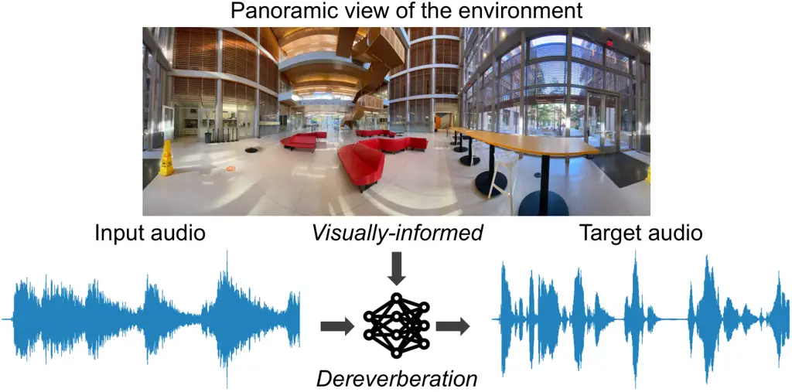
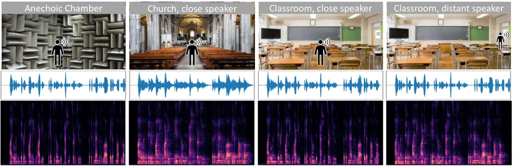
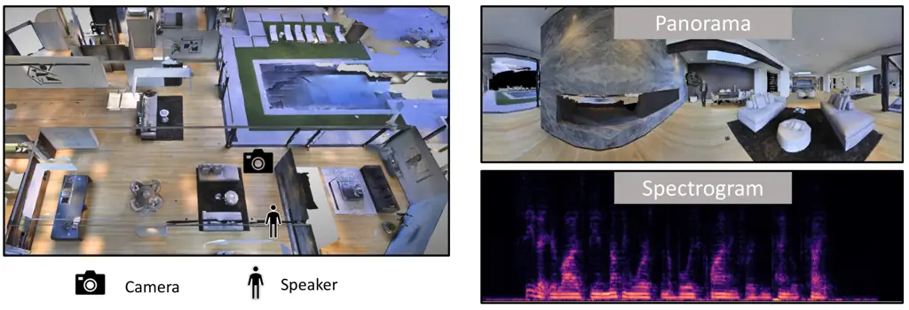
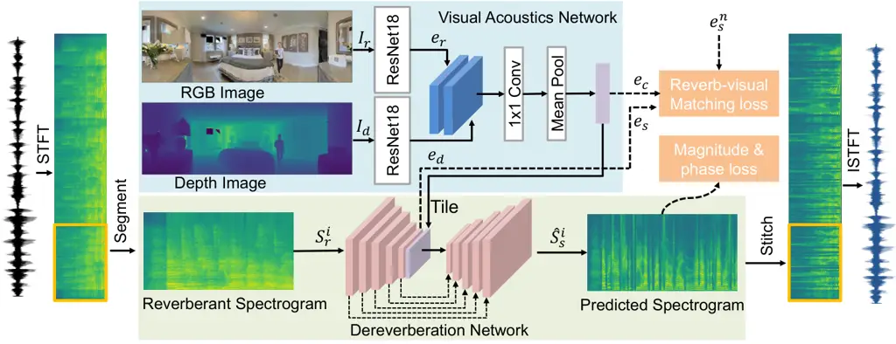
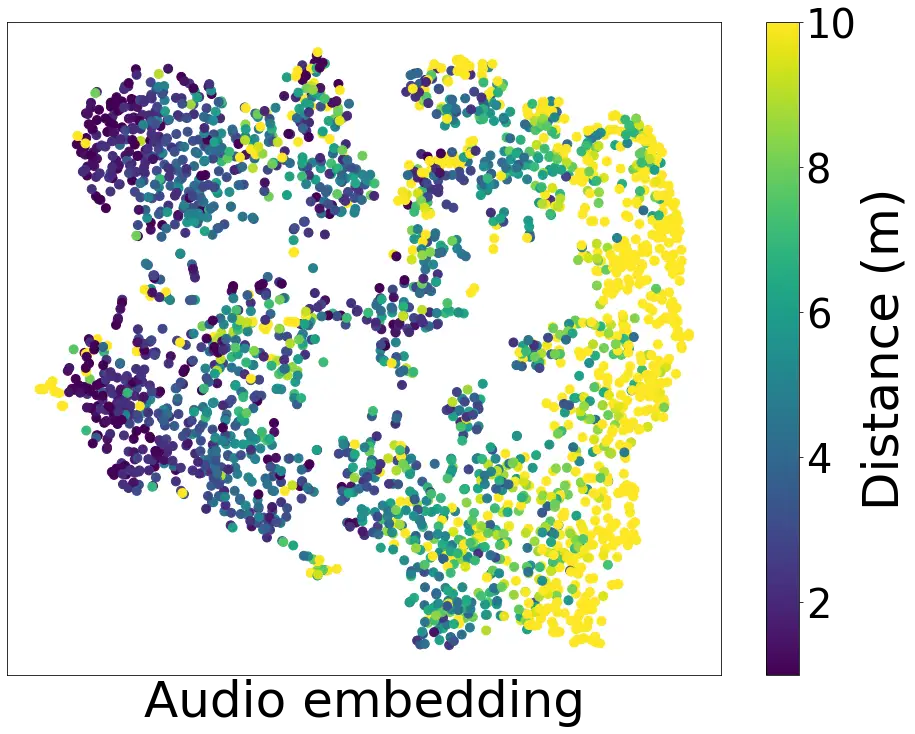
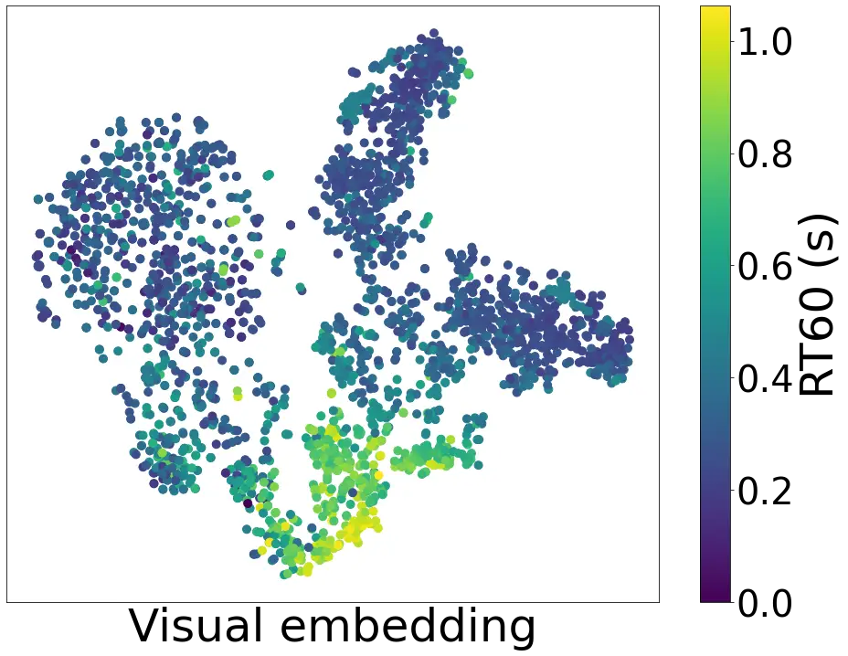
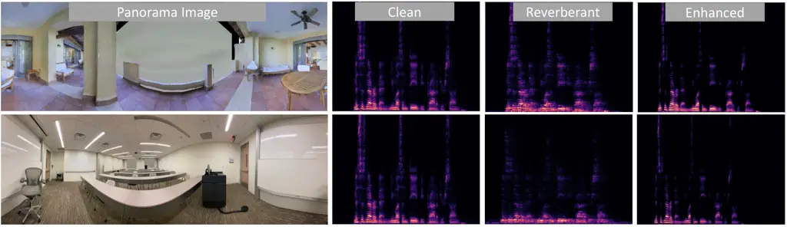

# Learning Audio-Visual Dereverberation

Changan Chen     Wei Sun     David Harwath     Kristen Grauman

###### Abstract

Reverberation not only degrades the quality of speech for human
perception, but also severely impacts the accuracy of automatic speech
recognition. Prior work attempts to remove reverberation based on the
audio modality only. Our idea is to learn to dereverberate speech from
audio-visual observations. The visual environment surrounding a human
speaker reveals important cues about the room geometry, materials, and
speaker location, all of which influence the precise reverberation
effects. We introduce Visually-Informed Dereverberation of Audio (VIDA),
an end-to-end approach that learns to remove reverberation based on both
the observed monaural sound and visual scene. In support of this new
task, we develop a large-scale dataset SoundSpaces-Speech that uses
realistic acoustic renderings of speech in real-world 3D scans of homes
offering a variety of room acoustics. Demonstrating our approach on both
simulated and real imagery for speech enhancement, speech recognition,
and speaker identification, we show it achieves state-of-the-art
performance and substantially improves over audio-only methods.

^(†)^(†)address: ¹UT Austin    ²FAIR, Meta AI

## 1 Introduction

Audio reverberation occurs when multiple reflections from surfaces and
objects in the environment build up then decay, altering the original
audio signal. While reverberation bestows a realistic sense of spatial
context, it also can degrade a listener’s experience. In particular, the
quality of human speech is greatly affected by reverberant
environments—as illustrated by how difficult it can be to parse the
words of a family member speaking loudly from another room in the house,
a tour guide describing the artwork down the hall of a magnificent
cavernous cathedral, or a colleague participating in a Zoom call from a
cafe. Consistent with the human perceptual experience, automatic speech
recognition (ASR) systems noticeably suffer when given reverberant
speech input \[1, 2, 3, 4, 5, 6\]. Thus there is great need for
intelligent _dereverberation_ algorithms that can strip away reverb
effects for speech enhancement, recognition, and other downstream tasks,
which could in turn benefit many applications in teleconferencing,
assistive hearing devices, augmented reality, and video indexing.

The audio community has made steady progress devising machine learning
solutions to tackle speech dereverberation \[6, 7, 8, 4, 9, 10, 11\].
The general approach is to take a reverberant speech signal, usually
represented with a Short-Time Fourier Transform (STFT) spectrogram, and
feed it as input to a model that estimates a clean version of the signal
with the reverberation removed. Past approaches have tackled this
problem with signal processing and statistical techniques \[12, 13\],
while many modern approaches are based on neural networks that learn a
mapping from reverberant to clean spectrograms \[4, 6, 14\]. To our
knowledge, all existing models for dereverberation rely purely on audio.
Unfortunately this often underconstrains the dereverberation task since
the latent parameters of the recording space are not discernible from
the audio alone.

However, we observe that in many practical settings of interest—video
conferencing, augmented reality, Web video indexing—reverberant audio is
naturally accompanied by a visual (video) stream. Importantly, the
visual stream offers valuable cues about the room acoustics affecting
reverberation: where are the walls, how are they shaped, where is the
human speaker, what is the layout of major furniture, what are the
room’s dominant materials (which affect absorption), and even what is
the facial appearance and/or body shape of the person speaking (since
body shape determines the acoustic properties of a person’s speech, and
reverb time is frequency dependent). For example, reverb is typically
stronger when the speaker is further away; speech is more reverberant in
a large church or hallway; heavy carpet absorbs more sound. See
Figure 2. While some recent works explore acoustic modeling using
images \[15, 16, 17, 18\], no prior work has investigated how to
leverage visual-acoustic cues for dereverberation.



Figure 1: The goal of audio-visual dereverberation is to leverage the
visual observation of the environment to improve speech enhancement.

Our idea is to learn to dereverberate speech from audio-visual
observations (Fig. 1) In this task, the input is reverberant speech and
visual observations of the environment surrounding the human speaker,
and the output is a prediction of the clean source audio. To tackle this
problem, there are two key technical challenges. First, how to model the
multi-modal dereverberation process in order to infer the latent clean
audio. Second, how to secure appropriate training data spanning a
variety of physical environments for which we can sample speech with
known ground truth (non-reverberant, anechoic) audio. The latter is also
non-trivial because ordinary audio/video recordings are themselves
corrupted by reverberation but lack the ground truth source signal we
wish to recover.

For the modeling challenge, we introduce an end-to-end approach called
Visually-Informed Dereverberation of Audio (VIDA). VIDA consists of a
Visual Acoustics Network (VAN) that learns reverberation properties of
the room geometry, object locations, and speaker position. Coupled with
a multi-modal UNet dereverberation module, it learns to remove the
reverberations from a single-channel audio stream. In addition, we
propose an audio-visual (AV) matching loss to enforce consistency
between the visually-inferred reverberation features and those inferred
from the audio signal. We leverage the outputs of our model for multiple
downstream tasks: speech enhancement, speech recognition, and speaker
identification.

Next, to address the training data challenge, we develop
SoundSpaces-Speech, a new large-scale audio-visual dataset based on
SoundSpaces \[19\], a 3D simulator for real-world scanned environments
that allows both visual and acoustic rendering. Our data approach
inserts “clean" audio voices together with a 3D humanoid model at
various positions within an array of indoor environments, then samples
the images and properly reverberating audio when placing the receiver
microphone and camera at other positions in the same house. This
strategy allows sampling realistic audio-visual instances coupled with
ground truth raw audio to train our model, and it has the added benefit
of allowing controlled studies that vary the parameters of the capture
setting. As we will show, the data also supports sim2real transfer for
applying our model to real audio-visual observations.

Our main contributions are to 1) present the task of audio-visual
dereverberation, 2) address it with a new multi-modal modeling approach
and a novel reverb-visual matching loss, 3) provide a benchmark
evaluation framework built on both SoundSpaces-Speech and real data, and 4) demonstrate the utility of AV dereverberation for multiple practical
tasks. We first train and evaluate our model on 82 large-scale
real-world environments—each a multi-room home containing a variety of
objects—coupled with speech samples from the LibriSpeech dataset \[20\].
We consider both near-field and far-field settings where the human
speaker is in-view or quite far from the camera, respectively. The
proposed model outperforms methods restricted to the audio stream, and
improves the state of the art for multiple tasks with speech
enhancement. We also show that our model trained in simulation can
transfer directly to real-world data. Overall, our work shows the
potential for speech enhancement models to benefit from seeing the 3D
environment.



Figure 2: Visual cues reveal key factors influencing reverb effects on
human speech audio. For example, these audio speech samples (depicted as
waveforms and spectrograms) are identical lexically, but have very
different reverberation properties owing to their differing
environments. In the church, reverb is strong, in the classroom it is
less, and when the speaker is distant from the camera it is again more
evident.

## 2 Related Work

Audio dereverberation and speech enhancement. Audio dereverberation and
speech enhancement have a long and rich literature \[21, 22, 13, 1,
23\]. While dereverberation can be done with microphone arrays, we focus
on single audio channel approaches, which require fewer assumptions
about the input data. Recent deep learning methods achieve promising
results to dereverberate \[4, 9, 10, 6, 2, 11\], denoise \[24, 14, 11\],
or separate \[25, 26\] the audio stream using audio input alone, and
such enhancements can improve downstream speech recognition \[27, 1\]
and speaker recognition \[8\]. Acoustic simulations can provide data
augmentation during training \[1, 4, 27, 2\]. Accounting for
environmental effects on reverb, some work targets “room-aware" deep
audio features capturing reverberation properties (e.g., RT60) \[7\], or
injects reverberation effects from a different room via acoustic
matching \[28\]. To our knowledge, the only prior work drawing on the
_visual_ stream to infer dereverberated audio is limited to using lip
regions on near-field faces to first separate out distractor
sounds \[29\], and does not model anything about the visual scene for
dereverberation purposes. In contrast, our model accounts for the full
visual scene, far-field speech sources, and even out-of-view speakers.
Our approach is the first to learn visual room acoustics for
dereverberation, and it yields state-of-the-art results with direct
benefits for multiple downstream tasks.

Visual-acoustic learning. The room impulse response (RIR) is the
transfer function capturing the room acoustics for arbitrary source
stimuli; once convolved with a sound waveform, it produces the sound of
that source in the context of the particular physical space. While
traditionally measured with specialized equipment in the room
itself \[30, 31\] or else simulated with sound propagation models (e.g.,
geometric \[32, 19\] or wave-based  \[33\]), recent work explores
estimating an RIR from an input image using CNNs \[34\] or conditional
GANs \[35\] in order to simulate reverberant sound for a given
environment. Video-based methods have also explored ways to lift
monaural audio into its spatialized (binaural, ambisonic) counterpart in
order to create an immersive audio experience for human listeners \[36,
37, 38\]. Such methods share our interest in learning visual properties
of a scene that influence the audio channel. However, unlike any of the
above methods, rather than generate spatialized audio to benefit human
listeners in augmented or virtual reality, our goal is to dereverberate
audio—removing the effects of the room acoustics— to benefit automatic
speech analysis. In addition, prior methods use imagery taken at camera
positions at an unknown offset from the microphone, i.e., conflating all
RIRs for a scene with one image, which limits them to a coarse
characterization of the environment \[39, 40, 41\]. In contrast, our
data and model align the camera and microphone to capture novel
fine-grained audio-visual properties, including the human speaker’s
location with respect to the microphone when the speaker is in view.

Audio-visual simulations. Recent work in embodied AI explores how vision
and sound together can help agents move intelligently in 3D
environments. Driven in part by new tools for audio-visual (AV)
simulations in realistic scanned environments \[19, 42\], new research
develops deep reinforcement learning approaches to train agents to
navigate to sounding objects \[19, 43, 44, 45\], explore unmapped
environments \[46\], or move around to better separate multiple
overlapping sounds in a house \[47\]. Our work also leverages
state-of-the-art AV simulations for learning, but our objective and
models are entirely different. Rather than train virtual robots to move
intelligently, our aim is to clean reverberant audio for better speech
analysis.

Audio-visual learning from video. Multi-modal video understanding has
experienced a resurgence of work in the vision, audio, and machine
learning literature in recent years. This includes exciting advances in
self-supervised cross-modal feature learning from video \[48, 49, 50,
51\], localizing objects in video with both sight and sound \[52\], and
audio-visual source separation \[53, 54, 55, 56, 57, 58\]. None of these
methods address speech deverberation.

## 3 The Audio-Visual Dereverberation Task

We introduce the novel task of audio-visual dereverberation. In this
task, a speaker (or other sound source) and a listener are situated in a
3D environment, such as the interior of a house. The speaker—whose
location is unknown to the listener—produces a speech waveform
$`A_{s}`$. A superposition of the direct sound and the reverb is
captured by the listener, denoted $`A_{r}`$. The reverberant speech
$`A_{r}`$ can be modeled as the convolution of the anechoic source
waveform $`A_{s}`$ with the room impulse response (RIR) $`R`$, i.e.
$`A_{r}(t)=A_{s}(t)*R(t)`$ \[21\]. $`R`$ is a function of the
environment’s geometry, the materials that make up the environment, and
the relative positioning of the speaker and the listener. It is possible
in principle to measure the RIR $`R`$ for a real-world environment, but
doing so can be impractical when the source and listener are able to
move around or must cope with different environments. Furthermore, in
the common scenario where we want to process video captured in
environments to which we have no physical access, measuring the RIR is
simply impossible.

Crucially to our task, we consider an alternative source of information
about the environment: vision. We assume the listener has an RGB-D
observation of its surroundings, obtained from a RGB-D camera or an RGB
camera coupled with single-image depth estimation \[59, 60\].
Intuitively, we should be able to leverage the information about the
environment’s geometry and material composition that is implicit in the
visual stream—as well as the location of the speaker (if visible)—to
estimate its reverberant characteristics. We anticipate that these cues
can inform an estimate of the room acoustics, and thus the clean source
waveform. Given the RGB $`I_{r}`$ and depth image $`I_{d}`$ captured by
the listener from its current vantage point, the task is to predict the
source waveform $`A_{s}`$ from the images and reverberant audio:
$`\hat{A}_{s}(t)=f_{p}([I_{r},I_{d},A_{r}(t)])`$. This setting
represents common real-world scenarios previously discussed, and poses
new challenges for speech enhancement and recognition.

## 4 Dataset Curation

For the proposed task, obtaining the right training data is itself a
challenge. Existing video data contains reverberant audio but lacks the
ground truth anechoic audio signal, and existing RIR datasets \[39, 40,
41\] do not have images paired with the microphone position. We
introduce both real and simulated datasets to enable reproducible
research on audio-visual deverberation.

3D environments and acoustic simulator. First we introduce a large-scale
dataset in which we couple real-world visual environments with
state-of-the-art audio simulations accurately capturing the
environments’ spatial effects on real samples of recorded speech. We
want our dataset to allow control of a variety of physical environments,
the positions of the listener/camera and sources, and the speech content
of the sources—all while maintaining both the observed reverberant
$`A_{r}(t)`$ and ground truth anechoic $`A_{s}(t)`$ sounds. To this end,
we leverage the audio-visual simulator SoundSpaces \[19\], which
provides precomputed RIRs $`R(t)`$ on a uniform grid of resolution 1 m
for the real-world environment scans in Replica \[61\] and
Matterport3D \[62\]. We use 82 Matterport environments due to their
greater scale and complexity; each environment has multiple rooms
spanning on average 517 m².



Figure 3: Audio-visual rendering for a Matterport environment. Left:
bird’s-eye view of the 3D environment. Right: panorama image rendered at
the camera location and the corresponding received spectrogram.

SoundSpaces-Speech. We extend SoundSpaces to construct reverberant
speech. As the source speech corpus we use LibriSpeech \[20\], which
contains 1,000 hours of 16kHz read English speech from audio books, and
is widely used in the speech recognition literature. We train our models
with the train-clean-360 split, and use the dev-clean and test-clean
sets for validation and test splits, respectively. Note that these
splits have non-overlapping speaker identities. Similarly, we use the
standard disjoint train/val/test splits for the Matterport 3D visual
environments \[19\]. Thus, neither the houses nor speaker voices
observed at test time are ever observed during training.

For each source utterance, we randomly sample a source-receiver location
pair in a random environment, then convolve the speech waveform
$`A_{s}(t)`$ with the associated SoundSpaces RIR $`R(t)`$ to obtain the
reverberant $`A_{r}(t)`$. To augment the visual scene, we insert a 3D
humanoid of the same gender as the real speaker at the speaker location
and render RGB and depth images at the listener location. We consider
two types of image: panorama and normal field of view (FoV). For the
panorama image, we stitch 18 images each having a horizontal FoV of 20
degrees, for a full image resolution of $`192\times 756`$. For the
normal FoV, we render images with a 80 degree FoV, at a resolution of
$`384\times 256`$. While the panorama gives a fuller view of the
environment and thus should allow the model to better estimate the room
acoustics, the normal FoV is more common in existing video and thus will
facilitate our model’s transfer to real data. See Fig. 3. We generate
49,430/2,700/2,600 such samples for the train/val/test splits,
respectively. See Supp. materials for examples and details.

Real data collection. To explore whether models trained in simulation
can also work in the real world, we also collect a set of real images
and speech recordings while preserving the ground truth anechoic audio.

To collect image data, we use an iPhone 11 camera to capture a panoramic
RGB image and a monocular depth estimation algorithm \[60\] to generate
the corresponding depth image.

To record the audio, we use a ZYLIA ZM-1 microphone. We place both the
camera and microphone at the same height (1.5m) as the SoundSpaces RIRs.
For the source speech, we play utterances from the LibriSpeech test set
through a loudspeaker held by a person facing the camera. We collect
data from varying environments, including auditoriums, meeting rooms,
atriums, corridors, and classrooms. For each environment, we vary the
speaker location from near-field to mid-field to far-field. For each
location, we play around 10 utterances. During data collection, the
microphone also records ambient sounds like people chatting, door
opening, AC humming, etc. In total, we collect 200 recordings. Code and
data are available at
[https://github.com/facebookresearch/learning-audio-visual-dereverberation](https://github.com/facebookresearch/learning-audio-visual-dereverberation).



Figure 4: VIDA model architecture. We convert the input speech to a
spectrogram and use overlapping sliding windows to obtain 2.56 second
segments. For visual inputs, we use separate ResNet18 networks to
extract features $`e_{r}`$ and $`e_{d}`$, which are fused to obtain
$`e_{c}`$. We feed the spectrogram segment $`S_{r}^{i}`$ to a UNet
encoder, tile and concatenate $`e_{c}`$ with the encoder’s output, then
use the UNet decoder to predict the clean spectrogram
$`\hat{S}_{s}^{i}`$. During inference, we stitch the predicted
spectrogams back into a full spectrogram and use Griffin-Lim \[63\] to
reconstruct the output dereverberated waveform.

## 5 Approach

We propose the Visually-Informed Dereverberation of Audio (VIDA) model,
which leverages visual cues to learn representations of the
environmental acoustics and sound source locations to dereverberate
audio. While our model is agnostic to the audio source type, we focus on
speech due to the importance of dereverberating speech for downstream
analysis. VIDA consists of two main components (Figure 4): 1) a Visual
Acoustics Network (VAN), which learns to map RGB-D images of the
environment to features useful for dereverberation, and 2) the
dereverberation module itself, which is based on a UNet encoder-decoder
architecture. The UNet encoder takes as input a reverberant spectrogram,
while the decoder takes the encoder’s output along with the visual
dereverberation features produced by the VAN and reconstructs a
dereverberated version of the audio.

Visual Acoustics Network. Visual observations of a scene reveal
information about room acoustics, including room geometry, materials,
object locations, and the speaker position. We devise the VAN to capture
all these cues into a latent embedding vector, which is subsequently
used to remove reverb. This network takes as its input an RGB image
$`I_{r}`$ and a depth image $`I_{d}`$, captured from the listener’s
current position within the environment. The depth image contains
information about the geometry of the environment and arrangement of
objects, while the RGB image contains more information about their
material composition. To better model these different information
sources, we use two separate ResNet18 \[64\] networks to extract their
features, i.e. $`e_{r}=f_{r}(I_{r})`$ and $`e_{d}=f_{d}(I_{d})`$. We
concatenate $`e_{r}`$ and $`e_{d}`$ channel-wise and feed the result to
a 1x1 convolution layer $`f_{c}(\cdot)`$ to reduce the number of total
channels to 512 followed by a subsequent pooling layer $`f_{l}(\cdot)`$
to reduce the spatial dimension, resulting in the output vector
$`e_{c}=f_{l}(f_{c}([e_{r};e_{d}]))`$.

Dereverberation Network. To recover the clean speech audio, we use the
UNet \[65\] architecture, a fully convolutional network often used for
image segmentation. We first use the Short-Time Fourier Transform (STFT)
to convert the reverberant input audio $`A_{r}`$ to a complex
spectrogram $`S_{r}`$. We treat $`S_{r}`$ as a 2-dimensional, 2-channel
image, where the horizontal dimension represents time, the vertical
dimension represents frequency, and the two channels represent the
log-magnitude and phase angle. Our UNet takes spectrograms of a fixed
size of $`256\times 256`$ as input, but in general the duration of the
speech audio we wish to dereverberate will be variable. Therefore, the
model processes the full input spectrogram using a series of
overlapping, sliding windows. Specifically, we segment the spectrogram
along the time dimension into a sequence of fixed-size chunks
$`S_{r}^{seg}=\{S_{r}^{1},S_{r}^{2},...,S_{r}^{n}\}`$ using a sliding
window of length $`s`$ frames and 50% overlap between consecutive
windows to avoid boundary artifacts. To derive the ground-truth target
spectrograms used in training, we perform the exact same segmentation
operation on the clean source audio $`A_{s}`$ to obtain
$`S_{s}^{seg}=\{S_{s}^{1},S_{s}^{2},...,S_{s}^{n}\}`$.

During training, when a particular waveform $`S_{r}`$ is selected for
inclusion in a data batch, we randomly sample one of its segments
$`S_{r}^{i}`$ to be the input to the model, and choose the corresponding
$`S_{s}^{i}`$ as the target. We first compute the output of the VAN,
$`e_{c}`$, for the environment image associated with $`S_{r}`$. Next,
$`S_{r}^{i}`$ is fed to the UNet’s encoder to extract the intermediate
feature map $`e_{s}=f_{enc}(S_{r}^{i})`$. We then spatially tile and
concatenate $`e_{c}`$ channel-wise with $`e_{s}`$, and feed the fused
features to the UNet decoder, which predicts the source spectrogram
segment $`\hat{S}_{s}^{i}=f_{dec}([e_{s},e_{c}])`$.

Spectrogram prediction loss. The primary loss function we use to train
our model is the Mean-Squared Error (MSE) between the predicted and
ground-truth spectrograms, treating the magnitude and phase separately.
For a given predicted spectrogram segment $`\hat{S}_{s}^{i}`$, let
$`\hat{M}_{s}^{i}`$ denote the predicted log-magnitude spectrogram,
$`\hat{P}_{s}^{i}`$ denote the predicted phase spectrogram, and
$`M_{s}^{i}`$ and $`P_{s}^{i}`$ denote the respective ground-truth
magnitude and phase spectrograms. We define the magnitude loss as:

```math
L_{magnitude}=||M_{s}^{i}-\hat{M}_{s}^{i}||_{2}.
```

To address the issue of phase wraparound, we map the phase angle to its
corresponding rectangular coordinates on the unit circle and then
compute the loss for the phase:

```math
L_{phase}=||\sin(P_{s}^{i})-\sin(\hat{P}_{s}^{i})||_{2}+||\cos(P_{s}^{i})-\cos(\hat{P}_{s}^{i})||_{2}.
```

Reverb-visual matching loss. To reinforce the consistency between the
visually-inferred room acoustics and the reverberation characteristics
learned by the UNet encoder, we also employ a contrastive reverb-visual
matching loss:

```math
L_{matching}(e_{c},e_{s},e_{s}^{n})=\max\{d(f_{n}(e_{c}),f_{n}(e_{s}))\\
-d(f_{n}(e_{c}),f_{n}(e_{s}^{n}))+m,0\}.
```

Here, $`d(x,y)`$ represents L2 distance, $`f_{n}(\cdot)`$ applies L2
normalization, $`m`$ is a margin, and $`e_{s}^{n}`$ is a different
speech embedding sampled from the same data batch. This loss forces the
embeddings output by the VAN and the UNet encoder to be consistent,
which we empirically show to be beneficial.

Training. Our overall training objective (for a single training example)
is as follows:

```math
L_{total}=L_{magnitude}+\lambda_{1}L_{phase}+\lambda_{2}L_{matching},
```

where $`\lambda_{1}`$ and $`\lambda_{2}`$ are weighting factors for the
phase and matching losses. To augment the data, we further choose to
rotate the image view for a random angle for each input during training.
This is possible because our audio recording is omni-directional and is
independent of camera pose. This data augmentation strategy prevents the
model from overfitting; without it our model fails to converge. It
creates a one-to-many mapping between reverb and views, forcing the
model to learn a viewpoint-invariant representation of the room
acoustics.

Testing. At test time, we wish to re-synthesize the entire clean
waveform instead of a single fixed-length segment. In this case, we feed
all of the segments for a waveform $`S_{r}`$ into the model and
temporally concatenate all of the output segments. Because consecutive
segments overlap by 50%, during the concatenation step we only retain
the middle 50% of the frames from each segment and discard the rest.
Finally, to re-synthesize the waveform we use the Griffin-Lim
algorithm \[63\] to iteratively improve the predicted phase for 30
iterations, which we find works better than directly using the predicted
phase or using Griffin-Lim with a randomly initialized phase.

## 6 Experiments

We evaluate our model by dereverberating speech for three downstream
tasks: speech enhancement (SE), automatic speech recognition (ASR), and
speaker verification (SV). We evaluate using both real scanned
Matterport3D environments with simulated audio as well as real-world
data collected with a camera and mic. Please see Supp. for all
hyperparameter settings and data preprocessing details.

Evaluation tasks and metrics. We report the standard metrics Perceptual
Evaluation of Speech Quality (PESQ)  \[66\], Word Error Rate (WER), and
Equal Error Rate (EER) for the three tasks, respectively. For ASR and
SV, we use pretrained models from the SpeechBrain \[67\] toolkit. We
evaluate these models off-the-shelf on our (de)reverberated version of
the LibriSpeech test-clean set, and also explore finetuning the model on
the (de)reverberated LibriSpeech train-clean-360 data to ensure all
models have exposure to reverberant speech when training. For speaker
verification, we construct a set of 80k sampled utterance pairs
consisting of different rooms, mic placements, and genders to account
for session variability, similar to \[68\]. Please see Supp. for more
details.

Baseline models. In addition to evaluating the the clean and reverberant
audio (with no enhancement), we compare against multiple baseline
dereverberation models:

1.  1.  MetricGAN+ \[69\]: a recently proposed state-of-the-art model for
        speech enhancement; we use the public implementation from
        SpeechBrain \[67\], trained on our dataset. Following the original
        paper, we optimize for PESQ during training, then choose the
        best-performing model snapshot (on the validation data) specific to
        each of our downstream tasks.
2.  2.  HiFi-GAN \[11\]: a recent model for denoising and dereverberation.
        We use this implementation:
        [https://github.com/rishikksh20/hifigan-denoiser](https://github.com/rishikksh20/hifigan-denoiser).
3.  3.  WPE \[12\]: A statistical speech dereverberation model that is
        commonly used for comparison.

We emphasize that all baselines are audio-only models, as opposed to our
proposed audio-visual model. Our multimodal dereverberation technique
could extend to work in conjunction with other newly-proposed audio-only
models, i.e., ongoing architecture advances are orthogonal to our idea.

|                        |      |      |      |      |      |
| ---------------------- | ---- | ---- | ---- | ---- | ---- |
|                        | SE   | ASR  |      | SV   |      |
|                        | PESQ | WER  | FT   | EER  | FT   |
| Anechoic (Upper bound) | 4.64 | 2.50 | 2.50 | 1.62 | 1.62 |
| Reverberant            | 1.54 | 8.86 | 4.62 | 4.69 | 4.57 |
| MetricGAN+ \[69\]      | 2.33 | 7.49 | 4.86 | 4.67 | 2.75 |
| HiFi-GAN \[11\]        | 1.83 | 9.31 | 5.59 | 4.30 | 2.49 |
| WPE \[12\]             | 1.63 | 8.18 | 4.30 | 5.19 | 4.48 |
| VIDA w/o VAN           | 2.32 | 4.92 | 3.76 | 4.67 | 2.61 |
| VIDA w/ normal FoV     | 2.33 | 4.85 | 3.73 | 4.53 | 2.79 |
| VIDA w/o matching loss | 2.38 | 4.59 | 3.72 | 4.02 | 2.62 |
| VIDA w/o human mesh    | 2.31 | 4.57 | 3.72 | 4.00 | 2.52 |
| VIDA w/ random image   | 2.34 | 4.94 | 3.82 | 4.70 | 2.48 |
| VIDA                   | 2.37 | 4.44 | 3.66 | 3.97 | 2.40 |

Table 1: Results on LibriSpeech test-clean set that is reverberated with
our environmental simulator (with the exception of the “Anechoic (Upper
bound)” setting, which is evaluated on the original audio). FT refers to
tests where the models are finetuned with the audio-enhanced data.

Results on SoundSpaces-Speech. Table 1 shows the results for all models
on SE, ASR, and SV. First, since existing methods report results on
anechoic audio, we note the pretrained SpeechBrain model applied to
anechoic audio (first row) yields errors competitive with the
SoTA \[70\], meaning we have a solid experimental testbed. Comparing the
results on anechoic vs. reverberated speech, we see that reverberation
significantly degrades performance on all tasks. Our VIDA model
outperforms all other models, and by a large margin on the ASR and SV
tasks. The results are statistically significant according to a paired
t-test. After finetuning the ASR model, the gain is still largely
preserved at 0.64% WER (14.88% relative), although it is important to
note that finetuning downstream models on enhanced speech is not always
feasible, e.g., if using off-the-shelf ASR. Our results demonstrate that
learning the acoustic properties from visual signals is very helpful for
dereverberating speech, enabling the model to leverage information
unavailable in the audio alone.

Ablations. To study how much VIDA leverages visual signals, we ablate
the visual network VAN (audio-only). Table 1 shows the results. All
performance degrades significantly, showing that visual acoustic
features are helpful for dereveberation. To understand how well VIDA
works with a normal field-of-view (FoV) camera, we replace the panorama
image input with a FoV of 80 degrees randomly sampled from the current
view. All metrics drop compared to using a panorama, as expected.
Compared to the audio-only ablation, however, VIDA still performs
better; even a partial view of the environment helps the model
understand the scene and dereverberate the audio. Next, we ablate the
proposed reverb-visual matching loss (“w/o matching loss"). Without it,
VIDA’s performance declines on all metrics. This shows by forcing the
visual feature to agree with the reverberation feature, our model learns
a better representation of room acoustics. To examine how much the model
leverages the human speaker cues and uses the visual scene, we evaluate
VIDA on the same test data but with the 3D humanoid removed (“w/o human
mesh") or train VIDA with random images (“w/ random image") and
re-evaluate. All three metrics become worse. This shows our model pays
attention to both the presence of the human speaker and the scene
geometry to better anticipate reverberation.

|                        |      |       |      |
| ---------------------- | ---- | ----- | ---- |
|                        | SE   | ASR   | SV   |
|                        | PESQ | WER   | EER  |
| Anechoic (Upper bound) | 4.64 | 2.52  | 1.42 |
| Reverberant            | 1.22 | 18.39 | 3.91 |
| MetricGAN+ \[69\]      | 1.62 | 21.42 | 5.70 |
| HiFi-GAN \[11\]        | 1.33 | 24.05 | 5.21 |
| VIDA w/o VAN           | 1.41 | 15.18 | 4.24 |
| VIDA w/ normal FoV     | 1.44 | 14.71 | 3.79 |
| VIDA                   | 1.49 | 13.02 | 3.75 |

Table 2: Results on real data demonstrating sim2real transfer.

|            | Atrium      | Conf. Room | Classroom | Corridor    |
| ---------- | ----------- | ---------- | --------- | ----------- |
| Near-field | 14.1 / 9.0  | 5.0 / 6.5  | 6.1 / 5.3 | 2.2 / 1.8   |
| Mid-field  | 21.8 / 18.9 | 7.7 / 7.7  | 2.6 / 1.5 | 7.3 / 4.4   |
| Far-field  | 52.4 / 50.5 | 22.0 / 6.7 | 5.9 / 6.8 | 25.2 / 21.1 |

Table 3: Breakdown of word error rate (WER) for VIDA without and with
VAN on real test data.

Results on real data. Next, we deploy our model in the real world. We
use all models trained in simulation to dereverberate the real-world
dataset (cf. Sec. 4) before using the finetuned ASR/SV models to
evaluate the enhanced speech. Table 2 shows the results of all models on
real data. Reverberation does more damage to the WER compared to in
simulation. Although MetricGAN+ \[69\] has better PESQ, it has a weak
WER score. Our VIDA model again outperforms all baselines on ASR and SV.
This demonstrates the realism of the simulation and the capability of
our model to transfer to real-world data, a promising step for VIDA’s
wider applicability.

Table 3 breaks down the ASR performance for VIDA without and with VAN by
environment type and speaker distance. The atrium is quite reverberant
due to the large space. The conference room and the classroom have
smaller sizes and are comparatively less reverberant. The corridor only
becomes reverberant when the speaker is far away. VIDA outperforms VIDA
w/o VAN in most cases, especially in highly reverberant ones.



(a) Audio t-SNE



(b) Visual t-SNE

Figure 5: t-SNE of audio and visual features colored by the distance to
the speaker (c) and RT60 (d).

Analyzing learned features. Figure 5(a) and 5(b) analyze our model’s
learned audio and visual features via 2D t-SNE projections \[71\]. For
each sample, we color the point according to either (c) the ground truth
distance between the camera/microphone and the human speaker or (d) the
reverberation time for the audio signal to decay by 60 dB (known as the
RT60). Neither of these variables are available to our model during
training, yet when learning to perform deverberation, our model exposes
these high-level properties relevant to the audio-visual task.
Consistent with the quantitative results above, this analysis shows how
our model captures elements of the visual scene, room geometry, and
speaker location that are valuable to proper dereverberation.

Qualitative examples. Figure 6 shows a simulated and real-world example.
As we can see, the reverberant spectrogram is much blurrier compared to
the clean spectrogram, while our predicted spectrogram removes those
reverberations by leveraging the visual cues of room acoustics.



Figure 6: Example input images, clean spectrograms, reverberant
spectograms and spectrograms dereverberated by VIDA (top is from a scan,
bottom is a real pano). The speaker is out of view in the first case and
distant in the second case (back of the classroom). Though both received
audio inputs are quite reverberant, our model successfully removes the
reverb and restores the clean source speech.

## 7 Conclusion

We introduced the novel task of audio-visual dereverberation. The
proposed VIDA approach learns to remove reverb by attending to both the
audio and visual streams, recovering valuable signals about room
geometry, materials, and speaker locations from visual encodings of the
environment. In support of this task, we develop a large-scale dataset
providing realistic, spatially registered observations of speech and 3D
environments. VIDA successfully dereverberates novel voices in novel
environments more accurately than an array of baselines, improving
multiple downstream tasks. In future work, we will explore temporal
models for dereverberation with real-world video.

Acknowledgements: UT Austin is supported in part by the IFML NSF AI
Institute and NSF CCRI. KG is paid as a researcher at Meta.

## References

- \[1\] Keisuke Kinoshita, Marc Delcroix, Sharon Gannot, Emanuël Habets,
  Reinhold Haeb-Umbach, Walter Kellermann, Volker Leutnant, Roland Maas,
  Tomohiro Nakatani, Bhiksha Raj, Armin Sehr, and Takuya Yoshioka, “A
  summary of the reverb challenge: State-of-the-art and remaining
  challenges in reverberant speech processing research,” EURASIP Journal
  on Advances in Signal Processing, 2016.
- \[2\] Yan Zhao, DeLiang Wang, Buye Xu, and Tao Zhang, “Monaural speech
  dereverberation using temporal convolutional networks with self
  attention,” 2020.
- \[3\] Igor Szöke, Miroslav Skácel, Ladislav Mošner, Jakub Paliesek,
  and Jan Černocký, “Building and evaluation of a real room impulse
  response dataset,” IEEE Journal of Selected Topics in Signal
  Processing, 2019.
- \[4\] Kun Han, Yuxuan Wang, DeLiang Wang, William S. Woods, Ivo Merks,
  and Tao Zhang, “Learning spectral mapping for speech dereverberation
  and denoising,” in IEEE Trans Audio Speech Lang Process, 2015.
- \[5\] Bo Wu, Kehuang Li, Fengpei Ge, Zhen Huang, Minglei Yang,
  Sabato Marco Siniscalchi, and Chin-Hui Lee, “An end-to-end deep
  learning approach to simultaneous speech dereverberation and acoustic
  modeling for robust speech recognition,” in IEEE Journal of Selected
  Topics in Signal Processing, 2017.
- \[6\] Ori Ernst, Shlomo E. Chazan, Sharon Gannot, and Jacob
  Goldberger, “Speech dereverberation using fully convolutional
  networks,” in 2018 26th European Signal Processing Conference
  (EUSIPCO), 2018.
- \[7\] “Improving speech recognition in reverberation using a
  room-aware deep neural network and multi-task learning,” in 2015 IEEE
  International Conference on Acoustics, Speech and Signal Processing
  (ICASSP).
- \[8\] David Snyder, Daniel Garcia-Romero, Gregory Sell, Daniel Povey,
  and Sanjeev Khudanpur, “X-vectors: Robust DNN embeddings for speaker
  recognition,” in 2018 IEEE International Conference on Acoustics,
  Speech and Signal Processing (ICASSP). IEEE, 2018, pp. 5329–5333.
- \[9\] Bo Wu, Kehuang Li, Minglei Yang, and Chin-Hui Lee, “A
  reverberation-time-aware approach to speech dereverberation based on
  deep neural networks,” in IEEE Trans Audio Speech Lang Process, 2016.
- \[10\] Yan Zhao, Zhong-Qiu Wang, and DeLiang Wang, “Two-stage deep
  learning for noisy-reverberant speech enhancement,” IEEE Trans Audio
  Speech Lang Process, 2019.
- \[11\] Jiaqi Su, Zeyu Jin, and Adam Finkelstein, “HiFi-GAN:
  High-fidelity denoising and dereverberation based on speech deep
  features in adversarial networks,” in INTERSPEECH, 2020.
- \[12\] Tomohiro Nakatani, Takuya Yoshioka, Keisuke Kinoshita, Masato
  Miyoshi, and Biing-Hwang Juang, “Speech dereverberation based on
  variance-normalized delayed linear prediction,” in IEEE Transactions
  on Audio, Speech, and Language Processing, 2010.
- \[13\] Patrick A. Naylor and Nikolay D. Gaubitch, Speech
  Dereverberation, Springer Publishing Company, Incorporated, 1st
  edition, 2010.
- \[14\] Szu-Wei Fu, Chien-Feng Liao, Yu Tsao, and Shou-De Lin,
  “MetricGAN: Generative adversarial networks based black-box metric
  scores optimization for speech enhancement,” in ICML, 2019.
- \[15\] Sagnik Majumder, Changan Chen, Ziad Al-Halah, and Kristen
  Grauman, “Few-shot audio-visual learning of environment acoustics,” in
  NeurIPS, 2022.
- \[16\] Changan Chen, Ruohan Gao, Paul Calamia, and Kristen Grauman,
  “Visual acoustic matching,” in CVPR, 2022.
- \[17\] Andrew Luo, Yilun Du, Michael J Tarr, Joshua B Tenenbaum,
  Antonio Torralba, and Chuang Gan, “Learning neural acoustic fields,”
  in NeurIPS, 2022.
- \[18\] Hansung Kim, Luca Remaggi, Sam Fowler, Philip JB Jackson, and
  Adrian Hilton, “Acoustic room modelling using 360 stereo cameras,”
  IEEE Transactions on Multimedia, 2020.
- \[19\] Changan Chen, Unnat Jain, Carl Schissler, Sebastia
  Vicenc Amengual Gari, Ziad Al-Halah, Vamsi Krishna Ithapu, Philip
  Robinson, and Kristen Grauman, “SoundSpaces: Audio-visual navigation
  in 3d environments,” in ECCV, 2020.
- \[20\] Vassil Panayotov, Guoguo Chen, Daniel Povey, and Sanjeev
  Khudanpur, “Librispeech: an asr corpus based on public domain audio
  books,” in 2015 IEEE international conference on acoustics, speech and
  signal processing (ICASSP). IEEE, 2015, pp. 5206–5210.
- \[21\] Stephen T. Neely and Jont B. Allen, “Invertibility of a room
  impulse response,” in Journal of the Acoustical Society of
  America, 1979.
- \[22\] M. Miyoshi and Y. Kaneda, “Inverse filtering of room
  acoustics,” IEEE Transactions on Acoustics, Speech, and Signal
  Processing, 1988.
- \[23\] Jacob Benesty, Shoji Makino, and Jingdong Chen, Speech
  Enhancement, Springer Publishing Company, Incorporated, 1st
  edition, 2010.
- \[24\] Ruilin Xu, Rundi Wu, Yuko Ishiwaka, Carl Vondrick, and Changxi
  Zheng, “Listening to sounds of silence for speech denoising,” in
  NeurIPS, 2019.
- \[25\] John R Hershey, Zhuo Chen, Jonathan Le Roux, and Shinji
  Watanabe, “Deep clustering: Discriminative embeddings for segmentation
  and separation,” in ICASSP, 2016.
- \[26\] Daniel Stoller, Sebastian Ewert, and Simon Dixon, “Adversarial
  semi-supervised audio source separation applied to singing voice
  extraction,” in ICASSP, 2018.
- \[27\] Tom Ko, Vijayaditya Peddinti, Daniel Povey, Michael L Seltzer,
  and Sanjeev Khudanpur, “A study on data augmentation of reverberant
  speech for robust speech recognition,” in 2017 IEEE International
  Conference on Acoustics, Speech and Signal Processing (ICASSP). IEEE,
  2017, pp. 5220–5224.
- \[28\] Jiaqi Su, Zeyu Jin, and Adam Finkelstein, “Acoustic matching by
  embedding impulse responses,” in ICASSP 2020-2020 IEEE International
  Conference on Acoustics, Speech and Signal Processing (ICASSP). IEEE,
  2020, pp. 426–430.
- \[29\] Ke Tan, Yong Xu, Shi-Xiong Zhang, Meng Yu, and Dong Yu,
  “Audio-visual speech separation and dereverberation with a two-stage
  multimodal network,” in IEEE Journal of Selected Topics in Signal
  Processing, 2020.
- \[30\] Guy-Bart Stan, Jean-Jacques Embrechts, and Dominique
  Archambeau, “Comparison of different impulse response measurement
  techniques,” journal of the audio engineering society, vol. 50, no. 4,
  pp. 249–262, april 2002.
- \[31\] Martin Holters, Tobias Corbach, and Udo Zölzer, “Impulse
  response measurement techniques and their applicability in the real
  world,” in Proceedings of the 12th International Conference on Digital
  Audio Effects, DAFx 2009, 2009.
- \[32\] Jont B. Allen and David A. Berkley, “Image method for
  efficiently simulating small-room acoustics,” The Journal of the
  Acoustical Society of America, vol. 65, no. 4, pp. 943–950, 1979.
- \[33\] D.T. Murphy, Antti Kelloniemi, Jack Mullen, and Simon Shelley,
  “Acoustic modeling using the digital waveguide mesh,” Signal
  Processing Magazine, IEEE, vol. 24, pp. 55 – 66, 04 2007.
- \[34\] Homare Kon and Hideki Koike, “Estimation of late reverberation
  characteristics from a single two-dimensional environmental image
  using convolutional neural networks,” in Journal of the Audio
  Engineering Society, 2019.
- \[35\] Nikhil Singh, Jeff Mentch, Jerry Ng, Matthew Beveridge, and
  Iddo Drori, “Image2reverb: Cross-modal reverb impulse response
  synthesis,” arXiv preprint arXiv:2103.14201, 2021.
- \[36\] Pedro Morgado, Nono Vasconcelos, Timothy Langlois, and Oliver
  Wang, “Self-supervised generation of spatial audio for 360 video,” in
  NeurIPS, 2018.
- \[37\] Ruohan Gao and Kristen Grauman, “2.5d visual sound,” in
  CVPR, 2019.
- \[38\] Dingzeyu Li, Timothy R Langlois, and Changxi Zheng,
  “Scene-aware audio for 360 videos,” ACM Transactions on Graphics
  (TOG), vol. 37, no. 4, pp. 1–12, 2018.
- \[39\] Peter Vary Marco Jeub, Magnus Schafer, “A binaural room impulse
  response database for the evaluation of dereverberation algorithms,”
  in Proceedings of International Conference on Digital Signal
  Processing, 2009.
- \[40\] Marco Jeub, Magnus Schäfer, Hauke Krüger, Christoph Matthias
  Nelke, Christophe Beaugeant, and Peter Vary, “Do we need
  dereverberation for hand-held telephony?,” in International Congress
  on Acoustics, 2010.
- \[41\] Damian T Murphy and Simon Shelley, “Openair: An interactive
  auralization web resource and database,” in Audio Engineering Society
  Convention 129, 2010.
- \[42\] Changan Chen, Carl Schissler, Sanchit Garg, Philip Kobernik,
  Alexander Clegg, Paul Calamia, Dhruv Batra, Philip W Robinson, and
  Kristen Grauman, “Soundspaces 2.0: A simulation platform for
  visual-acoustic learning,” in NeurIPS, 2022.
- \[43\] Chuang Gan, Yiwei Zhang, Jiajun Wu, Boqing Gong, and Joshua B
  Tenenbaum, “Look, listen, and act: Towards audio-visual embodied
  navigation,” in ICRA, 2020.
- \[44\] Changan Chen, Ziad Al-Halah, and Kristen Grauman, “Semantic
  audio-visual navigation,” in CVPR, 2021.
- \[45\] Changan Chen, Sagnik Majumder, Ziad Al-Halah, Ruohan Gao,
  Santhosh Kumar Ramakrishnan, and Kristen Grauman, “Learning to set
  waypoints for audio-visual navigation,” in ICLR, 2021.
- \[46\] Victoria Dean, Shubham Tulsiani, and Abhinav Gupta, “See, hear,
  explore: Curiosity via audio-visual association,” in NeurIPS, 2020.
- \[47\] Sagnik Majumder, Ziad Al-Halah, and Kristen Grauman,
  “Move2hear: Active audio-visual source separation,” in ICCV, 2021.
- \[48\] Pedro Morgado, Yi Li, and Nuno Vasconcelos, “Learning
  representations from audio-visual spatial alignment,” in
  NeurIPS, 2020.
- \[49\] Humam Alwassel, Dhruv Mahajan, Bruno Korbar, Lorenzo Torresani,
  Bernard Ghanem, and Du Tran, “Self-supervised learning by cross-modal
  audio-video clustering,” in NeurIPS, 2020.
- \[50\] Bruno Korbar, Du Tran, and Lorenzo Torresani, “Cooperative
  learning of audio and video models from self-supervised
  synchronization,” in NeurIPS, 2018.
- \[51\] Ruohan Gao, Changan Chen, Ziad Al-Halah, Carl Schissler, and
  Kristen Grauman, “Visualechoes: Spatial image representation learning
  through echolocation,” in ECCV, 2020.
- \[52\] Di Hu, Rui Qian, Minyue Jiang, Xiao Tan, Shilei Wen, Errui
  Ding, Weiyao Lin, and Dejing Dou, “Discriminative sounding objects
  localization via self-supervised audiovisual matching,” in
  NeurIPS, 2020.
- \[53\] Ariel Ephrat, Inbar Mosseri, Oran Lang, Tali Dekel, Kevin
  Wilson, Avinatan Hassidim, William T Freeman, and Michael Rubinstein,
  “Looking to listen at the cocktail party: A speaker-independent
  audio-visual model for speech separation,” in SIGGRAPH, 2018.
- \[54\] Andrew Owens and Alexei A Efros, “Audio-visual scene analysis
  with self-supervised multisensory features,” in ECCV, 2018.
- \[55\] Ruohan Gao, Rogerio Feris, and Kristen Grauman, “Learning to
  separate object sounds by watching unlabeled video,” in ECCV, 2018.
- \[56\] Hang Zhao, Chuang Gan, Wei-Chiu Ma, and Antonio Torralba, “The
  sound of motions,” in ICCV, 2019.
- \[57\] Triantafyllos Afouras, Andrew Owens, Joon-Son Chung, and Andrew
  Zisserman, “Self-supervised learning of audio-visual objects from
  video,” in ECCV, 2020.
- \[58\] Ruohan Gao and Kristen Grauman, “Visualvoice: Audio-visual
  speech separation with cross-modal consistency,” in CVPR, 2021.
- \[59\] David Eigen, Christian Puhrsch, and Rob Fergus, “Depth map
  prediction from a single image using a multi-scale deep network,” in
  NIPS, 2014.
- \[60\] Clément Godard, Oisin Mac Aodha, Michael Firman, and Gabriel J.
  Brostow, “Digging into self-supervised monocular depth prediction,” in
  ICCV, 2019.
- \[61\] Julian Straub, Thomas Whelan, Lingni Ma, Yufan Chen, Erik
  Wijmans, Simon Green, Jakob J Engel, Raul Mur-Artal, Carl Ren, Shobhit
  Verma, et al., “The replica dataset: A digital replica of indoor
  spaces,” arXiv:1906.05797, 2019.
- \[62\] Angel Chang, Angela Dai, Thomas Funkhouser, Maciej Halber,
  Matthias Niessner, Manolis Savva, Shuran Song, Andy Zeng, and Yinda
  Zhang, “Matterport3d: Learning from rgb-d data in indoor
  environments,” 3DV, 2017, MatterPort3D dataset license available at:
  [http://kaldir.vc.in.tum.de/matterport/MP_TOS.pdf](http://kaldir.vc.in.tum.de/matterport/MP_TOS.pdf).
- \[63\] Daniel Griffin and Jae Lim, “Signal estimation from modified
  short-time fourier transform,” IEEE Transactions on acoustics, speech,
  and signal processing, vol. 32, no. 2, pp. 236–243, 1984.
- \[64\] Kaiming He, Xiangyu Zhang, Shaoqing Ren, and Jian Sun, “Deep
  residual learning for image recognition,” in CVPR, 2016, pp. 770–778.
- \[65\] Olaf Ronneberger, Philipp Fischer, and Thomas Brox, “U-net:
  Convolutional networks for biomedical image segmentation,” in
  International Conference on Medical image computing and
  computer-assisted intervention. Springer, 2015, pp. 234–241.
- \[66\] A. W. Rix, J. G. Beerends, M. P. Hollier, and A. P. Hekstra,
  “Perceptual evaluation of speech quality (PESQ)-a new method for
  speech quality assessment of telephone networks and codecs,” in 2001
  IEEE International Conference on Acoustics, Speech, and Signal
  Processing. Proceedings.
- \[67\] Mirco Ravanelli, Titouan Parcollet, Aku Rouhe, Peter Plantinga,
  Elena Rastorgueva, Loren Lugosch, Nauman Dawalatabad, Chou Ju-Chieh,
  Abdel Heba, Francois Grondin, William Aris, Chien-Feng Liao, Samuele
  Cornell, Sung-Lin Yeh, Hwidong Na, Yan Gao, Szu-Wei Fu, Cem Subakan,
  Renato De Mori, and Yoshua Bengio, “Speechbrain,”
  [https://github.com/speechbrain/speechbrain](https://github.com/speechbrain/speechbrain), 2021.
- \[68\] Colleen Richey, Maria A. Barrios, Zeb Armstrong, Chris Bartels,
  Horacio Franco, Martin Graciarena, Aaron Lawson, Mahesh Kumar
  Nandwana, Allen Stauffer, Julien van Hout, Paul Gamble, Jeff Hetherly,
  Cory Stephenson, and Karl Ni, “Voices obscured in complex
  environmental settings (voices) corpus,” arXiv:1804.05053, 2018.
- \[69\] Szu-Wei Fu, Cheng Yu, Tsun-An Hsieh, Peter Plantinga, Mirco
  Ravanelli, Xugang Lu, and Yu Tsao, “MetricGAN+: An improved version of
  MetricGAN for speech enhancement,” arXiv:2104.03538, 2021.
- \[70\] Anmol Gulati, Chung-Cheng Chiu, James Qin, Jiahui Yu, Niki
  Parmar, Ruoming Pang, Shibo Wang, Wei Han, Yonghui Wu, Yu Zhang, and
  Zhengdong Zhang, “Conformer: Convolution-augmented transformer for
  speech recognition,” in Interspeech, 2020.
- \[71\] L.J.P. van der Maaten and G.E. Hinton, “Visualizing
  high-dimensional data using t-sne,” in Journal of Machine Learning
  Research, 2008, vol. 9, pp. 2579–2605.
- \[72\] Diederik P Kingma and Jimmy Ba, “Adam: A method for stochastic
  optimization,” in ICLR, 2015.
- \[73\] Ashish Vaswani, Noam Shazeer, Niki Parmar, Jakob Uszkoreit,
  Llion Jones, Aidan N Gomez, Lukasz Kaiser, and Illia Polosukhin,
  “Attention is all you need,” in NeurIPS, 2017.
- \[74\] Brecht Desplanques, Jenthe Thienpondt, and Kris Demuynck,
  “ECAPA-TDNN: emphasized channel attention, propagation and aggregation
  in TDNN based speaker verification,” in Interspeech 2020, Helen Meng,
  Bo Xu, and Thomas Fang Zheng, Eds. 2020, pp. 3830–3834, ISCA.
- \[75\] Arsha Nagrani, Joon Son Chung, and Andrew Zisserman, “Voxceleb:
  a large-scale speaker identification dataset,” in INTERSPEECH, 2017.

## Appendix A Supplementary Materials

In this supplementary material, we provide additional details about:

1.  1.  Video (with audio) for demos of the collected data as well as
        qualitative assessment of VIDA’s performance.
2.  2.  Implementation details of our model and data pre-processing.
3.  3.  Evaluation details of downstream tasks and corresponding metrics.
4.  4.  Ablation on visual sensors.

### A.1 Qualitative Video

This video includes examples for audio-visual data in simulation and in
the real-world. We demonstrate examples of our dereverbration model
applied to these inputs. The video is available at
[https://youtu.be/zPeAjlwo6XA](https://youtu.be/zPeAjlwo6XA).

### A.2 Implementation Details

For the STFT calculation, we sample the input audio at 16 kHz and use a
Hamming window of size 400 samples (25 milliseconds), a hop length of
160 samples (10 milliseconds), and a 512-point FFT. By retaining only
the positive frequencies and segmenting the spectrograms into 256-frame
chunks (corresponding to approximately 2.5 seconds of sound), the final
audio input size to our UNet is 256x256. We use the Adam
optimizer \[72\] to train our model with $`lr=0.001`$. We decay the
learning rate exponentially to $`lr=0.0001`$ in 150 epochs. We set the
batch size to 96 and train all models for 150 epochs, which is long
enough to reach convergence. We set the margin $`m`$ to 0.5, phase loss
weight $`\lambda_{1}`$ to 0.08 and matching loss weight $`\lambda_{2}`$
to 0.001.

### A.3 Evaluation Details

We evaluate our model on three tasks: speech enhancement (SE), automatic
speech recognition (ASR), and speaker verification (SV).

- •
  For SE, the goal is to improve the overall sonic quality of the speech
  signal, which we measure automatically using the standard Perceptual
  Evaluation of Speech Quality (PESQ)  \[66\] metric.
- •
  For ASR, the goal is to automatically transcribe the sequence of words
  that were spoken in the audio recording. For this task, we report the
  Word Error Rate (WER), which is the standard metric used in ASR and
  reflects a word-level edit distance between a recognizer’s output and
  the ground-truth transcription.
- •
  For SV, the goal is to detect whether or not two different spoken
  utterances were spoken by the same speaker. For SV, we report the
  Equal Error Rate (EER), a standard metric in the SV field indicating
  the point on the Detection Error Tradeoff (DET) curve where the false
  alarm and missed detection probabilities are equivalent.

Since the spectrogram MSE loss we optimize during training does not
perfectly correlate with these three task-specific metrics, we perform
model selection (across snapshots saved each training epoch) by
computing the task-specific evaluation metric on 500 validation samples.
We then select the best model snapshot independently for each downstream
task and evaluate on the held-out test set; the same model selection
procedure is also used for all of our baseline models.

For the ASR and SV tasks, we use the SpeechBrain \[67\] toolkit. For
ASR, we use the HuggingFace Transformer \[73\] + Transformer LM model
pre-trained on LibriSpeech \[20\]. We evaluate this model off-the-shelf
on our (de)reverberated version of the LibriSpeech test-clean set, and
also explore fine-tuning the model on the (de)reverberated LibriSpeech
train-clean-360 data. For the SV task, we use SpeechBrain’s ECAPA-TDNN
embedding model \[74\], pre-trained on VoxCeleb \[75\]. For performing
verification, we evaluate the model on a set of 80k randomly sampled
utterance pairs from the test-clean set (40k same-speaker pairs, 40k
different-speaker pairs) using the cosine similarity-based scoring
pipeline from SpeechBrain’s VoxCeleb recipe. In the verification task,
we use the clean (non-reverberated) speech as the reference utterance,
and the reverberant speech as the test utterance. As in the ASR task, we
evaluate this model on our dereverberation model’s outputs both
off-the-shelf, as well as after fine-tuning on the (de)reverberated
train-clean-360 set.

### A.4 Ablation on Visual Sensors

To understand the importance of each input sensor, we ablate the RGB and
depth input as shown in Table 4. Dropping either RGB or depth makes the
WER worse. We hypothesize that this is because they contain distinct
information for the learning of room acoustics. The depth image is
better for capturing room geometry, while the RGB image is better for
capturing material and speaker location information.

In addition, we perform early fusion of RGB and Depth images by stacking
them along the channel dimension (w/ early fusion in Table 4) and use
one ResNet18 \[64\] model instead of two. This method also has worse
WER, which validates our design choice of extracting RGB and depth
features separately.

|                      | SE                | ASR                    | SV                     |
| -------------------- | ----------------- | ---------------------- | ---------------------- |
|                      | PESQ $`\uparrow`$ | WER (%) $`\downarrow`$ | EER (%) $`\downarrow`$ |
| Reverberant          | 1.54              | 8.86                   | 4.69                   |
| VIDA w/o VAN         | 2.32              | 4.92                   | 4.67                   |
| VIDA w/o RGB         | 2.38              | 4.76                   | 3.82                   |
| VIDA w/o depth       | 2.38              | 4.52                   | 3.99                   |
| VIDA w/ early fusion | 2.38              | 4.56                   | 3.94                   |
| VIDA                 | 2.37              | 4.44                   | 3.99                   |

Table 4: Ablations on visual sensors. Percentages in parenthesis
represent relative improvements over the reverberant baseline.
