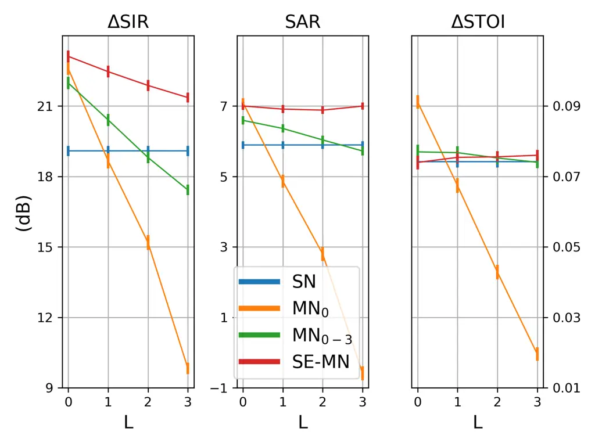
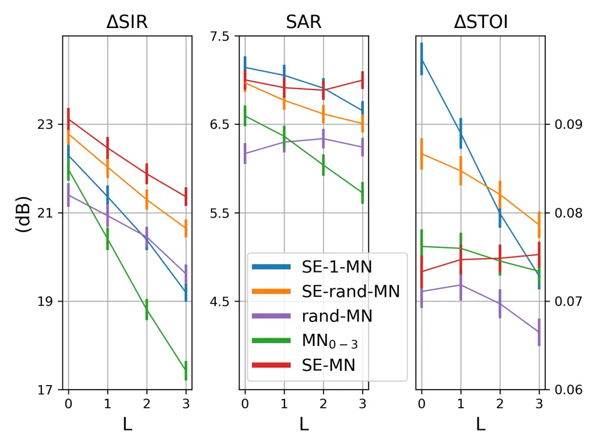

DSB  
delay-and-sum beamformer

MPDR  
minimum power distortionless response beamformer

MVDR  
minimum variance distortionless response beamformer

LCMP  
linearly constrained minimum power beamformer

LCMV  
linearly constrained minimum variance beamformer

MWF  
multichannel Wiener filter

SDW-MWF  
speech distortion weighted multichannel Wiener filter

MVDR  
minimum variance distortionless response

GEVD  
generalized eigenvalue decomposition

NMF-MWF  
non-negative matrix factorization

STFT  
short-time Fourier transform

TF  
time-frequency

VAD  
voice activity detector

DANSE  
distributed adaptive node-specific signal estimation

MSE  
mean squared error

WASN  
wireless acoustic sensor network

DOA  
direction of arrival

IRM  
ideal ratio mask

IBM  
ideal binary mask

DNN  
deep neural network

NN  
neural network

LSTM  
long short-term memory

CDNN  
convolutional neural network

GRU  
gated recurrent unit

CRNN  
convolutional recurrent neural network

RNN  
recurrent neural network

RIR  
room impulse response

SSN  
speech shaped noise

SNR  
signal to noise ratio

SAR  
source to artifacts ratio

SIR  
source to interferences ratio

SDR  
source to distortion ratio

SI-SDR  
scale-invariant signal to distortion ratio

STOI  
short-time objective intelligibility

# Attention-based distributed speech enhancement for unconstrained microphone arrays with varying number of nodes Thanks: This work was made with the support of the French National Research Agency, in the framework of the project DiSCogs “Distant speech communication with heterogeneous unconstrained microphone arrays” (ANR-17-CE23-0026-01). Experiments presented in this paper were partially carried out using the Grid5000 testbed, supported by a scientific interest group hosted by Inria and including CNRS, RENATER and several Universities as well as other organizations (see https://www.grid5000).

Nicolas Furnon Affiliation: Université de Lorraine, CNRS, Inria, Loria  
F-54000 Nancy, France  
nicolas.furnon@loria.fr    Romain Serizel Affiliation: Université de
Lorraine, CNRS, Inria, Loria  
F-54000 Nancy, France    Slim Essid Affiliation: LTCI, Télécom Paris,
Institut Polytechnique de Paris  
Palaiseau, France    Irina Illina Affiliation: Université de Lorraine,
CNRS, Inria, Loria  
F-54000 Nancy, France

###### Abstract

Speech enhancement promises higher efficiency in ad-hoc microphone
arrays than in constrained microphone arrays thanks to the wide spatial
coverage of the devices in the acoustic scene. However, speech
enhancement in ad-hoc microphone arrays still raises many challenges. In
particular, the algorithms should be able to handle a variable number of
microphones, as some devices in the array might appear or disappear. In
this paper, we propose a solution that can efficiently process the
spatial information captured by the different devices of the microphone
array, while being robust to a link failure. To do this, we use an
attention mechanism in order to put more weight on the relevant signals
sent throughout the array and to neglect the redundant or empty
channels.

###### Index Terms: 

Speech enhancement, distributed processing, attention mechanisms, ad-hoc
microphone arrays

## I Introduction

Ad-hoc microphone arrays are made of several devices like telephones,
tablets or hearing aids, each embedded with one or more microphones.
They are usually randomly spread in a room, which brings a wide spatial
coverage of the room and thus rich recordings of the acoustic scene.
Speech enhancement in ad-hoc microphone arrays can benefit from the
increased number of microphones in the array and its wide spatial
coverage, but it also raises many challenges. In particular, the limited
power and computing capacities of the devices, as well as the
unconstrained architecture of the array, make it impossible to rely on a
fusion center and impose a distributed processing. Besides, the person
carrying one of the devices of the array may come in or leave the area
covered by the microphone array. This brings the necessity of a flexible
processing that can handle a varying number of microphones. Solutions
based on a classical signal processing approach have been proposed to
alleviate the bandwidth or power constraints \[1, 2, 3\], and some
solutions can be used in arbitrary array topologies \[4, 5, 6\]. In
recent years, solutions based on dnn have outperformed the signal-based
solutions \[7, 8, 9\]. However, one drawback of dnn is that they often
require a fixed input dimension, constant at training and testing time,
which makes these solutions unflexible to a varying number of channels.
A few architectures have been proposed to address the problem of a
varying number of microphones. Casebeer et al. for example use recurrent
units over the channel axis \[10\], but this implies that the order of
the input channels is relevant, which can’t be guaranteed in real
scenarios. Other solutions propose to use shared parameters across input
channels and to further fuse the different channels \[11, 12\]. These
solutions suffer from the drawback that all channels are considered
identically by the neural network, whereas they might contain very
different information, especially in the context of ad-hoc microphone
arrays where the microphones can be wide apart.

In this paper, we address the typical use case of a person remotely
communicating with someone else in a noisy room and recorded by several
devices like a telephone or a laptop. Since only the audio signals (and
no video) are exchanged between the several devices, we assume that the
communication bandwidth is not a limit and that the signals can be
exchanged without rate distortion. Rate-constrained speech enhancement
in wasn remains an issue, especially with low resource devices like
hearing aids \[13, 14\]. We also assume that the signals are perfectly
aligned, although synchronization in wasn is an open problem \[15, 16\].
Our main point of concern is to enhance the speech in a manner that does
not rely on a fusion center and remains efficient if some of the
recording devices disappear, e.g. if one of them shuts down. To do so,
we propose a speech enhancement solution that combines classic signal
processing with dnn. It processes the information captured over the
whole microphone array but limits the number of signals exchanged
between nodes and operates in arrays with a varying number of devices.
This solution is based on our previous work \[17\], which benefits from
a distributed mwf (mwf) \[1\] to alleviate the constraints on the fusion
center. It also benefits from the modelling power of dnn which proved to
efficiently use spatial information for a more precise tf (tf) mask
estimation. We extend our previous work by designing the dnn so that the
mask estimation remains accurate while resilient to a link failure.
Missing channels are replaced by a constant value indicating a link
failure, and an attention mechanism attributes more weight to the
relevant channels. We also design an empirical study to clarify the
performance improvement brought by the attention mechanism.

This paper is organised as follows. In Section II, the problem is
formalised. We introduce our solution in Section III and the
experimental setup in Section IV. The results are reported in Section V
and Section VI concludes this paper.

## II Problem formulation

### II-A Notations

We consider $`K`$ devices, thereafter called nodes. Each node $`k`$
contains $`M_{k}`$ microphones, so that the total number of microphones
is $`M=\sum_{k=1}^{K}M_{k}`$. Following an additive noise model in the
stft (stft) domain, the signal recorded by the $`m`$-th microphone of
the $`k`$-th node is $`y_{k,m}(f,t)=s_{k,m}(f,t)+n_{k,m}(f,t)`$ where
$`s_{k,m}(f,t)`$ and $`n_{k,m}(f,t)`$ are respectively the target speech
and the noise recorded by the $`m`$-th microphone of the $`k`$-th node
at time step $`t`$ and frequency index $`f`$. For the sake of
conciseness, we will thereafter drop the time and frequency indexes. The
signals recorded by node $`k`$ are stacked in a vector
$`{\mathbf{y}}_{k}~=~[y_{k,1},...,y_{k,M_{k}}]^{T}`$. In the following,
bold lowercase letters represent vectors. Bold uppercase letters
represent matrices. Regular lowercase represent scalars. The signals
recorded by the whole microphone array are stacked into the vector
$`{\mathbf{y}}~=~[{\mathbf{y}}_{1}^{T},...,{\mathbf{y}}_{K}^{T}]^{T}`$.

### II-B Distributed multichannel Wiener filter

Bertrand and Moonen introduced the danse (danse) algorithm which
estimates the target speech as recorded by a reference microphone at
each node \[1\]. At each node, a mwf minimizes the mean squared error
between the filtered signal and the target speech:

```math
{\mathbf{w}}_{k}=\mathrm{arg}\min_{{\mathbf{w}}}\mathbb{E}\{|s_{k,m}-{\mathbf{w}}^{H}\tilde{{\mathbf{y}}}_{k}|^{2}\}\,, \tag{1}
```

$`\mathbb{E}\{\cdot\}`$ denotes the expectation and $`\cdot^{H}`$ is the
Hermitian transpose operator.
$`\tilde{{\mathbf{y}}}_{k}=\left[\mathbf{y}_{k}^{T},~\mathbf{z}_{-k}^{T}\right]^{T}`$
gathers the signals of the microphones of node $`k`$ and the so-called
compressed signals $`\mathbf{z}_{-k}`$ sent by the other nodes:
$`\mathbf{z}_{-k}~=~[z_{1},...,z_{k-1},z_{k+1},...,z_{K}]^{T}`$. The
compressed signal $`z_{j}`$ sent by node $`j\neq k`$ is the output of a
local mwf applied at node $`j`$:
$`z_{j}=\mathbf{w}_{jj}^{H}\mathbf{y}_{j}`$, where
$`\mathbf{w}_{jj}=\mathrm{arg}\min_{{\mathbf{w}}}\mathbb{E}\{|s_{j,m}-{\mathbf{w}}^{H}{\mathbf{y}}_{j}|^{2}\}`$.
The solution to Equation (1) is given by:

```math
\mathbf{{\mathbf{w}}_{k}}=\mathbf{R}_{\tilde{y}\tilde{y}}^{-1}\mathbf{R}_{\tilde{y}s}\mathbf{e}_{k,m}\,, \tag{2}
```

where the covariance matrices $`\mathbf{R}_{\tilde{y}\tilde{y}}`$ and
$`\mathbf{R}_{\tilde{y}s}`$ are estimated from the signals
$`\tilde{{\mathbf{y}}}_{k}`$ and $`s_{k,m}`$ thanks to a vad (vad) or a
tf mask, and where $`\mathbf{e}_{k,m}`$ is a vector of M-1 zeros and a
$`1`$ for to the $`m`$-th microphone of the $`k`$-th node.

This algorithm converges to the centralized node-specific mwf, while
sparing bandwidth cost as each node sends only one compressed signal to
the other nodes \[1\].

In their paper, Bertrand and Moonen estimate the target speech at node
$`k`$ in an adaptive way where the covariance matrices needed to compute
the filter $`{\mathbf{w}}_{k}`$ in Equation (2) are estimated by
averaging over time the instantaneous spatial covariance matrices. This
however raises stability issues that are beyond the scope of this paper.
Thus, we split the adaptive process of danse into two distinct steps
represented in Figure 1. The first step computes the compressed signals
and the second step estimates the target speech signal once every node
has received the compressed signals of the other nodes.

Fig. 1: Example of the DNN-based distributed speech enhancement for two
nodes, where both the target and the noise estimates are sent as
compressed signals. The single-node DNNs (SN-DNN) have access to the
local reference only to predict the mask. The multi-node DNNs (MN-DNN)
have access to the local reference and the compressed signals to
estimate the mask.

### II-C DNN-based distributed multichannel Wiener filter

In previous work \[18\], we replaced the oracle vad used in danse by a
tf mask predicted by a crnn (crnn), in a similar manner as \[7, 8\]. We
showed that the compressed signals sent to compute the filter of
Equation (2) could also help to improve the mask prediction at the
second step by a multi-node dnn. This achieved better performance than
with an oracle vad. In an extended study, we generalized these results
to real-life scenarios and showed that sending the noise estimate rather
than the target estimate could improve the performance depending on the
sir (sir) at the receiving node \[17\]. To take full advantage from the
spatial coverage of the distributed microphone array, in the following,
both the target and noise¹¹ 1 Assuming a noise additive model, the
compressed noise $`\tilde{n}_{k}`$ at node $`k`$ is estimated as
$`\tilde{n}_{k}=y_{k,m}-z_{k}`$. estimates will be sent as represented
in Figure 1.

## III Attention-based distributed speech enhancement algorithm

In this paper, we focus on the typical problem of a node disappearing
from the microphone array, for example because the owner of the
corresponding device leaves the room. Such a case is schematized in
Figure 2. The model architecture used in our previous work requires a
constant number of input channels so it cannot be used for a variable
number of nodes. In the context of broken or disappearing links, this
raises an issue which we address in this paper. The contribution of this
paper is twofold. First, we propose a solution to deal with a variable
number of nodes which is robust to broken links. Second, we examine the
performance of this solution with an empirical study in order to explain
the obtained performance.

Fig. 2: Schematization of a situation where three nodes are expected to
send compressed signals, but only two nodes actually send them. The crnn
expects the local (green) mixture and the target and noise estimates of
all distant nodes (yellow, blue, red).

To cope with a variable number of nodes, we fix the number of input
channels to a constant maximal number. If a node disappears, we replace
the corresponding unreceived signals with a small constant negative
value, which symbolises a broken link. While this is limited by the
maximal number of devices considered, it seems a valid solution in
scenarios where a small number of devices already captures most of the
spatial information. We propose to use an attention mechanism to force
the dnn to consider differently the input channels. This is illustrated
in Figure 3. The attention mechanism is a Squeeze-and-Excitation (SE)
block introduced by Hu et al. \[19\]. The mechanism operates in two
steps. In the first step, it squeezes the input tensor over the time and
frequency axis to output a one-dimensional vector. The squeezing
operation is an average pooling that enables to compress the whole
spatial information into one bin. It embeds the input data into a global
vector so that contextual information can be exploited in the second
step. In the second step, the one-dimensional vector is passed to a
multilayer perceptron composed of two fully-connected layers. These
layers form a bottleneck where the input dimension is reduced by a
factor $`r`$ in order to reduce the complexity of the mechanism and to
prevent overfitting. This mechanism was shown to exploit contextual
information and dependencies over the channel axis while limiting the
complexity of the model \[19\]. In the sequel, we will refer to the
output of the SE mechanism as weights.

Fig. 3: Illustration of the Squeeze-and-Excitation attention mechanism.
$`C`$, $`T`$ and $`F`$ denote the number of channels, time frames and
frequency bins respectively. $`r`$ is the reduction ratio.

## IV Experimental setup

### IV-A Models

Four models are compared in order to study the performance of our
proposed approach. The first model is a single-node crnn whose structure
is described in Section IV-C. It has only access to the local reference
signal to estimate the mask at the second step of the algorithm. This is
the simplest method that is invariant to the number of nodes, since it
does not rely on the compressed signals to predict the mask. It is
denoted “SN”. The second model is the model that has been used in our
previous experiments \[17\]. It is a multi-node neural network that
estimates the mask based on the local reference signal and the
compressed signals sent from the other nodes. At inference time, its
missing channels are replaced by a constant negative value, but during
the training, all the links were always valid. It is denoted by “MN₀”.
The third model is the same architecture as the second model, but each
training sample could contain 0 to 3 broken links. It is denoted by
“MN₀₋₃”. The fourth model is our proposed solution with a SE mechanism
at its input. It is trained with 0 to 3 broken links at every training
sample. It is denoted by “MN-SE”.

### IV-B Dataset

The dataset used to train and test our proposed solution is the same as
the one of our previous work \[17\]. It consists of simulations of
typical shoebox-like rooms with one target source and one noise source
randomly laid in the room. Four nodes of four microphones each are also
randomly placed in the room. All sources and nodes are distant of at
least 50 cm of the closest source, node and wall.

The speech material is taken from LibriSpeech \[20\]. The noise material
is downloaded from Freesound \[21\]. It is split into two
non-overlapping subsets of Freesound users for the training and testing
sets. Some speech-shaped noise was also used to train the dnn because it
was shown to improve the robustness of the dnn \[17\].

The rooms were simulated with the Python toolbox Pyroomacoustics \[22\].
The sir of the non-reverberated source signals is randomly taken between
0 dB and 6 dB. The reverberation time ranges from 150 ms to 400 ms. We
created around 25 hours of training material and 2.5 hours of testing
material²² 2 The code to generate the dataset is publicly available at
https://github.com/nfurnon/disco/tree/master/dataset_generation..

### IV-C Setup

All the signals are sampled at 16 kHz. The stft is computed with a Hann
window of 32 ms with an overlap of 16 ms. The crnn architecture is
composed of three convolutional layers followed by a recurrent layer and
a fully-connected layer. The convolutional layers have 32, 64 and 64
filters, with kernel size $`3\times 3`$ and stride $`1\times 1`$. Each
convolutional layer is followed by a batch normalisation and a
maximum-pooling layer of kernel size $`4\times 1`$ so that no pooling is
applied over the time axis. The recurrent layer is a 256-unit GRU. The
fully-connected layer has 257 units with a sigmoid activation function.
The reduction ratio in the excitation operation is set to 2. The input
of the model are the magnitudes of the stft windows of 21 consecutive
frames and the ground truth labels are the corresponding frames of the
ideal ratio mask. At test time, only the middle frame of the predicted
window is considered to estimate the mask, so sliding windows of the
input are fed to the dnn. The mask of the whole signal is predicted
before being used to enhance the speech in a batch mode. When a link is
broken between a node and the rest of the array, both the target and the
noise magnitudes which are missing are replaced by an array equal to
$`-10^{-7}`$ in all tf bins. This way, the dnn always has 7 input
channels (one local signal plus $`3\times 2`$ compressed signals)
whatever the number of nodes it is connected to.

To better analyse the impact of missing channels on the dnn performance,
we only consider missing channels at the input of the dnn and still use
all the compressed signals at the filtering operations. This is purely
artificial, since available signals at the filtering operations should
also be available to predict the mask. However, this setup allows us to
disentangle the impact of a broken link on the dnn and on the mwf. We
can then analyse the performance from a dnn point of view which is the
focus of this paper³³ 3 Preliminary studies showed that missing channels
at the filtering operation lead to a limited drop of performance..

### IV-D Performance evaluation

Three metrics are used to evaluate the results: the sir improvement
\[23\], denoted as $`\Delta`$SIR; the sar (sar); and the stoi (stoi)
improvement \[24\], denoted as $`\Delta`$STOI. The references needed to
compute these metrics are the non-reverberated noise and speech signals.
All the reported results correspond to the average metric over all the
nodes of all configurations of the test set. This was decided in order
to report the overall performance in the microphone array.

## V Results and analysis

### V-A Resilience to missing channels

We compare the four models introduced in Section IV-A on the testing set
and report the results in Figure 4. Replacing the missing channels by a
fixed value can help the dnn to be resilient to link failures, at the
condition that this dnn was trained to deal with such signals (MN₀₋₃,
MN-SE). The second dnn (MN₀), which was not trained with broken links,
fails to enhance the speech as soon as one of the four nodes is
disconnected from the rest of the microphone array. If the dnn is
trained to deal with missing channels (MN₀₋₃), it can still exploit the
spatial information sent from the other nodes since MN₀₋₃ outperforms
the single-node dnn when 2 or fewer links are broken. When all nodes are
disconnected ($`L=3`$), the noise reduction is lower than with the
single-node crnn, because the amount of missing data is too high for the
MN₀₋₃. Still, the performance in terms of sar and stoi is equal between
the two models. With an attention mechanism (MN-SE), the noise reduction
also decreases when the number of broken links increases, but to a
lesser extent than for the other models, and it always significantly
outperforms, in terms of sir and sar, both the single-node dnn and the
multi-node dnn trained with missing channels. Besides, the sar with
MN-SE is constant over $`L`$, which shows that using this model does not
introduce artefacts although channels are missing. This means that the
SE mechanism not only helps to exploit the spatial information that is
actually received, but also increases the performance of the crnn even
when no compressed signal is received ($`L=3`$). Lastly, the increased
difference between the performance of MN₀₋₃ and MN-SE when $`L`$
increases indicates a stronger resilience of MN-SE compared to the
former model.



Fig. 4: Performance over link failures. $`L`$ refers to the number of
broken links. The error bars represent the 95% confidence intervals.

### V-B Dissociation of the effects of the attention mechanism

In this section, we propose an ablation study to disentangle the effects
of the SE branch and the effects of the weights. The performance
improvement can have two reasons. The first reason is that the weights
applied to the channels highlight the channels of interest. The second
reason is that the SE branch helps the whole dnn to train better.
Considering these two hypotheses, we train the following three dnn:

- •
  rand-MN; a multi-node crnn without SE mechanism, and with random
  weights applied on the input channels.
- •
  SE-rand-MN; a multi-node crnn with SE mechanism but whose attention
  weights are replaced by random values at train time and at inference
  time.
- •
  SE-1-MN; a multi-node crnn with SE mechanism but whose attention
  weights are replaced by 1 at train time and at inference time.

The results of these models, together with the results of the previous
models MN-SE and MN₀₋₃, are represented in Figure 5. The impact of the
SE module alone can be studied by comparing MN-SE-rand with MN-rand and
MN-SE with MN₀₋₃. In both cases the SE module helps improving the
overall performance and the robustness of the model. The impact of the
weights alone is more complex to analyse. Comparing MN-rand with MN₀₋₃
and MN-SE-rand with MN-SE-1 helps understanding the influence of
applying any weights on the input of the crnn. Although this brings
worse performance in terms of stoi, it increases the robustness of the
models. Indeed, when $`L`$ increases, the performance of the models with
weights decreases much less than the performance of the models without
weights. Lastly, comparing MN-SE-1 with MN-SE helps analysing the
influence of applying the correct weights on the input of the crnn. From
the results, using the correct weights increases the sir and sar but
lowers the stoi. However, the model without weights is much less robust
to missing channels, as the stoi decreases drastically when $`L`$
increases. To sum up, the SE branch helps increasing the performance of
the whole model, even with random weights applied on the input of the
crnn. Using the correct values of the weights is important primarily for
a higher number of missing channels.



Fig. 5: Performance over link failures when the effects of the SE
mechanism and of the weights are dissociated. $`L`$ refers to the number
of broken links. The error bars represent the 95% confidence intervals.

## VI Conclusion

We introduced a distributed multichannel speech enhancement algorithm
that handles a varying number of input channels. Based on an attention
mechanism, it exploits the spatial information and minimizes the
performance drop due to link failures. An ablation study led to the
conclusion that the SE mechanism helps to improve the performance of the
whole network, and that the weights importance increases with the number
of missing channels. Future works foresees to analyse the behaviour of
the proposed system when the assumptions about the bit-rate and
synchronization do not hold.

## References

- \[1\] A. Bertrand and M. Moonen, “Distributed adaptive node-specific
  signal estimation in fully connected sensor networks — Part I:
  Sequential node updating,” IEEE Transactions on Signal Processing,
  vol. 58, no. 10, pp. 5277–5291, Oct 2010.
- \[2\] R. Heusdens, G. Zhang, R. C. Hendriks, Y. Zeng, and W. B.
  Kleijn, “Distributed MVDR beamforming for (wireless) microphone
  networks using message passing,” IWAENC, pp. 1–4, 2012.
- \[3\] M. O’Connor and W. B. Kleijn, “Diffusion-based distributed MVDR
  beamformer,” IEEE ICASSP, pp. 810–814, 2014.
- \[4\] J. Szurley, A. Bertrand, and M. Moonen, “Topology-independent
  distributed adaptive node-specific signal estimation in wireless
  sensor networks,” IEEE TSIPN, vol. 3, no. 1, pp. 130–144, 2016.
- \[5\] A. I. Koutrouvelis, T. W. Sherson, R. Heusdens, and R. C.
  Hendriks, “A low-cost robust distributed linearly constrained
  beamformer for wireless acoustic sensor networks with arbitrary
  topology,” IEEE/ACM TASLP, vol. 26, no. 8, pp. 1434–1448, 2018.
- \[6\] X. Guo, M. Yuan, C. Zheng, and X. Li, “Distributed node-specific
  block-diagonal LCMV beamforming in wireless acoustic sensor networks,”
  arXiv preprint arXiv:2010.13334, 2020.
- \[7\] H. Erdogan, T. Hayashi, J. R. Hershey, T. Hori, C. Hori, W. Hsu,
  S. Kim, J. Le Roux, Z. Meng, and S. Watanabe, “Multi-channel speech
  recognition: LSTMs all the way through,” CHiME-4, pp. 1–4, 2016.
- \[8\] J. Heymann, L. Drude, and R. Haeb-Umbach, “Neural network based
  spectral mask estimation for acoustic beamforming,” IEEE ICASSP, pp.
  196–200, 2016.
- \[9\] N. Tawara, T. Kobayashi, and T. Ogawa, “Multi-channel speech
  enhancement using time-domain convolutional denoising autoencoder.,”
  INTERSPEECH, pp. 86–90, 2019.
- \[10\] J. Casebeer, B. Luc, and P. Smaragdis, “Multi-view networks for
  denoising of arbitrary numbers of channels,” IWAENC), pp.
  496–500, 2018.
- \[11\] Y. Luo, Z. Chen, N. Mesgarani, and T. Yoshioka, “End-to-end
  microphone permutation and number invariant multi-channel speech
  separation,” IEEE ICASSP, pp. 6394–6398, 2020.
- \[12\] D. Wang, Z. Chen, and T. Yoshioka, “Neural speech separation
  using spatially distributed microphones,” arXiv preprint
  arXiv:2004.13670, 2020.
- \[13\] O. Roy and M. Vetterli, “Rate-constrained collaborative noise
  reduction for wireless hearing aids,” IEEE Transactions on Signal
  Processing, vol. 57, no. 2, pp. 645–657, 2008.
- \[14\] J. Amini, R. C. Hendriks, R. Heusdens, M. Guo, and J. Jensen,
  “Rate-constrained noise reduction in wireless acoustic sensor
  networks,” IEEE/ACM TASLP, vol. 28, pp. 1–12, 2020.
- \[15\] J. Schmalenstroeer, P. Jebramcik, and R. Haeb-Umbach, “A
  combined hardware–software approach for acoustic sensor network
  synchronization,” Signal Processing, vol. 107, pp. 171–184, 2015.
- \[16\] A. Chinaev, P. Thuene, and G. Enzner, “Double-cross-correlation
  processing for blind sampling-rate and time-offset estimation,”
  IEEE/ACM TASLP, 2021.
- \[17\] N. Furnon, R. Serizel, I. Illina, and S. Essid, “DNN-based mask
  estimation for distributed speech enhancement in spatially
  unconstrained microphone arrays,” arXiv preprint
  arXiv:2011.01714, 2020.
- \[18\] N. Furnon, R. Serizel, I. Illina, and S. Essid, “DNN-based
  distributed multichannel mask estimation for speech enhancement in
  microphone arrays,” IEEE ICASSP, pp. 4672–4676, 2020.
- \[19\] J. Hu, L. Shen, and G. Sun, “Squeeze-and-excitation networks,”
  Proceedings of the IEEE conference on computer vision and pattern
  recognition, pp. 7132–7141, 2018.
- \[20\] V. Panayotov, G. Chen, D. Povey, and S. Khudanpur,
  “Librispeech: an ASR corpus based on public domain audio books,” IEEE
  ICASSP, pp. 5206–5210, 2015.
- \[21\] F. Font, G. Roma, and X. Serra, “Freesound technical demo,” ACM
  International Conference on Multimedia (MM’13), pp. 411–412, 2013.
- \[22\] R. Scheibler, E. Bezzam, and I. Dokmanic, “Pyroomacoustics: A
  python package for audio room simulation and array processing
  algorithms,” IEEE ICASSP, Apr 2018.
- \[23\] E. Vincent, R. Gribonval, and C. Févotte, “Performance
  measurement in blind audio source separation,” IEEE TASLP, vol. 14,
  no. 4, pp. 1462–1469, 2006.
- \[24\] C. H. Taal, R. C. Hendriks, R. Heusdens, and J. Jensen, “A
  short-time objective intelligibility measure for time-frequency
  weighted noisy speech,” IEEE ICASSP, pp. 4214–4217, 2010.
