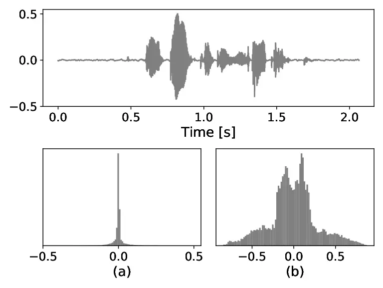
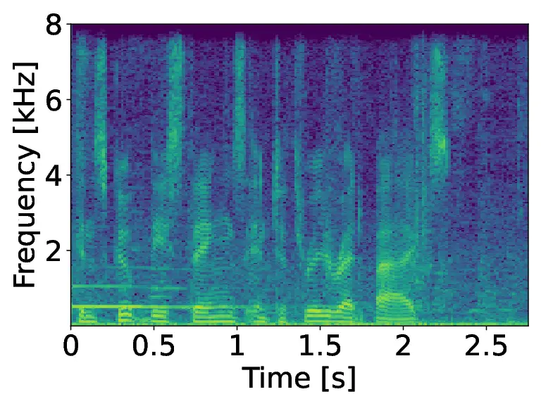
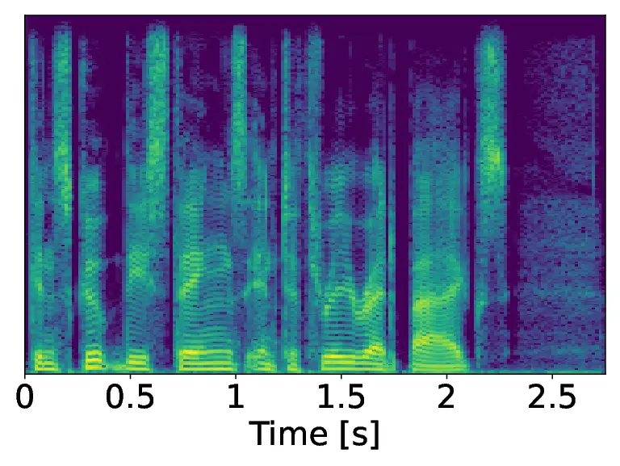
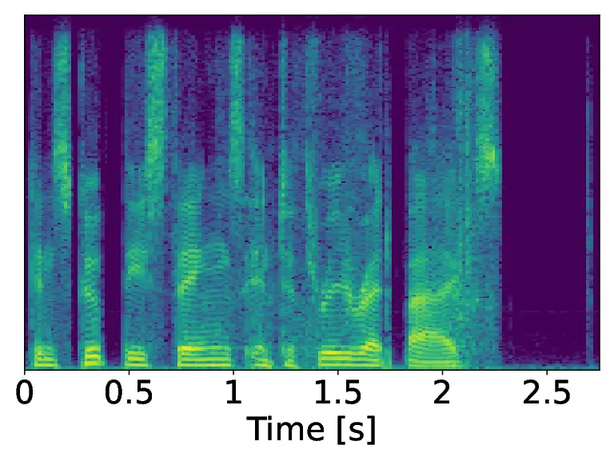
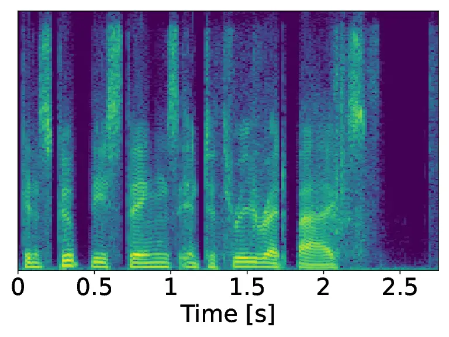

# A Flow-based neural network for time domain Speech enhancementThanks: ^(\*)A joint institution of the Friedrich-Alexander-University Erlangen-Nürnberg (FAU) and Fraunhofer IIS, Germany.

Martin Strauss    Bernd Edler

###### Abstract

Speech enhancement involves the distinction of a target speech signal
from an intrusive background. Although generative approaches using
Variational Autoencoders or Generative Adversarial Networks (GANs) have
increasingly been used in recent years, normalizing flow (NF) based
systems are still scarse, despite their success in related fields. Thus,
in this paper we propose a NF framework to directly model the
enhancement process by density estimation of clean speech utterances
conditioned on their noisy counterpart. The WaveGlow model from speech
synthesis is adapted to enable direct enhancement of noisy utterances in
time domain. In addition, we demonstrate that nonlinear input companding
benefits the model performance by equalizing the distribution of input
samples. Experimental evaluation on a publicly available dataset shows
comparable results to current state-of-the-art GAN-based approaches,
while surpassing the chosen baselines using objective evaluation
metrics.

###### Index Terms: 

speech enhancement, normalizing flows, deep learning, generative
modeling

^(†)^(†)address: International Audio Laboratories Erlangen^(\*), Am
Wolfsmantel 33, 91058 Erlangen, Germany  
{martin.strauss, bernd.edler}@audiolabs-erlangen.de

## 1 Introduction

The goal of speech enhancement (SE) is to emphasize a target speech
signal from an interfering background to ensure better intelligibility
of the spoken content \[1\]. Due to its importance to a wide range of
applications, including, e.g., hearing aids \[2\] or automatic speech
recognition \[3\], it has been investigated extensively in the past. In
doing so, deep neural networks (DNNs) have largely taken over
traditional techniques like Wiener filtering \[4\], spectral subtraction
\[5\], subspace methods \[6\] or the minimum mean square error (MMSE)
\[7\]. Most commonly, DNNs are used to estimate time-frequency (T-F)
masks which are able to separate speech and background from a mixture
signal \[8\].  
Nonetheless, systems based on time domain input were proposed in recent
years which have the benefit of avoiding expensive T-F transformations
\[9, 10, 11\]. Lately, there has also been increasing attention in SE
research to generative approaches such as Generative Adversarial
Networks (GAN) \[11, 12, 13\], Variational Autoencoders (VAE) \[14, 15\]
and autoregressive models \[10\]. Especially the usage of GANs was
broadly investigated in the past couple of years. For instance, Pascual
et al. \[11\], proposed a GAN-based end-to-end system, where the
generator enhances noisy speech samples directly on a waveform level.
This approach has been extended multiple times, e.g. by making use of
the Wasserstein distance \[16\] or by combining multiple generators to
increase performance \[17\]. Others reported strong SE results working
with GANs to estimate clean T-F spectrograms by implementing additional
techniques like a mean squared error regularization \[12\] or optimizing
the network directly with respect to a speech specific evaluation metric
\[13\].  
While the aforementioned approaches received increasing popularity
lately, normalizing flow (NF) based systems are still rare in SE. Just
recently, the work of Nugraha et al. \[18\] proposed a flow based model
combined with a VAE to learn a deep latent representation, which can be
used as a prior distribution for speech. Yet, their approach does not
model the enhancement process itself and therefore depends on the SE
algorithm it is combined with. However, it was shown in areas like
computer vision \[19\] or speech synthesis \[20\] that NFs have the
ability to successfully generate high quality samples in their
respective tasks. Consequently, this leads to the assumption that
enhancement of speech samples can be performed directly using a
flow-based system by modeling a generative process.  
In this paper we demonstrate that NFs can successfully be applied to SE
by a learned mapping from a probability distribution based on clean
speech samples conditioned on their noisy counterpart to a Gaussian
distribution. Therefore, we modify a state-of-the-art flow-based DNN
architecture from speech synthesis to perform SE directly in time
domain, without the need of any predefined features or T-F
transformations. Further, we show that an easy preprocessing technique
of the input signal using companding can increase the performance of SE
models based on density estimation. The experimental evaluation of the
proposed methods confirms our assumptions and shows comparable results
to current state-of-the-art systems, while outperforming other time
domain GAN baselines.


Figure 1: Overview of the proposed system. During training the
clean-noisy (x-y) pair follows the flow blocks (blue-solid lines) to be
mapped to a Gaussian distribution,
$`\mathcal{N}(\textbf{z};0,\textbf{I})`$. In inference, a sample z is
drawn from this distribution and follows the inverted flow (red-dashed
lines) together with another noisy utterance y to generate the enhanced
signal $`\hat{\textbf{x}}`$ (Best viewed in colors).

## 2 Problem Formulation

### 2.1 Normalizing flow fundamentals

A normalizing flow is a differentiable invertible transformation with
differentiable inverse \[21\], formally expressed as

```math
\textbf{x}=f(\textbf{z}), \tag{1}
```

where $`\textbf{x}\in\mathbb{R}^{D}`$ and
$`\textbf{z}\in\mathbb{R}^{D}`$ are $`D`$ dimensional random variables
and $`f`$ is the function mapping z to x. Given that $`f`$ is
invertible, i.e.,

```math
\textbf{z}=f^{-1}(\textbf{x}), \tag{2}
```

it is ensured, that x is a random variable with a given probability
distribution. Following this, the log probability density function
$`\log p_{x}(\textbf{x})`$ can be computed by a change of variables
\[22\],

```math
\log p_{x}(\textbf{x})=\log p_{z}(f^{-1}(\textbf{x}))+\log\left\lvert\det\left(J(\textbf{x})\right)\right\rvert, \tag{3}
```

where $`{J(\textbf{x})=\partial f^{-1}(\textbf{x})/\partial\textbf{x}}`$
defines the Jacobian consisting of all first order partial derivatives.
Moreover, if every single transformation in a sequence of $`1`$ to $`T`$
transformations is invertible and differentiable, then the same is true
for their composition, i.e.,

```math
\textbf{x}=f_{1}\circ f_{2}\circ\cdots\circ f_{T}(\textbf{z}). \tag{4}
```

### 2.2 Speech enhancement flow

In the case of speech enhancement we consider a time domain mixture
signal $`\textbf{y}\in\mathbb{R}^{1\times N}`$ of length $`N`$ composed
of a clean speech utterance $`\textbf{x}\in\mathbb{R}^{1\times N}`$ and
some additive disturbing background
$`\textbf{n}\in\mathbb{R}^{1\times N}`$ so that

```math
\textbf{y}=\textbf{x}+\textbf{n}. \tag{5}
```

Moreover, we define

```math
\textbf{z}\sim\mathcal{N}(\textbf{z};0,\textbf{I}), \tag{6}
```

where $`\mathcal{N}`$ is a Gaussian distribution with zero mean and unit
variance. The NF is now modelled by a DNN and aims to outline the
probability distribution $`p_{x}(\textbf{x}|\textbf{y})`$ of clean
speech utterances x conditioned on the noisy mixture y. As training
objective the log-likelihood of the previously defined probability
distribution is maximized, i.e.,

```math
\log p_{x}(\textbf{x}|\textbf{y};\theta)=\log p_{z}(f^{-1}_{\theta}(\textbf{x})|\textbf{y})+\log\left\lvert\det\left(J(\textbf{x})\right)\right\rvert, \tag{7}
```

where $`\theta`$ represents the network parameters. See Figure 1 for an
illustration of the training process (left, blue lines). In the
enhancement step, we can sample from $`p_{z}(\textbf{z})`$ and hand it
together with a noisy speech sample as input to the network. Following
the inverted flow the DNN maps the random sample back to the
distribution of clean utterances to create $`\hat{\textbf{x}}`$, with
$`\hat{\textbf{x}}`$ ideally being close to the underlying x. This
process is also displayed in Figure 1 (right, red lines).

## 3 Proposed methods

### 3.1 Model architecture

In this work, we adapted the WaveGlow architecture \[20\] for speech
synthesis to speech enhancement. Originally, this model takes speech
utterances together with a corresponding Mel-spectrogram as an input for
several flow blocks, learning to generate realistic speech samples based
on the conditional spectrogram input. One flow block consists of a 1x1
invertible convolution \[23\] ensuring the exchange of information along
channel dimension and a so-called affine coupling layer \[24\], which is
used to ensure invertibility and efficient computing of the Jacobian
determinant. Therefore, the input signal is split into two halves along
the channel dimension. One half is then fed to a WaveNet-like DNN block
defining the scaling and translation factor for the second half. To
create this multi-channel input, multiple audio samples are stacked
together in one group to mimic a multi-channel signal. The affine
coupling layer is also where the conditional information is included.
For further details on this procedure we refer to \[20\].  
The original WaveGlow is computationally heavy ($`>87`$ Mio.
parameters), so a few architectural modifications were carried out to
make it feasible to train on a single GPU and to enable the enhancement
of speech samples. In contrast to WaveGlow, we condition the model on
noisy time domain speech signals, instead of Mel-spectrograms. Since
both signals are of the same dimension, no upsampling layer was needed.
Additionally, the standard convolutions in the WaveNet-like blocks were
replaced by depthwise separable convolutions \[25\] to reduce the amount
of parameters, as it was proposed by \[26\].

### 3.2 Nonlinear input companding

|                     |        |        |        |        |          |
| ------------------- | ------ | ------ | ------ | ------ | -------- |
|   Method            |   PESQ |   CSIG |   CBAK |   COVL |   segSNR |
|   Noisy             |   1.97 |   3.35 |   2.44 |   2.63 |   1.68   |
|   SEGAN \[11\]      |   2.16 |   3.48 |   2.94 |   2.80 |   7.73   |
|   DSEGAN \[17\]     |   2.39 |   3.46 |   3.11 |   3.50 |   -      |
|   MMSE-GAN \[12\]   |   2.53 |   3.80 |   3.12 |   3.14 |   -      |
|   Metric-GAN \[13\] |   2.86 |   3.99 |   3.18 |   3.42 |   -      |
|   SE-Flow           |   2.28 |   3.70 |   3.03 |   2.97 |   7.93   |
|   SE-Flow-$`\mu`$   |   2.43 |   3.77 |   3.12 |   3.09 |   8.07   |

Table 1: Evaluation results using objective evaluation metrics. SE-Flow
represents the proposed flow-based approach and SE-Flow-$`\mu`$ the
approach together with $`\mu`$-law companding of the input data. The
values of all comparing methods are taken from the corresponding papers.



Figure 2: Example of the effect of nonlinear $`\mu`$-law companding on
the audio input. At the top a clean speech utterance is shown. (a) shows
the histogram ($`n_{bins}=100`$) of the clean utterance. The companded
values are illustrated in (b).

Since the DNN models the probability distribution of time domain speech
utterances, it is important to inspect the range of values from which
the distribution is learned from. The audio data was stored as
normalized 32-bit floats in a range of $`[-1,1]`$. Since time domain
speech samples approximately follow a Laplacian distribution \[27\], it
is easy to see that most values lie in a small range around zero (See
Figure 2 (a)). However, especially in clean speech utterances, data
samples with a higher absolute amplitude carry significant information
and are in this case underrepresented. To make sure that the values are
more evenly spread out, a nonlinear companding algorithm can be applied
to map small amplitudes to a wider interval and large amplitudes to a
smaller interval, respectively. This is demonstrated in Figure 2, where
one speech sample is displayed together with a histogram of values
before and after applying a companding algorithm. In this sense, the
companding can be understood as a sort of histogram equalization.
Following this, additional experiments were conducted using $`\mu`$-law
companding (ITU-T. Recommendation G. 711) of the input data without
quantization, which is formally defined as

```math
g(x)=\text{sgn}(x)\frac{\ln(1+\mu\left\lvert x\right\rvert)}{\ln(1+\mu)}, \tag{8}
```

where sgn() is the sign function and $`\mu`$ is the parameter defining
the level of compression. Here, we set $`\mu`$ to 255 throughout the
experiments, which is a common value also used in telecommunication.
With respect to the learning objective, rather than to learn the
distribution of clean utterances, the distribution of the companded
signal is learned. The enhanced sample can be expanded back to a regular
signal afterwards reverting the $`\mu`$-law transformation.

## 4 Experimental Setup

### 4.1 Data



(a) Noisy



(b) Clean



(c) SE-Flow



(d) SE-Flow-$`\mu`$

Figure 3: Spectrograms obtained from proposed the system. In (a), a
noisy speech utterance at 2.5 dB is displayed. (b) shows the
corresponding clean utterance. In (c) and (d) the results of the
proposed flow-based systems are shown.

The dataset used in this study was published along with the work of
Valentini et al. \[28\]. It includes 30 individual speakers from the
Voice Bank corpus \[29\] separated into a training and a test set with
28 and 2 speakers, respectively. Both sets are balanced according to
male and female participants. The training samples were mixed together
with eight real noise samples from the DEMAND database \[30\] and two
artificial (babble and speech shaped) samples according to 0, 5, 10 and
15 dB signal-to-noise-ratio (SNR). In addition, one male and one female
speaker were taken out of the training set to form a validation set for
model development, resulting in 8.6 h and 0.7 h of data for training and
validation, respectively. To ensure unseen test conditions, different
noise samples were selected and mixed according to SNR values of 2.5,
7.5, 12.5, and 17.5 dB to form 824 (0.6 h) test utterances. All audio
files were resampled to a sampling rate of $`f_{s}=16`$ kHz.

### 4.2 Training strategy

The values for batch size ($`4,8,12`$), number of flow blocks
($`8,12,16`$) and the amount of samples grouped together as input
($`8,12,24`$) were selected in a hyper-parameter search. As a loss
function for training, the model minimized the negative log-likelihood
of the given data. Each individual model was trained for 150 epochs to
select the parameters based on the lowest validation loss. A few initial
experiments using a higher batch size were conducted, however we found
that the model was not generalizing well enough. The selected model was
trained further until convergence based on an early stopping mechanism
of 20 epochs patience. A fine-tuning step followed using a decreased
learning rate and the same early stopping criterion.

### 4.3 Model settings

As a result of the parameter search the model was built with 16 flow
blocks, a group of 12 samples as input and a batch size of 4. The
learning rate was set to $`3\times 10^{-4}`$ in the initial training
step using the Adam \[31\] optimizer and weight normalization \[32\].
For fine-tuning the learning rate was lowered to $`3\times 10^{-5}`$.
The input at training time consisted of 1 s long randomly extracted
chunks of each audio file. The standard deviation of the Gaussian
distribution was set to $`\sigma=1.0`$. Similar to other NF models
\[20\], we observed the effect that using a lower value for $`\sigma`$
in inference leads to a higher quality output, which is why it was set
to $`\sigma=0.9`$ for the enhancement. According to the original
WaveGlow architecture WaveNet-like blocks with 8 layers of dilated
convolutions, 512 channels as residual connections and 256 channels in
the skip connections were used in the affine coupling layers. In
addition, after every 4 coupling layers 2 channels were passed to the
loss function to form a multi-scale architecture.

### 4.4 Evaluation

In order to compare the proposed approach to recent works in the field
the following evaluation metrics were used:

- •
  Perceptual evaluation of speech quality (PESQ) in the recommended
  wideband version in ITU-T P.862.2 (from $`-0.5`$ to $`4.5`$).
- •
  Three Mean Opinion Score (from $`1`$ to $`5`$) metrics \[33\]:
  prediction of the signal distortion (CSIG), prediction of the
  background intrusiveness (CBAK) and prediction of the overall speech
  quality (COVL).
- •
  The segmental SNR (segSNR) \[34\] improvement (from $`0`$ to
  $`\infty`$ dB).

As a baseline to our proposed methods we used two generative time domain
approaches, namely the SEGAN \[11\] and the improved deep SEGAN (DSEGAN)
\[17\] models, since they were evaluated with the same database and
metrics. Further, we compared against two other state-of-the-art GAN
based systems, namely the MMSE-GAN \[12\] and Metric-GAN \[13\], which
are working with T-F masks. Note, that there are several discriminative
approaches, e.g. \[9, 35, 36\], reporting a higher performance on this
dataset. However, the focus of this work was on generative models, which
is why they are not included in the comparison.

## 5 Experimental Results

The experimental results are displayed in Table 1. As is shown in the
table, in between the two proposed flow-based experiments, the model
using $`\mu`$-companding shows better results in all metrics. This
demonstrates the effectiveness of this easy preprocessing technique for
modeling the distribution of time domain signals. An illustration of the
enhancement capabilities is illustrated in Figure 3. Comparing the
spectrograms of the two proposed systems, it appears that the
SE-Flow-$`\mu`$ is able to capture more fine grained speech parts with
less background leakage. Note also, that the breathing sound at the end
of the displayed example is not recovered by our models, which
emphasizes that the proposed models focuses on real speech samples.
Further, it is visible in the flow-based examples that, when speech is
active, more noise-like frequency content is present in the higher
frequencies compared to the clean signal. This can be explained by the
Gaussian sampling which is not modelled properly during inference.  
In comparison to the SEGAN baseline both proposed methods show superior
performance throughout all metrics by a large margin. Looking at DSEGAN
it can be seen that the proposed SE-Flow reaches a comparable
performance in CSIG, while showing slightly lower values in the other
metrics. However, the SE-Flow-$`\mu`$ based system still performs better
in all metrics besides COVL. Thus, within the time domain approaches the
proposed flow-based model seems to model the generative process from a
noisy to an enhanced signal better. With regard to MMSE-GAN, we observe
that our approach with $`\mu`$-law companding has a similar performance
with a slight edge towards MMSE-GAN, although no additional
regularization technique was implemented here. The Metric-GAN shows
superior results compared to the proposed approaches with regard to all
displayed metrics. Still, it is important to notice that this model was
directly optimized according to the PESQ metric, so we would expect a
good performance here. Consequently, connecting the training with direct
optimization of the evaluation metric might also be an effective way to
improve our system. Samples of the enhanced signals produced by our
models can be found online¹¹ 1
[https://www.audiolabs-erlangen.de/resources/2021-ICASSP-SE_Flow](https://www.audiolabs-erlangen.de/resources/2021-ICASSP-SE_Flow).

## 6 Conclusions

In this paper we proposed a normalizing flow method for speech
enhancement. The model allows for density estimation of clean speech
samples given their noisy counterparts and signal enhancement via
generative inference. A simple nonlinear $`\mu`$-law companding
technique was demonstrated to be an effective preprocessing tool to
increase the enhancement outcome. The proposed systems outperforms the
results of other time domain GAN-based baselines while closing up to
state-of-the-art T-F techniques. Future research will include the
exploration of different techniques in the coupling layer, as well as, a
combination of time and frequency domain signals.

## 7 Acknowledgments

We want to thank Dr. Nicola Pia and Wolfgang Mack for the thoughtful
comments and constructive feedback in the early and late stages of our
work.

## References

- \[1\] P. Loizou, Speech Enhancement: Theory and Practice, CRC Press,
  2nd edition, 2013.
- \[2\] K. Borisagar, D. Thanki, and B. Sedani, Speech Enhancement
  Techniques for Digital Hearing Aids, Springer International
  Publishing, 2018.
- \[3\] A.H. Moore, P. Peso Parada, and P.A. Naylor, “Speech enhancement
  for robust automatic speech recognition: Evaluation using a baseline
  system and instrumental measures,” Computer Speech & Language, vol.
  46, pp. 574 – 584, 2017.
- \[4\] J. Lim and A. Oppenheim, “All-pole modeling of degraded speech,”
  IEEE Transactions on Acoustics, Speech, and Signal Processing, vol.
  26, no. 3, pp. 197–210, 1978.
- \[5\] S. Boll, “Suppression of acoustic noise in speech using spectral
  subtraction,” IEEE Transactions on Acoustics, Speech, and Signal
  Processing, vol. 27, no. 2, pp. 113–120, 1979.
- \[6\] Y. Ephraim and H.L. Van Trees, “A signal subspace approach for
  speech enhancement,” IEEE Transactions on Speech and Audio Processing,
  vol. 3, no. 4, pp. 251–266, 1995.
- \[7\] Y. Ephraim and D. Malah, “Speech enhancement using a minimum
  mean-square error log-spectral amplitude estimator,” IEEE Transactions
  Acoustics, Speech and Signal Processing, vol. 33, no. 2, pp. 443 –
  445, 1985.
- \[8\] Y. Xu, J. Du, L. Dai, and C. Lee, “A regression approach to
  speech enhancement based on deep neural networks,” IEEE/ACM
  Transactions on Audio, Speech, and Language Processing, vol. 23, no.
  1, pp. 7–19, 2015.
- \[9\] F. Germain, Q. Chen, and V. Koltun, “Speech denoising with deep
  feature losses,” in Proc. Interspeech Conf., 2019, pp. 2723–2727.
- \[10\] K. Qian, Y. Zhang, S. Chang, X. Yang, D. Florêncio, and
  M. Hasegawa-Johnson, “Speech enhancement using bayesian wavenet,” in
  Proc. Interspeech Conf., 2017, pp. 2013–2017.
- \[11\] S. Pascual, A. Bonafonte, and J. Serrà, “SEGAN: Speech
  Enhancement Generative Adversarial Network,” in Proc. Interspeech
  Conf., 2017, pp. 3642–3646.
- \[12\] M. H. Soni, N. Shah, and H. A. Patil, “Time-frequency
  masking-based speech enhancement using generative adversarial
  network,” in Proc. IEEE Intl. Conf. on Acoustics, Speech and Signal
  Processing (ICASSP), 2018, pp. 5039–5043.
- \[13\] S.-W. Fu, C.-F. Liao, Y. Tsao, and S.-D. Lin, “MetricGAN:
  Generative Adversarial Networks based Black-box Metric Scores
  Optimization for Speech Enhancement,” in Proc. Intl. Conf. Machine
  Learning (ICML), 2019, pp. 2031–2041.
- \[14\] S. Leglaive, X. Alameda-Pineda, L. Girin, and R. Horaud, “A
  Recurrent Variational Autoencoder for Speech Enhancement,” in Proc.
  IEEE Intl. Conf. on Acoustics, Speech and Signal Processing (ICASSP),
  2020, pp. 371–375.
- \[15\] M. Pariente, A. Deleforge, and E. Vincent, “A statistically
  principled and computationally efficient approach to speech
  enhancement using variational autoencoders,” in Proc. Interspeech
  Conf., 2019, pp. 3158–3162.
- \[16\] N. Adiga, Y. Pantazis, V. Tsiaras, and Y. Stylianou, “Speech
  Enhancement for Noise-Robust Speech Synthesis Using Wasserstein GAN,”
  in Proc. Interspeech Conf., 2019, pp. 1821–1825.
- \[17\] H. Phan, I. V. McLoughlin, L. Pham, O. Y. Chén, P. Koch, M. De
  Vos, and A. Mertins, “Improving GANs for Speech Enhancement,” IEEE
  Signal Processing Letters, vol. 27, pp. 1700–1704, 2020.
- \[18\] A. A. Nugraha, K. Sekiguchi, and K. Yoshii, “A Flow-Based Deep
  Latent Variable Model for Speech Spectrogram Modeling and
  Enhancement,” IEEE/ACM Transactions on Audio, Speech, and Language
  Processing, vol. 28, pp. 1104–1117, 2020.
- \[19\] J. Ho, X. Chen, A. Srinivas, Y. Duan, and P. Abbeel, “Flow++:
  Improving flow-based generative models with variational dequantization
  and architecture design,” in Proc. of Machine Learning Research, 2019,
  vol. 97, pp. 2722–2730.
- \[20\] R. Prenger, R. Valle, and B. Catanzaro, “Waveglow: A Flow-based
  Generative Network for Speech Synthesis,” in Proc. IEEE Intl. Conf. on
  Acoustics, Speech and Signal Processing (ICASSP), 2019, pp. 3617–3621.
- \[21\] I. Kobyzev, S. Prince, and M. Brubaker, “Normalizing flows: An
  introduction and review of current methods,” IEEE Transactions on
  Pattern Analysis and Machine Intelligence, pp. 1–1, 2020.
- \[22\] G. Papamakarios, E.T. Nalisnick, D.J. Rezende, S. Mohamed, and
  B Lakshminarayanan, “Normalizing flows for probabilistic modeling and
  inference,” in arXiv:1912.02762, 2019.
- \[23\] D.P. Kingma and P. Dhariwal, “Glow: Generative flow with
  invertible 1x1 convolutions,” in Advances in Neural Information
  Processing Systems 31, 2018, pp. 10215–10224.
- \[24\] L. Dinh, J. Sohl-Dickstein, and S. Bengio, “Density estimation
  using real NVP,” in 5th Int. Conf. on Learning Representations,
  ICLR, 2017.
- \[25\] F. Chollet, “Xception: Deep learning with depthwise separable
  convolutions,” in IEEE Conf. on Computer Vision and Pattern
  Recognition (CVPR), 2017, pp. 1800–1807.
- \[26\] B. Zhai, T. Gao, F. Xue, D. Rothchild, B. Wu, J. Gonzalez, and
  K. Keutzer, “Squeezewave: Extremely lightweight vocoders for on-device
  speech synthesis,” in arXiv:2001.05685, 2020.
- \[27\] J. Jensen, I. Batina, R. C Hendriks, and R. Heusdens, “A study
  of the distribution of time-domain speech samples and discrete Fourier
  coefficients,” in Proc. SPS-DARTS, 2005, vol. 1, pp. 155–158.
- \[28\] C. Valentini Botinhao, X. Wang, S. Takaki, and J. Yamagishi,
  “Speech enhancement for a noise-robust text-to-speech synthesis system
  using deep recurrent neural networks,” in Proc. Interspeech Conf.,
  2016, pp. 352–356.
- \[29\] C. Veaux, J. Yamagishi, and S. King, “The voice bank corpus:
  Design, collection and data analysis of a large regional accent speech
  database,” in Int. Conf. Oriental COCOSDA held jointly with the Conf.
  on Asian Spoken Language Research and Evaluation (O-COCOSDA/CASLRE),
  2013, pp. 1–4.
- \[30\] J. Thiemann, N. Ito, and E. Vincent, “The Diverse Environments
  Multi-channel Acoustic Noise Database (DEMAND): A database of
  multichannel environmental noise recordings,” Proc. of Meetings on
  Acoustics, vol. 19, no. 1, pp. 035081, 2013.
- \[31\] D.P. Kingma and J. Ba, “Adam: A method for stochastic
  optimization,” in 3rd Int. Conf. on Learning Representations,
  ICLR, 2015.
- \[32\] T. Salimans and D. P. Kingma, “Weight normalization: A simple
  reparameterization to accelerate training of deep neural networks,” in
  Advances in Neural Information Processing Systems 29, 2016, pp.
  901–909.
- \[33\] Y. Hu and P. Loizou, “Evaluation of objective quality measures
  for speech enhancement,” IEEE Transactions on Audio, Speech, and
  Language Processing, vol. 16, no. 1, pp. 229 – 238, 2008.
- \[34\] J. Hansen and B. Pellom, “An effective quality evaluation
  protocol for speech enhancement algorithms,” in Proc. Intl. Conf. on
  Spoken Lang. Processing (ICSLP), 1998, p. 2819–2822.
- \[35\] R. Giri, U. Isik, and A. A. Krishnaswamy, “Attention wave-u-net
  for speech enhancement,” in Proc. IEEE Workshop on Applications of
  Signal Processing to Audio and Acoustics, 2019, pp. 249–253.
- \[36\] Y. Koizumi, K. Yatabe, M. Delcroix, Y. Masuyama, and
  D. Takeuchi, “Speech enhancement using self-adaptation and multi-head
  self-attention,” in Proc. IEEE Intl. Conf. on Acoustics, Speech and
  Signal Processing (ICASSP), 2020, pp. 181–185.
