# MeshRIR: a dataset of room impulse responses on meshed grid points for evaluating sound field analysis and synthesis methods

###### Abstract

A new impulse response (IR) dataset called “MeshRIR” is introduced.
Currently available datasets usually include IRs at an array of
microphones from several source positions under various room conditions,
which are basically designed for evaluating speech enhancement and
distant speech recognition methods. On the other hand, methods of
estimating or controlling spatial sound fields have been extensively
investigated in recent years; however, the current IR datasets are not
applicable to validating and comparing these methods because of the low
spatial resolution of measurement points. MeshRIR consists of IRs
measured at positions obtained by finely discretizing a spatial region.
Two subdatasets are currently available: one consists of IRs in a
three-dimensional cuboidal region from a single source, and the other
consists of IRs in a two-dimensional square region from an array of 32
sources. Therefore, MeshRIR is suitable for evaluating sound field
analysis and synthesis methods. This dataset is freely available at
https://sh01k.github.io/MeshRIR/ with some codes of sample applications.

|                                                                                                 |
| ----------------------------------------------------------------------------------------------- |
| Shoichi Koyama, Tomoya Nishida, Keisuke Kimura, Takumi Abe, Natsuki Ueno, and Jesper Brunnström |
| The University of Tokyo, 7-3-1 Hongo, Bunkyo-ku, Tokyo 113-8656, Japan                          |
| koyama.shoichi@ieee.org                                                                         |

Index Terms—  room impulse response, acoustic transfer function, sound
field reconstruction, sound field control, dataset

## 1 Introduction

Acoustic room impulse responses (IRs) contain characteristics of sound
propagation between a source and a receiver as a linear time-invariant
system. Since numerical simulations of acoustic waves in a
three-dimensional (3D) space require a high computational load, the IRs
measured in practical environments are useful for evaluating the
performance of acoustic signal processing techniques, such as speech
enhancement, dereverberation, source localization, source separation,
and speech recognition, as well as auralization. Therefore, many IR
datasets have been developed by various research communities \[1, 2, 3,
4, 5, 6, 7, 8\].

Currently available public IR datasets usually contain IRs of several
loudspeaker and microphone placements (or devices) under several
reverberation conditions. For example, the Real World Computing
Partnership Sound Scene Database (RWCP-SSD) \[1\] includes IRs measured
by circular and linear microphone arrays from a loudspeaker at several
positions in nine different rooms. The Aachen Impulse Response (AIR)
dataset \[3\] includes IRs measured by a dummy head and a mobile phone
at several positions in six rooms. The BUT Speech@FIT Reverb Database
(BUT ReverbDB) \[8\] consists of IRs at 31 microphone positions from
2–11 loudspeaker positions in nine rooms. Recently, a dataset of IRs
from loudspeakers at cube-shaped grid to linear microphone arrays has
been developed \[9\]. These datasets are designed mainly for evaluating
speech enhancement and distant speech recognition methods.

On the other hand, sound field analysis and synthesis methods have been
extensively investigated in recent years; these methods include the
estimation and visualization of acoustic fields \[10, 11, 12\], sound
field recording for spatial audio applications \[13, 14, 15\], the
interpolation of acoustic transfer functions \[16\], and sound field
synthesis and control with multiple loudspeakers \[17, 18, 19, 20\]. To
evaluate these methods, characteristics of sound propagation inside a
spatial region must be known. Therefore, in many of these studies,
experimental evaluations are limited to numerical simulations. To
validate and compare the sound field analysis and synthesis methods in
more realistic scenarios, a publicly available IR dataset at finely
meshed grid points inside a spatial region is necessary. The IR dataset
developed by Steward and Sandler (C4DM RIR dataset) \[4\] includes IRs
in a two-dimensional (2D) rectangular region in three different rooms,
but the intervals between measurement points
($`0.5`$–$`1.0~\mathrm{m}`$) are not sufficiently small for this
purpose.

We introduce a new IR dataset called “MeshRIR” designed for the
evaluation of sound field analysis and synthesis methods, which has the
following features:

- •
  Measurement points are set at finely meshed grid points inside a
  spatial region. The intervals between the measurement points are
  $`0.05~\mathrm{m}`$.
- •
  Two types of measurement region are currently available: 3D cuboidal
  and 2D square, whose dimensions are
  $`1.0~\mathrm{m}\times 1.0~\mathrm{m}\times 0.4~\mathrm{m}`$ and
  $`1.0~\mathrm{m}\times 1.0~\mathrm{m}`$, respectively.
- •
  IRs from a single source position to a 3D cuboidal region and from an
  array of 32 sources to a 2D square region are included.
- •
  Several codes for sample applications are also provided, including
  sound field reconstruction for estimating the pressure distribution
  from a discrete set of measurements and sound field control for
  synthesizing a desired field inside a target region.

The dataset is publicly available at https://sh01k.github.io/MeshRIR/
under a nonrestrictive license.

## 2 Details of dataset

|                                   | S1-M3969                                                                  | S32-M441                                           |
| --------------------------------- | ------------------------------------------------------------------------- | -------------------------------------------------- |
| Sampling rate                     | $`48000~\mathrm{Hz}`$                                                     |                                                    |
| IR length                         | $`32768~\mathrm{samples}`$                                                |                                                    |
| Room dimensions                   | $`7.0~\mathrm{m}\times 6.4~\mathrm{m}\times 2.7~\mathrm{m}`$              |                                                    |
| Number of source positions        | $`1`$                                                                     | $`32`$                                             |
| Measurement region                | 3D cuboidal: $`1.0~\mathrm{m}\times 1.0~\mathrm{m}\times 0.4~\mathrm{m}`$ | 2D square: $`1.0~\mathrm{m}\times 1.0~\mathrm{m}`$ |
| Intervals of microphone positions | $`0.05~\mathrm{m}`$                                                       |                                                    |
| Number of microphone positions    | $`21\times 21\times 9~(=3969)~\mathrm{points}`$                           | $`21\times 21~(=441)~\mathrm{points}`$             |
| Reverberation time ($`T_{60}`$)   | $`0.38~\mathrm{s}`$                                                       | $`0.19~\mathrm{s}`$                                |
| Average temperature               | $`26.3^{\circ}`$C                                                         | $`17.1^{\circ}`$C                                  |

Table 1: Detailed measurement conditions of subdatasets S1-M3969 and
S32-M441.

MeshRIR consists of two subdatasets. One consists of IRs inside a 3D
cuboidal region from a single source position (S1-M3969). The other
consists of IRs inside a 2D square region from 32 source positions
(S32-M441). The measurement conditions are summarized in Table 1. In
both subdatasets, the measurement points were determined by discretizing
the measurement region every $`0.05~\mathrm{m}`$. All the IRs were
measured in a room with approximate dimensions of
$`7.0~\mathrm{m}\times 6.4~\mathrm{m}\times 2.7~\mathrm{m}`$. The
sampling frequency was $`48000~\mathrm{Hz}`$ and the IR length was
$`32768~\mathrm{samples}`$.

### 2.1 Equipment and conditions for IR measurement

To achieve a low measurement error, the excitation signal for measuring
IRs should have a sufficiently high output level at all target
frequencies while keeping nonlinear errors of the measurement system
low. There are two major categories of excitation signals for IR
measurement: maximum length sequence (MLS) and swept-sine signal \[21,
22\]. The MLS is a periodic pseudorandom signal whose statistical
properties are similar to those of white Gaussian noise \[23, 24, 25\].
The swept-sine signal is chirp signal whose frequency increases or
decreases with time, and this signal is also called the time-stretched
pulse (TSP) \[26, 27\]. There are several variations in the change in
frequency. The increase or decrease in the instantaneous frequency of
the linear swept-sine signal is linear \[28, 29\]. On the other hand,
the instantaneous frequency of the exponential swept-sine signal
exponentially increases, as its name suggests \[30, 31, 32\]. The
exponential swept-sine signal is sometimes called logarithmic swept-sine
signal since its group delay logarithmically changes.

The difference between the excitation signals appears in their power
spectrum and nonlinear error. Whereas the power spectra of the MLS and
linear swept-sine signal are flat as in that of white noise, that of the
exponential swept-sine signal linearly decreases with increasing
frequency as in that of pink noise. Thus, the SNR of the excitation
signals with a flat power spectrum is proportional to the noise power
spectrum. The SNR of the exponential swept-sine signal can be relatively
higher at low frequencies than at high frequencies. The nonlinear error
of the MLS arises as distortion artifacts almost uniformly distributed
in the time-frequency domain. When using the linear swept-sine signal
with increasing frequency, major parts of harmonic distortions appear
before the initial linear response as pre-echos. The same thing happens
when using the exponential swept-sine signal, but the harmonic
distortion of each order is separately concentrated on specific time
points. In the linear swept-sine signal with decreasing frequency, the
harmonic distortions are overlapped with the linear response.

The selected excitation signal for our purpose was the linear swept-sine
signal with decreasing frequency. Since we carefully adjusted the output
level of the loudspeakers, the nonlinear effects will be negligible. We
also designed the linear swept-sine signals in the frequency domain to
ensure that all the frequency components up to the Nyquist frequency are
equally included without discontinuities at the beginning and end of the
signals \[29, 27\]. The IRs were reconstructed by the circular
convolution of inverse signals after synchronous averaging three times .

To measure the IRs on the grid points, we used a Cartesian robot with an
omnidirectional microphone (Primo, EM272J) to control the measurement
position in three dimensions (see Fig. 2). The signal input and output
were controlled by a PC with a Dante interface. We also monitored the
room temperature as each IR was measured. The file formats of IR data
are MAT for MATLAB and NPY for Python. All the additional data are
provided as a JSON file.

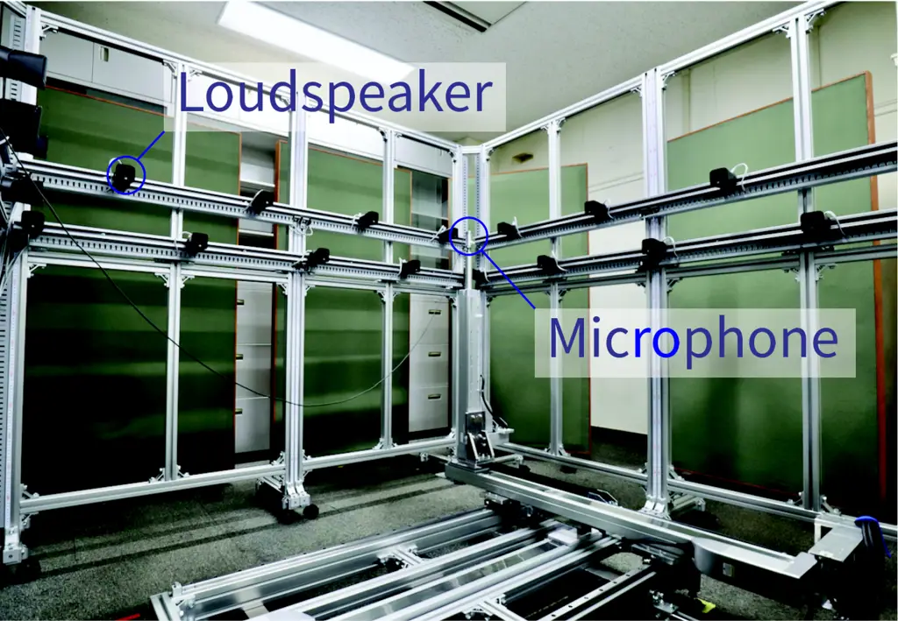

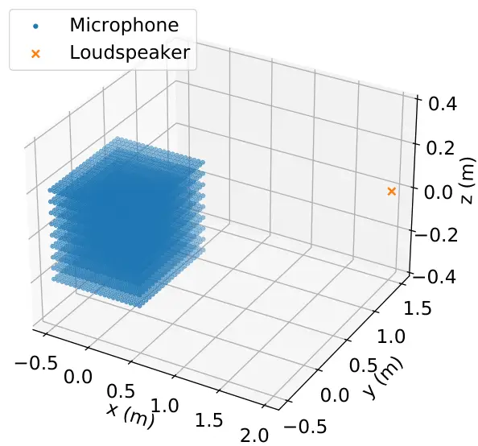

(a) S1-M3969

(b) S32-M441

Figure 1: IR measurement system for S32-M441.

Figure 2: Positions of loudspeakers and microphones.

### 2.2 S1-M3969

In S1-M3969, the IRs from a single source at the fixed position to the
3D cuboidal region with dimensions of
$`1.0~\mathrm{m}\times 1.0~\mathrm{m}\times 0.04~\mathrm{m}`$ were
included. The coordinate origin was set at the center of the measurement
region, and the source position was $`(2.0,1.5,0.0)~\mathrm{m}`$. The
measurement points were obtained by discretizing the cuboidal region at
intervals of $`0.05~\mathrm{m}`$, so the number of microphone positions
was $`21\times 21\times 9`$ ($`=3969`$) $`\mathrm{points}`$. Fig. 2(a)
shows the loudspeaker and microphone positions. The source was an
ordinary closed loudspeaker (DIATONE, DS-7). The reverberation time
($`T_{60}`$) averaged for randomly chosen $`100`$ IRs was
$`0.38~\mathrm{s}`$. This sub-dataset will be useful for evaluating 3D
sound field analysis methods, e.g., the interpolation of pressure fields
and acoustic transfer functions.

### 2.3 S32-M441

The subdataset S32-M441 was the set of IRs from an array of sources to a
planar measurement region. As shown in Fig. 2(b), the loudspeakers were
regularly placed along the borders of two squares with dimensions of
$`2.0~\mathrm{m}\times 2.0~\mathrm{m}`$ at heights of
$`z=-0.2~\mathrm{m}`$ and $`0.2~\mathrm{m}`$. Small closed loudspeakers
(YAMAHA, VXS1MLB) were used. The measurement region was a square with
dimensions of $`1.0~\mathrm{m}\times 1.0~\mathrm{m}`$. Again, the
measurement region was discretized at intervals of $`0.05~\mathrm{m}`$,
so the number of microphone positions was $`21\times 21`$
($`=441`$) $`\mathrm{points}`$. Several acoustic absorption panels were
placed. The reverberation time ($`T_{60}`$) averaged for randomly chosen
IRs of $`10`$ sources and $`100`$ microphones was $`0.19~\mathrm{s}`$.
This subdataset is useful for evaluating sound field synthesis and
control methods.

## 3 Evaluation and sample applications

We show some evaluation results of the dataset. Two sample applications
of the dataset, which are sound field reconstruction and control, are
also shown.

### 3.1 Evaluation of IRs

Since the dataset includes IRs on finely meshed grid points, the spatial
sound field can be visualized. We extracted IRs at $`z=0`$ of S1-M3969,
which is the same as the height of the source, and filtered each IR
using a low-pass filter, whose cutoff frequency was $`600~\mathrm{Hz}`$,
for visibility.

Fig. 3 shows the instantaneous pressure distributions at $`t=8480`$,
$`8520`$, $`8560`$, and $`8600~\mathrm{samples}`$. The direct wave
propagating on the $`x`$-$`y`$-plane is visualized. The IRs with respect
to time along the $`y`$-axis at $`(x,z)=(0,0)~\mathrm{m}`$ are plotted
in Fig. 4. The reflected waves following the direct wave can be seen.

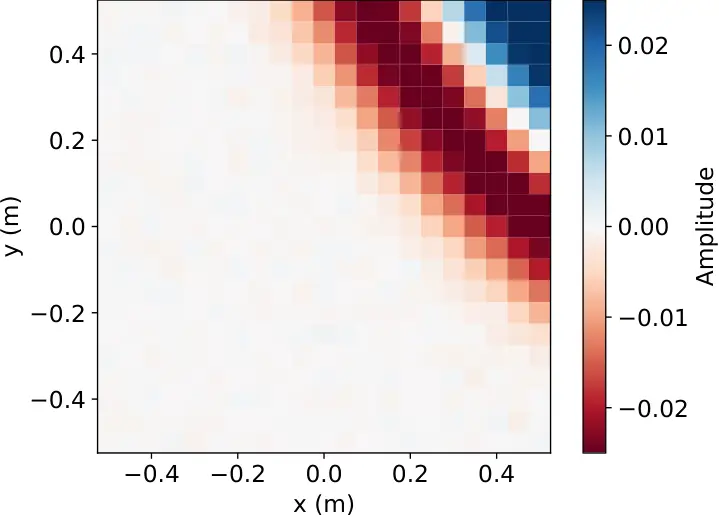

(a) $`t=8480~\mathrm{sample}`$

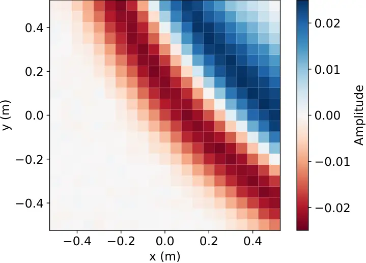

(b) $`t=8520~\mathrm{sample}`$

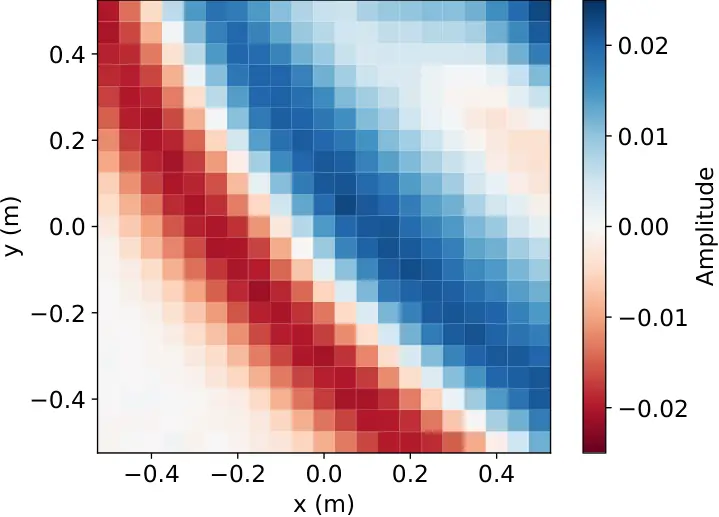

(c) $`t=8560~\mathrm{sample}`$

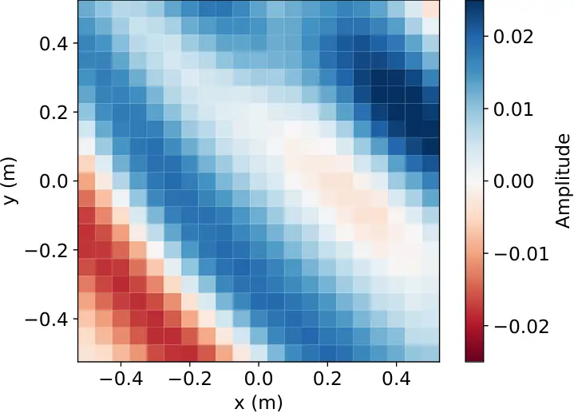

(d) $`t=8600~\mathrm{sample}`$

Figure 3: Visualization of instantaneous pressure distributions using
low-pass-filtered IRs of S1-M3969.

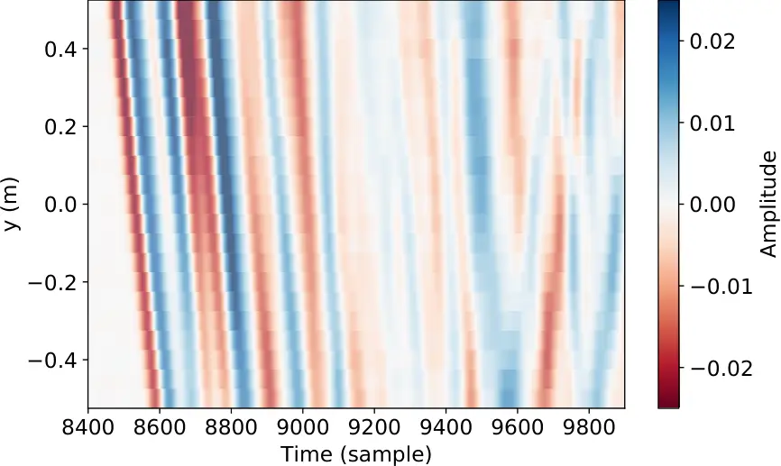

Figure 4: IRs with respect to time along $`y`$-axis at
$`(x,z)=(0,0)~\mathrm{m}`$ of S1-M3969.

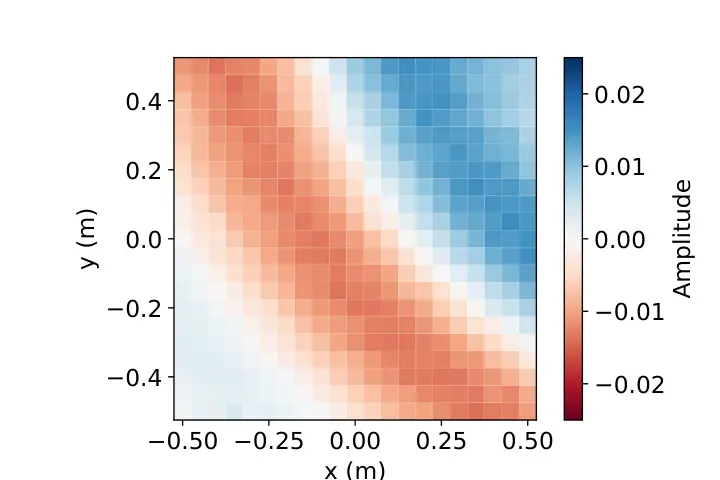

(a) True

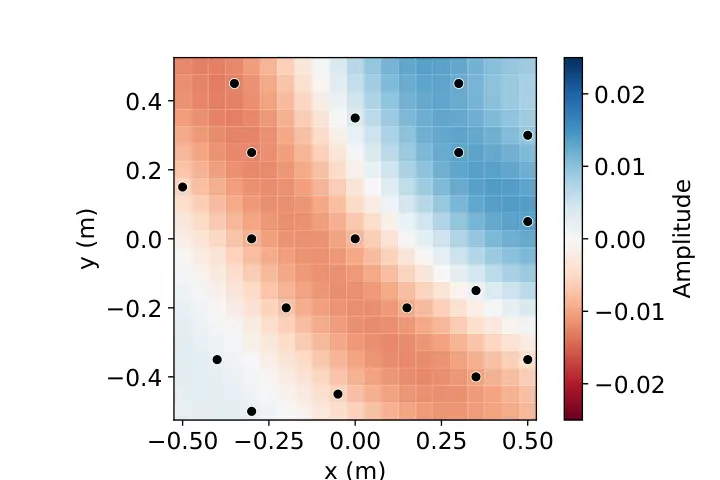

(b) Estimated

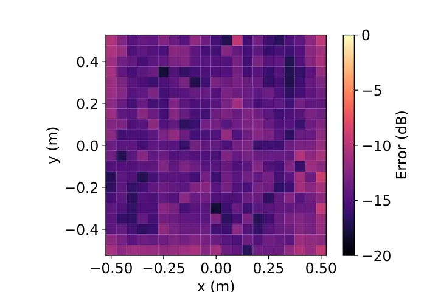

(c) Error

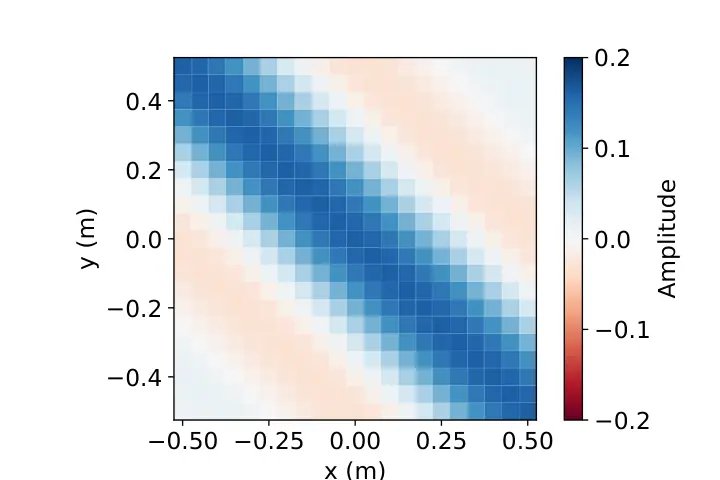

(a) True

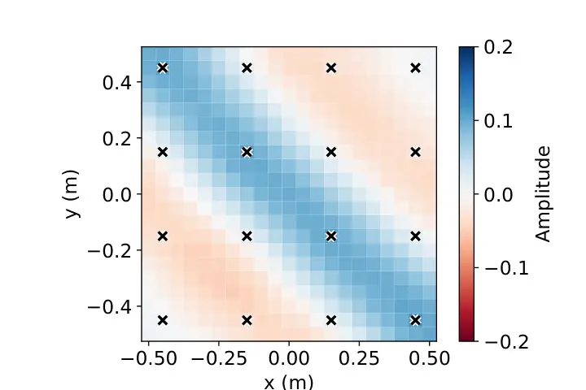

(b) Synthesized

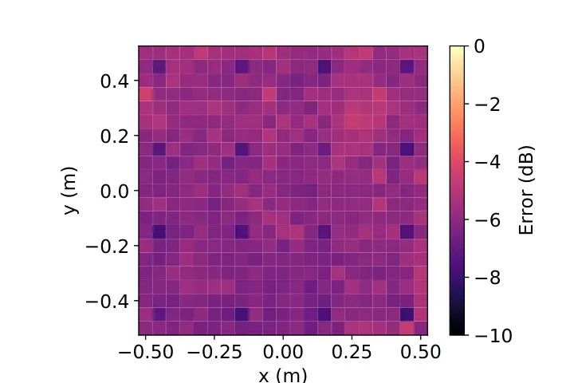

(c) Error

Figure 5: Estimated pressure distribution at $`t=0.089~\mathrm{s}`$ and
time-averaged square error distribution. Black dots in (b) indicate
microphone positions. MSE was $`-13.7~\mathrm{dB}`$.

Figure 6: Synthesized pressure distribution at $`t=0.51~\mathrm{s}`$ and
time-averaged square error distribution. The black crosses in (b)
indicate the positions of control points. The SDR was
$`3.85~\mathrm{dB}`$.

### 3.2 Sound field reconstruction

The problem of estimating and interpolating a sound field from a
discrete set of microphone measurements is referred to as sound field
reconstruction. We demonstrate experimental results of the sound field
reconstruction using S1-M3969.

The sound field reconstruction problem for a source-free region is
generally solved by decomposing the measurements into element solutions
of the Helmholtz equation using, for example, plane-wave and harmonic
functions, which is a theoretical foundation of Fourier
acoustics \[33\]. It is also possible to apply the equivalent source
method \[34\], which is based on the representation obtained using
Green’s function at a fictitious boundary enclosing the target region.
Most of the current methods are based on the sound field decomposition
into finite-dimensional basis functions. We here apply the spherical
harmonic analysis of infinite order \[14, 15\] to the estimation of the
pressure distribution. When using omnidirectional microphones, this
estimation method is equivalent to the kernel interpolation method using
the zero-th-order spherical Bessel function as the kernel
function \[35\].

The target estimation region was set on the plane at the height of
$`z=0`$. We set 18 microphones on this plane for pressure measurements,
whose positions were chosen using the method proposed in \[36\]. The
source signal was a low-pass-filtered pulse signal, where the cuttoff
frequency was $`500~\mathrm{Hz}`$, and the sampling rate was downsampled
to $`8000~\mathrm{Hz}`$. The interpolation filter was designed in the
time domain, and its length was $`1025~\mathrm{samples}`$.

Fig. 6 shows the estimated pressure distribution at
$`t=0.089~\mathrm{s}`$ and the time-averaged square error distribution.
The black dots in Fig. 6(b) indicate the microphone positions. The mean
square error (MSE) was $`-13.7~\mathrm{dB}`$.

### 3.3 Sound field control

The sound field control is used for synthesizing a desired sound field
inside a target region using multiple loudspeakers, which is applicable
to high-fidelity spatial audio, personal audio created using multiple
sound zones, and spatial active noise control. We synthesized a
planewave field inside a target region using S32-M441.

Methods of synthesizing a desired sound field based on integral
equations analytically derived from the Helmholtz equation are basically
applicable when the loudspeaker geometry is simple. On the other hand, a
flexible loudspeaker geometry can be used in methods based on numerical
optimization to minimize the error between synthesized and desired sound
fields inside the target region. We here apply the pressure matching
method \[37\], which is widely used in practice because of its simple
implementation.

We set the target region as the measurement region, i.e., the square
region with dimensions of $`1.0~\mathrm{m}\times 1.0~\mathrm{m}`$ at
$`z=0`$. The desired sound field was a single plane wave whose arrival
direction was $`(\theta,\phi)=(\pi/2,\pi/4)`$. 16 control points were
set on the plane at intervals of $`0.3~\mathrm{m}`$. Again, the sampling
rate was downsampled to $`8000~\mathrm{Hz}`$. The source signal was a
low-pass-filtered pulse signal, where the cutoff frequency was
$`700~\mathrm{Hz}`$. The control filter was designed in the time domain,
and its length was $`8192~\mathrm{samples}`$.

Fig. 6 shows the synthesized pressure distribution at
$`t=0.51~\mathrm{s}`$ and the time-averaged square error distribution.
The black crosses in Fig. 6(b) indicate the positions of the control
points. The signal-to-distortion ratio (SDR) was $`3.85~\mathrm{dB}`$.
The details on this sample application are described in \[38\].

## 4 Conclusion

We introduced a new IR dataset called “MeshRIR” designed for the
evaluation of sound field analysis and synthesis methods. An important
feature of this dataset is that IR measurement points are obtained by
finely discretizing a spatial region. Therefore, by choosing several
points as microphone measurements, we can use the other points for
validation. Several codes for sample applications are also provided. We
plan to further extend the dataset to other source and microphone
configurations and room conditions in future versions.

## 5 ACKNOWLEDGMENT

This work was supported by JST PRESTO Grant Number JPMJPR18J4.

## References

- \[1\] S. Nakamura, K. Hiyane, F. Asano, and T. Endo, “Sound scene data
  collection in real acoustical environment,” _J. Acoust. Soc. Jpn.
  (E)_, vol. 20, no. 3, pp. 225–231, 1999.
- \[2\] J. Y. C. Wen, N. D. Gaubitch, E. A. P. Habets, T. Myatt, and
  P. A. Naylor, “Evaluation of speech dereverberation algorithms using
  the MARDY database,” in _Proc. Int. Workshop Acoust. Signal
  Enhancement (IWAENC)_, Paris, France, 2006.
- \[3\] M. Jeub, M. Schafer, and P. Vary, “A binaural room impulse
  response database for the simulation of dereverberation algorithms,”
  in _Proc. Int. Conf. Digital Signal Process. (ICDSP_, Santorini,
  Greece, 2009.
- \[4\] R. Stewart and M. Sandler, “Database of omnidirectional and
  B-format room impulse responses,” in _Proc. IEEE Int. Conf. Acoust.,
  Speech, Signal Process. (ICASSP)_, Dallas, USA, 2010, pp. 165–168.
- \[5\] S. Shelley and D. T. Murphy, “OpenAIR: An interactive
  auralization web resource and database,” in _Proc. 129th AES Conv._,
  San Francisco, USA, 2010.
- \[6\] K. Kinoshita, M. Delcroix, T. Yoshioka, T. Nakatani, E. A. P.
  habets, R. Haeb-Umbach, A. Sehr, W. Kellermann, R. Mass, S. Gannot,
  and B. Raj, “The REVERB challenge: A common evaluation framework for
  dereverberation and recognition of reverberant speech,” in _Proc. IEEE
  Int. Workshop Appl. Signal Process. Audio Acoust. (WASPAA)_, New
  Paltz, USA, 2013.
- \[7\] J. Eaton, N. D. Gaubitch, A. H. Moore, and P. A. Naylor, “The
  ACE challenge - corpus description and performance evaluation,” in
  _Proc. IEEE Int. Workshop Appl. Signal Process. Audio Acoust.
  (WASPAA)_, New Paltz, USA, 2015.
- \[8\] I. Szöke, M. Skácel, L. Mošner, J. Paliesek, and J. H. Černocký,
  “Building and evaluation of a real room impulse response dataset,”
  _IEEE J. Sel. Topics Signal Process._, vol. 13, no. 4, pp.
  863–876, 2019.
- \[9\] J. Čmejla, T. Kounovský, S. Gannot, Z. Koldovský, and
  P. Tandeitnik, “MIRaGe: Multichannel database of room impulse reponses
  measured on high-resolution cube-shaped grid,” in _Proc. European
  Signal Process. Conf. (EUSIPCO)_, Amsterdam, Netherlands, 2020, pp.
  56–60.
- \[10\] G. Chardon, L. Daudet, A. Peillot, F. Ollivier, N. Bertin, and
  R. Gribonval, “Near-field acoustic holography using sparsity and
  compressive sampling principles,” _J. Acoust. Soc. Amer._, vol. 132,
  no. 3, pp. 1521–1534, 2012.
- \[11\] E. Fernandez-Grande, “Sound field reconstruction using a
  spherical microphone array,” _J. Acoust. Soc. Amer._, vol. 139, no. 3,
  pp. 1168–1178, 2016.
- \[12\] S. Koyama and L. Daudet, “Sparse representation of a spatial
  sound field in a reverberant environment,” _IEEE J. Sel. Topics Signal
  Process._, vol. 13, no. 1, pp. 172–184, 2019.
- \[13\] P. Samarasinghe, T. Abhayapala, and M. Poletti, “Wavefield
  analysis over large areas using distributed higher order microphones,”
  _IEEE/ACM Trans. Audio, Speech, Lang. Process._, vol. 22, no. 3, pp.
  647–658, 2014.
- \[14\] N. Ueno, S. Koyama, and H. Saruwatari, “Sound field recording
  using distributed microphones based on harmonic analysis of infinite
  order,” _IEEE Signal Process. Lett._, vol. 25, no. 1, pp.
  135–139, 2018.
- \[15\] ——, “Directionally weighted wave field estimation exploiting
  prior information on source direction,” _IEEE Trans. Signal Process._,
  vol. 69, pp. 2383–2395, 2021.
- \[16\] R. Mignot, L. Daudet, and F. Ollivier, “Room reverberation
  reconstruction: Interpolation of the early part using compressed
  sensing,” _IEEE Trans. Audio, Speech, Lang. Process._, vol. 21,
  no. 11, pp. 2301–2312, 2013.
- \[17\] S. Spors, R. Rabenstein, and J. Ahrens, “The theory of wave
  field synthesis revisited,” in _Proc. 124th AES Conv._, Amsterdam,
  Netherlands, 2008.
- \[18\] M. A. Poletti, “Three-dimensional surround sound systems based
  on spherical harmonics,” _J. Audio Eng. Soc._, vol. 53, no. 11, pp.
  1004–1025, 2005.
- \[19\] N. Ueno, S. Koyama, and H. Saruwatari, “Three-dimensional sound
  field reproduction based on weighted mode-matching method,” _IEEE/ACM
  Trans. Audio, Speech, Lang. Process._, vol. 27, no. 12, pp.
  1852–1867, 2019.
- \[20\] S. Koyama, G. Chardon, and L. Daudet, “Optimizing source and
  sensor placement for sound field control: An overview,” _IEEE/ACM
  Trans. Audio, Speech, Lang. Process._, vol. 28, pp. 686–714, 2020.
- \[21\] ISO 18233:2006(E), International Organization for
  Standardization, Standard, 2006.
- \[22\] G.-B. Stan, J.-J. Embrechts, and D. Archambeau, “Comparison of
  different impulse response measurement techniques,” _J. Audio Eng.
  Soc._, vol. 50, no. 4, pp. 249–262, 2002.
- \[23\] M. R. Schroeder, “Integrated-impulse method for measuring sound
  decay without using impulses,” _J. Acoust. Soc. Amer._, vol. 66,
  no. 2, pp. 497–500, 1979.
- \[24\] D. D. Rife and J. Vanderkooy, “Transfer-function measurement
  with maximum-length sequences,” _J. Audio Eng. Soc._, vol. 37, no. 6,
  pp. 419–444, 1989.
- \[25\] C. Dunn and M. O. Hawksford, “Distortion immunity of
  MLS-derived impulse response measurements,” _J. Audio Eng. Soc._,
  vol. 41, no. 5, pp. 314–335, 1993.
- \[26\] A. J. Berkhout, D. de Vries, and M. M. Boone, “A new method to
  acquire impulse responses in concert halls,” _J. Acoust. Soc. Amer._,
  vol. 68, no. 1, pp. 179–183, 1998.
- \[27\] S. Müller and P. Massarani, “Transfer-function measurement with
  sweeps,” _J. Audio Eng. Soc._, vol. 49, no. 6, pp. 443–471, 2001.
- \[28\] N. Aoshima, “Computer-generated pulse signal applied for sound
  measurement,” _J. Acoust. Soc. Amer._, vol. 69, no. 5, pp.
  1484–1488, 1981.
- \[29\] Y. Suzuki, F. Asano, H.-Y. Kim, and T. Sone, “An optimal
  computer-generated pulse signal suitable for the measurement of very
  long impulse responses,” _J. Acoust. Soc. Amer._, vol. 97, no. 2, pp.
  1119–1123, 1995.
- \[30\] A. Farina, “Simultaneous measurement of impulse response and
  distortion with a swept-sine technique,” in _Proc. 108th AES Conv._,
  Paris, France, 2000.
- \[31\] N. Moriya and Y. Kaneda, “Study of harmonic distortion on
  impulse response measurement with logarithmic time stretched pulse,”
  _Acoust. Sci. Tech., Acoust. Lett._, vol. 26, no. 5, pp.
  462–464, 2005.
- \[32\] A. Farina, “Advancements in impulse response measurements by
  sine sweeps,” in _Proc. 122nd AES Conv._, Vienna, Austria, 2007.
- \[33\] E. G. Williams, _Fourier Acoustics: Sound Radiation and
  Nearfield Acoustical Holography_. London, UK: Academic Press, 1999.
- \[34\] M. E. Johnson, S. J. Elliott, K. H. Baek, and J. Garcia-Bontio,
  “An equivalent source technique for calculating the sound field inside
  an enclosure containing scattering objects,” _J. Acoust. Soc. Amer._,
  vol. 104, no. 3, pp. 1221–1231, 1998.
- \[35\] N. Ueno, S. Koyama, and H. Saruwatari, “Kernel ridge regression
  with constraint of helmholtz equation for sound field interpolation,”
  in _Proc. Int. Workshop Acoust. Signal Enhancement (IWAENC)_, Tokyo,
  Sep. 2018, pp. 436–440.
- \[36\] T. Nishida, N. Ueno, S. Koyama, and H. Saruwatari, “Sensor
  placement in arbitrarily restricted region for field estimation based
  on gaussian process,” in _Proc. European Signal Process. Conf.
  (EUSIPCO)_, Amsterdam, Jan. 2020, pp. 2289–2293.
- \[37\] O. Kirkeby and P. A. Nelson, “Reproduction of plane wave sound
  fields,” _J. Acoust. Soc. Amer._, vol. 94, no. 5, pp. 2992–3000, 1993.
- \[38\] S. Koyama, K. Kimura, and N. Ueno, “Sound field reproduction
  with weighted mode matching and infinite-dimensional harmonic
  analysis: An experimental evaluation,” in _Proc. Int. Conf. Immersive
  and 3D Audio (I3DA)_, Bologna, Sep. 2021, (to appear).
