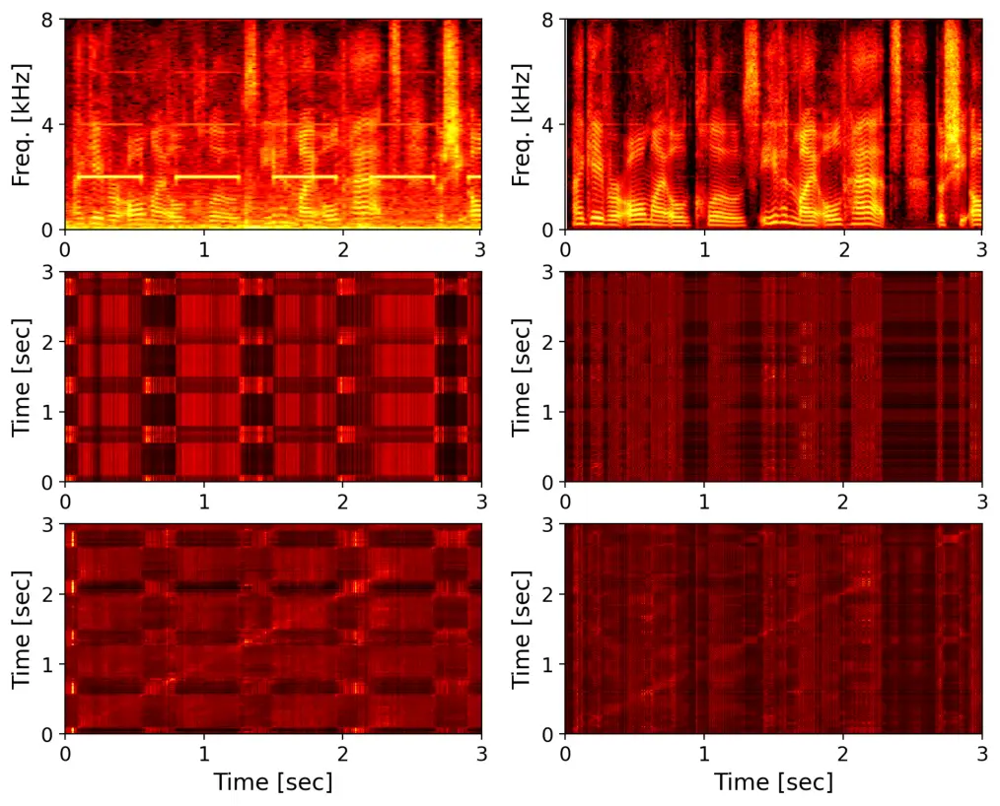

# DF-Conformer: Integrated architecture of Conv-TasNet and Conformer using linear complexity self-attention for speech enhancement

###### Abstract

Single-channel speech enhancement (SE) is an important task in speech
processing. A widely used framework combines an analysis/synthesis
filterbank with a mask prediction network, such as the Conv-TasNet
architecture. In such systems, the denoising performance and
computational efficiency are mainly affected by the structure of the
mask prediction network. In this study, we aim to improve the sequential
modeling ability of Conv-TasNet architectures by integrating Conformer
layers into a new mask prediction network. To make the model
computationally feasible, we extend the Conformer using linear
complexity attention and stacked 1-D dilated depthwise convolution
layers. We trained the model on 3,396 hours of noisy speech data, and
show that (i) the use of linear complexity attention avoids high
computational complexity, and (ii) our model achieves higher
scale-invariant signal-to-noise ratio than the improved time-dilated
convolution network (TDCN++), an extended version of Conv-TasNet.

|                                                                                                            |
| ---------------------------------------------------------------------------------------------------------- |
| Yuma Koizumi, Shigeki Karita, Scott Wisdom, Hakan Erdogan, John R. Hershey, Llion Jones, Michiel Bacchiani |
| Google Research                                                                                            |

Index Terms—  Speech enhancement, Conv-TasNet, Conformer, dilated
convolution, self-attention.

## 1 Introduction

Speech enhancement (SE) is the task of recovering target speech from a
noisy signal \[1\]. In addition to its applications in telephony and
video conferencing \[2\], single-channel SE is a basic component in
larger systems, such as multi-channel SE \[3, 4\], multi-modal SE \[5,
6, 7, 8\], and automatic speech recognition (ASR) \[9, 10, 11\] systems.
Therefore, it is important to improve both the denoising performance and
the computational efficiency of single-channel SE.

In recent years, rapid progress has been made on SE using deep neural
networks (DNNs) \[1\]. Conv-TasNet \[12\] is a powerful model for SE
that uses a combination of trainable analysis/synthesis
filterbanks \[13\] and a mask prediction network using stacked 1-D
dilated depthwise convolution (1D-DDC) layers. Since the denoising
performance and computational efficiency are mainly affected by the mask
prediction network, one of the main research topics in SE is improving
the mask prediction architecture \[14, 15, 16, 17, 18, 19, 20\]. For
example, the improved time-dilated convolution network (TDCN++) \[14,
15\] extended Conv-TasNet to improve SE performance.

A promising candidate for improving mask prediction networks is the
Conformer architecture. The Conformer \[21\] architecture has been shown
to be effective in ASR \[21\], diarization \[22\], and sound event
detection \[23, 24\]. Conformer is derived from the Transformer \[25\]
architecture by including 1-D depthwise convolution layers to enable
more effective sequential modeling.

In this paper we combine Conformer layers with the dilated convolution
layers of the TDCN++ architecture. However, this introduces two critical
problems related to the short window and hop sizes used in trainable
analysis/synthesis filterbanks. The first problem is large computational
cost because the time-complexity of the multi-head-self-attention (MHSA)
in the Conformer has a quadratic dependence on sequence length.
Secondly, the small hop-size of neighboring time-frames reduces the
temporal reach of sequential modeling when using temporal convolution
layers.

In order to make the model computationally feasible, we use a
linear-complexity variant of self-attention in the Conformer, known as
_fast attention via positive orthogonal random features_ (FAVOR+), as
used in Performer \[26\]. These ideas are partly inspired by the
local-global network for speaker diarization using a time-dilated
convolution network (TDCN) \[22\] which shows that the combination of a
linear complexity self-attention and a TDCN improves both local and
global sequential modeling. We show in experiments below that the
resulting model, which we call the _dilated FAVOR Conformer_
(DF-Conformer), achieves better enhancement fidelity than the TDCN++ of
comparable complexity.

## 2 Preliminaries

### 2.1 Conv-TasNet and its extensions on speech enhancement

Let the $`T`$-sample time-domain observation $`\bm{x}\in\mathbb{R}^{T}`$
be a mixture of a target speech $`\bm{s}`$ and noise $`\bm{n}`$ as
$`\bm{x}=\bm{s}+\bm{n}`$, where $`\bm{n}`$ is assumed to be
environmental noise and does not include interference speech signals.
The goal of SE is to recover $`\bm{s}`$ from $`\bm{x}`$.

In mask-based SE, a mask is estimated using a mask prediction network
and applied to the representation of $`\bm{x}`$ encoded by an encoder,
then the estimated signal $`\bm{y}\in\mathbb{R}^{T}`$ is re-synthesized
using a decoder. The enhancement procedure can be written as

```math
\displaystyle\bm{y}=\decoder\left(\encoder(\bm{x})\odot\mathcal{M}(\encoder(\bm{x}))\right) \tag{1}
```

where $`\encoder:\mathbb{R}^{T}\to\mathbb{R}^{N\times D_{e}}`$ and
$`\decoder:\mathbb{R}^{N\times D_{e}}\to\mathbb{R}^{T}`$ are the signal
encoder and decoder, respectively, $`D_{e}`$ is the encoder output
dimension, $`\odot`$ is the element-wise multiplication, and
$`\mathcal{M}:\mathbb{R}^{N\times D_{e}}\to[0,1]^{N\times D_{e}}`$ is
the mask prediction network. Early studies used the
short-time-Fourier-transform (STFT) and the inverse-STFT (iSTFT) as
encoder and decoder \[9, 27\], respectively. More recent studies use a
trainable encoder/decoder \[12\] which are often called trainable
“filterbanks” \[28\], e.g. in Asteroid  \[13\].

One of the main research topic in SE is the design of the network
architecture of $`\mathcal{M}`$, because the performance and
computational efficiency of SE are mainly affected by the structure of
$`\mathcal{M}`$. Conv-TasNet \[12\] is a powerful model for speech
separation and SE, and whose $`\mathcal{M}`$ consists of stacked 1D-DDC
layers. TDCN++ \[14, 15\] is an extension of Conv-TasNet. The main
difference of TDCN++ with Conv-TasNet is the use of instance norm
instead of global layer norm and the addition of explicit scale
parameters after each dense layer. The pseudo-code for $`\mathcal{M}`$
in the TDCN++ is shown in Algorithm 1. TDCN++ consists of $`L`$ stacked
TDCN-blocks, and each TDCN-block mainly consists of two dense layers for
frame-wise feature modeling and one 1D-DDC layer for sequence modeling.
The dilation factor $`d`$ increases exponentially to ensure a
sufficiently large temporal context window to take advantage of the
long-range dependencies of the speech signal, and $`L_{s}`$ TDCN-blocks
are repeated $`R`$ times where $`L=RL_{s}`$. The time complexity of
TDCN++ is roughly proportional to $`O(LN)`$ when $`N\gg D_{b}`$, where
$`D_{b}`$ is the input dimension of TDCN-blocks.

Function _MaskPredictorOfTDCN++(_$`\bm{X}`$_)_:

     1 $`\bm{z}\leftarrow\dense(\bm{X})`$ //
$`\mathbb{R}^{N\times D_{e}}_{+}\to\mathbb{R}^{N\times D_{b}}`$

     2 for _$`i=1`$ to $`L`$_ do

         3 $`d\leftarrow\pow(2,\mod(i-1,L_{s}))`$

         4
$`\bm{z}\leftarrow\bm{z}+\mbox{$i$-th }\textnormal{{TdcnBlock}}\left(\bm{z},d\right)`$

     5 $`\bm{M}\leftarrow\sigma\left(\dense(\bm{z})\right)`$ //
$`\mathbb{R}^{N\times D_{b}}\to[0,1]^{N\times D_{e}}`$

     6 return $`\bm{M}`$

7 Function _TdcnBlock(_$`\bm{z}`$, $`d`$_)_:

     8 $`\bm{z}\leftarrow\dense(\bm{z})`$ //
$`\mathbb{R}^{N\times D_{b}}\to\mathbb{R}^{N\times D_{c}}`$

     9
$`\bm{z}\leftarrow\instNorm\left(\prelu\left(\scaling(\bm{z})\right)\right)`$

     10
$`\bm{z}\leftarrow\depthconv\left(\bm{z},\mbox{dilation=}d\right)`$

     11
$`\bm{z}\leftarrow\instNorm\left(\prelu\left(\bm{z}\right)\right)`$

     12 $`\bm{z}\leftarrow\dense(\bm{z})`$ //
$`\mathbb{R}^{N\times D_{c}}\to\mathbb{R}^{N\times D_{b}}`$

     13 return $`\scaling(\bm{z})`$

Algorithm 1 $`\mathcal{M}`$ of TDCN++ \[14, 15\] where
$`\bm{X}=\encoder(\bm{x})`$ and $`\sigma`$ is logistic sigmoid function.

### 2.2 Conformer

Conformer \[21\] is a derived model of Transformer \[25\] that was
originally proposed for ASR \[21\] and later adopted in audio-related
applications such as audio event detection \[23, 24\] and speech
separation \[29\]. The structure of the Conformer is similar to the
TDCN++, in that it consists of $`L`$ stacked Conformer-blocks \[21\].
Algorithm 2 shows the pseudo-code of a Conformer-block. By comparing
Algorithm 1 and 2, we can see that the constituent layers of the
Conformer-block and the TDCN-block are also similar; one Conformer-block
mainly consists of several dense layers for frame-wise feature modeling,
and one 1-D depthwise convolution layer and one MHSA-module for sequence
modeling \[21\]. One of the main differences between the TDCN-block and
the Conformer-block is the MHSA-module. Conformer enables global
sequence modeling by using MHSA-modules instead of dilated depthwise
convolution layers with local receptive fields.

Function _ConformerBlock(_$`\bm{z}`$_)_:

     1 $`\bm{z}\leftarrow\bm{z}+\frac{1}{2}\ffn(\bm{z})`$

     2 $`\bm{z}\leftarrow\bm{z}+\mhsa(\bm{z})`$

     3
$`\bm{r}\leftarrow\glu\left(\dense\left(\layerNorm(\bm{z})\right)\right)`$

     4
$`\bm{r}\leftarrow\depthconv\left(\bm{r},\mbox{dilation=}1\right)`$

     5
$`\bm{z}\leftarrow\bm{z}+\dropout\left(\dense\left(\swish\left(\batchNorm(\bm{r})\right)\right)\right))`$

     6 $`\bm{z}\leftarrow\bm{z}+\frac{1}{2}\ffn\left(\bm{z}\right)`$

     7 return $`\layerNorm(\bm{z})`$

Algorithm 2 Conformer block \[21\]. $`\batchNorm`$ means batch
normalization. For details of $`\mhsa`$ and $`\ffn`$, see \[21\].

## 3 Proposed method

In this section, we first describe two problems for incorporating the
Conformer into TDCN++ framework in Sec 3.1, and our solutions for each
problem are described in Sec. 3.2 and 3.3, respectively.

### 3.1 Model structure and computational challenges

Based on the successes of Conformer in speech-related tasks, we aim to
replace the TDCN blocks in TDCN++ with Conformer-blocks. Unfortunately,
the simple combination of trainable filterbanks and Conformer-blocks
causes two critical problems. These problems are caused by the short
window size of 2.5 ms and hop size of 1.25 ms used in trainable
filterbanks for short-time analysis of the input signal.

Problem 1: The computational complexity. The computational cost of
MHSA-module is quadratic in the number of frames $`N`$. In the original
Conformer model \[21\], convolutional subsampling limits the size of
$`N`$. For example, for a 1 second signal, $`N`$ is 25. In contrast, for
TDCN++, the same signal would result in $`N=500`$.

Problem 2: The receptive field for sequence modeling is insufficient.
The original Conformer has a hop-size of 40 ms, while the standard
trainable filterbank has a hop-size of 1.25 ms. This means that the
receptive field for depthwise convolution is 6.25 ms when using the
default kernel size of 5, which may degrade the accuracy of the analysis
of local changes in the signal.

One possible approach is to use the dual-path approach \[16, 17, 18\],
which is equivalent to using sparse and block diagonal attention
matrices corresponding to the inter- and intra-transformers,
respectively. Alternatively, we use FAVOR+ attention introduced in
Performer \[26\] which has linear computational complexity: $`O(N)`$.
The novelty in our approach comes from using linear FAVOR+ attention to
replace softmax-dot-product attention as well as performing local
analysis with 1D-DDC to replace non-dilated convolutions in Conformer.
Based on these two characteristics of the proposed method, we name our
$`\mathcal{M}`$ as dilated-FAVOR-Conformer (DF-Conformer), and
$`L`$-layer DF-Conformer is referred as DF-Conformer-$`L`$. The
pseudo-code of DF-Conformer-$`L`$ is shown in Algorithm 3. The time
complexity of DF-Conformer-$`L`$ is also roughly in proportion to
$`O(LN)`$ when $`N\gg D_{b}`$.

Function _DF-Conformer(_$`\bm{X}`$_)_:

     1 $`\bm{z}\leftarrow\dense(\bm{X})`$ //
$`\mathbb{R}^{N\times D_{e}}_{+}\to\mathbb{R}^{N\times D_{b}}`$

     2 for _$`i=1`$ to $`L`$_ do

         3 $`d\leftarrow\pow(2,\mod(i-1,L_{s}))`$

         4
$`\bm{z}\leftarrow\bm{z}+\mbox{$i$-th }\textnormal{{DF-ConformerBlock}}\left(\bm{z},d\right)`$

     5 $`\bm{M}\leftarrow\sigma\left(\dense(\bm{z})\right)`$ //
$`\mathbb{R}^{N\times D_{b}}\to[0,1]^{N\times D_{e}}`$

     6 return $`\bm{M}`$

7 Function _DF-ConformerBlock(_$`\bm{z}`$, $`d`$_)_:

     8 $`\bm{z}\leftarrow\bm{z}+\frac{1}{2}\ffn(\bm{z})`$

     9 $`\bm{z}\leftarrow\bm{z}+\favor(\bm{z})`$

     10
$`\bm{r}\leftarrow\glu\left(\dense\left(\layerNorm(\bm{z})\right)\right)`$

     11
$`\bm{r}\leftarrow\depthconv\left(\bm{r},\mbox{dilation=}d\right)`$

     12
$`\bm{z}\leftarrow\bm{z}+\dropout\left(\dense\left(\swish\left(\batchNorm(\bm{r})\right)\right)\right))`$

     13 $`\bm{z}\leftarrow\bm{z}+\frac{1}{2}\ffn\left(\bm{z}\right)`$

     14 return $`\layerNorm(\bm{z})`$

Algorithm 3 $`\mathcal{M}`$ using DF-Conformer-$`L`$. Red lines are
differences from TDCN++ and Conformer-block.

### 3.2 Linear time-complexity MHSA-module using FAVOR+

Recently, many extended Transformer architectures have been proposed to
make improvements around computational and memory efficiency \[30, 31\].
Performer \[26\] is one of them; it is an $`O(N)`$ Transformer
architecture which uses FAVOR+. In self-attention, the query,
$`\mathbf{Q}`$, key, $`\mathbf{K}`$, and value, $`\mathbf{V}`$
$`\in\mathbb{R}^{N\times D}`$ are combined as
$`\operatorname{sa}(\mathbf{Q},\mathbf{K},\mathbf{V})=\operatorname{softmax}(\mathbf{Q}\mathbf{K}^{\top})\mathbf{V}`$.
In FAVOR+, this is approximated as
$`\operatorname{sa}(\mathbf{Q},\mathbf{K},\mathbf{V})\approx\mathbf{D}^{-1}\phi(\mathbf{Q})\big(\phi(\mathbf{K})^{\top}\mathbf{V}\big)`$,
for a suitable feature map $`\phi(\cdot)`$ applied to the rows of each
matrix, avoiding the quadratic term $`\mathbf{Q}\mathbf{K}^{\top}`$.
Here $`\mathbf{D}`$ is a normalizing diagonal matrix with
$`\operatorname{diag}(\mathbf{D})=\phi(\mathbf{Q})(\phi(\mathbf{K})^{\top}\mathbf{1})`$,
and $`\mathbf{1}\in\mathbb{R}^{N}`$ an all ones vector. This
approximation is made accurate in FAVOR+ using a random projection based
non-negative valued $`\phi(\cdot)`$ of a suitable size \[26\]. To
implement this idea, we replace the softmax-dot-product self-attention
in Algorithm 2 with FAVOR+ self-attention. Hereafter, we refer to this
new module as “MHSA-FAVOR-module”.

### 3.3 Use of dilated depthwise convolution in Conformer

We strengthen the network’s temporal analysis capability by using 1D-DDC
instead of the standard 1-D depthwise convolution used in the
Conformer-blocks. As in TDCN++, we use an exponentially increasing
dilation factor $`d`$. To implement this idea, DF-Conformer-block also
takes $`d`$ as an argument, and it is passed to the 1D-DDC layer as the
dilation parameter.

In a similar strategy as \[22\] and DF-Conformer, MHSA-FAVOR-module can
also be incorporated into the TDCN-block. As an alternative network
architecture, we insert $`\bm{z}\leftarrow\bm{z}+\favor(\bm{z})`$
between line 9 and 10 of Algorithm 1, and refer to it as
“Conv-Tasformer”.

## 4 Experiments

We conducted ablation studies and objective experiments in Sec. 4.2 and
4.3, respectively. Audio demos are available¹¹ 1
[google.github.io/df-conformer/waspaa2021/](https://google.github.io/df-conformer/waspaa2021/).

### 4.1 Experimental setup

Dataset: We used the same dataset used in the SE experiment of \[15\].
This dataset uses speech from LibriVox
([librivox.org](https://librivox.org/)) and non-speech sounds from
[freesound.org](https://freesound.org/) . The duration of all samples
were 3 sec, and sampling rate was 16 kHz. Training, validation, and test
datasets consisted of 4,076,102 (3396.8 hours), 7,417 (6.2 hours), and
7,387 (6.2 hours) examples, respectively. We mixed speech and noise
samples in the same manner of \[32\]. The minimum and maximum
signal-to-noise ratio (SNR) of noisy input were $`-40`$ dB and $`45`$
dB, respectively, and the average extended short-time objective
intelligibility measure (ESTOI) \[33\] score was 63.7%.

Loss function: We estimated masks for both speech and noise in the same
manner of \[15, 10\]. Each mask was multiplied with $`\encoder(\bm{x})`$
and re-synthesized to the time-domain using the same decoder. A mixture
consistency projection layer \[32\] was applied to ensure the mixture of
estimated speech and noise equals the noisy input. Finally, the negative
thresholded SNR \[15\] loss²² 2
$`\mathcal{L}=-10\log_{10}(\lVert\bm{s}\rVert^{2}/(\lVert\bm{s}-\bm{y}\rVert^{2}+\tau\lVert\bm{s}\rVert^{2}))`$
where $`\tau=10^{\alpha/10}`$ a soft threshold that clamps the loss at
$`\alpha`$ dB. In this study, we used $`\alpha=30`$. was calculated for
both speech and noise, and mixed by weighting 0.8 for speech and 0.2 for
noise.

Comparison of methods and hyper-parameters: For the ablation studies in
Sec. 4.2, we used three Conformer-based models. The first model is
Conformer-$`L`$ which simply replaces TDCN-blocks in TDCN++ with
Conformer-blocks. The second model is F-Conformer-$`L`$ which is a model
that uses only FAVOR+ in DF-Conformer-$`L`$. The last model is
Conformer-$`L`$-STFT which uses STFT and iSTFT as $`\encoder`$ and
$`\decoder`$, respectively. For Conformer-$`L`$-STFT models, we
estimated a complex-valued mask \[34\]. We cannot increase the number of
parameters of Conformer-$`L`$ due to its computational complexity,
therefore, we used two different model sizes; 3.7M and 8.75M parameters.
The former size was determined according to the maximum model size of
Conformer-$`L`$ that can be trained on third-generation Tensor
Processing Units (TPUv3). The latter size is that of TDCN++ used in
previous studies \[14, 15\]. The hyper parameters were $`L=4`$ and
$`D_{b}=192`$ were used for 3.7M models, and $`L=8`$, $`L_{s}=4`$, and
$`D_{b}=216`$ were used for 8.75M models. For both model sizes, $`6`$
attention heads and $`D_{r}=384`$ random projection features were used
in FAVOR+.

For the SE performance evaluation in Sec. 4.3, we compared
DF-Conformer-$`L`$ and Conv-Tasformer with TDCN++ \[14, 15\] to confirm
the superiority of the proposed models from its base model. In TDCN++,
we used the same setting used in \[32\], namely, $`L=32`$, $`L_{s}=8`$,
$`D_{b}=256`$ and $`D_{c}=512`$. In Conv-Tasformer, we used the same
setting of TDCN++ except $`L=16`$ and $`D_{r}=128`$ to reduce the number
of parameters.

For all models, $`D_{e}=256`$, and the window and hop sizes of trainable
filterbanks were 2.5 ms and 1.25 ms, respectively. For STFT, the window
and hop sizes were 30 ms and 10 ms, respectively, and
fast-Fourier-transform size was 512. All models were trained for 500k
steps on 128 Google TPUv3 cores with a global batch size of 512. We
configured the Adam optimizer \[35\] with weight decay 1e-6, and
learning rate schedule \[25\] of
$`D_{b}^{-0.5}\min(n\times 25000^{-1.5},n^{-0.5})`$, where $`n`$ is a
number of training steps. We clipped the gradient by global $`\ell_{2}`$
norm to 5.0. We stored a separate checkpoint of
exponential-moving-averaged weights accumulated over training steps with
decay rate 0.9999.

### 4.2 Evaluation of FAVOR+

Figure 1: Comparison of RTF. (a) RTF of Conformer-4 increases as
duration of input waveform increases, whereas that of F-Conformer-4
becomes constant. (b) RTFs of DF-Conformer-8 and TDCN++ are comparable,
whereas that of Conv-Tasformer is larger than others due to additional
MHSA-FAVOR-block.

To confirm the effects of FAVOR+, we compared the real-time factor (RTF)
of Conformer-4-STFT, Conformer-4, and F-Conformer-4 using 1 CPU.
Figure 1 (a) shows the comparison results. In the case of
Conformer-4-STFT, RTF does not increase significantly because $`N`$ was
$`100/\mbox{sec}`$ in our STFT setting and it is still feasible with
$`O(N^{2})`$ MHSA-module. Whereas RTF of Conformer-4 increases linearly
as $`N`$ was $`500/\mbox{sec}`$ in our trainable filterbank setting and
MHSA-module. Since the time-complexity of FAVOR+ is in proportion to
$`O(N)`$, F-Conformer-4 has solved this problem.

|                  |          |         |       |      |
| ---------------- | -------- | ------- | ----- | ---- |
| Model            | \#Params | SI-SNRi | ESTOI | RTF  |
| Conformer-4-STFT | 3.82 M   | 12.47   | 83.4  | 0.02 |
| Conformer-4      | 3.74 M   | 13.91   | 84.8  | 0.31 |
| F-Conformer-4    | 3.59 M   | 12.40   | 80.5  | 0.06 |
| Conformer-8-STFT | 9.30 M   | 12.64   | 84.5  | 0.03 |
| F-Conformer-8    | 8.83 M   | 13.81   | 83.7  | 0.13 |

Table 1: Results of evaluation for FAVOR+. Prefix “F” means the use of
FAVOR+, and postfix “STFT” means the use of STFT and iSTFT for
$`\encoder`$ and $`\decoder`$, respectively.

We also compared these methods using two objective metrics;
scale-invariant SNR improvement (SI-SNRi) \[36\] and the ESTOI. Table 1
shows the results. By comparing Conformer-4-STFT and Conformer-4, the
use of a trainable filterbak achieved higher scores than STFT as similar
to previous studies \[14\]. When using the small-size model, the SI-SNRi
score of F-Conformer-4 was almost the same as those on the
Conformer-4-STFT. Meanwhile, with the 8.75M models, SI-SNRi of
F-Conformer-8 was 1.2 dB higher than that of Conformer-8-STFT, and ESTOI
scores of those were almost comparable. These results suggest that the
use of FAVOR+ can achieve high time-domain SE performance with a larger
model while avoiding the increase in computational complexity.

### 4.3 Objective evaluation

|                  |          |         |       |      |
| ---------------- | -------- | ------- | ----- | ---- |
| Model            | \#Params | SI-SNRi | ESTOI | RTF  |
| TDCN++ \[15\]    | 8.75 M   | 14.10   | 85.7  | 0.10 |
| Conv-Tasformer   | 8.71 M   | 14.36   | 85.6  | 0.25 |
| DF-Conformer-8   | 8.83 M   | 14.43   | 85.4  | 0.13 |
| iTDCN++ \[15\]   | 17.6 M   | 14.84   | 87.1  | 0.22 |
| iConv-Tasformer  | 17.5 M   | 15.25   | 87.2  | 0.48 |
| iDF-Conformer-8  | 17.8 M   | 15.28   | 87.1  | 0.26 |
| iDF-Conformer-12 | 37.0 M   | 15.93   | 88.4  | 0.46 |

Table 2: Experimental results. Meaning of prefix and postfix are the
same as Table 1. Additional prefixes “D” and “i” mean the use of 1D-DDC
and iterative model, respectively.

We compared DF-Conformer-8, TDCN++, and Conv-Tasformer using SI-SNRi,
ESTOI, and RTF. From the comparison results shown in Table 2,
DF-Conformer-8 and Conv-Tasformer achieved comparable scores, and these
scores were higher than that of TDCN++. Also, by comparing
DF-Conformer-8 and F-Conformer-8 in Table 1, the use of 1D-DDC
significantly improved the scores while avoiding to increase RTF. These
results suggest that the use of both 1D-DDC and FAVOR+ is effective in
SE. We also compared RTF of these methods as shown in Fig. 1 (b). RTFs
of DF-Conformer-8 and TDCN++ were comparable, whereas that of
Conv-Tasformer was larger than others due to additional
MHSA-FAVOR-block. Therefore, when inserting FAVOR+ in TDCN-block as
Conv-Tasformer, it will be necessary to devise the position and number
of MHSA-FAVOR-module in order to improve the computational efficiency.

We also compared the iterative extension of these models \[14\]. Using
iterative model improved the scores of all methods, and the results
tended to be similar to the non-iterative models. Furthermore, we
evaluated a larger model as iDF-Conformer-12 with $`L=12`$,
$`D_{b}=256`$, and the number of attention heads were 8. The size of
model was determined so that RTF becomes comparable with
iConv-Tasformer. As we can see the results, the scores clearly improved
using a large model, thus DF-Conformer would be able to scale the
performance according to the model size.



Figure 2: Examples of attention matrices in DF-Conformer-8. Spectrograms
of noisy input and enhanced output (top row), and attention matrices for
first and third (middle row) and last (bottom row) Conformer blocks
calculated by
$`\mathbf{D}^{-1}\phi(\mathbf{Q})\phi(\mathbf{K})^{\top}`$. The x and y
axes of attention matrices denote the key and query, respectively.

We finally point out three characteristics in DF-Conformer’s attention
matrices. First, none of all attention matrices has a local structure
that focuses only on nearby time-frames. Secondly, most attention
matrices in earlier layers referred to low SNR time-frames to capture
the noise characteristics (e.g. Fig. 2 middle-left), or referred to
time-frames with similar spectral structures (e.g. Fig. 2 middle-right).
Thirdly, some attention matrices of deep layers resemble a sum of a
nearly-diagonal matrix and a block matrix (e.g. Fig. 2 bottom). This
results suggest that the earlier layers roughly analyze the speech and
noise from the entire utterance, and later layers refine the mask based
on the local structure.

## 5 Conclusion

In this study, we proposed DF-Conformer which is a Conformer-based
time-domain SE network. To improve the computation complexity and local
sequential modeling, we extended Conformer using a linear complexity
attention mechanism and 1-D dilated separable convolutions. Experimental
results showed that (i) the use of a linear complexity attention solves
the computational-complexity problems, and (ii) our model achieve higher
performance than TDCN++. From the results of experiments, we conclude
that DF-Conformer is an effective model for SE. Future works include
joint-training of SE and ASR using an all Conformer model, and
comparison with the dual-path methods \[16, 17, 18\] on the SE task.

## References

- \[1\] D. Wang and J. Chen, “Supervised speech separation based on deep
  learning: An overview,” _IEEE/ACM Trans. Audio Speech Lang. Process._,
  vol. 26, no. 10, p. 1702–1726, 2018.
- \[2\] C. K. A. Reddy, H. Dubey, V. Gopal, R. Cutler, S. Braun,
  H. Gamper, R. Aichner, and S. Srinivasan, “ICASSP 2021 deep noise
  suppression challenge,” in _Proc. Int. Conf. on Acoust., Speech, and
  Signal Process. (ICASSP)_, 2021.
- \[3\] H. Erdogan, J. R. Hershey, S. Watanabe, M. I. Mandel, and J. Le
  Roux, “Improved MVDR beamforming using single-channel mask prediction
  networks,” in _Proc. Interspeech_, 2016.
- \[4\] T. Higuchi, K. Kinoshita, N. Ito, S. Karita, and T. Nakatani,
  “Frame-by-frame closed-form update for mask-based adaptive MVDR
  beamforming,” in _Proc. Int. Conf. on Acoust., Speech, and Signal
  Process. (ICASSP)_, 2018.
- \[5\] A. Gabbay, A. Ephrat, T. Halperin, and S. Peleg, “Seeing through
  noise: Visually driven speaker separation and enhancement,” in _Proc.
  Int. Conf. on Acoust., Speech, and Signal Process. (ICASSP)_, 2018.
- \[6\] T. Afouras, J. S. Chung, and A. Zisserman, “The conversation:
  Deep audio-visual speech enhancement,” in _Proc. Interspeech_, 2018.
- \[7\] R. Gu, S. Zhang, Y. Xu, L. Chen, Y. Zou, and D. Yu, “Multi-modal
  multi-channel target speech separation,” _IEEE J. Sel. Top. Signal
  Process._, vol. 14, no. 3, pp. 530–541, 2020.
- \[8\] E. Tzinis, S. Wisdom, A. Jansen, S. Hershey, T. Remez, D. P. W.
  Ellis, and J. R. Hershey, “Into the wild with AudioScope: Unsupervised
  audio-visual separation of on-screen sounds,” in _Proc. Int. Conf.
  Learn. Represent. (ICLR)_, 2021.
- \[9\] H. Erdogan, J. R. Hershey, S. Watanabe, and J. Le Roux,
  “Phase-sensitive and recognition-boosted speech separation using deep
  recurrent neural networks,” in _Proc. Int. Conf. on Acoust., Speech,
  and Signal Process. (ICASSP)_, 2015.
- \[10\] K. Kinoshita, T. Ochiai, M. Delcroix, and T. Nakatani,
  “Improving noise robust automatic speech recognition with
  single-channel time-domain enhancement network,” in _Proc. Int. Conf.
  on Acoust., Speech, and Signal Process. (ICASSP)_, 2020.
- \[11\] C. Li, J. Shi, W. Zhang, A. S. Subramanian, X. Chang, N. Kamo,
  M. Hira, T. Hayashi, C. Boeddeker, Z. Chen, and S. Watanabe,
  “ESPnet-SE: end-to-end speech enhancement and separation toolkit
  designed for ASR integration,” in _Proc. IEEE Spok. Lang. Technol.
  Workshops (SLT)_, 2021.
- \[12\] Y. Luo and N. Mesgarani, “Conv-TasNet: Surpassing ideal
  time–frequency magnitude masking for speech separation,” _IEEE/ACM
  Trans. Audio Speech Lang. Process._, vol. 27, no. 8, pp.
  1256–1266, 2019.
- \[13\] M. Pariente, S. Cornell, J. Cosentino, S. Sivasankaran,
  E. Tzinis, J. Heitkaemper, M. Olvera, F.-R. Stöter, M. Hu, J. M.
  Martín-Doñas, D. Ditter, A. Frank, A. Deleforge, and E. Vincent,
  “Asteroid: The PyTorch-based audio source separation toolkit for
  researchers,” in _Proc. Interspeech_, 2020.
- \[14\] I. Kavalerov, S. Wisdom, H. Erdogan, B. Patton, K. Wilson,
  J. Le Roux, and J. R. Hershey, “Universal sound separation,” in _Proc.
  IEEE Workshop Appl. Signal Process. Audio Acoust. (WASPAA)_, 2019.
- \[15\] S. Wisdom, E. Tzinis, H. Erdogan, R. Weiss, K. Wilson, and
  J. R. Hershey, “Unsupervised sound separation using mixture invariant
  training,” in _Proc. Adv. Neural Inf. Process. Syst. (NeurIPS)_, 2020.
- \[16\] J. Chen, Q. Mao, and D. Liu, “Dual-path transformer network:
  Direct context-aware modeling for end-to-end monaural speech
  separation,” in _Proc. Interspeech_, 2020.
- \[17\] C. Subakan, M. Ravanelli, S. Cornell, M. Bronzi, and J. Zhong,
  “Attention is all you need in speech separation,” in _Proc. Int. Conf.
  on Acoust., Speech, and Signal Process. (ICASSP)_, 2021.
- \[18\] K. Wang, B. He, and W.-P. Zhu, “TSTNN: Two-stage Transformer
  based neural network for speech enhancement in the time domain,” in
  _Proc. Int. Conf. on Acoust., Speech, and Signal Process.
  (ICASSP)_, 2021.
- \[19\] Y. Luo, C. Han, and N. Mesgarani, “Ultra-lightweight speech
  separation via group communication,” in _Proc. Int. Conf. on Acoust.,
  Speech, and Signal Process. (ICASSP)_, 2021.
- \[20\] S. Braun, H. Gamper, C. K. A. Reddy, and I. Tashev, “Towards
  efficient models for real-time deep noise suppression,” in _Proc. Int.
  Conf. on Acoust., Speech, and Signal Process. (ICASSP)_, 2021.
- \[21\] A. Gulati, C.-C. Chiu, J. Qin, J. Yu, N. Parmar, R. Pang,
  S. Wang, W. Han, Y. Wu, Y. Zhang, and Z. Zhang, “Conformer:
  Convolution-augmented transformer for speech recognition,” in _Proc.
  Interspeech_, 2020.
- \[22\] S. Maiti, H. Erdogan, K. Wilson, S. Wisdom, S. Watanabe, and
  J. R. Hershey, “End-to-end diarization for variable number of speakers
  with local-global networks and discriminative speaker embeddings,” in
  _Proc. Int. Conf. on Acoust., Speech, and Signal Process.
  (ICASSP)_, 2021.
- \[23\] K. Miyazaki, T. Komatsu, T. Hayashi, S. Watanabe, T. Toda, and
  K. Takeda, “Conformer-based sound event detection with semi-supervised
  learning and data augmentation,” in _Proc. Detect. Classif. Acoust.
  Scenes Events Workshop (DCASE)_, 2020.
- \[24\] T. Hayashi, T. Yoshimura, and Y. Adachi, “Conformer-based
  id-aware autoencoder for unsupervised anomalous sound detection,”
  DCASE2020 Challenge, Tech. Rep., 2020.
- \[25\] A. Vaswani, N. Shazeer, N. Parmar, J. Uszkoreit, L. Jones,
  A. N. Gomez, L. Kaiser, and I. Polosukhin, “Attention is all you
  need,” in _Proc. Adv. Neural Inf. Process. Syst. (NeurIPS)_, 2017.
- \[26\] K. Choromanski, V. Likhosherstov, D. Dohan, X. Song, A. Gane,
  T. Sarlos, P. Hawkins, J. Davis, A. Mohiuddin, L. Kaiser, D. Belanger,
  L. Colwell, and A. Weller, “Rethinking attention with performers,” in
  _Proc. Int. Conf. Learn. Represent. (ICLR)_, 2021.
- \[27\] Y. Koizumi, K. Niwa, Y. Hioka, K. Kobayashi, and Y. Haneda,
  “DNN-based source enhancement to increase objective sound quality
  assessment score,” _IEEE/ACM Trans. Audio Speech Lang. Process._,
  vol. 26, no. 10, pp. 1780–1792, 2018.
- \[28\] M. Pariente, S. Cornell, A. Deleforge, and E. Vincent,
  “Filterbank design for end-to-end speech separation,” in _Proc. Int.
  Conf. on Acoust., Speech, and Signal Process. (ICASSP)_, 2020.
- \[29\] S. Chen, Y. Wu, Z. Chen, J. Wu, J. Li, T. Yoshioka, C. Wang,
  S. Liu, and M. Zhou, “Continuous speech separation with Conformer,”
  _arXiv:2008.05773_, 2020.
- \[30\] Y. Tay, M. Dehghani, D. Bahri, and D. Metzler, “Efficient
  Transformers: A survey,” _arXiv:2009.06732_, 2020.
- \[31\] A. Katharopoulos, A. Vyas, N. Pappas, and F. Fleuret,
  “Transformers are RNNs: Fast autoregressive transformers with linear
  attention,” in _Int. Conf. Mach. Learn. (ICML)_, 2020.
- \[32\] S. Wisdom, J. R. Hershey, K. Wilson, J. Thorpe, M. Chinen,
  B. Patton, and R. A. Saurous, “Differentiable consistency constraints
  for improved deep speech enhancement,” in _Proc. Int. Conf. on
  Acoust., Speech, and Signal Process. (ICASSP)_, 2020.
- \[33\] J. Jensen and C. H. Taal, “An algorithm for predicting the
  intelligibility of speech masked by modulated noise maskers,” _IEEE
  Trans. Audio Speech Lang. Process._, vol. 24, no. 11, pp.
  2009–2022, 2016.
- \[34\] Y. Koizumi, K. Yatabe, M. Delcroix, Y. Masuyama, and
  D. Takeuchi, “Speech enhancement using self-adaptation and multi-head
  self-attention,” in _Proc. Int. Conf. on Acoust., Speech, and Signal
  Process. (ICASSP)_, 2020.
- \[35\] D. P. Kingma and J. L. Ba, “Adam: A method for stochastic
  optimization,” in _Proc. Int. Conf. Learn. Represent. (ICLR)_, 2015.
- \[36\] J. Le Roux, S. Wisdom, H. Erdogan, and J. R. Hershey,
  “SDR–Half-baked or well done?” in _Proc. Int. Conf. on Acoust.,
  Speech, and Signal Process. (ICASSP)_, 2019.
