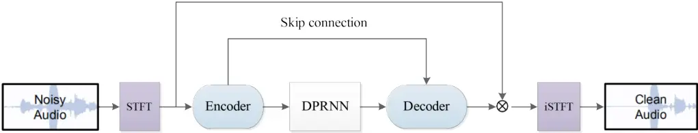
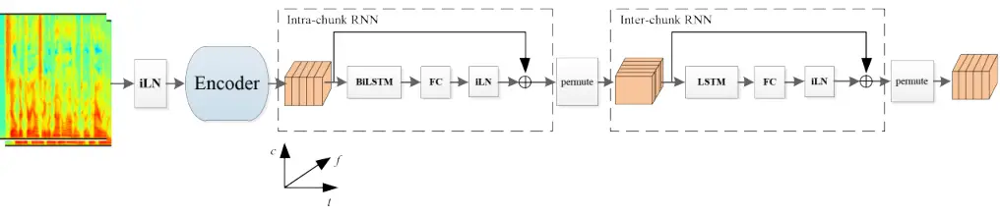

# DPCRN: Dual-Path Convolution Recurrent Network for Single Channel Speech Enhancement

###### Abstract

The dual-path RNN (DPRNN) was proposed to more effectively model
extremely long sequences for speech separation in the time domain. By
splitting long sequences to smaller chunks and applying intra-chunk and
inter-chunk RNNs, the DPRNN reached promising performance in speech
separation with a limited model size. In this paper, we combine the
DPRNN module with Convolution Recurrent Network (CRN) and design a model
called Dual-Path Convolution Recurrent Network (DPCRN) for speech
enhancement in the time-frequency domain. We replace the RNNs in the CRN
with DPRNN modules, where the intra-chunk RNNs are used to model the
spectrum pattern in a single frame and the inter-chunk RNNs are used to
model the dependence between consecutive frames. With only 0.8M
parameters, the submitted DPCRN model achieves an overall mean opinion
score (MOS) of 3.57 in the wide band scenario track of the Interspeech
2021 Deep Noise Suppression (DNS) challenge. Evaluations on some other
test sets also show the efficacy of our model.

Xiaohuai Le^(1,2,3), Hongsheng Chen^(1,2,3), Kai Chen^(1,2,3), Jing
Lu^(1,2,3)

¹Key Laboratory of Modern Acoustics, Nanjing University, Nanjing 210093,
China  
²NJU-Horizon Intelligent Audio Lab, Horizon Robotics, Beijing 100094,
China  
³Nanjing Institute of Advanced Artificial Intelligence, Nanjing 210014,
China

{mg20220173, hschen}@smail.nju.edu.cn, {chenkai, lujing}@nju.edu.cn

Index Terms: speech enhancement, deep learning, time-frequency domain,
dual-path RNN

## 1 Introduction

The widespread noise and reverberation may seriously degrade the
performance of automatic speech recognition (ASR) systems and decrease
speech intelligibility in communication. Speech enhancement aims at
separating clean speech from background interference for higher speech
intelligibility and perceptual quality. Despite the rapid progress of
DNN-based speech enhancement recently, its performance in real
applications still faces the challenges such as low signal-to-noise
ratio (SNR), high reverberation and far-field pickup. The Interspeech
2021 deep noise suppression (DNS) challenge \[1\] is organized to foster
more competitive speech enhancement system in adverse environments, and
training datasets and evaluation metrics are provided for such purpose.

As a data-driven supervised learning approach, DNN-based speech
enhancement can be mainly categorized into time-frequency domain \[2, 3,
4\] and time domain \[5, 6, 7\] methods. The time-frequency (T-F) domain
methods aim to extract the acoustic features (e.g., complex spectrum or
logarithmic power spectrum) of clean speech from the features of noisy
speech. Common training targets include ideal ratio mask (IRM) \[8\] and
target magnitude spectrum (TMS) \[3\], etc. The phase spectrum is also
considered to benefit the speech quality \[9\]. However, it is difficult
to estimate phase spectrum directly because of its unstructured
characteristic. Phase-sensitive mask (PSM) \[4\] was proposed to exploit
phase information for speech enhancement. More recent methods, such as
PHASEN \[10\], make use of the inter-connection between the magnitude
and phase spectrum for better phase estimation. Some other methods
retrieve phase implicitly by optimizing the real and imaginary parts of
the complex spectrum \[11\] or estimating complex ratio mask (CRM)
\[12\]. Since complex-valued weights are suitable for modeling the
inherent information of the spectrum, complex-valued neural networks
\[13\] have also been used for speech enhancement.

The time domain methods directly estimate the clean speech waveforms
through end-to-end training, circumventing the trouble of estimating
phase information in the T-F domain. As a typical method in the time
domain, Conv-Tasnet \[5\] utilizes a 1-D convolution neural network
(Conv-1D) \[14\] as an encoder to convert time-domain waveform into
effective representations for effective clean speech estimation, and
then converts the representations back to waveform by a transposed
convolutional layer called decoder. Time domain methods suffer from the
difficulty of modeling extremely long sequences so that very deep
convolutional layers like wave-u-net \[7\] have to be utilized for
feature compression. Conventional recurrent neural networks (RNNs) are
also not effective for modeling such long sequences. Dual-path recurrent
neural network (DPRNN) \[15\] was proposed to address this problem, in
which the long sequential features are split into smaller chunks and
processed by intra-chunk and inter-chunk RNNs iteratively, reducing the
length of the sequence to be processed for every RNN.

The intra-chunk operation in DPRNN aims at modeling the signal feature
within a frame, which is also applicable in the frequency domain with
the potential benefit of making full use of the harmonic spectral
structure of speech. Thus it is reasonable to implement similar network
in the T-F domain. When designing models for real-time speech
enhancement, it is impractical to apply a convolutional neural network
(CNN) with too many layers or non-causal structures like bidirectional
long short-term memory (BiLSTM) \[10\]. Recently a network structure
called convolution recurrent network (CRN) \[16\] is proposed. Taking
advantage of both CNNs and RNNs, CRN can not only capture the local
patterns of the spectrogram, but also model the dependence between
consecutive frames. In this paper, we combine DPRNN and CRN in the T-F
domain. On the basis of CRN, a new model called _dual-path convolution
recurrent network_ (DPCRN) is proposed. Similar to the DPRNN in the time
domain, the DPCRN also uses two kinds of RNNs. The intra-chunk RNN is
used to model the spectrum of a single time frame, while inter-chunk RNN
is used to model the variation of the spectrum over time. The features
compressed by convolutional layers are fed into DPRNN module for further
processing, followed by a decoder composed of transposed convolutional
layers. The CRM is output from the last transposed convolutional layer.
We evaluate the DPCRN on the Interspeech 2021 DNS challenge dataset.
Experimental results show that the DPCRN outperforms the baseline
models, including NSNet2 \[17\], DTLN \[18\] and DCCRN \[13\]. On
simulated test datasets, our model achieves competitive results as
baseline models and show better performance in the case of low SNR. With
only 0.8M parameters, our model achieves an overall MOS of 3.57
according to the ITU-T P.835 \[19\] subjective evaluation on DNS
challenge blind test set, and reaches the third place in the wide band
scenario track.

## 2 Dual-Path Convolution Recurrent Network

### 2.1 Problem formulation

In the time domain, the observed noisy speech can be formulated as
$`x(t)=s(t)+n(t)`$, where $`x(t)`$, $`s(t)`$ and $`n(t)`$ refer to the
noisy, the clean and the noise signals, respectively. The formula can be
transformed into time-frequency domain by the short-time Fourier
transform (STFT) as:

```math
X(t,f)=S(t,f)+N(t,f){\rm{,}} \tag{1}
```

where $`X(t,f)`$, $`S(t,f)`$ and $`N(t,f)`$ represent the time-frequency
bin of the noisy, the clean and the noise speech spectrogram,
respectively, at time frame $`t`$ and frequency index $`f`$. In order to
recover clean speech from the mixture, a common way is to estimate a
mask $`M(t,f)`$ and multiply it by the noisy speech $`X(t,f)`$ \[3\].
For phase retrieval, we can separately estimate masks for magnitude and
phase spectrogram or the real and imaginary parts of the complex
spectrogram \[13\]. Another method is to directly estimate the complex
ratio mask (CRM) \[12\] which is denoted as
$`M(t,f)=M_{r}(t,f)+iM_{i}(t,f)`$, where $`M_{r}(t,f)`$ and
$`M_{i}(t,f)`$ represent the real and imaginary parts of the mask. Then
the denoising process can be expressed as the complex product of mask
and noisy speech in the form of:

```math
\widetilde{S}(t,f)=X(t,f)\odot M(t,f), \tag{2}
```

where $`\odot`$ denotes element-wise multiplication and
$`\widetilde{S}(t,f)`$ is the enhanced speech. Instead of estimating the
mask directly, applying the signal approximation (SA) \[20\] usually
leads to better optimization. SA minimizes the difference between the
enhanced speech and clean speech with the loss function described as
$`\mathcal{L}=Loss(\widetilde{S}(t,f),S(t,f))`$.

### 2.2 Model architecture

Dual-path RNN (DPRNN), originally proposed in \[15\], achieves
state-of-the-art (SOTA) performance in single-channel speech separation
task in the time domain. In this model, the speech waveform is converted
into effective representations by an encoder which consists of Conv-1D
layer. The separation is then performed by passing the encoder features
to a well-designed DNN. For better performance, smaller kernel size of
the Conv-1D is usually utilized, resulting in extremely long feature
chunks. Conventional RNNs have trouble modeling such long sequences. In
DPRNN, a long sequence is divided into overlapping chunks and processed
by intra-chunk and inter-chunk RNNs for better optimization. Recently,
the DPRNN has also been combined with self-attention mechanism for
time-domain speech enhancement \[21\].

The intra-chunk operation in DPRNN is also applicable in the frequency
domain with the potential benefit of making full use of the spectral
structure of speech. By combining DPRNN and CRN, it is possible to
obtain a well-behaved model in the T-F domain. Similar to the original
DPRNN, our model consists of an encoder, a dual-path RNN module and a
decoder, as shown in Figure 1(a). The structure of the encoder and
decoder is similar to CRN \[16\]. We send the real and imaginary parts
of complex spectrogram of the noisy signal into the encoder as two
streams. The encoder uses the 2-D convolutional (Conv-2D) layers to
extract local patterns from noisy spectrogram and reduce the feature
resolution. The decoder uses transposed convolutional layers to restore
low-resolution features to the original size, forming a symmetric
structure with the encoder. There are skip connections between the
encoder and the decoder to pass the detailed information. Every
convolutional layer is followed by a batch normalization and a PReLU
function \[22\]. We replace the RNN part of the CRN with the DPRNN
module, as depicted in Figure 1(b). Different from the original DPRNN,
we regard the frames in STFT as the chunks for DPRNN processing. Instead
of learning the dependence in the time domain, the intra-chunk RNNs are
applied to model the spectral patterns in a single frame. We believe
that modeling the dependence of frequency is beneficial to speech
enhancement due to the harmonic structures of speech. RNNs can overcome
the shortcoming of limited receptive field of CNNs and capture long-term
harmonic correlation. As for the inter-chunk RNNs, we use LSTM to model
the time dependence of a certain frequency, so that a strict causality
can be guaranteed. These LSTMs are computed in parallel. BiLSTM is used
for intra-chunk modeling, which will not influence the causality of the
whole system. The LSTM and BiLSTM are followed by a fully-connected
layer (FC) and a layer normalization (LN) \[23\]. A residual connection
\[24\] is then applied between the input of RNN and the output of LN to
further mitigate the gradient vanishing problem.

Instead of the common LN, we use instant layer normalization (iLN)
\[18\] in our model, where all frames calculate statistics independently
on frequency axis $`f`$ and channel axis $`c`$, and share the same
trainable parameters. Denote $`\mathbf{F}_{t}\in\mathbb{R}^{N\times K}`$
as the feature matrix of the $`t`$-th frame, $`N`$ and $`K`$ the feature
dimensions of $`f`$ and $`c`$, $`\hat{E}`$ and $`\hat{D}`$ the mean and
variance operator, $`\bm{\gamma}`$ and
$`\bm{\beta}\in\mathbb{R}^{N\times K}`$ trainable parameters, and
$`\varepsilon`$ a regularization parameter, then the iLN for the feature
at time index $`t`$ is defined as:

```math
iLN\left(\mathbf{F}_{t}\right)=\frac{\mathbf{F}_{t}-\hat{E}\left[\mathbf{F}_{t}\right]}{\sqrt{\hat{D}\left[\mathbf{F}_{t}\right]+\varepsilon}}\odot\bm{\gamma}+\bm{\beta}, \tag{3}
```

where

```math
\hat{E}\left[\mathbf{F}_{t}\right]=\frac{1}{NK}\sum_{f=1}^{N}\sum_{c=1}^{K}{\mathbf{F}_{t}\left[f,c\right]} \tag{4}
```

and

```math
\hat{D}\left[\mathbf{F}_{t}\right]=\frac{1}{NK}\sum_{f=1}^{N}\sum_{c=1}^{K}\left(\mathbf{F}_{t}\left[f,c\right]-\hat{E}\left[\mathbf{F}_{t}\right]\right)^{2}. \tag{5}
```

To reduce the sensitivity of the model output to the energy of the input
signal, we also apply the iLN on the input spectrogram.

### 2.3 Learning Target and Loss function



(a)



(b)

Figure 1: (a) Proposed DPCRN model and (b) the diagram of the DPRNN
module. “f”, “t” and “c” represent frequency, time and channel axes,
respectively.

In our experiments, the learning target of DPCRN is CRM. The real and
imaginary parts of the CRM are outputs from the decoder as two streams.
In training stage, the learning target is optimized by signal
approximation (SA). Multiplying the spectrogram of noisy speech
$`X=X_{r}+iX_{i}`$ with the estimated mask $`M=M_{r}+iM_{i}`$, we get
enhanced spectrogram in the form of:

```math
\widetilde{S}=X_{r}M_{r}-X_{i}M_{i}+i(X_{r}M_{i}+X_{i}M_{r}), \tag{6}
```

which is converted back to the waveform using inverse STFT (iSTFT):

```math
\widetilde{s}=\mathrm{iSTFT}(\widetilde{S}). \tag{7}
```

We use two loss function in the experiments for comparation. The first
loss function $`f`$ is the negative signal-to-noise ratio (SNR) \[25\]
defined as:

```math
f(s,\widetilde{s})=-10\mathrm{log}_{\mathrm{10}}(\frac{\sum_{t}{s(t)^{2}}}{\sum_{t}(s(t)-\widetilde{s}(t))^{2}}). \tag{8}
```

Compared with commonly used scale invariant SNR (SI-SNR), it can
constrain the amplitude of the output and avoid level offset between
input and output, which is important for real-time processing. Taking
the spectrogram quality into consideration, we add the mean square error
(MSE) of the spectrogram to the negative SNR and get the second loss
function, which is defined as:

```math
\begin{split}\mathcal{L}_{\mathrm{MSE}}=&f(s,\widetilde{s})+\mathrm{log}(\mathrm{MSE}(S_{r},\widetilde{S}_{r})+\mathrm{MSE}(S_{i},\widetilde{S}_{i})\\
&+\mathrm{MSE}(|S|,|\widetilde{S}|)).\end{split} \tag{9}
```

The added MSE loss consists of three parts, which respectively measure
the difference of real part, imaginary part and magnitude between the
estimated spectrogram and the true one. We take the logarithm of the MSE
loss to ensure that it is of the same order of magnitude as the negative
SNR.

## 3 Experiments

### 3.1 Datasets

We trained the DPCRN on the Interspeech 2021 DNS challenge dataset.
60000 clips of reverberant speech (about 500 h) were generated, with
55000 clips for training and 5000 for validation. The noise clips were
mainly generated from Audioset \[26\], DEMAND \[27\] and Freesound¹¹ 1
https://freesound.org/. In training stage, we randomly split the waves
into 5-second segments and convolved them with room impulse responses
(RIRs) randomly-selected from openSLR26 and openSLR28 \[28\]. Then the
noisy speech was generated by mixing reverberant speech and noise. The
SNR range of the mixture is set between -5 and 5 dB.

In order to test the performance under various unknown noise, we also
used the test set from WSJ-0 \[29\] as the test speech. It contains 651
utterances from 8 speakers. There are two noise datasets used for test;
one is the music data from MUSAN \[30\], the other is babble, factory1
and f16 from NOISEX92 \[31\]. The SNR range of the test noisy speech is
the same as the training set. We also evaluated the model on the
development test set and blind test set provided by DNS challenge. All
the audio used is sampled at 16kHz.

### 3.2 Parameter setup

In our model, the window length and hop size are 25ms and 12.5ms
respectively, resulting in a total latency of 37.5ms, which satisfies
the DNS challenge requirement. The FFT length is 400 and the sine window
is applied before FFT and overlap-add. The 201-dimensional complex
spectrum is fed into the model. The channel number of the convolutional
layers in the encoder is {32,32,32,64,128}. The kernel size and the
stride are respectively set to {(5,2),(3,2),(3,2),(3,2),(3,2)} and
{(2,1),(2,1),(1,1),(1,1),(1,1)} in frequency and time dimension. All the
Conv-2D and transposed Conv-2D layers are causally computed. We use two
DPRNN modules, each of them has RNNs with a hidden dimension of 128. The
total model parameters is about 0.8M. There are three models for
comparison in the following experiments. The models with loss functions
shown in equation (8) and (9) are called DPCRN-1 and DPCRN-2,
respectively. In the third model, called DPCRN-3, we set the stride to
{(2,1),(2,1),(2,1),(1,1),(1,1)}, reducing frequency resolution of the
feature fed into the DPRNN by half. At the same time, we double the
hidden dimension of the intra-chunk RNN for the same computational
complexity. The loss function of DPCRN-3 is the same as DPCRN-1.

The models are trained by Adam optimizer \[32\] and the batch size is 8.
The initial learning rate is 1e-3 and it will be halved if the loss on
the validation set does not improve for five consecutive epochs. Early
stopping is also applied in training if the loss on the validation set
does not improve for ten epochs. TensorFlow is employed for model
implementation and a Nvidia GeForce GTX 1080Ti is used for training.

|         |      |      |      |      |     |             |       |       |       |     |             |       |       |       |
| ------- | ---- | ---- | ---- | ---- | --- | ----------- | ----- | ----- | ----- | --- | ----------- | ----- | ----- | ----- |
| Metrics | PESQ |      |      |      |     | STOI (in %) |       |       |       |     | SDR (in dB) |       |       |       |
| SNR(dB) | -5   | 0    | 5    | Avg. |     | -5          | 0     | 5     | Avg.  |     | -5          | 0     | 5     | Avg.  |
| Noisy   | 1.67 | 2.01 | 2.35 | 2.01 |     | 71.10       | 81.44 | 89.63 | 80.72 |     | -4.91       | 0.04  | 5.02  | 0.05  |
| DTLN    | 2.23 | 2.62 | 2.93 | 2.59 |     | 82.53       | 90.52 | 94.98 | 89.34 |     | 5.74        | 10.01 | 13.77 | 9.85  |
| DCCRN   | 2.42 | 2.87 | 3.23 | 2.84 |     | 86.40       | 93.08 | 96.63 | 92.04 |     | 6.17        | 11.08 | 15.05 | 10.76 |
| DPCRN-1 | 2.51 | 2.85 | 3.14 | 2.83 |     | 86.78       | 92.70 | 95.97 | 91.82 |     | 7.48        | 11.17 | 14.46 | 11.04 |
| DPCRN-2 | 2.52 | 2.87 | 3.15 | 2.85 |     | 87.10       | 92.93 | 96.04 | 92.02 |     | 7.40        | 11.14 | 14.44 | 10.99 |
| DPCRN-3 | 2.33 | 2.68 | 2.97 | 2.66 |     | 84.26       | 91.02 | 94.96 | 90.08 |     | 6.12        | 10.02 | 13.49 | 9.88  |

Table 1: Experimental results on WSJ0-MUSAN test set. BLOD indicates the
best result for each case.

|         |      |      |      |      |     |             |       |       |       |     |             |      |       |      |
| ------- | ---- | ---- | ---- | ---- | --- | ----------- | ----- | ----- | ----- | --- | ----------- | ---- | ----- | ---- |
| Metrics | PESQ |      |      |      |     | STOI (in %) |       |       |       |     | SDR (in dB) |      |       |      |
| SNR(dB) | -5   | 0    | 5    | Avg. |     | -5          | 0     | 5     | Avg.  |     | -5          | 0    | 5     | Avg. |
| Noisy   | 1.43 | 1.71 | 2.05 | 1.72 |     | 62.79       | 75.47 | 86.23 | 74.94 |     | -4.93       | 0.04 | 5.02  | 0.09 |
| DTLN    | 1.91 | 2.34 | 2.67 | 2.31 |     | 72.72       | 85.90 | 92.68 | 83.91 |     | 4.15        | 8.55 | 12.36 | 8.42 |
| DCCRN   | 1.85 | 2.34 | 2.78 | 2.32 |     | 74.51       | 87.87 | 94.38 | 85.59 |     | 2.79        | 8.22 | 12.60 | 7.87 |
| DPCRN-1 | 2.04 | 2.46 | 2.80 | 2.43 |     | 77.00       | 88.20 | 93.80 | 86.33 |     | 5.36        | 9.45 | 12.96 | 9.25 |
| DPCRN-2 | 2.05 | 2.49 | 2.83 | 2.46 |     | 76.98       | 88.28 | 93.88 | 86.38 |     | 5.22        | 9.37 | 12.90 | 9.16 |
| DPCRN-3 | 1.90 | 2.31 | 2.66 | 2.29 |     | 74.86       | 86.61 | 92.88 | 84.78 |     | 4.51        | 8.70 | 12.28 | 8.50 |

Table 2: Experimental results on WSJ0-NOISEX92 test set. BLOD indicates
the best result for each case.

### 3.3 Baselines and evaluation metrics

We compare our model with the top-ranking models in Interspeech 2020 DNS
challenge on the first test set, including DTLN \[18\] and DCCRN \[13\].
DTLN combines the STFT and a learnable transformation with only 1M
parameters. DCCRN uses complex-valued convolution neural networks and
got the first place in the real-time track. The baseline model NSNet2
\[17\] provided by Interspeech 2021 DNS challenge is also compared on
the DNS test set.

On the simulated WSJ0 test set, we use three objective evaluation
metrics: perceptual evaluation of speech quality (PESQ) \[33\],
shorter-time objective intelligibility (STOI) \[34\] and signal to
distortion Ratio (SDR) \[35\]. On the DNS challenge development test
set, we use DNSMOS \[36\] for evaluation, which is a DNN-based
non-intrusive speech quality evaluation metric. A subjective evaluation
according to ITU-T P.835 \[19\] was also applied on the DNS blind test
set as the final result.

|         |           |                 |        |     |
| ------- | --------- | --------------- | ------ | --- |
| Model   | Para. (M) | look-ahead (ms) | DNSMOS |     |
| Noisy   | -         | -               | 2.899  |     |
| NSNet2  | 2.8       | 0               | 3.243  |     |
| DTLN    | 1.0       | 0               | 3.226  |     |
| DCCRN   | 3.7       | 37.5            | 3.373  |     |
| DPCRN-1 | 0.8       | 0               | 3.454  |     |
| DPCRN-2 | 0.8       | 0               | 3.472  |     |

Table 3: DNSMOS on DNS challenge development test set.

|         |            |                      |             |     |
| ------- | ---------- | -------------------- | ----------- | --- |
| Model   | Speech MOS | Background Noise MOS | Overall MOS |     |
| Noisy   | 3.89       | 2.60                 | 2.77        |     |
| NSNet2  | 3.35       | 3.88                 | 3.07        |     |
| DPCRN-2 | 3.76       | 4.34                 | 3.57        |     |

Table 4: Performance on DNS challenge blind test set.

### 3.4 Results and analysis

The performance on simulated WSJ0-MUSAN test set is presented in
Table 1. It can be seen that when the SNR is greater than or equal to 0
dB, the performance of DPCRN-1 is slightly weaker than DCCRN, but better
than DTLN. It should be noted that DPCRN-1 performs better than DCCRN at
lower SNR. Table 2 shows the results on WSJ0-NOISEX92 test set. Under
more disruptive noise from NOISEX92, the DPCRN-1 exceeds the baseline
models in terms of all three metrics, demonstrating the benefit of the
DPRNN module for spectrogram modeling. On both datasets, DPCRN-2 has
better performance than DPCRN-1 in terms of PESQ and STOI but its SDR is
slightly worse, indicating that including the time-frequency MSE in the
loss function has benefit to speech quality. DPCRN-3 has more parameters
than DPCRN-1, but its performance is worse, which indicates that
reducing the frequency resolution of the features fed into the DPRNN is
detrimental to the system. RNN faces the difficulty of parallel
computation, which is a challenge to real-time processing. In our
submitted model, we set the frequency dimension of the feature to 50 to
guarantee a decent frequency resolution while meeting the real-time
requirements of DNS challenge.

In Table 3, we compare DPCRN with baseline models on the DNS challenge
development test set. “Para.” and “look-ahead” in the table respectively
represent the parameter amount of the model and the length of used
future information. With about 0.8M parameters and without any future
information, our models perform better than the baseline models in terms
of DNSMOS, among which the DPCRN-2 is the best one. Therefore, we choose
this model for the wide band scenario track. The final P.835 MOS on the
DNS challenge blind test set are shown in Table 4, which gives speech,
background noise and overall MOS. With a little speech quality
deterioration, the submitted model achieves an overall MOS of 3.57 and
ranks the third in the wide band scenario track. The computation
complexity of our model is about 7.45 Giga floating-point operations per
second (GFLOPS) and the one frame processing time of the TensorFlow
implementation is 8.9 ms on a quad-core Intel i5-6300HQ.

## 4 Conclusions

Inspired by the successful application of DPRNN and CRN, we propose a
deep learning-based speech enhancement model in the time-frequency
domain, named as DPCRN. It combines the local pattern modeling
capability of CNN and the long-term modeling capability of DPRNN.
Compared with CRN, DPCRN demonstrates the benefit of RNN for spectrum
modeling. With only 0.8M parameters, our model achieves competitive
results on various unknown noise datasets. In the future, we will try to
reduce the computational complexity of the model for wider band spectrum
processing.

## 5 Acknowledgement

The National Science Foundation of China supported this work with grant
number 11874219.

## References

- \[1\] C. K. A. Reddy, H. Dubey, K. Koishida, A. Nair, V. Gopal,
  R. Cutler, S. Braun, H. Gamper, R. Aichner, and S. Srinivasan,
  “Interspeech 2021 Deep Noise Suppression Challenge,” _arXiv
  e-prints_, p. arXiv:2101.01902, 2021.
- \[2\] Y. Xu, J. Du, L. Dai, and C. Lee, “A regression approach to
  speech enhancement based on deep neural networks,” _IEEE/ACM
  Transactions on Audio, Speech, and Language Processing_, vol. 23,
  no. 1, pp. 7–19, 2015.
- \[3\] D. Wang and J. Chen, “Supervised speech separation based on deep
  learning: An overview,” _IEEE/ACM Transactions on Audio, Speech, and
  Language Processing_, vol. 26, no. 10, pp. 1702–1726, 2018.
- \[4\] H. Erdogan, J. R. Hershey, S. Watanabe, and J. Le Roux,
  “Phase-sensitive and recognition-boosted speech separation using deep
  recurrent neural networks,” in _2015 IEEE International Conference on
  Acoustics, Speech and Signal Processing (ICASSP)_, 2015, pp. 708–712.
- \[5\] Y. Luo and N. Mesgarani, “Conv-tasnet: Surpassing ideal
  time–frequency magnitude masking for speech separation,” _IEEE/ACM
  Transactions on Audio, Speech, and Language Processing_, vol. 27,
  no. 8, pp. 1256–1266, 2019.
- \[6\] S. Fu, T. Wang, Y. Tsao, X. Lu, and H. Kawai, “End-to-end
  waveform utterance enhancement for direct evaluation metrics
  optimization by fully convolutional neural networks,” _IEEE/ACM
  Transactions on Audio, Speech, and Language Processing_, vol. 26,
  no. 9, pp. 1570–1584, 2018.
- \[7\] D. Stoller, S. Ewert, and S. Dixon, “Wave-U-Net: A Multi-Scale
  Neural Network for End-to-End Audio Source Separation,” _arXiv
  e-prints_, p. arXiv:1806.03185, 2018.
- \[8\] C. Hummersone, T. Stokes, and T. Brookes, _On the Ideal Ratio
  Mask as the Goal of Computational Auditory Scene Analysis_, 2014, pp.
  349–368.
- \[9\] K. Paliwal, K. Wojcicki, and B. Shannon, “The importance of
  phase in speech enhancement,” _Speech Communication_, vol. 53, pp.
  465–494, 2011.
- \[10\] D. Yin, C. Luo, Z. Xiong, and W. Zeng, “Phasen: A
  phase-and-harmonics-aware speech enhancement network,” _Proceedings of
  the AAAI Conference on Artificial Intelligence_, vol. 34, pp.
  9458–9465, 2020.
- \[11\] K. Tan and D. Wang, “Learning complex spectral mapping with
  gated convolutional recurrent networks for monaural speech
  enhancement,” _IEEE/ACM Transactions on Audio, Speech, and Language
  Processing_, vol. 28, pp. 380–390, 2020.
- \[12\] D. S. Williamson, Y. Wang, and D. Wang, “Complex ratio masking
  for monaural speech separation,” _IEEE/ACM Transactions on Audio,
  Speech, and Language Processing_, vol. 24, no. 3, pp. 483–492, 2016.
- \[13\] Y. Hu, Y. Liu, S. Lv, M. Xing, S. Zhang, Y. Fu, J. Wu,
  B. Zhang, and L. Xie, “DCCRN: Deep Complex Convolution Recurrent
  Network for Phase-Aware Speech Enhancement,” _arXiv e-prints_, p.
  arXiv:2008.00264, 2020.
- \[14\] C. Lea, R. Vidal, A. Reiter, and G. Hager, “Temporal
  convolutional networks: A unified approach to action
  segmentation,” 2016.
- \[15\] Y. Luo, Z. Chen, and T. Yoshioka, “Dual-path rnn: Efficient
  long sequence modeling for time-domain single-channel speech
  separation,” in _ICASSP 2020 - 2020 IEEE International Conference on
  Acoustics, Speech and Signal Processing (ICASSP)_, 2020, pp. 46–50.
- \[16\] H. Zhao, S. Zarar, I. Tashev, and C. Lee,
  “Convolutional-recurrent neural networks for speech enhancement,” in
  _2018 IEEE International Conference on Acoustics, Speech and Signal
  Processing (ICASSP)_, 2018, pp. 2401–2405.
- \[17\] Y. Xia, S. Braun, C. K. A. Reddy, H. Dubey, R. Cutler, and
  I. Tashev, “Weighted speech distortion losses for neural-network-based
  real-time speech enhancement,” in _ICASSP 2020 - 2020 IEEE
  International Conference on Acoustics, Speech and Signal Processing
  (ICASSP)_, 2020, pp. 871–875.
- \[18\] N. L. Westhausen and B. T. Meyer, “Dual-Signal Transformation
  LSTM Network for Real-Time Noise Suppression,” _arXiv e-prints_, p.
  arXiv:2005.07551, 2020.
- \[19\] B. Naderi and R. Cutler, “A Crowdsourcing Extension of the
  ITU-T Recommendation P.835 with Validation,” _arXiv e-prints_, p.
  arXiv:2010.13200, 2020.
- \[20\] F. Weninger, J. R. Hershey, J. Le Roux, and B. Schuller,
  “Discriminatively trained recurrent neural networks for single-channel
  speech separation,” in _2014 IEEE Global Conference on Signal and
  Information Processing (GlobalSIP)_, 2014, pp. 577–581.
- \[21\] A. Pandey and D. Wang, “Dual-path Self-Attention RNN for
  Real-Time Speech Enhancement,” _arXiv e-prints_, p.
  arXiv:2010.12713, 2020.
- \[22\] K. He, X. Zhang, S. Ren, and J. Sun, “Delving deep into
  rectifiers: Surpassing human-level performance on imagenet
  classification,” in _2015 IEEE International Conference on Computer
  Vision (ICCV)_, 2015, pp. 1026–1034.
- \[23\] J. Lei Ba, J. R. Kiros, and G. E. Hinton, “Layer
  Normalization,” _arXiv e-prints_, p. arXiv:1607.06450, Jul. 2016.
- \[24\] K. He, X. Zhang, S. Ren, and J. Sun, “Deep residual learning
  for image recognition,” in _2016 IEEE Conference on Computer Vision
  and Pattern Recognition (CVPR)_, 2016, pp. 770–778.
- \[25\] I. Kavalerov, S. Wisdom, H. Erdogan, B. Patton, K. Wilson,
  J. Le Roux, and J. R. Hershey, “Universal sound separation,” in _2019
  IEEE Workshop on Applications of Signal Processing to Audio and
  Acoustics (WASPAA)_, 2019, pp. 175–179.
- \[26\] J. F. Gemmeke, D. P. W. Ellis, D. Freedman, A. Jansen,
  W. Lawrence, R. C. Moore, M. Plakal, and M. Ritter, “Audio set: An
  ontology and human-labeled dataset for audio events,” in _2017 IEEE
  International Conference on Acoustics, Speech and Signal Processing
  (ICASSP)_, 2017, pp. 776–780.
- \[27\] J. Thiemann, N. Ito, and E. Vincent, “The diverse environments
  multi-channel acoustic noise database (demand): A database of
  multichannel environmental noise recordings,” _The Journal of the
  Acoustical Society of America_, vol. 133, p. 3591, 2013.
- \[28\] T. Ko, V. Peddinti, D. Povey, M. L. Seltzer, and S. Khudanpur,
  “A study on data augmentation of reverberant speech for robust speech
  recognition,” in _2017 IEEE International Conference on Acoustics,
  Speech and Signal Processing (ICASSP)_, 2017, pp. 5220–5224.
- \[29\] D. Paul and J. Baker, “The design for the wall street
  journal-based csr corpus,” 1992.
- \[30\] D. Snyder, G. Chen, and D. Povey, “MUSAN: A Music, Speech, and
  Noise Corpus,” _arXiv e-prints_, p. arXiv:1510.08484, 2015.
- \[31\] A. Varga and H. Steeneken, “Assessment for automatic speech
  recognition: Ii. noisex-92: A database and an experiment to study the
  effect of additive noise on speech recognition systems,” _Speech
  Communication_, vol. 12, pp. 247–251, 1993.
- \[32\] D. P. Kingma and J. Ba, “Adam: A Method for Stochastic
  Optimization,” _arXiv e-prints_, p. arXiv:1412.6980, 2014.
- \[33\] A. W. Rix, J. G. Beerends, M. P. Hollier, and A. P. Hekstra,
  “Perceptual evaluation of speech quality (pesq)-a new method for
  speech quality assessment of telephone networks and codecs,” in _2001
  IEEE International Conference on Acoustics, Speech, and Signal
  Processing. Proceedings (Cat. No.01CH37221)_, vol. 2, 2001, pp.
  749–752 vol.2.
- \[34\] C. Taal, R. Hendriks, R. Heusdens, and J. Jensen, “A short-time
  objective intelligibility measure for time-frequency weighted noisy
  speech,” 2010, pp. 4214 – 4217.
- \[35\] E. Vincent, R. Gribonval, and C. Fevotte, “Performance
  measurement in blind audio source separation,” _IEEE Transactions on
  Audio, Speech, and Language Processing_, vol. 14, no. 4, pp.
  1462–1469, 2006.
- \[36\] C. K. A. Reddy, V. Gopal, and R. Cutler, “DNSMOS: A
  Non-Intrusive Perceptual Objective Speech Quality metric to evaluate
  Noise Suppressors,” _arXiv e-prints_, p. arXiv:2010.15258, 2020.
