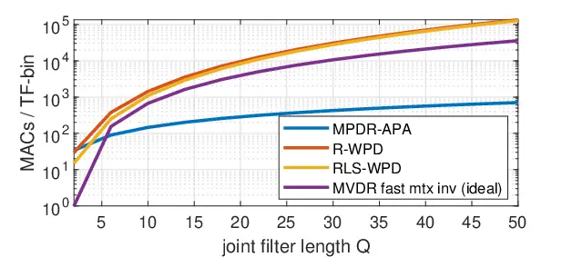

# Low complexity online convolutional beamforming

Sebastian Braun    Ivan Tashev

###### Abstract

Convolutional beamformers integrate the multichannel linear prediction
model into beamformers, which provide good performance and optimality
for joint dereverberation and noise reduction tasks. While longer
filters are required to model long reverberation times, the
computational burden of current online solutions grows fast with the
filter length and number of microphones. In this work, we propose a low
complexity convolutional beamformer using a Kalman filter derived affine
projection algorithm to solve the adaptive filtering problem. The
proposed solution is several orders of magnitude less complex than
comparable existing solutions while slightly outperforming them on the
REVERB challenge dataset.

###### Index Terms: 

Convolutional beamforming, dereverberation, noise reduction,
multichannel speech enhancement

^(†)^(†)address: Microsoft Research, Redmond, WA, USA  
{sebastian.braun, ivantash}@microsoft.com

## 1 Introduction

Increasing use of voice interfacing on mobile and wearable devices in
diverse acoustic scenarios to communicate with machines as well as
human-to-human telephony continues to pose more challenging demands on
speech enhancement algorithms. Especially increasing distances between
microphones and speech source degrade the SNR (SNR) and SRR (SRR), which
affects listener fatigue and intelligibility for humans and performance
of ASR (ASR) systems \[1\].

Multi-microphone processing enables use of spatial information in
addition to spectro-temporal information, typically enabling improved
enhanced speech quality and intelligibility. Multichannel speech
enhancement approaches are fixed coherence beamforming \[2\], adaptive
beamforming using parametric sound field models \[3\], direction-only
constraints \[4\], eigenvalue decomposition \[5\], or mask-based updates
\[6\], additional post-filtering \[7\], and MIMO processing \[8, 9\],
and combinations thereof. Frequency-domain multi-frame MIMO (MIMO)
filtering based on the MCLP (MCLP) model \[8, 9, 10, 11\] has been
proven very effective to reduce reverberation. The MCLP model has
recently been integrated into beamformers \[12, 13, 14\], which results
in less complex MISO (MISO) systems while ensuring optimality. These
systems are also referred to as _convolutional beamformers_, and are
subject to this study. Online processing systems are more practical as
they enable use of the same system for both real-time communication and
low-delay ASR. While there exist several online processing convolutional
beamformers \[15, 13, 14\], computational complexity can be still high
when targeting implementation on resource-constrained devices.

In this work, we propose a low-complexity APA (APA) solution to the
convolutional beamformer, which is derived from our previous Kalman
filter solution \[14\]. The proposed system is essentially an optimal
integration of a MPDR (MPDR) beamformer with a reverberation canceller.
In contrast to GSC (GSC)-based solutions \[13, 15, 16\], the proposed
constrained filter suffers less from signal cancellation, as it does not
require a blocking matrix, whose orthogonality assumption is often
violated in practice.

We show that the proposed APA beamformer solution is by several orders
of magnitudes less complex than the related R-WPD (R-WPD) and RLS-WPD
(RLS-WPD) beamformers \[15\]. For the proposed convolutional APA
beamformer, we propose a zero-complexity integrated speech PSD (PSD)
estimation and an optional DNN (DNN)-based PSD enhancement. We propose
an additional simplification of the convolutional APA beamformer
assuming a fixed noise field coherence. The proposed low-complexity
solution achieves comparable ASR results to the best online system in
\[15\], which additionally relies on complex MIMO pre-processing and a
DNN for steering vector estimation, while our steering vector is based
on a low-complexity localization system \[17\]. This paper distinguishes
from our previous work \[14\] by the reduced complexity adaptive filter,
the fixed coherence convolutional beamformer, improved PSD estimators,
complexity and ASR analysis.

## 2 Signal Model

We assume $`M`$ microphones capturing the sound in a reverberant and
noisy environment. The $`m^{th}`$ microphone signal in the STFT domain
is denoted by $`Y_{m}(k,n)`$, where $`k`$ and $`n`$ are the frequency
and time indices, respectively. The vector of microphone signals
$`\mathbf{y}(k,n)=[Y_{1}(k,n),\cdots,Y_{M}(k,n)]^{T}`$ is modeled by

```math
\mathbf{y}(k,n)=\mathbf{a}(k,n)X(k,n)+\mathbf{r}(k,n)+\mathbf{v}(k,n), \tag{1}
```

where $`X(k,n)`$ is the desired speech signal at the reference
microphone, $`\mathbf{a}(k,n)`$ is the acoustic RTF (RTF) vector, and
$`\mathbf{r}(k,n)`$ and $`\mathbf{v}(k,n)`$ denote reverberation and
additive noise, respectively.

The late reverberation can be modeled using the MCLP model \[8\] as a by
$`D`$ delayed prediction from the past $`L`$ frames in each frequency
band by

```math
\mathbf{r}(k,n)=\sum_{l=D}^{L}\mathbf{C}_{l}(k,n)\mathbf{y}(k,n-l), \tag{2}
```

where the matrices $`\mathbf{C}_{l}(k,n),\,l\in\{D,\ldots,L\}`$ denote
the MCLP coefficients, and $`L>D\geq 1`$. Note that strictly speaking,
the MCLP model (2) is only valid when the noise contribution
$`\mathbf{v}(k,n)`$ vanishes, i.e. at higher SNR. The frequency index
$`k`$ is omitted in the rest of the paper for better readability.

## 3 Joint minimum power beamforming and multichannel linear prediction

In this section, we propose a method for joint adaptive beamforming and
reverberation cancellation at the beamformer output. The desired signal
$`X(n)`$ is estimated by obtaining the beamformer output
$`X_{\text{b}}(n)`$ for the current frame, and subtracting the
reverberation at the beamformer output $`X_{\text{r}}(n)`$ predicted
from past $`L`$ frames by

```math
\widehat{X}(n)=\underbrace{\mathbf{w}_{\text{b}}^{T}(n)\mathbf{y}(n)}_{X_{\text{b}}(n)}-\underbrace{\sum_{l=D}^{L}\mathbf{c}_{l}^{T}(n)\ \mathbf{y}(n-l)}_{X_{\text{r}}(n)} \tag{3}
```

where $`\mathbf{w}_{\text{b}}`$ are the beamformer coefficients, and
$`\mathbf{c}_{\text{r},l}(n),\,l\in\{D,\ldots,L\}`$ are the prediction
filters of the reverberation at the beamformer output, obtained from the
MCLP model (2). To obtain a compact vector notation, (3) is re-written
as

```math
\widehat{X}(n)=\mathbf{w}^{T}(n)\,\mathbf{\tilde{y}}(n) \tag{4}
```

where
$`\mathbf{\tilde{y}}(n)=[\mathbf{y}^{T}(n),\mathbf{y}^{T}(n\!-\!D),\ldots,\mathbf{y}^{T}(n\!-\!L)]^{T}`$
are stacked microphone signals, and
$`\mathbf{w}(n)=[\mathbf{w}_{\text{b}}^{T}(n),-\mathbf{c}_{D}^{T}(n),\ldots,-\mathbf{c}_{L}^{T}(n)]^{T}`$
are stacked beamformer and reverberation prediction coefficient vectors
of length $`Q=M(L\!-\!D\!+\!2)`$, respectively.

### 3.1 Constrained Kalman filter beamformer

The joint convolutional beamformer weights $`\mathbf{w}(n)`$ are
obtained by minimizing the power of the output signal $`\widehat{X}(n)`$
under the directional beam-steering constraint, generally known as MPDR
beamformer, i. e.,

```math
\underset{\mathbf{w}}{\arg\min}\operatorname{E}\left\{|\mathbf{w}^{T}\,\mathbf{\tilde{y}}|^{2}\right\}\;\text{s. t.}\;\mathbf{w}^{T}\mathbf{\tilde{a}}+\epsilon_{a}=1, \tag{5}
```

where
$`\mathbf{\tilde{a}}=[\mathbf{a}^{T},\;\mathbf{0}_{1\times M(L-D+1)}]^{T}`$
is the zero-padded RTF vector. The directional constraint in (5) is
relaxed by introducing the small additive error $`\epsilon_{a}(n)`$,
which can model inaccuracies between the estimated and true steering
vector.

We reformulate the observation into a two-equation system \[18, 4\],
where the first row is obtained by re-arranging (4), and the second row
is the directional constraint from (5), i. e.,

```math
\underbrace{\begin{bmatrix}0\\
1\end{bmatrix}}_{\mathbf{d}}=\underbrace{\begin{bmatrix}\mathbf{\tilde{y}}^{T}(n)\\
\mathbf{\tilde{a}}^{T}(n)\end{bmatrix}}_{\mathbf{F}(n)}\mathbf{w}(n)+\underbrace{\begin{bmatrix}-\widehat{X}(n)\\
\epsilon_{a}(n)\end{bmatrix}}_{\boldsymbol{\epsilon}(n)}. \tag{6}
```

By assuming $`\widehat{X}(n)`$ and the directional error
$`\epsilon_{a}(n)`$ to be independent random variables, the observation
error correlation matrix
$`\boldsymbol{\Phi}_{\epsilon}(n)=\operatorname{E}\left\{\boldsymbol{\epsilon}(n)\boldsymbol{\epsilon}^{H}(n)\right\}`$
is a diagonal matrix given by

```math
\boldsymbol{\Phi}_{\epsilon}(n)=\operatorname{diag}\left\{\phi_{X}(n),\phi_{a}(n)\right\}, \tag{7}
```

where $`\phi_{X}(n)`$ and $`\phi_{a}(n)`$ are the PSD of
$`\widehat{X}(n)`$ and $`\epsilon_{a}(n)`$, and
$`\operatorname{diag}\{\}`$ constructs a matrix with its arguments on
the main diagonal and zeros elsewhere. The unknown evolution of the
time-varying filter $`\mathbf{w}(n)`$ can be modeled as first-order
Markov process

```math
\mathbf{w}(n)=\mathbf{w}(n-1)+\mathbf{q}(n), \tag{8}
```

where the independent random variable $`\mathbf{q}(n)`$ models the
filter uncertainty over time. The observation equation (6) and state
model (8) lead to the Kalman filter solution described in \[14\], which
requires estimation of the filter error covariance

```math
\mathbf{\Phi_{w}}(n)=\operatorname{E}\left\{\left[\mathbf{w}(n)-\mathbf{\widehat{w}}(n)\right]\left[\mathbf{w}(n)-\mathbf{\widehat{w}}(n)\right]^{H}\right\}, \tag{9}
```

where $`\mathbf{\widehat{w}}(n)`$ is the estimated filter.

### 3.2 Low complexity adaptive filter solution

Since the full Kalman filter \[14\] requires computing expensive updates
of $`\mathbf{\Phi_{w}}(n)`$, we assume $`\mathbf{\Phi_{w}}`$ to be a
fixed diagonal matrix, which simplifies the Kalman filter to kind of a
regularized APA. The recursive filter update is then obtained by

```math
\displaystyle\mathbf{K}(n) \displaystyle=\mathbf{\Phi_{w}}\mathbf{F}^{H}(n)\left[\mathbf{F}(n)\mathbf{\Phi_{w}}\mathbf{F}^{H}(n)+\mathbf{\Phi}_{\epsilon}(n)\right]^{-1} \tag{10}
```

```math
\displaystyle\mathbf{\widehat{w}}(n) \displaystyle=\mathbf{\widehat{w}}(n\!-\!1)+\mathbf{K}(n)\left[\mathbf{d}-\mathbf{F}(n)\mathbf{\widehat{w}}(n\!-\!1)\right] \tag{11}
```

where $`\mathbf{K}(n)`$ is the Kalman gain, and
$`\mathbf{d}(n),\mathbf{K}(n)`$ are defined in (6). Note that most
matrix multiplications in (10) can be implemented by simple element-wise
operations due to the diagonality of $`\mathbf{\Phi_{w}}`$.

After the beamformer update, we obtain the final output signal by adding
more control to the reverb canceller in (3), avoiding magnitude
over-subtraction of the reverberation to avoid echo-artifacts, and
limiting the amount of reverb cancellation \[9\]

```math
\widehat{X}(n)=X_{\text{b}}(n)-\alpha_{\text{r}}\min\{|\widehat{X}_{\text{r}}(n)|,|X_{\text{b}}(n)|\}\frac{\widehat{X}_{\text{r}}(n)}{|\widehat{X}_{\text{r}}(n)|}, \tag{12}
```

where $`0\leq\alpha_{\text{r}}\leq 1`$ controls the amount of reverb
reduction.

We propose to model the update of the beamformer
$`\mathbf{w}_{\text{b}}(n)`$ and reverberation prediction coefficients
$`\mathbf{c}_{\ell}(n)`$ separately with the time-invariant variances
$`\phi_{\text{b}}`$ and $`\phi_{\text{r}}`$, respectively. The filter
error covariance matrix is then given by

```math
\mathbf{\Phi_{w}}=\operatorname{diag}\big\{\underbrace{\phi_{\text{b}},\dots,\phi_{\text{b}}}_{M},\;\underbrace{\phi_{\text{r}},\ldots,\phi_{\text{r}}}_{M(L-D+1)}\big\}. \tag{13}
```

While the APA simplification has been proposed for the standard MPDR
beamformer in \[4\], here we use the convolutional MPDR, keep the
parameters $`\mathbf{\Phi_{w}}`$ and $`\phi_{X}(n)`$ more general, and
propose novel estimators for the speech PSD $`\phi_{X}(n)`$ in the
following.

### 3.3 Speech PSD estimation

In this section, a simple but effective estimation of the desired signal
PSD required in (7) is proposed, with an optional further enhancement
using a DNN, as shown in Fig. 1.

Figure 1: Proposed convolutional beamformer system. The yellow speech
PSD estimation block can be replaced by a DNN. We also explore using a
fixed coherence beamformer, adapting only the green reverb canceller
branch.

The desired signal PSD can be estimated at almost no additional cost by
applying the previously estimated filter coefficients to the current
frame, i. e.,

```math
\widehat{\phi}_{X}(n)=|\widehat{\mathbf{w}}^{T}(n-1)\,\tilde{\mathbf{y}}(n)|^{2}. \tag{14}
```

Note that the filtered signal term in (14) needs to be computed in the
filter update (11) as well, so it comes at almost no additional cost. In
contrast to \[14\], we found any temporal smoothing or decision-directed
estimation on (14) harmful to speech quality.

DNN-based PSD enhancement: As we found the PSD $`\widehat{\phi}_{X}(n)`$
to play an essential role on the beamformer performance, we propose an
optional enhancement of the PSD using a DNN for speech enhancement as
shown in Fig. 1. We use the CRUSE (CRUSE) proposed in \[19\], which was
trained to predict a spectral suppression filter to enhance
single-channel recorded speech. Thus, the pre-estimated PSD is enhanced
by suppressing residual noise and reverberation by

```math
\widehat{\phi}_{X}^{\text{DNN}}(n)=G_{\text{DNN}}^{2}(k,n)\,\widehat{\phi}_{X}(k,n), \tag{15}
```

where $`G_{\text{DNN}}(k,n)`$ is the enhancement filter predicted by the
DNN. The DNN consists of 4 causal convolutional encoder and decoder
layers with skip connections and a recurrent center layer. The network
runs in real-time with 4.2 M MACs per frame and uses only current and
past frame information.

To mitigate speech distortion, before the PSD estimate is inserted in
(7), we apply the lower bound
$`\max\left\{\widehat{\phi}_{X}(n),\;\eta\|\mathbf{y}(n)\|^{2}\right\}`$
depending on the mean input signal power scaled by $`\eta<1`$.

## 4 Fixed coherence beamformer with reverberation canceller

If we replace the beamformer in Fig. 1 with a fixed coherence
beamformer, e.g. the superdirective MVDR (MVDR) \[2\], we only need to
adapt the reverb canceller branch. Solving this system equivalently as
in Sec. 3.2 with the APA, the observation system (6) reduces to a single
equation, as we don’t need the directional constraint below the first
row anymore. The superdirective MVDR beamformer obeying these
directional constraints is given by

```math
\mathbf{w}_{\text{sd}}(n)=\underset{\mathbf{w}}{\arg\min}\,\mathbf{w}^{H}\mathbf{\Gamma}_{\text{d}}\mathbf{w}\quad\text{s. t.}\;\mathbf{w}^{H}\mathbf{a}=1, \tag{16}
```

where $`\mathbf{\Gamma}_{\text{d}}(k)`$ is the time-invariant diffuse
coherence matrix that depends only and the array geometry \[20\]. Note
that the RTF $`\mathbf{a}(n)`$ are in general still time-varying.
Consequently, the measurement equation for the adaptive filter becomes

```math
\underbrace{\mathbf{w}_{\text{sd}}^{H}(n)\mathbf{y}(n)}_{d(n)}=\mathbf{f}^{T}(n)\,\mathbf{w}_{\text{rc}}(n)+\widehat{X}(n) \tag{17}
```

where
$`\mathbf{f}(n)=[\mathbf{y}^{T}(n-\!D),\ldots,\mathbf{y}^{T}(n\!-\!L)]^{T}`$
and
$`\mathbf{w}_{\text{rc}}(n)=[\mathbf{c}_{D}^{T}(n),\ldots,\mathbf{c}_{L}^{T}(n)]^{T}`$.
The beamformer output on the left-hand side now becomes a time-frequency
variant constraint $`d(k,n)`$ for the adaptive filter, while the matrix
$`\mathbf{F}(n)`$ in (6) reduces to the vector $`\mathbf{f}^{T}(n)`$.
The APA filter update is obtained analogous with (10), (11) by replacing
$`\mathbf{F}`$, $`\mathbf{d}`$ with $`\mathbf{f}^{T}`$, $`d`$. The
speech PSD estimation becomes consequently

```math
\widehat{\phi}_{X}^{\text{sd}}(n)=|\mathbf{w}_{\text{sd}}^{H}(n)\,\mathbf{y}(n)-\mathbf{f}^{T}(n)\,\mathbf{w}_{\text{rc}}(n-1)|^{2}. \tag{18}
```

## 5 Beamformer complexity analysis

The complexity for all beamformers depends on the joint filter length
$`Q=M(L-D+2)`$, where $`L=0`$ yields the non-convolutional standard
beamformer.



Figure 2: Complexity of APA beamformer compared to recursive WPD and RLS
WPD \[15\]. Analysis involves beamformer only, excluding steering vector
and neural networks.

Figure 2 shows the number of MAC (MAC) operations required to compute
one beamformer update per time-frequency bin for the proposed MPDR-APA
beamformer. When the standard MVDR (16) uses an adaptive, time-variant
noise coherence estimate, such as mask-based beamformers \[21\], it
requires a matrix inversion, which we compute using the ideally fastest
matrix inversion algorithm we could find with $`O(Q^{2.37})`$ \[22\].
The _R-WPD_ and _RLS-WPD_ algorithms \[15\] employ efficient recursive
matrix inversion.

We can observe that the complexity of the APA solution grows only
linearly, while the other solutions rise quadratically with $`Q`$, as
they have to handle large full-size $`Q\times Q`$ matrices. Note that
the fast matrix inversion MACs are theoretical, and an equivalent
speed-up might not be achieved in practical implementations, still
justifying preference of the recursive WPD solutions over standard MVDR.
The proposed APA beamformer is a computationally favorable choice for
larger $`Q`$: While the standard MVDR solution requires inversion of an
$`Q\times Q`$ matrix, the MPDR-APA requires only $`2\times 2`$ matrix
inversion in (10). The computational advantage pays off for setups with
larger number of microphones $`M>4`$, and especially when using a
convolutional beamformer. For an $`M=8`$ mic setup, the total filter
length $`Q`$ can easily exceed 100 taps for typical convolutional filter
lengths in the range $`L=[6,20]`$.

## 6 Experimental validation

### 6.1 Evaluation setup

For public comparability, we show results on the REVERB challenge
evaluation set \[1\], comprising simulated and real recordings using a
uniform circular 8 microphone array with radius 10 cm in reverberant
rooms and moderate background noise. The algorithms are evaluated using
CD (CD), fwSNR (fwSNR), and WER (WER). The WER was obtained using the
Kaldi \[23\] REVERB challenge baseline speech recognizer using a TDNN
acoustic model trained using lattice-free MMI and online i-vector
extraction, and a tri-gram language model. We also measured the runtime
of the beamformers only (without steering vector estimation) in NumPy as
processing time per second of audio for an 8-channel setup.

In addition to the proposed convolutional APA beamformer
(_convMPDR-APA_), we also evaluate the plain _MPDR-APA_ beamformer
without reverb canceller, which is a special case of the proposed
framework for $`L\!=\!0`$. Both standard and convolutional beamformers
are used without and with DNN-based PSD enhancement described in
Sec. 3.3, where the acronym _convMPDR-APA-DNN_ represents the
convolutional beamformer with DNN PSD enhancement. In addition, we show
the superdirective (fixed coherence) beamformer with adaptive reverb
canceller proposed in Sec. 4. As baselines we have the unprocessed
_reference microphone_, _delay&sum_ and _superdirective MVDR_
beamformers, the single-channel _DNN_ (CRUSE) \[19\] applied on the
reference mic, mask-based MVDR beamformer using the DNN-mask to
adaptively update the noise covariance \[21\], and the competitive
_RLS-WPD_ \[15\] as the state-of-the-art online convolutional
beamformer.

The proposed methods are implemented with a STFT (STFT) using 50%
overlapping 32 ms square-root Hann windows and a 512-point FFT on 16 kHz
sampled signals. The convolutional filter lengths are
$`L\!=\!\{12,8,6\}`$ in three frequency bands with transition
frequencies $`\{800,2000\}`$ Hz. The beamformer and reverb canceller
filter variances are $`\phi_{\text{b}}\!=\!-37`$ dB and
$`\phi_{\text{r}}\!=\!-40`$ dB. The directional uncertainty is
$`\phi_{a}\!=\!-120`$ dB and the speech PSD estimates are limited with
$`\eta\!=\!-25`$ dB. The steering vector $`\mathbf{a}(k,n)`$ is
estimated using a spatial probability-based far-field localization
method \[17\] based on the simple plane wave sound propagation model.
CRUSE is trained on the data from \[24\] as described in \[19\], only
with adjusted STFT parameters. As the test signals are very short,
mostly below 10 s, all adaptive methods are initialized with a prior
pass to give the adaptive algorithms a chance to converge. All
parameters were tuned on the REVERB development set, and results are
shown on the evaluation set.

Note that _RLS-WPD_ uses DNN mask-based RTF steering vectors, while all
other beamformers use the localization-based steering vectors \[17\],
and the results are directly obtained from \[15\]. The steering vectors
for _RLS-WPD_ were either estimated from the mic signals, or from
MIMO-WPE pre-processed signals, which is a large additional
computational burden and time $`T_{\text{WPE}}`$, exceeding several
times the cost of _RLS-WPD_ itself due to MIMO design.

### 6.2 Results

The methods in Table 1 are categorized in three groups: i) the
single-channel references unprocessed microphone and DNN only, ii)
beamforming only, and iii) the proposed convolutional beamformers
compared to the methods proposed in \[15\].

|                           |         |       |      |          |                          |
| ------------------------- | ------- | ----- | ---- | -------- | ------------------------ |
|                           | SimData |       |      | RealData |                          |
| method                    | CD      | fwSNR | WER  | WER      | time/s                   |
| single-channel            |         |       |      |          |                          |
| ref mic                   | 3.96    | 3.62  | 5.21 | 19.15    | 0                        |
| DNN                       | 2.94    | 8.94  | 5.74 | 16.40    | 0.024                    |
| beamforming ($`L\!=\!0`$) |         |       |      |          |                          |
| delay & sum               | 3.11    | 6.37  | 4.00 | 13.11    | 0.003                    |
| superdirective MVDR       | 2.98    | 6.50  | 4.00 | 13.11    | 0.004                    |
| DNN-mask MVDR             | 3.14    | 6.42  | 4.18 | 13.99    | 0.035                    |
| MPDR-APA                  | 3.99    | 3.84  | 4.18 | 13.99    | 0.005                    |
| MPDR-APA-DNN              | 3.25    | 5.98  | 3.88 | 11.56    | 0.029                    |
| convolutional beamforming |         |       |      |          |                          |
| RLS-WPD^(†) (no WPE)      | 3.29    | 6.08  | 4.37 | 12.80    | 0.934                    |
| RLS-WPD^(†) (+ WPE)       | 3.21    | 6.26  | 4.14 | 11.88    | 0.934+$`T_{\text{WPE}}`$ |
| convMPDR-APA              | 3.79    | 4.85  | 4.79 | 12.00    | 0.009                    |
| convMPDR-APA-DNN          | 2.82    | 8.63  | 4.84 | 10.54    | 0.035                    |
| conv-sdMVDR               | 2.74    | 7.71  | 3.88 | 10.70    | 0.007                    |

Table 1: Results on REVERB challenge evaluation dataset in terms of
speech enhancement metrics, WER, and processing time.  
^(†) are using DNN-based RTF steering vectors.

While the DNN is able to greatly improve speech enhancement metrics and
WER in high reverberation conditions (RealData), the single-channel
distortion artifacts hurt WER in the low reverberant conditions in
SimData, leading to a slight overall degradation. For non-convolutional
beamformers, _delay&sum_ and _superdirective MVDR_ outperform the
adaptive _MPDR-APA_ and _DNN-mask MVDR_, because superdirectivity is
close to an optimal solution for the homogenous ambient background noise
and reverberation in the REVERB dataset. In non-homogenous, time-varying
noise fields, this might however change in favor of adaptive
beamformers. The DNN-enhanced PSD improves the _MPDR-APA_ significantly,
achieving the best WER for non-convolutional beamformers.

As ASR systems are very sensitive to reverberation, the reverb
cancellation of the convolutional beamformers provides a significant
performance gain in terms of WER over non-convolutional beamformers. The
DNN-based PSD enhancement provides significant gains to _convMPDR-APA_
especially for the speech enhancement metrics, attributed to improved
noise reduction. Finally, the convolutional superdirective beamformer
_conv-sdMVDR_ yields comparable speech enhancement performance to
_MVDR-APA-DNN_,with similar WER on RealData and better WER on SimData,
at even lower complexity. However, we would like to stress again that
the fixed noise field coherence of _conv-sdMVDR_ is a well fitting
solution for the dataset at hand, but might not generalize as well to
other noise fields including time-variant and directional noise, where
the adaptive convMPDR-APA can be advantageous.

The proposed convolutional beamformers perform comparable or better in
terms of speech enhancement metrics and WER compared to the
state-of-the-art _RLS-WPD_ convolutional beamformer. Furthermore, the
complexity and computation time of the proposed family of convolutional
APA beamformers, even with DNN enhancement, is a fraction of the
_RLS-WPD_ beamformer. The DNN-based steering vector estimation and
MIMO-WPE preprocessing adds an additional large computational burden,
where the MIMO-WPE processing time $`T_{\text{WPE}}`$ likely exceeds the
_RLS-WPD_ time itself.

## 7 Conclusion

We proposed a scalable system integrating joint adaptive MPDR
beamforming and reverberation cancellation using a Kalman filter-derived
affine projection algorithm. With its complexity rising only linearly
with the filter length, the proposed system is by several magnitudes
less complex than previously proposed online solutions for this problem.
We showed that speech PSD estimate is crucial, and be enhanced using a
neural network with significant performance gains. Without any DNN, the
proposed system achieves results close to state-of-the-art systems that
always rely on DNN-based parameter estimates, while when combining our
approach with a DNN, the state-of-the-art approaches are outperformed at
still lower complexity. Further improvements from end-to-end DNN
training are expected and subject to future work.

## 8 Acknowledgement

We thank Dr. Nakatani and his colleagues at NTT for providing their
trained Kaldi baseline model to score our algorithms.

## References

- \[1\] K. Kinoshita, M. Delcroix, S. Gannot, E. A. P. Habets,
  R. Haeb-Umbach, W. Kellermann, V. Leutnant, R. Maas, T. Nakatani,
  B. Raj, A. Sehr, and T. Yoshioka, “A summary of the REVERB challenge:
  state-of-the-art and remaining challenges in reverberant speech
  processing research,” _EURASIP Journal on Advances in Signal
  Processing_, vol. 2016, no. 1, p. 7, Jan 2016.
- \[2\] J. Benesty, J. Chen, and Y. Huang, _Microphone Array Signal
  Processing_. Berlin, Germany: Springer-Verlag, 2008.
- \[3\] O. Thiergart, M. Taseska, and E. Habets, “An informed parametric
  spatial filter based on instantaneous direction-of-arrival estimates,”
  _IEEE/ACM Trans. Audio, Speech, Lang. Process._, vol. 22, no. 12, pp.
  2182–2196, Dec. 2014.
- \[4\] D. Cherkassky and S. Gannot, “New insights into the Kalman
  filter beamformer: Applications to speech and robustness,” _IEEE
  Signal Process. Lett._, vol. 23, no. 3, pp. 376–380, March 2016.
- \[5\] E. Warsitz and R. Haeb-Umbach, “Blind acoustic beamforming based
  on generalized eigenvalue decomposition,” _IEEE Trans. Audio, Speech,
  Lang. Process._, vol. 15, no. 5, pp. 1529–1539, July 2007.
- \[6\] J. Heymann, L. Drude, and R. Haeb-Umbach, “Neural network based
  spectral mask estimation for acoustic beamforming,” in _Proc. IEEE
  Intl. Conf. on Acoustics, Speech and Signal Processing (ICASSP)_,
  2016, pp. 196–200.
- \[7\] B. Cauchi, I. Kodrasi, R. Rehr, S. Gerlach, A. Jukić,
  T. Gerkmann, S. Doclo, and S. Goetze, “Combination of MVDR beamforming
  and single-channel spectral processing for enhancing noisy and
  reverberant speech,” _EURASIP Journal on Advances in Signal
  Processing_, vol. 2015, no. 1, p. 61, 2015.
- \[8\] T. Nakatani, T. Yoshioka, K. Kinoshita, M. Miyoshi, and
  J. Biing-Hwang, “Speech dereverberation based on variance-normalized
  delayed linear prediction,” _IEEE Trans. Audio, Speech, Lang.
  Process._, vol. 18, no. 7, pp. 1717–1731, 2010.
- \[9\] S. Braun and E. A. P. Habets, “Linear prediction-based online
  dereverberation and noise reduction using alternating Kalman filters,”
  _IEEE/ACM Trans. Audio, Speech, Lang. Process._, vol. 26, no. 6, pp.
  1119–1129, June 2018.
- \[10\] A. Jukic, T. van Waterschoot, and S. Doclo, “Adaptive speech
  dereverberation using constrained sparse multichannel linear
  prediction,” _IEEE Signal Process. Lett._, vol. 24, no. 1, pp.
  101–105, Jan 2017.
- \[11\] T. Dietzen, S. Doclo, A. Spriet, W. Tirry, M. Moonen, and
  T. van Waterschoot, “Low complexity Kalman filter for multi-channel
  linear prediction based blind speech dereverberation,” in _Proc. IEEE
  Workshop on Applications of Signal Processing to Audio and Acoustics
  (WASPAA)_, New Paltz, NY, USA, Oct. 2017, pp. 1–5.
- \[12\] T. Nakatani and K. Kinoshita, “A unified convolutional
  beamformer for simultaneous denoising and dereverberation,” _IEEE
  Signal Processing Letters_, vol. 26, no. 6, pp. 903–907, 2019.
- \[13\] T. Dietzen, S. Doclo, M. Moonen, and T. van Waterschoot,
  “Integrated sidelobe cancellation and linear prediction Kalman filter
  for joint multi-microphone speech dereverberation, interfering speech
  cancellation, and noise reduction,” _IEEE/ACM Transactions on Audio,
  Speech, and Language Processing_, vol. 28, pp. 740–754, 2020.
- \[14\] S. Hashemgeloogerdi and S. Braun, “Joint beamforming and
  reverberation cancellation using a constrained Kalman filter with
  multichannel linear prediction,” in _Proc. IEEE Intl. Conf. on
  Acoustics, Speech and Signal Processing (ICASSP)_, 2020.
- \[15\] T. Nakatani and K. Kinoshita, “Simultaneous denoising and
  dereverberation for low-latency applications using frame-by-frame
  online unified convolutional beamformer,” in _Interspeech_, 2019.
- \[16\] T. Dietzen, “Spatio-temporal speech enhancement in adverse
  acoustic conditions,” Ph.D. dissertation.
- \[17\] S. Braun and I. Tashev, “Acoustic localization using spatial
  probability in noisy and reverberant environments,” in _Proc. IEEE
  Workshop on Applications of Signal Processing to Audio and Acoustics
  (WASPAA)_, 2019, pp. 353–357.
- \[18\] Y. H. Chen and C.-T. Chiang, “Adaptive beamforming using the
  constrained Kalman filter,” _IEEE Trans. Antennas Propag._, vol. 41,
  no. 11, pp. 1576–1580, Nov 1993.
- \[19\] S. Braun, H. Gamper, C. K. A. Reddy, and I. Tashev, “Towards
  efficient models for real-time deep noise suppression,” in _Proc. IEEE
  Intl. Conf. on Acoustics, Speech and Signal Processing
  (ICASSP)_, 2021.
- \[20\] B. F. Cron and C. H. Sherman, “Spatial-correlation functions
  for various noise models,” _J. Acoust. Soc. Am._, vol. 34, no. 11, pp.
  1732–1736, Nov. 1962.
- \[21\] C. Boeddeker, H. Erdogan, T. Yoshioka, and R. Haeb-Umbach,
  “Exploring practical aspects of neural mask-based beamforming for
  far-field speech recognition,” in _Proc. IEEE Intl. Conf. on
  Acoustics, Speech and Signal Processing (ICASSP)_, 2018, pp.
  6697–6701.
- \[22\] D. Coppersmith and S. Winograd, “Matrix multiplication via
  arithmetic progressions,” _Journal of Symbolic Computation_, vol. 9,
  no. 3, pp. 251–280, 1990, computational algebraic complexity
  editorial. \[Online\]. Available:
  https://www.sciencedirect.com/science/article/pii/S0747717108800132
- \[23\] D. Povey and A. Goshal, “The KALDI speech recognition toolkit,”
  in _IEEE ASR_, 2011.
- \[24\] C. K. A. Reddy, H. Dubey, V. Gopal, R. Cutler, S. Braun,
  H. Gamper, R. Aichner, and S. Srinivasan, “ICASSP 2021 deep noise
  suppression challenge,” in _Proc. IEEE Intl. Conf. on Acoustics,
  Speech and Signal Processing (ICASSP)_, 2021.
