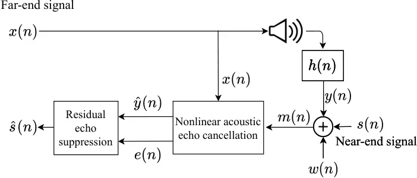

# Objective Metrics to Evaluate Residual-Echo Suppression During Double-Talk

This research was supported by the Pazy Research Foundation and the
ISF-NSFC joint research program (grant No. 2514/17). The authors thank
Stem Audio for providing equipment and technical guidance.

###### Abstract

Human subjective evaluation is optimal to assess speech quality for
human perception. The recently introduced deep noise suppression mean
opinion score (DNSMOS) metric was shown to estimate human ratings with
great accuracy. The signal-to-distortion ratio (SDR) metric is widely
used to evaluate residual-echo suppression (RES) systems by estimating
speech quality during double-talk. However, since the SDR is affected by
both speech distortion and residual-echo presence, it does not correlate
well with human ratings according to the DNSMOS. To address that, we
introduce two objective metrics to separately quantify the
desired-speech maintained level (DSML) and residual-echo suppression
level (RESL) during double-talk. These metrics are evaluated using a
deep learning-based RES-system with a tunable design parameter. Using
280 hours of real and simulated recordings, we show that the DSML and
RESL correlate well with the DNSMOS with high generalization to various
setups. Also, we empirically investigate the relation between tuning the
RES-system design parameter and the DSML-RESL tradeoff it creates and
offer a practical design scheme for dynamic system requirements.

|                                                                                 |
| ------------------------------------------------------------------------------- |
| Amir Ivry   Israel Cohen   Baruch Berdugo                                       |
| Andrew and Erna Viterbi Faculty of Electrical and Computer Engineering          |
| Technion – Israel Institute of Technology, Technion City, Haifa 3200003, Israel |

Index Terms—  Residual-echo suppression, echo cancellation, objective
metrics, perceptual speech quality, deep learning.

## 1 Introduction

Hands-free communication often involves a conversation between two
speakers located at near-end and far-end points. The near-end microphone
can capture the desired-speech signal and two interfering signals:
nonlinear echo produced by a loudspeaker playing the far-end signal, and
background noises \[1, 2\]. The acoustic coupling between the
loudspeaker output and the microphone may lead to degraded speech
intelligibility in the far-end due to echo presence \[3\]. The most
challenging scenarios are double-talk periods, when the desired speech
and echo are captured by the microphone at the same time. To combat
that, numerous nonlinear acoustic echo cancellation (NLAEC) systems were
proposed to remove the nonlinear echo and to preserve the near-end
speech \[4, 5, 6, 7, 8\]. However, often there is still a mismatch
between true and estimated echo paths, especially during the NLAEC
convergence and re-convergence\[9, 10\]. As a result, the echo is not
eliminated and the NLAEC should be followed by a residual-echo
suppression (RES) system.

Human perception of speech quality is optimally evaluated using human
subjective evaluation \[11\]. Lately, the objective deep noise
suppression mean opinion score (DNSMOS) metric has been proposed to
estimate human ratings and has shown great accuracy \[12\]. Regarding
the task of RES, speech quality during double-talk is traditionally
evaluated using the objective signal-to-distortion ratio (SDR) metric
\[13\], e.g., in \[14, 15, 16, 17, 18, 19\]. Unfortunately, the SDR is
affected by both desired-speech distortion and residual-echo presence,
which renders it unreliable in predicting the DNSMOS and unreliable in
predicting human perception of speech quality \[12\].

This paper introduces two objective metrics that separately evaluate the
desired-speech maintained level (DSML) and the residual-echo suppression
level (RESL) during double-talk. Considering the RES system as a
time-varying gain, the DSML is obtained by applying that gain to the
desired speech and substituting the outcome in the definition of the
SDR. The RESL is obtained by subtracting the desired speech from the
double-talk segment and calculating the ratio of the noisy residual-echo
before and after the gain is applied to it. To evaluate these metrics,
we employ a deep learning-based RES system that also embeds a design
parameter \[20\]. Experiments are done with 280 h of real and simulated
recordings in various scenarios and in high and low levels of echo and
noise. Results show that the DSML and RESL have high correlation with
human perception according to the DNSMOS, and high generalization to
various setups, which renders them more suitable for speech quality
evaluation than the SDR. We further investigate the empirical relation
between tuning the design parameter and the DSML-RESL tradeoff it
creates. Based on this relation, we offer a practical scheme for tuning
the design parameter during training to optimally cope with dynamic
system requirements.

The remainder of this paper is organized as follows. In Section 2, we
formulate the problem. In Section 3, we introduce the DSML and RESL
metrics. Section 4 covers the employed RES system and its tunable design
parameter. Section 5 describes the database and additional performance
metrics, and experimental results are presented in Section 6. Section 7
concludes this study.

## 2 Problem Formulation

Figure 1 depicts the RES scenario. Let $`s\left(n\right)`$ be the
desired near-end speech signal and let $`x\left(n\right)`$ be the
far-end speech signal. The near-end microphone signal
$`m\left(n\right)`$ is given by

```math
\displaystyle m\left(n\right)=s\left(n\right)+y\left(n\right)+w\left(n\right), \tag{1}
```

where $`w\left(n\right)`$ represents additive environmental and system
noises and $`y\left(n\right)`$ is a reverberant echo that is nonlinearly
generated from $`x\left(n\right)`$. Before applying RES, the NLAEC
system introduced in \[8\] is applied to reduce nonlinear echo. The
NLAEC receives $`m\left(n\right)`$ as input and $`x\left(n\right)`$ as
reference, and generates two signals: the echo estimate
$`\widehat{y}\left(n\right)`$, and the desired-speech estimate
$`e\left(n\right)`$, given by

```math
\displaystyle e\left(n\right)=m\left(n\right)-\widehat{y}\left(n\right)=s\left(n\right)+\left[y\left(n\right)-\widehat{y}\left(n\right)\right]+w\left(n\right). \tag{2}
```

The goal of the RES system is to suppress the residual echo
$`y\left(n\right)-\widehat{y}\left(n\right)`$ without distorting the
desired-speech signal $`s\left(n\right)`$.



Figure 1: Residual-echo suppression scenario.

## 3 DSML and RESL

To derive the DSML and RESL, a deep learning-based RES system is
considered as a time-varying gain. During double-talk,
$`e\left(n\right)\neq 0`$ and the gain is given by

```math
\displaystyle g\left(n\right)=\frac{\widehat{s}\left(n\right)}{e\left(n\right)}\bigg|_{\textrm{Double-talk}}\textrm{ .} \tag{3}
```

Before introducing the DSML and RESL metrics, the SDR and its drawbacks
are examined. According to \[13\], the SDR is defined as

```math
\displaystyle\textrm{SDR} \displaystyle=10\log_{10}\frac{\|s\left(n\right)\|_{2}^{2}}{\|s\left(n\right)-\widehat{s}\left(n\right)\|_{2}^{2}}\bigg|_{\textrm{Double-talk}} \tag{4}
```

```math
\displaystyle=10\log_{10}\frac{\|s\left(n\right)\|_{2}^{2}}{\|s\left(n\right)-g\left(n\right)e\left(n\right)\|_{2}^{2}}\bigg|_{\textrm{Double-talk}}.
```

The SDR is affected by both the desired-speech distortion and
residual-echo presence, and makes no distinction between cases in which
$`g\left(n\right)e\left(n\right)`$ comprises distortion-free speech and
echo, or distorted speech without echo. Thus, the SDR does not correlate
well with human ratings \[12\], since these scenarios clearly exhibit
different human perception ratings and different DNSMOS values. A
distinction between desired-speech distortion and residual-echo
suppression is extremely valuable for evaluating RES during double-talk.
Hence, we propose two objective metrics by applying $`g\left(n\right)`$
separately to the desired speech and noisy residual-echo estimate.

Formally, the DSML is calculated similarly to the SDR, but
$`g\left(n\right)`$ is applied only to the desired speech
$`s\left(n\right)`$:

```math
\displaystyle\textrm{DSML}=10\log_{10}\frac{\|\tilde{s}\left(n\right)\|_{2}^{2}}{\|\tilde{s}\left(n\right)-g\left(n\right)s\left(n\right)\|_{2}^{2}}\bigg|_{\textrm{Double-talk}}. \tag{5}
```

The RESL is derived by estimating the noisy residual-echo as
$`r\left(n\right)=e\left(n\right)-s\left(n\right)`$, and evaluating the
following ratio:

```math
\displaystyle\textrm{RESL}=10\log_{10}\frac{\|r\left(n\right)\|_{2}^{2}}{\|g\left(n\right)r\left(n\right)\|_{2}^{2}}\bigg|_{\textrm{Double-talk}}. \tag{6}
```

Note that the RES system may introduce a constant attenuation that leads
to an artificial desired-speech distortion in the DSML. To ensure the
DSML is invariant to that attenuation, it is compensated as in \[14\].
Explicitly,
$`\tilde{s}\left(n\right)=\widehat{g}\left(n\right)s\left(n\right)`$,
where:

```math
\displaystyle\widehat{g}\left(n\right)=\frac{\bigl<g\left(n\right)s\left(n\right),s\left(n\right)\bigr>}{\|s\left(n\right)\|_{2}^{2}}. \tag{7}
```

## 4 RES System with a Design Parameter

To evaluate the performances of the DSML and RESL, we employ a deep
learning-based RES system that embeds a tunable design parameter \[20\].
This system comprises a UNet neural network \[21\] with two input
channels and one output channel. The network is fed with the short-time
Fourier transform (STFT) \[22\] amplitude of the NLAEC outputs and aims
to recover the STFT amplitude of the desired speech. The design
parameter $`\alpha\geq 0`$ is embedded in a custom loss function
$`J(\alpha)`$ that is minimized during training:

```math
\displaystyle J(\alpha)=\|\widehat{S}\left(f\right)-S\left(f\right)\|^{2}_{2}+\alpha\|\widehat{S}\left(f\right)\|^{2}_{2}+0.1\,\sigma^{2}_{\widehat{S}\left(f\right)}\mathbb{I}_{\alpha>0}\textrm{ ,} \tag{8}
```

where $`\widehat{S}\left(f\right)`$ and $`S\left(f\right)`$,
respectively, represent the desired-speech prediction and ground truth
spectra amplitudes, $`\sigma^{2}_{\widehat{S}\left(f\right)}`$ denotes
the variance of $`\widehat{S}\left(f\right)`$, and
$`\mathbb{I}_{\alpha>0}`$ equals 1 when $`{\alpha>0}`$ and 0 otherwise.
During the training stage, $`J(\alpha)`$ is minimized while $`\alpha`$
penalizes $`\|\widehat{S}\left(f\right)\|^{2}_{2}`$, which allows a
dynamic tradeoff between the desired-speech distortion and residual-echo
suppression of the system, namely between the DSML and RESL. When
$`\alpha=0`$, the error between the desired-speech prediction and ground
truth is minimized. However, when $`\alpha>0`$, smaller prediction
values are generated. This reduces the level of residual echo but
compromises the level of desired-speech distortion.
$`\sigma^{2}_{\widehat{S}\left(f\right)}`$ mitigates sub-band
nullification that may occur when $`\alpha>0`$. Note that $`\alpha`$ and
the DSML-RESL tradeoff it creates can be tuned during the training
process.

## 5 Experimental Setup

### 5.1 Database

Two data corpora were employed in this study; the AEC-challenge database
\[23\], and a database recorded in our lab, both sampled at $`16`$ kHz.
These corpora consider single-talk and double-talk periods both without
and with echo-path change. In the former there is no movement during the
recording, and in the latter either the near-end speaker or device are
moving during the recording. In \[23\], two open sources of synthetic
and real recordings are introduced. The synthetic data includes
$`100`$ h, and the real data contains $`140`$ h of audio clips,
generated from $`5,000`$ hands-free devices that are used in various
acoustic environments. In both real and synthetic cases, signal-to-echo
ratio (SER) and signal-to-noise ratio (SNR) levels were distributed on
$`\left[-10,10\right]`$ dB and $`\left[0,40\right]`$ dB, respectively.
Additional real recordings were conducted in our lab to test the
generalization of the DSML and RESL to unseen setups and their
robustness to extremely low levels of SERs. This database is fully
described in \[20\]. For completion, it contains $`40`$ h of recordings
from the TIMIT \[24\] and LibriSpeech \[25\] corpora with SNR levels of
$`32\pm 5`$ dB and SER levels distributed on $`\left[-20,-10\right]`$
dB.

The SER is defined as
SER=$`10\log_{10}\left[\|s\left(n\right)\|_{2}^{2}/\|y\left(n\right)\|_{2}^{2}\right]`$
and the SNR is defined as
SNR=$`10\log_{10}\left[\|s\left(n\right)\|_{2}^{2}/\|w\left(n\right)\|_{2}^{2}\right]`$
in dB, each is calculated with 50% overlapping time frames of 20 ms.

### 5.2 Data Processing, Training, and Testing

The real and synthetic data from \[23\] was randomly split to create
185 h of training set and 45 h of validation set. The test set contains
only real data that includes the remaining 10 h from \[23\] and all 40 h
from \[20\]. Each set was divided into 10 s segments that contain
recordings in different setups. This leads to frequent re-convergence
during transitions between segments, both with and without echo-path
change. These sets are balanced to prevent bias in the results, as
detailed in \[20\]. The NLAEC system, which is also deep learning-based
\[8\], and the succeeding RES system \[20\], were trained separately.
During testing, in accordance with Section 3, the artificial gain that
may be introduced by the RES system is compensated as in \[13, 14\]
before deriving the DSML and RESL.

### 5.3 Additional Performance Metrics

We employ additional metrics to evaluate RES. The echo return loss
enhancement (ERLE) \[26\] measures echo reduction between the degraded
and enhanced signals when only echo and noise are present:

```math
\displaystyle\textrm{ERLE}=10\log_{10}\frac{\|e\left(n\right)\|_{2}^{2}}{\|\widehat{s}\left(n\right)\|_{2}^{2}}\bigg|_{\textrm{Far-end single-talk}}\textrm{ .} \tag{9}
```

The signal-to-artifacts ratio (SAR) \[13\] measures the desired-speech
distortion during near-end single-talk periods:

```math
\displaystyle\textrm{SAR}=10\log_{10}\frac{\|s\left(n\right)\|_{2}^{2}}{\|s\left(n\right)-\widehat{s}\left(n\right)\|_{2}^{2}}\bigg|_{\textrm{Near-end single-talk}}\textrm{ .} \tag{10}
```

The perceptual evaluation of speech quality (PESQ) \[27\] metric, which
correlates well with the DNSMOS \[12\], is used in double-talk. The SAR
and SDR are compensated as in Section 3.

Figure 2: Correlation of DNSMOS with the proposed DSML and RESL metrics,
and the widely-used SDR.

Figure 3: Scatter plots of DNSMOS versus the proposed DSML and RESL
metrics, and the widely-used SDR.

## 6 Experimental Results

The performance metrics are evaluated using the RES system and are
calculated with 50% overlapping frames of 20 ms. The metrics are
reported by their mean and standard deviation (std) values in Table 1,
and by their mean only in Figures 4 and 5, with respect to the test set
specified in each experiment. For all metrics, higher mean and lower std
indicate a better performance. In our study, the convergence of the
NLAEC follows the definitions in \[8, 28\], and the DNSMOS is calculated
using the API provided by Microsoft \[12\].

First, we explore the correlation of the DSML and RESL with the DNSMOS
using Pearson correlation coefficient (PCC) \[29\] and Spearman’s rank
correlation coefficient (SRCC) \[30\], as done in \[12, 31\]. This
experiment includes segments without echo-path change after NLAEC
convergence for $`\alpha=\left[0,0.25,0.5,0.75,1\right]`$, and the
results are shown in Figure 2. The conclusion drawn in \[12\] is
reaffirmed in this study, i.e., the SDR does not correlate well with the
DNSMOS, as the PCC and SRCC mean values are below $`0.26`$ for all
$`\alpha`$. On the contrary, the DSML and RESL are highly correlated
with the DNSMOS, with mean correlation scores between $`0.78`$ and
$`0.85`$ for all $`\alpha`$. Also, compared to the SDR, the DSML and
RESL correlations are relatively more consistent across $`\alpha`$
values, as inferred from their lower std values. To visualize these
correlations, Figure 3 depicts scatter plots of the DNSMOS versus the
DSML, RESL, and SDR metrics for random sample values with $`\alpha=0`$.
These plots validate the poor correlation between the DNSMOS and SDR,
and the high correlation between the DNSMOS and the DSML and RESL.
Conclusively, the DSML and RESL are better correlated with human
perception and speech quality evaluation.

All performance metrics are evaluated in Table 1 with $`\alpha=0`$.
Separate results are shown for segments without and with echo-path
change after NLAEC convergence, and for segments before convergence. The
DSML and RESL are consistent with all other metrics, which degrade when
shifting from no echo-path change to echo-path change scenarios, and
further degrade when considering segments before convergence. This also
implies high generalization of the DSML and RESL to various setups. The
DSML is consistently higher than the SDR, as expected, since the
definition in (4) also considers echo and noise in the denominator.
Also, the DSML is lower than the SAR, which is applicable to single-talk
segments where speech is less distorted by the RES system. The RESL is
always lower than the ERLE, which is relevant to segments without
desired speech where echo is more suppressed. These observations
highlight the reliability of the DSML and RESL metrics.

Next, the relation between tuning $`\alpha`$ and the DSML-RESL tradeoff
it creates is investigated. Figure 4 considers segments without and with
echo-path change after convergence, and segments before convergence, for
$`\alpha=\left[0,0.25,0.5,0.75,1\right]`$. As $`\alpha`$ increases,
speech is more distorted and the DSML decreases, while residual echo is
more suppressed and the RESL increases. This tradeoff occurs across all
scenarios and is empirically consistent for all $`\alpha`$ values. This
tradeoff is also analyzed in various SER and SNR levels that occur in
real-life setups. In this experiment, segments without echo-path change
are considered and results are given in Figure 5. It can be observed
that both the DSML and RESL are impaired when acoustic conditions
deteriorate, as expected. Also, the relation between $`\alpha`$ and the
metrics is retained, i.e., for all levels of echo and noise, increasing
$`\alpha`$ degrades the DSML and enhances the RESL.

Finally, we offer a practical design scheme for possible dynamic user
requirements. Assume an environment without echo-path change after
convergence, which can be inferred by the user using the definitions in
\[8, 28\]. At first, the user requires an average RESL higher than
$`30`$ dB and DSML higher than $`8.4`$ dB. According to Figure 4(a),
$`\alpha=0.5`$ is selected. Next, the user evaluates that
$`\textrm{SER}=0`$ dB and $`\textrm{SNR}=20`$ dB, e.g., by respectively
analyzing double-talk and near-end single-talk periods, and accordingly
decides to suppress the maximal amount of echo that maintains DSML no
lower than $`8.3`$ dB. Then, according to Figure 5, the user shifts
$`\alpha=0.5`$ to $`\alpha=0.75`$ during training, which decreases the
average DSML to $`8.3`$ dB and increases the average RESL to above
$`31`$ dB.

|        |                        |                     |                       |
| ------ | ---------------------- | ------------------- | --------------------- |
|        | No echo-path    change | Echo-path    change |    Before convergence |
| DNSMOS | 3.12 $`\pm`$ 0.2       | 2.91 $`\pm`$ 0.3    | 2.56 $`\pm`$ 0.6      |
| DSML   | 8.73 $`\pm`$ 0.4       | 8.34 $`\pm`$ 0.5    | 6.97 $`\pm`$ 0.7      |
| RESL   | 29.1 $`\pm`$ 3.7       | 25.9 $`\pm`$ 4.4    | 22.1 $`\pm`$ 5.6      |
| SDR    | 6.13 $`\pm`$ 0.4       | 5.94 $`\pm`$ 0.6    | 5.57 $`\pm`$ 0.8      |
| PESQ   | 3.58 $`\pm`$ 0.2       | 3.35 $`\pm`$ 0.5    | 3.18 $`\pm`$ 0.6      |
| SAR    | 9.88 $`\pm`$ 0.4       | 9.69 $`\pm`$ 0.5    | 9.51 $`\pm`$ 0.6      |
| ERLE   | 33.2 $`\pm`$ 3.1       | 29.1 $`\pm`$ 4.2    | 26.4 $`\pm`$ 5.1      |

Table 1: Performance metrics in various scenarios with $`\alpha=0`$.

(a) No echo-path change

‘

(b) Echo-path change

(c) Before convergence

Figure 4: DSML-RESL tradeoff for various values of $`\alpha`$.

‘

Figure 5: DSML-RESL tradeoff for various values of $`\alpha`$ in
different echo and noise levels.

## 7 Conclusion

We introduced two objective metrics to separately assess the
desired-speech maintained level (DSML) and the residual-echo suppression
level (RESL) during double-talk. The performances of these metrics are
evaluated using a deep learning-based RES system with a tunable design
parameter $`\alpha`$, with 280 h of real and synthetic recordings. We
showed that the DSML and RESL correlate well with human perception
compared to the popular SDR metric, which may suggest they are more
suitable for speech quality evaluation. Also, we empirically learned the
relation between tuning $`\alpha`$ and the resulting DSML-RESL tradeoff
and offered a practical design scheme that benefits dynamic user
preferences. Future work will analyze the DNSMOS as an appropriate
evaluation for RES subjective quality in double-talk, and explore the
DSML-RESL tradeoff to yield a practical design scheme for optimal speech
quality.

## References

- \[1\] J. Benesty, D. R. Morgan, and M. M. Sondhi, “A better
  understanding and an improved solution to the specific problems of
  stereophonic acoustic echo cancellation,” _IEEE Transactions on Speech
  and Audio Processing_, vol. 6, no. 2, pp. 156–165, 1998.
- \[2\] J. Benesty, T. Gänsler, D. R. Morgan, M. M. Sondhi, S. L. Gay,
  _et al._, “Advances in network and acoustic echo cancellation,” 2001.
- \[3\] M. M. Sondhi, D. R. Morgan, and J. L. Hall, “Stereophonic
  acoustic echo cancellation-an overview of the fundamental problem,”
  _IEEE Signal Processing Letters_, vol. 2, no. 8, pp. 148–151, 1995.
- \[4\] A. Guérin, G. Faucon, and R. Le Bouquin-Jeannès, “Nonlinear
  acoustic echo cancellation based on Volterra filters,” _IEEE
  Transactions on Speech and Audio Processing_, vol. 11, no. 6, pp.
  672–683, 2003.
- \[5\] S. Malik and G. Enzner, “State-space frequency-domain adaptive
  filtering for nonlinear acoustic echo cancellation,” _IEEE
  Transactions on Audio, Speech, and Language Processing_, vol. 20,
  no. 7, pp. 2065–2079, 2012.
- \[6\] D. Comminiello, M. Scarpiniti, L. A. Azpicueta-Ruiz,
  J. Arenas-García, and A. Uncini, “Functional link adaptive filters for
  nonlinear acoustic echo cancellation,” _IEEE Transactions on Audio,
  Speech, and Language Processing_, vol. 21, no. 7, pp. 1502–1512, 2013.
- \[7\] M. M. Halimeh, C. Huemmer, and W. Kellermann, “A neural
  network-based nonlinear acoustic echo canceller,” _IEEE Signal
  Processing Letters_, vol. 26, no. 12, pp. 1827–1831, 2019.
- \[8\] A. Ivry, I. Cohen, and B. Berdugo, “Nonlinear acoustic echo
  cancellation with deep learning,” in _Proc. Interspeech_. IEEE, Sept.
  2021, submitted.
- \[9\] A. Birkett and R. A. Goubran, “Limitations of handsfree acoustic
  echo cancellers due to nonlinear loudspeaker distortion and enclosure
  vibration effects,” in _Proc. WASPAA_. IEEE, 1995, pp. 103–106.
- \[10\] M. I. Mossi, N. W. Evans, and C. Beaugeant, “An assessment of
  linear adaptive filter performance with nonlinear distortions,” in
  _Proc. ICASSP_. IEEE, 2010, pp. 313–316.
- \[11\] C. K. Reddy, E. Beyrami, J. Pool, R. Cutler, S. Srinivasan, and
  J. Gehrke, “A scalable noisy speech dataset and online subjective test
  framework,” _preprint arXiv:1909.08050_, 2019.
- \[12\] C. K. Reddy, V. Gopal, and R. Cutler, “DNSMOS: A non-intrusive
  perceptual objective speech quality metric to evaluate noise
  suppressors,” _arXiv:2010.15258_, 2020.
- \[13\] E. Vincent, R. Gribonval, and C. Févotte, “Performance
  measurement in blind audio source separation,” _IEEE Transactions on
  Audio, Speech, and Language Processing_, vol. 14, no. 4, pp.
  1462–1469, 2006.
- \[14\] G. Carbajal, R. Serizel, E. Vincent, and E. Humbert,
  “Multiple-input neural network-based residual echo suppression,” in
  _Proc. ICASSP_. IEEE, 2018, pp. 231–235.
- \[15\] N. K. Desiraju, S. Doclo, M. Buck, and T. Wolff, “Online
  estimation of reverberation parameters for late residual echo
  suppression,” _IEEE/ACM Transactions on Audio, Speech, and Language
  Processing_, vol. 28, pp. 77–91, 2019.
- \[16\] L. Pfeifenberger and F. Pernkopf, “Nonlinear residual echo
  suppression using a recurrent neural network,” in _Proc.
  Interspeech_, 2020.
- \[17\] H. Chen, T. Xiang, K. Chen, and J. Lu, “Nonlinear residual echo
  suppression based on multi-stream Conv-tasnet,” _preprint
  arXiv:2005.07631_, 2020.
- \[18\] B. Fang, “A robust residual echo suppression algorithm even
  during double talk,” in _Proc. 3rd International Conference on
  Information Communication and Signal Processing (ICICSP)_. IEEE, 2020,
  pp. 6–9.
- \[19\] ——, “An integrated system of adaptive echo cancellation and
  residual echo suppression,” in _Proc. International Conference on
  Computer Communication and Information Systems_, 2020, pp. 19–23.
- \[20\] A. Ivry, I. Cohen, and B. Berdugo, “Deep residual echo
  suppression with a tunable tradeoff between signal distortion and echo
  suppression,” in _Proc. ICASSP_, June 2021.
- \[21\] O. Ronneberger, P. Fischer, and T. Brox, “U-net: Convolutional
  networks for biomedical image segmentation,” in _Proc. International
  Conference on Medical Image Computing and Computer-assisted
  Intervention_. Springer, 2015, pp. 234–241.
- \[22\] D. Griffin and J. Lim, “Signal estimation from modified
  short-time Fourier transform,” _IEEE Transactions on Acoustics,
  Speech, and Signal Processing_, vol. 32, no. 2, pp. 236–243, 1984.
- \[23\] R. Cutler, A. Saabas, T. Parnamaa, M. Loida, S. Sootla,
  H. Gamper, _et al._, “Interspeech 2021 acoustic echo cancellation
  challenge,” in _Proc. Interspeech_, Sept. 2021, submitted.
- \[24\] J. S. Garofolo, L. F. Lamel, W. M. Fisher, J. G. Fiscus, D. S.
  Pallett, and N. L. Dahlgren, “DARPA TIMIT acoustic-phonetic continous
  speech corpus CD-ROM. NIST speech disc 1-1.1,” Nat. Inst. Standards
  Technol., Gaithersburg, MD, USA, Tech. Rep. LDC93S1, 1993.
- \[25\] V. Panayotov, G. Chen, D. Povey, and S. Khudanpur,
  “Librispeech: an asr corpus based on public domain audio books,” in
  _Proc. ICASSP_, 2015, pp. 5206–5210.
- \[26\] _ITU-T Rec. G.168: Digital network echo cancellers_, ITU-T
  Std., Feb. 2012.
- \[27\] _ITU-T Rec. P.862: Perceptual evaluation of speech quality
  (PESQ): An objective method for end-to-end speech quality assessment
  of narrow-band telephone networks and speech codecs_, ITU-T Std.,
  Feb. 2001.
- \[28\] C. Paleologu, S. Ciochină, J. Benesty, and S. L. Grant, “An
  overview on optimized NLMS algorithms for acoustic echo cancellation,”
  _EURASIP Journal on Advances in Signal Processing_, vol. 2015, no. 1,
  pp. 1–19, 2015.
- \[29\] J. Benesty, J. Chen, Y. Huang, and I. Cohen, “Pearson
  correlation coefficient,” in _Noise reduction in speech
  processing_. Springer, 2009, pp. 1–4.
- \[30\] T. D. Gauthier, “Detecting trends using Spearman’s rank
  correlation coefficient,” _Environmental forensics_, vol. 2, no. 4,
  pp. 359–362, 2001.
- \[31\] K. Sridhar, R. Cutler, A. Saabas, T. Parnamaa, H. Gamper,
  S. Braun, _et al._, “ICASSP 2021 acoustic echo cancellation challenge:
  Datasets and testing framework,” _preprint arXiv:2009.04972_, 2020.
