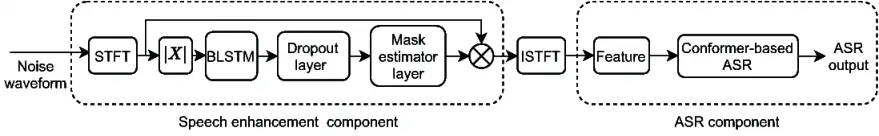
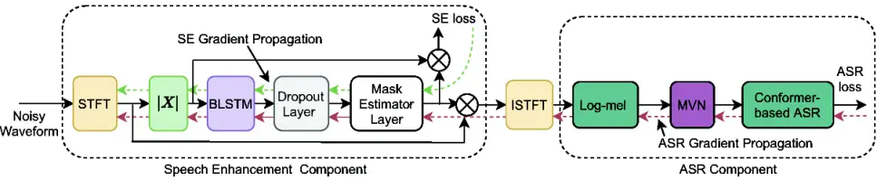
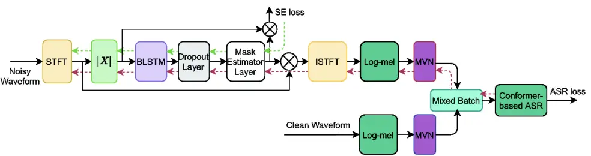

# Multitask-based joint learning approach to robust ASR for radio communication speech

Duo Ma    Nana Hou    Van Tung Pham    Haihua Xu    Eng Siong Chng

###### Abstract

To realize robust End-to-end Automatic Speech Recognition (E2E ASR)
under radio communication condition, we propose a multitask-based method
to jointly train a Speech Enhancement (SE) module as the front-end and
an E2E ASR model as the back-end in this paper. One of the advantages of
the proposed method is that the entire system can be trained from
scratch, i.e., different from prior works, either component here doesn’t
need to perform pretraining and fine-tuning processes separately.
Through analysis, we found that the success of the proposed method lies
in the following aspects. First, multitask learning is essential, that
is, the SE network is not only learned to produce more intelligible
speech, it is also aimed to generate speech that is beneficial to
recognition. Secondly, we also found speech phase preserved from noisy
speech is critical for an improved ASR performance. Thirdly, we propose
a dual-channel data augmentation training method to obtain further
improvement. Specifically, we combine the clean and enhanced speech to
train the whole system. We evaluate the proposed method on the RATS
English data set, achieving a relative WER reduction of  4.6% with the
joint training method, and up to a relative WER reduction of 11.2% with
the proposed data augmentation method.

###### Index Terms: 

End-to-End, Speech Enhancement, Automatic Speech Recognition, Multitask
Learning, Joint Training, Conformer

^(†)^(†)address: ¹ Human Language Technology (HLT) Laboratory,  
Department of Electrical and Computer Engineering,  
National University of Singapore, Singapore  
²School of Computer Science and Engineering, Nanyang Technological
University, Singapore  
³Temasek Laboratories, Nanyang Technological University, Singapore  
maduo25@163.com,{hhx502,tungphamvan}@gmail.com,  
NANA001@e.ntu.edu.sg,ASESChng@ntu.edu.sg

## 1 Introduction

With the surge of recent attention-based end-to-end neural network
modeling framework \[1, 2, 3, 4, 5\], as well as big data usage, the
performance of Automatic Speech Recognition (ASR) has been significantly
improved, such that its application has been widely deployed in
diversified industrial area. However, ASR performance is still far from
being desired under extremely noisy conditions, such as radio
communication conditions, where speech might not only be contaminated by
ambient noise, it is also distorted by communication channel due to
limited transfer bandwidth, as well as Codec losses. For instance, for
radio communication speech ¹¹ 1 By radio communication speech, here it
means single channel Ultra High Frequency (UHF) speech that is very
noisy. The SNR is close to 0 dB. to be studied in this work, it not only
has lower Signal-to-Noise Ratio (SNR), the speech signal itself is also
seriously distorted. As a result, the speech intelligibility is rather
low.

To achieve decent results under noisy conditions, one common approach is
to employ multi-condition training method. This is appropriate for some
minor or intermediate noisy conditions. For the extremely noisy
conditions, such as SNR being close to 0 dB, the first priority is to
make the incoming speech intelligible. As a result, Speech Enhancement
(SE) as the front-end is necessary. Nevertheless, prior experiences tell
us employing SE to boost speech intelligibility does not mean the
enhanced speech is necessarily conducive to the back-end ASR performance
improvement \[6, 7\], given that the SE and ASR models are trained
separately. Besides, even both SE and ASR models are jointly trained, it
is not guaranteed with improved ASR performance. This is particularly
true under the single channel scenarios.

In this paper, we propose a multitask-based joint learning approach to
robust ASR over radio communication speech, i.e., RATS \[8\] English
data set. The entire network is a pipeline that is made up of an E2E SE
and ASR components respectively, and the front-end SE component provides
denoised speech for better ASR results in the back-end. The so-called
multitask-based joint learning approach refers to the front-end SE
component is not only learned to produce more intelligible speech (whose
loss is denoted as $`\mathcal{L}_{SE}`$), it is also learned to yield
speech that boost ASR results (whose loss is denoted as
$`\mathcal{L}_{ASR}`$).



Figure 1: Speech enhancement and ASR joint modeling architecture. We use
time-frequency spectral masking based method for SE, taking STFT
spectral magnitude as input during training.

The main contributions of this paper are four-fold. First, the entire
ASR system can be simply trained from scratch with multitask-based joint
learning approach. Secondly, we have performed comprehensive analyses on
how ASR performance is affected by the front-end SE component.
Particularly, the total loss function for the SE component is defined as
$`(1-\beta)\mathcal{L}_{ASR}+\beta\mathcal{L}_{SE}`$, where $`\beta`$ is
a scaling factor controlling the contribution of the SE component.
Besides, we have explicitly verified that phase information is critical
to ASR performance improvement. Thirdly, we propose a dual-channel data
augmentation method using clean and enhanced speech to train the
back-end ASR component, and it leads to further improvement. Finally, to
the best of our knowledge, our work is the first time report on robust
ASR assisted with SE over radio communication speech.

The paper is organized as follows. Section  2 introduces the related
work. Section  3 and  4 describe the joint modeling architecture and the
proposed multitask-based joint learning. In section  5, experimental
settings and results are presented.

## 2 Related Work

In earlier times, SE system is separately trained as the pre-processor
for robust ASR systems. However, the main challenge of separate training
is that the output from the SE system is actually a distorted speech
that may not be desirable for the ASR. To resolve such a mismatch
problem, prior work \[9, 10\] propose a mimic loss from ASR output in
addition to the conventional feature-based MSE loss to train the SE
system. \[11\] employs a convolutional time-domain audio separation
network (Conv-TasNet), which is utilized in \[12\] for single-channel
speaker-independent speech separation. The success of Conv-TasNet might
be attributed to that spectral and phase features are not decoupled for
consideration, overcoming the limitation of some spectral mapping \[13\]
or time-frequency masking methods \[14\]. Likewise, to preserve the
phase information when doing SE, \[15\] proposes a complex spectral
mapping for both single and multiple channel SE for robust ASR. The
advantage is particularly demonstrated for the multi-channel ASR
performance improvement. Besides, to alleviate distortions generated by
the target SE system, \[16\] employs diversified noise data to train a
distortion-independent SE system for robust ASR, which obtains decent
WER results on ChiME-2 corpus. Likewise, \[17\] introduces SE Generative
Adversarial Network (SEGAN). However, it is found that SEGAN brings
performance improvement only when the enhanced data is combined with the
original data for training.

Recently, joint training of SE and ASR systems become popular. \[18\]
proposes a joint training framework for ChiME-2 task, where SE front-end
is jointly trained with the conventional DNN-HMM hybrid ASR system. In
\[19\] and \[20\], SEGAN assisted joint training methods are introduced
for the AISHELL-1 simulated-noise data respectively. Notably, to make
SEGAN work, pretraining is indispensable for the generator part, and the
fine-tuning of the generator with the corresponding discriminator is a
non-trivial work. Different from \[19\] and \[20\], no pretraining for
either component is necessary in our case.



Figure 2: Multitask-based joint learning framework for robust ASR over
radio communication speech. Here, multitask learning means the front-end
SE is updated by both SE and ASR back gradient propagation
simultaneously.

More recently, \[21\] attempts to employ a SE-based DCCRN \[22\] as data
augmentation technique, using consistency loss to fine-tune the DCCRN
component. To gain ASR improvement, a 3-step training recipe is
employed. During decoding a learnable feature selection is adopted
assuming that enhanced speech is complementary to the original speech.
Another work in \[23\] proposes a multi-channel-like data augmentation
method, using SE as front-end. It aims to stablize an E2E-based
streaming ASR in the back-end. The model architecture is similar to one
of our proposed methods, however, their training recipe is rather
complicated.

## 3 Joint Modeling Architecture

To realize robust ASR under noise condition, we propose the joint
modeling architecture, which consists of two components, namely, the SE
as front-end and the ASR in the back-end. The SE front-end aims to
provide enhanced speech conducive to the back-end ASR. Since we attempt
to train the two components jointly, we concatenate them in tandem, as
illustrated in Figure 1. The fundamentals for each component are briefly
described in this section.

### 3.1 Time-frequency masking-based SE

As shown in Figure 1, we employ Bidirectional Long Short Term Memory
(BLSTM) to conduct time-frequency masking-based SE work similar
to \[14\]. Specifically, we use spectral magnitude $`\lvert X\rvert`$
extracted by short-time Fourier transform (STFT) from the noisy waveform
as input to train LSTM-based mask estimator $`M`$, where $`X`$ is
complex Fourier transform, and $`X=\mathcal{R}+i\mathcal{I}`$. Such
predicted masks $`M`$ conduct the element-wise product with the noisy
input $`X`$, and then inverse STFT (ISTFT) transforms enhanced waveform
from the corresponding features, that is,
$`\hat{X}=\textrm{ISTFT}((\mathcal{R}+i\mathcal{I})\otimes M)`$.

### 3.2 Conformer-based ASR

We use a Conformer-based ASR \[4, 24\] for the back-end. However, we
don’t utilize SpecAugment \[25\], because we find that it performs worse
in our current experiment corpus. The Conformer is a
convolution-augmented Transformer \[26\], based on the complementary
features of convolutional learning and multi-head self-attention (MHSA).
Therefore, the Conformer focuses more on feature locality, and is
capable of learning global context dependencies. In practice, a proposed
Conformer block takes the place of conventional Transformer block. \[4\]
reported that the Conformer achieves consistent performance improvement
over Transformer on Librispeech data set.

Except for the Conformer framework, our E2E ASR model is jointly trained
with both CTC and attention-based cross-entropy criteria. As a result,
the ASR loss criterion is as follows:

```math
~\begin{split}\mathcal{L}_{ASR}(Y|X_{enc})&=(1-\lambda)\mathcal{L}_{att}(Y|X_{enc})\\
&+\lambda\mathcal{L}_{CTC}(Y|X_{enc})\end{split} \tag{1}
```

where $`X_{enc}`$ and $`Y`$ represent the encoder output and decoder
output respectively. $`\lambda\in[0,1]`$ aims to balance the losses
between the CTC and attention-based cross-entropy criteria. For
simplicity, we fix $`\lambda=0.3`$ during training.

## 4 Multitask-based Joint Learning

### 4.1 Single channel joint SE and ASR

As shown in Figure 1, we can use ASR loss in Equation 1 to train the
entire network jointly. However, we found that such a training recipe
yields suboptimal results. This might be that our training data is too
noisy, so ASR loss can not explicitly guide the SE component to denoise
data. As shown in Figure 2, we employ multitask-based joint training
instead, where the front-end SE component is learned from both ASR and
SE loss simultaneously. Here, the loss is defined as:

```math
\mathcal{L}_{joint}=(1-\beta)\mathcal{L}_{ASR}+\beta\mathcal{L}_{SE} \tag{2}
```

where $`\mathcal{L}_{ASR}`$ is the ASR loss criterion defined in
Equation 1. $`\mathcal{L}_{SE}`$ is SE loss, where spectral magnitude
MSE is employed. $`\beta`$ is the weighting factor that controls SE loss
$`\mathcal{L}_{SE}`$.

As mentioned above in Section 2, multitask-based joint training as shown
in Figure 2 has also been proposed previously. However, to the best of
our knowledge, no work has emphasized how the output of SE is
concatenated with ASR as input in detail. Actually, there are two
options worth for our attention.

### 4.2 Preserve phase information

Assuming $`X^{\prime}`$ is an enhanced complex spectrum, we can choose
what follows as ASR input:

1.  1.  $`\lvert X^{\prime}\rvert\to\textrm{Log-Mel}({\lvert X^{\prime}\rvert}^{2})`$
2.  2.  $`X^{\prime}\to\textrm{ISTFT}(X^{\prime})\to X^{\prime\prime}\to\lvert X^{\prime\prime}\rvert\to\textrm{Log-Mel}({\lvert X^{\prime\prime}\rvert}^{2})`$

In case 1, we ignore the phase information of the enhanced speech, while
in case 2, we preserve the phase information of the enhanced speech.
Moreover, case 2 is also more flexible, as $`X^{\prime}`$ and
$`X^{\prime\prime}`$ can be in different dimensions. In this paper, we
choose the second case (see Figure 2) but report the ASR results in both
cases to indicate that phase information is decisive for WER
improvements on our data. We note that joint training is viable for both
cases.



Figure 3: Data flow diagram of dual-channel data augmentation for the
joint modeling architecture.

### 4.3 Dual-channel data augmentation

Building a robust joint SE and ASR system under the radio communication
speech conditions is a challenging problem, as the radio communication
speech data is extremely noisy. The problem usually appears at initial
training stage as the SE component cannot provide quality enhanced
speech to the ASR component. As a result, the model may not be well
learned in the end. To obtain robust ASR, we propose a dual-channel data
augmentation method, as illustrated in Figure 3. Specifically, during
the training, we mix the clean and enhanced speech in each mini-batch to
train the joint network. We use the entire back-propagation to update
the ASR component, while part of the back-propagation corresponding to
the enhanced speech to update the SE component. During the testing,
since we only have noise data, we use the same network as illustrated in
Figure 2. The ASR and SE losses are changed as follows:

```math
\displaystyle\left\{\begin{aligned} \mathcal{L}_{ASR}^{joint}=\gamma\mathcal{L}_{ASR}^{C}+(1-\gamma)\mathcal{L}_{ASR}^{N}\\
\mathcal{L}_{SE}^{joint}=\beta\mathcal{L}_{SE}+(1-\beta)\mathcal{L}_{ASR}^{N}\end{aligned}\right. \tag{3}
```

where $`\mathcal{L}_{ASR}^{C}`$ and $`\mathcal{L}_{ASR}^{N}`$ are
defined as ASR loss from clean and noise data respectively. $`\gamma`$
is weighting factor for the clean data, while $`\beta`$ is the same as
in Equation 2.

## 5 Experiments and Results

### 5.1 Data

We conduct experiments on part of the English data that is originally
utilized for Speech Activity Detection (SAD) from Robust Automatic
Transcription of Speech (RATS) program over radio channels \[8\]. There
are eight channels, and we choose channel A data that belongs to UHF
data category for evaluation. The details are shown on the Table 1. The
data is recorded with push-to-talk transceiver by playing back the clean
Fisher data. One can refer to \[8\] for more details.

|          |       |       |      |
| -------- | ----- | ----- | ---- |
| Language | Train | Valid | Test |
| English  | 44.3  | 4.9   | 8.2  |

Table 1: The overall data sets (hours) for evaluation

### 5.2 Experimental setup

All experiments are performed on ESPnet \[27\] platform. We employ Adam
algorithm \[28\] to optimize the joint network as shown in the above
figures with 0.002 and 32 as initial learning rate and batch size
respectively.

#### 5.2.1 Speech Enhancement

For SE component implementation as shown in Figure 2 and 3, the network
consists of 3 BLSTM layers with 896 units for each, then a dropout
layer, and a feed-forward layer. The input to the BLSMT is
257-dimensional spectral magnitude features. To examine the effect of
different masking estimate method, we also employ different activation
functions, such as ReLU \[29\], Mish \[30\], as well as
meta-ACON \[31\]which is modified to fit sequence modeling ,Code is
available at ²² 2
https://github.com/shanguanma/joint-se-asr/blob/main/meta-acon.py
respectively.

#### 5.2.2 Conformer-based ASR

We use Conformer \[24\] for the back-end ASR with 80-dim Log-Mel
features as input. The encoder consists of 12 Conformer layers, while
the decoder has 6 transformer layers, with 994 byte-pair-encoding (BPE)
\[32\] tokens as output. To yield better results, RNNLM-based shallow
fusion \[33\] is employed via training a RNNLM with the training
transcript.

### 5.3 Results

Table 2 reports the overall WER results with both single- and
dual-channel multitask-based joint learning (denoted as MTJL and DC-MTJL
in Table 2) methods respectively.

|                    |                                                |         |
| ------------------ | ---------------------------------------------- | ------- |
| System             | Description                                    | WER (%) |
| $`\textrm{S}_{1}`$ | Baseline with Global MVN                       | 54.3    |
| $`\textrm{S}_{2}`$ | $`\textrm{S}_{1}`$, Speed perturbation (3x)    | 49.8    |
| $`\textrm{S}_{3}`$ | Disjoint training                              | 55.6    |
| $`\textrm{S}_{4}`$ | JL (mono-task), with phase                     | 54.0    |
| $`\textrm{S}_{5}`$ | MTJL, $`\beta=0.3`$, w/o phase                 | 68.6    |
| $`\textrm{S}_{6}`$ | MTJL, $`\beta=0.3`$ in Eq. (2)                 | 51.8    |
| $`\textrm{S}_{7}`$ | DC-MTJL, with $`\beta=0.3`$ and $`\gamma=0.7`$ | 48.2    |

Table 2: WER (%) comparison between different systems. MCT refers to
multi-conditional training using 3x speed perturbation; Disjoint
training refers to both SE and ASR systems are trained separately; JL
stands for joint learning without multitask recipe, i.e., the entire
network is learned from ASR loss; MTJL and DC-MTJL refer to single- and
dual-channel multitask-based joint learning methods respectively.

It is note-worthy that both MTJL and DC-MTJL have achieved significant
WER reduction compared with the baseline system in Table 2.
Particularly, the performance improvement of the proposed dual channel
MTJL method is a relative reduction of 11.2% over the baseline system.
Additionally, one can notice that phase information is critical. Without
phase consideration, the WER of System $`\textrm{S}_{5}`$ is rapidly
degraded, while $`\textrm{S}_{4}`$ improved the performance with phase
information for even mono-task based joint training. Furthermore, with
the help of both phase information and multitask learning, System
$`\textrm{S}_{6}`$ achieves significant WER improvement over the
Baseline $`\textrm{S}_{1}`$, from 54.3% down to 51.8%. Thirdly, since
the training data is a small data set, data augmentation is very
effective for the WER improvement, as indicated by System
$`\textrm{S}_{2}`$, where speed perturbation (3x) is employed. Finally,
we notice that we employ the ReLU activation function for mask estimate
in the SE component of
$`\textrm{S}_{4}`$,$`\textrm{S}_{5}`$,$`\textrm{S}_{6}`$ in Table 2.
However,in the $`\textrm{S}_{3}`$,$`\textrm{S}_{7}`$,we employ the Mish
activation function for mask estimate

For the dual-channel MTJL (DC-MTJL) method, we are interested to see how
the final WER result is affected by the clean data weighing factor
$`\gamma`$ as indicated in Equation 3. Table 3 reports the WER results
with different clean data weighting factor configuration, $`\gamma`$ in
Equation (3).

|                    |                                         |         |
| ------------------ | --------------------------------------- | ------- |
| System             | Clean data weighing factor ($`\gamma`$) | WER (%) |
| $`\textrm{S}_{1}`$ | 0.3                                     | 49.6    |
| $`\textrm{S}_{2}`$ | 0.4                                     | 49.3    |
| $`\textrm{S}_{3}`$ | 0.5                                     | 49.9    |
| $`\textrm{S}_{4}`$ | 0.6                                     | 50.3    |
| $`\textrm{S}_{5}`$ | 0.7                                     | 48.2    |

Table 3: WER (%) results for the dual-channel multitask-based joint
learning method with different clean data weighting factor $`\gamma`$.

From Table 3, we observe that reasonable WER results can be achieved
with $`\gamma`$ around 0.5. In our work, $`\gamma=0.7`$ yields the best
WER. This suggests that one can obtain better recognition performance
when clean data is combined to train the ASR system under very noise
conditions.

Finally, as above mentioned, we attempted different activation function
to estimate the mask in the front-end SE component. Based on the single
channel multitask-based joint learn system as illustrated in Figure 2,
Table 4 reports the performance comparison in detail.

| Activation type | WER (%) |
| --------------- | ------- |
| ReLU            | 51.8    |
| Mish            | 53.3    |
| meta-ACON       | 52.9    |

Table 4: WER (%) results of using different activation function for mask
estimation with single channel multitask-based joint learning
configuration.

Table 4 reveals that the ReLU activation function yields the best WER in
our experiments.

## 6 Conclusion

In this paper, we proposed a multitask-based joint learning framework
for robust ASR over RATS radio communication speech data. Our
discoveries lie in the following aspects. First, joint training can
yield improved results, but keeping phase information is vital.
Secondly, when joint training is combined with multitask recipe, further
performance improvement can be achieved. Finally, since the target data
is extremely noisy, training with the help of clean data is essential,
which obtains the best WER reduction for the proposed method.

## References

- \[1\] William Chan, Navdeep Jaitly, Quoc V Le, and Oriol Vinyals,
  “Listen, attend and spell,” arXiv preprint arXiv:1508.01211, 2015.
- \[2\] Tara N Sainath, Ruoming Pang, David Rybach, Yanzhang He, Rohit
  Prabhavalkar, Wei Li, Mirkó Visontai, Qiao Liang, Trevor Strohman,
  Yonghui Wu, et al., “Two-pass end-to-end speech recognition,” arXiv
  preprint arXiv:1908.10992, 2019.
- \[3\] Yanzhang He, Tara N Sainath, Rohit Prabhavalkar, Ian McGraw,
  Raziel Alvarez, Ding Zhao, David Rybach, Anjuli Kannan, Yonghui Wu,
  Ruoming Pang, et al., “Streaming end-to-end speech recognition for
  mobile devices,” in ICASSP 2019-2019 IEEE International Conference on
  Acoustics, Speech and Signal Processing (ICASSP). IEEE, 2019, pp.
  6381–6385.
- \[4\] Anmol Gulati, James Qin, Chung-Cheng Chiu, Niki Parmar,
  Yu Zhang, Jiahui Yu, Wei Han, Shibo Wang, Zhengdong Zhang, Yonghui Wu,
  et al., “Conformer: Convolution-augmented transformer for speech
  recognition,” arXiv preprint arXiv:2005.08100, 2020.
- \[5\] Bo Li, Anmol Gulati, Jiahui Yu, Tara N Sainath, Chung-Cheng
  Chiu, Arun Narayanan, Shuo-Yiin Chang, Ruoming Pang, Yanzhang He,
  James Qin, et al., “A better and faster end-to-end model for streaming
  asr,” in ICASSP 2021-2021 IEEE International Conference on Acoustics,
  Speech and Signal Processing (ICASSP). IEEE, 2021, pp. 5634–5638.
- \[6\] Chris Donahue, Bo Li, and Rohit Prabhavalkar, “Exploring speech
  enhancement with generative adversarial networks for robust speech
  recognition,” in 2018 IEEE International Conference on Acoustics,
  Speech and Signal Processing (ICASSP). IEEE, 2018, pp. 5024–5028.
- \[7\] Ashutosh Pandey, Chunxi Liu, Yun Wang, and Yatharth Saraf, “Dual
  application of speech enhancement for automatic speech recognition,”
  in 2021 IEEE Spoken Language Technology Workshop (SLT). IEEE, 2021,
  pp. 223–228.
- \[8\] David Graff, Kevin Walker, Stephanie M Strassel, Xiaoyi Ma,
  Karen Jones, and Ann Sawyer, “The rats collection: Supporting hlt
  research with degraded audio data.,” in LREC. Citeseer, 2014, pp.
  1970–1977.
- \[9\] Bagchi Deblin, Plantinga Peter, Stiff Adam, and Fosler-Lussier
  Eric, “Spectral feature mapping with mimic loss for robust speech
  recognition,” in Proceedings of ICASSP 2018. IEEE, 2018.
- \[10\] Plantinga Peter, Bagchi Deblin, Stiff Adam, and Fosler-Lussier
  Eric, “An exploration of mimic architectures for residual network
  based spectral mapping,” in 2018 IEEE Spoken Language Technology
  Workshop (SLT). IEEE, 2018.
- \[11\] Keisuke Kinoshita, Tsubasa Ochiai, Marc Delcroix, and Tomohiro
  Nakatani, “Improving noise robust automatic speech recognition with
  single-channel time-domain enhancement network,” in ICASSP 2020-2020
  IEEE International Conference on Acoustics, Speech and Signal
  Processing (ICASSP). IEEE, 2020, pp. 7009–7013.
- \[12\] Yi Luo and Nima Mesgarani, “Conv-tasnet: Surpassing ideal
  time–frequency magnitude masking for speech separation,” IEEE/ACM
  transactions on audio, speech, and language processing, vol. 27, no.
  8, pp. 1256–1266, 2019.
- \[13\] Yannan Wang, Jun Du, Li-Rong Dai, and Chin-Hui Lee, “A maximum
  likelihood approach to deep neural network based nonlinear spectral
  mapping for single-channel speech separation.,” in Interspeech, 2017,
  pp. 1178–1182.
- \[14\] Dong Yu, Morten Kolbæk, Zheng-Hua Tan, and Jesper Jensen,
  “Permutation invariant training of deep models for speaker-independent
  multi-talker speech separation,” in 2017 IEEE International Conference
  on Acoustics, Speech and Signal Processing (ICASSP). IEEE, 2017, pp.
  241–245.
- \[15\] Zhong-Qiu Wang, Peidong Wang, and DeLiang Wang, “Complex
  spectral mapping for single-and multi-channel speech enhancement and
  robust asr,” IEEE/ACM transactions on audio, speech, and language
  processing, vol. 28, pp. 1778–1787, 2020.
- \[16\] Peidong Wang, Ke Tan, et al., “Bridging the gap between
  monaural speech enhancement and recognition with
  distortion-independent acoustic modeling,” IEEE/ACM Transactions on
  Audio, Speech, and Language Processing, vol. 28, pp. 39–48, 2019.
- \[17\] Chris Donahue, Bo Li, and Rohit Prabhavalkar, “Exploring speech
  enhancement with generative adversarial networks for robust speech
  recognition,” in 2018 IEEE International Conference on Acoustics,
  Speech and Signal Processing (ICASSP). IEEE, 2018, pp. 5024–5028.
- \[18\] Zhong-Qiu Wang and DeLiang Wang, “A joint training framework
  for robust automatic speech recognition,” IEEE/ACM Transactions on
  Audio, Speech, and Language Processing, vol. 24, no. 4, pp.
  796–806, 2016.
- \[19\] Bin Liu, Shuai Nie, Shan Liang, Wenju Liu, Meng Yu, Lianwu
  Chen, Shouye Peng, and Changliang Li, “Jointly adversarial enhancement
  training for robust end-to-end speech recognition.,” in INTERSPEECH,
  2019, pp. 491–495.
- \[20\] Li Lujun, Kang Yikai, Shi Yuchen, Kürzinger Ludwig, Watzel
  Tobias, and Rigoll Gerhard, “Adversarial joint training with
  self-attention mechanism for robust end-to-end speech recognition,”
  arXiv preprint arXiv:2104.01471, 2021.
- \[21\] Ashutosh Pandey, Chunxi Liu, Yun Wang, and Yatharth Saraf,
  “Dual application of speech enhancement for automatic speech
  recognition,” in 2021 IEEE Spoken Language Technology Workshop (SLT).
  IEEE, 2021, pp. 223–228.
- \[22\] Yanxin Hu, Yun Liu, Shubo Lv, Mengtao Xing, Shimin Zhang, Yihui
  Fu, Jian Wu, Bihong Zhang, and Lei Xie, “Dccrn: Deep complex
  convolution recurrent network for phase-aware speech enhancement,”
  arXiv preprint arXiv:2008.00264, 2020.
- \[23\] Chanwoo Kim, Abhinav Garg, Dhananjaya Gowda, Seongkyu Mun, and
  Changwoo Han, “Streaming end-to-end speech recognition with jointly
  trained neural feature enhancement,” in ICASSP 2021-2021 IEEE
  International Conference on Acoustics, Speech and Signal Processing
  (ICASSP). IEEE, 2021, pp. 6773–6777.
- \[24\] Pengcheng Guo, Florian Boyer, Xuankai Chang, Tomoki Hayashi,
  Yosuke Higuchi, Hirofumi Inaguma, Naoyuki Kamo, Chenda Li, Daniel
  Garcia-Romero, Jiatong Shi, et al., “Recent developments on espnet
  toolkit boosted by conformer,” in ICASSP 2021-2021 IEEE International
  Conference on Acoustics, Speech and Signal Processing (ICASSP). IEEE,
  2021, pp. 5874–5878.
- \[25\] Daniel S Park, William Chan, Yu Zhang, Chung-Cheng Chiu, Barret
  Zoph, Ekin D Cubuk, and Quoc V Le, “Specaugment: A simple data
  augmentation method for automatic speech recognition,” arXiv preprint
  arXiv:1904.08779, 2019.
- \[26\] Ashish Vaswani, Noam Shazeer, Niki Parmar, Jakob Uszkoreit,
  Llion Jones, Aidan N Gomez, Lukasz Kaiser, and Illia Polosukhin,
  “Attention is all you need,” arXiv preprint arXiv:1706.03762, 2017.
- \[27\] Shinji Watanabe, Takaaki Hori, Shigeki Karita, Tomoki Hayashi,
  Jiro Nishitoba, Yuya Unno, Nelson Enrique Yalta Soplin, Jahn Heymann,
  Matthew Wiesner, Nanxin Chen, et al., “Espnet: End-to-end speech
  processing toolkit,” arXiv preprint arXiv:1804.00015, 2018.
- \[28\] Diederik P Kingma and Jimmy Ba, “Adam: A method for stochastic
  optimization,” arXiv preprint arXiv:1412.6980, 2014.
- \[29\] Vinod Nair and Geoffrey E Hinton, “Rectified linear units
  improve restricted boltzmann machines,” in Icml, 2010.
- \[30\] Diganta Misra, “Mish: A self regularized non-monotonic neural
  activation function,” arXiv preprint arXiv:1908.08681, vol. 4, 2019.
- \[31\] Ningning Ma, Xiangyu Zhang, Ming Liu, and Jian Sun, “Activate
  or not: Learning customized activation,” arXiv preprint
  arXiv:2009.04759, 2020.
- \[32\] Taku Kudo and John Richardson, “SentencePiece: A simple and
  language independent subword tokenizer and detokenizer for neural text
  processing,” in Proceedings of the 2018 Conference on Empirical
  Methods in Natural Language Processing: System Demonstrations,
  Brussels, Belgium, Nov. 2018, pp. 66–71, Association for Computational
  Linguistics.
- \[33\] Shigeki Karita, Nanxin Chen, Tomoki Hayashi, Takaaki Hori,
  Hirofumi Inaguma, Ziyan Jiang, Masao Someki, Nelson Enrique Yalta
  Soplin, Ryuichi Yamamoto, Xiaofei Wang, et al., “A comparative study
  on transformer vs rnn in speech applications,” in 2019 IEEE Automatic
  Speech Recognition and Understanding Workshop (ASRU). IEEE, 2019, pp.
  449–456.
