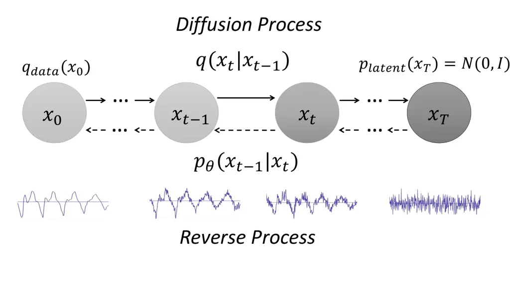
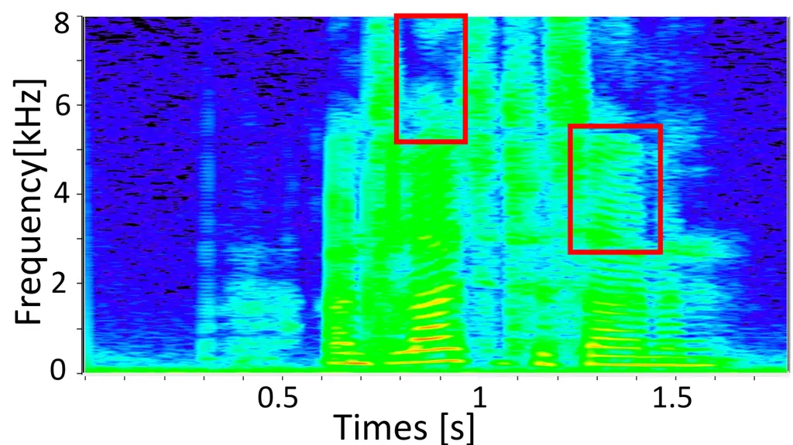
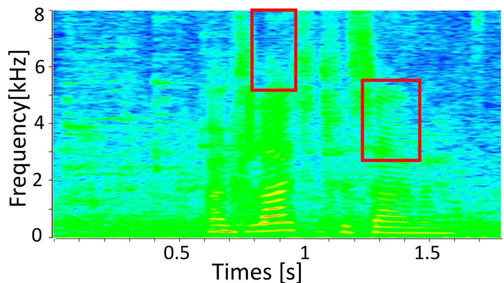
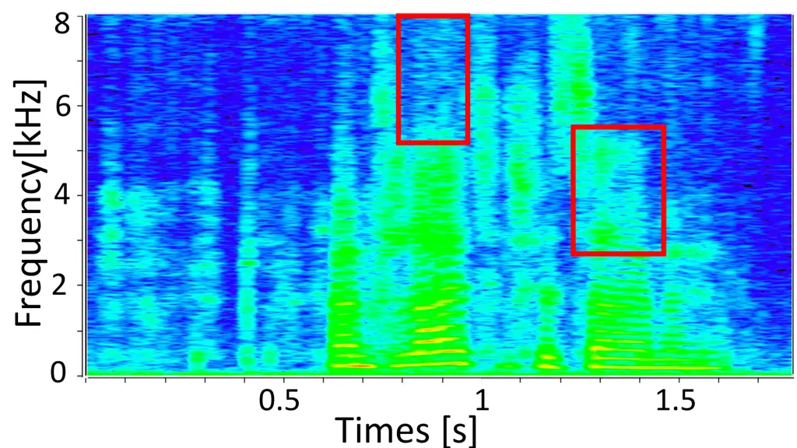
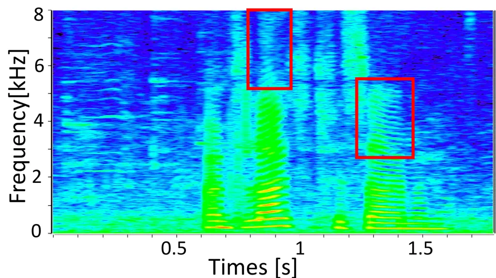
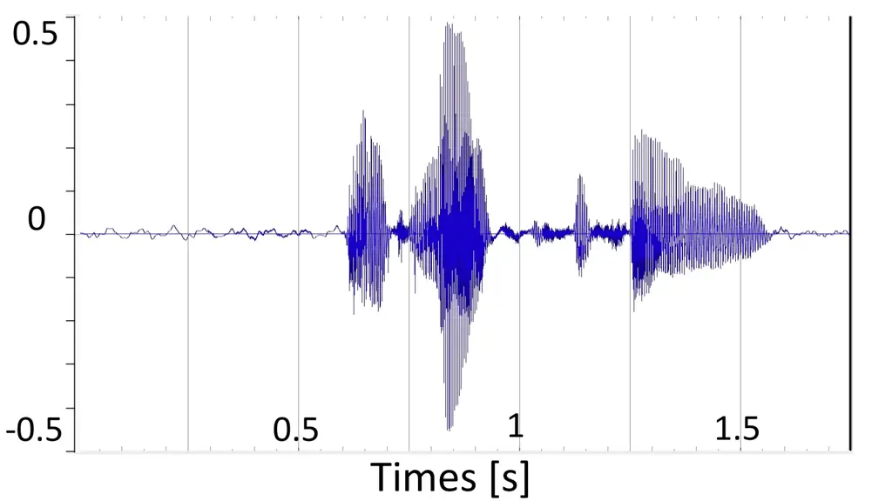
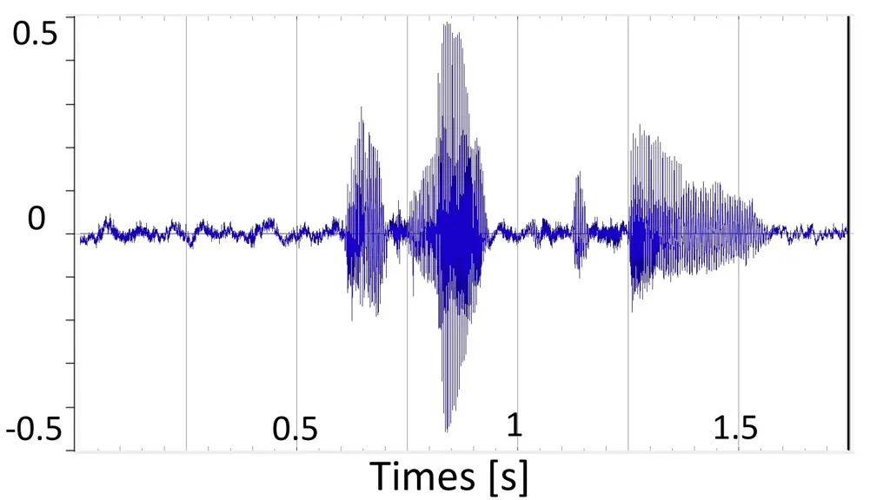
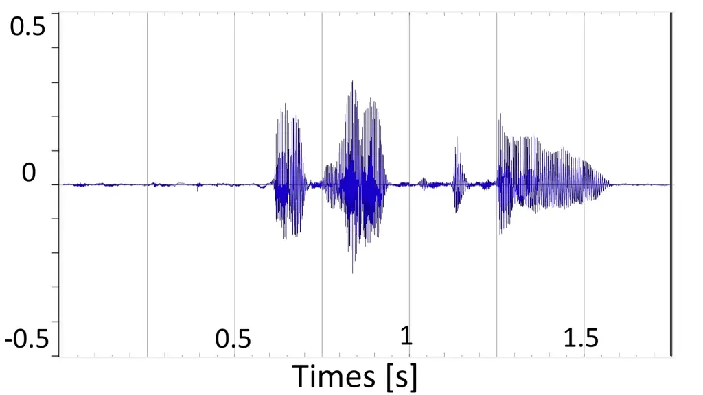
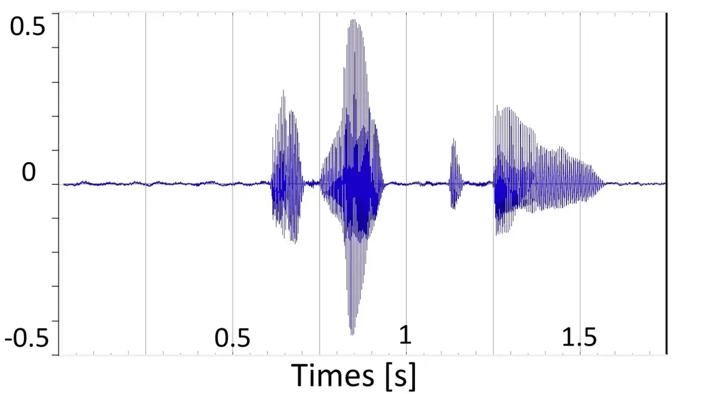

# A Study on Speech Enhancement Based on Diffusion Probabilistic Model

\authorblockNYen-Ju Lu\authorrefmark1, Yu Tsao\authorrefmark1 and Shinji
Watanabe\authorrefmark2 \authorblockA\authorrefmark1 Research Center for
Information Technology Innovation, Academia Sinica, Taipei, Taiwan  
E-mail: {neil.lu, yu.tsao}@citi.sinica.edu.tw
\authorblockA\authorrefmark2 Language Technology Institute, Carnegie
Mellon University, Pittsburgh, PA, United States  
E-mail: shinjiw@cmu.edu

###### Abstract

Diffusion probabilistic models have demonstrated an outstanding
capability to model natural images and raw audio waveforms through a
paired diffusion and reverse processes. The unique property of the
reverse process (namely, eliminating non-target signals from the
Gaussian noise and noisy signals) could be utilized to restore clean
signals. Based on this property, we propose a diffusion probabilistic
model-based speech enhancement (DiffuSE) model that aims to recover
clean speech signals from noisy signals. The fundamental architecture of
the proposed DiffuSE model is similar to that of DiffWave–a high-quality
audio waveform generation model that has a relatively low computational
cost and footprint. To attain better enhancement performance, we
designed an advanced reverse process, termed the supportive reverse
process, which adds noisy speech in each time-step to the predicted
speech. The experimental results show that DiffuSE yields performance
that is comparable to related audio generative models on the
standardized Voice Bank corpus SE task. Moreover, relative to the
generally suggested full sampling schedule, the proposed supportive
reverse process especially improved the fast sampling, taking few steps
to yield better enhancement results over the conventional full step
inference process.

## 1 Introduction

The goal of speech enhancement (SE) is to improve the intelligibility
and quality of speech, by mapping distorted speech signals to clean
signals. The SE unit has been widely used as a front-end processor in
various speech-related applications, such as speech recognition \[1, 2,
3\], speaker recognition \[4\], assistive hearing technologies \[5, 6\],
and audio attack protection \[7\]. Recently, deep neural network (DNN)
models have been widely used as fundamental tools in SE systems,
yielding promising results \[8, 9, 10, 11, 12, 13, 14\]. Compared to
traditional SE methods, DNN-based methods can more effectively
characterize nonlinear mapping between noisy and clean signals,
particularly under extremely low signal-to-noise (SNR) scenarios and/or
non-stationary noise environments \[15, 16, 17\].

Traditional SE methods calculates the noisy-clean mapping through the
discriminative methods in time-frequency (T-F) domain or time domain.
For the T-F domain methods, the time-domain speech signals are first
converted into spectral features through a short-time Fourier transform
(STFT). The mapping function of noisy to clean spectral features is then
formulated by a direct mapping function \[8, 11\], or a masking function
\[9, 18, 19\]. The enhanced spectral features are reconstructed to
time-domain waveforms with the phase of the noisy speech based on the
inverse STFT operation \[20\]. As compared with T-F domain methods, it
has been shown that the time-domain SE methods can avoid the distortion
caused by inaccurate phase information \[21, 22\]. To date, several
audio generation models have been directly applied to or moderately
modified to perform SE, estimating the distribution of the clean speech
signal, such as generative adversarial networks (GAN) \[23, 24, 25\],
autoregressive models \[26\], variational autoencoders (VAE) \[27\], and
flow-based models \[28\].

The diffusion probabilistic model, proposed in \[29\], has shown strong
generation capability. The diffusion probabilistic model includes a
diffusion/forward process and a reverse process. The diffusion process
converts clean input data to an isotropic Gaussian distribution by
adding Gaussian noise to the original signal at each step. In the
reverse process, the diffusion probabilistic model predicts a noise
signal and subtracts the predicted noise signal from the noisy input to
retrieve the clean signal. The model is trained by optimizing the
evidence lower bound (ELBO) during the diffusion process. Recently, the
diffusion probabilistic models have been shown to provide outstanding
performance in generative modeling for natural images \[30, 31\], and
raw audio waveforms \[32, 33\]. As reported in \[32\], the DiffWave
model, formed by the diffusion probabilistic model, can yield
state-of-the-art performance on either conditional or unconditional
waveform generation tasks with a small number of parameters.

In this study, we propose a novel diffusion probabilistic model-based SE
method, called DiffuSE. The basic model structure of DiffuSE is similar
to that of Diffwave. Since the target task is SE, DiffuSE uses the noisy
spectral features as the conditioner, rather than the clean Mel-spectral
features used in DiffWave. Meanwhile, different from the derived
equation of the diffusion model, we combine the noisy speech signal into
the reverse process instead of the isotropic Gaussian noise. To further
improve the quality of the enhanced speech, we pretrained the model
using clean Mel-spectral features as a conditioner. After pretraining,
we replaced the conditioner with noisy spectral features, reset the
parameters in the conditioner encoder, and preserved other parameters
for the SE training.

The contributions of this study are three-fold: (1) It is the first
study to apply the diffusion probabilistic model to the SE tasks. (2) We
propose a novel supportive reverse process, specifically for the SE
task, which combines the noisy speech signals during the reverse
process. (3) The experimental results confirm the effectiveness of
DiffuSE, which provides comparable or even better performacne as
compared to related time-domain generative SE methods.

The remainder of this paper is organized as follows. We present the
diffusion models in Section II and introduce the DiffuSE architecture in
Section III. We provide the experimental setting in Section IV, report
the results in Section V, and conclude the paper in Section VI.

## 2 Diffusion probabilistic models

This section introduces the diffusion and the reverse procedures of the
diffusion probabilistic model. A detailed mathematical proof of the
model’s ELBO can be found in \[30\], and we only discuss the diffusion
and reverse processes with their algorithm in this section.



Figure 1: The diffusion process (solid arrows) and reverse processes
(dashed arrows) of the diffusion probabilistic model.

for $`i=1,2,\cdots,N_{iter}`$ do

  Sample $`x_{0}{\sim}q_{\text{data}},\epsilon{\sim}N(0,I),`$ and

  $`t{\sim}Uniform(\{1,\cdots,T\})`$

  Take gradient step on

  $`\nabla_{\theta}\parallel\epsilon-\epsilon_{\theta}(\sqrt{\bar{\alpha}_{t}}x_{0}+\sqrt{1-\bar{\alpha}_{t}}\epsilon,t)\parallel^{2}_{2}`$

  according to Eq. 6

end for

Algorithm 1 Training

### 2.1 Diffusion and Reverse Processes

A diffusion model of $`T`$ steps is composed of two processes: the
diffusion process with steps $`t=(0,1,\cdots,T)`$ and the reverse
process $`t=(T,T-1,\cdots,0)`$ \[29\]. The input data distribution of
the diffusion process is defined as $`q_{\text{data}}(x_{0})`$ on
$`\mathbb{R}^{L}`$, where $`L`$ is the data dimension.
$`x_{t}\in\mathbb{R}^{L}`$ is a step-dependent variable at diffusion
step $`t`$ with the same dimension $`L`$. The diffusion and the reverse
processes are illustrated in Figure 1.

In Figure 1, The solid arrows are the diffusion process from data
$`x_{0}`$ to the latent variable $`x_{T}`$, represented as:

```math
\displaystyle q(x_{1},\cdots,x_{T}|x_{0}) \displaystyle=\prod_{t=1}^{T}q(x_{t}|x_{t-1}), \tag{1}
```

where $`q(x_{t}|x_{t-1})`$ is formulated by a fixed Markov chain,
$`N(x_{t};\sqrt{1-\beta_{t}}x_{t-1},\beta_{t}I)`$, with a small positive
constant ratio $`\beta_{t}`$, and the Gaussian noise is added to the
previous distribution $`x_{t-1}`$. The overall process gradually
converts data $`x_{0}`$ to a latent variable with an isotropic Gaussian
distribution of $`p_{\text{latent}}(x_{T})=N(0,I)`$, according to the
predefined schedule $`\beta_{1},\cdots,\beta_{T}`$.

The sampling distribution at the $`t`$-th step, $`x_{t}`$, can also be
derived from the distribution of $`x_{0}`$ in a closed form by
marginalizing $`x_{1},\dots,x_{t-1}`$ as:

```math
q(x_{t}|x_{0})=N(x_{t};\sqrt{\bar{\alpha}_{t}}x_{0},(1-\bar{\alpha}_{t})I), \tag{2}
```

where $`\alpha_{t}=1-\beta_{t}`$ and
$`\bar{\alpha}_{t}=\prod_{s=1}^{t}\alpha_{s}`$. Empirically, we can
sample the $`t`$-th step distribution $`x_{t}`$ from the initial data
$`x_{0}`$ directly. In contrast, The dashed arrows in Figure 1 are the
reverse process, converting the latent variable $`x_{T}`$ to $`x_{0}`$,
which is also defined by a Markov chain:

```math
p_{\theta}(x_{0},\cdots,x_{T-1}|x_{T})=\prod_{t=1}^{T}p_{\theta}(x_{t-1}|x_{t}), \tag{3}
```

where $`p_{\theta}(\cdot)`$ is the distribution of the reverse process
with learnable parameter $`\theta`$. Because the marginal likelihood
$`p_{\theta}(x_{0})=\int p_{\theta}(x_{0},`$ $`\cdots,`$
$`x_{T-1}|x_{T})\cdot p_{\text{latent}}(x_{T})dx_{1:T}`$ is intractable
for calculations in general, the model should be trained using ELBO.
Recently, \[30\] showed that under a certain parameterization, the ELBO
could be calculated using a closed-form solution.

Sample $`x_{T}{\sim}p_{\text{latent}}=N(0,I),`$

for $`t=T,T-1,\cdots,1`$ do

  Compute $`\epsilon_{\theta}(x_{t},t)`$ and $`{\sigma_{t}}`$

  Sample $`x_{t-1}\sim p_{\theta}(x_{t-1}|x_{t})=`$

  $`N(x_{t-1};\frac{1}{\sqrt{\alpha_{t}}}(x_{t}-\frac{\beta_{t}}{\sqrt{1-\bar{\alpha}_{t}}}\epsilon_{\theta}(x_{t},t)),\sigma^{2}_{t}I)`$

  according to Eq. 7

end for

return $`x_{0}`$

Algorithm 2 Sampling

### 2.2 Training through Parameterization

#### 2.2.1 Parameterization

The transition probability in the reverse process
$`p_{\theta}(x_{t-1}|x_{t})`$ in Eq. 3 can be represented by two
parameters, $`\mu_{\theta}`$ and $`\sigma_{\theta}`$, as $`N(x_{t-1};`$
$`\mu_{\theta}(x_{t},t),`$ $`{\sigma_{\theta}(x_{t},t)}^{2}I)`$, with a
learnable parameter $`\theta`$. $`\mu_{\theta}`$ is an $`L`$-dimensional
vector, that estimates the mean of the distribution of $`x_{t-1}`$.
$`\sigma_{\theta}`$ denotes the standard deviation (a real number) of
the $`x_{t-1}`$ distribution. Note that both values take two inputs: the
diffusion step $`t\in\mathbb{N}`$, and variable
$`x_{t}\in\mathbb{R}^{L}`$. Further, Eq. 2 can also be reparameterized
as
$`x_{t}(x_{0},\epsilon)=\sqrt{\bar{\alpha}_{t}}x_{0}+\sqrt{1-\bar{\alpha}_{t}}\epsilon`$
for $`\epsilon\sim N(0,I)`$. $`\sigma_{\theta}(x_{t},t)`$ was set to
$`\sigma_{t}`$ as a time-dependent parameter.

#### 2.2.2 Training and Sampling

In the reverse process, $`p_{\theta}(x_{t-1}|x_{t})`$ in Eq. 3 aims to
predict the previous distribution by the current mixed data with extra
Gaussian noise added in the diffusion process. Therefore, the predicted
mean $`\mu_{\theta}`$ is estimated by eliminating the Gaussian noise
$`\epsilon`$ in the mixed data $`x_{t}`$. According to the derivations
in \[30\], $`\mu_{\theta}`$ can be predicted by a given $`x_{t}`$ and
$`t`$ as Eq. 4:

```math
\mu_{\theta}(x_{t},t)=\frac{1}{\sqrt{\alpha_{t}}}(x_{t}-\frac{\beta_{t}}{\sqrt{1-\bar{\alpha}_{t}}}\epsilon_{\theta}(x_{t},t)), \tag{4}
```

Note that the real Gaussian noise added in the diffusion process
$`\epsilon`$ is unknown in the reverse process. Therefore, the model
$`\epsilon_{\theta}`$ should be designed to predict $`\epsilon`$. In
contrast, $`\sigma_{t}`$, the standard deviation of the $`x_{t-1}`$, can
be fixed to a constant for every step t as Eq 5:

```math
\sigma_{t}=\widetilde{\beta}_{t}^{\frac{1}{2}},\textnormal{where }\widetilde{\beta}_{t}=\left\{\begin{array}[]{lr}\frac{1-\bar{\alpha}_{t-1}}{1-\bar{\alpha}_{t}}\beta_{t}\textnormal{ for }t>1,\\
\beta_{0}\textnormal{ for }t=0,\end{array}\right. \tag{5}
```

Therefore, for predicting $`\mu_{\theta}(x_{t},t)`$ in the reverse
process, the model parameters $`\theta`$ aim to estimate the Gaussian
noise $`\epsilon_{\theta}(x_{t},t)`$ by input $`x_{t}`$ and $`t`$.
During the diffusion process, the training loss of the model is defined
to reduce the distance of the estimated noise
$`\epsilon_{\theta}(x_{t},t)`$ and the Gaussian noise $`\epsilon`$ in
the mixed data $`x_{t}`$, as shown in Eq. 6.

```math
\nabla_{\theta}\parallel\epsilon-\epsilon_{\theta}(\sqrt{\bar{\alpha}_{t}}x_{0}+\sqrt{1-\bar{\alpha}_{t}}\epsilon,t)\parallel^{2}_{2} \tag{6}
```

After the training process, $`x_{t-1}`$ was computed using Eq. 7 where
$`z\sim N(0,I)`$.

```math
x_{t-1}=\frac{1}{\sqrt{\alpha_{t}}}\left(x_{t}-\frac{\beta_{t}}{\sqrt{1-\bar{\alpha}_{t}}}\epsilon_{\theta}(x_{t},t)\right)+\sigma_{t}z, \tag{7}
```

To summarize, the model is trained during the diffusion process by
estimating the Gaussian noise $`\epsilon`$ inside the mixed-signal
$`x_{t}`$, and samples the data $`x_{0}`$ through the reverse process.
We describe the diffusion and reverse processes in Algorithms 1 and 2,
respectively. Table 1 lists the parameters of the diffusion
probabilistic models.

| Process           | Parameter             | Meaning                               |
| ----------------- | --------------------- | ------------------------------------- |
| Diffusion Process | $`\alpha_{t}`$        | ratio of $`x_{t-1}`$ in $`x_{t}`$     |
|                   | $`\beta_{t}`$         | ratio of noise added in $`x_{t}`$     |
|                   | $`\bar{\alpha}_{t}`$  | ratio of $`x_{0}`$ in $`x_{t}`$       |
|                   | $`\epsilon`$          | isotropic Gaussian noise              |
| Reverse Process   | $`\epsilon_{\theta}`$ | predicted noise from model $`\theta`$ |
|                   | $`\mu_{\theta}`$      | predicted mean from model $`\theta`$  |
|                   | $`\sigma_{t}`$        | standard deviation                    |

Table 1: Parameters in the diffusion probabilistic models

## 3 DiffuSE architecture

In the proposed DiffuSE model, we derive a novel supportive reverse
process to replace the original reverse process, to eliminate noise
signals from the noisy input more effectively.

### 3.1 Supportive Reverse Process

In the original diffusion probabilistic model, the Gaussian noise is
applied in the reverse process. Since the clean speech signal was unseen
during the reverse process, the calculated speech signal, $`x_{t}`$, may
be distorted during the reverse process from step $`T,\cdots,t+1`$. To
address this issue, we proposed a supportive reserve process, starting
the sampling process from the noisy speech signal $`y`$, and combining
$`y`$ at each reverse step while reducing the additional Gaussian
signal.

The noisy speech signal $`y\in\mathbb{R}^{L}`$ can be considered as a
combination of the clean speech signal $`x_{0}`$ and background noise
$`n\in\mathbb{R}^{L}`$, as $`y=x_{0}+n`$. In the supportive reserve
process, we define a new valuable $`\hat{\mu}_{\theta}(x_{t},t)`$, which
is a combination of noisy speech $`y`$ and the predicted
$`\mu_{\theta}(x_{t},t)`$ as shown in Eq. 8:

```math
\hat{\mu}_{\theta}(x_{t},t)=(1-\gamma_{t})\mu_{\theta}(x_{t},t)+\gamma_{t}\sqrt{\bar{\alpha}_{t-1}}y \tag{8}
```

where $`\hat{\mu}_{\theta}(x_{t},t)`$ can be formulated as
$`\hat{\mu}_{\theta}(x_{t},t)=\sqrt{\bar{\alpha}_{t-1}}(x_{0}+\gamma_{t}n)`$
from the mean of $`x_{t-1}`$ is known as
$`\sqrt{\bar{\alpha}_{t-1}}x_{0}`$ in the diffusion process. Therefore,
we filled the remaining part of noise by the Gaussian signal with the
independent assumption as Eq. 9:

```math
\hat{\sigma}_{t}=\sqrt{\sigma_{t}^{2}-\gamma_{t}^{2}\bar{\alpha}_{t-1}} \tag{9}
```

In diffusion models, $`\epsilon_{\theta}(x_{t},t)`$ is used to predict
the noise signal $`\epsilon`$ from
$`x_{t}=\sqrt{\bar{\alpha}_{t}}x_{0}+\sqrt{1-\bar{\alpha}_{t}}\epsilon`$.
For the SE task, instead of following the original reverse equations
derived from the diffusion process, the objective of
$`\epsilon_{\theta}(x_{t},t)`$ could also be considered as predicting
the non-speech part $`\epsilon`$, which is then used to recover the
clean speech signal $`x_{0}`$ from the mixed-signal $`x_{t}`$.
Therefore, although the supportive reverse process replaces the
combination of predicted mean and Gaussian noise by the noisy signal,
$`\epsilon_{\theta}`$ still has the ability to predict the non-speech
components from the noisy signal $`x_{t}`$ at the $`t`$-th step based on
the learned knowledge about different speech-noise combinations during
the diffusion process. In addition, because $`x_{t}`$ is a combination
of the clean speech signal $`x_{0}`$ and the Gaussian noise
$`\epsilon`$, to reach a more efficient clean speech recovery, the
supportive reverse process directly uses the noisy speech signal $`y`$
as the input of the reverse process rather than the Gaussian noise.
Meanwhile, at each reverse step, the supportive reverse process combines
$`\mu_{\theta}(x_{t},t)`$ with the noisy speech $`y`$ and the Gaussian
noise $`z`$ to form the input $`x_{t}`$ of
$`\epsilon_{\theta}(x_{t},t)`$. After the overall reverse process is
completed, we follow the suggestion in \[34, 35\] to combine the
enhanced and original noisy signal to obtain the final enhanced speech.
The detailed procedure of the supportive reverse process is shown in
Algorithm 3.

$`x_{T}=y,`$

for $`t=T,T-1,\cdots,1`$ do

  Compute $`\hat{\mu}_{\theta}(x_{t},t)`$ and $`{\sigma_{t}}`$

  Sample $`z\sim N(0,I)`$ if $`t>1,`$ else $`z=0`$

  $`x_{t-1}=\hat{\mu}_{\theta}(x_{t},t)+\sqrt{\sigma_{t}^{2}-\gamma_{t}^{2}\bar{\alpha}_{t-1}}z`$

  according to Eq. 8 and 9

end for

return $`x_{0}`$

Algorithm 3 Supportive Reverse Sampling

### 3.2 Model Structure

#### 3.2.1 DiffWave Architecture

The model architecture of DiffWave is similar to that of WaveNet \[36\].
Without an autoregressive generation constraint, the dilated convolution
is replaced with a bidirectional dilated convolution (Bi-DilConv). The
non-autoregressive generation property of DiffWave yields a major
advantage over WaveNet in that the generation speed is much faster. The
network comprises a stack of $`N`$ residual layers with residual channel
$`C`$. These layers were grouped into $`m`$ blocks, and each block had
$`n=\frac{N}{m}`$ layers. The kernel size of Bi-DilConv is 3, and the
dilation is doubled at each layer within each block as
$`[1,2,4,\cdots,2^{n-1}]`$. Each of the residual layers has a skip
connection to the output, which is the same as that used in Wavenet.

Figure 2: The architecture of the proposed DiffuSE model

#### 3.2.2 DiffuSE Architecture

Figure 2 shows the model structure of the DiffuSE. As Diffwave, the
conditioner in DiffuSE aims to keep the output signal similar to the
target speech signal, enabling $`\epsilon_{\theta}(x_{t},t)`$ to
separate the noise and clean speech from the mixed data. Thus, we
replace the input of the conditioner from clean Mel-spectral features to
noisy spectral features. We set the parameter of DiffuSE,
$`\epsilon_{\theta}:\mathbb{R}^{L}\times\mathbb{N}\rightarrow\mathbb{R}^{L}`$,
to be similar to those used in the DiffWave model \[32\].

### 3.3 Pretraining with Clean Mel-spectral Conditioner

To generate high-quality speech signals, we pretrained the DiffuSE model
with the clean Mel-spectral features. In DiffWave, the conditional
information is directly adopted from the clean speech, allowing the
model $`\epsilon_{\theta}(x_{t},t)`$ to separate the clean speech and
noise from the mixed-signals. After pretraining, we changed the
conditioner from clean Mel-spectral features to the noisy spectral
features, reset the parameters in the conditioner encoder, and preserved
other parameters for the SE training.

### 3.4 Fast Sampling

Given a trained model from Algorithm 1, the authors in \[32\] discovered
that the most effective denoising steps in sampling occur near $`t=0`$
and accordingly derived a fast sampling algorithm. The algorithm
collapses the $`T`$-step in the diffusion process into
$`T_{\text{infer}}`$-step in the reverse process with a proposed
variance schedule. This motivates us to apply the fast sampling into
DiffuSE to reduce the number of denoising steps. In addition, by
changing $`\mu_{\theta}^{\text{fast}}(x_{t},t)`$ and
$`\sigma_{t}^{\text{fast}}`$ to
$`\hat{\mu}_{\theta}^{\text{fast}}(x_{t},t)`$ and
$`\hat{\sigma}_{t}^{\text{fast}}`$ using Eq. 8 and Eq. 9, respectively,
the fast sampling schedule can be combined with the supportive reverse
process.

## 4 Experiments

### 4.1 Data

We evaluated the proposed DiffuSE on the VoiceBank-DEMAND dataset
\[37\]. The dataset contains 30 speakers from the VoiceBank corpus
\[38\], which was further divided into a training set and a testing set
with 28 and 2 speakers, respectively. The training utterances were mixed
with eight real-world noise samples from the DEMAND database \[39\] and
two artificial (babble and speech shaped) samples at SNR levels of 0, 5,
10, and 15 dB. The testing utterances were mixed with different noise
samples, according to SNR values of 2.5, 7.5, 12.5, and 17.5 dB to form
824 utterances (0.6 h). Additionally, utterances from two speakers were
used to form a validation set for model development, resulting in 8.6 h
and 0.7 h of data for training and validation, respectively. All of the
utterances were resampled to 16 kHz sampling rates.

Sample $`x_{T}{\sim}p_{\text{latent}}=N(0,I),`$

for $`s=T_{\text{infer}},T_{\text{infer}}-1,\cdots,1`$ do

  Compute $`\mu^{\text{fast}}_{\theta}(x_{s},s)`$ and
$`{\sigma^{\text{fast}}_{s}}`$

  Sample $`x_{s-1}\sim p_{\theta}(x_{s-1}|x_{s})=`$

  $`N(x_{s-1};\mu^{\text{fast}}_{\theta}(x_{s},s),{\sigma^{\text{fast}}_{s}}^{2}I)`$

end for

return $`x_{0}`$

Algorithm 4 Fast Sampling

### 4.2 Model Setting and Training Strategy

The DiffuSE model was constructed using 30 residual layers with three
dilation cycles $`[1,2,\cdots,512]`$ and a kernel size of three. Based
on the design of DiffWave in \[32\], we set the number of diffusion
steps and residual channels as $`[T,C]\in{[50,63],[200,128]}`$ for Base
and Large DiffuSE, respectively. The training noise schedule was
linearly spaced as $`\beta_{t}\in[1\times 10^{-4},0.05]`$ for Base
DiffuSE, and $`\beta_{t}\in[1\times 10^{-4},0.02]`$ for Large DiffuSE.
The learning rate was $`2\times 10^{-4}`$ for both pretraining (using
clean Mel-spectrum) and fine-tuning the DiffuSE model. The dimension for
the Mel-spectrum was 80, and the dimension of the noisy spectrum was 513
for the same window size of 1024 with 256 shifts. The $`\gamma_{t}`$
parameter in the supportive reverse process was set to
$`\gamma_{t}=\frac{\sigma_{t}}{\sqrt{\bar{\alpha}_{t-1}}}`$ for $`t`$
larger than 1, and $`\gamma_{1}`$ was set to 0.2 as the combination
ratio of noisy signal to the enhanced output. During pretraining, we
followed the instructions in \[32\], where the vocoder model was trained
for one million iterations, and the large model for three hundred
thousand iterations for better initialization. In the training of the SE
model, we trained the model for 300 thousand iterations for Base DiffuSE
and 700 thousand iterations for Large DiffuSE. The batch size was 16 for
Base DiffuSE and 15 for Large DiffuSE because of resource limitations.
Both pretraining and fine-tuning DiffuSE are based on an early stopping
scheme.

### 4.3 Evaluation Metrics

We report the standardized evaluation metrics for performance
comparison, including perceptual evaluation of speech quality (PESQ)
\[40\], (the wide-band version in ITU-T P.862.2), prediction of the
signal distortion (CSIG), prediction of the background intrusiveness
(CBAK), and prediction of the overall speech quality (COVL) \[41\].
Higher scores indicated better SE performance for all of evaluation
scores.

|                   |          |      |      |      |      |
| ----------------- | -------- | ---- | ---- | ---- | ---- |
| Base DiffuSE      | Schedule | PESQ | CSIG | CBAK | COVL |
| Noisy             | \-       | 1.97 | 3.35 | 2.44 | 2.63 |
| RP                | Fast     | 1.96 | 3.13 | 2.22 | 2.52 |
|                   | Full     | 1.97 | 3.21 | 2.22 | 2.57 |
| RP-$`N_{in}`$     | Fast     | 2.07 | 3.21 | 2.57 | 2.62 |
|                   | Full     | 2.05 | 3.27 | 2.48 | 2.64 |
| RP-$`N_{out}`$    | Fast     | 2.05 | 3.31 | 2.21 | 2.64 |
|                   | Full     | 2.12 | 3.38 | 2.25 | 2.72 |
| RP-$`N_{in+out}`$ | Fast     | 2.29 | 3.47 | 2.67 | 2.85 |
|                   | Full     | 2.31 | 3.51 | 2.61 | 2.88 |
| SRP               | Fast     | 2.41 | 3.61 | 2.81 | 2.99 |
|                   | Full     | 2.38 | 3.60 | 2.79 | 2.97 |
|                   |          |      |      |      |      |

(a) Evaluation results of the Base DiffuSE model.

|                   |          |      |      |      |      |
| ----------------- | -------- | ---- | ---- | ---- | ---- |
| Large DiffuSE     | Schedule | PESQ | CSIG | CBAK | COVL |
| Noisy             | \-       | 1.97 | 3.35 | 2.44 | 2.63 |
| RP                | Fast     | 2.09 | 3.29 | 2.31 | 2.67 |
|                   | Full     | 2.16 | 3.39 | 2.31 | 2.75 |
| RP-$`N_{in}`$     | Fast     | 2.18 | 3.35 | 2.60 | 2.74 |
|                   | Full     | 2.20 | 3.42 | 2.48 | 2.78 |
| RP-$`N_{out}`$    | Fast     | 2.16 | 3.42 | 2.30 | 2.76 |
|                   | Full     | 2.17 | 3.45 | 2.29 | 2.78 |
| RP-$`N_{in+out}`$ | Fast     | 2.37 | 3.56 | 2.69 | 2.94 |
|                   | Full     | 2.33 | 3.55 | 2.56 | 2.91 |
| SRP               | Fast     | 2.43 | 3.63 | 2.81 | 3.01 |
|                   | Full     | 2.39 | 3.63 | 2.75 | 2.99 |
|                   |          |      |      |      |      |

(b) Evaluation results of the Large DiffuSE model.

Table 2: Evaluation results of (a) Base DiffuSE model and (b) Large
DiffuSE model; both DiffuSE models adopted the original reverse process
(RP) and the supportive reverse process (SRP). From “RP”, we further
implemented “RP-$`N_{in}`$” by replacing the Gaussian noise to noisy
signal, and “RP-$`N_{out}`$” by adding noisy signal at the generated
output. “RP-$`N_{in+out}`$” is a combination of “RP-$`N_{in}`$” and
“RP-$`N_{out}`$”. The results of the fast and full sampling schedules
are listed as “Fast” and “Full”, respectively. The results of the
original noisy speech (denoted as “Noisy”) are also listed for
comparison.

|                |      |      |      |      |
| -------------- | ---- | ---- | ---- | ---- |
| Method         | PESQ | CSIG | CBAK | COVL |
| Noisy          | 1.97 | 3.35 | 2.44 | 2.63 |
| SEGAN          | 2.16 | 3.48 | 2.94 | 2.80 |
| DSEGAN         | 2.39 | 3.46 | 3.11 | 2.90 |
| SE-Flow        | 2.28 | 3.70 | 3.03 | 2.97 |
| DiffuSE(Base)  | 2.41 | 3.61 | 2.81 | 2.99 |
| DiffuSE(Large) | 2.43 | 3.63 | 2.81 | 3.01 |

Table 3: Evaluation results of DiffuSE with comparative time-domain
generative SE models. DiffuSE with the Base and Large models are denoted
as DiffuSE(Base) and DiffuSE(Large), respectively. All of the metric
scores for the comparative methods are taken from their source papers.

## 5 Experimental Results

In this section, we first present the DiffuSE results with the original
reverse process and the proposed supportive reverse process. Next, we
compare DiffuSE with other state-of-the-art (SOTA) time-domain
generative SE models. Finally, we justify the effectiveness of DiffuSE
by visually analyzing the spectrogram and waveform plots of the enhanced
signals.

### 5.1 Supportive Reverse Process Results

In the supportive reverse process, we adopted two sampling schedules,
namely a fast sampling schedule and a full sampling schedule. For the
fast sampling schedule, the variance schedules were
$`[0.0001,0.001,0.01,0.05,0.2,0.5]`$ for Base DiffuSE and
$`[0.0001,0.001,0.01,0.05,0.2,0.7]`$ for Large DiffuSE, as suggested in
\[32\]. The full sampling schedule used the same $`\beta_{t}`$ as that
used in the diffusion process.

Tables 2 (a) and (b) list the results of the Base DiffuSE model and the
Large DiffuSE model, respectively. In the tables, the results of DiffuSE
using the original reverse process and the supportive reverse processes
are denoted as “RP” and “SRP,” respectively. The table reports the
results of both fast and full sampling schedules. To investigate the
effectiveness of the supportive reverse process, we further tested
performance by including noisy speech signal at the input, output, and
both input and output of the DiffuSE model with the original reverse
process; the results are denoted by “RP-$`N_{in}`$,” “RP-$`N_{out}`$,”
and “RP-$`N_{in+out}`$,” respectively, in Table 2. When adding noisy
speech at the input, we directly replaced the Gaussian noise with a
noisy speech signal. When adding the noisy speech at the output, the
final enhanced speech is a weighing average of the enhanced speech (80%)
and the noisy speech signal (20%).

From Table 2 (a), we first note that, except for RP, all of the DiffuSE
setups achieved improved performance over “Noisy” with a notable margin
(for both fast and full sampling schedules). Next, we observe that
“RP-$`N_{in}`$,” “RP-$`N_{out}`$,” and “RP-$`N_{in+out}`$” outperform
“RP,” showing that including the noisy speech at the input and output
can enable the original reverse process to attain better enhancement
performance. Finally, we note that “SRP” outperforms “RP,”
“RP-$`N_{in}`$,” “RP-$`N_{out}`$,” and “RP-$`N_{in+out}`$” for both fast
and full sampling schedules, confirming the effectiveness of the
proposed supportive reverse process for DiffuSE.

Next, from Table 2 (b), we observe that the results of the Large DiffuSE
model present trends similar to those of the Based DiffuSE model (shown
in Table 2 (a)). All of the DiffuSE setups provided improved performance
over “Noisy,” and “SRP” achieved the best performance among the DiffuSE
setups. When comparing Tables 2 (a) and (b), the Large DiffuSE model
yielded better enhancement results than the Base DiffuSE model,
revealing that a more complex DiffuSE model can provide better
enhancement results.

From Tables 2 (a) and (b), we notice that for “RP” and “RP-$`N_{out}`$,”
the full sampling schedule provided better results than the fast
sampling schedule, which is consistent with the findings reported in
DiffWave \[32\]. In contrast, for “RP-$`N_{in}`$,” “RP-$`N_{in+out}`$,”
and “SRP,” the fast sampling schedule yielded better results than the
full sampling schedule. A possible reason is that the noisy speech
signal is a combination of clean speech and noise signals and presents
clearly different properties from the pure Gaussian noise. Therefore,
when including noisy speech in the input, it is more suitable to apply a
fast sampling schedule than the full sampling schedule.

In addition to quantitative evaluations, we present spectrogram and
waveform plots to qualitatively analyze the enhanced speech signals
obtained from the DiffuSE models. Figures 3 and 4, respectively, show
the spectrogram and waveform plots of (a) clean, (b) noisy, (c) enhanced
speech using DiffuSE with the original reverse process (denoted as
DiffuSE+RP), and (d) enhanced speech using DiffuSE with the supportive
reverse process (detonated as DiffuSE+SRP). From Figure 3, we first note
that both of the original and supportive reverse processes can
effectively remove noise components from a noisy spectrogram. Next, we
observe notable speech distortions in (c) DiffuSE+RP, especially in the
high-frequency regions (marked with red rectangles). For (d)
DiffuSE+SRP, although some noise components remained, the speech
structures were better preserved as compared to (c) DiffuSE+RP. From
Figure 4, the waveform plots present similar trends to the spectrogram
plots: the waveform of (d) DiffuSE+SRP preserves speech structures
better than that of (c) DiffuSE+RP (please compare the two waveforms
around 0.8 and 1.3 (s)). The observations in Figures 3 and 4 better
explain the results obtained using the supportive reverse process over
the original reverse process, as reported in Table 2. The samples of the
DiffuSE-enhanced signals can be found online¹¹ 1
https://github.com/neillu23/DiffuSE.



(c) Clean



(d) Noisy



(e) DiffuSE+RP



(f) DiffuSE+SRP

Figure 3: Spectrogram plots of (a) Clean speech, (b) Noisy signal, (c)
Enhanced speech by DiffuSE with the original reverse process
(DiffuSE+RP) (d) Enhanced speech by DiffuSE with the supportive reverse
process (DiffuSE+SRP).



(a) Clean



(b) Noisy



(c) DiffuSE+RP



(d) DiffuSE+SRP

Figure 4: Waveform plots of (a) Clean speech, (b) Noisy signal, (c)
Enhanced speech by DiffuSE with the original reverse process
(DiffuSE+RP) (d) Enhanced speech by DiffuSE with the supportive reverse
process (DiffuSE+SRP).

### 5.2 Comparing DiffuSE with Related SE Methods

The proposed DiffuSE model is a time-domain generative SE model. For
comparison, we selected three SOTA baselines that are also based on
time-domain generative SE models, namely SEGAN \[23\], SE-Flow \[28\],
and improved deep SEGAN (DSEGAN) \[42\]. The experimental results of the
three comparative SE methods are presented in Table 3. The results of
the DiffuSE with the supportive reverse process are also listed, where
DiffuSE(Base) and DiffuSE(Large) denote the results of using the base
and large models, respectively. Compared with the three baselines, the
PESQ scores of DiffuSE(Base) and DiffuSE(Large) are 2.41 and 2.43,
respectively, both of which are much higher than those obtained from the
comparative methods. The CSIG scores of DiffuSE(Base) and DiffuSE(Large)
are 3.61 and 3.63, respectively, again notably higher than those
achieved by SEGAN and DSEGAN. The results confirm that the proposed
DiffuSE method provides a competitive performance against SOTA
generative SE models.

## 6 Conclusions

In this study, we have proposed DiffuSE, the first diffusion
probabilistic model-based SE method. To enable an efficient sampling
procedure, we proposed modifying the reverse equation to a supportive
reverse process, specially designed for the SE task. Experimental
results show that the supportive reverse process can improve the quality
of the generated speech with few steps to obtain better performance than
that of the full reverse process. The results also show that DiffuSE
achieves SE performance comparable to that of other SOTA time-domain
generative SE models. The results of DiffuSE are reproducible and the
code of DiffuSE will be released online¹. We believe that the results
will shed light on further extensions of using the diffusion
probabilistic model for the SE task. In future work, we will further
improve the DiffuSE model through different network structures.

## 7 Acknowledgement

This work was supported in part by the grants AS-GC-109-05 and
AS-CDA-106-M04 and we would like to thank Alexander Richard at Facebook
for his valuable comments about this work.

## References

- \[1\] Jinyu Li, Li Deng, Yifan Gong, and Reinhold Haeb-Umbach, “An
  overview of noise-robust automatic speech recognition,” IEEE/ACM
  Transactions on Audio, Speech, and Language Processing, vol. 22, no.
  4, pp. 745–777, 2014.
- \[2\] Hakan Erdogan, John R Hershey, Shinji Watanabe, and Jonathan
  Le Roux, “Phase-sensitive and recognition-boosted speech separation
  using deep recurrent neural networks,” in 2015 IEEE International
  Conference on Acoustics, Speech and Signal Processing (ICASSP). IEEE,
  2015, pp. 708–712.
- \[3\] Zhuo Chen, Shinji Watanabe, Hakan Erdogan, and John R Hershey,
  “Speech enhancement and recognition using multi-task learning of long
  short-term memory recurrent neural networks,” in Sixteenth Annual
  Conference of the International Speech Communication
  Association, 2015.
- \[4\] Daniel Michelsanti and Zheng-Hua Tan, “Conditional generative
  adversarial networks for speech enhancement and noise-robust speaker
  verification,” arXiv preprint arXiv:1709.01703, 2017.
- \[5\] Eric W Healy, Jordan L Vasko, and DeLiang Wang, “The optimal
  threshold for removing noise from speech is similar across normal and
  impaired hearing—a time-frequency masking study,” The Journal of the
  Acoustical Society of America, vol. 145, no. 6, pp. EL581–EL586, 2019.
- \[6\] Ying-Hui Lai, Fei Chen, Syu-Siang Wang, Xugang Lu, Yu Tsao, and
  Chin-Hui Lee, “A deep denoising autoencoder approach to improving the
  intelligibility of vocoded speech in cochlear implant simulation,”
  IEEE Transactions on Biomedical Engineering, vol. 64, no. 7, pp.
  1568–1578, 2016.
- \[7\] Chao-Han Yang, Jun Qi, Pin-Yu Chen, Xiaoli Ma, and Chin-Hui Lee,
  “Characterizing speech adversarial examples using self-attention u-net
  enhancement,” in ICASSP 2020-2020 IEEE International Conference on
  Acoustics, Speech and Signal Processing (ICASSP). IEEE, 2020, pp.
  3107–3111.
- \[8\] Xugang Lu, Yu Tsao, Shigeki Matsuda, and Chiori Hori, “Speech
  enhancement based on deep denoising autoencoder,” in Interspeech,
  2015, pp. 436–440.
- \[9\] Yuxuan Wang, Arun Narayanan, and DeLiang Wang, “On training
  targets for supervised speech separation,” IEEE/ACM transactions on
  audio, speech, and language processing, vol. 22, no. 12, pp.
  1849–1858, 2014.
- \[10\] Bingyin Xia and Changchun Bao, “Wiener filtering based speech
  enhancement with weighted denoising auto-encoder and noise
  classification,” Speech Communication, vol. 60, pp. 13–29, 2014.
- \[11\] Yong Xu, Jun Du, Li-Rong Dai, and Chin-Hui Lee, “A regression
  approach to speech enhancement based on deep neural networks,”
  IEEE/ACM Transactions on Audio, Speech, and Language Processing, vol.
  23, no. 1, pp. 7–19, 2014.
- \[12\] Sabato Marco Siniscalchi, “Vector-to-vector regression via
  distributional loss for speech enhancement,” IEEE Signal Processing
  Letters, vol. 28, pp. 254–258, 2021.
- \[13\] Jun Qi, Hu Hu, Yannan Wang, Chao-Han Huck Yang, Sabato Marco
  Siniscalchi, and Chin-Hui Lee, “Exploring deep hybrid tensor-to-vector
  network architectures for regression based speech enhancement,” arXiv
  preprint arXiv:2007.13024, 2020.
- \[14\] Jonathan Le Roux, Shinji Watanabe, and John R Hershey,
  “Ensemble learning for speech enhancement,” in 2013 IEEE Workshop on
  Applications of Signal Processing to Audio and Acoustics. IEEE, 2013,
  pp. 1–4.
- \[15\] Ke Tan, Xueliang Zhang, and DeLiang Wang, “Real-time speech
  enhancement using an efficient convolutional recurrent network for
  dual-microphone mobile phones in close-talk scenarios,” in ICASSP
  2019-2019 IEEE International Conference on Acoustics, Speech and
  Signal Processing (ICASSP). IEEE, 2019, pp. 5751–5755.
- \[16\] Morten Kolbæk, Zheng-Hua Tan, and Jesper Jensen, “Speech
  intelligibility potential of general and specialized deep neural
  network based speech enhancement systems,” IEEE/ACM Transactions on
  Audio, Speech, and Language Processing, vol. 25, no. 1, pp.
  153–167, 2016.
- \[17\] Jun Qi, Jun Du, Sabato Marco Siniscalchi, and Chin-Hui Lee, “A
  theory on deep neural network based vector-to-vector regression with
  an illustration of its expressive power in speech enhancement,”
  IEEE/ACM Transactions on Audio, Speech, and Language Processing, vol.
  27, no. 12, pp. 1932–1943, 2019.
- \[18\] Felix Weninger, Hakan Erdogan, Shinji Watanabe, Emmanuel
  Vincent, Jonathan Le Roux, John R Hershey, and Björn Schuller, “Speech
  enhancement with lstm recurrent neural networks and its application to
  noise-robust asr,” in International conference on latent variable
  analysis and signal separation. Springer, 2015, pp. 91–99.
- \[19\] Aswin Shanmugam Subramanian, Szu-Jui Chen, and Shinji Watanabe,
  “Student-teacher learning for blstm mask-based speech enhancement,”
  arXiv preprint arXiv:1803.10013, 2018.
- \[20\] DeLiang Wang and Jitong Chen, “Supervised speech separation
  based on deep learning: An overview,” IEEE/ACM Transactions on Audio,
  Speech, and Language Processing, vol. 26, no. 10, pp. 1702–1726, 2018.
- \[21\] Szu-Wei Fu, Tao-Wei Wang, Yu Tsao, Xugang Lu, and Hisashi
  Kawai, “End-to-end waveform utterance enhancement for direct
  evaluation metrics optimization by fully convolutional neural
  networks,” IEEE/ACM Transactions on Audio, Speech, and Language
  Processing, vol. 26, no. 9, pp. 1570–1584, 2018.
- \[22\] Francois G Germain, Qifeng Chen, and Vladlen Koltun, “Speech
  denoising with deep feature losses,” arXiv preprint
  arXiv:1806.10522, 2018.
- \[23\] Santiago Pascual, Antonio Bonafonte, and Joan Serra, “Segan:
  Speech enhancement generative adversarial network,” arXiv preprint
  arXiv:1703.09452, 2017.
- \[24\] Meet H Soni, Neil Shah, and Hemant A Patil, “Time-frequency
  masking-based speech enhancement using generative adversarial
  network,” in 2018 IEEE international conference on acoustics, speech
  and signal processing (ICASSP). IEEE, 2018, pp. 5039–5043.
- \[25\] Szu-Wei Fu, Chien-Feng Liao, Yu Tsao, and Shou-De Lin,
  “Metricgan: Generative adversarial networks based black-box metric
  scores optimization for speech enhancement,” in International
  Conference on Machine Learning. PMLR, 2019, pp. 2031–2041.
- \[26\] Kaizhi Qian, Yang Zhang, Shiyu Chang, Xuesong Yang, Dinei
  Florêncio, and Mark Hasegawa-Johnson, “Speech enhancement using
  bayesian wavenet.,” in Interspeech, 2017, pp. 2013–2017.
- \[27\] Simon Leglaive, Xavier Alameda-Pineda, Laurent Girin, and Radu
  Horaud, “A recurrent variational autoencoder for speech enhancement,”
  in ICASSP 2020-2020 IEEE International Conference on Acoustics, Speech
  and Signal Processing (ICASSP). IEEE, 2020, pp. 371–375.
- \[28\] Martin Strauss and Bernd Edler, “A flow-based neural network
  for time domain speech enhancement,” in ICASSP 2021-2021 IEEE
  International Conference on Acoustics, Speech and Signal Processing
  (ICASSP). IEEE, 2021, pp. 5754–5758.
- \[29\] Jascha Sohl-Dickstein, Eric Weiss, Niru Maheswaranathan, and
  Surya Ganguli, “Deep unsupervised learning using nonequilibrium
  thermodynamics,” in International Conference on Machine Learning.
  PMLR, 2015, pp. 2256–2265.
- \[30\] Jonathan Ho, Ajay Jain, and Pieter Abbeel, “Denoising diffusion
  probabilistic models,” arXiv preprint arXiv:2006.11239, 2020.
- \[31\] Alex Nichol and Prafulla Dhariwal, “Improved denoising
  diffusion probabilistic models,” arXiv preprint
  arXiv:2102.09672, 2021.
- \[32\] Zhifeng Kong, Wei Ping, Jiaji Huang, Kexin Zhao, and Bryan
  Catanzaro, “Diffwave: A versatile diffusion model for audio
  synthesis,” arXiv preprint arXiv:2009.09761, 2020.
- \[33\] Songxiang Liu, Yuewen Cao, Dan Su, and Helen Meng, “Diffsvc: A
  diffusion probabilistic model for singing voice conversion,” arXiv
  preprint arXiv:2105.13871, 2021.
- \[34\] M Abd El-Fattah, Moawad Ibrahim Dessouky, Salah Diab, and Fathi
  Abd El-Samie, “Speech enhancement using an adaptive wiener filtering
  approach,” Progress In Electromagnetics Research M, vol. 4, pp.
  167–184, 2008.
- \[35\] Alexandre Defossez, Gabriel Synnaeve, and Yossi Adi, “Real time
  speech enhancement in the waveform domain,” arXiv preprint
  arXiv:2006.12847, 2020.
- \[36\] Aaron van den Oord, Sander Dieleman, Heiga Zen, Karen Simonyan,
  Oriol Vinyals, Alex Graves, Nal Kalchbrenner, Andrew Senior, and Koray
  Kavukcuoglu, “Wavenet: A generative model for raw audio,” arXiv
  preprint arXiv:1609.03499, 2016.
- \[37\] Cassia Valentini-Botinhao, Xin Wang, Shinji Takaki, and Junichi
  Yamagishi, “Investigating rnn-based speech enhancement methods for
  noise-robust text-to-speech.,” in SSW, 2016, pp. 146–152.
- \[38\] Christophe Veaux, Junichi Yamagishi, and Simon King, “The voice
  bank corpus: Design, collection and data analysis of a large regional
  accent speech database,” in 2013 international conference oriental
  COCOSDA held jointly with 2013 conference on Asian spoken language
  research and evaluation (O-COCOSDA/CASLRE). IEEE, 2013, pp. 1–4.
- \[39\] Joachim Thiemann, Nobutaka Ito, and Emmanuel Vincent, “The
  diverse environments multi-channel acoustic noise database (demand): A
  database of multichannel environmental noise recordings,” in
  Proceedings of Meetings on Acoustics ICA2013. Acoustical Society of
  America, 2013, vol. 19, p. 035081.
- \[40\] Antony W Rix, John G Beerends, Michael P Hollier, and Andries P
  Hekstra, “Perceptual evaluation of speech quality (pesq)-a new method
  for speech quality assessment of telephone networks and codecs,” IEEE,
  2001, vol. 2, pp. 749–752.
- \[41\] Yi Hu and Philipos C Loizou, “Evaluation of objective quality
  measures for speech enhancement,” IEEE Transactions on audio, speech,
  and language processing, vol. 16, no. 1, pp. 229–238, 2007.
- \[42\] Huy Phan, Ian V McLoughlin, Lam Pham, Oliver Y Chén, Philipp
  Koch, Maarten De Vos, and Alfred Mertins, “Improving gans for speech
  enhancement,” IEEE Signal Processing Letters, vol. 27, pp.
  1700–1704, 2020.
