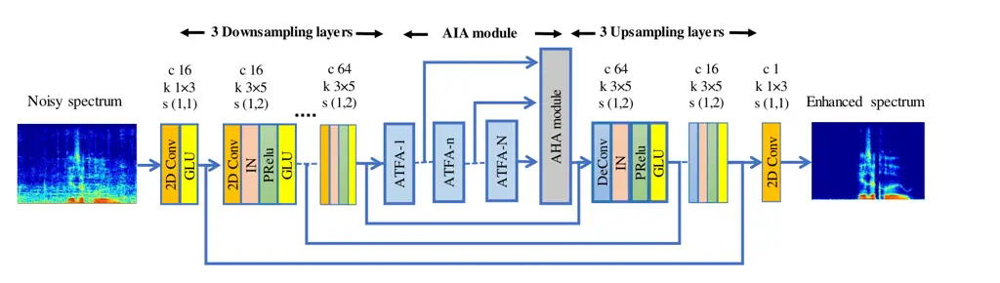
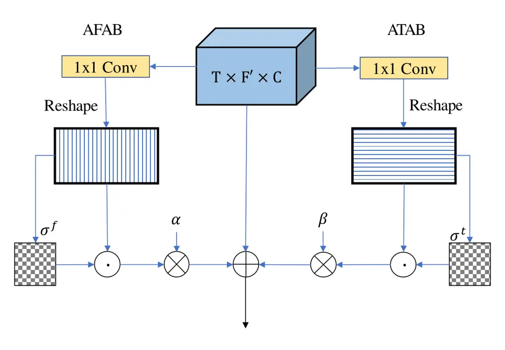
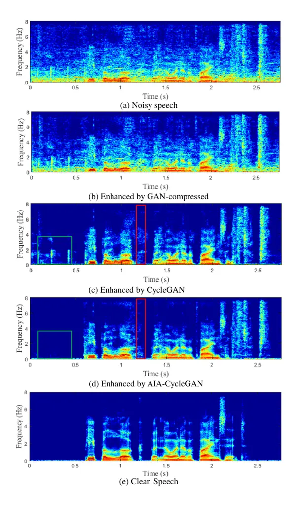

# CycleGAN-based Non-parallel Speech Enhancement with an Adaptive Attention-in-attention Mechanism

\authorblockNGuochen Yu\authorrefmark1\authorrefmark2, Yutian
Wang\authorrefmark1, Chengshi Zheng\authorrefmark2, Hui
Wang\authorrefmark1, and Qin Zhang\authorrefmark1
\authorblockA\authorrefmark1 State Key Laboratory of Media Convergence
and Communication, Communication University of China, Beijing, China  
E-mail: {yuguochen, wangyutian, hwang, zhangqin}@cuc.edu.cn
\authorblockA\authorrefmark2 Key Laboratory of Noise and Vibration
Research, Institute of Acoustics, Chinese Academy of Sciences, Beijing,
China  
E-mail: cszheng@mail.ioa.ac.cn

###### Abstract

Non-parallel training is a difficult but essential task for DNN-based
speech enhancement methods, for the lack of adequate noisy and paired
clean speech corpus in many real scenarios. In this paper, we propose a
novel adaptive attention-in-attention CycleGAN (AIA-CycleGAN) for
non-parallel speech enhancement. In previous CycleGAN-based non-parallel
speech enhancement methods, the limited mapping ability of the generator
may cause performance degradation and insufficient feature learning. To
alleviate this degradation, we propose an integration of adaptive
time-frequency attention (ATFA) and adaptive hierarchical attention
(AHA) to form an attention-in-attention (AIA) module for more flexible
feature learning during the mapping procedure. More specifically, ATFA
can capture the long-range temporal-spectral contextual information for
more effective feature representations, while AHA can flexibly aggregate
different AFTA’s intermediate output feature maps by adaptive attention
weights depending on the global context. Numerous experimental results
demonstrate that the proposed approach achieves consistently more
superior performance over previous GAN-based and CycleGAN-based methods
in non-parallel training. Moreover, experiments in parallel training
verify that the proposed AIA-CycleGAN also outperforms most advanced
GAN-based and Non-GAN based speech enhancement approaches, especially in
maintaining speech integrity and reducing speech distortion.

## 1 Introduction

Speech enhancement (SE) aims to recover clean speech components from the
noise-corrupted mixture, so as to improve speech quality and
intelligibility. It has become a fundamental technique in many
communication applications such as the front-ends for automatic speech
recognition (ASR) systems and hearing assistant devices \[1\]. Due to
the unprecedented development of deep neural networks (DNNs), many
DNN-based SE approaches have demonstrated better performance over
traditional signal-processing-based approaches \[2\]. These DNN-based
approaches can be divided into two categories, namely masking-based
approaches \[3, 4, 5\] and mapping-based approaches \[6, 7, 8\].
Recently, Generative Adversarial Networks (GANs) have shown their
promising performance in the SE area for its powerful capability of
mapping the target output distribution from the original input
distribution \[9, 10, 11, 12\], in which a generator ($`G`$) tries to
conduct the enhancement process and a discriminator ($`D`$) tries to
distinguish between real inputs and fake outputs generated by this
generator.

Figure 1: Training procedure of the proposed method. Forward
noisy-clean-noisy cycle and backward clean-noisy-clean cycle are
illustrated in the left and right parts, respectively.

In the standard formulation of supervised speech enhancement methods,
the mapping functions are trained to minimize the loss between the
output features of the enhanced speech and the features of the
corresponding clean speech. Therefore, they always need a large number
of paired clean-noisy samples to conduct supervised training and improve
the generalization of the whole network. However, there exist many
practical scenarios in which it is difficult or impossible to obtain
parallel recordings of clean-noisy pairs, and sometimes we can only
acquire clean data that mismatches the source noisy data. To resolve
this problem, CycleGAN was adopted for both standard parallel and
non-parallel training in the SE area \[14, 15, 16\], which was
originally proposed for unpaired image-to-image translation \[17\] and
began to thrive in speech applications in recent years \[18\].
Nonetheless, these previous non-parallel CycleGAN-based SE methods with
unpaired data can hardly achieve competitive performance when compared
with the standard parallel training, because of the limited mapping
ability of the generator.

In this paper, a novel CycleGAN-based system is proposed with an
adaptive attention-in-attention mechanism to cope with non-parallel
speech enhancement. Specifically, two generators (dubbed
$`G_{X\rightarrow Y}`$ and $`F_{Y\rightarrow X}`$) and two
discriminators (dubbed $`D_{X}`$ and $`D_{Y}`$) are jointly trained with
relativistic adversarial losses, cycle-consistency losses and an
identity mapping loss. To improve the mapping ability of the generators,
we propose a novel attention mechanism dubbed attention-in-attention
(AIA) in generators for more powerful feature fusion and feature
correlation learning. This AIA consists of adaptive time-frequency
attention (ATFA) and adaptive hierarchical attention (AHA).
Specifically, ATFA aims at capturing the long-range temporal-spectral
contextual dependency in parallel, while AHA aims to flexibly aggregate
all the output feature maps of ATFA together by the hierarchical
attention weights depending on the global context. For discriminators,
multi-scale discriminators are adopted to force the generator to pay
more attention to finer details. Besides, considering the effectiveness
of the power compression in the dereverberation and denoising task \[19,
20\], the magnitude of the spectrum is compressed as the input features
to better attenuate the background noise.

The remainder of the paper is organized as follows. In Section 2, the
proposed framework is described in detail. The experimental setup is
presented in Section 3, while experimental results are provided and
discussed in Section 4. Finally, conclusions are drawn in Section 5.

## 2 Proposed Scheme

### 2.1 Problem Formulation

In the speech enhancement task, when taking the short-time Fourier
transform (STFT) to the mixture signal, in the time-frequency (T-F)
domain, we can have:

```math
{X_{t,f}}=Y_{t,f}+Z_{t,f}, \tag{1}
```

where
$`X_{t,f}=\left|X_{t,f}\right|e^{j\theta_{X_{t,f}}}\in\mathbb{C}`$,
$`Y_{t,f}=\left|Y_{t,f}\right|e^{j\theta_{Y_{t,f}}}\in\mathbb{C}`$ and
$`Z_{t,f}=\left|Z_{t,f}\right|e^{j\theta_{Z_{t,f}}}\in\mathbb{C}`$
denote the T-F representations of the mixture, clean speech and noise
components in the time index of $`t`$ and frequency index of $`f`$,
respectively. Most recently, using the power-compressed spectra as input
features dramatically improves speech quality in the dereverberation and
denoising task \[19, 20\], so we conduct the power compression on the
spectral magnitude before feeding into the mapping network. The
compression coefficient is set to 0.5, which is reported an optimal
choice in \[20\]. Therefore, the enhanced spectral magnitude can be
expressed as:

```math
\begin{gathered}\left|\tilde{X}_{t,f}\right|^{\eta}=G_{X\rightarrow Y}(\left|{X}_{t,f}\right|^{\eta};\phi_{G}),\end{gathered} \tag{2}
```

where $`\eta=0.5`$; $`G_{X\rightarrow Y}`$ denotes the mapping function
of the generator $`G`$ and $`\phi_{G}`$ denotes its parameter set.



Figure 2: The framework of the proposed generators. IN, GLU, and PRelu
indicate instance normalization, gated linear unit, and parametric Relu
activation, respectively.

### 2.2 Network architecture

In our CycleGAN-based SE system, a forward noisy-to-clean generator
$`G`$ is first employed to enhance the noisy features to the clean ones,
while an inverse clean-to-noisy generator $`F`$ is applied to convert
the enhanced features back to the original domain. As illustrated in
Fig. 1, a forward-inverse noisy-clean-noisy cycle and an inverse-forward
clean-noisy-clean cycle jointly constrain $`G`$ and $`F`$ to conduct
non-parallel mapping. Discriminators $`D_{X}`$ and $`D_{Y}`$ are trained
to classify the target speech features as real and the generated speech
features as fake. As shown in Fig. 2, the generator is composed of three
components, including three downsampling layers, an adaptive
attention-in-attention (AIA) module and three homologous upsampling
layers. Each downsampling/upsampling layer block is composed of a 2D
convolution/deconvolution layer, followed by instance normalization
(IN), Parametric Relu activation function (PRelu) and gated liner units
(GLUs) \[21\]. The proposed AIA consists of six ATFA modules and an AHA
module, where ATFA is proposed to capture the long-range dependencies
along temporal-spectral dimensions with low computational cost and AHA
is introduced to aggregate different intermediate features to capture
the long-term hierarchical contextual information by the adaptive
weights depending on the global context.

The discriminator is composed of six 2D convolutions, each of which is
followed by spectral normalization (SN) and PRelu, so as to compress the
feature maps into a high-level representation. SN can stabilize the
training process of the discriminator and avoid vanishing or exploding
gradients \[22\]. Note that we set the configuration of the utilized
discriminators the same as our previous study \[23\]. Inspired by recent
studies on image enhancement \[24\], we propose to apply a multi-scale
discriminator that uses the intermediate layer of the discriminator with
a smaller receptive field, which can force the generator to produce
speech features with global consistency and finer details.



Figure 3: The diagram of adaptive time-frequency attention (ATFA)
modules. $`\bigodot`$ and $`\bigotimes`$ denote the matrix
multiplication and element-wise multiplication, respectively.

### 2.3 Adaptive Time-Frequency Attention

Attention mechanism \[25\] has been widely used in speech processing
tasks for its capability of leveraging the contextual information in the
feature maps. Following the terminology in \[26\], we compute the
attention function on the output feature maps
$`F_{in}\in\mathbb{R}^{B\times T\times F^{{}^{\prime}}\times C^{\prime}}`$
of the downsampling layers. Here, $`B`$ denotes the batch size of input
features, $`T`$ denotes the number of frames, $`F^{{}^{\prime}}`$
denotes the number of frequency bins and $`C^{\prime}`$ denotes the
number of channels in each feature map. To alleviate the heavy
computational complexity of conventional self-attention, we introduce an
adaptive time-frequency attention (ATFA) mechanism as a lightweight
solution to capture the long-range correlations exhibited in T-F
spectrogram as in \[27\]. As illustrated in Fig. 3, the proposed ATFA
consists of two branches: an adaptive time attention branch (ATAB) and
an adaptive frequency attention branch (AFAB). The two branches
cooperate to capture the global dependencies along temporal and spectral
dimensions in parallel. By factorizing the original attention into
time-dimension and frequency-dimension, we can reduce the large
attention weight matrix to two much smaller ones, i.e., $`(T\times T)`$
and $`(F^{{}^{\prime}}\times F^{{}^{\prime}})`$. Along the time path, we
reshape the input feature features into $`C^{t}F^{\prime}`$ vectors with
dimension $`1\times T`$ to calculate temporal self-attention, which can
be calculated as:

```math
\begin{gathered}Q^{t}=Conv^{t}_{Q}(F_{in}),K^{t}=Conv^{t}_{K}(F_{in}),V^{t}=Conv^{t}_{V}(F_{in}),\\
Q^{t}_{Res},K^{t}_{Res},V^{t}_{Res}=Reshape^{t}(Q^{t},K^{t},V^{t}),\\
\sigma^{t}=softmax((Q^{t}_{Res})\cdot(K^{t}_{Res})^{T}),\\
Out_{ATAB}=Reshape^{t^{\prime}}(\sigma^{t}\cdot V^{t}_{Res}),\\
\end{gathered} \tag{3}
```

where
$`Q^{t}_{Res},K^{t}_{Res},V^{t}_{Res}\in R^{B\times T\times(C^{t}\times F^{\prime})}`$,
$`C^{t}=\left\{{\frac{C}{8},\frac{C}{8},C}\right\}`$,
$`Out_{ATAB}\in\mathbb{R}^{B\times T\times F^{\prime}\times C}`$, and
$`C=64`$. Analogously, we reshape the input into $`C^{f}T`$ vectors with
dimension $`1\times F^{\prime}`$ to calculate the adaptive attention
$`Out_{AFAB}`$ along the frequency axis in parallel. Finally, The output
features of these two branches and the original features are then
combined together by two adaptive weights to generate the final output
of ATFA module, which can be formulated as:

```math
\begin{gathered}Out_{ATFA}=F_{in}+\alpha Out_{ATAB}+\beta Out_{AFAB}\end{gathered} \tag{4}
```

where $`F_{in}`$, $`Out_{ATAB}`$ and $`Out_{AFAB}`$ represent the
original input feature map given by the last downsampling layer, the
output of ATAB and the output of AFAB, respectively. Here, $`\alpha`$
and $`\beta`$ are initialized as 0 and gradually lean to assign a larger
weight. In summary, each branch has the following steps: (1) Reshape the
input features; (2) Extract the long-range contextual dependencies along
time and frequency axes, respectively; (3) Perform feature fusion along
different dimensions with adaptive weights.

Figure 4: The diagram of the adaptive hierarchical attention (AHA)
module. $`\textcircled{s}`$, $`\bigodot`$ and $`\bigotimes`$ denote the
softmax function, matrix multiplication and element-wise multiplication,
respectively.

### 2.4 Adaptive Hierarchical Attention

As shown in Fig. 4, we introduce an adaptive hierarchical attention
(AHA) module to integrate different hierarchical feature maps given a
set of ATFA modules’ outputs
$`F=\left\{F_{n}\right\}^{N}_{n=1},F_{n}\in\mathbb{R}^{T\times F^{\prime}\times C}`$,
where $`N`$ is the number of ATFA blocks and set to be 6. Specifically,
we first employ an average pooling layer $`Pool_{Avg}`$ and a
$`1\times 1`$ convolutional layer $`W_{n}`$ to squeeze the output
feature map of each ATFA modules into a global representation:
$`P_{n}^{h}=Pool_{Avg}(F_{n})\ast W_{n}\in R^{1\times 1\times 1}`$, and
then we concatenate all the outputs as
$`P^{h}\in\mathbb{R}^{1\times 1\times N\times 1}`$, which is then fed
into the Softmax function to obtain the hierarchical attention map
$`W^{h}\in\mathbb{R}^{1\times 1\times N\times 1}`$. After that we
cascade all inputs $`F=\left\{F_{n}\right\}^{N}_{n=1}`$ to obtain a
global feature map
$`F^{h}\in\mathbb{R}^{T\times F^{\prime}\times C\times N}`$.
Subsequently, we incorporate the global contextual information by
performing a matrix multiplication between
$`F^{h}\in\mathbb{R}^{T\times F^{\prime}\times C\times N}`$ and the
hierarchical attention weights $`W_{N}^{h}`$, which can be defined as:

```math
\begin{gathered}G_{N}=\sum_{i=1}^{N}W^{h}_{i}F_{i}^{h}\end{gathered} \tag{5}
```

where $`G_{N}\in\mathbb{R}^{T\times F^{\prime}\times C}`$ denotes the
global contextual feature maps. Finally, we perform an element-wise sum
operation between the output feature map $`F_{N}`$ the last ATFA module
and the global contextual feature map $`G_{N}`$ to obtain the final
$`Out_{AHA}\in\mathbb{R}^{T\times F^{\prime}\times C}`$:

```math
\begin{gathered}Out_{AHA}=F_{N}+\gamma\sum_{i=1}^{N}W^{h}_{i}F_{i}^{h}\\
=F_{N}+\gamma\sum_{i=1}^{N}\frac{\exp(Pool_{Avg}(F_{i})\ast W_{i})}{\sum_{n=1}^{N}\exp(Pool_{Avg}(F_{n})\ast W_{n})}F_{i}.\end{gathered} \tag{6}
```

Note that $`\gamma`$ is a learnable scalar coefficient and initialized
as 0. This adaptive learning weight gradually learns to assign larger
weight to merge global contextual information effectively. In a
nutshell, $`Out_{AHA}`$ is a weighted sum of all ATFA modules’ outputs,
thus helping to fuse the global context of all intermediate feature maps
with different weights and progressively guide the enhancement
procedure.

### 2.5 Loss function

To ensure the effective mapping in non-parallel training, we use the
following losses, namely relativistic adversarial losses,
cycle-consistency losses, and an identity mapping loss, to jointly
optimize the proposed model.

Relativistic adversarial loss: For the noisy-to-clean mapping procedure,
we employ the relativistic average least-square (RaLS) adversarial
loss \[28\] to make the enhanced compressed spectral magnitude
$`G_{X\rightarrow Y}(\left|{X}_{t,f}\right|^{0.5})`$ appear to the
target clean ones $`\left|{Y}_{t,f}\right|^{0.5}`$, which can be
expressed as below:

```math
\begin{gathered}\mathcal{L}_{RA}(D_{Y})=\mathbb{E}_{y}\left[(D_{Y}(y)-\mathbb{E}_{x}D_{Y}(G_{X\rightarrow Y}(x))-1)^{2}\right]+\\
\mathbb{E}_{x}\left[(D_{Y}(G_{X\rightarrow Y}(x))-\mathbb{E}_{y}(D_{Y}(y))+1)^{2}\right]\end{gathered} \tag{7}
```

```math
\begin{gathered}\mathcal{L}_{RA}(G_{X\rightarrow Y})=\mathbb{E}_{x}\left[(D_{Y}(G_{X\rightarrow Y}(x)))-\mathbb{E}_{y}D_{Y}(y)-1)^{2}\right]\\
+\mathbb{E}_{y}\left[(D_{Y}(y)-\mathbb{E}_{x}(D_{Y}(G_{X\rightarrow Y}(x)))+1)^{2}\right]\end{gathered} \tag{8}
```

where $`x`$ and $`y`$ are the compressed magnitudes of noisy and clean
spectrum (i.e. $`\left|{X}_{t,f}\right|^{0.5}`$ and
$`\left|{Y}_{t,f}\right|^{0.5}`$), respectively. Here, the generator
$`G_{X\rightarrow Y}`$ tries to synthesize the enhanced spectral
magnitude that can deceive the discriminator $`D_{Y}`$ by minimizing
$`\mathcal{L}_{RA}(G_{X\rightarrow Y})`$, whereas the discriminator
$`D_{Y}`$ attempts to distinguish the generated spectral magnitude from
the clean one $`y`$ by minimizing $`\mathcal{L}_{RA}(D_{Y})`$.
Analogously, the inverse clean-to-noisy generator $`F_{Y\rightarrow X}`$
and its corresponding discriminator $`D_{X}`$ are optimized using
$`\mathcal{L}_{RA}(D_{X})`$ and
$`\mathcal{L}_{RA}(F_{Y\rightarrow X})`$.

Cycle-consistency loss: Without parallel supervision, generators may map
source feature space to any random permutation of the target space
within only adversarial losses. To constrain the non-parallel mapping, a
cycle-consistency loss is utilized to bring the output back to original
input data. The cycle-consistency loss
$`\mathcal{L}_{cycle}(G_{X\rightarrow Y},F_{Y\rightarrow X})`$ can help
two generators $`G_{X\rightarrow Y}`$ and $`F_{Y\rightarrow X}`$ to
identity the pseudo pair $`(x,y)`$ without paired data as follows:

```math
\begin{gathered}\mathcal{L}_{cycle}(G_{X\rightarrow Y},F_{Y\rightarrow X})=\mathbb{E}_{x}\left[\left\|F_{Y\rightarrow X}(G_{X\rightarrow Y}(x))-x\right\|_{1}\right]\\
+\mathbb{E}_{y}\left[\left\|G_{X\rightarrow Y}(F_{Y\rightarrow X}(y))-y\right\|_{1}\right]\end{gathered} \tag{9}
```

where $`\left\|\cdot\right\|_{1}`$ indicates the $`L1`$ Norm.

Identity-mapping loss: Since the generator should not modify the
compositions, such as linguistic information of the target speech
feature when it is fed into the generator as the input \[16\], too much,
we regularize generators $`G`$ and $`F`$ to be as close as possible to
the identity mapping by minimizing an identity-mapping loss \[17\],
which can be given by:

```math
\begin{gathered}\mathcal{L}_{id}(G_{X\rightarrow Y},F_{Y\rightarrow X})=\mathbb{E}_{x}\left[\left\|F_{Y\rightarrow X}(x)-x\right\|_{1}\right]+\\
\mathbb{E}_{y}\left[\left\|G_{X\rightarrow Y}(y)-y\right\|_{1}\right]\end{gathered} \tag{10}
```

where the magnitudes of the target spectrum (i.e., $`y`$ and $`x`$) are
provided as the inputs of the generators (i.e., $`G_{X\rightarrow Y}`$
and $`F_{Y\rightarrow X}`$), respectively. In summary, the overall loss
can be summarized as follows:

```math
\begin{gathered}\mathcal{L}_{Full}=\mathcal{L}_{RA}(G_{X\rightarrow Y},D_{Y})+\mathcal{L}_{RA}(F_{Y\rightarrow X},D_{X})\\
+\lambda_{cycle}\mathcal{L}_{cycle}(G_{X\rightarrow Y},F_{Y\rightarrow X})+\lambda_{id}\mathcal{L}_{id}(G_{X\rightarrow Y},F_{Y\rightarrow X})\end{gathered} \tag{11}
```

where $`\lambda_{cycle}`$ and $`\lambda_{id}`$ are tunable
hyper-parameters, which are set to be 5 and 10, respectively.

## 3 Experiments

### 3.1 Datasets

The dataset used in this work is publicly available as proposed
in \[29\], which is a selection of the Voice Bank corpus \[30\] with 28
speakers for training and another 2 unseen speakers for the test. The
training set consists of 11572 mono audio samples, while the test set
contains 2 speakers’ (one male and one female) 824 utterances. For the
training set, audio samples are mixed together with one of the 10 noise
types, i.e., two artificial (babble and speech shaped) and eight real
noise from the DEMAND database \[31\], at four SNRs of 0, 5, 10 and 15
dB. The test utterances are created with 5 unseen test-noise types (all
from the DEMAND database) at SNRs of 2.5, 7.5, 12.5 and 17.5 dB. The
original raw waveforms are downsampled from 48kHz to 16kHz beforehand.

|                                               |      |      |       |        |
| --------------------------------------------- | ---- | ---- | ----- | ------ |
| Models                                        | PESQ | SSNR | STOI  | DNSMOS |
| Unprocessed                                   | 1.97 | 1.68 | 0.921 | 3.02   |
| Normal magnitude                              |      |      |       |        |
| CycleGAN (baseline)                           | 2.47 | 5.69 | 0.924 | 3.36   |
| CycleGAN+ATAB                                 | 2.53 | 6.28 | 0.929 | 3.40   |
| CycleGAN+AFAB                                 | 2.54 | 6.42 | 0.928 | 3.39   |
| CycleGAN+ATFA                                 | 2.59 | 6.65 | 0.932 | 3.41   |
| AIA-CycleGAN                                  | 2.61 | 6.69 | 0.931 | 3.43   |
| Compressed magnitude (parameter $`\eta=0.5`$) |      |      |       |        |
| CycleGAN (baseline)                           | 2.56 | 6.21 | 0.926 | 3.38   |
| CycleGAN+ATAB                                 | 2.59 | 6.67 | 0.928 | 3.41   |
| CycleGAN+AFAB                                 | 2.61 | 6.61 | 0.931 | 3.43   |
| CycleGAN+ATFA                                 | 2.64 | 6.94 | 0.930 | 3.45   |
| AIA-CycleGAN                                  | 2.67 | 7.23 | 0.932 | 3.47   |

Table 1: Ablation study for Normal and Compressed magnitude under
non-parallel training.

### 3.2 Implementation Setup

The Hanning window of length 32ms is utilized, with 75% overlap between
adjacent frames. The 512-point STFT is utilized and the 257-dimension
compressed spectral magnitude is used as the input feature. For the
non-parallel training strategy, we randomly crop a fixed-length segment
(i.e., 108 frames) from a randomly selected noisy audio file as the
input, while the target is a randomly selected clean audio file that is
different from the input audio. That is to say, the input totally
mismatches the target speech features. We adopt the Adam
optimizer \[32\] with the momentum term $`\beta_{1}=0.9`$,
$`\beta_{2}=0.999`$ and train the networks with an initial learning rate
of 0.0001 for discriminators and 0.0002 for generators, respectively.
The same learning rates are maintained for the first 50 epochs, while
they linearly decay in the remaining iterations. We set the batch size
to 4 and use $`\mathcal{L}_{id}`$ only for the first 20 epochs.

## 4 Results and Analysis

We use the following objective metrics to evaluate speech enhancement
performance: the perceptual evaluation of speech quality (PESQ) \[33\],
short-time objective intelligibility (STOI) \[34\], segmental
signal-to-noise ratio (SSNR), the mean opinion score (MOS) prediction of
the speech signal distortion (CSIG) \[35\], the MOS prediction of the
intrusiveness of background noise (CBAK) and the MOS prediction of the
overall effect (COVL) \[35\]. In addition, we evaluate the subjective
quality by DNSMOS \[36\], which is a robust non-intrusive perceptual
speech quality metric designed to evaluate noise suppressors. Higher
values of all metrics indicate better performance.

### 4.1 Ablation study

We first investigate the effectiveness of the proposed attention modules
and the power compression. As shown in Table 1, we set the CycleGAN
without proposed attention modules as the baseline, which is also
trained with the relativistic average least-square loss. From the
results, we can have the following observations. Firstly, compared with
non-compressed methods, CycleGAN-based approaches fed with the
compressed spectral magnitude achieve better performance, indicating
that the power compression facilitates more accurate spectrum recovery.
For example, compressed-magnitude CycleGAN achieves average 0.09 PESQ
and 0.52dB SSNR improvements over the normal-magnitude CycleGAN. The
possible rationale is that, when the compression operation is applied,
the gap between the magnitude of the speech and noise components is
narrowed, that is to say, the residual noise components in the weak
energy regions (i.e., middle and high-frequency regions) are given more
priority during the enhancement produce \[19\]. Secondly, by adding the
proposed attention branches, CycleGAN+ATAB improves the average PESQ and
STOI by 0.03 and 0.002 over the compressed-magnitude baseline, while
CycleGAN + AFAB improves the average PESQ and STOI by 0.05 and 0.004.
This indicates that the ATAB and AFAB can effectively guide the feature
learning procedure of the generators. By integrating ATAB and ATFB as
the ATFA modules, we also observe considerable improvements on PESQ,
SSNR and DNSMOS scores. Finally, by integrating the AHA module and ATFA
modules as an AIA module, we can see that the proposed AIA-CycleGAN
significantly outperforms other comparisons, which verifies the
effectiveness of the proposed AIA module in improving the speech
quality.

### 4.2 Comparison under non-parallel and parallel training

To investigate the effectiveness of our proposed method with both the
parallel and non-parallel training strategy, we compare our proposed
method with the reference methods including conventional GANs and
CycleGANs. Here, ”GAN-normal” is fed with the normal magnitude as the
input features while ”GAN-compressed” is fed with the compressed
magnitude. From Table 2, we can observe the following two phenomena.
Firstly, GAN-based methods yield similar performance with CycleGAN in
the parallel training, whereas CycleGAN outperforms GAN-based methods by
a large margin in the non-parallel training. This indicates the cycle
consistency constraint can prevent the mapping ability of the generators
from sharply degrading under unpaired data. Besides, by employing the
AIA module, the proposed approach under unpaired data achieves similar
and competitive performance compared with parallel training, and
significantly outperforms all the baselines. For example, AIA-CycleGAN
surpasses GAN-compressed by a large margin in PESQ, CSIG, CBAK, COVL and
DNSMOS using non-parallel training, which is 0.64, 0.38, 0.46, 0.54 and
0.79, respectively.

Fig. 5 shows the spectrograms of the noisy/clean utterances and the
utterances enhanced by GAN-compressed, CycleGAN and AIA-CycleGAN in the
non-parallel training. This figure demonstrates that CycleGANs
dramatically surpass the conventional GAN-based method. Moreover, we
observe that AIA-CycleGAN can effectively surpass the original CycleGAN
in terms of noise suppression. For example, as shown in the red sign
area and green sign area of Fig. 5 (c) and (d), AIA-CycleGAN shows a
more powerful capability of suppressing residual noise components.

|                       |      |       |      |      |      |        |
| --------------------- | ---- | ----- | ---- | ---- | ---- | ------ |
| Methods               | PESQ | STOI  | CSIG | CBAK | COVL | DNSMOS |
| Noisy                 | 1.97 | 0.921 | 3.35 | 2.44 | 2.63 | 3.02   |
| Non-parallel training |      |       |      |      |      |        |
| GAN-Normal            | 2.01 | 0.914 | 3.48 | 2.74 | 2.67 | 2.68   |
| GAN-Compressed        | 2.03 | 0.916 | 3.54 | 2.78 | 2.72 | 2.72   |
| CycleGAN              | 2.56 | 0.927 | 3.78 | 3.14 | 3.16 | 3.38   |
| AIA-CycleGAN          | 2.67 | 0.932 | 3.86 | 3.20 | 3.21 | 3.47   |
| Parallel training     |      |       |      |      |      |        |
| GAN-Normal            | 2.56 | 0.931 | 3.72 | 3.23 | 3.16 | 3.33   |
| GAN-Compressed        | 2.60 | 0.934 | 3.78 | 3.25 | 3.18 | 3.35   |
| CycleGAN              | 2.62 | 0.932 | 3.87 | 3.16 | 3.24 | 3.41   |
| AIA-CycleGAN          | 2.74 | 0.936 | 3.96 | 3.25 | 3.29 | 3.49   |

Table 2: Experimental results among different models under non-parallel
and parallel training. bold indicates the best results for different
training conditions.



Figure 5: Visualization of the noisy/clean spectrogram and enhanced
spectrogram using different methods.

### 4.3 Comparison with other competitive GAN-based and Non-GAN based approaches

Our proposed model is also compared with several other competitive
GAN-based and Non-GAN based baselines under standard paired data. As
seen from Table 3, AIA-CycleGAN outperforms these advanced GAN-based
methods in terms of PESQ, CSIG and COVL by considerable improvements,
while providing similar STOI and CBAK with CP-GAN \[12\]. For example,
AIA-CycleGAN provides average 0.58 PESQ, 0.011 STOI, 0.48 CSIG, 0.31
CBAK and 0.49 COVL improvements than SEGAN \[9\], which is the first
GAN-based SE approach in the time domain. The significant improvements
in PESQ, CSIG and COVL indicate that our proposed method better
maintains speech integrity while reducing speech distortion. When
compared with other Non-GAN based methods, our AIA-CycleGAN also
provides competitive performance especially in terms of PESQ and CSIG
scores. Note that we reimplement GCRN \[8\] and DCCRN \[5\] in Voice
bank + DEMAND dataset, and directly use the reported scores of other
methods in their original papers.

|                       |      |       |      |      |      |
| --------------------- | ---- | ----- | ---- | ---- | ---- |
| Methods               | PESQ | STOI  | CSIG | CBAK | COVL |
| Noisy                 | 1.97 | 0.921 | 3.35 | 2.44 | 2.63 |
| GAN-based methods     |      |       |      |      |      |
| SEGAN \[9\]           | 2.16 | 0.925 | 3.48 | 2.94 | 2.80 |
| MMSEGAN \[13\]        | 2.53 | 0.930 | 3.80 | 3.12 | 3.14 |
| RSGAN \[10\]          | 2.51 | 0.937 | 3.78 | 3.23 | 3.16 |
| RaSGAN \[10\]         | 2.57 | 0.937 | 3.83 | 3.28 | 3.20 |
| CP-GAN \[12\]         | 2.64 | 0.940 | 3.93 | 3.29 | 3.28 |
| Non-GAN based methods |      |       |      |      |      |
| Wave-U-net \[37\]     | 2.64 | –     | 3.56 | 3.08 | 3.09 |
| DFL-SE \[38\]         | –    | –     | 3.86 | 3.33 | 3.22 |
| CRN-MSE \[39\]        | 2.61 | 0.938 | 3.78 | 3.11 | 3.24 |
| GCRN \[8\]            | 2.51 | 0.940 | 3.71 | 3.24 | 3.09 |
| DCCRN \[5\]           | 2.68 | 0.939 | 3.88 | 3.18 | 3.27 |
| AIA-CycleGAN          | 2.74 | 0.936 | 3.96 | 3.25 | 3.29 |

Table 3: Experimental results among different models under parallel
training.

## 5 Conclusions

In this paper, we propose a novel adaptive attention-in-attention
CycleGAN (AIA-CycleGAN) to solve the difficulty in non-parallel speech
enhancement task. Specifically, we use relativistic adversarial losses,
cycle-consistency losses and an identity loss to jointly constrain the
forward noisy-clean-noisy cycle and backward clean-noisy-clean cycle. To
effectively improve the feature correlation learning in the generators,
we integrate adaptive time-frequency attention and adaptive hierarchical
attention to form an attention-in-attention module to capture local and
global long-range dependencies. By employing ATFA, generators can
capture the long-range temporal and frequency contextual information to
distinguish different types of information for more effective feature
representations. By employing AHA, generators can capture the long-range
hierarchical contextual information to flexibly aggregate different
global feature maps by learnable weights. Experimental results
demonstrate that the proposed approach provides consistently better
speech enhancement performance than the previous GAN-based and
CycleGAN-based baselines under both parallel and non-parallel training.

## Acknowledgment

This work was supported in part by the National Natural Science
Foundation of China under Grant 61631016 and Grant 61501410, and in part
by the Fundamental Research Funds for the Central Universities under
Grant 3132018XNG1805.

## References

- \[1\] P. C. Loizou, Speech enhancement: theory and practice, CRC
  press, 2013.
- \[2\] D. L. Wang and J. Chen, “Supervised speech separation based on
  deep learning: An overview,” IEEE/ACM Trans. Audio. Speech, Lang.
  Process., vol. 26, no. 10, pp. 1702–1726, 2018.
- \[3\] Y. Wang, A. Narayanan, and D. L. Wang, “On training targets for
  supervised speech separation,” IEEE/ACM Trans. Audio. Speech, Lang.
  Process., vol. 22, no. 12, pp. 1849–1858, 2014.
- \[4\] C. Hummersone, T. Stokes, and T. Brookes, “On the ideal ratio
  mask as the goal of computational auditory scene analysis,” in Blind
  source separation, pp. 349–368. Springer, 2014.
- \[5\] Y. Hu, Y. Liu, S. Lv, M. Xing, and L. Xie, “Dccrn: Deep complex
  convolution recurrent network for phase-aware speech enhancement,”
  arXiv preprint arXiv:2008.00264, 2020.
- \[6\] X. Lu, Y. Tsao, S. Matsuda, and C. Hori, “Speech enhancement
  based on deep denoising autoencoder.,” in Proc. of Interspeech, 2013,
  vol. 2013, pp. 436–440.
- \[7\] Y. Xu, J. Du, L. R. Dai, and C. H. Lee, “A regression approach
  to speech enhancement based on deep neural networks,” IEEE/ACM Trans.
  Audio. Speech, Lang. Process., vol. 23, no. 1, pp. 7–19, 2014.
- \[8\] K. Tan and D. L. Wang, “Learning complex spectral mapping with
  gated convolutional recurrent networks for monaural speech
  enhancement,” IEEE/ACM Trans. Audio. Speech, Lang. Process., vol. 28,
  pp. 380–390, 2019.
- \[9\] S. Pascual, A. Bonafonte, and J. Serra, “Segan: Speech
  enhancement generative adversarial network,” Proc. of Interspeech ,
  pp. 3642–3646, 2017.
- \[10\] D. Baby and S. Verhulst, “Sergan: Speech enhancement using
  relativistic generative adversarial networks with gradient penalty,”
  in Proc. of ICASSP. IEEE, 2019, pp. 106–110.
- \[11\] S. W. Fu, C. F. Liao, Y. Tsao, and S. D. Lin, “Metricgan:
  Generative adversarial networks based black-box metric scores
  optimization for speech enhancement,” in Proc. IMCL. PMLR, 2019, pp.
  2031–2041.
- \[12\] G. Liu, K. Gong, X. Liang, and Z. Chen, “Cp-gan: Context
  pyramid generative adversarial network for speech enhancement,” in
  Proc. of ICASSP. IEEE, 2020, pp. 6624–6628.
- \[13\] M. H. Soni, N. Shah, and H. A. Patil, “Time-frequency
  masking-based speech enhancement using generative adversarial
  network,” in Proc. of ICASSP. IEEE, 2018, pp. 5039–5043.
- \[14\] Y. Xiang and C. Bao, “A parallel-data-free speech enhancement
  method using multi-objective learning cycle-consistent generative
  adversarial network,” IEEE/ACM Trans. Audio. Speech, Lang. Process.,
  vol. 28, pp. 1826–1838, 2020.
- \[15\] G. Yu, Y. Wang, H. Wang, Q. Zhang, and C. Zheng, “A two-stage
  complex network using cycle-consistent generative adversarial networks
  for speech enhancement,” arXiv preprint arXiv:2109.02011, 2021.
- \[16\] Z. Meng, J. Li, Y. Gong, et al., “Cycle-consistent speech
  enhancement,” arXiv preprint arXiv:1809.02253, 2018.
- \[17\] J. Y. Zhu, T. Park, P. Isola, and A. A. Efros, “Unpaired
  image-to-image translation using cycle-consistent adversarial
  networks,” in Proc. of ICCV, 2017, pp. 2223–2232.
- \[18\] T. Kaneko and H. Kameoka, “CycleGAN-vc: Non-parallel voice
  conversion using cycle-consistent adversarial networks,” in 2018 26th
  European Signal Processing Conference (EUSIPCO). IEEE, 2018, pp.
  2100–2104.
- \[19\] A. Li, C. Zheng, R. Peng, and X. Li, “On the importance of
  power compression and phase estimation in monaural speech
  dereverberation,” JASA Express Letters, vol. 1, no. 1, pp.
  014802, 2021.
- \[20\] A. Li, W. Liu, X. Luo, G. Yu, C. Zheng, and X. Li, “A
  simultaneous denoising and desreverberation framework with target
  decoupling,” arXiv preprint arXiv:2106.12743, 2021.
- \[21\] Y. N. Dauphin, A. Fan, M. Auli, and D. Grangier, “Language
  modeling with gated convolutional networks,” in Proc. IMCL. PMLR,
  2017, pp. 933–941.
- \[22\] T. Miyato, T. Kataoka, M. Koyama, and Y. Yoshida, “Spectral
  normalization for generative adversarial networks,” in Proc.
  ICLR, 2018.
- \[23\] Y. Wang, G. Yu, J. Wang, H. Wang, and Q. Zhang, “Improved
  relativistic cycle-consistent gan with dilated residual network and
  multi-attention for speech enhancement,” IEEE Access, vol. 8, pp.
  183272–183285, 2020.
- \[24\] Z. Ni, W. Yang, S. Wang, L. Ma, and S. Kwong, “Towards
  unsupervised deep image enhancement with generative adversarial
  network,” IEEE Transactions on Image Processing, vol. 29, pp.
  9140–9151, 2020.
- \[25\] A. Vaswani, N. Shazeer, N. Parmar, J. Uszkoreit, L. Jones,
  A. N. Gomez, L. Kaiser, and I. Polosukhin, “Attention is all you
  need,” arXiv preprint arXiv:1706.03762, 2017.
- \[26\] H. Zhang, I. Goodfellow, D. Metaxas, and A. Odena,
  “Self-attention generative adversarial networks,” in Proc. IMCL. PMLR,
  2019, pp. 7354–7363.
- \[27\] C. Tang, C. Luo, Z. Zhao, W. Xie, and W. Zeng, “Joint
  time-frequency and time domain learning for speech enhancement,” in
  Proc. of AAAI, 2020, pp. 3816–3822.
- \[28\] A. Jolicoeur-Martineau, “The relativistic discriminator: a key
  element missing from standard gan,” arXiv preprint
  arXiv:1807.00734, 2018.
- \[29\] C. Valentini-Botinhao, X. Wang, S. Takaki, and J. Yamagishi,
  “Investigating rnn-based speech enhancement methods for noise-robust
  text-to-speech.,” in Proc. SSW, 2016, pp. 146–152.
- \[30\] C. Veaux, J. Yamagishi, and S. King, “The voice bank corpus:
  Design, collection and data analysis of a large regional accent speech
  database,” in Proc. O-COCOSDA/CASLRE. IEEE, 2013, pp. 1–4.
- \[31\] J. Thiemann, N. Ito, and E. Vincent, “The diverse environments
  multi-channel acoustic noise database: A database of multichannel
  environmental noise recordings,” Acoustical Society of America
  Journal, vol. 133, no. 5, pp. 3591, 2013.
- \[32\] D. Kingma and J. Ba, “Adam: A method for stochastic
  optimization,” arXiv preprint arXiv:1412.6980, 2014.
- \[33\] A. Rix, J. Beerends, M. Hollier, and A. Hekstra, “Perceptual
  evaluation of speech quality (PESQ)-a new method for speech quality
  assessment of telephone networks and codecs,” in Proc. of ICASSP.
  IEEE, 2001, vol. 2, pp. 749–752.
- \[34\] C. H. Taal, R. C. Hendriks, R. Heusdens, and J. Jensen, “A
  short-time objective intelligibility measure for time-frequency
  weighted noisy speech,” in Proc. of ICASSP. IEEE, 2010, pp. 4214–4217.
- \[35\] Y. Hu and P. C. Loizou, “Evaluation of objective quality
  measures for speech enhancement,” IEEE/ACM Trans. Audio. Speech, Lang.
  Process., vol. 16, no. 1, pp. 229–238, 2007.
- \[36\] C. K. Reddy, V. Gopal, and R. Cutler, “Dnsmos: A non-intrusive
  perceptual objective speech quality metric to evaluate noise
  suppressors,” arXiv preprint arXiv:2010.15258, 2020.
- \[37\] D. Stoller, S. Ewert, and S. Dixon, “Wave-u-net: A multi-scale
  neural network for end-to-end audio source separation,” arXiv preprint
  arXiv:1806.03185, 2018.
- \[38\] F. Germain, Q. Chen, and V. Koltun, “Speech denoising with deep
  feature losses,” in Proc. of Interspeech, 2019, pp. 2723–2727.
- \[39\] K. Tan and D. L. Wang, “A convolutional recurrent neural
  network for real-time speech enhancement.,” in Proc. of Interspeech,
  2018, pp. 3229–3233.
