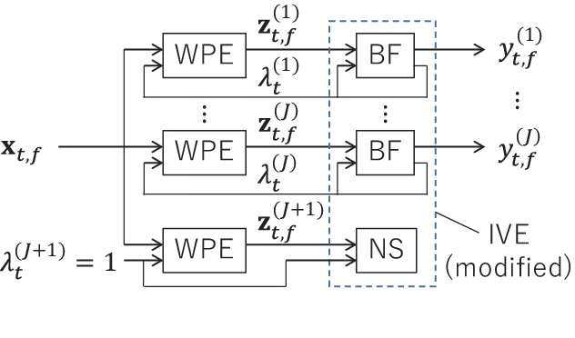

# Blind and neural network-guided convolutional beamformer for joint denoising, dereverberation, and source separation

Tomohiro Nakatani     Rintaro Ikeshita     Keisuke Kinoshita     Hiroshi
Sawada     Shoko Araki

###### Abstract

This paper proposes an approach for optimizing a Convolutional
BeamFormer (CBF) that can jointly perform denoising (DN),
dereverberation (DR), and source separation (SS). First, we develop a
blind CBF optimization algorithm that requires no prior information on
the sources or the room acoustics, by extending a conventional joint DR
and SS method. For making the optimization computationally tractable, we
incorporate two techniques into the approach: the Source-Wise
Factorization (SW-Fact) of a CBF and the Independent Vector Extraction
(IVE). To further improve the performance, we develop a method that
integrates a neural network (NN) based source power spectra estimation
with CBF optimization by an inverse-Gamma prior. Experiments using noisy
reverberant mixtures reveal that our proposed method with both blind and
NN-guided scenarios greatly outperforms the conventional
state-of-the-art NN-supported mask-based CBF in terms of the improvement
in automatic speech recognition and signal distortion reduction
performance.

###### Index Terms: 

Blind source separation, dereverberation, denoising, microphone array,
neural network

^(†)^(†)address: NTT Corporation, Japan

## 1 Introduction

When a speech signal is captured by distant microphones, e.g., in a
conference room, it often contains reverberation, diffuse noise, and
voices from extraneous speakers. They all reduce the intelligibility of
the captured speech and often cause serious degradation in many speech
applications, such as hands-free teleconferencing and Automatic Speech
Recognition (ASR).

Recently, mask-based BeamFormers (BFs) \[1, 2, 3\] have been actively
studied to minimize the aforementioned detrimental effects in acquired
signals. Masks indicate the time-frequency (TF) regions that are
dominated by target speakers’ voices and are used to estimate the
acoustic transfer functions (ATFs) from the speakers to microphones.
Many useful techniques have been proposed to estimate masks, e.g., by
neural networks (NNs) \[3, 4\] and clustering microphone array signals
\[5, 6\]. The mask-based BF approach effectively optimizes BFs and
Convolutional BFs (CBFs) that can jointly perform denoising (DN),
dereverberation (DR), and source separation (SS) \[7, 8\]. A drawback of
this approach, however, is that ATFs and BFs are estimated based on
different criteria, and thus the estimated ATFs are not guaranteed to be
optimal for BF/CBF estimation.

Blind signal processing (BSP) \[9, 10, 11, 12, 13, 14\], on the other
hand, has been long studied for optimizing BFs/CBFs based only on
observed signals with no prior information on source signals and room
acoustics. Its performance can be further improved with power spectral
estimates obtained using NNs \[15, 16, 17, 18\]. A potential advantage
of this approach over mask-based BFs/CBFs is that it can be optimized
without relying on separate ATF estimation. However, this approach is
limited because we have not yet developed effective and computationally
efficient algorithms for jointly optimizing DN, DR, and SS (DN+DR+SS).

To overcome the above limitations, this paper first develops a new
technique, called a blind CBF, that blindly estimates a CBF that can
jointly perform DN+DR+SS in a computationally efficient way. For this
purpose, we extend a conventional CBF developed for blind DR+SS \[19,
20\]. We empirically expect that this conventional CBF can also jointly
perform DN when we use more microphones than target sources and separate
stationary diffuse noise as additional sources. However, this extension
greatly increases the computing cost as the number of microphones
increases. To solve this problem, we incorporate two techniques that
have recently been proposed for DR+SS and DN+SS: source-wise
factorization (SW-Fact) of a CBF \[7, 21\] and Independent Vector
Extraction (IVE) \[22, 23, 24\]. Both respectively achieve
computationally efficient optimization by factorizing a complicated
multiple source DR step into simple single source DR steps based on
weighted prediction error (WPE) \[13\] and by omitting the separation of
signals within a noise subspace. Although both techniques have been
shown effective for their respective problems, their integration has not
yet been investigated for DN+DR+SS.

This paper introduces two techniques that improve the estimation
accuracy of the above extension. One is a coarse-fine source variance
model for the blind CBF, which is shown to be indispensable by
experiments for achieving high estimation accuracy. Another is a
NN-guided CBF, which incorporates source power spectra separately
estimated by a NN into the blind CBF as an inverse-Gamma prior of the
source variances. Experiments using very challenging noisy reverberant
speech mixtures show that our proposed blind CBF greatly outperforms the
conventional state-of-the-art, a mask-based CBF \[7\], in terms of
improvement in ASR performance and signal distortion reduction. With the
NN-guided CBF, the performance can be further improved to a level that
approaches one achieved by the conventional mask-based CBF with oracle
mask information.

In the remainder of this paper, after a brief overview of related work
in section 2, the problem formulation and proposed techniques are
presented in sections 3 and 4. Experiments and concluding remarks are
given in sections 5 and 6.

## 2 Related work

We also provide a comprehensive formulation of computationally efficient
joint optimization for blind DN+DR+SS \[25, 26\] by incorporating a CBF
configuration \[27\] into IVE \[24\]. From that formulation, the
algorithm proposed in this paper can be viewed as a variation using
SW-Fact, and here we develop it by incorporating an IVE model into a CBF
with SW-Fact \[21\]. SW-Fact is a versatile technique with wide
applications, including mask-based target speaker extraction \[7\],
allowing us to use computationally efficient optimization. In addition,
this paper proposes techniques to improve the estimation accuracy of the
proposed CBF (section 4.4).

Various techniques have integrated NNs and BSP \[15, 16, 17, 18\].
Because these techniques directly use source power spectra estimated by
NNs to update the coefficients of BFs/CBFs, NNs are required to present
precise power spectral estimates. Although we could have chosen the same
approach, our paper introduces looser integration of NNs and BSP using
an inverse-Gamma prior, which makes overall optimization less sensitive
to errors in the prior. Thus the framework can be easily extended to
work with various prior information, such as speaker diarization in
meetings \[6, 28\].

## 3 Problem formulation

Suppose that $`J`$ speech signals are captured by $`M`$ microphones with
$`M-J`$ noise signals.¹¹ 1 This assumption is introduced for algorithm
derivation, and in practice the proposed method can perform DN even in
diffuse noise environments, as shown by our experiments. This paper
models the captured signals at each time $`t`$ and frequency $`f`$ in
the short-time Fourier transformation domain as
$`{\mathbf{x}}_{t,f}=\sum_{\tau=0}^{L_{A}-1}{\mathbf{A}}_{\tau,f}{\mathbf{s}}_{t-\tau,f}`$,
where
$`\mathbf{x}_{t,f}=[x_{1,t,f},\ldots,x_{M,t,f}]^{\top}\in\mathbb{C}^{M\times 1}`$
is a vector containing the captured signals, letting $`(\cdot)^{\top}`$
denote a non-conjugate transpose,
$`\mathbf{s}_{t,f}=[s_{t,f}^{(1)},\ldots,s_{t,f}^{(J)},s_{t,f}^{(J+1)},\ldots,s_{t,f}^{(M)}]^{\top}\in\mathbb{C}^{M\times 1}`$
is a vector containing $`J`$ speech signals for $`j\in[1,J]`$ and
$`M-J`$ noise signals for $`j\in[J+1,M]`$, and
$`\mathbf{A}_{\tau,f}\in\mathbb{C}^{M\times M}`$ for
$`\tau=0,\ldots,L_{A}-1`$ are convolutional transfer function matrices
from the speech/noise sources to the microphones.

For performing DN+DR+SS, we introduce a CBF:

```math
\mathbf{y}_{t,f}=\mathbf{W}_{0,f}^{\mathsf{H}}\mathbf{x}_{t,f}+\bar{\mathbf{W}}_{D,f}^{\mathsf{H}}\bar{\mathbf{x}}_{t-D,f}. \tag{1}
```

where $`\mathbf{y}_{t,f}=[y_{t,f}^{(1)},\ldots,y_{t,f}^{(M)}]^{\top}`$
is the CBF output, i.e., an estimate of $`\mathbf{s}_{t,f}`$,
$`\mathbf{W}_{0,f}\in\mathbb{C}^{M\times M}`$ and
$`\bar{\mathbf{W}}_{D,f}\in\mathbb{C}^{M(L-D)\times M}`$ are the
coefficient matrices of the CBF,
$`\bar{\mathbf{x}}_{t-D,f}=[\mathbf{x}_{t-D,f}^{\top},\ldots,\mathbf{x}_{t-L+1,f}^{\top}]^{\top}\in\mathbb{C}^{M(L-D)\times 1}`$
is a vector containing a past captured signal sequence, and
$`(\cdot)^{\mathsf{H}}`$ denotes a conjugate transpose. Prediction delay
$`D~(\geq 1)`$ is introduced in Eq. (1) to set the goal of
dereverberation to reduce only the late reverberation and preserve the
direct signal and early reflections \[13, 29\].

The optimization of the above CBF may be solved as a problem of blind
DR+SS \[19\], where both the speech and noise sources are estimated as
separate CBF outputs. However, the direct application of such an
approach becomes computationally intractable as the number of
microphones is increased. In addition, its effectiveness for DN has not
been well investigated.



Figure 1: Processing flow of blind CBF with IVE source model: NS is a
filter matrix that extracts mixture of noise (section 4.3.2).

## 4 Proposed method

This section describes our proposed CBF that can achieve DN+DR+SS in a
computationally efficient way. We first incorporate two techniques, the
SW-Fact of a CBF used for DR+SS \[21\] and techniques used in IVE for
DN+SS \[23, 24\], into the proposed CBF in sections 4.1, 4.2, and 4.3.
Then we introduce techniques that further improve CBF’s estimation
accuracy in section 4.4.

### 4.1 SW-Fact of a CBF

As shown in a previous work \[7\] and illustrated in Fig. 1, a CBF at
each $`f`$ in Eq. (1), consisting of
$`\{\mathbf{W}_{0,f},\bar{\mathbf{W}}_{D,f}\}_{\tau}`$, can be strictly
factorized into a set of sub-filter pairs, each of which estimates
source $`y_{t,f}^{(j)}`$ and consists of a WPE filter with prediction
matrix $`\mathbf{G}_{f}^{(j)}\in\mathbb{C}^{M(L-D)\times M}`$ in Eq. (2)
and a BF $`\mathbf{q}_{f}^{(j)}\in\mathbb{C}^{M\times 1}`$ in Eq. (3):

```math
\displaystyle\mathbf{z}_{t,f}^{(j)} \displaystyle=\mathbf{x}_{t,f}-\left(\mathbf{G}_{f}^{(j)}\right)^{\mathsf{H}}\overline{\mathbf{x}}_{t-D,f}, \tag{2}
```

```math
\displaystyle y_{t,f}^{(j)} \displaystyle=\left(\mathbf{q}_{f}^{(j)}\right)^{\mathsf{H}}\mathbf{z}_{t,f}^{(j)}. \tag{3}
```

Here, Eq (2) dereverberates the $`j`$th source signal in
$`\mathbf{x}_{t,f}`$ using $`\mathbf{G}_{f}^{(j)}`$ and
$`\bar{\mathbf{x}}_{t-D,f}`$, yielding dereverberated signal
$`\mathbf{z}_{t,f}^{(j)}\in\mathbb{C}^{M\times 1}`$. Equation (3)
extracts the $`j`$th source signal from $`\mathbf{z}_{t,f}^{(j)}`$.
Because each sub-filter pair in the factorized form separately estimates
each source, this is called SW-Fact.

As shown in section 4.3.1, using SW-Fact is advantageous for reducing
the computational cost of the optimization.

### 4.2 Probabilistic formulation with an IVE source model

Next, following the ideas of IVE \[23, 24\], we define a source model,
hereafter referred to as an IVE source model, as

```math
\displaystyle p(\{y_{t,f}^{(j)}\}_{t,f,j}) \displaystyle=\prod_{t,f,j}p(y_{t,f}^{(j)}), \tag{4}
```

```math
\displaystyle p(y_{t,f}^{(j)}) \displaystyle=\left\{\begin{array}[]{l}{\cal N}(0,\lambda_{t}^{(j)})~~\mbox{for}~~j\in[1,J],\\
{\cal N}(0,1),~~\mbox{for}~~j\in[J+1,M],\end{array}\right.
```

where $`{\cal N}(0,\lambda)`$ denotes a complex Gaussian distribution
with a mean zero and variance $`\lambda`$. Equation (4) specifies mutual
independence between the sources. With this model, although speech
signals are modeled as time-varying Gaussians with time-varying and
frequency-independent variances $`\lambda_{t}^{(j)}`$, noise signals are
assumed to be stationary Gaussians. Due to this model, we can omit
separation between noise sources as will be shown in section 4.3.2.

Then, similar to the conventional blind CBF for DR+SS \[19, 21\], the
likelihood function can be derived, based on Eqs. (1)-(4.2) as

```math
\displaystyle{\cal L}(\theta)= \displaystyle-\sum_{t,f}\left[\sum_{j\in[1,J]}\left(\log\lambda_{t}^{(j)}+\frac{|{y}_{t,f}^{(j)}|^{2}}{\lambda_{t}^{(j)}}\right)+\sum_{j\in[J+1,M]}|{y}_{t,f}^{(j)}|^{2}\right]
```

```math
\displaystyle+2T\sum_{f}\log|\det{\mathbf{Q}}_{f}|, \tag{7}
```

where
$`\mathbf{Q}_{f}=[\mathbf{q}_{f}^{(1)},\ldots,\mathbf{q}_{f}^{(M)}]\in\mathbb{C}^{M\times M}`$
is a separation matrix,
$`\theta=\{\Theta_{\mathbf{G}},\Theta_{\mathbf{Q}},\Theta_{\lambda}\}`$
is a set of parameters to be estimated, letting
$`{\Theta_{\mathbf{G}}}=\{\{\mathbf{G}_{f}^{(j)}\}_{f}\}_{j}`$,
$`{\Theta_{\mathbf{Q}}}=\{\mathbf{Q}_{f}\}_{f}`$, and
$`\Theta_{\lambda}=\{\{\lambda_{t}^{(j)}\}_{t}\}_{j}`$, and $`T`$ is the
total number of time frames.

### 4.3 Optimization algorithm

We optimize a CBF by finding $`\theta`$ that maximizes the above
likelihood function. Since no closed form solutions are known for it, we
use iterative estimation based on a coordinate ascent method \[19\],
where $`\Theta_{\mathbf{G}}`$, $`\Theta_{\lambda}`$, and
$`\Theta_{\mathbf{Q}}`$ are alternately updated while fixing the others,
and the updates are iterated until a convergence is obtained. In the
following, we derive equations for each update, and show how the above
models can contribute to the computational efficiency for performing
DN+DR+SS.

#### 4.3.1 Update of $`\Theta_{\mathbf{G}}`$

By fixing $`\Theta_{\lambda}`$ and $`\Theta_{\mathbf{Q}}`$ at their
previously updated values and ignoring the constant terms, the
likelihood function for $`\Theta_{\mathbf{G}}`$ becomes

```math
\displaystyle{\cal L}(\Theta_{\mathbf{G}}) \displaystyle=-\sum_{f,j\in[1,M]}\left\|\left({\mathbf{G}}_{f}^{(j)}-\left({\mathbf{R}}_{f}^{(j)}\right)^{-1}\mathbf{P}_{f}^{(j)}\right){\mathbf{q}}_{f}^{(j)}\right\|_{{\mathbf{R}}_{f}^{(j)}}^{2}, \tag{8}
```

where
$`\left\|\mathbf{x}\right\|_{\mathbf{R}}^{2}=\mathbf{x}^{\mathsf{H}}\mathbf{R}\mathbf{x}`$,
$`\mathbf{R}_{f}^{(j)}=\sum_{t}{\bar{\mathbf{x}}_{t-D}\bar{\mathbf{x}}_{t-D}^{\mathsf{H}}}/\lambda_{t}^{(j)}`$,
$`\mathbf{P}_{f}^{(j)}=\sum_{t}{\bar{\mathbf{x}}_{t-D}\mathbf{x}_{t}^{\mathsf{H}}}/\lambda_{t}^{(j)}`$,
and we set $`\lambda_{t}^{(j)}=1`$ for $`j\in[J+1,M]`$ (i.e., noise
signals) for notation simplicity. Then, Eq. (8) can be maximized, not
depending on $`\Theta_{\mathbf{Q}}`$, by updating
$`{\mathbf{G}}_{f}^{(j)}`$ for each $`j`$ as

```math
\displaystyle{\mathbf{G}}_{f}^{(j)}\leftarrow\left({\mathbf{R}}_{f}^{(j)}\right)^{-1}\mathbf{P}_{f}^{(j)}~~\mbox{for}~~j\in[1,J+1]. \tag{9}
```

Here a clear advantage of using the IVE model is that we can skip
calculating $`\mathbf{G}_{f}^{(j)}`$ for $`j\in[J+2,M]`$; they take the
same value as $`\mathbf{G}_{f}^{(J+1)}`$ because all the noise signals
share identical variance $`\lambda_{t}^{(j)}=1`$. As an advantage of
using SW-Fact, we can separately optimize $`\mathbf{G}_{f}^{(j)}`$ for
each source \[21\], which makes the size of the covariance matrix
$`{\mathbf{R}}_{f}^{(j)}`$ (required for the update) $`M`$ times smaller
than the conventional CBF for DR+SS \[19, 20\]. This greatly reduces the
computational cost.

#### 4.3.2 Update of $`\Theta_{\mathbf{Q}}`$

By fixing $`\Theta_{\lambda}`$ and $`\Theta_{\mathbf{G}}`$ and ignoring
the constant terms, the likelihood function for updating
$`\Theta_{\mathbf{Q}}`$ becomes

```math
\displaystyle{\cal L}(\Theta_{\mathbf{Q}})= \displaystyle-\sum_{f,j\in[1,M]}\left\|\mathbf{q}_{f}^{(j)}\right\|_{\Sigma_{f}^{(j)}}^{2}+2T\sum_{f}\log|\det\mathbf{Q}_{f}|, \tag{10}
```

where
$`\Sigma_{f}^{(j)}=\sum_{t}{\mathbf{z}_{t,f}^{(j)}\left(\mathbf{z}_{t,f}^{(j)}\right)^{\mathsf{H}}}/{{\lambda}_{t}^{(j)}}`$
and $`\mathbf{z}_{t,f}^{(j)}`$ is a dereverberated signal obtained by
Eq. (2) using $`{\mathbf{G}}_{f}^{(j)}`$. Because the above likelihood
function is equivalent to that of the conventional IVE \[24\] except
that covariance matrices $`\Sigma_{f}^{(j)}`$ are obtained by source
dependent dereverberated signals $`\mathbf{z}_{t,f}^{(j)}`$, we can use
the same algorithm proposed for the conventional approach with minor
modifications.

With IVE, the filters for separating speech signals,
$`\mathbf{q}_{f}^{(j)}`$ for $`j\in[1,J]`$, are updated based on
Iterative Projection (IP) \[14\] as

```math
\displaystyle{\mathbf{q}}_{f}^{(j)} \displaystyle\leftarrow\left({\mathbf{Q}}_{f}^{\mathsf{H}}\Sigma_{f}^{(j)}\right)^{-1}\mathbf{e}_{j}, \tag{11}
```

```math
\displaystyle{\mathbf{q}}_{f}^{(j)} \displaystyle\leftarrow{\mathbf{q}}_{f}^{(j)}/\left\|\mathbf{q}_{f}^{(j)}\right\|_{\Sigma_{f}^{(j)}}, \tag{12}
```

where $`\mathbf{e}_{j}`$ is the $`j`$th column of identity matrix
$`\mathbf{I}_{M}\in\mathbb{R}^{M\times M}`$. In contrast, because our
interest is not noise separation, IVE \[23, 24\] only updates filter
matrix
$`\mathbf{Q}_{N,f}=[\mathbf{q}_{f}^{(J+1)},\ldots,\mathbf{q}_{f}^{(M)}]`$
that extracts a mixture of noise without distinguishing noise sources by

```math
\displaystyle{\mathbf{Q}}_{N,f}\leftarrow\left(\begin{array}[]{c}-({\mathbf{Q}}_{S,f}^{\mathsf{H}}\Sigma_{f}^{(J+1)}\mathbf{E}_{S})^{-1}({\mathbf{Q}}_{S,f}^{\mathsf{H}}\Sigma_{f}^{(J+1)}\mathbf{E}_{N})\\
\mathbf{I}_{M-J}\end{array}\right),
```

where
$`{\mathbf{Q}}_{S,f}=[{\mathbf{q}}_{f}^{(1)},\ldots,{\mathbf{q}}_{f}^{(J)}]`$,
and $`\mathbf{E}_{S}\in\mathbb{R}^{M\times J}`$ and
$`\mathbf{E}_{N}\in\mathbb{R}^{M\times(M-J)}`$ are the first $`J`$ and
the remaining $`M-J`$ columns of $`\mathbf{I}_{M}`$. Since
$`{\mathbf{Q}}_{N,f}`$ can be obtained by a single step update that does
not depend on the number of microphones, we can largely reduce the
computational cost especially when we have many microphones.

#### 4.3.3 Update of $`\Theta_{\mathbf{\lambda}}`$

For the update of $`\Theta_{\lambda}`$, the likelihood function becomes
$`{\cal L}(\Theta_{\lambda})=-\sum_{t,f,j\in[1,J]}\left(\log\lambda_{t}^{(j)}+{|y_{t,f}^{(j)}|^{2}}/{\lambda_{t}^{(j)}}\right)`$,
where $`y_{t,f}^{(n)}`$ is obtained by Eq. (3). Letting $`F`$ be the
number of frequency bins, we obtain

```math
\displaystyle{\lambda}_{t}^{(j)} \displaystyle\leftarrow\frac{1}{F}\sum_{f=0}^{F-1}|y_{t,f}^{(j)}|^{2}~~\mbox{for}~~j\in[1,J]. \tag{15}
```

Because the IVE model uses frequency independent source variances
$`\lambda_{t}^{(j)}`$, we can separate $`s_{t,f}^{(j)}`$ over all $`f`$
as independent vector \[11\] and solve the permutation re-alignment to
some extent even without any post-processing \[30\].

### 4.4 Advanced source models

As will be shown in our experiments, however, the IVE source model does
not necessarily provide the best performance of this approach. In the
following, we present two variations of source models that can improve
the performance.

#### 4.4.1 Coarse-fine source variance model

Although the IVE model is effective for SS to extract targets, it also
degrades the frequency resolution of the source model. Our preliminary
experiments revealed that it severely limits DR’s estimation accuracy.
To overcome that limitation, we propose a hybrid approach, called a
coarse-fine source variance model. While we adopt Eq. (15) for updating
the variances of SS, we use a frequency dependent source model for DR.
With this model, source variances $`\lambda_{t,f}^{(j)}`$ take different
values at different frequencies for DR, updated by

```math
\displaystyle{\lambda}_{t,f}^{(j)} \displaystyle\leftarrow|y_{t,f}^{(j)}|^{2}~~\mbox{for}~~j\in[1,J], \tag{16}
```

and used for the calculation of Eq. (9).

#### 4.4.2 NN-guided inverse-Gamma prior

A powerful alternative is to incorporate a NN into a source model. We
use the power spectra of each source, $`\gamma_{t,f}^{(j)}`$, estimated
by a NN, to define a prior distribution of $`\lambda_{t,f}^{(j)}`$. We
adopt inverse-Gamma distribution
$`IG(\lambda;\alpha,\beta)=\beta^{\alpha}\Gamma(\alpha)^{-1}\lambda^{-(\alpha+1)}\exp(-\beta/\lambda)`$
as the conjugate prior of the Gaussian source model, and set
$`\beta=\gamma_{t,f}^{(j)}`$. Then, $`\lambda_{t,f}^{(j)}`$ is updated
based on maximum a posteriori estimation by

```math
\displaystyle\lambda_{t,f}^{(j)}\leftarrow\frac{|y_{t,f}^{(j)}|^{2}+\gamma_{t,f}^{(j)}}{\alpha+2}~~\mbox{for}~~j\in[1,J], \tag{17}
```

and used to update both DR and SS. (Note that projection back \[31\] is
applied before this update to avoid scale ambiguity.)

In experiments, we set $`\alpha=1`$, and adopted a convolutional NN
(CNN) \[32\] with a large receptive field that resembles the one used by
a fully-Convolutional Time-domain Audio Separation Network (Conv-TasNet)
\[33\]. We trained the CNN to estimate masks based on utterance-level
permutation invariant training criterion, and obtained
$`\gamma_{t,f}^{(j)}`$ by applying the estimated masks to the captured
signals.

|                |            |             |        |        |        |     |                             |       |       |       |        |
| -------------- | ---------- | ----------- | ------ | ------ | ------ | --- | --------------------------- | ----- | ----- | ----- | ------ |
| BF/CBF         | Estimation | Source      | FWSSNR | CD     | STOI   |     | WER                         |       |       |       |        |
| type           | type       | model       | 10/100 | 10/100 | 10/100 |     | 2/20                        | 4/40  | 6/60  | 8/80  | 10/100 |
| Obs            | n/a        | n/a         | 1.12   | 5.44   | 0.55   |     | 62.49    (#Iterations: n/a) |       |       |       |        |
| IVE            | Blind      | IVE         | 4.78   | 4.02   | 0.76   |     | 49.65                       | 39.55 | 36.63 | 34.94 | 34.36  |
| WPE+IVE        | Blind      | Coarse-fine | 5.86   | 3.67   | 0.83   |     | 30.48                       | 22.67 | 20.40 | 19.81 | 19.54  |
| CBF (proposed) | Blind      | IVE         | 4.29   | 3.60   | 0.78   |     | 38.67                       | 28.80 | 26.55 | 26.04 | 25.65  |
| CBF (proposed) | Blind      | Coarse-fine | 6.16   | 3.48   | 0.84   |     | 29.42                       | 18.34 | 16.55 | 16.40 | 16.31  |
| IVE            | NN-guided  | NN prior    | 5.55   | 3.71   | 0.81   |     | 27.26                       | 28.30 | 28.01 | 28.03 | 28.38  |
| WPE+IVE        | NN-guided  | NN prior    | 6.61   | 3.36   | 0.88   |     | 15.67                       | 15.88 | 16.60 | 16.02 | 16.69  |
| CBF (proposed) | NN-guided  | NN prior    | 7.37   | 3.17   | 0.92   |     | 14.33                       | 14.33 | 14.03 | 13.71 | 13.24  |
| CBF \[7\]      | Mask-based | NN mask     | 5.79   | 3.62   | 0.82   |     | 21.08                       | 20.09 | 20.13 | 19.78 | 19.59  |
| CBF \[7\]      | Mask-based | Oracle mask | 7.42   | 2.95   | 0.91   |     | 12.43                       | 12.30 | 12.40 | 12.36 | 12.53  |
| CBF \[21\]     | Blind      | IVA         | 4.85   | 3.27   | 0.81   |     | 30.70                       | 29.28 | 28.93 | 28.97 | 28.30  |

Table 1: FWSSNRs (dB), CDs (dB), and STOIs for REVERB-2MIX SimData, and
WERs (%) for RealData, achieved by different BFs and CBFs after 10/100
iterations of WPE/IVE optimization. Results obtained with fewer
iterations are also shown for WERs.

## 5 EXPERIMENTS

This section experimentally evaluates the performance of our proposed
techniques in terms of signal distortion reduction and ASR performance
improvement. Due to space limitation, we skip the evaluation of the
computational efficiency of SW-Fact and IVE, which was firmly confirmed
in previous papers \[21, 24\].

### 5.1 Dataset, methods compared, and evaluation metrics

For the evaluation, we used the REVERB-2MIX dataset \[34\], which is
composed of noisy reverberant speech mixtures. Each mixture was created
by mixing two utterances (i.e., $`J=2`$) extracted from the REVERB
Challenge dataset (REVERB) \[35\]. Following the REVERB-2MIX guideline,
evaluation was performed using separated signals that correspond to the
evaluation set in REVERB.

With the blind estimation scenario, we compared four different methods:
IVE \[24\], a cascade configuration of WPE \[13\] followed by IVE
(WPE+IVE), and two variations of CBFs (proposed) with the IVE source
model (IVE) and with the coarse-fine source variance model. With the
NN-guided scenario, IVE, WPE+IVE, and CBF (proposed) were compared. The
number of iterations for optimization was set at 10 for WPE and 100 for
IVE in all the experiments. For example, we updated WPE once every 10
IVE updates in the optimization of the CBFs. We choose this scheme
because the convergence of WPE is generally much faster than that of IVE
and the computational cost of WPE per iteration is much larger than that
of IVE. For all the methods, we applied projection back \[31\] and
permutation re-alignment \[30\] post-processings because they always
improved the performance. We set the frame length and the shift to 32
and 8 ms. A Hann window was used for the short-time analysis. The
sampling frequency was 16 kHz and $`M=8`$ microphones were used. For WPE
and CBF, the prediction delay was set to $`D=2`$ and the prediction
filter lengths were respectively set at $`L=20,16`$, and $`8`$ for
frequency ranges of 0 to 0.8, 0.8 to 1.5, and 1.5 to 8 kHz.

We evaluated the speech enhancement performance using SimData in the
REVERB-2MIX based on objective measures \[36\], including the
Frequency-Weighted Segmental SNR (FWSSNR), the Cepstrum Distance (CD),
and the Short-Time Objective Intelligibility measure (STOI) \[37\]. In
addition, we evaluated the ASR scores of the separated utterances using
RealData in REVERB-2MIX. For the evaluation, we used a baseline ASR
system developed for REVERB with Kaldi \[38\] that was composed of a
trigram language model, and a TDNN acoustic model trained using a
lattice-free MMI and online i-vector extraction. They were trained on
the REVERB training set.

### 5.2 Evaluation results

Table 1 shows the evaluation results of all the methods as well as the
values calculated on the observed signals (Obs). Denoted by CBF \[7\],
the table also shows previous results \[7\] obtained using mask-based
CBFs based on masks estimated by a NN and based on oracle masks. Denoted
by CBF \[21\], the table also shows the results obtained using the
previously proposed CBF \[21\]. With CBF \[21\], the number of sources
to be separated is set equal to the number of microphones, i.e.,
$`I=M`$, and the CBF was optimized using an Independent Vector Analysis
(IVA) source model, where all the sources are modeled by time-varying
Gaussians.

As shown in the table, CBF (proposed) with the coarse-fine model and CBF
(proposed) with the NN-prior respectively achieved the best scores on
all the metrics in the blind and NN-guided scenarios. On the other hand,
CBF (proposed) with the IVE model underperformed WPE+IVE. That is, joint
optimization using the IVE model degraded the performance from cascade
optimization. This shows that the coarse-fine model was indispensable
for making the optimization of a blind CBF useful in this experiment.

When we compared the proposed CBFs with the conventional mask-based CBFs
\[7\], the blind CBF with the coarse-fine model largely outperformed the
mask-based CBF with masks estimated by a NN. In addition, CBF with the
NN-guided model achieved scores close to those obtained by the
mask-based CBF with oracle masks. These results clearly show the
superior effectiveness of the proposed CBF with both blind and NN-guided
scenarios.

Finally, when we compared the CBF (proposed) using the IVE source model
and CBF \[21\] using the IVA source model, the former outperformed the
latter for improving WERs and was comparable to the latter for improving
signal distortion scores. This means that using the IVE source model was
effective to improve the computational efficiency without degrading the
estimation accuracy from the IVA source model.

## 6 Concluding remarks

This paper proposed a method for optimizing a CBF that can jointly
perform DN+DR+SS. First, we developed a computationally efficient blind
CBF algorithm by incorporating two techniques into a conventional CBF
algorithm for joint DR+SS: SW-Fact and IVE. Then, we further improved
the CBF performance by presenting two advanced source models: a
coarse-fine source variance model for blind estimation and an
inverse-Gamma prior model for NN-guided estimation. Experiments using
noisy reverberant mixtures showed that the proposed blind and NN-guided
CBFs greatly outperformed the conventional state-of-the-art mask-based
CBF. In particular, the NN-guided CBF achieved a WER (13.24 %) that is
close to the WER (12.53 %) that can be obtained by the conventional
mask-based CBF only with oracle mask information.

## References

- \[1\] M. Souden, S. Araki, K. Kinoshita, T. Nakatani, and H. Sawada,
  “A multichannel MMSE-based framework for speech source separation and
  noise reduction,” _IEEE Trans. Audio, Speech, and Language
  Processing_, vol. 21, no. 9, pp. 1913–1928, 2010.
- \[2\] D. H. T. Vu and R. Haeb-Umbach, “Blind speech separation
  employing directional statistics in an expectation maximization
  framework,” in _Proc. IEEE ICASSP_, 2010.
- \[3\] J. Heymann, L. Drude, C. Boeddeker, P. Hanebrink, and
  R. Haeb-Umbach, “Beamnet: end-to-end training of a
  beamformer-supported multichannel ASR system,” in _Proc. IEEE ICASSP_,
  2017, pp. 5235–5329.
- \[4\] H. Erdogan, J. R. Hershey, S. Watanabe, and J. L. Roux,
  “Phase-sensitive and recognition-boosted speech separation using deep
  recurrent neural networks,” in _Proc. IEEE ICASSP_, 2015, pp. 708–712.
- \[5\] N. Ito, S. Araki, and T. Nakatani, “Complex angular central
  Gaussian mixture model for directional statistics in mask-based
  microphone array signal processing,” _Proc. EUSIPCO_, pp.
  1153–1157, 2016.
- \[6\] N. Kanda, C. Boeddeker, J. Heitkaemper, Y. Fujita, S. Horiguchi,
  K. Nagamatsu, and R. Haeb-Umbach, “Guided source separation meets a
  strong ASR backend: Hitachi/Paderborn university joint investigation
  for dinner party ASR,” in _Proc. Interspeech_, 2019, pp. 1248–1252.
- \[7\] T. Nakatani, C. Boeddeker, K. Kinoshita, R. Ikeshita,
  M. Delcroix, and R. Haeb-Umbach, “Jointly optimal denoising,
  dereverberation, and source separation,” _IEEE/ACM Trans. Audio,
  Speech, and Language Processing_, 2020.
- \[8\] W. Zhang, A. S. Subramanian, X. Chang, S. Watanabe, and Y. Qian,
  “End-to-end far-field speech recognition with unified dereverberation
  and beamforming,” in _Proc. Interspeech_, 2020.
- \[9\] P. Comon, “Independent component analysis, a new concept?”
  _Signal Processing_, vol. 36, no. 3, pp. 287–314, 1994.
- \[10\] A. Hyvärinen, J. Karhunen, and E. Oja, _Independent Component
  Analysis_. New York: John Wiley & Sons, 2001.
- \[11\] T. Kim, H. T. Attias, S.-Y. Lee, and T.-W. Lee, “Blind source
  separation exploiting higher-order frequency dependencies,” _IEEE
  Trans. Speech, and Audio Processing_, vol. 15, no. 1, pp. 70–79, 2006.
- \[12\] A. Hiroe, “Solution of permutation problem in frequency domain
  ica, using multivariate probability density functions,” in
  _Independent Component Analysis and Blind Signal Separation_, 2006,
  pp. 601–608.
- \[13\] T. Nakatani, T. Yoshioka, K. Kinoshita, M. Miyoshi, and B.-H.
  Juang, “Speech dereverberation based on variance-normalized delayed
  linear prediction,” _IEEE Transactions on Audio, Speech, and Language
  Processing_, vol. 18, no. 7, pp. 1717–1731, 2010.
- \[14\] N. Ono and S. Miyabe, “Auxiliary-function-based independent
  component analysis for super-Gaussian sources,” in
  _LVA/ICA_. Springer, 2010, pp. 165–172.
- \[15\] A. A. Nugraha, A. Liutkus, and E. Vincent, “Multichannel audio
  source separation with deep neural networks,” _IEEE/ACM Transactions
  on Audio, Speech and Language Processing_, vol. 24, no. 10, pp.
  1652–1664, 2016.
- \[16\] K. Kinoshita, M. Delcroix, H. Kwon, T. Mori, and T. Nakatani,
  “Neural network-based spectrum estimation for online WPE
  dereverberation,” in _Proc. Interspeech_, 2017, pp. 384–388.
- \[17\] N. Makishima, S. Mogami, N. Takamune, D. Kitamura, H. Sumino,
  S. Takamichi, H. Saruwatari, and N. Ono, “Independent deeply learned
  matrix analysis for determined audio source separation,” _IEEE/ACM
  Transactions on Audio, Speech, and Language Processing_, vol. 27,
  no. 10, pp. 1601–1615, 2019.
- \[18\] H. Kameoka, L. Li, S. Inoue, and S. Makino, “Supervised
  determined source separation with multichannel variational
  autoencoder,” _Neural computation_, vol. 31, no. 9, pp.
  1891–1914, 2019.
- \[19\] T. Yoshioka, T. Nakatani, M. Miyoshi, and H. G. Okuno, “Blind
  separation and dereverberation of speech mixtures by joint
  optimization,” _IEEE Trans. Audio, Speech, and Language Processing_,
  vol. 19, no. 1, January 2011.
- \[20\] H. Kagami, H. Kameoka, and M. Yukawa, “Joint separation and
  dereverberation of reverberant mixtures with determined multichannel
  non-negative matrix factorization,” in _Proc. IEEE ICASSP_, 2018, pp.
  31–35.
- \[21\] T. Nakatani, R. Ikeshita, K. Kinoshita, H. Sawada, and
  S. Araki, “Computationally efficient and versatile framework for joint
  optimization of blind speech separation and dereverberation,” in
  _Proc. Interspeech_, 2020.
- \[22\] Z. Koldovsky and P. Tichavský, “Gradient algorithms for complex
  non-Gaussian independent component/vector extraction, question of
  convergence,” _IEEE Trans. Signal Processing_, vol. 67, no. 4, pp.
  1050–1064, 2019.
- \[23\] R. Scheibler and N. Ono, “Independent vector analysis with more
  microphones than sources,” in _Proc. IEEE WASPAA_, 2019.
- \[24\] R. Ikeshita, T. Nakatani, and S. Araki, “Overdetermined
  independent vector analaysis,” in _Proc. IEEE ICASSP_, 2020.
- \[25\] R. Ikeshita and T. Nakatani, “Independent vector extraction,”
  in _Proc. Acoustical Society of Japan Spring Meeting (in
  Japanese)_, 2020.
- \[26\] ——, “Independent vector extraction for joint blind source
  separation and dereverberation,” _arXiv:2102.04696_, 2021.
- \[27\] R. Ikeshita, N. Ito, T. Nakatani, and H. Sawada, “Independent
  low-rank matrix analysis with decorrelation learning,” in _Proc. IEEE
  WASPAA_, October 2019.
- \[28\] T. Nakatani, N. Ito, T. Higuchi, S. Araki, and K. Kinoshita,
  “Integrating DNN-based and spatial clustering-based mask estimation
  for robust MVDR beamforming,” in _Proc. IEEE ICASSP_, 2017, pp.
  286–290.
- \[29\] K. Kinoshita, M. Delcroix, T. Nakatani, and M. Miyoshi,
  “Suppression of late reverberation effect on speech signal using
  long-term multiple-step linear prediction,” _IEEE Trans. Audio,
  Speech, and Language Processing_, vol. 17, no. 4, pp. 534–545, 2009.
- \[30\] H. Sawada, S. Araki, and S. Makino, “Underdetermined
  convolutive blind source separation via frequency bin-wise clustering
  and permutation alignment,” _IEEE Trans. Audio, Speech, and Language
  Processing_, vol. 19, no. 3, pp. 516–527, 2011.
- \[31\] N. Murata, S. Ikeda, and A. Ziehe, “An approach to blind source
  separation based on temporal structure of speech signals,”
  _Neurocomputing_, vol. 41, no. 1–4, pp. 1–24, Oct. 2001.
- \[32\] F. Bahmaninezhad, J. Wu, R. Gu, S.-X. Zhang, Y. Xu, M. Yu, and
  D. Yu, “A comprehensive study of speech separation: spectrogram vs
  waveform separation,” in _Proc. Interspeech_, 2019.
- \[33\] Y. Luo and N. Mesgarani, “Conv-TasNet: Surpassing ideal
  time–frequency magnitude masking for speech separation,” _IEEE/ACM
  Trans. Audio, Speech, and Language Processing_, vol. 27, no. 8, pp.
  1256–1266, 2019.
- \[34\] “REVERB-2MIX,” https://github.com/nttcslab-sp/REVERB-2MIX/.
- \[35\] K. Kinoshita, M. Delcroix, S. Gannot, E. A. P. Habets,
  R. Haeb-Umbach, W. Kellermann, V. Leutnant, R. Maas, T. Nakatani,
  B. Raj, A. Sehr, and T. Yoshioka, “A summary of the REVERB challenge:
  State-of-the-art and remaining challenges in reverberant speech
  processing research,” _EURASIP Journal on Advances in Signal
  Processing_, 2016.
- \[36\] Y. Hu and P. C. Loizou, “Evaluation of objective quality
  measures for speech enhancement,” _IEEE Trans. Audio, Speech, and
  Language Processing_, vol. 16, no. 1, pp. 229–238, 2008.
- \[37\] C. H. Taal, R. C. Hendriks, R. Heusdens, and J. Jensen, “An
  algorithm for intelligibility prediction of time-frequency weighted
  noisy speech,” _IEEE Trans. Audio, Speech, and Language Processing_,
  vol. 19, no. 7, 2011.
- \[38\] D. Povey, A. Ghoshal, G. Boulianne, L. Burget, O. Glembek,
  N. Goel, M. Hannemann, P. Motlicek, Y. Qian, P. Schwarz, J. Silovsky,
  G. Stemmer, and K. Vesely, “The Kaldi speech recognition toolkit,” in
  _Proc. IEEE ASRU_, 2011.
