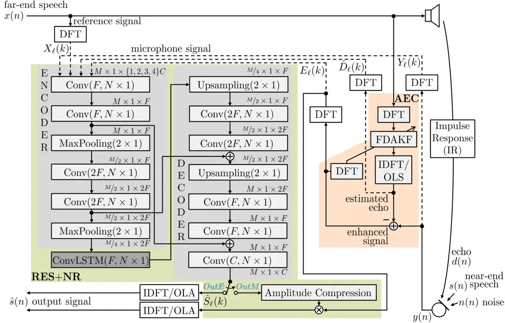

# Deep Residual Echo Suppression and Noise Reduction: A Multi-Input FCRN Approach in a Hybrid Speech Enhancement System

Jan Franzen    Tim Fingscheidt

###### Abstract

Deep neural network (DNN)-based approaches to acoustic echo cancellation
(AEC) and hybrid speech enhancement systems have gained increasing
attention recently, introducing significant performance improvements to
this research field. Using the fully convolutional recurrent network
(FCRN) architecture that is among state of the art topologies for noise
reduction, we present a novel deep residual echo suppression and noise
reduction with up to four input signals as part of a hybrid speech
enhancement system with a linear frequency domain adaptive Kalman filter
AEC. In an extensive ablation study, we reveal trade-offs with regard to
echo suppression, noise reduction, and near-end speech quality, and
provide surprising insights to the choice of the FCRN inputs: In
contrast to often seen input combinations for this task, we propose not
to use the loudspeaker reference signal, but the enhanced signal after
AEC, the microphone signal, and the echo estimate, yielding improvements
over previous approaches by more than $`0.2`$ PESQ points.

###### Index Terms: 

speech enhancement, residual echo suppression, noise reduction, fully
convolutional recurrent network ^(†)^(†) $`\copyright`$ 2022 IEEE.
Personal use of this material is permitted. Permission from IEEE must be
obtained for all other uses, in any current or future media, including
reprinting/republishing this material for advertising or promotional
purposes, creating new collective works, for resale or redistribution to
servers or lists, or reuse of any copyrighted component of this work in
other works.

^(†)^(†)address: Institute for Communications Technology, Technische
Universität Braunschweig,  
Schleinitzstr. 22, 38106 Braunschweig, Germany  
{j.franzen, t.fingscheidt}@tu-bs.de

## 1 Introduction

Speech enhancement systems are deployed in various applications such as
smartphones, home and web conference devices, automotive hands-free
systems and many more. An often used arrangement of the task is twofold:
as a first stage, the undesired echo component stemming from the
system’s own loudspeakers should be removed from the microphone signal,
which is referred to as acoustic echo cancellation (AEC) and is
typically performed with a linear adaptive filter. As a second stage,
these systems should further improve the signal by performing residual
echo suppression (RES) and noise reduction (NR)—usually done
simultaneously—to obtain an ideally echo- and noise-free near-end speech
component.

In this typical two-stage arrangement for speech enhancement, the
application of a DNN as second stage (RES and NR) gained increasing
attention with early investigations of feed-forward networks \[1, 2\],
convolutional networks bringing further improvements more recently \[3,
4\], some even being fully synergistic with the first stage \[5\], and
many more. In the meantime, also fully learned deep AEC approaches were
proposed, where a single network incorporates the tasks of AEC, RES, and
NR, e.g., \[6, 7\] or further investigated in \[8\]. Although showing an
impressive suppression performance, however, these are often accompanied
by some near-end speech degradation and—at least for now—hybrid
approaches are still one step ahead as can be seen with the leading
model of the AEC Challenge on ICASSP 2021 being a hybrid approach \[9\].

Although many proposals for hybrid approaches can be found in the
literature recently, we find that a solid investigation with regard to
the inputs of the second stage (RES/NR) network is lacking: While
in \[2\] only the impact of very few input combinations on a rather
simple feed-forward neural network is investigated without explicit
consideration of noise reduction capabilities, we observe that for
convolutional neural networks the utilized inputs to the second stage
network are often just stated without further questioning, reasoning, or
verification.

Just recently, the fully convolutional recurrent network (FCRN) topology
has proven itself very successful for noise reduction, as for example
found in the works of Strake et al. \[10, 11\] or Xu et al. \[12\].
Accordingly, in this work we investigate the FCRN topology as second
stage for RES and NR in the context of a hybrid speech enhancement
system with a frequency domain adaptive Kalman filter for AEC \[13,
14\]. Our contributions are as follows: First, we propose a multi-input
FCRN for RES/NR and investigate all possible input signal combinations,
revealing trade-offs between different performance aspects and providing
surprising insights to simple design choices. Second, we investigate
whether the improvements of the magnitude-bounded complex mask-based
procedure in \[11, 3\] can be transferred to this task as well. Third,
with the right choices, we improve performance over state of the art. It
should be noted that the findings of this work are not at all requiring
a Kalman filter AEC, but are easily transferable to other hybrid speech
enhancement systems and network topologies.

The remainder of this paper is structured as follows: In Section 2, a
system overview of the hybrid speech enhancement system including the
framework and network topology is given. Experimental variants for our
investigation are described in Section 3. In Section 4, the experimental
validation and discussion of all approaches is given. Section 5 provides
conclusions.

## 2 System Model and Network Topology



Figure 1: System model and FCRN topology for RES and NR with options for
input combinations (dashed lines) and output types (switch).

For this work, a single-channel hands-free speech enhancement scenario
is considered. The acoustic setup is outlined in Figure 1 and shall
cover typical single- and double-talk scenarios. Following the procedure
described in \[8, 6\], the TIMIT dataset \[15\] is used to set up
far-end speech $`x(n)`$ and near-end speech $`s(n)`$ at a sampling rate
of $`16`$ kHz. At the microphone, near-end speech $`s(n)`$ is
superimposed with background noise $`n(n)`$ and echo signals $`d(n)`$.
Echoes $`d(n)`$ are generated by imposing loudspeaker
nonlinearities \[6\] on far-end signals $`x(n)`$ and applying impulse
responses (IRs) created with the image method \[16\]. As in related
work \[8\], IRs are set to a length of $`512`$ samples with
reverberation times $`T_{60}\!\in\!\{0.2,0.3,0.4\}`$ s for training and
validation, and $`0.2`$ s for test mixtures. Background noise $`n(n)`$
from the QUT dataset \[17\] is used for training and validation. For the
test set unseen additive noises are used: babble, white noise, and
operations room noise from the NOISEX-92 dataset \[18\].

With signal-to-echo ratios (SER) being randomly selected from
$`\{-6,-3,0,3,6,\infty\}`$ dB per mixture and signal-to-noise ratios
(SNR) from $`\{8,10,12,14,\infty\}`$ dB per mixture, this leads to a
total of 3000 training and 500 evaluation mixtures. With _unseen_
speakers and utterances from the CSTR VCTK database \[19\] as well as
_unseen_ impulse responses and noise sequences, the test set consists of
280 mixtures where SER and SNR are set to $`3.5`$ dB and $`10`$ dB,
respectively. As in our previous work, we additionally provide an
evaluation with the test files consisting of echo only, near-end noise
only or near-end speech only, thereby revealing deeper insights into the
different network performance aspects.

### 2.1 First Stage: Kalman-Based AEC

As first stage a traditional AEC algorithm, namely the well-known
frequency domain adaptive Kalman filter (FDAKF) \[13\], is deployed. It
is based on overlap-save processing and can therefore be easily
synchronized with the second stage’s network by using the same frame
shift (here: $`R\!=\!256`$). It is set to operate at a sampling
frequency of $`16`$ kHz with a DFT size $`K_{\textrm{AEC}}\!=\!1024`$.
Further parameters are: forgetting factor $`A\!=\!0.998`$,
overestimation factor $`\lambda\!=\!1.5`$, and measurement noise
covariance matrix $`\mathbf{\Psi}_{ss}`$ smoothing
factor $`\beta\!=\!0.5`$. For the sake of brevity, the reader is
referred to \[14\] or \[20\] for a detailed description of the FDAKF. In
a traditional system, the FDAKF would usually be combined with a closely
tied RES approach \[21, 22\]. In this work, however, the FCRN as second
stage for RES and NR shall be investigated. Since we are not exclusively
bound to the Kalman filter (unlike for example \[5\], where a
synergistic approach is proposed), the first stage could certainly be
substituted by any other AEC algorithm that provides the respective
signals as used by the second stage.

### 2.2 Second Stage: FCRN-Based RES and NR

Our proposed system uses the well-performing fully convolutional
recurrent network (FCRN) \[10, 11\] as second stage. It is depicted in
the green box of Figure 1 and operates on discrete Fourier transform
(DFT) inputs, e.g., $`Y_{\ell}(k)`$, with frame index $`\ell`$ and
frequency bin $`k`$. It follows a convolutional encoder-decoder
structure where the parameters of the layers are Conv(\# filters, kernel
dimensions) with Leaky ReLU activations \[23\] and linear activations
for the output layer, MaxPooling(pool dimensions) over the feature axis,
and likewise for upsampling. Two skip connections are employed. The
final output is of dimension $`M\!\times\!1\!\times\!C`$. To enable the
network to model temporal context, a convolutional LSTM \[24\] with
$`F\!=\!88`$ filter kernels of size $`N\!\times\!1`$ is placed at the
bottleneck, with $`N\!=\!24`$. Denoted as feature axis $`\times`$ time
axis $`\times`$ number of feature maps, the feature dimensions can be
seen at the in- and output of each layer. As the network is subsequently
processing single input frames, the time axis value is set to $`1`$.

Input features and training targets are extracted with a frame length of
$`K\!=\!512`$ samples and aforementioned frame shift
of $`R\!=\!256`$ samples. A square root Hann window is applied and
complex spectra are obtained by computing the $`512`$-point DFT. They
are separated into real and imaginary parts which leads to $`C\!=\!2`$
channels, and zero-padded to feature maps of height $`M\!=\!260`$.

As we investigate the FCRN’s performance for RES and NR, clean speech is
selected as training target and the MSE loss

```math
J_{\ell}=\frac{1}{K}\sum_{k\in K}\big|\hat{S}_{\ell}(k)-S_{\ell}(k)\big|^{2} \tag{1}
```

in the frequency domain is applied on the network or masking outputs
$`\hat{S}_{\ell}(k)`$ during training. The training is performed using
the Adam optimizer \[25\] with standard parameters, a batch size
of $`16`$ and sequence length of $`50`$. The initial learning rate is
set to $`5\cdot 10^{-5}`$ and is multiplied by $`0.6`$ if the loss did
not improve for $`3`$ epochs. Training is stopped when the learning rate
drops below $`5\cdot 10^{-7}`$ or if the loss did not improve for
$`10`$ epochs. The network has about $`5.2`$ M parameters with only
slight variations depending on the number of inputs (see next section
for more details).

## 3 Experimental Design

While delivering higher than state of the art performance for RES and
NR, a main contribution of this paper shall be a solid investigation of
DNN input and output choices, thereby giving insights that can also be
transferred to other approaches and network topologies.

In Figure 1 four dashed signal paths can be seen at the input of the
network. The first two are the signals that are typical inputs for a
normal AEC (first stage): the microphone signal $`Y_{\ell}(k)`$ and the
reference signal $`X_{\ell}(k)`$. The AEC then provides two further
options: an estimated echo signal $`\hat{D}_{\ell}(k)`$ and of course
its enhanced signal $`E_{\ell}(k)`$. This opens the question which input
signal or combination of input signals can be used best for RES and NR
with an FCRN. In \[2\] a similar idea was followed, however, only for a
very small subset of the possible combinations, a rather simple
feed-forward neural network, and without explicit consideration of noise
reduction capabilities. Furthermore, an intuitive and often seen input
signal combination of a RES/NR network is the pair of enhanced
signal $`E_{\ell}(k)`$ and reference signal $`X_{\ell}(k)`$, which
delivers state of the art performance, e.g., in \[4, 9\]. But as the
reference signal does not contain any information about the room
characteristics yet, could the estimated echo
signal $`\hat{D}_{\ell}(k)`$ be a better choice? Or could the microphone
signal $`Y_{\ell}(k)`$ help to improve the noise reduction as it is
still unmodified in comparison to the enhanced signal $`E_{\ell}(k)`$?
With the enhanced signal $`E_{\ell}(k)`$ naturally being the most
important input for this task, we will investigate all possible
combinations with the three further options, interested in which are
best to use for the FCRN as RES and NR network and where possible
trade-offs can be found.

The second major question to investigate for this application is whether
it is more beneficial to perform a direct estimation of the complex
output target with the network (regression) or if the nice improvements
of the magnitude-bounded complex mask-based procedure in \[11, 3\] can
be transferred to this task as well.

The two options are indicated by the switch right after the FCRN output
layer in Figure 1. With switch position OutE a direct estimation of the
real and imaginary part of the clean speech target is performed. On the
other hand, with switch position OutM the task of the network is to
estimate a complex mask $`M_{\ell}(k)`$, which is then subject to
amplitude compression and multiplied with the enhanced
signal $`E_{\ell}(k)`$ to obtain the clean speech target as

```math
\hat{S}_{\ell}(k)=E_{\ell}(k)\cdot\textrm{tanh}(|M_{\ell}(k)|)\cdot\frac{M_{\ell}(k)}{|M_{\ell}(k)|}. \tag{2}
```

## 4 Results and Discussion

|                |                |                      |                |                                 |              |                        |                                 |                        |          |               |          |
| -------------- | -------------- | -------------------- | -------------- | ------------------------------- | ------------ | ---------------------- | ------------------------------- | ---------------------- | -------- | ------------- | -------- |
| Inputs         |                |                      |                |                                 | full mixture |                        |                                 |                        | $`d(n)`$ | $`n(n)`$      | $`s(n)`$ |
| $`\mathbf{Y}`$ | $`\mathbf{X}`$ | $`\mathbf{\hat{D}}`$ | $`\mathbf{E}`$ | Model                           | PESQ         | ERLE$`{}_{\text{BB}}`$ | $`\Delta`$SNR$`{}_{\text{BB}}`$ | PESQ$`{}_{\text{BB}}`$ | ERLE     | $`\Delta`$SNR | PESQ     |
| o              | o              |                      |                | Kalman (AEC)                    | 1.81         | 5.00                   | 0.73                            | 4.19                   | 5.26     | —             | 4.62     |
| o              | o              |                      |                | FCRN (AEC+RES+NR) (cf. \[6\])   | 2.26         | 18.38                  | 12.61                           | 3.15                   | 14.35    | 20.86         | 3.52     |
|                | o              |                      | o              | Kalman (AEC) + Halimeh (RES+NR) | 2.25         | 17.78                  | 12.40                           | 3.30                   | 16.22    | 13.24         | 2.97     |
|                |                |                      | o              | Kalman (AEC) + FCRN (RES+NR)    | 2.50         | 22.72                  | 14.39                           | 3.40                   | 24.19    | 13.90         | 3.40     |
| o              |                |                      | o              | Kalman (AEC) + FCRN (RES+NR)    | 2.52         | 21.79                  | 13.38                           | 3.55                   | 23.50    | 15.33         | 3.52     |
|                | o              |                      | o              | Kalman (AEC) + FCRN (RES+NR)    | 2.46         | 19.67                  | 12.75                           | 3.51                   | 16.78    | 12.17         | 3.45     |
|                |                | o                    | o              | Kalman (AEC) + FCRN (RES+NR)    | 2.53         | 21.46                  | 13.12                           | 3.58                   | 23.45    | 12.41         | 3.62     |
| o              | o              |                      | o              | Kalman (AEC) + FCRN (RES+NR)    | 2.55         | 21.02                  | 13.69                           | 3.51                   | 21.48    | 14.77         | 3.64     |
| o              |                | o                    | o              | Kalman (AEC) + FCRN (RES+NR)    | 2.52         | 21.32                  | 13.27                           | 3.58                   | 23.44    | 13.24         | 3.53     |
|                | o              | o                    | o              | Kalman (AEC) + FCRN (RES+NR)    | 2.51         | 20.16                  | 13.27                           | 3.55                   | 20.11    | 12.58         | 3.55     |
| o              | o              | o                    | o              | Kalman (AEC) + FCRN (RES+NR)    | 2.51         | 19.92                  | 13.16                           | 3.59                   | 20.50    | 13.43         | 3.65     |

|                |                |                      |                |                                       |              |                        |                                 |                        |          |               |          |
| -------------- | -------------- | -------------------- | -------------- | ------------------------------------- | ------------ | ---------------------- | ------------------------------- | ---------------------- | -------- | ------------- | -------- |
| Inputs         |                |                      |                |                                       | full mixture |                        |                                 |                        | $`d(n)`$ | $`n(n)`$      | $`s(n)`$ |
| $`\mathbf{Y}`$ | $`\mathbf{X}`$ | $`\mathbf{\hat{D}}`$ | $`\mathbf{E}`$ | Model                                 | PESQ         | ERLE$`{}_{\text{BB}}`$ | $`\Delta`$SNR$`{}_{\text{BB}}`$ | PESQ$`{}_{\text{BB}}`$ | ERLE     | $`\Delta`$SNR | PESQ     |
| o              | o              |                      |                | Kalman (AEC)                          | 1.81         | 5.00                   | 0.73                            | 4.19                   | 5.26     | —             | 4.62     |
| o              | o              |                      |                | FCRN (AEC+RES+NR)                     | 2.17         | 20.97                  | 9.89                            | 3.31                   | 16.93    | 17.97         | 3.87     |
|                | o              |                      | o              | Kalman (AEC) + Halimeh (RES+NR) \[4\] | 2.31         | 27.23                  | 14.21                           | 3.20                   | 25.50    | 14.24         | 3.80     |
|                |                |                      | o              | Kalman (AEC) + FCRN (RES+NR)          | 2.37         | 32.36                  | 15.28                           | 3.18                   | 29.16    | 14.74         | 3.84     |
| o              |                |                      | o              | Kalman (AEC) + FCRN (RES+NR)          | 2.52         | 32.40                  | 15.05                           | 3.32                   | 28.27    | 22.38         | 3.93     |
|                | o              |                      | o              | Kalman (AEC) + FCRN (RES+NR)          | 2.29         | 28.25                  | 13.80                           | 3.23                   | 25.17    | 14.18         | 3.89     |
|                |                | o                    | o              | Kalman (AEC) + FCRN (RES+NR)          | 2.52         | 32.40                  | 15.27                           | 3.31                   | 28.38    | 14.60         | 3.91     |
| o              | o              |                      | o              | Kalman (AEC) + FCRN (RES+NR)          | 2.32         | 28.84                  | 13.67                           | 3.21                   | 26.12    | 16.66         | 3.96     |
| o              |                | o                    | o              | Kalman (AEC) + FCRN (RES+NR)          | 2.54         | 32.92                  | 15.27                           | 3.30                   | 28.77    | 15.42         | 3.93     |
|                | o              | o                    | o              | Kalman (AEC) + FCRN (RES+NR)          | 2.48         | 30.30                  | 14.61                           | 3.29                   | 26.73    | 14.35         | 3.98     |
| o              | o              | o                    | o              | Kalman (AEC) + FCRN (RES+NR)          | 2.49         | 30.46                  | 14.77                           | 3.27                   | 26.78    | 14.45         | 3.97     |

Table 1: Experimental results for the different models with direct
estimation of real and imaginary part of the clean speech training
target $`S_{\ell}(k)`$: ERLE and $`\Delta`$SNR given in \[dB\], and PESQ
MOS LQO. Best result per measure is in bold font, second best is
underlined.

Table 2: Experimental results for the different models with complex mask
estimation and multiplication with the enhanced signal from AEC to
obtain the clean speech training target $`S_{\ell}(k)`$: ERLE and
$`\Delta`$SNR given in \[dB\], and PESQ MOS LQO. Only for the second row
FCRN (AEC+RES+NR), the estimated mask is multiplied with the microphone
signal as this experiment includes the task of AEC in the network. Best
result per measure is in bold font, second best is underlined. The bold
model is our proposal.

We use three measures to evaluate all approaches: Speech quality in
terms of wideband PESQ MOS LQO \[26, 27\], SNR
improvement ($`\Delta`$SNR) in \[dB\] for noise reduction, and echo
suppression by echo return loss enhancement (ERLE) in \[dB\] computed as
in \[8\]. To allow for a deeper understanding of the approaches, the
three right-most columns provide the performance when the microphone
signal consists of only one component: either echo ($`d(n)`$, rated with
ERLE), or near-end noise ($`n(n)`$, rated with $`\Delta`$SNR), or
near-end speech ($`s(n)`$, rated with PESQ), thereby revealing for
example if a model is able to pass through a clean speech signal.
Evaluation of the normal full mixture test set is provided in the four
center columns. PESQ MOS is given for the entire output signal,
and—indicated by the index *BB*—the so-called black box approach
according to ITU-T Recommendation P.1110 \[28, sec. 8\] and \[29, 30\]
is used to obtain processed components within the output signal as
$`\hat{s}(n)=\tilde{d}(n)+\tilde{n}(n)+\tilde{s}(n)`$. By that, an
evaluation of ERLE, $`\Delta`$SNR, and PESQ is also possible on the
separated processed components $`\tilde{d}(n)`$, $`\tilde{n}(n)`$, and
$`\tilde{s}(n)`$ for full mixture inputs even in double talk.

Table 2 provides experimental results for direct estimation of the clean
speech. Starting in the first row, the performance of the Kalman filter
as first stage is given. With about 5 dB, its echo suppression is rather
moderate (as its internally related postfilter is omitted for this work
and nonlinearities are part of the simulation setup), but remains a
nearly perfect near-end speech quality.

The following rows provide two approaches as baseline comparisons:
First, a single-stage ’all-in-one’ approach trains the FCRN to perform
all tasks (AEC+RES+NR) at once, as proposed in \[6\] using direct
estimation and further elaborated in \[8\]. As for the Kalman filter,
the only available inputs to this approach are the microphone
signal $`\mathbf{Y}`$ and reference signal $`\mathbf{X}`$ (for brevity
denoted as vectors without frame and bin index here). It shows a good
performance in terms of echo and noise reduction with up to nearly
$`21`$ dB, but at the cost of a degraded near-end speech ($`3.52`$ MOS
LQO when only $`s(n)`$ is present at the microphone). The second
baseline is our reimplementation of the model of Halimeh et al. \[4\]
for RES and NR. To allow for comparability it is deployed after our
Kalman filter as second stage with the in- and output setup described in
this work. The inputs to the network are given as reference
signal $`\mathbf{X}`$ and enhanced signal $`\mathbf{E}`$ \[4\]. In
addition to the Kalman filter, a good improvement in ERLE as well as
$`\Delta`$SNR can be observed with this model. While the overall PESQ
score is about the same as for the FCRN (AEC+RES+NR), however, the
Halimeh model is by far not able to maintain the near-end speech quality
in this regression setup.

In contrast, when the FCRN is deployed as second stage, the near-end
speech quality is up to $`0.68`$ MOS points higher ($`3.65`$) and the
overall PESQ score improves by up to $`0.3`$ to $`2.55`$ MOS points.
Results for all possible inputs combined with $`\mathbf{E}`$ are
provided: While the single input $`\mathbf{E}`$ gives a strong echo and
noise reduction, but at a somewhat lower near-end speech quality, the
other results reveal interesting patterns that can easily be seen in the
columns for $`d(n)`$ and $`n(n)`$: First, a higher ERLE is obtained if
the estimated echo $`\mathbf{\hat{D}}`$ is used instead of the reference
signal $`\mathbf{X}`$. Second, noise reduction is always improved if the
microphone signal $`\mathbf{Y}`$ is used as an additional input.
Interestingly, and contrary to what one might expect, these effects
diminish if simply all inputs are used. We conclude that a suitable
preselection of the inputs is helpful and key to tweak the desired
network behavior.

Table 2 provides results for the same experiments but now with complex
mask estimation and multiplication with the enhanced
signal $`\mathbf{E}`$ according to (2). For the second row
FCRN (AEC+RES+NR), however, the estimated mask is multiplied
with $`\mathbf{Y}`$, as this experiment includes the task of AEC in the
network. It can be seen that all approaches benefit from the masking
procedure. Also the Halimeh model now obtains an improved near-end
speech quality which is in line with its original design as masking
approach \[4\]. Investigating the various input combinations of the
FCRN, we see again the pattern of a higher ERLE when
using $`\mathbf{\hat{D}}`$ instead of $`\mathbf{X}`$, and
using $`\mathbf{Y}`$ in addition supports a stronger noise reduction
(except all four inputs are used).

If no specific behavior is desired but the best trade-off should be
obtained, we identify the input combination of $`\mathbf{Y}`$,
$`\mathbf{\hat{D}}`$ and $`\mathbf{E}`$ for the FCRN with complex
masking (2) to give the best overall results, see the model in bold font
in Table 2. It scores four metrics on 1st and 2nd rank, with a strong
near-end speech only PESQ of more than $`3.9`$ MOS points. With an
improved ERLE and $`\Delta`$SNR, and a $`0.23`$ higher full mixture PESQ
score than Halimeh ($`2.54`$ PESQ points), this is in line with informal
subjective listening experience.

## 5 Conclusions

We presented a hybrid speech enhancement scheme with a novel multi-input
fully convolutional recurrent network (FCRN) for deep residual echo
suppression and noise reduction. In an extensive ablation study on
network input signal combinations, we surprisingly found that the often
used loudspeaker reference signal should not be used for this task, but
the enhanced signal after acoustic echo cancellation (AEC), the
microphone signal, and the echo estimate. We improve previous approaches
by more than $`0.2`$ PESQ points and provide insights to simple design
choices, such as direct estimation or complex mask estimation.

## References

- \[1\] A. Schwarz, C. Hofmann, and W. Kellermann, “Spectral
  Feature-Based Nonlinear Residual Echo Suppression,” in Proc. of
  WASPAA, New Paltz, NY, USA, Oct. 2013, pp. 1–4.
- \[2\] G. Carbajal, R. Serizel, E. Vincent, and É. Humbert,
  “Multiple-Input Neural Network-Based Residual Echo Suppression,” in
  Proc. of ICASSP, Calgary, AB, Canada, Apr. 2018, pp. 231–235.
- \[3\] E. Seidel, J. Franzen, and T. Fingscheidt,
  “$`\mathrm{Y}^{2}`$-Net FCRN for Acoustic Echo and Noise Suppression,”
  arXiv:2103.17189, Mar. 2021.
- \[4\] M. Halimeh, T. Haubner, A. Briegleb, A. Schmidt, and
  W. Kellermann, “Combining Adaptive Filtering and Complex-Valued Deep
  Postfiltering for Acoustic Echo Cancellation,” in Proc. of ICASSP,
  Toronto, ON, Canada, June 2021, pp. 121–125.
- \[5\] T. Haubner, M. Halimeh, A. Brendel, and W. Kellermann, “A
  Synergistic Kalman- and Deep Postfiltering Approach to Acoustic Echo
  Cancellation,” arXiv:2012.08867, Dec. 2020.
- \[6\] H. Zhang, K. Tan, and D.L. Wang, “Deep Learning for Joint
  Acoustic Echo and Noise Cancellation with Nonlinear Distortions,” in
  Proc. of INTERSPEECH, Graz, Austria, Sept. 2019, pp. 4255–4259.
- \[7\] A. Fazel, M. El-Khamy, and Jungwon Le, “Deep Multitask Acoustic
  Echo Cancellation,” in Proc. of INTERSPEECH, Graz, Austria, Sept.
  2019, pp. 4250–4254.
- \[8\] J. Franzen, E. Seidel, and T. Fingscheidt, “AEC in a NetShell:
  On Target and Topology Choices for FCRN Acoustic Echo Cancellation,”
  in Proc. of ICASSP, Toronto, ON, Canada, June 2021, pp. 156–160.
- \[9\] J.-M. Valin, S. Tenneti, K.Helwani, U. Isik, and
  A. Krishnaswamy, “Low-Complexity, Real-Time Joint Neural Echo Control
  and Speech Enhancement Based On PercepNet,” arXiv:2102.05245,
  Feb. 2021.
- \[10\] M. Strake, B. Defraene, K. Fluyt, W. Tirry, and T. Fingscheidt,
  “Fully Convolutional Recurrent Networks for Speech Enhancement,” in
  Proc. of ICASSP, Barcelona, Spain, May 2020, pp. 6674–6678.
- \[11\] M. Strake, B. Defraene, K. Fluyt, W. Tirry, and T. Fingscheidt,
  “INTERSPEECH 2020 Deep Noise Suppression Challenge: A Fully
  Convolutional Recurrent Network (FCRN) for Joint Dereverberation and
  Denoising,” in Proc. of INTERSPEECH, Shanghai, China, Oct. 2020, pp.
  2467–2471.
- \[12\] Z. Xu, M. Strake, and T. Fingscheidt, “Deep Noise Suppression
  With Non-Intrusive PESQNet Supervision Enabling the Use of Real
  Training Data,” arXiv:2103.17088, Mar. 2021.
- \[13\] G. Enzner and P. Vary, “Frequency-Domain Adaptive Kalman Filter
  for Acoustic Echo Control in Hands-Free Telephones,” Signal Processing
  (Elsevier), vol. 86, no. 6, pp. 1140–1156, June 2006.
- \[14\] M. A. Jung, S. Elshamy, and T. Fingscheidt, “An Automotive
  Wideband Stereo Acoustic Echo Canceler Using Frequency-Domain Adaptive
  Filtering,” in Proc. of EUSIPCO, Lisbon, Portugal, Sept. 2014, pp.
  1452–1456.
- \[15\] J. S. Garofolo, L. F. Lamel, W. M. Fisher, J. G. Fiscus, and
  D. S. Pallett, “TIMIT Acoustic-Phonetic Continous Speech Corpus,”
  Linguistic Data Consortium, Philadelphia, PA, USA, 1993.
- \[16\] J. B. Allen and D. A. Berkley, “Image Method for Efficiently
  Simulating Small-Room Acoustics,” The Journal of the Acoustical
  Society of America, vol. 65, no. 4, pp. 943–950, 1979.
- \[17\] D. B. Dean, S. Sridharan, R. J. Vogt, and M. W. Mason, “The
  QUT-NOISE-TIMIT Corpus for the Evaluation of Voice Activity Detection
  Algorithms,” in Proc. of INTERSPEECH, Makuhari, Japan, Sept. 2010, p.
  3110–3113.
- \[18\] A. Varga and H. J. Steeneken, “Assessment for Automatic Speech
  Recognition: II. NOISEX-92: A Database and an Experiment to Study the
  Effect of Additive Noise on Speech Recognition Systems,” Speech
  Communication, vol. 12, no. 3, pp. 247–251, 1993.
- \[19\] J. Yamagishi, C. Veaux, and K. MacDonald, “CSTR VCTK Corpus:
  English Multi-speaker Corpus for CSTR Voice Cloning Toolkit,”
  University of Edinburgh. The Centre for Speech Technology
  Research, 2017.
- \[20\] J. Franzen and T. Fingscheidt, “In-Car Communication: From
  Single- to Four-Channel with the Frequency Domain Adaptive Kalman
  Filter,” in Vehicles, Drivers, and Safety, John H. L. Hansen et al.,
  Eds., pp. 213–227. Walter de Gruyter GmbH Berlin/Boston, 2020.
- \[21\] F. Kuech, E. Mabande, and G. Enzner, “State-Space Architecture
  of the Partitioned-Block-Based Acoustic Echo Controller,” in Proc. of
  ICASSP, Florence, Italy, May 2014, pp. 1295–1299.
- \[22\] J. Franzen and T. Fingscheidt, “An Efficient Residual Echo
  Suppression for Multi-Channel Acoustic Echo Cancellation Based on the
  Frequency-Domain Adaptive Kalman Filter,” in Proc. of ICASSP, Calgary,
  AB, Canada, Apr. 2018, pp. 226–230.
- \[23\] A. L. Maas, A. Y. Hannun, and A. Y. Ng, “Rectifier
  Nonlinearities Improve Neural Network Acoustic Models,” in Proc. of
  ICML Workshop on Deep Learning for Audio, Speech, and Language
  Processing, Atlanta, GA, USA, June 2013, pp. 1–6.
- \[24\] X. Shi, Z. Chen, H. Wang, D.-Y. Yeung, W. Wong, and W. Woo,
  “Convolutional LSTM Network: A Machine Learning Approach for
  Precipitation Nowcasting,” in Proc. of NIPS, Montreal, QC, Canada,
  Dec. 2015, pp. 802–810.
- \[25\] D. P. Kingma and J. Ba, “Adam: A Method for Stochastic
  Optimization,” in Proc. of ICLR, San Diego, CA, USA, May 2015, pp.
  1–15.
- \[26\] “ITU-T Recommendation P.862.2, Wideband Extension to
  Recommendation P.862 for the Assessment of Wideband Telephone Networks
  and Speech Codecs,” ITU, Nov. 2007.
- \[27\] “ITU-T Recommendation P.862.2 Corrigendum 1, Wideband Extension
  to Recommendation P.862 for the Assessment of Wideband Telephone
  Networks and Speech Codecs,” ITU, Oct. 2017.
- \[28\] “ITU-T Recommendation P.1110, Wideband Hands-Free Communication
  in Motor Vehicles,” ITU, Mar. 2017.
- \[29\] T. Fingscheidt and S. Suhadi, “Quality Assessment of Speech
  Enhancement Systems by Separation of Enhanced Speech, Noise, and
  Echo,” in Proc. of INTERSPEECH, Antwerp, Belgium, Aug. 2007, pp.
  818–821.
- \[30\] T. Fingscheidt, S. Suhadi, and K. Steinert, “Towards Objective
  Quality Assessment of Speech Enhancement Systems in a Black Box
  Approach,” in Proc. of ICASSP, Las Vegas, NV, USA, Apr. 2008, pp.
  273–276.
