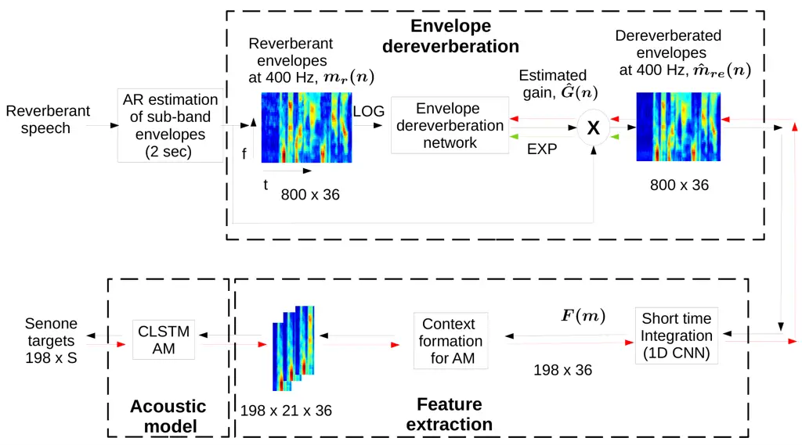

# Dereverberation of Autoregressive Envelopes for Far-field Speech Recognition

Journal: Computer Speech and Language Special Issue

Anurenjan Purushothaman Address:  Dept. of ECE, College of Engineering,
Thiruvananthapuram, India, 695016 Address: Learning and Extraction of
Acoustic Patterns (LEAP) lab,  
Electrical Engineering, Indian Institute of Science, Bangalore, India,
560012    Anirudh Sreeram Address: Learning and Extraction of Acoustic
Patterns (LEAP) lab,  
Electrical Engineering, Indian Institute of Science, Bangalore, India,
560012    Rohit Kumar Address: Learning and Extraction of Acoustic
Patterns (LEAP) lab,  
Electrical Engineering, Indian Institute of Science, Bangalore, India,
560012     
Sriram Ganapathy Address: Learning and Extraction of Acoustic Patterns
(LEAP) lab,  
Electrical Engineering, Indian Institute of Science, Bangalore, India,
560012

###### Abstract

The task of speech recognition in far-field environments is adversely
affected by the reverberant artifacts that elicit as the temporal
smearing of the sub-band envelopes. In this paper, we develop a neural
model for speech dereverberation using the long-term sub-band envelopes
of speech. The sub-band envelopes are derived using frequency domain
linear prediction (FDLP) which performs an autoregressive estimation of
the Hilbert envelopes. The neural dereverberation model estimates the
envelope gain which when applied to reverberant signals suppresses the
late reflection components in the far-field signal. The dereverberated
envelopes are used for feature extraction in speech recognition.
Further, the sequence of steps involved in envelope dereverberation,
feature extraction and acoustic modeling for ASR can be implemented as a
single neural processing pipeline which allows the joint learning of the
dereverberation network and the acoustic model. Several experiments are
performed on the REVERB challenge dataset, CHiME-3 dataset and VOiCES
dataset. In these experiments, the joint learning of envelope
dereverberation and acoustic model yields significant performance
improvements over the baseline ASR system based on log-mel spectrogram
as well as other past approaches for dereverberation (average relative
improvements of $`10`$-$`24`$% over the baseline system). A detailed
analysis on the choice of hyper-parameters and the cost function
involved in envelope dereverberation is also provided.

###### Keywords: 

Automatic speech recognition, Frequency domain linear prediction (FDLP),
Dereverberation , Neural speech enhancement, Joint learning.

## 1 Introduction

Automatic speech recognition (ASR) is a challenging task in far-field
conditions. This is particularly due to the fact that the speech signal
will be reverberant and noisy. The word error rates (WER) in ASR have
seen a dramatic improvement over the past decade due to the advancements
in deep learning based techniques \[1\]. Still the deterioration in
performance in noisy and reverberant conditions persist \[2\]. A
relative increase in WER of $`75\%`$ is reported by \[3, 4\] when the
signal from headset microphone is replaced with far-field array
microphone signals in the ASR systems. This deterioration is due to
temporal smearing of time domain envelopes caused by reverberation
\[5\].

One common approach to suppress reverberation is to combine all channels
by beamforming \[6\] before feeding it to the ASR system. Recently,
unsupervised neural mask estimator for generalized eigen-value
beamforming is proposed \[7\]. Traditional pre-possessing also includes
the weighted prediction error (WPE) \[8\] based dereverberation along
with the beamforming in most state-of-art far-field ASR systems.
Further, multi-condition training is usually used to alleviate the
mismatch between training and testing \[9\]. Here, either simulated
reverberant data or real far-field data can be added to the training
data. However, even with these techniques, the beamformed signal shows
significant amount of temporal smoothing in sub-band envelopes. The
temporal smearing is caused by the superposition of direct path signal
and reflected signals and this leads to ASR performance
degradation \[10\].

In this paper, we analyze the effect of reverberation on sub-band
Hilbert envelopes. We show that the effect of reverberation can be
approximated as convolution of the long-term sub-band envelopes of clean
speech with the envelope of room impulse response function. In order to
compensate for the late reverberation component in the envelope, we
explore a Wiener filtering approach where the Wiener filter gain is
computed using a deep neural network (DNN). The gain estimation network
is implemented using a convolutional-long short term memory (CLSTM)
model. The gain is multiplied with the sub-band envelopes to suppress
reverberation artifacts. The sub-band envelopes are converted to
spectrographic features through integration and used for deep neural
network based ASR. The sub-band envelopes are derived using the
autoregressive modeling framework of frequency domain linear prediction
(FDLP) \[11, 12\].

The steps involved in envelope dereverberation, feature extraction and
acoustic modeling for ASR can all be implemented as neural network
layers. Therefore, we also propose an approach for joint learning of the
speech dereverberation model with the ASR acoustic modeling network as a
single neural model. Various ASR experiments are performed on the REVERB
challenge dataset \[13\] as well as the CHiME-3 dataset \[14\]. In these
experiments, we show that the proposed approach improves over the
state-of-the-art ASR systems based on log-mel features as well as other
past approaches proposed for speech dereverberation and denoising based
on deep learning. In addition, we also extend the approach to large
vocabulary speech recognition on VOiCES dataset \[15, 16\].

The rest of the paper is organized as follows. The related prior work is
discussed in Section 2. This section also discusses the key
contributions from the proposed work. Section 3 provides details
regarding the reverberation artifacts and autoregressive envelope
estimation using frequency domain linear prediction. In Section 4, we
discuss the envelope dereverberation model, feature extraction as well
as the joint approach to dereverberation with acoustic modeling for ASR.
The ASR experiments and results are discussed in Section 5. Various
model parameter choices and additional analyses are reported in
Section 6. This is followed by a summary of the work in Section 7.

## 2 Related prior work

Xu et. al. in \[17\] attempted to find a mapping function from noisy and
clean signals using supervised neural network, which is used for
enhancement in the testing stage. In a similar manner, speech separation
problem is also explored with ideal ratio mask based neural mapping
\[18\]. Zhao et. al. proposed a LSTM model for late reflection
prediction in the spectrogram domain for reverberant speech \[19\]. A
spectral mapping approach using the log-magnitude inputs was attempted
by Han et. al \[20\]. A mask based approach to dereverberation on the
complex short-term Fourier transform domain was explored by Williamson
et. al \[21\].

Speech enhancement for speech recognition based on neural networks has
been explored in \[22, 23, 24\]. In Maas et. al \[25\], a recurrent
neural network is used to map noise-corrupted input features to their
corresponding clean versions. A context aware recurrent neural network
based convolutional encoder-decoder architecture was used in \[26\] to
map the power spectral features of noisy and clean speech. In a recent
work by Pandey et. al \[27\], the speech enhancement is learned in the
time domain itself, but using a matrix multiplication to convert the
time domain signal into frequency domain and the frequency domain loss
is used for training. This approach uses mean absolute error between the
STFT frames of the clean and noisy speech for training.

The joint learning of the speech enhancement neural model and the
acoustic model was attempted in \[28\]. Here, a DNN based speech
separation model is coupled with a DNN based acoustic model and the
weights are adjusted jointly. Bo Wu et. al. \[29\] proposed to unify the
speech enhancement neural model and the acoustic model trained
separately, and then the joint model is further trained to improve the
ASR performance. The power spectrum in the log domain was used as
features in the enhancement stage. Bo Wu et. al.  \[30\] also explored
an end-to-end deep learning approach in, where the knowledge about
reverberation time is incorporated in DNN based dereverberation front
end. This reverberation time aware-DNN enhancement module and ASR
acoustic module are further trained jointly to improve the ASR cost.

The key contributions from the current work can be summarized as
follows,

- 1.  Deriving a signal model for reverberation effects on sub-band speech
      envelopes and posing the dereverberation problem as a gain estimation
      problem.
- 2.  Dereverberation of the autoregressive estimates of the sub-band
      envelope using a CLSTM model followed by feature extraction for ASR.
- 3.  Joint learning of the dereverberation model parameters and the
      acoustic model for ASR in a single neural pipeline.
- 4.  Illustrating the performance benefits of the proposed approach for
      multiple ASR tasks.

We use FDLP features \[31\] for far-field speech. This paper extends the
prior work done in \[32\] by proposing a joint neural dereverberation
which forms an elegant neural learning framework. Further, several ASR
experiments with the joint modeling approach are also conducted in this
work.

## 3 Sub-band Envelopes - Effect of Reverberation and Autoregressive Estimation

We present the signal model for reverberation and the autoregressive
model for estimating the sub-band envelopes \[10, 33\].

### 3.1 Signal model

When speech is recorded in far-field reverberant environment, the data
collected in the microphone is modeled as

```math
\displaystyle r(t)=x(t)*h(t), \tag{1}
```

where $`x(t)`$, $`h(t)`$ and $`r(t)`$ denote the clean speech signal,
the room impulse response and the reverberant speech respectively. The
room response function $`h(t)=h_{e}(t)+h_{l}(t)`$, where $`h_{e}(t)`$
and $`h_{l}(t)`$ represent the early and late reflection components.

Let $`{\color[rgb]{0,0,0}x_{q}(n)}`$, $`{\color[rgb]{0,0,0}h_{q}(n)}`$
and $`{\color[rgb]{0,0,0}r_{q}(n)}`$ denote the decimated sub-band clean
speech, room-response and the reverberant speech signal respectively.
Here $`q=1,..,Q`$ denotes the sub-band index and $`n`$ denotes the
decimated time-index (frame). Assuming an ideal band-pass filtering we
can write (using Eq. 1),

```math
\displaystyle{\color[rgb]{0,0,0}r_{q}(n)=x_{q}(n)*h_{q}(n)} \tag{2}
```

In the proposed model, we explore the modeling of the sub-band temporal
envelopes. In order to extract the envelopes, the analytic signal based
demodulation is proposed. The analytic representation of a real-valued
signal is the complex signal consisting of the original function (real
part) and the Hilbert transform (imaginary part). The negative frequency
components of the analytic signal are zero-valued. By representing the
real-valued functions in analytic domain, the extraction of the
modulation components (like envelopes and carrier signals) is
facilitated.

Now, the analytic signal of the sub-band signal
$`{\color[rgb]{0,0,0}r_{q}(n)}`$ is denoted as
$`{\color[rgb]{0,0,0}r_{aq}(n)}`$, where
$`{\color[rgb]{0,0,0}r_{aq}(n)=r_{q}(n)+j\mathcal{H}[r_{q}(n)}]`$. Here,
$`\mathcal{H}[.]`$ is the Hilbert operator. It can be shown that \[11,
34\],

```math
\displaystyle{\color[rgb]{0,0,0}r_{aq}(n)=\frac{1}{2}[x_{aq}(n)*h_{aq}(n)]}, \tag{3}
```

If two signals have a modulating envelope on the same modulating
sinusoidal carrier signal (single AM-FM signal), the convolution
operation of the two signals will have an envelope which is the
convolution of the two envelopes, i.e., the envelope of the convolution
of the two signals is the convolution of the envelope of the signals.
For sub-band speech signals, this envelope convolution model will form a
good approximation if the sub-band signals are narrow-band.

Then, for band-pass filters with narrow band-width, we get the following
approximation between the sub-band envelope (defined as the magnitude of
the analytic signal) components of the reverberant signal and those of
the clean speech signal.

```math
\displaystyle{\color[rgb]{0,0,0}m_{rq}(n)\simeq\frac{1}{2}m_{xq}(n)*m_{hq}(n)}, \tag{4}
```

where $`m_{rq}(n)`$, $`m_{xq}(n)`$, $`m_{hq}(n)`$ denote the sub-band
envelopes of reverberant speech, clean speech and room response
respectively. We can further split the envelope into early and late
reflection coefficients.

```math
\displaystyle{\color[rgb]{0,0,0}m_{rq}(n)=m_{rqe}(n)+m_{rql}(n)}, \tag{5}
```

### 3.2 Autoregressive modeling of sub-band envelopes

Frequency domain linear prediction (FDLP) is the frequency domain dual
of the conventional time domain Linear Prediction (TDLP). Just as the
TDLP estimates the spectral envelope of a signal, FDLP estimates the
temporal envelope of the signal \[35\], i.e. square of its Hilbert
envelope \[36\]. The Hilbert envelope is given by the inverse Fourier
transform of the auto-correlation function of discrete cosine transform
(DCT) \[37, 38\].

We use the auto-correlation of the DCT coefficients to model the
temporal envelope of the signal. The autoregressive (AR) modeling
property of linear prediction implies that the model preserves the peak
location of the signal (which tend to be more robust in the presence of
noise and reverberation) \[39\]. For the FDLP model, the sub-band AR
model tries to preserve the peaks in temporal envelope \[33\].

Let $`x(t)`$ denote an $`N`$-point discrete sequence. The type-I odd DCT
\[40\] $`y[k]`$ for $`k=0,1,\ldots,N-1`$ is given by,

```math
y[k]=\sum_{t=0}^{N-1}c_{t,k}x(t)cos\left(\frac{2\pi tk}{M}\right) \tag{6}
```

where $`c_{t,k}=1`$ for $`t,k>0`$ and $`c_{t,k}=\frac{1}{2}`$ for
$`t,k=0`$ and $`c_{t,k}=\frac{1}{\sqrt{2}}`$ for the values of $`t,k`$
where only one of the index is $`0`$ and $`M=2N-1`$.

An even symmetric version of the input signal $`x(t)`$ is the signal
$`q(t)`$ of length $`M=2N-1`$ where,

```math
\displaystyle\color[rgb]{0,0,0}{q(t)=x(t),~~t=0..N-1~~~}
```

```math
\displaystyle\color[rgb]{0,0,0}{q(t)=x(M-t),~~t=N..M}
```

The analytic signal of a discrete time sequence can be defined using the
one-sided discrete Fourier transform (DFT) \[37\]. The analytic signal
$`q_{a}(t)`$ of the even-symmetric signal $`q(t)`$ can be shown to
be \[33\] the zero-padded DCT (upto scale) $`\hat{y}[k]`$, where
$`\hat{y}[k]=y[k],k=0..N-1`$ and $`\hat{y}[k]=0,k=N,..,M`$.

Further, it can be shown that \[37\], the auto-correlation of the
zero-padded DCT signal $`\hat{y}[k]`$ and the squared magnitude of the
analytic signal (Hilbert envelope) of the even-symmetric signal
$`|q_{a}(t)|^{2}`$ are Fourier transform pairs \[35\]. Hence, the
application of linear prediction on the zero-padded DCT signal yields
the AR model of the Hilbert envelope of signal.

Let the linear prediction coefficients obtained from the zero-padded DCT
signal be denoted as $`\{a_{k}\}_{k=0}^{p}`$, where $`p`$ is the order
of the LP. The FDLP model for the envelope is given by,

```math
\displaystyle\color[rgb]{0,0,0}{E(n)=\frac{\sigma}{|\sum_{k=0}^{p}a_{k}e^{-2\pi ikn}|^{2}}} \tag{7}
```

where $`\sigma`$ denotes the LP gain. The envelope estimated in above
equation represents the autoregressive model of the temporal envelopes.
Note that, when the model is applied on sub-band DCT coefficients, the
envelope estimated will be the sub-band temporal envelope.

In this work, the sub-band envelopes of speech in mel-spaced bands are
estimated using FDLP. Specifically, the discrete cosine transform (DCT)
of sub-band signal $`r_{q}(t)`$ is computed and a linear prediction (LP)
is applied on the DCT components. The LP envelope estimated using the
prediction on the DCT components provides an all-pole model of the
sub-band envelopes $`m_{rq}(n)`$.



Figure 1: Block schematic of envelope dereverberation model, the feature
extraction module and acoustic model (Here $`m_{r}(n)`$, $`\hat{G}(n)`$,
$`\hat{m}_{re}(n)`$ and $`F(m)`$ are given by Eq.s (5, 8-11), the
subscript $`q`$ is dropped to indicate the fact that, signals from all
the bands are considered). The entire model can be constructed as an
end-to-end neural framework. The black arrows denote the forward pass,
the red arrows represent backward propagation with ASR loss
($`E_{CE}`$), and green arrows denote the backward propagation with mean
square error loss ($`E_{MSE}`$). Here, $`S`$ is the total number of
senone targets.

## 4 Envelope Dereverberation and Joint Modeling

The proposed framework (Figure 1), consists of three modules, (i)
envelope dereverberation, (ii) feature extraction and (iii) ASR acoustic
model.

### 4.1 Neural dereverberation network

As seen in Eq. (5), the FDLP envelope of reverberant speech can be
expressed as sum of the direct component (early reflection) and those
with the late reflection. In the envelope dereverberation model, our aim
is to input the envelope of the reverberant sub-band temporal envelope
$`{\color[rgb]{0,0,0}m_{rq}(n)}`$ to predict the late reflection
components $`{\color[rgb]{0,0,0}m_{rql}(n)}`$. Once this prediction is
achieved, the late reflection component can be subtracted from the
sub-band envelope to suppress the artifacts of reverberation. A similar
analogy to this envelope subtraction approach is the spectral
subtraction model where the noise and clean power spectral density (PSD)
gets added in noisy speech PSD. If Gaussian assumptions are made for PSD
components \[41\], the Wiener filtering approach to noisy speech
enhancement provides the minimum mean squared error, where the noisy PSD
is multiplied by the gain of the filter. In a similar manner, we pose
the dereverberation problem as an envelope gain estimation problem.

The envelope gain ($`G_{q}`$) is defined as,

```math
\displaystyle\color[rgb]{0,0,0}{G_{q}(n)=\frac{\hat{m}_{rqe}(n)}{\hat{m}_{rqe}(n)+\hat{m}_{rql}(n)}} \tag{8}
```

The gain $`G_{q}(n)`$ is estimated using the input sub-band envelope
$`m_{rq}(n)`$. With the gain estimate, the dereverberated envelope can
be computed as,

```math
\displaystyle\color[rgb]{0,0,0}{\hat{m}_{rqe}(n)=G_{q}(n)m_{rq}(n)} \tag{9}
```

The product model of enhancement is inspired by Wiener filtering
principles. This sub-band envelope gain estimation is achieved using a
deep neural network model in the proposed work. Following the model
training, the dereverberation is achieved by multiplying the estimated
sub-band envelope gain with the sub-band envelope of reverberant speech.

The block schematic of the envelope dereverberation model is shown in
Figure 1. The input to the dereverberation model is the FDLP sub-band
envelope of the reverberant speech. The model is trained to learn the
sub-band envelope gain which is the ratio of the clean envelopes (direct
component) with the reverberant envelopes. During the model training,
the model inputs are either far-field microphone recordings or the
simulated reverberant recordings. The model targets are the envelope
gain (Eq 8) computed using either the close talking/near-room microphone
corresponding to the far-field microphone data, or the clean
close-talking microphone data for the simulated reverberant training
data. Thus, model is trained with paired data to estimate the gain.

As the envelopes and the gain parameters are positive in nature, the
model implementation in the neural architecture uses a logarithmic
transform at the input and the estimated gain is transformed by an
exponential operation. Specifically, the input to the dereverberation
model is the set of sub-band envelopes $`\{log(m_{rq})(n)\}_{q=1}^{Q}`$,
where $`Q`$ is the number of sub-bands. The model is trained to predict
the log-gain $`\{log(G_{q})\}_{q=1}^{Q}`$. The sub-band dereverberated
envelope is,

```math
\displaystyle\color[rgb]{0,0,0}{\hat{m}_{rqe}=exp\big[(log({\hat{G}_{q}(n))+log(m_{rq}(n))\big]}} \tag{10}
```

where $`\hat{G}_{q}(n)`$ is the estimate of the gain from the model.

The entire model developed in Section 3 is applicable only on long
analysis windows (which are typically greater than the T60 of the room
response function). Hence, the proposed approach operates on long
temporal envelopes of the order of $`2`$ sec. duration. From the
reverberant speech and the corresponding clean speech, the FDLP sub-band
envelopes corresponding to $`2`$ sec. non-overlapping segments are
extracted. If the input sampling rate is $`16`$ kHz, a $`2`$ sec.
segment will correspond to $`32`$k samples
($`{\color[rgb]{0,0,0}t=\{1..32000\}}`$). The FDLP envelopes are
extracted at a sampling rate of $`400`$ Hz. Thus, $`2`$ sec. segment of
audio corresponds to $`800`$ envelope samples
($`{\color[rgb]{0,0,0}n=\{1..800\}}`$) for each sub-band.

The input $`2`$-D data of sub-band envelopes ($`800`$ samples from
$`36`$ mel sub-bands) are fed to a set of convolutional layers where the
first two layers have $`32`$ filters each with kernels of size of
$`41\times 5`$. The next two CNN layers have $`64`$ filters with
$`21\times 3`$ kernel size. All the CNN layer outputs with ReLU
activations are zero padded to preserve the input size and no pooling
operation is performed. The output of the CNN layers are reshaped to
perform time domain recurrence using $`3`$ layers of LSTM cells. The
first two LSTM layers have $`1024`$ cells while the last layer has
$`36`$ cells corresponding to the size of the target signal (envelope
gain). The training criteria is based on the mean square error between
the target and predicted output. The model is trained with stochastic
gradient descent using Adam optimizer \[42\].

### 4.2 Feature Extraction and Acoustic Modeling

For feature extraction, the sub-band envelopes are integrated in short
Hamming shaped windows of size $`25`$ ms with a shift of $`10`$ ms
\[37\]. A $`25`$ ms slice corresponds at $`400`$ Hz sampling (FDLP
envelopes are sampled at $`400`$ Hz) to $`10`$ samples and the hop size
of $`10`$ ms corresponds to $`4`$ samples.

The windowed FDLP envelopes are multiplied with a Hamming shaped window
(size of $`10`$) and accumulated. This window is shifted by $`4`$
samples. A log compression is applied to limit the dynamic range of
values. Following this integration, a $`2`$ sec. chunk of
$`800\times 36`$ sub-band FDLP envelopes becomes $`198\times 36`$.

In particular, let $`\hat{m}_{rqe}(n)`$ denote the dereverberated
sub-band envelope obtained using Eq. (10). Further, let $`w(n)`$ denote
a Hamming window of size $`10`$ (corresponding to $`25`$ ms at $`400`$Hz
sampling). Then, the features for ASR are extracted as,

```math
\displaystyle\color[rgb]{0,0,0}{F_{q}(m)=log(\hat{m}_{rqe}(m)*w(m))} \tag{11}
```

where $`*`$ is the convolution operation, and $`F_{q}`$ denotes the
scalar feature of $`q`$th sub-band. Here, $`m`$ denotes the feature
frame index at $`10`$ms sampling ($`100`$ Hz). The features for all the
$`Q`$ sub-bands are spliced to form the final feature vector for ASR
model training.

The set of operations described above for short-term integration can be
implemented as a $`1`$-D CNN layer with a fixed Hamming shaped kernel
size of $`10`$ and a stride $`4`$. A log non-linearity is applied on the
convolution output.

The integrated envelopes are used as time-frequency representations for
ASR training. A context of $`21`$ frames, with $`10`$ frames on the left
and $`10`$ frames on the right is used in the acoustic model training.

### 4.3 Acoustic Model

The architecture of the acoustic model is based on convolutional long
short term memory (CLSTM) networks (Figure 1). The acoustic model
corresponds to 2-D CLSTM network described in \[31\], consisting of
$`4`$ layers of CNN, a layer of LSTM with $`1024`$ units performing
recurrence over frequency and $`3`$ fully connected layers with batch
normalization.

### 4.4 Joint learning

As shown in Figure 1, the three modules of (i) envelope dereverberation,
(ii) feature extraction and context formation and (iii) the ASR acoustic
modeling can be combined into a single neural end-to-end framework¹¹ 1
The implementation of the work can be found in
[https://github.com/iiscleap/FDLP_Envelope_Dereverberation](https://github.com/iiscleap/FDLP_Envelope_Dereverberation).
The intermediate envelope integration step is implemented as a
$`1`$-layer of $`1`$-D convolutions with Hamming shaped kernel and log
non-linearity. The context creation for acoustic features in the given
segment is also performed as a fixed $`1`$-D convolution layer. In this
manner, the entire processing pipeline can be performed using an elegant
joint learning approach.

For generating mini-batches in the model training, a $`2`$ sec. speech
segment is read along with the corresponding frame level targets
($`198`$ frames of senone targets for the $`2`$ sec. segment). The
entire joint neural network is trained using a combination of ASR cross
entropy training criterion and mean square loss between the clean and
reverberant envelopes. The gradients from the ASR loss at the input of
the acoustic model (computed for each senone target) is accumulated over
all the frames in the given $`2`$ sec. segment. This accumulated
gradient is of size $`198\times 36`$ which corresponds to the size of
the integrated envelopes. This ASR loss function when further
back-propagated through fixed 1-D CNN layer provides a gradient matrix
of size $`800\times 36`$. The gradient w.r.t. mean square error (MSE)
between the target envelopes and the dereverberation model outputs is
combined with the ASR based gradient for training the joint model. The
two gradients are indicated by two different backward arrows in
Figure 1.

#### 4.4.1 Joint loss function

The separate deverberation model is trained to minimize the mean square
error loss, $`E_{MSE}`$, which is the squared error between the
reverberant envelope and the clean counter part. For joint training, we
have two loss functions, one is the mean square error loss, $`E_{MSE}`$
for a mini-batch and the cross-entropy loss, $`E_{CE}`$ between the
senone targets and the corresponding posteriors for the same mini-batch.
We use a combination of these two losses. Thus the final joint loss,
$`E_{Total}`$ is given by,

```math
\displaystyle E_{Total}=E_{CE}+\mu\times E_{MSE}, \tag{12}
```

where $`\mu`$ is a regularization parameter, which decides the share of
$`E_{MSE}`$ in the joint loss, $`E_{Total}`$. In all our ASR
experiments, we have used regularization parameter $`\mu=0.4`$. The
absolute value of the two loss functions (different dynamic range in
Figure 2) does not have an impact as the model is trained with the
gradient of the losses. Note that the MSE loss changes by $`0.014`$ over
the course of joint training while the combined loss changes by
$`0.04`$, so they generally have comparable dynamic ranges, even if
these occur at different offsets from $`0`$. The regularization constant
$`\mu`$ controls the trade-off between the two loss functions.

(a) MSE loss vs epoch plot - dereverberation model training

(b) Loss vs epoch plot - joint model training

Figure 2: Variation of training loss and cross validation loss with
training epochs. The envelope dereverberation model and the ASR model
are pre-trained before the joint learning step.

The variation of the MSE loss in the envelope dereveberation network is
shown in Figure 2. The joint loss function on the training and
validation data is also shown in this Figure. While the MSE loss trained
with a higher learning rate exhibits oscillatory behavior, the joint
loss function is relatively smooth. The final joint model is used in our
ASR experiments.

Figure 3: Comparison of temporal envelopes, FDLP envelopes for clean,
reverberant speech and reverberant speech after proposed joint learning
based dereverberation, recordings from the REVERB Challenge dataset.

A visualization of the dereverberation, achieved for the sub-band
envelope of one single sub-band ($`10`$ th mel-band), is shown in
Figure 3. The sub-band envelopes of reverberant signal deviate from
their clean signal counterparts (as explained in Sec. 3). Using the
dereverberation model proposed in this paper, we find that the FDLP
envelopes are more closely matched with the clean signal envelopes. In
Section 5, we compare the performance of the CLSTM acoustic model
architecture with other model architectures for dereverberation.

## 5 Experiments and results

The experiments are performed on REVERB challenge \[13\] and CHiME-3
\[14\] datasets. For the baseline model, we use WPE enhancement \[8\]
along with unsupervised GEV beamforming \[7\]. This signal is processed
with filter-bank energy features (denoted as BF-FBANK). The FBANK
features are $`36`$ band log-mel spectrogram with frequency range of
$`200-6500`$ Hz. This is the same frequency decomposition used in the
FDLP and FDLP-dereverberation experiments. The acoustic model is the 2-D
CLSTM network described in \[31\].

| Model Features                            | Dev  |      |      | Eval |      |      |
| ----------------------------------------- | ---- | ---- | ---- | ---- | ---- | ---- |
|                                           | Real | Simu | Avg  | Real | Simu | Avg  |
| BF-FBANK                                  | 19.1 | 6.1  | 12.6 | 14.7 | 6.5  | 10.6 |
| BF-FDLP  \[31\]                           | 17.8 | 6.8  | 12.3 | 14.0 | 7.0  | 10.5 |
| BF-FBANK + CLSTM derevb. (prop)           | 17.3 | 5.5  | 11.4 | 13.1 | 6.9  | 10.0 |
| BF-FBANK + spectral mapping derevb.\[43\] | 15.8 | 5.2  | 10.5 | 12.8 | 6.7  | 9.7  |
| BF-FBANK + context aware derevb.\[26\]    | 19.6 | 6.9  | 13.2 | 17.5 | 9.0  | 13.2 |
| BF-FBANK + end to end derevb.\[30\]       | \-   | \-   | \-   | 24.8 | 7.9  | 16.4 |
| BF-FDLP + CLSTM derevb. (prop)            | 16.3 | 5.6  | 10.9 | 13.4 | 7.1  | 10.2 |
| BF-FDLP + CLSTM derevb. + joint (prop)    | 15.2 | 5.6  | 10.4 | 12.1 | 7.1  | 9.6  |

Table 1: Word Error Rate (%) in REVERB dataset for different features
and proposed dereverberation method. Here prop denotes proposed work in
this paper.

### 5.1 ASR framework

We use the Kaldi toolkit \[44\] for deriving the senone alignments used
in the PyTorch deep learning framework for acoustic modeling. A hidden
Markov model - Gaussian mixture model (HMM-GMM) system is trained with
MFCC (Mel Frequency Cepstral Coefficients) features \[45\] to generate
the alignments for training the CLSTM acoustic model. A tri-gram
language model \[46\] is used in the ASR decoding and the best language
model weight obtained from development set is used for the evaluation
set.

### 5.2 REVERB Challenge ASR

The REVERB challenge dataset \[47\] for ASR consists of $`8`$ channel
recordings with real and simulated reverberation conditions. The
simulated data is comprised of reverberant utterances generated (from
the WSJCAM0 corpus \[48\]) by artificially convolving clean WSJCAM0
recordings with the measured room impulse responses (RIRs) and adding
noise at an SNR of $`20`$ dB. The simulated data has six different
reverberation conditions. The real data, which is comprised of
utterances from the MC-WSJ-AV corpus \[49\], consists of utterances
spoken by human speakers in a noisy reverberant room. The training set
consists of $`7861`$ utterances from the clean WSJCAM0 training data by
convolved with $`24`$ measured RIRs.

#### 5.2.1 Discussion

Table 1 shows the WER results for experiments on REVERB challenge
dataset. The WPE along with unsupervised GEV beamformed signal is used
for all the ASR experiments (denoted as BF). The BF-FDLP baseline by
itself is better than the BF-FBANK baseline (average relative
improvements of $`2`$% on the development set and about $`1`$% on the
evaluation set). For a fair comparision of the proposed approach, we
have applied a similar dereverbaration method on BF-FBANK baseline.
Here, we have trained the neural model with log-mel features
corresponding to $`2`$ sec. duration with all the $`36`$ mel-bands
jointly. This approach is denoted as BF-FBANK + CLSTM derevb. (prop).
Average relative improvements of $`10`$% on the development set and
about $`6`$% on the evaluation set is achieved compared to the BF-FBANK
baseline.

BF-FBANK + spectral mapping derevb. \[43\] corresponds to the work by
Kun Han et. al. Here a $`3`$-layer deep neural network of $`2570`$ units
is used as the dereverberation neural model. The network is fed with
$`257`$-dimensional log-magnitude STFT features from a frame of $`25`$
m.sec. A context window of $`10`$-frames ($`5`$-left and $`5`$-right) is
selected and the network tries to predict the central frame. The work by
Santos et. al. is implemented as BF-FBANK + context aware
derevb. \[26\]. A CNN-GRU based encoder-decoder model sees the entire
utterance at the $`257`$-STFT magnitude level features and trained to
predict the clean utterance. The results for end-to-end dereverberation
network (joint learning) proposed in \[30\] is also compared with the
proposed work in Table 1.

Finally applying the proposed neural model based dereverberation on
BF-FDLP baseline (denoted as BF-FDLP + CLSTM derevb. (prop)) yields
average relative improvements of $`13`$% on the development set and
about $`4`$% on the evaluation set, compared to the BF-FBANK baseline.
After joint training this further improves to $`17`$% and $`9`$%
respectively. The improvement in real condition is much more than that
of simulated data. Average relative improvements of $`20`$% on the real
development set and about $`18`$% on the real evaluation set, compared
to the BF-FBANK baseline is achieved by the proposed method. This
suggests that, even though the jointly learned neural model is trained
only with simulated reverberation, it generalizes well on unseen real
data.

### 5.3 CHiME-3 ASR

The CHiME-3 dataset \[14\] for the ASR has multiple microphone tablet
device recording in four different environments, namely, public
transport (BUS), cafe (CAF), street junction (STR) and pedestrian area
(PED). For each of the above environments, real and simulated data are
present. The real data consists of $`6`$ channel recordings from WSJ0
corpus sampled at $`16`$ kHz spoken in the four varied environments. The
simulated data was constructed by mixing clean utterances with the
environment noise. The training dataset consists of $`1600`$ (real)
noisy recordings and $`7138`$ (simulated) noisy recordings from $`83`$
speakers.

| Model Features                            | Dev  |      |     | Eval |      |      |
| ----------------------------------------- | ---- | ---- | --- | ---- | ---- | ---- |
|                                           | Real | Simu | Avg | Real | Simu | Avg  |
| BF-FBANK                                  | 7.8  | 8.0  | 7.9 | 14.0 | 9.7  | 11.8 |
| BF-FDLP                                   | 7.0  | 8.1  | 7.5 | 12.0 | 10.0 | 11.0 |
| BF-FBANK + CLSTM derevb. (prop)           | 7.2  | 8.3  | 7.7 | 12.9 | 9.8  | 11.4 |
| BF-FBANK + spectral mapping derevb.\[43\] | 8.0  | 10.0 | 9.0 | 14.3 | 12.3 | 13.3 |
| BF-FBANK + context aware derevb.\[26\]    | 7.7  | 9.9  | 8.8 | 13.4 | 13.3 | 13.3 |
| BF-FDLP + CLSTM derevb. (prop)            | 7.2  | 7.9  | 7.5 | 13   | 9.6  | 11.3 |
|               + spec. reg. (prop)         | 6.9  | 8.0  | 7.4 | 11.8 | 9.8  | 10.8 |
|               + spec. reg. + joint (prop) | 7.0  | 7.7  | 7.3 | 11.7 | 9.3  | 10.5 |

Table 2: Word Error Rate (%) in CHiME-3 dataset for different features
and proposed dereverberation method. Here prop denotes proposed work in
this paper.

#### 5.3.1 Discussion

The WER results for experiments on CHiME-3 dataset are shown in Table 2.
The FDLP baseline, denoted as BF-FDLP is better than the FBANK baseline
(BF-FBANK). We observe average relative improvements of $`8`$% on the
development set and about $`12`$% on the evaluation set when comparing
BF-FDLP and BF-FBANK baseline systems. It can also be seen from Table 2
that the proposed dereverberation method improves the FBANK-baseline
system. The results based on the implementation of works done by Han et.
al. \[43\] and Santos et. al. \[26\] degrade the word error rates
further compared to the BF-FBANK baseline.

In the CHiME-3 dataset, we observed that the significant cause of
degradation in the signal quality came from the additive noise sources.
On further investigation, we found that the dereverberation model also
resulted in smoothing of the spectral variations in the FDLP
spectrogram. In order to circumvent this issue, we regularized the MSE
loss with a term that encouraged the spectral channels to be
uncorrelated. The regularization parameter was kept at $`0.05`$. Using
this regularized MSE loss, we further improved the
BF-FDLP-Dereverberation system results over the dereverberation approach
with MSE loss alone. These experiments suggest that even when the audio
data does not have significant late reflection components (like CHiME-3
dataset), the proposed approach improves significantly over the baseline
method (average relative improvements of $`10.3`$ % over the baseline
BF-FBANK system in the real dev condition and $`23.5`$ % on real eval
condtion).

#### 5.3.2 VOiCES corpus ASR

| Model Architecture              | Dev  | Eval |
| ------------------------------- | ---- | ---- |
| BF-FBANK                        | 55.5 | 66.6 |
| BF-FDLP                         | 51.5 | 62.6 |
| BF-FDLP + CLSTM derevb. (prop)  | 52.8 | 62.4 |
|                 + joint. (prop) | 49.9 | 59.8 |

Table 3: WER in VOiCES dataset for different features and proposed
dereverberation method. Here prop denotes proposed work in this paper.

Since the REVERB challenge dataset and CHiME-3 dataset are relatively
smaller datasets, we wanted to establish the efficacy of the proposed
dereverbaration method in a larger dataset. Thus we experimented with
VOiCES challenge dataset. VOiCES corpus \[15\] is released as part of
“The voices from a distance challenge 2019” \[16\] of Interspeech 2019.
For the ASR fixed conditons track, the training set consists of 80-hours
subset of LibriSpeech corpus \[50\]. The training set has close talking
microphone recordings from 427 different speakers from quiet
environment. The development and evaluation sets consists of 19 hours
and 20 hours of distant microphone recordings of varying room,
environment and noise conditions. The significant difference between the
training set and development/evaluation set makes the challenge even
more difficult. We have used the same acoustic model configurations and
hence these results reflect the true acoustic mismatch condition in ASR.

#### 5.3.3 Discussion

The WER results for VOiCES corpus is given in Table. 3. As seen, the
baseline FDLP, denoted by BF-FDLP, provides at a better WER compared to
the baseline FBANK. denoted as BF-FBANK. This is further improved with
joint learning based dereverberation. The final WER shows improvement in
both development set and evaluation set. A relative WER improvement of
$`10`$% in both development set and evaluation set over the baseline
FBANK system is observed in these experiments.

## 6 Analysis

In this section the effect of different neural network architectures and
various parameters like regularization parameter, $`\lambda`$, FDLP
model order, $`p`$ on WER are reported in Tables 4-6 and Figure 4.

| Architecture                   | Dev  |      |      | Eval |      |      |
| ------------------------------ | ---- | ---- | ---- | ---- | ---- | ---- |
|                                | Real | Simu | Avg  | Real | Simu | Avg  |
| BF-FDLP \[31\]                 | 17.8 | 6.8  | 12.3 | 14.0 | 7.0  | 10.5 |
| Neural Dereverberation         |      |      |      |      |      |      |
| 3 layer DNN                    | 17.3 | 5.4  | 11.3 | 14.2 | 6.9  | 10.5 |
| 5 layer CNN                    | 16   | 5.9  | 11   | 13.5 | 7.2  | 10.3 |
| 4 layer CNN + 3 layer DNN      | 17.9 | 5.6  | 11.7 | 14.4 | 6.7  | 10.5 |
| 7 layer LSTM (1024 units each) | 17   | 5.3  | 11.1 | 14.2 | 7.4  | 10.8 |
| 7 layer Resnet                 | 17.4 | 7.9  | 12.6 | 14.8 | 10.3 | 12.5 |
| CNN + DNN + LSTM \[2,2,3\]     | 19.1 | 6.8  | 13.0 | 15.5 | 7.9  | 11.7 |
| CLSTM (4-CNN + 3-LSTM)         | 16.3 | 5.6  | 10.9 | 13.4 | 7.1  | 10.2 |

Table 4: Word Error Rate (%) in REVERB dataset using different model
architectures for dereverberation(without joint training)

### 6.1 Architecture of Dereverberation Model

Table 4 shows the WER for different neural network architectures. We
initially explore a DNN of three feed forward layers. A slight
improvement in development set is seen over the FDLP baseline, BF-FDLP.
The relative improvement in WER becomes appreciable as we move to 5
layer CNN. The architecture with LSTM alone is promising. We also
explore a Resnet \[51\] style architecture which was successful in image
recognition. A combination of CNN, DNN and LSTM did not perform well
compared to baseline. Finally the CNN + LSTM combination provides the
best WER.

| Regularizer weight, $`\lambda`$ | Dev  |      |     | Eval |      |      |
| ------------------------------- | ---- | ---- | --- | ---- | ---- | ---- |
|                                 | Real | Simu | Avg | Real | Simu | Avg  |
| $`\lambda`$ = 0.3               | 7    | 8.1  | 7.5 | 12.3 | 9.9  | 11.1 |
| $`\lambda`$ = 0.1               | 7    | 8.2  | 7.6 | 12.5 | 10   | 11.2 |
| $`\lambda`$ = 0.05              | 6.9  | 8    | 7.4 | 11.8 | 9.8  | 10.8 |
| $`\lambda`$ = 0.02              | 7.2  | 8.4  | 7.8 | 12.5 | 10   | 11.2 |
| $`\lambda`$ = 0                 | 7.2  | 7.9  | 7.5 | 13   | 9.6  | 11.3 |
| BF-FBANK                        | 7.8  | 8.0  | 7.9 | 14.0 | 9.7  | 11.8 |

Table 5: WER for various regularization to alleviate spectral smearing
CHiME3 dataset. The regularization term is the cross correlation of the
spectral bands. In absence of reverberation, alleviating spectral
smearing improves the WER.

| Regularizer weight, $`\lambda`$ | Dev  |      |      | Eval |      |      |
| ------------------------------- | ---- | ---- | ---- | ---- | ---- | ---- |
|                                 | Real | Simu | Avg  | Real | Simu | Avg  |
| $`\lambda`$ = 0.0               | 16.3 | 5.6  | 10.9 | 13.4 | 7.1  | 10.2 |
| $`\lambda`$ = 0.05              | 16.6 | 5.5  | 11.0 | 14   | 6.9  | 10.4 |
| $`\lambda`$ = 0.1               | 16.9 | 5.6  | 11.2 | 13.7 | 6.9  | 10.3 |
| $`\lambda`$ = 0.2               | 17.2 | 5.5  | 11.3 | 14.2 | 6.8  | 10.5 |
| BF-FBANK                        | 19.1 | 6.1  | 12.6 | 14.7 | 6.5  | 10.6 |

Table 6: WER for various regularization to alleviate spectral smearing
REVERB dataset. The regularization term is the cross correlation of the
spectral bands. In the presence of significant reverberation, the extra
regularization did not improve the performance.

### 6.2 Spectral Correlation Loss

As reported in Table 2 on CHiME-3 dataset, an extra loss function which
encourages the spectral bands to be uncorrelated improves the ASR
performance on noisy data when the data is corrupted by additive noise
with minimal reverberation artifacts. Table 5, 6 shows the effect of the
regularization weight, $`\lambda`$ on WER in CHiME-3 and REVERB datasets
respectively for the spectral correlation loss used in the model
learning. The introduction of the spectral correlation loss improves the
WER in CHiME-3 dataset. The best results are obtained for a choice of
$`\lambda=0.05`$.

The introduction of spectral correlation loss does not benefit the
REVERB challenge dataset. We hypothesize that this may due to the more
dominant effect of temporal smearing seen in the REVERB challenge
dataset. For the experiments on the VOiCES corpus, the spectral
correlation loss is not used.

Figure 4: WER (%) for various model-order, $`p`$ in FDLP model for
REVERB dataset

### 6.3 Choice of FDLP model order

Figure 4 shows the effect of model order, $`p`$ used in the FDLP
envelope estimation on the WER for the REVERB challenge dataset. The
model order $`p`$ is the number of “past” samples used in the
auto-regressive modeling of the sub-band DCT signal for a $`2`$ sec
window. While the WER results on the simulated conditions improve with
higher model order of the FDLP, the performance on the real conditions
is observed to be the best for about $`100`$ poles per $`2`$ sec. of
audio in each sub-band. All the other experiments reported in the paper
use the $`100`$ poles per $`2`$ sec. window of the audio signal.

### 6.4 Discussion on Performance Gains

All the results reported in Table 1, Table 2 and Table 3 use a strong
baseline system with GEV based beamforming and weighted prediction error
(WPE) based enhancement. Hence, we note that all systems use the same
pre-processing pipeline and the gains observed over the baseline system
are in addition to these enhancement steps. In addition, we also ensure
that the baseline FBANK based system, neural enhancement methods
explored in the past and the proposed approach have the same sub-band
decomposition, feature normalization, acoustic model and language model
settings. In this way, the results reported highlight the effectiveness
of the proposed work in suppressing reverberation distortions.

The methods proposed previously based on neural enhancement and
dereverberation improve the performance of the baseline system on the
REVERB challenge dataset. However, as seen in Table 2, in the presence
of additive noise conditions on the CHiME-3 dataset, most of these prior
works degrade the performance compared to the BF-FBANK baseline system.
In this regard, the method proposed in this paper provides significant
performance improvements on all three datasets. Further, the results
consistently highlight the performance gains of using the joint neural
learning framework.

## 7 Summary

In this paper, we propose a new neural model for dereverberation of
temporal envelopes and joint learning of the acoustic model to improve
the ASR cost. The joint learning framework combines the envelope
dereverberation framework, feature pre-processing and acoustic modeling
into a single neural pipeline. This framework is hence elegant and the
model can be learned using a joint loss function. Using the proposed
neural dereverberation approach and joint learning, we perform speech
recognition experiments on the REVERB challenge dataset as well as on
the CHiME-3 dataset. These experiments indicate that the proposed neural
dereverberation approach generalizes well on unseen conditions. The
analysis of results also highlight the incremental benefits achieved for
different choice of hyper-parameters and model architecture settings.
The application of the proposed approach for large vocabulary speech
recognition experiments on VOiCES dataset further emphasizes the
performance benefits.

## Acknowledgment

This work was funded by grants from Samsung Research India, Bangalore.

## References

- \[1\] D. Yu, L. Deng, Automatic Speech Recognition., Springer, 2016.
- \[2\] T. Hain, L. Burget, J. Dines, P. N. Garner, F. Grézl,
  A. El Hannani, M. Huijbregts, M. Karafiat, M. Lincoln, V. Wan,
  Transcribing meetings with the AMIDA systems, IEEE Transactions on
  Audio, Speech, and Language Processing 20 (2) (2012) 486–498.
- \[3\] V. Peddinti, Y. Wang, D. Povey, S. Khudanpur, Low latency
  acoustic modeling using temporal convolution and LSTMs, IEEE Signal
  Processing Letters 25 (3) (2018) 373–377.
- \[4\] S. Ganapathy, V. Peddinti, 3-D cnn models for far-field
  multi-channel speech recognition, in: 2018 IEEE international
  conference on acoustics, speech and signal processing (ICASSP), IEEE,
  2018, pp. 5499–5503.
- \[5\] T. Yoshioka, et al., Making machines understand us in
  reverberant rooms: Robustness against reverberation for automatic
  speech recognition, IEEE Signal Processing Magazine 29 (6) (2012)
  114–126.
- \[6\] X. Anguera, C. Wooters, J. Hernando, Acoustic beamforming for
  speaker diarization of meetings, IEEE Transactions on Audio, Speech,
  and Language Processing 15 (7) (2007) 2011–2022.
- \[7\] R. Kumar, A. Sreeram, A. Purushothaman, S. Ganapathy,
  Unsupervised neural mask estimator for generalized eigen-value
  beamforming based ASR, in: IEEE International Conference on Acoustics,
  Speech and Signal Processing (ICASSP), 2020, pp. 7494–7498.
- \[8\] T. Nakatani, T. Yoshioka, K. Kinoshita, M. Miyoshi, B.-H. Juang,
  Speech dereverberation based on variance-normalized delayed linear
  prediction, IEEE Transactions on Audio, Speech, and Language
  Processing 18 (7) (2010) 1717–1731.
- \[9\] M. L. Seltzer, D. Yu, Y. Wang, An investigation of deep neural
  networks for noise robust speech recognition, in: IEEE International
  Conference on Acoustics, Speech and Signal Processing, 2013, pp.
  7398–7402.
- \[10\] S. Ganapathy, Multivariate autoregressive spectrogram modeling
  for noisy speech recognition, IEEE signal processing letters
  24 (9) (2017) 1373–1377.
- \[11\] S. Thomas, S. Ganapathy, H. Hermansky, Recognition of
  reverberant speech using frequency domain linear prediction, IEEE
  Signal Processing Letters 15 (2008) 681–684.
- \[12\] S. Ganapathy, M. Harish, Far-field speech recognition using
  multivariate autoregressive models., in: Interspeech, 2018, pp.
  3023–3027.
- \[13\] K. Kinoshita, et al., The reverb challenge: A common evaluation
  framework for dereverberation and recognition of reverberant speech,
  in: IEEE WASPAA, 2013, pp. 1–4.
- \[14\] J. Barker, R. Marxer, E. Vincent, S. Watanabe, The third
  ‘CHiME’speech separation and recognition challenge: Dataset, task and
  baselines, in: IEEE Workshop on Automatic Speech Recognition and
  Understanding (ASRU), 2015, pp. 504–511.
- \[15\] C. Richey, M. A. Barrios, Z. Armstrong, C. Bartels, H. Franco,
  M. Graciarena, A. Lawson, M. K. Nandwana, A. Stauffer, J. van Hout,
  et al., Voices obscured in complex environmental settings (voices)
  corpus, arXiv preprint arXiv:1804.05053.
- \[16\] M. K. Nandwana, J. Van Hout, M. McLaren, C. Richey, A. Lawson,
  M. A. Barrios, The voices from a distance challenge 2019 evaluation
  plan, arXiv preprint arXiv:1902.10828.
- \[17\] Y. Xu, J. Du, L.-R. Dai, C.-H. Lee, A regression approach to
  speech enhancement based on deep neural networks, IEEE/ACM
  Transactions on Audio, Speech, and Language Processing 23 (1) (2014)
  7–19.
- \[18\] D. Wang, J. Chen, Supervised speech separation based on deep
  learning: An overview, IEEE/ACM Transactions on Audio, Speech, and
  Language Processing 26 (10) (2018) 1702–1726.
- \[19\] Y. Zhao, D. Wang, B. Xu, T. Zhang, Late reverberation
  suppression using recurrent neural networks with long short-term
  memory, in: IEEE International Conference on Acoustics, Speech and
  Signal Processing (ICASSP), 2018, pp. 5434–5438.
- \[20\] K. Han, Y. Wang, D. Wang, Learning spectral mapping for speech
  dereverberation, in: IEEE International Conference on Acoustics,
  Speech and Signal Processing (ICASSP), 2014, pp. 4628–4632.
- \[21\] D. S. Williamson, D. Wang, Time-frequency masking in the
  complex domain for speech dereverberation and denoising, IEEE/ACM
  transactions on Audio, Speech, and Language processing 25 (7) (2017)
  1492–1501.
- \[22\] M. Wöllmer, Z. Zhang, F. Weninger, B. Schuller, G. Rigoll,
  Feature enhancement by bidirectional LSTM networks for conversational
  speech recognition in highly non-stationary noise, in: IEEE
  International Conference on Acoustics, Speech and Signal Processing,
  2013, pp. 6822–6826.
- \[23\] Z. Chen, S. Watanabe, H. Erdogan, J. R. Hershey, Speech
  enhancement and recognition using multi-task learning of long
  short-term memory recurrent neural networks, in: Sixteenth Annual
  Conference of the International Speech Communication
  Association, 2015.
- \[24\] F. Weninger, H. Erdogan, S. Watanabe, E. Vincent, J. Le Roux,
  J. R. Hershey, B. Schuller, Speech enhancement with LSTM recurrent
  neural networks and its application to noise-robust ASR, in:
  International Conference on Latent Variable Analysis and Signal
  Separation, Springer, 2015, pp. 91–99.
- \[25\] A. L. Maas, T. M. O’Neil, A. Y. Hannun, A. Y. Ng, Recurrent
  neural network feature enhancement: The 2nd chime challenge, in:
  Proceedings The 2nd CHiME Workshop on Machine Listening in Multisource
  Environments held in conjunction with ICASSP, 2013, pp. 79–80.
- \[26\] J. F. Santos, T. H. Falk, Speech dereverberation with
  context-aware recurrent neural networks, IEEE/ACM Transactions on
  Audio, Speech, and Language Processing 26 (7) (2018) 1236–1246.
- \[27\] A. Pandey, D. Wang, A new framework for CNN-based speech
  enhancement in the time domain, IEEE/ACM Transactions on Audio,
  Speech, and Language Processing 27 (7) (2019) 1179–1188.
- \[28\] Z.-Q. Wang, D. Wang, A joint training framework for robust
  automatic speech recognition, IEEE/ACM Transactions on Audio, Speech,
  and Language Processing 24 (4) (2016) 796–806.
- \[29\] B. Wu, K. Li, Z. Huang, S. M. Siniscalchi, M. Yang, C.-H. Lee,
  A unified deep modeling approach to simultaneous speech
  dereverberation and recognition for the reverb challenge, in: 2017
  Hands-free Speech Communications and Microphone Arrays (HSCMA), IEEE,
  2017, pp. 36–40.
- \[30\] B. Wu, K. Li, F. Ge, Z. Huang, M. Yang, S. M. Siniscalchi,
  C. Lee, An end-to-end deep learning approach to simultaneous speech
  dereverberation and acoustic modeling for robust speech recognition,
  IEEE Journal of Selected Topics in Signal Processing 11 (8) (2017)
  1289–1300.
- \[31\] A. Purushothaman, A. Sreeram, S. Ganapathy, 3-D acoustic
  modeling for far-field multi-channel speech recognition, in: IEEE
  International Conference on Acoustics, Speech and Signal Processing
  (ICASSP), 2020, pp. 6964–6968.
- \[32\] A. Purushothaman, A. Sreeram, R. Kumar, S. Ganapathy, Deep
  learning based dereverberation of temporal envelopesfor robust speech
  recognition, arXiv preprint arXiv:2008.03339.
- \[33\] S. Ganapathy, P. Motlicek, H. Hermansky, Autoregressive models
  of amplitude modulations in audio compression, IEEE transactions on
  audio, speech, and language processing 18 (6) (2009) 1624–1631.
- \[34\] S. Ganapathy, H. Hermansky, Temporal resolution analysis in
  frequency domain linear prediction, The Journal of the Acoustical
  Society of America 132 (5) (2012) EL436–EL442.
- \[35\] S. Ganapathy, V. Peddinti, 3-D CNN models for far-field
  multi-channel speech recognition, in: IEEE International Conference on
  Acoustics, Speech and Signal Processing (ICASSP), 2018, pp. 5499–5503.
- \[36\] E. Bedrosian, The analytic signal representation of modulated
  waveforms, Proceedings of the IRE 50 (10) (1962) 2071–2076.
- \[37\] S. Ganapathy, Signal analysis using autoregressive models of
  amplitude modulation, Ph.D. thesis, Johns Hopkins University (2012).
- \[38\] M. Athineos, D. P. Ellis, Frequency-domain linear prediction
  for temporal features, IEEE transaction on Audio, Speech and Language.
- \[39\] S. Ganapathy, S. H. Mallidi, H. Hermansky, Robust feature
  extraction using modulation filtering of autoregressive models,
  IEEE/ACM Transactions on Audio, Speech, and Language Processing
  22 (8) (2014) 1285–1295.
- \[40\] S. A. Martucci, Symmetric convolution and the discrete sine and
  cosine transforms, IEEE Transactions on Signal Processing
  42 (5) (1994) 1038–1051.
- \[41\] R. Martin, Speech enhancement based on minimum mean-square
  error estimation and supergaussian priors, IEEE transactions on speech
  and audio processing 13 (5) (2005) 845–856.
- \[42\] D. P. Kingma, J. Ba, Adam: A method for stochastic
  optimization, arXiv preprint arXiv:1412.6980.
- \[43\] K. Han, Y. Wang, D. Wang, W. S. Woods, I. Merks, T. Zhang,
  Learning spectral mapping for speech dereverberation and denoising,
  IEEE/ACM Transactions on Audio, Speech, and Language Processing
  23 (6) (2015) 982–992.
- \[44\] D. Povey, A. Ghoshal, G. Boulianne, L. Burget, O. Glembek,
  N. Goel, M. Hannemann, P. Motlicek, Y. Qian, P. Schwarz, et al., The
  kaldi speech recognition toolkit, in: IEEE 2011 workshop on automatic
  speech recognition and understanding, no. CONF, IEEE Signal Processing
  Society, 2011.
- \[45\] B. Logan, et al., Mel frequency cepstral coefficients for music
  modeling., in: ISMIR, Vol. 270, 2000, pp. 1–11.
- \[46\] P. F. Brown, P. V. Desouza, R. L. Mercer, V. J. D. Pietra,
  J. C. Lai, Class-based n-gram models of natural language,
  Computational linguistics 18 (4) (1992) 467–479.
- \[47\] K. Kinoshita, M. Delcroix, S. Gannot, E. A. Habets,
  R. Haeb-Umbach, W. Kellermann, V. Leutnant, R. Maas, T. Nakatani,
  B. Raj, et al., A summary of the REVERB challenge: state-of-the-art
  and remaining challenges in reverberant speech processing research,
  EURASIP Journal on Advances in Signal Processing 2016 (1) (2016) 7.
- \[48\] T. Robinson, J. Fransen, D. Pye, J. Foote, S. Renals, WSJCAMO:
  A British english speech corpus for large vocabulary continuous speech
  recognition, in: IEEE International Conference on Acoustics, Speech,
  and Signal Processing, Vol. 1, 1995, pp. 81–84.
- \[49\] M. Lincoln, I. McCowan, J. Vepa, H. K. Maganti, The
  multi-channel wall street journal audio visual corpus (MC-WSJ-AV):
  Specification and initial experiments, in: IEEE Workshop on Automatic
  Speech Recognition and Understanding, 2005., 2005, pp. 357–362.
- \[50\] V. Panayotov, G. Chen, D. Povey, S. Khudanpur, Librispeech: an
  asr corpus based on public domain audio books, in: 2015 IEEE
  International Conference on Acoustics, Speech and Signal Processing
  (ICASSP), IEEE, 2015, pp. 5206–5210.
- \[51\] K. He, X. Zhang, S. Ren, J. Sun, Deep residual learning for
  image recognition, in: Proceedings of the IEEE conference on computer
  vision and pattern recognition, 2016, pp. 770–778.
