# NORESQA : A Framework for Speech Quality Assessment using Non-Matching References

Pranay Manocha ^(†)^(†)thanks: Work done during internship at Facebook
Reality Labs Research Affiliation: Department of Computer Science
Affiliation: Princeton University Affiliation: Princeton, NJ
Email: [pmanocha@cs.princeton.edu](mailto:)    Buye Xu
Affiliation: Facebook Reality Labs Research Affiliation: Redmond, WA
Email: [xub@fb.com](mailto:)    Anurag Kumar Affiliation: Facebook
Reality Labs Research Affiliation: Redmond, WA
Email: [anuragkr@fb.com](mailto:)

###### Abstract

The perceptual task of speech quality assessment (SQA) is a challenging
task for machines to do. Objective SQA methods that rely on the
availability of the corresponding clean reference have been the primary
go-to approaches for SQA. Clearly, these methods fail in real-world
scenarios where the ground truth clean references are not available. In
recent years, non-intrusive methods that train neural networks to
predict ratings or scores have attracted much attention, but they suffer
from several shortcomings such as lack of robustness, reliance on
labeled data for training and so on. In this work, we propose a new
direction for speech quality assessment. Inspired by human’s innate
ability to compare and assess the quality of speech signals even when
they have non-matching contents, we propose a novel framework that
predicts a subjective _relative_ quality score for the given speech
signal with respect to _any provided reference_ without using any
subjective data. We show that neural networks trained using our
framework produce scores that correlate well with subjective mean
opinion scores (MOS) and are also competitive to methods such as
DNSMOS \[1\], which explicitly relies on MOS from humans for training
networks. Moreover, our method also provides a natural way to embed
quality-related information in neural networks, which we show is helpful
for downstream tasks such as speech enhancement.

## 1 Introduction

Speech quality assessment is critical for designing and developing a
wide range of real-world audio and speech applications, such as,
Telephony, VoIP, Hearing Aids, Automatic Speech Recognition, Speech
Enhancement etc. Clearly, the gold standard for SQA is the evaluation of
speech recordings by humans. However, these subjective evaluations are
not scalable and can be immensely time-consuming and costly, as they
often need to be repeated tens or hundreds of times for every recording.
Several objective methods for SQA have been developed to address this
problem, PESQ \[2\], POLQA \[3\], VISQOL \[4\], HASQI \[5\], DPAM \[6\]
and CDPAM \[7\]. These methods are _intrusive_ or _full-reference_ by
definition as they are designed to produce a quality score or rating by
comparing the corrupted speech signal to its clean reference. However,
they suffer from three critical drawbacks. _First_, the requirement of a
paired clean reference for quality assessment limits their applicability
to real-world scenarios as the paired clean reference is likely not
available in those cases. _Second_, these methods have acknowledged
shortcomings such as sensitivity to perceptually invariant
transformations \[8\], therefore hindering stability in more diverse
tasks such as speech enhancement. _Lastly_, these metrics are
non-differentiable and cannot be directly leveraged as training
objectives in the context of neural networks.

To address these problems, a recent trend has been to develop
*non-intrusive* \[9\] methods using neural networks \[1, 10, 11, 12, 13,
14, 15, 16, 17, 18, 19, 20\]. In most cases, the primary approach is to
train a model to predict objective (e.g., PESQ) and/or subjective (e.g.,
MOS) scores. However, generalization to unseen perturbations and tasks
remains a concern \[21\], and most methods have not found wide-spread
uses for SQA. Given that matching human subjective ratings is the
ultimate motivation, some recent works try to train neural networks
directly on MOS scores \[20, 14, 1\]. DNSMOS \[1\], in particular,
trains neural networks on a very large-scale MOS database. However,
collecting such a dataset is an uphill task and requires considerable
resources. For e.g., one requires uniformity with respect to hardware
(headphones/speakers), listening environments etc., among hundreds and
thousands of raters to ensure that ratings are consistent. Otherwise, a
significant amount of noise can creep into the dataset, making it
unreliable for training. In DNSMOS \[1\], almost half of the recordings
have a standard deviation of more than 1 (MOS $`\pm`$1 ), which poses
challenges in training robust models due to noisy labels.

Lastly, we would like to point out an inherent challenge of the
conventional formulation of any non-intrusive metric. The problem might
lie in the _lack of reference_ itself. While training any model on
subjective scores, we expect the model to implicitly learn the
distribution of references that are consciously or unconsciously used by
human listeners. These references can be highly varied and strongly
influenced by each individual’s past experience and even the mood when
participating in the evaluations. Learning such a distribution can be an
extremely hard problem, especially when no specific constraints on the
distribution of clean reference are provided to the model during
training.

In this work, we propose a novel and alternate framework for speech
quality assessment. Instead of a completely reference-free approach, our
framework relies on random non-matching references (NMRs) of known
qualities, and is designed to provide a relative assessment of speech
quality with respect to the NMRs. The inspiration for the approach comes
from human’s ability to do the same. Given two completely random speech
recordings, it is highly likely that a human would be able to compare
them with respect to quality irrespective of the actual speech content.
This innate ability to compare the quality of two speech recordings in
an “unsupervised" setting (or non-matching conditions) holds true even
when the recordings contain different speakers, languages, words, and so
on. Moreover, comparative tests are relatively easier for humans than
absolute rating, and relative scores tend to have lower variance and
less noise.

Motivated by the above points, we propose NORESQA  - _NOn-matching
REference based Speech Quality Assessment_. Within this framework, we
propose to learn neural networks that can predict a _relative quality
score for a given speech recording with respect to any provided
reference_. A few key characteristics of NORESQA  are: (i) unlike
full-reference objective metrics, it remains usable in real world
situations by relying on NMRs which are readily available; (ii) it
addresses the problem of lack of reference in non-intrusive methods by
providing an NMR, thereby providing the necessary grounding for the
model to learn and predict acoustic quality differences;  (iii) pairwise
comparisons are expected to have lower variance and less noise than
absolute ratings (e.g MOS); and (iv) any learning within this framework
is “unsupervised” in the sense that we do not require any manually
labeled dataset for training models.

To summarize the _key contributions_ of the paper: (1) we propose a
novel framework for speech quality assessment that relies on NMRs; (2)
we propose methods to train neural networks within this framework using
multi-task multi-objective learning; and (3) we evaluate our framework
comprehensively through several subjective and objective evaluations as
well as exploring its utility in a downstream task like speech
enhancement.

## 2 Related Work

Non-Intrusive Methods. Some of the earliest non-intrusive methods were
based on complex hand-crafted, rule-based systems \[22, 23, 24, 25\].
Although they are automatic and interpretable, they tend to be
task-specific, and do not generalize well. Moreover, these methods are
non-differentiable which limits their uses within deep learning
frameworks. To overcome the last concern, various neural network based
methods have been developed \[1, 10, 11, 12, 13, 14, 15, 16, 17, 18\].
However, the issue of task-specificity and generalization remained. To
overcome this, researchers proposed to train models directly on a
dataset of human judgment scores \[1, 14, 20\]. Reddy et al. \[1\] used
a multi-stage self-teaching model \[26\] to learn quality in the
presence of noisy ratings. Nonetheless, non-intrusive metrics lag behind
intrusive metrics in terms of correlation to human listening evaluations
and adoption in practical cases.

Vision. Researchers in the vision community have also explored the field
of no-reference image quality assessment. Various works have looked at
approaches using learning to rank \[27, 28, 29\] rather than training on
absolute ratings. However, to the best of our knowledge, no prior work
has explored a framework that relies on random NMRs to provide a
relative assessment of quality.

Multi-task learning for audio quality. Multi-task learning (MTL) \[30\]
has been beneficial to many speech applications \[31, 32, 33, 34\]. MTL
aims to leverage useful information contained in multiple related tasks
to help improve the generalization performance on all tasks. Serra et
al. \[35\] proposed SESQA learned from various objectives like MOS,
pairwise ranking, score consistency, and other metrics like PESQ and
STOI etc,. However, their approach uses paired clean and noisy
recordings for training and also requires access to a dataset of
subjective ratings. In contrast, our proposed quality assessment
framework works in a “unsupervised” setting and does not require any
labeled data. We leverage MTL to learn a preference and a quantification
task for quality assessment.

|     |                                                             |
| --- | ----------------------------------------------------------- |
|     | 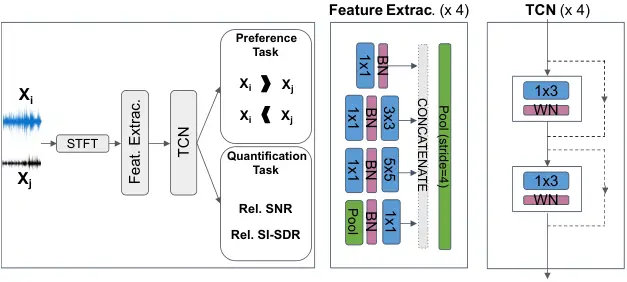 |
| (a) | (b)                                                         |

Figure 1: Left:(a) Proposed NORESQA  framework takes a test recording,
and a randomly chosen NMR from a set of NMRs and predicts the relative
quality. Right: NORESQA  Architecture (b) Our network takes two
non-matched recordings ($`x_{\mathtt{i}}`$ and $`x_{\mathtt{j}}`$) and
outputs: (i) which recording is cleaner (preference-task); and (ii)
relative quality difference using SI-SDR and SNR (quantitative-task).

## 3 NORESQA  Framework

Our framework, NORESQA , is designed to assess the quality of a given
speech recording using Non-Matching References (NMRs). This novel
framework is a _generic idea_, and within it, one can develop a variety
of methods to produce a relative quality score (referred to as NORESQA 
score) for a test input, $`x_{test}`$, with respect to any given
reference, $`x_{ref}`$. We propose a deep neural network for NORESQA 
and represent it by the function
$`\text{NORESQA}=\mathcal{N}(x_{test},x_{ref})`$. Given that we do not
rely on any human-labeled data, the crucial components of the framework
include designing tasks and objective functions that can help learn a
quality score. This is along the lines of self-supervised learning
 \[36, 37, 38\], where supervised tasks are designed on unlabeled data
for training neural networks.

### 3.1 Overview

The NORESQA  framework takes in two recordings as inputs - test
recording $`x_{\mathtt{test}}`$ and another randomly chosen recording
$`x_{\mathtt{ref}}`$. Fig 1(a) is a simple illustration of the
framework. In our current approach, NORESQA  has the following
properties: (i) Non-negative (by design)
$`\mathcal{N}(x_{test},x_{ref})\geq 0`$; (ii) Monotonic (by design) if
$`\mathcal{N}(x_{test1},x_{ref})\geq\mathcal{N}(x_{test2},x_{ref})`$,
then $`\mathtt{m}(x_{test1})\leq\mathtt{m}(x_{test2})`$, where
$`\mathtt{m}`$ is any quality assessment measure as defined in
Section 3.3; (iii) a way to predict “sign", which helps differentiate
$`\mathcal{N}(x_{a},x_{b})`$ vs. $`\mathcal{N}(x_{b},x_{a})`$. We do not
enforce other metric properties \[39, 40\] to allow flexibility in
defining tasks and objectives for training the neural networks.
Moreover, even human judgment of similarity may not constitute a
metric \[41\], and hence there is no pertinent reason which
necessitates NORESQA  to have metric properties.

The network architecture is shown in Fig 1(b). The neural network model
is designed to detect and quantify degradation at the frame-level (frame
$`\approx`$ 32 ms of audio). To learn quality, we propose a multi-task
multi-objective training mechanism in which the network aims to classify
which input is better, as well as “quantify by how much", in terms of
two measures, scale-invariant signal to distortion ratio (SI-SDR) and
signal-to-noise ratio (SNR). Additionally, our framework outputs
frame-level judgments, by which we can detect and quantify which frames
are degraded in quality with respect to the NMRs.

### 3.2 Architecture

NORESQA’s architecture (shown in Fig 1(b)) comprises of three key
components: a _feature-extraction_ block, a _temporal-learning_ block
and _task-specific_ heads. The feature-extraction block learns
representations while maintaining the temporal structure of the signal.
These representations are then fed to the temporal-learning block to
learn long-term dependencies using temporal convolutional networks
(TCN). The resulting embeddings are then fed to the task-specific heads
to produce frame-wise outputs. Note that the architecture is an instance
of shared parameters for the two inputs, in other words both inputs are
processed by the same network.

Feature-Extraction Block. The inputs to the network are 3-second audio
excerpts, represented by their Short-Time Fourier Transform (STFT). We
stack together the magnitude and phase of the STFT as two channels,
leading to a $`2\times T\times F`$ dimensional representation of every
audio recording where $`T`$ is the number of frames and $`F`$ is number
of frequency bins. More specifically, STFTs are computed using a hamming
window of size $`32`$ ms with 50% overlap. Only the 256 positive
frequencies without the zeroth bin are used. We use the Inception \[42\]
architecture in the feature extraction block. Please refer to the
supplementary material for details of the feature-extraction block.

Temporal Learning Block. The temporal learning block is aimed at
learning long-term temporal information from frame-level representations
generated by the feature-extraction block. We use Temporal Convolutional
Networks (TCNs) \[43\] in this block. While the phonetic speech content
can change per frame, the acoustics (recording conditions, background
noise, distortions, etc) necessitates capturing long-term history for
quality assessment. A cascade of TCNs offers a flexible way to learn
both short-term (local) and long-term information. We request the
readers to refer to supplementary material for precise details of the
TCNs used in this block.

The learned weights across the first two blocks are shared between the
two inputs to our model. The outputs of the temporal learning block for
both inputs are concatenated, and then fed into each of the
task-specific heads. Next, we describe the multi-task multi-objective
learning mechanism:

### 3.3 Multi-task and multi-objective learning

The NORESQA  network architecture described above is trained through a
multi-task multi-objective approach. Since we do not have any perceptual
labels, we rely on two signal processing measures, Signal-to-Noise Ratio
(SNR) and Scale-Invariant Signal to Distortion Ratio (SI-SDR) to compare
the quality of the two inputs.

SNR is measured as the ratio of the signal power to the noise power and
is primarily meant only for additive noises. Consider a mixture signal
$`x`$, $`x=s+n\in\mathbb{R}^{L}`$ where $`s`$ is the clean signal and
$`n`$ is the noise signal, then

```math
\mbox{SNR}=10\log_{10}\left(\frac{||s||^{2}}{||s-x||^{2}}\right) \tag{1}
```

$`10log_{10}()`$ factor measures SNR in dB-scale, and a higher SNR
implies better signal quality. Yuan et al. \[44\] also showed that SNR
as a distance metric had better properties than conventional metrics
(like Euclidean distance).

SI-SDR is a measure that was introduced to evaluate performance of
speech processing algorithms. It is invariant to the scale of the
processed signal and can be used to quantify quality in diverse cases,
including additive background noises as well as other
distortions \[45\].

Given a noisy mixture $`x`$ and it’s clean counterpart $`s`$, the SI-SDR
is defined as:

```math
\mbox{SI-SDR}=10\log_{10}\left(\frac{||\alpha s||^{2}}{||\alpha s-x||^{2}}\right),\,\mbox{where}\,\alpha=\argmin_{\alpha}||\alpha s-x||=\frac{x^{T}s}{||s||^{2}} \tag{2}
```

This property of scale invariance is very important since both speech
quality and intelligibility to a large extent are invariant to
scaling \[46\]. SI-SDR has been shown to be an effective approach for
quality measurement \[47, 48\]. The motivation behind relying on SNR and
SI-SDR is that these are two of the most fundamental and generic
measures to quantify the quality of a signal. They have been used
extensively in training and evaluating audio source separation and
speech enhancement algorithms \[49, 50, 51, 47, 48\], and also correlate
well with human perception on various realistic tasks \[52, 53\].

We use the SNR and SI-SDR measures as “quality labels" for all speech
recordings, and the objective of the network is to solve two tasks.
Given two audio inputs, the network solves: (a) a _Preference Task_:
which input audio is of better quality?; and (b) a _Quantification
Task_: what is the quality difference between the two audio inputs w.r.t
their “quality labels"? Separating the learning task into two separate
tasks is important is because the inputs to our model are non-matching
pairs. If we use signed intervals, it might be non-trivial for the model
to learn to discard speech content differences and learn quality
features. Disentangling the learning through two separate tasks makes it
easier for the mode to focus on quality attributes. It also makes the
model easier to use - in the sense that if only preference results are
needed or if only absolute quality difference is required, the
appropriate head can be used while discarding the unused one. Lastly,
the framework can be easily extended through the separate preference and
quantification tasks. For example, we can have more than 2 inputs and
the preference task can be designed to predict a ranked order in terms
of quality.

Note that both of these tasks are relative assessments as opposed to
absolute quality measurements. Human listeners find relative assessment
an easier task than absolute quality ratings \[54\] and relative
subjective scores are typically more robust than absolute scores \[55\].
Relative scores tend to give more repeatable results \[56\] and are
likely to have lower variance and bias. Hence, we argue that neural
networks trained on these relative assessments will likely lead to
better generalization. Moreover, just as humans can compare the quality
between non-matching recordings, our training mechanism also follows the
same strategy.

Preference Task. The preference task is formulated as a binary
classification problem. Let $`\mathbf{x}_{ij}=(x_{i},x_{j})`$ be an
_ordered_ pair input to the network, with $`x_{i}`$ as first input and
$`x_{j}`$ as second input. Let $`sdr_{x_{i}}`$ and $`sdr_{x_{j}}`$ be
the SI-SDRs of $`x_{i}`$ and $`x_{j}`$ respectively. The label
$`\mathbf{y}_{ij}`$ for $`\mathbf{x}_{ij}`$ is a 2 dimensional, one-hot
vector, with $`\mathbf{y}_{ij}=[1,0]`$ if $`sdr_{x_{i}}>sdr_{x_{j}}`$,
otherwise $`\mathbf{y}_{ij}=[0,1]`$. The preference-task head is a
small, fully convolutional network and outputs a distribution of which
input is cleaner at frame-level. The frame-level distributions are
temporally averaged to produce the recording level distribution
$`\mathbf{p}_{ij}`$ which are then used in the standard cross-entropy
function to compute loss for this task.

```math
L_{P}(\mathbf{x}_{ij},\mathbf{y}_{ij})=\sum_{k=1}^{2}{-y^{k}_{ij}\log(p^{k}_{ij})} \tag{3}
```

Quantification Task. This task is designed to quantify the quality
differences between $`x_{i}`$ and $`x_{j}`$. Let $`snr_{x_{i}}`$ and
$`snr_{x_{j}}`$ be SNRs of $`x_{i}`$ and $`x_{j}`$ respectively. This
task consists of two output heads, one for predicting quality
differences in terms of SNR,
$`{\Delta}snr_{ij}=|snr_{x_{i}}-snr_{x_{j}}|`$, and the other for SI-SDR
$`{\Delta}sdr_{ij}=|sdr_{x_{i}}-sdr_{x_{j}}|`$. Architecturally both
heads are identical, the details of which are provided in the
supplementary material. Trivially, one can formulate $`\Delta snr`$ or
$`\Delta sdr`$ prediction as regression problems \[14, 35\]. Here, we
formulate them as classification problems. By applying tricks from deep
neural network based classification methods, we are able to learn much
more robust models.

Let $`{\Delta}sdr_{max}=\max_{ij}|sdr_{x_{i}}-sdr_{x_{j}}|`$ be the
maximum absolute difference in SI-SDR among all pairs of $`x_{i}`$ and
$`x_{j}`$ in the dataset. We divide the range of $`{\Delta}sdr`$, from
$`0`$ to $`{\Delta}sdr_{max}`$, into $`K`$ equally spaced bins. Each bin
is a class and the label for $`\mathbf{z}_{ij}`$ for input
$`\mathbf{x}_{ij}`$ is $`k^{th}`$ class if $`{\Delta}sdr_{ij}`$ lies in
the range
$`\left[\frac{(k-1){\Delta}sdr_{max}}{K},\frac{k\cdot{\Delta}sdr_{max}}{K}\right]`$.
The output of the SI-SDR head of the network is a probability
distribution over all $`K`$ classes. Similar to the Preference task, the
network first produces frame-level distributions which are then
temporally averaged to obtain the output $`\mathbf{d}_{ij}`$ for
$`\mathbf{x}_{ij}`$.

The $`K`$ classes here are not entirely independent and share strong
inter-class relationships. For example, the $`k^{th}`$ class is
semantically much closer to $`(k+1)^{th}`$ class than, say
$`(k+4)^{th}`$ class. This raises concerns over using the standard
cross-entropy loss function with one-hot vectors as target labels.
Moreover, training the network with the standard cross-entropy loss can
lead to overconfident prediction and a lack of generalizations in unseen
conditions \[57\]. This is especially a concern for us as we expect the
network to learn the quality differences between non-matching inputs.
Considering these factors, we propose to use
*gaussian-smoothed-labels* \[58\] for computing the loss function. Label
smoothing discounts certain probability mass from the true label and
redistributes it to others. Formally, let $`v`$ be the class-index of
the true class. The smoothed labels, $`{}^{s}\mathbf{z}_{ij}`$ are
obtained as

```math
{}^{s}\mathbf{z}_{ij}^{k}=\begin{cases}0.6&\text{k=v}\\
0.2&\text{k=v$\pm$1}\\
0&\text{otherwise}\\
\end{cases} \tag{4}
```

The same procedure is applied to the SNR head as well. The overall
objective loss function for the quantification task is then defined as

```math
L_{Q}(\mathbf{x}_{ij},^{s}\hskip-1.8063pt\mathbf{z}_{ij})=L_{sdr}(\mathbf{x}_{ij},^{s}\hskip-1.8063pt\mathbf{z}_{ij})+L_{snr}(\mathbf{x}_{ij},^{s}\hskip-1.8063pt\mathbf{u}_{ij})=-\sum_{k=1}^{K}\,{}^{s}\hskip-1.8063ptz_{ij}^{k}\log(d_{ij}^{k})-\sum_{k=1}^{K}\,{}^{s}\hskip-1.8063ptu_{ij}^{k}\log(t_{ij}^{k}) \tag{5}
```

Similar to $`{}^{s}\mathbf{z}_{ij}`$ and $`\mathbf{d}_{ij}`$,
$`{}^{s}\mathbf{u}_{ij}`$ and $`\mathbf{t}_{ij}`$ are the smoothed-label
targets and probability outputs, respectively, for the SNR head. The
total loss for training is $`L=L_{P}+L_{Q}`$.

### 3.4 Training Procedure

We now describe our training procedure. We assume the availability of a
clean speech database $`\mathcal{D}_{c}`$. The training input
$`\mathbf{x}_{ij}`$ is created by sampling two clean recordings
$`s_{i}`$ and $`s_{j}`$ from $`\mathcal{D}_{c}`$. $`s_{i}`$ and
$`s_{j}`$ are corrupted to produce $`x_{i}`$ and $`x_{j}`$. The
degradation’s we use can be largely grouped under two categories (a)
additive noise degradations, and (b) speech distortions based on signal
manipulations - _Clipping_, _Frequency Masking_, and _Mu-law
compression_. For additive noise, we sample noise recordings, $`n_{i}`$
and $`n_{j}`$, from a noise database and add them to $`s_{i}`$ and
$`s_{j}`$ at SNR levels uniformly sampled from the range -15dB to 60dB.
This corresponds to a range of -15dB to +25dB in terms of SI-SDR. To
ensure that SNR is consistent for $`x_{i}`$ and $`x_{j}`$, and for more
stable training, the noise recordings $`n_{i}`$ and $`n_{j}`$ should
generally belong to similar noise types. For speech distortions, we use
the Audiomentations ¹¹ 1
[https://github.com/iver56/audiomentations](https://github.com/iver56/audiomentations)
toolkit. It allows one to select levels for various distortions and we
select levels that always lie in the range of -15dB to +25dB. Once we
have the degraded signals ($`x_{i}`$ and $`x_{j}`$) and their SNR and
SI-SDR ($`snr_{x_{i}}`$, $`snr_{x_{j}}`$, $`sdr_{x_{i}}`$,
$`sdr_{x_{j}}`$), we can train the network as described in previous
sections. Note that, for degradations under the second category, the
_quantification-task_ loss $`L_{Q}`$, includes loss only from the SI-SDR
head, $`L_{sdr}`$. SNR cannot be accurately computed for these
distortions (residual $`x-s`$ may not be orthogonal to $`s`$) and hence
we rely only on SI-SDR for training the network in these cases.

### 3.5 Usage

Once the network is trained, we can predict the quality of a test input
$`x_{test}`$ with respect to any provided reference $`x_{ref}`$. As
mentioned earlier, this reference need not be the matching clean
reference. The quality score, NORESQA , of $`x_{test}`$ w.r.t
$`x_{ref}`$ is obtained from the SI-SDR head of the network. It is
obtained as

```math
\text{NORESQA}_{x_{test},x_{ref}}=\sum_{k=1}^{K}d_{x_{test},x_{ref}}^{k}\mu^{k},~~\text{where}~~\mu^{k}=\frac{1}{2}\left[\frac{(k-1){\Delta}sdr_{max}}{K}+\frac{k\cdot{\Delta}sdr_{max}}{K}\right] \tag{6}
```

Here $`d_{x_{test},x_{ref}}^{k}`$ and $`\mu^{k}`$ are the probability
and the mean of the $`\Delta sdr`$ range of the $`k^{th}`$ class
respectively. The NORESQA  score gives us only the magnitude of
difference between $`x_{test}`$ and $`x_{ref}`$. The output of the
preference-task tells us the “sign", whether $`x_{test}`$ is better or
worse than $`x_{ref}`$.

Our method provides a way to compare the quality of any two given speech
recordings. However, in practice, one might often be interested in
measuring “true" or “absolute” quality, which under our framework can be
done by using clean or high-quality speech recordings as references.
More specifically, the $`x_{ref}`$ samples should come from _any_ clean
speech database. Moreover, to reduce variance in the estimate, we can
sample multiple references and obtain an average NORESQA  score,
$`\text{NORESQA}^{avg}_{x_{test},x_{ref}}=\frac{1}{n}\sum_{i=1}^{n}\text{NORESQA}_{x_{test},x_{ref}^{i}}`$,
where $`x_{ref}`$ = {$`x_{ref}^{i}`$} $`\forall i\in[1,n]`$ are $`n`$
NMRs sampled from the database.

## 4 Experimental Setup

Datasets, Implementations and Baselines. For training and validation, we
choose the clean speech recordings from the DNS Challenge \[59\].
FSDK50 \[60\] serves as the noise dataset for additive noise
degradations. Along with additive noise, clipping and frequency masking
distortions are used during training. For robustness and better
generalization to realistic conditions, we also add reverberation using
room impulse responses from DNS Challenge dataset. For the test-set, we
use TIMIT \[61\] as the source for clean speech, and ESC-50 \[62\]
dataset for noise recordings. The test-set also includes Gaussian noise
addition and Mu-law compression as unseen degradations.

Our method was implemented using Pytorch \[63\]. We use Adam \[64\]
optimizer with a learning rate of $`10^{-4}`$ with a batch size of 32.
We train the network for 1000 epochs using 4 Tesla V100 gpus. Please
refer to supplementary material for further details on the datasets and
implementations.

We use the well-known PESQ \[2\] and CDPAM \[7\] as full-reference
baselines for SQA. CDPAM is a full-reference neural network based
approach trained on human-pairwise judgements. Being full-reference,
these methods require the paired (matching) clean reference for quality
assessment. We use DNSMOS \[1\] as non-intrusive SQA method. It is
trained on a large scale dataset of MOS ratings. However, no such
large-scale dataset of MOS ratings is publicly available.

Evaluation Methods. We exhaustively evaluate our proposed framework in a
variety of ways. The first series of evaluations, which we call
_Objective Evaluations_ for simplicity, focus on evaluating the models
performance on each task (preference and quantification), and its
in-variance to different NMR conditions, and so on. The second series of
evaluations, referred to as _Subjective Evaluations_, applies our model
to a series of speech problems and evaluates how well NORESQA  is
correlated to subjective ratings (e.g MOS). Lastly, we show the utility
of our model in improving learnability in a downstream task, speech
enhancement.

## 5 Results

### 5.1 Objective Evaluations

Performance on Preference and Quantification Tasks. The test inputs are
created by randomly selecting two different clean recordings from the
test set (TIMIT) and then degrading them as per the procedure in
Sec. 3.4. We then measure the performance of the model on each task. On
the Preference task, the model achieves an accuracy of 97.3%.

The performance on the Quantitative tasks are shown in Fig 2(a) and (b)
for $`\Delta snr`$ and $`\Delta sdr`$ respectively. On an average the
model predicts close to the ground truth, $`\Delta snr`$ /
$`\Delta sdr`$, for almost all cases. The standard deviations at most
$`\Delta snr`$ / $`\Delta sdr`$ levels are small as well.

|                                                             |                                                             |                                                             |
| ----------------------------------------------------------- | ----------------------------------------------------------- | ----------------------------------------------------------- |
| 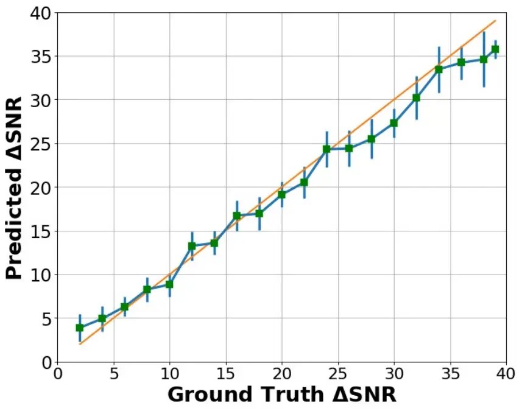 | 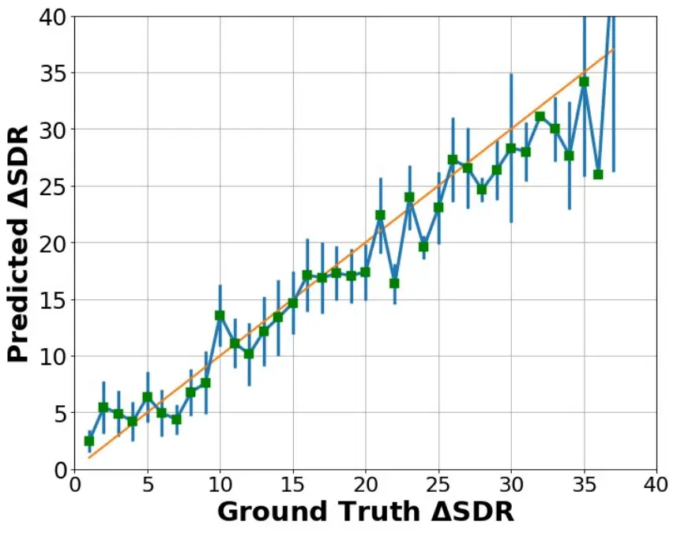 | 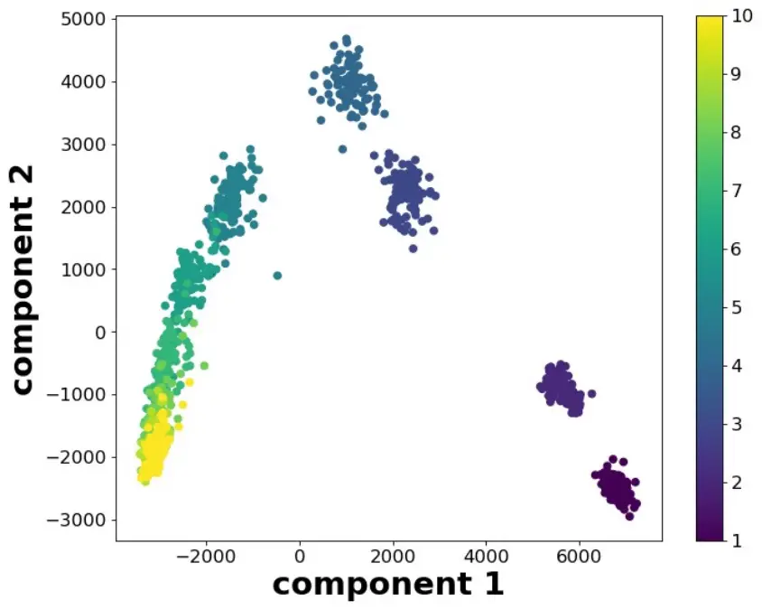 |
| (a)                                                         | (b)                                                         | (c)                                                         |

Figure 2: (a) and (b): Average output of the model at different
$`\Delta snr`$ and $`\Delta sdr`$. The vertical lines at each point in
the plot shows 95% C.I. (c): PCA visualization of embeddings capturing
audio quality information.

In-variance to Language and Speaker’s Gender. We next evaluate the
in-variance and robustness of NORESQA  to certain characteristics of
speech content such as language and speaker’s gender. We find that our
model is fairly robust to unseen languages. Moreover, for a given test
recording, it does not matter whether the language or the speaker’s
gender in the reference is same or not. This supports our key hypothesis
that non-matching references are sufficient for quality assessment.
Please refer to supplementary material for details.

Commutativity and Indiscernibility of Identicals. We empirically study
how well our framework supports these two desirable properties. (1)
Commutativity - Quality assessment should stay same for
$`\mathcal{N}(x_{1},x_{2})`$ and $`\mathcal{N}(x_{2},x_{1})`$. Changing
the order of inputs should not change the NORESQA  score. We find that
for only a small fraction (less than _2.5%_) of the test pairs, changing
the order also changes the NORESQA  score by more than 2dB. Preference
task outputs remains consistent as well (flips on changing the order)
for more than _97%_ of the test pairs. (2) Indiscernibility of
Identicals - When both inputs to the models are same,
$`\mathcal{N}(x,x)`$, the probability outputs of the preference task are
close to _0.5_ for most of the test cases. This is expected as the model
is not able to confidently identify which input is cleaner. The NORESQA 
scores are also small in most cases, showing that the model supports
this property to a considerable extent. Note that our learning mechanism
does not explicitly enforce the framework to have these two properties.
Hence, small errors are expected.

Quality based Retrieval and Visualizations. In this evaluation, we try
to understand the representations learned by the network. More
specifically, we consider the outputs of the temporal learning block as
the Quality Embeddings (QE) and use it for visualizations and quality
based retrieval. We first create a dataset of 1000 recordings at 10
different discrete quality levels (100 per quality level). In the
quality based retrieval task, the goal is to retrieve recordings of same
quality level for a given query speech recording. We argue that the QEs
can be used to represent audio recordings for such a quality based
retrieval. We use Precision@K to assess the top-$`K`$ retrievals. The
mean precision@K over all test queries turns out to be $`\emph{0.97}`$
for $`K=10`$ and $`\emph{0.95}`$ for $`K=25`$. These high precision
retrievals show that the embeddings indeed capture quality.

Further, Fig 2(c) shows a PCA visualization of the embeddings. We see
that the separation between the clusters increases as the quality goes
down. For higher qualities, the inter-cluster distances are smaller,
although the embeddings at the same quality level are still tightly
clustered together. Moreover, we also observe the cluster centers lie on
approximately two piece-wise linear functions, one for low quality (1 to 4) and another for high quality (5 to 10). In other words, the model has
implicitly learned high and low quality functions.

### 5.2 Subjective Evaluations

|           |               |                 |                 |                 |                  |                 |                 |                 |                 |
| --------- | ------------- | --------------- | --------------- | --------------- | ---------------- | --------------- | --------------- | --------------- | --------------- |
| Type      | Name          | VoCo \[65\]     |                 | Dereverb \[66\] |                  | HiFi-GAN \[67\] |                 | FFTnet \[68\]   |                 |
|           |               | PC              | SC              | PC              | SC               | PC              | SC              | PC              | SC              |
| Full-ref. | PESQ          | 0.68            | 0.43            | 0.86            | 0.85             | 0.72            | 0.7             | 0.51            | 0.49            |
|           | CDPAM         | \-              | 0.73            | \-              | 0.93             | \-              | 0.68            | \-              | 0.68            |
| Non-Int.  | DNSMOS        | 0.6             | 0.48            | 0.7             | 0.73             | 0.93            | 0.88            | 0.59            | 0.53            |
| NORESQA   | Paired        | 0.64            | 0.6             | 0.46            | 0.65             | 0.59            | 0.81            | 0.46            | 0.47            |
|           | Unpaired      | 0.88$`\pm`$0.01 | 0.41$`\pm`$0.06 | 0.63$`\pm`$0.01 | 0.75 $`\pm`$0.02 | 0.63$`\pm`$0.01 | 0.71$`\pm`$0.01 | 0.46$`\pm`$0.01 | 0.51$`\pm`$0.02 |
|           | +Local-Fixed  | 0.89$`\pm`$0.01 | 0.44$`\pm`$0.06 | 0.63$`\pm`$0.01 | 0.75$`\pm`$0.01  | 0.61$`\pm`$0.01 | 0.73$`\pm`$0.01 | 0.46$`\pm`$0.01 | 0.51$`\pm`$0.02 |
|           | +Global-Fixed | 0.85$`\pm`$0.01 | 0.68$`\pm`$0.03 | 0.66$`\pm`$0.02 | 0.67$`\pm`$0.02  | 0.68$`\pm`$0.01 | 0.78$`\pm`$0.01 | 0.33$`\pm`$0.01 | 0.44$`\pm`$0.01 |

Table 1: MOS Correlations (1): for NORESQA , DNSMOS, PESQ and CDPAM.
Spearman (SC), Pearson (PC) correlations are shown. All unpaired
NORESQA  are obtained using $`n=100`$ NMRs. $`\uparrow`$ is better.

|           |               |                 |                 |                 |                 |                 |                 |                 |                 |
| --------- | ------------- | --------------- | --------------- | --------------- | --------------- | --------------- | --------------- | --------------- | --------------- |
| Type      | Name          | PEASS \[69\]    |                 | VCC-2018 \[70\] |                 | Noizeus \[71\]  |                 | TCD-VoIP \[72\] |                 |
|           |               | PC              | SC              | PC              | SC              | PC              | SC              | PC              | SC              |
| Full-ref. | PESQ          | 0.86            | 0.71            | 0.51            | 0.56            | 0.43            | 0.42            | 0.89            | 0.90            |
|           | CDPAM         | \-              | 0.74            | \-              | 0.61            | \-              | 0.71            | \-              | 0.88            |
| Non-Int.  | DNSMOS        | 0.39            | 0.21            | 0.37            | 0.42            | 0.41            | 0.59            | 0.71            | 0.72            |
| NORESQA   | Paired        | 0.26            | 0.43            | 0.48            | 0.39            | 0.47            | 0.46            | 0.38            | 0.44            |
|           | Unpaired      | 0.38$`\pm`$0.01 | 0.40$`\pm`$0.01 | 0.61$`\pm`$0.01 | 0.41$`\pm`$0.02 | 0.50$`\pm`$0.02 | 0.39$`\pm`$0.05 | 0.43$`\pm`$0.01 | 0.46$`\pm`$0.02 |
|           | +Local-Fixed  | 0.40$`\pm`$0.04 | 0.52$`\pm`$0.06 | 0.65$`\pm`$0.04 | 0.39$`\pm`$0.02 | 0.45$`\pm`$0.01 | 0.44$`\pm`$0.02 | 0.43$`\pm`$0.02 | 0.41$`\pm`$0.04 |
|           | +Global-Fixed | 0.41$`\pm`$0.05 | 0.57$`\pm`$0.05 | 0.47$`\pm`$0.01 | 0.41$`\pm`$0.01 | 0.48$`\pm`$0.02 | 0.51$`\pm`$0.01 | 0.56$`\pm`$0.01 | 0.52$`\pm`$0.03 |

Table 2: MOS Correlations (2): for NORESQA , DNSMOS, PESQ and CDPAM.
Spearman (SC), Pearson (PC) correlations are shown. All unpaired
NORESQA  are obtained using $`n=100`$ NMRs. $`\uparrow`$ is better.

The subjective evaluations are aimed at assessing NORESQA  as a proxy
for subjective judgments by humans. More specifically, we try to
understand how well NORESQA  correlates with MOS across different speech
tasks. We also examine NORESQA’s suitability in subjective 2-alternative
forced-choice (2AFC) tests \[6\].

We consider an exhaustive set of 10 different datasets for this
evaluation. These datasets span over a variety of well-known speech
problems; (1) Speech Synthesis (VoCo \[65\] and FFTnet \[68\]), (2)
Speech Enhancement (Dereverberation \[66\], Noizeus \[71\],
HiFi-GAN \[67\]), (3) Voice Conversion (VCC-2018 \[70\]), (4) Speech
Source Separation (PEASS \[69\]), (5) Telephony Degradations \[72\], (6)
Bandwidth Extension (BWE \[73\]), and (7) General Degradation’s
(Simulated \[6\]). Please refer to supplementary material for details
about these datasets.

MOS Correlations. All of the above datasets come with MOS ratings for
each audio recording. We evaluate our framework by computing Pearson
Correlation Coefficient (PC) and Spearman’s Rank Order Correlation (SC)
of NORESQA  scores with MOS ratings on each dataset. Since MOS scores
are always obtained keeping a clean recording in mind, we obtain
“absolute" NORESQA  scores (Sec 3.5) by using clean references. As
mentioned in Sec 3.5, we can get a more reliable score by averaging over
multiple references. The results discussed in this section are for
$`n=100`$ and an ablation over $`n`$ are provided in further sections.

Finally, to decouple the effect of source/type of references on the
results, we compute NORESQA  for a given test recording in 4 different
ways. (i) _Paired_: This is a special case where matched clean
recordings are given as references to NORESQA. Obviously $`n=1`$ in this
case. (ii) _Unpaired_: In this case, for the given test recording, a
clean NMR is randomly selected from the same dataset. The process is
repeated $`n=100`$ times and the scores are average to obtain the final
NORESQA  for the test recording. (iii) _Unpaired Local-Fixed_: the same
set of NMRs are used for all test recordings. The set ($`n=100`$) is
fixed locally for each dataset. (iv) _Unpaired Global-Fixed_: this is
similar to the previous case, where the same set of NMRs are used for
all test recordings. However, in this case, this set is fixed across all
datasets. The NMRs ($`n=100`$) are selected from the DAPS dataset \[74\]
and used for evaluations on all 8 datasets. All unpaired experiments are
repeated 10 times and average results with standard deviations are
reported.

Tables 1 and 2 shows correlations with MOS on all 8 datasets.
Correlations for full-reference SQA methods (PESQ and CDPAM), and
non-intrusive DNSMOS are also shown. First, we note that NORESQA , is
not only competitive to these methods but it even surpasses their
performance in several cases. Our method is better than DNSMOS on 4
datasets (VoCo, PEASS, VCC and Noizeus) and is very competitive on
others. Note that, DNSMOS is _explicitly_ trained on a large scale MOS
dataset. Our method is not trained on any perceptual labels or judgments
and is still almost as good as DNSMOS. The results from the tables also
show that our method is a good substitute for full-reference methods in
several cases. However, unlike these full-reference methods, our
framework stays useful in practical and real-world situations where the
clean matching reference might not be available.

2AFC Tests. 2AFC test is a comparative approach to subjective
evaluations. In this case, listeners are given a reference and two test
recordings and asked to judge which one sounds more similar (in terms of
quality) to the reference. We follow the evaluation protocol of Manocha
et al. \[6\] and report how accurately different methods can predict
same judgement as humans. Table 4 shows accuracy of different methods on
4 datasets. Full-reference methods give best performances in most cases.
However, our framework, NORESQA  is substantially better than DNSMOS in
all cases.

Ablations. To further expound NORESQA , we conducted ablation studies
for two factors. Please refer to the supplementary material for detailed
results and analyses of these ablations.

Multi-objective Learning of Quantification Task: In this ablation, we
try to assess the significance of SNR and SI-SDR heads for the
Quantification task in NORESQA. Our ablation shows that using both heads
is superior to using just SNR or SI-SDR head; often the improvement is
more than $`30`$ to $`40\%`$ over using just one of the heads. SI-SDR is
also performs better in all cases when it comes to having just SNR or
SI-SDR for the quantification task. This is expected, as with SI-SDR, we
can use a wide variety of degradations, whereas SNR based training can
only use additive noise degradations.

Number of NMRs ($`n`$): In this ablation, we examine how the MOS
correlations are affected by the number of NMRs used for each test
recording. Increasing the number of NMRs for NORESQA  improves
correlations with MOS. Depending on the dataset, this improvement can be
as much as $`10`$ to $`15`$% when $`n`$ is increased from $`1`$ to
$`100`$.

| Name     | Simulated \[6\] | FFTnet \[68\] | BWE \[73\] | HiFi-GAN \[67\] |
| -------- | --------------- | ------------- | ---------- | --------------- |
| PESQ     | 86.0            | 67.0          | 38.0       | 88.5            |
| CDPAM    | 87.7            | 88.5          | 75.9       | 96.5            |
| DNSMOS   | 49.2            | 58.8          | 45.0       | 62.3            |
| NORESQA  | 68.7            | 73.3          | 53.3       | 81.6            |

Table 3: Accuracy on 2AFC predictions

| Type        | Data% | PESQ | STOI  | SNRseg | CSIG | CBAK | COVL |
| ----------- | ----- | ---- | ----- | ------ | ---- | ---- | ---- |
| Noisy       |       | 1.97 | 91.50 | 1.72   | 3.35 | 2.44 | 2.63 |
| Baseline    | 33%   | 2.22 | 91.7  | 8.18   | 3.26 | 2.98 | 2.72 |
|             | 66%   | 2.30 | 92.23 | 8.54   | 3.45 | 3.04 | 2.85 |
|             | 100%  | 2.39 | 91.89 | 8.71   | 3.55 | 3.10 | 2.95 |
| Pre-trained | 33%   | 2.28 | 92.30 | 8.33   | 3.43 | 3.03 | 2.83 |
|             | 66%   | 2.35 | 92.90 | 8.77   | 3.53 | 3.1  | 2.92 |
|             | 100%  | 2.46 | 93.53 | 8.81   | 3.59 | 3.17 | 2.99 |

Table 4: Evaluation of NORESQA  pre-training for speech enhancement.

### 5.3 Speech enhancement

In this section, we show the utility of NORESQA for training a Speech
Enhancement (SE) system. Our SE network is based on a popular U-Net type
convolutional recurrent neural network \[75\]. The baseline SE model is
trained in a supervised manner using matched clean and noisy speech
pairs.

Note that the idea behind using NORESQA for SE is quite different from
various works that use a speech enhancement model to guide
training \[76\]. These methods rely on metrics to compute a loss
function (generally in addition to L1/L2 losses w.r.t the target clean
speech). They train local differentiable proxies of quality (e.g., PESQ)
or intelligibility (e.g., STOI) at every iteration of training. Clearly,
this requires matching noisy-clean pairs for training. MetricGAN does
this in a GAN framework for improving the discriminator. Our approach
for using NORESQA for SE is very different. Since NORESQA can compare
two non-matched recordings, we use it to pre-train the Speech
Enhancement model in a way that does not require the exact matched pairs
of recordings. This can be much more useful for out-of-domain data
adaptation, unseen noise conditions, and other sparse labeled-data
situations. Our approach can leverage potentially large amounts of
unpaired data in these cases. Moreover, as already mentioned in Sec 1,
using certain metrics such as PESQ as the target quality has its own
issues, including sensitivity to perceptually invariant transformations
especially in cases where the quality between two recordings to be
compared are perceptually close.

We show that pre-training the network using NORESQA  as loss function
can lead to improvements in performance. More specifically, given a
noisy speech recording and a non-matching clean speech recording, during
pre-training stage, the SE model tries to minimize the NORESQA  score
between the output of the SE model and clean recording. Since we do not
require any matched clean and noisy pairs for this step, we can leverage
unlimited amount of training data - most significantly noisy recordings
from real world for which the corresponding clean recordings are not
available. After the pre-training stage, the model can be fine-tuned for
enhancement following the usual paired training strategy. We use the
VCTK dataset \[77\] for these experiments and consider 3 baseline SE
models. These are models trained on $`1/3^{rd}`$, $`2/3^{rd}`$ and full
training set. Following prior works on this dataset, we report
enhancement performance on 5 different objective metrics.

Table 4 shows the benefits of NORESQA  based pre-training. We see that
pre-training consistently improves all 5 metrics for all 3 baseline
models. We further analyse the improvements at different SNR levels, and
observe that NORESQA  based pre-training is most effective in high SNR
conditions, where the degradation caused by strong background noise is
not noticeable and harder to learn. Please refer to the supplementary
material for further details. Our motivation behind these experiments is
to demonstrate proof of concept of NORESQA in an application (e.g., SE).
Hence, our focus is not on obtaining SOTA performance on the VCTK
dataset. The improvements coming from pre-training with NORESQA show the
potential of leveraging the differentiable NORESQA in different
downstream tasks.

## 6 Conclusion

In this paper, we presented a new framework for speech quality
assessment. Motivated by human’s ability to assess quality independent
of the speech content, we propose a framework for SQA using non-matching
references. This can potentially open up a new research direction in the
development of SQA methods. In subjective evaluations, our method works
as competently as established full-reference and subjective
non-intrusive SQA methods. At the same time, it addresses key
limitations of those methods. Going forward, our focus will be on
developing novel methods under the NORESQA  framework which can
correlate better with subjective human ratings.

## References

- \[1\] Chandan KA Reddy, Vishak Gopal, and Ross Cutler. DNSMOS: A
  non-intrusive perceptual objective speech quality metric to evaluate
  noise suppressors. _arXiv preprint arXiv:2010.15258_, 2020.
- \[2\] Antony W Rix, John G Beerends, Michael P Hollier, and Andries P
  Hekstra. Perceptual evaluation of speech quality (PESQ)-a new method
  for speech quality assessment of telephone networks and codecs. In
  _2001 IEEE International Conference on Acoustics, Speech, and Signal
  Processing. Proceedings (Cat. No. 01CH37221)_, volume 2, pages
  749–752. IEEE, 2001.
- \[3\] John G Beerends, Christian Schmidmer, Jens Berger, Matthias
  Obermann, Raphael Ullmann, Joachim Pomy, and Michael Keyhl. Perceptual
  objective listening quality assessment (POLQA), the third generation
  itu-t standard for end-to-end speech quality measurement part
  i—temporal alignment. _Journal of the Audio Engineering Society_,
  61(6):366–384, 2013.
- \[4\] Andrew Hines, Jan Skoglund, Anil C Kokaram, and Naomi Harte.
  ViSQOL: An objective speech quality model. _EURASIP Journal on Audio,
  Speech, and Music Processing_, 2015(1), 2015.
- \[5\] James M Kates and Kathryn H Arehart. The hearing-aid speech
  quality index (HASQI). _Journal of the Audio Engineering Society_,
  58(5):363–381, 2010.
- \[6\] Pranay Manocha, Adam Finkelstein, Richard Zhang, Nicholas J
  Bryan, Gautham J Mysore, and Zeyu Jin. A differentiable perceptual
  audio metric learned from just noticeable differences.
  _Interspeech_, 2020.
- \[7\] Pranay Manocha, Zeyu Jin, Richard Zhang, and Adam Finkelstein.
  CDPAM: Contrastive learning for perceptual audio similarity. _2021
  IEEE International Conference on Acoustics, Speech and Signal
  Processing (ICASSP)_, 2021.
- \[8\] Andrew Hines, Jan Skoglund, Anil Kokaram, and Naomi Harte.
  Robustness of speech quality metrics to background noise and network
  degradations: Comparing visqol, pesq and polqa. In _2013 IEEE
  International Conference on Acoustics, Speech and Signal Processing_,
  pages 3697–3701. IEEE, 2013.
- \[9\] Philipos C Loizou. Speech quality assessment. In _Multimedia
  analysis, processing and communications_, pages 623–654.
  Springer, 2011.
- \[10\] Meet H Soni and Hemant A Patil. Novel deep autoencoder features
  for non-intrusive speech quality assessment. In _2016 24th European
  Signal Processing Conference (EUSIPCO)_, pages 2315–2319. IEEE, 2016.
- \[11\] Constantin Spille, Stephan D Ewert, Birger Kollmeier, and
  Bernd T Meyer. Predicting speech intelligibility with deep neural
  networks. _Computer Speech & Language_, 48:51–66, 2018.
- \[12\] Szu-Wei Fu, Yu Tsao, Hsin-Te Hwang, and Hsin-Min Wang.
  Quality-net: An end-to-end non-intrusive speech quality assessment
  model based on blstm. _arXiv preprint arXiv:1808.05344_, 2018.
- \[13\] Asger Heidemann Andersen, Jan Mark De Haan, Zheng-Hua Tan, and
  Jesper Jensen. Nonintrusive speech intelligibility prediction using
  convolutional neural networks. _IEEE/ACM Transactions on Audio,
  Speech, and Language Processing_, 26(10):1925–1939, 2018.
- \[14\] Chen-Chou Lo, Szu-Wei Fu, Wen-Chin Huang, Xin Wang, Junichi
  Yamagishi, Yu Tsao, and Hsin-Min Wang. Mosnet: Deep learning based
  objective assessment for voice conversion. _arXiv preprint
  arXiv:1904.08352_, 2019.
- \[15\] Hannes Gamper, Chandan KA Reddy, Ross Cutler, Ivan J Tashev,
  and Johannes Gehrke. Intrusive and non-intrusive perceptual speech
  quality assessment using a convolutional neural network. In _2019 IEEE
  Workshop on Applications of Signal Processing to Audio and Acoustics
  (WASPAA)_, pages 85–89. IEEE, 2019.
- \[16\] Anderson R Avila, Hannes Gamper, Chandan Reddy, Ross Cutler,
  Ivan Tashev, and Johannes Gehrke. Non-intrusive speech quality
  assessment using neural networks. In _ICASSP 2019-2019 IEEE
  International Conference on Acoustics, Speech and Signal Processing
  (ICASSP)_, pages 631–635. IEEE, 2019.
- \[17\] Meng Yu, Chunlei Zhang, Yong Xu, Shixiong Zhang, and Dong Yu.
  Metricnet: Towards improved modeling for non-intrusive speech quality
  assessment. _arXiv preprint arXiv:2104.01227_, 2021.
- \[18\] Xuan Dong and Donald S Williamson. An attention enhanced
  multi-task model for objective speech assessment in real-world
  environments. In _ICASSP 2020-2020 IEEE International Conference on
  Acoustics, Speech and Signal Processing (ICASSP)_, pages 911–915.
  IEEE, 2020.
- \[19\] Zhuohuang Zhang, Piyush Vyas, Xuan Dong, and Donald S
  Williamson. An end-to-end non-intrusive model for subjective and
  objective real-world speech assessment using a multi-task framework.
  In _ICASSP 2021-2021 IEEE International Conference on Acoustics,
  Speech and Signal Processing (ICASSP)_, pages 316–320. IEEE, 2021.
- \[20\] Brian Patton, Yannis Agiomyrgiannakis, Michael Terry, Kevin
  Wilson, Rif A Saurous, and D Sculley. Automos: Learning a
  non-intrusive assessor of naturalness-of-speech. _arXiv preprint
  arXiv:1611.09207_, 2016.
- \[21\] Xuan Dong and Donald S Williamson. A classification-aided
  framework for non-intrusive speech quality assessment. In _2019 IEEE
  Workshop on Applications of Signal Processing to Audio and Acoustics
  (WASPAA)_, pages 100–104. IEEE, 2019.
- \[22\] Ludovic Malfait, Jens Berger, and Martin Kastner. P. 563—the
  itu-t standard for single-ended speech quality assessment. _IEEE
  Transactions on Audio, Speech, and Language Processing_,
  14(6):1924–1934, 2006.
- \[23\] Volodya Grancharov, David Yuheng Zhao, Jonas Lindblom, and
  W Bastiaan Kleijn. Low-complexity, nonintrusive speech quality
  assessment. _IEEE Transactions on Audio, Speech, and Language
  Processing_, 14(6):1948–1956, 2006.
- \[24\] Manish Narwaria, Weisi Lin, Ian Vince McLoughlin, Sabu
  Emmanuel, and Liang-Tien Chia. Nonintrusive quality assessment of
  noise suppressed speech with mel-filtered energies and support vector
  regression. _IEEE Transactions on Audio, Speech, and Language
  Processing_, 20(4):1217–1232, 2011.
- \[25\] Dushyant Sharma, Lisa Meredith, Jose Lainez, Daniel Barreda,
  and Patrick A Naylor. A non-intrusive pesq measure. In _2014 IEEE
  Global Conference on Signal and Information Processing (GlobalSIP)_,
  pages 975–978. IEEE, 2014.
- \[26\] Anurag Kumar and Vamsi Ithapu. A sequential self teaching
  approach for improving generalization in sound event recognition. In
  _International Conference on Machine Learning_, pages 5447–5457.
  PMLR, 2020.
- \[27\] Xialei Liu, Joost Van De Weijer, and Andrew D Bagdanov.
  Rankiqa: Learning from rankings for no-reference image quality
  assessment. In _Proceedings of the IEEE International Conference on
  Computer Vision_, pages 1040–1049, 2017.
- \[28\] Wenlong Zhang, Yihao Liu, Chao Dong, and Yu Qiao. Ranksrgan:
  Generative adversarial networks with ranker for image
  super-resolution. In _Proceedings of the IEEE/CVF International
  Conference on Computer Vision_, pages 3096–3105, 2019.
- \[29\] Kwan-Yee Lin and Guanxiang Wang. Hallucinated-iqa: No-reference
  image quality assessment via adversarial learning. In _Proceedings of
  the IEEE Conference on Computer Vision and Pattern Recognition_, pages
  732–741, 2018.
- \[30\] Rich Caruana. Multitask learning. _Machine learning_,
  28(1):41–75, 1997.
- \[31\] Michael L Seltzer and Jasha Droppo. Multi-task learning in deep
  neural networks for improved phoneme recognition. In _2013 IEEE
  International Conference on Acoustics, Speech and Signal Processing_,
  pages 6965–6969. IEEE, 2013.
- \[32\] Dongpeng Chen and Brian Kan-Wing Mak. Multitask learning of
  deep neural networks for low-resource speech recognition. _IEEE/ACM
  Transactions on Audio, Speech, and Language Processing_,
  23(7):1172–1183, 2015.
- \[33\] Szu-Wei Fu, Yu Tsao, and Xugang Lu. Snr-aware convolutional
  neural network modeling for speech enhancement. In _Interspeech_,
  pages 3768–3772, 2016.
- \[34\] Rasool Fakoor, Xiaodong He, Ivan Tashev, and Shuayb Zarar.
  Constrained convolutional-recurrent networks to improve speech quality
  with low impact on recognition accuracy. In _2018 IEEE International
  Conference on Acoustics, Speech and Signal Processing (ICASSP)_, pages
  3011–3015. IEEE, 2018.
- \[35\] Joan Serrà, Jordi Pons, and Santiago Pascual. SESQA:
  semi-supervised learning for speech quality assessment. _arXiv
  preprint arXiv:2010.00368_, 2020.
- \[36\] Phuc H Le-Khac, Graham Healy, and Alan F Smeaton. Contrastive
  representation learning: A framework and review. _IEEE Access_, 2020.
- \[37\] Jacob Devlin, Ming-Wei Chang, Kenton Lee, and Kristina
  Toutanova. Bert: Pre-training of deep bidirectional transformers for
  language understanding. _arXiv preprint arXiv:1810.04805_, 2018.
- \[38\] Alexei Baevski, Henry Zhou, Abdelrahman Mohamed, and Michael
  Auli. wav2vec 2.0: A framework for self-supervised learning of speech
  representations. _arXiv preprint arXiv:2006.11477_, 2020.
- \[39\] Ming Li, Xin Chen, Xin Li, Bin Ma, and Paul MB Vitányi. The
  similarity metric. _IEEE transactions on Information Theory_,
  50(12):3250–3264, 2004.
- \[40\] Shihyen Chen, Bin Ma, and Kaizhong Zhang. On the similarity
  metric and the distance metric. _Theoretical Computer Science_,
  410(24-25):2365–2376, 2009.
- \[41\] Amos Tversky. Features of similarity. _Psychological review_,
  84(4):327, 1977.
- \[42\] Christian Szegedy, Wei Liu, Yangqing Jia, Pierre Sermanet,
  Scott Reed, Dragomir Anguelov, Dumitru Erhan, Vincent Vanhoucke, and
  Andrew Rabinovich. Going deeper with convolutions. In _Proceedings of
  the IEEE Conference on Computer Vision and Pattern Recognition_, 2015.
- \[43\] Shaojie Bai, J Zico Kolter, and Vladlen Koltun. An empirical
  evaluation of generic convolutional and recurrent networks for
  sequence modeling. _arXiv preprint arXiv:1803.01271_, 2018.
- \[44\] Tongtong Yuan, Weihong Deng, Jian Tang, Yinan Tang, and Binghui
  Chen. Signal-to-noise ratio: A robust distance metric for deep metric
  learning. In _Proceedings of the IEEE/CVF Conference on Computer
  Vision and Pattern Recognition_, pages 4815–4824, 2019.
- \[45\] Jonathan Le Roux, Scott Wisdom, Hakan Erdogan, and John R
  Hershey. Sdr–half-baked or well done? In _ICASSP 2019-2019 IEEE
  International Conference on Acoustics, Speech and Signal Processing
  (ICASSP)_, pages 626–630. IEEE, 2019.
- \[46\] Brian CJ Moore. _An introduction to the psychology of hearing_.
  Brill, 2012.
- \[47\] Morten Kolbæk, Zheng-Hua Tan, Søren Holdt Jensen, and Jesper
  Jensen. On loss functions for supervised monaural time-domain speech
  enhancement. _IEEE/ACM Transactions on Audio, Speech, and Language
  Processing_, 28:825–838, 2020.
- \[48\] Aswin Sivaraman and Minje Kim. Self-supervised learning from
  contrastive mixtures for personalized speech enhancement. _arXiv
  preprint arXiv:2011.03426_, 2020.
- \[49\] Ke Tan, Buye Xu, Anurag Kumar, Eliya Nachmani, and Yossi Adi.
  Sagrnn: Self-attentive gated rnn for binaural speaker separation with
  interaural cue preservation. _IEEE Signal Processing Letters_, 2020.
- \[50\] Yi Luo and Nima Mesgarani. Conv-tasnet: Surpassing ideal
  time–frequency magnitude masking for speech separation. _IEEE/ACM
  transactions on audio, speech, and language processing_,
  27(8):1256–1266, 2019.
- \[51\] Yi Hu and Philipos C Loizou. Evaluation of objective quality
  measures for speech enhancement. _IEEE Transactions on audio, speech,
  and language processing_, 16(1):229–238, 2007a.
- \[52\] Mitsunori Mizumachi. Relationship between subjective and
  objective evaluation of noise-reduced speech with various widths of
  temporal windows. In _Proceedings of Meetings on Acoustics ICA2013_,
  volume 19, page 060018. Acoustical Society of America, 2013.
- \[53\] Jianfen Ma and Philipos C Loizou. Snr loss: A new objective
  measure for predicting the intelligibility of noise-suppressed speech.
  _Speech Communication_, 53(3):340–354, 2011.
- \[54\] Andrei R Teodorescu, Rani Moran, and Marius Usher. Absolutely
  relative or relatively absolute: violations of value invariance in
  human decision making. _Psychonomic bulletin & review_,
  23(1):22–38, 2016.
- \[55\] Alexander Raake, Marcel Wältermann, Ulf Wüstenhagen, and
  Bernhard Feiten. How to talk about speech and audio quality with
  speech and audio people. _Journal of the Audio Engineering Society_,
  60(3):147–155, 2012.
- \[56\] Antony W Rix, John G Beerends, D-S Kim, Peter Kroon, and Oded
  Ghitza. Objective assessment of speech and audio quality—technology
  and applications. _IEEE Transactions on Audio, Speech, and Language
  Processing_, 14(6):1890–1901, 2006.
- \[57\] Rafael Müller, Simon Kornblith, and Geoffrey Hinton. When does
  label smoothing help? _arXiv preprint arXiv:1906.02629_, 2019.
- \[58\] Xin Geng. Label distribution learning. _IEEE Transactions on
  Knowledge and Data Engineering_, 28(7):1734–1748, 2016.
- \[59\] Chandan KA Reddy, Ebrahim Beyrami, Harishchandra Dubey, Vishak
  Gopal, Roger Cheng, Ross Cutler, Sergiy Matusevych, Robert Aichner,
  Ashkan Aazami, Sebastian Braun, et al. The interspeech 2020 deep noise
  suppression challenge: Datasets, subjective speech quality and testing
  framework. _Interspeech2020_.
- \[60\] Eduardo Fonseca, Xavier Favory, Jordi Pons, Frederic Font, and
  Xavier Serra. Fsd50k: an open dataset of human-labeled sound events.
  _arXiv preprint arXiv:2010.00475_, 2020.
- \[61\] John S Garofolo, Lori F Lamel, William M Fisher, Jonathan G
  Fiscus, and David S Pallett. DARPA TIMIT acoustic-phonetic continuous
  speech corpus CD-ROM. NIST speech disc 1-1.1. _NASA Technical Report_,
  93:27403, 1993.
- \[62\] Karol J Piczak. Esc: Dataset for environmental sound
  classification. In _Proceedings of the 23rd ACM international
  conference on Multimedia_, pages 1015–1018, 2015.
- \[63\] Adam Paszke, Sam Gross, Francisco Massa, Adam Lerer, James
  Bradbury, Gregory Chanan, Trevor Killeen, Zeming Lin, Natalia
  Gimelshein, Luca Antiga, et al. Pytorch: An imperative style,
  high-performance deep learning library. _arXiv preprint
  arXiv:1912.01703_, 2019.
- \[64\] Diederik P Kingma and Jimmy Ba. Adam: A method for stochastic
  optimization. _arXiv preprint arXiv:1412.6980_, 2014.
- \[65\] Zeyu Jin, Gautham J Mysore, Stephen Diverdi, Jingwan Lu, and
  Adam Finkelstein. Voco: Text-based insertion and replacement in audio
  narration. _ACM Transactions on Graphics (TOG)_, 36(4):1–13, 2017.
- \[66\] Jiaqi Su, Adam Finkelstein, and Zeyu Jin.
  Perceptually-motivated environment-specific speech enhancement. In
  _ICASSP 2019-2019 IEEE International Conference on Acoustics, Speech
  and Signal Processing (ICASSP)_, pages 7015–7019. IEEE, 2019.
- \[67\] Jiaqi Su, Zeyu Jin, and Adam Finkelstein. HiFi-GAN:
  High-fidelity denoising and dereverberation based on speech deep
  features in adversarial networks. _arXiv preprint
  arXiv:2006.05694_, 2020.
- \[68\] Zeyu Jin, Adam Finkelstein, Gautham J Mysore, and Jingwan Lu.
  FFTNet: A real-time speaker-dependent neural vocoder. In _2018 IEEE
  International Conference on Acoustics, Speech and Signal Processing
  (ICASSP)_, pages 2251–2255. IEEE, 2018.
- \[69\] Valentin Emiya, Emmanuel Vincent, Niklas Harlander, and Volker
  Hohmann. Subjective and objective quality assessment of audio source
  separation. _IEEE Transactions on Audio, Speech, and Language
  Processing_, 19(7):2046–2057, 2011.
- \[70\] Jaime Lorenzo-Trueba, Junichi Yamagishi, Tomoki Toda, Daisuke
  Saito, Fernando Villavicencio, Tomi Kinnunen, and Zhenhua Ling. The
  voice conversion challenge 2018: Promoting development of parallel and
  nonparallel methods. _arXiv preprint arXiv:1804.04262_, 2018.
- \[71\] Yi Hu and Philipos C Loizou. Subjective comparison and
  evaluation of speech enhancement algorithms. _Speech communication_,
  49(7-8):588–601, 2007b.
- \[72\] Naomi Harte, Eoin Gillen, and Andrew Hines. Tcd-voip, a
  research database of degraded speech for assessing quality in voip
  applications. In _2015 Seventh International Workshop on Quality of
  Multimedia Experience (QoMEX)_, pages 1–6. IEEE, 2015.
- \[73\] Berthy Feng, Zeyu Jin, Jiaqi Su, and Adam Finkelstein. Learning
  bandwidth expansion using perceptually-motivated loss. In _ICASSP
  2019-2019 IEEE International Conference on Acoustics, Speech and
  Signal Processing (ICASSP)_, pages 606–610. IEEE, 2019.
- \[74\] Gautham J Mysore. Can we automatically transform speech
  recorded on common consumer devices in real-world environments into
  professional production quality speech?—a dataset, insights, and
  challenges. _IEEE Signal Processing Letters_, 22(8):1006–1010, 2014.
- \[75\] Ke Tan and DeLiang Wang. Learning complex spectral mapping with
  gated convolutional recurrent networks for monaural speech
  enhancement. _IEEE/ACM Transactions on Audio, Speech, and Language
  Processing_, 28:380–390, 2019.
- \[76\] Szu-Wei Fu, Chien-Feng Liao, Yu Tsao, and Shou-De Lin.
  Metricgan: Generative adversarial networks based black-box metric
  scores optimization for speech enhancement. In _International
  Conference on Machine Learning_, pages 2031–2041. PMLR, 2019.
- \[77\] C. Valentini-Botinhao et al. Noisy speech database for training
  speech enhancement algorithms and TTS models. 2017.

Appendix

## Appendix A NORESQA Architecture

NORESQA’s architecture comprises of three key components: a
_feature-extraction_ block, a _temporal-learning_ block and
_task-specific_ heads.

Feature-Extraction Block.

We use the Inception architecture in the feature extraction block. It
consists of 4-block Inception modules: each module consisting of 64
convolutional filters - 24 1x1 filters, 32 3x3 filters, and 8 5x5
filters. These filters are concatenated and finally passed through a 1x4
maxpool block, preserving the temporal dimension. This is repeated for
each of the 4 inception blocks. The final output dimensions of the model
is $`B\times 64\times T\times 2`$, where $`B`$ is the batch size, and
$`T`$ is the number of frames. ReLU is used as the activation function
after each layer.

Temporal Learning Block.

We use temporal convolutional networks (TCNs) in the temporal learning
block. The network consists of 4 temporal blocks. Each block consists of
2 convolutional layers with a kernel size of 1x3, with each layer
consisting of 32, 64, 64 and 128 channels for each of the 4 blocks
respectively. After the convolutional layers, each layer uses weight
normalization which is a reparameterization trick that decouples the
magnitude of a weight tensor from its direction. The outputs are then
passed to ReLU as an activation function, and finally to dropout having
a value of $`0.2`$. The convolutional layers in each block consist of
dilated convolutions with dilation factors of 2, 4, 8 and 16 for each of
the 4 blocks. Use of dilated convolutions increases the effective
history of our model. The initial weights of this network are chosen
from the normal distribution $`\mathcal{N}(0,1e^{-2})`$.

The parameters for both these blocks (feature-extraction and
temporal-learning) are shared between the two inputs to our model. The
embeddings for each input are concatenated (along the channel
dimension), and are then passed next to the task-specific heads. The
input to this model is $`B\times T\times 128`$, and the output is also
$`B\times T\times 128`$, since TCNs can maintain the same length of the
signal.

Task Specific Heads.

Each of the two tasks (_preference-task_ amd _quantification-task_) each
has a separate head. Their architecture is described next:

Preference Task: The output of the preference task is a frame-level
prediction of which input is cleaner. This head consists of 3
convolutional layers, each consisting of 32, 8 and 2 channels
respectively. The kernel size for each layer is 1x5, with each layer
also having BatchNorm and dropout (0.2). The input to this model is
$`B\times T\times 256`$ (after concatenating along the channel dimension
of the two inputs) and the output is $`B\times T\times 2`$ with a
framewise prediction of which input is cleaner.

Quantification Task: Refer to Sec 3.3 (main paper). The objective of the
quantification task is to quantify the framewise quality difference
between the two inputs. Here we formulate this as a classification
problem, where we divide the whole range of SNR ($`{\Delta}snr_{max})`$
and SI-SDR ($`{\Delta}sdr_{max}`$) into $`K`$ equal intervals. The
output of this head is a probability distribution over all $`K`$
classes. Similar to the Preference task, this network also produces
frame-level distributions. For both objectives (SNR and SI-SDR), we take
$`K=40`$. This head consists of 3 convolutional layers, each consisting
of 64, 50 and 40 channels respectively. The kernel size for each layer
is 1x5, with each layer also having BatchNorm and dropout (0.2). The
input to this model is again $`B\times T\times 256`$ (after
concatenating along the channel dimension of the two inputs) and the
outputs are $`B\times T\times 40`$ for both SI-SDR and SNR for a
framewise prediction of relative quality.

## Appendix B Experimental setup

Dataset. For the training and validation set, we choose the clean audio
recordings from the DNS Challenge. The noise perturbations are sampled
from the FSDK50 dataset that consists of over 51k audio samples
encompassing around 100 hours of audio manually labelled using 200
classes drawn from the Audioset ontology. As additional examples of
distortions, we also use Clipping distortion, and Frequency masking as
very common examples of distortions found in audio processing tasks. All
data is divided into 90% train and 10% validation so that there is no
overlap of train and validation data.

For the test set, we use the TIMIT dataset for the clean recordings. The
noise perturbations are sampled from the ESC-50 dataset that consists of
2000 labeled recordings equally balanced between 50 classes (exactly 40
clips per class). We also use Gaussian noise and Mu law compression as
two examples of unseen test distortions.

The training and testing pairs are created by adding the same
type/category of noise to both recordings, but at two _different_ noise
levels to two _different_ clean recordings. We design a simulation
environment where we sample the clean recordings and noisy recordings
from their respective datasets, and create the degraded recordings at
differences levels of noise.

We also include reverberations in our audio recordings to make them more
realistic and help the model generalize better. We sample impulse
responses from the DNS Challenge dataset and convolve with the noisy
recordings before input to the model. We use the “medium-room” and
“small-room” RIRs, where the length and width of the room are sampled
from 1 to 30m.

## Appendix C Objective Evaluations

### C.1 In-variance to language

Fig 3 shows our metric’s outputs with increasing SNR and SI-SDR
difference for an unseen set of clean recordings that were randomly
chosen from various languages including Mandarin, French - Arabic -
Turkish - Spanish, Indian languages - Bengali, Gujarati, Hindi and
Marathi, and noise recordings from ESC-50. Note that, the model itself
was trained on English speech and we are testing with different
languages. We see that the model performs fairly well for these unseen
languages.

We studied robustness with respect to language by using non-matching
references as well. In this case our test recording is always randomly
selected from the English TIMIT dataset, and our reference recording is
randomly chosen from any of the multi-langauge datasets (Fig 4). We
observe that the general trend of the model is quite similar to Fig 2(a)
and (b), (from the main paper, that showed the variation with English)
which suggests that the model is invariant to language, and only
considers acoustic differences to assess relative quality. Overall,
these evaluations show that the trained model is not only robust to the
language of test recording but can also compare quality of two speech
signals with different languages.

|                                                             |                                                             |
| ----------------------------------------------------------- | ----------------------------------------------------------- |
| 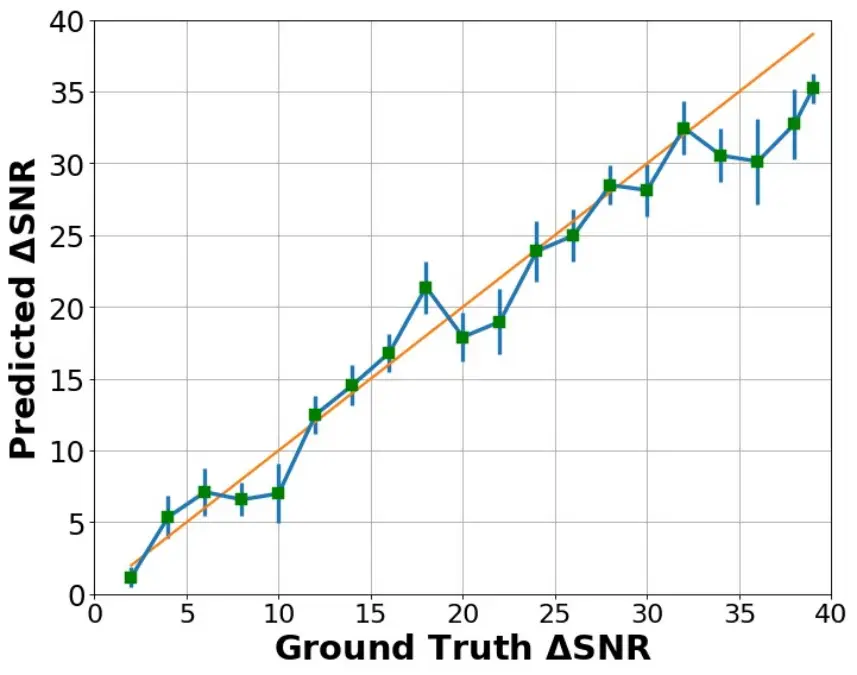 | 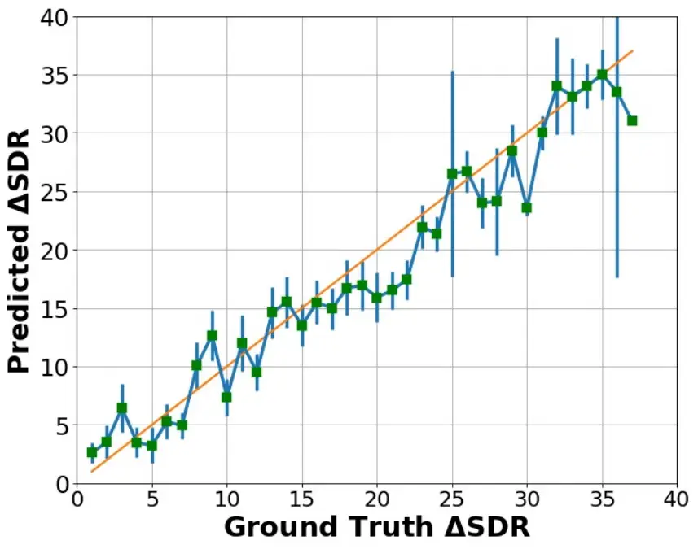 |
| (a)                                                         | (b)                                                         |

Figure 3: Variation of our models output with increasing (a) SNR and (b)
SI-SDR using _test and reference_ recordings randomly chosen from
Mandarin, French, Arabic, Turkish, Spanish, Bengali, Gujarati, Hindi and
Marathi.

|                                                             |                                                             |
| ----------------------------------------------------------- | ----------------------------------------------------------- |
| 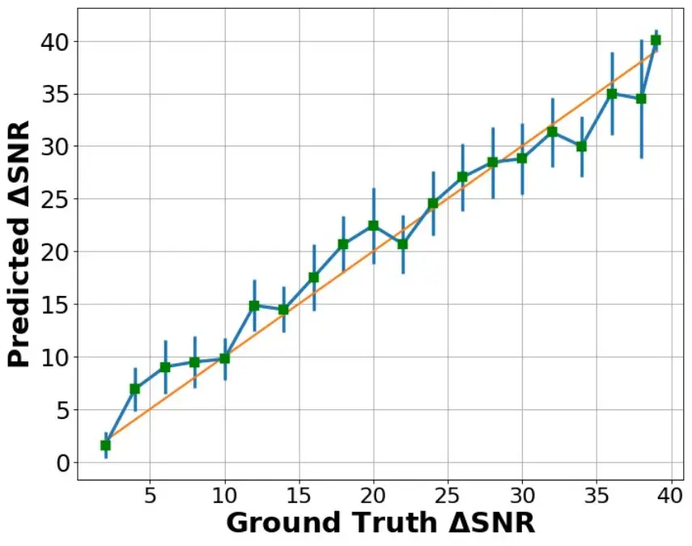 | 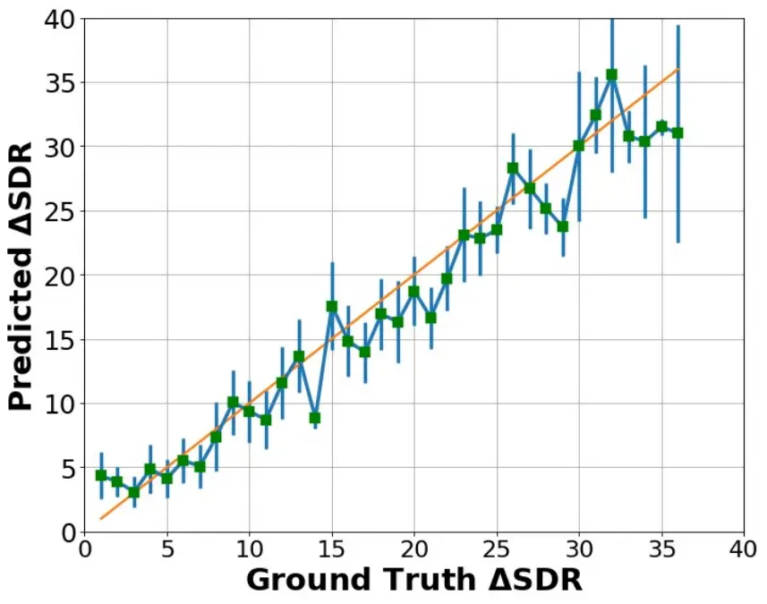 |
| (a)                                                         | (b)                                                         |

Figure 4: Variation of our models output with increasing (a) SNR and (b)
SI-SDR using _test_ speech from English (TIMIT), and _reference_
recordings from Mandarin, French, Arabic, Turkish, Spanish, Bengali,
Gujarati, Hindi and Marathi.

|                                                             |                                                              |
| ----------------------------------------------------------- | ------------------------------------------------------------ |
| 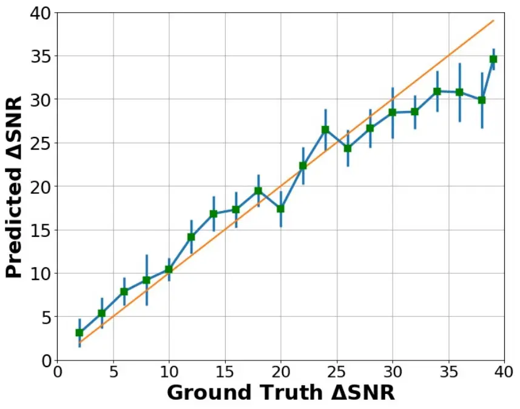 | 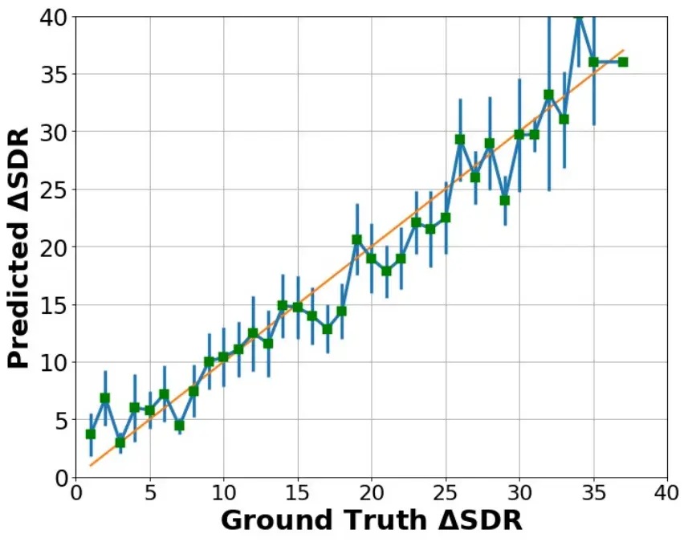 |
| (a)                                                         | (b)                                                          |

Figure 5: Variation of our models output with increasing (a) SNR and (b)
SI-SDR using unseen clean _male_ speech from the DAPS dataset.

|                                                              |                                                              |
| ------------------------------------------------------------ | ------------------------------------------------------------ |
| 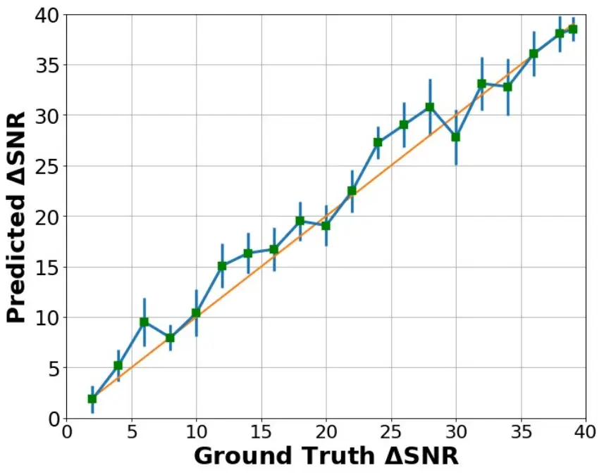 | 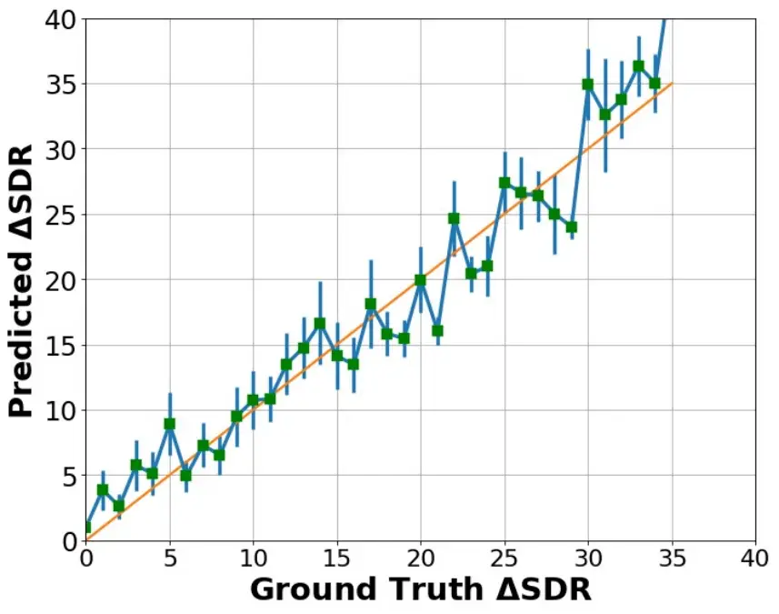 |
| (a)                                                          | (b)                                                          |

Figure 6: Variation of our models output with increasing (a) SNR and (b)
SI-SDR using clean _female_ speech from the DAPS dataset.

|                                                              |                                                              |
| ------------------------------------------------------------ | ------------------------------------------------------------ |
| 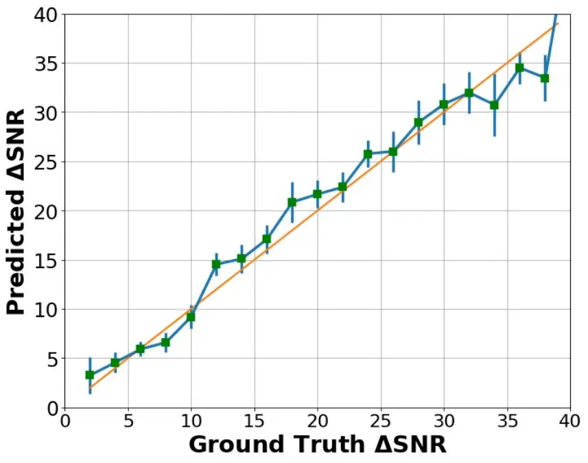 | 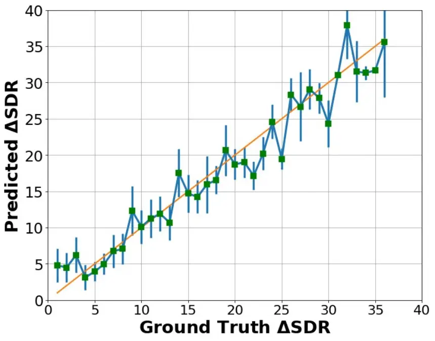 |
| (a)                                                          | (b)                                                          |

Figure 7: Variation of our models output with increasing (a) SNR and (b)
SI-SDR under mismatched gender conditions (i.e., test recording is male
speech, and reference recording is female speech and vice-versa)

### C.2 In-variance to gender

We now evaluate how NORESQA behaves with respect to speaker’s gender.
Once again we try to disentangle behaviour w.r.t to speaker’s gender
through two experiments. First, we see how the trained models behave for
each gender, male and female. We test the models in male-only speaker
condition (test and references are all male speeches) as well as in
female-only speaker condition. Fig 5 shows the trends for male and 6
shows it for female. We note that the model works well in both cases.

Second, we evaluate how stable NORESQA is when the gender of the test
recording _does not_ match the reference, i.e., test recording is male
speech, and reference recording is female speech and vice-versa (Fig 7).
Once again, we observe that mis-matching speaker’s gender in test and
references does not adversely affect model’s behaviour. Overall, based
on these evaluation, we conclude that the model is invariant to gender
of the speaker and is primarily learning quality related
characteristics.

### C.3 Commutativity: $`\mathcal{N}(x_{test},x_{ref})`$ = $`\mathcal{N}(x_{ref},x_{test})`$

We empirically evaluate the model to check if it satisfies the
commutative property i.e., $`\mathcal{N}(x_{test},x_{ref})`$ =
$`\mathcal{N}(x_{ref},x_{test})`$

To evaluate the _preference-task_, we check the overall recording-wise
predictions of both cases (i.e., $`\mathcal{N}(x_{test},x_{ref})`$ and
$`\mathcal{N}(x_{ref},x_{test})`$ and see how well does the quality
preference order swap when swapping the order of the inputs. We
calculate accuracy by counting the number of times the preference order
correctly gets swapped, and divide it by the total number of recordings.
Our metric gets an accuracy of 98.3% that empirically shows that it
obeys the commutative property.

To evaluate the _quantification task_ (Fig 8), we compute the
predictions of both cases (i.e., $`d_{1}`$ =
$`\mathcal{N}(x_{test},x_{ref})`$ and $`d_{2}`$ =
$`\mathcal{N}(x_{ref},x_{test})`$). We then plot the distribution
$`abs(d_{1}-d_{2})`$ for 1000 different pairs of recordings. We observe
that the distribution is centered around 0dB which empirically suggests
that it obeys the commutative property.

Overall, our model learns these two desirable properties without any
specific training, and this suggests the usefulness of our framework for
audio quality judgment.

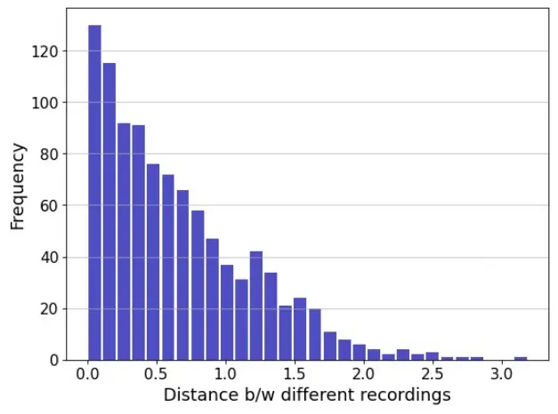

Figure 8: Commutative Property: Histogram plot of
abs($`\mathcal{N}(x_{test},x_{ref})`$ -
$`\mathcal{N}(x_{ref},x_{test})`$)

### C.4 Indiscernibility of Identicals: $`\mathcal{N}(x_{test},x_{test})`$

Here, we show the output of our model when passed the same inputs (Refer
to Sec 5.1 in the main paper). Ideally, the model should predict no
quality difference when passed the same inputs. However, since our
learning mechanism does not explicitly enforce the framework to have
this property, so small errors are expected. For a fair comparison, we
calculate the recording-level predictions from our model. Fig 9(a) shows
the probability outputs on the _preference-task_. The outputs are close
to 0.5 that suggests that the model is unable to confidently identify
which output is cleaner. Fig 9(b) shows the output from the
_quantification-task_. The distribution of the scores is centered around
zero that suggests that the model correctly predicts that the two same
inputs have similar quality levels, hence the near-zero quality
difference.

|                                                              |                                                              |
| ------------------------------------------------------------ | ------------------------------------------------------------ |
| 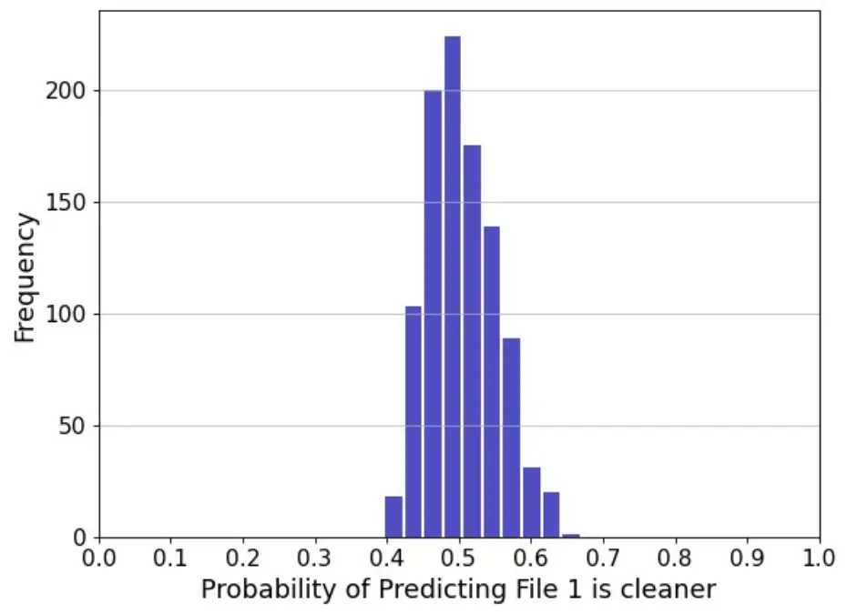 | 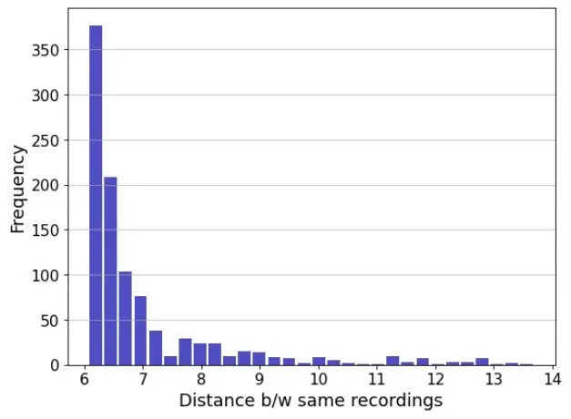 |
| (a)                                                          | (b)                                                          |

Figure 9: Indiscernibility of Identicals: (a) Evaluating our metric’s
performance on the preference-task and (b) quantification-task for the
same inputs

### C.5 Framewise detection

We also analyse the framewise performance of our model (Fig 10), using
the same test bench that we created earlier, that consists of different
recordings at various noise levels where each recording is 3 seconds. We
concatenate different recordings together in decreasing levels of noise
(i.e from high noise to low noise equally spaced from -10dB to +30dB)
which becomes the test input to our model. Equivalently, the reference
input to our model consists of a random concatenation of NMRs at +30dB.
We observe that the framewise output of task 1 (preference-task) is
almost 97% accurate in the preference task of predicting which frame is
cleaner between the two input recordings, which suggests that it learns
this quite well. We also compare the framewise outputs from task 2
(quantitative-task) that predicts their relative quality difference. We
find that the framewise predictions are not monotonic but still follow
the general trend. This is expected, since we always optimize on a
recording level, and not on a frame level. This findings suggest that
our metric can detect and quantify which frames are degraded in quality
between the inputs.

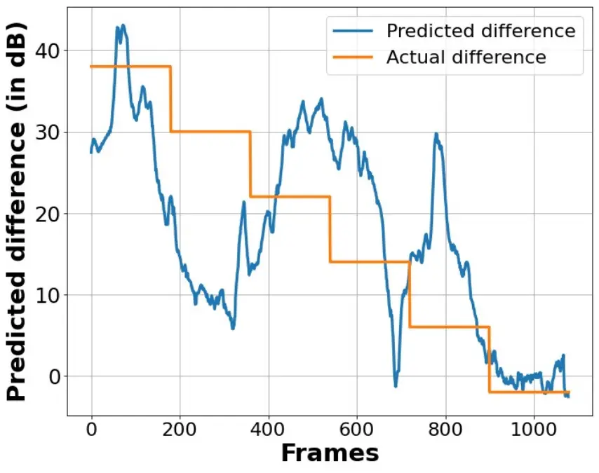

Figure 10: Framewise Predictions: Evaluating the framewise predictions
of our model using a test recording that has decreasing levels of noise
(from -10dB to +30dB) and the reference set consists of NMRs at +30dB.

## Appendix D Subjective Evaluation Datasets

Refer to Sec 5.2 in the main paper. We evaluate our framework
subjectively on two tasks: (i) Correlation with MOS across 8 existing
datasets, and (ii) 2AFC accuracy, where we show the performance of our
metric on triplet comparison questions from 4 different datasets. MOS
checks for aggregated ordering, scale and consistency, whereas 2AFC
checks for exact ordering of similarity at per sample basis. Most of the
datasets lie within the range of -15dB to 60dB SNR and -15dB to 25dB
SI-SDR, which also roughly matches our chosen training intervals.

The following are the datasets that we used for evaluation:

1.  1.  VoCo: This dataset is based on comparing 6 different _word synthesis
        and insertion_ algorithms. The MOS tests were asked to rate which
        algorithm could synthesize a new word such that it blends seamlessly
        in the context of the existing narration. This consists of
        non-sample aligned pairs of recordings.
2.  2.  Dereverberation: This dataset is based on evaluating improvements
        across 5 deep-learning based _speech enhancement_ models including
        BLSTM, Wavenet, StarGAN-VC etc. MOS tests were done to evaluate
        which algorithm was rated the highest by subjects from Amazon
        Mechanical Turk (AMT). They obtained more than 100 ratings per
        condition.
3.  3.  PEASS: The dataset contains separated sources and specifically
        defined anchor signals to assess audio _source separation_
        performance across 4 metrics: global quality, preservation of target
        source, suppression of other sources, and absence of additional
        artifacts. Here, we only look at global quality. It consists of
        scores from 20 subjects over a set of 80 sounds.
4.  4.  Voice Conversion (VC): c This objective of this dataset is to
        compare the performance on speaker (voice) conversion. It consists
        of two tasks: (i) parallel (HUB) and (ii) non-parallel data (SPO).
        Here we only consider HUB. The dataset consists of 4 source and 4
        target speakers, where each speaker utters the same sentence set
        consisting of around 80 sentences.
5.  5.  Noizeus: The dataset was developed to encourage comparison of
        non-deep learning based _speech enhancement_ algorithms, and
        consists of 30 IEEE sentences from 3 male and female speakers. The
        recordings are corrupted by 8 real-world noises, where the noises
        are taken from the AURORA database. The evaluation is done across 3
        metrics: SIG-speech signal alone; BAK-background noise; and
        OVRL-overall quality. Here, we only look at OVRL.
6.  6.  TCD-VoIP: This dataset was developed to help assess degradations
        that can occur in VoIP (Voice over IP calls). IT contains speech
        samples with a range of common VoIP degradations background noise,
        echo, chop (packet loss), clipping etc., and the corresponding set
        of subjective scores from 24 listeners.
7.  7.  HiFi-GAN: This dataset is based on evaluating the improvement across
        10 deep-learning based _speech enhancement_ models including BLSTM,
        Wavenet, MetricGAN, SpecGAN etc. MOS tests were done to evaluate
        which algorithm was rated the highest by subjects from Amazon
        Mechanical Turk (AMT), with each method receiving around 14k
        ratings. Further, it also consists of a 2AFC preference dataset
        consisting of around 1200 triplets, where each triplet received
        around 900 judgment ratings.
8.  8.  FFTnet: This dataset is based on evaluating the performance of 5
        _speech synthesis_ algorithms across 2 male and female speakers. It
        introduces artifacts specific to synthesis and are not
        sample-aligned due to phase change. Further, it also consists of a
        2AFC preference dataset consisting of around 2050 triplets, where
        each triplet received around 480 ratings.
9.  9.  Bandwidth Expansion: This dataset consists of subjective tests for 3
        different _bandwidth expansion_ algorithms, aiming at increasing
        sample rate by filling in the missing high-frequency information.
        These audio samples consist of very subtle high-frequency
        differences. Further, it also consists of a 2AFC preference dataset
        consisting of around 1020 triplets, where each triplet received
        around 400 judgments.
10. 10. Simulated: This dataset consists of 2AFC preference triplets,
        totalling to 1210. These are all based on adding _common-realistic
        degradations_ like background noises, speech distortions like
        clipping and other miscellaneous types of degradation’s like
        compression and EQ.

## Appendix E Ablations

In this section, we evaluate the influence of different components of
our framework.

### E.1 Relative vs Absolute Quantification Task

One key aspect of NORESQA  is that it tries to model relative quality
differences rather absolute quality measures in terms of SNR and SI-SDR.
We discussed motivations and intuitive reasons for it in the main paper.
We empirically study the relative vs absolute modeling of the quality
measures here. We compare our framework to models that are trained to
predict SNR and SI-SDR directly.

For the absolute quality prediction models, we consider two cases (i)
\[Single Input Absolute Quantification\]: a single input model that
takes a test recording and directly predicts the absolute quality
measure , SNR and SI-SDR. It resembles the conventional formulation of a
non-intrusive metric, and (ii) \[Two Input Absolute Quantification\]: a
pairwise model that takes a test recording and a non-matching clean
reference and predicts the absolute score. This is oriented towards our
NORESQA  framework but instead of learning relative differences it tries
to learn absolute quality measures.

Results are shown in Table 5. We observe that our _relative_ quality
prediction model NORESQA  performs the best by a considerable margin.
This empirically corroborate our hypothesis that learning to model
relative differences is much better than absolute measures. Their
correlations with MOS turns out to be much better than “absolute
methods". Moreover, we also observe that providing _any_ (even a
non-matched) clean reference to the model improves the performance over
the Single case even for absolute quantification tasks. This
demonstrates the inherent challenge of the conventional formulation of
the non-intrusive metric that does not provide any reference. This
highlights the usefulness of two features of our metric: (i) predicting
relative quality scores, and (ii) providing non-matching references.

| Name     | Type       | VoCo            |                 | Dereverb        |                 | HiFi-GAN        |                 | FFTnet          |                 |
| -------- | ---------- | --------------- | --------------- | --------------- | --------------- | --------------- | --------------- | --------------- | --------------- |
|          |            | PC              | SC              | PC              | SC              | PC              | SC              | PC              | SC              |
| Absolute | Sing. Inp. | 0.32            | 0.31            | 0.19            | 0.17            | 0.19            | 0.30            | 0.16            | 0.15            |
|          | Two Inp.   | 0.41$`\pm`$0.15 | 0.35$`\pm`$0.03 | 0.26$`\pm`$0.08 | 0.27$`\pm`$0.01 | 0.42$`\pm`$0.07 | 0.45$`\pm`$0.06 | 0.17$`\pm`$0.01 | 0.09$`\pm`$0.01 |
| NORESQA  |            | 0.85$`\pm`$0.01 | 0.68$`\pm`$0.03 | 0.66$`\pm`$0.02 | 0.67$`\pm`$0.02 | 0.68$`\pm`$0.01 | 0.78$`\pm`$0.01 | 0.33$`\pm`$0.01 | 0.44$`\pm`$0.01 |

Table 5: Ablations (1): Understanding the influence of predicting
quality measures (single and pairwise) with our NORESQA using
$`\textit{Global-Fixed}_{100}`$ strategy. MOS Correlations: Spearman
(SC), Pearson (PC). $`\uparrow`$ is better.

### E.2 Multi-objective Learning of Quantification Task

To evaluate the impact of the multi-objective optimization (i.e.,
optimizing over both SI-SDR and SNR) for the quantification task on
correlation to subjective ratings, we compare our trained metric: (i)
only using the SNR head; (ii) only using the SI-SDR head; and (iii)
after combining both SNR and SI-SDR heads. Results are shown in Table 6.
For simplicity, we only look at the
$`\mbox{{Unpaired-Global-Fixed}}_{100}`$ strategy, which is evaluating a
test recording using 100 clean NMRs randomly chosen from the DAPS
dataset. We observe that using either head alone performs worse than
using both together, which suggests that using a multi-objective
optimization helps learn a better general representation.

| Type     | Name           | VoCo |      | Dereverb |      | HiFi-GAN |      | FFTnet |      |
| -------- | -------------- | ---- | ---- | -------- | ---- | -------- | ---- | ------ | ---- |
|          |                | PC   | SC   | PC       | SC   | PC       | SC   | PC     | SC   |
| NORESQA  | SNR only       | 0.43 | 0.39 | 0.39     | 0.38 | 0.49     | 0.42 | 0.2    | 0.1  |
|          | SI-SDR only    | 0.6  | 0.48 | 0.48     | 0.49 | 0.54     | 0.65 | 0.25   | 0.28 |
|          | SNR and SI-SDR | 0.85 | 0.68 | 0.66     | 0.67 | 0.68     | 0.78 | 0.33   | 0.44 |

Table 6: Ablations (2): Understanding the influence of using
(multi-objective) SI-SDR and SNR for Task 2 using
$`\textit{Global-Fixed}_{100}`$ strategy. MOS Correlations: Spearman
(SC), Pearson (PC). $`\uparrow`$ is better.

### E.3 Number of NMRs

Here we report the MOS correlation scores obtained when considering a
set of 1, 10 and 100 NMRs for each test recording. This is shown for all
3 unpaired strategies described in Sec 5.2 (of the main paper) -
_Unpaired, Unpaired-Local-Fixed, and Unpaired-Global-Fixed_. Results are
shown in Table 7. We observe that averaging the scores over a larger set
of NMRs reduces the standard deviation in the scores which leads to more
stable predictions. We also observe that PC values are more consistent
and stable over many iterations, and have a lower standard deviation
than SC values. Since SC measures monotonic relationships, it can easily
overfit to a complex function, leading to a higher standard deviation
per iteration. However, since PC maps linear relationships, it is more
stable. Finally, we observe no significant difference between the scores
from Unpaired-Local-fixed and Unpaired-Global-fixed which suggests that
our metric works equally well for scenarios where we take any random set
of clean recordings as NMRs.

| Type          | Category             | VoCo            |                 | Dereverb        |                 | HiFi-GAN        |                 | FFTnet          |                 |
| ------------- | -------------------- | --------------- | --------------- | --------------- | --------------- | --------------- | --------------- | --------------- | --------------- |
|               |                      | PC              | SC              | PC              | SC              | PC              | SC              | PC              | SC              |
| Unpaired      | $`\text{NMR}_{1}`$   | 0.76$`\pm`$0.1  | 0.27$`\pm`$0.2  | 0.57$`\pm`$0.03 | 0.62$`\pm`$0.04 | 0.63$`\pm`$0.01 | 0.70$`\pm`$0.02 | 0.43$`\pm`$0.10 | 0.45$`\pm`$0.11 |
|               | $`\text{NMR}_{10}`$  | 0.87$`\pm`$0.01 | 0.43$`\pm`$0.07 | 0.64$`\pm`$0.01 | 0.73$`\pm`$0.03 | 0.63$`\pm`$0.01 | 0.70$`\pm`$0.01 | 0.45$`\pm`$0.03 | 0.48$`\pm`$0.06 |
|               | $`\text{NMR}_{100}`$ | 0.88$`\pm`$0.01 | 0.41$`\pm`$0.06 | 0.63$`\pm`$0.01 | 0.75$`\pm`$0.02 | 0.63$`\pm`$0.01 | 0.71$`\pm`$0.01 | 0.46$`\pm`$0.01 | 0.51$`\pm`$0.02 |
| +Local-Fixed  | $`\text{NMR}_{1}`$   | 0.65$`\pm`$0.23 | 0.40$`\pm`$0.23 | 0.53$`\pm`$0.10 | 0.57$`\pm`$0.15 | 0.56$`\pm`$0.08 | 0.64$`\pm`$0.08 | 0.38$`\pm`$0.10 | 0.31$`\pm`$0.13 |
|               | $`\text{NMR}_{10}`$  | 0.79$`\pm`$0.1  | 0.44$`\pm`$0.2  | 0.61$`\pm`$0.05 | 0.69$`\pm`$0.05 | 0.61$`\pm`$0.02 | 0.67$`\pm`$0.03 | 0.48$`\pm`$0.03 | 0.50$`\pm`$0.04 |
|               | $`\text{NMR}_{100}`$ | 0.89$`\pm`$0.01 | 0.44$`\pm`$0.06 | 0.63$`\pm`$0.01 | 0.75$`\pm`$0.01 | 0.61$`\pm`$0.01 | 0.73$`\pm`$0.01 | 0.46$`\pm`$0.01 | 0.51$`\pm`$0.02 |
| +Global-Fixed | $`\text{NMR}_{1}`$   | 0.79$`\pm`$0.20 | 0.54$`\pm`$0.20 | 0.44$`\pm`$0.16 | 0.41$`\pm`$0.19 | 0.56$`\pm`$0.08 | 0.63$`\pm`$0.10 | 0.29$`\pm`$0.10 | 0.36$`\pm`$0.12 |
|               | $`\text{NMR}_{10}`$  | 0.84$`\pm`$0.05 | 0.63$`\pm`$0.08 | 0.62$`\pm`$0.08 | 0.62$`\pm`$0.09 | 0.63$`\pm`$0.01 | 0.71$`\pm`$0.02 | 0.33$`\pm`$0.03 | 0.41$`\pm`$0.07 |
|               | $`\text{NMR}_{100}`$ | 0.85$`\pm`$0.01 | 0.68$`\pm`$0.03 | 0.66$`\pm`$0.02 | 0.67$`\pm`$0.02 | 0.68$`\pm`$0.01 | 0.78$`\pm`$0.01 | 0.33$`\pm`$0.01 | 0.44$`\pm`$0.02 |

Table 7: Ablations (3): Understanding the effect of number of recordings
used as non-matching references (NMR). MOS Correlations: Pearson (PC),
Spearman (SC). Each cell shows the mean and standard deviation after 10
iterations. $`\uparrow`$ is better.

## Appendix F Speech enhancement

We use the VCTK dataset that consists of around 11,572 utterances for
training and 824 files for validation. The dataset consists of 28
speakers equally split between male and female speakers, containing 10
unique background noise types across 4 different SNR conditions. Our
denoising network is similar to Tan et al. and consists of a multi-layer
convolutional encoder and decoder with U-Net skip connections, and a
sequence modeling network applied on the encoders output. The input to
the model are the real and imaginary components of the STFT of the
signal, and the outputs are the complex ratio mask. The encoder (and
decoder) consists of 5 gated convolutional layers with a filter size of
2 $`\times`$ 6, and use sigmoid activation for the gating mechanism. The
sequence modeling network takes the encoders output and outputs a
non-linear transformation of the same size. Since we design a _causal_
model, the network consists of 2 uni-directional LSTM layers with 256
hidden units in each layer.

For evaluation, we use the audio clips from the VCTK test set and
evaluate scores on that dataset. We evaluate the quality of enhanced
speech using objective measures. We use: i) PESQ (from 0.5 to 4.5); (ii)
Short-Time Objective Intelligibility (STOI) (from 0 to 100); (iii)
Segmental Signal-to-Noise Ratio (SNRseg): average of SNR values of short
segments (15 to 20ms) ; (iv) CSIG: MOS prediction of the signal
distortion attending only to the speech signal (from 1 to 5); (v) CBAK:
MOS prediction of the intrusiveness of background noise (from 1 to 5);
(vi) COVL: MOS prediction of the overall effect (from 1 to 5). We
compare the baseline approach with our model across the various
paired-data constrained strategies.

As shown in Table 4 (main paper), SE models trained using NORESQA 
obtain higher objective scores than the baseline models across all three
strategies. We observe that the difference between the scores from our
model and the baseline keeps increasing as we get more paired data which
shows the usefulness of our metric, especially for sparse labeled-data
situations (e.g., low-resource languages) since our approach leverages
unlimited unpaired data.

Most notable is the improvement in _STOI_ that shows our metrics’
utility as an optimization objective for pretraining. Given
sparse-labeled data, the baseline model can fit the test set only as
much. However, since our model can effectively leverage unlimited
unpaired data during pretraining, given a model of sufficient capacity,
it has the flexibility to learn a more complex mapping. This is
precisely why we observe higher objective scores for quality and
intelligibility than the baseline approaches which also highlights the
usefulness of our framework.
