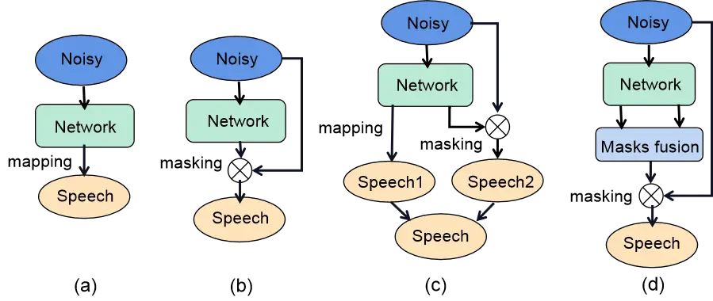
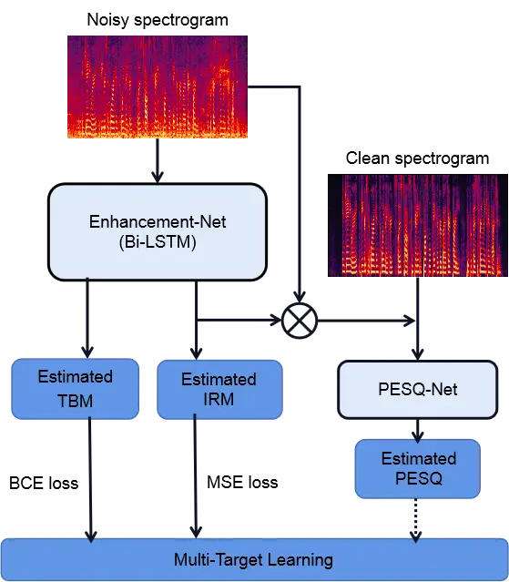
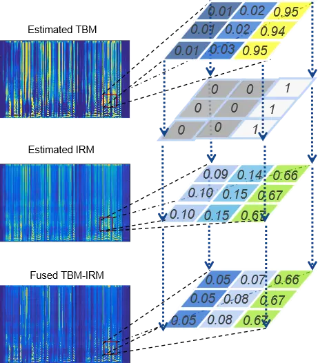
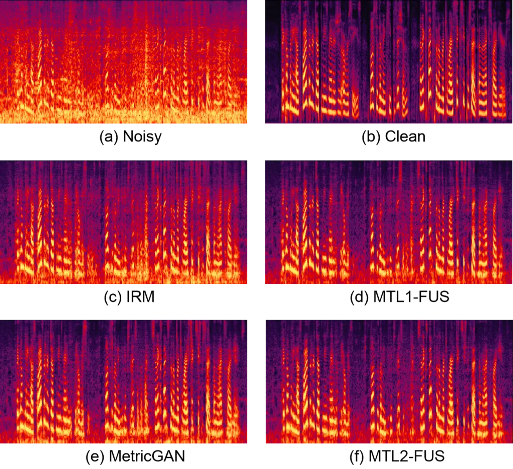

# Masks Fusion with Multi-Target Learning For Speech Enhancement

Liangchen Zhou    Wenbin Jiang    Jingyan Xu    Fei Wen    Peilin Liu

###### Abstract

Recently, deep neural network (DNN) based time-frequency (T-F) mask
estimation has shown remarkable effectiveness for speech enhancement.
Typically, a single T-F mask is first estimated based on DNN and then
used to mask the spectrogram of noisy speech in an order to suppress the
noise. This work proposes a multi-mask fusion method for speech
enhancement. It simultaneously estimates two complementary masks, e.g.,
ideal ratio mask (IRM) and target binary mask (TBM), and then fuse them
to obtain a refined mask for speech enhancement. The advantage of the
new method is twofold. First, simultaneously estimating multiple
complementary masks brings benefit endowed by multi-target learning.
Second, multi-mask fusion can exploit the complementarity of multiple
masks to boost the performance of speech enhancement. Experimental
results show that the proposed method can achieve significant PESQ
improvement and reduce the recognition error rate of back-end over
traditional masking-based methods. Code is available at
https://github.com/lc-zhou/mask-fusion.

###### Index Terms: 

Speech enhancement, multi-target learning, time frequency mask, mask
fusion

^(†)^(†)address: ¹Department of Electronic Engineering, Shanghai Jiao
Tong University, Shanghai, China  
²Department of Computer Science and Engineering, Shanghai Jiao Tong
University, Shanghai, China

## 1 Introduction

Speech enhancement has long been a fundamental and important problem in
speech signal processing, of which the goal is to suppress the
interfering noise of observed noisy speech to improve the speech
intelligibility and perceptual quality. It has wide applications such as
mobile telecommunication, automatic speech recognition (ASR), hearing
prosthesis, and speech interaction, to name just a few \[1\].

Recently, due in part to the roaring success of deep learning, the
research of deep neural network (DNN) based speech enhancement has
attracted much attention and achieved much progress. Generally, existing
DNN based methods can be conveniently classified into three categories.
The first directly maps noisy speech to the target speech using DNN \[2,
3\], as illustrated in Figure 1(a). The second is time-frequency (T-F)
masking based \[4, 5\], which estimates a mask using DNN and then
applies it in the T-F domain of noisy speech to suppress the noise, as
illustrated in Figure 1(b). The third is a combination of the two
formers, which estimates the target speech and a mask simultaneously,
and fuse them in an attempt to achieve better performance \[6, 7, 8,
9\], as illustrated in Figure 1(c). Roughly speaking, considering both
the effectiveness and efficiency, T-F masking based methods are more
prevalent.

Besides, there exist some works using multi-target architectures to
exploit additional information benefiting denoising, such as SNR-aware
\[10\], speaker-aware feature \[11\], spatial-aware masks \[12\] and
phase of noisy wav \[13\]. It has been shown that exploiting such
information can improve the performance for speech enhancement.
Meanwhile, some other works design more complex neural network for
denoising, e.g., \[14\]. These methods improve the performance of speech
enhancement to a certain degree at the cost of increased complexity of
models.



Figure 1: Illustration of different DNN-based speech enhancement
methods. (a) Direct speech spectrogram estimation. (b) Masking-based
method estimates a T-F mask first. (c) Simultaneous estimation of speech
and a mask using DNN and fuse them for enhancement. (d) Our method
simultaneously estimates two complementary masks and fuse them.

This paper proposes a multi-mask fusion method for speech enhancement.
It simultaneously estimates two complementary masks (see Figure 1(d)),
ideal ratio mask (IRM) and target binary mask (TBM), and then fuse them
to obtain a refined mask for speech enhancement. The motivation of the
proposed method is twofold. First, simultaneously estimation of multiple
complementary masks can be expected to have benefit from multi-target
learning. Second, fusion of multiple masks can be expected to achieve
performance improvement by incorporating complementary information from
multiple masks. Moreover, the proposed method does not incur much
increase of network complexity, and hence can well preserve the
computational efficiency of T-F masking-based methods. Experimental
results demonstrate that the proposed method can achieve significant
improvement in PESQ compared with traditional masking-based methods.

Furthermore, when incorporated with sophisticated perceptual loss, the
proposed fusion scheme can yield further improvement and outperforms
existing state-of-the-art perceptual loss based method \[15\]. Recently,
training the model of speech enhancement by a human-perception-related
loss function has shown high effectiveness \[15, 16, 17, 18\].
Typically, such methods use an approximated PESQ or short-time objective
intelligibility (STOI) loss function to train the network instead of the
mean squared error (MSE) loss.

The rest of this paper is organized as follows. Section 2 briefly
introduces the signal model and background. Section 3 presents the
proposed mask fusion method. Section 4 provides experiments, and Section
5 summarizes this paper.

## 2 Preliminaries

An observed noisy speech signal $`{\mathbf{y}}\in\mathbb{R}^{T}`$ with
$`T`$ sampling points can be modeled as a mixture of a clean target
speech $`\mathbf{x}`$ and noise $`{\mathbf{n}}`$ as

```math
{\mathbf{y}}={\mathbf{x}}+{\mathbf{n}}. \tag{1}
```

The goal of speech enhancement is to recover $`{\mathbf{x}}`$ from
$`{\mathbf{y}}`$. In practice, $`{\mathbf{x}}`$ may consist of speech
from multiple speakers.

Recently, DNN based methods has substantially advanced the performance
of speech enhancement. Especially, masking based methods have been
prevalent due to their effectiveness and efficiency, which typically
estimate a T-F mask using DNN and then apply it to T-F domain
spectrogram of noisy speech to suppress the noise. Specifically, the
time-domain observation $`{\mathbf{y}}`$ is transformed into T-F domain
by short-time Fourier transform (STFT), denoted by
$`F:\mathbb{R}^{T}\rightarrow\mathbb{C}^{M\times L}`$, where $`{M}`$ and
$`{L}`$ are the numbers of frames and frequency bins, respectively.
Generally, masking-based speech enhancement can be expressed as

```math
\hat{{\mathbf{x}}}=F^{\dagger}\big(G(F({\mathbf{y}});{\mathbf{\Theta}})\odot F({\mathbf{y}})\big), \tag{2}
```

where $`\hat{\mathbf{x}}`$ is the estimation of $`{\mathbf{x}}`$,
$`F^{\dagger}`$ is the inverse-STFT, $`\odot`$ is the element-wise
Hadamard product, $`G`$ is the DNN mapping for T-F mask estimation with
parameters $`\mathbf{\Theta}`$.

There exist a number of masks designed for speech enhancement, such as
ideal binary mask (IBM) \[19\], IRM \[20\], TBM \[21\], spectral
magnitude mask (SMM) \[22\] and phase-sensitive mask (PSM) \[23\]. While
IBM uses a hard binary label on each T-F unit, IRM can be viewed as a
soft version of IBM, which is defined as

```math
IRM_{t,f}={\left(\frac{{X_{t,f}^{2}}}{{X_{t,f}^{2}}+{N_{t,f}^{2}}}\right)}^{\beta}, \tag{3}
```

where $`{t}`$ and $`{f}`$ denote the time and frequency indices,
respectively, $`X`$ and $`N`$ are the spectrograms of the target clean
speech and noise, respectively. Accordingly, $`{X_{t,f}^{2}}`$ and
$`{N_{t,f}^{2}}`$ are the speech and noise energy of the $`(t,f)`$-th
T-F unit, respectively. The tunable parameter $`\beta`$ scaling the mask
is typically chosen to 0.5. Intuitively, IRM is a soft mask defined
based on the speech and noise energy of each T-F unit.

In comparison, IBM and TBM are complementary with IRM as they are hard
binary masks. In order to maximize the complementarity in comparison
with IRM, our fusion method considers a variant of the TBM defined only
based on the target clean speech as

```math
TBM_{t,f}=\left\{\!\begin{array}[]{cl}\!{1,}&{{\text{if }}X_{t,f}>\tau_{f}}\\
{0,}&{{\text{otherwise}}}\end{array}\right., \tag{4}
```

with

```math
\tau_{f}=\frac{1}{M}\sum_{t=1}^{M}X_{t,f}. \tag{5}
```

This definition of TBM is in fact a binary classification of each T-F
unit based on the target speech energy.

## 3 Proposed Method

We utilize multi-target learning to simultaneously estimate two
complementary masks, IRM and TBM. Meanwhile, mask fusion is adopted to
make full use of the complementary information from the two masks in
order to achieve better performance than single mask based methods.

### 3.1 Multi-Target Learning



Figure 2: Overall architecture of the proposed multi-mask fusion model.
The overall loss consists of a BCE loss of TBM and an MSE loss of IRM,
with a perceptual loss being optional.

Multi-target learning has been well demonstrated to be effective in
enhancing the generalization ability of DNN models. The overall
architecture of the proposed model for speech enhancement is illustrated
in Figure 2. The network is designed to estimate the TBM and IRM from
the noisy spectrogram, which has two bi-directional long short-term
memory (Bi-LSTM) layers. Alternatively, the Bi-LSTM layers can be
replaced with LSTM layers to make the system causal and enabling
streaming data processing. In addition, a perceptual loss can be
optionally added to further improve the performance. Recently,
perceptual loss has shown significant effectiveness for speech
enhancement \[15, 17, 24, 25\].

Accordingly, the overall loss consists of a loss for TBM, a loss for
IRM, and optionally a perceptual loss, which given by

```math
\mathcal{L}=\mathcal{L}_{IRM}+{\alpha}\mathcal{L}_{TBM}+{\lambda}\mathcal{L}_{per}, \tag{6}
```

where $`\alpha>0`$ and $`{\lambda}>0`$ are penalty parameters to balance
between the three losses. The IRM loss $`\mathcal{L}_{IRM}`$ is the MSE
of IRM estimation as

```math
{\mathcal{L}_{IRM}}=\sum\limits_{t,f}{{{\left({\widehat{IRM}_{t,f}-IRM_{t,f}}\right)}^{2}}}, \tag{7}
```

where $`{\widehat{IRM}}_{t,f}`$ is the estimated IRM by the network.
There exists another way to learn the target mask, which is called
signal approximation \[7, 26\]. It trains a ratio mask estimator that
minimizes the difference between the spectrogram of clean speech and
that of estimated speech, which has been tested in our model but shown
no performance improvement. The TBM loss $`\mathcal{L}_{TBM}`$ is the
binary cross entropy (BCE) loss of TBM estimation as

```math
\displaystyle{L}_{TBM}= \displaystyle-\sum\limits_{t,f}TBM_{t,f}\cdot log({\widehat{TBM}}_{t,f})+ \tag{8}
```

```math
\displaystyle(1-TBM_{t,f})\cdot log(1-{\widehat{TBM}}_{t,f}),
```

where $`{\widehat{TBM}}_{t,f}`$ is the TBM estimated by the network. For
TBM estimation, which is a binary classification task of T-F bins, the
BCE loss is more suitable than MSE.

The perceptual loss $`\mathcal{L}_{per}`$ is based on an approximate
PESQ estimation function, for which a network is used to estimate PESQ
\[15\] since the standard PESQ function is non-differentiable.
Specifically, $`\mathcal{L}_{per}`$ is given by

```math
\mathcal{L}_{per}=1-Q\left(Y_{t,f}\odot\widehat{IRM}_{t,f},X_{t,f}\right), \tag{9}
```

where $`Y_{t,f}`$ is the noisy spectrogram, and $`Q`$ is the PESQ
estimation network, referred to as PESQ-Net. Similar to \[17\], the
PESQ-Net $`Q`$ is pre-trained beforehand and fixed in the procedure of
training the mask estimation network. The PESQ-Net is only used for
training.

Note that, the perceptual loss is optional in our method. We consider it
in this paper in an order to show that, when incorporated into the
sophisticated perceptual training framework, the proposed method can
also yield performance improvement over existing perceptual training
based methods, as will be shown later in Section 4.



Figure 3: Illustration of mask fusion of IRM and TBM. The estimated TBM
is first binarized and then fused with the estimated IRM to obtain a
refined soft mask. The fused mask is finally used to mask the noisy
spectrogram to suppress noise.

### 3.2 Mask Fusion

While the multi-target learning strategy aims to enhance the
generalization ability of the mask estimation network, the mask fusion
strategy aims to make full use of the complementary information of the
two different masks IRM and TBM. Figure 3 illustrates the mask fusion
strategy. The basic idea is simply that, the T-F bins not dominated by
speech energy according to estimated TBM should be weakened, while the
T-F bins dominated by speech energy according to estimated TBM shall
remain unchanged. The goal is to obtain a refined mask that is more
robust against noise. Specifically, the fused mask is computed as

```math
MF_{t,f}=\left\{\!\begin{array}[]{cl}\!{{\widehat{IRM}}_{t,f},}&{{\text{if~ }}{\widehat{TBM}}_{t,f}>\delta}\\
{\gamma\cdot{\widehat{IRM}}_{t,f},}&{{\text{otherwise}}}\end{array}\right., \tag{10}
```

where $`0\!<\!\delta\!<\!1`$ is a threshold parameter for the
binarization of the estimated TBM, $`0\!\leq\!\gamma\!\leq\!1`$ is the
scale for weakening the T-F bins not dominated by speech. When
$`\gamma=1`$, it holds $`MF_{t,f}\!=\!\widehat{IRM}_{t,f}`$, in this
case the fused mask degenerates to the estimated IRM. When $`\gamma=0`$,
it is equivalent to fuse the binarized TBM with IRM directly by
element-wise product. Intensive experiments show that using a very small
value of $`\gamma`$, e.g., $`\gamma=0`$, would lead to degradation of
speech perceptual quality caused by excessive suppression.

## 4 Experiments

### 4.1 Data Corpus

We conduct experimental evaluation of the proposed method on the CHiME-4
challenge \[27\], of which the data is collected in the scenarios where
a person is talking to a mobile tablet device equipped with 6
microphones in a variety of adverse environments. There are four noise
conditions, café (CAF), street junction (STR), public transport (BUS),
and pedestrian area (PED). Simulated data of noisy speech are provided
for each condition and is constructed by mixing clean utterances of the
WSJ0 corpus \[28\] with environmental noise recordings using the method
in \[29\]. But real data is recorded in real noisy environments uttered
by actual talkers. Each recorded data has 6 channels. In this paper, we
focus on the single channel case and only the data from channel-1 is
used.

For the experiment on enhancement, all data is simulated in order to
have clean speech as reference for training and testing. Specifically,
the training set is generated by café noise, pedestrian noise, street
noise and clean utterances. There are 5420 utterances used from 83
speakers, which aims to make our trained DNN speaker-independent. The
development set are simulated with 1640 utterances. For evaluation set,
the test speech is taken from four speakers which are not seen during
training or validation. The test noise is CAF, PED and STR but extracted
from different files. And the bus noise is also used to generate the
test noisy data to perform a test with even an unseen noise type.
Besides, we simulate four SNR conditions from -5dB to 10dB with a step
size of 5dB for test to verify our method SNR-independent. As for the
ASR experiment, both real and simulated data are used to test and we
focus on the performance on the real test set.

### 4.2 Implementation Details

In our task, speech waveform is sampled at 16 kHz and the frame length
is set to 512 samples (32 msec) with a frame shift of 256 samples (16
msec). STFT analysis is used to compute the DFT of each overlapping
windowed frame with hamming window. And inverse-STFT is used to
transform the T-F domain enhanced spectrogram into time-domain waveform.
Noisy spectrogram of each utterance with size of $`N\times 257`$ is used
as the input of network. Meanwhile, the reference IRM and TBM with the
same size are used as the training labels. The mask estimation network
has four hidden layers, two Bi-LSTM layers of size $`200`$ and two dense
layers of size $`300`$. Two output layers activated by sigmoid with size
$`257`$ are used to output the IRM and TBM, respectively. First, we
train the network with the loss function (6), in which $`\alpha`$ and
$`\lambda`$ are set to 0.1 and 0, respectively. That is the perceptual
loss is not used.

Then, the perceptual loss using the PESQ-net is added to train the
network again with parameter $`\lambda=10`$. The PESQ-net is the same as
that in \[17\] and fixed in training the mask estimation network. The
ADAM algorithm is used to optimize the network, and the test performance
in the development set is used to decide whether to update the trained
model after each training epoch. Besides, the parameters $`\delta`$ and
$`\gamma`$ are selected based on the performance in the development set
after finishing the training of mask estimation network.

### 4.3 Experiment on Enhancement

The performance of speech enhancement is evaluated in terms of PESQ. The
compared methods include:

a\) TBM: the masking-based method only using TBM;

b\) IRM: the masking-based method only using IRM;

c\) MTL1-TBM: the proposed method using multi-target learning but only
using TBM without mask fusion;

d\) MTL1-IRM: the proposed method using multi-target learning but only
using IRM without mask fusion;

e\) MTL1-FUS: the proposed fusion method;

f\) MTL2-TBM: the proposed method using multi-target learning and
perceptual loss, but only using TBM without mask fusion;

g\) MTL2-IRM: the proposed method using multi-target learning and
perceptual loss, but only using IRM without mask fusion;

h\) MTL2-FUS: the proposed fusion method additionally using perceptual
loss;

i\) MetricGAN: the state-of-the-art perceptual loss based method \[15\].

Note that, all these compared methods use the same mask estimation
network as described in Section 4.2 except for the output layers, e.g.,
TBM, IRM and MetricGAN use a single output layer, while the variants of
the proposed method use two. Our method casues a little increase of
network complexity because the PESQ-net will not be used for test and
only an extra output layer is added. Specifically, the parameters of
network are increased from 1.98M to 2.06M by our method in the
experiment.

|           |                |                |                |                |
| --------- | -------------- | -------------- | -------------- | -------------- |
|           | CAF            | PED            | STR            | AVG            |
| Noisy     | $`1.855`$      | $`1.804`$      | $`1.960`$      | $`1.873`$      |
| TBM       | $`2.332`$      | $`2.319`$      | $`2.463`$      | $`2.371`$      |
| IRM       | $`2.393`$      | $`2.382`$      | $`2.510`$      | $`2.428`$      |
| MTL1-TBM  | $`2.347`$      | $`2.331`$      | $`2.472`$      | $`2.383`$      |
| MTL1-IRM  | $`2.399`$      | $`2.382`$      | $`2.513`$      | $`2.431`$      |
| MTL1-FUS  | $`\bm{2.498}`$ | $`\bm{2.482}`$ | $`\bm{2.612}`$ | $`\bm{2.531}`$ |
| MetricGAN | $`2.474`$      | $`2.487`$      | $`2.598`$      | $`2.520`$      |
| MTL2-TBM  | $`2.367`$      | $`2.354`$      | $`2.486`$      | $`2.402`$      |
| MTL2-IRM  | $`2.490`$      | $`2.497`$      | $`2.604`$      | $`2.530`$      |
| MTL2-FUS  | $`\bm{2.516}`$ | $`\bm{2.513}`$ | $`\bm{2.632}`$ | $`\bm{2.554}`$ |

Table 1: PESQ score of different methods for seen noise types (CAF, PED
and STR) on the simulated test set at SNR=5dB.

|           |                |                |                |                |                |
| --------- | -------------- | -------------- | -------------- | -------------- | -------------- |
|           | -5dB           | 0dB            | 5dB            | 10dB           | AVG            |
| Noisy     | $`1.445`$      | $`1.795`$      | $`2.160`$      | $`2.520`$      | $`1.980`$      |
| TBM       | $`1.682`$      | $`2.207`$      | $`2.628`$      | $`2.943`$      | $`2.365`$      |
| IRM       | $`1.837`$      | $`2.295`$      | $`2.678`$      | $`3.004`$      | $`2.454`$      |
| MTL1-TBM  | $`1.693`$      | $`2.223`$      | $`2.634`$      | $`2.929`$      | $`2.370`$      |
| MTL1-IRM  | $`1.846`$      | $`2.304`$      | $`2.690`$      | $`3.020`$      | $`2.465`$      |
| MTL1-FUS  | $`\bm{1.918}`$ | $`\bm{2.399}`$ | $`\bm{2.788}`$ | $`\bm{3.098}`$ | $`\bm{2.551}`$ |
| MetricGAN | $`1.867`$      | $`2.359`$      | $`2.759`$      | $`3.093`$      | $`2.520`$      |
| MTL2-TBM  | $`1.681`$      | $`2.225`$      | $`2.649`$      | $`2.955`$      | $`2.378`$      |
| MTL2-IRM  | $`1.888`$      | $`2.373`$      | $`2.760`$      | $`3.083`$      | $`2.526`$      |
| MTL2-FUS  | $`\bm{1.932}`$ | $`\bm{2.410}`$ | $`\bm{2.790}`$ | $`\bm{3.104}`$ | $`\bm{2.559}`$ |

Table 2: PESQ score of different methods for unseen noise types (BUS) on
the simulated test set at all SNRs.

Table 1 shows the PESQ score of the compared methods on the simulated
test set of CHiME-4 for seen noise types at SNR=5dB. Meanwhile, Table 2
shows the PESQ score for unseen noise type at all SNRs. We can draw the
following results from Table 1 and 2. First, IRM yields higher PESQ
score than TBM, which implies that IRM is superior over TBM for speech
perceptual quality. Second, MTL1-IRM outperforms IRM, whilst MTL2-IRM
outperforms MTL1-IRM in terms of PESQ. Third, the proposed mask fusion
can further significantly improve the performance, which results in
better performance of MTL1-FUS over MTL1-IRM and better performance of
MTL2-FUS over MTL2-IRM.

The idea of multi-target learning can be used to learn multiple targets
with increasing the complexity of the network slightly, but only have
slight improvement in our framework. In comparison, the proposed mask
fusion strategy can achieve significant improvement. For example, even
in the case without perceptual training, MTL1-FUS has better performance
than the perceptual training based MetricGAN method. When perceptual
loss is used, the proposed method can achieve further improvement, e.g.,
MTL2-FUS achieved the highest PESQ score in all four conditions and all
SNRs. However, the advantage of MTL1-FUS over MTL1-IRM is more prominent
than that of MTL2-FUS over MTL2-IRM.

Table 3 and 4 shows the PESQ comparison for different parameter of
fusion. Table 3 shows the different scale for weakening the T-F bins not
dominated by speech when the threshold is fixed. The optimal performance
is obtained when $`\gamma`$ is set to about 0.5. Meanwhile, the
excessive weakening of T-F bins such as $`\gamma=0.1`$ will lead to a
drop of PESQ scores and serious speech distortion. When $`\gamma=1`$, it
will not weaken the T-F bins and is equivalent to no fusion. Table 4
shows the different threshold for the binarization of the estimated TBM
when the scale is fixed. The optimal performance is obtained when
$`\delta`$ is set to about 0.9, which is different from the scale. The
great threshold means there are more T-F bins weakened. However, it
makes no sense that $`\delta=1`$ is set to 1 because all T-F bins are
weakened. Besides, if $`\delta=0`$ there will be no T-F bins weakened,
which is equivalent to $`\gamma=1`$ and has the same result.

| $`\gamma`$ | -5dB           | 0dB            | 5dB            | 10dB           | AVG            |
| ---------- | -------------- | -------------- | -------------- | -------------- | -------------- |
| $`0`$      | $`1.775`$      | $`2.256`$      | $`2.600`$      | $`2.824`$      | $`2.364`$      |
| $`0.1`$    | $`1.775`$      | $`2.257`$      | $`2.604`$      | $`2.835`$      | $`2.368`$      |
| $`0.2`$    | $`1.791`$      | $`2.289`$      | $`2.674`$      | $`2.958`$      | $`2.428`$      |
| $`0.3`$    | $`1.825`$      | $`2.335`$      | $`2.744`$      | $`3.059`$      | $`2.491`$      |
| $`0.4`$    | $`1.853`$      | $`2.364`$      | $`2.778`$      | $`3.104`$      | $`2.525`$      |
| $`0.5`$    | $`1.869`$      | $`\bm{2.373}`$ | $`\bm{2.784}`$ | $`\bm{3.115}`$ | $`\bm{2.535}`$ |
| $`0.6`$    | $`\bm{1.875}`$ | $`2.370`$      | $`2.775`$      | $`3.107`$      | $`2.532`$      |
| $`0.7`$    | $`1.874`$      | $`2.358`$      | $`2.758`$      | $`3.089`$      | $`2.520`$      |
| $`0.8`$    | $`1.868`$      | $`2.342`$      | $`2.736`$      | $`3.067`$      | $`2.503`$      |
| $`0.9`$    | $`1.858`$      | $`2.324`$      | $`2.713`$      | $`3.044`$      | $`2.485`$      |
| $`1`$      | $`1.846`$      | $`2.304`$      | $`2.690`$      | $`3.020`$      | $`2.465`$      |

Table 3: PESQ comparison of different scale $`\gamma`$ for MTL1-FUS when
$`\delta=0.5`$.

| $`\delta`$ | -5dB           | 0dB            | 5dB            | 10dB           | AVG            |
| ---------- | -------------- | -------------- | -------------- | -------------- | -------------- |
| $`0`$      | $`1.846`$      | $`2.304`$      | $`2.690`$      | $`3.020`$      | $`2.465`$      |
| $`0.1`$    | $`1.828`$      | $`2.321`$      | $`2.741`$      | $`3.098`$      | $`2.497`$      |
| $`0.2`$    | $`1.836`$      | $`2.337`$      | $`2.760`$      | $`3.108`$      | $`2.510`$      |
| $`0.3`$    | $`1.845`$      | $`2.351`$      | $`2.770`$      | $`3.113`$      | $`2.520`$      |
| $`0.4`$    | $`1.858`$      | $`2.363`$      | $`2.778`$      | $`\bm{3.115}`$ | $`2.529`$      |
| $`0.5`$    | $`1.869`$      | $`2.373`$      | $`2.784`$      | $`\bm{3.115}`$ | $`2.535`$      |
| $`0.6`$    | $`1.881`$      | $`2.382`$      | $`2.788`$      | $`\bm{3.115}`$ | $`2.542`$      |
| $`0.7`$    | $`1.894`$      | $`2.390`$      | $`\bm{2.791}`$ | $`3.111`$      | $`2.546`$      |
| $`0.8`$    | $`1.909`$      | $`2.395`$      | $`2.790`$      | $`3.105`$      | $`\bm{2.550}`$ |
| $`0.9`$    | $`\bm{1.921}`$ | $`\bm{2.399}`$ | $`2.784`$      | $`3.094`$      | $`\bm{2.550}`$ |
| $`1`$      | $`1.849`$      | $`2.301`$      | $`2.685`$      | $`3.016`$      | $`2.463`$      |

Table 4: PESQ comparison of different threshold $`\delta`$ for MTL1-FUS
when $`\gamma=0.5`$.

Figure 4 compares the enhanced magnitude spectrograms of an utterance.
The noisy spectrogram contains high noise at the entire spectrogram,
especially at low frequency bins. All the DNN based approaches can
achieve good performance for speech enhancement. However, there still
exits obvious noise at low frequency bins of the spectrogram enhanced by
IRM, as shown in Figure 4 (c), which would significantly degrade the
speech perceptual quality. Mask fusion can effectively reduce the noise
at low frequency bins, as shown in Figure 4 (d), which results in
significant improvement in speech perceptual quality (hence higher PESQ
score). MetricGAN and MTL2-FUS can recover the target speech spectrogram
better than IRM. Some audio samples is offered at
https://github.com/lc-zhou/mask-fusion/tree/main/audio_sample.



Figure 4: Magnitude spectrograms of the IRM, MTL1-FUS, MetricGAN, and
MTL2-FUS methods.

### 4.4 Experiment on ASR

The ASR system is trained on the speech recognition toolkit Kaldi \[30\]
for the back-end configurations. There are HMM-GMM and TDNN acoustic
models used in our experiment and the decoding is based on N-gram
language models. The performance of ASR is evaluated in terms of word
error rate (WER) and enhanced speech is directly fed into ASR system.
Table 5 has shown the WER comparison for three front-end methods on the
different set. IRM, MTL2-IRM and MTL2-FUS have been explained in Section
4.3 and are selected for test. As the front-end, MTL2-IRM has obtained
the better result than other methods at both back-end configurations.
Particularly, there are obvious improvement between MTL2-IRM and IRM.
Multi-target learning again can achieve improvement compared with
traditional single mask based methods, but mask fusion no longer leads
to improvement for WER. Tabel 6 shows the WER for different noisy types
on the real test set. The methods have the best performance for street
junction noise but not good for bus noise.

|               | dt_simu        | dt_real        | et_simu        | et_real        |
| ------------- | -------------- | -------------- | -------------- | -------------- |
| IRM-GMM       | $`28.45`$      | $`28.64`$      | $`35.73`$      | $`41.71`$      |
| MTL2-IRM-GMM  | $`\bm{18.78}`$ | $`17.90`$      | $`\bm{25.85}`$ | $`\bm{29.63}`$ |
| MTL2-FUS-GMM  | $`18.96`$      | $`\bm{17.74}`$ | $`27.03`$      | $`30.11`$      |
| IRM-TDNN      | $`17.89`$      | $`15.94`$      | $`26.77`$      | $`29.14`$      |
| MTL2-IRM-TDNN | $`\bm{12.66}`$ | $`\bm{10.67}`$ | $`\bm{20.60}`$ | $`\bm{22.26}`$ |
| MTL2-FUS-TDNN | $`14.44`$      | $`12.31`$      | $`23.55`$      | $`25.05`$      |

Table 5: WER comparison of three front-end methods on the different set.

|               | BUS            | CAF            | PED            | STR            | AVG            |
| ------------- | -------------- | -------------- | -------------- | -------------- | -------------- |
| IRM-GMM       | $`53.56`$      | $`45.57`$      | $`39.14`$      | $`28.58`$      | $`41.71`$      |
| MTL2-IRM-GMM  | $`\bm{40.19}`$ | $`31.90`$      | $`\bm{26.10}`$ | $`\bm{20.32}`$ | $`\bm{29.63}`$ |
| MTL2-FUS-GMM  | $`41.11`$      | $`\bm{31.81}`$ | $`26.74`$      | $`20.81`$      | $`30.11`$      |
| IRM-TDNN      | $`41.32`$      | $`29.98`$      | $`26.46`$      | $`18.81`$      | $`29.14`$      |
| MTL2-IRM-TDNN | $`\bm{34.90}`$ | $`\bm{21.18}`$ | $`\bm{19.02}`$ | $`\bm{13.93}`$ | $`\bm{22.26}`$ |
| MTL2-FUS-TDNN | $`39.63`$      | $`24.58`$      | $`20.16`$      | $`15.84`$      | $`25.05`$      |

Table 6: WER comparison of different noisy types on the real test set.

## 5 Conclusions

A multi-mask fusion method has been proposed for speech enhancement,
which adopts multi-target learning to simultaneously estimate two
complementary masks, namely TBM and IRM, and fuses them to achieve
better enhancement performance. Experimental results demonstrated that
the proposed fusion method can achieve the PESQ improvement over
traditional single mask based methods. Furthermore, when perceptual loss
is incorporated, the proposed method can achieve further improvement and
outperforms the state-of-the-art perceptual loss based method. Besides,
as the fornt-end the proposed method can also achieve more reduction of
WER than traditional single mask based methods. In future study, we will
explore other targets related to speech enhancement and other methods
that can improve the speech perceptual quality and reduce the
recognition error rate.

## References

- \[1\] D. Wang and J. Chen, “Supervised speech separation based on deep
  learning: An overview,” IEEE/ACM Transactions on Audio, Speech, and
  Language Processing, vol. 26, no. 10, pp. 1702–1726, 2018.
- \[2\] Yong Xu, Jun Du, Li-Rong Dai, and Chin-Hui Lee, “A regression
  approach to speech enhancement based on deep neural networks,”
  IEEE/ACM Transactions on Audio, Speech, and Language Processing, vol.
  23, no. 1, pp. 7–19, 2014.
- \[3\] Kun Han, Yuxuan Wang, DeLiang Wang, William S Woods, Ivo Merks,
  and Tao Zhang, “Learning spectral mapping for speech dereverberation
  and denoising,” IEEE/ACM Transactions on Audio, Speech, and Language
  Processing, vol. 23, no. 6, pp. 982–992, 2015.
- \[4\] Donald S Williamson, Yuxuan Wang, and DeLiang Wang, “Complex
  ratio masking for monaural speech separation,” IEEE/ACM transactions
  on audio, speech, and language processing, vol. 24, no. 3, pp.
  483–492, 2015.
- \[5\] Arun Narayanan and DeLiang Wang, “Ideal ratio mask estimation
  using deep neural networks for robust speech recognition,” in 2013
  IEEE International Conference on Acoustics, Speech and Signal
  Processing. IEEE, 2013, pp. 7092–7096.
- \[6\] L. Sun, J. Du, L. Dai, and C. Lee, “Multiple-target deep
  learning for lstm-rnn based speech enhancement,” in 2017 Hands-free
  Speech Communications and Microphone Arrays (HSCMA), 2017, pp.
  136–140.
- \[7\] Felix Weninger, Hakan Erdogan, Shinji Watanabe, Emmanuel
  Vincent, Jonathan Le Roux, John R Hershey, and Björn Schuller, “Speech
  enhancement with lstm recurrent neural networks and its application to
  noise-robust asr,” in International conference on latent variable
  analysis and signal separation. Springer, 2015, pp. 91–99.
- \[8\] Meng Ge, Longbiao Wang, Nan Li, Hao Shi, Jianwu Dang, and
  Xiangang Li, “Environment-dependent attention-driven recurrent
  convolutional neural network for robust speech enhancement.,” in
  INTERSPEECH, 2019, pp. 3153–3157.
- \[9\] H. Shi, L. Wang, M. Ge, S. Li, and J. Dang, “Spectrograms fusion
  with minimum difference masks estimation for monaural speech
  dereverberation,” in ICASSP 2020 - 2020 IEEE International Conference
  on Acoustics, Speech and Signal Processing (ICASSP), 2020, pp.
  7544–7548.
- \[10\] Szu-Wei Fu, Yu Tsao, and Xugang Lu, “Snr-aware convolutional
  neural network modeling for speech enhancement.,” in Interspeech,
  2016, pp. 3768–3772.
- \[11\] Y. Koizumi, K. Yatabe, M. Delcroix, Y. Masuyama, and
  D. Takeuchi, “Speech enhancement using self-adaptation and multi-head
  self-attention,” in ICASSP 2020 - 2020 IEEE International Conference
  on Acoustics, Speech and Signal Processing (ICASSP), 2020, pp.
  181–185.
- \[12\] Wenbin Jiang, Fei Wen, and Peilin Liu, “Robust beamforming for
  speech recognition using dnn-based time-frequency masks estimation,”
  IEEE Access, vol. 6, pp. 52385–52392, 2018.
- \[13\] J. Lee and H. Kang, “A joint learning algorithm for
  complex-valued t-f masks in deep learning-based single-channel speech
  enhancement systems,” IEEE/ACM Transactions on Audio, Speech, and
  Language Processing, vol. 27, no. 6, pp. 1098–1108, 2019.
- \[14\] Y. H. Tu, J. Du, and C. H. Lee, “2d-to-2d mask estimation for
  speech enhancement based on fully convolutional neural network,” in
  ICASSP 2020 - 2020 IEEE International Conference on Acoustics, Speech
  and Signal Processing (ICASSP), 2020, pp. 6664–6668.
- \[15\] Szu-Wei Fu, Chien-Feng Liao, Yu Tsao, and Shou-De Lin,
  “Metricgan: Generative adversarial networks based black-box metric
  scores optimization for speech enhancement,” in International
  Conference on Machine Learning (ICML), 2019.
- \[16\] Juan Manuel Martin-Donas, Angel Manuel Gomez, Jose A Gonzalez,
  and Antonio M Peinado, “A deep learning loss function based on the
  perceptual evaluation of the speech quality,” IEEE Signal processing
  letters, vol. 25, no. 11, pp. 1680–1684, 2018.
- \[17\] S. W. Fu, C. F. Liao, and Y. Tsao, “Learning with learned loss
  function: Speech enhancement with quality-net to improve perceptual
  evaluation of speech quality,” IEEE Signal Processing Letters, vol.
  27, pp. 26–30, 2020.
- \[18\] Morten Kolbæk, Zheng-Hua Tan, Søren Holdt Jensen, and Jesper
  Jensen, “On loss functions for supervised monaural time-domain speech
  enhancement,” IEEE/ACM Transactions on Audio, Speech, and Language
  Processing, vol. 28, pp. 825–838, 2020.
- \[19\] Guoning Hu and DeLiang Wang, “Speech segregation based on pitch
  tracking and amplitude modulation,” in Proceedings of the 2001 IEEE
  Workshop on the Applications of Signal Processing to Audio and
  Acoustics (Cat. No. 01TH8575). IEEE, 2001, pp. 79–82.
- \[20\] Christopher Hummersone, Toby Stokes, and Tim Brookes, “On the
  ideal ratio mask as the goal of computational auditory scene
  analysis,” in Blind source separation, pp. 349–368. Springer, 2014.
- \[21\] Sira Gonzalez and Mike Brookes, “Mask-based enhancement for
  very low quality speech,” in 2014 IEEE International Conference on
  Acoustics, Speech and Signal Processing (ICASSP). IEEE, 2014, pp.
  7029–7033.
- \[22\] Yuxuan Wang, Arun Narayanan, and DeLiang Wang, “On training
  targets for supervised speech separation,” IEEE/ACM transactions on
  audio, speech, and language processing, vol. 22, no. 12, pp.
  1849–1858, 2014.
- \[23\] Hakan Erdogan, John R Hershey, Shinji Watanabe, and Jonathan
  Le Roux, “Phase-sensitive and recognition-boosted speech separation
  using deep recurrent neural networks,” in 2015 IEEE International
  Conference on Acoustics, Speech and Signal Processing (ICASSP). IEEE,
  2015, pp. 708–712.
- \[24\] Szu-Wei Fu, Tao-Wei Wang, Yu Tsao, Xugang Lu, and Hisashi
  Kawai, “End-to-end waveform utterance enhancement for direct
  evaluation metrics optimization by fully convolutional neural
  networks,” IEEE/ACM Transactions on Audio, Speech, and Language
  Processing, vol. 26, no. 9, pp. 1570–1584, 2018.
- \[25\] Yuma Koizumi, Kenta Niwa, Yusuke Hioka, Kazunori Kobayashi, and
  Yoichi Haneda, “Dnn-based source enhancement to increase objective
  sound quality assessment score,” IEEE/ACM Transactions on Audio,
  Speech, and Language Processing, vol. 26, no. 10, pp. 1780–1792, 2018.
- \[26\] F. Weninger, J. R. Hershey, J. Le Roux, and B. Schuller,
  “Discriminatively trained recurrent neural networks for single-channel
  speech separation,” in 2014 IEEE Global Conference on Signal and
  Information Processing (GlobalSIP), 2014, pp. 577–581.
- \[27\] Emmanuel Vincent, Shinji Watanabe, Aditya Arie Nugraha, Jon
  Barker, and Ricard Marxer, “An analysis of environment, microphone and
  data simulation mismatches in robust speech recognition,” Computer
  Speech & Language, vol. 46, pp. 535–557, 2017.
- \[28\] John Garofalo, David Graff, Doug Paul, and David Pallett,
  “Csr-i (wsj0) complete,” Linguistic Data Consortium,
  Philadelphia, 2007.
- \[29\] Emmanuel Vincent, Rémi Gribonval, and Mark D Plumbley, “Oracle
  estimators for the benchmarking of source separation algorithms,”
  Signal Processing, vol. 87, no. 8, pp. 1933–1950, 2007.
- \[30\] Daniel Povey, Arnab Ghoshal, Gilles Boulianne, Lukas Burget,
  Ondrej Glembek, Nagendra Goel, Mirko Hannemann, Petr Motlicek, Yanmin
  Qian, Petr Schwarz, Jan Silovsky, Georg Stemmer, and Karel Vesely,
  “The kaldi speech recognition toolkit,” in IEEE 2011 Workshop on
  Automatic Speech Recognition and Understanding. Dec. 2011, IEEE Signal
  Processing Society, IEEE Catalog No.: CFP11SRW-USB.
