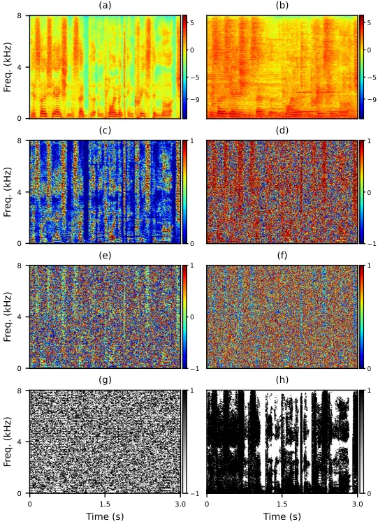
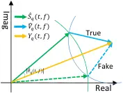
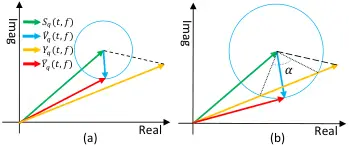
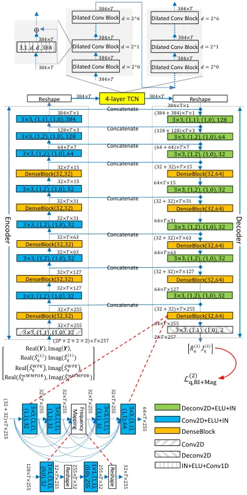
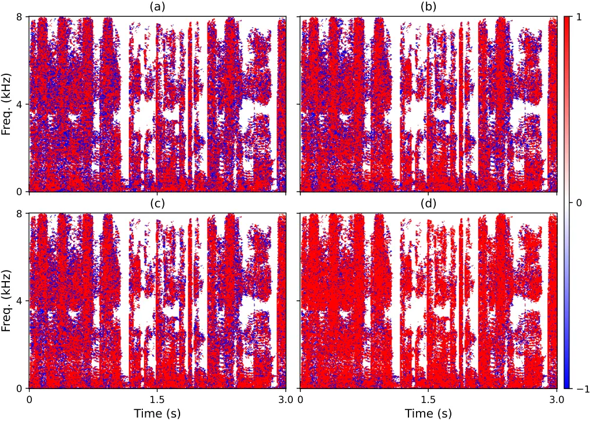

# Leveraging Low-Distortion Target Estimates for Improved Speech Enhancement

Zhong-Qiu Wang    Gordon Wichern    Jonathan Le Roux ^(†)^(†)thanks:
Manuscript received on Oct. 1, 2021.^(†)^(†)thanks: Z.-Q. Wang was with
Mitsubishi Electric Research Laboratories (MERL), Cambridge, MA 02139,
USA, while performing this work. He is now with the Language
Technologies Institute, Carnegie Mellon University, Pittsburgh, PA
15213, USA (e-mail: wang.zhongqiu41@gmail.com).^(†)^(†)thanks: G.
Wichern and J. Le Roux are with MERL, Cambridge, MA 02139, USA (e-mail:
{wichern,leroux}@merl.com).

###### Abstract

A promising approach for multi-microphone speech separation involves two
deep neural networks (DNN), where the predicted target speech from the
first DNN is used to compute signal statistics for time-invariant
minimum variance distortionless response (MVDR) beamforming, and the
MVDR result is then used as extra features for the second DNN to predict
target speech. Previous studies suggested that the MVDR result can
provide complementary information for the second DNN to better predict
target speech. However, on fixed-geometry arrays, both DNNs can take in,
for example, the real and imaginary (RI) components of the multi-channel
mixture as features to leverage the spatial and spectral information for
enhancement. It is not explained clearly why the linear MVDR result can
be complementary and why it is still needed, considering that the DNNs
and the beamformer use the same input, and the DNNs perform non-linear
filtering and could render the linear filtering of MVDR unnecessary.
Similarly, in monaural cases, one can replace the MVDR beamformer with a
monaural weighted prediction error (WPE) filter. Although the linear WPE
filter and the DNNs use the same mixture RI components as input, the WPE
result is found to significantly improve the second DNN. This study
provides a novel explanation from the perspective of the low-distortion
nature of such algorithms, and finds that they can consistently improve
phase estimation. Equipped with this understanding, we investigate
several low-distortion target estimation algorithms including several
beamformers, WPE, forward convolutive prediction (FCP), and their
combinations, and use their results as extra features to train the
second network to achieve better enhancement. Evaluation results on
single- and multi-microphone speech dereverberation and enhancement
tasks indicate the effectiveness of the proposed approach, and the
validity of the proposed view.

###### Index Terms: 

phase estimation, speech enhancement, speech dereverberation, microphone
array processing, deep learning.

## I Introduction

Room reverberation and environmental noise are pervasive in modern
hands-free speech communication applications such as teleconferencing,
hearing aids, smart speakers, and robust automatic speech recognition
(ASR). They can dramatically degrade speech intelligibility and quality,
and are very detrimental to modern ASR systems. Speech enhancement using
a single or an array of microphones is desirable for such applications.
In the past decade, deep learning based approaches have been firmly
established as the state-of-the-art approach for speech enhancement
\[1\]. Given a single-speaker utterance recorded in a noisy-reverberant
environment by a $`P`$-microphone array, the physical model in the
short-time Fourier transform (STFT) domain can be formulated as

```math
\displaystyle\mathbf{Y}(t,f) \displaystyle=\mathbf{X}(t,f)+\mathbf{N}(t,f)
```

```math
\displaystyle=\mathbf{S}(t,f)+\mathbf{H}(t,f)+\mathbf{N}(t,f)
```

```math
\displaystyle=\mathbf{S}(t,f)+\mathbf{V}(t,f), \tag{1}
```

where $`\mathbf{Y}(t,f)`$, $`\mathbf{N}(t,f)`$, $`\mathbf{X}(t,f)`$,
$`\mathbf{S}(t,f)`$ and $`\mathbf{H}(t,f)\in{\mathbb{C}}^{P}`$
respectively denote the STFT vectors of the mixture, reverberant noise,
reverberant speech, direct and non-direct signals of the target speaker,
at time $`t`$ and frequency $`f`$. A speech enhancement system usually
aims at recovering the target speaker’s direct-path signal $`S_{q}`$
captured at a reference microphone $`q`$ while reducing the other
signals $`\mathbf{V}=\mathbf{H}+\mathbf{N}`$, based on the multi-channel
input $`\mathbf{Y}`$. Note that variables without $`t`$ and $`f`$ refer
to the corresponding spectrogram.

To estimate $`S_{q}`$, a popular approach trains a DNN to estimate the
ideal complex ratio mask \[2, 1\], which can perfectly reconstruct the
target speech. It is defined as

```math
\displaystyle M_{q} \displaystyle=S_{q}/Y_{q}=|S_{q}|/|Y_{q}|\cos(\theta_{q})+j|S_{q}|/|Y_{q}|\sin(\theta_{q}), \tag{2}
```

where $`\theta_{q}=\angle S_{q}-\angle Y_{q}`$ is the phase difference
between the target speech and the mixture, and $`j`$ the imaginary unit.
The real component of $`M_{q}`$, also known as the non-truncated
phase-sensitive mask \[3\], is the product of the magnitude ratio
$`|S_{q}|/|Y_{q}|`$ and the cosine phase difference
$`\cos\big(\theta_{q}\big)`$. $`|S_{q}|/|Y_{q}|`$, known as the spectral
magnitude mask \[4\] (or ideal amplitude mask \[3\]), can be reasonably
predicted based on the mixture magnitude \[1\], since both $`|S_{q}|`$
and $`|Y_{q}|`$ exhibit strong spectro-temporal patterns that can be
learned by a supervised learning based model. See Fig. 1(a), (b), and
(c) for an illustration of the patterns of an example noisy-reverberant
mixture. As shown in Fig. 1(d), $`\cos\big(\theta_{q}\big)`$ exhibits
some patterns similar to those in the spectral magnitude mask. This is
because, as the input signal-to-noise ratio (SNR) becomes lower,
$`\angle Y_{q}(t,f)`$ gets closer to $`\angle V_{q}(t,f)`$, which is
likely different from $`\angle S_{q}(t,f)`$, and hence
$`\cos\big(\theta_{q}(t,f)\big)`$ likely becomes smaller than one.
However, knowing exactly how much smaller requires estimating the
absolute value of $`\theta_{q}(t,f)`$, and is a difficult task. The
imaginary component of $`M_{q}`$ also includes $`|S_{q}|/|Y_{q}|`$,
which can be reasonably predicted. However, $`\sin(\theta_{q})`$,
illustrated in Fig. 1(e), appears difficult to predict, due to the lack
of clear patterns. Indeed, from a predicted $`\cos(\hat{\theta}_{q})`$,
one can compute $`|\sin(\hat{\theta}_{q})|`$ (see Fig. 1(f)) as
$`\sqrt{1-\cos(\hat{\theta}_{q})^{2}}`$, but this is only the absolute
value. To accurately estimate $`\sin(\theta_{q})`$, one also has to
estimate the sign of the phase difference between $`S_{q}`$ and
$`Y_{q}`$ at each T-F unit. This is however known to be a difficult task
\[5\]. Fig. 1(g) plots the sign of the phase difference. Clearly, the
pattern is very random, simply because the sign of $`\theta_{q}(t,f)`$
depends on the phase of the non-target signal $`V_{q}(t,f)`$. To
accurately estimate the target phase, a successful algorithm should be
capable of estimating the phase difference at each T-F unit in terms of
its sign and absolute value, either explicitly or implicitly.



Fig. 1: Illustration of an example (a) target power spectrogram
$`\text{log}(|S_{q}|)`$; (b) mixture power spectrogram
$`\text{log}(|Y_{q}|)`$; (c) spectral magnitude mask $`|S_{q}|/|Y_{q}|`$
truncated to be below one; (d) $`\cos(\angle S_{q}-\angle Y_{q})`$; (e)
$`\sin(\angle S_{q}-\angle Y_{q})`$; (f) absolute of
$`\sin(\angle S_{q}-\angle Y_{q})`$; (g) sign of
$`\angle e^{j(\angle S_{q}-\angle Y_{q})}`$; (h) binary mask denoting
T-F units with active target speech. Best viewed in color.



Fig. 2: Illustration of phase-difference sign ambiguity in the complex
plane.

Our preliminary study \[5\] proposed a DNN-based algorithm to explicitly
predict the sign, and implicitly predict the absolute value of the phase
difference through magnitude estimation. The key idea is that if the
magnitude of $`S_{q}`$ and $`V_{q}`$ can be accurately estimated (in the
oracle case: let’s assume $`|\hat{S}_{q}|=|S_{q}|`$ and
$`|\hat{V}_{q}|=|V_{q}|`$) and if $`\hat{S}_{q}`$ and $`\hat{V}_{q}`$
add up to the mixture (i.e., $`Y_{q}=\hat{S}_{q}+\hat{V}_{q}`$), the
absolute phase difference can be uniquely determined based on the law of
cosines (see Fig. 2), and the phase solution at each T-F unit can be
narrowed down to only two candidates:

```math
\displaystyle|\hat{\theta}_{q}(t,f)| \displaystyle=\arccos\Big(\frac{|Y_{q}(t,f)|^{2}+|\hat{S}_{q}(t,f)|^{2}-|\hat{V}_{q}(t,f)|^{2}}{2|Y_{q}(t,f)||\hat{S}_{q}(t,f)|}\Big) \tag{3}
```

```math
\displaystyle\angle\hat{S}_{q}(t,f) \displaystyle=\angle Y_{q}(t,f)\pm|\theta_{q}(t,f)|. \tag{4}
```

Based on this insight, the DNNs in \[5\] are designed to predict the
magnitudes of target and non-target signals and the phase-difference
sign, and at the same time to enforce the predicted target and
non-target signals to sum up to the mixture. However, the sign is found
to be very difficult to predict accurately. This is partly because at
each T-F unit, we only observe the mixture vector $`Y(t,f)`$, while
there are two possible target and non-target pairs producing the same
mixture but being symmetric with respect to the mixture vector (see
Fig. 2). Intuitively, this ambiguity occurs because the phase of the
target source could be either ahead of or behind the mixture phase at
each T-F unit in an almost random way (see Fig. 1(g)). This randomness
could pose fundamental difficulties for supervised learning based phase
estimation \[5\], as supervised learning based models usually require
clear spectro-temporal patterns in order to learn to make predictions.
The root cause of this randomness is likely because, in monaural cases,
we only observe one signal (i.e., the mixture), but we want to
reconstruct multiple signals (i.e., the sources). This is an ill-posed
problem in nature.



Fig. 3: Complex-plane illustration of benefits of low-distortion target
estimates when non-target signals are (a) sufficiently suppressed; (b)
not sufficiently suppressed. Best viewed in color.

In this context, we propose to leverage low-distortion target estimates
produced by conventional single- or multi-microphone enhancement
algorithms to improve deep learning based phase estimation. Our insight
is that if we can first apply a distortionless enhancement algorithm to
the mixture such that the target signal is maintained distortionlessly
while the non-target signal is suppressed to some extent, the processed
mixture $`\ddot{Y}_{q}`$ (or $`\hat{S}_{q}`$) would indicate the
phase-difference sign. To illustrate this idea, let us denote the
processed mixture as

```math
\displaystyle\ddot{Y}_{q}(t,f)=\hat{S}_{q}(t,f)=S_{q}(t,f)+\ddot{V}_{q}(t,f), \tag{5}
```

where the target speech $`S_{q}`$ is distortionlessly maintained, and
$`\ddot{V}_{q}`$ denotes the suppressed non-target signal with
$`|\ddot{V}_{q}(t,f)|<|V_{q}(t,f)|`$ for many T-F units. Fig. 3(a)
illustrates the case when $`|\ddot{V}_{q}(t,f)|`$ is much smaller than
$`|V_{q}(t,f)|`$. Notice that $`\ddot{V}_{q}(t,f)`$ could have any phase
value, so the blue vector could point in any direction. In this case,
regardless of the phase value of $`\ddot{V}_{q}(t,f)`$,
$`\ddot{Y}_{q}(t,f)`$ always indicates that the true target phase
advances the mixture phase and hence the sign ambiguity can be resolved.
Fig. 3(b) illustrates the case when $`|\ddot{V}_{q}(t,f)|`$ is not much
smaller than $`|V_{q}(t,f)|`$. In this case, $`\angle\ddot{Y}_{q}(t,f)`$
could be on the wrong side. However, this may only happen when
$`|\ddot{V}_{q}(t,f)|>|S_{q}(t,f)|\sin(\theta_{q}(t,f))`$, with a
likely-small probability $`\frac{\alpha}{2\pi}`$ (see the figure for the
definition of $`\alpha`$) which can be computed via simple trigonometry
as
$`\frac{1}{\pi}\arccos\Big(\frac{|S_{q}(t,f)|}{|\ddot{V}_{q}(t,f)|}\sin(\theta_{q}(t,f))\Big)`$.
This probability is small in cases where $`|\ddot{V}_{q}(t,f)|`$ is well
suppressed by the low-distortion algorithm, or where $`\theta_{q}(t,f)`$
is large, which is the case where getting the sign right matters most.
Besides the benefits of resolving sign ambiguity, $`\ddot{Y}_{q}(t,f)`$
is expected to be closer than $`Y_{q}(t,f)`$ to $`S_{q}(t,f)`$ at many
T-F units, simply because the target speech is distortionlessly
maintained while non-target signals are suppressed. Therefore, it could
also be very helpful at determining the absolute value of the phase
difference and improving the estimation of the target magnitude.

Equipped with this novel understanding, we propose a 2stage-DNN approach
for speech enhancement. The first network is trained to predict the
target speech. The predicted speech is then used to compute signal
statistics for beamforming and WPE- \[6\] or FCP-based \[7\]
dereverberation. All of them are linear, time-invariant, and known to
produce low-distortion target estimates \[6, 1, 8, 7\]. We then use
their estimates as extra features to train the second network to better
predict target speech. Different from our earlier work \[5\], where DNNs
are trained to explicitly predict the target magnitude, absolute phase
difference, and phase-difference sign, this work trains DNNs in the
complex T-F domain to predict the RI components of the target speech,
hence implicitly predicting the target phase. This could better leverage
the power of deep learning based end-to-end optimization.

Our study makes two major contributions. First and foremost, we provide
a novel view that low-distortion target estimates produced by
conventional enhancement algorithms could be very helpful at improving
phase estimation. This view provides a good understanding on the reason
why our approach works, and reveals its strong potential. Second, we
explore and compare a number of ways to obtain low-distortion target
estimates, including beamforming, and WPE- or FCP-based dereverberation.
Our systems build upon a strong 2stage-DNN MISO-BF-MISO baseline \[9,
10\], which needs to run the first network once for each microphone, and
requires a uniform circular array geometry. The proposed systems only
run the first network once for a reference microphone to reduce the
amount of computation, and avoid the reliance on that particular type of
array geometry. We also provide some other minor contributions, which
will be stated when discussing specific techniques. We shall note that
part of this work has been published in ICASSP 2020 \[10\], which only
deals with speech dereverberation and only considers using MVDR
beamformers to obtain low-distortion target estimates.

The rest of this paper is organized as follows. We provide a system
overview in Section II, followed by a baseline system in Section III,
our proposed systems in Section IV, and DNN configurations in Section V.
We present experimental setup and evaluation results in Sections VI and
VII, and draw conclusions in Section VIII.

## II System Overview

Figure 4 illustrates the high-level architecture of our system.
Different variations of this system will be presented with more details
later in Sections III and IV. It contains two DNNs and in between a
module that can produce low-distortion target estimates. Based on the
multi-channel mixture $`\mathbf{Y}`$, the first DNN estimates target
anechoic speech at all the microphones (i.e.,
$`\hat{\mathbf{S}}^{(1)}`$) or just at the reference microphone $`q`$
(i.e., $`\hat{S}_{q}^{(1)}`$). We then combine the mixture and the
outputs from the first DNN and the low-distortion target estimation
(LDTE) module as inputs for a second DNN to further estimate target
anechoic speech. Both DNNs are trained using single- or multi-microphone
complex spectral mapping \[11, 12, 9\], where we predict the RI
components of target speech from the mixture RI components. More DNN
details will be provided in Section V. At this point, readers can assume
that each DNN in our system can provide an estimate of target anechoic
speech in the complex T-F domain, denoted as $`\hat{\mathbf{S}}^{(b)}`$
or $`\hat{S}_{q}^{(b)}`$, where $`b\in\{1,2\}`$ as there are two DNNs.

There are many options for the LDTE module. This study considers
DNN-supported WPE \[13\], FCP \[7\], and beamformers \[14, 15, 16, 17\]
as well as their combinations, where DNN-provided signal statistics are
used for filter estimation.

Fig. 4: System overview.

Following \[10, 9\], we assume the same array geometry is used for
training and testing. This is a valid assumption, since in products such
as Amazon Echo and Google Home, the number of microphones and their
arrangement are fixed. In addition, we assume offline processing
scenarios.

## III Baseline: MISO₁+MVDR+MISO₂ System

Figure 5 illustrates the MISO-BF-MISO system proposed in \[9, 10\]. MISO
denotes a multi-microphone input and single-microphone output network,
where the multi-channel mixture is included as input to the network to
predict the target speech at the reference microphone. More
specifically, the MISO₁ network is trained to predict the RI components
of $`S_{q}`$ based on the RI components of an ordered concatenation of
$`\big[Y_{q},\dots,Y_{P},Y_{1},\dots,Y_{q-1}\big]`$. Assuming a uniform
circular geometry, at run time we can circularly shift the
multi-microphone input to predict the target speech captured at each
microphone. For example, we can feed $`\big[Y_{1},\dots,Y_{P}\big]`$ to
MISO₁ to obtain $`\hat{S}_{1}^{(1)}`$, feed
$`\big[Y_{2},\dots,Y_{P},Y_{1}\big]`$ to obtain $`\hat{S}_{2}^{(1)}`$,
and so on. After obtaining
$`\hat{\mathbf{S}}^{(1)}(t,f)=\big[\hat{S}_{1}^{(1)}(t,f),\dots,\hat{S}_{P}^{(1)}(t,f)\big]^{{\mathsf{T}}}`$,
we use it to derive an MVDR beamformer. The beamforming result
$`\hat{S}_{q}^{\text{MVDR}}`$ is then combined with
$`\hat{S}_{q}^{(1)}`$ and the mixture
$`\big[Y_{q},\dots,Y_{P},Y_{1},\dots,Y_{q-1}\big]`$ as the input to
MISO₂, which can be considered as a post-filtering network, to estimate
the target speech again. Note that we use different subscripts in, say,
MISO₁ and MISO₂ to differentiate different models we trained. This
convention applies to all the models in this study.

Fig. 5: MISO₁+MVDR+MISO₂ system.

Fig. 6: MISO₁+MISO₃ system.

The MVDR beamformer is computed as follows. Given
$`\hat{\mathbf{S}}^{(1)}`$, the target and non-target covariance
matrices, $`\hat{\mathbf{\Phi}}^{(s)}(f)`$ and
$`\hat{\mathbf{\Phi}}^{(v)}(f)`$, are computed as

```math
\displaystyle\hat{\mathbf{\Phi}}^{(s)}(f) \displaystyle=\sum\nolimits_{t}\hat{\mathbf{S}}^{(1)}(t,f)\hat{\mathbf{S}}^{(1)}(t,f)^{{\mathsf{H}}}, \tag{6}
```

```math
\displaystyle\hat{\mathbf{\Phi}}^{(v)}(f) \displaystyle=\sum\nolimits_{t}\hat{\mathbf{V}}^{(1)}(t,f)\hat{\mathbf{V}}^{(1)}(t,f)^{{\mathsf{H}}}, \tag{7}
```

```math
\displaystyle\hat{\mathbf{V}}^{(1)}(t,f) \displaystyle=\mathbf{Y}(t,f)-\hat{\mathbf{S}}^{(1)}(t,f). \tag{8}
```

Following \[15, 17\], the steering vector $`\hat{\mathbf{d}}(f)`$ of the
target speaker is computed as

```math
\displaystyle\hat{\mathbf{d}}(f)=\mathcal{P}\big(\hat{\mathbf{\Phi}}^{(s)}(f)\big), \tag{9}
```

where $`\mathcal{P}(\cdot)`$ extracts the principal eigenvector.
Designating microphone $`q`$ as the reference, an MVDR beamformer is
computed as

```math
\displaystyle\hat{\mathbf{w}}(f;q)=\frac{\hat{\mathbf{\Phi}}^{(v)}(f)^{-1}\hat{\mathbf{d}}(f)}{\hat{\mathbf{d}}(f)^{{\mathsf{H}}}\hat{\mathbf{\Phi}}^{(v)}(f)^{-1}\hat{\mathbf{d}}(f)}\hat{d}_{q}^{*}(f), \tag{10}
```

where $`(\cdot)^{*}`$ computes complex conjugate, and the beamforming
result is computed as

```math
\displaystyle\hat{S}_{q}^{\text{MVDR}}(t,f)=\hat{\mathbf{w}}(f;q)^{{\mathsf{H}}}\mathbf{Y}(t,f). \tag{11}
```

Note that if the beamformer is computed using oracle statistics, the
oracle MVDR (oMVDR) result is

```math
\displaystyle\hat{S}_{q}^{\text{oMVDR}}(t,f)=\mathbf{w}(f;q)^{{\mathsf{H}}}\mathbf{Y}(t,f)
```

```math
\displaystyle=\!\Big(\frac{\mathbf{\Phi}^{(v)}(f)^{-1}\mathbf{d}(f)}{\mathbf{d}(f)^{{\mathsf{H}}}\mathbf{\Phi}^{(v)}(f)^{-1}\mathbf{d}(f)}d_{q}^{*}(f)\!\Big)^{{\mathsf{H}}}\Big(\frac{\mathbf{d}(f)}{d_{q}(f)}S_{q}(t,f)\!+\!\mathbf{V}(t,f)\!\Big)
```

```math
\displaystyle=S_{q}(t,f)+\Big(\frac{\mathbf{\Phi}^{(v)}(f)^{-1}\mathbf{d}(f)}{\mathbf{d}(f)^{{\mathsf{H}}}\mathbf{\Phi}^{(v)}(f)^{-1}\mathbf{d}(f)}d_{q}^{*}(f)\Big)^{{\mathsf{H}}}\mathbf{V}(t,f). \tag{12}
```

As we can see, ideally the target signal is maintained distortionless
while non-target signals are suppressed. The estimated result obtained
in Eq. (11) is expected to have low distortion, as long as the estimated
statistics are reasonably good.

This 2stage-DNN approach with an MVDR module in between has shown strong
performance in tasks such as speech enhancement \[12\], speech
dereverberation \[11, 10\], and speaker separation \[9\]. It has shown
better performance than a MISO₁+MISO₃ system that simply stacks two MISO
networks (see Fig. 6). The inclusion of an MVDR beamformer is usually
perceived as an ensemble approach, where the second DNN can integrate
spatial and spectral features for separation. A critique of this
approach is that the beamformer and the MISO networks use the same input
(i.e., $`\mathbf{Y}`$), and the MVDR beamformer is just a simple linear
filter and therefore could be unnecessary, especially when the array
geometry is fixed, as a MISO network can be viewed as a powerful
non-linear beamformer, which could potentially replace conventional
linear beamformers. Although earlier studies \[9, 10\] experimentally
show that using an MVDR beamformer in between the two networks leads to
consistent improvement, and suggest that the MVDR result can provide
complementary information to plain DNN-based end-to-end modeling, what
information is complementary and why it is complementary is not
analyzed, and there lacks a fundamental understanding on why the MVDR
beamformer can lead to consistent improvement. Our analysis in the
introduction provides an explanation, suggesting that a beamformer would
likely be helpful, as its low-distortion estimates could help a DNN to
better predict the target speech, especially its phase.

## IV Proposed Systems

MVDR is one way of obtaining low-distortion target estimates. We propose
to leverage other low-distortion algorithms to compute extra features to
train the second network, as better low-distortion target estimates are
likely to improve the second DNN. This section investigates various
beamformers, and their integration with the DNN-WPE and DNN-FCP
algorithms. In addition, we propose mechanisms that can avoid running
the first DNN multiple times to reduce the amount of computation, and
avoid the reliance on uniform circular array geometry.

### IV-A MISO₁+MVDR+WPE+MISO₄ System

DNN-WPE \[18, 13\] computes a filter to linearly combine past
observations to estimate the late reverberation at the current frame,
and the dereverberation result is obtained by subtracting the estimate
from the mixture, i.e.,

```math
\displaystyle\hat{S}_{q}^{\text{WPE}}(t,f)=Y_{q}(t,f)-\hat{\mathbf{g}}(f;q)^{{\mathsf{H}}}\widetilde{\mathbf{Y}}(t-\Delta,f), \tag{13}
```

where
$`\widetilde{\mathbf{Y}}(t,f)=[\mathbf{Y}(t,f)^{\mathsf{T}},\dots,\mathbf{Y}(t-K+1,f)^{\mathsf{T}}]^{\mathsf{T}}`$,
$`K`$ is the filter taps, $`\hat{\mathbf{g}}(f;q)\in{\mathbb{C}}^{KP}`$
a $`KP`$-dimensional filter, and $`\Delta`$ ($`\geq 1`$) a prediction
delay. Eq. (13) is equivalent to

```math
\displaystyle\hat{S}_{q}^{\text{WPE}}(t,f)=S_{q}(t,f)+\Big(V_{q}(t,f)-\hat{\mathbf{g}}(f;q)^{{\mathsf{H}}}\widetilde{\mathbf{Y}}(t-\Delta,f)\Big), \tag{14}
```

where, because of the non-zero $`\Delta`$,
$`\hat{\mathbf{g}}(f;q)^{{\mathsf{H}}}\widetilde{\mathbf{Y}}(t-\Delta,f)`$
would likely only approximate late reverberation contained in
$`V_{q}(t,f)`$, and avoid cancelling target speech \[18\]. Therefore,
the target signal is expected to be distortionlessly maintained while
non-target signals are suppressed.

Our study includes a DNN-WPE \[13\] result to train the second network
(see Fig. 7). The filter is computed by optimizing a quadratic objective
as follows \[13\]:

```math
\displaystyle\underset{\mathbf{g}(f;q)}{{\text{argmin}}}\sum\nolimits_{t}\frac{|Y_{q}(t,f)-\mathbf{g}(f;q)^{{\mathsf{H}}}\ \widetilde{\mathbf{Y}}(t-\Delta,f)|^{2}}{\hat{\lambda}(t,f)}. \tag{15}
```

Following \[13\], we compute the power spectral density (PSD)
$`\hat{\lambda}`$ based on DNN outputs as

```math
\displaystyle\hat{\lambda}(t,f)=\text{max}(\varepsilon\text{max}(\sum\nolimits_{q}|\hat{S}_{q}^{(1)}|^{2}),\sum\nolimits_{q}|\hat{S}_{q}^{(1)}(t,f)|^{2}), \tag{16}
```

where $`\text{max}(\cdot)`$ extracts the maximum value of a spectrogram,
$`\text{max}(\cdot,\cdot)`$ returns the larger of two values, and
$`\varepsilon`$ is a floor value to avoid placing too much weight on T-F
units without significant target energy.

Our contribution here is including DNN-WPE results to train the second
network. Both MVDR and DNN-WPE results are low-distortion. Their
parallel combination could help determine the phase-difference sign and
predict target phase and magnitude. We will discuss a cascaded
combination of WPE and beamforming in Section IV-D.

Fig. 7: MISO₁+MVDR+WPE+MISO₄ system.

### IV-B MIMO+MVDR+WPE+MISO₅ System

In Figs. 5 and 7, at run time the MISO₁ network is run once for each
microphone to get the statistics for beamforming and WPE. The amount of
computation is high and possibly unnecessary. To reduce it, we propose
to use a multi-microphone input and multi-microphone output (MIMO)
network to directly predict the target speech at all the microphones.
See Fig. 8 for an illustration. Compared with MISO₁+MVDR+WPE+MISO₄,
MIMO+MVDR+WPE+MISO₅ does not require microphones to be arranged in a
uniform circular way. In our experiments (and also in our preliminary
study \[10\]), at each microphone the predicted speech by MIMO is found
to be worse than MISO₁, likely because in MIMO there are many more
signals to predict especially when the number of microphones is large.
However, after including the second network, MIMO+ MVDR+WPE+MISO₅
produces a performance competitive to MISO₁+MVDR+WPE+MISO₄.

We shall point out that in \[19\], published in the same conference as
our preliminary study \[10\], a MIMO network based on Conv-TasNet is
proposed for binaural speaker separation. Their contribution is on
preserving spatial awareness, while ours is on the reduction of
computation, and MIMO’s integration with WPE, beamforming, and
post-filtering.

Fig. 8: MIMO+MVDR+WPE+MISO₅ system.

### IV-C MISO₁+mMVDR+WPE+MISO₆ System

In the previous subsections, we predict the target speech at all the
microphones using MISO₁ or MIMO in order to compute an MVDR beamformer
or a WPE filter. However, to compute them, we do not have to estimate
the target speech at all the microphones, and can instead derive a
mask-based MVDR (mMVDR) beamformer \[15, 20\] that only uses the target
speech estimate at the reference microphone. Fig. 9 illustrates our
proposed system. Based on the output of MISO₁ at the reference
microphone, we compute a real-valued T-F mask, and use it to compute
target and non-target covariance matrices \[15, 14, 20\]:

```math
\displaystyle\hat{\mathbf{\Phi}}^{(s)}(f) \displaystyle=\sum\nolimits_{t}\hat{m}(t,f)\hat{\mathbf{Y}}(t,f)\hat{\mathbf{Y}}(t,f)^{{\mathsf{H}}} \tag{17}
```

```math
\displaystyle\hat{\mathbf{\Phi}}^{(v)}(f) \displaystyle=\sum\nolimits_{t}\big(1-\hat{m}(t,f)\big)\hat{\mathbf{Y}}(t,f)\hat{\mathbf{Y}}(t,f)^{{\mathsf{H}}} \tag{18}
```

```math
\displaystyle\hat{m}(t,f) \displaystyle=\frac{|\hat{S}_{q}^{(1)}(t,f)|}{|\hat{S}_{q}^{(1)}(t,f)|+|\hat{Y}_{q}(t,f)-\hat{S}_{q}^{(1)}(t,f)|}. \tag{19}
```

An MVDR beamformer is then computed using Eqs. (9) and (10), and the
beamforming result is obtained using (11).

The WPE filter is computed using Eq. (15), but we compute the
denominator as

```math
\displaystyle\hat{\lambda}(t,f)=\text{max}\big(\varepsilon\text{max}(|\hat{S}_{q}^{(1)}|^{2}),|\hat{S}_{q}^{(1)}(t,f)|^{2}\big), \tag{20}
```

where, different from (16), $`\hat{\lambda}`$ is not computed by summing
the target estimates over all the microphones. The dereverberation
result $`\hat{S}_{q}^{\text{WPE}}`$ is computed using Eq. (13).

This system can use MISO₁’s output, which is expected to be better than
MIMO’s output, for beamforming and WPE. In addition, the first network
runs only once at run time and the system also avoids the reliance on
uniform circular geometry.

Fig. 9: MISO₁+mMVDR+WPE+MISO₆ system.

### IV-D MISO₁+mMVDR_WPE+WPE+MISO₇ System

The above systems stack the beamforming and the WPE results as extra
inputs to the second network. Following \[21\], the beamforming filter
can be computed to filter the WPE results (i.e.,
$`\hat{\mathbf{S}}^{\text{WPE}}(t,f)=\big[\hat{S}_{1}^{\text{WPE}}(t,f),\dots,\hat{S}_{P}^{\text{WPE}}(t,f)\big]^{{\mathsf{T}}}`$)
rather than the mixture. The rationale is that if the mixture becomes
less reverberant after being processed by WPE, estimated steering
vectors and beamforming results would be better. Cascading WPE and
beamforming is a popular technique in the REVERB and CHiME challenges
\[13, 22\] for robust ASR.

Fig. 10 illustrates this system. The target and non-target covariance
matrices are computed as

```math
\displaystyle\hat{\mathbf{\Phi}}^{(s)}(f) \displaystyle=\sum\nolimits_{t}\hat{m}(t,f)\hat{\mathbf{S}}^{\text{WPE}}(t,f)\hat{\mathbf{S}}^{\text{WPE}}(t,f)^{{\mathsf{H}}}, \tag{21}
```

```math
\displaystyle\hat{\mathbf{\Phi}}^{(v)}(f) \displaystyle=\sum\nolimits_{t}\big(1-\hat{m}(t,f)\big)\hat{\mathbf{S}}^{\text{WPE}}(t,f)\hat{\mathbf{S}}^{\text{WPE}}(t,f)^{{\mathsf{H}}}, \tag{22}
```

```math
\displaystyle\hat{m}(t,f) \displaystyle=\frac{|\hat{S}_{q}^{(1)}(t,f)|}{|\hat{S}_{q}^{(1)}(t,f)|+|\hat{S}_{q}^{\text{WPE}}(t,f)-\hat{S}_{q}^{(1)}(t,f)|}. \tag{23}
```

An MVDR beamformer $`\hat{\mathbf{w}}(f;q)`$ is then computed using
Eqs. (9) and (10), and the beamforming result is obtained as

```math
\displaystyle\hat{S}_{q}^{\text{mMVDR}}(t,f)=\hat{\mathbf{w}}(f;q)^{{\mathsf{H}}}\hat{\mathbf{S}}^{\text{WPE}}(t,f). \tag{24}
```

This system is denoted as MISO₁+mMVDR_WPE+WPE +MISO₇, where mMVDR_WPE
means that mMVDR is applied to WPE results. This naming convention also
applies to our subsequent systems. We emphasize that mMVDR_WPE is
expected to produce low-distortion results. It can likely better
suppress non-target signals than WPE or mMVDR alone, and therefore its
results could serve as a better feature to the second network, according
to our analysis in the introduction.

Fig. 10: MISO₁+mMVDR_WPE+WPE+MISO₇ system.

### IV-E MISO₁+mWMPDR_WPE+WPE+MISO₈ System

The recently-proposed convolutional beamformer \[23, 24, 25\] has shown
strong performance in speech dereverberation and separation, and robust
ASR. A subsequent study \[26\] proves that a convolutional beamformer
can be factorized into a product of a WPE filter and a weighted minimum
power distortionless response (WMPDR) beamformer. Our study leverages
them to obtain low-distortion target estimates.

Fig. 11 depicts the system. The WPE filter is obtained with
$`\hat{\lambda}`$ computed using Eq. (20). The mask-based WMPDR (mWMPDR)
beamformer is computed as

```math
\displaystyle\hat{\mathbf{w}}(f;q)=\frac{\hat{\mathbf{\Phi}}^{(y^{\prime})}(f)^{-1}\hat{\mathbf{d}}(f)}{\hat{\mathbf{d}}(f)^{{\mathsf{H}}}\hat{\mathbf{\Phi}}^{(y^{\prime})}(f)^{-1}\hat{\mathbf{d}}(f)}\hat{d}_{q}^{*}(f), \tag{25}
```

where $`\hat{\mathbf{d}}(f)`$ is the principal eigenvector extracted
from $`\hat{\mathbf{\Phi}}^{(s)}(f)`$ computed in Eq. (21), and
$`\hat{\mathbf{\Phi}}^{(y^{\prime})}(f)`$ is computed as

```math
\displaystyle\hat{\mathbf{\Phi}}^{(y^{\prime})}(f) \displaystyle=\sum\nolimits_{t}\frac{\hat{\mathbf{S}}^{\text{WPE}}(t,f)\hat{\mathbf{S}}^{\text{WPE}}(t,f)^{{\mathsf{H}}}}{\hat{\lambda}(t,f)} \tag{26}
```

with $`\hat{\lambda}`$ computed using (20). The beamforming result is

```math
\displaystyle\hat{S}_{q}^{\text{mWMPDR}}(t,f)=\hat{\mathbf{w}}(f;q)^{{\mathsf{H}}}\hat{\mathbf{S}}^{\text{WPE}}(t,f). \tag{27}
```

Both filters assume that the target speech follows a complex Gaussian
distribution with a time-varying PSD. The two filters are jointly
optimal in the sense that they can maximize the likelihood of the target
speech under the hypothesized Gaussian distribution \[23, 24\]. The PSD
$`\hat{\lambda}`$ is computed based on DNN outputs, following \[13,
24\]. Notice that here we use the factorized solution \[26\]. This way,
we can include the intermediate WPE result to train the second network,
and compute the steering vector based on the WPE result using Eqs. (9)
and (21). This produces better performance than the non-factorized
solution, which does not provide the intermediate WPE result, and needs
to compute the steering vector based on Eq. (17), which is usually worse
as the mixture outer product in (17) is typically less accurate than
that in (21).

Fig. 11: MISO₁+mWMPDR_WPE+WPE+MISO₈ system.

Fig. 12: MISO₁+MCWF_WPE+WPE+MISO₉ system.

### IV-F MISO₁+MCWF_WPE+WPE+MISO₉ System

Since MISO₁ is designed to only provide $`\hat{S}_{q}^{(1)}`$, the above
systems use T-F masks to compute covariance matrices for MVDR or MPDR
beamforming. A simpler way to perform beamforming is to compute a
multi-channel Wiener filter (MCWF)
$`\mathbf{w}(f;q)\in{\mathbb{C}}^{P}`$ by filtering the WPE results
$`\hat{\mathbf{S}}^{\text{WPE}}`$ to approximate $`\hat{S}_{q}^{(1)}`$.
The minimization problem is

```math
\displaystyle\underset{\mathbf{w}(f;q)}{{\text{argmin}}}\sum\nolimits_{t}|\hat{S}_{q}^{(1)}(t,f)-\mathbf{w}(f;q)^{{\mathsf{H}}}\ \hat{\mathbf{S}}^{\text{WPE}}(t,f)|^{2}, \tag{28}
```

and the beamforming result is

```math
\displaystyle\hat{S}_{q}^{\text{MCWF}}(t,f)=\hat{\mathbf{w}}(f;q)^{{\mathsf{H}}}\hat{\mathbf{S}}^{\text{WPE}}(t,f), \tag{29}
```

where $`\hat{\mathbf{S}}^{\text{WPE}}`$ is obtained with
$`\hat{\lambda}`$ computed using Eq. (20). This way, DNN-estimated phase
can be utilized for beamforming. This system is illustrated in Fig. 12.

### IV-G Monaural Systems

All the above systems are multi-channel. For monaural processing, our
baselines are the SISO₁ and SISO₁+SISO₂ systems shown in Fig. 13(a),
where SISO means single-microphone input and single-microphone output.
We can use monaural WPE to get low-distortion target estimates. The
resulting system, SISO₁+WPE+SISO₃, is shown in Fig. 13(b). We can also
use our recently-proposed monaural FCP algorithm \[7\] for
dereverberation. The resulting system, SISO₁+FCP+SISO₄, is shown in
Fig. 13(c). Compared with monaural WPE, FCP was shown to better improve
the second network in a recent 2stage-DNN system and better reduce early
reflections \[7\]. The FCP filter $`\hat{\mathbf{g}}^{\prime}(f)`$ is
obtained by solving the following problem:

```math
\displaystyle\underset{\mathbf{g}^{\prime}(f)}{{\text{argmin}}}\sum_{t}\frac{|Y_{q}(t,f)-\mathbf{g}^{\prime}(f)^{{\mathsf{H}}}\ \widetilde{\hat{\mathbf{S}}}{}_{q}^{(1)}(t,f)|^{2}}{\hat{\eta}(t,f)}, \tag{30}
```

where $`\mathbf{g}^{\prime}(f)\in{\mathbb{C}}^{K^{\prime}}`$ is a
$`K^{\prime}`$-dimensional filter and
$`\widetilde{\hat{\mathbf{S}}}{}_{q}^{(1)}=[\hat{S}_{q}^{(1)}(t,f),\dots,\hat{S}_{q}^{(1)}(t-K^{\prime}+1,f)]^{\mathsf{T}}`$.
Slightly different from that in \[7\], $`\hat{\eta}(t,f)`$ is here
defined as

```math
\displaystyle\hat{\eta}(t,f)=\text{max}(\varepsilon^{\prime}\text{max}(|Y_{q}-\hat{S}_{q}^{(1)}|^{2}),|Y_{q}(t,f)-\hat{S}_{q}^{(1)}(t,f)|^{2}). \tag{31}
```

Given that $`Y_{q}=X_{q}+N_{q}`$ and assuming that the reverberant
speech $`X_{q}`$ and the target direct-path signal estimate
$`\hat{S}_{q}^{(1)}`$ are uncorrelated with the noise $`N_{q}`$, FCP
forwardly filters $`\hat{S}_{q}^{(1)}`$ to approximate $`X_{q}`$
contained in $`Y_{q}`$ \[7\]. As a result,
$`\hat{\mathbf{g}}^{\prime}(f)^{{\mathsf{H}}}\ \widetilde{\hat{\mathbf{S}}}{}_{q}^{(1)}(t,f)`$
should be an estimate of $`X_{q}(t,f)`$, and
$`\hat{\mathbf{g}}^{\prime}(f)^{{\mathsf{H}}}\ \widetilde{\hat{\mathbf{S}}}{}_{q}^{(1)}(t,f)-\hat{S}_{q}^{(1)}(t,f)`$
an estimate of the reverberation of the target speaker. The FCP result
is obtained by subtracting the estimated reverberation from the mixture:

```math
\displaystyle\hat{S}_{q}^{\text{FCP}}(t,f)=Y_{q}(t,f)-\Big(\hat{\mathbf{g}}^{\prime}(f)^{{\mathsf{H}}}\ \widetilde{\hat{\mathbf{S}}}{}_{q}^{(1)}(t,f)-\hat{S}_{q}^{(1)}(t,f)\Big). \tag{32}
```

Note that SISO₁+WPE+SISO₃ and SISO₁+FCP+SISO₄ have been proposed in our
recent study \[7\]. Our new contribution is performing FCP on the WPE
result. Fig. 13(d) illustrates the idea. The FCP result is computed by
replacing $`Y_{q}`$ in Eqs. (30)-(32) with the monaural WPE result
$`\hat{S}_{q}^{\text{WPE}}`$. This way, we can combine WPE’s ability at
producing low-distortion estimates, and FCP’s abilities at reducing
early reflections and aggressively suppressing the reverberation of the
target speaker.

Fig. 13: (a) SISO₁+SISO₂; (b) SISO₁+WPE+SISO₃; (c) SISO₁+FCP+ SISO₄; (d)
SISO₁+FCP_WPE+WPE+SISO₅ systems.

### IV-H MISO₁+FCP_mWMPDR_WPE+mWMPDR_WPE+WPE+ MISO₁₀ System

Building upon MISO₁+mWMPDR*WPE+WPE+MISO₈ in Section IV-E, this system
(see Fig. 14) applies a monaural FCP filter to the output of mWMPDR_WPE
for further dereverberation. The FCP filter is computed by replacing
$`Y*{q}`$ in Eqs. (30)-(32) with $`\hat{S}\_{q}^{\text{mWMPDR}}`$.
Besides the motivation behind combining monaural FCP and WPE in the
previous subsection, another motivation is that the WPE module has a
filter length of $`KP`$, and, as the number of microphones $`P`$ gets
large, the number of filter taps $`K`$ is usually decreased to avoid
introducing extra amount of computation. For example, in \[26\], $`K`$
is set to 37 when $`P`$ is 1, and to 10 when $`P`$ is 8. However, a
smaller $`K`$ for a larger $`P`$ limits the amount of contextual
information. The additional monaural filter can use more filter taps
without introducing a large amount of computation.

Fig. 14: MISO₁+FCP_mWMPDR_WPE+mWMPDR_WPE+WPE+MISO₁₀ system.

## V DNN Configurations

### V-A Complex Spectral Mapping

Our DNNs are trained to predict the RI components of the target
direct-path signal from the mixture RI components. This approach and the
related complex ratio masking technique \[2\] have shown strong
performance in speech separation \[27, 28, 29, 11, 10, 12, 9\]. In our
experiments, complex spectral mapping shows clearly better performance
than complex ratio masking. Following \[10, 30\], for MISO and SISO
networks the loss is defined on the predicted RI components and their
magnitude:

```math
\mathcal{L}^{(b)}_{q,\text{RI+Mag}}=\Big\|\hat{R}_{q}^{(b)}-\text{Real}(S_{q})\Big\|_{1}+\Big\|\hat{I}_{q}^{(b)}-\text{Imag}(S_{q})\Big\|_{1}\\
+\Big\|\sqrt{{\hat{R}_{q}^{{(b)}^{2}}}+{\hat{I}_{q}^{{(b)}^{2}}}}-|S_{q}|\Big\|_{1}, \tag{33}
```

where $`\hat{R}^{(b)}`$ and $`\hat{I}^{(b)}`$ are the estimated RI
components produced by using linear activation in the output layer,
$`b\in\{1,2\}`$ denotes which one of the two DNNs produces the
estimates, $`\text{Real}(\cdot)`$ and $`\text{Imag}(\cdot)`$ extract RI
components, and $`\|\cdot\|_{1}`$ computes the $`L_{1}`$ norm. The
enhancement result is obtained as
$`\hat{S}_{q}^{(b)}=\hat{R}_{q}^{(b)}+j\hat{I}_{q}^{(b)}`$. Inverse STFT
is applied for signal re-synthesis. For the MIMO network, the loss is
$`\mathcal{L}^{(1)}_{\text{RI+Mag}}=\sum\nolimits_{p=1}^{P}\mathcal{L}^{(1)}_{p,\text{RI+Mag}}`$.
We only use superscript $`(1)`$ here, as MIMO is only used as the first
network.



Fig. 15: Network architecture of MISO₈. The tensor shape after each
encoder-decoder block is in the format:
featureMaps$`\times`$timeSteps$`\times`$frequencyChannels. Each one of
Conv2D$`+`$ELU$`+`$IN, Deconv2D$`+`$ELU$`+`$IN, Conv2D, and Deconv2D
blocks is shown in the format: kernelSizeTime$`\times`$kernelSizeFreq,
(stridesTime, stridesFreq), (paddingsTime, paddingsFreq), featureMaps.
Each DenseBlock($`g_{1}`$,$`g_{2}`$) has five Conv2D+ELU+IN blocks with
growth rate $`g_{1}`$ for the first four layers and $`g_{2}`$ for the
last one. The tensor shape after each TCN block is in the format
featureMaps$`\times`$timeSteps. Each IN$`+`$ELU$`+`$Conv1D block is
specified in the format: kernelSizeTime, stridesTime, paddingsTime,
dilationTime, featureMaps.

### V-B DNN Architecture

As an example, the network architecture of MISO₈ in
MISO₁+mWMPDR_WPE+WPE+MISO₈ is shown in Fig. 15. Other networks use the
same architecture but differ in the network input and output, as they
use different signals there. This architecture follows recent studies in
complex T-F domain speech separation \[28, 12, 11, 9, 10, 31\]. It is a
temporal convolutional network (TCN) sandwiched by a U-Net. DenseNet
blocks are inserted at multiple frequency scales in the encoder and
decoder of the U-Net. The encoder contains one two-dimensional (2D)
convolution, and seven convolutional blocks, each with 2D convolution,
exponential linear units (ELU) non-linearity, and instance normalization
(IN), for down-sampling. The decoder includes seven blocks of 2D
deconvolution, ELU, and IN, and one 2D deconvolution, for up-sampling.
The TCN contains four layers, each with seven dilated convolutional
blocks. One one-dimensional (1D) depth-wise separable convolution is
used in each dilated convolutional block. The RI components of different
input/output signals are stacked along the feature map dimension for the
network input/output.

## VI Experimental Setup

We evaluate the proposed algorithms on two tasks: speech dereverberation
with air-conditioning noise, and speech enhancement in noisy-reverberant
conditions with challenging non-stationary noise. This section describes
the dataset used for each task, the hyper-parameter settings, the
evaluation metrics, and the baseline systems.

### VI-A Dataset for Speech Dereverberation

For speech dereverberation, we train our models on a simulated
reverberant dataset with air-conditioning noise. Besides evaluating the
trained models on the simulated data, we apply them, without
re-training, to the REVERB corpus \[32\] to show their effectiveness at
dealing with real reverberant recordings.

We use the clean signals in the WSJCAM0 corpus for simulation. It
contains 7,861, 742, and 1,088 utterances respectively in its training,
validation, and test sets. We use them to respectively simulate 39,305
(7,861$`\times`$5), 2,968 (742$`\times`$4), and 3,264 (1,088$`\times`$3)
noisy-reverberant mixtures as our training, validation, and test sets.
The spatialization procedure follows our previous study \[10\], where,
for each utterance, we randomly sample a room with random room
characteristics and speaker and microphone locations, using the
pyroomacoustics RIR generator. For each utterance, we add a diffuse
air-conditioning noise drawn from the REVERB corpus \[32\]. The SNR
between the target anechoic speech and the noise is sampled from the
range $`[5,25]`$ dB. The speaker-to-microphone distance is sampled from
the range $`[0.75,2.5]`$ m. The simulated array is an eight-microphone
uniform circular array with a 10 cm radius. The reverberation time (T60)
is drawn from the range $`[0.2,1.3]`$ s. The sampling rate is 16 kHz.

We apply the trained models directly to the ASR tasks of REVERB. The
test mixtures are recorded using an array with the same geometry in real
rooms with T60 approximately 0.7 s and with speaker-to-microphone
distance around 1 m in the near-field case and 2.5 m in the far-field
case. The recorded mixtures contain weak air-conditioning noise.

The most recent Kaldi recipe is used to build our ASR backend. It is
trained using the official noisy-reverberant speech plus dry source
signals of REVERB. We feed enhanced time-domain signals to the backend
for decoding.

### VI-B Dataset for Noisy-Reverberant Speech Enhancement

The clean signals for simulation are also from WSJCAM0. We use them to
simulate 39,245, 2,965, and 3,260 noisy-reverberant mixtures as our
training, validation, and test sets, respectively. We generate noises by
using the FSD50k dataset \[33\], which contains around 50,000 Freesound
clips with human-labeled sound events distributed in 200 classes drawn
from the AudioSet ontology. We use the clips in the development set of
FSD50k to simulate the noises for training and validation, and those in
the evaluation set to simulate the noises for testing. Since our task is
speech enhancement, following \[34\], we remove the clips containing any
sound produced by humans, based on the sound event annotations. Such
clips have annotations such as Human_voice,
Male_speech_and_man_speaking, Yell, Giggle, etc. To generate
multi-channel noise signals, we sample up to seven noise clips for each
mixture. We treat each sampled clip as a point source in the space,
convolve each source with the corresponding RIR, and add the convolved
signals together to create the mixture. The directions of each noise
source and the target speaker to the array are independently sampled
from the range $`[0,2\pi]`$. Following the setup in the FUSS dataset
\[35\], which is designed for universal sound separation, we consider
noise clips as background noises if they are longer than ten seconds and
as foreground noises otherwise, and each simulated mixed noise file has
one background noise and the rest are foreground noises. The energy
level between the dry background noise and each dry foreground noise is
sampled from the range $`[-3,9]`$ dB. Considering that some FSD50k clips
contain digital zeros, silence or transient sounds, the energy level is
computed by first removing silent segments in each clip, then computing
a sample variance based on the remaining samples, and then scaling the
clips to an SNR based on the sample variance of each clip. After summing
up all the reverberant noises, we scale the summated reverberant noises
such that the SNR between the target anechoic speech and the summated
reverberant noises is equal to a value sampled from the range $`[-8,3]`$
dB. In addition to the FSD50k clips, in each mixture we always add a
very weak, diffuse, stationary air-conditioning noise drawn from REVERB,
where the SNR between the target anechoic speech and the noise is
sampled from the range $`[10,30]`$ dB. The distance between each source
and the array center is sampled from the range $`[0.75,2.5]`$ m. The T60
is drawn from the range $`[0.2,1.0]`$ s. The simulated array is a
six-microphone uniform circular array with a 10 cm radius. The sampling
rate is 16 kHz.

[TABLE]

TABLE I: One- and Eight-Microphone SI-SDR (dB), PESQ, eSTOI (%), PDSAcc
(%), and pSNR (dB) Results  
on The Speech Dereverberation Task, and WER (%) on Real Data of REVERB.

### VI-C Miscellaneous Configurations

We consider 1- and 8-channel processing for the dereverberation task,
and 1-, 2-, and 6-channel processing for the enhancement task. For the
2-channel setup, we use the first and the fourth microphone signals as
input. The first microphone is always considered as the reference
microphone. Although both tasks use uniform circular arrays, it should
be obvious that the proposed algorithms are not limited to this array
geometry.

For STFT, the window size is 32 ms, the hop size is 8 ms, and the
analysis window is the square root of the Hann window. A 512-point fast
Fourier transform is applied to extract 257-dimensional STFT spectrums.
We normalize the sample variance of each mixture to one before any
processing. During training, the target signal is scaled by the same
factor used for scaling the mixture. No sentence- or global-level
mean-variance normalization is performed on input features.

For DNN-WPE, through cross-validation we respectively set the number of
filter taps $`K`$ to 37, 30, 10 and 8 in 1-, 2-, 6- and 8-microphone
cases, the prediction delay $`\Delta`$ to 3, following \[32, 13\], and
$`\varepsilon`$ in Eqs. (16) and (20) to $`1e^{-5}`$. For FCP,
$`K^{\prime}`$ is set to 40, and $`\varepsilon^{\prime}`$ in Eq. (31) to
$`1e^{-3}`$.

The two DNNs in each system are trained sequentially. This study does
not train through the low-distortion algorithms.

[TABLE]

TABLE II: One-, Two-, and Six-Microphone SI-SDR, PESQ, eSTOI, PDSAcc,
and pSNR Results on The Speech Enhancement Task.

### VI-D Evaluation Metrics

Our major evaluation metrics include scale-invariant
signal-to-distortion ratio (SI-SDR) \[36\], extended short-time
objective intelligibility (eSTOI) \[37\], and perceptual evaluation of
speech quality (PESQ). SI-SDR measures the quality of time-domain
sample-level predictions, penalizing a lot if the estimated phase is not
correct. For PESQ, the python-pesq toolkit is used to compute
narrow-band MOS-LQO scores based on the ITU P.862.1 standard. We always
use the direct-path signal as the reference for metric computation. It
is obtained by setting the T60 parameter to zero in the RIR generator.
We report word error rates (WER) for ASR.

To measure how accurate the phase-difference signs of the predicted
target speech are, we compute their accuracy (denoted as PDSAcc) as
follows:

```math
\displaystyle\small\text{PDSAcc}=\frac{\|\mathcal{I}\Big(\text{Sign}(\angle e^{j(\angle\hat{S}_{q}-\angle Y_{q})}),\text{Sign}(\angle e^{j(\angle S_{q}-\angle Y_{q})})\Big)\,E_{q}\|_{1}}{\|E_{q}\|_{1}}, \tag{34}
```

where $`\text{Sign}(\cdot)`$ operates elementwise and returns $`1`$ if
the value is non-negative and $`-1`$ otherwise,
$`\mathcal{I}(\cdot,\cdot)`$ operates elementwise and returns $`1`$ if
the two values are equal and $`0`$ otherwise. $`E_{q}`$ is a binary mask
denoting the T-F units with active target speech:

```math
E_{q}(t,f)=\begin{cases}1,&\text{\,\,\,if\,\,\,}10\,\text{log}_{10}\,\Big(\frac{|S_{q}(t,f)|^{2}}{\text{max}(|S_{q}|^{2})}\Big)\geq-60;\\
0,&\text{\,\,\,otherwise}.\end{cases} \tag{35}
```

Note that due to the randomness of phase-difference signs, a random
guess would produce an accuracy of around 50%.

To measure the performance of phase estimation, we report phase SNR
(pSNR) \[30\]:

```math
\displaystyle\small\text{pSNR}=10\,\text{log}_{10}\frac{\sum_{t,f}|S_{q}(t,f)|^{2}}{\sum_{t,f}\big|S_{q}(t,f)-|S_{q}(t,f)|e^{j\angle\hat{S}_{q}(t,f)}\big|^{2}}, \tag{36}
```

where oracle magnitude is supplied to emphasize higher-energy T-F units.
We compute it by using $`\angle\hat{S}_{q}`$, rather than by using the
re-synthesized time-domain signal. This avoids the influence of the
overlap-add algorithm. pSNR is equal to

```math
\displaystyle\small\text{pSNR}\!=\!10\,\text{log}_{10}\frac{\sum_{t,f}|S_{q}(t,f)|^{2}}{\sum_{t,f}2|S_{q}(t,f)|^{2}\big(1\!-\!\cos(\angle\hat{S}_{q}(t,f)\!-\!\angle S_{q}(t,f))\big)},
```

essentially measuring how close $`\angle\hat{S}_{q}`$ is to
$`\angle S_{q}`$.

### VI-E Benchmark Systems

We consider MISO₁, MISO₁+MISO₃, and MISO₁+MVDR +MISO₂ (see Figs. 5 and 6) as the benchmark multi-channel systems, and SISO₁ and SISO₁+SISO₂
(see Fig. 13(a)) as the baseline monaural systems. The recent SISO₁ and
MISO₁ networks are strong end-to-end models for single- and
multi-channel speech separation \[10, 9\]. They model magnitude and
phase simultaneously, and share similarities with many contemporary
models \[29, 38, 39, 40, 41, 31, 42, 43\]. Multi-channel systems that
use an MVDR beamformer in between two DNNs, such as MISO₁+MVDR+MISO₂,
have shown clearly better performance than using a single end-to-end DNN
\[12, 11, 9, 10\].

## VII Evaluation Results

### VII-A Speech Dereverberation and Enhancement

Tables I and II respectively report the results on the speech
dereverberation and enhancement tasks, along with oracle real-valued T-F
masking results based on the spectral magnitude mask
($`|S_{q}|/|Y_{q}|`$) \[4\] and phase-sensitive mask
($`|S_{q}|/|Y_{q}|\cos(\angle S_{q}-\angle Y_{q})`$) \[3\]. The same
experiments are done for each task. We divide the results into multiple
blocks separated by solid lines, and index them using different entry
numbers in the first column. In each block, a dashed line is used to
separate the results obtained by directly using DNN outputs, and by
using the output of the first DNN to drive the intermediate
low-distortion algorithms. This subsection first goes over the SI-SDR,
PESQ, eSTOI, PDSAcc, and pSNR results, and then discusses ASR scores in
the last paragraph.

Comparing entries 1a, 1b, and 1c, we observe that SISO₁+SISO₂ only shows
slightly better performance than SISO₁, and adding a monaural WPE result
in SISO₁+WPE+  
SISO₃ produces clearly better results than SISO₁+SISO₂, even though the
performance of SISO₁+WPE in entry 1f is very weak. A similar trend is
observed among MISO₁ (2a), MISO₁+MISO₃ (2b), MISO₁+MVDR+MISO₂ (2c), and
MISO₁+MVDR (2e), where an MVDR result is considered as the
low-distortion estimate. Adding a multi-channel WPE result,
MISO₁+MVDR+WPE+MISO₄ (2d) shows clearly better performance than
MISO₁+MVDR+MISO₂ (2c). Note that in MISO₁+MVDR+WPE+MISO₄, the first
network has to run $`P`$ times, once for each microphone. To avoid this,
we proposed MIMO+MVDR+WPE+MISO₅ (3b) and MISO₁+mMVDR+WPE+MISO₆ (4a).
Although MIMO (3a) shows worse performance than MISO₁ (2a), MIMO+MVDR+  
WPE+MISO₅ (3b) and MISO₁+mMVDR+WPE+MISO₆ (4a) produce similar
performance after using the second DNN. Using much less computation,
both of them show very similar performance to MISO₁+MVDR+WPE+MISO₄ (2d).
By applying mMVDR beamforming to the WPE results,
MISO₁+mMVDR_WPE+WPE+MISO₇ in 4b produces better performance than
MISO₁+mMVDR+WPE+MISO₆ in 4a. We then apply other beamformers including
mWMPDR and MCWF to the WPE result. MISO₁+mWMPDR_WPE+WPE+  
MISO₈ in 4c shows better performance on the dereverberation task, and
slightly worse performance in some metrics on the enhancement task,
compared with MISO₁+MCWF_WPE+WPE+MISO₉ in 4d. With a monaural FCP
filter, SISO₁+FCP_WPE+WPE+SISO₅ in 1e shows better performance than
SISO₁+WPE+SISO₃ in 1c (and SISO₁+FCP+SISO₄ in 1d), and MISO₁+
FCP_mWMPDR_WPE+mWMPDR_WPE+WPE+MISO₁₀ in 5a produces better performance
than MISO₁+mWM-PDR_WPE+WPE+MISO₈ in 4c.

Our best model in 5a shows large improvement over the MISO₁+MVDR+MISO₂
baseline in 2c, indicating the effectiveness of including other
low-distortion estimates for the second network, and it produces large
improvement over the mixture, confirming the effectiveness of our
overall approach.

Comparing 4i and 4j of Tables I and II, we notice that MCWF*WPE shows
much better scores than mWMPDRF_WPE in all the enhancement metrics
except PESQ, but the PESQ scores are still competitive. However,
compared with MISO₁+mWMPDR_WPE+WPE+MISO₈ in 4c, MISO₁+MCWF_WPE+WPE+MISO₉
in 4d produces noticeably worse performance in Table I, and similar
performance in Table II. This is possibly because the MCWF obtained via
Eq. (28) fits $`\hat{S}*{q}^{(1)}`$ well, but does not provide more
complementary information than mWMPDR to the second network.

In Table I, we observe that the ASR performance is not strictly
correlated with the other enhancement metrics. This is possibly due to
the mismatch between training and testing, as the dereverberation models
are trained on our own simulated data but tested on the real-recorded
data of REVERB. One thing we can conclude, though, is that the models
leveraging low-distortion estimates produce better performance than the
models not leveraging them.

### VII-B Results of Using MVDR, GEV, and MCWF Beamformers

We investigate the impact of using target estimates with more distortion
on the performance of the second DNN. We use the MISO₁+MVDR+MISO₂ system
in Fig. 5, but replace the MVDR beamformer with a MCWF beamformer or a
generalized eigenvector (GEV) beamformer \[44\], both of which could
generate some speech distortion. These two systems are denoted as
MISO₁+MCWF+MISO*(2a) and MISO₁+GEV+MISO*(2b). The MCWF beamforming
result is computed by using (28) and (29), but we replace
$`\hat{\mathbf{S}}^{\text{WPE}}(t,f)`$ with $`\mathbf{Y}(t,f)`$. The GEV
beamformer is computed as

```math
\displaystyle\hat{\mathbf{w}}(f)=\mathcal{P}\Big(\Big(\hat{\mathbf{\Phi}}^{(v)}(f)\Big)^{-1}\hat{\mathbf{\Phi}}^{(s)}(f)\Big), \tag{37}
```

where $`\hat{\mathbf{\Phi}}^{(s)}(f)`$ and
$`\hat{\mathbf{\Phi}}^{(v)}(f)`$ are computed using Eqs. (6) and (7). A
post-filter \[44\] is used to reduce the distortion on magnitude

```math
\displaystyle\hat{c}(f)=\frac{\sqrt{\hat{\mathbf{w}}(f)^{{\mathsf{H}}}\hat{\mathbf{\Phi}}^{(v)}(f)\hat{\mathbf{\Phi}}^{(v)}(f)\hat{\mathbf{w}}(f)/P}}{\hat{\mathbf{w}}(f)^{{\mathsf{H}}}\hat{\mathbf{\Phi}}^{(v)}(f)\hat{\mathbf{w}}(f)}. \tag{38}
```

The beamforming result is obtained as

```math
\displaystyle\hat{S}_{q}^{\text{GEV}}(t,f)=\hat{c}(f)\hat{\mathbf{w}}(f)^{{\mathsf{H}}}\mathbf{Y}(t,f). \tag{39}
```

MVDR and MCWF beamformers essentially use the same projection direction
\[45\]. That is, the oracle beamforming filters, with microphone $`q`$
as the reference microphone, can be written as
$`\mathbf{w}(f;q)=z(f;q)\mathbf{\Phi}^{(v)}(f)^{-1}\mathbf{d}(f)/d_{q}(f)`$,
where $`z(f;q)`$ is a real-valued spectral gain. For oracle MVDR,
$`z(f;q)`$ is computed such that
$`\mathbf{w}(f;q)^{{\mathsf{H}}}\mathbf{S}(t,f)`$ is equal to
$`S_{q}(t,f)`$, resulting in a distortionless response. For oracle MCWF,
the phase of $`\mathbf{w}(f;q)^{{\mathsf{H}}}\mathbf{S}(t,f)`$ is equal
to that of $`S_{q}(t,f)`$, but a slight distortion is introduced to the
target magnitude in order to better suppress non-target signals \[45\].
For GEV, $`z(f;q)`$ is a complex value and would introduce a random
phase shift at each frequency \[44\]. The real-valued post-filter only
reduces the distortion on target magnitude, but not on phase. GEV would
therefore introduce more distortion to target speech than MVDR and MCWF.
This can be observed from its low SI-SDR and pSNR scores by comparing
entry 6c with 2e and 6d. From 2c, 6a, and 6b, we observe that
MISO₁+GEV+MISO*(2a) shows worse performance than the other two,
indicating the benefits of using target estimates with lower distortion.
However, the performance gap is not drastic, possibly because the
distortion introduced by GEV is a time-invariant one-tap complex gain
per frequency, and the DNN could implicitly cancel out the gain through
its instance normalization layers. On the other hand,
MISO₁+MCWF+MISO*(2b) obtains better performance than MISO₁+MVDR+MISO₂.
This is possibly because, ideally, MCWF does not distort target phase,
similarly to MVDR, and the estimated MCWF obtained via (28) can better
suppress non-target signals than the estimated MVDR beamformer.

### VII-C Improvement of Phase-Difference Signs

In both tasks, we observe clear phase improvement by leveraging
low-distortion estimates. For example, in Table I,
MISO₁+mWMPDR_WPE+WPE+MISO₈ in 4c produces clearly better PDSAcc and pSNR
than MISO₁+MISO₃ in 2b (88.2% vs. 77.3% PDSAcc, and 20.1 vs. 13.5 dB
pSNR), while MISO₁+MISO₃ is only slightly better than MISO₁ (77.3% vs.
76.2% PDSAcc, and 13.5 vs. 12.9 dB pSNR).

Fig. 16 plots the accuracy of the phase-difference signs of the
predicted target speech by various models on a portion of the example
mixture used in Fig. 1, which was sampled from the test set of the
enhancement task. The figures plot
$`\text{Sign}(\angle e^{j(\angle\hat{S}_{q}-\angle Y_{q})})\text{Sign}(\angle e^{j(\angle S_{q}-\angle Y_{q})})E_{q}`$
(see Eqs. (34) and (35) for the definitions), which is $`1`$ at a T-F
unit if the sign of the predicted speech is correct, $`-1`$ if wrong,
and $`0`$ if the T-F unit does not contain active target speech. We
notice that PDSAcc is clearly higher in Fig. 16(d) than in other figures
(i.e., more red and fewer blue T-F units), especially around the
boundary of each phoneme, where the input SNR is lower. Although, as
illustrated in Fig. 1(g), the true phase-difference signs are extremely
random, Fig. 16(d) shows that our algorithms can make reasonably good
predictions. These results indicate the effectiveness of exploiting
low-distortion target estimates at improving phase-difference signs.



Fig. 16: Illustration of accuracy of phase-difference signs of estimated
target speech of (a) SISO₁; (b) MISO₁; (c) MISO₁+MISO₃; and (d) MISO₁+
MCWF_WPE+WPE+MISO₉ models. Best viewed in color. In this example, the
mixture SI-SDR is -4.9 dB, and the models respectively obtain 6.8, 10.5,
10.7, and 15.9 dB SI-SDR, and 65.6%, 72.2%, 72.9%, and 84.9% PDSAcc.

## VIII Conclusion

We have proposed a 2stage-DNN system with a linear, low-distortion
module in between. The low-distortion results are computed based on the
outputs of the first network, and used as extra features to the second
network. Evaluation results on simulated speech dereverberation and
enhancement tasks show that all the considered low-distortion algorithms
can to various degrees improve the second network. Among them, the
convolutional beamformer with additional FCP filtering leads to the
largest improvement on the dereverberation task, and produces very
strong performance on the enhancement task. Compared to the previous
MISO-BF-MISO system \[9, 10\], the proposed systems avoid the reliance
on uniform circular array geometry as well as unnecessary computations
in the first network, while obtaining clearly better performance.

End-to-end DNNs can dramatically improve the performance of speech
enhancement, and their immediate outputs typically exhibit better
enhancement scores than the outputs of linear-filtering algorithms such
as WPE, FCP, and time-invariant beamforming. Our study shows that the
linear-filtering results, when used as extra features, can dramatically
improve the DNN models. We have given a novel explanation on the
benefits of leveraging such low-distortion algorithms. That is, the
low-distortion algorithms can produce a reliable, non-aggressive
enhancement result that is closer to the target speech than the mixture,
and such a reliable result, when used as extra features to a DNN, can
help the DNN better predict the target magnitude and phase (including
the absolute phase difference and phase-difference sign). This
understanding, we believe, is very valuable, as it reveals the strong
potential of combining DNNs with conventional low-distortion algorithms,
and points out a promising direction for future research.

Only WPE, FCP, and beamforming are explored here for low-distortion
target estimation, considering their popularity. Our conjecture is that
the results of many low-distortion enhancement algorithms could to some
extent improve the second DNN. Future research shall consider other
low-distortion algorithms such as \[46, 47\], and design novel
end-to-end DNN architectures in light of this novel understanding.

## Acknowledgment

We would like to thank Dr. Shinji Watanabe for helpful discussions.

## References

- \[1\] D. Wang and J. Chen, “Supervised Speech Separation Based on Deep
  Learning: An Overview,” _IEEE/ACM Trans. Audio, Speech, Lang.
  Process._, vol. 26, pp. 1702–1726, 2018.
- \[2\] D. S. Williamson, Y. Wang, and D. Wang, “Complex Ratio Masking
  for Monaural Speech Separation,” _IEEE/ACM Trans. Audio, Speech, Lang.
  Process._, pp. 483–492, 2016.
- \[3\] H. Erdogan, J. R. Hershey, S. Watanabe, and J. Le Roux,
  “Phase-Sensitive and Recognition-Boosted Speech Separation using Deep
  Recurrent Neural Networks,” in _Proc. ICASSP_, 2015, pp. 708–712.
- \[4\] Y. Wang, A. Narayanan, and D. Wang, “On Training Targets for
  Supervised Speech Separation,” _IEEE/ACM Trans. Audio, Speech, Lang.
  Process._, vol. 22, pp. 1849–1858, 2014.
- \[5\] Z.-Q. Wang, K. Tan, and D. Wang, “Deep Learning Based Phase
  Reconstruction for Speaker Separation: A Trigonometric Perspective,”
  in _Proc. ICASSP_, 2019, pp. 71–75.
- \[6\] T. Yoshioka, A. Sehr, M. Delcroix, K. Kinoshita, R. Maas,
  T. Nakatani, and W. Kellermann, “Making Machines Understand Us in
  Reverberant Rooms: Robustness against Reverberation for Automatic
  Speech Recognition,” _IEEE Signal Processing Magazine_, vol. 29,
  no. 6, pp. 114–126, 2012.
- \[7\] Z.-Q. Wang, G. Wichern, and J. Le Roux, “Convolutive Prediction
  for Monaural Speech Dereverberation and Noisy-Reverberant Speaker
  Separation,” _arXiv preprint arXiv:2108.07376_, 2021.
- \[8\] R. Haeb-Umbach, J. Heymann, L. Drude, S. Watanabe, M. Delcroix,
  and T. Nakatani, “Far-Field Automatic Speech Recognition,” _Proc.
  IEEE_, 2020.
- \[9\] Z.-Q. Wang, P. Wang, and D. Wang, “Multi-Microphone Complex
  Spectral Mapping for Utterance-Wise and Continuous Speech Separation,”
  _IEEE/ACM Trans. Audio, Speech, Lang. Process._, vol. 29, pp.
  2001–2014, 2021.
- \[10\] Z.-Q. Wang and D. Wang, “Multi-Microphone Complex Spectral
  Mapping for Speech Dereverberation,” in _Proc. ICASSP_, 2020, pp.
  486–490.
- \[11\] ——, “Deep Learning Based Target Cancellation for Speech
  Dereverberation,” _IEEE/ACM Trans. Audio, Speech, Lang. Process._,
  vol. 28, pp. 941–950, 2020.
- \[12\] Z.-Q. Wang, P. Wang, and D. Wang, “Complex Spectral Mapping for
  Single-and Multi-Channel Speech Enhancement and Robust ASR,” _IEEE/ACM
  Trans. Audio, Speech, Lang. Process._, vol. 28, pp. 1778–1787, 2020.
- \[13\] K. Kinoshita, M. Delcroix, H. Kwon, T. Mori, and T. Nakatani,
  “Neural Network-Based Spectrum Estimation for Online WPE
  Dereverberation,” in _Proc. Interspeech_, 2017, pp. 384–388.
- \[14\] J. Heymann, L. Drude, A. Chinaev, and R. Haeb-Umbach, “BLSTM
  Supported GEV Beamformer Front-End for The 3rd CHiME Challenge,” in
  _Proc. ASRU_, 2015, pp. 444–451.
- \[15\] T. Yoshioka, N. Ito, M. Delcroix, A. Ogawa, K. Kinoshita,
  M. Fujimoto, C. Yu, W. J. Fabian, M. Espi, T. Higuchi, S. Araki, and
  T. Nakatani, “The NTT CHiME-3 System: Advances in Speech Enhancement
  and Recognition for Mobile Multi-Microphone Devices,” in _Proc. ASRU_,
  2015, pp. 436–443.
- \[16\] J. Heymann and L. Drude, “Neural Network Based Spectral Mask
  Estimation for Acoustic Beamforming,” in _Proc. ICASSP_, 2016, pp.
  196–200.
- \[17\] X. Zhang, Z.-Q. Wang, and D. Wang, “A Speech Enhancement
  Algorithm by Iterating Single- and Multi-Microphone Processing and Its
  Application to Robust ASR,” in _Proc. ICASSP_, 2017, pp. 276–280.
- \[18\] T. Nakatani, T. Yoshioka, K. Kinoshita, M. Miyoshi, and B.-H.
  Juang, “Speech Dereverberation Based on Variance-Normalized Delayed
  Linear Prediction,” _IEEE Trans. Audio, Speech, Lang. Process._,
  vol. 18, no. 7, pp. 1717–1731, 2010.
- \[19\] C. Han, Y. Luo, and N. Mesgarani, “Real-Time Binaural Speech
  Separation with Preserved Spatial Cues,” in _Proc. ICASSP_, 2020, pp.
  6404–6408.
- \[20\] H. Taherian, Z.-Q. Wang, J. Chang, and D. Wang, “Robust Speaker
  Recognition Based on Single-Channel and Multi-Channel Speech
  Enhancement,” _IEEE/ACM Trans. Audio, Speech, Lang. Process._,
  vol. 28, pp. 1293–1302, 2020.
- \[21\] L. Drude, C. Boeddeker, J. Heymann, R. Haeb-Umbach,
  K. Kinoshita, M. Delcroix, and T. Nakatani, “Integrating Neural
  Network Based Beamforming and Weighted Prediction Error
  Dereverberation,” in _Proc. Interspeech_, 2018, pp. 3043–3047.
- \[22\] C. Boeddecker, J. Heitkaemper, J. Schmalenstroeer, L. Drude,
  J. Heymann, and R. Haeb-Umbach, “Front-End Processing for The CHiME-5
  Dinner Party Scenario,” in _Proceedings of CHiME-5_, 2018, pp. 35–40.
- \[23\] T. Nakatani and K. Kinoshita, “A Unified Convolutional
  Beamformer for Simultaneous Denoising and Dereverberation,” in _IEEE
  Signal Processing Letters_, vol. 26, no. 6, 2019, pp. 903–907.
- \[24\] T. Nakatani, C. Boeddeker, K. Kinoshita, R. Ikeshita,
  M. Delcroix, and R. Haeb-Umbach, “Jointly Optimal Denoising,
  Dereverberation, and Source Separation,” _IEEE/ACM Trans. Audio,
  Speech, Lang. Process._, vol. 28, pp. 2267–2282, 2020.
- \[25\] W. Zhang, C. Boeddeker, S. Watanabe, T. Nakatani, M. Delcroix,
  K. Kinoshita, T. Ochiai, N. Kamo, R. Haeb-Umbach, and Y. Qian,
  “End-to-End Dereverberation, Beamforming, and Speech Recognition with
  Improved Numerical Stability and Advanced Frontend,” in _Proc.
  ICASSP_, 2021, pp. 6898–6902.
- \[26\] C. Boeddeker, T. Nakatani, K. Kinoshita, and R. Haeb-Umbach,
  “Jointly Optimal Dereverberation and Beamforming,” in _Proc. ICASSP_,
  2020, pp. 216–220.
- \[27\] S.-W. Fu, T.-Y. Hu, Y. Tsao, and X. Lu, “Complex Spectrogram
  Enhancement By Convolutional Neural Network with Multi-Metrics
  Learning,” in _Proc. MLSP_, 2017, pp. 1–6.
- \[28\] Y. Liu and D. Wang, “Divide and Conquer: A Deep CASA Approach
  to Talker-Independent Monaural Speaker Separation,” _IEEE/ACM Trans.
  Audio, Speech, Lang. Process._, vol. 27, no. 12, pp. 2092–2102, 2019.
- \[29\] K. Tan and D. Wang, “Learning Complex Spectral Mapping With
  Gated Convolutional Recurrent Networks for Monaural Speech
  Enhancement,” _IEEE/ACM Trans. Audio, Speech, Lang. Process._,
  vol. 28, pp. 380–390, 2020.
- \[30\] Z.-Q. Wang, G. Wichern, and J. Le Roux, “On The Compensation
  Between Magnitude and Phase in Speech Separation,” _IEEE Signal
  Processing Letters_, 2021.
- \[31\] K. Tan, X. Zhang, and D. Wang, “Deep Learning Based Real-Time
  Speech Enhancement for Dual-Microphone Mobile Phones,” _IEEE/ACM
  Trans. Audio, Speech, Lang. Process._, vol. 29, pp. 1853–1863, 2021.
- \[32\] K. Kinoshita, M. Delcroix, S. Gannot, E. A. Emanuël,
  R. Haeb-Umbach, W. Kellermann, V. Leutnant, R. Maas, T. Nakatani,
  B. Raj, A. Sehr, and T. Yoshioka, “A Summary of The REVERB Challenge:
  State-of-The-Art and Remaining Challenges in Reverberant Speech
  Processing Research,” _Eurasip J. Adv. Signal Process._, vol. 2016,
  no. 1, pp. 1–19, 2016.
- \[33\] E. Fonseca, X. Favory, J. Pons, F. Font, and X. Serra, “FSD50K:
  An Open Dataset of Human-Labeled Sound Events,” _arXiv preprint
  arXiv:2010.00475_, 2020.
- \[34\] E. Tzinis, J. Casebeer, Z. Wang, and P. Smaragdis, “Separate
  But Together: Unsupervised Federated Learning for Speech Enhancement
  from Non-IID Data,” in _Proc. WASPAA_, 2021.
- \[35\] S. Wisdom, H. Erdogan, D. P. W. Ellis, R. Serizel, N. Turpault,
  E. Fonseca, J. Salamon, P. Seetharaman, and J. R. Hershey, “What’s All
  The Fuss About Free Universal Sound Separation Data?” in _Proc.
  ICASSP_, 2021, pp. 186–190.
- \[36\] J. Le Roux, S. Wisdom, H. Erdogan, and J. R. Hershey, “SDR -
  Half-Baked or Well Done?” in _Proc. ICASSP_, 2019, pp. 626–630.
- \[37\] C. H. Taal, R. C. Hendriks, R. Heusdens, and J. Jensen, “An
  Algorithm for Intelligibility Prediction of Time-Frequency Weighted
  Noisy Speech,” _IEEE Trans. Audio, Speech, Lang. Process._, vol. 19,
  no. 7, pp. 2125–2136, 2011.
- \[38\] R. Gu, S.-X. Zhang, L. Chen, Y. Xu, M. Yu, D. Su, Y. Zou, and
  D. Yu, “Enhancing End-to-End Multi-Channel Speech Separation Via
  Spatial Feature Learning,” in _Proc. ICASSP_, 2020, pp. 7319–7323.
- \[39\] J. Zhang, C. Zorila, R. Doddipatla, and J. Barker, “On
  End-to-End Multi-Channel Time Domain Speech Separation in Reverberant
  Environments,” in _Proc. ICASSP_, 2020, pp. 6389–6393.
- \[40\] U. Isik, R. Giri, N. Phansalkar, J. M. Valin, K. Helwani, and
  A. Krishnaswamy, “PoCoNet: Better Speech Enhancement with
  Frequency-Positional Embeddings, Semi-Supervised Conversational Data,
  and Biased Loss,” in _Proc. Interspeech_, 2020, pp. 2487–2491.
- \[41\] Y. Fu, J. Wu, Y. Hu, M. Xing, and L. Xie, “DESNet: A
  Multi-Channel Network for Simultaneous Speech Dereverberation,
  Enhancement and Separation,” in _Proc. SLT_, 2021, pp. 857–864.
- \[42\] X. Ren, X. Zhang, L. Chen, X. Zheng, C. Zhang, L. Guo, and
  B. Yu, “A Causal U-Net Based Neural Beamforming Network for Real-Time
  Multi-Channel Speech Enhancement,” in _Proc. Interspeech_, 2021, pp.
  1832–1836.
- \[43\] P. Tzirakis, A. Kumar, and J. Donley, “Multi-Channel Speech
  Enhancement using Graph Neural Networks,” in _Proc. ICASSP_, 2021, pp.
  3415–3419.
- \[44\] E. Warsitz and R. Haeb-Umbach, “Blind Acoustic Beamforming
  Based on Generalized Eigenvalue Decomposition,” _IEEE Trans. Audio,
  Speech, Lang. Process._, vol. 15, pp. 1529–1539, 2007.
- \[45\] S. Gannot, E. Vincent, S. Markovich-Golan, and A. Ozerov, “A
  Consolidated Perspective on Multi-Microphone Speech Enhancement and
  Source Separation,” _IEEE/ACM Trans. Audio, Speech, Lang. Process._,
  vol. 25, no. 4, pp. 692–730, 2017.
- \[46\] T. Nakatani, R. Ikeshita, K. Kinoshita, H. Sawada, and
  S. Araki, “Blind and Neural Network-Guided Convolutional Beamformer
  for Joint Denoising, Dereverberation, and Source Separation,” in
  _Proc. ICASSP_, 2021, pp. 6129–6133.
- \[47\] C. Boeddeker, F. Rautenberg, and R. Haeb-Umbach, “A Comparison
  and Combination of Unsupervised Blind Source Separation Techniques,”
  in _Proceedings of ITG_, 2021.
