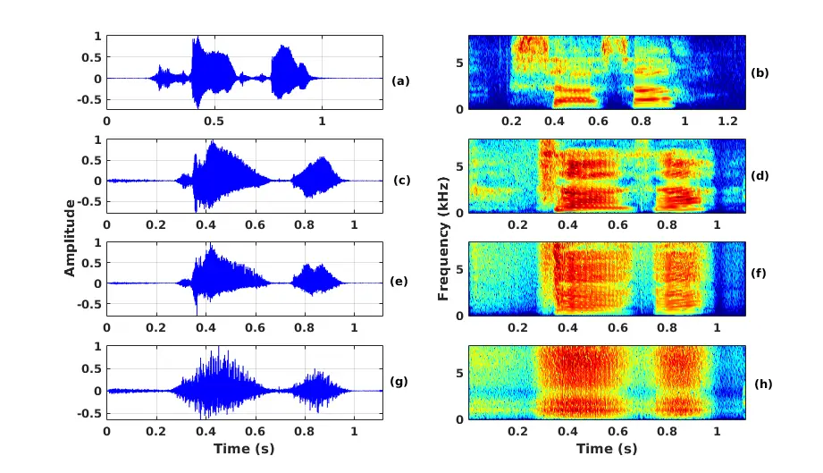
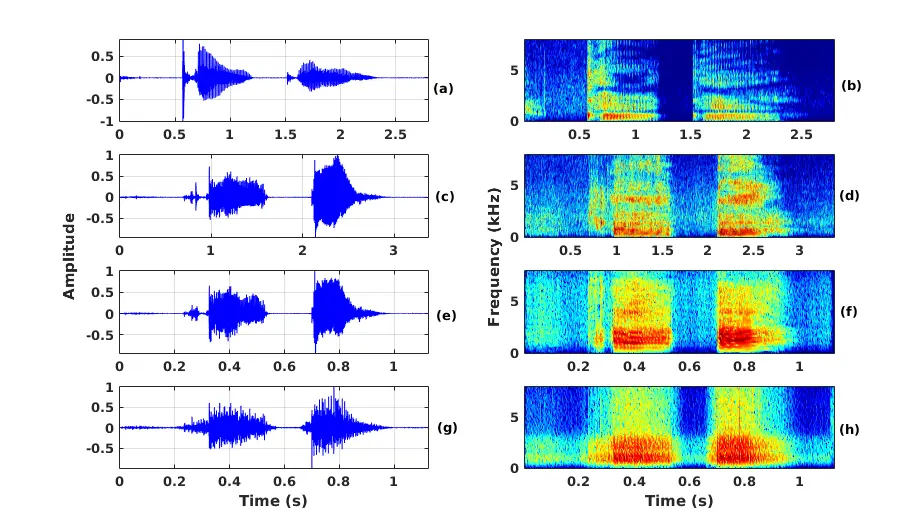
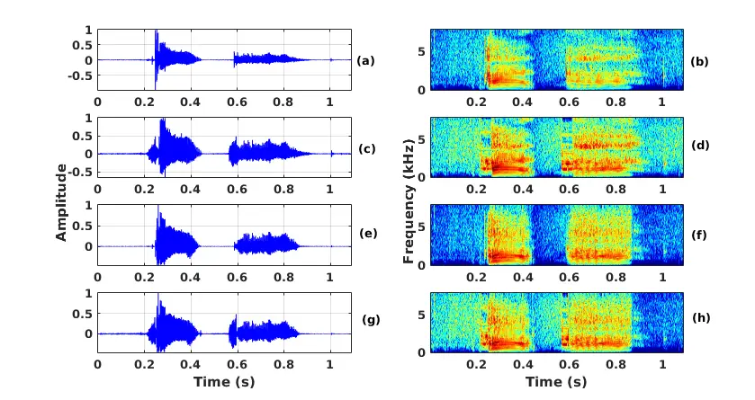
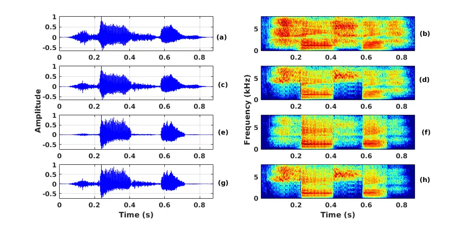

# Processing Phoneme Specific Segments for Cleft Lip and Palate Speech Enhancement

\authorblockNProtima Nomo Sudro\authorrefmark1, Rohit
Sinha\authorrefmark1, S. R. Mahadeva Prasanna\authorrefmark2
\authorblockA\authorrefmark1 Indian Institute of Technology Guwahati,
Guwahati, India  
\authorblockA\authorrefmark2 Indian Institute of Technology Dharwad,
Dharwad, India  
E-mail:{protima, rsinha}@iitg.ac.in, prasanna@iitdh.ac.in

###### Abstract

The cleft lip and palate (CLP) speech intelligibility is distorted due
to the deformation in their articulatory system. For addressing the
same, a few previous works perform phoneme specific modification in CLP
speech. In CLP speech, both the articulation error and the nasalization
distorts the intelligibility of a word. Consequently, modification of a
specific phoneme may not always yield in enhanced entire word-level
intelligibility. For such cases, it is important to identify and isolate
the phoneme specific error based on the knowledge of acoustic events.
Accordingly, the phoneme specific error modification algorithms can be
exploited for transforming the specified errors and enhance the
word-level intelligibility. Motivated by that, in this work, we combine
some of salient phoneme specific enhancement approaches and demonstrate
their effectiveness in improving the word-level intelligibility of CLP
speech. The enhanced speech samples are evaluated using subjective and
objective evaluation metrics.

Index Terms: CLP speech, articulation error, hypernasality,
intelligibility enhancement.

## 1 Introduction

Speech intelligibility is important for communication either it is in
human-human interaction mode or human-machine interaction mode \[1, 2,
3\]. Due to articulatory impairment, the intelligibility of pathological
speakers are degraded and it hinders them from communicating effectively
as speakers without speech pathology do \[4\]. Hence, researchers study
to improve the intelligibility of the pathological speech from signal
processing point of view \[5, 6, 7, 8, 9, 10\]. In this work, cleft lip
and palate (CLP) speech enhancement is addressed.

The CLP is a birth disorder which affects the speech production system.
The speech disorders occur even after clinical intervention due to
velopharyngeal dysfunction, oronasal fistula, and mislearning \[11, 12,
13\]. The CLP speech distortions are categorized into hypernasality,
hyponasality, articulation error and voice disorder \[11, 14, 15\].
Among the many speech disorders associated with CLP speech, nasalization
and articulation error are the primary factors that affect the speech
intelligibility. Hypernasality corresponds to a resonance disorder, and
the presence of nasal resonances during speech production has an
excessively perceptible nasal quality \[16\]. Mostly, the voiced sounds
are nasalized, and the nasal consonants tend to replace the obstruents
due to severe hypernasality. Misarticulations are produced either due to
the structural or functional disorder or both.

In the pathological speech enhancement literature, some of the reported
works, focus on the segmentation of the disordered phoneme followed by
modification of the same \[17, 18, 19, 2\]. In several other studies,
specific enhancement strategies are developed based on the disordered
phenomena. In the aforementioned studies, phoneme specific modifications
are attempted. These studies were effective for isolated phoneme
analysis and modification. In contrast, considering a more realistic
situation, the speech intelligibility and quality must be analyzed for
words, and phrases. In clinical settings, when CLP speech is analyzed
for enhancement tasks, the speech language pathologists (SLP), first
work on isolated phonemes. Once a CLP speaker has mastered the correct
phoneme production, the SLPs embed the phoneme in a word and analyze the
speech intelligibility of an entire word. Further, this process is
observed in a phrase and conversational speech. In a study, it is
reported that a speaker may produce a phoneme correctly in isolation,
but the same may be produced in error in a word-level and short phrases
due to the influence of phonetic contexts \[13\]. Hence, the SLPs
evaluate and attempt to enhance the CLP speech by minimizing the
influence of phonetic contexts. In the similar direction, the present
work also focuses on the word-level intelligibility via combination of
phoneme specific modification techniques reported in our earlier
works \[18, 19, 20\]. In those works, we have demonstrated the ability
to modify the phoneme specific distortions for fricative /s/, stop
consonant /k/, /t/, /T/ and vowels /a/, /i/, /u/. In the present work,
the relevant phoneme specific enhancement techniques are combined to
improve the entire word-level intelligibility.

## 2 Transforming word-level speech intelligibility

In this work, nonsensical word modification is attempted by combining
the specific phoneme modification techniques discussed in the our
earlier works. Several words are formed by the possible combinations of
the phonemes studied in the reported works. When a single transformation
method is used to modify the entire word, it is observed that the speech
sounds muffled. Thus, further processing is required to achieve a good
quality enhanced speech. various issues exist in performing the entire
word-level intelligibility because phonemes are either substituted by
other phonemes or nasal consonants or gets nasalized. Different types of
other misarticulation also affects the CLP speech intelligibility and
quality. It is challenging to detect such misarticulations in an
unsupervised method. Therefore, certain assumptions are made prior to
the enhancement task.

In CLP speech, the production of obstruents are mainly affected due to
the loss of adequate intra-oral pressure or mislearned compensatory
articulation. Due to the production error, important acoustic-phonetic
cues related to obstruents, such as transient burst, frication noise,
and formant dynamics in the adjacent sonorant’s transition region are
degraded. Therefore, it is expected that deviations in their
productions, that are reflected on the acoustic signal may be correlated
with the perceived CLP speech intelligibility. On the other hand, due to
nasalization, the voiced sounds are mostly affected. In a word, when the
obstruents are modified, distorted voiced sounds could still affect the
overall intelligibility. This renders the modification of the voiced
sounds as well. Hence, characterizing all the deviations using relevant
acoustic features and then modification of the same are expected to
provide intelligible speech. The knowledge of deviated acoustic
characteristics explored for the analysis of CLP speech in the previous
works \[20, 19, 18\] can be used to enhance the distorted word
intelligibility.

### 2.1 Database description

The database was created in collaboration with the speech language
pathologists (SLPs) of All India Institute of Speech and Hearing
(AIISH), Mysuru, India. The database consists of age and gender matched
CLP and non-CLP speakers’ speech. The non-CLP speakers served as
controls for the study. Both the CLP and non-CLP children are native
Kannada speakers. Prior to the recording, ethical consents were obtained
from the parents/caregivers of each of the participants. An overview of
the study is provided to the parents/caregivers. The study was conducted
with clearance from the AIISH Bio-behavioral ethical committee. In this
work, nonsensical words are used for analysis and modification. All the
speech samples are recorded in a sound-proof room using a speech level
meter (Bruel and Kjær) at a sampling frequency of 48 kHz and 16-bit
resolution \[21\]. The recorded speech samples are saved in a .WAV
format. The microphone was placed at a distance of 15 cm from each
speaker while recording. During recording, the instructor first uttered
the target word, then the response of the children was recorded. Each of
the expert SLP had an experience of around five years in the field of
CLP speech evaluation. The speech samples are recorded for 2-3 sessions
for each of the speaker. The total number of speakers, number of tokens,
and assessment of the distorted samples for fricatives, stops, and
vowels can be found in \[18\],  \[19\], and \[20\] respectively.

### 2.2 Modification of fricative-vowel-fricative-vowel words

Considering the combination of misarticulated fricative /s/ and vowels
/a/, /i/, and /u/ as /sasa/, /sisi/, and /susu/, the enhancement task
must address all the distorted phonemes to improve the overall speech
intelligibility and quality \[11, 12\]. The enhancement techniques
exploited in the previous works, such as spectral energy
compression \[18\], insertion \[22\], spectral conversion \[23\] and
temporal processing \[24\] are briefly discussed for word-level
intelligibility. The experimental details of the aforementioned
techniques can be found in \[20, 19, 18\].

Figure 1: Comparison of (a)-(b) non-CLP (healthy) /sasa/, (c)-(d) NAE
distorted /sasa/, (e)-(f) enhanced /sasa/ using GMM based spectral
conversion method and (g)-(h) enhanced /sasa/ using NMF based spectral
conversion method .

If spectral compression technique is to be applied to modify the entire
/sasa/ or /sisi/ or /susu/ word, then lower frequency region compression
will yield enhanced fricatives but it will deteriorate the vowels at the
same time because low-frequency energy is important for vowel
perception \[25, 26, 27, 28\]. In certain cases, if vowels are
nasalized, insertion method may be applicable but its perceptual quality
will be far from the natural speech as it may not preserve the
individuality information. Considering the temporal processing method
described in \[24\], a fine weight function is applied around the
glottal closure instants (GCI) locations to emphasize the significant
GCI events and suppress any interfering signal components around it. If
the fricative-vowel-fricative-vowel (FVFV) words are processed using
temporal processing method, it is speculated that it might not result in
effective transformation because the excitation source for fricative is
a noise source signal and with temporal processing important signal
components might get suppressed. As each of the phonemes have different
spectral and temporal phenomena, the distortions caused by the
articulatory impairment affects each phoneme differently. Further,
considering the spectral conversion method, mapping the distorted CLP
spectra to a desired speech spectra is a good strategy towards attaining
CLP speech enhancement. Hence, an attempt is made to enhance /FVFV/
words using Gaussian mixture modeling (GMM) based spectral conversion
method \[23\].

The enhanced /sasa/ word using GMM based spectral conversion is depicted
in Fig. 1 (e)-(f). After performing enhancement, it is observed that GMM
based spectral conversion of hypernasal speech results in muffled
speech. Further analysis of the modified speech signal showed that the
spectrally modified speech is observed to have low nasalization compared
to original /FVFV/ word. In Fig. 1 (c)-(d) the fricatives are ambiguous
and the overall speech quality is still degraded.

The speech degradation may be attributed to the oversmoothing effect.
Because of the oversmoothing effect the formants of the vowels are
observed to have larger bandwidth, smaller peak-to-valley ratio, and the
fricative spectrum are observed to have deviant acoustic characteristics
and spectral tilt. Several techniques are proposed in the literature to
overcome the smoothening affect, where one of the approach corresponds
to the parametric voice conversion (VC) method which is reported to
alleviate the oversmoothing effect. Therefore, nonnegative matrix
factorization (NMF) based speech enhancement is used to modify the
/FVFV/ word and shown in Fig. 1 (g)-(h) \[7\]. The modified /FVFV/ word
shows some improvement compared to original /FVFV/ word but its acoustic
characteristics are still far from that of the non-CLP /FVFV/ word shown
in Fig. 1 (a)-(b). Although some improvements are observed as reduction
in nasalization and spectral prominence in the high-frequency region for
fricatives. However, further observation showed that low frequency
energy in the fricatives persists and the formants of the vowels are not
distinct. Thus, it projects the importance of processing different class
of sound units separately.

### 2.3 Modification of consonant-vowel-consonant-vowel words

The consonant-vowel-consonant-vowel (CVCV) words consisting of the stops
/k/, /t/ and /T/ in vowel contexts /a/, /i/, and /u/ are analyzed
similar to that of the /FVFV/ described in previous section. The
possible combination of words are /kaka/, /kiki/, /kuku/, /tata/,
/titi/, /tutu/, /TaTa/, /TiTi/, and /TuTu/. The spectral compression
technique may not effectively transform the /CVCV/ word because the
spectral prominence of consonants are not confined to a specific
frequency band. For example, the velar stop /k/ is characterized by
prominent spectral energy in the low-frequency region, whereas, the
alveolar stop /t/ shows spectral prominence around mid-frequency region
and retroflex /T/ shows spectral prominence above 2 kHz. Additionally,
formants of the vowels are observed in the low-frequency region.
Therefore, spectral energy compression in the low-frequency region will
result in further deterioration of the /CVCV/ words. Further, temporal
processing will result in vowel modification only and using insertion
method artificially synthesized phoneme can be used for speech
modification. However, insertion method does not preserve the
individuality information. Hence, spectral compression, temporal
processing and insertion method might not be effective in transforming
the entire /CVCV/ word.

Figure 2: Comparison of (a)-(b) non-CLP /kaka/, (c)-(d) misarticulated
/kaka/, (e)-(f) enhanced /kaka/ using GMM based spectral conversion
method and (g)-(h) enhanced /kaka/ using NMF based spectral conversion
method.

The consonants are very short duration phonemes with dynamic
characteristics that represents different spectral and temporal
importance \[29, 30\]. The spectral prominence for consonants ranges
from low-frequency region to high-frequency region and in vowels the
lower frequency region are mostly considered to carry important
perceptual information \[22\]. Hence, the modification technique
designed for a specific category of phoneme may or may not be effective
in transforming the disordered nature of other phoneme. As stated in the
previous section, mapping the disordered speech spectra into that of the
non-CLP speech spectra may improve the speech intelligibility and
quality. Hence, the modification of /CVCV/ word is also attempted using
GMM and NMF based spectral conversion respectively.

For illustration, the transformed signals for the word /kaka/ is shown
in Fig. 2. From the figure, it is observed that the vowel formants and
the consonants in Fig. 2 (e)-(f) and Fig. 2 (g)-(h) are not similar to
non-CLP speech characteristics shown in Fig. 2 (a)-(b). Based on the
above figures, it is observed that the enhanced speech signal does not
show significant improvement relative to the original unprocessed
signal. The reason may be attributed to the complex relationship of the
misarticulations and nasality in CLP speech. Hypernasality and
articulation error both show an impact in the same word reducing the
speech intelligibility and quality. In the above figures, for an
illustration only /kaka/ is depicted. However, similar analysis are
observed for other misarticulations in the stop /t/ and /T/,
respectively. Both the NMF and GMM based spectral conversion had shown
some improvement in the speech characteristics, however, they are not
able to effectively enhanced the speech signal as desired. Therefore,
this necessitates further analysis of the signal characteristics and
then perform modification. Hence, phoneme specific enhancement can be
attempted to observe the impact on the overall speech intelligibility
and quality of a word.

## 3 Experimental evaluation

In this section, the impact of the combined phoneme specific
modification techniques are analyzed. From Fig. 1 and Fig. 2, it is
observed that when entire word is modified, all the phoneme distortions
(either fricative or consonant misarticulation or nasalization) were not
reduced as desired.

|                  |     |                  |     |                             |     |                             |     |       |     |                   |
| ---------------- | --- | ---------------- | --- | --------------------------- | --- | --------------------------- | --- | ----- | --- | ----------------- |
| Words            |     | Normal Reference |     | CLP$`{}_{\text{original}}`$ |     | CLP$`{}_{\text{modified}}`$ |     |       |     |                   |
|                  |     |                  |     |                             |     | Obstruent                   |     | Vowel |     | Obstruent + vowel |
| /FVFV/ (GS)      |     | 0.88             |     | 0.02                        |     | 0.27                        |     | 0.23  |     | 0.46              |
| /FVFV/ (PA)      |     | 0.88             |     | 0.11                        |     | 0.26                        |     | 0.22  |     | 0.44              |
| /FVFV/ (PSNAE)   |     | 0.88             |     | 0.12                        |     | 0.35                        |     | 0.21  |     | 0.49              |
| /C₁VC₁V/ (GS)    |     | 0.84             |     | 0.04                        |     | 0.11                        |     | 0.33  |     | 0.40              |
| /C₂VC₂V/ (GS)    |     | 0.81             |     | 0.12                        |     | 0.14                        |     | 0.16  |     | 0.37              |
| /C₂VC₂V/ (Velar) |     | 0.81             |     | 0.13                        |     | 0.14                        |     | 0.18  |     | 0.39              |
| /C₂VC₂V/ (PA)    |     | 0.81             |     | 0.13                        |     | 0.14                        |     | 0.19  |     | 0.42              |
| /C₃VC₃V/ (GS)    |     | 0.82             |     | 0.15                        |     | 0.17                        |     | 0.24  |     | 0.43              |
| /C₃VC₃V/ (Velar) |     | 0.82             |     | 0.18                        |     | 0.19                        |     | 0.23  |     | 0.39              |
| /C₃VC₃V/ (PA)    |     | 0.82             |     | 0.16                        |     | 0.18                        |     | 0.18  |     | 0.42              |

Table 1: P-STOI values for different combination of nonsensical words. F
denote fricative /s/, C₁ denote consonant /k/, C₂ denote consonant /t/,
C₃ denote consonant /T/, GS denote glottal stop substitution, PA denote
palatalized articulation, PSNAE denote phoneme specific nasal air
emission, and velar denote velar substitutions.

Figure 3: Illustration of waveform and spectrogram of: (a)-(b) clp
/kaka/, (c)-(d) modified /k/, (e)-(f) modified /a/, and (g)-(h) modified
/k/ and /a/.

When each of the phoneme in a word are modified independently as shown
in Fig. 3 and Fig. 4, the impact of the speech distortions are reduced
significantly. Due to severity, both articulation error and nasalization
are observed in CLP speech. To have an enhancement system capable of
performing the desired task, it is essential to improve the entire word
intelligibility.

To analyze the effectiveness of the transformation method exploited in
our earlier works, the evaluation is carried out for entire word
modification and compared with isolated phoneme modifications. At first
the impact on word-level intelligibility is evaluated for the enhanced
speech obtained by transforming only fricatives/consonants.

Figure 4: Illustration of waveform and spectrogram of: (a)-(b) clp
/sasa/, (c)-(d) modified /s/, (e)-(f) modified /a/, and (g)-(h) modified
/s/ and /a/.

In the second step, the enhanced speech obtained using only vowel
modification is evaluated. Finally, in the third step, the enhanced
speech obtained by exploiting the consonant and vowel modification both
are evaluated.

### 3.1 Objective evaluation

The modified CLP speech is assessed using pathological short-time
objective intelligibility (P-STOI) and pathological extended short-time
objective intelligibility (P-ESTOI) measures. The mathematical
descriptions of P-STOI and P-ESTOI can be found in \[31\].

The objective measures corresponding to P-STOI and P-ESTOI are noted in
Table. 1 and Table. 2, respectively. The P-STOI and P-ESTOI values are
computed for time-aligned CLP speech signals and non-CLP (reference)
signals. Before comparing the measures, word specific reference
templates are created from non-CLP speaker’s speech. The reported values
are averaged across all the listeners corresponding to the specific
errors in all the vowel contexts. P-STOI values in Table 1 indicate that
compared to original CLP speech misarticulation, modification of either
of the error (obstruents misarticulation or vowel nasalization) results
in improved intelligibility. However, from the P-STOI values, it is also
observed that modification of both the distorted obstruents and vowels
provide higher P-STOI values as compared to standalone modification.
Similar observations are also noted for the P-ESTOI values tabulated in
Table 2.

|                  |     |                  |     |                             |     |                             |     |       |     |                   |
| ---------------- | --- | ---------------- | --- | --------------------------- | --- | --------------------------- | --- | ----- | --- | ----------------- |
| Words            |     | Normal Reference |     | CLP$`{}_{\text{original}}`$ |     | CLP$`{}_{\text{modified}}`$ |     |       |     |                   |
|                  |     |                  |     |                             |     | Obstruent                   |     | Vowel |     | Obstruent + vowel |
| /FVFV/ (GS)      |     | 0.25             |     | 0.02                        |     | 0.06                        |     | 0.13  |     | 0.18              |
| /FVFV/ (PA)      |     | 0.25             |     | 0.06                        |     | 0.09                        |     | 0.16  |     | 0.22              |
| /FVFV/ (PSNAE)   |     | 0.25             |     | 0.01                        |     | 0.02                        |     | 0.15  |     | 0.24              |
| /C₁VC₁V/ (GS)    |     | 0.19             |     | 0.03                        |     | 0.07                        |     | 0.16  |     | 0.20              |
| /C₂VC₂V/ (GS)    |     | 0.31             |     | 0.09                        |     | 0.15                        |     | 0.17  |     | 0.23              |
| /C₂VC₂V/ (Velar) |     | 0.31             |     | 0.07                        |     | 0.08                        |     | 0.10  |     | 0.16              |
| /C₂VC₂V/ (PA)    |     | 0.31             |     | 0.06                        |     | 0.10                        |     | 0.17  |     | 0.23              |
| /C₃VC₃V/ (GS)    |     | 0.29             |     | 0.12                        |     | 0.17                        |     | 0.20  |     | 0.22              |
| /C₃VC₃V/ (Velar) |     | 0.29             |     | 0.15                        |     | 0.15                        |     | 0.21  |     | 0.19              |
| /C₃VC₃V/ (PA)    |     | 0.29             |     | 0.01                        |     | 0.07                        |     | 0.11  |     | 0.27              |

Table 2: P-ESTOI values for different combination of nonsensical words.
F denote fricative /s/, C₁ denote consonant /k/, C₂ denote consonant
/t/, C₃ denote consonant /T/, GS denote glottal stop substitution, PA
denote palatalized articulation, PSNAE denote phoneme specific nasal air
emission, and velar denote velar substitutions.

For an illustration, the original and modified CLP words are also
analyzed using automatic speech recognition (ASR) performance. As the
speech data for this study are in the Kannada language, a Kannada ASR
system is developed using KALDI speech recognition toolkit \[32\]. The
ASR system performance for various phoneme modification categories is
measured using phone error rate (PER) metric. The PER for the original
and modified CLP speech is shown in Table 3.

| Words            |     | CLP$`{}_{\text{original}}`$ |     | CLP$`{}_{\text{modified}}`$ |     |       |     |                   |
| ---------------- | --- | --------------------------- | --- | --------------------------- | --- | ----- | --- | ----------------- |
|                  |     |                             |     | Obstruent                   |     | Vowel |     | Obstruent + vowel |
| /FVFV/ (GS)      |     | 68.85                       |     | 56.08                       |     | 58.15 |     | 54.53             |
| /FVFV/ (PA)      |     | 59.23                       |     | 38.80                       |     | 36.83 |     | 31.58             |
| /FVFV/ (PSNAE)   |     | 63.38                       |     | 39.99                       |     | 35.28 |     | 32.97             |
| /C₁VC₁V/ (GS)    |     | 67.17                       |     | 55.44                       |     | 58.78 |     | 53.14             |
| /C₂VC₂V/ (GS)    |     | 64.30                       |     | 53.04                       |     | 59.27 |     | 52.73             |
| /C₂VC₂V/ (Velar) |     | 68.46                       |     | 59.96                       |     | 50.18 |     | 54.04             |
| /C₂VC₂V/ (PA)    |     | 49.72                       |     | 43.52                       |     | 48.06 |     | 42.98             |
| /C₃VC₃V/ (GS)    |     | 77.31                       |     | 63.09                       |     | 65.92 |     | 62.28             |
| /C₃VC₃V/ (Velar) |     | 75.26                       |     | 64.91                       |     | 67.22 |     | 63.29             |
| /C₃VC₃V/ (PA)    |     | 72.54                       |     | 61.43                       |     | 62.18 |     | 57.65             |

Table 3: Phoneme error rate (%) for various combination of nonsensical
words. F corresponds to fricative /s/, C₁ corresponds to consonant /k/,
C₂ corresponds to consonant /t/, C₃ corresponds to consonant /T/, GS
corresponds to glottal stop substitution, PA corresponds to palatalized
articulation, PSNAE corresponds to phoneme specific nasal air emission,
and velar corresponds to velar substitutions.

Compared to the original unprocessed CLP speech, the recognition
performance of the modified speech is relatively higher. The
modification of a specific phoneme also yield reduced PER value compared
to that of the original distorted CLP speech. However, better
performances are observed when both the phonemes in the word are
modified. In certain instances, the PER of the combined modification is
comparable to the standalone modification of the phoneme. This implies
that, in those utterances, the distortion caused by that specific
phoneme is dominant.

| Words            |     | CLP$`{}_{\text{original}}`$ |     | CLP$`{}_{\text{modified}}`$ |     |       |     |                   |
| ---------------- | --- | --------------------------- | --- | --------------------------- | --- | ----- | --- | ----------------- |
|                  |     |                             |     | Obstruent                   |     | Vowel |     | Obstruent + vowel |
| /FVFV/ (GS)      |     | 13.00                       |     | 11.20                       |     | 11.80 |     | 11.90             |
| /FVFV/ (PA)      |     | 12.94                       |     | 11.31                       |     | 12.23 |     | 12.29             |
| /FVFV/ (PSNAE)   |     | 13.00                       |     | 11.50                       |     | 12.18 |     | 12.26             |
| /C₁VC₁V/ (GS)    |     | 12.34                       |     | 11.91                       |     | 11.41 |     | 11.53             |
| /C₂VC₂V/ (GS)    |     | 12.73                       |     | 10.81                       |     | 11.91 |     | 11.98             |
| /C₂VC₂V/ (Velar) |     | 13.58                       |     | 10.91                       |     | 11.75 |     | 12.22             |
| /C₂VC₂V/ (PA)    |     | 13.58                       |     | 10.58                       |     | 11.90 |     | 12.13             |
| /C₃VC₃V/ (GS)    |     | 13.74                       |     | 10.85                       |     | 11.76 |     | 12.02             |
| /C₃VC₃V/ (Velar) |     | 13.80                       |     | 10.67                       |     | 11.87 |     | 12.27             |
| /C₃VC₃V/ (PA)    |     | 13.91                       |     | 10.46                       |     | 11.88 |     | 12.36             |

Table 4: MCD values for different combination of nonsensical words. F
corresponds to fricative /s/, C₁ corresponds to consonant /k/, C₂
corresponds to consonant /t/, C₃ corresponds to consonant /T/, GS
corresponds to glottal stop substitution, PA corresponds to palatalized
articulation, PSNAE corresponds to phoneme specific nasal air emission,
and velar corresponds to velar substitutions.

Considering the MCD values shown in Table 4, it is observed that the
combined modification of the obstruent and vowels, results in lower MCD
values relative to that of the original distorted CLP words. The MCD
values reported in Table 4 are averaged across all the listeners
corresponding to the specific errors in all the vowel contexts. The
lower MCD values of the modified words indicate that the spectral
difference between non-CLP (reference) and misarticulated words are
reduced significantly for all the words evaluated in the study.

In certain cases, the objective intelligibility values of combined
modifications are observed to be comparable with standalone
modification. The probable reason may be attributed to the fact that
either obstruent or vowel in the word is less distorted, hence resulting
in comparable values.

### 3.2 Subjective evaluation

Listening experiment is also carried out to assess the word-level
intelligibility by exploiting the phoneme specific modification
techniques reported in the earlier works. The speech quality of the
distorted CLP speech and the modified CLP speech is measured using a
5-point rating scale mean opinion score (MOS) where, 1 = bad, 2 = fair,
3 = good, 4 = very good, and 5 = excellent.

|                  |     |                             |     |                             |     |                 |     |                   |
| ---------------- | --- | --------------------------- | --- | --------------------------- | --- | --------------- | --- | ----------------- |
| Words            |     | CLP$`{}_{\text{original}}`$ |     | CLP$`{}_{\text{modified}}`$ |     |                 |     |                   |
|                  |     |                             |     | Obstruent                   |     | Vowel           |     | Obstruent + vowel |
| /FVFV/ (GS)      |     | 1.00$`\pm`$0.09             |     | 1.5$`\pm`$0.07              |     | 2.10$`\pm`$0.15 |     | 3.10$`\pm`$0.50   |
| /FVFV/ (PA)      |     | 1.10$`\pm`$0.15             |     | 1.54$`\pm`$0.55             |     | 2.42$`\pm`$0.26 |     | 3.92$`\pm`$0.50   |
| /FVFV/ (PSNAE)   |     | 1.50$`\pm`$0.40             |     | 1.90$`\pm`$0.60             |     | 2.50$`\pm`$0.20 |     | 3.80$`\pm`$0.20   |
| /C₁VC₁V/ (GS)    |     | 1.58$`\pm`$1.17             |     | 1.88$`\pm`$0.75             |     | 2.85$`\pm`$0.46 |     | 3.72$`\pm`$0.45   |
| /C₂VC₂V/ (GS)    |     | 1.12$`\pm`$1.11             |     | 1.53$`\pm`$0.51             |     | 2.27$`\pm`$0.47 |     | 3.57$`\pm`$0.99   |
| /C₂VC₂V/ (Velar) |     | 1.08$`\pm`$1.19             |     | 1.97$`\pm`$0.99             |     | 2.92$`\pm`$0.88 |     | 3.82$`\pm`$0.55   |
| /C₂VC₂V/ (PA)    |     | 1.94$`\pm`$0.98             |     | 2.02$`\pm`$0.58             |     | 2.80$`\pm`$0.76 |     | 3.71$`\pm`$0.87   |
| /C₃VC₃V/ (GS)    |     | 1.20$`\pm`$1.01             |     | 1.54$`\pm`$0.74             |     | 2.10$`\pm`$0.92 |     | 2.99$`\pm`$0.22   |
| /C₃VC₃V/ (Velar) |     | 1.15$`\pm`$0.83             |     | 1.72$`\pm`$1.20             |     | 2.30$`\pm`$0.57 |     | 3.05$`\pm`$1.09   |
| /C₃VC₃V/ (PA)    |     | 1.53$`\pm`$1.25             |     | 1.72$`\pm`$0.58             |     | 2.70$`\pm`$0.89 |     | 3.59$`\pm`$1.12   |

Table 5: MOS for different combination of nonsensical words. F
corresponds to fricative /s/, C₁ corresponds to consonant /k/, C₂
corresponds to consonant /t/, C₃ corresponds to consonant /T/, GS
corresponds to glottal stop substitution, PA corresponds to palatalized
articulation, PSNAE corresponds to phoneme specific nasal air emission,
and velar corresponds to velar substitutions.

A total of 10 naive listeners have participated in the study and the
speech samples were randomly numbered to avoid any bias towards the
original or modified speech. The listeners bear the knowledge of speech
science. Each of the listener have evaluated 120 speech samples (3 vowel
contexts $`\times`$ 3 fricative /s/ errors $`\times`$ 4 variations = 36,
3 vowel contexts $`\times`$ 1 stop /k/ error $`\times`$ 4 variations =
12, 3 vowel contexts $`\times`$ 3 stop /t/ errors $`\times`$ 4
variations = 36, 3 vowel contexts $`\times`$ 3 stop /T/ errors
$`\times`$ 4 variations = 36). The MOS values are derived by averaging
all the values across each vowel context of the specific word from all
the listeners. The averaged MOS values shown in Table 5 indicate that
the modification of all phonemes provide significant improvement
compared to the original and standalone modified CLP speech.

This study has been performed on speech data collected in clinical
settings from children having mild to moderate CLP speech disorder. The
scope of the work is limited to studying specific CLP speech distortions
in isolated phonemes in the context of /CVCV/ words with identical /CV/
pairs. The study primarily focuses on enhancing a few select obstruents
and vowels. Later, it is extended to some nonsensical /CVCV/ words that
can be formed by combining the studied obstruents and vowels. The
proposed system is developed based on certain assumptions in a
controlled environment. Therefore, realization of the proposed
techniques in real-time deserves future explorations.

## 4 Conclusion

The word-level intelligibility is attempted by combining the specific
phoneme modifications discussed in our previous works. A comparison
study is also done to observe whether the transformation method
exploited in our earlier works can improve the entire word
intelligibility. When the transformation method is used to modify the
word as a whole, it is observed that the speech sounds muffled. Hence,
phoneme specific modifications are exploited to observe its impact in
word intelligibility. From the evaluation results, it is observed that,
a significant improvement in the word-level intelligibility can be
achieved when all phonemes in the words are modified independently.

## 5 Acknowledgement

The authors would like to thank Dr. M. Pushpavathi and Dr. Ajish
Abraham, AIISH Mysore, for providing insights about CLP speech disorder.
The authors would also like to acknowledge the research scholars of IIT
Guwahati for their participation in the perceptual test. This work is in
part supported by a project entitled “NASOSPEECH: Development of
Diagnostic system for Severity Assessment of the Disordered Speech”
funded by the Department of Biotechnology (DBT), Govt. of India.

## References

- \[1\] A. B. Kain, J.-P. Hosom, X. Niu, J. P. van Santen,
  M. Fried-Oken, and J. Staehely, “Improving the intelligibility of
  dysarthric speech,” _Speech Communication_, vol. 49, no. 9, pp.
  743–759, 2007.
- \[2\] F. Rudzicz, “Adjusting dysarthric speech signals to be more
  intelligible,” _Computer Speech & Language_, vol. 27, no. 6, pp.
  1163–1177, 2013.
- \[3\] K. Nakamura, T. Toda, H. Saruwatari, and K. Shikano,
  “Speaking-aid systems using GMM-based voice conversion for
  electrolaryngeal speech,” _Speech Communication_, vol. 54, no. 1, pp.
  134–146, 2012.
- \[4\] T. L. Whitehill, “Assessing intelligibility in speakers with
  cleft palate: a critical review of the literature,” _The Cleft
  Palate-Craniofacial Journal_, vol. 39, no. 1, pp. 50–58, 2002.
- \[5\] Y.-H. Lai and W.-Z. Zheng, “Multi-objective learning based
  speech enhancement method to increase speech quality and
  intelligibility for hearing aid device users,” _Biomedical Signal
  Processing and Control_, vol. 48, pp. 35–45, 2019.
- \[6\] F. Biadsy, R. J. Weiss, P. J. Moreno, D. Kanevsky, and Y. Jia,
  “Parrotron: An end-to-end speech-to-speech conversion model and its
  applications to hearing-impaired speech and speech separation,” in
  _Proceedings of Interspeech_, 2019, pp. 4115–4119.
- \[7\] S.-W. Fu, P.-C. Li, Y.-H. Lai, C.-C. Yang, L.-C. Hsieh, and
  Y. Tsao, “Joint dictionary learning-based non-negative matrix
  factorization for voice conversion to improve speech intelligibility
  after oral surgery,” _IEEE Transactions on Biomedical Engineering_,
  vol. 64, no. 11, pp. 2584–2594, 2017.
- \[8\] R. Aihara, R. Takashima, T. Takiguchi, and Y. Ariki,
  “Individuality-preserving voice conversion for articulation disorders
  based on non-negative matrix factorization,” in _Proceedings of IEEE
  International Conference on Acoustics, Speech and Signal Processing
  (ICASSP)_, 2013, pp. 8037–8040.
- \[9\] K. Xiao, S. Wang, M. Wan, and L. Wu, “Reconstruction of mandarin
  electrolaryngeal fricatives with hybrid noise source,” _IEEE/ACM
  Transactions on Audio, Speech and Language Processing (TASLP)_,
  vol. 27, no. 2, pp. 383–391, 2019.
- \[10\] N. Bi and Y. Qi, “Application of speech conversion to
  alaryngeal speech enhancement,” _IEEE Transactions on Speech and Audio
  Processing_, vol. 5, no. 2, pp. 97–105, 1997.
- \[11\] A. W. Kummer, _Cleft Palate & Craniofacial Anomalies: Effects
  on Speech and Resonance_. Nelson Education, 2013.
- \[12\] S. J. Peterson-Falzone, M. A. Hardin-Jones, and M. P. Karnell,
  _Cleft Palate Speech_. Mosby St. Louis, 2001.
- \[13\] G. Henningsson, D. P. Kuehn, D. Sell, T. Sweeney, J. E.
  Trost-Cardamone, and T. L. Whitehill, “Universal parameters for
  reporting speech outcomes in individuals with cleft palate,” _The
  Cleft Palate-Craniofacial Journal_, vol. 45, no. 1, pp. 1–17, 2008.
- \[14\] M. Scipioni, M. Gerosa, D. Giuliani, E. Nöth, and A. Maier,
  “Intelligibility assessment in children with cleft lip and palate in
  Italian and German,” in _Tenth Annual Conference of the International
  Speech Communication Association_, 2009.
- \[15\] A. Maier, C. Hacker, E. Noth, E. Nkenke, T. Haderlein,
  F. Rosanowski, and M. Schuster, “Intelligibility of children with
  cleft lip and palate: Evaluation by speech recognition techniques,” in
  _18th International Conference on Pattern Recognition (ICPR)_,
  vol. 4. IEEE, 2006, pp. 274–277.
- \[16\] P. Grunwell and D. Sell, “Speech and cleft
  palate/velopharyngeal anomalies,” _Management of Cleft Lip and Palate.
  London: Whurr_, 2001.
- \[17\] C. Vikram, N. Adiga, and S. M. Prasanna, “Spectral enhancement
  of cleft lip and palate speech.” in _Proceedings of Interspeech_,
  2016, pp. 117–121.
- \[18\] P. N. Sudro and S. M. Prasanna, “Modification of misarticulated
  fricative /s/ in cleft lip and palate speech,” _Biomedical Signal
  Processing and Control_, vol. 67, p. 102088, 2021.
- \[19\] P. N. Sudro, C. Vikram, and S. M. Prasanna, “Event-based
  transformation of misarticulated stops in cleft lip and palate
  speech,” _Circuits, Systems, and Signal Processing_, vol. 40, no. 8,
  pp. 4064–4088, 2021.
- \[20\] P. N. Sudro and S. M. Prasanna, “Enhancement of cleft palate
  speech using temporal and spectral processing,” _Speech
  Communication_, vol. 123, pp. 70–82, 2020.
- \[21\] _Bruel and Kjaer_, 1942, https://www.bksv.com/en.
- \[22\] K. Singh and N. Tiwari, “The structure of Hindi stop
  consonants,” _The Journal of the Acoustical Society of America_, vol.
  140, no. 5, pp. 3633–3642, 2016.
- \[23\] Y. Stylianou, O. Cappé, and E. Moulines, “Continuous
  probabilistic transform for voice conversion,” _IEEE Transactions on
  Speech and Audio Processing_, vol. 6, no. 2, pp. 131–142, 1998.
- \[24\] P. Krishnamoorthy and S. R. M. Prasanna, “Enhancement of noisy
  speech by temporal and spectral processing,” _Speech Communication_,
  vol. 53, no. 2, pp. 154–174, 2011.
- \[25\] K. N. Stevens, _Acoustic phonetics_. MIT press, 2000, vol. 30.
- \[26\] S. Narayanan and A. Alwan, “Noise source models for fricative
  consonants,” _IEEE Transactions on Speech and Audio processing_,
  vol. 8, no. 3, pp. 328–344, 2000.
- \[27\] C. H. Shadle, “The acoustics of fricative consonants,” 1985.
- \[28\] C. H. Shadle and S. J. Mair, “Quantifying spectral
  characteristics of fricatives,” in _Proceedings of 4th International
  Conference on Spoken Language Processing (ICSLP)_, vol. 3, 1996, pp.
  1521–1524.
- \[29\] A. Prathosh, A. Ramakrishnan, and T. Ananthapadmanabha,
  “Estimation of voice-onset time in continuous speech using temporal
  measures,” _The Journal of the Acoustical Society of America_, vol.
  136, no. 2, pp. EL122–EL128, 2014.
- \[30\] P. C. Delattre, A. M. Liberman, and F. S. Cooper, “Acoustic
  loci and transitional cues for consonants,” _The Journal of the
  Acoustical Society of America_, vol. 27, no. 4, pp. 769–773, 1955.
- \[31\] P. Janbakhshi, I. Kodrasi, and H. Bourlard, “Pathological
  speech intelligibility assessment based on the short-time objective
  intelligibility measure,” in _Proceedings of IEEE International
  Conference on Acoustics, Speech and Signal Processing (ICASSP)_, 2019,
  pp. 6405–6409.
- \[32\] D. Povey, A. Ghoshal, G. Boulianne, L. Burget, O. Glembek,
  N. Goel, M. Hannemann, P. Motlicek, Y. Qian, P. Schwarz _et al._, “The
  kaldi speech recognition toolkit,” in _IEEE 2011 workshop on automatic
  speech recognition and understanding_, no. CONF. IEEE Signal
  Processing Society, 2011.
