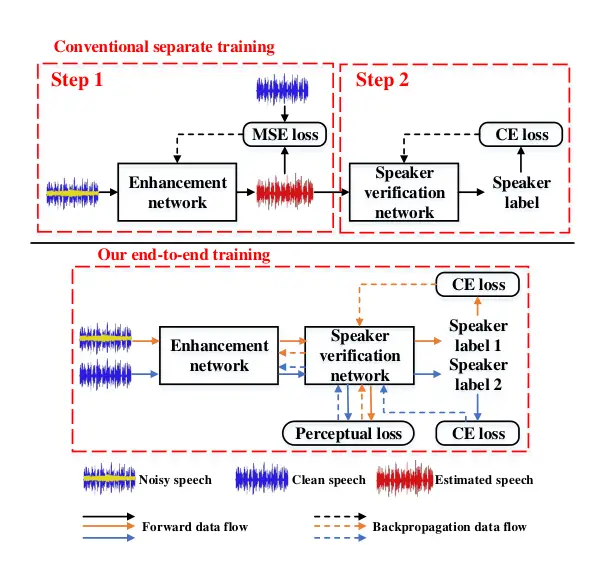
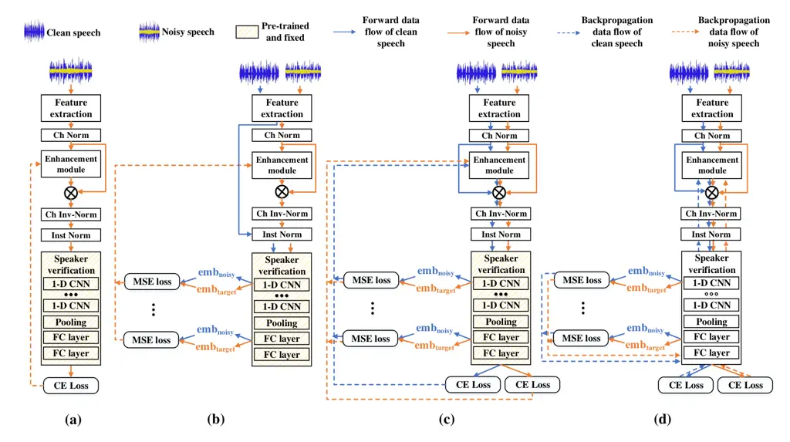

# PL-EESR: PERCEPTUAL LOSS BASED END-TO-END ROBUST SPEAKER REPRESENTATION EXTRACTION

Yi Ma    Kong Aik Lee    Ville Hautamäki    Haizhou Li ^(†)^(†)thanks:
This research / project is supported by Science and Engineering Research
Council, Agency of Science, Technology and Research (A\*STAR),
Singapore, through the National Robotics Program under Human-Robot
Interaction Phase 1(Grant No. 192 25 00054), its RIE 2020 Advanced
Manufacturing and Engineering Human (AME) Programmatic Grant (Grant No.
A18A2b0046) and its Feasibility Study Scheme (Project No. FS-2021-001).

###### Abstract

Speech enhancement aims to improve the perceptual quality of the speech
signal by suppression of the background noise. However, excessive
suppression may lead to speech distortion and speaker information loss,
which degrades the performance of speaker embedding extraction. To
alleviate this problem, we propose an end-to-end deep learning
framework, dubbed PL-EESR, for robust speaker representation extraction.
This framework is optimized based on the feedback of the speaker
identification task and the high-level perceptual deviation between the
raw speech signal and its noisy version. We conducted speaker
verification tasks in both noisy and clean environment respectively to
evaluate our system. Compared to the baseline, our method shows better
performance in both clean and noisy environments, which means our method
can not only enhance the speaker relative information but also avoid
adding distortions.

###### Index Terms: 

Perceptual Loss, End-to-end training, Speaker representation, Speech
enhancement

^(†)^(†)address: ¹Department of Electrical and Computer Engineering,
National University of Singapore, Singapore  
²Institute for Infocomm Research, A\*STAR, Singapore  
³School of Computing, University of Eastern Finland, Finland

## 1 Introduction

Speaker embedding refers to a fixed-length continuous-valued vector
extracted from a variable-length utterance \[1\]. In speaker
verification, the extracted speaker embedding is forwarded to the
backend classifier. It is important that a speaker embedding
charaterizes well the speaker’s individuality. Ideal speaker embedding
contains solely the speaker information so that extracted speaker
embeddings are similar for the same speaker, and very different between
speakers. Traditionally, GMM supervectors \[2, 3\] and i-vector \[4\]
were used to extract speaker embedding. With the development of deep
learning, d-vector \[5\] and x-vector \[6\] were proposed recently. The
basic hypothesis of all of these extraction methods is that the speaker
embedding contains solely one speaker’s information. However, in the
presence of background noise and interference, it is difficult to record
only the voice of the interested speaker.



Figure 1: A diagram illustrating noise-robust speaker representation
using a separate training scheme (top panel), and an end-to-end training
scheme (bottom panel).

In this work, we seek to extract consistent speaker embedding for a
monaural utterance under either noisy or clean conditions.

Speech enhancement, which aims to keep the target signal of interest and
filter out additive background noise \[7\], is a conventional method for
handling noisy utterances. Recently, deep learning based methods have
shown significant improvement over the classical methods. These methods
usually generate a mask imposed element-wise on the original signal to
estimate the underlying clean signal \[8, 9, 10, 11, 12, 13\]. Usually
the model is trained using mean square loss on noisy samples and
targets. This function only guarantees proximity of the enhanced speech
to clean speech and simply accounts for the averaged errors, which leads
to artifacts in the output. It has been observed that speaker
recognition accuracy is often hurt by first enhancing the speech signal
and then performing the recognition \[14, 15\].

In addition to using classification loss, we can use also task-specific
loss, such as perceptual loss, or also called deep feature loss \[16\].
Perceptual loss is based on the difference of high-level feature
representations extracted from a pre-trained auxiliary network. It was
first proposed to deal with the image style transfer and
super-resolution task \[16\]. This idea can be generalized for example
to speaker verification task-specified enhancement training \[17, 18\].
The approach used in \[17, 18\] is similar to our method to compare the
activation of enhanced and referenced signals using the auxiliary
network. However, one drawback of \[17, 18\] is that the auxiliary
network is different from the speaker representation network although
these two models are trained using the same task. The number of the
total parameters in their system is up to 26.1M, which is larger than a
standard x-vector network. This also means that they adopt a two-stage
training strategy and the enhancement model is independent of the
speaker verification model. Another drawback is that the perceptual loss
used in \[17, 18\] relies heavily on clean speech as a training target
which we need to select manually. In this paper, we propose an
end-to-end joint training network, of which the total number of
parameters is 9.8M. And we modified the perceptual loss to make it work
for clean utterances as well.

Recent research suggests an end-to-end scheme that combines the speech
enhancement task with another downstream speech task \[19\] because it
reduces the distortion. As for joint training of speech enhancement with
speaker verification, similar work is \[20\], in which the enhancement
module is trained using the loss function of speaker identification task
to improve the accuracy of speaker verification in both clean and noisy
conditions. Although their method shows improvement for speaker
verification, intuitively the proposed VoiceID loss based on softmax
only tries to enlarge the inter-class differences among different
speakers. However, a robust speaker representation network should not
only maximize the inter-class distance but also minimize the intra-class
variations of the learned embeddings. For this reason, we proposed the
PL-EESR model, which focused on both inter-class and intra-class
distance efficiently.

The contribution of this paper is twofold. Firstly, we proposed a robust
end-to-end speaker representation network optimized using perceptual
loss and cross entropy loss. Our model contains two parts: a
task-specific enhancement module and a speaker embedding extraction
module. During training, firstly these two modules are pre-trained in
proper order: the embedding extraction module is trained on speaker
identification task and fixed first; then the enhancement module is
trained using cross entropy loss and perceptual loss with the embedding
extraction module as an auxiliary network. Secondly, these two modules
are fine-tuned simultaneously to reduce potential mismatch. The idea is
illustrated in Fig. 1 To verify the effectiveness of our proposed
network, we performed a speaker verification task on the development and
evaluation part of Speaker In The Wild(SITW). The SITW is viewed as a
high SNR condition in our work. We also simulated a noisy SITW by
corrupting SITW with background noise. This noisy SITW is set as low SNR
condition.

## 2 perceptual loss

### 2.1 Problem description

Let us denote the $`X`$ to be the log-mel spectrogram of a noisy
utterance. The utterance is corrupted by the additive background noise
so that it can be written as $`X=S+N`$, where $`S`$ and $`N`$ are
log-mel spectrogram of the clean utterance and the noise. The target of
speech enhancement in our work is to estimate a mask $`M`$ and we can
get the estimated clean spectrogram $`\hat{S}`$ by the element-wise
multiplication of the mask and the input utterance:
$`\hat{S}=X\otimes M`$.

Conventionally, a speech enhancement network is trained using the
Euclidean distance between the estimated clean spectrogram and the
ground-truth: $`\mathcal{L}(S,\hat{S})=\rVert S-\hat{S}\rVert_{2}`$.
However, this method may cause some speaker related information loss or
distortion in the resultant enhanced spectrogram. If we apply the
enhanced spectrogram on the speaker embedding extraction task directly,
it may cause degraded performance, especially for high SNR conditions.
We believe this is because the Euclidean distance can not capture the
perceptual difference between estimated and ground-truth spectrogram.

[TABLE]

Table 1: Dataset and loss function for each stage.

### 2.2 Perceptual loss

It is believed that a trained deep network shows different activations
in their hidden layers, which helps the model to learn characteristics
from the input feature. Based on this assumption, the perceptual loss,
which is the distance of activations in hidden layers of the trained
auxiliary network with estimated and ground-truth spectrogram as input
respectively, is proposed in \[16\].

According to the principle of perceptual loss, the auxiliary network
decides what information to be kept. In this paper, our goal is to
enhance the speaker relative information. Therefore, the speaker
verification network can be trained first, then it is fixed as the
auxiliary network to extract perceptual loss for the enhancement module:

```math
\mathcal{L}(X)=\sum_{i=1}^{j}\rVert\phi_{i}(X)-\phi_{i}(\theta(X))\rVert_{2} \tag{1}
```

where the $`\theta`$ and the $`\phi`$ are the enhancement module and
auxiliary speaker embedding extraction module respectively, and
$`\phi_{i}`$ denotes the $`i_{th}`$ layer of embedding extraction
module. Equation (1) is what \[17, 18\] used.

## 3 METHOD

### 3.1 Architecture

We now introduce the end-to-end model that incorporates enhancement
process and speaker representation together. The flow chart is
illustrated in Fig. 2 (d).

As shown in Fig. 2 (d), at first, the feature (30-dimensional log-Mel
spectrogram) is extracted from the speech signal in the time domain. It
was used for both the enhancement module and the representation module.

To remove the effect of the corpus channel, as mentioned in \[21\], we
applied the channel normalization to help the enhancement module
converge rapidly. The mean $`\mu`$ and standard deviation $`\sigma`$ of
the clean and noisy channel are computed using the clean and noisy
training set respectively. Noisy utterance is normalized before
enhancement, as follow:

```math
X(k)\leftarrow\frac{X(k)-\mu_{n}(k)}{\sigma_{n}(k)^{2}} \tag{2}
```

An inverse normalization is then performed on the enhanced speech:

```math
\hat{S}(k)\leftarrow\hat{S}(k)\times\sigma_{c}(k)^{2}+\mu_{c}(k) \tag{3}
```

where $`\sigma_{n}`$ and $`\mu_{n}`$ are the statistical parameters of
the noisy training set, and $`\sigma_{c}`$ and $`\mu_{c}`$ are
corresponding clean version. The $`k`$ denotes the index of Mel-filter
and $`X(k)`$ is the feature corresponding to $`k_{th}`$ Mel-filter.
After the inverse-channel-normalization, instance normalization is
applied before speaker representation extraction:

```math
\hat{s}_{i}(k)\leftarrow\frac{\hat{s}_{i}(k)-\mu_{i}(k)}{\sigma_{i}(k)^{2}} \tag{4}
```

where $`\sigma_{i}`$ and $`\mu_{i}`$ are the statistical parameters of
each utterance $`\hat{s}_{i}`$.

To exploit the temporal context information effectively, three
bidirectional long short-term memory (BLSTM) layers and one
fully-connected layer are stacked as the enhancement module. The number
of features in the hidden state of BLSTM is 128. The activation of the
sigmoid is applied on the output of fully-connected layer to generate
the mask in the range 0 to 1.

Our verification module adopts the x-vector. The first five TDNN layers
extract frame-level information. Then two fully connected layers extract
information in utterance-level. The two phases are connected by a global
average pooling layer. Since we don’t know the effect of activation in
each layer on our task, all of the five TDNN layers and the first fully
connected layer are used to compute perceptual loss in the training
stage. The speaker embedding was extracted from the first fully
connected layer during inference.

### 3.2 Training strategy

The perceptual as in (1) was used in \[17\] to train the speech
enhancement network. The idea is illustrated in Fig. 2(b): the clean
utterance is used as the target and the noisy utterance is trained to
show the same activations of the auxiliary network as the target does.
However, the gradient of (1) only concerns the enhancement for noisy
utterance. It may cause some potential detrimental to the clean
utterance. Therefore, we propose the training scheme as in Fig. 2(c) and
(d): the mask is generated and applied on clean utterance as well, and
the enhancement module is optimized using the gradient of both noisy
utterance and clean utterance. The goal of the enhancement module is to
make sure the noisy utterance and the clean utterance have a consistent
representation. So the perceptual loss in our system is modified as:

```math
\mathcal{L}_{pcptl}(\theta(X),\theta(S))=\sum_{i=1}^{j}\rVert\phi_{i}(\theta(X))-\phi_{i}(\theta(S))\rVert_{2} \tag{5}
```

where the $`X`$ and $`S`$ are the noisy and clean utterance
respectively. As mentioned in Section 3.1, $`j`$ equals $`6`$ in our
case.



Figure 2: Block diagrams of (a) optimizing speech enhancement module
using cross entropy loss; (b) optimizing speech enhancement module using
perceptual loss on noisy speech; (c)optimizing speech enhancement module
using cross entropy loss and perceptual loss on both noisy and clean
speech; (d)optimizing speech enhancement and speaker extraction modules
jointly using cross entropy loss and perceptual loss on both noisy and
clean speech. The “Ch Norm” and “Ch Inv-Norm” denote channel
normalization and channel inverse-normalization, “Inst Norm” is the
instance normalization.

A good speaker representation network should minimize the distance
between the utterances belonging to the same speaker, while maximize the
distance of different speakers in embedding vector space. The cross
entropy loss in (6) is a common loss function in the classification
problem to enlarge the distance of different speakers.

```math
\mathcal{L}_{ce}(\phi(\theta(S)),y)=-log\frac{exp(\phi(\theta(S))[y])}{\sum_{y^{\prime}}exp(\phi(\theta(S))[y^{\prime}])} \tag{6}
```

In our case, the $`\phi(\theta(S))`$ is the speaker label estimated by
the speaker representation module following the speech enhancement
process, and $`y`$ is the ground-truth speaker label. Intuitively, the
softmax in (6) enlarge the intra-class discrimination, but it shows no
effect on inter-class distance. To remedy this limitation, we train our
system using cross entropy loss and perceptual loss jointly:

```math
\mathcal{L}=\lambda\times\mathcal{L}_{pcptl}+(1-\lambda)\times\mathcal{L}_{ce} \tag{7}
```

where the perceptual loss can be viewed as the criterion for inter-class
distance. The $`\lambda`$ is a constant for balancing the intra-class
and inter-class distance. We set the value of $`\lambda`$ as 0.5 in our
work. (Code is available online¹¹ 1 Source code:
https://github.com/mmmmayi/PL-EESR.)

## 4 Experiments

### 4.1 Datasets

Training set: we combine VoxCeleb1 and VoxCeleb2 \[22\] as our training
set. Background noise in this dataset is inevitable because it is
collected from YouTube. But we still set samples in this dataset as
clean utterances in our experiment and we name it as vox_clean. It
should be noted that speakers who are in both VoxCele2 and Speakers in
the Wild (SITW) \[23\] are removed from voxceleb2 because we use the
SITW as our test set. The vox_clean is augmented with noise drawn from
MUSAN \[24\] and is convolved with simulated RIRs \[25\]. The
augmentation process is based on Kaldi SITW/v2 recipe \[26\]. The
augmented vox_clean is called vox_clean_aug. To simulate speech in noisy
conditions, we corrupt the vox_clean using the noise randomly selected
from MUSAN as noisy utterance. The SNR of each noisy utterance is
randomly selected from the range of 0 to 20 excluding
$`\{0,5,10,15,20\}`$. This data set is named vox_noisy. Each sample in
the vox_noisy has a corresponding clean version in the vox_clean. To be
consistent with the vox_clean_aug, the vox_noisy is augmented in the
same procedure and we call it vox_noisy_aug.  
Test set: We use two datasets to evaluate the performance of our method
in noisy and clean conditions. The first dataset is SITW. Being similar
to VoxCeleb, the speech in SITW is collected from open-source media
channels as well. We use the development and evaluation part core-core
condition of SITW to evaluate our network in clean condition. We
generated the noisy Speakers in the Wild (NSITW) as our second test set.
The noise used to corrupt the SITW is provided by DNS-challenge \[27\].
We manually select the noise categories which are similar to MUSAN
(bubble, music and plain noise). Totally 282 categories are used and the
SNR of each noisy utterance in NSITW is randomly selected from set
$`\{0,5,10,15,20\}`$. The NSITW is used to evaluate the performance of
our model in noisy conditions.

### 4.2 Feature

In VoxCeleb1 and VoxCeleb2, multiple scenarios were given for each
speaker, and there are several utterances in each scenario. We
concatenated utterances in the same scenario to one training utterance.
We generate 30-D log Mel-spectrogram as the feature from each training
utterance. The sample rate of all utterances in our work is 16kHz. Our
feature is extracted with a Hann window of 400 frames width and 160
frames hop size. This feature is used for both speech enhancement module
and speaker representation module, but we need to note that mean and
variance normalization (MVN) is performed only for speaker
representation. The training utterance whose length is less than 500
frames and the speaker whose utterance amount is less than 10 are
removed. Therefore, there are 5916 speakers in the training set. We
randomly clipped a consecutive 300-frame segment from each training
utterance to optimize our network during training. We do not use voice
activity detection in the training stage because the silence segment has
been removed from VoxCeleb1 and VoxCeleb2, but energy based voice
activity detection is performed in the test stage.

### 4.3 Training

Our training process includes two stages: pre-training stage and
finetune stage.

For the pre-training stage, firstly, we trained our speaker
representation module (Pre-training 1) with a batch size of 512 and
optimizer of stochastic gradient descent (SGD). The initial learning
rate is 0.2 and it decreases by half when the loss decrease ratio in
each epoch is less than 0.01. The early stopping scheme was applied as
soon as the learning rate decreases twice in succession. As shown in
Table 1, the vox_clean_aug is used to pre-train the speaker
representation module. Only the cross entropy loss on the speaker label
is used in this stage. We use the trained speaker representation module
as one of our baseline models to show the effect of speech enhancement
as well.

The trained speaker representation module is fixed as the auxiliary
network to pre-train our speaker enhancement module (Pre-training 2).
The enhancement module is optimized using the perceptual loss and cross
entropy loss jointly. As summarized in Table 1, three pairs of clean and
noisy utterance are used in this stage. For vox_noisy, their clean data
is the corresponding sample in vox_clean. For vox_noisy_aug, two types
of augmentation are included just like vox_clean_aug. When utterances in
vox_noisy are augmented with MUSAN, we expect our enhancement module to
remove the effect of augmentation as well. So the clean data for these
utterances are their corresponding utterances in vox_clean. However, for
the utterances in vox_noisy_aug which are convolved with RIRs, we don’t
expect our enhancement work for dereverberation. So their corresponding
clean utterances should come from vox_clean_aug in which samples
augmented with RIRs. The batch size of this stage is 128, which includes
64 noisy utterances and their clean version. We use the Adadelta
optimizer and initial learning rate of 0.3 in this stage. The learning
rate decrease and early stopping scheme are identical with Pre-training

1.

After pre-training, the speech enhancement module and speaker
representation module are finetuned together to reduce potential
mismatch. Except the initial rate is 0.0001 in this stage, both training
setting and data set are same as what we used in Pre-training 2.

### 4.4 Evaluation

To evaluate the performance of our system to extract robust speaker
representation in both clean and noisy environments, we conduct the
speaker verification task using both SITW and NSITW. In the inference
stage, vox_noisy_aug passing through the enhancement module is used to
train the PLDA backend. The Equal Error Rate (EER) and minimum Detection
Cost Function (minDCF) with target prior $`p=0.05`$ are used to evaluate
our system.

### 4.5 Baseline

As we mentioned in Section 4.3, one of our baseline models is our
proposed model without speech enhancement module (PL-EESR w/o enh),
which is used to compare the effect of speech enhancement on our system.
Then we use the standard x-vector as our second baseline model
(x-vector). We trained the model using the Kaldi SITW/v2 recipe. We set
the x-vector as the state-of-the-art model for the speaker verification
task. We trained PL-EESR w/o enh using the setting of Pre-training 1
which is introduced in Section 4.3. This is the difference between it
and x-vector.

## 5 Results

| Test set | System          | Dev   |        |     | Eval  |        |
| -------- | --------------- | ----- | ------ | --- | ----- | ------ |
|          |                 | EER   | DCF    |     | EER   | DCF    |
| SITW     | x-vector        | 2.965 | 0.1946 |     | 3.417 | 0.2241 |
|          | PL-EESR w/o enh | 3.656 | 0.2215 |     | 3.442 | 0.2210 |
|          | PL-EESR         | 2.851 | 0.1805 |     | 2.460 | 0.1690 |
| NSITW    | x-vector        | 6.816 | 0.3685 |     | 7.190 | 0.4131 |
|          | PL-EESR w/o enh | 7.470 | 0.3835 |     | 8.066 | 0.4550 |
|          | PL-EESR         | 4.698 | 0.3007 |     | 5.272 | 0.3334 |

Table 2: Comparison of our PL-EESR with two baseline models on SITW and
NSITW.

| Test set | System | Training | CE Loss Objective | Perceptual Loss Objective | Dev   |        |     | Eval  |        |
| -------- | ------ | -------- | ----------------- | ------------------------- | ----- | ------ | --- | ----- | ------ |
|          |        |          |                   |                           | EER   | DCF    |     | EER   | DCF    |
| SITW     | \(a\)  | Separate | Noisy             | \-                        | 2.734 | 0.1906 |     | 2.788 | 0.1833 |
|          | \(b\)  | Separate | \-                | Noisy                     | 3.812 | 0.2274 |     | 3.827 | 0.2400 |
|          | \(c\)  | Separate | Noisy; Clean      | Noisy; Clean              | 2.811 | 0.1919 |     | 2.570 | 0.1804 |
|          | \(d\)  | Joint    | Noisy; Clean      | Noisy; Clean              | 2.851 | 0.1805 |     | 2.460 | 0.1690 |
| NSITW    | \(a\)  | Separate | Noisy             | \-                        | 5.930 | 0.3351 |     | 5.931 | 0.3706 |
|          | \(b\)  | Separate | \-                | Noisy                     | 7.624 | 0.3951 |     | 8.124 | 0.4611 |
|          | \(c\)  | Separate | Noisy; Clean      | Noisy; Clean              | 5.160 | 0.3161 |     | 5.632 | 0.3539 |
|          | \(d\)  | Joint    | Noisy; Clean      | Noisy; Clean              | 4.698 | 0.3007 |     | 5.272 | 0.3334 |

Table 3: Comparison of our end-to-end training scheme with different
training settings. “Joint” and “Separate” denote whether the enhancement
module and speaker representation module are fine-tuned together.
“Noisy” and “Clean” denote whether the network is optimized on the
gradient of noisy utterance or clean utterance.

### 5.1 Baseline results

Table 2 shows the comparison of the baselines and our PL-EESR on the
development set and evaluation set of SITW (top) and NSITW (bottom)
respectively. The text in bold is the best performance for each metric
in different conditions. We can find in clean condition, compared
without enhancement processing, our method achieves 28.5% and 23.5%
relative improvements in terms of EER and minDCF respectively in
evaluation set, 22.0% and 18.5% in the development set. In a noisy
environment, the relative improvements in terms of EER and minDCF are
34.6% and 26.7% for the evaluation set, 37.1% and 21.6% for the
development set. Compared to the standard x-vector, which can be seen as
the state of the art model for speaker representation, the relative
improvements are 28.0% and 24.6% in terms of EER and minDCF for
evaluation set, 3.8% and 7.2% for the development set for SITW. For
NSITW, the improvements in evaluation set and development set are 26.7%,
19.3% and 31.1%, 18.4% respectively.

We can conclude from this comparison that our proposed method is
beneficial to speaker representation extraction from both clean and
noisy utterances.

### 5.2 Overall comparisons

Table 3 shows the performance of our end-to-end model with different
training settings. Firstly, we trained the speech enhancement module and
speaker verification module separately to verify the effect of the
perceptual loss, which means there is no finetune stage in System
(a)-(c) in Table 3 and all of these three systems are optimized in the
stage of Pre-training 2. In the first experiment, we use only the
feedback of the speaker classification task, which is the cross entropy
loss on predicted speaker ID with noisy utterance as input. The system
flow chart is shown in 2(a), and this training scheme is based on the
basic idea in \[20\]. The results are summarized as System (a) in Table 3.

System (b) is the original perceptual loss used in \[17\]. In this
experiment, the clean utterance is set as the target and the module is
trained on the gradient of noisy utterance as shown in 2 (b). This
performance is summarized in System (b) in Table 3.

Then we modified the perceptual loss function. Since the cross entropy
loss on the speaker label can be used to enlarge the inter-class
distance, the perceptual loss in our system focus on decrease the
intra-class distance. Specifically, after computing the perceptual loss,
the module is optimized on both the gradient of noisy utterance and
clean utterance. To make sure this idea works for utterance in clean
environments as well, the cross entropy is computed for both noisy
utterance and clean utterance. The flow chart of this experiment is
shown in Fig. 2 (c) and results are summarized in System (c) of Table 3.

System (d) is used to verify the facility of training jointly to
decrease the mismatch between these two modules. The only difference
between System (c) and System (d) in Table 3 is that System(d) is
trained in finetune stage.

Comparing the results of System (a)-(c) in Table 3 with baseline
performance in Table 2, we can find using System (b) harmful for both
clean and noisy environments. Perhaps this degradation is because the
vox_clean still involved some background noise although we set it as the
target in training. However, both System (a) and System (c) outperform
the baseline. This shows the necessity of end-to-end speech enhancement
to reduce distortion and information loss. Finally, the System (d) gains
the most improvements in all of these four systems in most conditions
except the EER of devaluation set of SITW.

## 6 Conclusion

Motivated by the unsatisfactory performance of speech enhancement
applied on speaker embedding extraction task, we proposed the end-to-end
training scheme for robust speaker representation. The model is trained
on loss functions that aim at mapping the noisy and clean utterances to
the identical representation as well as classifying speaker labels. The
experiment results show that our method outperforms baseline models in
both clean and noisy environments.

## References

- \[1\] K. A. Lee, V. Vestman, and T. Kinnunen, “ASVtorch toolkit:
  Speaker verification with deep neural networks,” SoftwareX, vol. 14,
  pp. 100697, 2021.
- \[2\] W. M. Campbell, D. E. Sturim, and D. A. Reynolds, “Support
  vector machines using gmm supervectors for speaker verification,” IEEE
  signal processing letters, vol. 13, no. 5, pp. 308–311, 2006.
- \[3\] P. Kenny, P. Ouellet, N. Dehak, V. Gupta, and P. Dumouchel, “A
  study of interspeaker variability in speaker verification,” IEEE
  Transactions on Audio, Speech, and Language Processing, vol. 16, no.
  5, pp. 980–988, 2008.
- \[4\] N. Dehak, R. Dehak, P. Kenny, N. Brümmer, P. Ouellet, and
  P. Dumouchel, “Support vector machines versus fast scoring in the
  low-dimensional total variability space for speaker verification,” in
  Tenth Annual conference of the international speech communication
  association, 2009.
- \[5\] E. Variani, X. Lei, E. McDermott, I. L. Moreno, and
  J. Gonzalez-Dominguez, “Deep neural networks for small footprint
  text-dependent speaker verification,” in 2014 IEEE International
  Conference on Acoustics, Speech and Signal Processing (ICASSP). IEEE,
  2014, pp. 4052–4056.
- \[6\] D. Snyder, D. Garcia-Romero, G. Sell, D. Povey, and
  S. Khudanpur, “X-vectors: Robust dnn embeddings for speaker
  recognition,” in 2018 IEEE International Conference on Acoustics,
  Speech and Signal Processing (ICASSP). IEEE, 2018, pp. 5329–5333.
- \[7\] P. C. Loizou, Speech enhancement: theory and practice, CRC
  press, 2007.
- \[8\] U. Kjems, J. B. Boldt, M. S. Pedersen, T. Lunner, and D. Wang,
  “Role of mask pattern in intelligibility of ideal binary-masked noisy
  speech,” The Journal of the Acoustical Society of America, vol. 126,
  no. 3, pp. 1415–1426, 2009.
- \[9\] Y. Wang, A. Narayanan, and D. Wang, “On training targets for
  supervised speech separation,” IEEE/ACM transactions on audio, speech,
  and language processing, vol. 22, no. 12, pp. 1849–1858, 2014.
- \[10\] H. Yu, W. Zhu, and Y. Yang, “Constrained ratio mask for speech
  enhancement using dnn,” Proc. Interspeech 2020, pp. 2427–2431, 2020.
- \[11\] D. S. Williamson, Y. Wang, and D. Wang, “Complex ratio masking
  for monaural speech separation,” IEEE/ACM transactions on audio,
  speech, and language processing, vol. 24, no. 3, pp. 483–492, 2015.
- \[12\] A. Pandey and D. Wang, “Learning complex spectral mapping for
  speech enhancement with improved cross-corpus generalization,” Proc.
  Interspeech 2020, pp. 4511–4515, 2020.
- \[13\] T. Liu, R. K. Das, M. Madhavi, S. Shen, and H. Li,
  “Speaker-utterance dual attention for speaker and utterance
  verification,” arXiv preprint arXiv:2008.08901, 2020.
- \[14\] S. O. Sadjadi and J. H. Hansen, “Assessment of single-channel
  speech enhancement techniques for speaker identification under
  mismatched conditions,” in Eleventh Annual Conference of the
  International Speech Communication Association, 2010.
- \[15\] Y. Shi, Q. Huang, and T. Hain, “Robust speaker recognition
  using speech enhancement and attention model,” arXiv preprint
  arXiv:2001.05031, 2020.
- \[16\] J. Johnson, A. Alahi, and F. Li, “Perceptual losses for
  real-time style transfer and super-resolution,” in European conference
  on computer vision. Springer, 2016, pp. 694–711.
- \[17\] S. Kataria, P. S. Nidadavolu, J. Villalba, N. Chen,
  P. Garcia-Perera, and N. Dehak, “Feature enhancement with deep feature
  losses for speaker verification,” in ICASSP 2020-2020 IEEE
  International Conference on Acoustics, Speech and Signal Processing
  (ICASSP). IEEE, 2020, pp. 7584–7588.
- \[18\] S. Kataria, P. S. Nidadavolu, J. Villalba, and N. Dehak,
  “Analysis of deep feature loss based enhancement for speaker
  verification,” arXiv preprint arXiv:2002.00139, 2020.
- \[19\] N. Hou, C. Xu, J. T. Zhou, E. S. Chng, and H. Li, “Multi-task
  learning for end-to-end noise-robust bandwidth extension,” Proc.
  Interspeech 2020, pp. 4069–4073, 2020.
- \[20\] S. Shon, H. Tang, and J. Glass, “Voiceid loss: Speech
  enhancement for speaker verification,” arXiv preprint
  arXiv:1904.03601, 2019.
- \[21\] A. Pandey and D. Wang, “On cross-corpus generalization of deep
  learning based speech enhancement,” IEEE/ACM Transactions on Audio,
  Speech, and Language Processing, vol. 28, pp. 2489–2499, 2020.
- \[22\] J. S. Chung, A. Nagrani, and A. Zisserman, “Voxceleb2: Deep
  speaker recognition,” arXiv preprint arXiv:1806.05622, 2018.
- \[23\] M. McLaren, L. Ferrer, D. Castan, and A. Lawson, “The speakers
  in the wild (sitw) speaker recognition database.,” in Interspeech,
  2016, pp. 818–822.
- \[24\] D. Snyder, G. Chen, and D. Povey, “Musan: A music, speech, and
  noise corpus,” arXiv preprint arXiv:1510.08484, 2015.
- \[25\] T. Ko, V. Peddinti, D. Povey, M. L. Seltzer, and S. Khudanpur,
  “A study on data augmentation of reverberant speech for robust speech
  recognition,” in 2017 IEEE International Conference on Acoustics,
  Speech and Signal Processing (ICASSP). IEEE, 2017, pp. 5220–5224.
- \[26\] D. Povey, A. Ghoshal, G. Boulianne, L. Burget, O. Glembek,
  N. Goel, M. Hannemann, P. Motlicek, Y. Qian, P. Schwarz, et al., “The
  kaldi speech recognition toolkit,” in IEEE 2011 workshop on automatic
  speech recognition and understanding. IEEE Signal Processing Society,
  2011, number CONF.
- \[27\] C. K. Reddy, H. Dubey, V. Gopal, R. Cutler, S. Braun,
  H. Gamper, R. Aichner, and S. Srinivasan, “Icassp 2021 deep noise
  suppression challenge,” in ICASSP 2021-2021 IEEE International
  Conference on Acoustics, Speech and Signal Processing (ICASSP). IEEE,
  2021, pp. 6623–6627.
