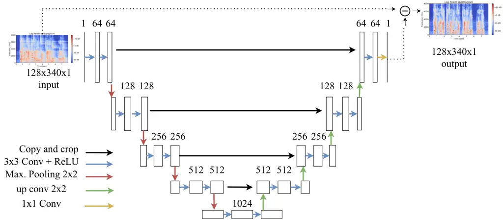
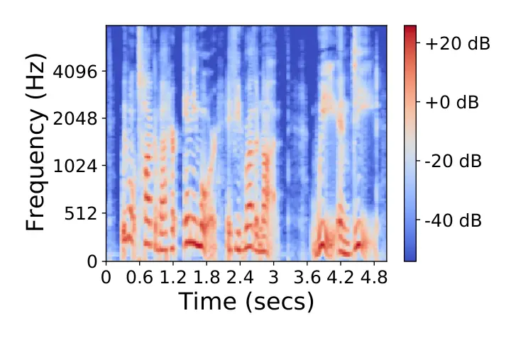
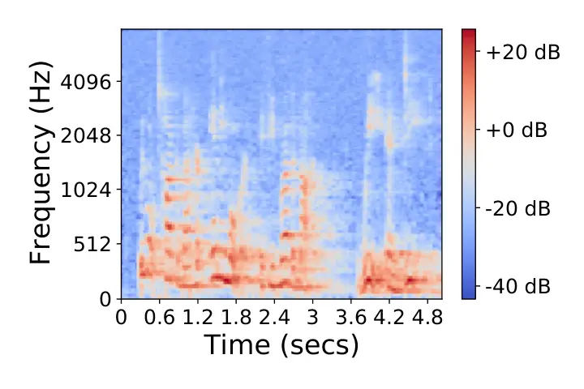
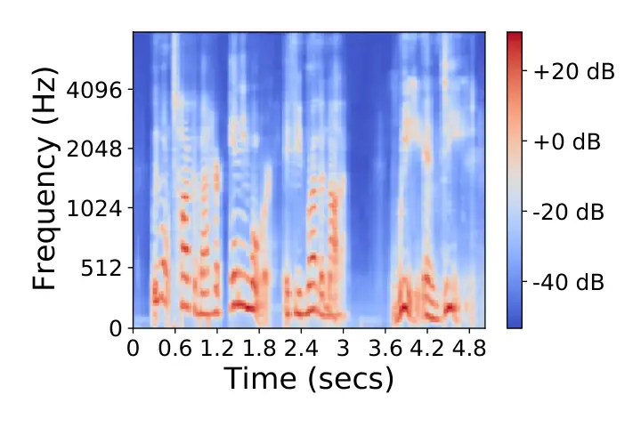
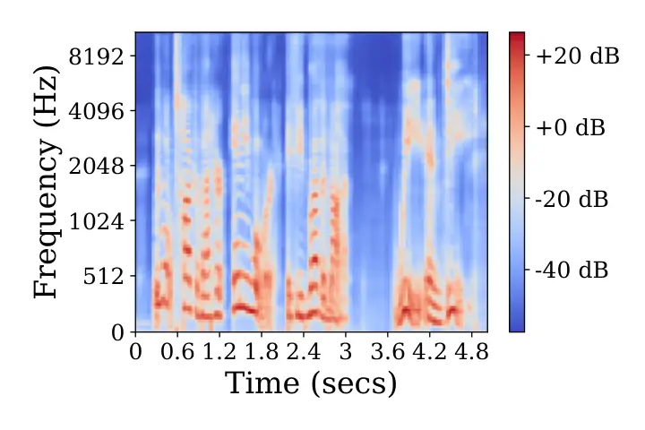

# Late reverberation suppression using U-nets

Diego León^(⋆)    Felipe Tobar

###### Abstract

In real-world settings, speech signals are almost always affected by
reverberation produced by the working environment; these corrupted
signals need to be _dereverberated_ prior to performing, e.g., speech
recognition, speech-to-text conversion, compression, or general audio
enhancement. In this paper, we propose a supervised dereverberation
technique using _U-nets with skip connections_, which are
fully-convolutional encoder-decoder networks with layers arranged in the
form of an “U” and connections that “skip” some layers. Building on this
architecture, we address speech dereverberation through the lens of Late
Reverberation Suppression (LS). Via experiments on synthetic and
real-world data with different noise levels and reverberation settings,
we show that our proposed method termed “LS U-net” improves quality,
intelligibility and other performance metrics compared to the original
U-net method and it is on par with the state-of-the-art GAN-based
approaches.

###### Index Terms: 

dereverberation, speech processing, convolutional networks, deep
autoencoders, U-net.

^(†)^(†)address: ^(⋆)Department of Electrical Engineering, Universidad
de Chile  
^(†)Initiative for Data & Artificial Intelligence, Universidad de
Chile  
^(‡)Center for Mathematical Modeling, Universidad de Chile

## 1 Introduction

Speech reverberation is an acoustic phenomenon whereby reflections of
the acoustic signal (over surfaces and objects) are combined with the
original signal at the receiver’s end. The resulting _reverberated_
signal is thus a corrupted one, where the intelligibility and quality of
the speech is degraded \[1\]. Perceived reverberation levels depend on a
number of factors, including the geometry of the room, the materials
used in it, and the distance between the speaker and the receiver \[2\].

Reverberation can be modelled as a convolution between a source signal
and the room impulse response. Based on this modelling assumption one
can design dereverberation techniques to recover the source (original)
signal from observations of the received (convolved) signal. A popular
unsupervised approach is the Weighted Prediction Error (WPE) \[3\]
method. WPE estimates the original signal by applying a linear filter to
the received signal, where the filter, learnt via maximum likelihood,
assumes a Gaussian prior on the source signal (possibly heteroscedastic
\[4\]). There are several extensions of WPE, in particular, the
frequency domain normalized delayed linear prediction (FD-NDLP) method
\[5\] is an efficient implementation of WPE which uses the short-time
Fourier transform (STFT) and is known to outperform its temporal-domain
counterpart.

Deep learning has also been recently used in speech dereverberation. For
instance, multilayer perceptrons (MLP) and long short-term memory (LSTM)
networks have been developed to learn mappings from a window of
reverberated frames (or “context” windows) to a source frame, thus
_learning to dereverberate_ by inverse transformations \[6, 7, 8\].
Additionally, Zhao et al. \[9\] proposed an LSTM-based
late-reverberation-suppression strategy which learns the difference
between the source and reverberated signals, therefore, dereverberation
is performed by substracting the late reverberation estimation to the
observed reverberated signal.

Architectures using deep autoencoders have too been considered for audio
generation \[10\] and in particular for dereverberation \[11\], while
generative adversarial networks (GAN) have been shown to improve
training for some dereverberation methods \[12, 13\]. Building on these
tools, Ori Ernst et al. \[14\] used an encoder-decoder fully
convolutional neural network called U-net (due to its layers arranged in
the shape of an “U” \[15\]) for speech dereverberation. Their strategy
was to learn the mapping between the (log) power spectrum between the
reverberated and source signals as if they were images. In the same
work, Ori Ernst et al. used a U-net as generator in a GAN.

In this work, we propose a novel U-net architecture for speech
dereverberation. The unique feature of the proposed method is that it
implements the U-net in a _Late Reverberation Suppression_ (LS) setting,
while in previous works i) LS has been addressed using LSTMs \[9\], and
ii) U-nets have been used for direct reverberation \[14\] (and not for
LS). Our proposed method exhibits significantly better results than
traditional U-net in terms of popular intelligibility, quality and
reverberation objective measures (e.g., speech-to-reverberation
modulation energy ratio, SRMR), and achieves dereverberation indicators
that are similar to recent extensions of the U-net architecture trained
using GANs.

## 2 Problem Formulation

Let $`x(\cdot)`$ be the source signal and $`y(\cdot)`$ the reverberated
signal given by the convolution between the source and a room impulse
response (RIR) $`h(\cdot)`$. Let us also consider the reverberation time
$`T_{60}`$, given by the time it takes for a signal to decay 60 dB
relative to the level of direct sound (initial impulse) \[2\]. The
reverberation time $`T_{60}`$, uniquely determined by $`h`$, is relevant
since it is a measure “how reverberant” a signal is when is convolved
with $`h(t)`$. For instance, a reverberation time $`T_{60}=0.2s`$
represents a low level of reverberation, while $`T_{60}=0.6s`$ produces
a noticeable reverberation level.

By considering a source of additive noise $`\eta(\cdot)`$, the model
relating the above defined objects is given by

```math
y(t)=(x*h)(t)+\eta(t), \tag{1}
```

where “$`*`$” denotes convolution operator. Dereverberation is thus
defined as a _blind deconvolution_, that is, the task of recovering
$`x(t)`$ using observations of $`y(t)`$ in eq. (1) when the $`h(t)`$ is
unknown. Notice that by splitting the room impulse response $`h(t)`$ in
_early reflections_ $`h_{\text{early}}(t)`$ and _late reflections_
$`h_{\text{late}}(t)`$, eq. (1) can be expressed as

```math
\begin{split}y(t)&=(x*h_{\text{early}})(t)+(x*h_{\text{late}})(t)+\eta(t)\\
&=y_{\text{early}}(t)+y_{\text{late}}(t),\end{split} \tag{2}
```

where $`y_{\text{early}}`$ is as close as possible to the desired
(source) signal $`x`$, since the reverberation is largely due to late
reflections.

The problem on which this work will focus is that of suppressing the
late reflections $`y_{\text{late}}(t)`$.

## 3 Proposed method and baselines



Figure 1: Proposed U-net architecture for speech dereverberation. Skip
connections are represented by horizontal continuous black arrows and
the dashed connection is the distinguishing feature of our method that
enables it use for late reverberation suppression.

Our proposal extends previous works in the literature by focusing on the
problem of late reverberation suppression (LS) considered in \[9\]
(originally addressed using LSTMs) with the U-net architecture presented
in \[15\]; originally for plain dereverberation. Figure 1 shows the
U-net architecture proposed in our work.

The main difference between our contribution and previous methods is the
skip connection between input and output (dashed line in Figure 1),
which is not present in the original dereverberation U-net \[15\]. This
skipped connection is what materialises our focus on late reverberation
suppression (rather than plain dereverberation): the proposed U-net
architecture does not learn a mapping from reverberated to
dereverberated spectrogram, but instead it learns to generate an
intermediate log-power-spectrum “image”, which is subtracted of the
input (observed reverberated signal).

The intuition supporting the proposed architecture follows the idea that
estimating the late reflections $`y_{\text{late}}(t)`$ is simpler than
estimating the full reverberated signal $`y(t)`$, since it is known that
the true signal does appear as a component in the reverberated
signal—see eq.(2). Therefore, by giving the U-net a less challenging
task (by placing the input-output skipped connection shown at the top of
Figure 1) our hypothesis is that the proposed U-net architecture will
have improved performance in reconstructing the source signal against
over the baseline U-net in \[15\]. This is because the baseline U-net
aims to learn the reverberant-dereverberant mapping without any prior
knowledge of the dereverberation process, in particular it does not
considers that the source appears as an early reflection. The proposed
model is trained in the same fashion as the baseline U-net using the MSE
loss function.

For purposes of experimental validation, we will consider a recently
proposed dereverberation method \[14\] based on a Generative Adversarial
Network (GAN) using a U-net as generator, this architecture is known to
improve the quality of dereverberated spectrograms generated over the
original U-net method in \[15\]. In this method, the discriminator
network classifies between the generator output spectrogram and the
clean spectrogram or “target”. Learning using this strategy uses the
following loss function:

```math
L(G,D)=L_{\text{GAN}}(G,D)+\lambda L_{\text{MSE}}(G), \tag{3}
```

where $`L_{\text{MSE}}(G)`$ is the mean square error between the
generator output and the target log power spectrum, $`\lambda`$ is an
hyper-parameter controlling the MSE weight in the loss function and
$`L_{\text{GAN}}(G,D)`$ has the traditional form of GAN loss.

In addition to U-net-based architectures above, we consider other known
methodologies to dereverberation, mainly based on MLP and LSTMs.
Summarising, all the architectures to be implemented in our experiments
are

- •
  LS U-net: Proposed Late Reverberation Suppression U-net
- •
  U-net: The original U-net method, a symmetric U-net structure for
  dereverberation \[15\] trained on an MSE loss
- •
  U-net GAN: a GAN architecture using a symmetric U-net as generator
  \[14\]
- •
  Context-MLP: An MLP with Context Window \[6\]\[7\]
- •
  Context-LSTM: An LSTM with Context Window \[8\]
- •
  LS-LSTM: A late reverberation suppression LSTM \[9\]
- •
  FD-NDLP: The frequency domain normalized delayed linear prediction
  \[5\] (which is unsupervised)

All the above architectures were implemented exclusively for our
experiments with the exception of FD-NDLP, for which we relied on
officially released code. Training was performed using Adam \[16\] and a
batch size of 16. U-net GAN, in particular, was trained using
$`\lambda=\text{1e-2}`$, chosen experimentally in order to keep MSE and
$`L_{\text{GAN}}`$ in the same magnitude order. Furthermore, the input
log power spectrogram for U-net GAN was not normalized, but we set a
minimum value of -80 dB and a maximum of 30 dB; this was because our
preliminary results exhibited poor performance using normalization to
confine the input in the \[-1, 1\] range or confining the output in the
same range using tanh($`\cdot`$).

## 4 Experiments

### 4.1 Datasets and pre-processing

Our experiments considered synthetic and real-world data. The former
were taken from the LibriSpeech \[17\] database, whose utterances (audio
examples in dataset) are sampled at 16 kHz. Our procedure to generate
the synthetic reverberated speech was by convolving the LibriSpeech
audio signals with RIR from the Omni \[18\] and MARDY \[19\] databases.
The real-world data considered in our experiments came from the BUT
Speech@FIT Reverb Database \[20\], which are retransmitted signals also
taken from LibriSpeech, and are thus naturally reverberated.

Spectrograms, in all cases, were computed using FFT with a window length
of 2048 samples and _hop_ length of 512 samples; a Mel filterbank was
used to reduce the bin size. Experimentally, we chose between 128 and
256 bins, in both cases it was possible to recover the temporal signal
appropriately but when using a smaller number of bins (e.g., 64 bins)
the signal was recovered with difficulty. Lastly, we used 128 bins and
set the number of frames for each spectrogram to 340 (which was the mean
value of frames over all training spectrograms) using Lanczos
interpolation available on OpenCV.

#### 4.1.1 Simulated data

RIRs from databases Omni \[18\] and MARDY \[19\] were used to generate
reverberant speech audios. Omni is composed of 3 rooms, 2 of which were
used for training and the remaining one for testing. MARDY (1 room) was
used for testing only.

The reverberant training data was produced using random RIR utterances
and random SNRs chosen from the range \[15, 35\] dB for each example.
This strategy allowed for a training set with a wide variety of noise
and reverberation time. Reverberation time varied in an approximate
range of 0.3s and 0.7s for the considered databases. The reverberant
test data was generated using Omni RIRs dataset for
$`\text{SNR}=15\text{dB}`$ and $`\text{SNR}=35\text{dB}`$ (the same 500
utterances for each SNR). Another 500 utterances were produced using the
MARDY RIRs dataset for near and far microphones, where noise was fixed
at $`\text{SNR}=35\text{dB}`$.

These synthetic signals were produced using the RIR generator¹¹ 1
Available on https://pypi.org/project/rir-generator/, based on the
original method proposed by \[21\], in order to introduce $`T_{60}`$
variability. Ths way, the simulated data were generated for $`T_{60}`$
varying between 0.2 and 1.0s (9 values spaced in 0.1s) and using 50
utterances for each $`T_{60}`$ value.

#### 4.1.2 Re-transmitted real-world data

We used the BUT Speech@FIT Reverb Database \[20\], which contains
LibriSpeech re-transmitted for near and far microphones. We used 500
utterances for near and far microphones. Our quantitative evaluation was
based on the following metrics:

$`\bullet`$ PESQ: Perceptual Evaluation of Speech Quality \[22\]  
 $`\bullet`$ CD: Cepstral Distance  
 $`\bullet`$ LLR: Log-Likelihood Ratio  
 $`\bullet`$ fwSNRseg: Frequency Weighted Segmental SNR
\[23\]\[24\]\[25\]  
 $`\bullet`$ SRMR: Speech to Reverberation Modulation Energy Ratio
\[26\]

The first four metrics are _intrusive metrics_, which compare the input
signal with a clean signal (in terms of reverberation and noise) and
then provide “similarity” scores. The SRMR metric, on the contrary, is a
representation obtained by means and auditory-inspired filterbank (based
on the functioning of the cochlea) analysis of critical band temporal
envelopes of the speech signal \[26\]. Using this last non-intrusive
measure is relevant regarding the realistic evaluation of the methods
considered, since in real-word applications clean signals that can be
used as benchmarks may not available.

### 4.2 Results for synthetic data: varying noise

|                              | PESQ ($`\uparrow`$) |      | CD ($`\downarrow`$) |      | LLR ($`\downarrow`$) |      | fwSNRseg ($`\uparrow`$) |       | SRMR ($`\uparrow`$) |      |
| ---------------------------- | ------------------- | ---- | ------------------- | ---- | -------------------- | ---- | ----------------------- | ----- | ------------------- | ---- |
| SNR (dB) $`\longrightarrow`$ | 15                  | 35   | 15                  | 35   | 15                   | 35   | 15                      | 35    | 15                  | 35   |
| Reverberant                  | 1.98                | 2.11 | 7.30                | 5.39 | 1.36                 | 0.81 | 6.38                    | 7.69  | 3.08                | 3.17 |
| Context-MLP                  | 1.66                | 2.18 | 6.84                | 4.16 | 1.38                 | 0.59 | 5.04                    | 7.74  | 2.06                | 3.94 |
| Context-LSTM                 | 1.68                | 2.31 | 6.73                | 3.91 | 1.36                 | 0.52 | 5.20                    | 8.42  | 1.93                | 4.06 |
| LS-LSTM                      | 1.86                | 2.25 | 6.17                | 4.04 | 1.18                 | 0.52 | 5.98                    | 8.34  | 2.71                | 4.75 |
| FD-NDLP                      | 2.09                | 2.43 | 7.45                | 4.30 | 1.39                 | 0.54 | 6.96                    | 9.66  | 4.25                | 4.47 |
| U-net                        | 2.59                | 2.66 | 4.44                | 3.26 | 0.61                 | 0.36 | 9.35                    | 10.00 | 5.93                | 5.61 |
| LS U-net                     | 2.65                | 2.72 | 4.38                | 3.23 | 0.59                 | 0.34 | 9.56                    | 10.20 | 6.30                | 5.98 |
| U-net GAN                    | 2.62                | 2.69 | 4.37                | 3.34 | 0.60                 | 0.36 | 9.15                    | 9.82  | 7.18                | 6.73 |

Table 1: Results of simulated data for $`\text{SNR}=15\textbf{dB}`$ y
$`\text{SNR}=35\textbf{dB}`$ using Omni RIRs dataset. ($`\uparrow`$):
higher is better, ($`\downarrow`$): lower is better.

Figure 2: Synthetic data: SRMR vs reverberation time.

Table 1 shows the results of simulated data for
$`\text{SNR}=15\text{dB}`$ and $`\text{SNR}=35\text{dB}`$. The three
variants of the U-net architecture exhibits the best dereverberation
performance for all metrics and for both noise levels. Performances are
consistent across SNR values, which shows advantages (in terms of noise)
of the approaches based on U-net. The proposed LS U-net exhibits the
best performance under most metrics while U-net GAN shows excels under
the SRMR score, however, LS U-net still shows a clear advantage over the
all other benchmarks, including the baseline U-net, for the SRMR score.



(a) Clean. SRMR = 8.45.



(b) Reverberant. SRMR = 3.45.


(c) U-net. SRMR = 6.49.



(d) U-net GAN. SRMR = 7.99.



(e) LS U-net. SRMR = 7.51.

Figure 3: Example of the log power spectra for the synthetic-data
experiment.

### 4.3 Results for synthetic data: varying $`T_{60}`$

|                                   | PESQ ($`\uparrow`$) |      | CD ($`\downarrow`$) |      | LLR ($`\downarrow`$) |      | fwSNRseg ($`\uparrow`$) |      | SRMR ($`\uparrow`$) |      |
| --------------------------------- | ------------------- | ---- | ------------------- | ---- | -------------------- | ---- | ----------------------- | ---- | ------------------- | ---- |
| Mic. distance $`\longrightarrow`$ | Near                | Far  | Near                | Far  | Near                 | Far  | Near                    | Far  | Near                | Far  |
| Reverberant                       | 2.57                | 2.15 | 5.25                | 5.71 | 0.85                 | 0.97 | 8.68                    | 6.58 | 5.21                | 4.49 |
| Context-MLP                       | 2.09                | 1.87 | 5.48                | 5.62 | 1.02                 | 1.07 | 6.72                    | 5.82 | 3.13                | 2.81 |
| Context-LSTM                      | 2.14                | 1.90 | 5.49                | 5.64 | 0.99                 | 1.05 | 7.21                    | 6.12 | 3.05                | 2.60 |
| LS-LSTM                           | 2.38                | 2.07 | 4.97                | 5.29 | 0.81                 | 0.92 | 8.06                    | 6.64 | 4.53                | 4.12 |
| FD-NDLP                           | 2.71                | 2.24 | 5.44                | 5.83 | 0.90                 | 1.00 | 8.57                    | 6.60 | 6.03                | 5.34 |
| U-net                             | 2.65                | 2.28 | 4.12                | 4.57 | 0.54                 | 0.65 | 9.23                    | 7.52 | 5.47                | 4.88 |
| LS U-net                          | 2.74                | 2.36 | 4.09                | 4.59 | 0.52                 | 0.64 | 9.32                    | 7.63 | 5.73                | 5.36 |
| U-net GAN                         | 2.72                | 2.36 | 4.11                | 4.56 | 0.53                 | 0.64 | 9.24                    | 7.63 | 6.60                | 6.19 |

Table 2: Results of simulated data using MARDY RIRs dataset.
Reverberation times are 291 and 447 ms for near and far microphones
respectively. ($`\uparrow`$): higher is better, ($`\downarrow`$): lower
is better.

Table 2 shows the results of simulated data for near and far
microphones. Recall that the reverberation time $`T_{60}`$ (defined in
Section 2) associated to far microphones is greater than that of near
microphones, this is because the reverberation effect is more subtle
when the speaker is closer to the microphone. The baseline U-net
certainly improved, in terms of SRMR score, for near and far microphones
compared to reverberant speech and all non-U-net-based methods; however,
observe that LS U-net and U-net GAN had significantly better scores
overall. The unsupervised method FD-NDLP (based on Late Reverberation
Suppression) was competitive for near and far microphones. The
indicators PESQ, CD, LLR and fwSNRseg showed small differences among the
3 U-net variants, although LS U-net shows the best performance in most
cases.

Figure 2 shows SRMR results of simulated data using RIR generator as a
function of $`T_{60}`$. The RIR generator was used assuming a room of
dimensions 5\[mt\]$`\times`$4\[mt\]$`\times`$6\[mt\] (width, length and
depth). As expected, the SRMR score decreases for increasing $`T_{60}`$
for all methods, with the reverberant (unprocessed, shown in blue)
signal having the sharpest decay and the proposed LS U-net (orange)
closely following the sate-of-the-art U-net GAN (black). None of the
model considered improved over the mean score of the reverberant
utterances at $`T_{60}=0.2s`$; this was expected since a reverberation
time of 0.2s represents a very subtle reverberation level. Reverberation
times in \[0.5, 1.0\] seconds allow us to observe the dereverberation
effectiveness of LS U-net and U-net GAN, since SRMR score is appreciably
higher compared to reverberant utterances and the rest of models. U-net
GAN (black) and the proposed architecture LS U-net (orange) show robust
behavior in terms of reverberation time and also in terms of noise as
previously shown in Table 1.

### 4.4 Qualitative evaluation for synthetic data

Figure 3 shows an example of dereverberation performance. Note the
similarity between clean spectrogram in Figure 3(a) and the three U-net
variants output in 3(c), 3(d) and 3(e). LS U-net and U-net GAN
architectures look visually identical.

### 4.5 Results for real-world data

|              | Near | Far  |
| ------------ | ---- | ---- |
| Reverberant  | 3.99 | 4.36 |
| Context-MLP  | 4.69 | 5.53 |
| Context-LSTM | 4.69 | 5.50 |
| LS-LSTM      | 5.49 | 8.16 |
| FD-NDLP      | 4.95 | 5.43 |
| U-Net        | 4.88 | 5.96 |
| LS U-Net     | 5.34 | 6.56 |
| U-net GAN    | 6.23 | 7.55 |

Table 3: SRMR results of LibriSpeech re-transmitted data for near and
far microphones. Higher is better.

Table 3 shows the SRMR for the real-world data. U-net GAN exhibited the
best results for near microphones and Late Reverberation Suppression
LSTM (LS-LSTM) \[9\] for far microphones. Though the proposed
architecture LS U-net did not exhibit the best performance for real
data, it improved over the baseline U-net and FD-NDLP performance for
near and far microphones nonetheless. Critically, if we ranked the seven
methods considered in Table 3 based on their SRMR score, the proposed LS
U-net would be third for both near and far microphones. This makes the
proposed alternative for late reverberation suppression applied to U-net
effective in real data.

## 5 Conclusions

We have proposed a U-net architecture for late reverberation
suppression, termed LS U-net, and have experimentally validated it on
synthetic and real-world data of different noise levels and
reverberation times and microphone distances. Our results show that
LS-Unet outperforms a wide range of deep-learning dereverberation
methods under multiple performance indicators. In particular. LS U-net
improves over the original U-net architecture and stands as a
competitive alternative to the state-of-the-art GAN-trained extension of
U-net. In the light of this results, future work wull focus on
developing a GAN-trained version of the proposed LS U-net method.

Acknowledgements. This work was funded by Fondecyt-Regular 1210606,
ANID-AFB170001 (CMM) and ANID-FB0008 (AC3E).

## References

- \[1\] Karen S Helfer and Laura A Wilber, “Hearing loss, aging, and
  speech perception in reverberation and noise,” Journal of Speech,
  Language, and Hearing Research, vol. 33, no. 1, pp. 149--155, 1990.
- \[2\] P. A Naylor and N. D Gaubitch, Speech Dereverberation, Springer
  Science & Business Media, 2010.
- \[3\] Tomohiro Nakatani, Takuya Yoshioka, Keisuke Kinoshita, Masato
  Miyoshi, and Biing-Hwang Juang, “Blind speech dereverberation with
  multi-channel linear prediction based on short time Fourier transform
  representation,” in Proc. of the IEEE International Conference on
  Acoustics, Speech and Signal Processing, 2008, pp. 85–88.
- \[4\] Toru Taniguchi, Aswin Shanmugam Subramanian, Xiaofei Wang, Dung
  Tran, Yuya Fujita, and Shinji Watanabe, “Generalized
  weighted-prediction-error dereverberation with varying source priors
  for reverberant speech recognition,” in Proc. of the IEEE Workshop on
  Applications of Signal Processing to Audio and Acoustics (WASPAA),
  2019, pp. 293–297.
- \[5\] Tomohiro Nakatani, Takuya Yoshioka, Keisuke Kinoshita, Masato
  Miyoshi, and Biing-Hwang Juang, “Speech dereverberation based on
  variance-normalized delayed linear prediction,” IEEE Transactions on
  Audio, Speech, and Language Processing, vol. 18, no. 7, pp.
  1717–1731, 2010.
- \[6\] Kun Han, Yuxuan Wang, DeLiang Wang, William S Woods, Ivo Merks,
  and Tao Zhang, “Learning spectral mapping for speech dereverberation
  and denoising,” IEEE/ACM Transactions on Audio, Speech, and Language
  Processing, vol. 23, no. 6, pp. 982–992, 2015.
- \[7\] Xin Wang, Jun Du, and Yannan Wang, “A maximum likelihood
  approach to deep neural network based speech dereverberation,” in
  Proc. of the Asia-Pacific Signal and Information Processing
  Association Annual Summit and Conference (APSIPA ASC), 2017, pp.
  155–158.
- \[8\] Jorge Wuth, Richard M Stern, and Nestor Becerra Yoma, “Non
  causal deep learning based dereverberation,” arXiv preprint
  arXiv:2009.02832, 2020.
- \[9\] Yan Zhao, DeLiang Wang, Buye Xu, and Tao Zhang, “Late
  reverberation suppression using recurrent neural networks with long
  short-term memory,” in Proc. of the IEEE International Conference on
  Acoustics, Speech and Signal Processing (ICASSP), 2018, pp. 5434–5438.
- \[10\] Jesse Engel, Cinjon Resnick, Adam Roberts, Sander Dieleman,
  Mohammad Norouzi, Douglas Eck, and Karen Simonyan, “Neural audio
  synthesis of musical notes with wavenet autoencoders,” in Proc. of the
  International Conference on Machine Learning. PMLR, 2017, pp.
  1068–1077.
- \[11\] Xue Feng, Yaodong Zhang, and James Glass, “Speech feature
  denoising and dereverberation via deep autoencoders for noisy
  reverberant speech recognition,” in Proc. of the IEEE international
  conference on acoustics, speech and signal processing (ICASSP), 2014,
  pp. 1759–1763.
- \[12\] Ke Wang, Junbo Zhang, Sining Sun, Yujun Wang, Fei Xiang, and
  Lei Xie, “Investigating generative adversarial networks based speech
  dereverberation for robust speech recognition,” arXiv preprint
  arXiv:1803.10132, 2018.
- \[13\] Daniel Michelsanti and Zheng-Hua Tan, “Conditional generative
  adversarial networks for speech enhancement and noise-robust speaker
  verification,” arXiv preprint arXiv:1709.01703, 2017.
- \[14\] Ori Ernst, Shlomo E Chazan, Sharon Gannot, and Jacob
  Goldberger, “Speech dereverberation using fully convolutional
  networks,” in Proc.  of the European Signal Processing Conference
  (EUSIPCO), 2018, pp. 390–394.
- \[15\] Olaf Ronneberger, Philipp Fischer, and Thomas Brox, “U-net:
  Convolutional networks for biomedical image segmentation,” in Proc. of
  the International Conference on Medical Image Computing and
  Computer-Assisted Intervention. Springer, 2015, pp. 234–241.
- \[16\] Diederik P Kingma and Jimmy Ba, “Adam: A method for stochastic
  optimization,” in Proc. of International Conference for Learning
  Representations, 2015.
- \[17\] Vassil Panayotov, Guoguo Chen, Daniel Povey, and Sanjeev
  Khudanpur, “Librispeech: an ASR corpus based on public domain audio
  books,” in Proc. of the IEEE international conference on acoustics,
  speech and signal processing (ICASSP). IEEE, 2015, pp. 5206–5210.
- \[18\] Rebecca Stewart and Mark Sandler, “Database of omnidirectional
  and b-format room impulse responses,” in Proc. of the IEEE
  International Conference on Acoustics, Speech and Signal Processing,
  2010, pp. 165–168.
- \[19\] Jimi YC Wen, Nikolay D Gaubitch, Emanuel AP Habets, Tony Myatt,
  and Patrick A Naylor, “Evaluation of speech dereverberation algorithms
  using the MARDY database,” in in Proc.  of the Intl. Workshop Acoust.
  Echo Noise Control (IWAENC), 2006, pp. 12–15.
- \[20\] Igor Szöke, Miroslav Skácel, Ladislav Mošner, Jakub Paliesek,
  and Jan Černockỳ, “Building and evaluation of a real room impulse
  response dataset,” IEEE Journal of Selected Topics in Signal
  Processing, vol. 13, no. 4, pp. 863–876, 2019.
- \[21\] Jont B Allen and David A Berkley, “Image method for efficiently
  simulating small-room acoustics,” The Journal of the Acoustical
  Society of America, vol. 65, no. 4, pp. 943–950, 1979.
- \[22\] Antony W Rix, John G Beerends, Michael P Hollier, and Andries P
  Hekstra, “Perceptual evaluation of speech quality (PESQ)-a new method
  for speech quality assessment of telephone networks and codecs,” in
  Proc. of the IEEE international conference on acoustics, speech, and
  signal processing (ICASSP), 2001, vol. 2, pp. 749–752.
- \[23\] Yi Hu and Philipos C Loizou, “Evaluation of objective quality
  measures for speech enhancement,” IEEE Transactions on audio, speech,
  and language processing, vol. 16, no. 1, pp. 229–238, 2007.
- \[24\] Schuyler R. Quackenbush, Thomas Pinkney Barnwell, and Mark A.
  Clements, Objective Measures of Speech Quality, EngleWood Cliffs, NJ:
  Prentice-Hall, 1988.
- \[25\] P.C. Loizou, Speech Enhancement: Theory and Practice, Second
  Edition, CRC Press, second edition, 2013.
- \[26\] Tiago H Falk, Chenxi Zheng, and Wai-Yip Chan, “A non-intrusive
  quality and intelligibility measure of reverberant and dereverberated
  speech,” IEEE Transactions on Audio, Speech, and Language Processing,
  vol. 18, no. 7, pp. 1766–1774, 2010.
