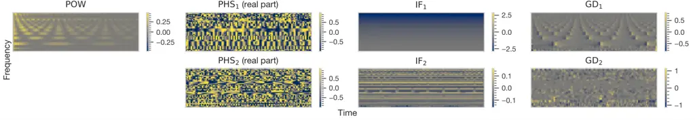

# AN INVESTIGATION OF THE EFFECTIVENESS OF PHASE FOR AUDIO CLASSIFICATION

Shunsuke Hidaka    Kohei Wakamiya    Tokihiko Kaburagi

###### Abstract

While log-amplitude mel-spectrogram has widely been used as the feature
representation for processing speech based on deep learning, the
effectiveness of another aspect of speech spectrum, i.e., phase
information, was shown recently for tasks such as speech enhancement and
source separation. In this study, we extensively investigated the
effectiveness of including phase information of signals for eight audio
classification tasks. We constructed a learnable front-end that can
compute the phase and its derivatives based on a time-frequency
representation with mel-like frequency axis. As a result, experimental
results showed significant performance improvement for musical pitch
detection, musical instrument detection, language identification,
speaker identification, and birdsong detection. On the other hand,
overfitting to the recording condition was observed for some tasks when
the instantaneous frequency was used. The results implied that the
relationship between the phase values of adjacent elements is more
important than the phase itself in audio classification.

###### Index Terms: 

Time-frequency representation, group delay, instantaneous frequency,
learnable filterbank, deep learning

^(†)^(†)address: ¹Graduate School of Design, Kyushu University, Japan,
²Faculty of Design, Kyushu University, Japan

## 1 INTRODUCTION

Deep learning, which exploded from image processing, has now spread to
audio processing. However, in contrast to image processing, where the
raw pixel data is commonly used, different input representations are
still used for different tasks in audio processing. Log-amplitude mel
spectrograms are widely used as one of the input features in many tasks
such as speech recognition, speech synthesis, and audio
classification \[1, 2, 3\]. On the other hand, for extracting clean
waveforms from a mixed waveform, such as speech enhancement and source
separation, complex spectrograms (the outputs of STFT) and raw waveforms
are currently the mainstream \[4, 5\].

Phase information is present in the waveforms and complex spectrograms
but missing in the log-amplitude mel spectrograms. Phase is more
challenging to handle and interpret than the amplitude, and it has been
mentioned that the phase of the complex spectrum is not important in
speech enhancement \[6\]. However, as mentioned above, in speech
enhancement, complex spectrograms are increasingly being used as a more
effective representation than amplitude spectrograms \[7, 8, 9\]. The
instantaneous frequency, which is the time derivative of the phase of
the complex spectrogram, was used for F0 estimation \[10\]. The group
delay, which is the frequency derivative of the phase, was used for
formant analysis \[11\].

Previous studies examined handcrafted constant-Q transform features and
raw STFT phase for their specific tasks \[12, 13\]. Our study aimed to
investigate the effectiveness of the phase obtained from the
time-frequency representation of a learnable filterbank for various
classification tasks. Specifically, we compared the phase, group delay,
and instantaneous frequency as phase information. We evaluated the
performance for eight tasks, including voice, musical, and environmental
sounds. Our code is publicly available \[14\].

Figure 1: LEAF-extended. To eliminate redundancy, the group delay
calculation path is omitted from the figure. The group delay is
calculated by changing the temporal unwrapping and difference in the
instantaneous frequency path to frequency unwrapping and difference,
respectively.

## 2 METHODS

When calculating a log-amplitude mel spectrogram, a logarithmic
conversion of the frequency axis is performed after discarding the phase
of the complex spectrogram \[15\]. Therefore, it is not obvious how the
phase is logarithmically converted. While log-amplitude mel spectrograms
are still used, there are also attempts to learn a more optimal
time-frequency representation using DNNs. It has been shown that the
performance of LEarnable Audio Frontend (LEAF) proposed in one of those
studies is comparable to or even better than the log-amplitude mel
spectrogram \[16\]. In addition, LEAF can directly compute the complex
time-frequency representation with a logarithmic frequency axis.
Therefore, we investigated a LEAF variant that can add phase
information, which we call LEAF-extended, and used it instead of the
log-amplitude mel spectrogram. Note that the frequency axis of the
LEAF-extended is not completely logarithmic after learning, as described
below.

### 2.1 Original LEAF: calculation path of amplitude information

Fig. 1 shows LEAF-extended. In this section, we first describe only the
components included in the original LEAF. The original LEAF has no phase
computation path and only computes the compressed power. The original
LEAF consisted of a cascade of the following components: a Gabor
filterbank responsible for computing the time-frequency representation
from raw waveforms and also for converting the frequency axis; a
calculator of squared amplitude; a Gaussian lowpass filterbank
responsible for the downsampling along the time axis; an sPCEN
compressor, a modified version of Per-Channel Energy Normalization
(PCEN) \[17\], responsible for the nonlinear compression of the
amplitude. Except for the calculator of squared amplitude, each
component has some learnable parameters for each frequency bin.
Henceforth, let $`M\in\mathbb{N}`$ denote the total number of frequency
bins of the LEAF, and $`W\in\mathbb{N}`$ denote the window width of the
LEAF.

The Gabor filterbank $`(\varphi_{m}(n))_{m=1,\dots,M}`$ has two kinds of
learnable parameters: the center frequencies
$`(\eta_{m})_{m=1,\dots,M}`$ and the inverse window widths
$`(\sigma_{m})_{m=1,\dots,M}`$. This filterbank is defined by

```math
\begin{gathered}\varphi_{m}(n)=\varphi_{m}^{\prime}(n)/\left\|\varphi^{\prime}_{m}\right\|_{l_{1}},\;\varphi_{m}^{\prime}(n)=e^{\left(-\frac{n^{2}}{2\sigma_{m}^{2}}+2\pi i\eta_{m}n\right)},\\
m=1,\dots,M,\quad n=-W/2,\dots,W/2,\end{gathered} \tag{1}
```

where $`i=\sqrt{-1}`$ is the imaginary unit, and $`n,m\in\mathbb{N}`$
are the time and frequency indices, respectively.¹¹ 1 In the original
paper \[16\], the $`l_{1}`$ normalization of each filter is done with
$`\varphi_{m}(n)=\varphi_{m}^{\prime}(n)/\sqrt{2\pi}\sigma_{m}`$.
However, this normalization is not exact because the width of the Gabor
filter is finite, $`W+1`$. The learnable parameters are initialized so
that the frequency response has a similar shape as the mel filterbank.
The filterbank is regarded as a kernel where each filter is a channel,
and 1-D convolution of the filterbank and the raw signal yields the
time-frequency representation. The stride of the convolution is one. If
$`(\eta_{m})_{m=1,\dots,M}`$ are linearly equally spaced and
$`(\sigma_{m})_{m=1,\dots,M}`$ are constant, the convolution corresponds
to STFT using a Gaussian window. Note that if the center frequencies
$`(\eta_{m})_{m=1,\dots,M}`$ become not monotonically increasing due to
learning, they are forced to reorder $`(\eta_{m})_{m=1,\dots,M}`$ so
that they become monotonically increasing.

The Gaussian lowpass filterbank $`(\phi_{m}(n))_{m=1,\dots,M}`$ has
inverse window width parameters $`(\sigma_{m})_{m=1,\dots,M}`$ as
learnable parameters. This filterbank is defined by

```math
\begin{gathered}\phi_{m}(n)=\phi_{m}^{\prime}(n)/\left\|\phi^{\prime}_{m}\right\|_{l_{1}},\quad\phi_{m}^{\prime}(n)=e^{-\frac{n^{2}}{2(0.5\sigma_{m}(W-1))^{2}}},\\
m=1,\dots,M,\quad n=-W/2,\dots,W/2.\end{gathered} \tag{2}
```

Depthwise 1D convolution, whose stride is greater than one, of the
Gaussian lowpass filterbank and the squared amplitude of the Gabor
filterbank output yields a downsampled representation.²² 2 In the
original paper \[16\], the $`l_{1}`$ normalization of each filter of the
Gaussian lowpass filterbank is performed like the Gabor filterbank.

The sPCEN compressor $`\operatorname{PCEN}(\mathcal{F}(m,n))`$ is a
learnable DNN component derived from PCEN, a method for nonlinear
compression of amplitude per channel \[17\]. This component is defined
by

```math
\begin{gathered}\operatorname{PCEN}(\mathcal{F}(m,n))=\left(\frac{\mathcal{F}(m,n)}{(\epsilon+\mathcal{M}(m,n))^{a_{m}}}+\delta_{m}\right)^{1/r_{m}}-\delta_{m}^{1/r_{m}},\\
\mathcal{M}(m,n)=(1-s_{m})\mathcal{M}(m,n-1)+s_{m}\mathcal{F}(m,n),\\
m=1,\dots,M,\quad n=1,\dots,L,\end{gathered} \tag{3}
```

where $`\mathcal{F}(m,n)`$ is the time-frequency representation that is
the output of the Gaussian lowpass filterbank; $`L`$ is the temporal
length of $`\mathcal{F}(m,n)`$; $`\epsilon`$ is a small value that
avoids zero division; and $`(\alpha_{m})_{m=1,\dots,M}`$,
$`(\delta_{m})_{m=1,\dots,M}`$, $`(r_{m})_{m=1,\dots,M}`$,
$`(s_{m})_{m=1,\dots,M}`$ are the learnable parameters of the sPCEN
compressor. Henceforth, the power compressed by sPCEN is denoted as
$`\mathbf{POW}`$.

### 2.2 Two definitions of phase

We will now pause the description of LEAF-extended to touch on two
definitions of continuous STFT with different phases \[18\]. STFT of a
time-domain signal $`x(t)`$ for $`w(t)\neq 0`$ can be expressed by

```math
\operatorname{STFT_{1}}(f,t)=\int_{\mathbb{R}}x(\tau)\overline{w(\tau-t)e^{2\pi if(\tau-t)}}d\tau, \tag{4}
```

where $`\overline{z}`$ is the complex conjugate of $`z`$, and
$`t,f\in\mathbb{R}`$ are the time and frequency, respectively. The other
definition is expressed by

```math
\operatorname{STFT_{2}}(f,t)=\int_{\mathbb{R}}x(\tau)\overline{w(\tau-t)e^{2\pi if\tau}}d\tau. \tag{5}
```

In the first definition, the term of the complex sinusoid moves with the
window. On the other hand, in the second definition, the term is fixed
to the origin. The difference between these two definitions yields the
following relationship between their phase values:

```math
\angle\operatorname{STFT_{1}}(f,t)=\angle\operatorname{STFT_{2}}(f,t)+2\pi ft. \tag{6}
```

This yields the following relationship between the instantaneous
frequencies, which are the time derivatives of the phases, and the group
delays, which are the negative frequency derivatives of the phases:

```math
\displaystyle(\partial/\partial t)\angle\operatorname{STFT_{1}}(f,t) \displaystyle=(\partial/\partial t)\angle\operatorname{STFT_{2}}(f,t)+2\pi f, \tag{7}
```

```math
\displaystyle-(\partial/\partial f)\angle\operatorname{STFT_{1}}(f,t) \displaystyle=-(\partial/\partial f)\angle\operatorname{STFT_{2}}(f,t)-2\pi t. \tag{8}
```

$`(\partial/\partial t)\angle\operatorname{STFT_{1}}(f,t)`$ is the more
accepted definition of “instantaneous frequency” because it represents
the absolute frequency. On the other hand,
$`(\partial/\partial t)\angle\operatorname{STFT_{2}}(f,t)`$ is often
called “relative instantaneous frequency” because it represents the
frequency relative to the (angular) frequency axis $`2\pi f`$.
$`-(\partial/\partial f)\angle\operatorname{STFT_{1}}(f,t)`$ is referred
to as the “group delay.” Since
$`-(\partial/\partial f)\angle\operatorname{STFT_{2}}(f,t)`$ varies
linearly with the time position, to our knowledge, it has not been
actively used in signal processing. We enabled LEAF-extended to handle
the different phase definitions and examined their effects.



Figure 2: The heatmaps of the output of the untrained LEAF-extended.
Here, a musical note of an electronic keyboard with a pitch of C5
(“keyboard_electronic_012-072-127.wav” from the NSynth training set) was
used as an input.

### 2.3 LEAF-extended: calculation paths of phase information

This section describes the calculation paths for phase information in
LEAF-extended. As already mentioned, recall that Fig. 1 shows
LEAF-extended. Note that the terms phase, instantaneous frequency, and
group delay are abused in this section without paying attention to their
signs. Even if the sign is reversed from the original definition of
STFT, it is only necessary to reverse the sign of the weights of the
first linear layer that receives the LEAF-extended output. Therefore,
signs do not affect the training of the neural network.

First, let us describe the calculation path for the phasor of the phase.
In this path, the principal value of the argument
$`\theta_{1}\in(-\pi,\pi]`$ is firstly calculated from the complex
time-frequency representation, which is the output of the Gabor
filterbank. This argument $`\theta_{1}`$ corresponds to the phase in the
sense of $`\angle\operatorname{STFT_{1}}`$. Optionally, this argument
$`\theta_{1}`$ is converted to another argument
$`\theta_{2}\in(-\pi,\pi]`$ in the sense of
$`\angle\operatorname{STFT_{2}}`$ by rotating $`\theta_{1}`$ as follows:

```math
\displaystyle\theta_{2}(m,n)=p(\theta_{1}(m,n)+\eta_{m}n), \tag{9}
```

where $`(\eta_{m})_{m=1,\dots,M}`$ are the center frequencies of the
Gabor filterbank, $`p(\theta):=\theta_{\mathrm{principal}}`$ maps an
angular $`\theta\in\mathbb{R}`$ to its principal value
$`\theta_{\mathrm{principal}}\in(-\pi,\pi]`$. Then, the phase is
unwrapped in the time direction and downsampled by a Gaussian lowpass
filterbank for the phase.³³ 3 If the $`l_{1}`$-norm of the Gaussian
lowpass filterbank is not strictly normalized to 1, the downsampling
causes the phase scale to change. The scale change results in an
undesired phase shift. Finally, the downsampled phase is converted to a
phasor by the function $`f(\theta):=e^{i\theta}`$. Note that the phasor
is regarded as a two-channel image with real and imaginary parts.
Henceforth, the phasors via the path without/with the phase rotation are
denoted as $`\mathbf{PHS}_{1}`$ and $`\mathbf{PHS}_{2}`$, respectively.

Next, we will explain the path for calculating the instantaneous
frequency. The first step in this path is to calculate the argument
$`\theta_{1}`$ or its rotated version $`\theta_{2}`$. Then, after
unwrapping it in the time direction, the instantaneous frequency is
calculated by taking the difference in the time direction. Finally, it
is downsampled by a Gaussian lowpass filterbank for the instantaneous
frequency. Henceforth, the instantaneous frequencies via the path
without/with the phase rotation are denoted as $`\mathbf{IF}_{1}`$ and
$`\mathbf{IF}_{2}`$, respectively.

The group delay is calculated by changing the temporal unwrapping and
difference in the instantaneous frequency path to frequency unwrapping
and difference, respectively. Henceforth, the group delays via the path
without/with the phase rotation are denoted as $`\mathbf{GD}_{1}`$ and
$`\mathbf{GD}_{2}`$, respectively.

Optionally, the phase features are elementwise multiplied by
$`\mathbf{POW}`$. This elementwise multiplication is expected to weaken
the influence of the phase features of elements with low power.

Fig. 2 shows the features output by LEAF-extended. In the frequency
bands where a sinusoidal component exists, the values of
$`\textbf{PHS}_{1}`$ align and rotate, whereas this is not the case for
$`\textbf{PHS}_{2}`$. $`\mathbf{IF}_{1}`$ has a bias along the frequency
axis, while $`\mathbf{IF}_{2}`$ has an approximately uniform
distribution of values over the entire frequency range.
$`\mathbf{GD}_{1}`$ shows a characteristic pattern at the inflection
points of the amplitude, while $`\mathbf{GD}_{2}`$ is conspicuous by its
otherwise noisier pattern. According to Eq. (8), some might expect
$`\mathbf{GD}_{2}`$ to be represented as $`\mathbf{GD}_{1}`$ with a
linear bias in the time direction. However, $`\mathbf{GD}_{2}`$ presents
a messy pattern because $`\mathbf{GD}_{1}`$ and $`\mathbf{GD}_{2}`$ are
approximations by taking the difference rather than analytical
derivatives and because the phase cycle with a period of $`2\pi`$.

### 2.4 Treatment of the phase of zero amplitude elements

The phase is not defined for elements with zero amplitude. In our
implementation, the instantaneous frequencies and group delays
calculated for undefined phase elements are also regarded as undefined.
Undefined values are replaced by linear interpolation during
downsampling with a Gaussian lowpass filterbank. If the value of the
central element of the sampling was undefined, the value of the
corresponding element after sampling is also considered undefined.
Finally, undefined values are replaced with $`0`$ ($`0+0i`$ for
$`\mathbf{PHS}_{1}`$ and $`\mathbf{PHS}_{2}`$). In addition, the
backpropagation of the argument of the elements with zero amplitude is
set to zero.

| Feature                                | Music (pitch)            | Music (inst.)               | Language                    | Speaker                     | Birdsong                    | Scenes          | Keyword                     | Emotion         |
| -------------------------------------- | ------------------------ | --------------------------- | --------------------------- | --------------------------- | --------------------------- | --------------- | --------------------------- | --------------- |
| $`\mathbf{POW}`$                       | $`91.5\pm 0.4`$          | $`69.2\pm 0.7`$             | $`74.7\pm 0.5`$             | $`35.5\pm 0.6`$             | $`76.4\pm 0.9`$             | $`66.2\pm 1.8`$ | $`94.1\pm 0.3`$             | $`60.2\pm 2.0`$ |
| $`+\mathbf{PHS}_{1}`$                  | $`\mathbf{92.9\pm 0.4}`$ | $`\mathbf{71.5\pm 0.7}`$    | $`\mathbf{79.3\pm 0.5}`$    | $`36.1\pm 0.6`$             | $`75.1\pm 0.9`$             | $`66.7\pm 1.8`$ | $`94.4\pm 0.3`$             | $`60.7\pm 2.0`$ |
| $`+\mathbf{PHS}_{1}\odot\mathbf{POW}`$ | $`91.9\pm 0.4`$          | $`69.6\pm 0.7`$             | $`74.5\pm 0.5`$             | $`35.6\pm 0.6`$             | $`75.6\pm 0.9`$             | $`68.8\pm 1.8`$ | $`94.1\pm 0.3`$             | $`62.0\pm 2.0`$ |
| $`+\mathbf{PHS}_{2}`$                  | $`\mathbf{92.7\pm 0.4}`$ | $`68.0\pm 0.7`$             | $`\underline{72.8\pm 0.5}`$ | $`\mathbf{37.4\pm 0.6}`$    | $`74.9\pm 1.0`$             | $`65.3\pm 1.9`$ | $`94.4\pm 0.3`$             | $`60.8\pm 2.0`$ |
| $`+\mathbf{PHS}_{2}\odot\mathbf{POW}`$ | $`91.9\pm 0.4`$          | $`69.0\pm 0.7`$             | $`74.0\pm 0.5`$             | $`\mathbf{37.1\pm 0.6}`$    | $`74.8\pm 1.0`$             | $`65.5\pm 1.9`$ | $`94.2\pm 0.3`$             | $`61.1\pm 2.0`$ |
| $`+\mathbf{IF}_{1}`$                   | $`\mathbf{93.2\pm 0.4}`$ | $`69.9\pm 0.7`$             | $`\underline{71.3\pm 0.5}`$ | $`34.6\pm 0.6`$             | $`76.0\pm 0.9`$             | $`69.4\pm 1.8`$ | $`94.2\pm 0.3`$             | $`57.3\pm 2.0`$ |
| $`+\mathbf{IF}_{1}\odot\mathbf{POW}`$  | $`92.1\pm 0.4`$          | $`69.5\pm 0.7`$             | $`\mathbf{78.1\pm 0.5}`$    | $`35.0\pm 0.6`$             | $`76.2\pm 0.9`$             | $`65.9\pm 1.9`$ | $`94.0\pm 0.3`$             | $`61.0\pm 2.0`$ |
| $`+\mathbf{IF}_{2}`$                   | $`\mathbf{93.2\pm 0.4}`$ | $`70.2\pm 0.7`$             | $`\underline{49.2\pm 0.6}`$ | $`\mathbf{37.2\pm 0.6}`$    | $`\underline{73.7\pm 1.0}`$ | $`68.2\pm 1.8`$ | $`94.5\pm 0.3`$             | $`57.5\pm 2.0`$ |
| $`+\mathbf{IF}_{2}\odot\mathbf{POW}`$  | $`\mathbf{93.0\pm 0.4}`$ | $`69.9\pm 0.7`$             | $`\underline{68.3\pm 0.5}`$ | $`36.1\pm 0.6`$             | $`\underline{73.5\pm 1.0}`$ | $`66.8\pm 1.8`$ | $`94.4\pm 0.3`$             | $`60.9\pm 2.0`$ |
| $`+\mathbf{GD}_{1}`$                   | $`91.3\pm 0.4`$          | $`\mathbf{72.6\pm 0.7}`$    | $`\mathbf{83.9\pm 0.4}`$    | $`35.4\pm 0.6`$             | $`\mathbf{79.8\pm 0.9}`$    | $`68.2\pm 1.8`$ | $`94.4\pm 0.3`$             | $`58.7\pm 2.0`$ |
| $`+\mathbf{GD}_{1}\odot\mathbf{POW}`$  | $`\mathbf{92.5\pm 0.4}`$ | $`\underline{67.7\pm 0.7}`$ | $`\mathbf{79.4\pm 0.5}`$    | $`\mathbf{37.6\pm 0.6}`$    | $`77.0\pm 0.9`$             | $`67.2\pm 1.8`$ | $`94.4\pm 0.3`$             | $`60.5\pm 2.0`$ |
| $`+\mathbf{GD}_{2}`$                   | $`\mathbf{92.8\pm 0.4}`$ | $`69.2\pm 0.7`$             | $`\underline{70.5\pm 0.5}`$ | $`\underline{32.8\pm 0.6}`$ | $`77.4\pm 0.9`$             | $`66.4\pm 1.8`$ | $`\underline{92.8\pm 0.3}`$ | $`60.6\pm 2.0`$ |
| $`+\mathbf{GD}_{2}\odot\mathbf{POW}`$  | $`92.3\pm 0.4`$          | $`68.3\pm 0.7`$             | $`\mathbf{76.1\pm 0.5}`$    | $`\underline{32.0\pm 0.6}`$ | $`77.5\pm 0.9`$             | $`68.5\pm 1.8`$ | $`93.6\pm 0.3`$             | $`57.9\pm 2.0`$ |

Table 1: Test accuracy (%) for audio classification. The 95% confidence
intervals were calculated from the sample sizes of the datasets. Bold
scores are significantly higher than the $`\mathbf{POW}`$ scores.
Underlined scores are significantly lower than the $`\mathbf{POW}`$
scores.

## 3 EXPERIMENTAL RESULTS

### 3.1 Experiments

In this study, we investigated whether the addition of phase features
contributes to performance improvement for eight audio classification
tasks: musical pitch and instrument detection on NSynth \[19\] (112
pitches, 11 instruments, 289,205 training samples, 16,774 evaluation
samples), language identification on VoxForge \[20\] (6 classes, 148,654
training samples, 27,764 evaluation samples), speaker identification on
VoxCeleb \[21\] (1,251 classes, 128,086 training samples, 25,430
evaluation samples), birdsong detection on DCASE2018 \[22\] (2 classes,
35,690 training samples, 12,620 evaluation samples), acoustic scene
classification on TUT \[23\] (10 classes, 6,122 training samples, 2,518
evaluation samples), keyword spotting on SpeechCommands \[24\] (35
classes, 84,843 training samples, 20,986 evaluation samples), emotion
recognition on CREMA-D \[25\] (6 classes, 5,146 training samples, 2,296
evaluation samples). These datasets are the same as those used in the
original LEAF paper \[16\]. The sampling frequency was set to 16 kHz. We
ensured that the recording conditions were not shared between the
training and evaluation sets for datasets with various recording
conditions. See our implementation for details on splitting the
datasets \[14\].

As the DNN structure for these audio classification tasks, we used a
cascade of LEAF-extended, 2-D Batch Normalization \[26\], and
EfficientNetB0 \[27\], a CNN with about 4 million parameters. The power
and phase features of LEAF-extended were stacked in the channel
direction like a 2-D image. For $`\mathbf{PHS}_{1}`$ and
$`\mathbf{PHS}_{2}`$, after applying complex Batch Normalization \[28\],
the real and imaginary parts were decomposed and regarded as a real
image consisting of two channels. The window width $`W`$ and the number
of frequency bins $`M`$ of a LEAF-extended were set to 40 and 401. The
$`\sigma_{m}`$ of a Gaussian lowpass filterbank was initialized to 0.4,
and its stride was set to 100. The $`\alpha_{m},\delta_{m},r_{m},s_{m}`$
of an sPCEN compressor were initialized to 0.96, 2.0, 2.0, 0.04
respectively, and the $`\epsilon`$ to prevent zero division was set to
$`5\times 10^{-8}`$.

During the training, each sample was randomly cut into a one-second
interval and used as an input. During the evaluation, each sample was
cut into one-second intervals without overlap, and the average of all
logits from the DNN was used for the final prediction output. The batch
size was set to 256. Learning was terminated when the validation loss
did not improve after 50,000 consecutive steps for birdsong detection,
language identification, and musical instrument detection and after
20,000 consecutive steps for the other tasks. We trained the networks by
using Adam \[29\] as an optimizer. To suppress overfitting, the
following methods were used: SpechAugment \[30\] (W: 0, F: 5, T: 11,
times of temporal and frequency masking: 2 times each) for the input to
EfficientNetB0, $`l_{2}`$ regularization (weight: 0.00001) for the
convolutional layer of the EfficientNetB0, Dropout \[31\] (rate: 0.2)
for the last fully-connected layer of the EfficientNetB0, and label
smoothing \[32\] (rate: 0.1) for the true labels.

Figure 3: Learning curves

### 3.2 Results and discussion

Table 1 shows the experimental results. For each task and each feature,
DNN was independently trained. Before dealing with the individual tasks,
we will first discuss some of the overall tendencies. For a given task,
if the phase phasor significantly improved performance, then the
derivatives of the phase always significantly improved performance as
well. This fact suggests that in audio classification, the relationship
between adjacent elements of the phase is more important than the phase
value itself. The elementwise multiplication with $`\mathbf{POW}`$
sometimes prevented either significant performance degradation or
improvement. While the multiplication suppresses unwanted information,
the physical meaning of the phase features might be corrupted. This
corruption might be solved by convolution on the phase features without
the elementwise multiplication and then applying the gating
mechanism \[33\]. $`\mathbf{GD}_{1}`$ tended to be superior to
$`\mathbf{GD}_{2}`$, and $`\mathbf{GD}_{2}`$ often resulted in
significant performance degradation. As mentioned in Section 2.3, we
think the degradation was caused by the fact that $`\mathbf{GD}_{2}`$
produces noisy and non-essential patterns in audio data. The inferiority
of $`\mathbf{GD}_{2}`$ also implies that it is difficult to obtain
valuable information about the group delay from $`\mathbf{PHS}_{2}`$.

For the musical pitch detection, most of the phase features, especially
the instantaneous frequency, performed well. This result corresponds to
the fact that the instantaneous frequency has already been applied to F0
estimation successfully \[10\]. Fig. 3 (left) shows the learning curves
of some features. $`\mathbf{IF}_{2}`$ converged faster than
$`\mathbf{IF}_{1}`$. On the frequency axis, the distribution of
$`\mathbf{IF}_{1}`$ is skewed, while that of $`\mathbf{IF}_{2}`$ is not.
$`\mathbf{IF}_{2}`$ could be a more appropriate feature for CNNs that
capture local features, as the power normalization of each frequency bin
leads to better performance \[21\]. In contrast, $`\mathbf{PHS}_{1}`$
converged faster than $`\mathbf{PHS}_{2}`$. Probably, this is because
the property of $`\textbf{PHS}_{1}`$ that the values align and rotate in
the frequency bands where a sinusoidal component exists, as shown in
Fig. 2, was easily captured by the CNN.

For the musical instrument detection, $`\mathbf{GD}_{1}`$ and
$`\mathbf{PHS}_{1}`$ showed significant improvement. As shown in Fig. 2,
the group delay is considered to reflect the timbre characteristics to
some extent.

For the language identification, some phase features, especially
$`\mathbf{GD}_{1}`$, performed well. In contrast, some other phase
features, especially $`\mathbf{IF}_{2}`$, resulted in significant
performance degradation. Fig. 3 (right) shows the learning curves of
$`\mathbf{GD}_{1}`$, $`\mathbf{IF}_{2}`$, and $`\mathbf{POW}`$. For
$`\mathbf{GD}_{1}`$, both training loss and validation loss decreased
faster than $`\mathbf{POW}`$. On the other hand, $`\mathbf{IF}_{2}`$
showed the fastest decrease in training loss among all the features but
almost no decrease in validation loss. Voxforge consists of speech data
from many speakers, and their recording conditions are various. In our
experiments, we split the training and the validation set so that the
speakers are different. Therefore, it is possible that
$`\mathbf{IF}_{2}`$ actively acquired information about the recording
conditions rather than linguistic information.

For the speaker identification, $`\mathbf{PHS}_{2}`$,
$`\mathbf{IF}_{2}`$, and $`\mathbf{GD}_{1}`$ performed significantly.
The group delay has been applied to formant estimation \[11\], and
$`\mathbf{GD}_{1}`$ is considered to have acquired information about
individuality. The recording conditions (video IDs) were not overlapped
between training and validation sets. Nevertheless, it is possible that
$`\mathbf{PHS}_{2}`$ and $`\mathbf{IF}_{2}`$ gained some valuable
information.

For the birdsong detection, $`\mathbf{IF}_{2}`$ showed significant
performance degradation. DCASE2018 dataset is a collection of three
independent datasets, two of which were used as the training set and the
rest as the validation set. For example, many audio samples in BirdVox,
one of the datasets comprising the training set, contain power line hum.
Therefore, as in the language identification, probably, this degradation
was caused by $`\mathbf{IF}_{2}`$ promoting overfitting of the recording
conditions.

For the acoustic scene classification, keyword spotting, and emotion
recognition, the phase features did not significantly affect in most
cases. The phase features might not be necessary for these tasks.
Alternatively, the sample sizes of the datasets might be too small to
show significant differences.

Overall, $`\mathbf{PHS}_{1}`$ as phase phasor, $`\mathbf{IF}_{2}`$ as
instantaneous frequency, and $`\mathbf{GD}_{1}`$ as group delay tended
to be efficient for further feature acquisition. While
$`\mathbf{PHS}_{1}`$ and $`\mathbf{GD}_{1}`$ resulted in generally
better performance, $`\mathbf{IF}_{2}`$ resulted in both better and
worse performance. Presumably, the performance degradation happened
because $`\mathbf{IF}_{2}`$ led to overfitting of the recording
conditions of the training sets. There is a possibility that
domain-adversarial training \[34\] could prevent the overfitting of
recording conditions.

## 4 CONCLUSIONS

In this paper, we investigated the effectiveness of phase features of a
time-frequency representation for audio classification. The results
suggested that the phase and its derivatives are valuable in some
classification tasks. Future work should address the impact of recording
conditions and exploit gating and domain-adversarial mechanisms.

Acknowledgment: This work was supported by JST SPRING, Grant Number
JPMJSP2136.

## References

- \[1\] Y. Zhang, J. Qin, D. S. Park, W. Han, C. C. Chiu, R. Pang,
  Q. V. Le, and Y. Wu, “Pushing the limits of Semi-Supervised learning
  for automatic speech recognition,” arXiv preprint
  arXiv:2010.10504, 2020.
- \[2\] J. Shen, R. Pang, R. J. Weiss, M. Schuster, N. Jaitly, Z. Yang,
  Z. Chen, Y. Zhang, Y. Wang, R. Ryan, R. A. Saurous,
  Y. Agiomvrgiannakis, and Y. Wu, “Natural TTS synthesis by conditioning
  wavenet on MEL spectrogram predictions,” in ICASSP, 2018, pp.
  4779–4783.
- \[3\] T. Heittola, A. Mesaros, and T. Virtanen, “Acoustic scene
  classification in DCASE 2020 challenge: generalization across devices
  and low complexity solutions,” arXiv preprint arXiv:2005.14623, 2020.
- \[4\] Y. Luo and N. Mesgarani, “Conv-TasNet: Surpassing ideal
  Time–Frequency magnitude masking for speech separation,” IEEE/ACM
  Trans. on Audio, Speech, and Language Processing, vol. 27, no. 8, pp.
  1256–1266, 2019.
- \[5\] S. Hu, B. Zhang, B. Liang, E. Zhao, S. Lui, T. Music, and
  E. Tme, “Phase-aware music super-resolution using generative
  adversarial networks,” in INTERSPEECH, 2020, pp. 4074–4078.
- \[6\] D. Wang and J. Lim, “The unimportance of phase in speech
  enhancement,” IEEE Trans. Acoust., vol. 30, no. 4, pp. 679–681, 1982.
- \[7\] K. Tan and D. Wang, “Complex Spectral Mapping with a
  Convolutional Recurrent Network for Monaural Speech Enhancement,” in
  ICASSP, 2019, pp. 6865–6869.
- \[8\] A. Pandey and D. Wang, “Exploring deep complex networks for
  complex spectrogram enhancement,” in ICASSP, 2019, pp. 6885–6889.
- \[9\] Y. Hu, Y. Liu, S. Lv, M. Xing, S. Zhang, Y. Fu, J. Wu, B. Zhang,
  and L. Xie, “DCCRN : Deep complex convolution recurrent network for
  Phase-Aware speech enhancement,” in INTERSPEECH, 2020, pp. 2472–2476.
- \[10\] H. Kawahara, T. Irino, and M. Morise, “An interference-free
  representation of instantaneous frequency of periodic signals and its
  application to F0 extraction,” in ICASSP, 2011, pp. 5420–5423.
- \[11\] H. A. Murthy and B. Yegnanarayana, “Group delay functions and
  its applications in speech technology,” Sadhana - Academy Proceedings
  in Engineering Sciences, vol. 36, no. 5, pp. 745–782, 2011.
- \[12\] J. Yang, H. Wang, R. K. Das, and Y. Qian, “Modified
  Magnitude-Phase Spectrum Information for Spoofing Detection,” IEEE/ACM
  Trans. on Audio, Speech, and Language Processing, vol. 29, pp.
  1065–1078, 2021.
- \[13\] E. Loweimi, Z. Cvetkovic, P. Bell, and S. Renals, “Speech
  Acoustic Modelling from Raw Phase Spectrum,” in ICASSP, 2021, pp.
  6738–6742.
- \[14\] https://github.com/onkyo14taro/investigation-phase.
- \[15\] B. McFee et al, “librosa/librosa: 0.8.0,”
  https://doi.org/10.5281/zenodo.3955228, 2020.
- \[16\] N. Zeghidour, O. Teboul, F. C. Quitry, and M. Tagliasacchi,
  “LEAF: A learnable frontend for audio classification,” in ICLR, 2021.
- \[17\] Y. Wang, P. Getreuer, T. Hughes, R. F. Lyon, and R. A. Saurous,
  “Trainable frontend for robust and far-field keyword spotting,” in
  ICASSP, 2017, pp. 5670–5674.
- \[18\] K. Yatabe, Y. Masuyama, T. Kusano, and Y. Oikawa,
  “Representation of complex spectrogram via phase conversion,” Acoust.
  Sci. Technol., vol. 40, no. 3, pp. 170–177, 2019.
- \[19\] J. Engel, C. Resnick, A. Roberts, S. Dieleman, M. Norouzi,
  D. Eck, and K. Simonyan, “Neural audio synthesis of musical notes with
  wavenet autoencoders,” in ICML, 2017, pp. 1068–1077.
- \[20\] S. Revay and M. Teschke, “Multiclass language identification
  using deep learning on spectral images of audio signals,” arXiv
  preprint arXiv:1905.04348, 2019.
- \[21\] A. Nagrani, J. S. Chung, and A. Zisserman, “Voxceleb: a
  large-scale speaker identification dataset,” arXiv preprint
  arXiv:1706.08612, 2017.
- \[22\] D. Stowell, M. D. Wood, H. Pamuła, Y. Stylianou, and H. Glotin,
  “Automatic acoustic detection of birds through deep learning: The
  first bird audio detection challenge,” Methods Ecol. Evol., vol. 10,
  no. 3, pp. 368–380, 2018.
- \[23\] T. Heittola, A. Mesaros, and T. Virtanen, “TUT urban acoustic
  scenes 2018, development dataset,”
  https://doi.org/10.5281/zenodo.1228142, 2018.
- \[24\] P. Warden, “Speech commands: A dataset for Limited-Vocabulary
  speech recognition,” arXiv preprint arXiv:1804.03209, 2018.
- \[25\] H. Cao, D. G. Cooper, M. K. Keutmann, R. C. Gur, A. Nenkova,
  and R. Verma, “CREMA-D: Crowd-sourced emotional multimodal actors
  dataset,” IEEE Trans. Affect. Comput., vol. 5, no. 4, pp.
  377–390, 2014.
- \[26\] S. Ioffe and C. Szegedy, “Batch normalization: Accelerating
  deep network training by reducing internal covariate shift,” in ICML,
  2015, pp. 448–456.
- \[27\] M. Tan and Q. Le, “Efficientnet: Rethinking model scaling for
  convolutional neural networks,” in ICML, 2019, pp. 6105–6114.
- \[28\] C. Trabelsi, O. Bilaniuk, D. Serdyuk, S. Subramanian,
  J. F. Santos, S. Mehri, N. Rostamzadeh, Y. Bengio, and C. J. Pal,
  “Deep complex networks,” in ICLR, 2018.
- \[29\] D. P. Kingma and J. Ba, “Adam: A method for stochastic
  optimization,” arXiv preprint arXiv:1412.6980, 2014.
- \[30\] D. S. Park, W. Chan, Y. Zhang, C. C. Chiu, B. Zoph,
  E. D. Cubuk, and Q. V. Le, “SpecAugment: A simple data augmentation
  method for automatic speech recognition,” in INTERSPEECH, 2019, pp.
  2613–2617.
- \[31\] N. Srivastava, G. Hinton, A. Krizhevsky, I. Sutskever, and
  R. Salakhutdinov, “Dropout: A simple way to prevent neural networks
  from overfitting,” J. Mach. Learn. Res., vol. 15, no. 1, pp.
  1929–1958, 2014.
- \[32\] R. Müller, S. Kornblith, and G. Hinton, “When does label
  smoothing help?,” in NeurIPS, 2019.
- \[33\] Y. N. Dauphin, A. Fan, M. Auli, and D. Grangier, “Language
  modeling with gated convolutional networks,” in ICML, 2017, pp.
  933–941.
- \[34\] Y. Ganin, E. Ustinova, H. Ajakan, P. Germain, H. Larochelle,
  F. Laviolette, M. Marchand, and V. Lempitsky, “Domain-adversarial
  training of neural networks,” J. Mach. Learn. Res., vol. 17, no. 1,
  pp. 2030–2096, 2016.
