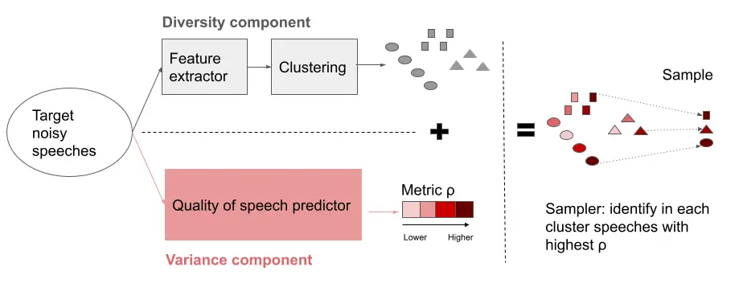
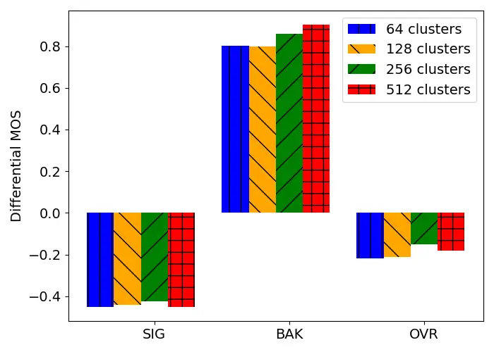

# Aura: Privacy-preserving Augmentation to Improve Test Set Diversity in Speech Enhancement

Xavier Gitiaux    Aditya Khant    Ebrahim Beyrami    Chandan Reddy
\sthanksWork performed while at Microsoft. Currently affiliated with
Google    Jayant Gupchup\sthanksWork performed while at Microsoft.
Currently affiliated with Uber    Ross Cutler

###### Abstract

Speech enhancement models running in production environments are
commonly trained on publicly available data. This approach leads to
regressions due to the lack of training/testing on representative
customer data. Moreover, due to privacy reasons, developers cannot
listen to customer content. This ‘ears-off’ situation motivates Aura, an
end-to-end solution to make existing speech enhancement train and test
sets more challenging and diverse while being sample efficient. Aura is
‘ears-off’ because it relies on a feature extractor and metrics of
speech quality, DNSMOS P.835, and AECMOS, that are pre-trained on data
obtained from public sources. We evaluate Aura on two speech enhancement
tasks: noise suppression (NS) and audio echo cancellation (AEC).

Aura samples an NS test set 0.42 harder in terms of P.835 OVRL than
random sampling; and, an AEC test set 1.93 harder in AECMOS. Moreover,
Aura increases diversity by 30% for NS tasks and by 530% for AEC tasks
compared to greedy sampling. Moreover, Aura achieves a $`26\%`$
improvement in Spearman’s rank correlation coefficient (SRCC) compared
to random sampling when used to stack rank NS models.

^(†)^(†)address: 1. Microsoft Corporation, Redmond WA, USA. Email:
*firstname.lastname@microsoft.com*  
2. Email: *chandan.ka@outlook.com*, 3. Email: *gupchup@gmail.com*

Index Terms: speech enhancement, privacy, test set

## 1 INTRODUCTION

Communication platforms such as Microsoft Teams and Skype operate under
a wide range of devices, speakers, and ambient conditions, where speech
enhancement (SE) tasks consist in removing background noise,
reverberation, and echo \[1\]. Deep learning-based approaches provide
state-of-the-art improvement of speech quality but typically involve
supervised training on synthetic data that mix clean and noisy speech.
Synthetic data cannot fully capture real-world conditions and test sets
used during model evaluation

are not necessarily representative of all the audio scenarios present in

customer workloads \[2\]. Moreover, privacy and compliance often
prohibit labelling customer workloads.

This paper presents Aura, an ‘ears-off’ methodology to sample
efficiently audio clips that are: (i) challenging to SE models and (ii)
representative of the diverse conditions existing in the customer
workload. In our setting, ‘ears-off’ means that audio from customers
cannot be listened to; only aggregate metrics can be logged out of the
‘ears-off’ environment.

Aura operates in an ‘ears-off’ mode by relying on a pre-trained audio
feature extractor such as VGGish \[3\] and pre-trained accurate
objective speech quality metrics such as DNSMOS P.835 \[4\] or AECMOS
\[5\]. Both feature extractors and speech quality metrics are
convolution-based models trained on large-scale open-sourced data. Aura
maps customer data into an embedding space, stratifies the data via
clustering, identifies the most challenging scenarios for the SE task
within each cluster, and reports aggregate model performances on these
challenging conditions.

We apply Aura to rank $`28`$ noise suppression models from the
INTERSPEECH 2021 DNS Challenge \[6\] in terms of DNSMOS P.835 \[4\]. We
show that the SRCC between a $`1\%`$ sample produced by Aura and the
entire mixture of noisy speech is $`0.91`$. This is an improvement of
$`26\%`$ compared to a $`1\%`$ random sampling of noisy speech. We also
apply _Aura_ to augment the benchmark test set for NS \[6\]. The
resulting test set is more challenging to NS models with a predicted
absolute overall decline of $`0.27`$ in differential MOS and captures
more diverse audio scenarios with an increase of $`31\%`$ in diversity
(as measured by $`\delta_{\chi^{2}}`$ distance) compared to the current
benchmark test set \[6\]. Lastly, we use Aura to create a test set for
AEC models with an absolute decline of 1.92 in differential echo MOS
relative to random sampling and a $`530\%`$ increase in diversity
relative to greedy sampling.

The main contributions of this paper are as follows: a ‘ears-off’
methodology to construct challenging and diverse test sets for SE
applications deployed in production environments; a generic approach to
measure test set diversity; ¹¹ 1 Code is available at
[github.com/microsoft/Aura](https://github.com/microsoft/aura)..

## 2 Related Work

The Deep Noise Suppression (DNS) benchmark challenge \[6\] created an
extensive open-sourced noisy speech test set. However, the resulting
benchmark test set does not cover all the scenarios experienced by
customers using real-time communication platforms. Aura addresses this
gap by creating a test set more representative of customer workload
while preserving customer privacy.

The literature on test set construction in production scenarios is
sparse. In software development, Rothermel et al. present metrics to
evaluate testing coverage \[7\]: path coverage, percentage of tests
affecting system state, and worst-case runtime metrics. Mani et al.
evaluate the coverage of test sets for classifiers using class
distribution (equivalence partitioning), within-class distance (centroid
positioning), and between class statistics (boundary conditioning)
\[8\]. Aura extends Mani et al. to speech enhancement problems where
there are no predictive classes to measure testing coverage. Instead,
Aura uses classes from a known ontology of audio events \[9\] and
replaces centroid positioning and boundary conditioning statistics with
a speech quality metric that quantifies the level of difficulty in the
overall test set.

Well-established ontologies are instrumental in creating large-scale and
diverse public dataset in object detection (e.g., ImageNet, \[10\], Open
Images \[11\]) and audio event detection (Audio Set \[9\]). ImageNet
relies on the hierarchical ontology established by Wordnet \[12\] and
contains about 15 million images that cover 22K Wordnet concepts. Audio
Set relies on an ontology of 632 sound types. Pham et al. show how to
measure diversity based on an existing ontology, a reference
distribution and a distance metric \[13\].

Active learning is commonly employed to prioritise the samples to label
when labelling is expensive \[14, 15\]. The learner selects the data
points from a pool of unlabelled data using either uncertainty-based or
diversity-based heuristics. Kossen et al. show that it is optimal to
prioritise hard examples to reduce the variance of a given evaluation
metric \[15\]. However, these uncertainty-based heuristics do not
preclude selecting redundant scenarios. Sener et al. propose a
diversity-based solution identifying the most representative set of data
points that are the most representative of the entire data set \[16\].

This paper integrates diversity and uncertainty-based techniques to
create a test set for SE models.

A growing body of work has developed differentially private learning
algorithms that do not expose private customer data \[17\]. Differential
privacy allows private computation of evaluation metrics \[18\] if the
data is already annotated. Federated learning is a partial solution to
the ‘ears-off’ problem as it enables training models on decentralised
devices \[19\]. However, federated learning does not solve the issue of
collecting an ‘ears-off’ test set to evaluate the model on a production
workload. Finally, we use DNSMOS P.835 \[4\] and AECMOS \[5\] to
estimate speech quality without the need for a clean reference and for
listening to the audio content.

## 3 Use Cases and Solution

In this section, we present the use cases for Aura and describe our
end-to-end solution to address each use case.

### 3.1 Test set 1 (TS1): Challenging and Diverse Test Set

We apply Aura first to sample a subset of audio clips from a database to
form for a given SE model a test set with challenging and diverse
scenarios. The quality of the test set is measured with an objective
speech quality metric ($`\rho`$) and a diversity metric
($`\delta_{\chi^{2}}`$) (see Section 3.3).

### 3.2 Test set 2 (TS2): Production Workload Test Set

A typical model evaluation task is to rank the speech quality $`\rho`$
produced by multiple SE models against a representative workload that
mirrors the distribution observed in the production system. The main
motivation is to (i) ensure that SE models do not introduce regressions
by degrading the scenarios frequently encountered by users of the
system, and (ii) find audio scenarios that allow discriminating model
performances. We rank SE models according to the quality metric
$`\rho`$. We measure sampling performance by comparing the Spearman’s
rank correlation coefficient (SRCC) between the ranking of the models
obtained with the sample and the ranking obtained with the entire
representative workload.

Figure 1: Overall structure of _Aura_. _Aura_ reduces the variance of
the performance metric $`\rho`$ (red) while maximising the diversity
component (gray) to ensure good coverage of audio scenarios in the
embedding space.

1: Inputs: Sample $`\mathcal{S}`$, noise type ontology $`\mathcal{O}`$

2: Output: $`\chi^{2}`$ distance $`\delta_{\chi^{2}}`$

3: $`n=|S|`$: \# of clips in $`\mathcal{S}`$

4: $`C=|\mathcal{O}|`$: \# of classes in $`\mathcal{O}`$

5:
$`p_{c}=\frac{\mbox{number of clips in }\mathcal{S}\mbox{ with noise type }c}{n}`$

6: $`p_{u}=\frac{1}{C}`$ (probability of classes in uniform
distribution)

7: Compute
$`\delta_{\chi^{2}}=\displaystyle\sum_{c=1}^{C}\frac{\left(p_{c}-p_{u}\right)^{2}}{p_{c}+p_{u}}`$

8: Returns $`\delta_{\chi^{2}}`$.

Algorithm 1 Diversity evaluation

### 3.3 End-to-end Solution

The end-to-end Aura system is described in Figure 1.

Input: A large database of speech clips ($`\mathcal{D}`$). For TS1
(Section 3.1), the clean speech clips are filtered out. For TS2 (Section
3.2), the database contains the representative workload that includes
clean speech.

Output: A test set sampled from the input dataset.

Feature Extractor: Our extractor is constructed from VGGish, a model
pre-trained on a 100M YouTube videos dataset \[3\]. It generates a
128-dimension embedding for each clip.

Clustering: In practice, audio clips collected in a production
environment are not labelled with sound types from the Audioset
ontology. Instead, we create a soft ontology of sound types by
performing kmeans++ on the embedding space to partition $`1.5`$ million
noisy speech into $`256`$ clusters \[20\]. The number of clusters is
selected as the number that achieves the lowest Davies-Bouldin index,
where the index is computed using Euclidean distance in the embedding
space.

Sampler: To trade-off variance and bias, Aura applies
probability-proportional-to-size sampling within each cluster. Within
each cluster, it prioritises clips with the highest $`\rho`$.

Objective Metric: For each speech clip, the P.835 \[21\] protocol
generates a MOS for signal quality SIG, background noise BAK, and
overall quality OVRL; and the P.831 protocol \[22\] evaluates echo
impairment. Reddy et al. and Purin et al. show that convolution-based
models DNSMOS and AECMOS achieve 0.98 correlation with the human ratings
obtained via the P.835 and P.831 listening protocols \[4, 5\]. We derive
our quality of speech metric $`\rho`$ from DNSMOS and AECMOS by
measuring the differential MOS (DMOS) between DNSMOS and AECMOS
predictions before and after denoising. A negative value for the DMOS
$`\rho`$ indicates that the SE method degrades the quality of speech.

## 4 EVALUATION AND RESULTS

### 4.1 Diversity Metric

We leverage the ontology from Audio Set and follow the approach
presented by Pham et al. \[13\]. We consider a uniform distribution over
the 527 sound types in Audio Set as our reference distribution. We
measure the diversity of a test set as the histogram distance
$`\delta_{\chi^{2}}`$ \[23\] between the reference distribution and the
distribution of the test set (see Algorithm 1) The lower the
$`\chi^{2}`$ distance, the more audio properties encoded in the
embedding space the resulting test set covers: $`\delta_{\chi^{2}}=0`$
means that the test set covers uniformly all noise types;
$`\delta_{\chi^{2}}=1`$ means that the test set has no overlap with the
noise categories in the reference distribution.

### 4.2 Simulated Ears-off Dataset

We perform experiments on a simulated ears-off dataset that serves as as
a ground truth and is made publicly available \[24\]. For the NS task,
we create noisy speech candidates to add to the benchmark test set
\[6\]. We mix sounds from the balanced split of Audio Set \[9\] with
clean speech clips \[6\]. We use segments from Audio Set as background
noise and follow \[6\] to generate noisy speech with a signal-to-noise
ratio (SNR) between -5 dB and 5 dB. The resulting target data combines
1000 files from the benchmark test set with 22K of 10 seconds clips from
the newly synthesised noisy speech that covers 302 noise types. The pool
of noisy speech candidates is partially out-of-distribution compared to
\[6\], which covers 227 noise types, and the train set of DNSMOS P.835
and thus, reproduces the conditions of an ‘ears-off’ environment.

For each noisy speech in the previous target data, we randomly draw 10
clean speech clips from \[6\]. The clean speech presents a challenge

to stack rank models because it does not allow discriminating the
performance of noise suppressors. For the AEC task, we collected 33K
audio clips from the INTERSPEECH 2021 AEC Challenge dataset that
contains diverse speaker and noise conditions

\[25\].

| Test set        | DMOS         |              |              | $`\delta_{\chi^{2}}`$ | Classes |
| --------------- | ------------ | ------------ | ------------ | --------------------- | ------- |
|                 | SIG          | BAK          | OVRL         |                       | covered |
| DNS             | -0.24        | 0.99         | 0.18         | 0.53                  | 227     |
| Benchmark \[6\] | $`\pm 0.01`$ | $`\pm 0.01`$ | $`\pm 0.01`$ |                       |         |
| Random          | -0.23        | 1.27         | 0.33         | 0.55                  | 243     |
|                 | $`\pm`$ 0.01 | $`\pm 0.01`$ | $`\pm`$ 0.01 |                       |         |
| Greedy          | -0.57        | 0.91         | -0.32        | 0.53                  | 249     |
| (no cluster)    | $`\pm`$ 0.01 | $`\pm 0.01`$ | $`\pm`$ 0.01 |                       |         |
| Aura            | -0.40        | 0.92         | -0.09        | 0.37                  | 302     |
|                 | $`\pm 0.01`$ | $`\pm 0.01`$ | $`\pm 0.01`$ |                       |         |

Table 1: Aura-based DNS test set. Sample provided by Aura on the
augmented benchmark dataset increases difficulty level (lower DMOS) and
diversity (lower $`\delta_{\chi^{2}}`$, higher coverage)). $`\pm`$
represents 95% conf. intervals and “classes covered” represents the
categories covered in the Audio Set ontology.

### 4.3 TS1: Challenging and Diverse Test Set

Noise suppression. For generating TS1, we only consider the noisy speech
candidates from the simulated ears-off dataset and create a test set of
1000 clips as in \[6\]. We measure the DMOS metric $`\rho`$ and
$`\delta_{\chi^{2}}`$ as explained in Section 3.3. We say that a test
set is challenging if it captures the audio scenarios for which
$`\rho\leq 0`$.

Table 1 compares DMOS and $`\delta_{\chi^{2}}`$ for the following
sampling strategies: random, greedy (sorted by ascending DMOS without
clustering), and Aura. The Aura test set is more challenging to NS
models than the benchmark and random test sets. NS models degrade by
$`0.16`$ in SIG DMOS and $`0.27`$ in OVRL DMOS compared to the benchmark
test set. Covering each cluster in the embedding space is instrumental
to increasing the diversity of the test set. Aura’s test set with
clustering covers $`302`$ noise types in the reference distribution (out
of $`527`$ classes), while Aura’s test set without clustering (Greedy)
covers only $`249`$ of the noise types, which is only a marginal
improvement over the benchmark test set. Aura balances diversity and
challenging scenarios, while greedy sampling could oversample one
challenging but redundant scenario.

The $`\chi^{2}`$ distance decreases from $`0.53`$ without clustering to
$`0.37`$ with clustering.

Figure 2 shows the top-10 noise types (in green) from the augmenting
dataset of noisy speech that _Aura_ adds to the test set. _Aura_
prioritises new audio scenarios compared to the top 10 noise types
present in the benchmark test set.

Audio Echo Cancellation. Table 2 shows similar results for echo
cancellation tasks. The Aura test set is significantly more challenging
than random with an absolute decline in echo MOS of 1.93 relative to
random. Aura reduces the DMOS gap between tests created by random
sampling and the most challenging test set (as produced by greedy
sampling) that can be obtained from our simulated dataset by 84%. Unlike
greedy sampling, Aura’s decrease in DMOS comes with a significant
increase in the diversity of audio conditions included in the test set:
the $`\delta_{\chi^{2}}`$ decreases from 0.76 (for Greedy) to 0.12 for
Aura.

|                     |                   |                       |         |
| ------------------- | ----------------- | --------------------- | ------- |
| Test set            | DMOS              | $`\delta_{\chi^{2}}`$ | Classes |
|                     |                   |                       | covered |
| AEC Benchmark       | 2.78 $`\pm 0.01`$ | 0.58                  | 75      |
| Random              | 1.74 $`\pm 0.01`$ | 0.59                  | 88      |
| Greedy (no cluster) | -0.55$`\pm 0.01`$ | 0.76                  | 79      |
| Aura                | -0.19$`\pm 0.01`$ | 0.12                  | 147     |

Table 2: Aura-based AEC test set. Same as in Table 1 but for AEC task.

Sensitivity to the number of clusters. Aura identifies the optimal
number (256) of clusters to seed kmeans++ by minimising the
Davies-Bouldin index (see section 3.3). In Figure 3 (left), OVRL, SIG,
and BAK DMOS are not sensitive to increases in the number of clusters
from 64 to 512. For signal quality (SIG), the DMOS remains stable around
-0.4.

### 4.4 TS2: Production Workload Test Set

|                     |                      |                       |                       |
| ------------------- | -------------------- | --------------------- | --------------------- |
| Sampling            | SRCC                 |                       |                       |
| method              | SIG                  | BAK                   | OVRL                  |
| _Random_            | $`0.58`$$`\pm 0.02`$ | $`0.72`$$`\pm 0.01`$  | $`0.72`$ $`\pm 0.02`$ |
| _Stratified-Random_ | $`0.72`$$`\pm 0.02`$ | $`0.89`$ $`\pm 0.01`$ | $`0.82`$$`\pm 0.01`$  |
| _Variance_          | $`0.80`$$`\pm 0.01`$ | $`0.93`$ $`\pm 0.01`$ | $`0.88`$$`\pm 0.01`$  |
| _Aura_              | 0.84$`\pm`$ 0.01     | 0.93 $`\pm`$ 0.01     | 0.91$`\pm`$ 0.01      |

Table 3: SRCC between the ranking of 28 NS models obtained from a
$`1\%`$ Aura sample with the ranking obtained from using the entire
data. 95% conf interval depicted using $`\pm`$.

For TS2, we include clean speech in the simulated dataset. For each
speech clip, we run $`28`$ noise suppression models from the benchmark
challenge \[6\]. We report the SRCC of the DNSMOS P.835 for the sample
compared to the entire dataset. We bootstrap the sampling 200 times and
report the mean and standard deviation of the resulting rank correlation
coefficients. We compare _Aura_’s sampling performance to three
alternatives: (i) _Random_, which draws randomly $`1\%`$ of data; (ii)
_Stratified-Random_, which stratifies the data into clusters and samples
uniformly within clusters; (iii) _Variance_, which samples
proportionally to the variance of DMOS across the 28 models. In Table 3,
_Aura_’s sampling leads to an improvement in SRCC across all three P.835
components. For overall quality (OVRL), we observe a $`26\%`$ SRCC
improvement over random sampling. We also observe that the $`95\%`$
confidence interval of the ranking obtained from _Aura_-based samples
are narrower than the one obtained by random sampling. Figure 3 (right)
shows that for larger samples, _Aura_ still outperforms _Random_ in
terms of rank correlation.

Figure 2: Top-10 categories not in distribution (green) and
in-distribution (blue) noise categories in Aura test set.
In-distribution relates to categories in the benchmark test set \[6\].

Figure 3: Left: Aura’s sensitivity to the number of clusters. This shows
DMOS for NS task and Aura-based test sets generated with different
numbers of clusters. Right: SRCC of Aura-based rank estimates as a
function of sample size.

## 5 Conclusion

Aura presents an end-to-end system for improving test sets used to
evaluate speech enhancement models in an ‘ears-off’ environment. Aura
creates challenging, diverse test sets by relying on objective quality
metrics, a pre-trained feature extractor, and an established ontology.
The method is generic and can be applied to diverse audio tasks,
including noise suppression and echo cancellation.

Aura balances customer privacy and needs to measure model performance in
real-world scenarios.

Future work includes (i) adding new classes that appear in customer
workload and are not yet covered by the existing sound type ontology;
and, (ii) sampling train set for SE models.

## References

- \[1\] Y. Ephraim and D. Malah, “Speech enhancement using a minimum
  mean-square error log-spectral amplitude estimator,” _IEEE
  transactions on acoustics, speech, and signal processing_, vol. 33,
  no. 2, pp. 443–445, 1985.
- \[2\] Z. Xu, M. Strake, and T. Fingscheidt, “Deep noise suppression
  with non-intrusive pesqnet supervision enabling the use of real
  training data,” _arXiv preprint arXiv:2103.17088_, 2021.
- \[3\] S. Hershey, S. Chaudhuri, D. P. Ellis, J. F. Gemmeke, A. Jansen,
  R. C. Moore, M. Plakal, D. Platt, R. A. Saurous, B. Seybold _et al._,
  “Cnn architectures for large-scale audio classification,” in _2017
  IEEE ICASSP_. IEEE, 2017, pp. 131–135.
- \[4\] C. Reddy, V. Gopal, and R. Cutler, “DNSMOS P.835: A
  non-intrusive perceptual objective speech quality metric to evaluate
  noise suppressors,” _arXiv preprint arXiv:2101.11665_, 2021.
- \[5\] M. Purin, S. Sootla, M. Sponza, A. Saabas, and R. Cutler,
  “Aecmos: A speech quality assessment metric for echo impairment,” in
  _ICASSP 2022-2022 IEEE International Conference on Acoustics, Speech
  and Signal Processing (ICASSP)_. IEEE, 2022, pp. 901–905.
- \[6\] C. K. Reddy, H. Dubey, K. Koishida, A. Nair, V. Gopal,
  R. Cutler, S. Braun, H. Gamper, R. Aichner, and S. Srinivasan,
  “Interspeech 2021 Deep Noise Suppression Challenge,”
  _Interspeech_, 2021.
- \[7\] G. Rothermel and M. J. Harrold, “Analyzing regression test
  selection techniques,” _IEEE Transactions on software engineering_,
  vol. 22, no. 8, pp. 529–551, 1996.
- \[8\] S. Mani, A. Sankaran, S. Tamilselvam, and A. Sethi, “Coverage
  testing of deep learning models using dataset characterization,”
  _arXiv preprint arXiv:1911.07309_, 2019.
- \[9\] J. F. Gemmeke, D. P. W. Ellis, D. Freedman, A. Jansen,
  W. Lawrence, R. C. Moore, M. Plakal, and M. Ritter, “Audio set: An
  ontology and human-labeled dataset for audio events,” in _Proc. IEEE
  ICASSP 2017_, New Orleans, LA, 2017.
- \[10\] J. Deng, W. Dong, R. Socher, L.-J. Li, K. Li, and L. Fei-Fei,
  “Imagenet: A large-scale hierarchical image database,” in _2009 IEEE
  conference on computer vision and pattern recognition_. Ieee, 2009,
  pp. 248–255.
- \[11\] A. Kuznetsova, H. Rom, N. Alldrin, J. Uijlings, I. Krasin,
  J. Pont-Tuset, S. Kamali, S. Popov, M. Malloci, A. Kolesnikov
  _et al._, “The open images dataset v4,” _International Journal of
  Computer Vision_, vol. 128, no. 7, pp. 1956–1981, 2020.
- \[12\] G. A. Miller, “Wordnet: a lexical database for english,”
  _Communications of the ACM_, vol. 38, no. 11, pp. 39–41, 1995.
- \[13\] T. Pham, R. Hess, C. Ju, E. Zhang, and R. Metoyer,
  “Visualization of diversity in large multivariate data sets,” _IEEE
  Transactions on Visualization and Computer Graphics_, vol. 16, no. 6,
  pp. 1053–1062, 2010.
- \[14\] B. Settles, “Active learning literature survey,” 2009.
- \[15\] J. Kossen, S. Farquhar, Y. Gal, and T. Rainforth, “Active
  testing: Sample-efficient model evaluation,” _arXiv preprint
  arXiv:2103.05331_, 2021.
- \[16\] O. Sener and S. Savarese, “Active learning for convolutional
  neural networks: A core-set approach,” in _ICLR_, 2018.
- \[17\] M. Abadi, A. Chu, I. Goodfellow, H. B. McMahan, I. Mironov,
  K. Talwar, and L. Zhang, “Deep learning with differential privacy,” in
  _Proceedings of the 2016 ACM SIGSAC_, 2016, pp. 308–318.
- \[18\] K. Boyd, E. Lantz, and D. Page, “Differential privacy for
  classifier evaluation,” in _Proceedings of the 8th ACM Workshop on
  Artificial Intelligence and Security_, 2015, pp. 15–23.
- \[19\] S. Latif, S. Khalifa, R. Rana, and R. Jurdak, “Federated
  learning for speech emotion recognition applications,” in _2020 19th
  ACM/IEEE International Conference on Information Processing in Sensor
  Networks (IPSN)_. IEEE, 2020, pp. 341–342.
- \[20\] D. Arthur and S. Vassilvitskii, “k-means++: The advantages of
  careful seeding,” Stanford, Tech. Rep., 2006.
- \[21\] B. Naderi and R. Cutler, “Subjective Evaluation of Noise
  Suppression Algorithms in Crowdsourcing,” in _INTERSPEECH_, 2021.
- \[22\] R. Cutler, B. Naderi, M. Loide, S. Sootla, and A. Saabas,
  “Crowdsourcing approach for subjective evaluation of echo impairment,”
  in _ICASSP 2021 - 2021 IEEE International Conference on Acoustics,
  Speech and Signal Processing (ICASSP)_, 2021, pp. 406–410.
- \[23\] O. Pele and M. Werman, “The quadratic-chi histogram distance
  family,” in _European conference on computer vision_. Springer, 2010,
  pp. 749–762.
- \[24\] Microsoft, “Aura: A library for creating challenging and
  diverse test sets for noise suppression applications.” \[Online\].
  Available:
  [https://github.com/microsoft/Aura](https://github.com/microsoft/Aura)
- \[25\] R. Cutler, A. Saabas, T. Parnamaa, M. Loide, S. Sootla,
  M. Purin, H. Gamper, S. Braun, K. Sorensen, R. Aichner, and
  S. Srinivasan, “Interspeech 2021 acoustic echo cancellation
  challenge,” in _INTERSPEECH_, 2021.
