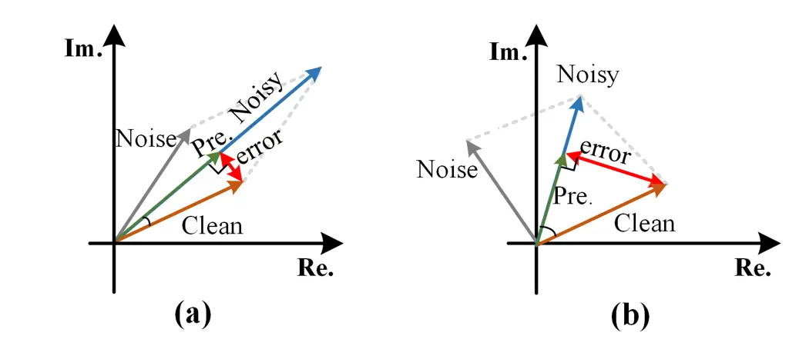
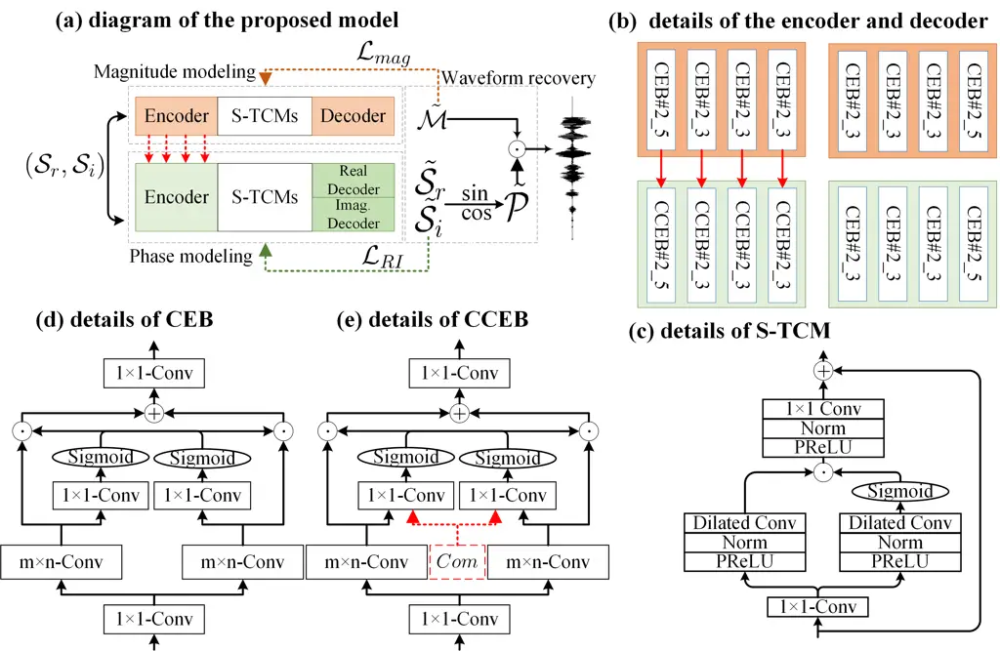
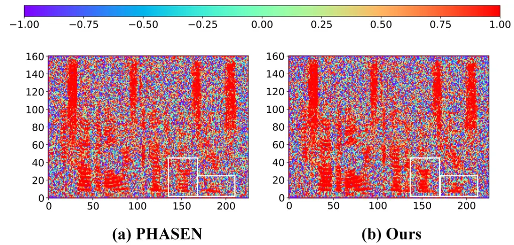

# Foster Strengths and Circumvent Weaknesses: a Speech Enhancement Framework with Two-branch Collaborative Learning

Wenxin Tai\*    Jiajia Li\*    Yixiang Wang    Tian Lan$`\dagger`$
^(†)^(†)thanks: \* denotes authors have same contributions. This
research has been supported in part by the National Science Foundation
of China (U19B2028, 61772117), National Science and Technology
Commission Innovation Project (19-163-21-TS-001-042-01), and the
Fundamental Research Funds for the Central Universities (ZYGX2019J077).
   Qiao Liu

###### Abstract

Recent single-channel speech enhancement methods usually convert
waveform to the time-frequency domain and use magnitude/complex spectrum
as the optimizing target. However, both magnitude-spectrum-based methods
and complex-spectrum-based methods have their respective pros and cons.
In this paper, we propose a unified two-branch framework to foster
strengths and circumvent weaknesses of different paradigms. The proposed
framework could take full advantage of the apparent spectral regularity
in magnitude spectrogram and break the bottleneck that magnitude-based
methods have suffered. Within each branch, we use collaborative expert
block and its variants as substitutes for regular convolution layers.
Experiments on TIMIT benchmark demonstrate that our method is superior
to existing state-of-the-art ones.

###### Index Terms: 

speech enhancement, magnitude reconstruction, phase estimation,
collaborative learning.

^(†)^(†)address: University of Electronic Science and Technology of
China

## 1 Introduction

Signals contaminated by various background interference in daily life
vastly degrade the speech quality for human listeners. In this context,
speech enhancement (SE) came into being, aiming to improve hearing
comfort by separating human voice and noise signals. Traditional SE
methods \[1, 2, 3\] have been extensively studied in the last decades,
achieving remarkable improvements in general but breaking down when
faced with non-stationary scenarios. Recently, this issue has been well
addressed with the involvement of deep learning paradigms.



Figure 1: Phase influence under different conditions. (a) is under the
surroundings with the same energy for noise and clean parts in similar
directions. (b) is under the surroundings with the same energy for noise
and clean parts in the opposite direction.

According to the training patterns they work on, existing single-channel
SE methods can be classified into two categories: waveform-based
time-domain speech estimation and time-frequency (T-F) domain spectrum
reconstruction. As the spectrum contains more distinct feature patterns,
suppressing noise in the T-F instead of the time domain seems to have
more advantages \[4, 5\].

Most previous studies explore the recovery of magnitude spectrogram and
directly incorporate the noisy phase for speech waveform
reconstruction \[6, 7, 8\]. However, as shown in Fig. 1, the unprocessed
phase restricts the performance upper bound of magnitude-based SE
methods. Based on this observation, Yin et al. \[5\] proposed a
two-stream framework, utilizing magnitude information to facilitate
phase prediction.

In this paper, we argue that phase information appears irregular,
signifying that operating on phase spectrum is intractable to model
phase information accurately, regardless of the assistance of external
knowledge. Considering the pros and cons of each training pattern, i.e.,
magnitude spectrum-based methods can take advantage of apparent spectral
regularity, whereas complex spectrum-based methods can implicitly
estimate phase information, we present a unified two-branch framework
that fosters strengths and circumvents weaknesses of different
paradigms. In concrete, we split a SE task into two sub-targets, one
branch for direct magnitude spectrum reconstruction and the other for
implicit phase estimation.



Figure 2: (a) refers to the diagram of the proposed model. (b) is the
detail of encoder and decoder, where $`\#m\_n`$ denotes the kernel size
of the convolution. (c) is the detail of S-TCM. (d) (e) are flowcharts
of the CEB and CCEB, respectively. $`Com`$ refers to the compensatory
feature from the magnitude-based branch, and it influences the gating
operation by direct addition operation. To meet the real-time
requirement as well as alleviate the parameter burden, we set the stride
to (1, 2) for encoder and decoder. For simplicity, we omit normalization
and activation in (d) (e).

In the design of different branches, we utilize the information from the
magnitude-based stream as the additional supervised signal to facilitate
the feature processing of the complex-based stream. Meanwhile, the
implicit estimated phase from the complex-based stream will serve as a
substitute for the noisy one. Besides, inspired by expert
learning \[9\], we replace the regular convolution layer with our
proposed collaborative expert block (CEB) and its variants to increase
the model’s capability of feature processing. Comprehensive experiments
on TIMIT dataset verify the effectiveness and superiority of our
framework.

## 2 Methodology

We design a speech enhancement system with two objectives in mind.
First, it should make full use of the merits of each training paradigm.
To realize this, we propose a two-branch SE framework to recover
magnitude and phase spectrum simultaneously. Second, each branch should
avoid their corresponding drawbacks as much as possible. Considering the
vocals are easily distinguishable on the magnitude spectrum, and there
exist potential associations between magnitude and complex spectrum, we
use external knowledge from the magnitude-based stream to calibrate
feature processing of the complex-based stream. In addition, the phase
information implicitly optimized by the complex-based stream will unify
with the estimated magnitude spectrum from the magnitude-based stream to
reconstruct the speech signal.

### 2.1 Notations

We present the diagram of the proposed approach, as shown in Fig. 2. In
this paper, we denote the $`(\mathcal{S}_{r},\mathcal{S}_{i})`$ as the
noisy complex spectrum after short time fourier transform (STFT), while
$`(\tilde{\mathcal{S}}_{r},\tilde{\mathcal{S}}_{i})`$ are the estimated
real and imaginary parts from the complex-based stream. Then, estimated
(complex) phase $`\tilde{\mathcal{P}}\in\mathbb{R}^{T\times F\times 2}`$
can be obtained from
$`(\tilde{\mathcal{S}}_{r},\tilde{\mathcal{S}}_{i})`$ via trigonometric
function. Finally, estimated magnitude
$`\tilde{\mathcal{M}}\in\mathbb{R}^{T\times F\times 1}`$ from the
magnitude-based stream is used along with $`\tilde{\mathcal{P}}`$ to
reconstruct the time-domain speech waveform by inverse STFT.

### 2.2 The proposed two-branch framework

Both sub-networks use complex spectrum as input and have a similar
network topology, consisting of a standard encoder-decoder framework.
Instead of using a regular convolutional layer as the basic unit for
encoder and decoder, CEB and its variants are utilized to better capture
the intrinsic harmonic features of the spectrum. In the bottleneck
layer, we use stacked temporal convolution modules (S-TCM) proposed
in \[10\] to capture both short and long-range sequence dependencies.
Fig.2 (c) presents the architecture of S-TCM. It first squeezes the
input feature into a lower dimension through a $`1\times 1`$ convolution
layer. A self-gating operation is applied to better control the
information flow, followed by a $`1\times 1`$ convolution layer. Each
branch in the self-gating part uses 1-D convolution blocks with
increasing dilation factors. We use 3 groups of S-TCMs as the sequential
module, each of which stacks 6 S-TCM units with different dilation
rates, namely, (1, 2, 4, 8, 16, 32).

### 2.3 Collaborative expert block (CEB)

With the growing demand for speech-related services over the past few
years, the scenarios requiring speech enhancement are becoming more
diverse and complex. This observation increases concerns about current
SE systems: do we need to train a separate model for each scenario to
guarantee the denoising performance? Considering that training multiple
models is cumbersome from a commercialization point of view, we get
inspiration from expert systems and design CEB (Fig. 2 (d)) as a
substitute for the regular convolutional layer. Note that for the
encoder in the complex-based branch, we use a variant of CEB dubbed CCEB
(compensatory and collaborative expert block) to utilize additional
supervised signals from the magnitude-based stream.

We use two parallel convolutions as different experts. Different experts
are expected to have different views on the same object. Each expert’s
output is used to offer guidance and control the other’s information
flow via the gating mechanism. To ease the parameter burden, we squeeze
and excite features (channel dimension $`64\rightarrow 32`$ and
$`32\rightarrow 64`$) before and after expert learning by applying
$`1\times 1`$ convolution layers.

### 2.4 loss function

Since two sub-networks have different training targets, we apply
different loss functions to optimize sub-networks until convergence.
Specifically, we train magnitude-based branches with mean absolute
errors (MAE) loss in magnitude and train complex-based branches with MAE
losses in real and imaginary parts. Two branches are trained jointly,
and the total loss is defined as:

```math
\left\{\begin{aligned} \mathcal{L}_{mag}&=\frac{1}{N}\sum_{i=1}^{N}\lvert\tilde{\mathcal{M}}-\mathcal{M}\rvert\\
\mathcal{L}_{RI}&=\frac{1}{N}\sum_{i=1}^{N}(\lvert\tilde{\mathcal{S}}_{r}-\mathcal{S}_{r}\rvert+\lvert\tilde{\mathcal{S}}_{i}-\mathcal{S}_{i}\rvert)\\
\mathcal{L}&=\alpha\cdot\mathcal{L}_{mag}+(1-\alpha)\cdot\mathcal{L}_{RI}\end{aligned}\right. \tag{1}
```

where $`N`$ refers to the number of training samples. $`\tilde{M}`$ and
$`M`$ represent the enhanced magnitude and clean magnitude.
$`\tilde{S}_{r}`$ and $`\tilde{S}_{i}`$ denote the real and imaginary
part of the ground truth. $`\alpha`$ is the weighted coefficient, and we
set $`\alpha`$ as 0.5 in this work.

## 3 Experiments

### 3.1 Dataset

We conducted our experiments using the TIMIT corpus \[11\]. 2000, 100
and 192 clean utterances are randomly selected for training, validating
and testing. We create training and validation datasets under SNR levels
ranging from -5 dB to 10 dB with the interval 1 dB, and generate the
testing dataset under the SNR conditions of (-5 dB, 0 dB, 5 dB, 10 dB).
100 non-speech noises from  \[12\] and 5 life noises (cafeteria,
restaurant, park, office, and meeting) from  \[13\] are used for
training and validation. Other five types of noises (babble, f16,
factory2, m109, and white) from  \[14\] are used to evaluate the
generalization capacity of all networks. All noises are first
concatenated into a long vector. Then, an excerpt of this vector having
the same length as the clear utterance is randomly chosen, scaled, and
subsequently mixed with the given clean signal, providing the desired
SNR condition. As a result, we generate approximately 36 hours of data
for training, 1.5 hours for validation, and 1 hour for testing.

### 3.2 Experimental setting

All utterances are sampled at 16 kHz. A 20 ms Hamming window is
utilized, with 50% overlap in adjacent frames. 320 point FFT is used,
leading to 161-D spectral features. The batch size is set to 2, and
utterances are zero-padded to match the length of the longest in a
mini-batch. All networks are trained for 30 epochs, and the learning
rate is fixed at 0.0002. We optimize models by Adam. The Short-Time
Objective Intelligibility (STOI)  \[15\] and Perceptual Evaluation of
Speech Quality (PESQ) \[16\] are selected for speech quality evaluation.

|                      |          |      |         |      |         |      |         |      |
| -------------------- | -------- | ---- | ------- | ---- | ------- | ---- | ------- | ---- |
| Test SNR             | $`-`$5dB |      | 0dB     |      | 5dB     |      | 10dB    |      |
| Metric               | STOI(%)  | PESQ | STOI(%) | PESQ | STOI(%) | PESQ | STOI(%) | PESQ |
| Noisy                | 60.82    | 1.43 | 71.89   | 1.76 | 81.83   | 2.15 | 89.09   | 2.47 |
| CCRN($`p=17.44`$)    | 73.15    | 1.81 | 82.61   | 2.27 | 88.96   | 2.71 | 93.90   | 3.07 |
| GCRN ($`p=9.77`$)    | 73.67    | 1.91 | 82.96   | 2.34 | 89.17   | 2.73 | 94.07   | 3.09 |
| PHASEN ($`p=5.05`$)  | 74.76    | 2.11 | 82.33   | 2.44 | 87.96   | 2.73 | 91.75   | 2.97 |
| CTS-Net ($`p=4.35`$) | 76.16    | 2.04 | 84.65   | 2.45 | 90.69   | 2.87 | 94.77   | 3.25 |
| Ours ($`p=3.21`$)    | 78.97    | 2.30 | 86.71   | 2.69 | 91.96   | 3.06 | 95.38   | 3.37 |

Table 1: Objective results comparisons among different models in terms
of STOI and PESQ. The best value of each case is marked in bold. $`p`$
denotes the number (million) of parameters.

### 3.3 Baselines

We compare our proposed model with several baselines including
CCRN \[17\], GCRN \[18\], PHASEN \[5\], and CTS-Net \[10\], all of which
consider phase optimization. Specifically, CCRN is a complex
spectrum-based model that incorporates convolution and LSTM. GCRN is
developed on CCRN by replacing regular convolutions with gated linear
units. PHASEN explicitly estimates the phase with the assistance of the
magnitude spectrum. CTS-Net is a two-stage approach that successively
models the magnitude and complex spectrum.

We use complex mapping MAE loss for pure complex domain methods (CCRN,
GCRN), while we use complex mapping MAE loss and magnitude mapping MAE
loss for the others (PHASEN, CTSNet, ours). Besides, as PHASEN is
originally utilized to spectrogram under 512 point FFT, we extend it to
320 FFT for fair comparisons.

### 3.4 Experimental results

Table 1 shows the SE performance of ours and existing state-of-the-art
models. We can see methods that take additional consideration of the
magnitude spectrum yield better results than methods that merely use the
complex spectrum under low SNR conditions. When SNR is high, the
influence of magnitude tends to be small. The rationale behind this
phenomenon is: as SNR degrades, the clearer structure of harmonics in
magnitude spectrum can offer a better direction for network
optimization. Our proposed model outperforms the previous best model
PHASEN and CTS-Net on both metrics. Compared with PHASEN, we adopt a
roundabout way to obtain phase from real and imaginary spectrums rather
than directly estimate phase information, which avoids the difficulty
brought by irregular texture. In addition, unlike CTS-Net, which simply
supplies the magnitude knowledge at the beginning of the phase
estimation, we provide a more fine-grained information-sharing scheme by
utilizing synchronous knowledge to calibrate information at each layer.

### 3.5 Visualizing phase influence



Figure 3: Visulizations of $`cos(\mathcal{P}_{cl}-\mathcal{P}_{est.})`$
spectrum: (a) PHASEN, (b) ours. $`\mathcal{P}`$ denotes the phase
spectrum.

The benefit of our framework in phase prediction can be visualized in
Fig. 3, where we provide figures of phase difference to illustrate the
compensation of the magnitude-based stream for explicit and implicit
phase estimation. With the assistance of external knowledge from the
magnitude-based stream, both PHASEN and our model have the ability to
identify texture borders. The phase spectrum estimated by our framework
is much closer to the ground truth, especially those areas between
harmonics (white box), efficiently optimizing the human auditory
perception of estimated speech. This observation verifies our assumption
that exploring the potential regularity from the chaos phase spectrum is
much difficult than that from the complex spectrum.

### 3.6 Ablation study

In an ablation study, we compare our framework with three variants to
investigate the effects of each part. Among these variants, w/o phase
represents that we use estimated magnitude and unaltered phase to
restore speech; w/o multi-experts represents that we replace each
CEB/CCEB with a regular convolutions; w/o compensation represents that
we forgo interactions from magnitude-based streams to complex
spectrum-based streams. As shown in Table. 2, we can observe that each
part can indeed improve the SE performance.

| Model             | Param.($`m`$) | STOI(%) | PESQ |
| ----------------- | ------------- | ------- | ---- |
| w/o phase         | 1.60          | 87.24   | 2.78 |
| w/o multi-experts | 3.41          | 87.51   | 2.71 |
| w/o compensation  | 3.21          | 87.96   | 2.83 |
| Ours              | 3.21          | 88.25   | 2.86 |

Table 2: Objective results comparisons. $`m`$ refers to million.

## 4 Conclusion

We proposed the two-branch framework with collaborative learning for
monaural speech enhancement. Considering the apparent spectral
regularity and potential associations between magnitude and complex
spectrum, we use external knowledge from the magnitude-based branch as
assistance to facilitate complex spectrum reconstruction. Meanwhile,
implicit phase information from the complex spectrum-based branch will
replace the noisy one. By doing so, advantages from magnitude-based
methods and complex-based methods can be well incorporated.

## References

- \[1\] Steven Boll, “Suppression of acoustic noise in speech using
  spectral subtraction,” IEEE Transactions on acoustics, speech, and
  signal processing, vol. 27, no. 2, pp. 113–120, 1979.
- \[2\] Xiaohu Hu, Shiwei Wang, Chengshi Zheng, and Xiaodong Li, “A
  cepstrum-based preprocessing and postprocessing for speech enhancement
  in adverse environments,” Applied acoustics, vol. 74, no. 12, pp.
  1458–1462, 2013.
- \[3\] Timo Gerkmann and Richard C Hendriks, “Unbiased mmse-based noise
  power estimation with low complexity and low tracking delay,” IEEE
  Transactions on Audio, Speech, and Language Processing, vol. 20, no.
  4, pp. 1383–1393, 2011.
- \[4\] Andong Li, Wenzhe Liu, Xiaoxue Luo, Chengshi Zheng, and Xiaodong
  Li, “Icassp 2021 deep noise suppression challenge: Decoupling
  magnitude and phase optimization with a two-stage deep network,” in
  ICASSP 2021-2021 IEEE International Conference on Acoustics, Speech
  and Signal Processing (ICASSP). IEEE, 2021, pp. 6628–6632.
- \[5\] Dacheng Yin, Chong Luo, Zhiwei Xiong, and Wenjun Zeng, “Phasen:
  A phase-and-harmonics-aware speech enhancement network,” in
  Proceedings of the AAAI Conference on Artificial Intelligence, 2020,
  pp. 9458–9465.
- \[6\] Ke Tan, Jitong Chen, and DeLiang Wang, “Gated residual networks
  with dilated convolutions for monaural speech enhancement,” IEEE/ACM
  transactions on audio, speech, and language processing, vol. 27, no.
  1, pp. 189–198, 2018.
- \[7\] Tian Lan, Yilan Lyu, Guoqiang Hui, Refuoe Mokhosi, Sen Li, and
  Qiao Liu, “Redundant convolutional network with attention mechanism
  for monaural speech enhancement,” in ICASSP 2020-2020 IEEE
  International Conference on Acoustics, Speech and Signal Processing
  (ICASSP). IEEE, 2020, pp. 6654–6658.
- \[8\] Wenxin Tai, Tian Lan, Qianhui Wang, and Qiao Liu, “Idanet: An
  information distillation and aggregation network for speech
  enhancement,” IEEE Signal Processing Letters, 2021.
- \[9\] Abhinav Jain, Vishwanath P Singh, and Shakti P Rath, “A
  multi-accent acoustic model using mixture of experts for speech
  recognition.,” in INTERSPEECH, 2019, pp. 779–783.
- \[10\] Andong Li, Wenzhe Liu, Chengshi Zheng, Cunhang Fan, and
  Xiaodong Li, “Two heads are better than one: A two-stage complex
  spectral mapping approach for monaural speech enhancement,” IEEE/ACM
  Transactions on Audio, Speech, and Language Processing, vol. 29, pp.
  1829–1843, 2021.
- \[11\] John S Garofolo, Lori F Lamel, William M Fisher, Jonathan G
  Fiscus, and David S Pallett, “Darpa timit acoustic-phonetic continous
  speech corpus cd-rom. nist speech disc 1-1.1,” NASA STI/Recon
  technical report n, vol. 93, pp. 27403, 1993.
- \[12\] Guoning Hu and DeLiang L. Wang, “A tandem algorithm for pitch
  estimation and voiced speech segregation,” IEEE Trans. Speech Audio
  Process., vol. 18, no. 8, pp. 2067–2079, 2010.
- \[13\] Joachim Thiemann, Nobutaka Ito, and Emmanuel Vincent, “Demand:
  a collection of multi-channel recordings of acoustic noise in diverse
  environments,” in Proc. Meetings Acoust, 2013, pp. 1–6.
- \[14\] Andrew Varga and Herman JM Steeneken, “Assessment for automatic
  speech recognition: Ii. noisex-92: A database and an experiment to
  study the effect of additive noise on speech recognition systems,”
  Speech communication, vol. 12, no. 3, pp. 247–251, 1993.
- \[15\] Cees H Taal, Richard C Hendriks, Richard Heusdens, and Jesper
  Jensen, “A short-time objective intelligibility measure for
  time-frequency weighted noisy speech,” in 2010 IEEE international
  conference on acoustics, speech and signal processing. IEEE, 2010, pp.
  4214–4217.
- \[16\] Antony W Rix, John G Beerends, Michael P Hollier, and Andries P
  Hekstra, “Perceptual evaluation of speech quality (pesq)-a new method
  for speech quality assessment of telephone networks and codecs,” in
  2001 IEEE international conference on acoustics, speech, and signal
  processing. Proceedings (Cat. No. 01CH37221). IEEE, 2001, vol. 2, pp.
  749–752.
- \[17\] Ke Tan and DeLiang Wang, “Complex spectral mapping with a
  convolutional recurrent network for monaural speech enhancement,” in
  ICASSP 2019-2019 IEEE International Conference on Acoustics, Speech
  and Signal Processing (ICASSP). IEEE, 2019, pp. 6865–6869.
- \[18\] Ke Tan and DeLiang Wang, “Learning complex spectral mapping
  with gated convolutional recurrent networks for monaural speech
  enhancement,” IEEE ACM Trans. Audio Speech Lang. Process., vol. 28,
  pp. 380–390, 2020.
