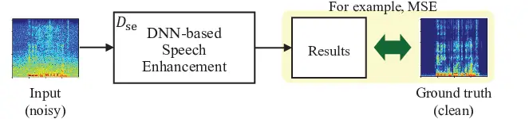
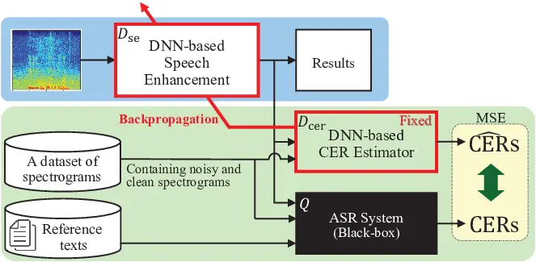
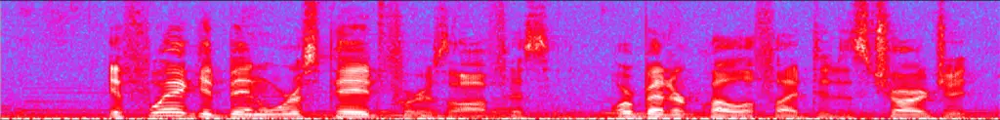
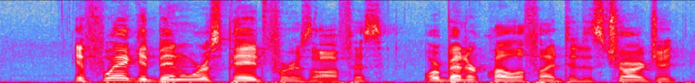
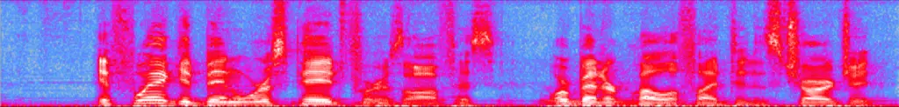
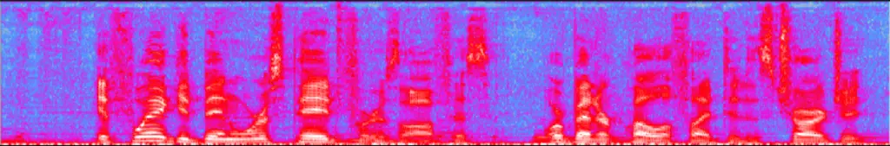

# Improving Character Error Rate Is Not Equal to Having Clean Speech: Speech Enhancement for ASR Systems with Black-box Acoustic Models

Ryosuke Sawata    Yosuke Kashiwagi    Shusuke Takahashi

###### Abstract

A deep neural network (DNN)-based speech enhancement (SE) aiming to
maximize the performance of an automatic speech recognition (ASR) system
is proposed in this paper. In order to optimize the DNN-based SE model
in terms of the character error rate (CER), which is one of the metric
to evaluate the ASR system and generally non-differentiable, our method
uses two DNNs: one for speech processing and one for mimicking the
output CERs derived through an acoustic model (AM). Then both of DNNs
are alternately optimized in the training phase. Even if the AM is a
black-box, e.g., like one provided by a third-party, the proposed method
enables the DNN-based SE model to be optimized in terms of the CER since
the DNN mimicking the AM is differentiable. Consequently, it becomes
feasible to build CER-centric SE model that has no negative effect,
e.g., additional calculation cost and changing network architecture, on
the inference phase since our method is merely a training scheme for the
existing DNN-based methods. Experimental results show that our method
improved CER by 8.8% relative derived through a black-box AM although
certain noise levels are kept.

###### Index Terms: 

Speech enhancement (SE), Automatic speech recognition (ASR), Acoustic
model (AM), Deep neural network (DNN)

^(†)^(†)address: Sony Group Corporation, Tokyo, Japan

## 1 Introduction

Speech enhancement (SE), which aims to extract target speech from noisy
input signal, remains an important research topic in the field of sound
source separation. In particular, many deep neural network (DNN)-based
approaches have appeared in recent years and they have been shown to
dramatically outperform conventional methods. For instance,
convolutional neural networks (CNNs) \[1\] have been shown to be better
than using a short-time Fourier transform (STFT) and inverse STFT
(ISTFT) for building an encoder and decoder \[2\]. Furthermore, methods
that utilize recurrent neural networks (RNNs)-based models have been
shown to be capable of real-time processing \[3, 4, 5\]. In addition,
there are hybrid methods that exploit the benefits of both types of
network, i.e., real-time processing and high performance \[6, 7\].

The aforementioned methods have dramatically improved the performance of
the SE task in terms of some subjective and objective metrics related to
the perceptual quality of processed signals. However, it has been
reported that the performance of automatic speech recognition (ASR) is
often tended to be degraded by using the signals processed by the
DNN-based SE models as input \[8, 9, 10, 11, 12\]. In other words, the
output of DNN-based SE models tends to degrade the quality of the text
results recognized by ASR system. The acoustic model (AM), which is the
part of the ASR system that models the relationship between the audio
signal and the phonetic units in the language, is typically trained in a
data-driven manner, and thus, its performance is strongly affected by
mismatches between the training and testing conditions. In general, the
output signals of SE models have various types of signal distortion.
Particularly, the distortion caused by a DNN-based SE model is
considered especially serious because a DNN is a powerful and complex
non-linear calculator that is rather flexible compared with the
conventional models. Therefore, such various types of signal distortion
cause mismatches with training data and consequently degrade the
performance of ASR¹¹ 1 The same mismatch is expected even in End-to-End
speech recognition, which does not explicitly train AMs..

A straightforward way to solve the above problem is to perform
additional training of the AM by using signals obtained from the output
of a DNN-based SE model, which is called “re-training”\[13\].
Furthermore, joint training, which connects the DNNs of the SE and AM
models and trains the whole connected model as one DNN in terms of the
AM’s criteria, has been shown to be an effective way to improve the
performance of ASR\[14, 15\]. Since the AM becomes able to know the data
provided by the DNN-based SE model via re-training or joint training, it
is obvious that the performance of ASR system can be improved. However,
when trying to use a DNN-based SE model to provide training data to the
AM, these approaches need a huge amount of data to be processed by the
SE model and correspondingly long additional time for training. In
particular, the variations related to the SE task, i.e., signal-to-noise
ratio (SNR), reverberation, the kinds of noise and so on, make it very
laborious. Furthermore, in many real-world applications, the ASR system
can be supplied by a third party. In such case, it becomes difficult to
apply re-training and joint training to the AM. Therefore, it is
desirable that SE model alone become able to deal with the mismatch
between the data of SE and AM. As far as we know, although some studies
have started on this purpose, their results have been limited\[16, 17,
18\]. For example, the unstableness of the method in \[16\] limits its
applicability to only one type of noise. Moreover, the AM in \[17, 18\]
has to be partly white-box since intermediate outputs of the AM, i.e.,
state posterior probabilities, are used to optimize the front SE model.

To release the above limitations, i.e., enable the DNN-based SE model to
be connected with the non-trainable and black-box ASR system
effectively, we pay attention to the methods aiming to maximize
black-box metric, called MetricGAN\[19\]. On the basis of \[19\], some
researchers have improved a type of the black-box metric which is
obtained by inputting the results of the DNN-based SE model to a
black-box function\[20, 21, 22\]. However, all of the metrics that have
been examined so far are limited to one kind, i.e., perceptual quality.
In other words, as far as we know, there is no research which has aimed
to build a new DNN-based SE model based on \[19\] in order to maximize
the performance of ASR system, e.g., ward error rate (WER), character
error rate (CER) and so on.

Motivated by the above background, we newly exploit a training scheme of
DNN-based SE that aims to minimize the CER calculated by using the text
results obtained from a black-box ASR system. Note that our method is
not only just applying the MetricGAN \[19\] by using the CER as the
target metric to optimize but also containing the other ideas
specialized for minimizing the CER. Namely, our paper has mainly two
contributions: i) applying the MetricGAN \[19\] to the ASR task, which
it has never been studied as far as we know, and ii) enhancing its
performance by adding our ideas, which are describe in the following
Sec. 2.1. Specifically, our method first builds two DNNs based on
MetricGAN \[19\]: one is used for speech processing, the other is used
for mimicking the output CERs derived from an ASR system. Then, in order
to specialize for improving the performance of the ASR system, we add
two considerations which differ from the original method: (a) how to
normalize data and (b) applying data augmentation. By optimizing the
DNN-based SE model monitoring the mimicked CERs with these
considerations, it becomes feasible to build a CER-centric SE model.
Note that there is no negative effect on the inference phase since our
method is merely a training scheme; thus, it has high practicability and
extensibility for the existing DNN-based SE methods.



\(a\) Example of conventional DNN-based SE model



\(b\) Our CER-centric SE model. In the training phase, the light green
and blue parts, i.e., the DNN-based CER estimator and the core of SE,
are trained alternately. Namely, each of them is non-trainable during
another part training.

Figure 1: Comparison of SE training methods

## 2 Building CER-centric Speech Enhancement

In this section, we describe our new training scheme for DNN-based SE
model, i.e., CER-centric SE model.

### 2.1 Data Preparation

We focus on our original ideas regarding data preparation, which are
different from those of MetricGAN \[19\].

#### 2.1.1 Normalization

Here, we describe how to normalize the input and ground-truth
spectrograms. MetricGAN \[19\] normalizes only the input spectrogram
whereas the ground-truth and the output spectrograms are not
normalized²² 2
[https://github.com/JasonSWFu/MetricGAN](https://github.com/JasonSWFu/MetricGAN).
If the spectrograms are not normalized, they can have power bias of the
frequency band depending on the type of mixtured noise, the content of
utterance, and so on. This may not be preferable since the frequency
bands focused by a black-box ASR system when it recognizes phonemes are
diverse, i.e., depending on what AM is used. Therefore, to enable our
following DNN-based CER estimator to deal with any ASR systems
effectively, eliminating the power bias depending on the frequency band
is preferable in advance. To do so, we normalize not only the input but
also the ground-truth spectrograms.

We assume that the noisy time-domain signal can be expressed as
$`\bm{x}=\bm{s}+\bm{n}`$, where $`\bm{s}`$ and $`\bm{n}`$ are
respectively the target and noise signals. Furthermore, we assume that
the DNN-base SE model outputs a mask $`\bm{M}`$ for extracting the
target signal $`\bm{\hat{s}}`$ as follows:

```math
\displaystyle\hat{\bm{s}} \displaystyle=\mathcal{S}^{-1}\{\hat{\bm{S}}\}=\mathcal{S}^{-1}\{\bm{M}\circ\bm{X}\}, \tag{1}
```

where $`\mathcal{S}`$ and $`\mathcal{S}^{-1}`$ are the forward and
inverse operators of the STFT, respectively. Here, $`\hat{\bm{S}}`$ is
the predicted spectrum obtained by applying the estimated mask
$`\bm{M}`$ to the input noisy one $`\bm{X}`$. Note that $`\bm{X}`$,
$`\bm{S}`$ and $`\bm{M}`$ have the same size, i.e., $`(F\times N)`$,
where $`F`$ and $`N`$ denote the total numbers of frequency bins and
frames, respectively. Then, we normalize the mean values of $`\bm{X}`$
in the horizontal direction:

```math
\displaystyle\bar{\bm{X}}_{\mbox{\scriptsize{me}}}=\bm{X}\bm{H}, \tag{2}
```

where $`\bm{H}=\bm{I}-\frac{1}{N}\bm{1}\bm{1}^{\mathrm{T}}`$ is a
centering matrix, $`\bm{I}`$ is the $`N\times N`$ identity matrix, and
$`\bm{1}=[1,\cdots,1]\in\mathbb{R}^{N}`$ is an $`N`$-dimensional vector.
Next, we calculate standard deviation vector
$`\bm{\sigma}\in\mathbb{R}^{F}`$, each element of which has a
corresponding standard deviation in the horizontal direction of
$`\bm{X}`$:

```math
\displaystyle\bm{\sigma}=\mbox{diag}\left(\sqrt{\frac{1}{N}\bm{\bar{\bm{X}}_{\mbox{\scriptsize{me}}}}\bm{\bar{\bm{X}}_{\mbox{\scriptsize{me}}}}^{\mathrm{T}}}\right), \tag{3}
```

where the operator ‘$`\mbox{diag}(\bullet)`$’ extracts the diagonal
elements of the input and vectorizes them. Then, we obtain the
normalized spectrum $`\bar{\bm{X}}`$, each row of which has zero mean
and one standard deviation, as follows:

```math
\displaystyle\bm{\bar{X}}=\bar{\bm{X}}_{\mbox{\scriptsize{me}}}\oslash\bm{\sigma}\bm{1}^{\mathrm{T}}, \tag{4}
```

where ‘$`\oslash`$’ indicates Hadmard division. MetricGAN employed the
above $`\bm{\bar{X}}`$ as input and applied output mask to the original
$`\bm{X}`$ to estimate the clean spectrum $`\bm{\hat{S}}`$. On the other
hand, we apply the output mask $`\bm{M}`$ to
$`\bar{\bm{X}}_{\mbox{\scriptsize{std}}}`$, which is normalized only in
terms of the standard deviation; then, we can derive the corresponding
$`\bar{\bm{S}}_{\mbox{\scriptsize{std}}}`$ as follows:

```math
\displaystyle\bar{\bm{X}}_{\mbox{\scriptsize{std}}} \displaystyle=\bm{X}\oslash\bm{\sigma}\bm{1}^{\mathrm{T}}, \tag{5}
```

```math
\displaystyle\bar{\bm{S}}_{\mbox{\scriptsize{std}}} \displaystyle=\bm{S}\oslash\bm{\sigma}\bm{1}^{\mathrm{T}}. \tag{6}
```

This means that our input vectors, i.e, every rows of $`\bm{X}`$ and
$`\bm{S}`$, are normalized in terms of the standard deviation only.
Namely, each element of our input vectors has unit variance, but not
mean of zero.

By using these normalized spectrograms, it is expected to exclude the
negative effect caused by the power bias depending on the frequency
band.

#### 2.1.2 Data Augmentation

In order to assess what type of spectrogram is important for the
black-box AM when recognizing phonemes, various types should be input to
the ASR system. In fact, Kawanaka et al. reported a performance
improvement over their original method when they increased the input
types with additional noisy spectrograms\[21\].

Inspired by the aforementioned research, we employ a part of
SpecAugmentation \[23\]: the time and frequency masking. Although it is
very simple and easy to use because it merely masks a block of
consecutive time steps or frequency bands, it has been reported to have
beneficial effect on ASR performance. This is because time and frequency
masking probably encourages the ASR system to consider which blocks are
important for recognizing phonemes in the input spectrogram. Thus, we
expect that this augmentation will encourage our method to assess the
target black-box ASR system, i.e., in which the blocks are important to
mimic CER.

### 2.2 DNN-based CER Estimator

Now let us describe the DNN-based CER estimator which is trained
alternately with the CER-centric SE model explained in the following
subsection. The light green part of Fig. 1(b) is an overview of the
procedure to train the CER estimator.

Main purpose of this estimator is searching and understanding the latent
feature space of the black-box AM and reflecting it to the DNN. Then, it
is expected to use the estimator as a differentiable function which can
calculate CER. Specifically, we train the DNN by utilizing the following
loss function:

```math
\displaystyle\begin{split}\mathcal{L}_{\mbox{\tiny{CER}}}=&\mathbb{E}_{\bm{x},\bm{s},t}[\{D_{\mbox{\tiny{cer}}}(\bm{x},\bm{s})-Q(\bm{x},t)\}^{2}\\
&+\{D_{\mbox{\tiny{cer}}}(\bm{s},\bm{s})-Q(\bm{s},t)\}^{2}\\
&+\{D_{\mbox{\tiny{cer}}}(D_{\mbox{\tiny{se}}}(\bm{x}),\bm{s})-Q(D_{\mbox{\tiny{se}}}(\bm{x}),t)\}^{2}],\end{split} \tag{7}
```

where $`D_{\mbox{\tiny{cer}}}`$ and $`D_{\mbox{\tiny{se}}}`$ are
respectively the target DNNs, i.e., the DNN-based CER estimator and SE
model. Note that $`D_{\mbox{\tiny{se}}}`$ is parameter fixed when
minimizing Eq. (7); namely, only the DNN-based CER estimator
$`D_{\mbox{\tiny{cer}}}`$ is trained. $`Q(\bullet,\bullet)`$ is a
function that calculates the CER by utilizing the target signal and
reference text. Specifically, it has two steps: recognizing the spoken
text via the ASR system and calculating the CER by comparing the
recognized results with a reference text denoted as ‘$`t`$’ in Eq. (7).
In this way, the CERs are calculated via the function
$`Q(\bullet,\bullet)`$ as follows:

```math
\displaystyle Q(x,t)=\frac{1}{|t|}(\mbox{I}(x,t)+\mbox{D}(x,t)+\mbox{S}(x,t))\times 100, \tag{8}
```

where $`|t|`$ indicates the number of the characters in the target text,
and $`\mbox{I}(x,t)`$, $`\mbox{D}(x,t)`$ and $`\mbox{S}(x,t)`$ denote
the number of insertions, deletions and substitution errors,
respectively. To count these errors, the inferred text and the target
text must be aligned, and thus we use a dynamic programming matching
technique. Therefore, this evaluation metric is equivalent to the
normalized edit distance. Note that Eq. (8) can exceed 100%, especially
if there are many insertion errors. Since we found that large errors
have a negative effect on the training, we limit the maximum to 100% as
follows:

```math
\displaystyle Q(x,t)=\min\left(\frac{1}{|t|}(\mbox{I}(x,t)+\mbox{D}(x,t)+\mbox{S}(x,t))\times 100,100\right). \tag{9}
```

In this way, by optimizing $`\mathcal{L}_{\mbox{\tiny{CER}}}`$, the DNN
$`D_{\mbox{\tiny{cer}}}`$ becomes able to mimic the CER calculated
through a black-box ASR system.

### 2.3 DNN-based CER-centric Speech Enhancement

The DNN-based CER-centric SE model is optimized using the estimated CER
described in the previous subsection 2.2. The light blue part of
Fig. 1(b) is an overview of the training procedure of the SE model.

By utilizing the trained DNN-based CER estimator, the objective function
for optimizing CER-centric SE model is defined as follows:

```math
\displaystyle\mathcal{L}_{\mbox{\tiny{SE}}}= \displaystyle\mathbb{E}_{\bm{x}}[\{D_{\mbox{\tiny{cer}}}(D_{\mbox{\tiny{se}}}(\bm{x}),\bm{s})-0.0\}^{2}]. \tag{10}
```

Equation (10) intends to make the mimicked score of CER close to the
ideal score, i.e., zero. Namely, it is a minimization of the mimicked
score of CER derieved by inputting the processed signal
$`D_{\mbox{\tiny{se}}}(\bm{x})`$ to the DNN-based CER estimator
$`D_{\mbox{\tiny{cer}}}`$. Note that $`D_{\mbox{\tiny{cer}}}`$ is
parameter fixed during this optimization. In this way, it becomes
feasible to build a DNN-based CER-centric SE model.

## 3 Experiments

We examined the validity of our method by conducting speech enhancement
experiments.

### 3.1 Setup

#### 3.1.1 Simulation of Datasets

In our experiments, we used the following three datasets in order to
simulate the training and evaluation sets of noisy speeches.

Libri-light \[24\]  
To simulate the set of noisy speeches, we utilized Libli-light \[24\].
This dataset is a subset of the original LibriSpeech \[25\] which is
well-known dataset. Libli-light contains two part, a large part
consisting of 60K hours and a small part consisting of about 10 hours in
English. We utilized the small part in our experiments, specifically, 9h
worth (2477 utterances) for training and the remaining 1h (286
utterances) for inference and evaluation. This division between the
training and evaluation sets, i.e., into 9h and 1h sets, is given in
\[24\] and its code³³ 3
[https://github.com/facebookresearch/libri-light](https://github.com/facebookresearch/libri-light).

MUSAN \[26\]  
As additive noise in the training, we drew samples from the MUSAN noise
dataset \[26\]. This dataset contains various types of noise and has 930
noise files in total.

DEMAND \[27\]  
As additive noise in the inference and evaluation, we drew samples from
the diverse environments multi-channel acoustic noise database (DEMAND)
proposed in \[27\]. Note that we used only one channel randomly selected
from whole recorded channels per each simulation. This dataset contains
various types of noise and has 288 noise files in total.

To generate the noisy speeches for the training data, we utilized the 9h
worth of the Libri-light and MUSAN noise datasets. Specifically, we
randomly added one or two noise files of MUSAN to the speech file of
Libri-light 9h, where the number of noise files, i.e., one or two, was
randomly decided with a 50% probability. If two noise files were
selected, they were mixed as a simple linear sum in the time domain.
When summing the target speech and noise signals, the SNR followed a
Gaussian with a mean of 12 dB and variance of 8 dB. Similarly, to
generate the noisy speeches for the inference and evaluation, we
utilized the remaining 1h of Libri-light and the DEMAND. The speech and
noise for the evaluation data were summed in the same manner as the
training data, except that the SNR parameters followed Gaussian with a
mean of 8 dB and a variance of 6 dB. Note that a voice activity
detection (VAD) based on the target speech power, which regards the
sections as voice if they are within 15 dB of the section with the
maximum power in an utterance, was applied when calculating the SNR. We
repeated the training simulations three times and the evaluation
simulations once on Libri-light. Thus, the number of noisy utterances
per epoch totaled $`7431\>(=2477\times 3)`$ in the training and
$`286\>(=286\times 1)`$ in the evaluation.

#### 3.1.2 Networks

On the basis of \[19\], we built the following DNNs for the CER
estimator and SE model.

CER Estimator  
We employed a CNN with four two dimensional (2D) convolutional layers
with the following number of filters and kernel sizes: \[75, (5, 5)\],
\[75, (7, 7)\], \[75, (9, 9)\], and \[75, (11, 11)\]. To handle the
variable length input, i.e., speech utterance each of which has its own
length, a 2D global average pooling layer was added such that the
features had 75 dimensions, where 75 is the number of feature maps of
the layer before GAP. Three fully connected layers were subsequently
added, the outputs of each layer with respectively 50, 10 LeakyReLU
nodes, and 1 linear node. In addition, to make the DNN-based CER
estimator $`D_{\mbox{\tiny{cer}}}`$ a smooth function, all layers were
constrained to be 1-Lipschitz continuous by spectral normalization
\[28\].

SE model  
We employed bidirectional long short-term memory (BLSTM) with two
bidirectional LSTM layers, each with 200 nodes, followed by two fully
connected layers, the outputs of each layer with respectively 300
LeakyReLU and 257 sigmoid nodes for the mask estimation.

In addition, we employed a pre-trained public AM, i.e., Wav2Letter
proposed in \[29\], as the black-box ASR system. Wav2Letter was trained
by using noisy speeches, and the trained model is available at GitHub⁴⁴
4
[https://github.com/flashlight/wav2letter](https://github.com/flashlight/wav2letter).
We actually ran Wav2Letter per each iteration in order to make the
ground truth of CER values for training our CER predictor.

### 3.2 Results

In our experiments, we trained the MetricGAN \[19\] by using the CER as
a target metric in our experiments, and denoted it as “Baseline” in the
following discussions. To evaluate the performances, we used seven
metrics: PESQ, CBAK, COVL, CSIG, Segmental SNR (SegSNR), STOI and CER
\[30, 31, 32\]. Note that how to calculate the CER followed Eq. (8).

|                             |                  |                  |                  |                  |                  |                    |                   |
| --------------------------- | ---------------- | ---------------- | ---------------- | ---------------- | ---------------- | ------------------ | ----------------- |
| Method                      | CSIG$`\uparrow`$ | CBAL$`\uparrow`$ | COVL$`\uparrow`$ | PESQ$`\uparrow`$ | STOI$`\uparrow`$ | SegSNR$`\uparrow`$ | CER$`\downarrow`$ |
| Input (not enhanced)        | 3.19             | 2.29             | 2.46             | 2.77             | 0.904            | 1.17               | 0.110             |
| Baseline: MetricGAN \[19\], | 3.19             | 2.55             | 2.53             | 2.81             | 0.884            | 3.61               | 0.134             |
| using CER as criteria       |                  |                  |                  |                  |                  |                    |                   |
| \+ Normalization            | 2.73             | 2.17             | 2.10             | 2.70             | 0.872            | 1.56               | 0.117             |
| (Sec. 2.1.1)                |                  |                  |                  |                  |                  |                    |                   |
| \+ SpecAugmentation:        | 3.20             | 2.32             | 2.50             | 2.92             | 0.908            | 1.39               | 0.100             |
| CER-centric SE (Sec. 2.1.2) |                  |                  |                  |                  |                  |                    |                   |
| Conventional SE             | 3.45             | 2.71             | 2.77             | 3.02             | 0.911            | 4.86               | 0.111             |

Table 1: Experimental results. Note that all SE models have the same
network architecture and number of parameters. From 2nd to 4th rows, our
ideas regarding data preparation are added to the baseline one by one
(ablation study).

First, we conducted an ablation study to confirm the validity of our
data preparation described in Sec. 2.1. As shown in the middle block of
Table 1, the results of “Baseline” showed the better performances in
terms of the perceptual quality and the degree of noise level
suppression (see the composite measures and segmental SNR), but its
score of CER was worse by comparing with the corresponding those of
input signals. Namely, the baseline could not improve the CER, although
it was set as the target metric. On the other hand, the methods
including our ideas showed the better scores of CER than the baseline.
By adding our ideas one by one, it is confirmed that the score of CER
was gradually improved. In particular, only the bottom of the middle
block in Table 1, i.e., proposed method, succeeded to outperform the
score of CER of input signals (see 1st and 4th rows). From these
results, we argue that our two considerations, i.e., (a) the
normalization described in Sec. 2.1.1 and (b) the SpecAugmentation
described in Sec. 2.1.2, enabled the DNN-based SE model to improve the
performance of the ASR system.



(a) Input (not enhanced)



(b) Clean



(c) Conventional SE



(d) CER-centric SE (proposed)

Figure 2: Spectrograms of noisy input, clean target and processed by
conventional and proposed method.

Next, we compared the CER-centric SE model with the conventional one,
i.e., 4th and 5th rows in Table 1. Note that there was only one
different aspect in that it was trained by applying standard MSE to the
differences between the output and ground-truth clean spectrograms
instead of our CER-centric training scheme. As shown in Table 1, the
conventional SE model showed improvements in all metrics except the
score of CER compared to those of input noisy signals. On the other
hand, our method, i.e., the CER-centric SE, certainly improved the score
of CER only although all metrics except for CER were inferior to those
of the conventional SE model. Actually, much more noise obviously
remained in our result compared with the conventional SE model’s one as
shown in Fig. 2. From these results, we can conclude that aiming at
clean speech does not always improve CER. In other words, the effective
degree of noise level suppression that improves CER depends on which AM
is in the ASR system. Therefore, these experimental results show that
conventional SE models aiming to bring the input noisy signal close to
the clean one do not contribute much to improving CER. On the other
hand, our method could improve CER by 8.8% relative keeping the
appropriate degree of noise level suppression which is suitable for the
ASR system.

## 4 Conclusion

In this paper, we proposed a new scheme of DNN-based SE aiming to
minimize CER, i.e., a CER-centric training scheme for the existing SE
models. To optimize a DNN-based SE model in terms of a
non-differentiable CER, two DNNs, our method alternately trains two
DNNs: one for speech processing and one for mimicking the CERs
calculated by using the text results through the black-box AM. In
summary, our method makes the CER function differentiable via the built
CER estimator. By using it, the existing DNN-based SE methods can be
theoretically optimized to any ASR system without having to make changes
in the inference phase. Experimental results showed that the
conventional SE model becomes a CER-centric model as a result of
applying our method, and that it improves ASR performance.

## References

- \[1\] K. Fukushima, “Neocognitron: A self-organizing neural network
  model for a mechanism of pattern recognition unaffected by shift in
  position,” Biological Cybernetics, vol. 36, pp. 193–202, 1980.
- \[2\] Y. Luo and N. Mesgarani, “Conv-TasNet: Surpassing ideal
  time-frequency magnitude masking for speech separation,” IEEE/ACM
  Trans. on Audio, Speech, and Language Processing, vol. 27, no. 8, pp.
  1256–1266, 2019.
- \[3\] X. Hao, X. Su, R. Horaud, and X. Li, “Fullsubnet: A full-band
  and sub-band fusion model for real-time single-channel speech
  enhancement,” in Proc. of IEEE International Conference on Acoustics,
  Speech and Signal Processing (ICASSP), 2021, pp. 6633–6637.
- \[4\] N. L. Westhausen and B. T. Meyer, “Dual-Signal Transformation
  LSTM Network for Real-Time Noise Suppression,” in Proc. of
  Interspeech, 2020, pp. 2477–2481.
- \[5\] Y. Xia, S. Braun, C. K. A. Reddy, H. Dubey, R. Cutler, and
  I. Tashev, “Weighted speech distortion losses for neural-network-based
  real-time speech enhancement,” in Proc. of IEEE International
  Conference on Acoustics, Speech and Signal Processing (ICASSP), 2020,
  pp. 871–875.
- \[6\] H. Zhao, S. Zarar, I. Tashev, and C.-H. Lee,
  “Convolutional-recurrent neural networks for speech enhancement,” in
  Proc. of IEEE International Conference on Acoustics, Speech and Signal
  Processing (ICASSP), 2018, pp. 2401–2405.
- \[7\] H.-S. Choi, S. Park, J. H. Lee, H. Heo, D. Jeon, and K. Lee,
  “Real-time denoising and dereverberation with tiny recurrent U-net,”
  in Proc. of IEEE International Conference on Acoustics, Speech and
  Signal Processing (ICASSP), 2021, pp. 5789–5793.
- \[8\] T. Menne, J. Heymann, A. Alexandridis, K. Irie, A. Zeyer,
  M. Kitza, P. Golik, I. Kulikov, L. Drude, R. Schlüter, H. Ney,
  R. Haeb-Umbach, and A. Mouchtaris, “The RWTH/UPB/FORTH System
  Combination for the 4th CHiME Challenge Evaluation,” in Proc. of The
  4th International Workshop on Speech Processing in Everyday
  Environments, 2016, pp. 39–44.
- \[9\] Y.-H. Tu, J. Du, L. Sun, F. Ma, and C.-H. Lee, “On Design of
  Robust Deep Models for CHiME-4 Multi-Channel Speech Recognition with
  Multiple Configurations of Array Microphones,” in Proc. of
  Interspeech, 2017, pp. 394–398.
- \[10\] S.-J. Chen, A. S. Subramanian, H. Xu, and S. Watanabe,
  “Building State-of-the-art Distant Speech Recognition Using the
  CHiME-4 Challenge with a Setup of Speech Enhancement Baseline,” in
  Proc. of Interspeech, 2018, pp. 1571–1575.
- \[11\] S. Siddiqui, G. Rasool, R. P. Ramachandran, and N. C.
  Bouaynaya, “Using deep speech recognition to evaluate speech
  enhancement methods,” in Proc. of International Joint Conference on
  Neural Networks (IJCNN), 2020, pp. 1–7.
- \[12\] M. Fujimoto and H. Kawai, “One-Pass Single-Channel Noisy Speech
  Recognition Using a Combination of Noisy and Enhanced Features,” in
  Proc. of Interspeech, 2019, pp. 486–490.
- \[13\] Z.-Q. Wang and D. Wang, “A joint training framework for robust
  automatic speech recognition,” IEEE/ACM Trans. on Audio, Speech, and
  Language Processing, vol. 24, no. 4, pp. 796–806, 2016.
- \[14\] Z.-Q. Wang and D. Wang, “Joint training of speech separation,
  filterbank and acoustic model for robust automatic speech
  recognition,” in Proc. of Interspeech, 2015, pp. 2839–2843.
- \[15\] T. Menne, R. Schlüter, and H. Ney, “Investigation into joint
  optimization of single channel speech enhancement and acoustic
  modeling for robust ASR,” in Proc. of IEEE International Conference on
  Acoustics, Speech and Signal Processing (ICASSP), 2019, pp. 6660–6664.
- \[16\] Y.-L. Shen, C.-Y. Huang, S.-S. Wang, Y. Tsao, H.-M. Wang, and
  T.-S. Chi, “Reinforcement learning based speech enhancement for robust
  speech recognition,” in Proc. of IEEE International Conference on
  Acoustics, Speech and Signal Processing (ICASSP), 2019, pp. 6750–6754.
- \[17\] L. Chai, J. Du, and C.-H. Lee, “A Cross-Entropy-Guided (CEG)
  Measure for Speech Enhancement Front-End Assessing Performances of
  Back-End Automatic Speech Recognition,” in Proc. of Interspeech, 2019,
  pp. 3431–3435.
- \[18\] L. Chai, J. Du, Q.-F. Liu, and C.-H. Lee, “A
  Cross-Entropy-Guided Measure (CEGM) for Assessing Speech Recognition
  Performance and Optimizing DNN-Based Speech Enhancement,” IEEE/ACM
  Trans. on Audio, Speech, and Language Processing, vol. 29, pp.
  106–117, 2021.
- \[19\] S.-W. Fu, C.-F. Liao, Y. Tsao, and S.-D. Lin, “MetricGAN:
  Generative adversarial networks based black-box metric scores
  optimization for speech enhancement,” in Proc. of the 36th
  International Conference on Machine Learning (ICML), 09–15 Jun 2019,
  vol. 97, pp. 2031–2041.
- \[20\] S.-W. Fu, C.-F. Liao, T.-A. Hsieh, K.-H. Hung, S.-S. Wang,
  C. Yu, H.-C. Kuo, R. E. Zezario, Y.-J. Li, S.-Y. Chuang, Y.-J. Lu,
  Y.-C. Lin, and Y. Tsao, “Boosting objective scores of a speech
  enhancement model by metricgan post-processing,” in Proc. of
  Asia-Pacific Signal and Information Processing Association Annual
  Summit and Conference (APSIPA ASC), 2020, pp. 455–459.
- \[21\] M. Kawanaka, Y. Koizumi, R. Miyazaki, and K. Yatabe, “Stable
  training of DNN for speech enhancement based on perceptually-motivated
  black-box cost function,” in Proc. of IEEE International Conference on
  Acoustics, Speech and Signal Processing (ICASSP), 2020, pp. 7524–7528.
- \[22\] S.-W. Fu, C. Yu, T.-A. Hsieh, P. Plantinga, M. Ravanelli,
  X. Lu, and Y. Tsao, “MetricGAN+: An Improved Version of MetricGAN for
  Speech Enhancement,” in Proc. of Interspeech, 2021, pp. 201–205.
- \[23\] D. S. Park, W. Chan, Y. Zhang, C. Chiu, B. Zoph, E. D. Cubuk,
  and Q. V. Le, “SpecAugment: A simple data augmentation method for
  automatic speech recognition,” in Proc. of Interspeech, 2019, pp.
  2613–2617.
- \[24\] J. Kahn, M. Rivière, W. Zheng, E. Kharitonov, Q. Xu, P. Mazaré,
  J. Karadayi, V. Liptchinsky, R. Collobert, C. Fuegen, T. Likhomanenko,
  G. Synnaeve, A. Joulin, A. Mohamed, and E. Dupoux, “Libri-Light: A
  benchmark for ASR with limited or no supervision,” in Proc. of IEEE
  International Conference on Acoustics, Speech and Signal Processing
  (ICASSP), 2020, pp. 7669–7673.
- \[25\] V. Panayotov, G. Chen, D. Povey, and S. Khudanpur,
  “Librispeech: An ASR corpus based on public domain audio books,” in
  Proc. of IEEE International Conference on Acoustics, Speech and Signal
  Processing (ICASSP), 2015, pp. 5206–5210.
- \[26\] D. Snyder, G. Chen, and D. Povey, “MUSAN: A music, speech, and
  noise corpus,” arXiv, vol. abs/1510.08484, 2015.
- \[27\] J. Thiemann, N. Ito, and E. Vincent, “The Diverse Environments
  Multi-channel Acoustic Noise Database (DEMAND): A database of
  multichannel environmental noise recordings,” in Proc. of 21st
  International Congress on Acoustics, Montreal, Canada, June 2013,
  Acoustical Society of America.
- \[28\] T. Miyato, T. Kataoka, M. Koyama, and Y. Yoshida, “Spectral
  normalization for generative adversarial networks,” in Proc. of
  International Conference on Learning Representations (ICLR), 2018.
- \[29\] R. Collobert, C. Puhrsch, and G. Synnaeve, “Wav2Letter: an
  End-to-End ConvNet-based Speech Recognition System,” arXiv, vol.
  abs/1609.03193, 2016.
- \[30\] Y. Hu and P. C. Loizou, “Evaluation of objective measures for
  speech enhancement,” in Proc. of Interspeech, 2006, pp. 1447–1450.
- \[31\] C. H. Taal, R. C. Hendriks, R. Heusdens, and J. Jensen, “A
  short-time objective intelligibility measure for time-frequency
  weighted noisy speech,” in Proc. of IEEE International Conference on
  Acoustics, Speech and Signal Processing (ICASSP), 2010, pp. 4214–4217.
- \[32\] A. Rix, J. Beerends, M. Hollier, and A. Hekstra, “Perceptual
  evaluation of speech quality (PESQ) - A new method for speech quality
  assessment of telephone networks and codecs,” in Proc. of IEEE
  International Conference on Acoustics, Speech, and Signal Processing
  (ICASSP), 2001, vol. 2, pp. 749–752.
